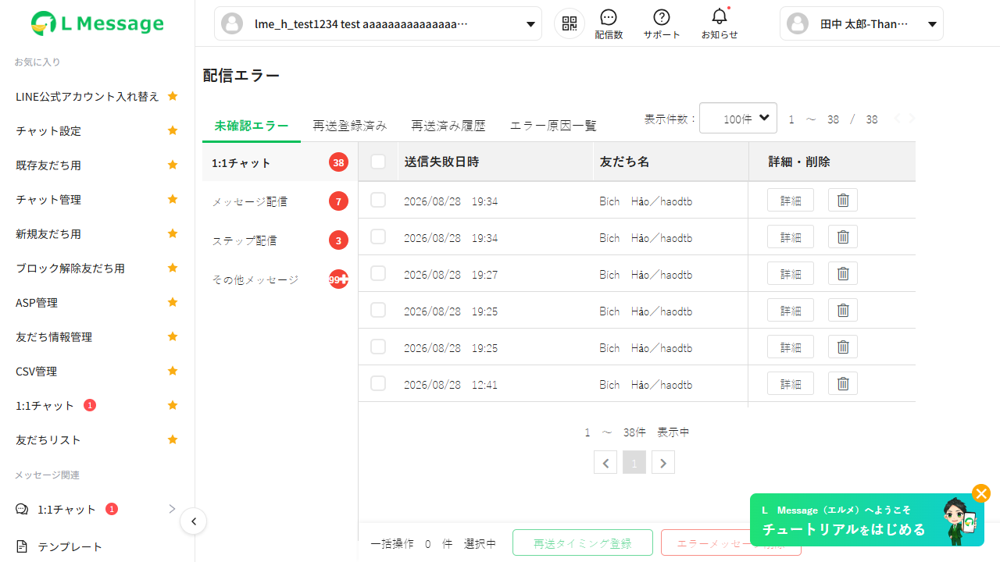
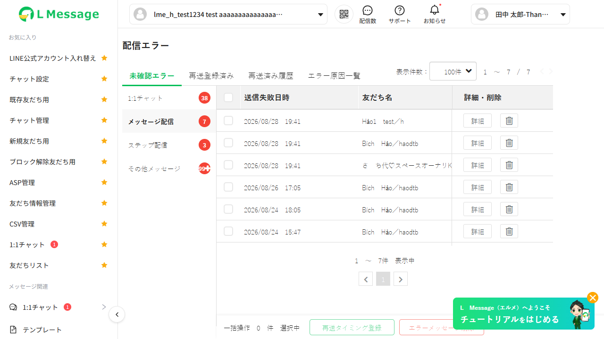
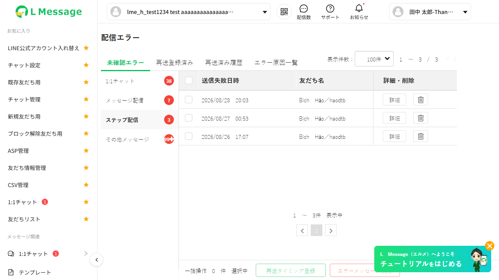
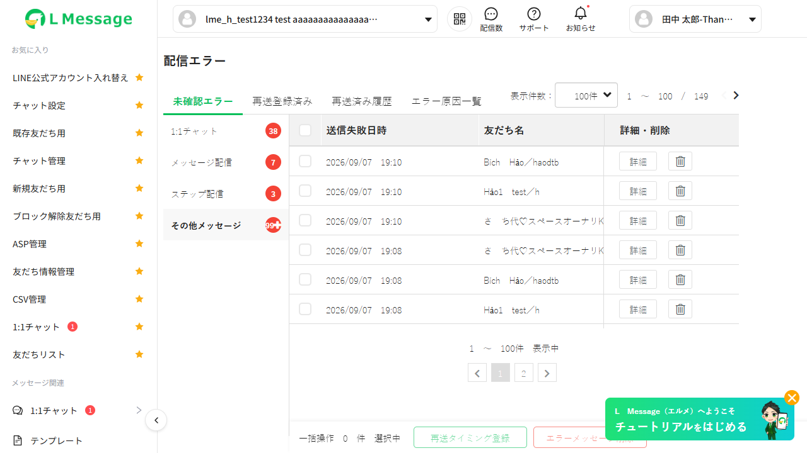
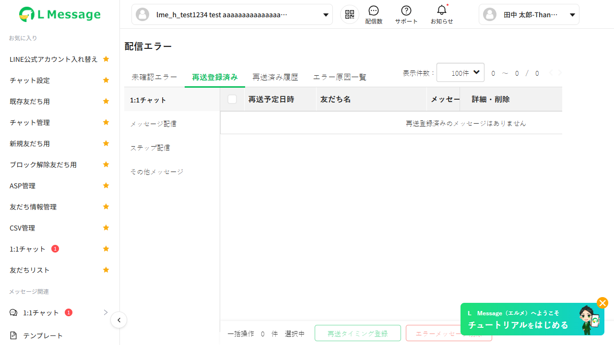
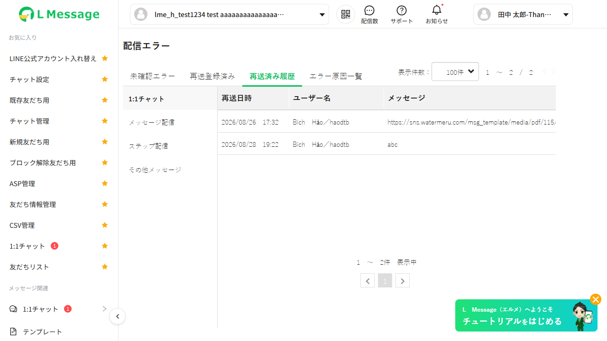
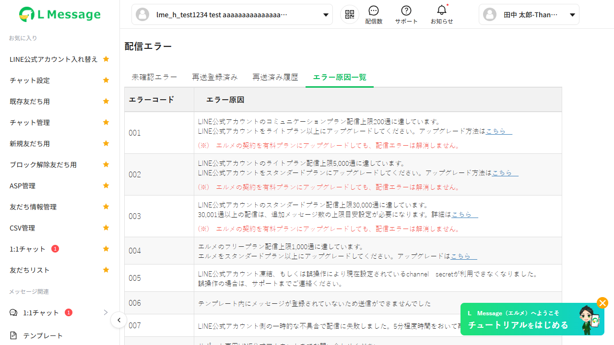
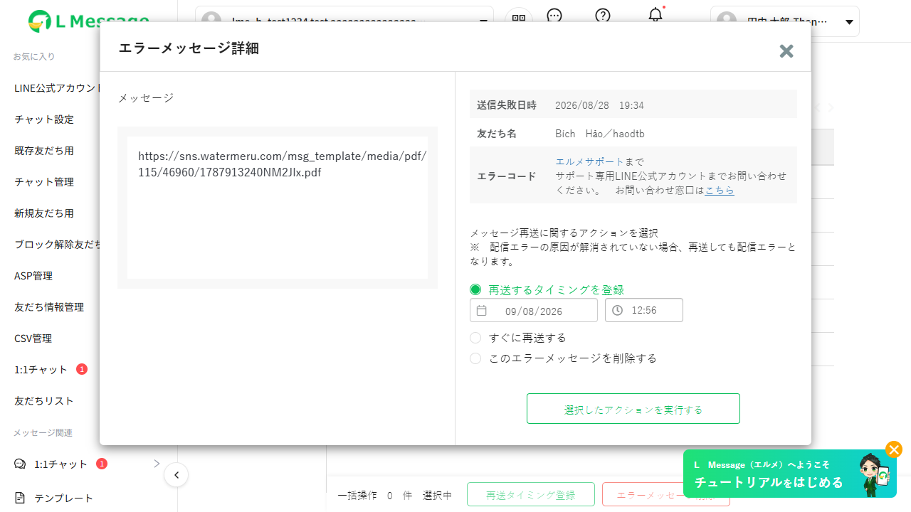
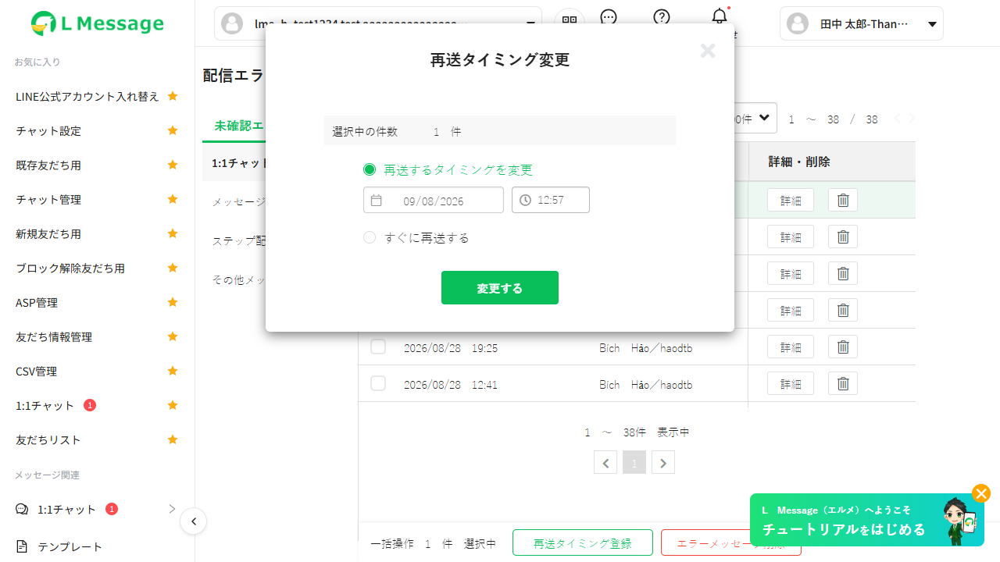
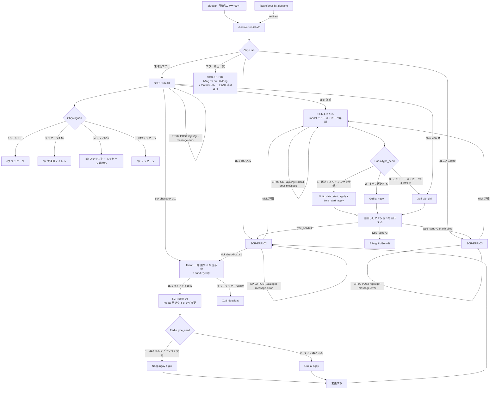

# UI Spec — FA-028 Lỗi phát hành 「配信エラー」

| Thuộc tính | Giá trị |
|-----------|---------|
| Mã tính năng | **FA-028** |
| Tên tiếng Nhật | 「配信エラー」 |
| Tên tiếng Việt | Lỗi phát hành / Quản lý tin nhắn gửi lỗi |
| Portal | Admin (LINE OA) |
| Nhóm menu | 「システム関連」 (Quản lý hệ thống) |
| URL chính | `/basic/error-list-v2` |
| URL legacy | `/basic/error-list` → redirect sang `/basic/error-list-v2` |
| Prefix mã màn hình | `SCR-ERR-` |
| Ngày quét live | 08/09/2026 |
| Môi trường quét | `https://form.watermeru.com` |

---

## 1. Tổng quan tính năng

「配信エラー」 là màn hình quản lý **các tin nhắn LINE đã gửi nhưng thất bại**. Tính năng cho phép Admin:

1. **Theo dõi** danh sách tin nhắn gửi lỗi, phân theo 4 trạng thái xử lý và 4 nguồn phát sinh — độ tin cậy **Cao**
2. **Đăng ký gửi lại theo lịch** (chọn ngày + giờ cụ thể) cho từng bản ghi hoặc hàng loạt — **Cao**
3. **Gửi lại ngay lập tức** cho từng bản ghi hoặc hàng loạt — **Cao**
4. **Xoá bản ghi lỗi** khỏi danh sách (từng dòng qua icon thùng rác, qua modal chi tiết, hoặc hàng loạt) — **Cao**
5. **Tra cứu nguyên nhân lỗi** qua bảng tra cứu tĩnh **8 dòng — 7 mã lỗi `001`–`007` + 1 dòng fallback 「上記以外の場合」** — kèm hướng dẫn khắc phục — **Cao**

Điểm nhận diện tính năng: badge 「送信エラー 99+」 ở sidebar (nhóm 「システム関連」) trỏ trực tiếp tới `/basic/error-list-v2` — **Cao** (quan sát tại `main-snapshot.yml` dòng 194–199).

### Ngữ cảnh nghiệp vụ
Lỗi phát hành xảy ra khi LINE Messaging API từ chối tin nhắn, hoặc khi nội dung gửi không hợp lệ. Bảng tra cứu 「エラー原因一覧」 chia nguyên nhân thành 4 nhóm ngữ nghĩa — **Cao**:

| Nhóm | Mã | Bản chất | Khắc phục |
|------|----|---------|----------|
| **Vượt hạn mức gói cước** | `001` `002` `003` `004` | Chạm trần số tin của gói LINE OA (001–003) hoặc gói L Message (004) | Nâng cấp gói; gửi lại chỉ có nghĩa sau khi đã nâng cấp hoặc sang chu kỳ mới |
| **Kết nối / tài khoản** | `005` | LINE OA bị đóng băng, hoặc channel secret hiện tại không còn dùng được | Khôi phục kết nối / liên hệ hỗ trợ; gửi lại vô nghĩa cho tới khi khắc phục |
| **Nội dung không hợp lệ** | `006` | Template không có tin nhắn nào được đăng ký | Bổ sung nội dung cho template rồi mới gửi lại |
| **Lỗi tạm thời phía LINE** | `007` | Sự cố nhất thời của LINE OA | **Chờ khoảng 5 phút rồi gửi lại** — đây là ca **duy nhất** mà chức năng gửi lại của FA-028 có khả năng thành công cao mà không cần can thiệp gì khác |
| **Ngoài tập trên** | 「上記以外の場合」 | Mã không thuộc `001`–`007` (gồm cả `NULL`/rỗng) | Liên hệ LINE OA hỗ trợ chuyên dụng của L Message |

Phân nhóm này giải thích trực tiếp cảnh báo trong modal chi tiết 「※ 配信エラーの原因が解消されていない場合、再送しても配信エラーとなります。」 — với nhóm hạn mức và nhóm kết nối, gửi lại sẽ tiếp tục lỗi nếu nguyên nhân gốc chưa được xử lý — **Cao**.

Trong dữ liệu mẫu quan sát được, đa số bản ghi mang mã **005** — trùng khớp với việc trang hiển thị modal cảnh báo 「エルメとLINE公式アカウントの接続が切断されています」 trên môi trường quét — **Trung bình** (suy luận từ tương quan dữ liệu). Riêng 38 bản ghi nguồn 「1:1チャット」 hiển thị 「エルメサポートまで」, tức mã lỗi của chúng **không thuộc tập `001`–`007`** nên rơi vào dòng fallback 「上記以外の場合」 — **Cao**.

---

## 2. Actors liên quan

| Actor | Vai trò trong tính năng | Mức tin cậy |
|-------|------------------------|-------------|
| **Admin (LINE OA)** | Xem danh sách lỗi, đăng ký gửi lại, gửi lại ngay, xoá bản ghi lỗi, tra cứu nguyên nhân | **Cao** — toàn bộ thao tác quét bằng tài khoản Admin |
| **Staff** | Truy cập cùng giao diện; khả năng bị giới hạn bởi custom role | **Thấp** — chưa quét bằng tài khoản Staff, chưa quan sát được điều kiện ẩn menu/nút |
| **LINE User (bạn bè)** | Đối tượng nhận tin nhắn; xuất hiện gián tiếp qua cột 「友だち名」/「ユーザー名」. Không có màn hình public nào thuộc tính năng này | **Cao** |
| **Hệ thống nền (background job)** | Thực thi việc gửi lại theo lịch đã đăng ký ở thời điểm 「再送予定日時」; tự động retry lỗi tạm thời; dò hạn mức LINE để gán mã `001`/`002`/`003` | **Cao** — đã xác định **3 task manager Spring Boot** (`SendingScheduleTask`, `ScheduleResendMessageErrorTask`, `HandleGetMessageError`) + service nền `SentMessageService`, cùng 1 queued job phía Laravel; xem `job/job-spec.md` §1.3 |

---

## 3. Cấu trúc chung của trang

Toàn bộ tính năng nằm trên **một URL duy nhất** `/basic/error-list-v2`; việc chuyển tab và đổi nguồn được xử lý bằng JavaScript + AJAX, **không đổi URL** — **Cao** (cả 7 file DOM snapshot đều ghi cùng một `url`).

```
┌──────────────────────────────────────────────────────────────────────────┐
│ 配信エラー  (tiêu đề trang)                                                │
├──────────────────────────────────────────────────────────────────────────┤
│ [未確認エラー][再送登録済み][再送済み履歴][エラー原因一覧]                    │ ← div.tab > div.item-tab
│                              表示件数：[100件▼]  1 〜 38 / 38  [◀][▶]     │
├──────────────┬───────────────────────────────────────────────────────────┤
│ 1:1チャット ⑱ │ [☐] 送信失敗日時 | 友だち名 | メッセージ | エラーコード | 詳細・削除│
│ メッセージ配信⑦│ [☐] このページに表示されていない全 38 件を合わせて選択        │
│ ステップ配信 ③ │ [☐] 2026/08/28 19:34 | Bích Hảo | abc | … | [詳細][🗑]     │
│ その他メッセージ│ [☐] …                                                     │
│         99+  │                                                            │
│              │                     1 〜 38件 表示中   [◀][1][▶]           │
│  ↑ div.item-menu (cột dọc bên trái bảng)                                  │
├──────────────┴───────────────────────────────────────────────────────────┤
│ 一括操作 0 件 選択中   [再送タイミング登録]  [エラーメッセージ削除]           │ ← thanh thao tác hàng loạt
└──────────────────────────────────────────────────────────────────────────┘
```

> Bộ lọc nguồn (`div.item-menu`) là **cột dọc nằm bên trái bảng dữ liệu**, không phải thanh ngang — **Cao** (xác nhận qua ảnh chụp `screenshots/tab1-unconfirmed.png`). Mỗi mục kèm **chip tròn nền đỏ** hiển thị số lượng; mục đang chọn có chữ đậm màu tối, các mục còn lại chữ xám nhạt.

### 3.1 Selector / class quan sát được — **Cao**

| Thành phần | Selector / class |
|-----------|------------------|
| Container tab chính | `div.tab > div.item-tab` |
| Tab đang chọn | thêm class `active-tab` |
| Container bộ lọc nguồn | `div.item-menu` |
| Nguồn đang chọn | thêm class `active-menu` |
| Checkbox dòng | `tbody label.c-checkbox > input[type=checkbox]`, `value` = ID bản ghi lỗi |
| Nút chi tiết | `button.btn.btn-sns-line.btn-detail`, nhãn 「詳細」 |
| Nút xoá dòng | `button.btn.btn-sns-line.btn-trash`, không có nhãn (chỉ icon thùng rác) |
| Nút hàng loạt — đăng ký lịch | `button.btn.btn-sns-line.btn-change-time-send`, nhãn 「再送タイミング登録」 |
| Nút hàng loạt — xoá | `button.btn.btn-sns-line.btn-delete-time-send`, nhãn 「エラーメッセージ削除」 |
| Modal chi tiết | `#modalPreviewBroadcast` |
| Modal đổi lịch hàng loạt | `#modalSettingScheduleAll` |
| Trường ẩn của modal chi tiết | `input[type=hidden]#modal-preview-broadcast-action` |

### 3.2 Bộ lọc nguồn — **Cao**

Chỉ hiển thị và áp dụng cho **3 tab đầu**; tab 「エラー原因一覧」 không có bộ lọc nguồn.

| Nguồn | Badge quan sát được | Diễn giải |
|-------|--------------------|-----------|
| 「1:1チャット」 | `38` | Tin nhắn gửi từ màn hình chat 1:1 (FA-001) |
| 「メッセージ配信」 | `7` | Tin nhắn gửi hàng loạt / broadcast (FA-008) |
| 「ステップ配信」 | `3` | Tin nhắn trong kịch bản step delivery (FA-009) |
| 「その他メッセージ」 | `99+` (tổng thực **149**) | Các nguồn còn lại (tự động trả lời, action, reminder…) — **Trung bình** cho phần diễn giải |

Badge hiển thị `99+` khi số lượng vượt 99; số thực nằm ở dòng 「このページに表示されていない全 149 件を合わせて選択」 — **Cao**.

### 3.3 Phân trang / hiển thị — **Cao**

| Thành phần | Chi tiết |
|-----------|---------|
| Select 「表示件数：」 | 3 lựa chọn `100件` / `200件` / `500件`; mặc định `100件` (`value="100"`) |
| Chỉ báo phía trên | 「1 〜 38 / 38」 (đang hiển thị / tổng) |
| Chỉ báo phía dưới | 「1 〜 38件 表示中」 |
| Điều hướng trên | 2 nút mũi tên trước / sau (icon, không nhãn) |
| Điều hướng dưới | `ul > li` gồm [◀] [số trang] [▶] |
| Chọn vượt trang | Dòng đầu bảng: checkbox + text 「このページに表示されていない全 N 件を合わせて選択」 |

### 3.4 Thanh thao tác hàng loạt — **Cao**

- Nhãn đếm: 「一括操作 N 件 選択中」 (N = số dòng đang chọn, mặc định `0`)
- Nút 「再送タイミング登録」 — `disabled` khi `N = 0`, bật khi `N ≥ 1`
- Nút 「エラーメッセージ削除」 — `disabled` khi `N = 0`, bật khi `N ≥ 1`
- Thanh này **không xuất hiện** ở tab 「再送済み履歴」 và 「エラー原因一覧」 — **Cao** (`tab3-resent-history.json` và `tab4-error-causes.json` không có 2 nút này trong mảng `buttons`)

---

## 4. Ma trận cột bảng theo (tab × nguồn)

Đây là đặc điểm quan trọng nhất của tính năng: **cấu trúc cột thay đổi theo tổ hợp tab và nguồn**. Quy tắc này áp dụng cho **cả 3 tab dữ liệu**, không riêng tab đầu — **Cao** (xác minh trên source: `table-unconfirm.blade.php:23, :27, :31`; `table-registered.blade.php:23, :27, :31` + body `:105, :111`; `table-sent.blade.php:14, :18, :22` + body `:72, :78`).

| # | Tab | Nguồn | Cột 1 | Cột 2 | Cột 3 | Cột 4 | Cột 5 | Cột 6 | Cột 7 |
|---|-----|-------|-------|-------|-------|-------|-------|-------|-------|
| 1 | 未確認エラー | 1:1チャット | ☐ checkbox | 送信失敗日時 | 友だち名 | メッセージ | エラーコード | 詳細・削除 | — |
| 2 | 未確認エラー | メッセージ配信 | ☐ checkbox | 送信失敗日時 | 友だち名 | **管理用タイトル** | エラーコード | 詳細・削除 | — |
| 3 | 未確認エラー | ステップ配信 | ☐ checkbox | 送信失敗日時 | 友だち名 | **ステップ名** | **メッセージ管理名** | エラーコード | 詳細・削除 |
| 4 | 未確認エラー | その他メッセージ | ☐ checkbox | 送信失敗日時 | 友だち名 | メッセージ | エラーコード | 詳細・削除 | — |
| 5 | 再送登録済み | 1:1チャット | ☐ checkbox | **再送予定日時** | 友だち名 | メッセージ | エラーコード | 詳細・削除 | — |
| 6 | 再送登録済み | メッセージ配信 | ☐ checkbox | **再送予定日時** | 友だち名 | **管理用タイトル** | エラーコード | 詳細・削除 | — |
| 7 | 再送登録済み | ステップ配信 | ☐ checkbox | **再送予定日時** | 友だち名 | **ステップ名** | **メッセージ管理名** | エラーコード | 詳細・削除 |
| 8 | 再送登録済み | その他メッセージ | ☐ checkbox | **再送予定日時** | 友だち名 | メッセージ | エラーコード | 詳細・削除 | — |
| 9 | 再送済み履歴 | 1:1チャット | **再送日時** | **ユーザー名** | メッセージ | 詳細 | — | — | — |
| 10 | 再送済み履歴 | メッセージ配信 | **再送日時** | **ユーザー名** | **管理用タイトル** | 詳細 | — | — | — |
| 11 | 再送済み履歴 | ステップ配信 | **再送日時** | **ユーザー名** | **ステップ名** | **メッセージ管理名** | 詳細 | — | — |
| 12 | 再送済み履歴 | その他メッセージ | **再送日時** | **ユーザー名** | メッセージ | 詳細 | — | — | — |
| 13 | エラー原因一覧 | (không có bộ lọc nguồn) | エラーコード | エラー原因 | — | — | — | — | — |

> **Phạm vi quan sát live**: phiên quét ngày 08/09/2026 chỉ trực tiếp thấy được các dòng **1–4** (tab 未確認エラー đủ 4 nguồn) và dòng **9** (tab 再送済み履歴, nguồn chat11/other). Dòng **5–8** không quan sát được vì tab 「再送登録済み」 rỗng; dòng **10–12** không quan sát được vì dữ liệu tab 「再送済み履歴」 quá ít. Các dòng này được bổ sung từ **đọc source Blade** (tin cậy **Cao**) — đối chiếu `db-mapping.md` §4.2 và §4.3.

### Nguồn dữ liệu của cặp cột step delivery — **Cao**

⚠ **Nhãn UI và tên biến đảo nhau**:

| Nhãn UI | Biến trong response | Cột DB | Đường join |
|---------|--------------------|--------|-----------|
| 「ステップ名」 | **`scen_name`** | `scenario.name` (`varchar(200) NOT NULL`) | 2 chặng: `parent_id → step_message.id → step_message.scenario_id → scenario.id` |
| 「メッセージ管理名」 | **`step_name`** | `step_message.name` (`varchar(255) DEFAULT NULL`) | 1 chặng qua cùng cột `parent_id` |

Nguồn: `MessageErrorController.php:320-326` (gán biến) đối chiếu `table-unconfirm.blade.php:27/:31` (header) và `:119/:124` (body).

### Khác biệt đáng chú ý
1. **Cột nội dung tin nhắn đổi tên theo nguồn — áp dụng cho cả 3 tab dữ liệu**: 「メッセージ」 (chat11/other) → 「管理用タイトル」 (broadcast) → cặp 「ステップ名」+「メッセージ管理名」 (step delivery). Nguồn step delivery luôn có **thêm 1 cột** so với 3 nguồn còn lại của cùng tab.
2. **Tab 再送済み履歴 là read-only**: không có checkbox, không có cột 「エラーコード」, cột thao tác chỉ còn 「詳細」 (`table-sent.blade.php:24, :87`) — mất chức năng xoá. Cột 「エラーコード」 không render dù `sending_schedule_setting.error_end_code` **có** dữ liệu.
3. **Tên cột người nhận đổi**: 「友だち名」 ở 2 tab đầu → 「ユーザー名」 ở tab 再送済み履歴 — **Cao**. Lý do đã xác định: 2 tab đầu join `line_user` qua `message_error.line_id`, còn tab 3 join qua `sending_schedule_setting.line_user_id` (`db-mapping.md` §4.3).
4. **Cột thời gian đổi ngữ nghĩa theo tab**: 「送信失敗日時」 (lúc gửi lỗi, từ `message_error`) → 「再送予定日時」 và 「再送日時」 — hai nhãn sau **dùng chung một cột** `sending_schedule_setting.send_time`, chỉ khác ngữ cảnh giá trị `is_sent` (`0` = dự kiến, `1` = đã gửi).
5. **Tab 再送済み履歴 đảo hẳn nguồn dữ liệu**: đọc thẳng bảng `sending_schedule_setting`, **không đụng tới** `message_error` — `MessageErrorController.php:61-155`.

---

## 5. Bảng tra cứu nguyên nhân lỗi — 8 dòng (nguyên văn tiếng Nhật)

Nguồn chuẩn: `raw/features/error-message/dom/error-codes-full.json` — **Cao**.
Bảng gồm **8 dòng**: 7 mã lỗi `001`–`007` + 1 dòng fallback 「上記以外の場合」 (khớp `rowCount = 8` ghi trong `tab4-error-causes.json`).

**⚠ Hai nguồn nội dung khác nhau — đừng gộp** (**Cao**, xác minh trên source):

| Phần nội dung | Nguồn | Điều kiện hiển thị |
|--------------|-------|-------------------|
| Nội dung 「エラー原因」 (mô tả + hướng dẫn + link 「こちら」) | Config Laravel `config/sns-line.php:1099-1132` — mảng `table_error_code`, đúng 8 phần tử. Đẩy sang client thành object JS `tableErrorCode` | Luôn hiển thị theo mã tương ứng |
| Ghi chú đỏ 「(※) エルメの契約を有料プランにアップグレードしても、配信エラーは解消しません。」 | **Hard-code trong Blade**, KHÔNG nằm trong config | `v-show="['001','002','003'].includes(...)"` — chỉ hiện với 3 mã `001`/`002`/`003` (`outline.blade.php:50`) |

Bảng dưới là **nguyên văn trích từ DOM đã render**, nên 3 dòng `001`/`002`/`003` đã bao gồm sẵn đoạn (※) ghép từ Blade — phần đó **không** có trong config. Các dòng `004`–`007` và dòng fallback là nguyên văn config, không có (※).

| エラーコード | エラー原因 (nguyên văn) |
|------------|----------------------|
| **001** | LINE公式アカウントのコミュニケーションプラン配信上限200通に達しています。 LINE公式アカウントをライトプラン以上にアップグレードしてください。アップグレード方法はこちら (※) エルメの契約を有料プランにアップグレードしても、配信エラーは解消しません。 |
| **002** | LINE公式アカウントのライトプラン配信上限5,000通に達しています。 LINE公式アカウントをスタンダードプランにアップグレードしてください。アップグレード方法はこちら (※) エルメの契約を有料プランにアップグレードしても、配信エラーは解消しません。 |
| **003** | LINE公式アカウントのスタンダードプラン配信上限30,000通に達しています。 30,001通以上の配信は、追加メッセージ数の上限目安設定が必要になります。詳細はこちら (※) エルメの契約を有料プランにアップグレードしても、配信エラーは解消しません。 |
| **004** | エルメのフリープラン配信上限1,000通に達しています。 エルメをスタンダードプラン以上にアップグレードしてください。アップグレードはこちら |
| **005** | LINE公式アカウント凍結、もしくは誤操作により現在設定されているchannel secretが利用できなくなりました。 誤操作の場合は、サポートまでご連絡ください。 |
| **006** | テンプレート内にメッセージが登録されていないため送信ができませんでした |
| **007** | LINE公式アカウント側の一時的な不具合で配信に失敗しました。5分程度時間をおいて再度配信操作を行なって下さい。 |
| **「上記以外の場合」** | サポート専用LINE公式アカウントまでお問い合わせください。 お問い合わせ窓口はこちら |

### Diễn giải tóm tắt (tiếng Việt) + phân loại ngữ nghĩa

| Mã | Nhóm | Ý nghĩa | Gửi lại có ích không? |
|----|------|--------|----------------------|
| 001 | Vượt hạn mức gói cước | Đã chạm trần 200 tin của gói Communication (LINE OA) → cần nâng lên gói Light trở lên | Chỉ sau khi nâng gói / sang chu kỳ mới |
| 002 | Vượt hạn mức gói cước | Đã chạm trần 5,000 tin của gói Light (LINE OA) → cần nâng lên gói Standard | Chỉ sau khi nâng gói / sang chu kỳ mới |
| 003 | Vượt hạn mức gói cước | Đã chạm trần 30,000 tin của gói Standard (LINE OA) → cần cấu hình hạn mức tin nhắn bổ sung | Chỉ sau khi cấu hình hạn mức bổ sung |
| 004 | Vượt hạn mức gói cước | Đã chạm trần 1,000 tin của gói **Free của L Message** → cần nâng gói L Message lên Standard trở lên | Chỉ sau khi nâng gói L Message |
| 005 | Kết nối / tài khoản | Tài khoản LINE OA bị đóng băng, hoặc channel secret hiện tại không còn dùng được | Chỉ sau khi khôi phục kết nối |
| 006 | Nội dung không hợp lệ | Template không có tin nhắn nào được đăng ký nên không gửi được | Chỉ sau khi bổ sung nội dung cho template |
| 007 | Lỗi tạm thời phía LINE | Sự cố nhất thời của LINE OA; hướng dẫn **chờ ~5 phút rồi thao tác gửi lại** | **Có** — ca duy nhất gửi lại có khả năng thành công cao mà không cần can thiệp khác |
| 「上記以外の場合」 | Fallback | Mã không thuộc `001`–`007` → hướng dẫn liên hệ LINE OA hỗ trợ chuyên dụng | Không xác định |

> Mã **007** là mã liên quan trực tiếp nhất tới chức năng gửi lại của FA-028: hướng dẫn của chính hệ thống là chờ ~5 phút rồi gửi lại, đúng với hai lựa chọn 「再送するタイミングを登録」 (hẹn giờ) và 「すぐに再送する」 (gửi ngay) trong modal — **Trung bình** (suy luận từ nội dung hướng dẫn).

### Dòng fallback 「上記以外の場合」 — **Cao**

Dòng cuối bảng **không phải một mã lỗi**, mà là **dòng bắt mọi mã ngoài tập `001`–`007`** (gồm cả `NULL` / rỗng / giá trị lạ). Khi bản ghi rơi vào trường hợp này:

- Cột 「エラーコード」 ở bảng danh sách render: link 「エルメサポート」 (→ `https://tayori.com/form/dac81e909fb6b1d0dd7e53928c18b7fc5a2f8fc0`) + text 「まで」 ⇒ 「エルメサポートまで」
- Modal chi tiết SCR-ERR-05 hiển thị thêm nguyên văn 「サポート専用LINE公式アカウントまでお問い合わせください。 お問い合わせ窓口は こちら」

**Đây chính là lý do toàn bộ 38 bản ghi nguồn 「1:1チャット」 trong mẫu hiển thị 「エルメサポートまで」** — mã lỗi của chúng nằm ngoài tập `001`–`007`.

---

## 6. Chi tiết từng màn hình

### SCR-ERR-01 — Tab 「未確認エラー」 (Lỗi chưa xác nhận)






> ℹ Ảnh chụp lại ngày 08/09/2026 sau khi ẩn modal cảnh báo hệ thống 「エルメとLINE公式アカウントの接続が切断されています」 (ẩn bằng CSS phía client — không gọi API, không đổi dữ liệu). Bảng dữ liệu nay hiển thị rõ. Vẫn còn widget tutorial 「チュートリアルをはじめる」 ở góc dưới phải che một phần nhỏ. Ở bề rộng viewport 1280px, bảng bị cắt ngang nên các cột bên phải (「メッセージ」/「エラーコード」) không lọt hết vào ảnh — phần này lấy từ DOM snapshot JSON và accessibility tree.

**Layout**: Tab mặc định khi mở trang. Bảng liệt kê các bản ghi lỗi **chưa được xử lý** — chưa đăng ký gửi lại, chưa bị xoá.

**Tabs / Sub-navigation**: 4 tab chính (mục 3) + 4 nguồn (mục 3.2).

**Data Table** — cột theo nguồn, xem ma trận mục 4.

Dữ liệu mẫu — nguồn 「1:1チャット」 (38 bản ghi):

| 送信失敗日時 | 友だち名 | メッセージ | エラーコード | 詳細・削除 |
|-------------|---------|-----------|-------------|-----------|
| 2026/08/28 19:34 | Bích Hảo／haodtb | `https://sns.watermeru.com/msg_template/media/pdf/115/46960/1787913240NM2Jlx.pdf` | エルメサポートまで | 詳細 / 🗑 |
| 2026/08/28 19:34 | Bích Hảo／haodtb | abc | エルメサポートまで | 詳細 / 🗑 |
| 2026/08/28 19:27 | Bích Hảo／haodtb | パネル・ボタン | エルメサポートまで | 詳細 / 🗑 |
| 2026/08/28 19:25 | Bích Hảo／haodtb | 音声 | エルメサポートまで | 詳細 / 🗑 |

Dữ liệu mẫu — nguồn 「メッセージ配信」 (7 bản ghi):

| 送信失敗日時 | 友だち名 | 管理用タイトル | エラーコード | 詳細・削除 |
|-------------|---------|---------------|-------------|-----------|
| 2026/08/28 19:41 | Hảo1 test／h | bdcast1 | 005 | 詳細 / 🗑 |
| 2026/08/28 19:41 | Bích Hảo／haodtb | bdcast1 | 005 | 詳細 / 🗑 |
| 2026/08/28 19:41 | さ ち代♡スペースオーナリK/🏠 | bdcast1 | 005 | 詳細 / 🗑 |
| 2026/08/26 17:05 | Bích Hảo／haodtb | bdc1 | 005 | 詳細 / 🗑 |

Dữ liệu mẫu — nguồn 「ステップ配信」 (3 bản ghi):

| 送信失敗日時 | 友だち名 | ステップ名 | メッセージ管理名 | エラーコード | 詳細・削除 |
|-------------|---------|-----------|-----------------|-------------|-----------|
| 2026/08/28 20:03 | Bích Hảo／haodtb | scenario1 | *(rỗng)* | 005 | 詳細 / 🗑 |
| 2026/08/27 00:53 | Bích Hảo／haodtb | scenario05 | *(rỗng)* | 005 | 詳細 / 🗑 |
| 2026/08/26 17:07 | Bích Hảo／haodtb | scenario05 | *(rỗng)* | 005 | 詳細 / 🗑 |

Dữ liệu mẫu — nguồn 「その他メッセージ」 (149 bản ghi, hiển thị 100/trang):

| 送信失敗日時 | 友だち名 | メッセージ | エラーコード | 詳細・削除 |
|-------------|---------|-----------|-------------|-----------|
| 2026/09/07 19:10 | Bích Hảo／haodtb | hii | 005 | 詳細 / 🗑 |
| 2026/09/07 19:10 | Hảo1 test／h | hii | 005 | 詳細 / 🗑 |
| 2026/09/07 19:10 | さ ち代♡スペースオーナリK/🏠 | hii | 005 | 詳細 / 🗑 |
| 2026/09/07 19:08 | さ ち代♡スペースオーナリK/🏠 | hi ê | 005 | 詳細 / 🗑 |

**Action Buttons**

| Nhãn JP | Kiểu | Vị trí | Hành vi | Điều kiện disabled |
|---------|------|--------|---------|-------------------|
| 「詳細」 | Nút phụ (`btn-detail`) | Cột cuối mỗi dòng | Mở modal `#modalPreviewBroadcast` (SCR-ERR-05); gọi **EP-03** `GET /ajax/get-detail-error-message` | Không bao giờ disabled |
| *(icon 🗑)* | Nút icon (`btn-trash`) | Cột cuối mỗi dòng, cạnh 「詳細」 | Xoá bản ghi lỗi của dòng đó — **Trung bình** (chưa click để tránh thay đổi dữ liệu) | Không bao giờ disabled |
| 「再送タイミング登録」 | Nút chính (`btn-change-time-send`) | Thanh hàng loạt cuối trang | Mở modal `#modalSettingScheduleAll` (SCR-ERR-06) | `disabled` khi chưa chọn dòng nào |
| 「エラーメッセージ削除」 | Nút chính (`btn-delete-time-send`) | Thanh hàng loạt cuối trang | Hiện hộp xác nhận 「N件の再送登録済みメッセージを削除しますがよろしいですか？」 (`index_v2.js:276-284`), rồi gọi **EP-06** `POST /ajax/delete-message-error` — **Cao** | `disabled` khi chưa chọn dòng nào |

**Form Fields**

| Label JP | Input type | name | Bắt buộc | Mặc định | Ghi chú |
|----------|-----------|------|---------|---------|--------|
| *(không nhãn)* | `checkbox` | *(chưa xác định)* | Không | Bỏ chọn | Checkbox trên `thead` = chọn tất cả dòng trong trang |
| *(không nhãn)* | `checkbox` | *(chưa xác định)* | Không | Bỏ chọn | Checkbox mỗi dòng, `value` = ID bản ghi lỗi (mẫu: `48233647`, `48233646`) |
| 「このページに表示されていない全 N 件を合わせて選択」 | `checkbox` | *(chưa xác định)* | Không | Bỏ chọn | Chọn toàn bộ vượt phạm vi trang hiện tại |
| 「表示件数：」 | `select` | *(chưa xác định)* | Không | `100` | `100件` / `200件` / `500件` |

**Observations**
- `rowCount` trong DOM snapshot bao gồm cả dòng header "chọn tất cả" và dòng empty state (ví dụ nguồn 1:1チャット: `rowCount = 40` cho 38 bản ghi thực).
- Empty state: 「未確認の配信エラーはありません」 — **Cao** (thấy trong `src-step.json`, nằm sẵn trong DOM và ẩn/hiện tuỳ dữ liệu).
- Cột 「メッセージ」 hiển thị **nội dung thô** của tin nhắn: text ngắn (`abc`, `hii`), URL file media, hoặc tên loại nội dung (`パネル・ボタン`, `音声`) — **Cao**.
- Cột 「メッセージ管理名」 của nguồn ステップ配信 rỗng ở cả 3 bản ghi mẫu — **Cao**. **Nguyên nhân đã xác định**: cột nguồn là `step_message.name varchar(255) DEFAULT NULL` — Admin không bắt buộc đặt tên quản lý cho message trong kịch bản. Ngược lại 「ステップ名」 luôn có giá trị vì `scenario.name` là `varchar(200) NOT NULL` (`db-mapping.md` §3.4) — **Cao**.
- ⚠ **Nhãn và tên biến đảo nhau**: 「ステップ名」 render biến `scen_name` (= `scenario.name`), còn 「メッセージ管理名」 render biến `step_name` (= `step_message.name`) — `MessageErrorController.php:320-326` đối chiếu `table-unconfirm.blade.php:27/:31` (header) và `:119/:124` (body) — **Cao**.

---

### SCR-ERR-02 — Tab 「再送登録済み」 (Đã đăng ký gửi lại)



**Layout**: Cấu trúc giống SCR-ERR-01, khác ở cột thời gian. Bộ cột **cũng đổi theo nguồn** giống SCR-ERR-01.

**Data Table** — cột theo nguồn (dòng 5–8 của ma trận §4):

| Cột | Nguồn 1:1チャット / その他メッセージ | Nguồn メッセージ配信 | Nguồn ステップ配信 |
|-----|-----------------------------------|--------------------|-------------------|
| 1 | ☐ checkbox | ☐ checkbox | ☐ checkbox |
| 2 | 「再送予定日時」 | 「再送予定日時」 | 「再送予定日時」 |
| 3 | 「友だち名」 | 「友だち名」 | 「友だち名」 |
| 4 | 「メッセージ」 | **「管理用タイトル」** | **「ステップ名」** |
| 5 | 「エラーコード」 | 「エラーコード」 | **「メッセージ管理名」** |
| 6 | 「詳細・削除」 | 「詳細・削除」 | 「エラーコード」 |
| 7 | — | — | 「詳細・削除」 |

Nguồn xác minh: `table-registered.blade.php:23, :27, :31` (header) và `:105, :111` (body) — **Cao**.

Kiểu dữ liệu: 「再送予定日時」 = datetime hiển thị `YYYY/MM/DD HH:mm`, lấy từ `sending_schedule_setting.send_time` (epoch millisecond) qua `moment(...).format(...)` — **Cao** (`db-mapping.md` §4.2), sửa lại mức **Trung bình** ghi trước đây.

**Trạng thái quan sát được**: **rỗng** — bảng chỉ có 2 dòng cấu trúc:
- Dòng chọn vượt trang: 「このページに表示されていない全 0 件を合わせて選択」
- Empty state: 「再送登録済みのメッセージはありません」

**Action Buttons**: 「再送タイミング登録」 và 「エラーメッセージ削除」 — cả 2 `disabled` (do 0 dòng được chọn). Không có nút 「詳細」/🗑 nào **hiển thị** vì bảng rỗng, nhưng cả 2 **đều tồn tại** trong template.

**Observations**
- Bảng rỗng khi quét live — **nguyên nhân đã xác định**: điều kiện lọc là `sending_schedule_setting.is_sent = 0 AND send_type = 1`, trong khi **2.431/2.431** bản ghi trong dump đều có `is_sent = 1`. Trạng thái `is_sent = 0` chỉ tồn tại thoáng qua vài phút trước khi Spring Boot xử lý (`db-mapping.md` §4.2) — **Cao**.
- Nút 🗑 **có tồn tại** trên tab này — `table-registered.blade.php:125` — **Cao** (trước đây ghi "chưa xác nhận"). Ngữ nghĩa **khác** SCR-ERR-01: ở đây nút = **huỷ đăng ký gửi lại** (xoá row `sending_schedule_setting`, reset `message_error.sending_schedule_id = NULL`, `is_confirmed = 0`), **không** xoá bản ghi lỗi (`db-mapping.md` §4.2).
- Checkbox ở tab này **không** kiểm tra `status` retry nên luôn hiển thị — **Cao**.
- Dòng 「…全 N 件を合わせて選択」 dùng `total_record_all`, khác SCR-ERR-01 (dùng `total_record_all_not_retry`) — **Cao**.
- Select 「表示件数：」 vẫn hiển thị với mặc định `100件` — **Cao**.
- Cột 「メッセージ管理名」 (nguồn ステップ配信) chưa quan sát được giá trị thật vì bảng rỗng.

---

### SCR-ERR-03 — Tab 「再送済み履歴」 (Lịch sử đã gửi lại)



**Layout**: Bảng **chỉ đọc** — không có checkbox, không có thanh thao tác hàng loạt, không có nút xoá. Bộ cột **vẫn đổi theo nguồn**.

**Data Table** — cột theo nguồn (dòng 9–12 của ma trận §4):

| Cột | Nguồn 1:1チャット / その他メッセージ | Nguồn メッセージ配信 | Nguồn ステップ配信 |
|-----|-----------------------------------|--------------------|-------------------|
| 1 | 「再送日時」 | 「再送日時」 | 「再送日時」 |
| 2 | 「ユーザー名」 | 「ユーザー名」 | 「ユーザー名」 |
| 3 | 「メッセージ」 | **「管理用タイトル」** | **「ステップ名」** |
| 4 | 「詳細」 | 「詳細」 | **「メッセージ管理名」** |
| 5 | — | — | 「詳細」 |

Nguồn xác minh: `table-sent.blade.php:14, :18, :22` (header) và `:72, :78` (body) — **Cao**.

Dữ liệu mẫu quan sát được (chỉ nguồn chat11/other):

| 再送日時 | ユーザー名 | メッセージ | 詳細 |
|---------|-----------|-----------|------|
| 2026/08/26 17:32 | Bích Hảo／haodtb | `https://sns.watermeru.com/msg_template/media/pdf/115/46960/1787728525oE7otl.pdf` | 詳細 |
| 2026/08/28 19:22 | Bích Hảo／haodtb | abc | 詳細 |

> Phiên quét live chỉ thấy nguồn chat11/other vì dữ liệu tab này quá ít; 3 biến thể cột còn lại xác minh từ source Blade.

**Action Buttons**

| Nhãn JP | Kiểu | Vị trí | Hành vi | Điều kiện disabled |
|---------|------|--------|---------|-------------------|
| 「詳細」 | Nút phụ (`btn-detail`) | Cột cuối mỗi dòng | Mở modal chi tiết (SCR-ERR-05) qua **EP-03**. ⚠ Tham số `message_error_id` ở tab này mang **`sending_schedule_setting.id`**, không phải `message_error.id` (`db-mapping.md` §4.3) | Không bao giờ disabled |

**Observations**
- **Tab này đảo hẳn nguồn dữ liệu**: đọc thẳng `sending_schedule_setting WHERE is_sent = 1`, **không đụng tới** `message_error` — `MessageErrorController.php:61-155` — **Cao**.
- **Không có cột 「エラーコード」** — **Cao**. Lý do không phải "mã lỗi hết ý nghĩa": cột `sending_schedule_setting.error_end_code` **có** dữ liệu nhưng template đơn giản là không render nó (`db-mapping.md` §4.3).
- Tên cột người nhận là 「ユーザー名」 chứ không phải 「友だち名」 — **Cao**. **Nguyên nhân đã xác định**: tab này join `line_user` qua `sending_schedule_setting.line_user_id`, khác 2 tab đầu (join qua `message_error.line_id`).
- Dữ liệu mẫu **không sắp xếp theo thời gian** (26/08 đứng trước 28/08) — **nguyên nhân đã xác định**: query có `orderBy('send_time','asc')` nhưng bị `orderByDesc('id')` ghi đè, nên thực tế sắp theo **thứ tự đăng ký gửi lại** (`id DESC`) — `MessageErrorController.php:84` vs `:87` — **Cao**.
- Badge số lượng của 4 nguồn ở tab này đều hard-code `0` — **Cao** (`db-mapping.md` §4.3).
- Empty state: 「再送済み履歴のメッセージはありません」 — **Cao**.
- Thanh thao tác hàng loạt vắng mặt hoàn toàn — **Cao** (`tab3-resent-history.json` không chứa `btn-change-time-send` / `btn-delete-time-send`).
- Select 「表示件数：」 vẫn hiển thị — **Cao**.

---

### SCR-ERR-04 — Tab 「エラー原因一覧」 (Danh sách nguyên nhân lỗi)



> ℹ Ảnh chụp lại sau khi ẩn modal cảnh báo hệ thống — bảng nay đọc được rõ. Widget tutorial 「チュートリアルをはじめる」 ở góc dưới phải che một phần dòng `007` và dòng 「上記以外の場合」; hai dòng này lấy từ `error-codes-full.json`.

**Layout**: Bảng tra cứu **tĩnh**, chỉ đọc. Không có bộ lọc nguồn, không có checkbox, không có nút thao tác, không có thanh hàng loạt, không có phân trang thực. Trên ảnh chụp, hàng tab của màn hình này **không hiển thị** select 「表示件数：」 lẫn chỉ báo 「1 〜 N / M」 — dù phần tử `select` vẫn tồn tại trong DOM (`tab4-error-causes.json` liệt kê nó với 3 option `100件`/`200件`/`500件`) ⇒ nhiều khả năng bị ẩn bằng CSS chứ không bị gỡ khỏi DOM — **Trung bình**.

**Data Table** — 2 cột: 「エラーコード」 | 「エラー原因」, **8 dòng dữ liệu** (khớp `rowCount = 8` trong `tab4-error-causes.json`): 7 mã `001`–`007` + 1 dòng fallback 「上記以外の場合」.

Nội dung nguyên văn đầy đủ 8 dòng: xem **mục 5** ở trên.

**Observations**
- Nội dung ô 「エラー原因」 của mã `001`–`004` gồm 2 phần **đến từ config** `config/sns-line.php:1099-1132`: (1) mô tả nguyên nhân, (2) hướng dẫn khắc phục + link 「こちら」 (nhãn đầy đủ 「アップグレード方法はこちら」/「詳細はこちら」/「アップグレードはこちら」) — **Cao**.
- Ghi chú màu đỏ 「(※) エルメの契約を有料プランにアップグレードしても、配信エラーは解消しません。」 là phần **thứ ba, nguồn khác**: **hard-code trong Blade**, không nằm trong config. Điều kiện hiện: `v-show="['001','002','003'].includes(...)"` ⇒ **chỉ 3 mã `001`/`002`/`003`** — `outline.blade.php:50` — **Cao**.
- Vì vậy `004` **không có** (※) (đây là lỗi hạn mức của chính L Message, nâng gói L Message *có* tác dụng), `005`/`006`/`007` cũng không — **Cao**.
- Mã `005` có 2 dòng mô tả, không có link. Mã `006` chỉ 1 dòng ngắn, không có link. Mã `007` 1 dòng, không có link — **Cao**.
- Dòng cuối 「上記以外の場合」 có link 「こちら」 trỏ tới form hỗ trợ Tayori — **Cao**.
- Text hướng dẫn có link được gạch chân; ghi chú (※) và các cụm nhấn mạnh hiển thị màu đỏ — **Cao**.

---

### SCR-ERR-05 — Modal 「エラーメッセージ詳細」 (Chi tiết tin nhắn lỗi)



| Thuộc tính | Giá trị |
|-----------|--------|
| ID modal | `#modalPreviewBroadcast` |
| Mở từ | Nút 「詳細」 (`btn-detail`) trên bất kỳ dòng nào của SCR-ERR-01 / 02 / 03 |
| API | **EP-03** `GET /ajax/get-detail-error-message` |

**Layout** — 2 cột:

- **Cột trái** — nhãn 「メッセージ」 + khung viền hiển thị nội dung tin nhắn thô (mẫu: URL file PDF).
- **Cột phải** — 3 khối xếp dọc:
  1. **Bảng thông tin** (nhãn / giá trị, nền xen kẽ)
  2. **Khối chọn hành động** 「メッセージ再送に関するアクションを選択」
  3. **Nút thực thi** 「選択したアクションを実行する」

**Bảng thông tin** (quan sát được ở ngữ cảnh tab 未確認エラー + nguồn 1:1チャット):

| Nhãn JP | Giá trị mẫu | Mức tin cậy |
|---------|------------|-------------|
| 「送信失敗日時」 | `2026/08/28 19:34` | **Cao** |
| 「友だち名」 | `Bích Hảo／haodtb` | **Cao** |
| 「エラーコード」 | 「エルメサポートまで」 + 「サポート専用LINE公式アカウントまでお問い合わせください。 お問い合わせ窓口は こちら」 | **Cao** |
| 「再送日時」 | *(chưa quan sát được)* | **Thấp** — dự kiến chỉ xuất hiện khi mở từ tab 再送済み履歴 / 再送登録済み |

Link 「エルメサポート」 và 「こちら」 → `https://tayori.com/form/dac81e909fb6b1d0dd7e53928c18b7fc5a2f8fc0` — **Cao**.

Giá trị 「エルメサポートまで」 + hướng dẫn kèm theo chính là **dòng fallback 「上記以外の場合」** của bảng tra cứu (mục 5) — **Cao**. Với bản ghi có mã lỗi thuộc `001`–`007`, khối này hiển thị **nội dung hướng dẫn tương ứng từ bảng tra cứu**, riêng `001`–`003` kèm thêm ghi chú 「(※) エルメの契約を有料プランにアップグレードしても、配信エラーは解消しません。」 — **Trung bình** (suy từ cùng nguồn config `tableErrorCode`; ảnh chụp chỉ có ca fallback).

**Khối chọn hành động**

- Tiêu đề: 「メッセージ再送に関するアクションを選択」
- Cảnh báo: 「※ 配信エラーの原因が解消されていない場合、再送しても配信エラーとなります。」
  (Nếu nguyên nhân lỗi chưa được khắc phục, gửi lại vẫn sẽ lỗi.)

**Form Fields** — **Cao**

| Label JP | Input type | name | id | value | Bắt buộc | Mặc định |
|----------|-----------|------|----|----|---------|---------|
| 「再送するタイミングを登録」 | `radio` | `type_send` | `type_1` | `1` | Có (1 trong 3) | ✔ checked |
| 「すぐに再送する」 | `radio` | `type_send` | `type_2` | `2` | Có (1 trong 3) | — |
| 「このエラーメッセージを削除する」 | `radio` | `type_send` | `type_3` | `3` | Có (1 trong 3) | — |
| *(ngày gửi lại)* | `date` | `date_start_apply` | — | — | Có khi `type_send = 1` | **Ngày hiện tại** (mẫu `09/08/2026`) |
| *(giờ gửi lại)* | `text` | `time_start_apply` | — | — | Có khi `type_send = 1` | **Giờ hiện tại**, định dạng `HH:mm` (mẫu `11:26`) |
| *(ẩn)* | `hidden` | *(chưa xác định)* | `modal-preview-broadcast-action` | — | — | — |

**Hành vi hiển thị có điều kiện** — **Cao**: cặp ô ngày + giờ chỉ hiện khi radio `value=1` được chọn; chọn `value=2` hoặc `value=3` → ẩn.

**Action Buttons**

| Nhãn JP | Kiểu | Vị trí | Hành vi |
|---------|------|--------|--------|
| 「選択したアクションを実行する」 | Nút chính | Đáy cột phải | Thực thi hành động tương ứng radio đang chọn: đăng ký lịch (1) / gửi lại ngay (2) / xoá bản ghi (3) — **Trung bình** (chưa click) |
| ✕ | Nút icon | Góc trên phải | Đóng modal |

---

### SCR-ERR-06 — Modal 「再送タイミング変更」 (Đổi thời điểm gửi lại — hàng loạt)



| Thuộc tính | Giá trị |
|-----------|--------|
| ID modal | `#modalSettingScheduleAll` |
| Mở từ | Nút 「再送タイミング登録」 (`btn-change-time-send`) ở thanh thao tác hàng loạt |

**Layout**: Modal hẹp, canh giữa, xếp dọc: tiêu đề → ô hiển thị số lượng → nhóm radio → nút thực thi.

**Form Fields** — **Cao**

| Label JP | Input type | name | value | Bắt buộc | Mặc định |
|----------|-----------|------|-------|---------|---------|
| 「選択中の件数 N 件」 | *(hiển thị, không nhập)* | — | — | — | N = số dòng đang chọn (mẫu `1`) |
| 「再送するタイミングを変更」 | `radio` | `type_send` | `1` | Có (1 trong 2) | ✔ checked |
| 「すぐに再送する」 | `radio` | `type_send` | `2` | Có (1 trong 2) | — |
| *(ngày gửi lại)* | `date` | `date_start_apply` | — | Có khi `type_send = 1` | Ngày hiện tại (mẫu `09/08/2026`) |
| *(giờ gửi lại)* | `text` | `time_start_apply` | — | Có khi `type_send = 1` | Giờ hiện tại `HH:mm` (mẫu `11:27`) |

**Khác biệt so với SCR-ERR-05** — **Cao**:
- Chỉ **2** lựa chọn radio (không có 「このエラーメッセージを削除する」) — xoá hàng loạt đi qua nút riêng 「エラーメッセージ削除」.
- Nhãn radio đầu là 「再送するタイミングを**変更**」 (thay đổi) thay vì 「…を**登録**」 (đăng ký).
- Không có cột trái hiển thị nội dung tin nhắn.

**Action Buttons**

| Nhãn JP | Kiểu | Vị trí | Hành vi |
|---------|------|--------|--------|
| 「変更する」 | Nút chính (nền xanh lá) | Đáy modal, canh giữa | Áp dụng lịch gửi lại cho toàn bộ N bản ghi đang chọn — **Trung bình** (chưa click) |
| ✕ | Nút icon | Góc trên phải | Đóng modal |

---

## 7. API

> **Mã EP thống nhất theo `web/api-spec.md` §1.1** — đó là nguồn chuẩn vì đọc trực tiếp `routes/web.php`. Bảng dưới dùng đúng bộ mã đó, **không** đánh số riêng.

### 7.1 Endpoint bắt được qua network trong phiên quét — **Cao**

| Mã EP | Method | Endpoint | Ngữ cảnh |
|-------|--------|----------|---------|
| **EP-02** | `POST` | `/ajax/get-message-error` | Nạp danh sách bản ghi lỗi theo tab + nguồn + phân trang (SCR-ERR-01/02/03) |
| **EP-03** | `GET` | `/ajax/get-detail-error-message` | Nạp chi tiết cho modal SCR-ERR-05 |

`EP-01` (`GET /basic/error-list-v2`) là request render trang, không nằm trong danh sách XHR nên không xuất hiện ở `network/main-network.txt`.

### 7.2 Endpoint ghi — không bắt được qua network, đã xác định bằng đọc route + JS — **Cao**

Phiên quét **không thực hiện thao tác ghi** (tuân thủ quy tắc không thay đổi dữ liệu), nên 3 endpoint dưới không xuất hiện trong network log. Chúng được `web-analyzer` xác định qua `routes/web.php` và JS phía client — chi tiết đầy đủ ở `web/api-spec.md`:

| Mã EP | Method | Endpoint | Ngữ cảnh trong UI |
|-------|--------|----------|-------------------|
| **EP-04** | `POST` | `/ajax/save-setting-message-error` | Nút 「選択したアクションを実行する」 của modal SCR-ERR-05 — xử lý **1 bản ghi** theo `type_send` 1/2/3 |
| **EP-05** | `POST` | `/ajax/save-setting-message-error-all` | Nút 「変更する」 của modal SCR-ERR-06 — xử lý **nhiều bản ghi** (hoặc toàn bộ theo bộ lọc khi đã tick 「…全 N 件を合わせて選択」) |
| **EP-06** | `POST` | `/ajax/delete-message-error` | Nút icon 🗑 từng dòng **và** nút hàng loạt 「エラーメッセージ削除」 |

**Không thuộc tính năng** (chạy nền trên mọi trang Admin): `GET /ajax/admin/notify-header`, `GET /ajax/admin/favorite-menu`, `POST /ajax/check-init-tutorial`.

---

## 8. User Flows

### 8.1 Happy path — xử lý một bản ghi lỗi

1. Admin mở `/basic/error-list-v2` (hoặc click badge 「送信エラー 99+」 ở sidebar)
2. Trang mặc định mở tab 「未確認エラー」 + nguồn 「1:1チャット」; gọi **EP-02** `POST /ajax/get-message-error`
3. Admin chuyển nguồn (ví dụ 「メッセージ配信」) → bảng nạp lại, cột đổi thành 「管理用タイトル」
4. Admin click 「詳細」 trên một dòng → gọi **EP-03** `GET /ajax/get-detail-error-message` → mở modal SCR-ERR-05
5. Admin đọc nội dung tin nhắn, thời điểm lỗi, mã lỗi và hướng dẫn khắc phục
6. Admin chọn 1 trong 3 radio:
   - `type_send=1` → nhập `date_start_apply` + `time_start_apply`
   - `type_send=2` → gửi lại ngay
   - `type_send=3` → xoá bản ghi
7. Admin click 「選択したアクションを実行する」
8. Kết quả — **Cao** (xác minh qua `api-spec.md` EP-04/EP-06 và `db-mapping.md`):
   - `type_send=1` → bản ghi chuyển sang tab 「再送登録済み」 với 「再送予定日時」 = giá trị vừa nhập
   - `type_send=2` → gửi lại ngay; nếu thành công → xuất hiện ở tab 「再送済み履歴」
   - `type_send=3` → bản ghi biến mất khỏi mọi tab

### 8.2 Luồng hàng loạt — đăng ký lịch gửi lại

1. Admin ở tab 「未確認エラー」 (hoặc 「再送登録済み」)
2. Tick checkbox từng dòng, hoặc tick checkbox `thead` để chọn tất cả trong trang
3. (Tuỳ chọn) Tick 「このページに表示されていない全 N 件を合わせて選択」 để chọn vượt trang
4. Thanh dưới cập nhật 「一括操作 N 件 選択中」; 2 nút chuyển từ `disabled` → enabled
5. Admin click 「再送タイミング登録」 → mở modal SCR-ERR-06, hiển thị 「選択中の件数 N 件」
6. Admin chọn radio:
   - `type_send=1` 「再送するタイミングを変更」 → nhập ngày + giờ
   - `type_send=2` 「すぐに再送する」
7. Admin click 「変更する」 → áp dụng cho toàn bộ N bản ghi — **Trung bình**

### 8.3 Luồng xoá

**Xoá một dòng** — click icon 🗑 (`btn-trash`) ở cột 「詳細・削除」 → gọi **EP-06**; hoặc mở modal SCR-ERR-05 → chọn radio `type_send=3` → 「選択したアクションを実行する」 → gọi **EP-04** — **Cao**.

⚠ Ở tab 「再送登録済み」, nút 🗑 mang ngữ nghĩa **khác**: **huỷ đăng ký gửi lại** (xoá row `sending_schedule_setting`, reset `sending_schedule_id = NULL`, `is_confirmed = 0`), **không** xoá bản ghi lỗi — **Cao** (`db-mapping.md` §4.2).

**Xoá hàng loạt** — chọn ≥ 1 dòng → click 「エラーメッセージ削除」 → **có hộp xác nhận phía client** 「N件の再送登録済みメッセージを削除しますがよろしいですか？」 (`index_v2.js:276-284`) → xác nhận → gọi **EP-06** — **Cao**.

### 8.4 Luồng tra cứu nguyên nhân

1. Admin click tab 「エラー原因一覧」 → bảng tra cứu tĩnh **8 dòng** (7 mã `001`–`007` + fallback 「上記以外の場合」) hiện ra, bộ lọc nguồn biến mất
2. Admin đối chiếu mã lỗi ở cột 「エラーコード」 của các tab khác với bảng này; nếu cột hiển thị 「エルメサポートまで」 thì tra dòng 「上記以外の場合」
3. Admin theo link hướng dẫn (「アップグレード方法はこちら」…) để khắc phục nguyên nhân gốc
4. Nếu mã là `007` (lỗi tạm thời phía LINE) → không cần khắc phục gì, chỉ chờ ~5 phút rồi dùng chức năng gửi lại của tính năng này

### 8.5 Error cases / trạng thái biên

| Tình huống | Hiển thị | Mức tin cậy |
|-----------|---------|-------------|
| Tab 未確認エラー không có dữ liệu | 「未確認の配信エラーはありません」 | **Cao** |
| Tab 再送登録済み không có dữ liệu | 「再送登録済みのメッセージはありません」 | **Cao** |
| Tab 再送済み履歴 không có dữ liệu | 「再送済み履歴のメッセージはありません」 | **Cao** |
| Chưa chọn dòng nào | 2 nút hàng loạt `disabled`, đếm 「一括操作 0 件 選択中」 | **Cao** |
| Mã lỗi ngoài tập `001`–`007` (gồm `NULL`/rỗng) | Rơi vào dòng fallback 「上記以外の場合」: cột hiển thị 「エルメサポートまで」 + link tới form Tayori | **Cao** |
| Mã lỗi `007` (lỗi tạm thời phía LINE) | Bảng tra cứu khuyến nghị chờ ~5 phút rồi thao tác gửi lại | **Cao** |
| Số lượng > 99 | Badge nguồn hiển thị 「99+」; số thực nằm ở dòng chọn vượt trang | **Cao** |
| Gửi lại khi nguyên nhân chưa khắc phục | Cảnh báo trước trong modal: 「※ 配信エラーの原因が解消されていない場合、再送しても配信エラーとなります。」 | **Cao** |
| LINE OA mất kết nối | Modal chặn toàn trang 「エルメとLINE公式アカウントの接続が切断されています」 kèm hướng dẫn 3 bước cấu hình Webhook URL | **Cao** — nhưng **không thuộc** FA-028, là cảnh báo chung của portal |

---

## 9. Flow Diagram



---

## 10. Shared components phát hiện

| Ứng viên | Vị trí trong FA-028 | Đã có trong registry? | Ghi chú |
|---------|--------------------|--------------------|--------|
| **Schedule/Timer Settings (SC-007)** — biến thể | SCR-ERR-05, SCR-ERR-06: cặp `input[type=date] name=date_start_apply` + `input[type=text] name=time_start_apply`, mặc định = ngày/giờ hiện tại | Có (SC-007, CHƯA SCAN) | Biến thể **rút gọn**: chỉ ngày + giờ, không có tuỳ chọn lặp/điều kiện. Tên field `date_start_apply` / `time_start_apply` cần đối chiếu với các tính năng khác — **Trung bình** |
| **Pagination 「表示件数：N件」** | Toàn bộ 4 tab | Chưa (ứng viên, đã ghi nhận tại FA-041) | 3 mức 100/200/500; chỉ báo 「1 〜 N / M」 trên + 「1 〜 N件 表示中」 dưới + điều hướng 2 tầng — **Cao** |
| **Bulk Action Bar 「一括操作 N 件 選択中」** | SCR-ERR-01, SCR-ERR-02 | Chưa (ứng viên mới) | Thanh cố định cuối trang, đếm số dòng chọn, nút disabled khi N=0 + cơ chế 「このページに表示されていない全 N 件を合わせて選択」 — **Cao** |
| **Segmented Tab Bar (`div.tab > div.item-tab` / `div.item-menu`)** | Toàn trang | Chưa (ứng viên mới) | 2 tầng điều hướng lồng nhau; tầng 2 kèm badge số lượng có ngưỡng 「99+」 — **Cao** |

**Không sử dụng**: SC-001 Template Message, SC-002 Tag Selector, SC-003 Friend Filter/Segment, SC-004 Action Settings, SC-005 Rich Text Editor, SC-006 Delivery Target Selector — **Cao** (không có dấu vết trong DOM/network/accessibility tree).

---

## 11. Điểm chưa rõ / cần điều tra

> **Đã backfill 08/09/2026** sau khi `web-analyzer`, `db-mapper`, `job-analyzer` và `spec-validator` hoàn tất. **13/14 điểm ban đầu đã có lời giải**; chỉ còn **1 điểm thực sự mở**.

### 11.1 Điểm còn mở

| # | Vấn đề | Lý do chưa rõ | Đề xuất điều tra |
|---|--------|--------------|-----------------|
| 10 | **Phân quyền Staff** | Chưa quét bằng tài khoản Staff | Chạy `/setup-staff-auth` rồi quét lại. `logic-spec.md` §7 đã xác nhận **không có Policy/Gate ở tầng action** — nếu có giới hạn thì nằm ở tầng menu/middleware, cần quan sát trực tiếp |

### 11.2 Điểm đã có lời giải (backfill)

| # | Câu hỏi ban đầu | Trạng thái | Lời giải + nguồn |
|---|----------------|-----------|------------------|
| 1 | Tab 「再送登録済み」 rỗng; chưa rõ nút 🗑 có tồn tại | ✅ **Đã giải** | Rỗng vì **2.431/2.431** bản ghi `sending_schedule_setting` trong dump đều `is_sent = 1`, không khớp điều kiện `is_sent = 0 AND send_type = 1` (`db-mapping.md` §4.2). Nút 🗑 **có tồn tại**: `table-registered.blade.php:125` |
| 2 | Nút hàng loạt 「エラーメッセージ削除」 | ✅ **Đã giải** | **EP-06** `POST /ajax/delete-message-error`. **Có** hộp xác nhận phía client: 「N件の再送登録済みメッセージを削除しますがよろしいですか？」 (`index_v2.js:276-284`) |
| 3 | Endpoint của các hành động ghi | ✅ **Đã giải** | **EP-04** (1 bản ghi), **EP-05** (hàng loạt), **EP-06** (xoá) — xem §7.2 và `api-spec.md` |
| 4 | Cột 「メッセージ管理名」 rỗng | ✅ **Đã giải** | `step_message.name varchar(255) DEFAULT NULL` — không bắt buộc đặt tên (`db-mapping.md` §3.4) |
| 5 | Trường 「再送日時」 trong modal chi tiết | ✅ **Đã giải** | Chỉ hiện khi modal mở từ tab 「再送済み履歴」 — `v-show="tab_parent_active == 'history_send'"`; nguồn `sending_schedule_setting.send_time` (`db-mapping.md` §4.5b) |
| 6 | `name` của checkbox / select 「表示件数：」 | ⚠ **Giải một phần** | Đều là **Vue binding, không có thuộc tính `name`**: `select_all` / `select_all_page` (`table-registered.blade.php:10, :45`); `per_page` là biến JS (`index_v2.js:7-9`) ⇒ câu hỏi ban đầu vô nghĩa vì form không submit theo cách truyền thống |
| 7 | Ý nghĩa nguồn 「その他メッセージ」 | ✅ **Đã giải** | `type NOT IN (2,3,4)` = `{1, 5, 6}` (other / template / remind) = 3.828 bản ghi, 47,5 % (`db-mapping.md` §5.1) |
| 8 | Quy tắc sắp xếp mặc định | ✅ **Đã giải** | Tab 1/2: `orderByDesc('id')`. Tab 3: `orderBy('send_time','asc')` **bị ghi đè** bởi `orderByDesc('id')` (`MessageErrorController.php:84` vs `:87`) ⇒ cả 3 tab đều sắp theo `id DESC` |
| 9 | Ngưỡng badge 「99+」 | ✅ **Đã giải** | `index.blade.php:84, :93, :103, :113` → `total_x < 100 ? total_x : 99 + '+'`. Ngưỡng chính xác là **100** |
| 11 | Định dạng ngày gửi lên server | ✅ **Đã giải** | Client gửi `date_send` dạng `YYYY-MM-DD` (`modal-detail-message.js:19` — `moment().format('YYYY-MM-DD')`) và `time_send` dạng `HH:mm` (`:20`) — khác với `MM/DD/YYYY` mà trình duyệt *hiển thị* |
| 12 | Chất lượng ảnh chụp | ➡ **Chuyển mục** | Là vấn đề quy trình, không phải điểm chưa rõ nghiệp vụ — xem **§12 Hạn chế của phiên quét** |
| 13 | Điều kiện phát sinh mã `006` / `007` | ✅ **Đã giải** | `006`: `SentMessageHelper.java:208-209, :227` khi template rỗng (ghi vào **`error_code`**, để `error_end_code` `NULL`). `007`: `SentMessageHelper.java:645-650` khi `errorCode = unknown` và `!LineModel.ignoreRetry(...)`. Dump có **0 bản ghi** cho cả `003`/`006`/`007` |
| 14 | Mã lỗi thô của 38 bản ghi nguồn 「1:1チャット」 | ✅ **Đã giải** | Cột là **`message_error.error_end_code`**; giá trị phổ biến nhất là **`'other'` ghi tường minh** (124/194), không phải `NULL` (chỉ 1/194). `error_code` đi kèm phổ biến nhất là `'unknow'` (94/194) — `db-mapping.md` §5.8. ⚠ Phạm vi: dump kết thúc `2026-04-01` nên 38 bản ghi quan sát ngày 08/09/2026 **không nằm trong dump** |

---

## 12. Hạn chế của phiên quét

| # | Hạn chế | Nguyên nhân | Ảnh hưởng / cách bù |
|---|---------|------------|--------------------|
| 1 | **Ảnh chụp** — toàn bộ 10 ảnh đã chụp lại (08/09/2026) sau khi ẩn modal cảnh báo 「エルメとLINE公式アカウントの接続が切断されています」 bằng CSS phía client. Còn 2 khuyết: (a) widget tutorial 「チュートリアルをはじめる」 góc dưới phải che một phần (rõ nhất ở `tab4-error-causes.png` — che dòng `007` và dòng 「上記以外の場合」); (b) ở viewport 1280px bảng bị cắt ngang nên cột 「メッセージ」/「エラーコード」 không lọt hết vào ảnh | Widget tutorial + bề rộng viewport | Nội dung đầy đủ đã lấy từ DOM JSON + `error-codes-full.json` + accessibility tree ⇒ **không ảnh hưởng độ chính xác của spec**. Nếu cần ảnh trọn cột: chụp lại ở viewport rộng hơn sau khi đóng widget |
| 2 | **Không thực hiện thao tác ghi** — không click nút xoá, không submit modal | Tuân thủ quy tắc dự án: không thay đổi dữ liệu trên hệ thống lme.jp | 3 endpoint ghi (EP-04/05/06) không xuất hiện trong network log; đã bù bằng đọc route + JS (`api-spec.md`) — độ tin cậy **Cao** |
| 3 | **Tab 「再送登録済み」 rỗng** ⇒ không quan sát được dòng dữ liệu thật (ma trận §4 dòng 5–8) | Trạng thái `is_sent = 0` chỉ tồn tại thoáng qua vài phút | Bù bằng đọc `table-registered.blade.php` — độ tin cậy **Cao** |
| 4 | **Tab 「再送済み履歴」 chỉ có 2 bản ghi**, cả 2 thuộc nguồn chat11/other ⇒ không quan sát được ma trận §4 dòng 10–12 | Dữ liệu môi trường quét ít | Bù bằng đọc `table-sent.blade.php` — độ tin cậy **Cao** |
| 5 | **Không có bản ghi mẫu nào mang mã `003` / `006` / `007`** | Các mã này hiếm gặp; dump cũng có 0 bản ghi | Hành vi hiển thị suy từ config + code, chưa thấy render thực tế |
| 6 | **Chưa quét bằng tài khoản Staff** | Chưa chạy `/setup-staff-auth` | Là điểm chưa rõ duy nhất còn mở (§11.1 #10) |
