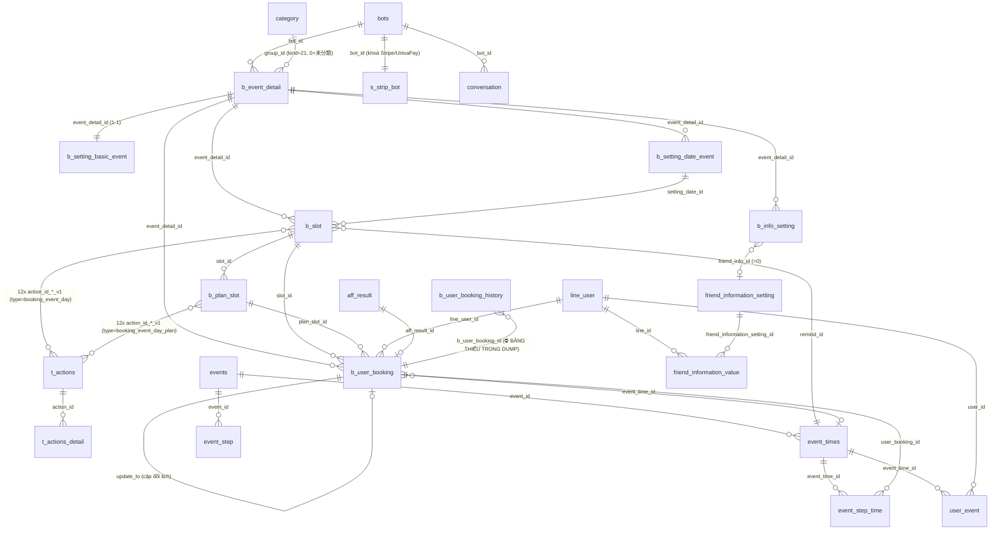

# DB Mapping — FA-021 「イベント予約」 (Đặt lịch sự kiện)

- **Portal**: Admin (LINE OA) + Staff + trang public LINE User (LIFF)
- **Phạm vi**: bộ **event day (v2)** — `b_event_detail.type_event_new = 1` (303/671 bản ghi trong dump). Bộ v1 (`type_event_new = 0`) dùng chung bảng nhưng khác controller → **ngoài phạm vi**.
- **Nguồn**: `db/schema/tables/*.sql` (schema thật), `db/data/*.sql` (dữ liệu mẫu), `web/logic-spec.md` (Models Eloquent), `_internal/db-hint.md`, `ui/ui-spec.md`.
- **Kiến trúc 4 tầng**: イベント (`b_event_detail`) → 開催日 (`b_setting_date_event`) → 予約枠/slot (`b_slot`) → コース/plan (`b_plan_slot`) → 予約 (`b_user_booking`).

> ### ⚠ Đính chính tên bảng so với `db-hint.md`
> Các tên bảng trong `db-hint.md` là **suy đoán và SAI**. Tên thật (xác nhận từ Model + schema dump):
>
> | db-hint đoán | Tên bảng THẬT | Model |
> |---|---|---|
> | `b_bookings` | **`b_user_booking`** | `BBooking` |
> | `b_slots` | **`b_slot`** | `BSlot` |
> | `b_plans` | **`b_plan_slot`** | `PlanSlot` |
> | `b_setting_info_user` | **`b_info_setting`** | `BInfoSetting` |
> | `b_group` | **`category`** (`kind = 21`) | `Category` |
> | `b_booking_info` (bảng con đáp án) | **KHÔNG TỒN TẠI** → đáp án lưu JSON inline trong `b_user_booking.detail_info_user` |
> | `friends` | **`line_user`** | `LineUser` |
> | `t_actions` | `t_actions` ✅ (đúng) | — |

---

## 1. Primary Tables (trực tiếp — từ Models trong logic-spec)

| # | Bảng | Model | Số cột | Data size | Vai trò |
|---|---|---|---|---|---|
| 1 | `b_event_detail` | `BEventDetail` | 48 | 228KB | Sự kiện — thông tin chung, các trang public, cấu hình thanh toán |
| 2 | `b_setting_basic_event` | `BSettingBasicEvent` | 47 | 145KB | Cấu hình chung mức event (số người, hiển thị, bản đồ) + 3 nhóm action mức event |
| 3 | `b_setting_date_event` | `BSettingDateEvent` | 9 | 126KB | 1 ngày tổ chức 「開催日」 + thời điểm mở bán slot |
| 4 | `b_slot` | `BSlot` | 80 | 391KB | Khung giờ 「予約枠」 — định員, hạn chót, chế độ duyệt, 12 action `_v1` |
| 5 | `b_plan_slot` | `PlanSlot` | 48 | 204KB | Gói / コース — giá, định員 riêng, 12 action `_v1` |
| 6 | `b_user_booking` | `BBooking` | 49 | 723KB | Đặt chỗ — trạng thái, thanh toán, đáp án form (JSON) |
| 7 | `b_info_setting` | `BInfoSetting` | 15 | 230KB | Định nghĩa field 「予約時入力項目」 của form đặt chỗ |

## 2. Secondary Tables (gián tiếp — FK, config, log, hàng đợi)

| Bảng | Model | Quan hệ với tính năng |
|---|---|---|
| `t_actions` | — | Định nghĩa action. `type ∈ {booking_event_day (1.312 rows), booking_event_day_plan (772 rows)}`. Đích của **24 cột `action_id_*_v1`** trên `b_slot` + `b_plan_slot` |
| `t_actions_detail` | — | Chi tiết từng action (`type`: text, tag, template, scenario, richmenu, remind…). FK `action_id` → `t_actions.id` |
| `b_detail_action_slot` | `DetailActionSlot` | Chi tiết action **legacy** (v1) — gắn với bộ cột `action_*_id` cũ trên `b_slot`/`b_plan_slot` |
| `category` | `Category` | **Folder sự kiện** — `kind = 21` (4.651 rows), `is_deleted = 0`. `b_event_detail.group_id` → `category.id` (`0` = 「未分類」, không có bản ghi) |
| `line_user` | `LineUser` | Bạn bè LINE. `b_user_booking.line_user_id` → `line_user.id`. Đích ghi ngược của `friend_info_id` âm |
| `bots` | `Bots` | `liff_app_id_booking` / `liff_app_id` (URL LIFF), `domain_url_shorten`, `plan_type`, `flag_contract_new`, `free_send_count`, `status_strip_bot`, `univapay_app_id`, `transfer_code` |
| `s_strip_bot` | `StripBot` | Khoá cổng thanh toán theo bot: `strip_secret_test_key` / `strip_secret_live_key` — chọn theo `b_event_detail.flag_environment` |
| `conversation` | `Conversation` | Kiểm tra `is_blocked = 0` trước khi đăng ký remind (BR-22) |
| `friend_information_setting` | — | Field 友だち情報 tuỳ biến. `b_info_setting.friend_info_id > 0` → `friend_information_setting.id` |
| `friend_information_value` | — | Giá trị field tuỳ biến — ghi ngược khi user submit form đặt chỗ |
| `events` | `Events` | Kịch bản remind (nguồn cho dropdown 「リマインド選択」, lọc `booking_calendar_id IS NULL`) |
| `event_times` | `EventTimes` | Mốc thời gian remind. **`b_slot.remind_id` → `event_times.id`** |
| `event_step` | `EventStep` | Các bước của remind (`before_day = -1` gửi ngay) |
| `event_step_time` | `EventStepTime` | 🔶 **Hàng đợi remind cho Spring Boot** — `status = 0` + `sent_date_time <= now()` |
| `user_event` | `UserEvent` | Đăng ký LINE user vào 1 mốc remind (`event_time_id`) |
| `sync_elasticsearch` | `SyncElasticsearch` | 🔶 Hàng đợi đồng bộ ES khi `line_user.view_name` đổi qua form đặt chỗ |
| `messages_v2s` | `MessagesV2` | 🔶 Hàng đợi tin nhắn LINE (⚠ tên bảng thật là **`messages_v2s`** — có `s` cuối) |
| `send_random_messages` | `SendRandomMessage` | 🔶 Hàng đợi gửi tin ngẫu nhiên (do `sendAction`) |
| `action_lineuser` | `ActionLineUser` | Log action đã áp cho LINE user (có cột `user_booking_id`) |
| `scenario_step_time` | — | Bị **DELETE** (`status = 0`) khi action yêu cầu dừng scenario |
| `tag_line_user` | — | INSERT/DELETE tag bạn bè theo action |
| `aff_result` | `AffResult` | Hoa hồng affiliate. `b_user_booking.aff_result_id` → `aff_result.id` |
| `backup_history` | `BackupHistory` | BR-03 — chặn thao tác ghi khi `status ∈ {0,1}` |
| `bot_contracts` / `bot_slots` | — | BR-01 — giới hạn số sự kiện theo gói (`contract_type`) |

> 🔶 = bảng hàng đợi (đầu vào cho `job-analyzer` / Spring Boot).

### ⛔ Bảng THIẾU trong dump — `b_user_booking_history`

Model `BUserBookingHistory` (`app/Models/BUserBookingHistory.php`, table `b_user_booking_history`) **được ghi ở nhiều luồng nghiệp vụ** (`saveAdminBooking`, `saveActionBooking`, `refundMoneyBookingEvent`) nhưng bảng **KHÔNG tồn tại** trong schema dump:

```
grep -c "b_user_booking_history" db/schema/all-tables.sql  →  0
grep -c "b_user_booking_history" db/index.md               →  0
```

**Nguyên nhân có thể**: dump được export trước migration tạo bảng này, hoặc bảng nằm ở DB/schema khác. → **Cần export lại DB hoặc xác nhận với team.** Toàn bộ mapping cột của bảng này dưới đây suy từ `$fillable` của Model, **Độ tin cậy: Trung bình**.

| Cột (từ `$fillable`) | Ý nghĩa |
|---|---|
| `bot_id` | Bot sở hữu |
| `b_user_booking_id` | FK → `b_user_booking.id` |
| `status` | `1`=ADMIN_APPROVE, `2`=DENY, `3`=REQUEST_BOOKING, `4`=CANCEL, `5`=BOOKING_NEW, `6`=REQUEST_CHANGE, `7`=REQUEST_CANCEL, `8`=CHANGE_BOOKING |
| `reason` | Lý do dạng text (VD 「予約リクエスト」,「手動予約追加」,「¥3,000の返金（決済システムから）」) |
| `operator_id` / `operator_name` | Người thao tác (`Auth::id()` / `Auth::user()->username`) |

---

## 3. Entity Details

### 3.1 `b_event_detail` — Sự kiện

| Cột | Kiểu | Null | Default | Key | Mô tả |
|---|---|---|---|---|---|
| `id` | int(10) UNSIGNED | No | — | **PK** | ID sự kiện. `hashIdEvent` = `Hashids::encode(id)` — **tính runtime, KHÔNG có cột hash trong DB** |
| `bot_id` | int(11) | No | — | FK → `bots.id` | Bot sở hữu |
| `position` | int(11) | Yes | NULL | — | Thứ tự hiển thị trong folder (「並べ替え」) |
| `group_id` | int(11) | No | — | FK → `category.id` | Folder. `0` = 「未分類」 (không có bản ghi `category`) |
| `title` | varchar(255) | No | — | — | 「イベント名（管理用）」 — UI giới hạn 20 ký tự (client-side; DB cho 255) |
| `title_event` | varchar(255) | Yes | NULL | — | 「イベントタイトル」 hiển thị trên trang public |
| `line_title` | varchar(255) | Yes | NULL | — | 「タイトル」 trên LINEトーク画面 (UI max 50) |
| `line_explain` | varchar(255) | Yes | NULL | — | 「説明」 trên LINEトーク画面 (UI max 50) |
| `content_top` | longtext | Yes | NULL | — | 「詳細情報」上段 (HTML) |
| `content_bottom` | longtext | Yes | NULL | — | 「詳細情報」下段 (HTML) |
| `type_event` | tinyint(4) | No | 0 | — | `0` = sự kiện 1 ngày / `1` = sự kiện kéo dài (period) |
| `type_event_new` | tinyint(4) | No | 0 | — | **`0` = v1 (legacy) / `1` = v2 (event day — tính năng này)** |
| `content` | text | Yes | NULL | — | ⚠ Legacy v1 — không dùng ở v2 |
| `image` | text | Yes | NULL | — | 「ヘッダー画像」 — path tương đối, upload vào `public/{FOLDER_MEDIA}media/images/{userId}/{botId}/booking/` |
| `address` | varchar(255) | Yes | NULL | — | ⚠ Legacy v1 — v2 dùng `b_setting_basic_event.address` |
| `url_address` | varchar(255) | Yes | NULL | — | ⚠ Legacy v1 |
| `is_set_each_booking` | tinyint(4) | No | 0 | — | ⚠ Trùng lặp với `b_setting_basic_event.is_set_each_booking` — v2 đọc từ bảng setting |
| `type_times_booking` | int(11) | Yes | NULL | — | ⚠ Trùng lặp — v2 đọc từ `b_setting_basic_event` |
| `is_hide_slot_closed` | tinyint(4) | No | 0 | — | ⚠ Legacy — v2 dùng `is_show_slot_expire` |
| `is_display_number_booking` | tinyint(4) | No | 0 | — | ⚠ Legacy — v2 dùng `is_hide_remain` |
| `is_range_people` | tinyint(4) | No | 0 | — | ⚠ Legacy — v2 dùng `is_limit_people` |
| `is_required_input_email_phone` | tinyint(4) | Yes | 0 | — | ⚠ Legacy v1 |
| `is_required_input_email` | tinyint(4) | No | 0 | — | ⚠ Legacy v1 |
| `is_required_input_phone` | tinyint(4) | No | 0 | — | ⚠ Legacy v1 |
| `number_booking_one_time_limit` | int(11) | Yes | NULL | — | ⚠ Legacy — v2 dùng `b_setting_basic_event.limit_people` |
| `number_booking_one_time_from` | int(11) | Yes | NULL | — | ⚠ Legacy — v2 dùng `min_people` |
| `number_booking_one_time_to` | int(11) | Yes | NULL | — | ⚠ Legacy — v2 dùng `limit_people` |
| `is_use_terms` | tinyint(4) | No | 1 | — | 「利用規約の表示」 — `0` = 非表示 / `1` = 表示 |
| `content_terms` | text | Yes | NULL | — | 「利用規約文章」 (HTML) |
| `is_use_checkbox` | tinyint(4) | No | 1 | — | 「同意チェックボックス」 — `0` = 非表示 / `1` = 表示 |
| `created_at` | timestamp | No | CURRENT_TIMESTAMP | — | 「作成日」 |
| `updated_at` | timestamp | No | CURRENT_TIMESTAMP ON UPDATE | — | — |
| `name_button_info_event` | varchar(255) | Yes | NULL | — | Text nút trang 案内 (default 「予約にすすむ」) |
| `bg_button_info_event` | varchar(255) | Yes | NULL | — | Màu nền nút (hex, VD `#08bf5a`) |
| `color_button_info_event` | varchar(255) | Yes | NULL | — | Màu chữ nút (hex) |
| `name_button_info_friend` | varchar(255) | Yes | NULL | — | Text nút trang 友だち入力項目 (default 「予約確認にすすむ」) |
| `bg_button_info_friend` | varchar(255) | Yes | NULL | — | Màu nền nút |
| `color_button_info_friend` | varchar(255) | Yes | NULL | — | Màu chữ nút |
| `name_button_confirm_detail` | varchar(255) | Yes | NULL | — | Text nút trang 予約内容確認 (default 「申し込む」) |
| `bg_button_confirm_detail` | varchar(255) | Yes | NULL | — | Màu nền nút |
| `color_button_confirm_detail` | varchar(255) | Yes | NULL | — | Màu chữ nút |
| `flag_page_end` | tinyint(4) | No | 0 | — | 「予約完了ページ」: `0` = 表示せずトーク画面へ / `1` = 任意ページ (dùng `url_page_outsite_end`) / `2` = テキスト入力 (dùng `page_end_simple`) |
| `page_end_simple` | longtext | Yes | NULL | — | Nội dung HTML trang hoàn tất (khi `flag_page_end = 2`) |
| `url_page_outsite_end` | varchar(500) | Yes | NULL | — | URL trang ngoài (khi `flag_page_end = 1`) |
| `is_auto_bill` | tinyint(4) | No | 0 | — | `0` = không tự thu tiền / `1` = tự thu |
| `type_system_bill` | int(11) | Yes | NULL | — | **Cổng thanh toán**: `NULL`/`0` = không dùng / `1` = Stripe / `2` = UnivaPay |
| `content_term_bill` | longtext | Yes | NULL | — | 「特定商取引法に基づく表記」 |
| `flag_environment` | int(11) | No | 0 | — | **`0` = テスト環境 (test) / `1` = 本番環境 (live)** → chọn key trong `s_strip_bot` |

**Sample data** (671 rows tổng; 303 rows `type_event_new = 1`):
- `type_event`: `0` (644), `1` (27)
- `type_system_bill`: `NULL` (535), `2` (82), `1` (41), **`0` (13)** ← giá trị `0` không có trong comment schema
- `flag_environment`: `0` (667), `1` (4)
- `is_auto_bill`: `0` (577), `1` (94)
- `flag_page_end`: `0` (670), `2` (1) — giá trị `1` (任意ページ) **chưa từng được dùng**
- `is_use_terms`: `1` (484), `0` (187) · `is_use_checkbox`: `1` (651), `0` (20)

> **Không có cột `is_use_payment`** — UI 「決済機能の利用」 (利用する/利用しない) là **Computed** từ `type_system_bill` (`NULL`/`0` → 利用しない).
> **Không có cột hash** — 「イベントページ」 URL preview sinh runtime bằng `Hashids::encode(id)`.

---

### 3.2 `b_setting_basic_event` — Cấu hình chung + action mức event

| Cột | Kiểu | Null | Default | Key | Mô tả |
|---|---|---|---|---|---|
| `id` | int(10) UNSIGNED | No | — | **PK** | — |
| `bot_id` | int(11) | Yes | NULL | FK → `bots.id` | — |
| `event_detail_id` | int(11) | Yes | NULL | FK → `b_event_detail.id` | Sự kiện (quan hệ 1–1) |
| `max_number` | int(11) | Yes | NULL | — | Định員 tổng của sự kiện (0 = không giới hạn) |
| `is_limit_people` | int(11) | No | 0 | — | 「人数を範囲で指定」 — `0` = số cố định / `1` = khoảng min–max |
| `limit_people` | tinyint(4) | No | 10 | — | 「1回の予約上限」 (max). ⚠ `tinyint` → **trần 127** |
| `min_people` | tinyint(4) | No | 1 | — | Số người tối thiểu (khi `is_limit_people = 1`) |
| `is_set_each_booking` | tinyint(4) | No | 0 | — | 「各日程ごとに設定する」 — `0` = dùng cấu hình chung / `1` = mỗi slot cấu hình riêng (BR-12) |
| `type_times_booking` | int(11) | Yes | NULL | — | 「予約可能回数」: `1` = 何度でも / `2` = 各予約枠で1度のみ / `3` = このイベントで1度のみ |
| `unit_booking` | varchar(255) | Yes | NULL | — | 「予約単位変更」 — default 「人」 |
| `is_hide_remain` | tinyint(4) | No | 0 | — | 「予約枠の残数」 — `1` = 表示 / `0` = 非表示 (⚠ tên cột ngược nghĩa) |
| `is_show_slot_expire` | tinyint(4) | No | 0 | — | 「受付期間終了した予約枠」 — `1` = 表示 / `0` = 非表示 |
| `is_show_slot_over` | tinyint(4) | No | 0 | — | 「満席の予約枠」 — `1` = 表示 / `0` = 非表示 |
| `info_event` | longtext | Yes | NULL | — | 「開催情報」 (HTML) |
| `is_show_map` | tinyint(4) | No | 0 | — | 「地図設定」 — `0` = 表示しない / `1` = 表示する |
| `address` | varchar(255) | Yes | '0' | — | Địa chỉ (khi bật map) |
| `lat` | varchar(255) | Yes | NULL | — | Vĩ độ (⚠ lưu dạng **varchar**, không phải DECIMAL) |
| `lng` | varchar(255) | Yes | NULL | — | Kinh độ (varchar) |
| `approval_system_booking` | tinyint(4) | No | 1 | — | Chế độ duyệt đặt chỗ mức event — **luôn = 1 trong 419/419 rows → cột chết** |
| `is_hide_time_end_booking` | tinyint(4) | No | 0 | — | Ẩn giờ kết thúc |
| `date_end_booking` / `time_end_booking` | date / time | Yes | NULL | — | Hạn chót đặt chỗ mức event |
| `using_action_slot_booking` | tinyint(4) | No | 1 | — | Ưu tiên action plan(1)/slot(0) — **luôn = 1 trong 419/419 rows** |
| `action_id_booking_approve` | int(11) | Yes | NULL | FK → `t_actions.id` | 「予約受付時」 |
| `action_id_booking_admin_approve` | int(11) | Yes | NULL | FK → `t_actions.id` | 「予約リクエスト申請時」 |
| `action_id_booking_approve_request` | int(11) | Yes | NULL | FK → `t_actions.id` | 「予約リクエスト承認時」 |
| `action_id_booking_cancel_request` | int(11) | Yes | NULL | FK → `t_actions.id` | 「予約リクエスト否認時」 |
| `approval_system_change_request` | tinyint(4) | No | 1 | — | 「予約変更」: `0` = 全承認 / `1` = リクエスト制 / `2` = 不可 — **luôn = 1** |
| `date_end_change_request` / `time_end_change_request` | date / time | Yes | NULL | — | Hạn chót đổi |
| `using_action_slot_change_request` | tinyint(4) | No | 1 | — | Ưu tiên action plan/slot cho 変更 |
| `action_id_change_request_booking_approve` | int(11) | Yes | NULL | FK → `t_actions.id` | 「予約変更時」 |
| `action_id_change_request_admin_approve` | int(11) | Yes | NULL | FK → `t_actions.id` | 「変更リクエスト申請時」 |
| `action_id_change_request_approve_request` | int(11) | Yes | NULL | FK → `t_actions.id` | 「変更リクエスト承認時」 |
| `action_id_change_request_cancel_request` | int(11) | Yes | NULL | FK → `t_actions.id` | 「変更リクエスト否認時」 |
| `approval_system_cancel` | tinyint(4) | No | 1 | — | 「予約キャンセル」: `0` = 全承認 / `1` = リクエスト制 / `2` = 不可 — **luôn = 1** |
| `date_end_cancel` / `time_end_cancel` | date / time | Yes | NULL | — | Hạn chót huỷ |
| `using_action_slot_cancel` | tinyint(4) | No | 1 | — | Ưu tiên action plan/slot cho キャンセル |
| `action_id_cancel_booking_approve` | int(11) | Yes | NULL | FK → `t_actions.id` | 「予約キャンセル時」 |
| `action_id_cancel_admin_approve` | int(11) | Yes | NULL | FK → `t_actions.id` | 「キャンセルリクエスト申請時」 |
| `action_id_cancel_approve_request` | int(11) | Yes | NULL | FK → `t_actions.id` | 「キャンセルリクエスト承認時」 |
| `action_id_cancel_cancel_request` | int(11) | Yes | NULL | FK → `t_actions.id` | 「キャンセルリクエスト否認時」 |
| `is_use_remind` | tinyint(4) | No | 0 | — | Bật remind — **luôn = 0 trong 419/419 rows** |
| `using_action_slot` | tinyint(4) | No | 1 | — | ⚠ Legacy, trùng lặp |
| `created_at` / `updated_at` | timestamp | No | CURRENT_TIMESTAMP | — | — |

**Sample data** (419 rows): `type_times_booking`: `1` (405), `2` (7), `3` (6), `0` (1) · `is_set_each_booking`: `0` (413), `1` (6) · `unit_booking`: 「人」 (416), `n` (2), 「テスト」 (1) · `min_people`: `1` (419/419) · `limit_people`: `1` (346), `10` (28), `3` (16)…

> 🔴 **Phát hiện quan trọng**: **11 cột cấu hình duyệt/action mức event** (`approval_system_*`, `using_action_slot_*`, `is_use_remind`) có **giá trị mặc định trên 100% bản ghi** → 3 nhóm action mức event **không được UI sử dụng thực tế**; cấu hình duyệt/action thật nằm ở `b_slot` và `b_plan_slot`. Khớp với ui-spec (SCR-EBD-02c không có khối 「アクション設定」 mức event). **Độ tin cậy: Cao**.

---

### 3.3 `b_setting_date_event` — Ngày tổ chức 「開催日」

| Cột | Kiểu | Null | Default | Key | Mô tả |
|---|---|---|---|---|---|
| `id` | int(10) UNSIGNED | No | — | **PK** | — |
| `bot_id` | int(11) | Yes | NULL | FK → `bots.id` | — |
| `event_detail_id` | int(11) | Yes | NULL | FK → `b_event_detail.id` | Sự kiện cha |
| `date_start` | date | Yes | NULL | — | 「開催日」 — ngày tổ chức |
| `duration` | int(11) | Yes | NULL | — | Số ngày **trước** `date_start` để mở bán slot (「開催」N「日前の」) |
| `date_show_slot` | date | Yes | NULL | — | **Computed**: `date_start − duration` ngày |
| `time_show_slot` | time | Yes | NULL | — | Giờ mở bán (HH:MM) |
| `created_at` / `updated_at` | timestamp | No | CURRENT_TIMESTAMP | — | — |

> **BR-15**: nếu thiếu `duration` hoặc `time_show_slot` → cả 3 cột (`duration`, `date_show_slot`, `time_show_slot`) đặt `NULL` → **mở bán ngay**.
> ⚠ **Không có cột toggle 「表示予約」** — db-hint đoán có TINYINT flag; thực tế trạng thái bật/tắt được **suy ra từ `date_show_slot IS NULL`**.

---

### 3.4 `b_slot` — Khung giờ 「予約枠」 (80 cột)

**Nhóm định danh & thời gian**

| Cột | Kiểu | Null | Default | Key | Mô tả |
|---|---|---|---|---|---|
| `id` | int(10) UNSIGNED | No | — | **PK** | — |
| `bot_id` | int(11) | No | — | FK → `bots.id` | — |
| `event_detail_id` | int(11) | No | — | FK → `b_event_detail.id` | Sự kiện cha |
| `setting_date_id` | int(11) | Yes | NULL | FK → `b_setting_date_event.id` | Ngày tổ chức cha |
| `position` | int(11) | Yes | NULL | — | Thứ tự. Khi tạo mới: `count(slot của event) + 1` |
| `type_event` | tinyint(4) | No | 0 | — | `0` = 1 ngày / `1` = kéo dài (period) |
| `event_id` | int(11) | Yes | NULL | FK → `events.id` | ⚠ Kịch bản remind (**không phải** event booking) |
| `date_start_from` | date | **No** | — | — | Ngày bắt đầu 「開催日」 |
| `date_start_to` | date | Yes | NULL | — | Ngày kết thúc (chỉ khi `type_event = 1`) |
| `time_start` | time | Yes | NULL | — | 「開催時間」 bắt đầu |
| `time_end` | time | Yes | NULL | — | 「開催時間」 kết thúc |
| `is_hide_time_end` | tinyint(4) | No | 0 | — | 「終了時間を設定しない」 — `1` = ẩn |
| `date_deadline` | date | **No** | — | — | **Computed**: `date_start − duration_deadline` |
| `duration_deadline` | int(11) | Yes | NULL | — | Số ngày trước sự kiện (「開催」N「日前の」) |
| `time_deadline` | time | **No** | — | — | Giờ chốt (HH:MM) |
| `address` / `url_address` | varchar(255) | Yes | NULL | — | Địa chỉ / URL hướng dẫn của slot |

**Nhóm định員 & duyệt**

| Cột | Kiểu | Null | Default | Mô tả |
|---|---|---|---|---|
| `number_people` | int(11) | Yes | NULL | **「定員」 của slot. `NULL` = không giới hạn** (UI hiện `-`) |
| `use_people` | int(11) | No | 0 | **Số suất ĐÃ DÙNG** (BR-08) |
| `approval_system` | tinyint(4) | No | 1 | **「予約承認方法」: `0` = 全承認 (auto → booking status `5`) / `1` = リクエスト制 (→ status `3`)** (BR-18) |
| `times_booking` | tinyint(4) | No | 1 | 「予約可能回数」: `1` = 何度でも / `2` = chỉ 1 lần (BR-11) |
| `limit_people` | int(11) | No | 0 | Số người tối đa / 1 booking. Khi tạo mới hardcode `10` |
| `min_people` | int(11) | No | 0 | Số người tối thiểu. Khi tạo mới hardcode `1` |
| `is_limit_people` | int(11) | No | 0 | 「人数を範囲で指定」 |
| `plan_ids` | varchar(255) | Yes | NULL | ⚠ **Denormalized** — CSV các `b_plan_slot.id` |
| `is_hide_remain` | tinyint(4) | No | 1 | 「予約枠の残数」 表示/非表示 (override mức slot) |
| `is_show_slot_expire` | tinyint(4) | No | 0 | 「受付期間終了した予約枠」 |
| `is_show_slot_over` | tinyint(4) | No | 0 | 「満席の予約枠」 |
| `remarks` | text | Yes | NULL | Ghi chú |

**Nhóm remind**

| Cột | Kiểu | Null | Default | Mô tả |
|---|---|---|---|---|
| `remind_id` | int(11) | Yes | NULL | **FK → `event_times.id`** — mốc remind của slot |
| `is_use_remind` | tinyint(4) | No | 0 | 「リマインド配信」 bật/tắt |
| `date_end_remind` / `time_end_remind` | date / time | Yes | NULL | Hạn kết thúc remind |

**Nhóm 予約 (booking) — bộ `_v1`**

| Cột | Kiểu | Default | Mô tả |
|---|---|---|---|
| `approval_system_booking_v1` | tinyint(4) | 1 | ⚠ **Luôn = 1 trong 966/966 rows → cột chết**. Chế độ duyệt thật đọc từ `approval_system` |
| `is_hide_time_end_booking_v1` | tinyint(4) | 0 | Ẩn giờ kết thúc nhận đặt |
| `date_end_booking_v1` / `time_end_booking_v1` | date / time | NULL | Hạn nhận đặt |
| `using_action_slot_booking_v1` | tinyint(4) | 1 | **「優先アクション」: `1` = ưu tiên action của PLAN (fallback slot) / `0` = chỉ dùng action của SLOT** (BR-17) |
| `action_id_booking_approve_v1` | int(11) | NULL | FK → `t_actions.id` — 「予約受付時」 |
| `action_id_booking_admin_approve_v1` | int(11) | NULL | FK → `t_actions.id` — 「予約リクエスト申請時」 |
| `action_id_booking_approve_request_v1` | int(11) | NULL | FK → `t_actions.id` — 「予約リクエスト承認時」 |
| `action_id_booking_cancel_request_v1` | int(11) | NULL | FK → `t_actions.id` — 「予約リクエスト否認時」 |

**Nhóm 変更 (change request)**

| Cột | Kiểu | Default | Mô tả |
|---|---|---|---|
| `approval_system_change_request` | tinyint(4) | 1 | **「予約変更」: `0` = 全承認 / `1` = リクエスト制 / `2` = 不可** |
| `date_end_change_request` | date | NULL | **Computed**: `date_start − duration_change_request` |
| `duration_change_request` | int(11) | NULL | Số ngày trước sự kiện |
| `time_end_change_request` | time | NULL | Giờ chốt đổi |
| `is_no_datetime_end_change_request` | tinyint(4) | 0 | 「締切を設定しない」 |
| `using_action_slot_change_request` | tinyint(4) | 1 | Ưu tiên action plan(1)/slot(0) |
| `action_id_change_request_booking_approve_v1` | int(11) | NULL | FK → `t_actions.id` — 「予約変更時」 |
| `action_id_change_request_admin_approve_v1` | int(11) | NULL | FK → `t_actions.id` — 「変更リクエスト申請時」 |
| `action_id_change_request_approve_request_v1` | int(11) | NULL | FK → `t_actions.id` — 「変更リクエスト承認時」 |
| `action_id_change_request_cancel_request_v1` | int(11) | NULL | FK → `t_actions.id` — 「変更リクエスト否認時」 |

**Nhóm キャンセル (cancel)**

| Cột | Kiểu | Default | Mô tả |
|---|---|---|---|
| `approval_system_cancel` | tinyint(4) | 1 | **「予約キャンセル」: `0` = 全承認 / `1` = リクエスト制 / `2` = 不可** |
| `date_end_cancel` | date | NULL | **Computed**: `date_start − duration_cancel` |
| `duration_cancel` | int(11) | NULL | Số ngày trước sự kiện |
| `time_end_cancel` | time | NULL | Giờ chốt huỷ |
| `is_no_datetime_end_cancel` | tinyint(4) | 0 | 「締切を設定しない」 |
| `using_action_slot_cancel` | tinyint(4) | 1 | Ưu tiên action plan(1)/slot(0) |
| `action_id_cancel_booking_approve_v1` | int(11) | NULL | FK → `t_actions.id` — 「予約キャンセル時」 |
| `action_id_cancel_admin_approve_v1` | int(11) | NULL | FK → `t_actions.id` — 「キャンセルリクエスト申請時」 |
| `action_id_cancel_approve_request_v1` | int(11) | NULL | FK → `t_actions.id` — 「キャンセルリクエスト承認時」 |
| `action_id_cancel_cancel_request_v1` | int(11) | NULL | FK → `t_actions.id` — 「キャンセルリクエスト否認時」 |

**Nhóm LEGACY (v1) — không dùng ở v2**

| Cột | Ghi chú |
|---|---|
| `action_booking_success_id`, `action_at_time_cancel_id`, `action_booking_change_id`, `action_booking_approve_id`, `action_booking_denial_id` | Bộ action legacy #1 (hậu tố `_id`) → `b_detail_action_slot` |
| `action_id_booking_success`, `action_id_at_time_cancel`, `action_id_booking_change`, `action_id_booking_approve`, `action_id_booking_denial` | Bộ action legacy #2 (tiền tố `action_id_`) → `t_actions` |
| `active_action` | **Luôn = 0 trong 966/966 rows → cột chết** |
| `allow_change_from_friend`, `setting_deadline`, `date_deadline_change_cancel`, `time_deadline_change_cancel` | Legacy v1 — nhưng `date/time_deadline_change_cancel` **vẫn được dùng** ở `ajaxGetHistoryBookingApp` để tính cờ `cancel` (BR-14) |
| `using_action_slot` | Legacy, trùng với bộ `using_action_slot_*` |

> ✅ **Trả lời db-hint ghi chú #4**: `b_slot` có **3 bộ cột action** — 2 bộ legacy (10 cột) + 1 bộ `_v1` (12 cột). `b_plan_slot` có **2 bộ legacy (10 cột) + bộ `_v1` (12 cột)**.

**Sample data** (966 rows): `approval_system`: `0` (724), `1` (242) · `approval_system_change_request`: `2` (647), `1` (185), `0` (134) · `approval_system_cancel`: `2` (688), `1` (174), `0` (104) · `using_action_slot_booking_v1`: `0` (870), `1` (96) · `times_booking`: `1` (954), `2` (12) · `is_use_remind`: `0` (964), `1` (2) · `is_no_datetime_end_cancel`: `1` (791), `0` (175)

---

### 3.5 `b_plan_slot` — Gói / コース (48 cột)

| Cột | Kiểu | Null | Default | Key | Mô tả |
|---|---|---|---|---|---|
| `id` | int(10) UNSIGNED | No | — | **PK** | — |
| `slot_id` | int(11) | No | — | FK → `b_slot.id` | Slot cha |
| `bot_id` | int(11) | Yes | NULL | FK → `bots.id` | — |
| `name` | varchar(255) | No | — | — | 「コース名」 |
| `limit` | int(11) | Yes | NULL | — | **「定員」 của plan**. `NULL` = không giới hạn (UI hiện `-`) |
| `using_max_slot` | tinyint(4) | No | 1 | — | 「予約枠の定員の残数に合わせる」 — `1` = dùng chung định員 của slot (BR-07) |
| `remain_limit` | int(11) | Yes | 0 | — | ⚠ **Tên gây hiểu nhầm — thực chất là SỐ ĐÃ DÙNG** của plan (BR-08) |
| `price` | int(11) | Yes | NULL | — | 「料金」 (JPY). Bỏ dấu `.` trước khi lưu. UI: `≥ 50` khi `> 0` |
| `order` | int(11) | Yes | NULL | — | Thứ tự. Khi tạo: `max(order) + 1` |
| `approval_system_booking` | tinyint(4) | No | 1 | — | 「予約承認」: `0` = 全承認 / `1` = リクエスト制 |
| `is_no_datetime_end_booking` | tinyint(4) | No | 0 | — | 「締切を設定しない」 |
| `date_end_booking` | date | Yes | NULL | — | **Computed**: `date_start − duration_end_booking` |
| `duration_end_booking` | int(11) | Yes | NULL | — | Số ngày trước sự kiện |
| `time_end_booking` | time | Yes | NULL | — | Giờ chốt |
| `approval_system_change_request` | tinyint(4) | No | 1 | — | 「予約変更」: `0` / `1` / `2` = 不可 |
| `date_end_change_request` / `duration_change_request` / `time_end_change_request` | date/int/time | Yes | NULL | — | Hạn đổi |
| `is_no_datetime_end_change_request` | tinyint(4) | No | 0 | — | 「締切を設定しない」 (change) |
| `approval_system_cancel` | tinyint(4) | No | 1 | — | 「予約キャンセル」: `0` / `1` / `2` = 不可 |
| `date_end_cancel` / `duration_cancel` / `time_end_cancel` | date/int/time | Yes | NULL | — | Hạn huỷ |
| `is_no_datetime_end_cancel` | tinyint(4) | No | 0 | — | 「締切を設定しない」 (cancel) |
| **12 cột `action_id_*_v1`** | int(11) | Yes | NULL | FK → `t_actions.id` | **Tên cột giống hệt `b_slot`** — xem mục 3.4 |
| `action_booking_success_id`, `action_at_time_cancel_id`, `action_booking_change_id`, `action_booking_approve_id`, `action_booking_denial_id` | int(11) | Yes | NULL | — | ⚠ Legacy #1 |
| `action_id_booking_success`, `action_id_at_time_cancel`, `action_id_booking_change`, `action_id_booking_approve`, `action_id_booking_denial` | int(11) | Yes | NULL | — | ⚠ Legacy #2 |
| `created_at` / `updated_at` | timestamp | No | CURRENT_TIMESTAMP | — | — |

**Sample data** (755 rows): `using_max_slot`: `1` (602), `0` (153) · `approval_system_booking`: `0` (499), `1` (256) · `approval_system_change_request`: `2` (450), `1` (171), `0` (134) · `approval_system_cancel`: `2` (513), `1` (157), `0` (85)

> ⚠ **`b_plan_slot` KHÔNG có `using_action_slot_*`** — cờ ưu tiên action chỉ nằm ở `b_slot` (BR-17 đọc từ slot).

---

### 3.6 `b_user_booking` — Đặt chỗ (49 cột)

| Cột | Kiểu | Null | Default | Key | Mô tả |
|---|---|---|---|---|---|
| `id` | int(10) UNSIGNED | No | — | **PK** | — |
| `bot_id` | int(11) | Yes | NULL | FK → `bots.id` | — |
| `event_detail_id` | int(11) | No | — | FK → `b_event_detail.id` | Sự kiện |
| `slot_id` | int(11) | No | — | FK → `b_slot.id` | 「参加日時」 |
| `plan_slot_id` | int(11) | Yes | NULL | FK → `b_plan_slot.id` | 「コース名」/「利用プラン」 |
| `line_user_id` | int(11) | Yes | NULL | FK → `line_user.id` | 「友だち名」 |
| `type_booking` | tinyint(4) | No | 0 | — | `0` = bạn bè đặt / `1` = admin đặt hộ — **luôn = 0 trong 968/968 rows → cột chết** |
| `booking_from` | int(11) | No | 1 | — | **`1` = web / `2` = app**. ⚠ `saveAdminBooking` set `= 1` (xem Unmapped #U-07) |
| `name`, `first_name`, `last_name` | varchar(255) | Yes | NULL | — | Tên đặt chỗ (thường rỗng ở v2 — dữ liệu nằm trong `detail_info_user`) |
| `friend` | varchar(255) | Yes | NULL | — | ⚠ Legacy |
| `email`, `phone` | varchar(255) | Yes | NULL | — | Email / SĐT (thường rỗng ở v2) |
| `remarks` | text | Yes | NULL | — | Ghi chú |
| `quantity` | int(11) | No | 1 | — | **「参加人数」/「N名参加」** (db-hint gọi nhầm là `number_order`) |
| `amount` | int(11) | Yes | NULL | — | **「決済金額」** (JPY) (db-hint gọi nhầm là `price`/`total_price`) |
| `detail_info_user` | text | Yes | NULL | — | 🔑 **「予約時入力事項」 — mảng JSON đáp án**, VD `[{"id":"3111","title":"お名前","type":"none","value":"…"}]`. `id` = `b_info_setting.id` |
| `detail_info_user_tmp` | json | Yes | NULL | — | Bản tạm của `detail_info_user` trong lúc chờ webhook thanh toán |
| `action_before_booking` | tinyint(4) | No | 1 | — | 「アクションを実行する／しない」: **`0` = CÓ thực thi / `1` = KHÔNG** (⚠ ngược trực giác) |
| `status` | int(11) | No | 3 | — | **Trạng thái đặt chỗ — xem mục 4.1** |
| `last_status` | int(11) | Yes | NULL | — | Trạng thái trước đó (dùng khi từ chối yêu cầu đổi → khôi phục) |
| `update_to` | int(11) | Yes | NULL | FK → `b_user_booking.id` | 🔑 **Cặp booking khi đổi lịch** — bản MỚI trỏ về bản CŨ (BR-16) |
| `event_time_id` | int(11) | Yes | NULL | FK → `event_times.id` | Mốc remind (copy từ `b_slot.remind_id`) |
| `created_at` | timestamp | No | CURRENT_TIMESTAMP | — | 「予約した日」/「リクエスト日」 |
| `updated_at` | timestamp | No | CURRENT_TIMESTAMP ON UPDATE | — | — |
| `status_payment` | tinyint(4) | No | 0 | — | **`0` = chưa thanh toán / `1` = đã thanh toán / `2` = 返金済み** |
| `status_webhook` | tinyint(4) | Yes | NULL | — | **Trạng thái callback cổng thanh toán — xem mục 4.3** |
| `reason_refund` | varchar(256) | Yes | NULL | — | ⚠ **Kiểu VARCHAR** (không phải int!) — api-spec mô tả `reason_refund = 1` là **giá trị REQUEST**, lưu xuống DB có thể là chuỗi. Toàn bộ 968 rows = `NULL` |
| `refund_date` | datetime | Yes | NULL | — | Thời điểm hoàn tiền |
| `error_message` / `error_code` | varchar(255) | Yes | NULL | — | Lỗi từ cổng thanh toán |
| `payment_new` | tinyint(4) | No | 0 | — | Cờ luồng thanh toán mới (`1` = luồng webhook mới) |
| `charge_tmp_id` | varchar(255) | Yes | NULL | — | Charge id tạm trong lúc chờ webhook |
| `aff_result_id` | int(11) | Yes | NULL | FK → `aff_result.id` | Hoa hồng affiliate |
| **Stripe** | | | | | |
| `strip_customer_id`, `strip_card_id`, `strip_pm_id` | varchar(255) | Yes | NULL | — | Định danh Stripe |
| `strip_last4` | varchar(100) | Yes | NULL | — | 4 số cuối thẻ (`#info-last4`) |
| `strip_brand_name` | varchar(100) | Yes | NULL | — | Thương hiệu thẻ |
| `strip_charge_id` | varchar(255) | Yes | NULL | — | Charge id — dùng để `refundMoney()` |
| **UnivaPay** | | | | | |
| `univapay_email`, `univapay_name` | varchar(255) | Yes | NULL | — | Thông tin người thanh toán |
| `univapay_last4` | varchar(100) | Yes | NULL | — | 4 số cuối thẻ |
| `univapay_brand_name` | varchar(100) | Yes | NULL | — | Thương hiệu thẻ (VD `visa`) |
| `univapay_customer_code`, `univapay_customer_id` | varchar(255) | Yes | NULL | — | Customer id (tạo qua `createCustomerIdUnivapay`) |
| `univapay_token` | text | Yes | NULL | — | Token thẻ |
| `univapay_charge_id` | varchar(255) | Yes | NULL | — | Charge id — **set `NULL` sau khi refund** |

> 🔑 **Trả lời db-hint ghi chú #5**: **KHÔNG có bảng con đáp án**. 「予約時入力事項」 lưu **JSON inline** trong `detail_info_user` (TEXT) — mỗi phần tử `{id, title, type, value}` với `id` = `b_info_setting.id`. **Độ tin cậy: Cao** (968/968 rows có dữ liệu, sample đã đọc).
> 🔑 **Không lưu số thẻ** — chỉ token + customer_id + 4 số cuối. ✅ Khớp ui-spec SCR-EBD-20.

**Sample data** (968 rows): `status`: `5` (427), `3` (195), `1` (149), `4` (106), `2` (40), `6` (35), **`0` (9)**, `7` (7) · `status_payment`: `0` (923), `1` (45) · `status_webhook`: `NULL` (901), `1` (66), `2` (1) · `booking_from`: `2` (785), `1` (181), `0` (2) · `action_before_booking`: `0` (782), `1` (186) · `payment_new`: `0` (709), `1` (259)

---

### 3.7 `b_info_setting` — Field form 「予約時入力項目」

| Cột | Kiểu | Null | Default | Key | Mô tả |
|---|---|---|---|---|---|
| `id` | int(10) UNSIGNED | No | — | **PK** | Được tham chiếu bởi `detail_info_user[].id` |
| `bot_id` | int(11) | No | — | FK → `bots.id` | — |
| `event_detail_id` | int(11) | No | — | FK → `b_event_detail.id` | Sự kiện |
| `slot_id` | int(11) | Yes | NULL | FK → `b_slot.id` | ⚠ Không dùng ở v2 (field mức event) |
| `friend_info_id` | int(11) | No | 0 | — | **「紐付け友だち情報」 — xem mục 4.4** |
| `title` | varchar(255) | No | — | — | 「表示項目名」 (UI max 30) |
| `type` | int(11) | No | 1 | — | **「回答タイプ」 — xem mục 4.5** (⚠ comment schema mâu thuẫn với UI) |
| `setting` | varchar(255) | Yes | NULL | — | Format/validate hint: `none`, `newname`, `newkana`, `tel`, `numeric`… |
| `is_require` | int(11) | No | 1 | — | **「必須／任意」: `1` = 必須 / `0` = 任意** (db-hint gọi nhầm là `is_required`) |
| `order_index` | int(11) | No | 1 | — | Thứ tự hiển thị |
| `is_mapping_info` | tinyint(4) | No | 1 | — | Bật ghi ngược vào hồ sơ bạn bè. **Luôn = 1 trong 3.240/3.240 rows** (hardcode ở `saveSettingStep2:576`) |
| `is_default` | tinyint(4) | No | 0 | — | **Field mặc định** (「お名前」/「メールアドレス」) — không xoá được (BR-19) |
| `is_show` | tinyint(4) | No | 1 | — | Hiển thị field trên form |
| `created_at` / `updated_at` | timestamp | No | CURRENT_TIMESTAMP | — | — |

**Sample data** (3.240 rows): `friend_info_id`: `-1` (1.366), `-3` (1.357), `0` (420), `-2` (20), `-6` (7), **`-1000` (6)**, dương (`65`, `66`, `329`, `330`…) · `type`: `1` (2.861), `0` (339), `2` (40) · `is_require`: `1` (2.973), `0` (267) · `is_default`: `1` (2.696), `0` (544)

---

### 3.8 Bảng hàng đợi (Spring Boot)

**`event_step_time`** — hàng đợi remind

| Cột | Kiểu | Null | Default | Mô tả |
|---|---|---|---|---|
| `id` | int(10) UNSIGNED | No | — | PK |
| `event_id` | int(11) | No | — | FK → `events.id` |
| `event_time_id` | int(11) | No | — | FK → `event_times.id` |
| `event_step_id` | int(11) | No | — | FK → `event_step.id` |
| `bot_id` | int(11) | No | — | FK → `bots.id` |
| `user_id` | int(11) | Yes | NULL | FK → `line_user.id` |
| `user_booking_id` | int(11) | Yes | NULL | **FK → `b_user_booking.id`** |
| `sent_date_time` | datetime | No | — | Thời điểm cần gửi. Chỉ insert khi `> now()` |
| `status` | tinyint(4) | No | 0 | **`0` = chờ gửi** (Spring Boot quét), `2` = đã gửi, `3`/`4`/`5` = khác |
| `total_send` | int(11) | No | 0 | Số lần đã gửi |
| `form_result_id`, `form_item_id`, `datetime_end` | — | Yes | NULL | Dùng cho remind từ form (ngoài phạm vi) |

**Sample data** (8.865 rows): `status`: `2` (8.509), `0` (194), `4` (152), `5` (9), `3` (1)

**`event_times`** — mốc remind: `id`, `event_id`, `bot_id`, `event_date` (date), `event_start_time` (**varchar(16)**), `count_user_registed` (int).
**`user_event`** — đăng ký remind: `id`, `event_id`, `user_id` (**varchar(256)** — lưu id LINE user dạng chuỗi), `bot_id`, `event_time_id`, `register_date_time` (datetime).

**`t_actions`**: `id`, `parent_id` (= `b_slot.id` hoặc `b_plan_slot.id`), `type`, `update_timestamp`.
- `type = 'booking_event_day'` (1.312 rows) → action gắn với **slot**
- `type = 'booking_event_day_plan'` (772 rows) → action gắn với **plan**
- (`type = 'booking_event'` (1.149 rows) = v1 legacy, ngoài phạm vi)

**`t_actions_detail`**: `id`, `action_id` (FK → `t_actions.id`), `bot_id`, `type` (`text`, `tag`, `template`, `scenario`, `richmenu`, `remind`, `friend_info`, `block`, `bookmark`, `compliant_status`…), `data` (text), `has_filters`.

**`category`** (folder): `id`, `bot_id`, **`kind = 21`** (4.651 rows), `name` (varchar(100), UI max 15), `position`, `is_deleted` (soft delete).

---

## 4. Enum / Status Values

### 4.1 `b_user_booking.status` — 7 trạng thái đặt chỗ

| Giá trị DB | Hằng số | Hiển thị UI | Ý nghĩa | Sample |
|---|---|---|---|---|
| `1` | approve | 「参加予定」/「承認」 | Đã duyệt (qua リクエスト制) | 149 |
| `2` | deny | 「否認」 | Bị từ chối | 40 |
| `3` | pending | 「承認待ち」/「リクエスト」 | Chờ duyệt | 195 |
| `4` | cancel | 「キャンセル」 | Đã huỷ | 106 |
| `5` | booking | 「予約済み」/「参加予定」 | Đặt thành công (slot 全承認 → auto) | **427** |
| `6` | request change | 「変更リクエスト」 | Yêu cầu đổi lịch (tồn tại cặp `update_to`) | 35 |
| `7` | request cancel | 「キャンセルリクエスト」 | Yêu cầu huỷ | 7 |
| ⚠ `0` | — | **KHÔNG XÁC ĐỊNH** | 9 rows trong dump, **không có trong `config/sns-line.php:398-407`** | 9 |

**Nguồn**: `config/sns-line.php:398-407` + COMMENT cột. **Độ tin cậy: Cao**.

> ⚠ **Đính chính db-hint**: db-hint đoán `4` = キャンセル ✅ đúng, nhưng đoán `5` = "chưa hoàn tất thanh toán" ❌ **SAI** — `5` = **予約済み** (trạng thái phổ biến nhất, 427/968 rows).

**Nhóm phái sinh**:
- **Booking "active"** (tính vào định員, BR-05): `status ∈ {1, 5}` **OR** (`status = 6` AND `update_to IS NULL`) **OR** `status = 7`
- **Booking "chờ xử lý"** 「リクエスト中」 (BR-06): `status ∈ {3, 6, 7}`

### 4.2 `b_user_booking.status_payment`

| Giá trị | Hiển thị UI | Ý nghĩa | Sample |
|---|---|---|---|
| `0` | (chưa thanh toán) | Mặc định | 923 |
| `1` | (đã thanh toán) | Thanh toán thành công | 45 |
| `2` | 「返金済み」 | Đã hoàn tiền (`refundMoneyBookingEvent`) | 0 |

### 4.3 `b_user_booking.status_webhook` (hằng số Model `BBooking:15-22`)

| Giá trị | Hằng số | Ý nghĩa | Sample |
|---|---|---|---|
| `NULL` | — | Booking không qua thanh toán | 901 |
| `0` | `STATUS_WEBHOOK_UNPROCESSED` | Chờ webhook (đặt chỗ) | 0 |
| `1` | `PROCESSED` | Webhook đã xử lý xong | 66 |
| `2` | `ERROR` | Lỗi | 1 |
| `3` | `TIMEOUT` | Quá hạn chờ | 0 |
| `4` | `TIMEOUT_WEBHOOK` | Webhook quá hạn | 0 |
| `5` | `UNPROCESSED_CHANGE` | Chờ webhook (đổi booking) | 0 |
| `6` | `TIMEOUT_CHANGE` | Quá hạn (đổi) | 0 |
| `7` | `TIMEOUT_WEBHOOK_CHANGE` | Webhook quá hạn (đổi) | 0 |

**BR-10**: `status_webhook ∈ {0,3,4,5,6,7}` → chặn mọi thao tác 「決済処理を行っていますので、操作できません。」

### 4.4 `b_info_setting.friend_info_id` — 「紐付け友だち情報」

| Giá trị | Hiển thị JP | Đích ghi ngược (BR-20) | Sample |
|---|---|---|---|
| `0` | 「利用しない」 | — (chỉ lưu vào `detail_info_user`) | 420 |
| `-1` | 「システム表示名」 | `line_user.view_name` **+ INSERT `sync_elasticsearch`** | 1.366 |
| `-2` | 「携帯電話」 | `line_user.phone_number` | 20 |
| `-3` | 「メールアドレス」 | `line_user.email` | 1.357 |
| `-4` | 「年齢」 | `line_user.age` | 0 |
| `-6` | 「都道府県」 | `line_user.province` (chỉ với `type = 2` 選択肢回答) | 7 |
| ⚠ `-1000` | **KHÔNG XÁC ĐỊNH** | Không tìm thấy trong code/config — **6 rows trong dump** | 6 |
| `> 0` | Custom 友だち情報 | `friend_information_value` (FK → `friend_information_setting.id`) + tăng `total_user_has_value` | 65, 66, 329, 330… |

### 4.5 `b_info_setting.type` — 「回答タイプ」 ⚠ MÂU THUẪN

| Giá trị | COMMENT schema | db-hint (từ UI) | Sample |
|---|---|---|---|
| `0` | 「text input」 | 「長文回答」 | 339 |
| `1` | 「text area」 | 「短文回答」 | 2.861 |
| `2` | *(không có trong comment)* | 「選択肢回答」 | 40 |

> 🔴 COMMENT schema (`0: text input / 1: text area`) **ngược** với db-hint và **thiếu giá trị `2`**. COMMENT có vẻ **lỗi thời**. Nguồn UI (db-hint) đáng tin hơn: `0` = 長文 (textarea), `1` = 短文 (input), `2` = 選択肢 (select). Giá trị `1` chiếm 88% → khớp với "短文回答" là mặc định phổ biến. **Độ tin cậy: Trung bình — cần xác nhận từ Blade view.**

### 4.6 `b_event_detail.type_system_bill` + `flag_environment`

| `type_system_bill` | Hiển thị | Điều kiện hiện option |
|---|---|---|
| `NULL` / `0` | 「決済機能を利用しない」 | — |
| `1` | **Stripe** | `bots.status_strip_bot == 3` |
| `2` | **UnivaPay** | `bots.univapay_app_id` không rỗng |

| `flag_environment` | Hiển thị | Khoá dùng (`s_strip_bot`) |
|---|---|---|
| `0` | 「テスト環境」 | `strip_secret_test_key` |
| `1` | 「本番環境」 | `strip_secret_live_key` |

> ⚠ **Đính chính db-hint**: db-hint ghi `flag_environment = 1` là default/checked (本番環境). Schema default là **`0` (テスト環境)**, và 667/671 rows = `0`.

### 4.7 `reason_refund` (BR-21)

| Giá trị request | Hành vi |
|---|---|
| `1` | Gọi API hoàn tiền của cổng (「決済システムから」) — Stripe `refundMoney($strip_charge_id)` / UnivaPay `refundMoney($univapay_charge_id, $amount)` |
| ≠ `1` | **Chỉ đánh dấu DB** (「エルメから」 — hoàn tiền ngoài hệ thống) |

Kết quả (cả 2 trường hợp): `status_payment = 2`, `refund_date = now()`, `reason_refund` được lưu; UnivaPay còn set `univapay_charge_id = NULL`.

### 4.8 `approval_system` (chế độ duyệt) — BR-18

| Bảng.Cột | `0` | `1` | `2` |
|---|---|---|---|
| `b_slot.approval_system` | 全承認 (auto → booking `status = 5`) | リクエスト制 (→ `status = 3`) | — |
| `b_plan_slot.approval_system_booking` | 全承認 | リクエスト制 | — |
| `b_slot`/`b_plan_slot`.`approval_system_change_request` | 全承認 | リクエスト制 | **不可** (không cho đổi) |
| `b_slot`/`b_plan_slot`.`approval_system_cancel` | 全承認 | リクエスト制 | **不可** (không cho huỷ) |

✅ **Trả lời db-hint ghi chú #6**: chiều mã xác nhận — **`0` = 全承認, `1` = リクエスト制**.

### 4.9 `using_action_slot_*` — 「優先アクション」 (BR-17)

| Giá trị | Ý nghĩa |
|---|---|
| `1` | Ưu tiên `action_id_*_v1` của **PLAN** (`b_plan_slot`), fallback về slot |
| `0` | Chỉ dùng `action_id_*_v1` của **SLOT** (`b_slot`) |

3 cột độc lập trên `b_slot`: `using_action_slot_booking_v1`, `using_action_slot_change_request`, `using_action_slot_cancel`.

### 4.10 `b_event_detail.flag_page_end` — 「予約完了ページ」

| Giá trị | Hiển thị JP | Cột dữ liệu dùng kèm |
|---|---|---|
| `0` | 「表示せずトーク画面へ」 | — |
| `1` | 「任意ページ」 | `url_page_outsite_end` |
| `2` | 「テキスト入力」 | `page_end_simple` |

---

## 5. UI ↔ DB Field Mapping theo màn hình

### SCR-EBD-01 — Danh sách sự kiện 「イベント予約」

| UI Element | Label JP | DB Table | Column | Mapping Type | Confidence | Ghi chú |
|---|---|---|---|---|---|---|
| Checkbox chọn | — | `b_event_detail` | `id` | Direct | Cao | — |
| Ngày tạo | 「作成日」 | `b_event_detail` | `created_at` | Direct | Cao | — |
| Tên quản lý | 「管理名」 | `b_event_detail` | `title` | Direct | Cao | UI max 20 (client), DB varchar(255) |
| Link trang sự kiện | 「イベントページ」 | `b_event_detail` + `bots` | `id` + `bots.liff_app_id_booking` | **Computed** | Cao | `https://liff.line.me/{liff_app_id_booking}?booking_event_id={id}`; nút 👁 dùng `Hashids::encode(id)` — **KHÔNG có cột hash** |
| Số dự kiến tham gia | 「参加予定」 | `b_user_booking` | COUNT(`id`) | **Aggregated** | Cao | `number_approve_doing` — COUNT booking active (BR-05) trên slot **chưa diễn ra** |
| Định員 | 「定員」 | `b_slot` / `b_plan_slot` | SUM(`number_people`) hoặc SUM(`limit`) | **Aggregated** | Cao | `max` — tính trong `convertDataSlot()` (`:477-570`) |
| Đã tham gia | 「参加済み」 | `b_user_booking` | COUNT(`id`) | **Aggregated** | Cao | `number_approve_done` — booking active trên slot **đã diễn ra** |
| Chờ duyệt | 「承認待ち」 | `b_user_booking` | COUNT(`id`) WHERE `status ∈ {3,6,7}` | **Aggregated** | Cao | BR-06. NULL → hiển thị `0` |
| Folder 「未分類」 | — | — | `group_id = 0` | **Enum** | Cao | Quy ước — **không có bản ghi `category`** |
| Tên folder | — | `category` | `name` | Direct | Cao | `kind = 21`, `is_deleted = 0`. UI max 15 |
| Số item trong folder | `(3)` | `b_event_detail` | COUNT WHERE `group_id = category.id` | **Aggregated** | Cao | — |
| Thứ tự folder | 「並べ替え」 | `category` | `position` | Direct | Cao | — |
| Thứ tự sự kiện | 「並べ替え」 | `b_event_detail` | `position` | Direct | Cao | — |
| 「一括フォルダ変更」 | — | `b_event_detail` | `group_id` | **FK** | Cao | UPDATE hàng loạt |
| Chọn folder (click) | — | — | — | — | Cao | **Ghi cookie** `folder_event_booking_day`, không đổi DB |

### SCR-EBD-02 — Tạo/sửa sự kiện (vùng chung)

| UI Element | Label JP | DB Table | Column | Mapping Type | Confidence | Ghi chú |
|---|---|---|---|---|---|---|
| Tên quản lý | 「イベント名（管理用）」 | `b_event_detail` | `title` | Direct | Cao | Bắt buộc (client-side) |
| Folder | 「フォルダ」 | `b_event_detail` | `group_id` | **FK** → `category.id` | Cao | Default `0` |
| Tiêu đề LINE | 「タイトル」 | `b_event_detail` | `line_title` | Direct | Cao | UI max 50 |
| Mô tả LINE | 「説明」 | `b_event_detail` | `line_explain` | Direct | Cao | UI max 50 |

### SCR-EBD-02a / SCR-EBD-03 / SCR-EBD-04 — Tab 「開催日程」

| UI Element | Label JP | DB Table | Column | Mapping Type | Confidence | Ghi chú |
|---|---|---|---|---|---|---|
| Ngày tổ chức | 「開催日」 | `b_setting_date_event` | `date_start` | Direct | Cao | Từ modal `dates_picker` (JSON array); bỏ qua ngày trùng |
| Toggle hẹn giờ hiển thị | 「表示予約」 | `b_setting_date_event` | *(suy từ `date_show_slot IS NULL`)* | **Computed** | **Trung bình** | ⚠ **Không có cột TINYINT toggle** |
| Số ngày trước | 「開催」N「日前の」 | `b_setting_date_event` | `duration` | Direct | Cao | — |
| Giờ mở bán | HH:MM | `b_setting_date_event` | `time_show_slot` | Direct | Cao | — |
| *(ẩn — tính toán)* | — | `b_setting_date_event` | `date_show_slot` | **Computed** | Cao | `date_start − duration` (BR-15) |
| Xoá ngày | 「開催日を削除」 | `b_setting_date_event` | DELETE + cascade | — | Cao | Cascade thủ công → `b_slot` → `b_plan_slot` → `b_user_booking` |

### SCR-EBD-02b — Tab 「各種ページ」

**Sub-tab 1 「イベント案内」**

| UI Element | Label JP | DB Table | Column | Mapping Type | Confidence | Ghi chú |
|---|---|---|---|---|---|---|
| Ảnh header | 「ヘッダー画像」 | `b_event_detail` | `image` | Direct | Cao | Path file; resize max 2048px (imagick) |
| Tiêu đề sự kiện | 「イベントタイトル」 | `b_event_detail` | `title_event` | Direct | Cao | — |
| Chi tiết trên | 「詳細情報」上段 | `b_event_detail` | `content_top` | Direct | Cao | longtext (HTML) |
| Chi tiết dưới | 「詳細情報」下段 | `b_event_detail` | `content_bottom` | Direct | Cao | longtext (HTML) |
| Text nút | 「ボタン」 | `b_event_detail` | `name_button_info_event` | Direct | Cao | Default 「予約にすすむ」 |
| Màu nền nút | 「背景色」 | `b_event_detail` | `bg_button_info_event` | Direct | Cao | Hex, default `#08bf5a` |
| Màu chữ nút | 「文字色」 | `b_event_detail` | `color_button_info_event` | Direct | Cao | Hex, default `#ffffff` |
| Cờ xoá ảnh | `is_delete_img` | — | — | — | Cao | **Runtime, không lưu DB** |

**Sub-tab 2 「友だち入力項目」 + 「利用規約」** (SCR-EBD-05)

| UI Element | Label JP | DB Table | Column | Mapping Type | Confidence | Ghi chú |
|---|---|---|---|---|---|---|
| Tên field | 「表示項目名」 | `b_info_setting` | `title` | Direct | Cao | UI max 30 |
| Liên kết hồ sơ | 「紐付け友だち情報」 | `b_info_setting` | `friend_info_id` | **Enum + FK** | Cao | Âm → `line_user.*`; dương → `friend_information_setting.id` (mục 4.4) |
| Loại câu trả lời | 「回答タイプ」 | `b_info_setting` | `type` | **Enum** | **Trung bình** | ⚠ COMMENT schema mâu thuẫn (mục 4.5) |
| Bắt buộc/tuỳ chọn | 「必須／任意」 | `b_info_setting` | `is_require` | **Enum** | Cao | `1` = 必須 / `0` = 任意 |
| Thứ tự | (kéo thả) | `b_info_setting` | `order_index` | Direct | Cao | — |
| Field mặc định (khoá xoá) | — | `b_info_setting` | `is_default` | **Enum** | Cao | BR-19 — 「お名前」(`-1`) + 「メールアドレス」(`-3`) |
| Ẩn/hiện field | — | `b_info_setting` | `is_show` | **Enum** | Cao | Toggle qua `changeMappingInfo` (`type_save = 'show'`) |
| Bật mapping | — | `b_info_setting` | `is_mapping_info` | **Enum** | Cao | Toggle qua `changeMappingInfo` (`type_save = 'mapping'`); **hardcode `1` khi tạo** |
| Hiển thị điều khoản | 「利用規約の表示」 | `b_event_detail` | `is_use_terms` | **Enum** | Cao | `1` = 表示 / `0` = 非表示 |
| Checkbox đồng ý | 「同意チェックボックス」 | `b_event_detail` | `is_use_checkbox` | **Enum** | Cao | — |
| Nội dung điều khoản | 「利用規約文章」 | `b_event_detail` | `content_terms` | Direct | Cao | text (HTML) |
| Text/màu nút | — | `b_event_detail` | `name/bg/color_button_info_friend` | Direct | Cao | Default 「予約確認にすすむ」 |

**Sub-tab 3 「確認・完了ページ」**

| UI Element | Label JP | DB Table | Column | Mapping Type | Confidence | Ghi chú |
|---|---|---|---|---|---|---|
| Text/màu nút xác nhận | 「表示テキスト」 | `b_event_detail` | `name/bg/color_button_confirm_detail` | Direct | Cao | Default 「申し込む」 |
| Loại trang hoàn tất | 「予約完了ページ」 | `b_event_detail` | `flag_page_end` | **Enum** | Cao | `0`/`1`/`2` (mục 4.10) |
| URL trang ngoài | 「任意ページ」 | `b_event_detail` | `url_page_outsite_end` | Direct | Cao | Khi `flag_page_end = 1` |
| Nội dung text | 「テキスト入力」 | `b_event_detail` | `page_end_simple` | Direct | Cao | Khi `flag_page_end = 2` |

### SCR-EBD-02c — Tab 「詳細設定」

| UI Element | Label JP | DB Table | Column | Mapping Type | Confidence | Ghi chú |
|---|---|---|---|---|---|---|
| Giới hạn 1 lần đặt | 「1回の予約上限」 | `b_setting_basic_event` | `limit_people` | Direct | Cao | ⚠ `tinyint` → trần 127 |
| Chỉ định khoảng | 「人数を範囲で指定」 | `b_setting_basic_event` | `is_limit_people` | **Enum** | Cao | — |
| Min | min 〜 | `b_setting_basic_event` | `min_people` | Direct | Cao | tinyint |
| Max | 〜 max | `b_setting_basic_event` | `limit_people` | Direct | Cao | — |
| Số lần đặt được | 「予約可能回数」 | `b_setting_basic_event` | `type_times_booking` | **Enum** | Cao | `1`=何度でも / `2`=各予約枠で / `3`=このイベントで (BR-11) |
| Cấu hình từng ngày | 「各日程ごとに設定する」 | `b_setting_basic_event` | `is_set_each_booking` | **Enum** | Cao | BR-12 |
| Đơn vị đặt chỗ | 「予約単位変更」 | `b_setting_basic_event` | `unit_booking` | Direct | Cao | Default 「人」 |
| Số chỗ còn lại | 「予約枠の残数」 | `b_setting_basic_event` | `is_hide_remain` | **Enum** | Cao | ⚠ `1` = 表示 (tên cột ngược nghĩa) |
| Slot hết hạn | 「受付期間終了した予約枠」 | `b_setting_basic_event` | `is_show_slot_expire` | **Enum** | Cao | BR-23 |
| Slot đầy | 「満席の予約枠」 | `b_setting_basic_event` | `is_show_slot_over` | **Enum** | Cao | BR-23 |
| Thông tin tổ chức | 「開催情報」 | `b_setting_basic_event` | `info_event` | Direct | Cao | ⚠ db-hint đoán `page_start_simple` — **SAI** |
| Cài đặt bản đồ | 「地図設定」 | `b_setting_basic_event` | `is_show_map` | **Enum** | Cao | — |
| Địa chỉ | — | `b_setting_basic_event` | `address` | Direct | Cao | — |
| Vĩ độ / Kinh độ | — | `b_setting_basic_event` | `lat` / `lng` | Direct | Cao | ⚠ **varchar**, không phải DECIMAL |
| *(Định員 tổng)* | 「定員」 | `b_setting_basic_event` | `max_number` | Direct | **Trung bình** | Không thấy trên ui-spec — xem Unmapped #D-05 |

### SCR-EBD-02d — Tab 「決済設定」

| UI Element | Label JP | DB Table | Column | Mapping Type | Confidence | Ghi chú |
|---|---|---|---|---|---|---|
| Bật thanh toán | 「決済機能の利用」 | `b_event_detail` | *(suy từ `type_system_bill`)* | **Computed** | Cao | ⚠ **Không có cột `is_use_payment`** |
| Môi trường | 「販売環境設定」 | `b_event_detail` | `flag_environment` | **Enum** | Cao | `0` = テスト (**default**) / `1` = 本番 |
| Cổng thanh toán | 「利用する決済システム」 | `b_event_detail` | `type_system_bill` | **Enum** | Cao | `1` = Stripe / `2` = UnivaPay. Immutable sau khi lưu |
| Điều khoản đặc định | 「特定商取引法に基づく表記」 | `b_event_detail` | `content_term_bill` | Direct | Cao | ⚠ db-hint đoán `term_bill` — **SAI** |
| Tự động thu tiền | — | `b_event_detail` | `is_auto_bill` | **Enum** | Cao | — |
| Điều kiện hiện Stripe | — | `bots` | `status_strip_bot == 3` | **Enum** | **Trung bình** | Từ db-hint (UI) |
| Điều kiện hiện UnivaPay | — | `bots` | `univapay_app_id != ''` | **Enum** | **Trung bình** | Từ db-hint (UI) |
| Khoá bí mật | — | `s_strip_bot` | `strip_secret_test_key` / `strip_secret_live_key` | **FK** | Cao | Chọn theo `flag_environment` |

### SCR-EBD-06 / SCR-EBD-07 — Cấu hình khung giờ 「予約枠設定」

| UI Element | Label JP | DB Table | Column | Mapping Type | Confidence | Ghi chú |
|---|---|---|---|---|---|---|
| Ngày tổ chức | 「開催日」 | `b_slot` | `date_start_from` | Direct | Cao | Bắt buộc; copy từ `b_setting_date_event.date_start` |
| *(period)* | — | `b_slot` | `date_start_to` | Direct | Cao | Chỉ khi `type_event = 1` |
| Giờ bắt đầu | 「開催時間」 start | `b_slot` | `time_start` | Direct | Cao | Bắt buộc (validate) |
| Giờ kết thúc | 「開催時間」 end | `b_slot` | `time_end` | Direct | Cao | Nullable |
| Không set giờ kết thúc | 「終了時間を設定しない」 | `b_slot` | `is_hide_time_end` | **Enum** | Cao | — |
| Số ngày trước hạn | 「締切日時」 開催 N 日前 | `b_slot` | `duration_deadline` | Direct | Cao | — |
| Giờ chốt | HH:MM | `b_slot` | `time_deadline` | Direct | Cao | **NOT NULL** |
| *(ẩn — tính toán)* | — | `b_slot` | `date_deadline` | **Computed** | Cao | `date_start − duration_deadline` (BR-13). **NOT NULL** |
| Định員 | 「定員」 | `b_slot` | `number_people` | Direct | Cao | `NULL` = vô hạn (BR-07) |
| *(ẩn — số đã dùng)* | — | `b_slot` | `use_people` | **Aggregated** | Cao | BR-08 — recompute ở `saveActionBooking` |
| Chế độ duyệt | 「予約承認方法」 | `b_slot` | `approval_system` | **Enum** | Cao | **`0` = 全承認 / `1` = リクエスト制** |
| Số lần đặt được | 「予約可能回数」 | `b_slot` | `times_booking` | **Enum** | Cao | `1` = 何度でも / `2` = 1 lần |
| Bật remind | 「リマインド配信」 | `b_slot` | `is_use_remind` | **Enum** | Cao | — |
| Chọn remind | 「リマインド選択」 | `b_slot` | `remind_id` → `event_times.id` | **FK** | Cao | ⚠ `b_slot.event_id` → `events.id` (kịch bản remind) |
| Đổi đặt chỗ | 「予約変更」 | `b_slot` | `approval_system_change_request` | **Enum** | Cao | `0`/`1`/**`2` = 不可** |
| Hạn đổi | 「変更受付期限」 | `b_slot` | `duration_change_request` + `time_end_change_request` | Direct | Cao | → `date_end_change_request` (Computed) |
| Không set hạn đổi | 「締切を設定しない」 | `b_slot` | `is_no_datetime_end_change_request` | **Enum** | Cao | — |
| Huỷ đặt chỗ | 「予約キャンセル」 | `b_slot` | `approval_system_cancel` | **Enum** | Cao | `0`/`1`/**`2` = 不可** |
| Hạn huỷ | 「キャンセル受付期限」 | `b_slot` | `duration_cancel` + `time_end_cancel` | Direct | Cao | → `date_end_cancel` (Computed) |
| Không set hạn huỷ | 「締切を設定しない」 | `b_slot` | `is_no_datetime_end_cancel` | **Enum** | Cao | — |
| 「優先アクション」 × 3 | — | `b_slot` | `using_action_slot_booking_v1`, `using_action_slot_change_request`, `using_action_slot_cancel` | **Enum** | Cao | `1` = コース別 / `0` = 予約枠 (BR-17) |
| **12 action fields** | 「予約受付時」… | `b_slot` | `action_id_*_v1` (12 cột) | **FK** → `t_actions.id` | Cao | `t_actions.type = 'booking_event_day'`, `parent_id = b_slot.id` |

### SCR-EBD-08 — Cấu hình gói 「コース編集」

| UI Element | Label JP | DB Table | Column | Mapping Type | Confidence | Ghi chú |
|---|---|---|---|---|---|---|
| Tên gói | 「コース名」 | `b_plan_slot` | `name` | Direct | Cao | — |
| Định員 | 「定員」 | `b_plan_slot` | `limit` | Direct | Cao | `NULL` = vô hạn |
| Theo định員 slot | 「予約枠の定員の残数に合わせる」 | `b_plan_slot` | `using_max_slot` | **Enum** | Cao | `1` = dùng chung định員 slot (BR-07) |
| *(ẩn — số đã dùng)* | — | `b_plan_slot` | `remain_limit` | **Aggregated** | Cao | ⚠ **Tên ngược nghĩa** — thực chất là ĐÃ DÙNG (BR-08) |
| Giá | 「料金」 | `b_plan_slot` | `price` | Direct | Cao | JPY; bỏ dấu `.` trước khi lưu |
| Chế độ duyệt | 「予約承認」 | `b_plan_slot` | `approval_system_booking` | **Enum** | Cao | `0` = 全承認 / `1` = リクエスト制 |
| Hạn đặt | 「締切日時」 | `b_plan_slot` | `duration_end_booking` + `time_end_booking` | Direct | Cao | → `date_end_booking` (Computed) |
| Không set hạn | 「締切を設定しない」 | `b_plan_slot` | `is_no_datetime_end_booking` | **Enum** | Cao | — |
| Đổi / Huỷ + hạn | — | `b_plan_slot` | `approval_system_change_request` / `_cancel` + `duration_*` / `time_end_*` | **Enum** + Direct | Cao | Giống slot |
| **12 action fields** | — | `b_plan_slot` | `action_id_*_v1` (12 cột) | **FK** → `t_actions.id` | Cao | `t_actions.type = 'booking_event_day_plan'`, `parent_id = b_plan_slot.id` |
| Thứ tự (⬆/⬇) | — | `b_plan_slot` | `order` | Direct | Cao | Khi tạo: `max(order) + 1` |
| *(denormalized)* | — | `b_slot` | `plan_ids` (CSV) | **Computed** | Cao | Danh sách `b_plan_slot.id` |

### SCR-EBD-09 — Danh sách khung giờ

| UI Element | Label JP | DB Table | Column | Mapping Type | Confidence | Ghi chú |
|---|---|---|---|---|---|---|
| Nhóm theo ngày | `2026年8月15日（土）` | `b_slot` | `date_start_from` | Direct | Cao | — |
| Giờ | `10:00~12:00` | `b_slot` | `time_start` / `time_end` | Direct | Cao | Ẩn `time_end` khi `is_hide_time_end = 1` |
| Tên gói | 「コース名」 | `b_plan_slot` | `name` | **FK** | Cao | `-` khi slot không có plan |
| Giá | 「料金」 | `b_plan_slot` | `price` | Direct | Cao | Format `3,000円` |
| Số người đặt | 「予約人数」 | `b_user_booking` | SUM(`quantity`) WHERE active | **Aggregated** | Cao | `numBookingApprove` / `numBookingApproveplan` (BR-05) |
| Định員 | 「定員」 | `b_plan_slot` / `b_slot` | `limit` / `number_people` | Direct | Cao | `NULL` → `-` |
| Đang chờ | 「リクエスト中」 | `b_user_booking` | COUNT WHERE `status ∈ {3,6,7}` | **Aggregated** | Cao | `countRequestSlot` / `countRequestPlan` (BR-06) |
| Badge 「開催済み」 | — | `b_slot` | `date_start_from < NOW()` | **Computed** | Cao | Nền xám |
| Filter 全て/未開催/開催済 | — | — | `0` / `2` / `1` | **Enum** | Cao | Giá trị filter UI, không phải cột DB |

### SCR-EBD-10 / SCR-EBD-11 — Danh sách người tham gia

| UI Element | Label JP | DB Table | Column | Mapping Type | Confidence | Ghi chú |
|---|---|---|---|---|---|---|
| Tên gói | 「コース名」 | `b_plan_slot` | `name` | **FK** | Cao | JOIN qua `plan_slot_id` |
| Dự kiến / Định員 | 「参加予定」/「定員」 | `b_user_booking` / `b_slot` | SUM(`quantity`) / `number_people` | **Aggregated** | Cao | — |
| Trạng thái | 「参加予定」… | `b_user_booking` | `status` | **Enum** | Cao | 7 giá trị (mục 4.1) |
| Số người | 「N名参加」 | `b_user_booking` | `quantity` | Direct | Cao | ⚠ db-hint đoán `number_order` — **SAI** |
| Tên | — | `b_user_booking` | `detail_info_user` (JSON) | **Computed** | Cao | Trích từ field `friend_info_id = -1` |
| Tên hiển thị hệ thống | 「システム表示名」 | `line_user` | `view_name` | **FK** | Cao | JOIN qua `line_user_id` |
| Lọc / tìm / sắp xếp / paging | — | — | — | — | Cao | **Không đổi DB** |
| Export CSV | — | — | — | — | Cao | `Maatwebsite\Excel` ghi file trực tiếp — **KHÔNG qua `csv_management`** |

### SCR-EBD-12 — Chi tiết booking 「予約詳細」

| UI Element | Label JP | DB Table | Column | Mapping Type | Confidence | Ghi chú |
|---|---|---|---|---|---|---|
| Ngày đặt | 「予約した日」 | `b_user_booking` | `created_at` | Direct | Cao | Readonly (có thể ghi đè qua `created_at` param) |
| Ngày yêu cầu | 「リクエスト日」 | `b_user_booking` | `created_at` (bản `status = 6`) | Direct | **Trung bình** | Chỉ với request |
| Thời gian tham gia | 「参加日時」 | `b_user_booking` | `slot_id` | **FK** → `b_slot.id` | Cao | — |
| Gói | 「コース名」/「利用プラン」 | `b_user_booking` | `plan_slot_id` | **FK** → `b_plan_slot.id` | Cao | — |
| Số người | 「参加人数」 | `b_user_booking` | `quantity` | Direct | Cao | ≥ 1 |
| Số tiền | 「決済金額」 | `b_user_booking` | `amount` | Direct | Cao | Readonly |
| Thông tin nhập | 「予約時入力事項」 | `b_user_booking` | `detail_info_user` (JSON) | **Computed** | Cao | 🔑 **JSON inline, KHÔNG có bảng con** |
| Đổi trạng thái | 「予約ステータス変更」 | `b_user_booking` | `status` | **Enum** | Cao | + ghi `b_user_booking_history` (⛔ bảng thiếu) |
| Thực thi action | 「アクションを実行する／しない」 | `b_user_booking` | `action_before_booking` | **Enum** | Cao | ⚠ **`0` = CÓ / `1` = KHÔNG** (ngược trực giác) |
| 4 số cuối thẻ | — | `b_user_booking` | `strip_last4` / `univapay_last4` | Direct | Cao | — |
| Modal 返金 — `autoRefund` | 「この画面から返金を行う」 | — | *(runtime → `reason_refund` request)* | — | Cao | `1` → gọi API cổng; `0` → chỉ set `status_payment = 2` |
| Kết quả refund | 「返金済み」 | `b_user_booking` | `status_payment = 2`, `refund_date`, `reason_refund` | Direct | Cao | UnivaPay: `univapay_charge_id = NULL` |

### SCR-EBD-13 — Đăng ký booking thủ công

| UI Element | Label JP | DB Table | Column | Mapping Type | Confidence | Ghi chú |
|---|---|---|---|---|---|---|
| Tên sự kiện | 「イベント名」 | `b_event_detail` | `title` | Direct | Cao | Readonly |
| Thời gian tham gia | 「参加日時」 | `b_user_booking` | `slot_id` | **FK** | Cao | Chỉ slot `date_start_from >= today` |
| Gói | 「コース」 | `b_user_booking` | `plan_slot_id` | **FK** | Cao | — |
| Bạn bè | 「友だち名」 | `b_user_booking` | `line_user_id` | **FK** → `line_user.id` | Cao | ⚠ Danh sách **hardcode `limit(100)`** |
| Số người | 「参加人数」 | `b_user_booking` | `quantity` | Direct | Cao | — |
| Thông tin nhập | 「予約時入力事項」 | `b_user_booking` | `detail_info_user` (JSON) | **Computed** | Cao | + ghi ngược `line_user` / `friend_information_value` (BR-20) |
| Action khi đặt | 「予約受付時アクション」 | `b_user_booking` | `action_before_booking` | **Enum** | Cao | `0` = 実行する |
| *(ghi khi lưu)* | — | `b_user_booking` | `status = 5`, `booking_from = 1` | **Enum** | Cao | ⚠ db-hint đoán `status = 1` — **SAI** (là `5`) |
| *(tăng số đã dùng)* | — | `b_slot` / `b_plan_slot` | `use_people += quantity` / `remain_limit += quantity` | **Aggregated** | Cao | `increment` (BR-08) |

### SCR-EBD-20 — Trang đặt chỗ LIFF (LINE User)

| UI Element | Label JP | DB Table | Column | Mapping Type | Confidence | Ghi chú |
|---|---|---|---|---|---|---|
| Ngày tổ chức | 「開催日程」 | `b_setting_date_event` | `id` | **FK** | Cao | Lọc theo `date_show_slot`/`time_show_slot` (BR-15) |
| Khung giờ | 「開催時間」 | `b_user_booking` | `slot_id` | **FK** | Cao | — |
| Gói | 「コース」 | `b_user_booking` | `plan_slot_id` | **FK** | Cao | — |
| Số lượng | 「予約数」 | `b_user_booking` | `quantity` | Direct | Cao | Giới hạn theo `limit_people` / `min_people` |
| Thông tin khách | 「お客様情報」 | `b_user_booking` | `detail_info_user` (JSON) | **Computed** | Cao | + ghi ngược theo `friend_info_id` (BR-20) |
| Đồng ý điều khoản | 「利用規約に同意」 | — | — | — | Cao | **Validate client — không lưu DB** |
| Thẻ tín dụng | — | `b_user_booking` | `univapay_token` / `strip_pm_id` + `*_last4` | Direct | Cao | **KHÔNG lưu số thẻ** |
| Badge 「参加予定」 | — | `b_user_booking` | `status ∈ {1, 5}` | **Enum** | Cao | — |
| 「この予約はリクエスト制となります」 | — | `b_slot` / `b_plan_slot` | `approval_system` = `1` | **Enum** | Cao | — |
| 「残数 N」 | — | `b_slot` / `b_plan_slot` | `number_people − use_people` / `limit − remain_limit` | **Computed** | Cao | Ẩn khi `is_hide_remain = 0` |
| 「満席」 ẩn/hiện | — | `b_setting_basic_event` | `is_show_slot_over` | **Enum** | Cao | BR-23 |
| Đặt (全承認, không TT) | 「申し込む」 | `b_user_booking` | INSERT `status = 5` | **Enum** | Cao | — |
| Đặt (リクエスト制) | 「申し込む」 | `b_user_booking` | INSERT `status = 3` | **Enum** | Cao | — |
| Thanh toán | 「決済する」 | `b_user_booking` | INSERT + `status_webhook = 0` → `1`; `status_payment = 1` | **Enum** | Cao | Metadata `module = 'event-booking'` |
| Đổi lịch | 「変更内容を送信」 | `b_user_booking` | INSERT bản mới + `update_to = id_cũ` | **FK (self)** | Cao | BR-16 — cặp booking |
| Huỷ | 「キャンセルを確定する」 | `b_user_booking` | `status = 4` (全承認) hoặc `7` (リクエスト制) | **Enum** | Cao | ⚠ db-hint đoán `= 3` — **SAI** (là `7`) |

---

## 6. Chú ý đặc biệt

### 6.1 Cơ chế 定員 / `use_people` / `remain_limit` (BR-07, BR-08)

```
Định員 (capacity):
  b_slot.number_people        → định員 của slot (NULL = vô hạn)
  b_plan_slot.limit           → định員 của plan (NULL = vô hạn)
  b_plan_slot.using_max_slot = 1 → plan DÙNG CHUNG định員 của slot

Số ĐÃ DÙNG (⚠ cả 2 cột đều là "đã dùng", KHÔNG phải "còn lại"):
  b_slot.use_people           ← SUM(quantity) booking active của slot
  b_plan_slot.remain_limit    ← SUM(quantity) booking active của plan   ⚠ TÊN GÂY HIỂU NHẦM

Chỗ còn lại (Computed, saveActionBooking:3216-3236):
  IF plan.using_max_slot = 1  → slot.number_people − slot.use_people
  ELIF slot.number_people ≠ NULL → slot.number_people − slot.use_people
  ELSE                        → plan.limit − plan.remain_limit
```

⚠ **Không nhất quán**: `saveAdminBooking` dùng **increment** (`+= quantity`); `saveActionBooking` **recompute** lại từ tổng. Kết hợp với việc **không có DB transaction** (khuyết tật #6 trong logic-spec) → 2 cột này có nguy cơ **lệch (drift)** so với thực tế.

### 6.2 Cặp booking `update_to` khi đổi lịch (BR-16)

```
Bước 1 — LINE user gửi yêu cầu đổi:
  booking_cũ:  status = 6 (request change), update_to = NULL
  booking_mới: status = 6,                  update_to = booking_cũ.id   ← liên kết

Bước 2a — Admin DUYỆT (type_request = null):
  → DELETE booking_cũ
  → booking_mới: status = 1, update_to = NULL
  → chuyển b_user_booking_history sang booking_mới
  → action: action_id_change_request_approve_request_v1 (trigger 8007)
  → DELETE user_event của event_time_id cũ nếu user không còn booking active

Bước 2b — Admin TỪ CHỐI (type_request có giá trị):
  → DELETE booking_mới
  → booking_cũ: status = last_status, update_to = NULL
  → chuyển b_user_booking_history sang booking_cũ
  → action: action_id_change_request_cancel_request_v1 (trigger 8008)
```

> ⚠ Cột `update_to` là **self-referencing FK** (`b_user_booking.id`) — nhưng **KHÔNG có FOREIGN KEY constraint** trong schema (xem mục 6.4). Booking bị xoá cứng → có thể để lại `update_to` mồ côi.
> ✅ **BR-05** loại bản mới ra khỏi tính định員 bằng điều kiện `status = 6 AND update_to IS NULL` (chỉ đếm bản CŨ).

### 6.3 24 cột action → `t_actions`

| Cấp | Bảng | Số cột `_v1` | `t_actions.type` | `t_actions.parent_id` |
|---|---|---|---|---|
| Slot | `b_slot` | **12** | `booking_event_day` (1.312 rows) | `b_slot.id` |
| Plan | `b_plan_slot` | **12** | `booking_event_day_plan` (772 rows) | `b_plan_slot.id` |
| Event | `b_setting_basic_event` | 12 (**không hậu tố `_v1`**) | — | — (❌ **không dùng** — mục 3.2) |

**12 cột (tên giống hệt ở cả `b_slot` và `b_plan_slot`)**:

| Nhóm | Label JP | Cột |
|---|---|---|
| 予約 | 「予約受付時」 | `action_id_booking_approve_v1` |
| 予約 | 「予約リクエスト申請時」 | `action_id_booking_admin_approve_v1` |
| 予約 | 「予約リクエスト承認時」 | `action_id_booking_approve_request_v1` |
| 予約 | 「予約リクエスト否認時」 | `action_id_booking_cancel_request_v1` |
| 変更 | 「予約変更時」 | `action_id_change_request_booking_approve_v1` |
| 変更 | 「変更リクエスト申請時」 | `action_id_change_request_admin_approve_v1` |
| 変更 | 「変更リクエスト承認時」 | `action_id_change_request_approve_request_v1` |
| 変更 | 「変更リクエスト否認時」 | `action_id_change_request_cancel_request_v1` |
| キャンセル | 「予約キャンセル時」 | `action_id_cancel_booking_approve_v1` |
| キャンセル | 「キャンセルリクエスト申請時」 | `action_id_cancel_admin_approve_v1` |
| キャンセル | 「キャンセルリクエスト承認時」 | `action_id_cancel_approve_request_v1` |
| キャンセル | 「キャンセルリクエスト否認時」 | `action_id_cancel_cancel_request_v1` |

**Giải quyết action (BR-17)** — `using_action_slot_{booking_v1|change_request|cancel}` **trên `b_slot`**:
- `= 1` → lấy `action_id_*_v1` của **PLAN**; nếu NULL → fallback về **SLOT**
- `= 0` → chỉ lấy của **SLOT**

**Chuỗi thực thi**: `t_actions.id` → `t_actions_detail.action_id` → theo `type` ghi vào: `tag_line_user` (tag), `messages_v2s` (template), `scenario_step_time` (scenario — DELETE `status = 0`), `send_random_messages` (random), `user_event` (remind), `action_lineuser` (log).

### 6.4 ⚠ KHÔNG có FOREIGN KEY constraint

Toàn bộ 7 bảng primary **không khai báo `FOREIGN KEY`** trong `CREATE TABLE`. Mọi quan hệ là **quy ước ứng dụng** (Eloquent). Kết hợp với:
- **Không có DB transaction** (tất cả `DB::beginTransaction()` bị comment out)
- **Xoá cascade thủ công** trong PHP (`ajaxGetListEvent:208-215`)

→ **Rủi ro toàn vẹn dữ liệu cao**: xoá event/ngày/slot lỗi giữa chừng để lại `b_plan_slot`, `b_user_booking`, `t_actions` mồ côi. **Độ tin cậy: Cao**.

> ⚠ Schema files trong `db/schema/tables/` đã bị **strip `ENGINE`/`CHARSET`/`COLLATE`** theo quy trình tách file (CLAUDE.md mục 5), và **PRIMARY KEY / INDEX** được khai báo qua `ALTER TABLE` trong dump gốc → **không xuất hiện trong file đã tách**. Do đó **danh sách Indexes bên dưới là suy luận**, cần xác nhận từ `db/schema/all-tables.sql`.

### 6.5 Indexes (suy luận — Độ tin cậy: Thấp)

| Bảng | Index dự kiến | Cơ sở |
|---|---|---|
| `b_event_detail` | PK(`id`); IDX(`bot_id`, `type_event_new`, `group_id`) | Query `where bot_id + type_event_new = 1 + group_id` |
| `b_setting_basic_event` | PK(`id`); IDX(`event_detail_id`) | Quan hệ 1–1 |
| `b_setting_date_event` | PK(`id`); IDX(`event_detail_id`, `date_start`) | Lọc theo ngày |
| `b_slot` | PK(`id`); IDX(`event_detail_id`, `setting_date_id`, `date_start_from`) | Lọc slot theo event/ngày/tab quá khứ-tương lai |
| `b_plan_slot` | PK(`id`); IDX(`slot_id`) | hasMany từ slot |
| `b_user_booking` | PK(`id`); IDX(`slot_id`, `plan_slot_id`, `line_user_id`, `event_detail_id`, `status`, `update_to`) | Đếm định員, lịch sử user, cặp đổi lịch |
| `b_info_setting` | PK(`id`); IDX(`event_detail_id`) | — |
| `event_step_time` | PK(`id`); IDX(`status`, `sent_date_time`) | **Quan trọng** — Spring Boot quét `status = 0 AND sent_date_time <= now()` |

---

## 7. Unmapped Items

### 7.1 UI field KHÔNG tìm thấy DB column

| # | UI Element | Màn hình | Ghi chú |
|---|---|---|---|
| **U-01** | 「決済機能の利用」 (利用する/利用しない) | SCR-EBD-02d | **Không có cột `is_use_payment`** → Computed từ `type_system_bill IS NULL OR = 0` |
| **U-02** | 「表示予約」 toggle | SCR-EBD-02a | **Không có cột TINYINT** → suy từ `b_setting_date_event.date_show_slot IS NULL` |
| **U-03** | 「アクションを実行する／しない」 (màn duyệt) | SCR-EBD-12 | Cờ **runtime** trong request; DB chỉ lưu `action_before_booking` **lúc tạo** booking |
| **U-04** | `autoRefund` (「この画面から返金を行う」) | SCR-EBD-12 modal | **Runtime only** — quyết định có gọi API cổng hay không; ánh xạ sang param `reason_refund` |
| **U-05** | 「利用規約に同意」 checkbox | SCR-EBD-20 | **Validate client-side, không lưu** |
| **U-06** | 「イベントページ」 URL + nút 👁 preview | SCR-EBD-01 | **Không có cột hash** — `Hashids::encode(id)` tính runtime |
| **U-07** | Cờ 「手動登録」 (booking do admin tạo) | SCR-EBD-10, 13 | ⚠ `type_booking` (comment: `1` = admin đặt) **luôn = 0** trong 968/968 rows → **cột chết**. Thực tế phân biệt bằng `booking_from = 1` (web) vs `2` (app) — nhưng comment cột nói `1: web; 2: app`, **KHÔNG phải "admin/user"**. **→ Không thể phân biệt chắc chắn booking admin-tạo từ DB.** Cần xác nhận. |
| **U-08** | 「リクエスト日」 | SCR-EBD-12 | Không có cột riêng — dùng `created_at` của bản ghi `status = 6/7` |
| **U-09** | Filter 「表示件数」 100/200/500 | SCR-EBD-10 | Paging — không đổi DB |
| **U-10** | Filter 全て/未開催のみ/開催済のみ (`0`/`2`/`1`) | SCR-EBD-09 | Giá trị filter UI — không phải cột DB |
| **U-11** | `is_delete_img` / `img_copy` | SCR-EBD-02b | Cờ **runtime** khi upload ảnh |
| **U-12** | 「N名参加」 label | SCR-EBD-10 | = `quantity` + `unit_booking` (Computed) |
| **U-13** | 「開催済み」 badge (nền xám) | SCR-EBD-09 | Computed: `b_slot.date_start_from < NOW()` |
| **U-14** | Export CSV | SCR-EBD-06, 07 | Ghi file trực tiếp (`Maatwebsite\Excel`) — **không qua `csv_management`** |
| **U-15** | Chọn folder (click) | SCR-EBD-01 | Ghi **cookie** `folder_event_booking_day` — không đổi DB |

### 7.2 DB column KHÔNG xuất hiện trên UI (v2)

**`b_event_detail`** — cột legacy v1 (v2 dùng `b_setting_basic_event` thay thế):

| # | Cột | Ghi chú |
|---|---|---|
| **D-01** | `content` | Legacy v1 |
| **D-02** | `address`, `url_address` | Legacy — v2 dùng `b_setting_basic_event.address` |
| **D-03** | `is_set_each_booking`, `type_times_booking` | **Trùng lặp** — v2 đọc từ `b_setting_basic_event` |
| **D-04** | `is_hide_slot_closed`, `is_display_number_booking`, `is_range_people` | Legacy — v2 dùng `is_show_slot_expire` / `is_hide_remain` / `is_limit_people` |
| **D-05** | `is_required_input_email_phone`, `is_required_input_email`, `is_required_input_phone` | Legacy v1 — v2 dùng `b_info_setting.is_require` |
| **D-06** | `number_booking_one_time_limit`, `number_booking_one_time_from`, `number_booking_one_time_to` | Legacy — v2 dùng `b_setting_basic_event.limit_people` / `min_people` |
| **D-07** | `type_event` | `0`/`1` (single/period) — ui-spec **không có UI chọn**; v2 luôn `0` (960/966 slot) |

**`b_setting_basic_event`**:

| # | Cột | Ghi chú |
|---|---|---|
| **D-08** | `max_number` | Định員 tổng sự kiện — **không thấy trên ui-spec** (`saveInfoDefault` set default `0`) |
| **D-09** | `approval_system_booking`, `approval_system_change_request`, `approval_system_cancel` | 🔴 **Luôn = 1 trong 419/419 rows** — cấu hình duyệt mức event **không dùng** |
| **D-10** | `using_action_slot_booking`, `using_action_slot_change_request`, `using_action_slot_cancel`, `using_action_slot` | 🔴 **Luôn = 1** — không dùng |
| **D-11** | **12 cột `action_id_*`** (không hậu tố `_v1`) | 🔴 3 nhóm action **mức event** — không có UI tương ứng trong ui-spec |
| **D-12** | `is_hide_time_end_booking`, `date_end_booking`, `time_end_booking`, `date_end_change_request`, `time_end_change_request`, `date_end_cancel`, `time_end_cancel` | Hạn chót mức event — không dùng (v2 set ở slot/plan) |
| **D-13** | `is_use_remind` | 🔴 **Luôn = 0 trong 419/419 rows** |

**`b_slot`**:

| # | Cột | Ghi chú |
|---|---|---|
| **D-14** | `action_booking_success_id`, `action_at_time_cancel_id`, `action_booking_change_id`, `action_booking_approve_id`, `action_booking_denial_id` | Bộ action **legacy #1** (5 cột) → `b_detail_action_slot` |
| **D-15** | `action_id_booking_success`, `action_id_at_time_cancel`, `action_id_booking_change`, `action_id_booking_approve`, `action_id_booking_denial` | Bộ action **legacy #2** (5 cột) → `t_actions` |
| **D-16** | `active_action` | 🔴 **Luôn = 0 trong 966/966 rows** — cột chết |
| **D-17** | `approval_system_booking_v1` | 🔴 **Luôn = 1 trong 966/966 rows** — chế độ duyệt thật đọc từ `approval_system` |
| **D-18** | `plan_ids` (CSV) | **Denormalized** — không có UI; dùng nội bộ |
| **D-19** | `allow_change_from_friend`, `setting_deadline` | Legacy v1 (nhưng `setting_deadline = 0` vẫn dùng trong BR-14) |
| **D-20** | `date_deadline_change_cancel`, `time_deadline_change_cancel` | Legacy nhưng **vẫn dùng** ở `ajaxGetHistoryBookingApp` (BR-14) |
| **D-21** | `is_hide_time_end_booking_v1`, `date_end_booking_v1`, `time_end_booking_v1` | Hạn nhận đặt mức slot — không thấy UI riêng |
| **D-22** | `remarks` | Ghi chú slot — không thấy trên ui-spec |
| **D-23** | `date_start_to`, `type_event` | Chỉ dùng cho sự kiện period (`type_event = 1`) — ui-spec không mô tả |
| **D-24** | `is_hide_remain`, `is_show_slot_expire`, `is_show_slot_over` (mức slot) | Override cấu hình event khi `is_set_each_booking = 1` |
| **D-25** | `date_end_remind`, `time_end_remind` | Hạn kết thúc remind |
| **D-26** | `address`, `url_address` (mức slot) | Có validate (`address: max:255`, `address_url: regex`) nhưng ui-spec không mô tả field |

**`b_plan_slot`**:

| # | Cột | Ghi chú |
|---|---|---|
| **D-27** | 10 cột action legacy (2 bộ, giống D-14/D-15) | Không dùng ở v2 |

**`b_user_booking`**:

| # | Cột | Ghi chú |
|---|---|---|
| **D-28** | `type_booking` | 🔴 **Luôn = 0 trong 968/968 rows** — cột chết (xem U-07) |
| **D-29** | `name`, `first_name`, `last_name`, `email`, `phone`, `friend` | Legacy v1 — v2 lưu trong `detail_info_user` (JSON). Thường **rỗng** |
| **D-30** | `remarks` | Ghi chú booking |
| **D-31** | `payment_new` | Cờ luồng thanh toán mới (`0`: 709 / `1`: 259) — không có UI |
| **D-32** | `charge_tmp_id`, `detail_info_user_tmp` | Dữ liệu tạm trong lúc chờ webhook |
| **D-33** | `error_message`, `error_code` | Lỗi cổng thanh toán — không hiển thị (?) |
| **D-34** | `aff_result_id` | Hoa hồng affiliate (ngoài phạm vi FA-021) |
| **D-35** | `univapay_email`, `univapay_name`, `univapay_customer_code`, `univapay_token`, `strip_customer_id`, `strip_card_id`, `strip_pm_id` | Metadata cổng thanh toán — không hiển thị UI |
| **D-36** | `last_status` | Nội bộ (khôi phục khi từ chối đổi) |

**`b_info_setting`**:

| # | Cột | Ghi chú |
|---|---|---|
| **D-37** | `slot_id` | Không dùng ở v2 (field là mức event) |
| **D-38** | `setting` | Format hint (`none`, `newname`, `newkana`, `tel`, `numeric`) — ui-spec không mô tả |

### 7.3 ⛔ Vấn đề nghiêm trọng cần xác nhận

| # | Vấn đề | Ảnh hưởng |
|---|---|---|
| **X-01** | **Bảng `b_user_booking_history` KHÔNG TỒN TẠI trong dump** (0 hit trong `all-tables.sql`), nhưng Model `BUserBookingHistory` được ghi ở `saveAdminBooking`, `saveActionBooking`, `refundMoneyBookingEvent` | **Nghiêm trọng** — dump thiếu bảng, hoặc code ghi vào bảng không tồn tại (→ lỗi runtime). **Cần export lại DB.** |
| **X-02** | `b_user_booking.status = 0` (9 rows) — **không có trong `config/sns-line.php:398-407`** (chỉ định nghĩa `1`–`7`) | Trung bình — trạng thái không xác định, UI có thể hiển thị sai |
| **X-03** | `b_info_setting.friend_info_id = -1000` (6 rows) — không tìm thấy trong code/config | Thấp |
| **X-04** | `b_event_detail.type_system_bill = 0` (13 rows) — comment chỉ định nghĩa `1`/`2` | Thấp — có vẻ tương đương NULL (không dùng thanh toán) |
| **X-05** | `b_info_setting.type` — COMMENT schema (`0: text input / 1: text area`) **mâu thuẫn** với UI (`0`=長文/`1`=短文/`2`=選択肢) và thiếu giá trị `2` | Trung bình — cần xác nhận từ Blade view |
| **X-06** | `b_user_booking.reason_refund` là **varchar(256)** nhưng api-spec dùng như int (`= 1`) | Thấp — request param là int, DB lưu string |
| **X-07** | `b_setting_basic_event.limit_people` / `min_people` là **tinyint(4)** → **trần 127 người** | Thấp — giới hạn ngầm |
| **X-08** | **Không có FOREIGN KEY + không có transaction** trên toàn bộ 7 bảng primary | **Cao** — rủi ro dữ liệu mồ côi khi xoá cascade lỗi giữa chừng |

---

## 8. Entity Relationships



**Luồng cốt lõi (4 tầng)**:
```
b_event_detail (イベント, type_event_new=1)
  └─ b_setting_basic_event   (cấu hình chung, 1-1)
  └─ b_info_setting          (field form 予約時入力項目)
  └─ b_setting_date_event    (開催日)
       └─ b_slot             (予約枠 — 定員, 締切, approval_system, 12 action_v1)
            └─ b_plan_slot   (コース — 料金, 定員, 12 action_v1)
                 └─ b_user_booking (予約 — status 1-7, detail_info_user JSON, thanh toán)
```

**Luồng hàng đợi (→ Spring Boot)**:
```
b_slot.remind_id → event_times → event_step (before_day)
                                    └─→ event_step_time (status=0)  🔶 Spring Boot quét
b_user_booking → user_event (đăng ký remind)
sendAction() → tag_line_user | messages_v2s | send_random_messages
             | scenario_step_time (DELETE) | action_lineuser (log)
saveAdminBooking / payment → sync_elasticsearch (khi view_name đổi)  🔶
```

---

## 9. Coverage

| Nhóm | Tổng UI field | Đã map | Unmapped | Tỷ lệ |
|---|---|---|---|---|
| SCR-EBD-01 Danh sách sự kiện | 14 | 12 | 2 (U-06, U-15) | 86% |
| SCR-EBD-02 Vùng chung | 4 | 4 | 0 | 100% |
| SCR-EBD-02a/03/04 開催日程 | 6 | 5 | 1 (U-02) | 83% |
| SCR-EBD-02b/05 各種ページ | 22 | 21 | 1 (U-11) | 95% |
| SCR-EBD-02c 詳細設定 | 15 | 15 | 0 | 100% |
| SCR-EBD-02d 決済設定 | 8 | 7 | 1 (U-01) | 88% |
| SCR-EBD-06/07 予約枠設定 | 23 | 23 | 0 | 100% |
| SCR-EBD-08 コース編集 | 12 | 12 | 0 | 100% |
| SCR-EBD-09 Danh sách khung giờ | 9 | 7 | 2 (U-10, U-13) | 78% |
| SCR-EBD-10/11 Người tham gia | 8 | 6 | 2 (U-09, U-14) | 75% |
| SCR-EBD-12 Chi tiết booking | 12 | 10 | 2 (U-03, U-04) | 83% |
| SCR-EBD-13 Booking thủ công | 8 | 8 | 0 | 100% |
| SCR-EBD-20 LIFF | 16 | 15 | 1 (U-05) | 94% |
| **TỔNG** | **157** | **145** | **12** | **✅ 92,4%** |

> Trong 12 UI field "unmapped": **11 là runtime/computed hợp lệ** (không cần cột DB); chỉ **1 field thật sự thiếu chỗ lưu rõ ràng** là U-07 (cờ 「手動登録」 — `type_booking` là cột chết).

| Chiều ngược | Số lượng |
|---|---|
| Tổng cột DB trên 7 bảng primary | **296** |
| Cột được UI v2 sử dụng | ~178 |
| Cột legacy v1 / cột chết / nội bộ (D-01 → D-38) | **~118** (≈40%) |

> 🔴 **~40% số cột trên 7 bảng primary là legacy v1 hoặc cột chết** — do v1 và v2 **dùng chung bảng**, phân biệt bằng `b_event_detail.type_event_new`.

---

## 10. Tổng kết độ tin cậy

| Hạng mục | Độ tin cậy | Cơ sở |
|---|---|---|
| Tên 7 bảng primary + toàn bộ tên cột | **Cao** | Đọc trực tiếp `db/schema/tables/*.sql` + Model Eloquent |
| Enum `b_user_booking.status` (1–7) | **Cao** | `config/sns-line.php:398-407` + COMMENT cột + sample data |
| Enum `status_webhook` (0–7) | **Cao** | Hằng số Model `BBooking:15-22` |
| Enum `approval_system` (0=全承認 / 1=リクエスト制) | **Cao** | COMMENT cột + logic-spec BR-18 + sample |
| Enum `type_system_bill`, `flag_environment` | **Cao** | COMMENT cột + sample data |
| Enum `friend_info_id` (âm → `line_user.*`) | **Cao** | logic-spec BR-20 (`:2696-2760`) |
| 24 cột action `_v1` → `t_actions` | **Cao** | Schema + `t_actions.type` sample (`booking_event_day`, `booking_event_day_plan`) |
| `detail_info_user` = JSON đáp án (không có bảng con) | **Cao** | Sample data — 968/968 rows |
| Cơ chế `use_people` / `remain_limit` | **Cao** | logic-spec BR-07, BR-08 (đọc code) |
| Cặp booking `update_to` | **Cao** | logic-spec BR-16 (`functions.php:5885-5975`) |
| Enum `b_info_setting.type` (0/1/2) | **Trung bình** | ⚠ COMMENT schema mâu thuẫn UI (X-05) |
| Cột `b_user_booking_history` | **Trung bình** | ⛔ Bảng không có trong dump — suy từ `$fillable` (X-01) |
| Indexes | **Thấp** | Không có trong file schema đã tách — suy từ query pattern |
| Cờ 「手動登録」 | **Thấp** | `type_booking` là cột chết (U-07) |
