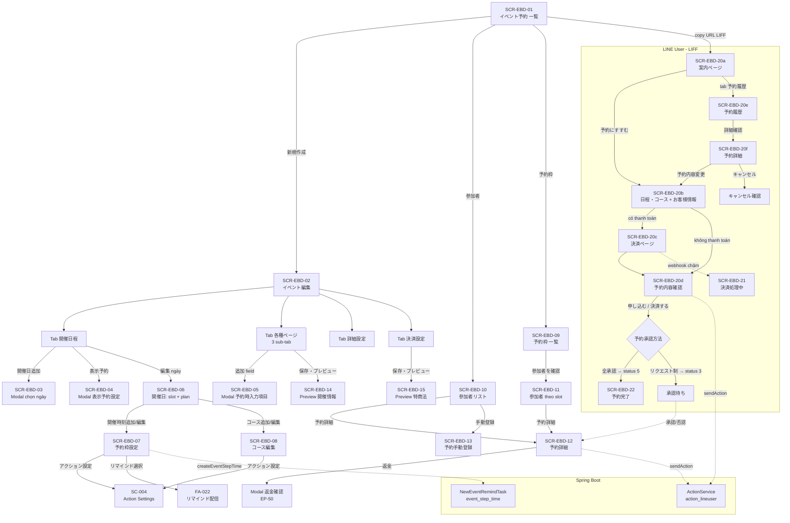
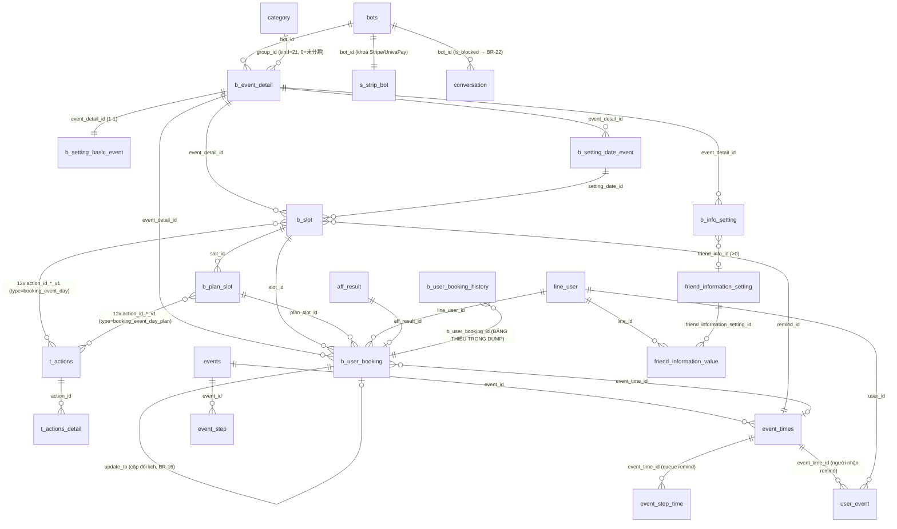

# FA-021 — Đặt lịch sự kiện (「イベント予約」)

> **Portal**: Admin (LINE OA) + Staff + trang public cho LINE User (LIFF)
> **Feature folder**: `features/admin/event-booking/`
> **Prefix màn hình**: `SCR-EBD-xx` (EBD = Event Booking Day)
> **Ngày biên soạn**: 2026-07-13 · Biên soạn bởi: spec-compiler
> **Phạm vi kỹ thuật**: bộ **event day (v2)** — `b_event_detail.type_event_new = 1`

**Nguồn dữ liệu**: `ui/ui-spec.md` · `web/api-spec.md` · `web/logic-spec.md` · `job/job-spec.md` · `db/db-mapping.md` · `_internal/validation-report.md`

---

## Mục lục

1. [Tổng quan](#1-tổng-quan)
2. [Các màn hình + Luồng xử lý end-to-end](#2-các-màn-hình--luồng-xử-lý-end-to-end)
3. [Data Model](#3-data-model)
4. [Field Traceability Matrix](#4-field-traceability-matrix)
5. [Business Rules](#5-business-rules)
6. [API Endpoints](#6-api-endpoints)
7. [Background Jobs](#7-background-jobs)
8. [Luồng thanh toán](#8-luồng-thanh-toán)
9. [Phụ thuộc chéo (Cross-references)](#9-phụ-thuộc-chéo-cross-references)
10. [Gaps và Unknowns](#10-gaps-và-unknowns)
11. [Nợ kỹ thuật / Khuyết tật hệ thống](#11-nợ-kỹ-thuật--khuyết-tật-hệ-thống)
12. [Chất lượng Spec](#12-chất-lượng-spec)

---

## 1. Tổng quan

### 1.1 Mục đích tính năng

Cho phép doanh nghiệp (Admin LINE OA) tạo và quản lý **sự kiện có đặt chỗ theo ngày** (1日イベント). Mỗi sự kiện có thể có **nhiều ngày tổ chức**, mỗi ngày có **nhiều khung giờ**, mỗi khung giờ có thể chia thành **nhiều gói (コース)** với giá và định mức riêng.

LINE User nhận link LIFF → mở trang đặt chỗ ngay trong LINE → chọn ngày → khung giờ → gói → điền thông tin → (thanh toán nếu bật) → hoàn tất đặt chỗ. Admin quản lý danh sách người tham gia, duyệt/từ chối request, đổi lịch, huỷ, hoàn tiền.

Tính năng tích hợp sâu với các hệ thống dùng chung của LME: **Action Settings** (tự động gắn tag / gửi tin / chạy scenario khi booking thay đổi trạng thái), **リマインド配信** (nhắc lịch qua Spring Boot job), **Stripe / UnivaPay** (thanh toán thẻ), **Elasticsearch** (đồng bộ hồ sơ bạn bè).

### 1.2 Actors

| Actor | Vai trò | Truy cập |
|---|---|---|
| **Admin (LINE OA)** | Tạo/sửa/xoá sự kiện; cấu hình ngày–khung giờ–gói; cấu hình các trang public; cấu hình thanh toán; quản lý người tham gia; duyệt/từ chối request; đặt chỗ hộ; hoàn tiền | Portal `/basic/booking-event-day/*` |
| **Staff** | Cùng giao diện Admin, giới hạn theo custom role (whitelist route qua `getRouterBotInvite()`). ⚠ **Chưa xác định** menu 「イベント予約」 có nằm trong danh sách phân quyền hay không | Portal `/basic/*` (middleware `basic_access`) |
| **LINE User** | Đặt chỗ, xem lịch sử, đổi lịch, huỷ, thanh toán thẻ | LIFF `https://liff.line.me/{liffId}?booking_event_id={id}` → `/mobile/event-booking/index/{hash_event_id}` |

### 1.3 Phạm vi

**Trong phạm vi**:
- Toàn bộ 24 màn hình `SCR-EBD-01` → `SCR-EBD-22` (15 màn Admin + 4 tab con + 9 state LIFF của LINE User)
- ~71 endpoint (`EP-01` → `EP-82`), 4 controller Laravel
- 7 bảng primary + ~25 bảng phụ trợ
- Background jobs: remind, action, delay message, sync ES
- Thanh toán: Stripe + UnivaPay, webhook, hoàn tiền

**Ngoài phạm vi**:
- Bộ **booking_event v1** (`type_event_new = 0`) — hệ thống sự kiện cũ, **dùng chung bảng nhưng khác controller** (`BookingEventController` / `BookingEventManagementController`). Là tính năng riêng.
- Tính năng **複数日イベント** (sự kiện nhiều ngày) — code lọc UI đã bị comment out → **đã bị vô hiệu hoá**.
- FA-022 「リマインド配信」 — chỉ tham chiếu qua dropdown 「リマインド選択」.
- FA-020 「サロン・面談予約」 — tính năng đặt lịch khác, không dùng chung bảng.

### 1.4 Điều kiện tiên quyết

| Điều kiện | Chi tiết | Hệ quả nếu thiếu |
|---|---|---|
| **LIFF ID bắt buộc** | Bot phải có `bots.liff_app_id_booking` (fallback `bots.liff_app_id`) | Màn hình danh sách hiện cảnh báo đỏ 「LIFF IDを登録してください (登録方法)」; nút 「新規作成」 → `alert('LIFF IDを登録してください')` — **không tạo được sự kiện** |
| **Giới hạn theo gói (BR-01)** | `free` / `plan_type = 2` → tối đa **2** sự kiện · `standard` → tối đa **10** · `pro` → **không giới hạn** | Vượt hạn: 「現在のプランは利用できない機能です。アップグレードが必要になります。」 (free) hoặc 「スタンダードプランの上限に達しています。制限を解除する場合は、プロプランへの変更が必要になります。」 (standard) |
| **Bot không đang backup (BR-03)** | `backup_history.status ∉ {0, 1}` với `code = bot.transfer_code` | Mọi thao tác ghi trả HTTP 500 + `MESSAGE_NOTIFY_BACKUP` |
| **Cổng thanh toán (nếu bật 決済)** | Stripe: `bots.status_strip_bot = 3` · UnivaPay: `bots.univapay_app_id` ≠ rỗng · khoá lưu ở `s_strip_bot` | Dropdown 「利用する決済システム」 không hiện option tương ứng |
| **Có ít nhất 1 khung giờ** | Validation JS khi lưu sự kiện | 「予約枠は最低1つ以上は登録してください。」 |
| **Có コース nếu muốn thu tiền** | Giá tiền (`b_plan_slot.price`) chỉ tồn tại ở cấp コース | UI cảnh báo: 「決済はコースの料金設定に紐づきますので決済を利用する場合は、コース設定が必須となります。」 |

---

## 2. Các màn hình + Luồng xử lý end-to-end

### 2.0 Kiến trúc dữ liệu 4 tầng (nền tảng của mọi màn hình)

```
イベント (Event)                          b_event_detail        ← thông tin chung, trang public, thanh toán
  ├── b_setting_basic_event               (1–1)                 ← cấu hình chung: định mức, hiển thị, bản đồ
  ├── b_info_setting                      (1–n)                 ← field form 「予約時入力項目」
  │
  └── 開催日 (Setting Date)               b_setting_date_event  ← 1 ngày tổ chức + thời điểm mở bán
        └── 予約枠 (Slot / khung giờ)     b_slot                ← giờ, 定員, 締切, 承認方法, 12 action_v1, remind
              └── コース (Plan / gói vé)  b_plan_slot           ← 料金, 定員 riêng, 12 action_v1  (TUỲ CHỌN)
                    └── 予約 (Booking)    b_user_booking        ← status 1–7, thanh toán, đáp án form (JSON)
```

**Quy tắc ưu tiên**:
- Slot **có thể không có** コース → dùng 定員 của chính slot, không thu tiền.
- Nếu **có** コース → コース **ghi đè** 定員 (`b_plan_slot.limit`) và cung cấp 料金 (`b_plan_slot.price`).
- `b_plan_slot.using_max_slot = 1` → コース **dùng chung** 定員 của slot thay vì 定員 riêng.
- Action: cờ `b_slot.using_action_slot_*` quyết định lấy action của **コース** (ưu tiên, fallback slot) hay chỉ của **slot** (BR-17).

---

## PHẦN A — Màn hình Admin

### 2.1 SCR-EBD-01 — Danh sách sự kiện 「イベント予約」

**Nguồn**: [Quan sát UI thật] — Độ tin cậy **Cao** · Screenshot: `ui/screenshots/01-list-event.png`

| Thành phần | Chi tiết |
|---|---|
| **URL** | `GET /basic/booking-event-day/list-event` (EP-01) |
| **Controller** | `BookingEventDayManagementController@listBookingEvent` (`:63-86`) |
| **JS** | `/js/booking_event_day/index.js` (Vue 2) |

**Layout**: 2 cột — cột trái (20%) panel 「フォルダ」 (SC-008 candidate); cột phải (78%) toolbar + bảng danh sách. Cảnh báo đỏ 「LIFF IDを登録してください」 khi thiếu LIFF.

**Cột bảng**: `(checkbox)` | 「作成日/管理名」 | 「イベントページ」 (URL LIFF + icon copy + 👁 preview) | 「参加予定」 | 「定員」 | 「承認待ち」 | 「参加済み」 | 「参加者リスト」 | 「予約枠一覧」 | `⋯` (コピー/削除)

**Luồng end-to-end**:

| # | User action | UI | API | Business logic | DB | Response → UI |
|---|---|---|---|---|---|---|
| 1 | Mở trang | Load HTML | **EP-01** | `listBookingEvent` — lấy `liff_app_id_booking`, đọc cookie `folder_event_booking_day`, validate folder tồn tại (`category.kind = 21`, `is_deleted = 0`) | READ `bots`, `category` | Render view + **ghi cookie** (TTL 14.400 phút, path `/basic/booking-event-day/list-event`) |
| 2 | Vue mounted / phân trang / tìm kiếm | AJAX | **EP-20** `POST /ajax/get-list-event-day` | `ajaxGetListEvent` — hub đa chức năng; luôn trả folder + sự kiện (paginate 20) + cờ giới hạn gói (`isAdd`, `msg_plan`) | READ `b_event_detail` (`type_event_new = 1`), `category`, `b_slot`, `b_user_booking`. `convertDataSlot()` (`:477-570`) tính `max`, `number_approve_doing`, `number_approve_done`, `hashIdEvent` | Bảng + panel folder |
| 3 | Click folder | — | **EP-18** `GET /basic/event-booking-day/set-cookie?type=event_booking_day&folder_id={id}` | `BasicController@folderSetCookie` (`:2093-2108`) | **Không đổi DB** — chỉ ghi cookie | Body rỗng + `Set-Cookie` |
| 4 | 「新規作成」 | Nút | — | Kiểm tra LIFF ID (client) | — | → SCR-EBD-02, hoặc `alert()` |
| 5 | Tạo/sửa/xoá folder, sắp xếp, di chuyển | Modal | **EP-20** (`action = addAndEditGroup` \| `deleteGroup` \| `sortFolder` \| `moveItem`) | CRUD `category` (`kind = 21`); xoá folder = soft delete `is_deleted = 1` nhưng **xoá cứng toàn bộ event bên trong** (BR-24) | WRITE `category`, `b_event_detail` | Reload danh sách |
| 6 | 「一括削除」 / 「削除」 | Nút | **EP-20** (`action = removeEvents` \| `removeEvent`) | **Xoá cascade THỦ CÔNG** (`:208-215`): `b_event_detail` → `b_setting_date_event` → `b_slot` → `b_plan_slot` → `b_user_booking` → `b_setting_basic_event`; xoá `event_step_time` / `event_times` / `user_event` khi slot có `remind_id` và là slot cuối dùng remind đó | DELETE 6+ bảng (⚠ **không có transaction**) | Reload |
| 7 | 「コピー」 | Dropdown | **EP-43** `POST /ajax/booking-event-day/copy-booking-event` | `copyBookingEvent` (`:5608`) — copy sâu event + ngày + slot + plan + clone action | INSERT nhiều bảng | Reload |

**Trạng thái rỗng**: 「データがありません。」 (đây là trạng thái quan sát được — tài khoản test không có event).

---

### 2.2 SCR-EBD-02 — Tạo / sửa sự kiện 「イベント編集」 (khung + 4 tab)

**Nguồn**: [Quan sát UI thật] — **Cao** · Screenshot: `ui/screenshots/02-add-event.png`

| Thành phần | Chi tiết |
|---|---|
| **URL** | `GET /basic/booking-event-day/add` (EP-02) · `GET /basic/booking-event-day/{id}/edit` (EP-03) |
| **Controller** | `BookingEventDayController@create` (`:1089`) / `@edit` (`:1130`) → view **`add_v2`** |
| **JS** | `/js/booking_event_day/setting_booking_event.js` (~126KB, Vue 2) |

> Heading luôn là 「イベント編集」 kể cả khi tạo mới. View `add.blade.php` (bản cũ) **không được dùng**.

**Vùng chung (mọi tab)**: 「イベント名（管理用）」 (≤20 ký tự) · 「フォルダ」 (select) · 「LINEトーク画面 表示設定」 → 「タイトル」 (≤50) + 「説明」 (≤50) + thumbnail preview LINE card.

**Nạp dữ liệu**: **EP-23** `POST /ajax/ajaxGetSettingEditDataDay` → `ajaxGetSettingEditData` (`:205-313`) trả `event` (kèm slots), `bSettingCommon` (+ action đã resolve chi tiết), `settingInfos`. **EP-24** `POST /ajax/initDataSettingBasicEvent` nạp lại tab cài đặt.

> ⚠ **Đặc điểm quan trọng của wizard**: **MỌI step lưu đều có thể tạo mới `b_event_detail`** nếu `eventId` rỗng → mọi step đều **re-check giới hạn gói** (BR-02, ticket `#37292`). Điều này chống bypass bằng cách mở link trực tiếp hoặc mở nhiều tab.

#### 2.2a SCR-EBD-02a — Tab 「開催日程」 (Lịch tổ chức)

Screenshot: `ui/screenshots/03-tab-schedule.png`

| # | User action | API | Business logic | DB | Job |
|---|---|---|---|---|---|
| 1 | 「開催日追加」 → modal lịch multi-select (**SCR-EBD-03**) → 「追加」 | **EP-31** `POST /ajax/booking-event-day/addDateSlot` | `addDateSlot` (`:6289-6359`) — thêm từng ngày trong `dates_picker` (JSON array), **bỏ qua ngày đã tồn tại**. Re-check BR-01 | INSERT `b_setting_date_event` | — |
| 2 | Nạp danh sách ngày + slot | **EP-32** `POST /ajax/booking-event-day/initDateSlot` | `initDateSlot` (`:6360`) | READ `b_setting_date_event`, `b_slot` | — |
| 3 | Bật 「表示予約」 → modal **SCR-EBD-04**: 「開催」[N]「日前の」[HH:MM] → 「保存」 | **EP-40** `POST /ajax/ajaxSaveDurationSettingDate` | `ajaxSaveDurationSettingDate` (`:6494-6530`) — **BR-15**: `date_show_slot = date_start − duration`. Thiếu `duration` **hoặc** `time` → set cả 3 cột = `NULL` (mở bán ngay) | UPDATE `b_setting_date_event.duration`, `.date_show_slot`, `.time_show_slot` | — |
| 4 | 「編集」 trên 1 ngày | — | — | — | → SCR-EBD-06 |

Hiển thị mỗi ngày: ngày + danh sách khung giờ; chưa có giờ → 「開催時間が登録されていません」; giờ kết thúc rỗng → 「指定なし」.

#### 2.2b SCR-EBD-02b — Tab 「各種ページ」 (3 sub-tab)

Screenshot: `ui/screenshots/04-tab-pages.png` (sub-tab 1 quan sát thật; sub-tab 2–3 dựng từ Blade)

| Sub-tab | Nội dung | API lưu | DB |
|---|---|---|---|
| **1. 「イベント案内」** | 「ヘッダー画像」 (png/jpg) · 「イベントタイトル」 (≤50) · 「詳細情報」上段/下段 (**TinyMCE — SC-005**) · 「ボタン」 表示テキスト (≤10, default 「予約にすすむ」) · 「カラー設定」 背景色 `#08bf5a` / 文字色 `#ffffff` | **EP-26** `POST /ajax/booking_event_day/save` → `saveSettingEvent` (`:1321-1431`) | UPDATE `b_event_detail`: `title_event`, `content_top`, `content_bottom`, `name/bg/color_button_info_event`, `image`. **Upload ảnh**: `public/{FOLDER_MEDIA}media/images/{userId}/{botId}/booking/`, Intervention ImageManager driver **imagick** → `orientate()` → resize max **2048px** |
| **2. 「友だち入力項目」** + 「利用規約」 | Bảng field 「表示項目名」/「紐つけ友だち情報」/「必須／任意」 + nút 「追加」 → **SCR-EBD-05**. Section 「利用規約」: 表示 toggle + 同意チェックボックス toggle + 利用規約文章 (TinyMCE) | **EP-27** `POST /ajax/booking-event-day/saveSettingStep2` → `saveSettingStep2` (`:511-614`) | UPDATE `b_event_detail`: `is_use_terms`, `content_terms`, `is_use_checkbox`, `name/bg/color_button_info_friend`. INSERT/UPDATE `b_info_setting` (field mới → `is_mapping_info = 1` **hardcode** `:576`; field cũ → chỉ update `order_index`) |
| **3. 「確認・完了ページ」** | 「予約内容確認ページボタン設定」 + 「予約完了ページ」 radio 3 lựa chọn | **EP-28** `POST /ajax/booking-event-day/saveSettingStep3` → `saveSettingStep3` (`:615-679`) | UPDATE `b_event_detail`: `name/bg/color_button_confirm_detail`, `flag_page_end` (`0` = quay về chat / `1` = URL ngoài / `2` = text), `url_page_outsite_end`, `page_end_simple` |

Thao tác field form: **EP-41** `deleteSettingInfo` (xoá) · **EP-42** `changeMappingInfo` (toggle `is_mapping_info` / `is_show`) · **EP-53** `getFriendInfoTypeSelect` (lấy option 友だち情報).

> ⚠ Khi **bật thanh toán**: 2 field mặc định 「お名前」 (`friend_info_id = -1`) và 「メールアドレス」 (`friend_info_id = -3`) bị **ép bắt buộc và không xoá được** — vì cổng thanh toán yêu cầu (BR-19).

#### 2.2c SCR-EBD-02c — Tab 「詳細設定」

Screenshot: `ui/screenshots/05-tab-detail.png`

| Section | Field | API | DB |
|---|---|---|---|
| 「基本設定」 | 「1回の予約上限」 (default `1`, + checkbox 「人数を範囲で指定」 → min〜max) · 「予約可能回数」 (3 option) · 「予約単位変更」 (≤3 ký tự, default 「人」) | **EP-25** `POST /ajax/booking_event_day/save-setting-basic` với `type = info` → `saveSettingBasicEvent` (`:1191-1320`) | UPDATE `b_setting_basic_event`: `limit_people`, `is_limit_people`, `min_people`, `type_times_booking`, `is_set_each_booking`, `unit_booking`, `max_number` |
| 「予約枠表示設定」 | 「予約枠の残数」 · 「受付期間終了した予約枠」 · 「満席の予約枠」 (toggle 表示/非表示) | EP-25 | `is_hide_remain`, `is_show_slot_expire`, `is_show_slot_over` — ⚠ **tất cả `1` = 表示, `0` = 非表示** (BR-23; tên `is_hide_remain` **ngược nghĩa**) |
| 「開催情報」 | TinyMCE (SC-005) · 「地図設定」 toggle · Google Maps Places autocomplete | EP-25 | `info_event`, `is_show_map`, `address`, `lat`, `lng` (⚠ lat/lng lưu **varchar**) |

Lần đầu lưu: `saveInfoDefault()` (`:146-203`) tự tạo `b_setting_basic_event` (defaults: `max_number = 0`, `limit_people = 1`, `min_people = 1`, `unit_booking = '人'`, `is_hide_remain = 1`) + 2 field `b_info_setting` mặc định.

> ⚠ Blade `add_v2` còn khối `#tabSettingActionBasic` — 「アクション設定」 mức event (3 nhóm × 4 action, cột không hậu tố `_v1`). Khối này **không xuất hiện trên UI thật**, và DB xác nhận **419/419 bản ghi `b_setting_basic_event` đều mang giá trị mặc định** ở 11 cột action/approval → **các cột này là cột chết, không được dùng**. Cấu hình action thật nằm ở `b_slot` / `b_plan_slot`.

#### 2.2d SCR-EBD-02d — Tab 「決済設定」

Screenshot: `ui/screenshots/06-tab-payment.png`

| Field | API | DB | Ghi chú |
|---|---|---|---|
| 「決済機能の利用」 (利用しない/利用する) | **EP-29** `POST /ajax/booking-event-day/saveSettingBill4` → `saveSettingBill4` (`:681-742`) | ⚠ **Không có cột `is_use_payment`** — trạng thái **Computed** từ `type_system_bill IS NULL OR = 0` | — |
| 「販売環境設定」 (本番環境 / テスト環境) | EP-29 | `flag_environment` — `1` = 本番 (live) / `0` = テスト (test) | ⚠ Radio 本番 được **pre-check trên form**, nhưng **DB default = `0`** (667/671 rows = `0`) |
| 「利用する決済システム」 | EP-29 | `type_system_bill` — `1` = Stripe (hiện khi `bots.status_strip_bot = 3`) / `2` = UnivaPay (hiện khi có `bots.univapay_app_id`) | ⚠ **KHÔNG đổi được sau khi lưu** — 「※保存後の変更はできません」 |
| 「特定商取引法に基づく表記」 (TinyMCE — SC-005) | EP-29 / **EP-30** `saveAndPreviewTermBill` | `content_term_bill` | EP-30 trả `event_id` đã **Hashids::encode** → mở SCR-EBD-15 |

Modal `#cardTestModal` 「ダミーカード番号」 — danh sách thẻ test (デビット / プリペイド).

---

### 2.3 SCR-EBD-06 — Quản lý ngày tổ chức 「開催日」 (slot + plan của 1 ngày)

**Nguồn**: [Dựng từ Blade: `add_slot_date.blade.php` + `add_slot_date.js`] — **Trung bình**
**URL**: `GET /basic/booking-event-day/add-slot-date/{date_id}` (EP-06) → `BookingEventDayController@addSlotDate` (`:5487`)

**Layout**: Header 「開催日」 + datepicker · Toolbar 「開催時刻追加」 (chú giải 👤 = 定員, ¥ = コース料金) · Danh sách slot (mỗi slot: 🕐 giờ, 👤 định mức, icon ✏️/📄/🗑; bên phải là danh sách コース với ✏️/⬆⬇/📄/🗑 + nút 「コース追加」) · Footer 「保存」 / 「開催日を削除」 / 「戻る」 · Modal `#copyAndAddSlotModal` 「コピーする時刻を選択」.

| # | User action | API | Business logic | DB |
|---|---|---|---|---|
| 1 | Mở trang | **EP-33** `initSlotOfDate` (`:6382`) | Nạp slot + plan của 1 ngày | READ `b_slot`, `b_plan_slot` |
| 2 | 「保存」 (lưu hàng loạt) | **EP-39** `POST /ajax/booking-event-day/saveAllSlotPlanDay` | `saveAllSlotPlanDay` (`:6404-6493`) — khi `date_start` đổi → **recompute TOÀN BỘ** `b_slot.date_start_from` và mọi `date_end_*` của slot/plan (BR-13); tạo `event_times` mới + `createEventStepTime()` cho slot có remind | UPDATE `b_slot`, `b_plan_slot`, `b_setting_date_event`; INSERT `event_times`, **`event_step_time`** |
| 3 | 📄 copy slot / copy ngày / copy plan | **EP-45** `copySlot` (`:5857`) · **EP-44** `copyDateEvent` (`:5752`) · **EP-46** `copyPlan` (`:6087`) | Copy sâu kèm `cloneAction()` | INSERT `b_slot` / `b_plan_slot` / `t_actions` / `t_actions_detail` |
| 4 | 🗑 xoá slot / plan / ngày | **EP-48** `deleteSlot` (`:5001`) · **EP-47** `deletePlan` (`:6187`) · **EP-49** `deleteDateSlot` (`:5047`) | Xoá cascade thủ công (kèm `b_user_booking` và action) | DELETE `b_slot`, `b_plan_slot`, `b_user_booking`, `t_actions`, `t_actions_detail`, `b_detail_action_slot` |

**→ Spring Boot**: `event_step_time` mới (status `0`) sẽ được `NewEventRemindTask` quét và gửi remind vào đúng `sent_date_time`.

---

### 2.4 SCR-EBD-07 — Cấu hình khung giờ 「予約枠設定」

**Nguồn**: [Dựng từ Blade: `setting_slot.blade.php` + `setting_slot.js`] — **Trung bình**
**URL**: `GET /basic/booking-event-day/detail-slot/{date_id}` (EP-05, thêm) · `GET /basic/booking-event-day/edit-slot/{date_id}/{slot_id}` (EP-07, sửa)

#### Section 「予約枠設定」

| Field JP | Bắt buộc | DB column | Ghi chú |
|---|---|---|---|
| 「開催時間」 ★ | **Có** | `time_start`, `time_end`, `is_hide_time_end` | Checkbox 「終了時間を設定しない」 |
| 「締切日時」 「開催」[N]「日前の」[HH:MM] | — | `duration_deadline`, `time_deadline` → **Computed** `date_deadline` (BR-13) | `date_deadline` + `time_deadline` là **NOT NULL** |
| 「定員」 | Không | `number_people` | `NULL` = **không giới hạn**. 「コース別に定員を設定した場合、コースの定員が優先されます。」 |
| 「予約承認方法」 | Có | `approval_system` | **`0` = 全承認** (auto → booking `status = 5`) / **`1` = リクエスト制** (→ `status = 3`) (BR-18) |
| 「予約可能回数」 | Có | `times_booking` | `1` = 何度でも / `2` = chỉ 1 lần (BR-11) |
| 「リマインド配信」 + 「リマインド選択」 | Không | `is_use_remind`, `event_id` → `events.id`, `remind_id` → `event_times.id` | Dropdown lấy từ FA-022 (`Events::getListEventSAfterToDay()`) |

#### Section 「アクション設定」 — 3 nhóm × 4 action (**SC-004**)

| Nhóm | Cấu hình riêng | 4 action slot (cột `b_slot`) |
|---|---|---|
| **予約時** | 「優先アクション」 → `using_action_slot_booking_v1` | `action_id_booking_approve_v1` (予約受付時) · `action_id_booking_admin_approve_v1` (リクエスト申請時) · `action_id_booking_approve_request_v1` (リクエスト承認時) · `action_id_booking_cancel_request_v1` (リクエスト否認時) |
| **予約変更** | radio 全承認/リクエスト制/**不可** → `approval_system_change_request` · 「変更受付期限」 → `duration_change_request` + `time_end_change_request` + `is_no_datetime_end_change_request` · 「優先アクション」 → `using_action_slot_change_request` | `action_id_change_request_booking_approve_v1` · `..._admin_approve_v1` · `..._approve_request_v1` · `..._cancel_request_v1` |
| **予約キャンセル** | radio 全承認/リクエスト制/**不可** → `approval_system_cancel` · 「キャンセル受付期限」 → `duration_cancel` + `time_end_cancel` + `is_no_datetime_end_cancel` · 「優先アクション」 → `using_action_slot_cancel` | `action_id_cancel_booking_approve_v1` · `action_id_cancel_admin_approve_v1` · `action_id_cancel_approve_request_v1` · `action_id_cancel_cancel_request_v1` |

**Luồng lưu**:

| # | Action | API | Logic | DB | Job |
|---|---|---|---|---|---|
| 1 | Nạp dữ liệu slot | **EP-34** `initSlotData` (`:5444`) | Resolve chi tiết action qua `getDetailListAction()` (`:314-334`) | READ `b_slot`, `t_actions`, `t_actions_detail` | — |
| 2 | 「保存」 (luồng chính) | **EP-36** `POST /ajax/booking-event-day/slot_booking_event/save` | `saveSettingSlotEvent` (`:1503-1645`) — suy diễn 3 mốc deadline từ `date_start − duration_*`. Tạo mới: `position = count+1`, `limit_people = 10`, `min_people = 1` (**hardcode**) | INSERT/UPDATE `b_slot` | INSERT `event_times` (`:1623`) + `createEventStepTime()` (`:1628`) → **`event_step_time`** |
| 3 | 「保存」 (luồng cấu hình bổ sung) | **EP-37** `POST /ajax/booking-event-day/save-setting-slot` | `saveSettingSlot` (`:5535-5606`) — **endpoint DUY NHẤT có validation server-side** (`validateFormSaveSlotOfEvent`, `:1718-1779`) | UPDATE `b_slot` | INSERT `event_times`, `event_step_time` |

**Ghi chú UI về remind**: 「予約日程が変更された場合」 → remind cũ dừng, remind của ngày mới chạy · 「予約日程がキャンセルされた場合」 → remind dừng.

---

### 2.5 SCR-EBD-08 — Cấu hình gói 「コース編集」

**Nguồn**: [Dựng từ Blade: `add_plan_slot.blade.php` + `setting_plan_v2.js`] — **Trung bình**
**URL**: `GET /basic/booking-event-day/add-plan/{slot_id}` (EP-09) · `GET /basic/booking-event-day/edit-plan/{plan_id}` (EP-10)

| Field JP | Bắt buộc | DB column | Validation |
|---|---|---|---|
| 「コース名」 | Có | `b_plan_slot.name` | ≤50 ký tự |
| 「定員」 + checkbox 「予約枠の定員の残数に合わせる」 | Không | `limit`, `using_max_slot` | 「1以上入力してください」. `using_max_slot = 1` → dùng chung 定員 slot (BR-07) |
| 「料金」 | Không | `price` | 「料金は50円以上入力してください。」 (khi > 0). Bỏ dấu `.` trước khi lưu (`:5334`) |

**Section 「アクション設定」**: cấu trúc **giống hệt SCR-EBD-07** (3 nhóm × 4 action, cùng tên cột `action_id_*_v1`), khác biệt:
- Nhóm 「予約時」 có thêm 「予約承認」 (`approval_system_booking`) và 「締切日時」 (`duration_end_booking` + `time_end_booking` + `is_no_datetime_end_booking`).
- **Không có 「優先アクション」** — cờ `using_action_slot_*` chỉ tồn tại ở `b_slot` (plan là cấp thấp nhất).

**Lưu**: **EP-38** `POST /ajax/booking-event-day/save-setting-plan` → `saveSettingPlan` (`:5310-5389`); khi tạo `order = max(order) + 1`. Nạp: **EP-35** `initPlanData` (`:5192`).
`t_actions.type = 'booking_event_day_plan'`, `parent_id = b_plan_slot.id`.

---

### 2.6 SCR-EBD-09 — Danh sách khung giờ 「予約枠 一覧」

**Nguồn**: [Dựng từ Blade: `list_slot_event.blade.php`] — **Trung bình**
**URL**: `GET /basic/booking-event-day/event/{id}/slots` (EP-04) → `BookingEventDayManagementController@listSlotOfEvent` (`:88-106`)

**Bộ lọc**: chuyển tháng (`<input type="month">`) · trạng thái (`2` = 未開催のみ [mặc định] / `1` = 開催済のみ / `0` = 全て)

**Danh sách nhóm theo ngày** — mỗi dòng là 1 plan (hoặc 1 slot không có plan):

| Cột | DB | Loại |
|---|---|---|
| Giờ | `b_slot.time_start` / `.time_end` | Direct |
| 「コース名」 | `b_plan_slot.name` (hoặc `-`) | FK |
| 「料金」 | `b_plan_slot.price` | Direct |
| 「予約人数」 | SUM(`b_user_booking.quantity`) WHERE booking active (BR-05) | **Aggregated** |
| 「定員」 | `b_plan_slot.limit` \| `b_slot.number_people` (`NULL` → `-`) | Direct |
| 「リクエスト中」 | COUNT WHERE `status ∈ {3,6,7}` (BR-06) | **Aggregated** |

Ngày < hôm nay → nền xám + nhãn 「開催済み」. Link 「参加者を確認 ›」 → SCR-EBD-11 (tab mới).
**AJAX**: **EP-21** `POST /ajax/get-list-slot-event-day` → `ajaxGetListSlotOfEvent` (`:602-798`) — kiêm cả xoá slot (`removeSlot` / `removeSlots`).

---

### 2.7 SCR-EBD-10 / SCR-EBD-11 — Danh sách người tham gia

**Nguồn**: [Dựng từ Blade: `booking_all_slot.blade.php` / `booking_slot.blade.php`] — **Trung bình**

| Màn hình | URL | Controller | Phạm vi |
|---|---|---|---|
| **SCR-EBD-10** 「参加者リスト」 | `GET /basic/booking-event-day/booking-all-slot/{id}` (EP-11) | `allBooking` (`:1803`) | Toàn sự kiện — **2 tab**: 「日別」 (bảng ma trận theo ngày) / 「一覧」 (danh sách phẳng) |
| **SCR-EBD-11** | `GET /basic/booking-event-day/booking-slot/{slot_id}?planId={plan_id}` (EP-12) | `bookingSlotDay` (`:2175`) | 1 khung giờ |

**Toolbar**: 「手動登録」 (→ SCR-EBD-13) · lọc lịch (未開催/開催済/全て) · tìm 「名・システム表示名」 · lọc trạng thái (`0` 全て / `1` 参加予定 / `3` リクエスト / `4` キャンセル) · sắp xếp (開催日 昇順/降順) · 「表示件数」 100/200/500

**Luồng**:

| # | Action | API | Logic |
|---|---|---|---|
| 1 | Load danh sách | **EP-60** `POST /basic/ajaxAllBooking` (`:1885`) · **EP-61** `POST /basic/ajaxAllBookingOfDay` (`:2371`) · **EP-62** `POST /basic/ajaxBookingSlotDay` (`:2194`) | Filter theo tab/keyword/tháng/trạng thái, paginate |
| 2 | Export CSV | **EP-51** `POST /ajax/booking_event_day/export-csv_tab` (`exportCSV` `:4620`) · **EP-52** `export-csv-slot-or-plan` (`:4754`) · **EP-17** `GET /basic/booking_event_day/download-csv` (`:4747`) | `Maatwebsite\Excel` — **ghi file trực tiếp, đồng bộ**, KHÔNG qua bảng `csv_management` ⚠ Nút export **chưa xác định vị trí trên UI** |
| 3 | 「予約詳細」 | — | → SCR-EBD-12 |

Badge trạng thái: 「参加予定」 / 「参加否認」 / 「リクエスト」 / 「キャンセル」 / 「キャンセルリクエスト」 (map từ `b_user_booking.status` — xem §3.2).

---

### 2.8 SCR-EBD-12 — Chi tiết booking 「予約詳細」 (+ modal 返金)

**Nguồn**: [Dựng từ Blade: `booking_detail.blade.php` + `booking_detail.js`] — **Trung bình**
**URL**: `GET /basic/booking-event-day/detail-booking/{id}` (EP-13) → `detailBooking` (`:2532`); AJAX **EP-63** `POST /basic/ajaxBookingDetail` (`:2542`)

**Khối 「予約情報」** (so sánh 「変更前」 ↔ 「変更後」 khi là 変更リクエスト):

| Field JP | DB | Sửa được? |
|---|---|---|
| 「予約した日」 | `b_user_booking.created_at` | Không |
| 「参加日時」 | `slot_id` → `b_slot` | **Có** (select inline) |
| 「コース名」 | `plan_slot_id` → `b_plan_slot` | **Có** |
| 「参加人数」 | `quantity` | **Có** — 「参加人数は1以上にしてください。」 |
| 「決済金額」 | `amount` | Không |
| 「予約時入力事項」 | `detail_info_user` (**JSON inline**) | **Có** — 「（項目クリックで内容を編集できます）」 |

**Khối 「予約ステータス変更」**:

| # | Action | API | Business logic | DB / Side effects |
|---|---|---|---|---|
| 1 | 「承認」 / 「否認」 (với request) hoặc đổi trạng thái | **EP-66** `POST /basic/booking_event_day/booking-detail/save-action` (= **EP-65**) → `saveActionBooking` (`:3123-3891`) | ① **Chặn nếu đang thanh toán** — `status_webhook ∈ {0,3,4,5,6,7}` → 「決済処理を行っていますので、操作できません。」 (BR-10)<br>② Xử lý **cặp booking** `update_to` khi `status = 6` (BR-16)<br>③ Tính chỗ còn lại (BR-07)<br>④ **Cảnh báo vượt định員** → `admin_confirm: 1` + 「予約枠を超えています。承認しますか？」 (BR-09) — gọi lại với `approveAny = true` để bỏ qua<br>⑤ **Thu tiền khi duyệt** nếu `status = 1 && plan.price > 0` → Stripe `autoPaymentIntents()` / UnivaPay `chargeMoneyUnivapaySale()` (fail → `cancelCharge()`)<br>⑥ `sendActionBookingV1()` (`functions.php:5861+`)<br>⑦ **Recompute** `use_people` / `remain_limit` (BR-08)<br>⑧ Hoa hồng affiliate → `AffResult` | UPDATE `b_user_booking.status`; INSERT `b_user_booking_history`; UPDATE `b_slot.use_people`, `b_plan_slot.remain_limit`; INSERT `action_lineuser` (→ **Spring Boot ActionService**); INSERT/DELETE `user_event`; `MobileNotifyService::insertNotifyEventBooking()` |
| 2 | Radio 「アクションを実行する」/「しない」 | (param của EP-65/66) | Quyết định có `sendAction()` hay không | — |
| 3 | 「返金」 → Modal 「返金確認」 → 「決定」 | **EP-50** `POST /ajax/booking-event-day/refund` → `refundMoneyBookingEvent` (`:1794-1902`) | Xem **§8.3** | UPDATE `status_payment = 2`, `refund_date`, `reason_refund`; INSERT `b_user_booking_history` |

Nút 「返金」 disabled + hiện 「返金済み」 khi `status_payment = 2`.

---

### 2.9 SCR-EBD-13 — Đăng ký booking thủ công 「予約手動登録」

**Nguồn**: [Dựng từ Blade: `add_booking.blade.php`] — **Trung bình**
**URL**: `GET /basic/booking-event-day/add-booking/{id}` (EP-14) → `addBookingIndex` (`:6238`)

⚠ Cảnh báo đầu trang: 「※手動登録の場合は「定員」「予約期限」「予約回数設定」に関係なく予約が登録されます」 — **bỏ qua mọi ràng buộc**.

**Fields**: 「イベント名」 (readonly) · 「参加日時」 (select slot) · 「コース」 (select plan) · 「友だち名」 (autocomplete — ⚠ **hardcode `limit(100)`** bạn bè) · 「参加人数」 · 「予約時入力事項」 (field động) · 「予約受付時アクション」 (radio 実行する/しない)

**Luồng lưu** — **EP-64** `POST /basic/booking_event_day/booking-all-slot/save` → `saveAdminBooking` (`:2633-2871`):

```
1. INSERT b_user_booking   status = 5 (booking), booking_from = 1, event_time_id = slot.remind_id   :2667-2684
2. INSERT b_user_booking_history   reason = '手動予約追加' (hoặc '予約リクエスト' khi status = 3)      :2686-2687
3. Với mỗi field form_info → ghi ngược hồ sơ bạn bè (BR-20)                                        :2688-2795
     friend_info_id = -1 → line_user.view_name  + INSERT sync_elasticsearch  🔶 → SyncEsTask
     friend_info_id = -2/-3/-4/-6 → line_user.phone_number / email / age / province
     friend_info_id > 0  → friend_information_value (+ tăng total_user_has_value)
     luôn: recordFriendInfoHistory(..., trigger '8001')
4. addActionRemind(slotId, bookingId, null, 'admin_booking')   → INSERT user_event                  :2797
5. TĂNG số chỗ đã dùng (increment)   b_slot.use_people += quantity                                  :2798-2804
                                     b_plan_slot.remain_limit += quantity   ⚠ tên ngược nghĩa
6. Nếu action_before_booking == 0 → sendAction(action_id_booking_approve_v1, trigger '8001')        :2806-2838
     → INSERT action_lineuser  🔶 → Spring Boot ActionService
7. MobileNotifyService::insertNotifyEventBooking($booking, 'autoApprove')                           :2860
```

**AJAX phụ**: **EP-22** `POST /ajax/get-all-slot-event-day` → `ajaxGetAllSlotEvent` (`:1651-1688`) — trả slot còn hiệu lực (`date_start_from >= today`) + 100 bạn bè đầu tiên.

⚠ Ghi chú UI: 「有料コースの場合は、決済済みとして予約が登録されます。友だちから参加費を徴収する場合は、銀行振込などでご対応ください。」 — **admin đặt hộ KHÔNG thu tiền qua cổng**.
⚠ **Không có validation server-side** — mọi field lấy thẳng từ `$request`.

---

### 2.10 SCR-EBD-14 / SCR-EBD-15 — Preview

| Mã | URL | Controller | Nội dung |
|---|---|---|---|
| **SCR-EBD-14** | `GET /basic/booking-event-day/preview-event-info/{id}` (EP-16) | `previewEventInfo` (`:6279`) | 「開催情報」 (rich text) + 「もっと見る▼」 + 「会場」 + Google Map |
| **SCR-EBD-15** | `GET /basic/booking-event-day/preview-term-bill/{id}` (EP-15) · mobile: `GET /mobile/booking-event-day/preview-term-bill/{id}` (EP-81) | `previewTermBill` (`:6262`) / `previewTermBillMobile` (`:6271`) | 「特定商取引法に基づく表記」 + nút 「戻る」 |

⚠ `{id}` trong preview-term-bill là **Hashids** (`Hashids::decode()`) — BR-25.

---

## PHẦN B — Màn hình LINE User (LIFF / public, KHÔNG auth)

### 2.11 SCR-EBD-20 — Trang đặt chỗ LIFF (SPA — 7 page state)

**Nguồn**: [Dựng từ Blade: `order/index.blade.php`, `order/choose_slot_plan.blade.php`, `order/history.blade.php` + `order-item.js`] — **Trung bình**
**URL**: `GET /mobile/event-booking/index/{hash_event_id}/{u_code?}` (EP-70) → `MobileEventBookingController@index` (`:98-206`)
**Vào từ**: LIFF `https://liff.line.me/{liff_app_id_booking}?booking_event_id={id}`

SPA Vue một file, chuyển page bằng biến `page`. Header 2 tab: 「予約ページ」 / 「予約履歴」.

| Page state | Mã | Nội dung | API |
|---|---|---|---|
| `index` | **SCR-EBD-20a** | 案内ページ — ảnh header, 「イベントタイトル」, 「詳細情報」 (上段 + 下段 qua 「もっと見る▼」), 「開催情報」 + 「会場」 + Google Map. CTA (label + màu tuỳ chỉnh, default 「予約にすすむ」 nền `#08bf5a`) | EP-70 |
| `booking` | **SCR-EBD-20b** | Chọn 開催日程 → 開催時間 → コース (+ 「残数 N」, 「¥ giá」) → 予約数. Khối 「お客様情報」 (field động). Khối 「利用規約」 + checkbox 同意 | **EP-71** `POST /ajax/booking-event/get-slots` · **EP-80** `POST /mobile/booking-event/get-friend-info` (prefill) |
| `payment` | **SCR-EBD-20c** | 「カード情報入力」 — Stripe Elements (`#card-number`, `#card-expiry`, `#card-cvc`) hoặc UnivaPay (`#checkout`). Sau đó 「お支払い方法」 = クレジットカード払い（一括）+ 4 số cuối. Link 「特定商取引法に基づく表記」 | **EP-77** `createCustomerIdUnivapay` · **EP-78** `getInfoCardPayment` |
| `confirm` | **SCR-EBD-20d** | 「予約内容確認」 — 「まだ予約は完了していません」. Bảng イベント名/参加日程/コース/予約数/料金/お客様情報. Nếu slot リクエスト制 → 「この予約はリクエスト制となります」 | — |
| — | | Nút 「申し込む」 / 「決済する」 | **EP-72** `POST /ajax/booking-event/payment` |
| `history` | **SCR-EBD-20e** | 「予約履歴」 — イベント名 / 参加日程 / ステータス / 「詳細確認」 | **EP-79** `POST /mobile/get-history-booking-app` |
| `booking-detail` | **SCR-EBD-20f** | 「予約詳細」 + nút 「予約内容変更」 (nếu 予約変更 ≠ 不可 và còn hạn) / 「キャンセル」 | **EP-73** `change-booking` · **EP-74** `cancel-v2` |
| — | **SCR-EBD-21** | 「決済処理を行っています」 — chờ webhook. 「決済の成功・失敗が確定しましたら LINE へのメッセージ送信でお知らせいたします。」 | (webhook **EP-82**) |
| — | **SCR-EBD-22** | 「予約サイト」 — 「ご予約ありがとうございました。」 | — |

**Luồng end-to-end — LINE User đặt chỗ (EP-72 `payment`, `:706-1493`)**:

```
1. FE: chọn slot/plan/số lượng → điền お客様情報 → tick 利用規約
2. Hiển thị slot/plan (EP-71 getSlots :207-455) — lọc theo:
     b_setting_date_event.date_show_slot / time_show_slot   (BR-15 — chưa tới giờ mở bán → ẩn)
     is_show_slot_expire = 0 → ẩn slot hết hạn
     is_show_slot_over   = 0 → ẩn slot đầy
     is_hide_remain      = 1 → HIỆN 「残数 N」   (⚠ tên cột ngược nghĩa — BR-23)
     type_times_booking  = 2 → ẩn slot user đã đặt (BR-11)
3. POST EP-72 → INSERT b_user_booking
     ├─ KHÔNG thanh toán:
     │     slot.approval_system = 0 (全承認)     → status = 5  → action 8001 「予約受付時」
     │     slot.approval_system = 1 (リクエスト制) → status = 3  → action 8002 「予約リクエスト申請時」
     └─ CÓ thanh toán:
           status_webhook = 0 (UNPROCESSED)
           → Stripe autoPaymentIntents() / UnivaPay chargeMoneyUnivapaySale(metadata.module='event-booking')
           → poll EventBookingService::checkStatusProcessCallback($bookingId, 25)
           → webhook charge_finished → status_webhook = 1, status_payment = 1
           → quá hạn → status_webhook = 3 (TIMEOUT) / 4 (TIMEOUT_WEBHOOK) → SCR-EBD-21
4. Ghi ngược hồ sơ bạn bè (BR-20) + INSERT sync_elasticsearch  🔶
5. addActionRemind() → INSERT user_event  → step remind before_day = -1 GỬI NGAY (đồng bộ)
6. INSERT action_lineuser  🔶 → Spring Boot ActionService thực thi action
7. Kết thúc → flag_page_end:  0 = về chat LINE / 1 = URL ngoài / 2 = trang text (SCR-EBD-22)
```

**Đổi lịch (EP-73 `changeBooking`, `:1712-2508`)** — tạo **2 bản ghi** liên kết qua `update_to` (BR-16). **Huỷ (EP-74 `cancelUserBooking`, `:1572-1711`)** — `status = 4` (全承認) hoặc `status = 7` (リクエスト制).
**Rollback khi thanh toán fail**: **EP-75** `deleteBookingConfirmFail` (`:1511`) / **EP-76** `rollbackChangeBookingConfirmFail` (`:1527`).

---

### 2.12 Flow Diagram tổng thể



---

## 3. Data Model

### 3.1 Entities chính (7 bảng primary)

| # | Bảng | Model Eloquent | Số cột | Data size | Vai trò |
|---|---|---|---|---|---|
| 1 | `b_event_detail` | `BEventDetail` | 48 | 228 KB | **Sự kiện** — thông tin chung, các trang public, cấu hình thanh toán. Phân biệt v1/v2 bằng `type_event_new` |
| 2 | `b_setting_basic_event` | `BSettingBasicEvent` | 47 | 145 KB | Cấu hình chung mức event (1–1 với event): số người, hiển thị slot, bản đồ. ⚠ 11 cột action/approval mức event là **cột chết** |
| 3 | `b_setting_date_event` | `BSettingDateEvent` | 9 | 126 KB | **開催日** — 1 ngày tổ chức + thời điểm mở bán slot |
| 4 | `b_slot` | `BSlot` | 80 | 391 KB | **予約枠** — giờ, 定員, 締切, 承認方法, remind, **12 cột action `_v1`** |
| 5 | `b_plan_slot` | `PlanSlot` | 48 | 204 KB | **コース** — 料金, 定員 riêng, **12 cột action `_v1`** |
| 6 | `b_user_booking` | `BBooking` | 49 | 723 KB | **予約** — status 1–7, thanh toán (Stripe/UnivaPay), đáp án form (JSON inline) |
| 7 | `b_info_setting` | `BInfoSetting` | 15 | 230 KB | Định nghĩa field 「予約時入力項目」 của form đặt chỗ |

**Bảng phụ trợ quan trọng**: `t_actions` + `t_actions_detail` (đích của 24 cột `action_id_*_v1`) · `category` (`kind = 21` — folder) · `line_user` · `bots` · `s_strip_bot` · `events` / `event_times` / `event_step` (remind) · `friend_information_setting` / `friend_information_value` · `conversation` · `aff_result` · `backup_history`.

**Bảng hàng đợi (→ Spring Boot)** 🔶: `event_step_time` · `action_lineuser` · `send_random_messages` · `sync_elasticsearch` · `scenario_step_time` · (`user_event`, `event_times` = bảng tra cứu, không poll)

> ⛔ **`b_user_booking_history`** — Model `BUserBookingHistory` được ghi ở `saveAdminBooking`, `saveActionBooking`, `refundMoneyBookingEvent` nhưng **bảng KHÔNG có trong DB dump**. Bằng chứng phản chứng (295 booking đã đi qua `saveActionBooking` thành công) cho thấy **bảng TỒN TẠI trên production — chỉ thiếu trong dump**. Xem §10.

### 3.2 Enum quan trọng

#### `b_user_booking.status` — 7 trạng thái (nguồn: `config/sns-line.php:398-407`)

| Giá trị | Hằng số | Hiển thị UI | Ý nghĩa | Sample (968 rows) |
|---|---|---|---|---|
| `1` | approve | 「参加予定」/「承認」 | Đã duyệt (qua リクエスト制) | 149 |
| `2` | deny | 「否認」 | Bị từ chối | 40 |
| `3` | pending | 「承認待ち」/「リクエスト」 | Chờ Admin duyệt | 195 |
| `4` | cancel | 「キャンセル」 | Đã huỷ | 106 |
| `5` | **booking** | 「予約済み」/「参加予定」 | **Đặt thành công qua slot 全承認** (auto) | **427** |
| `6` | request_change | 「変更リクエスト」 | Yêu cầu đổi lịch (tồn tại cặp `update_to`) | 35 |
| `7` | request_cancel | 「キャンセルリクエスト」 | Yêu cầu huỷ | 7 |
| ⚠ `0` | — | KHÔNG XÁC ĐỊNH | 9 rows trong dump, **không có trong config** | 9 |

**Nhóm phái sinh**:
- **Booking "active"** (tính vào 定員 — BR-05): `status ∈ {1, 5}` **OR** (`status = 6` AND `update_to IS NULL`) **OR** `status = 7`
- **Booking "chờ xử lý"** 「リクエスト中」 (BR-06): `status ∈ {3, 6, 7}`

#### Các enum khác

| Cột | Giá trị |
|---|---|
| `b_user_booking.status_payment` | `0` = chưa TT · `1` = đã TT · `2` = **返金済み** |
| `b_user_booking.status_webhook` | `NULL` = không qua TT · `0` UNPROCESSED · `1` PROCESSED · `2` ERROR · `3` TIMEOUT · `4` TIMEOUT_WEBHOOK · `5` UNPROCESSED_CHANGE · `6` TIMEOUT_CHANGE · `7` TIMEOUT_WEBHOOK_CHANGE |
| `b_slot.approval_system` | **`0` = 全承認** (→ booking status `5`) · **`1` = リクエスト制** (→ `3`) |
| `approval_system_change_request` / `_cancel` | `0` = 全承認 · `1` = リクエスト制 · **`2` = 不可** |
| `b_event_detail.type_system_bill` | `NULL`/`0` = không TT · **`1` = Stripe** · **`2` = UnivaPay** |
| `b_event_detail.flag_environment` | `0` = テスト環境 (**DB default**) · `1` = 本番環境 |
| `b_event_detail.flag_page_end` | `0` = về chat · `1` = URL ngoài (`url_page_outsite_end`) · `2` = text (`page_end_simple`) |
| `b_info_setting.friend_info_id` | `0` 利用しない · `-1` システム表示名 → `line_user.view_name` · `-2` 携帯電話 · `-3` メールアドレス · `-4` 年齢 · `-6` 都道府県 · `>0` → `friend_information_setting.id` |
| `b_info_setting.type` | `0` = 長文回答 · `1` = 短文回答 · `2` = 選択肢回答 (⚠ COMMENT schema lỗi thời — đã xác nhận từ `add_v2.blade.php:2936-2940`) |
| `b_user_booking.action_before_booking` | ⚠ **`0` = CÓ thực thi action** / `1` = KHÔNG (ngược trực giác) |
| `b_setting_basic_event.is_hide_remain` | ⚠ **`1` = 表示 / `0` = 非表示** (tên cột **ngược nghĩa** — BR-23) |
| `b_plan_slot.remain_limit` | ⚠ **Số ĐÃ DÙNG**, không phải "còn lại" (BR-08) |

### 3.3 ER Diagram



> ⚠ **KHÔNG có FOREIGN KEY constraint** trên bất kỳ bảng nào trong 7 bảng primary — mọi quan hệ chỉ là quy ước Eloquent. Kết hợp với **không có DB transaction** và **xoá cascade thủ công bằng PHP** → rủi ro dữ liệu mồ côi cao (xem §11).

### 3.4 Cơ chế 定員 / `use_people` / `remain_limit`

```
Định員 (capacity):
  b_slot.number_people           → 定員 slot (NULL = vô hạn)
  b_plan_slot.limit              → 定員 plan (NULL = vô hạn)
  b_plan_slot.using_max_slot = 1 → plan DÙNG CHUNG 定員 của slot

Số ĐÃ DÙNG (⚠ CẢ HAI cột đều là "đã dùng", KHÔNG phải "còn lại"):
  b_slot.use_people              ← SUM(quantity) booking active của slot
  b_plan_slot.remain_limit       ← SUM(quantity) booking active của plan   ⚠ TÊN GÂY HIỂU NHẦM

Chỗ còn lại (Computed — saveActionBooking:3216-3236):
  IF   plan.using_max_slot = 1      → slot.number_people − slot.use_people
  ELIF slot.number_people ≠ NULL    → slot.number_people − slot.use_people
  ELSE                              → plan.limit − plan.remain_limit
```

⚠ **Không nhất quán**: `saveAdminBooking` dùng **increment** (`+= quantity`), `saveActionBooking` **recompute** lại từ tổng. Cộng với việc không có transaction → 2 cột này có nguy cơ **lệch (drift)** so với thực tế.

---

## 4. Field Traceability Matrix

> Chỉ liệt kê các field nghiệp vụ chính. Mapping đầy đủ 157 field: xem `db/db-mapping.md` §5.

| # | UI Element | Màn hình | DB Table.Column | Hướng | Validation | Business Rule |
|---|---|---|---|---|---|---|
| 1 | 「イベント名（管理用）」 | SCR-EBD-02 | `b_event_detail.title` | ⇄ | ≤20 ký tự (**client-only**; DB varchar(255)) | — |
| 2 | 「フォルダ」 | SCR-EBD-02 | `b_event_detail.group_id` → `category.id` | ⇄ | — | BR-24 (`kind = 21`; `0` = 未分類) |
| 3 | 「タイトル」 / 「説明」 (LINE card) | SCR-EBD-02 | `b_event_detail.line_title` / `.line_explain` | ⇄ | ≤50 (client) | — |
| 4 | 「イベントページ」 URL | SCR-EBD-01 | *Computed*: `bots.liff_app_id_booking` + `b_event_detail.id` | → | — | BR-25 (👁 preview dùng `Hashids::encode(id)`) |
| 5 | 「参加予定」 | SCR-EBD-01 | *Aggregated*: COUNT(`b_user_booking`) trên slot chưa diễn ra | → | — | BR-05 |
| 6 | 「承認待ち」 | SCR-EBD-01, 09 | *Aggregated*: COUNT WHERE `status ∈ {3,6,7}` | → | — | BR-06 |
| 7 | 「定員」 (tổng event) | SCR-EBD-01 | *Aggregated*: SUM(`b_slot.number_people`) \| SUM(`b_plan_slot.limit`) | → | — | BR-07 |
| 8 | 「ヘッダー画像」 | SCR-EBD-02b | `b_event_detail.image` | ⇄ | png/jpg; resize max 2048px (imagick) | — |
| 9 | 「イベントタイトル」 | SCR-EBD-02b | `b_event_detail.title_event` | ⇄ | ≤50 (client). Rỗng → dùng `line_title` | — |
| 10 | 「詳細情報」 上段/下段 | SCR-EBD-02b | `b_event_detail.content_top` / `.content_bottom` | ⇄ | — (TinyMCE, **SC-005**) | 下段 rỗng → ẩn 「もっと見る▼」 |
| 11 | 「ボタン」 表示テキスト + カラー | SCR-EBD-02b | `name/bg/color_button_info_event` | ⇄ | ≤10 ký tự; hex | Default 「予約にすすむ」 / `#08bf5a` / `#ffffff` |
| 12 | 「表示項目名」 | SCR-EBD-05 | `b_info_setting.title` | ⇄ | ≤30 — 「入力項目名は30文字以内で入力してください。」 | — |
| 13 | 「紐付け友だち情報」 | SCR-EBD-05 | `b_info_setting.friend_info_id` | ⇄ | 「紐つけ友だち情報を入力してください。」 | **BR-20** (âm → `line_user.*`; dương → `friend_information_value`) |
| 14 | 「回答タイプ」 | SCR-EBD-05 | `b_info_setting.type` | ⇄ | — | `0` 長文 / `1` 短文 / `2` 選択肢 |
| 15 | 「必須／任意」 | SCR-EBD-05 | `b_info_setting.is_require` | ⇄ | — | `1` = 必須 |
| 16 | 「お名前」/「メールアドレス」 (mặc định) | SCR-EBD-02b | `b_info_setting` (`friend_info_id = -1` / `-3`, `is_default = 1`) | → | Không xoá được khi bật TT | **BR-19** |
| 17 | 「利用規約の表示」 / 「同意チェックボックス」 / 「利用規約文章」 | SCR-EBD-02b | `is_use_terms` / `is_use_checkbox` / `content_terms` | ⇄ | — | — |
| 18 | 「予約完了ページ」 | SCR-EBD-02b | `flag_page_end` + `url_page_outsite_end` \| `page_end_simple` | ⇄ | URL: 「URLのフォーマットで入力してください。」 | `0`/`1`/`2` |
| 19 | 「1回の予約上限」 (min〜max) | SCR-EBD-02c | `b_setting_basic_event.limit_people` / `.min_people` / `.is_limit_people` | ⇄ | 「最大は、最低より大きな数字を入力してください。」 | ⚠ `tinyint` → **trần 127** |
| 20 | 「予約可能回数」 | SCR-EBD-02c | `b_setting_basic_event.type_times_booking` | ⇄ | — | **BR-11** (`1` 何度でも / `2` 各予約枠 / `3` このイベント) |
| 21 | 「各日程ごとに設定する」 | SCR-EBD-02c | `b_setting_basic_event.is_set_each_booking` | ⇄ | — | **BR-12** |
| 22 | 「予約単位変更」 | SCR-EBD-02c | `b_setting_basic_event.unit_booking` | ⇄ | ≤3 ký tự | Default 「人」 |
| 23 | 「予約枠の残数」 | SCR-EBD-02c | `b_setting_basic_event.is_hide_remain` | ⇄ | — | ⚠ **BR-23** — `1` = **表示** (tên ngược nghĩa) |
| 24 | 「受付期間終了した予約枠」 / 「満席の予約枠」 | SCR-EBD-02c | `is_show_slot_expire` / `is_show_slot_over` | ⇄ | — | BR-23 |
| 25 | 「開催情報」 + 「地図設定」 + địa chỉ | SCR-EBD-02c | `info_event`, `is_show_map`, `address`, `lat`, `lng` | ⇄ | `address` ≤255 | ⚠ `lat`/`lng` lưu **varchar** |
| 26 | 「決済機能の利用」 | SCR-EBD-02d | *Computed* từ `type_system_bill IS NULL OR = 0` | → | — | ⚠ **Không có cột `is_use_payment`** |
| 27 | 「利用する決済システム」 | SCR-EBD-02d | `b_event_detail.type_system_bill` | ⇄ | Immutable sau khi lưu | `1` Stripe / `2` UnivaPay |
| 28 | 「販売環境設定」 | SCR-EBD-02d | `b_event_detail.flag_environment` | ⇄ | — | `0` テスト (**DB default**) / `1` 本番 (UI pre-check) |
| 29 | 「特定商取引法に基づく表記」 | SCR-EBD-02d | `b_event_detail.content_term_bill` | ⇄ | — (TinyMCE, SC-005) | BR-25 (preview qua Hashids) |
| 30 | 「開催日」 | SCR-EBD-03/06 | `b_setting_date_event.date_start` | ⇄ | 「開催日を入力してください。」 | Bỏ qua ngày trùng |
| 31 | 「表示予約」 (「開催」N「日前の」HH:MM) | SCR-EBD-04 | `duration` + `time_show_slot` → *Computed* `date_show_slot` | ⇄ | — | **BR-15** (⚠ **không có cột toggle** — suy từ `date_show_slot IS NULL`) |
| 32 | 「開催時間」 (start 〜 end) | SCR-EBD-07 | `b_slot.time_start` / `.time_end` / `.is_hide_time_end` | ⇄ | 「開催時間は必ず指定してください。」 (**EP-37**); `start > end` → lỗi | — |
| 33 | 「締切日時」 | SCR-EBD-07 | `duration_deadline` + `time_deadline` → *Computed* `date_deadline` | ⇄ | 「予約期限は必ず指定してください。」 (EP-37) | **BR-13** |
| 34 | 「定員」 (slot) | SCR-EBD-07 | `b_slot.number_people` | ⇄ | 「定員は0以上入力してください。」; `quantity == 0` → 「定員には１以上入力してください」 | **BR-07** (`NULL` = vô hạn) |
| 35 | *(ẩn)* số đã dùng | — | `b_slot.use_people` | → | — | **BR-08** |
| 36 | 「予約承認方法」 | SCR-EBD-07 | `b_slot.approval_system` | ⇄ | — | **BR-18** (`0` 全承認 → status `5`) |
| 37 | 「予約可能回数」 (slot) | SCR-EBD-07 | `b_slot.times_booking` | ⇄ | — | BR-11 |
| 38 | 「リマインド配信」 / 「リマインド選択」 | SCR-EBD-07 | `is_use_remind`, `event_id` → `events.id`, `remind_id` → `event_times.id` | ⇄ | — | **BR-22** (cross-ref FA-022) |
| 39 | 「予約変更」 / 「予約キャンセル」 (全承認/リクエスト制/不可) | SCR-EBD-07/08 | `approval_system_change_request` / `approval_system_cancel` | ⇄ | — | `2` = **不可** |
| 40 | 「変更受付期限」 / 「キャンセル受付期限」 | SCR-EBD-07/08 | `duration_change_request`+`time_end_change_request` / `duration_cancel`+`time_end_cancel` (+ `is_no_datetime_end_*`) | ⇄ | — | **BR-13**, **BR-14** |
| 41 | 「優先アクション」 × 3 | SCR-EBD-07 | `b_slot.using_action_slot_booking_v1` / `_change_request` / `_cancel` | ⇄ | — | **BR-17** (`1` = ưu tiên コース) |
| 42 | **12 action slot** × 2 cấp | SCR-EBD-07/08 | `b_slot.action_id_*_v1` (12) · `b_plan_slot.action_id_*_v1` (12) → `t_actions.id` | ⇄ | — | **SC-004**; `t_actions.type = 'booking_event_day'` / `'booking_event_day_plan'` |
| 43 | 「コース名」 | SCR-EBD-08 | `b_plan_slot.name` | ⇄ | ≤50 | — |
| 44 | 「定員」 (plan) + 「予約枠の定員の残数に合わせる」 | SCR-EBD-08 | `b_plan_slot.limit` / `.using_max_slot` | ⇄ | 「1以上入力してください」 | **BR-07** |
| 45 | 「料金」 | SCR-EBD-08 | `b_plan_slot.price` | ⇄ | 「料金は50円以上入力してください。」 | Bỏ dấu `.` trước khi lưu |
| 46 | *(ẩn)* số đã dùng (plan) | — | `b_plan_slot.remain_limit` | → | — | **BR-08** (⚠ tên ngược nghĩa) |
| 47 | 「参加日時」 | SCR-EBD-12/13/20b | `b_user_booking.slot_id` | ⇄ | 「日程を選択してください」 / 「開催時間は必ず指定してください。」 | — |
| 48 | 「コース」/「コース名」 | SCR-EBD-12/13/20b | `b_user_booking.plan_slot_id` | ⇄ | 「コースは必須です。」 | — |
| 49 | 「参加人数」/「予約数」 | SCR-EBD-12/13/20b | `b_user_booking.quantity` | ⇄ | 「参加人数は1以上にしてください。」 | Giới hạn theo `limit_people`/`min_people` |
| 50 | 「友だち名」 | SCR-EBD-13 | `b_user_booking.line_user_id` → `line_user.id` | ⇄ | 「友だち名は必須です」 | ⚠ Danh sách **hardcode `limit(100)`** |
| 51 | 「予約時入力事項」/「お客様情報」 | SCR-EBD-12/13/20b | `b_user_booking.detail_info_user` (**JSON inline**) | ⇄ | Theo `b_info_setting` (email/tel/kana/numeric) | 🔑 **KHÔNG có bảng con đáp án** — `[{id, title, type, value}]`, `id` = `b_info_setting.id` |
| 52 | 「決済金額」 | SCR-EBD-12 | `b_user_booking.amount` | → | — | Readonly |
| 53 | Badge trạng thái | SCR-EBD-10/11/12 | `b_user_booking.status` | → | — | **BR-04** (7 giá trị) |
| 54 | 「予約受付時アクション」 (実行する/しない) | SCR-EBD-13 | `b_user_booking.action_before_booking` | ⇄ | — | ⚠ **`0` = CÓ thực thi** |
| 55 | Modal 返金 — `autoRefund` | SCR-EBD-12 | *Runtime* → param `reason_refund` | → | — | **BR-21** (`1` = gọi API cổng) |
| 56 | 「返金済み」 | SCR-EBD-12 | `status_payment = 2`, `refund_date`, `reason_refund` | → | — | BR-21; UnivaPay: `univapay_charge_id = NULL` |
| 57 | 「残数 N」 | SCR-EBD-20b | *Computed*: `number_people − use_people` \| `limit − remain_limit` | → | — | BR-08; ẩn khi `is_hide_remain = 0` (BR-23) |
| 58 | 「利用規約に同意」 | SCR-EBD-20b | — | — | 「利用規約に同意をしてください」 | ⚠ **Validate client — không lưu DB** |
| 59 | 「カード番号」/「有効期限」/「セキュリティ番号」 | SCR-EBD-20c | `strip_pm_id` / `univapay_token` + `*_last4` + `*_brand_name` | → | Stripe Elements / UnivaPay checkout | 🔑 **KHÔNG lưu số thẻ** |
| 60 | Đổi lịch 「変更内容を送信」 | SCR-EBD-20f | `b_user_booking` bản mới + `update_to = id_cũ` | → | — | **BR-16** (cặp booking) |
| 61 | Huỷ 「キャンセルを確定する」 | SCR-EBD-20f | `status = 4` (全承認) hoặc `7` (リクエスト制) | → | Kiểm tra hạn (BR-14) | BR-04 |

---

## 5. Business Rules

> 25 quy tắc `BR-01` → `BR-25`, tổng hợp từ UI validation + code logic + DB constraints. Mọi rule đều có `file:line` và mức độ tin cậy.

| ID | Quy tắc | Nguồn (file:line) | Tin cậy |
|---|---|---|---|
| **BR-01** | **Giới hạn số sự kiện theo gói**: khi `bots.flag_contract_new = 1` — gói `free` hoặc `bots.plan_type = 2` → tối đa **2** sự kiện (`type_event_new = 1`), message 「現在のプランは利用できない機能です。アップグレードが必要になります。」; gói `standard` → tối đa **10**, message 「スタンダードプランの上限に達しています。制限を解除する場合は、プロプランへの変更が必要になります。」; gói `pro` → không giới hạn. `contract_type` lấy từ `bot_contracts` JOIN `bot_slots` | `BookingEventDayController.php:1173-1189`; mirror ở `BookingEventDayManagementController.php:443-453` (trả `isAdd`/`msg_plan` cho FE) | **Cao** |
| **BR-02** | Giới hạn BR-01 được **re-check ở MỌI step tạo** của wizard (basic / step2 / step3 / bill4 / previewTermBill / addDateSlot) để chặn bypass bằng cách mở link trực tiếp hoặc mở nhiều tab (ticket `#37292`) | `:1269-1275`, `:548-554`, `:649-655`, `:712-718`, `:769-775`, `:6315-6321` | **Cao** |
| **BR-03** | **Chặn thao tác khi bot đang backup/restore**: tồn tại `BackupHistory` với `code = bot.transfer_code` và `status ∈ {0,1}` → HTTP 500 + `MESSAGE_NOTIFY_BACKUP`. Áp dụng cho **mọi** action ghi | `:517-523`, `:621-627`, `:686-692`, `:748-754`, `:1203-1209`, `:1328-1334`, `:1510-1516`, `:5317-5323`, `:6295-6301`; Mgmt `:139-145`, `:178-184`, `:246-252`, `:305-311`, `:380-385`, `:618-625`, `:644-651` | **Cao** |
| **BR-04** | **Trạng thái đặt chỗ** (`b_user_booking.status`): `1` 承認 · `2` 否認 · `3` 承認待ち · `4` キャンセル · `5` 予約済み (slot 全承認) · `6` 変更リクエスト · `7` キャンセルリクエスト | `config/sns-line.php:398-407` | **Cao** |
| **BR-05** | **Booking "active"** (được tính vào 定員) = `status ∈ {1, 5}` **hoặc** (`status = 6` AND `update_to IS NULL`) **hoặc** `status = 7` | `BookingEventDayManagementController.php:527-532`, `:708-714` | **Cao** |
| **BR-06** | **Booking "chờ xử lý"** 「リクエスト中」 (`countRequestSlot`/`countRequestPlan`) = `status ∈ {3, 6, 7}` | `BookingEventDayManagementController.php:727-733`, `:772-778` | **Cao** |
| **BR-07** | **定員 (capacity)**: `b_slot.number_people` = 定員 slot; `b_plan_slot.limit` = 定員 plan. `plan.using_max_slot = 1` → plan **dùng chung** 定員 của slot. `number_people = NULL` → **không giới hạn** (UI hiện `-`) | `BookingEventDayManagementController.php:490-517`; `BookingEventDayController.php:3216-3236` | **Cao** |
| **BR-08** | **Số chỗ đã dùng**: `b_slot.use_people` và `b_plan_slot.remain_limit` (⚠ tên gây hiểu nhầm — thực chất là **số ĐÃ DÙNG**). `saveAdminBooking` dùng `increment`; `saveActionBooking` **recompute** lại từ tổng `quantity` của booking active | `:2798-2804` (increment); `:3606-3637` (recompute) | **Cao** |
| **BR-09** | **Vượt 定員 khi duyệt** → **không chặn cứng**, trả `admin_confirm: 1` + 「予約枠を超えています。承認しますか？」; gọi lại với `approveAny = true` sẽ bỏ qua | `:3237-3255` | **Cao** |
| **BR-10** | **Không thao tác được khi đang xử lý thanh toán**: `status_webhook ∈ {0,3,4,5,6,7}` → 「決済処理を行っていますので、操作できません。」 | `:3149-3158` | **Cao** |
| **BR-11** | **Số lần đặt chỗ**: `b_setting_basic_event.type_times_booking = 2` (hoặc `b_slot.times_booking = 2` khi `is_set_each_booking = 1`) → **chỉ cho đặt 1 lần** trên slot/event đó; server trả `arraySlotIdUserBook` để FE ẩn slot đã đặt | `BookingEventDayManagementController.php:1728-1744` | Trung bình |
| **BR-12** | **Cấu hình từng slot hay dùng chung**: `b_setting_basic_event.is_set_each_booking` — `0` = dùng cấu hình chung của event; `1` = mỗi slot cấu hình riêng | `BookingEventDayManagementController.php:1728-1744` | **Cao** |
| **BR-13** | **Hạn chót (deadline) được SUY DIỄN** từ số ngày trước sự kiện: `date_deadline = date_start − duration_deadline`; `date_end_change_request = date_start − duration_change_request`; `date_end_cancel = date_start − duration_cancel`. Đổi `date_start` → **recompute toàn bộ** | `:1545`, `:1567`, `:1578` (slot); `:5338`, `:5348`, `:5359` (plan); `:6445-6458` (recompute) | **Cao** |
| **BR-14** | **Cho phép huỷ/đổi**: LINE user chỉ huỷ được khi `now() <= date_deadline_change_cancel + time_deadline_change_cancel` (hoặc `setting_deadline = 0` → luôn cho phép) | `BookingEventDayManagementController.php:1764-1769` | **Cao** |
| **BR-15** | **Thời điểm mở bán slot**: `b_setting_date_event.date_show_slot = date_start − duration`, kèm `time_show_slot`. Thiếu `duration` **hoặc** `time` → cả 3 cột = `NULL` (**mở bán ngay**) | `:6504-6516` | **Cao** |
| **BR-16** | **Đổi đặt chỗ (change booking)** tạo **2 bản ghi** `b_user_booking` liên kết qua cột `update_to` (bản mới `update_to = id_cũ`). **Duyệt** → xoá bản cũ, bản mới `status = 1`; **Từ chối** → xoá bản mới, bản cũ `status = last_status`. `b_user_booking_history` được **chuyển sang** bản ghi còn lại | `functions.php:5885-5920` (từ chối), `:5921-5975` (duyệt) | **Cao** |
| **BR-17** | **Action ưu tiên plan hay slot**: `using_action_slot_booking_v1` (hoặc `_change_request` / `_cancel`) trên `b_slot` — `= 1` → ưu tiên `action_id_*_v1` của **PLAN**, fallback về slot; `= 0` → **chỉ** dùng action của **SLOT**. ⚠ `b_plan_slot` **không có** cột `using_action_slot_*` | `:2825-2829`; `functions.php:5877-5884` | **Cao** |
| **BR-18** | **Chế độ duyệt** (`b_slot.approval_system`, `b_plan_slot.approval_system_booking`): **`0` = 全承認** (tự động duyệt → booking `status = 5`) · **`1` = リクエスト制** (cần admin duyệt → `status = 3` 承認待ち) | `BookingEventDayManagementController.php:705`, `:737` | **Cao** |
| **BR-19** | **Form thông tin mặc định**: mỗi event mới luôn có 2 field bắt buộc 「お名前」 (`friend_info_id = -1`) và 「メールアドレス」 (`friend_info_id = -3`), `is_default = 1`, `is_require = 1`, `is_mapping_info = 1`. Khi bật thanh toán → **không xoá được** (cổng TT yêu cầu) | `:146-179` | **Cao** |
| **BR-20** | **Mapping form → hồ sơ bạn bè**: `friend_info_id` âm map tới cột của `line_user` (`-1` `view_name` + INSERT `sync_elasticsearch`, `-2` `phone_number`, `-3` `email`, `-4` `age`, `-6` `province`); dương → `friend_information_value` (+ tăng `total_user_has_value`). Mọi thay đổi ghi `friend_info_history` (trigger `8001`). Cảnh báo UI: 「すでに情報が登録されている場合は情報が上書きされますのでご注意下さい。」 | `:2696-2760` | **Cao** |
| **BR-21** | **Hoàn tiền**: `reason_refund = 1` → gọi API cổng thanh toán (「決済システムから」); giá trị khác → **chỉ đánh dấu DB** (「エルメから」 — hoàn ngoài hệ thống). Cả 2 trường hợp đều set `status_payment = 2` + `refund_date` + ghi history | `BookingEventDayManagementController.php:1818-1889` | **Cao** |
| **BR-22** | **Remind**: chỉ đăng ký `user_event` khi `conversation.is_blocked = 0`. Step `before_day = -1` **gửi ngay** khi đặt chỗ (đồng bộ, qua Laravel); các step khác được đẩy vào `event_step_time` **khi lưu slot** (không phải khi booking) | `:4199-4288`; `functions.php:9463-9506` | **Cao** |
| **BR-23** | **Hiển thị slot** — 3 cờ ở `b_setting_basic_event`, tất cả theo chiều **`1` = 表示 / `0` = 非表示**: `is_show_slot_expire` (slot hết hạn), `is_show_slot_over` (slot 満席), `is_hide_remain` (số chỗ còn lại 「残数」). ⚠ **Tên cột `is_hide_remain` NGƯỢC NGHĨA** — `1` KHÔNG phải "ẩn" mà là **表示 (HIỆN)** | `:1230-1232`, `:5566-5568`; `add_v2.blade.php:1971-1981`; `order/choose_slot_plan.blade.php:31` | **Cao** |
| **BR-24** | **Folder sự kiện** dùng bảng `category` với `kind = 21` (`config('sns-line.category_kind.event_booking_v1')`); xoá folder = **soft delete** (`is_deleted = 1`) nhưng **XOÁ CỨNG** toàn bộ event bên trong | `config/sns-line.php:308`; `BookingEventDayManagementController.php:175-240` | **Cao** |
| **BR-25** | Trang preview điều khoản + trang LIFF dùng **Hashids** để mã hoá `event_id` trên URL (`previewTermBill`, `saveAndPreviewTermBill`, `hash_event_id`) | `:6262-6277`, `:785` | **Cao** |

---

## 6. API Endpoints

### 6.1 Nhóm middleware & prefix

| Nhóm route | Prefix | Middleware | File:line | Đối tượng |
|---|---|---|---|---|
| Giao diện Admin (HTML) | `/basic` | `basic_access`, `https_protocol`, `is_expire`, `check_remember_token` | `routes/web.php:869` | Admin / Staff |
| **AJAX Admin (JSON)** | `/ajax` | ⚠ **`check_login`, `check_remember_token`** (KHÔNG có `basic_access`, KHÔNG có `is_expire`) | `routes/web.php:2454` | Admin / Staff |
| AJAX quản lý booking | `/basic` | `basic_access`, `is_expire` ✅ | `routes/web.php:1161-1178` | Admin / Staff |
| Trang public LINE User | `/mobile` | *(không auth)* | `routes/web.php:3753` | LINE User |
| AJAX public LINE User | `/ajax` (khai báo full path, ngoài group) | *(không auth)* | `routes/web.php:4002-4016` | LINE User |
| Webhook thanh toán | — | *(không auth — chỉ dựa `metadata.module`)* | `routes/web.php:4020` | UnivaPay |
| ⚠ `set-cookie` (EP-18) | — | *(ngoài mọi group auth)* | `routes/web.php:3720` | — |

**`basic_access`** (`app/Http/Middleware/BasicAccess.php:28-60`): yêu cầu `Auth::check()` + `role ∈ {-1, 0, 1, 2}`. Nếu bot hiện tại không thuộc `Auth::id()` → coi là **Staff (bot invite)** → lấy whitelist route qua `getRouterBotInvite()`, chặn nếu route không nằm trong danh sách → 「この権限は許可されていません。」

### 6.2 Bảng tổng hợp endpoints

#### Giao diện Admin (HTML — prefix `/basic`)

| ID | Method | URL | Controller@method | Màn hình |
|---|---|---|---|---|
| EP-01 | GET | `/basic/booking-event-day/list-event` | `BookingEventDayManagementController@listBookingEvent` (`:63`) | SCR-EBD-01 |
| EP-02 | GET | `/basic/booking-event-day/add` | `BookingEventDayController@create` (`:1089`) | SCR-EBD-02 |
| EP-03 | GET | `/basic/booking-event-day/{id}/edit` | `BookingEventDayController@edit` (`:1130`) | SCR-EBD-02 |
| EP-04 | GET | `/basic/booking-event-day/event/{id}/slots` | `@listSlotOfEvent` (`:88`) | SCR-EBD-09 |
| EP-05 | GET | `/basic/booking-event-day/detail-slot/{date_id}` | `@detailSlot` (`:5413`) | SCR-EBD-07 |
| EP-06 | GET | `/basic/booking-event-day/add-slot-date/{date_id}` | `@addSlotDate` (`:5487`) | SCR-EBD-06 |
| EP-07 | GET | `/basic/booking-event-day/edit-slot/{date_id}/{slot_id}` | `@editSlot` (`:5500`) | SCR-EBD-07 |
| EP-08 | GET | `/basic/booking_event_day/list-plan/{slot_id}` | `@listPlan` (`:5129`) | — (**view legacy** `list_plan_slot.blade.php`) |
| EP-09 | GET | `/basic/booking-event-day/add-plan/{slot_id}` | `@addPlanSlot` (`:5147`) | SCR-EBD-08 |
| EP-10 | GET | `/basic/booking-event-day/edit-plan/{plan_id}` | `@editPlanSlot` (`:5168`) | SCR-EBD-08 |
| EP-11 | GET | `/basic/booking-event-day/booking-all-slot/{id}` | `@allBooking` (`:1803`) | SCR-EBD-10 |
| EP-12 | GET | `/basic/booking-event-day/booking-slot/{slot_id}` | `@bookingSlotDay` (`:2175`) | SCR-EBD-11 |
| EP-13 | GET | `/basic/booking-event-day/detail-booking/{id}` | `@detailBooking` (`:2532`) | SCR-EBD-12 |
| EP-14 | GET | `/basic/booking-event-day/add-booking/{id}` | `@addBookingIndex` (`:6238`) | SCR-EBD-13 |
| EP-15 | GET | `/basic/booking-event-day/preview-term-bill/{id}` | `@previewTermBill` (`:6262`) | SCR-EBD-15 |
| EP-16 | GET | `/basic/booking-event-day/preview-event-info/{id}` | `@previewEventInfo` (`:6279`) | SCR-EBD-14 |
| EP-17 | GET | `/basic/booking_event_day/download-csv` | `@downloadCsv` (`:4747`) | SCR-EBD-10/11 |
| EP-18 | GET | `/basic/event-booking-day/set-cookie` | `Basic\BasicController@folderSetCookie` (`:1921`, case `:2093-2108`) | SCR-EBD-01 ⚠ **không auth** |

#### AJAX Admin (prefix `/ajax`) — ⚠ không có `basic_access`

| ID | URL (POST) | Controller@method | Mô tả |
|---|---|---|---|
| EP-20 | `/ajax/get-list-event-day` | `Mgmt@ajaxGetListEvent` (`:113`) | **Hub**: danh sách + folder + xoá + sắp xếp + di chuyển |
| EP-21 | `/ajax/get-list-slot-event-day` | `Mgmt@ajaxGetListSlotOfEvent` (`:602`) | Danh sách slot + xoá slot |
| EP-22 | `/ajax/get-all-slot-event-day` | `Mgmt@ajaxGetAllSlotEvent` (`:1651`) | Slot còn hiệu lực + ⚠ **100** bạn bè |
| EP-23 | `/ajax/ajaxGetSettingEditDataDay` | `@ajaxGetSettingEditData` (`:205`) | Nạp dữ liệu wizard |
| EP-24 | `/ajax/initDataSettingBasicEvent` | `@initDataSettingBasicEvent` (`:1433`) | Nạp lại tab cài đặt cơ bản |
| EP-25 | `/ajax/booking_event_day/save-setting-basic` | `@saveSettingBasicEvent` (`:1191`) | Lưu 「詳細設定」 (+ action mức event) |
| EP-26 | `/ajax/booking_event_day/save` | `@saveSettingEvent` (`:1321`) | Lưu step 1 「イベント案内」 (+ upload ảnh) |
| EP-27 | `/ajax/booking-event-day/saveSettingStep2` | `@saveSettingStep2` (`:511`) | Lưu step 2 「友だち入力項目」 + 利用規約 |
| EP-28 | `/ajax/booking-event-day/saveSettingStep3` | `@saveSettingStep3` (`:615`) | Lưu step 3 「確認・完了ページ」 |
| EP-29 | `/ajax/booking-event-day/saveSettingBill4` | `@saveSettingBill4` (`:681`) | Lưu step 4 「決済設定」 |
| EP-30 | `/ajax/booking-event-day/saveAndPreviewTermBill` | `@saveAndPreviewTermBill` (`:743`) | Lưu + trả hashid preview |
| EP-31 | `/ajax/booking-event-day/addDateSlot` | `@addDateSlot` (`:6289`) | Thêm ngày tổ chức |
| EP-32 | `/ajax/booking-event-day/initDateSlot` | `@initDateSlot` (`:6360`) | Nạp danh sách ngày + slot |
| EP-33 | `/ajax/booking-event-day/initSlotOfDate` | `@initSlotOfDate` (`:6382`) | Nạp slot + plan của 1 ngày |
| EP-34 | `/ajax/booking-event-day/initSlotData` | `@initSlotData` (`:5444`) | Nạp 1 slot (+ chi tiết action) |
| EP-35 | `/ajax/booking-event-day/initPlanData` | `@initPlanData` (`:5192`) | Nạp 1 plan |
| EP-36 | `/ajax/booking-event-day/slot_booking_event/save` | `@saveSettingSlotEvent` (`:1503`) | **Lưu slot** |
| EP-37 | `/ajax/booking-event-day/save-setting-slot` | `@saveSettingSlot` (`:5535`) | Lưu cấu hình bổ sung slot — ✅ **endpoint DUY NHẤT có validation** |
| EP-38 | `/ajax/booking-event-day/save-setting-plan` | `@saveSettingPlan` (`:5310`) | **Lưu plan** |
| EP-39 | `/ajax/booking-event-day/saveAllSlotPlanDay` | `@saveAllSlotPlanDay` (`:6404`) | Lưu hàng loạt slot + plan của 1 ngày |
| EP-40 | `/ajax/ajaxSaveDurationSettingDate` | `@ajaxSaveDurationSettingDate` (`:6494`) | Lưu thời điểm mở bán slot |
| EP-41 | `/ajax/booking-event-day/deleteSettingInfo` | `@deleteSettingInfo` (`:800`) | Xoá field form |
| EP-42 | `/ajax/booking-event-day/changeMappingInfo` | `@changeMappingInfo` (`:482`) | Toggle `is_mapping_info` / `is_show` |
| EP-43…46 | `copy-booking-event` / `copyDateEvent` / `copy-slot` / `copy-plan` | `@copyBookingEvent` (`:5608`), `@copyDateEvent` (`:5752`), `@copySlot` (`:5857`), `@copyPlan` (`:6087`) | Copy sâu + clone action |
| EP-47…49 | `delete-plan` / `remove-slot` / `deleteDateSlot` | `@deletePlan` (`:6187`), `@deleteSlot` (`:5001`), `@deleteDateSlot` (`:5047`) | Xoá (cascade thủ công) |
| **EP-50** | `/ajax/booking-event-day/refund` | `Mgmt@refundMoneyBookingEvent` (`:1794`) | **Hoàn tiền** — xem §8.3 |
| EP-51/52 | `export-csv_tab` / `export-csv-slot-or-plan` | `@exportCSV` (`:4620`), `@exportCSVSlotOrPlan` (`:4754`) | Export CSV (đồng bộ) |
| EP-53 | `/ajax/booking-event/get-friend-info-type-select` | `BookingEventController@getFriendInfoTypeSelect` | *(dùng chung với v1)* |

#### AJAX quản lý booking (prefix `/basic` — ✅ CÓ `basic_access`)

| ID | URL (POST) | Controller@method | Mô tả |
|---|---|---|---|
| EP-60 | `/basic/ajaxAllBooking` | `@ajaxAllBooking` (`:1885`) | Danh sách booking toàn sự kiện |
| EP-61 | `/basic/ajaxAllBookingOfDay` | `@ajaxAllBookingOfDay` (`:2371`) | Danh sách booking theo ngày |
| EP-62 | `/basic/ajaxBookingSlotDay` | `@ajaxBookingSlotDay` (`:2194`) | Danh sách booking theo slot |
| EP-63 | `/basic/ajaxBookingDetail` | `@ajaxBookingDetail` (`:2542`) | Chi tiết booking |
| **EP-64** | `/basic/booking_event_day/booking-all-slot/save` | `@saveAdminBooking` (`:2633`) | **Admin đặt hộ** |
| **EP-65** | `/basic/booking_event_day/booking-all-slot/save-action` | `@saveActionBooking` (`:3123`) | **Duyệt / từ chối / huỷ / đổi** |
| EP-66 | `/basic/booking_event_day/booking-detail/save-action` | `@saveActionBooking` (`:3123`) | Như EP-65 (gọi từ màn chi tiết) |
| ⚠ | `/basic/ajaxAddBooking` | **KHÔNG TỒN TẠI** | 🔴 **Route chết** — method không có trong controller → 500 `BadMethodCallException` (`routes/web.php:1178`) |

#### Public — LINE User (không auth)

| ID | Method | URL | Controller@method |
|---|---|---|---|
| EP-70 | GET | `/mobile/event-booking/index/{hash_event_id}/{u_code?}` | `MobileEventBookingController@index` (`:98`) |
| EP-71 | POST | `/ajax/booking-event/get-slots` | `@getSlots` (`:207`) |
| **EP-72** | POST | `/ajax/booking-event/payment` | `@payment` (`:706`) — **Đặt chỗ + thanh toán** |
| EP-73 | POST | `/ajax/booking-event/change-booking` | `@changeBooking` (`:1712`) |
| EP-74 | POST | `/ajax/booking-event/cancel-v2` | `@cancelUserBooking` (`:1572`) |
| EP-75 | POST | `/ajax/booking-event/delete-booking-confirm-fail` | `@deleteBookingConfirmFail` (`:1511`) |
| EP-76 | POST | `/ajax/booking-event/rollback-change-booking-confirm-fail` | `@rollbackChangeBookingConfirmFail` (`:1527`) |
| EP-77 | POST | `/ajax/univapay/event-booking/call-create-customer-id` | `@createCustomerIdUnivapay` (`:456`) |
| EP-78 | POST | `/ajax/get-info-card-event-booking` | `@getInfoCardPayment` (`:517`) |
| EP-79 | POST | `/mobile/get-history-booking-app` | `@ajaxGetHistoryBookingApp` (`:2509`) — ⚠ bản trùng tên ở `Mgmt:1690` là **dead code** |
| EP-80 | POST | `/mobile/booking-event/get-friend-info` | `BookingEventDayController@getFriendInfoEvent` (`:6006`) |
| EP-81 | GET | `/mobile/booking-event-day/preview-term-bill/{id}` | `@previewTermBillMobile` (`:6271`) |
| **EP-82** | POST | `/mobile/univapay-callback-payment` | `WebhookUnivapayControler@webhook` (`:11`) — **Webhook UnivaPay** |

### 6.3 Chi tiết các endpoint quan trọng

#### EP-25 — `POST /ajax/booking_event_day/save-setting-basic`

| Param | Kiểu | Bắt buộc | Mô tả |
|---|---|---|---|
| `eventId` | int | Không | Rỗng = tạo mới |
| `type` | string | Có | `info` → lưu thông tin chung; khác → lưu nhóm action |
| `event` | JSON | Có | `{ title, group_id, line_title, line_explain }` |
| `setting_info_common` | JSON | Có | Khi `type = info`: `max_number`, `is_limit_people`, `limit_people`, `min_people`, `is_set_each_booking`, `type_times_booking`, `unit_booking`, `is_hide_remain`, `is_show_slot_expire`, `is_show_slot_over`, `info_event`, `is_show_map`, `address`, `lat`, `lng` |

**Response 200**: `{ "success": true, "message": "保存しました。", "event_id": 123, "redirect": "/basic/booking-event-day/123/edit", "bsettingCommonNewId": 45 }` (`redirect` ≠ null chỉ khi tạo mới)
**Lỗi**: `400` vượt gói (`:1269-1275`) · `500` backup (`:1203-1209`) · `500` exception
⚠ **KHÔNG có validation server-side** — `validateFormSettingEvent()` (`:1667`) tồn tại nhưng **không được gọi** (dead code).
⚠ **Không nhất quán**: EP-25 trả **400** khi vượt gói, nhưng EP-26…31 trả **HTTP 200** với `{ success: false, message }`.

#### EP-36 — `POST /ajax/booking-event-day/slot_booking_event/save`

| Param | Kiểu | Mô tả |
|---|---|---|
| `slot_id` | int | Rỗng = tạo mới |
| `itemSlot` | JSON | `time_start`, `time_end`, `is_hide_time_end`, `duration_deadline`, `time_deadline`, `number_people`, `approval_system`, `times_booking`, `event_id` (remind), `date_end_remind`, `time_end_remind` + 3 nhóm action (hậu tố `_v1`) |
| `dateSetting` | JSON | `{ id, bot_id, event_detail_id, date_start }` |

**Suy diễn ngày** (`:1545`, `:1567`, `:1578`): `date_deadline = date_start − duration_deadline` (tương tự `date_end_change_request`, `date_end_cancel`).
**Khi tạo mới** (`:1594-1601`): `position = count(slot của event) + 1`, `limit_people = 10`, `min_people = 1` (**hardcode**).
**Response**: `{ "success": true, "typeSlot": "create"|"update", "slotId": 999, "message": "保存しました。" }`

#### EP-37 — `POST /ajax/booking-event-day/save-setting-slot` (endpoint DUY NHẤT có validation)

`validateFormSaveSlotOfEvent($request)` (`:1718-1779`):

| Field | Rule | Message |
|---|---|---|
| `date_start_from` | `required` | 「開催日は必ず指定してくださ。」 |
| `time_start` / `time_end` | `required` (khi `type_event ≠ 1`, `is_hide_time_end = 0`) | 「開催時間は必ず指定してください。」 |
| `date_deadline` / `time_deadline` | `required` | 「予約期限は必ず指定してください。」 |
| `address` | `max:255` | — |
| `address_url` | regex URL http/https | 「案内URLを正しい書式にしてください。」 |
| *(after)* `time_start > time_end` | — | 「終了時間は開始時間より後に設定してください。」 |
| *(after)* `quantity == 0` | — | 「定員には１以上入力してください」 |

**Lỗi 422**: `{ "success": false, "errors": { "field": ["message"] } }`

#### EP-65 — `POST /basic/booking_event_day/booking-all-slot/save-action`

| Param | Kiểu | Mô tả |
|---|---|---|
| `bookingId` | int | `b_user_booking.id` |
| `status` | int | Trạng thái mới: `1` approve · `2` deny · `3` pending · `4` cancel · `5` booking · `6` request_change · `7` request_cancel |
| `type_action`, `action`, `type_request` | string | Loại thao tác (vd `deny_change`) |
| `slot_id`, `plan_slot_id`, `quantity` | int | Giá trị mới khi đổi |
| `approveAny` | bool | `true` = bỏ qua cảnh báo vượt định員 (BR-09) |
| `form_info` | JSON | Cập nhật đáp án form |

**Chặn khi đang thanh toán** (`:3149-3158`): `status_webhook ∈ {0,3,4,5,6,7}` → `{ success: false, payment_failed: true, message: "決済処理を行っていますので、操作できません。" }`
**Cảnh báo vượt định員** (`:3237-3255`): `{ success: false, admin_confirm: 1, message: "予約枠を超えています。承認しますか？" }` (HTTP 200)

#### EP-72 — `POST /ajax/booking-event/payment` (LINE User)

| Param | Kiểu | Mô tả |
|---|---|---|
| `eventId` | int | `b_event_detail.id` |
| `lineId` | string | `line_user.line_id` |
| `infoOrder` | object | `{ slot_id, plan_slot_id, number_order }` |
| `listInfoSetting` | array | `{ friend_info_id, value, is_default }[]` |
| `infoCard` | object | Token thẻ |
| `autoBill`, `is_use_checkbox` | mixed | — |
| `alreadyPayment`, `chargeId` | mixed | Dùng khi retry sau webhook |

**Response**: `{ "success": "ok"|"error", "errorMessage": "..." }` — ⚠ `success` là **string**, không phải boolean (`:759-762`).

---

## 7. Background Jobs

> **Kết luận cốt lõi**: Khác FA-020 (salon — có 4 job manager riêng), **FA-021 KHÔNG có task manager nào viết riêng cho nó**. Toàn bộ xử lý nền đi qua **job dùng chung**.

### 7.1 Kiến trúc — Database Polling Model

Không dùng message broker. Laravel INSERT vào bảng queue MySQL với `status = 0`; Spring Boot (`linect-service`) chạy `while(true)` poll các record đến hạn, đổi status, xử lý, cập nhật status cuối.

### 7.2 `NewEventRemindTask` — handler THẬT của remind (job cốt lõi)

| Thuộc tính | Giá trị |
|---|---|
| **File** | `src/job/linect-service/src/main/java/sns/line/threads/event_remind/NewEventRemindTask.java` |
| **Feature flag** | **`ENABLE_EVENT_REMIND`** — mặc định **`false`** ⚠ |
| **Khởi động** | `AppMain.java:337-338` |
| **Thread pool** | 1 scanner + **20 worker** (`MAX_REMIND_THREAD`) |
| **Queue table** | **`event_step_time`** |
| **Điều kiện poll** | `findAllByStatusAndSentDateTimeLessThanEqual(STATUS_NOT_SEND_YET, now())` (`:72`) — ⚠ **không lọc `bot_id`, không giới hạn số lượng** |
| **Tần suất** | Rỗng → `sleep(5000)` (5 giây) |

**State machine `event_step_time.status`**: `0` NOT_SEND_YET → `1` SENDING → `2` SEND · `3` SEND_ERROR · `4` SKIP_BOT_EXPIRED_PLAN · `5` SKIP_COURSE_OFF

**Nhánh xử lý của FA-021** — `EventStep.type = EVENT_FIXED_TIME (0)` (**Độ tin cậy: Cao, suy luận chặt**):
> Laravel `createEventStepTime()` ghi record **không có `user_id`, không có `user_booking_id`**. Trong `NewEventRemindTask`, **chỉ duy nhất nhánh `EVENT_FIXED_TIME`** lấy người nhận từ `event_time_id` (JOIN `user_event`); mọi nhánh khác cần `user_id`/`user_booking_id` (đều NULL) → dừng ở `total_send = 0`. ⇒ FA-021 **dùng chung** cơ chế remind với 「リマインド配信」 (FA-022).

**Chuỗi xử lý**:
```
[Laravel] Admin lưu slot có remind (saveSettingSlotEvent:1628 / saveSettingSlot:5598 / saveAllSlotPlanDay:6477)
   → createEventStepTime() (functions.php:9463-9506)
      → INSERT event_times   (mốc thời gian; b_slot.remind_id trỏ tới)
      → INSERT event_step_time {event_id, event_time_id, event_step_id, bot_id, sent_date_time, status = 0}
         (⚠ CHỈ insert nếu sent_date_time > now — functions.php:9486)

[Laravel] Đặt chỗ → addActionRemind() → INSERT user_event (chỉ khi conversation.is_blocked = 0 — BR-22)
                  → step before_day = -1 GỬI NGAY (đồng bộ, KHÔNG qua Spring Boot)

[Spring Boot] NewEventRemindTask scanner → status = 1 → queue nội bộ
[Spring Boot] worker (×20) → startEventStepTime()  :126
   → bot hết hạn > 7 ngày? → status = 4, DỪNG
   → EventStep null?       → status = 2, DỪNG
   → type == EVENT_FIXED_TIME (0)
      → LineUserModel.findAllUserByEventTime(event_time_id)   :160
         SELECT line_user.* FROM user_event, line_user
         WHERE user_event.event_time_id = ? AND user_event.user_id = line_user.id
   → rỗng? → status = 2, total_send = 0, DỪNG
   → mỗi user: FilterV2 (FILTER_TYPE_EVENT_STEP) → BotModel.getAvailableSendCount()
        action_id > 0 → ActionModel.doActionWithRequestSent()
        ngược lại     → MessagesV2s (KIND_MESSAGE_EVENT, needQuoteToken = false)
                        → RequestSentQueue → LINE Messaging API
   → sendDone() → status = 2, total_send = n
```

### 7.3 ⚠️ `EventBotTask` / `BotTaskManager` — CODE CHẾT cho remind

| Class | Trạng thái |
|---|---|
| `EventBotTask` (`task/EventBotTask.java`) | **Toàn bộ logic xử lý `event_step_time` đã bị COMMENT OUT** — `:33-277` (`run()`), `:279-599` (`actionType*`), `:647-663`. Chỉ còn `updateBot()`, `lockWork()`, `isRunning()`, `toString()` |
| `BotTaskManager` (`task/BotTaskManager.java`) | Vòng lặp scan `event_step_time` **đã bị comment out** (`:74-108`). Chỉ còn 2 vòng lặp sống: refresh danh sách bot, và poll **`action_schedules`** — mà FA-021 **KHÔNG ghi vào `action_schedules`** |

🔴 **RỦI RO NGHIÊM TRỌNG**: nếu deploy chỉ bật flag `ENABLE_EVENT` (khởi động `BotTaskManager`) mà **quên bật `ENABLE_EVENT_REMIND`** → **toàn bộ tin nhắn remind của FA-021 sẽ KHÔNG BAO GIỜ được gửi**; record `event_step_time` nằm mãi ở `status = 0`. **Cả 2 flag đều mặc định `false`.**

### 7.4 Các job dùng chung khác

| Task | Queue table | Feature flag (default) | Thread | Poll | Vai trò với FA-021 |
|---|---|---|---|---|---|
| **`ActionService`** (`helper/ActionService.java`) | `action_lineuser` | `ENABLE_ACTION_SERVICE` (**true**) | 1 + 20 | `findTop100ByStatus(NEW)`, 0,5 s | **Thực thi action booking** (gắn/gỡ tag, gửi template, chạy scenario) khi booking được tạo/duyệt/huỷ/đổi. Có `tryLockKind()` chống race condition trên cùng LINE user (timeout 60 s) |
| **`DelayMessageService`** | `send_random_messages` | `ENABLE_DELAY_MESSAGE_TASK` | 1 + 20 | `findTop100ByStatusAndTimeSendLessThanEqual`, 0,5 s | Gửi tin nhắn có độ trễ do action cấu hình |
| **`SyncEsTask`** (`task/SyncEsTask.java`) | `sync_elasticsearch` | `ENABLE_SYNC_ES_TASK` (**true**) | 1 + 5 | `findTop200ByStatusOrderByIdAsc`, 0,2 s | Đồng bộ hồ sơ bạn bè sau khi form đặt chỗ ghi đè `line_user.view_name` |
| **`NewScenarioTaskV3`** | `scenario_step_time` | `ENABLE_SCENARIO` (**true**) | 1 + 200 | — | Chạy các bước scenario do action khởi động (Laravel DELETE `status = 0` khi action yêu cầu **dừng** scenario) |
| `BackupBotTask` | — | `ENABLE_BACKUP_BOT` | — | — | Backup/restore bot — **chạm vào `b_slot`** (remap `plan_ids`) → chính là lý do Laravel phải chặn mọi ghi khi backup (**BR-03**) |

### 7.5 `ActionModel.replaceBookingEventDay()` — điểm chạm trực tiếp DUY NHẤT

`models/ActionModel.java:224-285` (callback), `:867-885` (regex `\[EVENT_DAY_([a-zA-Z0-9_]+)]`). Input: `ActionLineUser.user_booking_id` = `b_user_booking.id`.

| Token | Bảng đọc | Render |
|---|---|---|
| `[EVENT_DAY_NAME]` | `b_event_detail` | Fallback 3 tầng: `title_event` → `line_title` → `title` → `""` |
| `[EVENT_DAY_DATE_START]` | `b_slot` | `date_start_from` → `yyyy年M月d日(曜日)` |
| `[EVENT_DAY_TIME_START]` | `b_slot` | `time_start` → `HH:mm` |
| `[EVENT_DAY_TIME_START_TIME_END]` | `b_slot` | `HH:mm - HH:mm`; `is_hide_time_end = 1` → chỉ `time_start` |
| `[EVENT_DAY_NUMBER_BOOK]` | `b_user_booking` | `quantity` |
| `[EVENT_DAY_AMOUNT_BILL]` | `b_plan_slot` | `price + "円"`; plan null → `"0円"` |

### 7.6 Bảng ánh xạ hành động Web → Job

| Hành động trên Web | Queue table | Task Manager | LINE User nhận được |
|---|---|---|---|
| Admin **lưu slot có remind** | `event_times` + `event_step_time` (status 0) | `NewEventRemindTask` | Tin nhắn nhắc lịch tự động vào đúng `sent_date_time` |
| Admin **đổi `date_start`** | `event_step_time` mới (BR-13 recompute) | `NewEventRemindTask` | Remind theo mốc mới |
| **Đặt chỗ** (LINE User / Admin) | `user_event` (INSERT) | — (bảng tra cứu) | Được thêm vào danh sách nhận remind |
| **Đặt chỗ** — step `before_day = -1` | ❌ **KHÔNG qua job** | Laravel `MessageService` | Tin xác nhận **gửi ngay** (đồng bộ) |
| **Duyệt / từ chối / huỷ / đổi** | `action_lineuser` (status 0) | `ActionService` | Nhận tin action; bị gắn/gỡ tag; vào scenario |
| Duyệt **đổi lịch** (user hết booking active) | `user_event` (**DELETE** bởi Laravel) | — | **Ngừng nhận** remind mốc cũ |
| Form ghi đè `view_name` | `sync_elasticsearch` | `SyncEsTask` | (không thấy) — chỉ đồng bộ index |
| Action có **delay** | `send_random_messages` | `DelayMessageService` | Tin nhắn sau khoảng trễ |
| **Thanh toán / hoàn tiền** | ❌ **KHÔNG có queue table** | Laravel (đồng bộ + `HandleWebhookUnivapay` — **Laravel Queue Job**, không phải Spring Boot) | — |
| **Export CSV** | ❌ **KHÔNG có queue table** | Laravel `Maatwebsite\Excel` (đồng bộ) | — |

### 7.7 Các job đã kiểm tra và LOẠI TRỪ

`MonitorCalendarBookingTask`, `HandleSalonCalendarCallback*`, `HandleExportSalonCalendar*` (đều của **FA-020 salon**) · `HandleGoogleCalendarCallback*` (lesson calendar) · `BroadcastTask`, `ScheduleSendChatTask`, `HandleCrossAnalysis`, `MappingDeviceTask` (không chạm bảng FA-021).
**FA-021 KHÔNG tích hợp Google Calendar. Stripe/UnivaPay hoàn toàn do Laravel xử lý** (grep `Stripe|Univapay` trong `src/job/` = 0 hit trong luồng event booking).

---

## 8. Luồng thanh toán

### 8.1 Cấu hình (trên `b_event_detail`)

| Cột | Giá trị | Ý nghĩa |
|---|---|---|
| `type_system_bill` | `NULL`/`0` = không dùng · **`1` = Stripe** · **`2` = UnivaPay** | ⚠ **Immutable sau khi lưu** — 「※保存後の変更はできません」 |
| `flag_environment` | `0` = テスト環境 (**DB default**) · `1` = 本番環境 | Chọn `s_strip_bot.strip_secret_test_key` hay `strip_secret_live_key` |
| `is_auto_bill` | `0` / `1` | Tự động thu tiền |
| `content_term_bill` | longtext | 「特定商取引法に基づく表記」 (bắt buộc theo luật Nhật) |

**Điều kiện hiện option**: Stripe chỉ hiện khi `bots.status_strip_bot = 3`; UnivaPay chỉ hiện khi `bots.univapay_app_id` ≠ rỗng.
**Giá tiền nằm ở `b_plan_slot.price`** → **bắt buộc phải có コース** mới thu được tiền.

### 8.2 Luồng thanh toán LINE User (`MobileEventBookingController@payment`, `:706-1493`)

```
1. INSERT b_user_booking   status_webhook = STATUS_WEBHOOK_UNPROCESSED (0)
                           payment_new = 1 (luồng webhook mới)
                           detail_info_user_tmp, charge_tmp_id (dữ liệu tạm)

2. Gọi cổng thanh toán với metadata module = 'event-booking'
     Stripe   → StripePayment::autoPaymentIntents()
     UnivaPay → UnivapayPayment::chargeMoneyUnivapaySale()

3. Poll: EventBookingService::checkStatusProcessCallback($bookingId, retryNumber = 25)

4a. Webhook về kịp:  EP-82 POST /mobile/univapay-callback-payment
       WebhookUnivapayControler@webhook (:11-41)
       → lọc event == 'charge_finished' && metadata.module ∈ [... 'event-booking',
                                                             'event_booking_change' ...]
       → HandleWebhookUnivapay::dispatch($data, 'univapay')   ← LARAVEL QUEUE JOB
          → EventBookingService::handleOrderCallback()      (module 'event-booking')
          → EventBookingService::callbackChangeBooking()    (module 'event_booking_change')
       → UPDATE status_webhook = 1 (PROCESSED), status_payment = 1
       → cập nhật status booking, use_people, gửi action, đăng ký remind
       → Response: { "status": "success" } — LUÔN 200 (kể cả module không khớp)

4b. Quá hạn chờ:  status_webhook = 3 (TIMEOUT) hoặc 4 (TIMEOUT_WEBHOOK)
       → SCR-EBD-21 「決済処理を行っています」
       → 「決済の成功・失敗が確定しましたら LINE へのメッセージ送信でお知らせいたします。」

4c. FE báo fail:  EP-75 deleteBookingConfirmFail (:1511)  — đặt mới
                  EP-76 rollbackChangeBookingConfirmFail (:1527) — đổi lịch
```

**Thu tiền khi Admin DUYỆT request** (`saveActionBooking:3391-3510`): `if (status == 1 && plan.price > 0 && checkHasPayment)` → Stripe `autoPaymentIntents()` / UnivaPay `chargeMoneyUnivapaySale()` → xác nhận qua `getChargesSale()` → fail thì `cancelCharge()`.
⚠ **Từ chối request → KHÔNG thu tiền** (「リクエスト予約を否認した場合は決済されません。」).
⚠ **Admin đặt hộ (EP-64) → KHÔNG qua cổng thanh toán** — booking được ghi là "đã thanh toán"; 「友だちから参加費を徴収する場合は、銀行振込などでご対応ください。」

**Lưu trữ thẻ**: 🔑 **KHÔNG lưu số thẻ** — chỉ token + customer_id + 4 số cuối (`strip_pm_id`/`univapay_token`, `strip_customer_id`/`univapay_customer_id`, `strip_last4`/`univapay_last4`, `*_brand_name`).

### 8.3 Hoàn tiền — 2 chế độ (`refundMoneyBookingEvent`, `:1794-1902`) — **BR-21**

**Modal 「返金確認」** (SCR-EBD-12) — 4 cảnh báo:
- 返金金額は、連携している決済システム内の売上残高から差し引かれます。
- 売上残高が不足している場合は、返金エラーとなりますので予め売上残高をご確認下さい。
- この画面から返金を行った場合、**友だちが支払った全額が返金されます**。（決済手数料差し引きでの返金等を行いたい場合は、決済システム管理画面から返金を行ってください）
- リクエスト予約を否認した場合は決済されません。

| Chế độ (`reason_refund`) | Radio UI (`autoRefund`) | Hành vi |
|---|---|---|
| **`1`** = 「決済システムから」 | `1` — 「この画面から返金を行う（決済金額全額が返金されます）」 | **Gọi API cổng thanh toán**: Stripe `StripePayment::refundMoney($booking->strip_charge_id)` · UnivaPay `UnivapayPayment::refundMoney(...)` → xác nhận bằng `getRefundMoney(...)` |
| **≠ `1`** = 「エルメから」 | `0` — 「返金は決済システム管理画面から行い、エルメ上のステータスのみ返金済みに変更する」 | **Chỉ đánh dấu trong DB** — không gọi cổng (admin tự hoàn tiền ngoài hệ thống, có thể trừ phí) |

**Cả 2 chế độ đều**:
- UPDATE `b_user_booking`: `status_payment = 2` (返金済み), `refund_date = now()`, `reason_refund`
- UnivaPay còn set `univapay_charge_id = NULL`
- **Luôn** ghi `b_user_booking_history`: `reason = '¥{amount}の返金（決済システムから|エルメから）'`, `operator_id = Auth::id()`, `operator_name = Auth::user()->username` (`:1880-1889`)

**Response**: `{ "success": true, "message": "refund success" }` · **Lỗi** (đều HTTP 200): `{ success: false, message: 'refund fail' | 'user booking does not exist' | ... }`

🔴 **2 khuyết tật nghiêm trọng ở endpoint này** — xem §11: **IDOR** (`bot_id` lấy từ request) và **không idempotent** (không kiểm tra `status_payment` hiện tại → gọi 2 lần có thể refund 2 lần ở cổng).

---

## 9. Phụ thuộc chéo (Cross-references)

### 9.1 Shared Components — ĐÃ XÁC NHẬN

| Mã | Tên | Vị trí sử dụng trong FA-021 | Chi tiết |
|---|---|---|---|
| **SC-004** | **Action Settings** 「アクション設定」 | **SCR-EBD-07** (予約枠 — mức slot) · **SCR-EBD-08** (コース — mức plan) | Mỗi cấp có **12 action slot** chia 3 nhóm (予約時 / 予約変更 / 予約キャンセル × 4 action: 受付時 / リクエスト申請時 / リクエスト承認時 / リクエスト否認時). UI = badge `N件` + nút 「設定」/「編集」 mở modal. DB: 24 cột `action_id_*_v1` → `t_actions` (`type = 'booking_event_day'` / `'booking_event_day_plan'`). Có cơ chế **「優先アクション」** (BR-17). Spec: `features/shared/action-settings/shared-spec.md` |
| **SC-005** | **Rich Text / Message Editor** (TinyMCE v7) | **5 vị trí**: 「詳細情報」上段/下段 (SCR-EBD-02b) · 「利用規約文章」 (02b) · 「予約完了ページ」テキスト入力 (02b) · 「開催情報」 (02c) · 「特定商取引法に基づく表記」 (02d) | Toolbar: 元に戻す/やり直す/段落/Text color/太字/斜体/下線/取り消し線. ⚠ **SC-005 chưa được scan** — chờ `/shared-component rich-text-editor` |

> ⚠ **Cần backfill `features/shared/registry.md`**: thêm `FA-021` vào cột 「Được dùng bởi」 của **SC-004** và **SC-005**.

### 9.2 Shared Components — CHỜ XÁC NHẬN (pending-refs)

| Component | Vị trí trong FA-021 | Trạng thái |
|---|---|---|
| **Folder Management Panel** (đề xuất **SC-008**) | SCR-EBD-01 panel trái 「フォルダ」 — nút `+` (popup nhập tên, counter `N/15`), nút sort (modal 「フォルダ並べ替え」), folder 「未分類 (N)」 (id=0), dropdown 「フォルダ名変更」/「フォルダ削除」, cookie nhớ folder đang mở (EP-18), toolbar 「一括フォルダ変更」 | **Xác nhận lần thứ 4** (FA-004, FA-011, FA-015, FA-021) → **ưu tiên cao tạo SC-008** |
| **Drag-drop Sortable List** (chờ cấp mã SC) | SCR-EBD-01 (modal 「並べ替え」 event + modal 「フォルダ並べ替え」 — nút ⬆/⬇) · SCR-EBD-06 (đổi thứ tự コース bằng `fa-chevron-circle-up/down`) | **Xác nhận lần thứ 5** (FA-041, FA-035, FA-015, FA-020, FA-021) → **ưu tiên cao**. 2 biến thể: drag-handle vs up/down button |
| **Color Picker** (nghi ngờ) | SCR-EBD-02b 「カラー設定」 (背景色 `#08bf5a` / 文字色 `#ffffff`) | FA-021 dùng **hex text input** — **KHÁC** biến thể palette preset của FA-041 → cân nhắc 2 variants khi tạo SC |

**KHÔNG sử dụng**: SC-001 (Template Message), SC-002 (Tag Selector) — chỉ xuất hiện **gián tiếp** bên trong modal SC-004; SC-003 (Friend Filter), SC-006 (Delivery Target), SC-007 (Schedule/Timer).

### 9.3 Tính năng liên quan

| Tính năng | Quan hệ |
|---|---|
| **FA-022 「リマインド配信」** | SCR-EBD-07 「リマインド選択」 → dropdown lấy danh sách `Events` (`Events::getListEventSAfterToDay()`). `b_slot.event_id` → `events.id`, `b_slot.remind_id` → `event_times.id`. **Dùng chung job `NewEventRemindTask` nhánh `EVENT_FIXED_TIME`** |
| **booking_event v1** | **Dùng chung 7 bảng primary**, phân biệt bằng `b_event_detail.type_event_new` (`0` = v1 / `1` = v2). ~40% số cột trên các bảng này là legacy của v1 |
| **FA-020 「サロン・面談予約」** | Tính năng đặt lịch tương tự nhưng **bảng và job hoàn toàn riêng** (`calendar_salon_*`). Chỉ dùng chung `event_step_time` (khác nhánh `EventStep.type`) |
| **Friend Information (友だち情報)** | `b_info_setting.friend_info_id > 0` → `friend_information_setting.id`; form đặt chỗ **ghi ngược** vào `friend_information_value` (BR-20) |
| **Affiliate** | `b_user_booking.aff_result_id` → `aff_result.id`; `saveActionBooking:3670-3712` tạo hoa hồng khi duyệt |
| **Chat 1:1** | SCR-EBD-12 có link 「チャット」 → mở chat với friend |

---

## 10. Gaps và Unknowns

### 10.1 Chưa quan sát được bằng UI thật (nguyên nhân: tài khoản test không có event nào)

Tài khoản test hiển thị 「データがありません。」 → nút 「開催日追加」 mở được modal nhưng **các màn hình con cần event đã lưu**.

| # | Màn hình chưa quan sát | Nguồn hiện tại | Cách xác minh |
|---|---|---|---|
| G-01 | **SCR-EBD-06 → SCR-EBD-13** (8 màn hình Admin) | Dựng từ Blade view + JS | Tạo 1 event test trên môi trường **dev** (KHÔNG làm trên prod) rồi chụp lại |
| G-02 | **SCR-EBD-20 → SCR-EBD-22** (toàn bộ LIFF của LINE User) | Dựng từ Blade `order/*.blade.php` + `order-item.js` | Mở link LIFF của 1 event test bằng tài khoản LINE |
| G-03 | SCR-EBD-14 / SCR-EBD-15 (Preview) | Dựng từ Blade | Cần event đã lưu |

> **7/24 màn hình** được quan sát UI thật (SCR-EBD-01, 02, 02a–02d, 03) → **Cao**. **17/24 màn hình** dựng từ Blade → **Trung bình**.

### 10.2 Điểm chưa rõ về UI (từ `ui-spec.md` §8)

| # | Vấn đề | Cách xác minh |
|---|---|---|
| G-04 | Khối 「アクション設定」 (`#tabSettingActionBasic`) trong `add_v2.blade.php` **không thấy trên UI** tab 「詳細設定」. DB xác nhận 11 cột action/approval mức event đều là **cột chết** (419/419 rows = default) → nhiều khả năng khối này bị `v-if` ẩn vĩnh viễn | Đọc `setting_booking_event.js` tìm điều kiện `v-if`/`v-show` |
| G-05 | Giá trị **default** của 3 toggle 「予約枠表示設定」 (残数/受付終了/満席) | A11y tree chỉ hiện text `ON` rời rạc — cần đọc DOM thật hoặc response `initDataSettingBasicEvent` |
| G-06 | Nút **export CSV** ở SCR-EBD-10/11 — route tồn tại (EP-17, EP-51, EP-52) nhưng **không thấy nút trong Blade** | Grep `booking_all_slot.js` / `booking_slot.js` |
| G-07 | 「入力フォーマット」 ở SCR-EBD-05 — danh sách option chính xác (map tới `b_info_setting.setting`: `none`, `newname`, `newkana`, `tel`, `numeric`…) | Đọc `setting_booking_event.js` phần render select |
| G-08 | **Quyền Staff**: menu 「イベント予約」 có nằm trong whitelist `getRouterBotInvite()` không? | Kiểm tra bảng phân quyền custom role + hàm `getRouterBotInvite()` |
| G-09 | 「表示予約」 (hẹn giờ hiển thị) — hoạt động ở **mức event** hay **mức từng ngày**? DB cho thấy cột nằm ở `b_setting_date_event` → **mức từng ngày** | Xác nhận bằng UI thật sau khi tạo event |
| G-10 | View legacy chưa dùng: `add.blade.php`, `list_plan_slot.blade.php`, `booking_slot_old.blade.php`, `booking_list.blade.php`, `booking_app.blade.php`, `preview.blade.php`, `setting-default.blade.php`, `order/choose_slot_plan_old.blade.php`, `booking_detail_edit.blade.php` | Xác nhận controller nào còn trả về |

### 10.3 Điểm chưa rõ về dữ liệu

| # | Vấn đề | Ảnh hưởng |
|---|---|---|
| G-11 | **`b_user_booking_history` KHÔNG có trong DB dump** — nhưng bằng chứng phản chứng (295 booking `status ∈ {1,2,4}` đã đi qua `saveActionBooking` thành công) cho thấy **bảng TỒN TẠI trên production**, dump bị thiếu | **Trung bình** — mapping cột suy từ `$fillable` (tin cậy Trung bình). **Cần export bổ sung DB** |
| G-12 | `b_user_booking.status = 0` — **9 rows** trong dump, **không có trong `config/sns-line.php:398-407`** (chỉ định nghĩa 1–7) | Trung bình — trạng thái không xác định, UI có thể render sai |
| G-13 | `b_info_setting.friend_info_id = -1000` — **6 rows**, không tìm thấy trong code/config | Thấp |
| G-14 | `b_event_detail.type_system_bill = 0` — **13 rows**, comment chỉ định nghĩa `1`/`2`. Có vẻ tương đương `NULL` | Thấp |
| G-15 | `b_user_booking.reason_refund` là **varchar(256)** nhưng API dùng như int (`= 1`) | Thấp — request param là int, DB lưu string |
| G-16 | **Indexes** trên 7 bảng primary — **không xác định được**. Schema files đã bị strip `ENGINE`/`CHARSET`, và PRIMARY KEY/INDEX được khai báo qua `ALTER TABLE` trong dump gốc | **Thấp về đúng đắn, Cao về hiệu năng** — đặc biệt `event_step_time(status, sent_date_time)` là index tối quan trọng cho Spring Boot poll |
| G-17 | 5 method có trong code nhưng **không có route**: `ajaxBookingSave`, `saveUserBooking`, `cancelUserBooking`/`updateUserBooking` (bản `BookingEventDayController`), `deleteMultipleSlot`, `saveSettingDefault` | Thấp — cần xác nhận là dead code hay route ẩn |
| G-18 | Cờ **「手動登録」** (booking do admin tạo) — không có cột DB tin cậy. `type_booking` (comment: `1` = admin) **luôn = 0** (968/968 rows → cột chết); `booking_from` có comment 「`1`: web / `2`: app」, **không phải "admin/user"** | **Trung bình** — không phân biệt chắc chắn được booking admin-tạo từ DB |

---

## 11. Nợ kỹ thuật / Khuyết tật hệ thống

> ⚠️ **QUAN TRỌNG**: Toàn bộ mục này là **khuyết tật của HỆ THỐNG lme.jp**, **KHÔNG phải lỗi của spec**. Các spec đã ghi nhận đúng những vấn đề này. Danh sách được đưa vào đây để bàn giao cho đội phát triển.
> **Tổng: 26 khuyết tật** — 11 (Web/Laravel) + 7 (Job/Spring Boot) + 8 (DB).

### 11.1 🔴 Mức CAO — cần xử lý ưu tiên

| # | Khuyết tật | Vị trí | Rủi ro |
|---|---|---|---|
| **TD-01** | **KHÔNG CÓ DB TRANSACTION** — **mọi** `DB::beginTransaction()` / `commit()` / `rollback()` trong 2 controller chính đều bị **COMMENT OUT** (`:530`, `:602`, `:1220`, `:1305`, `:1341`, `:1517`, `:2636`, `:3803`… và Mgmt `:116`, `:456`, `:605`, `:787`). Cộng hưởng với **xoá cascade thủ công bằng PHP** (6+ bảng) và **KHÔNG có FOREIGN KEY constraint** | Toàn bộ `BookingEventDayController.php` + `BookingEventDayManagementController.php` | **🔴 RỦI RO TOÀN VẸN DỮ LIỆU CAO NHẤT.** Lỗi giữa chừng khi xoá event/ngày/slot → để lại `b_plan_slot`, `b_user_booking`, `t_actions`, `t_actions_detail` **mồ côi**. Booking bị xoá cứng → `update_to` trỏ vào bản ghi không tồn tại. `use_people` / `remain_limit` **drift** so với thực tế |
| **TD-02** | **IDOR ở `refundMoneyBookingEvent`** — lấy `bot_id` **TỪ REQUEST** thay vì `getBotId()` (`:1797`), nhưng dòng `:1850` lại dùng `getBotId()` để lấy khoá UnivaPay → **không nhất quán** | `BookingEventDayManagementController.php:1797`, `:1850` | **🔴 BẢO MẬT** — có thể **hoàn tiền booking của bot khác** bằng cách sửa `bot_id` trong request |
| **TD-03** | **Nhóm route AJAX `/ajax` chỉ có `check_login`** — **KHÔNG có `basic_access`**, **KHÔNG có `is_expire`** | `routes/web.php:2454` | **🔴 BẢO MẬT** — Staff bị chặn ở trang HTML **vẫn gọi được trực tiếp toàn bộ API AJAX** (tạo/sửa/xoá event, slot, plan, refund…). Bot hết hạn cũng không bị chặn |
| **TD-04** | **Route `GET /basic/event-booking-day/set-cookie` (EP-18) nằm NGOÀI mọi group auth** — chỉ có `NotifyChatworkRequestTimeSlow` | `routes/web.php:3720` | **🔴 BẢO MẬT** — endpoint truy cập không cần đăng nhập. Tác động thực tế thấp (chỉ ghi cookie), nhưng `bot_id` lấy từ session → nên được bảo vệ |
| **TD-05** | **Webhook UnivaPay KHÔNG xác thực chữ ký** — chỉ dựa vào `data.metadata.module` | `WebhookUnivapayControler.php:11-41` | **🔴 BẢO MẬT** — bên thứ ba có thể giả mạo webhook `charge_finished` → đánh dấu booking đã thanh toán mà **không trả tiền** |
| **TD-06** | **Rủi ro flag `ENABLE_EVENT_REMIND`** — `ENABLE_EVENT` (khởi động `BotTaskManager`) **KHÔNG còn xử lý** `event_step_time` (code đã comment out toàn bộ); chỉ `ENABLE_EVENT_REMIND` (`NewEventRemindTask`) mới xử lý. **Cả 2 flag đều mặc định `false`** | `AppMain.java:334-338`; `BotTaskManager.java:74-108`; `EventBotTask.java:33-277` | **🔴 MẤT CHỨC NĂNG HOÀN TOÀN** — nếu deploy chỉ bật `ENABLE_EVENT` → **toàn bộ tin nhắn remind KHÔNG BAO GIỜ được gửi**; record kẹt vĩnh viễn ở `status = 0` |
| **TD-07** | **`ActionService` KHÔNG có cơ chế recovery sau restart** — producer chỉ query `STATUS_NEW (0)`; record kẹt ở `STATUS_IN_QUEUE (1)` khi service chết giữa chừng sẽ **không bao giờ được xử lý lại** (khác `NewEventRemindTask` có `findAllByStatus(STATUS_SENDING)`) | `ActionService.java:61` | **🔴 MẤT DỮ LIỆU** — action booking (gắn tag, gửi tin xác nhận) **mất vĩnh viễn** khi restart service |
| **TD-08** | **Route chết `POST /basic/ajaxAddBooking`** — trỏ tới `BookingEventDayController@ajaxAddBooking`, method **KHÔNG tồn tại** (grep toàn `app/` = 0 hit) | `routes/web.php:1178` | Gọi vào → **HTTP 500 `BadMethodCallException`** |
| **TD-09** | **`deleteMultipleSlot` dùng biến `$slotId` CHƯA KHAI BÁO** ở dòng `:5402` (`BBooking::where('slot_id', $slotId)`) | `BookingEventDayController.php:5402` | **Lỗi runtime** khi method được gọi (hiện chưa có route → xem G-17) |

### 11.2 🟠 Mức TRUNG BÌNH

| # | Khuyết tật | Vị trí | Rủi ro |
|---|---|---|---|
| **TD-10** | **Refund KHÔNG idempotent** — không kiểm tra `status_payment` hiện tại trước khi gọi API cổng | `BookingEventDayManagementController.php:1794-1902` | Gọi 2 lần (double-click / retry) → **hoàn tiền 2 lần** ở phía cổng thanh toán |
| **TD-11** | **Hầu hết endpoint save KHÔNG validate server-side** — chỉ EP-37 có. `validateFormSettingEvent()` (`:1667-1716`) tồn tại nhưng **KHÔNG BAO GIỜ được gọi** (dead code). Mọi ràng buộc độ dài/bắt buộc chỉ ở client-side | `BookingEventDayController.php:1667`; `saveSettingBasicEvent`, `saveSettingEvent`, `saveSettingStep2/3`, `saveSettingBill4`, `saveSettingSlotEvent`, `saveSettingPlan`, `saveAdminBooking`, `saveActionBooking` | Client bypass → ghi dữ liệu rác vào DB (title > 255, quantity âm, price < 50…) |
| **TD-12** | **`ajaxGetAllSlotEvent` hardcode `limit(100)`** cho danh sách bạn bè | `BookingEventDayManagementController.php:1664` | Bot có > 100 bạn bè → **không tìm được friend cần đặt hộ** trên SCR-EBD-13 |
| **TD-13** | **`addActionRemind` bị DUPLICATE 3 nơi** — `BookingEventDayController:4169`, `MobileEventBookingController:2628`, `EventBookingService:1054` | 3 file | Sửa 1 nơi quên 2 nơi → hành vi không nhất quán |
| **TD-14** | **Query người nhận remind KHÔNG lọc `bot_id` và KHÔNG lọc user bị block** — `findAllLineUserByEventTime` chỉ JOIN `user_event.event_time_id` | `LineUserRepository.java:16-17` | User **block bot SAU KHI** đăng ký remind vẫn nằm trong danh sách gửi → tốn quota LINE + lỗi API |
| **TD-15** | **KHÔNG có cơ chế retry** — `event_step_time.STATUS_SEND_ERROR (3)` và `action_lineuser.STATUS_FAILURE (3)` **không bao giờ được xử lý lại**; chỉ có Chatwork alert | `NewEventRemindTask.java:332-337`; `ActionService.java:134-136` | Lỗi tạm thời (network) → **mất tin nhắn vĩnh viễn** |
| **TD-16** | **Scanner `NewEventRemindTask` KHÔNG giới hạn số bản ghi** — `findAllByStatusAndSentDateTimeLessThanEqual()` lấy **TOÀN BỘ** record đến hạn của **MỌI bot** vào bộ nhớ trong 1 lần (khác các task khác dùng `findTop100`/`findTop200`) | `NewEventRemindTask.java:72` | **Rủi ro OOM** khi tồn đọng lớn |
| **TD-17** | **Không nhất quán cập nhật `use_people`/`remain_limit`** — `saveAdminBooking` **increment**; `saveActionBooking` **recompute** | `:2798-2804` vs `:3606-3637` | Kết hợp TD-01 (không transaction) → 2 cột này có nguy cơ **drift** khỏi giá trị thực |
| **TD-18** | **Cột `b_setting_basic_event.limit_people` / `min_people` là `tinyint(4)`** → **trần 127 người** | Schema | Không đặt được 「1回の予約上限」 > 127 |
| **TD-19** | **`b_user_booking.status = 0`** — 9 rows tồn tại nhưng không có định nghĩa trong `config/sns-line.php` | DB dump | Trạng thái không xác định — UI có thể render sai badge |
| **TD-20** | **`b_info_setting.type` — COMMENT schema LỖI THỜI** (ghi `0: text input / 1: text area`, thiếu giá trị `2`). Giá trị đúng (từ `add_v2.blade.php:2936-2940`): `0` = 長文回答 / `1` = 短文回答 / `2` = 選択肢回答 | Schema COMMENT | Dev đọc schema sẽ hiểu ngược |

### 11.3 🟡 Mức THẤP / Code smell

| # | Khuyết tật | Vị trí |
|---|---|---|
| **TD-21** | **Exception trả HTTP 200** với `{ status: false }` ở nhiều endpoint AJAX → FE khó phân biệt lỗi vs thành công. Không nhất quán: EP-25 trả 400 khi vượt gói, EP-26…31 trả 200 | `BookingEventDayManagementController.php:470-475`, `:792-797` |
| **TD-22** | **Tên cột NGƯỢC NGHĨA / GÂY HIỂU NHẦM**: `is_hide_remain` (`1` = **HIỆN**) · `remain_limit` (thực chất là **ĐÃ DÙNG**) · `action_before_booking` (`0` = **CÓ** thực thi) | Schema + `b_slot`, `b_plan_slot`, `b_user_booking` |
| **TD-23** | **~40% số cột (≈118/296) trên 7 bảng primary là LEGACY v1 hoặc cột chết** — do v1 và v2 dùng chung bảng. Cột chết đã xác nhận: `b_slot.active_action` (966/966 = 0), `b_slot.approval_system_booking_v1` (966/966 = 1), `b_user_booking.type_booking` (968/968 = 0), `b_setting_basic_event.is_use_remind` (419/419 = 0) + 11 cột action/approval mức event | 7 bảng primary |
| **TD-24** | **`b_slot.plan_ids` là CSV denormalized** (danh sách `b_plan_slot.id`) — nguy cơ lệch với bảng con; `BackupBotTask` phải remap thủ công | `b_slot.plan_ids`; `BackupBotTask.java:623-633` |
| **TD-25** | **`lat`/`lng` lưu dạng `varchar(255)`** thay vì DECIMAL | `b_setting_basic_event` |
| **TD-26** | **Cache `BEventDetailManager` TTL chỉ 10 giây**, tối đa 500 item → hit DB thường xuyên. Và `EventStepTime.cloneNextYear()` chạy khi `EventStep.is_day_month = 1` — nếu Laravel vô tình set cờ này trên `event_step` của event booking → remind **tự nhân bản vô hạn theo năm** | `helper/cache/BEventDetailManager.java:11-12`; `NewEventRemindTask.java:254-257` |

### 11.4 Khuyến nghị ưu tiên xử lý

1. **TD-06** (flag remind) — kiểm tra ngay `config.properties` production: `ENABLE_EVENT_REMIND` phải = `1`. Rủi ro **mất chức năng hoàn toàn** mà không có cảnh báo.
2. **TD-02, TD-03, TD-05** (bảo mật) — IDOR refund, thiếu `basic_access` trên `/ajax`, webhook không xác thực chữ ký.
3. **TD-01** (transaction) — bọc mọi thao tác xoá cascade và lưu nhiều bảng vào transaction; bổ sung FOREIGN KEY constraint.
4. **TD-07** (recovery ActionService) — thêm `findAllByStatus(STATUS_IN_QUEUE)` khi khởi động.
5. **TD-10, TD-11** — idempotency cho refund; validation server-side (dùng lại `validateFormSettingEvent()` đang là dead code).

---

## 12. Chất lượng Spec

### 12.1 Metrics

| Chỉ số | Giá trị |
|---|---|
| **Màn hình** | **24** (15 Admin gốc + 4 tab con + 9 LINE User/LIFF) |
| **API endpoints** | **~71** (EP-01…EP-82; có khoảng trống đánh số) |
| **Business rules** | **25** (BR-01 → BR-25) — **100% có `file:line`** |
| **Bảng DB primary** | **7** (+ ~25 bảng phụ trợ, 6 bảng hàng đợi) |
| **Field mapping coverage** | **✅ 92,4 %** (145/157 UI field được map) |
| **Field unmapped** | 12 — trong đó **11 là runtime/computed hợp lệ**, chỉ **1 field thật sự thiếu chỗ lưu** (cờ 「手動登録」 — G-18) |
| **Cột DB không có UI** | 38 mục (D-01…D-38) — chủ yếu **legacy v1** (~118/296 cột ≈ 40%) |
| **Khuyết tật hệ thống** | **26** (9 Cao · 11 Trung bình · 6 Thấp) |
| **Câu hỏi mở (Gaps)** | **18** (G-01 → G-18) |
| **Shared components** | 2 xác nhận (SC-004, SC-005) + 3 chờ xác nhận |

### 12.2 Phân bố mức độ tin cậy

| Mức độ | Hạng mục |
|---|---|
| **Cao** (đọc trực tiếp source / schema / config) | Tên 7 bảng primary + toàn bộ tên cột · Enum `status` (1–7) từ `config/sns-line.php:398-407` · Enum `status_webhook` (0–7) từ Model `BBooking:15-22` · Enum `approval_system`, `type_system_bill`, `flag_environment`, `friend_info_id`, `b_info_setting.type` · 24 cột action `_v1` → `t_actions` · `detail_info_user` = JSON inline (968/968 rows) · Cơ chế `use_people`/`remain_limit` · Cặp booking `update_to` · **25/25 business rules** · Toàn bộ job spec (Spring Boot) · Middleware & authorization · 7/24 màn hình Admin (quan sát UI thật) |
| **Trung bình** (dựng từ Blade view + JS, chưa xác nhận UI thật) | **17/24 màn hình** (SCR-EBD-06…15, 20…22) · Cột bảng `b_user_booking_history` (suy từ `$fillable` — bảng thiếu trong dump) · BR-11 (số lần đặt chỗ) · Cờ 「手動登録」 |
| **Thấp** | Indexes (schema files đã bị strip `ALTER TABLE`) · Khối 「アクション設定」 mức event (G-04) · Giá trị default 3 toggle 予約枠表示設定 (G-05) |

### 12.3 Nguồn dữ liệu

| Nguồn | Chi tiết |
|---|---|
| **UI thật (Playwright)** | **7/24 màn hình** (29 %) — SCR-EBD-01, 02, 02a, 02b (sub-tab 1), 02c, 02d, 03. **7 screenshot** tại `ui/screenshots/01-list-event.png` … `07-add-date-modal.png` |
| **Blade view + JS** | **17/24 màn hình** (71 %) — nguyên nhân: tài khoản test **không có event nào** (danh sách rỗng 「データがありません。」) |
| **Source code Laravel** | 4 controller (`BookingEventDayController` 6.533 dòng, `BookingEventDayManagementController` 1.925 dòng, `MobileEventBookingController`, `WebhookUnivapayControler`) + 17 model + 7 service + `functions.php` + `routes/web.php` + `config/sns-line.php` |
| **Source code Spring Boot** | `NewEventRemindTask`, `ActionService`, `DelayMessageService`, `SyncEsTask`, `NewScenarioTaskV3`, `ActionModel`, `MessageBuilder`, `ConfigFile`, `AppMain`, `EventBotTask`, `BotTaskManager` (+ 6 entity JPA) |
| **Database** | Schema thật (`db/schema/tables/*.sql`) + sample data thật (671 event, 966 slot, 755 plan, 968 booking, 3.240 info_setting, 8.865 event_step_time) |

### 12.4 Điểm mạnh

- ✅ **Coverage cao**: 92,4 % field mapped; 100 % business rules có `file:line`.
- ✅ **Sample data thật** cho phép **phát hiện cột chết** (11 cột action mức event = 419/419 default → khẳng định UI không dùng) và **đính chính 7 tên bảng suy đoán sai**.
- ✅ **Xác định chính xác handler job**: chứng minh chặt chẽ `EventBotTask`/`BotTaskManager` là code chết, `NewEventRemindTask` nhánh `EVENT_FIXED_TIME` mới là handler thật.
- ✅ **26 khuyết tật hệ thống** được phát hiện và phân loại — trong đó 4 lỗ hổng bảo mật và 1 rủi ro mất chức năng hoàn toàn (flag remind).
- ✅ Mã màn hình `SCR-EBD-XX` **nhất quán 100 %** giữa `ui-spec` ↔ `api-spec` ↔ `db-mapping` (2 vấn đề Nghiêm trọng N-01, N-02 đã được sửa trước khi compile).

### 12.5 Hành động tiếp theo (khuyến nghị)

| # | Hành động | Ưu tiên |
|---|---|---|
| 1 | **Export bổ sung bảng `b_user_booking_history`** từ DB production → hoàn thiện mapping (hiện tin cậy Trung bình) | **Cao** |
| 2 | **Tạo 1 event test trên môi trường dev** → chụp lại 17 màn hình còn thiếu (SCR-EBD-06…15, 20…22) → nâng độ tin cậy từ Trung bình lên Cao | **Cao** |
| 3 | **Backfill `features/shared/registry.md`**: thêm `FA-021` vào 「Được dùng bởi」 của **SC-004** và **SC-005** | Trung bình |
| 4 | **Tạo SC-008 Folder Management Panel** (đã xác nhận 4 tính năng: FA-004, FA-011, FA-015, FA-021) và **SC Drag-drop Sortable List** (đã xác nhận 5 tính năng) | Trung bình |
| 5 | Chạy `/shared-component rich-text-editor` để hoàn thiện **SC-005** (hiện CHƯA SCAN) | Trung bình |
| 6 | **Export lại schema dump có `ALTER TABLE`** → xác định indexes thật (G-16) — đặc biệt `event_step_time(status, sent_date_time)` | Thấp |
| 7 | Xác minh 5 method không có route (G-17) là dead code hay route ẩn | Thấp |

---

> **Ghi chú cuối**: Spec này mô tả bộ **event day (v2)** — `b_event_detail.type_event_new = 1`. Bộ `booking_event` (v1) dùng chung 7 bảng primary nhưng có controller và UI hoàn toàn riêng → là **tính năng khác**, cần spec riêng nếu còn được sử dụng.
