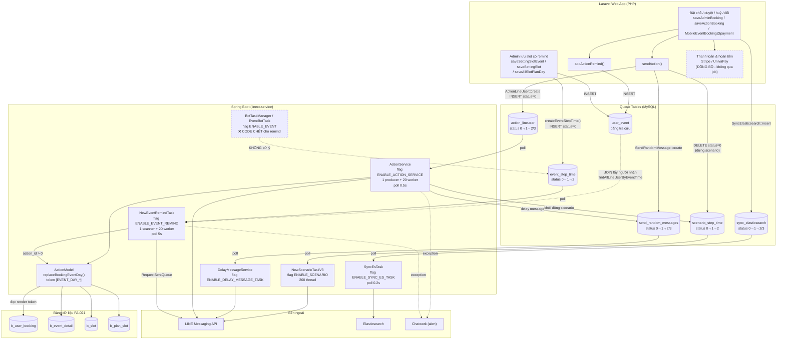

# Job Spec — FA-021 「イベント予約」 (Đặt lịch sự kiện)

> Tạo bởi: job-analyzer agent | Codebase: Spring Boot + Java 1.8 — `src/job/linect-service/`
> Phạm vi: bộ **event day (v2)** — `b_event_detail.type_event_new = 1`
> Độ tin cậy tổng thể: **Cao** (đọc trực tiếp source Java)

---

## 1. Tổng quan

### 1.1 Tại sao tính năng này cần background job

Đặt lịch sự kiện có **4 nhóm xử lý nền**, tất cả đều là hệ quả gián tiếp của hành động trên web:

| Nhóm | Mô tả | Bảng hàng đợi |
|---|---|---|
| **Remind (nhắc lịch)** | Gửi tin nhắn LINE nhắc user trước/sau ngày diễn ra sự kiện. Đây là job **cốt lõi và duy nhất dành riêng** cho tính năng | `event_step_time` |
| **Action** | Thực thi action (gắn tag, gửi template, chạy scenario…) khi booking được tạo/duyệt/huỷ/đổi | `action_lineuser` |
| **Delay message** | Gửi tin nhắn có độ trễ do action cấu hình | `send_random_messages` |
| **Đồng bộ Elasticsearch** | Đồng bộ lại hồ sơ bạn bè khi form đặt chỗ ghi đè `view_name`/thông tin bạn bè | `sync_elasticsearch` |

> **KHÔNG có** job riêng cho: thanh toán / hoàn tiền (Stripe, UnivaPay), export CSV, Google Calendar. Xem mục 10.

### 1.2 Kiến trúc giao tiếp — Database Polling Model

Không dùng message broker. Laravel và Spring Boot giao tiếp **qua bảng MySQL trung gian**:

```
Laravel Web App
  └─ INSERT vào queue table (status = 0/NEW, kèm thời điểm thực thi)
        ↓
Spring Boot (linect-service)
  └─ while(true) loop → SELECT record đến hạn & status = NEW
        └─ đổi status → xử lý → cập nhật status cuối (DONE / ERROR)
```

Entry point: `AppMain.run()` — `src/job/linect-service/src/main/java/sns/line/AppMain.java:212-338`. Mỗi task manager chỉ được khởi tạo nếu **feature flag** tương ứng bật (đọc từ `config.properties` qua `ConfigFile.java`).

### 1.3 Feature Flags liên quan (`ConfigFile.java`)

| Flag | Dòng | Mặc định | Task được bật | Liên quan FA-021 |
|---|---|---|---|---|
| `ENABLE_EVENT_REMIND` | `:93`, `:242` | `false` (`0`) | `NewEventRemindTask` | ✅ **Bắt buộc** — job remind |
| `ENABLE_ACTION_SERVICE` | `:106`, `:254` | `true` (`1`) | `ActionService` | ✅ Thực thi action booking |
| `ENABLE_SYNC_ES_TASK` | `:114`, `:263` | `true` (`1`) | `SyncEsTask` | ✅ Đồng bộ ES |
| `ENABLE_SCENARIO` | `:90`, `:239` | `true` (`1`) | `NewScenarioTaskV3` | ✅ Gián tiếp (action khởi động scenario) |
| `ENABLE_DELAY_MESSAGE_TASK` | `AppMain.java:221` | — | `DelayMessageService` | ✅ Gián tiếp (delay message) |
| `ENABLE_EVENT` | `:92`, `:241` | `false` (`0`) | `BotTaskManager` | ⚠️ **KHÔNG còn xử lý remind** — xem 3.6 |
| `MAX_REMIND_THREAD` | `:78`, `:231` | `20` | Số thread worker của `NewEventRemindTask` | ✅ |
| `MAX_ACTION_LINE_USER_THREAD` | `:80` | `20` | Số thread của `ActionService` / `DelayMessageService` | ✅ |

**Độ tin cậy: Cao** — đọc trực tiếp `src/job/linect-service/src/main/java/sns/line/ConfigFile.java` và `AppMain.java`.

---

## 2. Queue Tables

### 2.1 `event_step_time` — Hàng đợi remind (bảng cốt lõi)

**Entity JPA:** `EventStepTime` — `src/job/linect-service/src/main/java/sns/line/models/linedb/entities/EventStepTime.java`
**Repository:** `models/linedb/repository/EventStepTimeRepository.java`
**Ghi bởi Laravel:** `functions.php:9497` (INSERT) / `:9499` (UPDATE) qua `createEventStepTime()`

| Cột | Kiểu Java | Ý nghĩa |
|---|---|---|
| `id` | `long` | PK |
| `event_id` | `long` | ID bản ghi `events` (remind của sự kiện) |
| `bot_id` | `long` | Bot sở hữu |
| `event_step_id` | `long` | Trỏ tới `event_step` — chứa nội dung tin nhắn / action / `before_day` |
| `event_time_id` | `long` | Trỏ tới `event_times` — mốc thời gian sự kiện (`b_slot.remind_id`) |
| `sent_date_time` | `LocalDateTime` | **Thời điểm cần gửi** — điều kiện poll |
| `user_id` | `Long` | NULL với FA-021 (người nhận lấy từ `user_event`) |
| `user_booking_id` | `Long` | NULL với FA-021 (chỉ dùng cho lesson/salon calendar) |
| `status` | `int` | State machine (dưới) |
| `total_send` | `int` | Số tin đã gửi thành công |

**State machine** (`EventStepTime.java:10-15`):

```
0  STATUS_NOT_SEND_YET          ← Laravel INSERT (chỉ khi sent_date_time > now)
   ↓  (scanner nhặt)
1  STATUS_SENDING               ← đang xử lý (dùng để recovery sau restart)
   ↓
2  STATUS_SEND                  ← hoàn tất (kể cả khi không có ai để gửi)
3  STATUS_SEND_ERROR            ← exception khi xử lý
4  STATUS_SKIP_BOT_EXPIRED_PLAN ← bot hết hạn > 7 ngày → bỏ qua
5  STATUS_SKIP_COURSE_OFF       ← (chỉ dùng cho lesson calendar, hiện đã comment out)
```

**Điều kiện poll** (`NewEventRemindTask.java:72`):
```java
findAllByStatusAndSentDateTimeLessThanEqual(EventStepTime.STATUS_NOT_SEND_YET, LocalDateTime.now())
```
→ **Không lọc theo `bot_id`, không giới hạn số lượng** (lấy toàn bộ record đến hạn của mọi bot).

**Tần suất poll:** khi rỗng → `sleep(5000)` (5 giây); khi có dữ liệu → xử lý ngay rồi lặp lại (`:74-85`).

**Độ tin cậy: Cao**

---

### 2.2 `user_event` — Danh sách người nhận remind (bảng tra cứu, không phải queue)

**Entity JPA:** `UserEvent` — `models/linedb/entities/UserEvent.java`
**Ghi bởi Laravel:** `BookingEventDayController@addActionRemind:4211`, `MobileEventBookingController@addActionRemind`, `EventBookingService@addActionRemind:1054`, `functions.php:8260`

Spring Boot **không poll** bảng này. Nó được JOIN để lấy danh sách LINE user cần nhận remind của một `event_time_id` (`models/linedb/repository/LineUserRepository.java:16-17`):

```sql
SELECT line_user.* FROM user_event, line_user
WHERE user_event.event_time_id = ? AND user_event.user_id = line_user.id
```

> ⚠️ **Query này KHÔNG lọc `bot_id` và KHÔNG lọc user bị block** (`bot_line_user.is_blocked`). Việc chặn user bị block hoàn toàn phụ thuộc vào Laravel — nó chỉ INSERT `user_event` khi `conversation.is_blocked = 0` (BR-22). Nếu user block bot **sau khi** đăng ký, Spring Boot vẫn đưa vào danh sách gửi. **Độ tin cậy: Cao**.

---

### 2.3 `action_lineuser` — Hàng đợi thực thi action

**Entity JPA:** `ActionLineUser` — `models/linedb/entities/ActionLineUser.java`
**Ghi bởi Laravel:** `functions.php` trong `sendAction()` (`ActionLineUser::create`)

| Cột quan trọng | Ý nghĩa với FA-021 |
|---|---|
| `action_id` | Action cần chạy (`action_id_booking_approve_v1`, `action_id_change_request_approve_request_v1`…) |
| `line_user_id` | Người nhận |
| `user_booking_id` | **`b_user_booking.id`** — dùng để render token `[EVENT_DAY_*]` (xem 5.1) |
| `type_start_scenario`, `from_id`, `type` | Nguồn kích hoạt (trigger `8001`…`8008`) |
| `status` | State machine (dưới) |

**State machine** (`ActionLineUser.java:9-12`): `0 STATUS_NEW → 1 STATUS_IN_QUEUE → 2 STATUS_DONE / 3 STATUS_FAILURE`

**Điều kiện poll** (`helper/ActionService.java:61`): `findTop100ByStatus(STATUS_NEW)` — tối đa 100 record/lần.
**Tần suất poll:** rỗng → `sleep(500)` (0,5 giây); lỗi → `sleep(1000)`.

**Độ tin cậy: Cao**

---

### 2.4 `send_random_messages` — Hàng đợi tin nhắn có độ trễ

**Entity JPA:** `SendRandomMessage` — `models/linedb/entities/SendRandomMessage.java`
**Ghi bởi Laravel:** `functions.php` trong `sendAction()` (`SendRandomMessage::create`)

**State machine** (`:10-13`): `0 STATUS_NEW → 1 STATUS_IN_QUEUE → 2 STATUS_DONE / 3 STATUS_FAILURE`
**Điều kiện poll** (`helper/DelayMessageService.java:63`): `findTop100ByStatusAndTimeSendLessThanEqual(STATUS_NEW, LocalDateTime.now())`
**Tần suất poll:** rỗng → `sleep(500)`.

**Độ tin cậy: Cao**

---

### 2.5 `sync_elasticsearch` — Hàng đợi đồng bộ Elasticsearch

**Entity JPA:** `SyncElasticsearch` — `models/historydb/entities/SyncElasticsearch.java`
**Ghi bởi Laravel:** `BookingEventDayController@saveAdminBooking:2708`, `MobileEventBookingController@payment` — khi form đặt chỗ ghi đè `line_user.view_name` / thông tin bạn bè.

**State machine** (`:12`): `0 STATUS_WAIT_SYNC → 1 STATUS_SYNCHRONIZING → 2 STATUS_SYNC_SUCCESS / 3 STATUS_SYNC_ERROR`
**Điều kiện poll** (`task/SyncEsTask.java:53`): `findTop200ByStatusOrderByIdAsc(STATUS_WAIT_SYNC)` — tối đa 200 record/lần.
**Tần suất poll:** rỗng → `sleep(200)`; queue nội bộ đầy → `sleep(1000)`.

**Độ tin cậy: Cao**

---

### 2.6 `scenario_step_time` — Hàng đợi bước scenario

**Entity JPA:** `ScenarioStepTime` — `models/linedb/entities/ScenarioStepTime.java`
**Liên quan FA-021:** action booking có thể **khởi động** scenario (Spring Boot ghi step time) hoặc **dừng** scenario — Laravel DELETE các step `status = 0`.

**State machine** (`:12-17`): `0 STATUS_WAIT_TO_SENT → 1 STATUS_SENDING → 2 STATUS_SEND_SUCCESS / 3 STATUS_SEND_FAILURE / 4 STATUS_SKIPPED_BY_FILTER / 5 STATUS_SKIPPED_BY_BOT_EXPIRED_PLAN`
**Xử lý bởi:** `task/NewScenarioTaskV3.java` — flag `ENABLE_SCENARIO`, **200 worker thread** (`:32-33`).

**Độ tin cậy: Cao**

---

### 2.7 `messages_v2` — KHÔNG phải queue của Spring Boot

Laravel ghi `messages_v2` qua `MessageService::createMessageTypeV2()` (bước remind đầu tiên `before_day = -1`, gửi **đồng bộ ngay tại web app**). Spring Boot **không poll** bảng này — entity `MessagesV2s` (`models/historydb/entities/MessagesV2s.java:11`, `@Table(name = "messages_v2s")`) chỉ được **ghi** như lịch sử tin nhắn, không có repository query nào theo `status`.

**Kết luận:** `messages_v2` là bảng **lịch sử tin nhắn**, không phải hàng đợi liên tiến trình. **Độ tin cậy: Cao** (grep toàn bộ `task/`, `threads/`, `helper/` không có query poll).

---

## 3. Task Managers

### 3.1 `NewEventRemindTask` — Job remind (CỐT LÕI của FA-021)

| Thuộc tính | Giá trị |
|---|---|
| **File** | `src/job/linect-service/src/main/java/sns/line/threads/event_remind/NewEventRemindTask.java` |
| **Feature flag** | `ENABLE_EVENT_REMIND` (mặc định `false`) |
| **Khởi động** | `AppMain.java:337-338` → `newEventRemindTask.start()` |
| **Thread pool** | `Executors.newFixedThreadPool(MAX_REMIND_THREAD + 1)` = **21 thread** (`:44`) — 1 scanner + 20 worker |
| **Queue nội bộ** | `LinkedList<EventStepTime> eventStepTimeQueue` (`:38`), truy cập qua `synchronized` |

**Scanner thread** (`startJobScan()` `:50-93`):
1. **Recovery khi khởi động** (`:56-63`): `findAllByStatus(STATUS_SENDING)` → nạp lại toàn bộ record đang dở vào queue (chống mất record khi restart giữa chừng).
2. **Vòng lặp `while(true)`** (`:65-90`):
   - Thoát nếu `AppMain.getInstance().isPrepareStop()` hoặc `isNeedStop()`.
   - `findAllByStatusAndSentDateTimeLessThanEqual(STATUS_NOT_SEND_YET, now())` (`:72`).
   - Rỗng → `sleep(5000)`.
   - Có dữ liệu → với mỗi record: `updateStatusById(STATUS_SENDING, id)` (`:80`) rồi push vào queue nội bộ.
   - Exception → log + `sleep(10000)`.

**Worker thread × 20** (`startJobRun()` `:95-124`):
- `poll()` từ queue nội bộ; `null` → `sleep(500)`; có việc → `startEventStepTime(eventStepTime)` (`:113`).

**Độ tin cậy: Cao**

---

### 3.2 `startEventStepTime()` — Logic xử lý 1 record (`:126-338`)

Đây là nơi FA-021 rẽ nhánh. Trình tự:

| Bước | Dòng | Logic |
|---|---|---|
| 1 | `:128-136` | Nạp `Bot`. Nếu `bot == null` hoặc `bot.isExpiredOver7Day()` → `status = STATUS_SKIP_BOT_EXPIRED_PLAN (4)`, `total_send = 0`, **dừng** |
| 2 | `:137-138` | Set `status = STATUS_SENDING (1)` |
| 3 | `:142-149` | Nạp `EventStep` theo `event_step_id`. Nếu **null** → `status = STATUS_SEND (2)`, `total_send = 0`, dừng (coi như xong) |
| 4 | `:159-215` | **Rẽ nhánh theo `EventStep.type`** — xem bảng dưới |
| 5 | `:217-223` | Danh sách người nhận rỗng → `status = STATUS_SEND (2)`, `total_send = 0`, dừng |
| 6 | `:254-257` | `EventStep.is_day_month = 1` → `cloneNextYear()` — nhân bản record cho năm sau (remind sinh nhật/kỷ niệm, **không dùng trong FA-021**) |
| 7 | `:259-283` | Nếu `EventStep.action_id > 0` → chạy action. Ngược lại → parse `templates_id` (CSV). Không có template → `status = STATUS_SEND (2)`, dừng |
| 8 | `:285-329` | Với mỗi LINE user: kiểm tra `FilterV2.FILTER_TYPE_EVENT_STEP` (`:289`), đếm hạn mức gửi `BotModel.getAvailableSendCount()` (`:285`), rồi:<br>• `actionId > 0` → `ActionModel.doActionWithRequestSent(...)` (`:298`)<br>• ngược lại → build `MessagesV2s` (`msgKind = KIND_MESSAGE_EVENT`, `type = TYPE_MESSAGE_EVENT`, `needQuoteToken = false`) → `RequestSentQueue.pushRequestToQueue(request)` (`:322`) |
| 9 | `:331` | `sendDone()` → `status = STATUS_SEND (2)` + `total_send = sendCount` |

**Bảng rẽ nhánh `EventStep.type`** (`models/linedb/entities/EventStep.java:9-15`):

| Hằng số | Giá trị | Cách lấy người nhận | Tính năng |
|---|---|---|---|
| **`EVENT_FIXED_TIME`** | **`0`** | **`LineUserModel.findAllUserByEventTime(eventStepTime.getEventTimeId())`** → JOIN `user_event` | ✅ **FA-021 (event booking) + リマインド配信** |
| `EVENT_FLEX_TIME_1` / `_2` | `1` / `2` | `eventStepTime.getUserId()` | Remind theo mốc linh hoạt |
| `EVENT_FRIEND_INFO` | `3` | `eventStepTime.getUserId()` | Remind theo thông tin bạn bè |
| `EVENT_LESSON_CALENDAR` | `4` | `calendar_course_booking` theo `user_booking_id` | FA lesson calendar |
| `EVENT_SALON_CALENDAR` | `5` | `calendar_salon_line_booking` theo `user_booking_id` | FA-020 (salon) |
| `EVENT_FORM_ANSWER` | `6` | `eventStepTime.getUserId()` + filter V2 | Remind form |

> **Xác định nhánh của FA-021 — Độ tin cậy: Cao (suy luận chặt).**
> Laravel `createEventStepTime()` ghi record gồm `{event_id, event_time_id, event_step_id, bot_id, sent_date_time, status: 0}` — **không có `user_id`, không có `user_booking_id`** (logic-spec mục 5.2). Trong `NewEventRemindTask`, **chỉ duy nhất nhánh `EVENT_FIXED_TIME (0)`** lấy người nhận từ `event_time_id`; mọi nhánh khác đều cần `user_id` hoặc `user_booking_id` (đều NULL) và sẽ dừng ở bước 5 với `total_send = 0`. Vậy remind của FA-021 chạy qua nhánh `EVENT_FIXED_TIME`.
> Hệ quả: FA-021 **dùng chung** cơ chế remind với tính năng 「リマインド配信」 — không có nhánh code riêng cho event booking trong `NewEventRemindTask`.

---

### 3.3 `ActionService` — Thực thi action booking

| Thuộc tính | Giá trị |
|---|---|
| **File** | `src/job/linect-service/src/main/java/sns/line/helper/ActionService.java` |
| **Feature flag** | `ENABLE_ACTION_SERVICE` (mặc định `true`) |
| **Khởi động** | `AppMain.java:215-217` → `actionService.startService()` |
| **Thread pool** | `newFixedThreadPool(MAX_ACTION_LINE_USER_THREAD + 1)` = **21 thread** (`:93`) — 1 producer + 20 worker |

**Producer** (`startJobAddActionToQueue()` `:49-89`): `findTop100ByStatus(STATUS_NEW)` → set `status = 1` → `saveAll()` → push vào `requestQueue`. Rỗng → `sleep(500)`.

**Worker × 20** (`:95-124`): `poll()` → `tryLockKind(request.getLockKind())` (**khoá theo kind để tránh race condition** trên cùng một LINE user, timeout 60 giây `:17`) → `doActions()` → `ActionModel.doAction(request)` → `status = STATUS_DONE (2)`; exception → `status = STATUS_FAILURE (3)` (`:127-150`).

**Độ tin cậy: Cao**

---

### 3.4 `DelayMessageService` — Tin nhắn có độ trễ

**File:** `helper/DelayMessageService.java` | **Flag:** `ENABLE_DELAY_MESSAGE_TASK` (`AppMain.java:221`)
**Thread pool:** `MAX_ACTION_LINE_USER_THREAD + 1` = 21 (`:95`)
**Poll:** `findTop100ByStatusAndTimeSendLessThanEqual(STATUS_NEW, now())` (`:63`), rỗng → `sleep(500)`.

**Độ tin cậy: Cao**

---

### 3.5 `SyncEsTask` — Đồng bộ Elasticsearch

**File:** `task/SyncEsTask.java` | **Flag:** `ENABLE_SYNC_ES_TASK` (`AppMain.java:258`)
**Thread pool:** `newFixedThreadPool(MAX_THREAD + 1)` = **6 thread** (`:32-34`)
**Poll:** `findTop200ByStatusOrderByIdAsc(STATUS_WAIT_SYNC)` (`:53`) → set `STATUS_SYNCHRONIZING` → đẩy vào `RequestSyncElasticsearchQueue`. Rỗng → `sleep(200)`.
Có cơ chế **lock theo kind** (`lockedKindMap`/`lockedQueueMap` `:36-37`) để tuần tự hoá các thao tác sync trên cùng một đối tượng.

**Độ tin cậy: Cao**

---

### 3.6 ⚠️ `BotTaskManager` / `EventBotTask` — CODE CHẾT cho remind

Đây là phát hiện quan trọng, **khác với tài liệu/giả định trước đây**:

| Class | File | Trạng thái |
|---|---|---|
| `EventBotTask` | `task/EventBotTask.java` | **Toàn bộ logic xử lý `event_step_time` đã bị comment out** — dòng `:33-277` (`run()`), `:279-599` (`actionType*`), `:647-663` (`hasEventToSent()`, `startWork()`). Class chỉ còn `updateBot()`, `lockWork()`, `isRunning()`, `toString()` — **không còn được gọi để xử lý remind** |
| `BotTaskManager` | `task/BotTaskManager.java` | Vòng lặp scan `event_step_time` **đã bị comment out** (`:74-108`). Chỉ còn 2 vòng lặp sống: (a) `:31-73` refresh danh sách bot active mỗi `M_1_DAY`, (b) `:110-142` poll **`action_schedules`** (`STATUS_WAIT_TO_SENT`, `sleep 5s`) → `ActionScheduleBotTask` |

**Kết luận:**
- Flag `ENABLE_EVENT` → khởi động `BotTaskManager` (`AppMain.java:334-335`) nhưng **manager này KHÔNG xử lý `event_step_time` nữa** — chức năng đã được chuyển sang `NewEventRemindTask` (flag `ENABLE_EVENT_REMIND`).
- Phần còn sống của `BotTaskManager` chỉ xử lý `action_schedules`, mà logic-spec đã xác nhận **FA-021 KHÔNG ghi vào `action_schedules`** → `BotTaskManager` **không liên quan** tới FA-021.
- Lớp `EventBotTask` vẫn được `NewEventRemindTask` import (`:17`) nhưng **chỉ để làm tham số logger** cho `NotifyUtils.sendReportChatwork(EventBotTask.class, ...)` (`:327`) — vết tích lịch sử.

> Nếu triển khai chỉ bật `ENABLE_EVENT` mà **quên bật `ENABLE_EVENT_REMIND`** → **toàn bộ tin nhắn remind của FA-021 sẽ không bao giờ được gửi**, record `event_step_time` nằm mãi ở `status = 0`.

**Độ tin cậy: Cao** — đọc trực tiếp toàn bộ 2 file.

---

## 4. Processing Chain

### 4.1 Chuỗi remind (chính)

```
[Laravel] Admin lưu slot có remind
   BookingEventDayController@saveSettingSlotEvent:1628
   / @saveSettingSlot:5598 / @saveAllSlotPlanDay:6477
      → functions.php createEventStepTime():9463-9506
         → INSERT event_times  (mốc thời gian, b_slot.remind_id trỏ tới)
         → INSERT event_step_time {event_id, event_time_id, event_step_id, bot_id,
                                   sent_date_time, status = 0}
            (chỉ insert nếu sent_date_time > now — functions.php:9486)

[Laravel] LINE User / Admin đặt chỗ
   → addActionRemind() → INSERT user_event {event_id, bot_id, event_time_id, user_id}
     (chỉ khi conversation.is_blocked = 0)
   → step before_day = -1 gửi NGAY (đồng bộ, qua MessageService) — KHÔNG qua Spring Boot

[Spring Boot] NewEventRemindTask — scanner thread
   → findAllByStatusAndSentDateTimeLessThanEqual(0, now())    :72
   → status = 1 (SENDING)                                      :80
   → push vào eventStepTimeQueue

[Spring Boot] NewEventRemindTask — worker thread (×20)
   → startEventStepTime()                                      :126
      → BotManager.getNewBot(botId) → bot hết hạn > 7d? → status = 4, DỪNG
      → EventStep = findById(event_step_id) → null? → status = 2, DỪNG
      → type == EVENT_FIXED_TIME (0)
         → LineUserModel.findAllUserByEventTime(event_time_id)  :160
            → SELECT line_user.* FROM user_event, line_user
              WHERE user_event.event_time_id = ? AND user_event.user_id = line_user.id
      → danh sách rỗng? → status = 2, total_send = 0, DỪNG      :217
      → với mỗi LineUser:
           FilterV2.FILTER_TYPE_EVENT_STEP không pass → skip     :289
           BotModel.getAvailableSendCount() → hạn mức gửi        :285
           ├─ EventStep.action_id > 0
           │     → ActionModel.doActionWithRequestSent(...)      :298
           └─ ngược lại
                 → MessageModel.buildSourceMessageForRemind()    :300
                 → MessagesV2s {KIND_MESSAGE_EVENT, TYPE_MESSAGE_EVENT,
                                needQuoteToken = false}
                 → RequestSentQueue.pushRequestToQueue()         :322
                      → LINE Messaging API → LINE User nhận tin nhắn
      → sendDone() → status = 2 (SEND), total_send = n           :331
```

### 4.2 Chuỗi action (khi booking thay đổi trạng thái)

```
[Laravel] saveAdminBooking / saveActionBooking / sendActionBookingV1
   → functions.php sendAction($action_id, $lineUserId, $botId, $bookingId, trigger 8001…8008)
      → INSERT action_lineuser {action_id, line_user_id, bot_id,
                                user_booking_id = b_user_booking.id, status = 0}

[Spring Boot] ActionService — producer
   → findTop100ByStatus(STATUS_NEW)          ActionService.java:61
   → status = 1 (IN_QUEUE)

[Spring Boot] ActionService — worker (×20)
   → tryLockKind(lockKind)   ← tuần tự hoá theo LINE user
   → ActionModel.doAction(request)           ActionService.java:132
      → ActionModel.doAction(botId, lineUser, ..., userBookingId, ...)   ActionModel.java:58
         → replaceBookingEventDay(textMessage, ...)   ← render token [EVENT_DAY_*]  :224
         → gắn/gỡ tag, khởi động scenario (→ scenario_step_time),
           gửi template (→ RequestSentQueue), delay message (→ send_random_messages)
   → status = 2 (DONE) / 3 (FAILURE)         ActionService.java:133-136
```

**Độ tin cậy: Cao**

---

## 5. Services & Helpers

### 5.1 `ActionModel.replaceBookingEventDay()` — Render token `[EVENT_DAY_*]`

**File:** `src/job/linect-service/src/main/java/sns/line/models/ActionModel.java:224-285` (callback), `:867-885` (hàm thay thế)
**Regex:** `\[EVENT_DAY_([a-zA-Z0-9_]+)]` (`:868`)
**Input:** `userBookingId` = `ActionLineUser.user_booking_id` = `b_user_booking.id`

Đây là **điểm chạm trực tiếp duy nhất giữa Spring Boot và các bảng dữ liệu của FA-021** (`b_user_booking`, `b_event_detail`, `b_slot`, `b_plan_slot`).

| Token | Bảng đọc | Logic render |
|---|---|---|
| `[EVENT_DAY_NAME]` | `b_event_detail` | Fallback 3 tầng: `title_event` → `line_title` → `title` → `""` (`:229-238`) |
| `[EVENT_DAY_DATE_START]` | `b_slot` | `date_start_from` → định dạng `yyyy年M月d日(曜日)` với mảng `{日,月,火,水,木,金,土}` (`:239-249`) |
| `[EVENT_DAY_TIME_START]` | `b_slot` | `time_start.substring(0,5)` → `HH:mm` (`:250-257`) |
| `[EVENT_DAY_TIME_START_TIME_END]` | `b_slot` | `HH:mm - HH:mm`; nếu `is_hide_time_end = 1` hoặc `time_end` null → chỉ trả `time_start` (`:258-276`) |
| `[EVENT_DAY_NUMBER_BOOK]` | `b_user_booking` | `quantity` (`:277-278`) |
| `[EVENT_DAY_AMOUNT_BILL]` | `b_plan_slot` | `price + "円"`; plan null → `"0円"` (`:279-281`) |

> Token không khớp key nào → callback trả `null` → thay bằng chuỗi rỗng (`:875-877`).

**Độ tin cậy: Cao**

---

### 5.2 `MessageBuilder` — Nút mở trang đặt chỗ (LIFF)

**File:** `models/line/MessageBuilder.java:824-836` (và các vị trí tương tự `:1128`, `:3397`, `:3842`)

Khi template/rich menu có nút **open link kiểu `3` (booking event)**, Spring Boot dựng URL:

```java
BEventDetail eventDetail = BEventDetailManager.getItem(items.getBookingId());
if (eventDetail == null) → url = ConfigFile.HOST_SNSLINE + "/error/404"
if (eventDetail.isTypeNewEvent())   // b_event_detail.type_event_new == 1 → FA-021
    url = "https://liff.line.me/" + bot.getLiffAppIdBookingWithDefault()
          + "?booking_event_id=" + bookingId;
else                                 // booking_event v1
    url = "https://line.me/R/app/" + bot.getLiffAppId() + "?event_id=" + bookingId;
```

→ `getLiffAppIdBookingWithDefault()` khớp với logic Laravel (`liff_app_id_booking` fallback `liff_app_id`, logic-spec 1.1).

**Cache:** `helper/cache/BEventDetailManager.java` — LRU in-memory, TTL **10 giây** (`VALID_TIME_CACHE = 10000`), tối đa **500 item** (`MAX_IN_MEMORY_CACHE_SIZE`). Đọc DB qua `MessageBuilderModelService.findEventDetailById(id)`.

**Độ tin cậy: Cao**

---

### 5.3 `BackupBotTask` — Sao lưu / khôi phục bot (liên quan gián tiếp)

**File:** `task/BackupBotTask.java` | **Flag:** `ENABLE_BACKUP_BOT` (`AppMain.java:252-253`)

Job này clone dữ liệu giữa các bot; nó **có chạm vào bảng của FA-021**:
- `doBackupBSlot(Long id)` (`:623-633`) — remap `b_slot.plan_ids` sang ID `b_plan_slot` mới (`updatePlanIds()` qua `BSlotRepository`).
- Remap `event_times` cho action (`:298-302`) và cho `form_answer_details` (`:546-552`).
- Bảng `b_slot` nằm trong danh sách bảng được backup (`:1121`).

→ Đây chính là job khiến Laravel phải chặn mọi thao tác ghi khi bot đang backup/restore (**BR-03** trong logic-spec: `BackupHistory.status ∈ {0,1}` → HTTP 500). Không phải job của riêng FA-021.

**Độ tin cậy: Cao**

---

## 6. External API Calls

| API | Gọi từ | Mục đích | Ghi chú |
|---|---|---|---|
| **LINE Messaging API** | `RequestSentQueue` → `SentMessageService` (service dùng chung) | Gửi tin nhắn remind + tin nhắn của action | `NewEventRemindTask` đặt `needQuoteToken = false` cho remind FA-021 (`:311`) — **khác** salon/lesson calendar (`true`, `:417`, `:565`) |
| **Elasticsearch** | `SyncEsTask` → `helper/EsService.java` | Đồng bộ index hồ sơ bạn bè sau khi form đặt chỗ cập nhật `view_name` | — |
| **Chatwork** | `NotifyUtils.sendReportChatwork(...)` | Cảnh báo lỗi | Xem mục 8 |

**KHÔNG có** trong luồng FA-021 của Spring Boot:
- ❌ **Google Calendar API** — chỉ dùng cho salon (`HandleSalonCalendarCallbackTask`) và lesson (`HandleGoogleCalendarCallbackTask`)
- ❌ **Stripe / UnivaPay** — toàn bộ thanh toán, thu tiền, hoàn tiền do **Laravel** xử lý (`StripePayment`, `UnivapayPayment`, `HandleWebhookUnivapay` — là Laravel Queue Job, không phải Spring Boot)

**Độ tin cậy: Cao** — grep `Stripe|Univapay|univapay` trong `src/job/` không có kết quả trong luồng event booking.

---

## 7. Data Flow Diagram



---

## 8. Error Handling

| Task | Tình huống | Xử lý |
|---|---|---|
| `NewEventRemindTask` (scanner) | Exception khi query DB | Log error + `sleep(10000)` (10 giây) rồi tiếp tục vòng lặp (`:86-89`) — **không dừng task** |
| `NewEventRemindTask` (worker) | `bot == null` hoặc bot hết hạn > 7 ngày | `status = STATUS_SKIP_BOT_EXPIRED_PLAN (4)`, `total_send = 0` (`:130-136`) |
| `NewEventRemindTask` | `EventStep` không tồn tại | `status = STATUS_SEND (2)` — coi như hoàn tất, không retry (`:143-149`) |
| `NewEventRemindTask` | Không có LINE user nào trong `user_event` | `status = STATUS_SEND (2)`, `total_send = 0` (`:217-223`) |
| `NewEventRemindTask` | Không có `template_id` và không có `action_id` | `status = STATUS_SEND (2)`, `total_send = 0` (`:261-280`) |
| `NewEventRemindTask` | Exception khi gửi **1 user** | Log + **Chatwork alert**, tiếp tục user kế tiếp — không đánh dấu lỗi cả record (`:325-328`) |
| `NewEventRemindTask` | Exception ở cấp `startEventStepTime()` | `status = STATUS_SEND_ERROR (3)` + **Chatwork alert** (`:332-337`) — **không có cơ chế retry tự động** |
| `ActionService` | Exception khi `doAction()` | `status = STATUS_FAILURE (3)` (`:134-136`) — không retry |
| `SyncEsTask` | Exception | Log + `sleep(1000)`; record → `STATUS_SYNC_ERROR (3)`, lưu `message_error` |

**Cơ chế recovery sau restart:**

| Task | Cách phục hồi |
|---|---|
| `NewEventRemindTask` | Khởi động → `findAllByStatus(STATUS_SENDING)` → nạp lại toàn bộ record đang dở vào queue (`:56-63`). ⚠️ Record ở `STATUS_SEND_ERROR (3)` **không được nạp lại** → mất vĩnh viễn nếu không can thiệp thủ công |
| `ActionService` | **Không có recovery** — record kẹt ở `STATUS_IN_QUEUE (1)` sau khi restart sẽ **không bao giờ được xử lý lại** (producer chỉ query `STATUS_NEW`) |
| `NewScenarioTaskV3` | `recoverSending()` — nạp lại `STATUS_SENDING` (`:42-49`) |

**Kênh cảnh báo:** `NotifyUtils.sendReportChatwork(...)` — gửi thông báo lỗi lên Chatwork.

**Độ tin cậy: Cao**

---

## 9. Liên kết với Web App

| Hành động trên Web | Bảng hàng đợi | Task Manager | Kết quả LINE User nhận được |
|---|---|---|---|
| Admin **lưu slot có remind** (`saveSettingSlotEvent` / `saveSettingSlot` / `saveAllSlotPlanDay`) | `event_times` + `event_step_time` (status 0) | `NewEventRemindTask` | Tin nhắn nhắc lịch **tự động gửi** vào đúng `sent_date_time` (VD: 1 ngày trước sự kiện) |
| Admin **đổi `date_start`** của ngày tổ chức | `event_times` + `event_step_time` mới (BR-13 recompute) | `NewEventRemindTask` | Remind gửi theo mốc thời gian mới |
| LINE User / Admin **đặt chỗ** | `user_event` (INSERT) | — (bảng tra cứu) | Được thêm vào danh sách nhận remind của `event_time_id` đó |
| LINE User / Admin **đặt chỗ** — step `before_day = -1` | ❌ **KHÔNG qua job** | Laravel `MessageService` | Tin nhắn xác nhận **gửi ngay lập tức** (đồng bộ) |
| Admin **duyệt / từ chối / huỷ / đổi** đặt chỗ | `action_lineuser` (status 0) | `ActionService` | Nhận tin nhắn action; bị gắn/gỡ tag; được đưa vào scenario |
| Duyệt **đổi đặt chỗ** — user không còn booking active | `user_event` (**DELETE** bởi Laravel) | — | **Ngừng nhận** remind của mốc thời gian cũ |
| Form đặt chỗ **ghi đè `view_name`** bạn bè | `sync_elasticsearch` (status 0) | `SyncEsTask` | (không thấy) — chỉ đồng bộ index tìm kiếm |
| Action có **delay** | `send_random_messages` (status 0) | `DelayMessageService` | Nhận tin nhắn sau khoảng trễ đã cấu hình |
| Action **dừng scenario** | `scenario_step_time` (**DELETE** status 0 bởi Laravel) | `NewScenarioTaskV3` | **Ngừng nhận** các bước scenario còn lại |
| **Thanh toán / hoàn tiền** | ❌ **KHÔNG có queue table** | Laravel (đồng bộ + `HandleWebhookUnivapay` — **Laravel Queue Job**) | — |
| **Export CSV** danh sách đặt chỗ | ❌ **KHÔNG có queue table** | Laravel `Maatwebsite\Excel` (đồng bộ, ghi file trực tiếp) | — |

**Độ tin cậy: Cao**

---

## 10. Các job KHÔNG thuộc FA-021 (đã kiểm tra và loại trừ)

| Job | Feature flag | Vì sao KHÔNG liên quan |
|---|---|---|
| `MonitorCalendarBookingTask` | `ENABLE_MONITOR_CALENDAR_BOOKING` | Chỉ giám sát `calendar_salon_line_booking` + `calendar_salon_booking_by_google` (**FA-020 salon**). Không đọc `b_user_booking` / `b_slot`. **Độ tin cậy: Cao** |
| `HandleSalonCalendarCallbackManager` / `...Task` | `ENABLE_HANDLE_SALON_CALENDAR_CALLBACK` | Google Calendar callback cho **salon** (`salon_google_calendar_callback`). FA-021 không tích hợp Google Calendar. **Độ tin cậy: Cao** |
| `HandleExportSalonCalendarManager` / `...Task` | `ENABLE_HANDLE_EXPORT_SALON_CALENDAR` | Export CSV lịch sử sync Google Calendar của **salon** (`calendar_salon_download_csv_sync_google_calendar`). FA-021 export CSV **đồng bộ tại Laravel**. **Độ tin cậy: Cao** |
| `HandleGoogleCalendarCallbackManager` / `...Task` | `ENABLE_HANDLE_GOOGLE_CALENDAR_CALLBACK` | Google Calendar callback cho **lesson calendar**. **Độ tin cậy: Cao** |
| `BotTaskManager` + `EventBotTask` | `ENABLE_EVENT` | Logic xử lý `event_step_time` **đã bị comment out toàn bộ** — xem mục 3.6. **Độ tin cậy: Cao** |
| `BroadcastTask`, `ScheduleSendChatTask`, `HandleCrossAnalysis`, `MappingDeviceTask`… | — | Không đọc/ghi bảng nào của FA-021 (grep `b_slot|b_user_booking|b_event_detail|b_plan_slot` không có kết quả). **Độ tin cậy: Cao** |

> **Kết luận quan trọng:** Khác với FA-020 (salon booking) — vốn có tới **4 job manager riêng** — FA-021 **không có task manager nào được viết riêng cho nó**. Toàn bộ xử lý nền của FA-021 đều đi qua **các job dùng chung** (`NewEventRemindTask` nhánh `EVENT_FIXED_TIME`, `ActionService`, `SyncEsTask`, `DelayMessageService`, `NewScenarioTaskV3`).

---

## 11. Điểm cần chú ý (rủi ro phát hiện trong code job)

| # | Vấn đề | Vị trí | Mức độ |
|---|---|---|---|
| 1 | **Flag sai → mất toàn bộ remind.** `ENABLE_EVENT` (khởi động `BotTaskManager`) đã **không còn xử lý** `event_step_time`; chỉ `ENABLE_EVENT_REMIND` (`NewEventRemindTask`) mới xử lý. Cả hai mặc định `false`. Nếu deploy chỉ bật `ENABLE_EVENT` → record kẹt vĩnh viễn ở `status = 0` | `AppMain.java:334-338`; `BotTaskManager.java:74-108`; `EventBotTask.java:33-277` | **Cao** |
| 2 | **Query người nhận không lọc `bot_id` và không lọc user bị block.** `findAllLineUserByEventTime` chỉ JOIN `user_event.event_time_id`. User block bot **sau khi** đã đăng ký remind vẫn nằm trong danh sách gửi | `LineUserRepository.java:16-17` | **Trung bình** |
| 3 | **Không có retry.** `STATUS_SEND_ERROR (3)` của `event_step_time` và `STATUS_FAILURE (3)` của `action_lineuser` **không bao giờ được xử lý lại** — chỉ có Chatwork alert | `NewEventRemindTask.java:332-337`; `ActionService.java:134-136` | **Trung bình** |
| 4 | **`ActionService` không có recovery sau restart.** Producer chỉ query `STATUS_NEW (0)`; record kẹt ở `STATUS_IN_QUEUE (1)` khi service chết giữa chừng sẽ **mất vĩnh viễn** (khác `NewEventRemindTask` có `findAllByStatus(STATUS_SENDING)`) | `ActionService.java:61` | **Cao** |
| 5 | **Scanner của `NewEventRemindTask` không giới hạn số bản ghi.** `findAllByStatusAndSentDateTimeLessThanEqual()` lấy **toàn bộ** record đến hạn của mọi bot vào bộ nhớ trong 1 lần — khác các task khác dùng `findTop100`/`findTop200`. Rủi ro OOM khi tồn đọng lớn | `NewEventRemindTask.java:72` | **Trung bình** |
| 6 | Cache `BEventDetailManager` TTL chỉ **10 giây**, tối đa 500 item — Admin đổi tên sự kiện thì nút LIFF cập nhật gần như tức thì, nhưng đây là hit DB thường xuyên | `helper/cache/BEventDetailManager.java:11-12` | **Thấp** |
| 7 | `EventStepTime.cloneNextYear()` chạy khi `EventStep.is_day_month = 1` — **không dùng trong FA-021** nhưng nếu Laravel vô tình set cờ này trên `event_step` của event booking → record remind sẽ **tự nhân bản vô hạn theo năm** | `NewEventRemindTask.java:254-257`; `EventStepTime.java:132-146` | **Thấp** |

---

## 12. Tổng kết mapping Queue Table → Task Manager

| Queue Table | Task Manager | File | Feature Flag | Thread | Poll |
|---|---|---|---|---|---|
| `event_step_time` | **`NewEventRemindTask`** | `threads/event_remind/NewEventRemindTask.java` | `ENABLE_EVENT_REMIND` | 1 + 20 | 5s |
| `action_lineuser` | `ActionService` | `helper/ActionService.java` | `ENABLE_ACTION_SERVICE` | 1 + 20 | 0,5s |
| `send_random_messages` | `DelayMessageService` | `helper/DelayMessageService.java` | `ENABLE_DELAY_MESSAGE_TASK` | 1 + 20 | 0,5s |
| `sync_elasticsearch` | `SyncEsTask` | `task/SyncEsTask.java` | `ENABLE_SYNC_ES_TASK` | 1 + 5 | 0,2s |
| `scenario_step_time` | `NewScenarioTaskV3` | `task/NewScenarioTaskV3.java` | `ENABLE_SCENARIO` | 1 + 200 | — |
| `user_event` | *(bảng tra cứu — không poll)* | — | — | — | — |
| `messages_v2` | *(lịch sử tin nhắn — không poll)* | — | — | — | — |
| `event_times` | *(bảng tra cứu — không poll)* | — | — | — | — |
| ~~`event_step_time`~~ | ~~`BotTaskManager` → `EventBotTask`~~ | ~~`task/EventBotTask.java`~~ | ~~`ENABLE_EVENT`~~ | — | **CODE CHẾT** |
