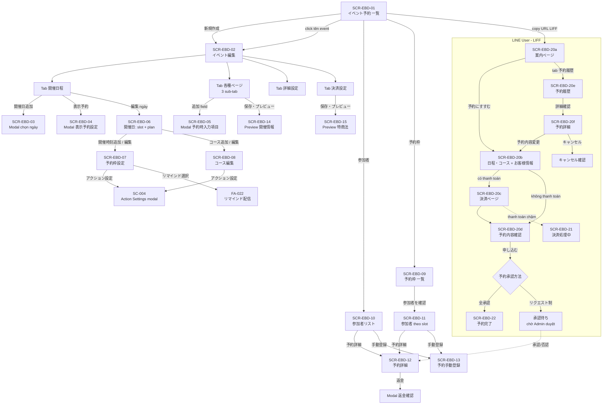

# FA-021 — 「イベント予約」 (Đặt lịch sự kiện theo ngày) — UI Spec

> Portal: **Admin** (và Staff theo phân quyền) + màn hình public cho **LINE User**
> Feature folder: `features/admin/event-booking/`
> Prefix mã màn hình: `SCR-EBD-xx` (EBD = Event Booking Day)
> Ngày phân tích: 2026-07-13

---

## 0. Ghi chú về nguồn dữ liệu và độ tin cậy

Tài khoản test **không có event nào** (danh sách rỗng 「データがありません。」). Vì vậy:

- Chỉ chụp được **màn hình danh sách** và **màn hình tạo event** (4 tab).
- Nút 「開催日追加」 tuy bấm được và mở modal chọn ngày, nhưng các màn hình con (khung giờ / plan / participant / booking detail) **không truy cập được** vì cần event đã lưu.
- Toàn bộ các màn hình còn lại được **dựng lại từ Blade view + JS** trong source Laravel.

| Ký hiệu nguồn | Ý nghĩa | Độ tin cậy |
|---------------|---------|-----------|
| `[Quan sát UI thật]` | Chụp accessibility tree + screenshot từ hệ thống đang chạy | **Cao** |
| `[Dựng từ Blade view: <file>]` | Đọc từ template Blade + JS, chưa xác nhận bằng UI thật | **Trung bình** |
| `[Suy luận]` | Suy ra từ code/route, chưa thấy trực tiếp | **Thấp** |

---

## 1. Tổng quan tính năng

### Mục đích
Cho phép doanh nghiệp (Admin LINE OA) tạo và quản lý **sự kiện có đặt chỗ theo ngày** (1日イベント — event diễn ra trong 1 ngày, có thể có nhiều ngày tổ chức khác nhau). LINE User nhận link LIFF, mở trang đặt chỗ trong LINE, chọn ngày → khung giờ → gói (コース/plan) → điền thông tin → (thanh toán nếu bật) → hoàn tất đặt chỗ. Admin quản lý danh sách người tham gia, duyệt/từ chối request, đổi lịch, huỷ, hoàn tiền.

### Kiến trúc dữ liệu 4 tầng
```
イベント (Event)                                     ← b_event_detail
  └── 開催日 (Setting Date / ngày tổ chức)          ← b_setting_date_event
        └── 予約枠 / 開催時刻 (Slot / khung giờ)      ← b_slot
              └── コース / プラン (Plan / gói vé)      ← b_plan_slot (tuỳ chọn)
                    └── 予約 (Booking)               ← b_user_booking
```
Slot có thể **không có plan** → dùng định mức/định giá của chính slot. Nếu có plan → plan ghi đè 定員 và 料金.

> Tên bảng ở trên đã được **xác nhận từ schema dump + Model Eloquent** (`BEventDetail`, `BSettingDateEvent`, `BSlot`, `PlanSlot`, `BBooking`). Chi tiết cột: xem `db/db-mapping.md`.
> Các bảng liên quan khác: cấu hình chung mức event ở `b_setting_basic_event`; định nghĩa field 「予約時入力事項」 ở `b_info_setting`; folder sự kiện ở `category` (`kind = 21`); bạn bè LINE ở `line_user`.
> **Đáp án 「予約時入力事項」 KHÔNG có bảng con riêng** — lưu dạng **JSON inline** trong cột `b_user_booking.detail_info_user` (TEXT).

### Actors

| Actor | Vai trò |
|-------|---------|
| **Admin (LINE OA)** | Tạo/sửa/xoá event, cấu hình ngày–slot–plan, cấu hình trang public, cấu hình thanh toán, quản lý participant, duyệt request, đăng ký booking thủ công, hoàn tiền |
| **Staff** | Truy cập cùng giao diện Admin; giới hạn theo custom role (chưa xác định menu này có bị chặn không — cần kiểm tra bảng phân quyền) |
| **LINE User** | Mở link LIFF `https://liff.line.me/{liffId}?booking_event_id={id}` → đặt chỗ, xem lịch sử, đổi/huỷ, thanh toán thẻ |

### Điểm quan trọng
- Tính năng **bắt buộc phải có LIFF ID**. Nếu chưa đăng ký, màn hình danh sách hiển thị cảnh báo đỏ 「LIFF IDを登録してください」 và nút 「新規作成」 bị chặn (alert).
- Có **2 hệ thống event song song** trong source: `booking_event` (bản cũ, nhiều ngày) và `booking-event-day` (bản đang dùng, 1 ngày). Spec này chỉ mô tả **booking-event-day**.
- Có 2 phiên bản view cho màn hình tạo event: `add.blade.php` (cũ, không dùng) và `add_v2.blade.php` (**đang dùng** — controller `create()`/`edit()` đều trả về `add_v2`).
- Tương tự có `list_plan_slot.blade.php` (cũ) và `add_plan_slot.blade.php` (mới, dùng cho add/edit plan).

---

## 2. Danh sách màn hình

### Phía Admin

| Mã | Tên màn hình | Route | Nguồn |
|----|-------------|-------|-------|
| SCR-EBD-01 | Danh sách sự kiện 「イベント予約」 | `GET /basic/booking-event-day/list-event` | [Quan sát UI thật] |
| SCR-EBD-02 | Tạo / sửa sự kiện 「イベント編集」 (khung + 4 tab) | `GET /basic/booking-event-day/add`<br>`GET /basic/booking-event-day/{id}/edit` | [Quan sát UI thật] |
| SCR-EBD-02a | Tab 1 「開催日程」 (lịch tổ chức) | (tab trong SCR-EBD-02) | [Quan sát UI thật] |
| SCR-EBD-02b | Tab 2 「各種ページ」 (các trang public) — 3 sub-tab | (tab trong SCR-EBD-02) | Sub-tab 1: [Quan sát UI thật]; sub-tab 2–3: [Dựng từ Blade view: add_v2.blade.php] |
| SCR-EBD-02c | Tab 3 「詳細設定」 (cài đặt chi tiết) | (tab trong SCR-EBD-02) | [Quan sát UI thật] |
| SCR-EBD-02d | Tab 4 「決済設定」 (cài đặt thanh toán) | (tab trong SCR-EBD-02) | [Quan sát UI thật] |
| SCR-EBD-03 | Modal 「開催日追加」 (chọn ngày tổ chức) | (modal trong SCR-EBD-02a) | [Quan sát UI thật] — modal mở nhưng nội dung lịch không render trong a11y tree; cấu trúc từ Blade |
| SCR-EBD-04 | Modal 「表示予約設定」 (hẹn giờ hiển thị) | (modal trong SCR-EBD-02a) | [Dựng từ Blade view: add_v2.blade.php] |
| SCR-EBD-05 | Modal 「予約時入力項目」 (cấu hình field nhập của khách) | (modal trong SCR-EBD-02b sub-tab 2) | [Dựng từ Blade view: add_v2.blade.php] |
| SCR-EBD-06 | Quản lý ngày tổ chức 「開催日」 (danh sách slot + plan của 1 ngày) | `GET /basic/booking-event-day/add-slot-date/{date_id}` | [Dựng từ Blade view: add_slot_date.blade.php] |
| SCR-EBD-07 | Cấu hình khung giờ 「予約枠設定」 | `GET /basic/booking-event-day/detail-slot/{date_id}`<br>`GET /basic/booking-event-day/edit-slot/{date_id}/{slot_id}` | [Dựng từ Blade view: setting_slot.blade.php] |
| SCR-EBD-08 | Cấu hình gói 「コース編集」 | `GET /basic/booking-event-day/add-plan/{slot_id}`<br>`GET /basic/booking-event-day/edit-plan/{plan_id}` | [Dựng từ Blade view: add_plan_slot.blade.php] |
| SCR-EBD-09 | Danh sách khung giờ 「予約枠 一覧」 | `GET /basic/booking-event-day/event/{id}/slots` | [Dựng từ Blade view: list_slot_event.blade.php] |
| SCR-EBD-10 | Danh sách người tham gia 「参加者リスト」 (toàn event, 2 tab 日別 / 一覧) | `GET /basic/booking-event-day/booking-all-slot/{id}` | [Dựng từ Blade view: booking_all_slot.blade.php] |
| SCR-EBD-11 | Người tham gia theo 1 khung giờ | `GET /basic/booking-event-day/booking-slot/{slot_id}?planId={plan_id}` | [Dựng từ Blade view: booking_slot.blade.php] |
| SCR-EBD-12 | Chi tiết booking 「予約詳細」 (+ modal hoàn tiền) | `GET /basic/booking-event-day/detail-booking/{id}` | [Dựng từ Blade view: booking_detail.blade.php] |
| SCR-EBD-13 | Đăng ký booking thủ công 「予約手動登録」 | `GET /basic/booking-event-day/add-booking/{id}` | [Dựng từ Blade view: add_booking.blade.php] |
| SCR-EBD-14 | Preview 「開催情報」 (trang thông tin sự kiện) | `GET /basic/booking-event-day/preview-event-info/{id}` | [Dựng từ Blade view: preview_event_info.blade.php] |
| SCR-EBD-15 | Preview 「特定商取引法に基づく表記」 | `GET /basic/booking-event-day/preview-term-bill/{id}`<br>mobile: `GET /mobile/booking-event-day/preview-term-bill/{id}` | [Dựng từ Blade view: preview_term_bill.blade.php] |

### Phía LINE User (public / LIFF)

| Mã | Tên màn hình | Route | Nguồn |
|----|-------------|-------|-------|
| SCR-EBD-20 | Trang đặt chỗ LIFF (SPA — 7 page state) | `GET /mobile/event-booking/index/{hash_event_id}/{u_code?}` | [Dựng từ Blade view: order/index.blade.php + order-item.js] |
| SCR-EBD-20a | └ page `index` — 案内ページ (giới thiệu sự kiện) | (state trong SCR-EBD-20) | [Dựng từ Blade] |
| SCR-EBD-20b | └ page `booking` — chọn ngày/giờ/コース + nhập thông tin | (state; include `order/choose_slot_plan.blade.php`) | [Dựng từ Blade] |
| SCR-EBD-20c | └ page `payment` — nhập thẻ + xác nhận thanh toán | (state) | [Dựng từ Blade] |
| SCR-EBD-20d | └ page `confirm` — 予約内容確認 (xác nhận cuối) | (state) | [Dựng từ Blade] |
| SCR-EBD-20e | └ page `history` — 予約履歴 (lịch sử đặt chỗ) | (state; `order/history.blade.php`) | [Dựng từ Blade] |
| SCR-EBD-20f | └ page `booking-detail` — 予約詳細 + đổi/huỷ | (state) | [Dựng từ Blade] |
| SCR-EBD-21 | Màn hình chờ xử lý thanh toán | (state; `order/wait-process.blade.php`) | [Dựng từ Blade] |
| SCR-EBD-22 | Trang hoàn tất 「予約サイト」 | (view `success_page.blade.php`) | [Dựng từ Blade] |

---

## 3. Chi tiết màn hình — Phía Admin

### SCR-EBD-01 — Danh sách sự kiện 「イベント予約」
**Nguồn**: [Quan sát UI thật] + [Blade: `list_event.blade.php`] — **Cao**
**URL**: `/basic/booking-event-day/list-event`
**Controller**: `Basic\BookingEventDayManagementController@listBookingEvent`
**JS**: `/js/booking_event_day/index.js` (Vue 2)
**Screenshot**: `screenshots/01-list-event.png`

#### Layout
- Tiêu đề `<h2>` 「イベント予約」
- Cảnh báo đỏ (chỉ khi thiếu LIFF): 「LIFF IDを登録してください (登録方法)」 — link tới `https://lme.jp/media/manual/inflow/`
- 2 cột:
  - **Cột trái (20%)** — Panel folder 「フォルダ」: nút `+` (thêm folder, popup nhập tên, đếm ký tự `N/15`), nút sort (modal 「フォルダ並べ替え」). Danh sách folder: 「未分類 (N)」 (mặc định, id=0) + các folder tuỳ chỉnh, mỗi folder có dropdown 「フォルダ名変更」/「フォルダ削除」
  - **Cột phải (78%)** — Toolbar + bảng danh sách

#### Action Buttons
| Label JP | Vị trí | Hành vi |
|----------|--------|---------|
| 「新規作成」 | Toolbar trái (xanh dương) | Mở SCR-EBD-02. Nếu chưa có LIFF ID → `alert('LIFF IDを登録してください')` |
| 「並べ替え」 | Toolbar phải | Modal `#myModal` sắp xếp thứ tự event |
| 「一括フォルダ変更」 | Toolbar phải | **Disabled** khi chưa chọn item nào. Mở modal 「一括フォルダ変更」 → chọn folder đích → 「登録」 |
| 「一括削除」 | Toolbar phải (đỏ) | **Disabled** khi chưa chọn item nào. Xoá nhiều event |
| 「参加者」 | Cột 「参加者リスト」 | → SCR-EBD-10 |
| 「予約枠」 | Cột 「予約枠一覧」 | → SCR-EBD-09 |
| 「コピー」 / 「削除」 | Dropdown `⋯` cuối mỗi dòng | Nhân bản / xoá event |
| 「次の20件へ」 | Dưới bảng | Phân trang (20 item/lần) |

#### Data Table
| Cột (JP) | Kiểu dữ liệu | Mô tả / mẫu |
|----------|-------------|-------------|
| (checkbox) | boolean | Chọn hàng loạt; có `check_all` ở header |
| 「作成日/管理名」 | datetime + text link | Dòng 1: ngày tạo (`YYYY/MM/DD`); dòng 2: tên quản lý (link → `/basic/booking-event-day/{id}/edit`) |
| 「イベントページ」 | URL + 2 icon | Ô text readonly chứa `https://liff.line.me/{liffId}?booking_event_id={id}&ts={timestamp}` + icon copy + icon 👁 (preview) |
| 「参加予定」 | number | `number_approve_doing` — số người sẽ tham gia |
| 「定員」 | number | `max` — tổng định mức |
| 「承認待ち」 | number | `number_pending` — đang chờ duyệt (null → hiển thị 0) |
| 「参加済み」 | number | `number_approve_done` — đã tham gia (event đã diễn ra) |
| 「参加者リスト」 | button | 「参加者」 |
| 「予約枠一覧」 | button | 「予約枠」 |
| (dropdown) | menu | コピー / 削除 |

**Trạng thái rỗng**: 1 dòng `colspan=10` 「データがありません。」 — đây là trạng thái đã quan sát.

#### Observations
- Nút 「一括フォルダ変更」 và 「一括削除」 disabled trong snapshot (do chưa chọn item).
- Panel folder dùng cookie `folder_cookie` để nhớ folder đang mở (route `GET /basic/event-booking-day/set-cookie`).
- Có sẵn code (đã comment) cho bộ lọc 「イベント形式」: 「1日イベント」 / 「複数日イベント」 → tính năng multi-day đã bị vô hiệu hoá ở UI.

---

### SCR-EBD-02 — Tạo / sửa sự kiện 「イベント編集」
**Nguồn**: [Quan sát UI thật] + [Blade: `add_v2.blade.php`] — **Cao**
**URL**: `/basic/booking-event-day/add` (tạo) | `/basic/booking-event-day/{id}/edit` (sửa)
**Controller**: `Basic\BookingEventDayController@create` / `@edit` → view `add_v2`
**JS**: `/js/booking_event_day/setting_booking_event.js` (~126KB, Vue 2)
**Screenshot**: `screenshots/02-add-event.png`

> Lưu ý: heading luôn là 「イベント編集」 kể cả khi tạo mới.

#### Vùng chung (hiển thị ở mọi tab)
| Field (JP) | Input type | Bắt buộc | Default | Validation |
|-----------|-----------|---------|---------|-----------|
| 「イベント名（管理用）」 | text + counter `0/20` | Có | rỗng | Tối đa **20** ký tự — 「イベント名（管理用）は20文字以内で入力してください。」 |
| 「フォルダ」 | select | Không | 「未分類」 (0) | — |
| 「LINEトーク画面 表示設定」 > 「タイトル」 | text + counter `0/50` | Chưa xác định | rỗng | Tối đa 50 ký tự |
| 「LINEトーク画面 表示設定」 > 「説明」 | text + counter `0/50` | Chưa xác định | rỗng | Tối đa 50 ký tự |

Ghi chú UI: 「※配信後は変更が反映されない場合があります。」 (thay đổi sau khi gửi có thể không phản ánh) + có thumbnail preview LINE card bên phải.

#### Tabs
`開催日程` | `各種ページ` | `詳細設定` | `決済設定`

---

### SCR-EBD-02a — Tab 「開催日程」 (Lịch tổ chức)
**Nguồn**: [Quan sát UI thật] — **Cao**
**Screenshot**: `screenshots/03-tab-schedule.png`

| Element | Loại | Ghi chú |
|---------|------|---------|
| 「開催日追加」 | button | Mở modal chọn ngày (SCR-EBD-03) |
| 「表示予約」 | toggle + link | Bật hẹn giờ hiển thị → mở modal SCR-EBD-04. Tooltip: 「設定した日時が到来すると予約画面に表示されます」 |
| Danh sách ngày tổ chức | list | Mỗi item: ngày + danh sách khung giờ (`item.slots`); nếu chưa có giờ → 「開催時間が登録されていません」; giờ kết thúc rỗng → 「指定なし」. Có nút 「編集」 → SCR-EBD-06 |
| 「保存」 / 「戻る」 | button | Lưu / quay lại danh sách |

**Observations**
- Ở trạng thái tạo mới (chưa lưu), danh sách ngày rỗng.
- Validation JS: 「予約枠は最低1つ以上は登録してください。」 → phải có ít nhất 1 khung giờ.

---

### SCR-EBD-02b — Tab 「各種ページ」 (Các trang public)
**Nguồn**: sub-tab 1 [Quan sát UI thật]; sub-tab 2, 3 [Blade: `add_v2.blade.php`] — **Cao / Trung bình**
**Screenshot**: `screenshots/04-tab-pages.png`

Có 3 sub-tab (wizard ngang, hint 「（クリックで編集・保存）」), nút chung 「保存・プレビュー」 mở tab preview.

#### Sub-tab 1 — 「1.イベント案内」 (Trang giới thiệu) — [Quan sát UI thật]
| Field (JP) | Input type | Bắt buộc | Default | Validation |
|-----------|-----------|---------|---------|-----------|
| 「ヘッダー画像」 | file upload (nút 「アップロード」, khi có ảnh: 「画像変更」/「削除」) | Không | — | `png, jpg` — 「png, jpg画像を選択してください。」; giới hạn dung lượng 「〜MB以下のをアップしてください。」 |
| 「イベントタイトル」 | text + counter `0/50` | Không | rỗng | ≤50 ký tự. Trống → dùng 「タイトル」 của LINEトーク画面 |
| 「詳細情報」 上段 | **TinyMCE rich text** | Chưa xác định | rỗng | — |
| 「詳細情報」 下段 | **TinyMCE rich text** | Không | rỗng | Nếu 下段 rỗng → nút 「もっと見る▼」 không hiển thị |
| 「ボタン」 > 「表示テキスト」 | text + counter (mặc định `6/10`) | Có | **「予約にすすむ」** | ≤10 ký tự — 「表示テキストは10文字以内で入力してください。」 |
| 「カラー設定」 > 「背景色」 | color/hex text | — | **`#08bf5a`** | hex |
| 「カラー設定」 > 「文字色」 | color/hex text | — | **`#ffffff`** | hex |

#### Sub-tab 2 — 「2.友だち入力項目」 (Field nhập của khách) — [Dựng từ Blade]
- Section 「情報入力」 + nút 「追加」 → mở modal SCR-EBD-05
- **Bảng field**: cột 「表示項目名」 | 「紐つけ友だち情報」 | 「必須／任意」 | (thao tác)
- Ghi chú: 「決済機能を利用する場合は「お名前」「メールアドレス」項目は決済システムに回答情報を連携しなければならいないため、必須の回答と項目となります。」 → khi bật thanh toán, 2 field mặc định 「お名前」+「メールアドレス」 bị ép bắt buộc và không xoá được.
- Section 「利用規約」:
  - 「利用規約の表示」 — toggle 表示 / 非表示
  - 「同意チェックボックス」 — toggle 表示 / 非表示
  - 「利用規約文章」 — TinyMCE
- Section 「ボタン設定」: 「表示テキスト」 (≤10 ký tự) + 「カラー設定」 (背景色 / 文字色)

#### Sub-tab 3 — 「3.確認・完了ページ」 (Trang xác nhận & hoàn tất) — [Dựng từ Blade]
- 「予約内容確認ページボタン設定」: 「表示テキスト」 (text, ≤10 ký tự) + 「カラー設定」 (背景色 / 文字色)
- 「予約完了ページ」 — radio 3 lựa chọn:
  1. 「予約後ページを表示せずにトーク画面に戻る」 (không hiện trang, quay về chat)
  2. 「任意ページ」 — nhập URL ngoài (`url_page_outsite_end`) — validate 「URLのフォーマットで入力してください。」
  3. 「テキスト入力」 — TinyMCE, placeholder 「予約を受け付けました。」

---

### SCR-EBD-02c — Tab 「詳細設定」
**Nguồn**: [Quan sát UI thật] + [Blade] — **Cao**
**Screenshot**: `screenshots/05-tab-detail.png`

#### Section 「基本設定」
| Field (JP) | Input type | Bắt buộc | Default | Validation |
|-----------|-----------|---------|---------|-----------|
| 「1回の予約上限」 | number (spinbutton) + đơn vị 「人」; checkbox 「人数を範囲で指定」 → hiện thêm ô 「〜」 (min 〜 max) | Có | **1** | 「最大は、最低より大きな数字を入力してください。」 |
| 「予約可能回数」 | select + checkbox 「各日程ごとに設定する」 | Có | 「各予約枠で何度でも予約可能」 | 3 option: `1`=「各予約枠で何度でも予約可能」, `2`=「各予約枠で N 度のみ予約可能」, `3`=「このイベントで N 度のみ予約可能」 |
| 「予約単位変更」 | text + counter `1/3` | Không | **「人」** | ≤3 ký tự — 「予約単位変更は3文字以内で入力してください。」 (đổi đơn vị đếm: 人 / 名 / 組 / 枚…) |

#### Section 「予約枠表示設定」
| Field (JP) | Loại | Default (quan sát) |
|-----------|------|-------------------|
| 「予約枠の残数」 | toggle 表示 / 非表示 | Chưa xác định (a11y tree hiển thị `ON`) |
| 「受付期間終了した予約枠」 | toggle 表示 / 非表示 | Chưa xác định |
| 「満席の予約枠」 | toggle 表示 / 非表示 | Chưa xác định |

#### Section 「開催情報」
| Field (JP) | Loại | Ghi chú |
|-----------|------|---------|
| 「開催情報」 | TinyMCE rich text | Nội dung hiển thị trên trang public |
| 「地図設定」 | toggle 表示しない / 表示する | |
| Địa chỉ + bản đồ | Google Maps Places autocomplete (`#map`, `#address`, `#lat`, `#lng`) | Placeholder 「住所を入力してください」. Trong snapshot map **lỗi**: 「エラーが発生しました。このページでは Google マップが正しく読み込まれませんでした。」 (API key bị chặn ở môi trường test) |

**Ghi chú quan trọng**: trong Blade `add_v2` còn có **`#tabSettingActionBasic`** — cả một khối 「アクション設定」 với 3 nhóm (予約時 / 予約変更 / 予約キャンセル), mỗi nhóm có 4 action slot. Khối này **không xuất hiện trong snapshot UI thật** ở tab 「詳細設定」 → có thể chỉ hiện sau khi event được lưu, hoặc thuộc một sub-tab chưa render. Chi tiết các action giống hệt SCR-EBD-07 (xem bên dưới) nhưng cấu hình **mức event** (field `action_id_*` không có hậu tố `_v1`). **[Thấp — cần xác nhận]**

---

### SCR-EBD-02d — Tab 「決済設定」
**Nguồn**: [Quan sát UI thật] — **Cao**
**Screenshot**: `screenshots/06-tab-payment.png`

#### Hộp hướng dẫn 「決済を利用する場合」
- ・決済はコースの料金設定に紐づきますので決済を利用する場合は、コース設定が必須となります。
- ・開催日程 > コース編集 > 基本設定 > 料金から請求する金額を設定してください。
- ・決済を利用すると、予約内容確認ページの後に決済ページが表示され、決済が完了すると予約完了となり予約完了ページが表示されます。
- ・決済が完了するまでは予約完了とはなりませんのでご注意ください。
- ・リクエスト予約を否認した場合は決済されません。
- ・テスト決済をする場合は こちら のダミーカード番号をご利用ください

#### Section 「基本設定」
| Field (JP) | Loại | Bắt buộc | Default | Ghi chú |
|-----------|------|---------|---------|---------|
| 「決済機能の利用」 | toggle 利用しない / 利用する | Có | 利用しない | |
| 「販売環境設定」 | radio | Có | **「本番環境」 (checked, value=1)** | 「本番環境」= 実際に決済が行われます; 「テスト環境」 (value=0) = 決済は行われません／アクションの確認に利用します |
| Link 「こちら」 | link → `#cardTestModal` | — | — | Mở modal 「ダミーカード番号」 (danh sách thẻ test: デビット / プリペイド) |
| 「利用する決済システム」 <br>※保存後の変更はできません | select | Có (khi bật thanh toán) | 「選択してください」 | Option 1 = **Stripe** (chỉ hiện khi `stripBot.status_strip_bot == 3`); Option 2 = **UnivaPay** (chỉ hiện khi có `univapay_app_id`). **Không đổi được sau khi lưu.** |

#### Section 「特定商取引法に基づく表記」
- TinyMCE rich text (`#term_bill`, 7 rows) — nội dung pháp lý bắt buộc theo luật giao dịch thương mại Nhật
- Nút 「保存・プレビュー」 → mở SCR-EBD-15

Nút cuối trang: 「保存」 / 「戻る」

---

### SCR-EBD-03 — Modal 「開催日追加」
**Nguồn**: [Quan sát UI thật — modal mở được] + [Blade] — **Trung bình**
**Screenshot**: `screenshots/07-add-date-modal.png`

- Tiêu đề/hướng dẫn: 「イベント開催日を選択してください」 / 「複数選択ができます」
- Body: lịch multi-select (`#multidate` — datepicker cho phép chọn nhiều ngày)
- Nút: 「追加」

> A11y tree không render nội dung lịch (component JS). Cấu trúc lấy từ Blade.

---

### SCR-EBD-04 — Modal 「表示予約設定」
**Nguồn**: [Dựng từ Blade: `add_v2.blade.php`] — **Trung bình**

- Mô tả: 「設定した日時が到来すると予約枠が予約画面に表示されます」
- Field: 「開催」 [N] 「日前の」 [HH:MM] (số ngày trước ngày tổ chức + giờ)
- Nút: 「保存」

---

### SCR-EBD-05 — Modal 「予約時入力項目」
**Nguồn**: [Dựng từ Blade: `add_v2.blade.php`] — **Trung bình**

| Field (JP) | Input type | Bắt buộc | Validation |
|-----------|-----------|---------|-----------|
| 「表示項目名」 | text | Có | ≤30 ký tự — 「入力項目名は30文字以内で入力してください。」 / 「入力項目名を入力してください」 |
| 「必須／任意設定」 | radio 必須 / 任意 | Có | — |
| 「回答タイプ」 | select | Có | `0`=「長文回答」, `1`=「短文回答」, `2`=「選択肢回答」 |
| 「入力フォーマット」 | select | Chưa xác định | Format kiểm tra (email / số / kana / điện thoại…) — xem thông báo lỗi ở mục Validation |
| 「紐付け友だち情報」 | select | Có | 「紐つけ友だち情報を入力してください。」 |

Option của 「紐付け友だち情報」:
| Value | Label JP |
|-------|----------|
| `0` | 「利用しない」 |
| `-1` | 「システム表示名」 (chỉ khi type ≠ 選択肢) |
| `-2` | 「携帯電話」 (chỉ khi type ≠ 選択肢) |
| `-3` | 「メールアドレス」 (chỉ khi type ≠ 選択肢) |
| `-6` | 「都道府県」 (chỉ khi type == 選択肢) |
| `{id}` | Các trường 友だち情報 (custom field) của bot |

Cảnh báo: 「すでに情報が登録されている場合は情報が上書きされますのでご注意下さい。」

Nút: 「保存」

---

### SCR-EBD-06 — Quản lý ngày tổ chức (slot + plan của 1 ngày)
**Nguồn**: [Dựng từ Blade: `add_slot_date.blade.php` + `add_slot_date.js`] — **Trung bình**
**URL**: `/basic/booking-event-day/add-slot-date/{date_id}`

#### Layout
- Header: 「開催日」 + datepicker (`date_start`) — validation 「開催日を入力してください。」
- Toolbar: nút 「開催時刻追加」 + chú giải icon: 👤 = 「定員数」, ¥ = 「コース料金」
- Danh sách slot (mỗi slot 1 khối):
  - Trái: 🕐 `HH:MM - HH:MM` (nếu không có giờ kết thúc → 「指定なし」), 👤 số định mức
  - Icon thao tác slot: ✏️ sửa (→ SCR-EBD-07), 📄 copy, 🗑 xoá
  - Phải: danh sách plan (コース) — tên, 👤 định mức, ¥ giá; icon: ✏️ sửa (→ SCR-EBD-08), ⬆/⬇ đổi thứ tự, 📄 copy, 🗑 xoá
  - Nút 「コース追加」 cuối mỗi slot
- Footer: 「保存」 | 「開催日を削除」 (đỏ) | 「戻る」
- Modal `#copyAndAddSlotModal` — 「コピーする時刻を選択」 (radio danh sách giờ) + 「追加する時刻」 (2 ô `type=time`) + nút 「コピー実行」

---

### SCR-EBD-07 — Cấu hình khung giờ 「予約枠設定」
**Nguồn**: [Dựng từ Blade: `setting_slot.blade.php` + `setting_slot.js`] — **Trung bình**
**URL**: `/basic/booking-event-day/detail-slot/{date_id}` (thêm) | `/basic/booking-event-day/edit-slot/{date_id}/{slot_id}` (sửa)

Header: ngày tổ chức (formatDate) + 「基本設定」

#### Section 「予約枠設定」
| Field (JP) | Input type | Bắt buộc | Default | Validation |
|-----------|-----------|---------|---------|-----------|
| 「開催時間」 ★ | 2× timepicker (start 〜 end) + checkbox 「終了時間を設定しない」 (`is_hide_time_end`) | **Có** | — | Bắt buộc (dấu ★ đỏ) |
| 「締切日時」 | 「開催」 [N] 「日前の」 [HH:MM] | Chưa xác định | — | Hạn chót nhận đặt chỗ |
| 「定員」 | number + 「人」 | Không | — | 「定員は0以上入力してください。」<br>Ghi chú: 「コース別に定員を設定した場合、コースの定員が優先されます。」 / 「※設定なしの場合は無制限になります。」 |
| 「予約承認方法」 | radio 「全承認」 / 「リクエスト制」 | Có | Chưa xác định | 全承認 = tự động duyệt; リクエスト制 = admin phải duyệt |
| 「予約可能回数」 | radio 「N回のみ可能」 / 「何度でも可能」 | Có | Chưa xác định | |
| 「リマインド配信」 | toggle | Không | — | Bật → hiện select 「リマインド選択」 |
| 「リマインド選択」 | select | (khi bật) | 「リマインド配信を選択」 | Danh sách `Events` (リマインド配信 — FA-022) của bot |

Ghi chú tự động chuyển reminder:
- 「予約日程が変更された場合」 → reminder cũ dừng, reminder của ngày mới (nếu có) sẽ chạy
- 「予約日程がキャンセルされた場合」 → reminder dừng

#### Section 「アクション設定」 — 3 nhóm × 4 action

**Nhóm 1 — 「予約時」**
- 「優先アクション」: radio 「予約枠（下記）のアクション」 / 「コース別アクション」
- 4 action (mỗi cái: badge số hành động `N件` + nút 「編集」/「設定」 mở **modal Action Settings (SC-004)**):
  | Label JP | Field |
  |----------|-------|
  | 「予約受付時」 | `action_id_booking_approve_v1` |
  | 「予約リクエスト申請時」 | `action_id_booking_admin_approve_v1` |
  | 「予約リクエスト承認時」 | `action_id_booking_approve_request_v1` |
  | 「予約リクエスト否認時」 | `action_id_booking_cancel_request_v1` |

**Nhóm 2 — 「予約変更」**
- 「予約変更」: radio 「全承認」 / 「リクエスト制」 / 「不可」
- 「変更受付期限」: 「開催」 [N] 「日前の」 [HH:MM] + checkbox 「締切を設定しない」 (`is_no_datetime_end_change_request`)
- 「優先アクション」: 予約枠のアクション / コース別アクション
- Ghi chú: 「※以下の項目は、この予約枠が変更先として選択されている場合に稼働するアクションです。」
- 4 action: 「予約変更時」(`action_id_change_request_booking_approve_v1`) / 「変更リクエスト申請時」(`..._admin_approve_v1`) / 「変更リクエスト承認時」(`..._approve_request_v1`) / 「変更リクエスト否認時」(`..._cancel_request_v1`)

**Nhóm 3 — 「予約キャンセル」**
- 「予約キャンセル」: radio 「全承認」 / 「リクエスト制」 / 「不可」
- 「キャンセル受付期限」: 「開催」 [N] 「日前の」 [HH:MM] + checkbox 「締切を設定しない」 (`is_no_datetime_end_cancel`)
- 「優先アクション」: 予約枠のアクション / コース別アクション
- 4 action: 「予約キャンセル時」(`action_id_cancel_booking_approve_v1`) / 「キャンセルリクエスト申請時」(`action_id_cancel_admin_approve_v1`) / 「キャンセルリクエスト承認時」(`action_id_cancel_approve_request_v1`) / 「キャンセルリクエスト否認時」(`action_id_cancel_cancel_request_v1`)

Footer: 「保存」 / 「戻る」

---

### SCR-EBD-08 — Cấu hình gói 「コース編集」
**Nguồn**: [Dựng từ Blade: `add_plan_slot.blade.php` + `setting_plan_v2.js`] — **Trung bình**
**URL**: `/basic/booking-event-day/add-plan/{slot_id}` | `/basic/booking-event-day/edit-plan/{plan_id}`

#### Section 「基本設定」
| Field (JP) | Input type | Bắt buộc | Validation |
|-----------|-----------|---------|-----------|
| 「コース名」 | text | Có | ≤50 ký tự (theo view cũ `list_plan_slot`: `required, max:50`) |
| 「定員」 | number + 「人」 + checkbox 「予約枠の定員の残数に合わせる」 (`using_max_slot`) | Không | 「1以上入力してください」 |
| 「料金」 | number + 「円」 | Không | 「料金は50円以上入力してください。」 (khi > 0) |

#### Section 「アクション設定」
Cấu trúc **hoàn toàn giống SCR-EBD-07** (3 nhóm 予約時 / 予約変更 / 予約キャンセル, 4 action mỗi nhóm, cùng tên field `action_id_*_v1`), khác biệt:
- Nhóm 「予約時」 có thêm: 「予約承認」 radio (全承認 / リクエスト制) và 「締切日時」 (「開催」 N 「日前の」 HH:MM + checkbox 「締切を設定しない」 — `is_no_datetime_end_booking`)
- Không có 「優先アクション」 (plan là mức ưu tiên thấp nhất trong lựa chọn của slot)

Footer: 「保存」 / 「戻る」

---

### SCR-EBD-09 — Danh sách khung giờ 「予約枠 一覧」
**Nguồn**: [Dựng từ Blade: `list_slot_event.blade.php` + `list_slot_event.js`] — **Trung bình**
**URL**: `/basic/booking-event-day/event/{id}/slots`
**Controller**: `BookingEventDayManagementController@listSlotOfEvent`

#### Bộ lọc
| Element | Loại | Option |
|---------|------|--------|
| Chuyển tháng | `‹` + `<input type="month">` + `›` | Lọc theo tháng |
| Trạng thái | select | `2`=「未開催のみ」 (mặc định), `1`=「開催済のみ」, `0`=「全て」 |

#### Danh sách (nhóm theo ngày)
- Header nhóm: ngày tổ chức. Nếu ngày < hôm nay → nền xám + nhãn 「開催済み」
- Mỗi dòng (1 plan hoặc 1 slot không có plan):
  | Cột | Nội dung |
  |-----|---------|
  | Giờ | `HH:MM~HH:MM` (chỉ hiện ở plan đầu tiên của slot) |
  | 「コース名」 | Tên plan (hoặc `-` nếu không có plan) |
  | 「料金」 | `{price}円` (hoặc `0円`) |
  | 「予約人数」 | `numBookingApproveplan` / `numBookingApprove` |
  | 「定員」 | `plan.limit` hoặc `item.number_people` (hoặc `-` = không giới hạn) |
  | 「リクエスト中」 | `countRequestPlan` / `countRequestSlot` |
  | Link | 「参加者を確認 ›」 → SCR-EBD-11 (`/basic/booking-event-day/booking-slot/{slot_id}?planId={plan_id}`, mở tab mới) |
- Nút 「戻る」 → SCR-EBD-01

---

### SCR-EBD-10 — Danh sách người tham gia 「参加者リスト」
**Nguồn**: [Dựng từ Blade: `booking_all_slot.blade.php` + `booking_all_slot.js`] — **Trung bình**
**URL**: `/basic/booking-event-day/booking-all-slot/{id}`

#### Toolbar
| Element | Loại | Option |
|---------|------|--------|
| Tab | 2 tab | 「日別」 (theo ngày — bảng ma trận) / 「一覧」 (danh sách phẳng) |
| 「手動登録」 | button | → SCR-EBD-13 |
| Lọc lịch | select | `1`=「未開催のみ」, `2`=「開催済のみ」, `0`=「全て」 |
| Tìm kiếm | text + button 🔍 | Placeholder liên quan 「名・システム表示名」 (tìm theo tên đặt chỗ hoặc tên hiển thị LINE) |
| Lọc trạng thái | select | `0`=「全て表示」, `1`=「参加予定」, `3`=「リクエスト」, `4`=「キャンセル」 |
| Sắp xếp | select | `1`=「開催日 昇順」, `2`=「開催日 降順」 |
| 「表示件数」 | select | 100 / 200 / 500 |

#### Tab 「日別」 — bảng ma trận
- Header: mỗi cột là 1 ngày tổ chức (`sort_day_calendar`)
- Ô tổng hợp: 「参加予定人数」 N人 / 「リクエスト数」 N人 / 「キャンセル人数」 N人

#### Tab 「一覧」 — danh sách booking
Mỗi dòng gồm: 「コース名」, 「参加予定」/「定員」, badge trạng thái (「参加予定」/「参加否認」/「リクエスト」/「キャンセル」/「キャンセルリクエスト」), 「N名参加」, link 「予約詳細」 → SCR-EBD-12

Nút 「戻る」 → SCR-EBD-01

**Export CSV**: có route `POST /basic/booking_event_day/export-csv_tab` và `GET /basic/booking_event_day/download-csv` — nút export **chưa xác định vị trí trên UI** (route tồn tại, view không thấy nút rõ ràng).

---

### SCR-EBD-11 — Người tham gia theo 1 khung giờ
**Nguồn**: [Dựng từ Blade: `booking_slot.blade.php` + `booking_slot.js`] — **Trung bình**
**URL**: `/basic/booking-event-day/booking-slot/{slot_id}?planId={plan_id}`

Cấu trúc tương tự SCR-EBD-10 tab 「一覧」 nhưng phạm vi 1 slot:
- Nút 「手動登録」
- Tìm theo 「名・システム表示名」
- Lọc trạng thái: `0`=「全て表示」, `1`=「参加予定」, `3`=「リクエスト」, `4`=「キャンセル」
- Lọc bổ sung (slot đã diễn ra): `0`=「全て表示」, `1`=「参加済み」, `4`=「キャンセル」
- Nhãn 「開催済み」 khi slot đã qua
- Link 「予約詳細」 → SCR-EBD-12
- 「表示件数」: 100 / 200 / 500
- 「戻る」

---

### SCR-EBD-12 — Chi tiết booking 「予約詳細」
**Nguồn**: [Dựng từ Blade: `booking_detail.blade.php` + `booking_detail.js`] — **Trung bình**
**URL**: `/basic/booking-event-day/detail-booking/{id}`

#### Header
- Badge loại request (nếu có): 「予約リクエスト」 / 「変更リクエスト」 / 「キャンセルリクエスト」
- Tiêu đề 「予約詳細」 + link 「チャット」 (→ chat 1:1 với friend)

#### Khối 「予約情報」 (có thể so sánh 「変更前」 ↔ 「変更後」 khi là 変更リクエスト)
| Field (JP) | Kiểu | Sửa được? |
|-----------|------|----------|
| Badge 「手動登録」 | flag | (chỉ hiển thị nếu admin tạo) |
| 「予約した日」 | datetime | Không |
| 「参加日時」 | select slot (`slotList`) | **Có** (inline edit) |
| 「コース名」 | select plan (`plansList`) | **Có** |
| 「参加人数」 | number | **Có** — 「参加人数は1以上にしてください。」 |
| 「決済金額」 | `¥ N` | Không |
| 「予約時入力事項」 | các field động (theo cấu hình SCR-EBD-05) | **Có** — hint 「（項目クリックで内容を編集できます）」 |
| 「リクエスト日」 | datetime | Không (chỉ ở khối 変更後) |

Validation khi sửa: 「開催日程は必ず指定してください。」, 「開催時間は必ず指定してください。」, 「コース名は必須です。」, 「利用プランは必須です。」, 「変更ステータスを選択してください。」, email/phone/kana format.

#### Khối 「予約ステータス変更」
- Với request đang chờ: nút 「承認」 / 「否認」 (áp dụng cho 予約リクエスト / キャンセルリクエスト / 変更リクエスト)
- Với booking thường: select trạng thái 「参加予定」 / 「予約を承認」 / 「キャンセル」
- Radio: 「アクションを実行する」 / 「アクションを実行しない」
- Nút 「保存」 / 「戻る」

#### Nút 「返金」 (chỉ khi có thanh toán)
- Nếu đã hoàn: hiển thị 「返金済み」 (disabled, `status_payment == 2`)
- Click → **Modal 「返金確認」**:
  - 注意 (4 gạch đầu dòng):
    - ・返金金額は、連携している決済システム内の売上残高から差し引かれます。
    - ・連携している決済システム内の売上残高が不足している場合は、返金エラーとなりますので予め売上残高をご確認下さい。
    - ・この画面から返金を行った場合、友だちが支払った全額が返金されます。（決済手数料差し引きでの返金等を行いたい場合は、決済システム管理画面から返金を行ってください）
    - ・リクエスト予約を否認した場合は決済されません。
  - Radio `autoRefund`:
    - `1` = 「この画面から返金を行う（決済金額全額が返金されます）」
    - `0` = 「返金は決済システム管理画面から行い、エルメ上のステータスのみ返金済みに変更する（決済システム管理画面からの返金の場合、返金金額が自由に設定できます）」
  - Nút 「決定」 → `POST /basic/booking-event-day/refund`

> Ghi chú: `booking_detail_edit.blade.php` là một biến thể rút gọn (không có 決済金額/返金, dùng 「利用プラン」 thay 「コース名」) — **[Suy luận: view legacy, không được controller nào trả về]**.

---

### SCR-EBD-13 — Đăng ký booking thủ công 「予約手動登録」
**Nguồn**: [Dựng từ Blade: `add_booking.blade.php` + `add_booking.js`] — **Trung bình**
**URL**: `/basic/booking-event-day/add-booking/{id}`

Cảnh báo đầu trang: 「※手動登録の場合は「定員」「予約期限」「予約回数設定」に関係なく予約が登録されます」

| Field (JP) | Input type | Bắt buộc | Validation |
|-----------|-----------|---------|-----------|
| 「イベント名」 | readonly text | — | — |
| 「参加日時」 | select (`slotList`) | Có | 「日程を選択してください」 |
| 「コース」 | select (`plansList`) | Có (nếu slot có plan) | 「コースは必須です。」 — placeholder 「コースを選択してください」 |
| 「友だち名」 | autocomplete search (「友だち名検索」) — chọn từ danh sách bạn bè (登録名 / システム表示名) | Có | 「友だち名は必須です」 |
| 「参加人数」 | number + 「人」 | Có | 「参加人数は1以上にしてください。」 |
| 「予約時入力事項」 | field động (text / select) | Theo cấu hình | 「{項目名}は必須です」, 「メールアドレスを入力してください。」, 「フォーマットが不正なメールアドレスです。」, 「電話番号を入力してください。」, 「固定電話10桁〜携帯電話11桁の数値を入力してください」, 「カナのみ入力してください。」, 「数値のみ入力してください。」 |
| 「予約受付時アクション」 | radio | Có | 「アクションを実行する」 / 「アクションを実行しない」 |

Ghi chú: 「有料コースの場合は、決済済みとして予約が登録されます。友だちから参加費を徴収する場合は、銀行振込などでご対応ください。」

Nút: 「保存」 / 「戻る」

---

### SCR-EBD-14 / SCR-EBD-15 — Preview
**Nguồn**: [Dựng từ Blade] — **Trung bình**

| Mã | View | Nội dung |
|----|------|---------|
| SCR-EBD-14 | `preview_event_info.blade.php` | 「プレビュー」 → 「開催情報」 (rich text) + 「もっと見る▼」 + 「会場」 + Google Map |
| SCR-EBD-15 | `preview_term_bill.blade.php` (+ `_mobile`) | 「プレビュー」 → 「特定商取引法に基づく表記」 + nút 「戻る」 (`history.back()`) |

---

## 4. Chi tiết màn hình — Phía LINE User (LIFF)

### SCR-EBD-20 — Trang đặt chỗ LIFF (SPA)
**Nguồn**: [Dựng từ Blade: `order/index.blade.php`, `order/choose_slot_plan.blade.php`, `order/history.blade.php` + `order-item.js`] — **Trung bình**
**URL**: `/mobile/event-booking/index/{hash_event_id}/{u_code?}` — mở qua LIFF `https://liff.line.me/{liffId}?booking_event_id={id}`
**Controller**: `Basic\MobileEventBookingController@index` → view `basic.booking_event_day.order.index`

Trang là SPA Vue một file, chuyển giữa các "page" bằng biến `page`. Header có 2 tab: 「予約ページ」 / 「予約履歴」.

#### SCR-EBD-20a — page `index` 「イベント予約」 (案内ページ)
- Ảnh header (nếu có)
- 「イベントタイトル」
- 「詳細情報」 — nội dung 上段; nếu có 下段 → nút 「もっと見る▼」 mở rộng
- 「開催情報」 + 「会場」 + Google Map (nếu bật 地図設定)
- Nút 「案内ページ」 → mở overlay 開催情報, có nút 「閉じる」
- Nút CTA (label + màu tuỳ chỉnh, mặc định 「予約にすすむ」 nền `#08bf5a`) → page `booking`

#### SCR-EBD-20b — page `booking` (chọn lịch + nhập thông tin)
**Khối 「日程・予約数」** (include `choose_slot_plan.blade.php`):
| Element | Loại | Ghi chú |
|---------|------|---------|
| 「開催日程」 | list chọn (nút 「選択する」) + 「残数 N」 | |
| 「開催時間」 | list chọn + 「残数 N」 | |
| 「コース」 | list chọn + 「¥ giá」 + 「残数 N」 | Chỉ hiện nếu slot có plan |
| 「予約数」 | select | Số lượng, đơn vị theo 「予約単位変更」 (mặc định 「人」); giới hạn theo 「1回の予約上限」 |

Trạng thái rỗng: 「現在受付中のイベントがありません。」 / đang tải: 「開催日程を読み込み中です…」

**Khối 「お客様情報」**:
- Các field động theo cấu hình SCR-EBD-05:
  - `email` → `<input type="email">` placeholder `your@email.com`
  - `numeric` → `<input type="text">` placeholder 「整数」
  - `select` → `<select>` (option từ 友だち情報 / 都道府県)
  - còn lại → `<input type="text">`

**Khối 「利用規約」** (nếu bật):
- Nội dung điều khoản
- Checkbox 「利用規約に同意」 (nếu bật 同意チェックボックス) — 「利用規約に同意をしてください」

Nút: 「予約確認にすすむ」 (label/màu tuỳ chỉnh) / 「戻る」

**Validation (order-item.js)**: 「予約日時を選択してください。」, 「予約数は、１以上入力してください」, 「{項目}を入力してください」, 「選択してください」, 「フォーマットが不正なメールアドレスです。」, 「電話番号は 10桁〜11桁の数字（ハイフンなし）を入力してください。」, 「カナのみ入力してください。」, 「数値のみ入力してください。」

#### SCR-EBD-20c — page `payment` (chỉ khi bật 決済)
- 「予約数」, 「¥ giá （税込）」, 「合計 税込 ¥ N」
- 「カード情報入力」: 「カード番号」 (`#card-number`), 「有効期限」 (`#card-expiry`), 「セキュリティ番号」 (`#card-cvc`), `#card-errors` — Stripe Elements; UnivaPay dùng `#checkout` + `#btn-submit-univapay`
- Nút 「最終確認にすすむ」 / 「戻る」
- Bước sau: 「お支払い方法」 = 「クレジットカード払い（一括）」, 「カード番号」 (4 số cuối `#info-last4`)
- Nút 「決済する」 (đặt mới) hoặc 「決済する」 (đổi lịch — `changeBooking`)
- Link 「特定商取引法に基づく表記」 → overlay, có nút 「戻る」

#### SCR-EBD-20d — page `confirm` 「予約内容確認」
- Cảnh báo: 「まだ予約は完了していません」 / 「ご予約内容の最終確認をしてください」
- Bảng: 「イベント名」, 「参加日程」, 「コース」, 「予約数」 (N 組/人), 「料金」 (N 円), 「お客様情報」
- Nếu slot là リクエスト制: 「この予約はリクエスト制となります」 / 「申し込みをしても予約が確定するわけではありません」
- Nút 「申し込む」 / 「戻る」

Biến thể tương tự cho **đổi lịch**: 「まだ変更は完了していません」 / 「変更内容の最終確認をしてください」 / 「変更内容確認」 → nút 「変更内容を送信」 / 「変更内容を修正」
Và cho **huỷ**: 「まだキャンセルは完了していません」 / 「キャンセル内容の最終確認をしてください」 / 「キャンセル内容確認」 → nút 「キャンセルを確定する」 / 「戻る」

#### SCR-EBD-20e — page `history` 「予約履歴」
Bảng: 「イベント名」 | 「参加日程」 | 「ステータス」 (vd 「参加予定」) | nút 「詳細確認」
Nút 「予約ページに戻る」

#### SCR-EBD-20f — page `booking-detail` 「予約詳細」
- Khối 「予約内容」: 「イベント名」, 「参加日程」, 「コース」, 「予約数」, 「料金」, 「お客様情報」
- Nút 「予約内容変更」 (nếu 予約変更 ≠ 不可 và còn trong hạn) / 「キャンセル」 (nếu キャンセル ≠ 不可)
- Nút 「戻る」

#### SCR-EBD-21 — Chờ xử lý thanh toán (`order/wait-process.blade.php`)
「決済処理を行っています」 / 「この処理には N 分かかる場合があります。」 / 「決済の成功・失敗が確定しましたら LINE へのメッセージ送信でお知らせいたします。」 / 「画面を閉じてお待ちください。」 + nút 「画面を閉じる」

#### SCR-EBD-22 — Trang hoàn tất (`success_page.blade.php`)
Title 「予約サイト」 + 「ご予約ありがとうございました。」 / 「ページを閉じて下さい。」

---

## 5. User Flows

### 5.1 Happy path — Admin tạo sự kiện
```
1. /basic/booking-event-day/list-event → 「新規作成」
   (nếu chưa có LIFF ID → alert, dừng)
2. SCR-EBD-02: nhập 「イベント名（管理用）」, chọn 「フォルダ」, nhập 「タイトル」/「説明」 cho LINE card
3. Tab 「開催日程」 → 「開催日追加」 → chọn 1..N ngày trên lịch → 「追加」
4. 「保存」 (event được lưu, có id)
5. Với mỗi ngày → 「編集」 → SCR-EBD-06
   a. 「開催時刻追加」 → SCR-EBD-07: nhập 開催時間, 締切日時, 定員, 予約承認方法, リマインド配信, アクション設定 → 「保存」
   b. (tuỳ chọn) 「コース追加」 → SCR-EBD-08: nhập コース名, 定員, 料金, アクション設定 → 「保存」
   c. 「保存」 ở SCR-EBD-06
6. Tab 「各種ページ」:
   - sub-tab 1: ヘッダー画像, イベントタイトル, 詳細情報 (上段/下段), ボタン (テキスト + màu) → 「保存・プレビュー」
   - sub-tab 2: thêm 予約時入力項目, cấu hình 利用規約 → 「保存」
   - sub-tab 3: cấu hình 予約完了ページ → 「保存」
7. Tab 「詳細設定」: 1回の予約上限, 予約可能回数, 予約単位変更, 予約枠表示設定, 開催情報 + 地図 → 「保存」
8. Tab 「決済設定」 (nếu thu tiền): 決済機能の利用 = 利用する → chọn 販売環境 + 決済システム (Stripe / UnivaPay) → nhập 特定商取引法に基づく表記 → 「保存」
   ⚠ 決済システム KHÔNG đổi được sau khi lưu
9. (tuỳ chọn) Bật 「表示予約」 để hẹn giờ công khai
10. Quay lại SCR-EBD-01 → copy URL LIFF ở cột 「イベントページ」 → gửi cho bạn bè LINE
```

### 5.2 Happy path — LINE User đặt chỗ
```
1. Mở link LIFF → SCR-EBD-20a (案内ページ)
2. 「予約にすすむ」 → SCR-EBD-20b
3. Chọn 開催日程 → 開催時間 → コース → 予約数
4. Điền お客様情報 → tick 利用規約に同意
5. 「予約確認にすすむ」
   ├─ Không bật thanh toán → SCR-EBD-20d (確認) → 「申し込む」
   └─ Có bật thanh toán → SCR-EBD-20c (payment): nhập thẻ → 「最終確認にすすむ」 → 「決済する」
6. Kết quả:
   ├─ 全承認 → booking = 参加予定 → chạy action 「予約受付時」 → SCR-EBD-22 / trang tuỳ chỉnh / quay về chat
   └─ リクエスト制 → booking = 承認待ち → chạy action 「予約リクエスト申請時」 → chờ admin duyệt
7. Xem lại: tab 「予約履歴」 → 「詳細確認」 → 予約内容変更 / キャンセル
```

### 5.3 Happy path — Admin quản lý người tham gia
```
SCR-EBD-01 → 「参加者」 → SCR-EBD-10
  ├─ Lọc theo 未開催/開催済/全て, trạng thái, tìm theo tên
  ├─ 「手動登録」 → SCR-EBD-13 (bỏ qua 定員/予約期限/予約回数)
  └─ 「予約詳細」 → SCR-EBD-12
        ├─ Duyệt request: 「承認」 → chạy action 「予約リクエスト承認時」
        ├─ Từ chối:      「否認」 → chạy action 「予約リクエスト否認時」 (KHÔNG thu tiền)
        ├─ Sửa 参加日時 / コース名 / 参加人数 / 予約時入力事項 → 「保存」
        └─ 「返金」 → modal 返金確認 → 「決定」
```

### 5.4 Error cases
| Trường hợp | Hành vi |
|-----------|---------|
| Chưa đăng ký LIFF ID | Cảnh báo đỏ trên SCR-EBD-01, nút 「新規作成」 → `alert('LIFF IDを登録してください')` |
| Lưu event không có khung giờ nào | 「予約枠は最低1つ以上は登録してください。」 |
| Tên quản lý > 20 ký tự | 「イベント名（管理用）は20文字以内で入力してください。」 |
| Bật thanh toán nhưng plan không có 料金 | Không thu được tiền — hướng dẫn UI: 「決済はコースの料金設定に紐づきます…コース設定が必須となります。」 |
| 料金 < 50 円 | 「料金は50円以上入力してください。」 |
| Slot 定員 âm | 「定員は0以上入力してください。」 |
| min > max ở 「1回の予約上限」 | 「最大は、最低より大きな数字を入力してください。」 |
| LINE User đặt vượt 定員 | Slot/plan hết chỗ → ẩn hoặc chặn (theo 「満席の予約枠」 表示/非表示) |
| LINE User chưa tick 利用規約 | 「利用規約に同意をしてください」 |
| Thanh toán thất bại | → SCR-EBD-21 (wait-process) hoặc rollback (`deleteBookingConfirmFail` / `rollbackChangeBookingConfirmFail`) |
| Hoàn tiền nhưng số dư nhà cung cấp không đủ | 「返金エラー」 — cảnh báo trong modal 返金確認 |
| Google Maps API lỗi | 「エラーが発生しました。このページでは Google マップが正しく読み込まれませんでした。」 (quan sát được ở môi trường test) |

---

## 6. Flow Diagram



---

## 7. Shared Components phát hiện

| Component | Mã SC | Vị trí trong FA-021 | Ghi chú |
|-----------|-------|--------------------|---------|
| **Action Settings** | **SC-004** | SCR-EBD-07 (slot), SCR-EBD-08 (plan), SCR-EBD-02c (mức event) | **Xác nhận** — nút 「設定」/「編集」 + badge `N件` mở modal action; 12 action slot mỗi cấp (3 nhóm × 4) |
| **Rich Text / Message Editor (TinyMCE)** | **SC-005** | SCR-EBD-02b (詳細情報 上段/下段, 利用規約文章, 予約完了ページ), SCR-EBD-02c (開催情報), SCR-EBD-02d (特定商取引法に基づく表記) | **Xác nhận** — TinyMCE v7 với toolbar 元に戻す/やり直す/段落/Text color/太字/斜体/下線/取り消し線 |
| **Folder Management Panel** | (đề xuất SC-008) | SCR-EBD-01 panel trái | **Xác nhận lần thứ 4+** — 「フォルダ」 + nút `+` + sort, folder 「未分類 (N)」 (id=0), dropdown 「フォルダ名変更」/「フォルダ削除」, modal 「フォルダ並べ替え」 |
| **Drag-drop Sortable List** | (chờ tạo SC) | SCR-EBD-01 modal 「並べ替え」 + modal 「フォルダ並べ替え」; SCR-EBD-06 (⬆/⬇ đổi thứ tự plan) | **Xác nhận lần thứ 5+** — biến thể nút lên/xuống (`fa-chevron-up`/`fa-chevron-down`) |
| **リマインド配信 selector** | — | SCR-EBD-07 「リマインド選択」 | Liên kết tới FA-022 (bảng `Events`) — không phải shared component UI, mà là cross-feature dependency |
| **Color Picker** | (nghi ngờ, chờ xác nhận) | SCR-EBD-02b 「カラー設定」 (背景色/文字色) | Ở đây là **hex text input** (`#08bf5a`, `#ffffff`), không phải palette preset như FA-041 → **có thể là biến thể khác** |

**Không phát hiện**: SC-001 (Template Message — chỉ dùng gián tiếp trong SC-004), SC-002 (Tag Selector — gián tiếp trong SC-004), SC-003 (Friend Filter), SC-006, SC-007.

---

## 8. Điểm chưa rõ / Cần điều tra thêm

| # | Vấn đề | Cách xác minh |
|---|--------|--------------|
| 1 | **Toàn bộ màn hình sau khi event được lưu chưa quan sát được** (SCR-EBD-06..13, 20..22) — spec dựng từ Blade | Tạo 1 event test trên môi trường dev (KHÔNG làm trên prod) rồi chụp lại |
| 2 | Khối 「アクション設定」 (`#tabSettingActionBasic`) trong `add_v2.blade.php` không thấy trên UI tab 「詳細設定」 | Kiểm tra `setting_booking_event.js` xem điều kiện `v-if`/`v-show` nào ẩn khối này; có thể chỉ hiện khi `event_id != null` |
| 3 | Giá trị **default** của các toggle 予約枠表示設定 (残数/受付終了/満席) | A11y tree chỉ hiện text `ON` rời rạc — cần đọc DOM thật hoặc `initDataSettingBasicEvent` |
| 4 | Nút **export CSV** ở SCR-EBD-10/11 — route tồn tại (`export-csv_tab`, `export-csv-slot-or-plan`, `download-csv`) nhưng không thấy nút trong Blade | Grep `booking_all_slot.js` / `booking_slot.js` |
| 5 | 「入力フォーマット」 ở SCR-EBD-05 — danh sách option chính xác | Đọc `setting_booking_event.js` phần render select |
| 6 | ~~Giá trị **status** đầy đủ của booking~~ — **ĐÃ GIẢI QUYẾT**: `b_user_booking.status` gồm 7 giá trị theo `config/sns-line.php:398-407` — `1` = approve (承認), `2` = deny (否認), `3` = pending (承認待ち/リクエスト), `4` = cancel (キャンセル), `5` = **booking (予約済み — đặt thành công qua slot 全承認)**, `6` = request_change (変更リクエスト), `7` = request_cancel (キャンセルリクエスト) | Đã xác nhận từ `config/sns-line.php` + schema `b_user_booking` + sample data — xem `db/db-mapping.md` §4.1 |
| 7 | Quyền **Staff**: menu 「イベント予約」 có nằm trong danh sách phân quyền custom role không | Kiểm tra bảng phân quyền / middleware trên route group |
| 8 | Tồn tại view legacy chưa dùng: `add.blade.php`, `list_plan_slot.blade.php`, `booking_slot_old.blade.php`, `booking_list.blade.php`, `booking_app.blade.php`, `preview.blade.php`, `setting-default.blade.php`, `order/choose_slot_plan_old.blade.php` | Xác nhận controller nào còn trả về (`settingDefault` → `setting-default`; `preview`/`appBooking` trong `BookingEventDayManagementController` không có route active) |
| 9 | 「表示予約」 (hẹn giờ hiển thị) — hoạt động ở mức event hay mức từng ngày | Đọc `saveSettingBasicEvent` / DB |
| 10 | Background job: reminder + thanh toán bất đồng bộ (SCR-EBD-21 nói 「決済の成功・失敗が確定しましたら LINE へのメッセージ送信でお知らせいたします」) → **rất có thể có Spring Boot job** | Giao cho job-analyzer (`/spec-job event-booking`) |
