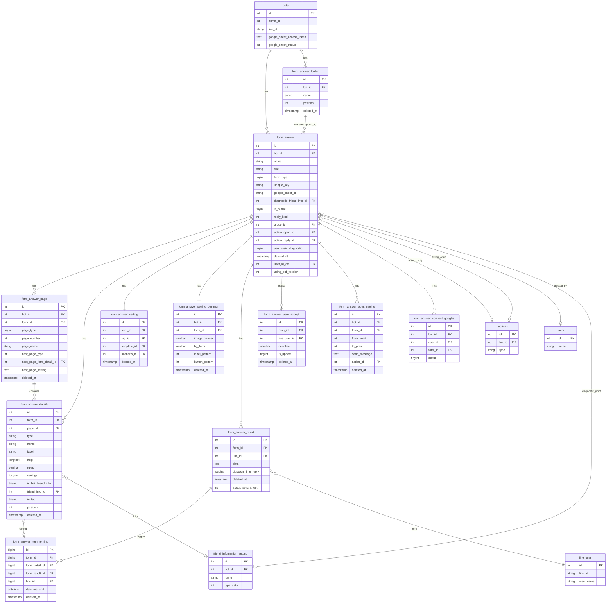

# FA-011 — Database Mapping: Tạo biểu mẫu「フォーム作成」

> Agent: db-mapper | Ngày tạo: 2026-05-21

---

## Primary Tables

| Bảng | Vai trò | Data size |
|------|---------|-----------|
| `form_answer` | Bảng form chính — chứa toàn bộ metadata, cấu hình và cài đặt của một form | 1.9MB |
| `form_answer_details` | Các item/câu hỏi bên trong form, theo từng trang | 8.3MB |
| `form_answer_page` | Các trang của form (dùng cho cả シンプル và 分岐 type) | 2.3MB |
| `form_answer_result` | Bảng lưu từng lượt submit của LINE user | 2.3MB |
| `form_answer_setting` | Cài đặt action sau submit (tag, template, scenario) | 114KB |
| `form_answer_setting_common` | Cài đặt thiết kế chung (màu sắc, font, ảnh header) | 1.1MB |
| `form_answer_folder` | Thư mục chứa form | 28KB |
| `form_answer_user_accept` | Theo dõi số lần trả lời của từng LINE user | 10KB |
| `form_answer_item_remind` | Reminder items liên kết với câu trả lời | 12KB |
| `form_answer_point_setting` | Cài đặt điểm cho tính năng chẩn đoán (診断コンテンツ) | 207KB |

## Secondary Tables

| Bảng | Vai trò | Quan hệ |
|------|---------|---------|
| `form_answer_connect_googles` | Trạng thái đồng bộ Google Sheets từng form | `form_id` → `form_answer.id` |
| `form_answer_2` | Bảng backup/migration của `form_answer` (legacy) | Cùng cấu trúc, ít cột hơn |
| `bots` | Bot/LINE OA sở hữu form | `form_answer.bot_id` → `bots.id` |
| `line_user` | LINE user submit form | `form_answer_result.line_id` → `line_user.id` |
| `friend_information_setting` | Trường thông tin bạn bè tùy chỉnh | `form_answer_details.friend_info_id` → `friend_information_setting.id` |
| `t_actions` | Action sau submit/khi mở form | `form_answer.action_reply_id`, `action_open_id` → `t_actions.id` |
| `result_error_googles` | Lỗi đồng bộ Google Sheets với retry logic | `form_answer_result.result_error_google_id` → `result_error_googles.id` |
| `users` | Admin/Staff xóa form | `form_answer.user_id_del` → `users.id` |
| `tags` | Tag gán khi submit form | `form_answer_setting.tag_id` → `tags.id` |
| `template` | Template message gửi sau submit | `form_answer_setting.template_id` → `template.id` |
| `scenario` | Scenario gắn sau submit | `form_answer_setting.scenario_id` → `scenario.id` |

---

## Entity Details

### Bảng: `form_answer`

**Schema:**

| Column | Type | Nullable | Default | Mô tả |
|--------|------|----------|---------|-------|
| `id` | int(11) | NOT NULL | — | PK, auto increment |
| `bot_id` | int(11) | NOT NULL | — | FK → bots.id |
| `name` | varchar(255) | NOT NULL | — | Tên quản lý nội bộ (「管理名」) — được set = system_name khi tạo |
| `line_name` | varchar(255) | NULL | — | Tên form hiển thị (legacy, = name ban đầu) |
| `system_name` | varchar(255) | NULL | — | Tên quản lý (「管理名」) — EP-07 map `system_name` → `name` |
| `form_type` | tinyint(4) | NOT NULL | `1` | Loại form: `1`=シンプル, `2`=分岐 |
| `title` | varchar(255) | NOT NULL | — | Tên form hiển thị với khách (「フォーム名」) |
| `description` | text | NULL | — | Mô tả form (legacy) |
| `reply_kind` | int(11) | NULL | — | Giới hạn trả lời: `0`=nhiều lần, `1`=1 lần, `2`=giới hạn số lần |
| `reply_text` | varchar(255) | NULL | — | Thông báo khi vượt giới hạn trả lời |
| `unique_key` | varchar(255) | NOT NULL | — | Slug URL công khai (6 ký tự random alphanumeric) |
| `google_sheet_access_token` | text | NULL | — | OAuth access token Google Sheets của bot |
| `google_sheet_id` | varchar(255) | NULL | — | ID của Google Spreadsheet liên kết |
| `diagnostic_friend_info_id` | int(11) | NULL | `0` | FK → friend_information_setting.id (lưu điểm chẩn đoán) |
| `use_basic_diagnostic` | tinyint(4) | NULL | `0` | `0`=không dùng chẩn đoán, `1`=có dùng |
| `is_public` | tinyint(4) | NOT NULL | `1` | Trạng thái công khai: `0`=OFF, `1`=ON |
| `created_at` | timestamp | NOT NULL | CURRENT_TIMESTAMP | Thời điểm tạo (「作成日」) |
| `updated_at` | timestamp | NULL | — | Thời điểm sửa gần nhất (「最終編集日」) |
| `google_sheet_token` | varchar(255) | NULL | — | Legacy token field |
| `google_sheet_name` | varchar(255) | NULL | — | Tên Google Spreadsheet |
| `sheet_reference_id` | int(10) UNSIGNED | NOT NULL | `0` | Tham chiếu sheet (internal) |
| `group_id` | int(11) | NOT NULL | `0` | Nhóm form (dùng trong EP-05: `form_answer.group_id`) |
| `position` | int(11) | NOT NULL | `1` | Thứ tự hiển thị trong danh sách |
| `color` | varchar(12) | NULL | — | Màu accent của form (default `#08BF5A`) |
| `image_header` | varchar(256) | NULL | — | Ảnh header của form (legacy — xem cũng trong `form_answer_setting_common`) |
| `button_submit_name` | varchar(128) | NULL | — | Text nút submit (「回答する」 mặc định) |
| `message_notify_success` | longtext | NULL | — | Nội dung thông báo thành công (legacy) |
| `action_open_id` | int(11) | NULL | — | FK → t_actions.id (action khi mở form) |
| `action_open_type` | int(11) | NOT NULL | `1` | Loại action khi mở: `1`=1 lần, khác=mỗi lần |
| `action_reply_id` | int(11) | NULL | — | FK → t_actions.id (action sau submit) |
| `action_reply_type` | int(11) | NOT NULL | `1` | Loại action sau submit: `1`=1 lần, khác=mỗi lần |
| `custom_style` | longtext | NULL | — | Custom CSS (legacy) |
| `reply_use_url` | tinyint(4) | NOT NULL | `0` | URL sau khi trả lời: `0`=default, `1`=custom, `2`=không redirect |
| `title_timer` | blob | NULL | — | Tiêu đề bộ đếm ngược |
| `option_show_timer` | tinyint(4) | NOT NULL | `0` | `0`=ẩn timer, `1`=hiển thị bộ đếm ngược |
| `option_timer` | tinyint(4) | NOT NULL | `0` | Tùy chọn timer (loại) |
| `unit_timer` | tinyint(4) | NOT NULL | `0` | Đơn vị timer |
| `date_timer_count_down` | date | NULL | — | Ngày đếm ngược đến (「カウントダウンタイマー」) |
| `time_timer_count_down` | varchar(255) | NULL | — | Giờ đếm ngược |
| `time_duration` | varchar(255) | NULL | — | Thời gian duration |
| `text_color_timer` | varchar(255) | NULL | — | Màu chữ timer |
| `bg_color_timer` | varchar(255) | NULL | — | Màu nền timer |
| `url_redirect_timer` | varchar(255) | NULL | — | URL chuyển hướng khi timer hết |
| `position_countdown` | tinyint(4) | NOT NULL | `1` | Vị trí hiển thị bộ đếm |
| `use_url_reply_countdown` | tinyint(4) | NOT NULL | `0` | Dùng URL chuyển hướng khi timer hết |
| `message_notify_count_down` | varchar(255) | NULL | — | Thông báo khi timer hết |
| `url_notify_success` | varchar(255) | NULL | — | URL hiển thị sau khi trả lời thành công |
| `is_duration_timer` | tinyint(4) | NOT NULL | `0` | Timer dạng duration |
| `days_timer_count_down` | int(11) | NULL | — | Số ngày đếm ngược |
| `bg_color_button` | varchar(255) | NULL | — | Màu nền nút submit (default `#EDF4FB`) |
| `text_color_button` | varchar(255) | NULL | — | Màu chữ nút submit (default `#5799DB`) |
| `count_user_reply` | int(11) | NULL | `0` | Tổng số lượt trả lời (reset khi soft-delete) |
| `deleted_at` | timestamp | NULL | — | Soft-delete timestamp (「削除した日時」) |
| `use_redirect_limit_reply` | tinyint(4) | NULL | `0` | Redirect khi vượt giới hạn |
| `url_redirect_limit_reply` | varchar(1000) | NULL | — | URL redirect khi vượt giới hạn |
| `limit_reply_friend` | int(11) | NULL | `1` | Số lần trả lời tối đa (khi `reply_kind=2`) |
| `is_public_use_url` | tinyint(4) | NULL | `0` | Dùng URL tùy chỉnh khi form không public |
| `is_public_message` | varchar(255) | NULL | — | Thông báo khi form không public |
| `is_public_url` | varchar(1000) | NULL | — | URL redirect khi form không public |
| `is_limit_reply` | tinyint(4) | NULL | `0` | Kích hoạt giới hạn tổng số lượt trả lời |
| `limit_reply` | int(11) | NULL | `1` | Tổng số lượt trả lời tối đa |
| `is_use_url_limit_reply` | tinyint(4) | NULL | `0` | Dùng URL khi đạt giới hạn |
| `limit_reply_message` | varchar(255) | NULL | — | Thông báo khi đạt giới hạn |
| `limit_reply_url` | varchar(255) | NULL | — | URL khi đạt giới hạn |
| `setting_page_confirm` | json | NULL | — | Cài đặt trang xác nhận (JSON) |
| `custom_js` | text | NULL | — | Custom JavaScript (「CSS・JS設定」) |
| `custom_js_bak` | text | NULL | — | Backup custom JS |
| `show_duration` | tinyint(4) | NOT NULL | `0` | Hiển thị thời gian làm form |
| `is_use_message_reply_success` | tinyint(4) | NULL | `0` | Bật tính năng gửi tin nhắn sau submit |
| `message_reply_success` | text | NULL | — | Nội dung tin nhắn sau submit (「回答完了時に送信するメッセージ」) |
| `is_send_gen_message` | tinyint(4) | NULL | `0` | Gửi copy Q&A sau submit (「質問と回答のコピーメッセージを送る」) |
| `user_id_del` | int(11) | NULL | — | FK → users.id (người xóa form —「削除したユーザー名」) |
| `using_old_version` | int(11) | NULL | `0` | `0`=dùng v3 UI, `1`=dùng v1/v2 UI cũ |
| `new_version` | tinyint(1) | NULL | — | Flag phiên bản mới |

**Data mẫu** (từ `db/data/form_answer.sql`):
- `form_type=1` (シンプル), `unique_key='EoWJ7R'`, `reply_kind=1`, `is_public=1`
- Xác nhận: `unique_key` là chuỗi 6 ký tự, giá trị mặc định `color=NULL` (set trong code khi tạo mới)

---

### Bảng: `form_answer_details`

**Schema:**

| Column | Type | Nullable | Default | Mô tả |
|--------|------|----------|---------|-------|
| `id` | int(11) | NOT NULL | — | PK |
| `form_id` | int(11) | NOT NULL | — | FK → form_answer.id |
| `page_id` | int(11) | NULL | — | FK → form_answer_page.id |
| `type` | varchar(255) | NOT NULL | — | Loại item (xem enum bên dưới) |
| `name` | varchar(255) | NOT NULL | — | Tên định danh nội bộ của item |
| `typeoption` | varchar(255) | NULL | — | Kiểu con của type (vd: `description` cho loại trang trí) |
| `label` | varchar(255) | NULL | — | Nhãn hiển thị (「質問文」) |
| `title` | varchar(255) | NULL | — | Tiêu đề item (v1 legacy) |
| `help` | longtext | NULL | — | Nội dung bổ sung (「補足」) |
| `default` | varchar(255) | NULL | — | Giá trị mặc định |
| `value` | varchar(255) | NULL | — | Giá trị (legacy/v1) |
| `rules` | varchar(255) | NULL | — | Validation rules (JSON, vd: `{"required":true,"email":true}`) |
| `settings` | longtext | NULL | — | Cấu hình selectable/optionable (JSON) |
| `is_new` | tinyint(4) | NULL | `0` | `0`=v1 data, `1`=v3 data |
| `file_type` | tinyint(4) | NULL | `0` | Loại file upload cho phép |
| `setting_number_limit` | text | NULL | — | Cài đặt giới hạn ký tự |
| `select_number_limit` | tinyint(4) | NULL | `0` | Giới hạn số lựa chọn được chọn |
| `css_setting_class` | text | NULL | — | CSS class tùy chỉnh (legacy) |
| `auto_add_other` | tinyint(4) | NULL | `0` | Tự động thêm lựa chọn「その他」 |
| `apply_datetime` | tinyint(4) | NULL | `0` | Áp dụng kiểu date/time |
| `default_date` | varchar(255) | NULL | — | Ngày mặc định |
| `type_default_date` | tinyint(4) | NULL | `0` | Loại ngày mặc định |
| `friend_info_type` | tinyint(4) | NULL | — | Loại dữ liệu friend info được link |
| `is_link_friend_info` | tinyint(4) | NULL | `0` | `1`=tạo/cập nhật friend_information_setting |
| `apply_rules` | tinyint(4) | NULL | `0` | Kích hoạt validation rules tùy chỉnh |
| `placeholder` | varchar(255) | NULL | — | Placeholder (「プレースホルダ」) |
| `created_at` | timestamp | NOT NULL | CURRENT_TIMESTAMP | Thời gian tạo |
| `updated_at` | timestamp | NULL | — | Thời gian sửa |
| `file_upload` | varchar(255) | NULL | — | Đường dẫn file upload |
| `required_date` | tinyint(4) | NOT NULL | `0` | Bắt buộc nhập ngày |
| `required_time` | tinyint(4) | NOT NULL | `0` | Bắt buộc nhập giờ |
| `position` | tinyint(4) | NOT NULL | `1` | Thứ tự item trong trang (drag-drop) |
| `friend_info_id` | int(11) | NOT NULL | `0` | FK → friend_information_setting.id; âm = system field (`-1`=view_name, `-2`=phone, `-3`=email, `-6`=province) |
| `in_tag` | tinyint(4) | NOT NULL | `0` | `1`=kết quả gắn tag (「友だち情報記録」) |
| `in_tag_and_friend` | tinyint(4) | NOT NULL | `0` | `1`=gắn tag và ghi vào friend info |
| `bg_color` | varchar(255) | NULL | — | Màu nền item |
| `text_color` | varchar(255) | NULL | — | Màu chữ item |
| `is_display_info_friend` | tinyint(4) | NOT NULL | `0` | `0`=ẩn, `1`=hiển thị giá trị bạn bè đã có |
| `deleted_at` | timestamp | NULL | — | Soft-delete timestamp |
| `css_specification` | text | NULL | — | CSS đặc tả (v3: CSSクラス cho 質問文 và 補足) |
| `is_question` | tinyint(4) | NOT NULL | `1` | `1`=câu hỏi, `0`=nội dung trang trí |
| `is_show` | tinyint(4) | NULL | `1` | `1`=hiển thị, `0`=ẩn |

**Data mẫu** (từ `db/data/form_answer_details.sql`):
- `type='description'`, `typeoption='description'`, `label='見出し'`, `rules='{"required":false}'`
- `position` dùng như `sort_order` cho thứ tự kéo thả

---

### Bảng: `form_answer_page`

**Schema:**

| Column | Type | Nullable | Default | Mô tả |
|--------|------|----------|---------|-------|
| `id` | int(10) UNSIGNED | NOT NULL | — | PK |
| `bot_id` | int(11) | NOT NULL | — | FK → bots.id |
| `form_id` | int(11) | NOT NULL | — | FK → form_answer.id |
| `page_type` | tinyint(4) | NOT NULL | — | Loại trang: `1`=trang nội dung thường |
| `page_number` | int(11) | NULL | — | Số thứ tự trang (0 cho スタートページ) |
| `page_name` | varchar(100) | NULL | — | Tên trang (mặc định `スタートページ`) |
| `page_image` | varchar(256) | NULL | — | Ảnh header của trang riêng |
| `button_name` | varchar(100) | NULL | — | Text nút điều hướng trang |
| `button_pattern` | int(11) | NULL | — | Kiểu nút (1=mặc định) |
| `button_color` | varchar(32) | NULL | — | Màu chữ nút (default `#FFFFFF`) |
| `button_bg_color` | varchar(32) | NULL | — | Màu nền nút (default `#08BF5A`) |
| `button_font_weight` | int(11) | NULL | — | Font weight nút |
| `button_shadow` | tinyint(4) | NULL | `1` | Bóng đổ nút: `0`=off, `1`=on |
| `css_specification` | text | NULL | — | CSS đặc tả của trang |
| `next_page_type` | int(11) | NULL | `3` | Điều hướng trang tiếp: `2`=phân nhánh (NEXT_PAGE_TYPE_SETTING), `3`=kết thúc form (NEXT_PAGE_TYPE_END_FORM) |
| `next_page_form_detail_id` | int(11) | NULL | — | FK → form_answer_details.id (câu hỏi phân nhánh) |
| `next_page_setting` | text | NULL | — | JSON mapping option → pageId cho form phân nhánh |
| `created_at` | timestamp | NULL | — | Thời gian tạo |
| `updated_at` | timestamp | NULL | — | Thời gian sửa |
| `deleted_at` | timestamp | NULL | — | Soft-delete timestamp |
| `sheet_id` | int(11) | NULL | — | ID Google Sheet tương ứng với trang |

**Data mẫu**: Trang mặc định `page_name='スタートページ'`, `next_page_type=3` (kết thúc), `page_number=1`, `button_color='#FFFFFF'`, `button_bg_color='#08BF5A'`

---

### Bảng: `form_answer_result`

**Schema:**

| Column | Type | Nullable | Default | Mô tả |
|--------|------|----------|---------|-------|
| `id` | int(11) | NOT NULL | — | PK (ID trong URL `/v3/result/{form_id}`, không phải ID này) |
| `form_id` | int(11) | NOT NULL | — | FK → form_answer.id |
| `page_id` | int(11) | NULL | — | FK → form_answer_page.id (trang cuối user hoàn thành) |
| `line_id` | int(11) | NOT NULL | — | FK → line_user.id (「友だち名」) |
| `data` | text | NOT NULL | — | JSON array câu trả lời `[{name, type, value, point...}]` |
| `created_at` | timestamp | NOT NULL | CURRENT_TIMESTAMP | Thời điểm submit (「回答日時」) |
| `updated_at` | timestamp | NULL | — | Thời gian cập nhật |
| `duration_time_reply` | varchar(16) | NULL | — | Thời gian hoàn thành form (「回答時間」, format MM:SS) |
| `aff_result_id` | int(11) | NULL | — | FK → aff_result.id (affiliate tracking) |
| `deleted_at` | timestamp | NULL | — | Soft-delete timestamp |
| `result_error_google_id` | int(11) | NULL | — | FK → result_error_googles.id |
| `status_sync_sheet` | int(11) | NULL | — | `0`=chưa sync Google Sheets, `1`=đã sync |
| `status_sync_deleted` | int(11) | NULL | — | Trạng thái xóa đồng bộ |

**Ghi chú**: Cột `data` là JSON lưu toàn bộ câu trả lời theo format `[{name, type, value}]`. Điểm chẩn đoán (「診断ポイント」) được tính từ các item có `type='diagnostic_content'` trong JSON này.

---

### Bảng: `form_answer_setting`

**Schema:**

| Column | Type | Nullable | Default | Mô tả |
|--------|------|----------|---------|-------|
| `id` | int(11) | NOT NULL | — | PK |
| `form_id` | int(11) | NOT NULL | — | FK → form_answer.id (1:1) |
| `tag_id` | int(11) | NULL | — | FK → tags.id (tag gán sau submit) |
| `template_id` | int(11) | NULL | — | FK → template.id (template gửi sau submit) |
| `scenario_id` | int(11) | NULL | — | FK → scenario.id (scenario bắt đầu sau submit) |
| `scenario_start_day` | int(11) | NULL | — | Ngày bắt đầu scenario |
| `scenario_start_time` | time | NULL | — | Giờ bắt đầu scenario |
| `created_at` | timestamp | NULL | CURRENT_TIMESTAMP | Thời gian tạo |
| `updated_at` | timestamp | NULL | — | Thời gian sửa |
| `deleted_at` | timestamp | NULL | — | Soft-delete timestamp |

---

### Bảng: `form_answer_setting_common`

**Schema:**

| Column | Type | Nullable | Default | Mô tả |
|--------|------|----------|---------|-------|
| `id` | int(10) UNSIGNED | NOT NULL | — | PK |
| `bot_id` | int(11) | NOT NULL | — | FK → bots.id |
| `form_id` | int(11) | NOT NULL | — | FK → form_answer.id (1:1) |
| `image_header` | varchar(255) | NULL | — | Ảnh header chung (「共通ヘッダー画像」) |
| `bg_form` | varchar(32) | NULL | — | Màu nền form (「フォーム背景カラー」, vd: `#FFFFFF`) |
| `label_pattern` | int(11) | NULL | `1` | Kiểu thiết kế「見出し」|
| `label_color` | varchar(32) | NULL | `#FFFFFF` | Màu chữ「見出し」|
| `label_bg_color` | varchar(32) | NULL | `#08BF5A` | Màu nền「見出し」|
| `label_font_weight` | int(11) | NULL | `600` | Font weight「見出し」|
| `label_font_size` | int(11) | NULL | `20` | Font size「見出し」|
| `label_text_align` | varchar(10) | NULL | `center` | Căn lề「見出し」|
| `label_overwrite` | tinyint(4) | NULL | `0` | `1`=áp dụng setting chung cho tất cả trang |
| `line_pattern` | int(11) | NULL | `1` | Kiểu thiết kế「区切り線」|
| `line_color` | varchar(32) | NULL | `#08BF5A` | Màu「区切り線」|
| `line_width` | int(11) | NULL | — | Độ dày「区切り線」|
| `line_overwrite` | tinyint(4) | NULL | `0` | `1`=áp dụng setting chung cho tất cả trang |
| `question_color` | varchar(32) | NULL | `#222222` | Màu chữ「質問項目」|
| `question_font_weight` | int(11) | NULL | `600` | Font weight「質問項目」|
| `question_font_size` | int(11) | NULL | `16` | Font size「質問項目」|
| `question_overwrite` | tinyint(4) | NOT NULL | `0` | `1`=áp dụng setting chung cho tất cả trang |
| `description_color` | varchar(32) | NULL | `#222222` | Màu chữ phần mô tả/補足 |
| `description_font_weight` | int(11) | NULL | `300` | Font weight mô tả |
| `description_font_size` | int(11) | NULL | `14` | Font size mô tả |
| `button_pattern` | int(11) | NULL | `1` | Kiểu thiết kế「ボタン」|
| `button_color` | varchar(32) | NULL | `#FFFFFF` | Màu chữ nút |
| `button_bg_color` | varchar(32) | NULL | `#08BF5A` | Màu nền nút |
| `button_font_weight` | int(11) | NULL | `600` | Font weight nút |
| `button_shadow` | tinyint(4) | NULL | `1` | Bóng đổ nút |
| `button_overwrite` | tinyint(4) | NULL | `0` | `1`=áp dụng setting chung cho tất cả trang |
| `title_class` | varchar(255) | NULL | — | CSS class cho tiêu đề |
| `subtitle_class` | varchar(255) | NULL | — | CSS class cho phụ đề |
| `subquestion_class` | varchar(255) | NULL | — | CSS class cho câu hỏi phụ |
| `dropdown_class` | varchar(255) | NULL | — | CSS class cho dropdown |
| `radio_class` | varchar(255) | NULL | — | CSS class cho radio |
| `checkbox_class` | varchar(255) | NULL | — | CSS class cho checkbox |
| `line_class` | varchar(255) | NULL | — | CSS class cho đường kẻ |
| `question_class` | varchar(255) | NULL | — | CSS class cho câu hỏi |
| `button_class` | varchar(255) | NULL | — | CSS class cho nút |
| `class_overwrite` | tinyint(4) | NULL | `0` | `1`=áp dụng CSS class chung cho tất cả trang |
| `created_at` | timestamp | NULL | — | Thời gian tạo |
| `updated_at` | timestamp | NULL | — | Thời gian sửa |
| `deleted_at` | timestamp | NULL | — | Soft-delete timestamp |

---

### Bảng: `form_answer_folder`

**Schema:**

| Column | Type | Nullable | Default | Mô tả |
|--------|------|----------|---------|-------|
| `id` | int(10) UNSIGNED | NOT NULL | — | PK |
| `bot_id` | int(11) | NOT NULL | — | FK → bots.id |
| `name` | varchar(255) | NOT NULL | — | Tên thư mục |
| `position` | int(11) | NOT NULL | `0` | Thứ tự sắp xếp thư mục |
| `old_id` | int(11) | NOT NULL | `-1` | ID cũ (dùng cho migration) |
| `deleted_at` | timestamp | NULL | — | Soft-delete timestamp |

**Ghi chú**: Không có cột `created_at`/`updated_at`. Form thuộc thư mục qua `form_answer.group_id` (FK → form_answer_folder.id).

---

### Bảng: `form_answer_user_accept`

**Schema:**

| Column | Type | Nullable | Default | Mô tả |
|--------|------|----------|---------|-------|
| `id` | int(10) UNSIGNED | NOT NULL | — | PK |
| `form_id` | int(11) | NOT NULL | — | FK → form_answer.id |
| `line_user_id` | int(11) | NOT NULL | — | FK → line_user.id |
| `deadline` | varchar(255) | NOT NULL | — | Deadline trả lời (Unix timestamp dạng milliseconds) |
| `created_at` | timestamp | NOT NULL | CURRENT_TIMESTAMP | Thời gian tạo |
| `updated_at` | timestamp | NOT NULL | CURRENT_TIMESTAMP | Thời gian sửa |
| `is_update` | tinyint(4) | NOT NULL | `0` | `1`=cần xác nhận lại (khi timer thay đổi) |
| `deleted_at` | timestamp | NULL | — | Soft-delete timestamp |

**Ghi chú**: Dùng để theo dõi giới hạn trả lời khi `reply_kind=2`. `deadline` lưu timestamp milliseconds dạng chuỗi (vd: `'1663308240000'`).

---

### Bảng: `form_answer_item_remind`

**Schema:**

| Column | Type | Nullable | Default | Mô tả |
|--------|------|----------|---------|-------|
| `id` | bigint(20) UNSIGNED | NOT NULL | — | PK |
| `form_id` | bigint(20) | NOT NULL | — | FK → form_answer.id |
| `form_detail_id` | bigint(20) | NOT NULL | — | FK → form_answer_details.id (item loại リマインド) |
| `form_result_id` | bigint(20) | NOT NULL | — | FK → form_answer_result.id |
| `line_id` | bigint(20) | NOT NULL | — | FK → line_user.id |
| `label` | varchar(255) | NOT NULL | — | Nhãn của reminder |
| `datetime_end` | datetime | NOT NULL | — | Thời điểm hết hạn reminder |
| `user_deleted` | int(11) | NULL | — | FK → users.id (người xóa reminder) |
| `created_at` | timestamp | NULL | — | Thời gian tạo |
| `updated_at` | timestamp | NULL | — | Thời gian sửa |
| `deleted_at` | timestamp | NULL | — | Soft-delete timestamp |

---

### Bảng: `form_answer_point_setting`

**Schema:**

| Column | Type | Nullable | Default | Mô tả |
|--------|------|----------|---------|-------|
| `id` | int(10) UNSIGNED | NOT NULL | — | PK |
| `bot_id` | int(11) | NOT NULL | — | FK → bots.id |
| `form_id` | int(11) | NOT NULL | — | FK → form_answer.id |
| `from_point` | int(11) | NULL | — | Điểm tối thiểu của dải (「診断コンテンツ」) |
| `to_point` | int(11) | NULL | — | Điểm tối đa của dải |
| `send_message` | text | NULL | — | Tin nhắn gửi khi điểm trong dải |
| `action_id` | int(11) | NULL | — | FK → t_actions.id (action khi điểm trong dải) |
| `created_at` | timestamp | NOT NULL | CURRENT_TIMESTAMP | Thời gian tạo |
| `updated_at` | timestamp | NOT NULL | CURRENT_TIMESTAMP | Thời gian sửa |
| `deleted_at` | timestamp | NULL | — | Soft-delete timestamp |

---

### Bảng: `form_answer_connect_googles`

**Schema:**

| Column | Type | Nullable | Default | Mô tả |
|--------|------|----------|---------|-------|
| `id` | int(10) UNSIGNED | NOT NULL | — | PK |
| `bot_id` | int(11) | NOT NULL | — | FK → bots.id |
| `user_id` | int(11) | NOT NULL | — | FK → users.id |
| `form_id` | int(11) | NOT NULL | — | FK → form_answer.id |
| `name` | varchar(255) | NULL | — | Tên spreadsheet |
| `connect_time` | timestamp | NULL | — | Thời điểm kết nối thành công |
| `status` | tinyint(4) | NOT NULL | `0` | Trạng thái: `0`=WAITING, `1`=PROCESSING, `2`=SUCCESS, âm=ERROR |
| `retry_error` | tinyint(4) | NULL | `0` | Số lần retry |
| `message` | text | NULL | — | Thông báo lỗi/thành công |
| `created_at` | timestamp | NULL | — | Thời gian tạo |
| `updated_at` | timestamp | NULL | — | Thời gian sửa |

---

## UI ↔ DB Field Mapping

### SCR-FA11-01: Danh sách form

| UI Element | Label JP | DB Table | Column | Mapping Type | Confidence | Ghi chú |
|-----------|----------|----------|--------|-------------|------------|---------|
| Tên form cột 1 | 「管理名」 | `form_answer` | `name` | Direct | **Cao** | Tên quản lý nội bộ; EP-07 map `system_name` → `name` |
| Loại form | 「タイプ」 | `form_answer` | `form_type` | Enum (1/2) | **Cao** | `1`=シンプル, `2`=分岐 |
| Ngày tạo | 「作成日」 | `form_answer` | `created_at` | DateTime→Date | **Cao** | Format `Y.m.d` qua getCreatedAtAttribute() |
| Ngày sửa | 「最終編集日」 | `form_answer` | `updated_at` | DateTime→Date | **Cao** | Format `Y.m.d` |
| Toggle công khai | 「公開状態」 | `form_answer` | `is_public` | Boolean (0/1) | **Cao** | EP-21 update `is_public`; `0`=OFF, `1`=ON |
| Quick test | 「クイックテスト」 | — | — | Computed | **Trung bình** | Trạng thái lấy từ `BotLineUserRepository` — không có cột riêng trong form_answer |
| Số người trả lời | 「回答情報」 | `form_answer` | `count_user_reply` | Count | **Cao** | Trường `count_user_reply` trong form_answer; hoặc COUNT từ `form_answer_result` |
| Thư mục hiển thị | — | `form_answer` | `group_id` | FK | **Cao** | `group_id` FK → `form_answer_folder.id`; `0` = 未分類 |

### SCR-FA11-02: Modal tạo form mới

| UI Element | Label JP | DB Table | Column | Mapping Type | Confidence | Ghi chú |
|-----------|----------|----------|--------|-------------|------------|---------|
| Tên quản lý | 「管理名」 | `form_answer` | `name` (= `system_name`) | Direct | **Cao** | EP-04 `system_name` → insert vào `name` |
| Tên form | 「フォーム名」 | `form_answer` | `title` | Direct | **Cao** | EP-04 `form_name` → `title` |
| Thư mục | 「フォルダ」 | `form_answer` | `group_id` | FK | **Cao** | EP-04 `folder_id` → `group_id`; `0`=未分類 |
| Loại form | 「タイプ」 | `form_answer` | `form_type` | Enum | **Cao** | EP-04 `form_type`: `1`=シンプル, `2`=分岐 |
| Lựa chọn nhanh | 「よく使われる項目」 | `form_answer_details` | (multi rows) | Create items | **Cao** | EP-04 `attr` → INSERT nhiều record vào `form_answer_details` |

### SCR-FA11-03: Form Editor — Tab フォーム編集

| UI Element | Label JP | DB Table | Column | Mapping Type | Confidence | Ghi chú |
|-----------|----------|----------|--------|-------------|------------|---------|
| Loại item | — | `form_answer_details` | `type` | Enum string | **Cao** | Xem bảng enum type bên dưới |
| Tên item nội bộ | — | `form_answer_details` | `name` | Direct | **Cao** | Định danh nội bộ |
| Câu hỏi / Label | 「質問文」 | `form_answer_details` | `label` | Direct | **Cao** | Label hiển thị của item |
| Bắt buộc | 「必須/任意」 | `form_answer_details` | `rules` | JSON field | **Cao** | `rules.required = true/false` |
| Nội dung bổ sung | 「補足」 | `form_answer_details` | `help` | Direct | **Cao** | |
| Placeholder | 「プレースホルダ」 | `form_answer_details` | `placeholder` | Direct | **Cao** | |
| Giới hạn ký tự | 「入力制限」 | `form_answer_details` | `setting_number_limit` | JSON | **Cao** | |
| Ghi thông tin bạn bè | 「友だち情報記録」 | `form_answer_details` | `friend_info_id` + `in_tag` | Multi-column | **Cao** | `friend_info_id` ≠ 0 → ghi; `in_tag=1` → gắn tag |
| Link friend info | — | `form_answer_details` | `friend_info_id` | FK | **Cao** | FK → friend_information_setting.id |
| CSS class (質問文) | 「CSSクラス(質問文)」 | `form_answer_details` | `css_specification` | JSON/text | **Cao** | v3 dùng `css_specification` |
| Thứ tự item | — | `form_answer_details` | `position` | Sort order | **Cao** | Drag-drop → cập nhật `position` |
| Ảnh header form | — | `form_answer_page` | `page_image` | File path | **Cao** | Ảnh header của từng trang |
| Text nút submit | — | `form_answer` | `button_submit_name` | Direct | **Cao** | |
| Tên trang | 「ページ名」 | `form_answer_page` | `page_name` | Direct | **Cao** | |
| Điều hướng tiếp theo | — | `form_answer_page` | `next_page_type` | Enum (2/3) | **Cao** | `3`=kết thúc, `2`=phân nhánh |
| Câu hỏi phân nhánh | — | `form_answer_page` | `next_page_form_detail_id` | FK | **Cao** | |
| Mapping phân nhánh | — | `form_answer_page` | `next_page_setting` | JSON | **Cao** | `[{value, pageId}]` |

### SCR-FA11-04: Tab 共通デザイン設定

| UI Element | Label JP | DB Table | Column | Mapping Type | Confidence | Ghi chú |
|-----------|----------|----------|--------|-------------|------------|---------|
| Ảnh header chung | 「共通ヘッダー画像」 | `form_answer_setting_common` | `image_header` | File path | **Cao** | |
| Màu nền form | 「フォーム背景カラー」 | `form_answer_setting_common` | `bg_form` | Color hex | **Cao** | |
| Thiết kế「見出し」 | — | `form_answer_setting_common` | `label_pattern`, `label_color`, `label_bg_color`, `label_font_weight`, `label_font_size`, `label_text_align` | Multi-column | **Cao** | |
| Thiết kế「区切り線」 | — | `form_answer_setting_common` | `line_pattern`, `line_color`, `line_width` | Multi-column | **Cao** | |
| Thiết kế「質問項目」 | — | `form_answer_setting_common` | `question_color`, `question_font_weight`, `question_font_size` | Multi-column | **Cao** | |
| Thiết kế「ボタン」 | — | `form_answer_setting_common` | `button_pattern`, `button_color`, `button_bg_color`, `button_font_weight`, `button_shadow` | Multi-column | **Cao** | |
| CSS classes | — | `form_answer_setting_common` | `title_class`, `subtitle_class`, `question_class`, `button_class`, v.v. | Multi-column | **Cao** | Mapping 1:1 từng loại element |
| Custom CSS | 「CSS・JS設定」 | `form_answer` | `custom_js` | Direct (text) | **Cao** | Tên cột là `custom_js` nhưng lưu cả CSS |

### SCR-FA11-05: Tab メッセージ・アクション設定

| UI Element | Label JP | DB Table | Column | Mapping Type | Confidence | Ghi chú |
|-----------|----------|----------|--------|-------------|------------|---------|
| Số lần kích hoạt action | 「アクションの稼働回数」 | `form_answer` | `action_reply_type` | Enum | **Cao** | `1`=1度のみ, `2`=何度でも (xem code logic) |
| Tin nhắn sau submit | 「回答完了時に送信するメッセージ」 | `form_answer` | `message_reply_success` | Text | **Cao** | Kèm `is_use_message_reply_success=1` để bật |
| Copy Q&A | 「質問と回答のコピーメッセージを送る」 | `form_answer` | `is_send_gen_message` | Boolean | **Cao** | `0`=OFF, `1`=ON |
| Action sau submit | 「回答完了時アクション」 | `form_answer` | `action_reply_id` | FK → t_actions | **Cao** | |
| Action khi mở form | 「フォーム表示時アクション」 | `form_answer` | `action_open_id` | FK → t_actions | **Cao** | |
| Tag action | — | `form_answer_setting` | `tag_id` | FK → tags | **Cao** | |
| Template action | — | `form_answer_setting` | `template_id` | FK → template | **Cao** | |
| Scenario action | — | `form_answer_setting` | `scenario_id`, `scenario_start_day`, `scenario_start_time` | FK + config | **Cao** | |
| Remind settings | 「リマインドメッセージ」 | `form_answer_item_remind` | (multiple) | Separate table | **Cao** | Remind items lưu riêng trong bảng này |

### SCR-FA11-06: Tab 診断コンテンツ

| UI Element | Label JP | DB Table | Column | Mapping Type | Confidence | Ghi chú |
|-----------|----------|----------|--------|-------------|------------|---------|
| Bật/tắt chẩn đoán | 「作成しない/作成する」 | `form_answer` | `use_basic_diagnostic` | Boolean | **Cao** | `0`=không dùng, `1`=có dùng |
| Field lưu điểm | 「ポイントを記録する友だち情報」 | `form_answer` | `diagnostic_friend_info_id` | FK | **Cao** | FK → friend_information_setting.id |
| Dải điểm + tin nhắn | — | `form_answer_point_setting` | `from_point`, `to_point`, `send_message`, `action_id` | Separate table | **Cao** | Mỗi dải điểm = 1 record |
| Điểm từng lựa chọn | — | `form_answer_details` | `settings` | JSON | **Cao** | JSON settings chứa điểm cho từng option |

### SCR-FA11-07: Tab 各種設定

| UI Element | Label JP | DB Table | Column | Mapping Type | Confidence | Ghi chú |
|-----------|----------|----------|--------|-------------|------------|---------|
| Trang xác nhận | 「回答確認ページ」 | `form_answer` | `setting_page_confirm` | JSON | **Cao** | JSON: `{show: 0/1, ...}` |
| Trang sau trả lời | 「回答後ページ」 | `form_answer` | `url_notify_success` / `reply_use_url` | Multi-column | **Cao** | `reply_use_url=2`=không redirect; `url_notify_success`=URL tùy chỉnh |
| Giới hạn trả lời | 「回答制限」 | `form_answer` | `reply_kind`, `limit_reply_friend`, `is_limit_reply`, `limit_reply` | Multi-column | **Cao** | `reply_kind=0/1/2`, `limit_reply_friend`=giới hạn per user |
| Thời gian hiển thị | 「表示期限」 | — | — | **Thấp** | Không tìm thấy cột `display_from`/`display_until` trong schema — có thể trong JSON hoặc chưa được implement |
| Bộ đếm ngược | 「カウントダウンタイマー」 | `form_answer` | `option_show_timer`, `date_timer_count_down`, `time_timer_count_down` | Multi-column | **Cao** | |
| Hiển thị tên form LINE | 「LINEトーク画面・フォーム名表示」 | `form_answer` | `line_name` | Direct | **Trung bình** | `line_name` dự đoán là tên hiển thị trong LINE talk screen |

### SCR-FA11-08: Form công khai

| UI Element | Label JP | DB Table | Column | Mapping Type | Confidence | Ghi chú |
|-----------|----------|----------|--------|-------------|------------|---------|
| URL slug | — | `form_answer` | `unique_key` | Direct | **Cao** | 6 ký tự random, dùng trong URL `/form-render-v3/{unique_key}` |
| Các items hiển thị | — | `form_answer_details` | (all rows by `form_id`, `page_id`) | Query | **Cao** | ORDER BY `position` |

### SCR-FA11-09: Trang kết quả — 回答一覧

| UI Element | Label JP | DB Table | Column | Mapping Type | Confidence | Ghi chú |
|-----------|----------|----------|--------|-------------|------------|---------|
| Ngày trả lời | 「回答日時」 | `form_answer_result` | `created_at` | DateTime | **Cao** | |
| Thời gian làm | 「回答時間」 | `form_answer_result` | `duration_time_reply` | String MM:SS | **Cao** | |
| Tên bạn bè | 「友だち名」 | `line_user` | `view_name` (JOIN) | FK join | **Cao** | `form_answer_result.line_id` → `line_user.id` |
| Điểm chẩn đoán | 「診断ポイント」 | `form_answer_result` | `data` (JSON) | Computed | **Cao** | Tính tổng `point` từ items `type=diagnostic_content` trong JSON `data` |
| Câu trả lời chi tiết | — | `form_answer_result` | `data` | JSON parse | **Cao** | JSON array `[{name, type, value, point}]` |
| Tab リマインド | — | `form_answer_item_remind` | (by `form_result_id`) | FK | **Cao** | |

### SCR-FA11-10: Form đã xóa — 削除済みフォーム

| UI Element | Label JP | DB Table | Column | Mapping Type | Confidence | Ghi chú |
|-----------|----------|----------|--------|-------------|------------|---------|
| Thời điểm xóa | 「削除した日時」 | `form_answer` | `deleted_at` | DateTime | **Cao** | |
| Tên form | 「フォーム名」 | `form_answer` | `name` (= `system_name`) | Direct | **Cao** | |
| Người xóa | 「削除したユーザー名」 | `users` | `name` (JOIN) | FK join | **Cao** | `form_answer.user_id_del` → `users.id` |

---

## Enum / Status Values

| Tên enum | DB Table | Column | DB Value | UI Display JP | Mô tả |
|---------|----------|--------|----------|--------------|-------|
| Form type | `form_answer` | `form_type` | `1` | 「シンプル」 | Form đơn giản 1 trang hoặc nhiều trang tuyến tính |
| Form type | `form_answer` | `form_type` | `2` | 「分岐」 | Form phân nhánh theo câu trả lời |
| Công khai | `form_answer` | `is_public` | `1` | 「ON」 | Form công khai, user có thể truy cập |
| Công khai | `form_answer` | `is_public` | `0` | 「OFF」 | Form bị ẩn |
| Giới hạn trả lời | `form_answer` | `reply_kind` | `0` | 「何度でも」 | Không giới hạn số lần trả lời |
| Giới hạn trả lời | `form_answer` | `reply_kind` | `1` | 「1度のみ」 | Chỉ trả lời 1 lần |
| Giới hạn trả lời | `form_answer` | `reply_kind` | `2` | 「回数制限」 | Giới hạn số lần cụ thể |
| Phiên bản UI | `form_answer` | `using_old_version` | `0` | 「v3」 | Dùng UI mới (v3) |
| Phiên bản UI | `form_answer` | `using_old_version` | `1` | 「v1/v2」 | Dùng UI cũ |
| Page điều hướng | `form_answer_page` | `next_page_type` | `2` | 「分岐設定」 | Phân nhánh theo câu trả lời |
| Page điều hướng | `form_answer_page` | `next_page_type` | `3` | 「フォーム終了」 | Kết thúc form |
| Chẩn đoán | `form_answer` | `use_basic_diagnostic` | `0` | 「作成しない」 | Không dùng tính năng chẩn đoán |
| Chẩn đoán | `form_answer` | `use_basic_diagnostic` | `1` | 「作成する」 | Có dùng tính năng chẩn đoán |
| Google Sheets sync | `form_answer_result` | `status_sync_sheet` | `0` | — | Chưa đồng bộ |
| Google Sheets sync | `form_answer_result` | `status_sync_sheet` | `1` | — | Đã đồng bộ |
| Google connect | `form_answer_connect_googles` | `status` | `0` | 「WAITING」 | Đang chờ kết nối |
| Google connect | `form_answer_connect_googles` | `status` | `1` | 「PROCESSING」 | Đang xử lý |
| Google connect | `form_answer_connect_googles` | `status` | `2` | 「SUCCESS」 | Kết nối thành công |

### Enum: `form_answer_details.type` (loại item)

| DB Value | UI Display JP | Loại | Ghi chú |
|----------|--------------|------|---------|
| `text_8` | 「短文回答」 | Câu hỏi | Input text ngắn |
| `memo` | 「長文回答」 | Câu hỏi | Textarea dài |
| `date_time` | 「日付・時刻」 | Câu hỏi | Chọn ngày/giờ |
| `select_1` | 「単一選択」 | Câu hỏi | Radio button |
| `checkbox` | 「複数選択」 | Câu hỏi | Checkbox |
| `upload_file` | 「ファイルアップロード」 | Câu hỏi | Upload file |
| `event_1` | 「リマインド」 | Câu hỏi | Reminder — gắn với event step |
| `diagnostic_content` | 「診断コンテンツ」 | Câu hỏi | Câu hỏi tính điểm chẩn đoán |
| `short_name` | 「名前(名前)」 | Câu hỏi preset | Họ tên |
| `nickname` | 「名前(表示名)」 | Câu hỏi preset | Tên hiển thị LINE |
| `phone` | 「電話番号」 | Câu hỏi preset | Số điện thoại |
| `email` | 「メールアドレス」 | Câu hỏi preset | Email |
| `description` | 「見出し」 | Trang trí | Heading (khi `typeoption='description'`) |
| `description` | 「テキスト」 | Trang trí | Text block |
| `description` | 「画像」 | Trang trí | Khối ảnh |
| `description` | 「動画埋め込み」 | Trang trí | Khối video |
| `description` | 「区切り線」 | Trang trí | Đường kẻ phân cách |
| `description` | 「カスタムHTML」 | Trang trí | HTML tùy chỉnh |

**Ghi chú**: Nhiều loại item trang trí đều dùng `type='description'`, phân biệt nhau qua `typeoption` hoặc `settings` JSON.

---

## Unmapped Items

### UI fields không tìm thấy DB match:

| UI Element | Screen | Lý do chưa match |
|-----------|--------|-----------------|
| 「表示期限」(từ/đến ngày) | SCR-FA11-07 | Không tìm thấy cột `display_from`/`display_until` trong `form_answer` schema — có thể được lưu trong `setting_page_confirm` JSON hoặc chưa được implement trong DB hiện tại — **Thấp** |
| 「クイックテスト」trạng thái | SCR-FA11-01 | Trạng thái quick test không có cột riêng — được lấy từ `BotLineUserRepository` (tài khoản tester đã đăng ký chưa) — **Trung bình** |
| Cột `count_reply` trong `form_answer_user_accept` | — | Index DB ghi `8 cột` nhưng schema chỉ thấy `is_update` — có thể có cột `count_reply` không xuất hiện rõ trong schema dump |

### DB columns không xuất hiện trên UI (internal/legacy):

| DB Table | Column | Lý do |
|----------|--------|-------|
| `form_answer` | `line_name` | Legacy — ban đầu = `name`, hiện tại UI chỉ dùng `name`/`system_name`/`title` |
| `form_answer` | `google_sheet_access_token` (trong form_answer) | Legacy — OAuth token bây giờ lưu trong `bots.google_sheet_access_token` |
| `form_answer` | `google_sheet_token` | Legacy field — bị supersede bởi `google_sheet_access_token` |
| `form_answer` | `sheet_reference_id` | Internal migration reference |
| `form_answer` | `title_timer` | Tiêu đề timer (blob) — không thấy trên UI hiện tại |
| `form_answer` | `custom_js_bak` | Backup field — không thấy trên UI |
| `form_answer` | `new_version` | Internal version flag — không có trên UI |
| `form_answer` | `color` | Màu accent form legacy — không thấy trên UI v3 |
| `form_answer` | `message_notify_success` | Legacy — superseded bởi `message_reply_success` |
| `form_answer` | `custom_style` | Legacy CSS — superseded bởi `custom_js` và `form_answer_setting_common` |
| `form_answer` | `aff_result_id` (trong form_answer_result) | Affiliate tracking — internal |
| `form_answer` | `status_sync_deleted` (trong form_answer_result) | Internal sync flag |
| `form_answer_details` | `is_new` | Flag phân biệt v1/v3 data — internal |
| `form_answer_details` | `file_type` | Loại file upload — UI hiển thị ẩn hoặc trong settings |
| `form_answer_folder` | `old_id` | Legacy migration field |
| `form_answer_connect_googles` | `retry_error` | Internal retry counter |

---

## Entity Relationships (ER Diagram Mermaid)

