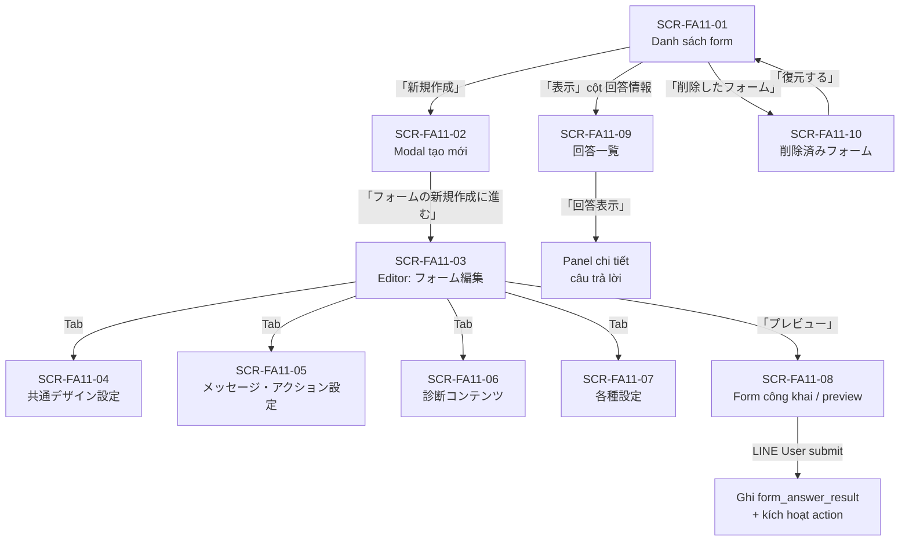
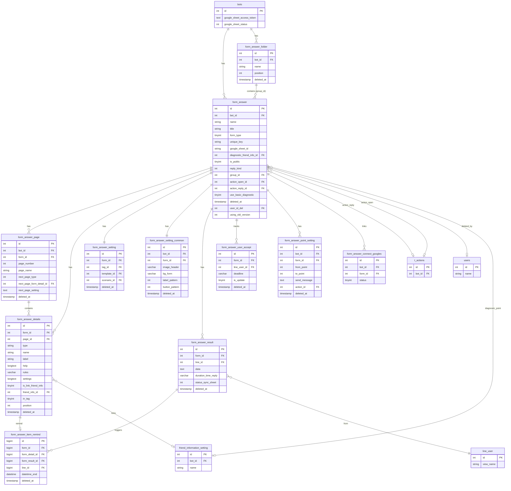

# FA-011 — Tạo biểu mẫu「フォーム作成」

**Mã tính năng:** FA-011
**Portal:** Admin
**URL chính:** /basic/form-answer
**Trạng thái spec:** HOÀN THÀNH
**Ngày tạo:** 2026-05-22

---

## 1. Tổng quan

### Mục đích

Tính năng cho phép Admin và Staff tạo, quản lý các biểu mẫu trực tuyến (online form) để thu thập thông tin từ bạn bè LINE. Biểu mẫu có thể được gửi qua link URL, nhúng vào tin nhắn broadcast/step, hoặc sử dụng cho mục đích chẩn đoán và khảo sát. Câu trả lời được lưu trữ có cấu trúc và có thể xem inline, xuất CSV, hoặc đồng bộ tự động sang Google Sheets.

Giá trị cốt lõi:
- Thu thập dữ liệu khách hàng (tên, email, số điện thoại, ngày sinh, địa chỉ) và tự động cập nhật vào hồ sơ bạn bè LINE
- Hỗ trợ 2 chế độ biểu mẫu: đơn giản 1 trang và phân nhánh điều kiện
- Tự động kích hoạt action (gắn tag, gửi tin nhắn, bắt đầu scenario) ngay sau khi submit

### Actors

| Actor | Vai trò |
|-------|---------|
| Admin | Toàn quyền: tạo, sửa, xóa, xem kết quả, quản lý thư mục, kết nối Google Sheets |
| Staff | Tùy theo quyền được Admin phân — có thể bị giới hạn một số chức năng |
| LINE User (bạn bè) | Truy cập form qua URL công khai, điền và submit form; phải là bạn bè của bot |

### Phạm vi

**Thuộc tính năng này:**
- Tạo và chỉnh sửa biểu mẫu (các loại câu hỏi, thiết kế, cài đặt)
- Quản lý thư mục phân loại form
- Cài đặt action và tin nhắn tự động sau khi submit
- Tính năng chẩn đoán điểm số (診断コンテンツ)
- Xem, lọc và xuất kết quả trả lời
- Kết nối Google Sheets để đồng bộ kết quả
- Khôi phục form đã xóa (soft-delete 90 ngày)
- Form công khai cho LINE User điền

**Không thuộc tính năng này:**
- Quản lý bạn bè (FA khác — chỉ đọc `line_user` để hiển thị tên)
- Quản lý tag, template, scenario (các FA khác — chỉ chọn từ danh sách)
- Tạo friend information field (FA khác — chỉ chọn field đã có)
- Broadcast/Step message tích hợp URL form (FA khác — FA-011 chỉ tạo URL)

---

## 2. Các màn hình & Luồng xử lý end-to-end

### SCR-FA11-01: Danh sách form「フォーム作成（一覧）」

**URL:** `/basic/form-answer`
**Mô tả:** Màn hình chính, hiển thị danh sách toàn bộ form theo thư mục. Có panel thư mục bên trái và bảng danh sách form bên phải.

**Luồng end-to-end:**

| Bước | User Action | UI | API Endpoint | Business Logic | DB Tables | Response |
|------|------------|----|----|----|----|-----|
| 1 | Truy cập trang | Tải trang danh sách | GET EP-01 `/basic/form-answer` | Kiểm tra plan, đọc cookie `folder_form_answer`, lấy danh sách thư mục | `form_answer_folder`, `bots` | View `basic.form_answer.index_v3` |
| 2 | Trang tải xong | Bảng form tự động tải | POST EP-18 `/ajax/get-list-form-answer-v3` | Truy vấn form theo folder active, JOIN setting, paginate 20 | `form_answer`, `form_answer_setting`, `form_answer_folder` | JSON: `{items, list_folder, count_default, folder_active}` |
| 3 | Kiểm tra Google Sheets | Badge「連携済み」hoặc link kết nối | GET EP-20 `/ajax/google-sheet-active` | Kiểm tra `bots.google_sheet_access_token` và `google_sheet_status` | `bots` | JSON: `{active, re_connection}` |
| 4 | Toggle công khai | Checkbox「公開状態」bật/tắt | POST EP-21 `/ajax/change-public-form-answer` | Update `form_answer.is_public` | `form_answer` | `{success: true}` |
| 5 | Xóa form đơn | Xóa trong action cột | POST EP-18 (action=deleteItem) | Cascade soft-delete form + tất cả bảng con, ghi `user_id_del` | `form_answer`, `form_answer_details`, `form_answer_result`, ... | JSON: `{status: true}` |
| 6 | Xóa nhiều form | Chọn checkbox + click「一括削除」| POST EP-29 `/ajax/form-answer/delete-list-formanswer` | Cascade soft-delete, reset rich menu items | `form_answer` + bảng con | `{status: true, message: "delete formanswer success"}` |
| 7 | Chuyển thư mục | Chọn form + click「一括フォルダ変更」| POST EP-28 `/ajax/form-answer/move-folder` | Update `form_answer.group_id` | `form_answer` | JSON |
| 8 | Sắp xếp form | Click「並べ替え」| POST EP-30 `/ajax/sort-form-answer` | Update `position` từng form | `form_answer` | JSON |

---

### SCR-FA11-02: Modal tạo form mới「回答フォーム 新規作成」

**URL:** `/basic/form-answer` (modal overlay)
**Mô tả:** Modal dialog cho phép chọn tên, thư mục, loại form và câu hỏi mặc định trước khi tạo.

**Luồng end-to-end:**

| Bước | User Action | UI | API Endpoint | Business Logic | DB Tables | Response |
|------|------------|----|----|----|----|-----|
| 1 | Click「新規作成」| Hiện modal với form fields | — | — | — | Modal hiển thị |
| 2 | Nhập 管理名, フォーム名, chọn フォルダ, タイプ, よく使われる項目 | Form fields với counter ký tự | — | Client-side validation | — | UI phản hồi realtime |
| 3 | Click「フォームの新規作成に進む」| Gửi form | POST EP-04 `/basic/form-answer/store-v3` | Kiểm tra BackupHistory + free plan (≤3 form); tạo `unique_key` 6 ký tự; insert form với defaults; tạo trang đầu (スタートページ); tạo items từ `attr` | `form_answer`, `form_answer_page`, `form_answer_details`, `form_answer_setting_common`, `notify_setting` | JSON: `{status: true, id, code}` |
| 4 | Thành công | Redirect đến editor | — | — | — | Chuyển sang SCR-FA11-03 |

**Giá trị mặc định khi tạo form:**
- `color = #08BF5A`
- `bg_color_button = #EDF4FB`, `text_color_button = #5799DB`
- `reply_kind = 0` (cho phép trả lời nhiều lần)
- `message_reply_success = "{name}様 \n\n回答を受け付けました。"`
- `position` = max position + 1

---

### SCR-FA11-03: Form editor — Tab「フォーム編集」

**URL:** `/basic/form-answer/edit/{id}`
**Mô tả:** Trang chỉnh sửa cấu trúc và câu hỏi form. Giao diện 2 khu vực: canvas preview trái và property editor phải.

**Luồng end-to-end:**

| Bước | User Action | UI | API Endpoint | Business Logic | DB Tables | Response |
|------|------------|----|----|----|----|-----|
| 1 | Mở trang | Tải editor | GET EP-02 `/basic/form-answer/edit/{id}` | Tải form + setting_common + pages + items; xây dựng `idTmp` cho frontend; xử lý `next_page_setting` cho phân nhánh | `form_answer`, `form_answer_page`, `form_answer_details`, `form_answer_setting_common` | View editor |
| 2 | Click「＋ 項目・装飾を追加」| Mở modal thêm item | — | — | — | Modal SCR-FA11-03-Modal |
| 3 | Chọn loại item, click「この項目を追加」| Item xuất hiện trên canvas | — | Client-side, lưu tạm trong state | — | Canvas cập nhật |
| 4 | Click vào item | Panel property editor hiện bên phải | — | — | — | Panel mở với chi tiết item |
| 5 | Thay đổi 質問文, 必須, 補足, placeholder, giới hạn | Property editor | — | Client-side state | — | Live preview cập nhật |
| 6 | Bật「友だち情報に回答を記録」| Dropdown chọn friend info field | — | — | — | Giao diện liên kết field |
| 7 | Click「保存」| Lưu toàn bộ form | POST EP-05 `/basic/form-answer/save-v3/{id}` | DB transaction: upsert pages + items; xử lý `next_page_setting`; upload ảnh base64; sync `friend_information_setting`; tạo Google Spreadsheet nếu cần | `form_answer`, `form_answer_page`, `form_answer_details`, `form_answer_setting`, `friend_information_setting`, `friend_info_option_selects` | JSON: `{status: true, id, code, formEditId, selectableEdit}` |

---

### SCR-FA11-04: Form editor — Tab「共通デザイン設定」

**URL:** `/basic/form-answer/edit/{id}` (tab 共通デザイン設定)
**Mô tả:** Cài đặt thiết kế toàn cục: ảnh header, màu nền, kiểu見出し, 区切り線, 質問項目, nút submit, CSS/JS.

**Luồng end-to-end:**

| Bước | User Action | UI | API Endpoint | Business Logic | DB Tables | Response |
|------|------------|----|----|----|----|-----|
| 1 | Tải tab | Lấy setting hiện tại | GET EP-13 `/basic/form-answer/{id}/get-setting-common` | Lấy `form_answer_setting_common` | `form_answer_setting_common` | JSON setting object |
| 2 | Upload ảnh header | Drag-drop hoặc chọn file | — | Client-side encode base64 | — | Preview cập nhật |
| 3 | Chọn màu nền | Color picker input hex | — | Client-side | — | Live preview |
| 4 | Điều chỉnh thiết kế見出し, 区切り線, 質問項目, ボタン | Các option thiết kế | — | Client-side | — | Live preview |
| 5 | Click「保存」| Lưu thiết kế | POST EP-09 `/basic/form-answer/{id}/save-setting-common` | Upload ảnh nếu có; upsert `form_answer_setting_common`; áp dụng overwrite cho tất cả trang nếu được chọn; set `using_old_version=0` | `form_answer_setting_common`, `form_answer` | `{success: true, data: settingCommon}` |

---

### SCR-FA11-05: Form editor — Tab「メッセージ・アクション設定」

**URL:** `/basic/form-answer/edit/{id}` (tab メッセージ・アクション設定)
**Mô tả:** Cài đặt tin nhắn phản hồi và action tự động sau khi submit form, action khi mở form, và cài đặt nhắc lịch (リマインド).

**Luồng end-to-end:**

| Bước | User Action | UI | API Endpoint | Business Logic | DB Tables | Response |
|------|------------|----|----|----|----|-----|
| 1 | Chọn tần suất action | Radio「何度でも」/「1度のみ」| — | Client-side | — | UI cập nhật |
| 2 | Nhập nội dung tin nhắn sau submit | Textarea với counter | — | Client-side | — | — |
| 3 | Chọn copy Q&A | Checkbox「質問と回答のコピーメッセージを送る」| — | Client-side | — | — |
| 4 | Click「保存」(tin nhắn) | Lưu cài đặt tin nhắn | POST EP-36 `/basic/form-answer/v3/saveMessageReply` | Update `message_reply_success`, `is_use_message_reply_success`, `is_send_gen_message`, `action_reply_type` | `form_answer` | JSON |
| 5 | Cài đặt action (SC-004) | Tab filter + nút「アクション追加・編集」| POST EP-37 `/basic/form-answer/v3/getSettingAction` | Lấy cài đặt action hiện tại | `form_answer`, `form_answer_setting`, `t_actions` | JSON |
| 6 | Cài đặt action khi mở form | PUT EP-38 | Update `action_open_id`, `action_open_type` | `form_answer` | JSON |
| 7 | Lưu remind settings | POST EP-33 `/basic/form-answer/v3/save-setting-remind` | Tạo/cập nhật `form_answer_item_remind` + event steps | `form_answer_item_remind` | JSON |

---

### SCR-FA11-06: Form editor — Tab「診断コンテンツ」

**URL:** `/basic/form-answer/edit/{id}` (tab 診断コンテンツ)
**Mô tả:** Cài đặt tính năng chẩn đoán điểm số — tự động tính điểm dựa theo câu trả lời lựa chọn và kích hoạt action khác nhau theo dải điểm.

**Luồng end-to-end:**

| Bước | User Action | UI | API Endpoint | Business Logic | DB Tables | Response |
|------|------------|----|----|----|----|-----|
| 1 | Chọn「作成する」 | Hiện cấu hình chẩn đoán | — | Client-side | — | UI mở rộng |
| 2 | Chọn field lưu điểm | Dropdown「ポイントタイプ」friend info field | — | Client-side | — | — |
| 3 | Lưu cài đặt chẩn đoán | POST EP-43 `/basic/form-answer/diagnostic-content-settings/{id}` | Update `form_answer.use_basic_diagnostic`, `diagnostic_friend_info_id` | `form_answer` | JSON |
| 4 | Cài đặt điểm chẩn đoán | POST EP-35 `/basic/form-answer/v3/save-point-setting` | Upsert dải điểm từng khoảng | `form_answer_point_setting` | JSON |

---

### SCR-FA11-07: Form editor — Tab「各種設定」

**URL:** `/basic/form-answer/edit/{id}` (tab 各種設定)
**Mô tả:** Cài đặt bổ sung: trang xác nhận, giới hạn số lần trả lời, bộ đếm ngược, hiển thị tên form trong LINE.

**Luồng end-to-end:**

| Bước | User Action | UI | API Endpoint | Business Logic | DB Tables | Response |
|------|------------|----|----|----|----|-----|
| 1 | Cài đặt trang xác nhận/sau trả lời | Toggle ON/OFF | — | Client-side | — | — |
| 2 | Cài đặt giới hạn trả lời | Select 0/1/2 lần | — | Client-side | — | — |
| 3 | Cài đặt bộ đếm ngược | Date/time picker | — | Client-side | — | — |
| 4 | Click「保存」| Lưu tất cả cài đặt khác | POST EP-06 `/basic/form-answer/update-other-settings/{id}` | Nếu timer thay đổi → `form_answer_user_accept.is_update=1`; encode `setting_page_confirm` JSON; clear timer nếu tắt | `form_answer`, `form_answer_user_accept` | `{success: true}` |

---

### SCR-FA11-08: Form công khai (preview / trang điền)

**URL:** `/basic/form-answer/form-render-v3/{slug}/{line_id?}`
**Mô tả:** Trang công khai không yêu cầu đăng nhập Admin. LINE User truy cập qua URL có slug để điền form. Khi `mode=preview` có banner cảnh báo và nút submit bị disabled.

**Luồng end-to-end:**

| Bước | User Action | UI | API Endpoint | Business Logic | DB Tables | Response |
|------|------------|----|----|----|----|-----|
| 1 | LINE User mở URL | Tải trang form | GET EP-23 `/basic/form-answer/form-render-v3/{slug}` | Tìm form theo `unique_key`; kiểm tra hạn hợp đồng bot; decode `line_id` Hashids; kiểm tra `reply_kind` (đã trả lời chưa); tải trang và items | `form_answer`, `form_answer_page`, `form_answer_details`, `form_answer_result` | View form công khai |
| 2 | Điền câu trả lời | Form fields theo cấu trúc | — | Client-side | — | — |
| 3 | Click submit | Gửi câu trả lời | POST EP-25 `/basic/form-answer/form-render-v3/store` | Xác thực LINE user (Hashids); kiểm tra `conversation` (phải là bạn bot); tính `duration_time_reply`; ghi giá trị vào `friend_information_value`; gắn tag; insert `form_answer_result`; gửi action + tin nhắn phản hồi; gửi action điểm chẩn đoán; push notify | `form_answer_result`, `line_user`, `friend_information_value`, `form_answer_user_accept`, `form_answer_item_remind` | JSON: `{status: true, msg: "success"}` |

**Các trạng thái lỗi khi submit:**
- `"status": "false_friend"` → người dùng chưa là bạn bè của bot
- `"status": "false_reply_kind"` → đã vượt giới hạn trả lời

---

### SCR-FA11-09: Trang kết quả trả lời「回答一覧」

**URL:** `/basic/form-answer/v3/result/{id}`
**Mô tả:** Xem danh sách câu trả lời với bộ lọc ngày, phân trang, và panel chi tiết inline. Có 2 tab:「回答一覧」và「友だち一覧」.

**Luồng end-to-end:**

| Bước | User Action | UI | API Endpoint | Business Logic | DB Tables | Response |
|------|------------|----|----|----|----|-----|
| 1 | Truy cập trang | Tải trang kết quả | GET EP-14 `/basic/form-answer/v3/result/{id}` | Render view | `form_answer` | View |
| 2 | Tải danh sách | Bảng kết quả hiển thị | POST EP-15 `/basic/form-answer/v3/result/{id}` | Query `form_answer_result` với filter ngày, phân trang; tính điểm chẩn đoán từ JSON data; JOIN `line_user` để lấy `view_name` | `form_answer_result`, `line_user`, `form_answer_item_remind` | JSON: `{success, result: {data, current_page, last_page, total}}` |
| 3 | Lọc ngày | Date range picker | POST EP-15 (params ngày) | Lọc theo `date_start`, `date_end` | `form_answer_result` | JSON mới |
| 4 | Click「回答表示」| Panel chi tiết mở bên phải | GET EP-42 `/basic/form-answer/detail-result/{form_id}/{form_result_id}` | Lấy chi tiết 1 câu trả lời | `form_answer_result`, `form_answer_item_remind` | JSON |
| 5 | Click「CSV」| Tải file CSV | GET EP-19 `/ajax/download-answer/{id}` | Xuất CSV toàn bộ kết quả | `form_answer_result` | File download |

---

### SCR-FA11-10: Trang form đã xóa「削除済みフォーム」

**URL:** `/basic/form-answer/removed`
**Mô tả:** Danh sách form đã bị soft-delete, có thể khôi phục. Form không thể xóa thủ công — tự động xóa vật lý sau 90 ngày.

**Luồng end-to-end:**

| Bước | User Action | UI | API Endpoint | Business Logic | DB Tables | Response |
|------|------------|----|----|----|----|-----|
| 1 | Truy cập trang | Tải danh sách form đã xóa | GET EP-31 `/ajax/get-form-answer-removed` | Lấy `form_answer` where `deleted_at IS NOT NULL`, kèm `username_del` (JOIN `users`) | `form_answer`, `users` | JSON danh sách |
| 2 | Click「復元する」| Khôi phục form | POST EP-32 `/ajax/restore-form-answer/{id}` | DB transaction: kiểm tra free plan (≤3 form); restore `form_answer` + tất cả bảng liên quan + `form_answer_folder` | `form_answer`, `form_answer_details`, `form_answer_setting`, `form_answer_page`, `form_answer_point_setting`, `form_answer_setting_common`, `form_answer_user_accept`, `form_answer_folder` | `{success: true}` |

---

### Flow Diagram tổng thể

---

## 3. Data Model

### Entities chính

| Entity | Bảng DB | Vai trò |
|--------|---------|---------|
| Form | `form_answer` | Entity trung tâm — metadata, cấu hình, cài đặt toàn bộ form |
| Trang | `form_answer_page` | Các trang của form; phân nhánh qua `next_page_type`/`next_page_setting` |
| Item/Câu hỏi | `form_answer_details` | Từng câu hỏi/trang trí trong form; lưu loại, label, rules, settings |
| Câu trả lời | `form_answer_result` | Mỗi lượt submit của LINE user; data lưu dưới dạng JSON array |
| Cài đặt action | `form_answer_setting` | Tag, template, scenario gắn sau submit |
| Thiết kế chung | `form_answer_setting_common` | Màu sắc, font, ảnh header — áp dụng toàn form |
| Thư mục | `form_answer_folder` | Phân loại form; form thuộc thư mục qua `form_answer.group_id` |
| Theo dõi trả lời | `form_answer_user_accept` | Giới hạn số lần trả lời per LINE user |
| Nhắc lịch | `form_answer_item_remind` | Reminder items liên kết với từng câu trả lời |
| Điểm chẩn đoán | `form_answer_point_setting` | Dải điểm và action tương ứng cho 診断コンテンツ |
| Kết nối Google | `form_answer_connect_googles` | Trạng thái đồng bộ từng form sang Google Spreadsheet |

### ER Diagram

---

## 4. Field Traceability Matrix

| # | UI Element | Màn hình | DB Table.Column | Hướng | Validation | Business Rule |
|---|-----------|----------|----------------|-------|-----------|--------------|
| 1 | 管理名 | SCR-FA11-01, 02, 03 | `form_answer.name` | Đọc/Ghi | Tối đa 50 ký tự (UI) / 255 (DB) | UI enforce 50 ký tự; EP-07 map `system_name` → `name` |
| 2 | フォーム名 | SCR-FA11-02 | `form_answer.title` | Ghi | Tối đa 20 ký tự (UI) / 255 (DB) | Hiển thị với khách hàng |
| 3 | フォルダ | SCR-FA11-01, 02 | `form_answer.group_id` → `form_answer_folder.id` | Đọc/Ghi | — | `group_id=0` = 未分類 |
| 4 | タイプ (シンプル/分岐) | SCR-FA11-01, 02 | `form_answer.form_type` | Ghi (tạo), Đọc | — | `1`=シンプル, `2`=分岐; không đổi được sau khi tạo |
| 5 | 公開状態 toggle | SCR-FA11-01 | `form_answer.is_public` | Đọc/Ghi | — | `0`=OFF, `1`=ON; EP-21 |
| 6 | 作成日 | SCR-FA11-01 | `form_answer.created_at` | Đọc | — | Format `Y.m.d` qua accessor |
| 7 | 最終編集日 | SCR-FA11-01 | `form_answer.updated_at` | Đọc | — | Format `Y.m.d` |
| 8 | 回答情報 (số người) | SCR-FA11-01 | `form_answer.count_user_reply` | Đọc | — | Reset về 0 khi soft-delete |
| 9 | 配信用URL (slug) | SCR-FA11-01, 08 | `form_answer.unique_key` | Đọc | 6 ký tự random alphanumeric | Đảm bảo unique qua đệ quy |
| 10 | よく使われる項目 | SCR-FA11-02 | `form_answer_details` (nhiều rows) | Ghi | — | EP-04 `attr` → INSERT nhiều records |
| 11 | 質問文 | SCR-FA11-03 | `form_answer_details.label` | Đọc/Ghi | Tối đa 50 ký tự | — |
| 12 | 必須/任意 | SCR-FA11-03 | `form_answer_details.rules` (JSON) | Đọc/Ghi | — | `{"required": true/false}` |
| 13 | 補足 | SCR-FA11-03 | `form_answer_details.help` | Đọc/Ghi | Tối đa 200 ký tự | — |
| 14 | プレースホルダ | SCR-FA11-03 | `form_answer_details.placeholder` | Đọc/Ghi | Tối đa 50 ký tự | — |
| 15 | 入力制限 | SCR-FA11-03 | `form_answer_details.setting_number_limit` | Đọc/Ghi | — | JSON |
| 16 | 友だち情報に回答を記録 | SCR-FA11-03 | `form_answer_details.friend_info_id` + `in_tag` | Đọc/Ghi | — | `friend_info_id` âm = system field; dương = custom field |
| 17 | Thứ tự item (drag-drop) | SCR-FA11-03 | `form_answer_details.position` | Ghi | — | — |
| 18 | Loại item | SCR-FA11-03-Modal | `form_answer_details.type` | Ghi | — | Xem enum type bên dưới |
| 19 | Ảnh header (trang) | SCR-FA11-03 | `form_answer_page.page_image` | Đọc/Ghi | png, jpg | — |
| 20 | Text nút submit | SCR-FA11-03 | `form_answer.button_submit_name` | Đọc/Ghi | — | Mặc định「回答する」|
| 21 | Điều hướng trang tiếp | SCR-FA11-03 | `form_answer_page.next_page_type` | Đọc/Ghi | — | `2`=phân nhánh, `3`=kết thúc |
| 22 | Mapping phân nhánh | SCR-FA11-03 | `form_answer_page.next_page_setting` | Đọc/Ghi | — | JSON `[{value, pageId}]` |
| 23 | 共通ヘッダー画像 | SCR-FA11-04 | `form_answer_setting_common.image_header` | Đọc/Ghi | png/jpg, 1000×400px | — |
| 24 | フォーム背景カラー | SCR-FA11-04 | `form_answer_setting_common.bg_form` | Đọc/Ghi | Hex color | Mặc định `#FFFFFF` |
| 25 | Thiết kế見出し | SCR-FA11-04 | `form_answer_setting_common.label_*` | Đọc/Ghi | — | Nhiều cột (pattern, color, bg, font) |
| 26 | Thiết kế区切り線 | SCR-FA11-04 | `form_answer_setting_common.line_*` | Đọc/Ghi | — | — |
| 27 | Thiết kế質問項目 | SCR-FA11-04 | `form_answer_setting_common.question_*` | Đọc/Ghi | — | — |
| 28 | Thiết kế ボタン | SCR-FA11-04 | `form_answer_setting_common.button_*` | Đọc/Ghi | — | — |
| 29 | CSS/JS tùy chỉnh | SCR-FA11-04 | `form_answer.custom_js` | Đọc/Ghi | — | Lưu cả CSS dù tên cột là `custom_js` |
| 30 | Tần suất action | SCR-FA11-05 | `form_answer.action_reply_type` | Đọc/Ghi | — | `1`=1度のみ; khác=何度でも |
| 31 | Tin nhắn sau submit | SCR-FA11-05 | `form_answer.message_reply_success` | Đọc/Ghi | Tối đa 5,000 ký tự | `is_use_message_reply_success=1` để bật |
| 32 | Copy Q&A | SCR-FA11-05 | `form_answer.is_send_gen_message` | Đọc/Ghi | — | `0`=OFF, `1`=ON |
| 33 | Action sau submit | SCR-FA11-05 | `form_answer.action_reply_id` → `t_actions` | Đọc/Ghi | — | SC-004 (Action Settings) |
| 34 | Tag action | SCR-FA11-05 | `form_answer_setting.tag_id` → `tags` | Đọc/Ghi | — | — |
| 35 | Scenario action | SCR-FA11-05 | `form_answer_setting.scenario_id` + `scenario_start_day/time` | Đọc/Ghi | — | — |
| 36 | Bật/tắt chẩn đoán | SCR-FA11-06 | `form_answer.use_basic_diagnostic` | Đọc/Ghi | — | `0`=không dùng, `1`=có dùng |
| 37 | Field lưu điểm chẩn đoán | SCR-FA11-06 | `form_answer.diagnostic_friend_info_id` | Đọc/Ghi | — | Chỉ chọn field loại ポイント |
| 38 | Dải điểm + tin nhắn chẩn đoán | SCR-FA11-06 | `form_answer_point_setting.*` | Đọc/Ghi | — | Mỗi dải = 1 record |
| 39 | Trang xác nhận | SCR-FA11-07 | `form_answer.setting_page_confirm` (JSON) | Đọc/Ghi | — | — |
| 40 | Giới hạn trả lời | SCR-FA11-07 | `form_answer.reply_kind` | Đọc/Ghi | — | `0`=vô hạn, `1`=1 lần, `2`=giới hạn số lần |
| 41 | Số lần giới hạn per user | SCR-FA11-07 | `form_answer.limit_reply_friend` | Đọc/Ghi | — | Dùng khi `reply_kind=2` |
| 42 | Bộ đếm ngược | SCR-FA11-07 | `form_answer.option_show_timer`, `date_timer_count_down`, `time_timer_count_down` | Đọc/Ghi | — | Khi tắt → clear date/time |
| 43 | URL slug (form công khai) | SCR-FA11-08 | `form_answer.unique_key` | Đọc | — | `/form-render-v3/{unique_key}` |
| 44 | 回答日時 | SCR-FA11-09 | `form_answer_result.created_at` | Đọc | — | Format hiển thị `YYYY.MM.DD(曜) HH:mm` |
| 45 | 回答時間 | SCR-FA11-09 | `form_answer_result.duration_time_reply` | Đọc | — | Format MM:SS |
| 46 | 友だち名 | SCR-FA11-09 | `line_user.view_name` (JOIN) | Đọc | — | `form_answer_result.line_id` → `line_user.id` |
| 47 | 診断ポイント | SCR-FA11-09 | `form_answer_result.data` (JSON computed) | Đọc | — | Tổng `point` từ items `type=diagnostic_content` |
| 48 | 削除した日時 | SCR-FA11-10 | `form_answer.deleted_at` | Đọc | — | — |
| 49 | 削除したユーザー名 | SCR-FA11-10 | `users.name` (JOIN) | Đọc | — | `form_answer.user_id_del` → `users.id` |

---

## 5. Business Rules

### BR-01: Giới hạn plan miễn phí
**Nguồn:** `FormAnswerController.php:6928` (storeV3), `:7328` (restoreFormAnswer)
**Mô tả:** Free plan chỉ được tối đa 3 form active. Kiểm tra trước khi tạo mới (`storeV3`) và trước khi khôi phục (`restoreFormAnswer`). Nếu vi phạm → trả về HTTP 500 với thông báo lỗi.

### BR-02: Unique key của form
**Nguồn:** `FormAnswerController.php:6676` (randomFormCodeRecursion)
**Mô tả:** Mỗi form có `unique_key` 6 ký tự random alphanumeric, đảm bảo unique trong bảng `form_answer` qua đệ quy. Slug này được dùng trong URL công khai và không thay đổi sau khi tạo.

### BR-03: Giới hạn số lần trả lời
**Nguồn:** `FormAnswerService.php:84` (renderFormAnswer), `FormAnswerController.php:2145`
**Mô tả:**
- `reply_kind=0`: Vô hạn số lần trả lời
- `reply_kind=1`: Chỉ 1 lần — kiểm tra COUNT từ `form_answer_result`
- `reply_kind=2`: Giới hạn số lần cụ thể — theo dõi qua `form_answer_user_accept`
- Khi vi phạm → response `"status": "false_reply_kind"` kèm `reply_text`

### BR-04: Điều kiện là bạn bè để submit
**Nguồn:** `FormAnswerService.php:767` (storeRenderForm)
**Mô tả:** Khi LINE User submit form, phải có `conversation` active với bot (`is_blocked=0`). Nếu chưa phải bạn bè → response `"status": "false_friend"` kèm `bot.url_add_friend`.

### BR-05: Ghi thông tin bạn bè khi submit
**Nguồn:** `FormAnswerService.php:767`
**Mô tả:** Nếu câu hỏi có `friend_info_id`:
- `-1` → `line_user.view_name` (tên hiển thị)
- `-2` → `line_user.phone_number`
- `-3` → `line_user.email`
- `-6` → `line_user.province`
- ID dương → `friend_information_value` (field tùy chỉnh)
- Cập nhật `view_name` trigger `SyncElasticsearch`

### BR-06: Backup lock
**Nguồn:** `FormAnswerController.php:6928`
**Mô tả:** Khi bot đang backup (`BackupHistory.status IN (0, 1)`), tất cả thao tác tạo/sửa/xóa form bị từ chối với `MESSAGE_NOTIFY_BACKUP`.

### BR-07: Soft delete 90 ngày
**Nguồn:** UI spec SCR-FA11-10, `FormAnswerController.php:3462` (ajaxGetFormAnswerListV3)
**Mô tả:** Form bị xóa không mất ngay — được soft-delete với `deleted_at` timestamp và `user_id_del`. Sau 90 ngày kể từ `deleted_at` → tự động xóa vật lý. Trong thời gian này có thể khôi phục. Khi soft-delete: `count_user_reply` reset về 0.

### BR-08: Google Sheets integration
**Nguồn:** `FormAnswerController.php:914`, `FormAnswerService.php:1515`
**Mô tả:** Mỗi bot có thể kết nối Google OAuth một lần. Sau khi kết nối, mỗi form được cấp 1 Google Spreadsheet riêng (`form_answer.google_sheet_id`). Kết quả submit được đồng bộ qua `form_answer_connect_googles` queue. Job `AddResultFormAnswerToGoogleSpreadSheet` hiện bị comment out — sync có thể đang dùng cơ chế khác.

### BR-09: Phiên bản UI (using_old_version)
**Nguồn:** `FormAnswerController.php:1242`, `:1752`
**Mô tả:** `using_old_version=0` = UI v3 (hiện tại); `=1` = UI cũ. Mọi lần lưu qua v3 API đều set `=0`. Khi user preview form v1 nhưng `using_old_version=0` → redirect sang v3 URL.

### BR-10: Form phân nhánh (分岐タイプ)
**Nguồn:** `FormAnswerController.php:1242`, `FormAnswerPage.php`
**Mô tả:** `form_type=2` (分岐). Mỗi trang có `next_page_type`:
- `2` (`NEXT_PAGE_TYPE_SETTING`): phân nhánh theo câu trả lời của `next_page_form_detail_id`
- `3` (`NEXT_PAGE_TYPE_END_FORM`): kết thúc form
- `next_page_setting` JSON `[{value: "label", pageId: N}]` mapping option → trang tiếp
- Khi lưu: rebuild `next_page_setting` từ danh sách option hiện tại để đảm bảo nhất quán

### BR-11: Validation rules câu hỏi
**Nguồn:** `FormAnswerController.php:6928`, `form_answer_details.rules`
**Mô tả:** `rules` lưu JSON trong `form_answer_details`:
- `required: true/false`
- `email: true`
- `regex_kana: "^[ァ-ヶー　 ]+"` (katakana)
- `regex: "^[0-9]{10,12}"` (số điện thoại)
- `numeric: true`

### BR-12: Liên kết câu hỏi → friend info field
**Nguồn:** `FormAnswerController.php:1242`
**Mô tả:** Khi `is_link_friend_info=1`: tạo/cập nhật `friend_information_setting` cho bot. Nếu loại select (`type_data=1`): upsert `friend_info_option_selects`, dọn dẹp options cũ. Nếu options thay đổi → xóa `FriendInformationValue` và `FriendInfoOptionSelects` không còn dùng.

### BR-13: Quick test form
**Nguồn:** `FormAnswerController.php:7221` (quickSendForm)
**Mô tả:** Admin có thể gửi URL form qua LIFF đến tài khoản tester đã đăng ký (`BotLineUserRepository`). Nếu chưa có tài khoản tester → trả về lỗi. Trạng thái「クイックテスト未登録」hiển thị khi chưa có tester.

### BR-14: Tạo Google Spreadsheet tự động
**Nguồn:** `FormAnswerController.php:1242` (saveV3)
**Mô tả:** Khi lưu form lần đầu (EP-05), nếu bot đã kết nối Google và form chưa có `google_sheet_id` → tự động tạo Google Spreadsheet mới và gán `google_sheet_id`.

---

## 6. API Endpoints

### Tổng hợp

| EP | Method | URL | Mô tả | Auth |
|----|--------|-----|-------|------|
| EP-01 | GET | `/basic/form-answer` | Trang danh sách form (index v3) | basic_access, is_expire |
| EP-02 | GET | `/basic/form-answer/edit/{id}` | Trang editor form v3 | basic_access, is_expire |
| EP-03 | GET | `/basic/form-answer/common-design-setting/{id}` | Trang cài đặt thiết kế chung | basic_access, is_expire |
| EP-04 | POST | `/basic/form-answer/store-v3` | Tạo form mới (v3) | basic_access, is_expire |
| EP-05 | POST | `/basic/form-answer/save-v3/{id}` | Lưu toàn bộ nội dung form (v3) | basic_access, is_expire |
| EP-06 | POST | `/basic/form-answer/update-other-settings/{id}` | Cập nhật cài đặt khác (各種設定) | basic_access, is_expire |
| EP-07 | POST | `/basic/form-answer/update-form-system/{id}` | Cập nhật 管理名, フォルダ | basic_access, is_expire |
| EP-08 | POST | `/basic/form-answer/update-settings-style/{id}` | Cập nhật cài đặt giao diện | basic_access, is_expire |
| EP-09 | POST | `/basic/form-answer/{id}/save-setting-common` | Lưu thiết kế chung (共通デザイン設定) | basic_access, is_expire |
| EP-10 | GET | `/basic/form-answer/{id}` | Lấy dữ liệu chi tiết form (JSON) | basic_access, is_expire |
| EP-11 | GET | `/basic/form-answer/{id}/get-form-page` | Lấy danh sách trang của form | basic_access, is_expire |
| EP-12 | GET | `/basic/form-answer/{id}/get-form-of-page/{pageId}` | Lấy items của 1 trang | basic_access, is_expire |
| EP-13 | GET | `/basic/form-answer/{id}/get-setting-common` | Lấy cài đặt thiết kế chung | basic_access, is_expire |
| EP-14 | GET | `/basic/form-answer/v3/result/{id}` | Trang xem kết quả (render view) | basic_access, is_expire |
| EP-15 | POST | `/basic/form-answer/v3/result/{id}` | Lấy danh sách câu trả lời (AJAX + phân trang) | basic_access, is_expire |
| EP-16 | GET | `/basic/form-answer/removed` | Trang danh sách form đã xóa | basic_access, is_expire |
| EP-17 | GET | `/basic/form-answer/link-google` | Trang kết nối Google Sheets | basic_access, is_expire |
| EP-18 | POST | `/ajax/get-list-form-answer-v3` | Danh sách form + folder; xóa form; sắp xếp folder | basic_access, is_expire |
| EP-19 | GET | `/ajax/download-answer/{id}` | Tải CSV kết quả trả lời | basic_access, is_expire |
| EP-20 | GET | `/ajax/google-sheet-active` | Kiểm tra trạng thái kết nối Google Sheets | basic_access, is_expire |
| EP-21 | POST | `/ajax/change-public-form-answer` | Bật/tắt trạng thái công khai form | basic_access, is_expire |
| EP-22 | GET | `/basic/form-answer/form-render/{slug}/{line_id?}` | Form công khai (v1 — legacy) | Không cần auth |
| EP-23 | GET | `/basic/form-answer/form-render-v3/{slug}/{line_id?}` | Form công khai (v3) | Không cần auth |
| EP-24 | POST | `/basic/form-answer/form-render/store` | Submit câu trả lời (v1 — legacy) | Không cần auth |
| EP-25 | POST | `/basic/form-answer/form-render-v3/store` | Submit câu trả lời (v3) | Không cần auth |
| EP-26 | POST | `/ajax/form-answer/create-folder` | Tạo / đổi tên thư mục | basic_access, is_expire |
| EP-27 | POST | `/ajax/form-answer/delete-folder` | Xóa thư mục | basic_access, is_expire |
| EP-28 | POST | `/ajax/form-answer/move-folder` | Chuyển form sang thư mục khác | basic_access, is_expire |
| EP-29 | POST | `/ajax/form-answer/delete-list-formanswer` | Xóa nhiều form (bulk delete) | basic_access, is_expire |
| EP-30 | POST | `/ajax/sort-form-answer` | Sắp xếp thứ tự form | basic_access, is_expire |
| EP-31 | GET | `/ajax/get-form-answer-removed` | Danh sách form đã xóa (AJAX) | check_login |
| EP-32 | POST | `/ajax/restore-form-answer/{id}` | Khôi phục form đã xóa | check_login |
| EP-33 | POST | `/basic/form-answer/v3/save-setting-remind` | Lưu cài đặt remind | basic_access, is_expire |
| EP-34 | POST | `/basic/form-answer/v3/get-list-step-remind` | Lấy danh sách step remind | basic_access, is_expire |
| EP-35 | POST | `/basic/form-answer/v3/save-point-setting` | Lưu cài đặt điểm chẩn đoán | basic_access, is_expire |
| EP-36 | POST | `/basic/form-answer/v3/saveMessageReply` | Lưu tin nhắn sau submit | basic_access, is_expire |
| EP-37 | POST | `/basic/form-answer/v3/getSettingAction` | Lấy cài đặt action | basic_access, is_expire |
| EP-38 | PUT | `/basic/form-answer/v3/change-action-open/{form}` | Cập nhật action khi mở form | basic_access, is_expire |
| EP-39 | POST | `/basic/form-answer/{id}/add-page` | Thêm trang mới (form phân nhánh) | basic_access, is_expire |
| EP-40 | POST | `/basic/form-answer/{id}/sort-page` | Sắp xếp thứ tự trang | basic_access, is_expire |
| EP-41 | POST | `/basic/form-answer/quickSendForm` | Quick test — gửi form cho tester | basic_access, is_expire |
| EP-42 | GET | `/basic/form-answer/detail-result/{form_id}/{form_result_id}` | Chi tiết 1 câu trả lời | basic_access, is_expire |
| EP-43 | POST | `/basic/form-answer/diagnostic-content-settings/{id}` | Cập nhật cài đặt chẩn đoán | basic_access, is_expire |

### Chi tiết top 10 endpoints quan trọng nhất

#### EP-04: POST `/basic/form-answer/store-v3` — Tạo form mới

**Controller:** `Basic\FormAnswerController@storeV3` (line 6928)

Request body:

| Tham số | Kiểu | Mô tả |
|---------|------|-------|
| `form_name` | string | Tên form hiển thị với khách (「フォーム名」) |
| `system_name` | string | Tên quản lý (「管理名」) |
| `folder_id` | int | ID thư mục (0 = 未分類) |
| `form_type` | int | `1`=シンプル, `2`=分岐 |
| `attr` | JSON array | Danh sách câu hỏi ban đầu từ lựa chọn nhanh |

Response: `{"status": true, "msg": "Successfully", "id": 123, "code": "Nm6wtb"}`

Lỗi: `500` khi backup đang chạy, vượt giới hạn free plan, hoặc exception.

#### EP-05: POST `/basic/form-answer/save-v3/{id}` — Lưu nội dung form

**Controller:** `Basic\FormAnswerController@saveV3` (line 1242)

Request body:

| Tham số | Kiểu | Mô tả |
|---------|------|-------|
| `folder_id` | int | ID thư mục |
| `pages` | JSON array | Mảng trang, mỗi trang chứa metadata + `forms` array |
| `remindDeletedItem` | array | Remind items cần xóa |
| `tag_id`, `template_id`, `scenario_id` | int | Action sau submit |

Response: `{"status": true, "id": 123, "code": "Nm6wtb", "formEditId": [...], "selectableEdit": {...}}`

#### EP-15: POST `/basic/form-answer/v3/result/{id}` — Danh sách câu trả lời

**Controller:** `Basic\FormAnswerController@showFormResultV3` (line 4534)

Request params:

| Tham số | Kiểu | Mô tả |
|---------|------|-------|
| `date_start` | string | Ngày bắt đầu lọc (Y-m-d) |
| `date_end` | string | Ngày kết thúc lọc (Y-m-d) |
| `order` | string | Cột sắp xếp |
| `dir` | string | `asc`/`desc` |
| `paginate` | int | Số item/trang (mặc định 15) |

Response: `{success: true, result: {data: [{id, created_at, line_id, data, duration_time_reply, view_name, point, dataRemind}], current_page, last_page, total}}`

#### EP-18: POST `/ajax/get-list-form-answer-v3` — Danh sách form

**Controller:** `Basic\FormAnswerController@ajaxGetFormAnswerListV3` (line 3462)

Request params: `action`, `folder_id`, `keyword`, `field`, `order_by`, `page`, `type`, `id`

Response: `{status: true, data: {items: {paginated}, list_folder: [...], count_default, folder_active, form_count}}`

#### EP-25: POST `/basic/form-answer/form-render-v3/store` — Submit form

**Controller:** `Basic\FormAnswerController@storeRenderFormV3` (line 3350, qua FormAnswerService)

Request params:

| Tham số | Kiểu | Mô tả |
|---------|------|-------|
| `form_id` | int | ID form |
| `line_id` | string | Encoded LINE user ID (Hashids) |
| `frm` | array | `[{id, type, name, value}]` |
| `date_open_form` | datetime | Thời điểm mở form (tính thời gian làm) |

Response: `{"status": true, "msg": "success"}` hoặc `{"status": "false_friend"}` / `{"status": "false_reply_kind"}`

---

## 7. Phụ thuộc chéo (Cross-references)

### Shared Components sử dụng

| SC | Tên | Màn hình dùng |
|----|-----|--------------|
| SC-004 | Action Settings | SCR-FA11-05 (回答完了時アクション, フォーム表示時アクション) |
| SC-004 | Action Settings | SCR-FA11-06 (診断結果のメッセージ・アクション) — **Trung bình** |

### Tính năng liên quan

| FA | Tên | Quan hệ |
|----|-----|---------|
| FA-002 | Quản lý bạn bè (Friend List) | FA-011 ghi thông tin vào `line_user` và `friend_information_value` khi user submit form; liên kết profile từ SCR-FA11-09 |
| FA-003 | Tag Management | FA-011 gắn tag qua `form_answer_setting.tag_id` và qua câu hỏi `in_tag=1` |
| FA-004 | Step Delivery (Scenario) | FA-011 khởi động scenario qua `form_answer_setting.scenario_id` sau khi submit |
| FA-005 | Broadcast Messaging | URL form được nhúng vào broadcast message để LINE user điền |
| FA-007 | Friend Information Fields | FA-011 liên kết câu hỏi với field tùy chỉnh qua `friend_info_id`; tạo field mới qua `is_link_friend_info=1` |
| FA-008 | Template Message | FA-011 gửi template sau submit qua `form_answer_setting.template_id` |
| FA-009 | Rich Menu | Khi xóa form → reset rich menu items liên quan |

---

## 8. Gaps và Unknowns

| # | Mô tả | Mức độ | Đề xuất |
|---|-------|--------|---------|
| 1 | **Thiếu endpoint xóa câu trả lời đơn lẻ** — Nút「この回答を削除」(SCR-FA11-09) không có endpoint rõ trong API spec. EP-18 `action=deleteItem` chỉ xóa form, không phải xóa câu trả lời | Trung bình | Grep `FormAnswerController` tìm `deleteResult`/`destroyResult` để bổ sung |
| 2 | **Tên bảng `form_answer_connect_google(s)`** — Logic spec ghi `form_answer_connect_google` (không có 's'), DB mapping ghi `form_answer_connect_googles` (có 's') | Trung bình | Kiểm tra `db/schema/tables/` để xác nhận tên chính xác |
| 3 | **Cột `count_reply` trong `form_answer_user_accept`** — Schema dump không thấy cột này nhưng BR-03 (`reply_kind=2`) cần nó để theo dõi số lần trả lời | Trung bình | Đọc lại `db/schema/tables/form_answer_user_accept.sql` |
| 4 | **Tab「友だち一覧」(SCR-FA11-09) chưa được spec** — Snapshot không phân biệt được nội dung tab này với tab「回答一覧」 | Trung bình | Thu thập snapshot riêng cho tab「友だち一覧」|
| 5 | **「表示期限」(SCR-FA11-07) chưa map DB** — Không tìm thấy cột `display_from`/`display_until` trong `form_answer` schema | Trung bình | Có thể lưu trong `setting_page_confirm` JSON hoặc chưa implement trong DB |
| 6 | **「分岐タイプ」editor** — Chỉ quan sát form シンプル trong editor; cấu trúc UI của form phân nhánh (node graph, page navigation) chưa được ghi nhận | Thấp | Tạo form 分岐 và chụp snapshot editor để supplement |
| 7 | **「フォーム表示時アクション」và「リマインドメッセージ」** (SCR-FA11-05) — Chỉ biết tên qua sidebar, chưa chụp snapshot chi tiết | Thấp | Thu thập snapshot các mục phụ này |
| 8 | **「回答制限」, 「LINEトーク画面・フォーム名表示」** (SCR-FA11-07) — Chỉ biết tên qua sidebar | Thấp | Thu thập snapshot |
| 9 | **Tab「診断結果のメッセージ・アクション」** (SCR-FA11-06) — Chưa chụp snapshot | Thấp | Thu thập snapshot tab này |
| 10 | **Cơ chế「クイックテスト」** — Chỉ thấy trạng thái「クイックテスト未登録」; flow đăng ký và gửi quick test chưa rõ đầu cuối | Thấp | Xem chi tiết EP-41 và flow đăng ký tester account |
| 11 | **Google Sheets sync mechanism** — Job `AddResultFormAnswerToGoogleSpreadSheet` bị comment out; cơ chế sync thực tế qua `form_answer_connect_googles` chưa được document đầy đủ | Thấp | Tìm code sync hiện tại thay thế job bị comment |
| 12 | **Luồng LINE User authentication** — Form công khai không cần đăng nhập nhưng cần có LINE session để link với bạn bè; cơ chế fallback khi không có `line_id` trong URL chưa rõ | Thấp | Kiểm tra `renderFormV3` logic cho trường hợp `line_id` rỗng |

---

## 9. Chất lượng Spec

| Metric | Giá trị |
|--------|---------|
| Số màn hình | 10 (SCR-FA11-01 đến SCR-FA11-10, bao gồm SCR-FA11-03-Modal) |
| Số endpoints | 43 (EP-01 đến EP-43) |
| Primary DB tables | 10 bảng được document đầy đủ schema |
| DB coverage | ~85% (3 UI fields chưa map được DB) |
| Confidence distribution | Cao: ~75%, Trung bình: ~20%, Thấp: ~5% |
| Business rules documented | 14 rules |
| Open questions | 12 gaps |
| Validation result | ĐẠT — 0 vấn đề Nghiêm trọng, 5 Trung bình, 6 Nhẹ |
| Controller chính | `Basic\FormAnswerController` (`app/Http/Controllers/Basic/FormAnswerController.php`) |
| Services | `FormAnswerService`, `FormAnswerSettingCommonService` |
| Background job | `AddResultFormAnswerToGoogleSpreadSheet` (hiện bị comment out) |
