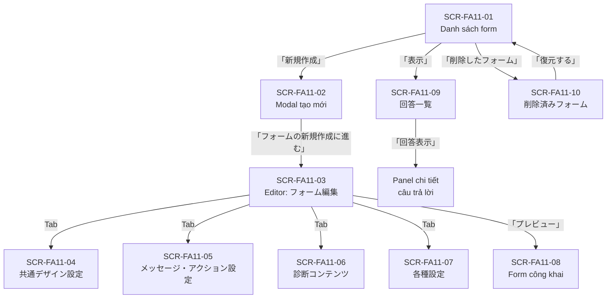

# FA-011 — Tạo biểu mẫu「フォーム作成」

## Tổng quan

Tính năng cho phép Admin và Staff tạo, quản lý các biểu mẫu trực tuyến (online form) để thu thập thông tin từ bạn bè LINE. Biểu mẫu có thể được gửi qua link URL, nhúng vào tin nhắn, hoặc dùng để chẩn đoán/khảo sát. Câu trả lời được lưu trữ và có thể xem, xuất ra CSV, hoặc đẩy sang Google Sheets.

Có 2 loại biểu mẫu:
- **シンプルタイプ** (Simple): 1 trang, tất cả câu hỏi hiển thị cùng lúc
- **分岐タイプ** (Branch): câu trả lời phân nhánh, trang tiếp theo thay đổi dựa theo câu trả lời

## Actors

- **Admin**: Toàn quyền tạo, sửa, xóa, xem kết quả, kết nối Google Sheets
- **Staff**: Tùy quyền được phân — có thể bị giới hạn một số chức năng
- **LINE User (bạn bè)**: Truy cập form qua URL công khai, điền và submit form

## Màn hình

---

### SCR-FA11-01: Danh sách form「フォーム作成（一覧）」

**URL pattern**: `/basic/form-answer`

**Mức độ tin cậy chung**: **Cao**

#### Layout

- Header: tiêu đề「フォーム作成」(h2)
- Panel trái: Danh sách thư mục (folder panel)
- Panel phải (chính): Bảng danh sách form trong thư mục đang chọn
- Footer panel phải: Các nút bulk action và link đến trang đã xóa

#### Panel trái — Quản lý thư mục

| Thành phần | Mô tả |
|-----------|-------|
| Nút「フォルダ追加」| Thêm thư mục mới — **Cao** |
| Nút「並べ替え」| Sắp xếp thứ tự thư mục — **Cao** |
| Danh sách thư mục | Mỗi thư mục hiển thị tên + số form trong `(N)`. Thư mục mặc định「未分類」. Mỗi thư mục có nút xóa (hiện khi hover) — **Cao** |
| Nút「フォルダを非表示」 | Ẩn/hiện panel thư mục — **Cao** |

Thư mục mẫu từ data:
- 「未分類」 (5 forms)
- 「Test xóa result」 (3 forms)
- 「波が襲来しています日本海1」 (2 forms)

#### Panel phải — Bảng danh sách form

##### Action buttons (trên bảng)

| Nút | Hành vi |
|-----|---------|
| 「新規作成」 | Mở modal tạo form mới (SCR-FA11-02) — **Cao** |
| 「並べ替え」 | Sắp xếp thứ tự form trong thư mục — **Cao** |
| 「連携済み」 / 「Googleスプレッドシート連携」 | Link đến `/basic/form-answer/link-google` — kết nối Google Sheets. Hiển thị「連携済み」nếu đã kết nối — **Cao** |

##### Bảng danh sách form

| Cột | Nội dung | Sortable | Ghi chú |
|-----|----------|----------|---------|
| Checkbox | Chọn nhiều để bulk action | — | **Cao** |
| 「公開状態」 | Toggle bật/tắt trạng thái công khai (checkbox) | Không | **Cao** |
| 「管理名」 | Tên form (nội bộ, không hiển thị với khách) | Có | **Cao** |
| 「配信用URL」 | Nút「URLを表示」+ icon mở preview | Không | **Cao** |
| 「タイプ」 | シンプル / 分岐 | Có | **Cao** |
| 「作成日」 | Ngày tạo (YYYY.MM.DD) | Có | **Cao** |
| 「最終編集日」 | Ngày chỉnh sửa lần cuối (YYYY.MM.DD) | Có | **Cao** |
| 「クイックテスト」 | Trạng thái quick test —「クイックテスト未登録」nếu chưa có | Không | **Cao** |
| 「回答情報」 | Số người trả lời + nút「表示」(link đến result page) + icon Google Sheets + nút「CSV」(download) + nút xóa | Không | **Cao** |

##### URL patterns trong bảng

- Xem preview: `/basic/form-answer/form-render/{slug}?mode=preview`
- Xem kết quả: `/basic/form-answer/v3/result/{id}`
- Google Sheets: URL ngoài `https://docs.google.com/spreadsheets/d/{spreadsheet_id}`
- Download CSV: `/ajax/download-answer/{id}`

##### Bulk actions (dưới bảng)

| Nút | Hành vi |
|-----|---------|
| 「一括フォルダ変更」 | Chuyển thư mục cho các form được chọn (disabled khi chưa chọn gì) — **Cao** |
| 「一括削除」 | Xóa hàng loạt form được chọn (disabled khi chưa chọn gì) — **Cao** |
| Link「削除したフォーム」 | Dẫn đến `/basic/form-answer/removed` — **Cao** |

#### API calls

- `POST /ajax/get-list-form-answer-v3` — tải danh sách form theo folder
- `GET /ajax/google-sheet-active` — kiểm tra trạng thái kết nối Google Sheets

---

### SCR-FA11-02: Modal tạo form mới「回答フォーム 新規作成」

**URL pattern**: `/basic/form-answer` (modal hiển thị trên trang chính)

**Mức độ tin cậy chung**: **Cao**

#### Layout

Modal dialog với nút đóng (×), tiêu đề「回答フォーム 新規作成」

#### Form fields

| Trường | Label JP | Kiểu input | Validation | Bắt buộc | Ghi chú |
|--------|---------|------------|-----------|---------|---------|
| Tên quản lý | 「管理名（入力内容はお客様に表示されません）」 | Text input | Tối đa 50 ký tự (hiển thị counter `0/50`) | Bắt buộc | Không hiển thị với khách hàng |
| Tên form | 「フォーム名（入力内容がお客様に表示されます）」 | Text input | Tối đa 20 ký tự (hiển thị counter `0/20`) | Bắt buộc | Hiển thị với khách hàng |
| Thư mục | 「フォルダ」 | Select/Combobox | — | Không | Default「未分類」; options: danh sách thư mục hiện có |
| Loại biểu mẫu | 「タイプ選択（あとから変更はできません）」 | Radio cards (2 lựa chọn) | — | Bắt buộc | Không thể đổi sau khi tạo |

##### Lựa chọn loại biểu mẫu

| Giá trị | Label JP | Mô tả |
|---------|---------|-------|
| シンプル | 「シンプルタイプ」 | 「1枚のページで回答できるタイプのフォーム」 |
| 分岐 | 「分岐タイプ」 | 「回答内容によって回答ページが分岐するタイプのフォーム」 |

#### Lựa chọn nhanh (「よく使われる項目の利用」)

Cho phép chọn các nhóm câu hỏi phổ biến để thêm sẵn vào form:

| Option | Tên JP | Ghi chú |
|--------|--------|---------|
| ✓ | 「名前」 | Tên người dùng |
| ✓ | 「メールアドレス」 | Email |
| ✓ | 「電話番号」 | Số điện thoại |
| ✓ | 「生年月日」 | Ngày sinh |
| ✓ | 「国内住所」 | Địa chỉ trong nước |
| ✓ | 「性別」 | Giới tính |

Chú thích: 「項目は後から自由に追加・編集できます」 (Có thể thêm/sửa câu hỏi sau)

#### Action button

| Nút | Hành vi |
|-----|---------|
| 「フォームの新規作成に進む 」 | Tạo form và chuyển đến trang chỉnh sửa (SCR-FA11-03) — **Cao** |

---

### SCR-FA11-03: Form editor — Tab「フォーム編集」

**URL pattern**: `/basic/form-answer/edit/{id}`

**Mức độ tin cậy chung**: **Cao**

#### Layout

Trang editor 2 khu vực:
- **Header**: Breadcrumb「フォーム一覧 > フォーム編集」, trường「管理名」 và「フォルダ」ở trên
- **Tab navigation** (bên trái dọc): 5 tabs + nút「送信用URL」
- **Khu vực nội dung** (bên phải): panel chỉnh sửa form + panel property editor

#### Header — Thông tin form

| Thành phần | Chi tiết |
|-----------|---------|
| Trường「管理名」| Text input, tối đa 50 ký tự (counter `14/50`), luôn hiển thị — **Cao** |
| Dropdown「フォルダ」| Select thư mục — **Cao** |

#### Tab navigation (sidebar trái)

| Tab | Nội dung |
|-----|---------|
| 「フォーム編集」 | Chỉnh sửa cấu trúc/câu hỏi form (SCR-FA11-03) |
| 「共通デザイン設定」 | Cài đặt thiết kế chung (SCR-FA11-04) |
| 「メッセージ・アクション設定」 | Cài đặt tin nhắn và hành động sau khi submit (SCR-FA11-05) |
| 「診断コンテンツ」 | Cài đặt nội dung chẩn đoán (SCR-FA11-06) |
| 「各種設定」 | Các cài đặt khác (SCR-FA11-07) |
| Nút「送信用URL」 | Hiển thị URL để gửi cho người dùng — **Cao** |

#### Panel chỉnh sửa form — Khu vực trái (canvas form)

Hiển thị form preview theo dạng canvas có thể edit:

| Thành phần | Chi tiết |
|-----------|---------|
| Ảnh header | Khu vực ảnh header, hiển thị「ヘッダー画像 設定なし」nếu chưa có — **Cao** |
| Danh sách câu hỏi | Mỗi câu hỏi hiển thị tên, badge「必須」, icon kéo thả, click để chọn và edit — **Cao** |
| Nút「＋ 項目・装飾を追加」| Mở modal thêm item (SCR-FA11-03-Modal) — **Cao** |
| Khu vực nút submit | Hiển thị「ボタン」+ button「回答する」, click để chỉnh sửa text nút — **Cao** |

#### Panel property editor — Khu vực phải (khi chọn câu hỏi)

Khi click vào câu hỏi, hiện panel chỉnh sửa chi tiết bên phải:

##### Loại câu hỏi đang mở (ví dụ: 短文回答)

| Thành phần | Chi tiết |
|-----------|---------|
| Badge loại câu hỏi | Icon + tên loại (vd「短文回答」) — **Cao** |
| Toggle「必須」/「任意」| Chuyển đổi bắt buộc/tùy chọn — **Cao** |
| Nút copy / xóa | Sao chép hoặc xóa câu hỏi này — **Cao** |
| 「質問文」(＊) | Text input câu hỏi, tối đa 50 ký tự — **Cao** |
| Accordion「詳細な設定」| Mở rộng để thấy thêm options — **Cao** |

##### Chi tiết cài đặt (trong accordion「詳細な設定」)

| Trường | Label JP | Chi tiết |
|--------|---------|---------|
| Mô tả bổ sung | 「補足」 | Textarea, tối đa 200 ký tự — **Cao** |
| Placeholder | 「プレースホルダ」 | Text input, tối đa 50 ký tự — **Cao** |
| Giới hạn nhập | 「入力制限」 | Radio: 「制限しない」/ 「制限する」— **Cao** |

##### Cài đặt ghi vào thông tin bạn bè

| Thành phần | Chi tiết |
|-----------|---------|
| Toggle「友だち情報に回答を記録」| Radio: 「記録しない」/ 「記録する」— **Cao** |
| Accordion「CSSクラス指定」 | Tùy chỉnh CSS class cho 質問文 và 質問文補足 — **Trung bình** |

#### Action buttons (bottom của panel)

| Nút | Hành vi |
|-----|---------|
| 「保存」 | Lưu tất cả thay đổi — **Cao** |
| 「プレビュー」 | Xem preview form công khai (SCR-FA11-08) — **Cao** |
| Link「フォーム一覧に戻る」 | Quay về danh sách form — **Cao** |

---

### SCR-FA11-03-Modal: Modal thêm item「項目を追加」

**Trigger**: Click nút「＋ 項目・装飾を追加」

**Mức độ tin cậy chung**: **Cao**

#### Layout

Modal với 2 tabs:「質問項目」và「装飾」

#### Tab「質問項目」— Thêm câu hỏi

##### Nhóm「基本項目」

| Loại item | Tên JP | Mô tả |
|-----------|--------|-------|
| 短文回答 | 「短文回答」 | Câu trả lời ngắn (single-line text) |
| 長文回答 | 「長文回答」 | Câu trả lời dài (textarea) |
| 日付・時刻 | 「日付・時刻」 | Ngày và giờ |
| 単一選択 | 「単一選択」 | Chọn một (radio buttons) |
| 複数選択 | 「複数選択」 | Chọn nhiều (checkboxes) |
| ファイルアップロード | 「ファイルアップロード」 | Upload file |
| 診断コンテンツ | 「診断コンテンツ」 | Câu hỏi chẩn đoán (dùng với tính năng scoring) |
| リマインド | 「リマインド」 | Câu hỏi nhắc lịch |
| 規約の同意 | 「規約の同意」 | Đồng ý điều khoản |

##### Nhóm「よく使われる項目」(Câu hỏi phổ biến)

| Loại | Tên JP |
|------|--------|
| 名前 | 「名前」 |
| メールアドレス | 「メールアドレス」 |
| 国内住所 | 「国内住所」 |
| 生年月日 | 「生年月日」 |
| 電話番号 | 「電話番号」 |
| 性別 | 「性別」 |

#### Tab「装飾」— Thêm trang trí

##### Nhóm「装飾に使う項目」

| Loại | Tên JP | Mô tả |
|------|--------|-------|
| 見出し | 「見出し」 | Tiêu đề section |
| テキスト | 「テキスト」 | Đoạn văn bản |
| 画像 | 「画像」 | Hình ảnh |
| 動画埋め込み | 「動画埋め込み」 | Nhúng video |
| 区切り線 | 「区切り線」 | Đường kẻ ngang |
| カスタムHTML | 「カスタムHTML」 | HTML tùy chỉnh |

#### Lưu ý

- Có thể chọn tối đa 5 item cùng lúc: 「基本項目・装飾は1度に最大5つまで同時に選択が可能です。」
- Nút「この項目を追加」để xác nhận thêm

---

### SCR-FA11-04: Form editor — Tab「共通デザイン設定」

**URL pattern**: `/basic/form-answer/edit/{id}` (tab 共通デザイン設定)

**Mức độ tin cậy chung**: **Cao**

#### Layout

Panel sidebar trái (accordion navigation) + panel nội dung bên phải + panel preview

#### Sidebar — Các mục cài đặt thiết kế

| Mục | Tên JP |
|-----|--------|
| 1 | 「ヘッダー・背景」 |
| 2 | 「見出し」 |
| 3 | 「区切り線」 |
| 4 | 「質問項目」 |
| 5 | 「ボタン」 |
| 6 | 「CSS・JS設定」 |

#### Mục「ヘッダー・背景」(đang hiển thị)

| Thành phần | Chi tiết |
|-----------|---------|
| 「共通ヘッダー画像」 | Khu vực drag-drop upload ảnh: 「ここにファイルをドラッグ」+「PCから選択」. Khuyến nghị: 1,000 × 400 px. Định dạng: png, jpg — **Cao** |
| 「フォーム背景」 | Color picker: 「カラー」với input text hex (mặc định `#FFFFFF`) — **Cao** |

#### Panel preview (bên phải)

Hiển thị live preview của form với ảnh header và màu nền hiện tại — **Cao**

#### Action button

| Nút | Hành vi |
|-----|---------|
| 「保存」 | Lưu cài đặt thiết kế — **Cao** |

---

### SCR-FA11-05: Form editor — Tab「メッセージ・アクション設定」

**URL pattern**: `/basic/form-answer/edit/{id}` (tab メッセージ・アクション設定)

**Mức độ tin cậy chung**: **Cao**

#### Layout

Panel sidebar trái (accordion navigation) + panel nội dung bên phải

#### Sidebar — Các mục cài đặt

| Mục | Tên JP |
|-----|--------|
| 1 | 「回答完了時のメッセージ・アクション」 |
| 2 | 「フォーム表示時アクション」 |
| 3 | 「リマインドメッセージ」 |

#### Mục「回答完了時のメッセージ・アクション」(đang hiển thị)

##### Cài đặt tần suất kích hoạt action

| Lựa chọn | Tên JP |
|---------|--------|
| Mỗi lần submit | 「何度でもアクション稼働」 |
| Chỉ 1 lần | 「1度のみアクション稼働」 |

##### Cài đặt tin nhắn gửi sau khi submit

| Thành phần | Chi tiết |
|-----------|---------|
| Label | 「回答完了時に送信するメッセージ」 |
| Insert variable | Nút「＋ LINE名」và「友だち情報」để chèn biến động — **Cao** |
| Textarea tin nhắn | Text input với counter (vd `25/5,000`) — **Cao** |
| Option gửi Q&A | Checkbox「質問と回答のコピーメッセージを送る」— **Cao** |
| Nút「保存」 | Lưu tin nhắn — **Cao** |

##### Cài đặt action sau khi submit (「回答完了時アクション」)

Dùng **Shared Component SC-004 (Action Settings)**. Giao diện gồm:

| Thành phần | Chi tiết |
|-----------|---------|
| Tab filter | 「テンプレート」/「タグ」/「友だち情報」/「ステップ配信」/「その他」— **Cao** |
| Nút「アクション追加・編集」| Mở editor Action Settings — **Cao** |
| Danh sách action đã cài | Hiển thị từng action (vd: "action submit form job — を送信") — **Cao** |

##### Link hướng dẫn

「回答内容ごとに送信するメッセージを変える方法はこちら」→ YouTube link — **Cao**

---

### SCR-FA11-06: Form editor — Tab「診断コンテンツ」

**URL pattern**: `/basic/form-answer/edit/{id}` (tab 診断コンテンツ)

**Mức độ tin cậy chung**: **Cao**

#### Layout

Panel sidebar trái (accordion navigation) + panel nội dung bên phải

#### Sidebar — Các mục cài đặt

| Mục | Tên JP |
|-----|--------|
| 1 | 「基本設定」 |
| 2 | 「診断結果のメッセージ・アクション」 |

#### Mục「基本設定」(「診断コンテンツの作成」)

##### Mô tả tính năng

「診断コンテンツとは、友だちに選択肢質問に答えてもらい、回答内容によっておすすめ度や適合率を自動で判断するコンテンツです。」

「※スコアリングには質問項目「診断コンテンツ」の設定が必要です。」

##### Lựa chọn có tạo diagnostic content hay không

| Lựa chọn | Tên JP |
|---------|--------|
| Không tạo | 「作成しない」 |
| Có tạo | 「作成する」 |

##### Cài đặt lưu điểm (khi chọn「作成する」)

| Thành phần | Chi tiết |
|-----------|---------|
| Label | 「ポイントを記録（合算）する友だち情報を選択」(＊ = bắt buộc) |
| Dropdown | Chọn field「友だち情報」loại Point từ danh sách. Mặc định「選択してください」 — **Cao** |
| Ghi chú | 「選択できる友だち情報タイプ: ポイント」 |
| Link | 「ポイントタイプの友だち情報を作成する場合はこちら」 |

**Quan sát**: Phụ thuộc vào SC-004 (Action Settings) tại tab「診断結果のメッセージ・アクション」(chưa chụp snapshot) — **Trung bình**

---

### SCR-FA11-07: Form editor — Tab「各種設定」

**URL pattern**: `/basic/form-answer/edit/{id}` (tab 各種設定)

**Mức độ tin cậy chung**: **Cao**

#### Layout

Panel sidebar trái (accordion navigation) + panel nội dung bên phải

#### Sidebar — Các mục cài đặt

| Mục | Tên JP |
|-----|--------|
| 1 | 「回答確認・回答後表示ページ」 |
| 2 | 「回答制限」 |
| 3 | 「表示期限・カウントダウンタイマー」 |
| 4 | 「LINEトーク画面・フォーム名表示」 |

#### Mục「回答確認・回答後表示ページ」(đang hiển thị)

| Thành phần | Chi tiết |
|-----------|---------|
| 「回答確認ページ」 | Toggle: 「表示しない」/ 「表示する」— **Cao** |
| 「回答後ページ」 | Toggle: 「回答後ページを表示せずにトーク画面に戻る」/ 「回答後ページを表示する」— **Cao** |
| Nút「保存」 | Lưu cài đặt — **Cao** |

**Các mục chưa chụp snapshot** (chỉ biết tên qua sidebar):
- 「回答制限」: Giới hạn số lần trả lời — **Trung bình**
- 「表示期限・カウントダウンタイマー」: Cài hạn hiển thị và đếm ngược — **Trung bình**
- 「LINEトーク画面・フォーム名表示」: Hiển thị tên form trong màn hình chat LINE — **Trung bình**

---

### SCR-FA11-08: Form công khai (preview / submit page)

**URL pattern**: `/basic/form-answer/form-render-v3/{slug}?mode=preview`
*(Note: `/basic/form-answer/form-render/{slug}?mode=preview` redirect đến URL trên)*

**Mức độ tin cậy chung**: **Cao**

#### Layout

Trang công khai (không có sidebar Admin), hiển thị form cho người dùng cuối.

Khi ở mode preview: Có banner cảnh báo「この画面はプレビューとなります。このページのURLを配信することはできません。」

#### Thành phần trang

| Thành phần | Chi tiết |
|-----------|---------|
| Banner preview | Cảnh báo mode preview (chỉ hiện khi `mode=preview`) — **Cao** |
| Nút「送信用URL」 | Hiển thị URL thực để gửi cho người dùng — **Cao** |
| Nút「プレビューの更新」 | Refresh preview — **Cao** |
| Form | Hiển thị các câu hỏi theo cấu trúc đã thiết kế. Ví dụ: text input (短文回答), radio buttons (単一選択) — **Cao** |
| Nút submit | Button submit form (disabled khi ở mode preview) — **Cao** |

#### Observations

- Slug là chuỗi ngắn random (vd: `Nm6wtb`, `rZ4OJO`, `EeDVFW`) — **Cao**
- Form public không cần đăng nhập LINE để xem, nhưng cần có LINE session để link với bạn bè — **Trung bình**

---

### SCR-FA11-09: Trang kết quả trả lời「回答一覧」

**URL pattern**: `/basic/form-answer/v3/result/{id}`

**Mức độ tin cậy chung**: **Cao**

#### Layout

Trang kết quả với 2 tab phụ và bảng danh sách.

#### Header

- Tiêu đề: `{管理名}回答一覧` (vd「test chẩn đoán回答一覧」)
- Breadcrumb:「フォーム一覧 > 回答一覧」

#### Tab navigation (phụ)

| Tab | Tên JP |
|-----|--------|
| Tab 1 | 「友だち一覧」 |
| Tab 2 | 「回答一覧」 |

#### Bộ lọc ngày

| Thành phần | Chi tiết |
|-----------|---------|
| Date range picker | Input hiển thị khoảng ngày (vd `2026.03.01 → 2026.05.21`) — **Cao** |
| Nút「全期間」 | Xem toàn bộ không lọc ngày — **Cao** |
| Nút export | Download (icon) — **Cao** |
| Nút filter | Lọc thêm — **Cao** |

#### Bảng danh sách câu trả lời (Tab「回答一覧」)

| Cột | Nội dung | Sortable |
|-----|----------|----------|
| 「回答日時」 | Ngày giờ trả lời (vd `2026.05.08(金) 11:34`) | Có |
| 「回答時間」 | Thời gian hoàn thành form (vd `00分09秒`) | Không |
| 「友だち名」 | Tên bạn bè (LINE display name) | Không |
| (actions) | Nút「回答表示」 | Không |

#### Panel chi tiết trả lời (inline, bên phải bảng)

Khi click「回答表示」, mở panel bên phải:

| Thành phần | Chi tiết |
|-----------|---------|
| Ngày giờ | Hiển thị thời gian submit — **Cao** |
| Link tên bạn bè | Link đến `/basic/friendlist/my_page/{friend_id}` — **Cao** |
| Tab「回答内容」 | Xem nội dung câu trả lời — **Cao** |
| Tab「リマインド」 | Xem trạng thái nhắc lịch liên quan — **Cao** |
| Nội dung câu trả lời | Danh sách câu hỏi + câu trả lời tương ứng — **Cao** |
| 「診断ポイント」 | Điểm chẩn đoán (vd `2 ポイント`) nếu form có cài diagnostic — **Cao** |
| Nút「閉じる」 | Đóng panel — **Cao** |
| Nút「この回答を削除」 | Xóa câu trả lời này — **Cao** |

#### Phân trang

- Selector số item/trang (mặc định 100 items/trang)
- Nút「戻る」để quay lại danh sách form

#### API calls

- `POST /basic/form-answer/v3/result/{id}?page=1` — tải danh sách câu trả lời với pagination
- `GET /ajax/download-answer/{id}` — download CSV

---

### SCR-FA11-10: Trang form đã xóa「削除済みフォーム」

**URL pattern**: `/basic/form-answer/removed`

**Mức độ tin cậy chung**: **Cao**

#### Layout

Trang danh sách form đã bị xóa với tùy chọn phục hồi.

#### Header

- Tiêu đề:「削除済みフォーム」(h3)
- Breadcrumb:「フォーム一覧 > 削除済みフォーム」

#### Thông báo quan trọng

- 「このページでは削除したフォームの復元ができます。」
- 「フォームは手動では削除することができず、削除した日時から90日後に自動で削除されます。」

**→ Forms không thể xóa thủ công; chỉ soft-delete và tự động xóa sau 90 ngày.**

#### Bảng danh sách form đã xóa

| Cột | Nội dung | Sortable |
|-----|----------|----------|
| 「削除した日時」 | Thời gian xóa (vd `2026.03.19(木) 18:15`) | Có |
| 「フォーム名」 | Tên form (tên quản lý, có thể truncated) | Không |
| 「削除したユーザー名」 | Tên người dùng đã xóa (vd「田中 太郎」) | Không |
| (actions) | Nút「復元する」 | Không |

#### Action

| Nút | Hành vi |
|-----|---------|
| 「復元する」 | Khôi phục form về danh sách — **Cao** |
| 「戻る」 | Quay về danh sách form — **Cao** |

#### Phân trang

- Mặc định 100 items/trang

---

## User Flows

### Flow 1: Tạo form mới

```
SCR-FA11-01 (Danh sách)
  → Click「新規作成」
  → SCR-FA11-02 (Modal tạo mới)
    → Nhập 管理名, フォーム名, chọn フォルダ, chọn タイプ, chọn câu hỏi nhanh
    → Click「フォームの新規作成に進む」
  → SCR-FA11-03 (Form Editor — Tab フォーム編集)
    → Thêm/sửa câu hỏi (Modal thêm item)
    → Cài đặt từng câu hỏi trong panel bên phải
    → Click「保存」
  → (Tùy chọn) Chuyển sang các tab khác để cài đặt thêm
  → (Tùy chọn) Click「プレビュー」xem form
```

### Flow 2: Cài đặt thiết kế và action

```
SCR-FA11-03 (Tab フォーム編集)
  → Click tab「共通デザイン設定」
  → SCR-FA11-04: Upload ảnh header, chọn màu nền
  → Click「保存」
  → Click tab「メッセージ・アクション設定」
  → SCR-FA11-05: Cài đặt tin nhắn sau submit + action
  → Click「保存」
  → Click tab「各種設定」
  → SCR-FA11-07: Cài đặt trang xác nhận, giới hạn trả lời
  → Click「保存」
```

### Flow 3: Xem kết quả

```
SCR-FA11-01 (Danh sách)
  → Click「表示」trong cột「回答情報」
  → SCR-FA11-09 (Trang kết quả)
    → Xem tab「回答一覧」hoặc「友だち一覧」
    → Lọc theo ngày
    → Click「回答表示」để xem chi tiết từng câu trả lời
    → (Tùy chọn) Click「CSV」để xuất CSV
    → (Tùy chọn) Click icon Google Sheets để xem bảng tính
```

### Flow 4: Phân phối form

```
SCR-FA11-01 (Danh sách)
  → Tìm form muốn phân phối
  → Click「URLを表示」trong cột「配信用URL」→ Hiện popup với URL
  → Hoặc Click icon preview→ Mở SCR-FA11-08 (form công khai preview)
  → Copy URL để dùng trong tin nhắn broadcast/step
```

### Flow 5: Khôi phục form đã xóa

```
SCR-FA11-01 (Danh sách)
  → Click link「削除したフォーム」(dưới bảng)
  → SCR-FA11-10 (Trang form đã xóa)
    → Tìm form muốn khôi phục
    → Click「復元する」
    → Form xuất hiện lại trong SCR-FA11-01
```

---

## Flow Diagram (Mermaid)



---

## Phụ thuộc Shared Components

- **SC-004 (Action Settings)**: Dùng tại SCR-FA11-05 — tab「メッセージ・アクション設定」→ mục「回答完了時アクション」. Giao diện tabs (テンプレート/タグ/友だち情報/ステップ配信/その他) + nút「アクション追加・編集」— **Cao**
- **SC-004 (Action Settings)**: Có thể dùng tại SCR-FA11-06 tab「診断結果のメッセージ・アクション」— **Trung bình**

---

## Điểm chưa rõ / cần điều tra

1. **Tab「友だち一覧」trong SCR-FA11-09**: Snapshot 09 và 10 có cùng content — cần xem tab「友だち一覧」riêng (có thể hiển thị danh sách bạn bè đã submit theo dạng khác)
2. **Cài đặt「分岐タイプ」**: Chỉ thấy form「シンプルタイプ」trong editor; cần khám phá form phân nhánh để hiểu cấu trúc node graph
3. **Cài đặt「フォーム表示時アクション」và「リマインドメッセージ」** (SCR-FA11-05): Chưa chụp snapshot các mục phụ này
4. **Mục「回答制限」, 「表示期限・カウントダウンタイマー」, 「LINEトーク画面・フォーム名表示」** (SCR-FA11-07): Chỉ biết tên qua sidebar
5. **Tab「診断結果のメッセージ・アクション」** (SCR-FA11-06): Chưa chụp snapshot
6. **Cơ chế「クイックテスト」**: Chỉ thấy trạng thái「クイックテスト未登録」— cần xem cách đăng ký và chạy quick test
7. **Kết nối Google Sheets**: Chưa xem trang `/basic/form-answer/link-google`
8. **Public URL thực tế (không phải preview)**: URL công khai có slug nhưng không rõ authentication flow cho LINE user
9. **「分岐タイプ」editor**: Có thể có thêm UI để cấu hình nhánh phân kỳ
10. **Item type「リマインド」và「規約の同意」trong form**: Chưa xem property editor của 2 loại này
