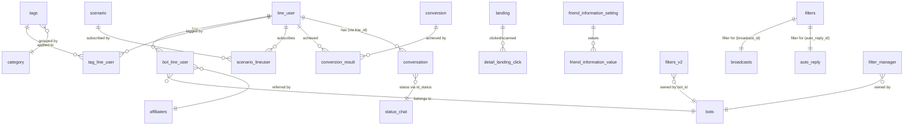

# DB Mapping — SC-003 Friend Filter / 絞り込み Modal

**Component**: SC-003 Modal Filter / 絞り込み  
**Controller chính**: `Basic\FilterController` (`src/web/sns-line/app/Http/Controllers/Basic/FilterController.php`)  
**Model chính**: `FilterV2` (`src/web/sns-line/app/FilterV2.php`)  
**Engine lọc**: `Conversation::advanceFilterPost()` (`src/web/sns-line/app/Conversation.php`)  
**Confidence tổng thể**: Cao (xác nhận trực tiếp từ source code)

---

## Primary Tables (trực tiếp liên quan)

### 1. `filters_v2` — Bảng lưu trữ điều kiện filter V2

**Mục đích**: Lưu từng điều kiện filter (V2) liên kết với entity cha (broadcast, calendar, rich menu...) theo mô hình parent–child. Mỗi record = 1 điều kiện filter.

```sql
CREATE TABLE `filters_v2` (
  `id`                    int(10) UNSIGNED NOT NULL,
  `bot_id`                int(11) DEFAULT NULL,
  `parent_type`           varchar(255) DEFAULT NULL,   -- loại entity cha
  `parent_id`             int(11) DEFAULT NULL,         -- ID entity cha
  `operator`              varchar(100) DEFAULT NULL,    -- 'and' hoặc 'or'
  `type`                  varchar(255) DEFAULT NULL,    -- loại filter: tag/scenario/conversion/...
  `data`                  text,                         -- JSON chi tiết điều kiện
  `text_preview`          text,                         -- text tóm tắt hiển thị trên UI
  `created_at`            timestamp NOT NULL DEFAULT CURRENT_TIMESTAMP,
  `updated_at`            timestamp NOT NULL DEFAULT CURRENT_TIMESTAMP ON UPDATE CURRENT_TIMESTAMP,
  `rich_menu_item_id`     int(11) DEFAULT NULL,         -- chỉ cho filter-rich-menu-toggle
  `rich_menu_redirect_id` int(11) DEFAULT NULL          -- chỉ cho filter-rich-menu-toggle
);
```

**Data size**: 17.8MB (bảng lớn — nhiều filter records)  
**Confidence Schema**: Cao (đọc trực tiếp từ `db/schema/tables/filters_v2.sql` và xác nhận với FilterV2 model)

**Các giá trị `parent_type` được dùng trong code**:

| `parent_type` | Entity cha | Ghi chú |
|---------------|-----------|---------|
| `broadcast` | `broadcasts` | Lưu filter cho broadcast |
| `broadcast-v2` | `broadcasts` | Tương tự broadcast |
| `step_message` | `step_message` | KHÔNG tính `filterNumber` |
| `filter_manager` | `filter_manager` | KHÔNG tính `filterNumber`, KHÔNG trả `line_user_ids` |
| `cross_analysis` | `cross_analysis` | Dùng riêng `saveFilterCrossAnalysis` |
| `action_schedule` | `action_schedules` | Không cần `parent_id` |
| `calendar-course-setting-status-send-after-booking` | `calendar_course` | |
| `calendar-salon-course-setting-status-send-after-booking` | `calendar_salon_course` | |
| `calendar-salon-staff-setting-status-send-after-booking` | `calendar_salon_staff` | |
| `calendar-setting-show-booking-form` | `calendar_management` | |
| `filter-calendar-salon-booking` | `calendar_salon` | |
| `filter_remind_form` | `event_step` | |
| `setting_rich_menu` | `setting_display_rich_menu_histories` | ParentID = history ID |
| `filter-rich-menu-toggle` | `rich_menu_switch_items` | Thêm filter theo `rich_menu_redirect_id` + `rich_menu_item_id` |
| `modal_action` | action details | Dùng khi xóa (`deleteActionFilters`) |

---

### 2. `filters` — Bảng lưu filter V1 (cũ)

**Mục đích**: Lưu filter V1 — một record lưu toàn bộ điều kiện filter cho 1 entity. Được gắn trực tiếp với `auto_reply_id`, `broadcast_id`, hoặc `sms_schedule_id`.

```sql
CREATE TABLE `filters` (
  `id`                       int(11) NOT NULL,
  `auto_reply_id`            int(11) DEFAULT NULL,
  `broadcast_id`             int(11) DEFAULT NULL,
  `sms_schedule_id`          int(11) DEFAULT NULL,
  `name_filter`              text,
  `name_filter_type`         varchar(20) DEFAULT NULL,
  `tag_filter`               varchar(200) DEFAULT NULL,
  `tag_filter_option`        int(11) DEFAULT NULL,
  `from_date_filter`         date DEFAULT NULL,
  `to_date_filter`           date DEFAULT NULL,
  `scenario_filter`          int(11) DEFAULT NULL,
  `scenario_filter_option`   int(11) DEFAULT NULL,
  `scenario_start_day_filter` int(11) DEFAULT NULL,
  `conversion_filter`        varchar(200) DEFAULT NULL,
  `conversion_filter_option` int(11) DEFAULT NULL,
  `mark_filter`              varchar(20) DEFAULT NULL,
  `filter_preview_content`   text,
  `created_at`               datetime NOT NULL DEFAULT CURRENT_TIMESTAMP,
  `updated_at`               datetime NOT NULL ON UPDATE CURRENT_TIMESTAMP
);
```

**Data size**: 477KB  
**Confidence Schema**: Cao (đọc trực tiếp từ `db/schema/tables/filters.sql`)

**Lưu ý**: Bảng `filters` là legacy V1. Hầu hết tính năng mới dùng `filters_v2`.

---

### 3. `line_user` — Bảng người dùng LINE (đối tượng của filter)

**Mục đích**: Lưu thông tin hồ sơ LINE của người dùng. Là bảng trung tâm trong mọi filter query.

```sql
CREATE TABLE `line_user` (
  `id`             int(12) NOT NULL,
  `line_id`        varchar(128) NOT NULL,   -- LINE User ID (U...)
  `name`           varchar(128) DEFAULT NULL,  -- LINE登録名
  `real_name`      varchar(128) DEFAULT NULL,  -- 本名
  `status_message` text,
  `avatar_url`     varchar(256) DEFAULT NULL,
  `view_name`      varchar(128) DEFAULT NULL,  -- システム表示名 (type 3 trong filter)
  `add_friend_url` varchar(250) DEFAULT NULL,
  `phone_number`   varchar(15) DEFAULT NULL,
  `email`          varchar(100) DEFAULT NULL,
  `birthday`       date DEFAULT NULL,
  `age`            int(11) DEFAULT NULL,
  `province`       varchar(255) DEFAULT NULL,
  `action_count`   int(11) DEFAULT '0',
  `created_at`     datetime NOT NULL DEFAULT CURRENT_TIMESTAMP,
  `updated_at`     datetime DEFAULT CURRENT_TIMESTAMP ON UPDATE CURRENT_TIMESTAMP,
  `action`         int(11) DEFAULT NULL,
  `type`           tinyint(4) NOT NULL DEFAULT '0'  -- 0: user, 1: group, 2: member in group
);
```

**Data size**: 139.1MB (bảng rất lớn)  
**Confidence**: Cao

**Columns liên quan đến filter**:
- `name` — filter tên LINE登録名 (type=1)
- `real_name` — filter tên 本名 (type=2)
- `view_name` — filter tên システム表示名 (type=3)
- `line_id` — dùng để join với `detail_landing_click.line_id` (filter QR code)

---

### 4. `bot_line_user` — Bảng liên kết Bot ↔ Line User

**Mục đích**: Liên kết `line_user` với `bot` cụ thể. Mỗi `bot_line_user` record = 1 người dùng thuộc 1 bot. Filter luôn join bảng này trước tiên.

```sql
CREATE TABLE `bot_line_user` (
  `id`             int(11) NOT NULL,
  `line_user_id`   int(11) NOT NULL,    -- FK → line_user.id
  `bot_id`         int(11) NOT NULL,
  `affiliater_id`  int(11) DEFAULT NULL,  -- FK → affiliaters.id (filter affiliate)
  `rich_menu_id`   int(11) DEFAULT NULL,  -- rich menu hiện tại của user
  `followed_at`    timestamp NULL DEFAULT NULL,  -- ngày kết bạn (filter ngày)
  `is_blocked`     int(11) DEFAULT '0',   -- 0=không block, 1=đã block (bị loại khỏi filter)
  `status`         int(11) DEFAULT '0',
  `memo`           text,
  `phone_number`   varchar(25) DEFAULT NULL,
  `is_tester`      tinyint(1) NOT NULL DEFAULT '0',
  `is_friend`      int(11) NOT NULL DEFAULT '0',
  `u_code`         varchar(50) DEFAULT NULL,
  `contact_status` int(11) NOT NULL DEFAULT '0',
  `register_service_date` datetime DEFAULT NULL,
  `register_contact_date` datetime DEFAULT NULL,
  `cancel_contact_date`   datetime DEFAULT NULL,
  -- ... Paypal fields ...
  `action_count`   int(11) NOT NULL DEFAULT '0',
  `updated_at`     timestamp NULL DEFAULT NULL ON UPDATE CURRENT_TIMESTAMP,
  `created_at`     timestamp NOT NULL DEFAULT CURRENT_TIMESTAMP,
  `is_quick_reply` tinyint(4) DEFAULT NULL
);
```

**Data size**: 137.2MB (bảng rất lớn)  
**Confidence**: Cao

**Columns liên quan đến filter**:
- `followed_at` — filter ngày kết bạn (V1: `from_date_filter`/`to_date_filter`; V2 `day_add_friend` type)
- `is_blocked` — luôn lọc `is_blocked = config('sns-line.block.no')` (tức là 0)
- `affiliater_id` — filter affiliate (V2): bạn bè được giới thiệu bởi affiliater nào
- `rich_menu_id` — filter theo rich menu hiện tại (khi `richmenuId` được truyền vào `initDataFilter`)

---

### 5. `filter_manager` — Bảng Filter Manager

**Mục đích**: Lưu danh sách filter đã đặt tên để tái sử dụng. Là một `parent_type` đặc biệt của `filters_v2`.

```sql
CREATE TABLE `filter_manager` (
  `id`         int(10) UNSIGNED NOT NULL,
  `bot_id`     int(10) UNSIGNED NOT NULL,
  `name`       varchar(255) NOT NULL,
  `type`       varchar(255) NOT NULL,  -- loại filter manager
  `parent_id`  int(10) NOT NULL,
  `created_at` timestamp NULL DEFAULT NULL,
  `updated_at` timestamp NULL DEFAULT NULL
);
```

**Data size**: 94KB  
**Confidence**: Cao

---

## Secondary Tables (data source cho filter options)

### 6. `tags` — Danh sách Tags

**Mục đích**: Master data cho filter theo tag.

```sql
CREATE TABLE `tags` (
  `id`            int(12) NOT NULL,
  `bot_id`        int(12) DEFAULT NULL,
  `name`          varchar(255) NOT NULL,
  `category_id`   int(12) NOT NULL,  -- FK → category.id (0 = 未分類)
  `position`      int(12) NOT NULL,
  `rich_menu_id`  int(11) DEFAULT NULL,
  -- ... các cột action khác ...
  `count_user_tag` int(11) DEFAULT '0',
  `is_limit`      tinyint(4) NOT NULL DEFAULT '0',
  `deleted_at`    timestamp NULL DEFAULT NULL
);
```

**Data size**: 245KB  
**Confidence**: Cao

---

### 7. `tag_line_user` — Pivot: Tag ↔ Line User

**Mục đích**: Bảng liên kết nhiều-nhiều giữa tag và line_user. Dùng trong filter theo tag.

```sql
CREATE TABLE `tag_line_user` (
  `id`           int(12) NOT NULL,
  `line_user_id` int(12) DEFAULT NULL,  -- FK → line_user.id
  `tag_id`       int(12) DEFAULT NULL,  -- FK → tags.id
  `is_deleted`   tinyint(1) DEFAULT NULL,
  `created_at`   datetime NOT NULL,
  `updated_at`   datetime DEFAULT NULL
);
```

**Data size**: 134KB  
**Confidence**: Cao

**SQL patterns được dùng trong filter**:
- OR: `JOIN tag_line_user WHERE tag_id IN (list)`
- AND: `WHERE line_user.id IN (SELECT line_user_id FROM tag_line_user WHERE tag_id IN (list) GROUP BY line_user_id HAVING COUNT(DISTINCT tag_id) = N)`
- OR NOT: `WHERE line_user.id NOT IN (SELECT DISTINCT line_user_id FROM tag_line_user WHERE tag_id IN (list))`
- AND NOT: `WHERE line_user.id NOT IN (SELECT line_user_id FROM tag_line_user WHERE tag_id IN (list) GROUP BY line_user_id HAVING COUNT(DISTINCT tag_id) = N)`

---

### 8. `category` — Danh mục (Tag Groups / Landing Groups)

**Mục đích**: Nhóm cho tags (tag categories) và landings (landing categories). Được dùng để phân nhóm filter options.

```sql
CREATE TABLE `category` (
  `id`              int(11) NOT NULL,
  `bot_id`          int(11) NOT NULL,
  `kind`            int(11) NOT NULL,  -- loại category: tag category vs landing category
  `name`            varchar(100) NOT NULL,
  `position`        int(11) DEFAULT NULL,
  `is_deleted`      int(11) DEFAULT '0',
  `created_at`      timestamp NOT NULL DEFAULT CURRENT_TIMESTAMP,
  `updated_at`      timestamp NULL DEFAULT NULL ON UPDATE CURRENT_TIMESTAMP,
  `category_id_old` int(11) NOT NULL DEFAULT '-1'
);
```

**Data size**: 509KB  
**Lưu ý**: Tên model trong code là `Category`, bảng là `category` (không có `ies`). Logic spec đề cập `categories` là **sai** — tên bảng thực là `category`.  
**Confidence**: Cao

---

### 9. `scenario` — Danh sách Scenarios

**Mục đích**: Master data cho filter theo scenario.

```sql
CREATE TABLE `scenario` (
  `id`         int(11) NOT NULL,
  `bot_id`     int(11) NOT NULL,
  `name`       varchar(200) NOT NULL,
  `status`     int(11) NOT NULL DEFAULT '0',
  `group_id`   int(11) NOT NULL DEFAULT '0',  -- folder/group của scenario
  `is_deleted` int(11) DEFAULT '0',
  -- ... các cột after_scenario_id, delay_type ...
);
```

**Data size**: 300KB  
**Confidence**: Cao

**Lưu ý**: Bảng tên là `scenario` (không có `s`). Logic spec đề cập `scenarios` là **nhầm lẫn** tên bảng — model `Scenario` maps tới bảng `scenario`.

---

### 10. `scenario_lineuser` — Pivot: Scenario ↔ Line User

**Mục đích**: Trạng thái đăng ký scenario của từng line_user. Dùng trong filter scenario.

```sql
CREATE TABLE `scenario_lineuser` (
  `id`              int(12) NOT NULL,
  `bot_id`          int(12) NOT NULL,
  `scenario_id`     int(12) NOT NULL,   -- FK → scenario.id
  `line_user_id`    int(12) NOT NULL,   -- FK → line_user.id
  `is_following`    int(12) DEFAULT NULL,  -- 0=stopped, 1=following, 2=completed
  `start_day`       int(12) DEFAULT NULL,
  `start_time`      time DEFAULT NULL,
  `sent_start_day`  int(11) NOT NULL DEFAULT '-1',
  `start_datetime`  datetime DEFAULT NULL,
  `stop_datetime`   datetime DEFAULT NULL,
  `is_deleted`      tinyint(1) DEFAULT '0',
  `created_at`      timestamp NOT NULL DEFAULT CURRENT_TIMESTAMP,
  `updated_at`      timestamp NULL DEFAULT NULL ON UPDATE CURRENT_TIMESTAMP
);
```

**Data size**: 218KB  
**Confidence**: Cao

**Enum `is_following`**:
| Giá trị | Ý nghĩa | Dùng khi filter |
|---------|---------|----------------|
| `1` | Đang đăng ký (following) | option 0 (apply_scenario) |
| `2` | Đã đọc xong (completed) | option 3 (done_scenario) |
| `0` | Đã dừng | không phải 1 → not_apply; không phải 2 → not_done |

---

### 11. `conversion` — Danh sách Conversions

**Mục đích**: Master data cho filter theo conversion.

```sql
CREATE TABLE `conversion` (
  `id`       int(11) NOT NULL,
  `group_id` int(11) NOT NULL DEFAULT '0',
  `name`     varchar(255) DEFAULT NULL,
  `bot_id`   int(11) NOT NULL,
  -- ...
);
```

**Data size**: 187KB  
**Lưu ý**: Bảng tên là `conversion` (không có `s`). Logic spec đề cập `conversions` là **nhầm lẫn** — model `Conversion` maps tới bảng `conversion`.  
**Confidence**: Cao

---

### 12. `conversion_result` — Kết quả Conversion của người dùng

**Mục đích**: Lưu lịch sử conversion của từng line_user. Dùng trong filter conversion.

```sql
CREATE TABLE `conversion_result` (
  `id`            int(11) NOT NULL,
  `conversion_id` int(11) NOT NULL,  -- FK → conversion.id
  `line_user_id`  int(11) NOT NULL,  -- FK → line_user.id
  `url_id`        varchar(500) DEFAULT NULL,
  `ip_reference`  varchar(30) DEFAULT NULL,
  `visited_at`    timestamp NOT NULL DEFAULT CURRENT_TIMESTAMP,
  `action`        int(11) DEFAULT NULL
);
```

**Data size**: 3KB  
**Confidence**: Cao

**SQL patterns** (tương tự tag filter — 4 options OR/AND/OR NOT/AND NOT với `conversion_id`):
- OR: `JOIN conversion_result WHERE conversion_id IN (list)`
- AND: `WHERE line_user.id IN (SELECT line_user_id FROM conversion_result WHERE conversion_id IN (list) GROUP BY line_user_id HAVING COUNT(DISTINCT conversion_id) = N)`

---

### 13. `conversation` — Cuộc trò chuyện với bạn bè

**Mục đích**: Lưu cuộc hội thoại giữa bot và LINE user. Được dùng trong filter theo mark (メッセージ確認状況) và filter theo 対応ステータス (status_chat).

```sql
CREATE TABLE `conversation` (
  `id`                 int(11) NOT NULL,
  `bot_id`             int(11) NOT NULL,
  `line_id`            varchar(255) NOT NULL,   -- LINE User ID
  `tb_line_user_id`    int(11) DEFAULT NULL,    -- FK → line_user.id
  `status_last_message` int(11) DEFAULT '1',   -- trạng thái tin nhắn cuối (filter mark V1)
  `id_status`          int(11) DEFAULT NULL,    -- FK → status_chat.id (filter status_chat V2)
  `is_blocked`         int(11) NOT NULL,
  `is_old_friend`      tinyint(4) NOT NULL DEFAULT '0' COMMENT '0:no, 1:yes',  -- filter bot_new_friend
  `is_bookmark`        int(11) NOT NULL DEFAULT '0',
  `is_hide`            tinyint(4) NOT NULL DEFAULT '0',
  `last_message`       text,
  `last_time_message`  timestamp NULL DEFAULT NULL,
  -- has_status_0 → has_status_9: bitmask lịch sử mark ...
  `created_at`         timestamp NOT NULL DEFAULT CURRENT_TIMESTAMP,
  `updated_at`         timestamp NULL DEFAULT NULL
);
```

**Data size**: 68.8MB (bảng rất lớn)  
**Confidence**: Cao

**Columns liên quan đến filter**:
- `status_last_message` — filter V1 mark (「メッセージ確認状況」): filter theo values `[0, 1]` (未確認/確認済み)
- `id_status` — filter V2 `status_chat`: FK → `status_chat.id`, filter bạn bè theo 対応ステータス (status chat)
- `is_old_friend` — filter V2 `bot_new_friend`: `0`=新規友だち, `1`=既存友だち

---

### 14. `status_chat` — Danh sách 対応ステータス

**Mục đích**: Master data cho filter theo 対応ステータス (chat handling status).

```sql
CREATE TABLE `status_chat` (
  `id`          int(10) UNSIGNED NOT NULL,
  `bot_id`      int(11) NOT NULL,
  `position`    int(11) NOT NULL DEFAULT '0',
  `name_status` varchar(255) NOT NULL,  -- tên status (hiển thị)
  `color`       varchar(255) NOT NULL,
  `bg_status`   varchar(255) DEFAULT NULL,
  `bg_choose`   varchar(255) DEFAULT NULL,
  `is_save`     tinyint(4) NOT NULL DEFAULT '1',
  `count`       int(11) NOT NULL DEFAULT '0',
  `created_at`  timestamp NOT NULL DEFAULT CURRENT_TIMESTAMP,
  `updated_at`  timestamp NOT NULL DEFAULT CURRENT_TIMESTAMP ON UPDATE CURRENT_TIMESTAMP
);
```

**Data size**: 801KB  
**Confidence**: Cao

---

### 15. `landing` — QR Codes / Landing Pages

**Mục đích**: Master data cho filter theo QR code action. Bảng này là nguồn dữ liệu cho filter `qr_code` và `qr_code_action`.

```sql
CREATE TABLE `landing` (
  `id`             int(10) UNSIGNED NOT NULL,
  `bot_id`         int(11) NOT NULL,
  `name`           varchar(255) DEFAULT NULL,
  `code`           varchar(100) DEFAULT NULL,
  `link_qr_code`   varchar(255) DEFAULT NULL,  -- URL QR code
  `text_send`      text,
  `category_id`    int(11) DEFAULT NULL,        -- FK → category.id
  `template_id`    int(11) DEFAULT NULL,
  `scenario_id`    int(11) DEFAULT NULL,
  `tag_id`         int(11) DEFAULT NULL,
  `action_id`      int(11) DEFAULT NULL,
  -- ... nhiều columns khác ...
);
```

**Data size**: 607KB  
**Confidence**: Cao

**Lưu ý**: Tên bảng là `landing` (số ít). Logic spec đề cập `landings` là **nhầm lẫn** — model `Landing` maps tới bảng `landing`.

---

### 16. `detail_landing_click` — Lịch sử click/scan QR Code

**Mục đích**: Lưu lịch sử mỗi lần người dùng scan QR code hoặc click landing page. Được dùng trong filter `qr_code` và `qr_code_action`.

```sql
CREATE TABLE `detail_landing_click` (
  `id`            int(10) UNSIGNED NOT NULL,
  `landing_id`    int(11) DEFAULT NULL,   -- FK → landing.id
  `bot_id`        int(11) DEFAULT NULL,
  `line_id`       varchar(255) DEFAULT NULL,  -- LINE User ID (join với line_user.line_id)
  `action`        int(11) NOT NULL COMMENT '1 là click, 2 là added',  -- filter qr_code dùng action=2
  `is_action_web` tinyint(4) NOT NULL DEFAULT '0' COMMENT '0: no, 1: yes',  -- filter qr_code_action
  `is_old_friend` tinyint(4) NOT NULL DEFAULT '1',
  `time_click`    datetime DEFAULT NULL,
  -- ...
);
```

**Data size**: 253KB  
**Confidence**: Cao

**Cách join**: `detail_landing_click.line_id = line_user.line_id` (join qua LINE User ID string, không phải `line_user.id`)

---

### 17. `friend_information_setting` — Định nghĩa Custom Fields

**Mục đích**: Master data cho filter theo 友だち情報 (friend_info). Định nghĩa các trường thông tin bạn bè tùy chỉnh.

```sql
CREATE TABLE `friend_information_setting` (
  `id`          int(10) UNSIGNED NOT NULL,
  `bot_id`      int(11) NOT NULL,
  `order`       int(11) NOT NULL DEFAULT '0',
  `title`       varchar(255) NOT NULL,   -- tên trường (hiển thị trong filter)
  `group_id`    int(11) NOT NULL DEFAULT '0',  -- folder ID (-1=root, -2=address group)
  `type_data`   int(11) NOT NULL COMMENT '''select''=> 1, ''input''=> 2, ''calendar''=> 3, ''image''=> 4, ''file''=> 5, ''point''=> 6',
  `default_value` varchar(500) DEFAULT NULL,
  `setting_value` text,
  -- ...
);
```

**Data size**: 627KB  
**Confidence**: Cao

**Hệ thống ID đặc biệt** (xác nhận từ code):
| ID range | Nguồn dữ liệu | Folder |
|----------|--------------|--------|
| `id > 0` | `FriendInformationSetting` record tùy chỉnh của bot | `group_id` thực |
| `-1 >= id > -7` | Config `sns-line.info_default_info` (trường mặc định) | root (`folder_id = -1`) |
| `id <= -7` hoặc `id = 'd_6'` | Config `sns-line.info_default_info_address` (trường địa chỉ mặc định) | nhóm địa chỉ (`folder_id = -2`) |

---

### 18. `friend_information_value` — Giá trị Custom Fields của bạn bè

**Mục đích**: Lưu giá trị thực tế của từng trường thông tin cho từng bạn bè. Được join trong filter `friend_info`.

```sql
CREATE TABLE `friend_information_value` (
  `id`                          int(10) UNSIGNED NOT NULL,
  `bot_id`                      int(11) NOT NULL,
  `friend_information_setting_id` int(11) NOT NULL,  -- FK → friend_information_setting.id
  `line_id`                     int(11) NOT NULL,    -- FK → line_user.id (chú ý: tên cột là `line_id` nhưng lưu line_user.id)
  `value`                       varchar(500) DEFAULT NULL,
  `action`                      int(4) DEFAULT NULL,
  `friend_info_option_id`       int(11) DEFAULT NULL
);
```

**Data size**: 134KB  
**Confidence**: Cao

**Cách join trong filter**: `friend_information_value.line_id = bot_line_user.line_user_id` (khẳng định từ code: `WHERE friend_information_value.line_id = bot_line_user.line_user_id`)

---

### 19. `affiliaters` — Danh sách Affiliaters

**Mục đích**: Master data cho filter theo affiliater. Danh sách affiliater để user chọn trong filter.

```sql
CREATE TABLE `affiliaters` (
  `id`       int(12) NOT NULL,
  `admin_id` int(11) NOT NULL,
  `email`    varchar(255) NOT NULL,
  `username` varchar(255) DEFAULT NULL,  -- tên hiển thị trong filter
  `rank`     tinyint(1) DEFAULT '0',
  `is_deleted` tinyint(1) DEFAULT '0',
  -- ...
);
```

**Data size**: 35KB  
**Confidence**: Cao

---

## Filter Field → DB Mapping

### V1 Filter (bảng `filters` + query trực tiếp EP-02)

| UI Filter | Request Param | Operator | DB Table | Column | SQL Pattern | Confidence | Ghi chú |
|-----------|--------------|---------|----------|--------|------------|-----------|---------|
| 名前 (LINE登録名) | `name_filter` + `name_filter_type=1` | LIKE | `line_user` | `name` | `WHERE name LIKE '%keyword%'` | **Cao** | Delimiter là ký tự full-width space 「　」 |
| 名前 (本名) | `name_filter` + `name_filter_type=2` | LIKE | `line_user` | `real_name` | `WHERE real_name LIKE '%keyword%'` | **Cao** | |
| 名前 (システム表示名) | `name_filter` + `name_filter_type=3` | LIKE | `line_user` | `view_name` | `WHERE view_name LIKE '%keyword%'` | **Cao** | `view_name` ở bảng `line_user`, **KHÔNG phải** `bot_line_user` |
| タグ | `tag_filter` + `tag_filter_option` | 4 options | `tag_line_user` | `tag_id` | Xem SQL patterns ở mục 7 | **Cao** | |
| 友だち登録日 (từ) | `from_date_filter` | `>=` | `bot_line_user` | `followed_at` | `WHERE followed_at >= ?` | **Cao** | Format: `Y.m.d H:i:s` |
| 友だち登録日 (đến) | `to_date_filter` | `<=` | `bot_line_user` | `followed_at` | `WHERE followed_at <= ? (23:59:59)` | **Cao** | |
| ステップ | `scenario_filter` + `scenario_filter_option` | 5 options | `scenario_lineuser` | `is_following` | Xem chi tiết bên dưới | **Cao** | |
| コンバージョン | `conversion_filter` + `conversion_filter_option` | 4 options | `conversion_result` | `conversion_id` | Tương tự tag filter | **Cao** | IDs lưu dạng comma-separated string |
| メッセージ確認状況 (mark) | `mark_filter` | IN | `conversation` | `status_last_message` | `JOIN conversation WHERE status_last_message IN (?)` | **Cao** | **KHÔNG phải** `bot_line_user.is_mark` — confirmed từ code |

**Enum `scenario_filter_option` → SQL** (xác nhận từ code):

| Option | `is_following` condition | SQL thực tế |
|--------|------------------------|------------|
| 0 (apply) | `= 1`, `is_deleted = 0` | `JOIN scenario_lineuser WHERE scenario_id = ? AND is_following = 1 AND is_deleted = 0` |
| 1 (not apply) | NOT IN với `is_following = 1` | `WHERE line_user.id NOT IN (SELECT line_user_id FROM scenario_lineuser WHERE ...)` |
| 2 (with start day) | Complex date math | Dùng `start_datetime`, `start_day`, `stop_datetime` để tính số ngày gửi |
| 3 (done) | `= 2`, `is_deleted = 0` | `JOIN scenario_lineuser WHERE scenario_id = ? AND is_following = 2 AND is_deleted = 0` |
| 4 (not done) | NOT IN với `is_following = 2` | `WHERE line_user.id NOT IN (SELECT line_user_id FROM scenario_lineuser WHERE ...)` |

**Enum `status_last_message` trong `conversation`** (V1 mark filter):

| Giá trị | Label | Ghi chú |
|---------|-------|---------|
| `0` | 未確認 (label-info xanh) | Chưa xác nhận |
| `1` | 確認済み (label-default xám) | Đã xác nhận |
| `2` | 未返信（マガジンコメント）| Cũ — code comment out |
| `3` | 未返信（重要度低）| Cũ — code comment out |
| `5` | 要対応（質問）| Cũ — code comment out |
| `7` | 要対応（トラブル）| Cũ — code comment out |
| `8` | 要対応（クロージング）| Cũ — code comment out |
| `9` | 要対応（クレーム）| Cũ — code comment out |

**Lưu ý**: Values 4 và 6 bị skip trong enum (không được định nghĩa).

---

### V2 Filter (bảng `filters_v2` + `Conversation::advanceFilterPost()`)

Mỗi filter type V2 được lưu thành 1 record trong `filters_v2`. Column `data` chứa JSON với các fields tùy theo `type`.

| Filter `type` | `data` JSON key chính | DB Table truy vấn | Column lọc | Confidence | Ghi chú |
|--------------|----------------------|-----------------|-----------|-----------|---------|
| `tag` | `tags_search` (array IDs), `tag_option` (0-3) | `tag_line_user` | `tag_id` | **Cao** | `tag_option` tương ứng 4 modes AND/OR |
| `day_add_friend` | `day_filter_type` (0/1), `modal_from_filter`, `modal_to_filter` hoặc `duration_day_start`, `duration_day_end` | `bot_line_user` | `followed_at` | **Cao** | 2 chế độ: date range hoặc số ngày tương đối |
| `scenario` | `scenario_search` (ID), `scenario_condition` (0-4) | `scenario_lineuser` | `is_following`, `start_datetime`, `stop_datetime` | **Cao** | Tương tự V1 scenario filter |
| `conversion` | `conversion_search` (string IDs ngăn dấu phẩy), `conversion_option` (0-3) | `conversion_result` | `conversion_id` | **Cao** | IDs lưu dạng implode(',') string |
| `qr_code` | `qrs_search` (array landing IDs), `qr_condition` (0-3) | `detail_landing_click` | `landing_id`, `action=2` | **Cao** | join qua `line_user.line_id = detail_landing_click.line_id` |
| `qr_code_action` | `qrs_search` (array landing IDs), `qr_condition` (0) | `detail_landing_click` | `landing_id`, `is_action_web IN (1,2)` | **Cao** | Chỉ có 1 condition (action đã thực hiện) |
| `friend_info` | `info_search` (field ID), `type_data`, `op_compare`, `keyword`/`value`/`point` | `friend_information_value` | `friend_information_setting_id`, `value` | **Cao** | Nhiều `op_compare` tùy `type_data` |
| `status_chat` | `status_chat_search` (array IDs), `status_chat_filter_type` (0/1) | `conversation` | `id_status` | **Cao** | 0=lọc theo status, 1=loại trừ status |
| `affiliate` | `affiliate_search` (array IDs), `affiliate_filter_type` (0/1) | `bot_line_user` | `affiliater_id` | **Cao** | 0=có affiliater trong danh sách, 1=không có |
| `bot_new_friend` | `check_box_value` (0 hoặc 1) | `conversation` | `is_old_friend` | **Cao** | 0=新規, 1=既存 |
| `richmenu` | `id` (rich menu ID) | `bot_line_user` | `rich_menu_id` | **Trung bình** | Xác nhận qua `initDataFilter` code nhưng chưa thấy query trực tiếp |
| `friend_name` | `keyword`, `checkbox_name` | `line_user` | `name`/`real_name`/`view_name` | **Trung bình** | V2 version của filter tên — thấy reference trong code nhưng chưa xác nhận đầy đủ |

---

## filters_v2 Data JSON Structure

Chi tiết cấu trúc JSON trong cột `data` của từng `type`:

### `type = "tag"`
```json
{
  "tags_search": [1, 2, 3],
  "tag_option": 0
}
```
- `tags_search`: mảng ID từ bảng `tags`
- `tag_option`: 0=OR, 1=AND, 2=OR NOT, 3=AND NOT

### `type = "day_add_friend"` (chế độ date range tuyệt đối)
```json
{
  "day_filter_type": 0,
  "modal_from_filter": "2024-01-01",
  "modal_to_filter": "2024-12-31"
}
```

### `type = "day_add_friend"` (chế độ tương đối — số ngày)
```json
{
  "day_filter_type": 1,
  "duration_day_start": 0,
  "duration_day_end": 30
}
```
- `duration_day_start`: số ngày trước hiện tại (ngày kết bạn ≤ hiện tại - duration_day_start)
- `duration_day_end`: số ngày trước hiện tại (ngày kết bạn ≥ hiện tại - duration_day_end)

### `type = "scenario"`
```json
{
  "scenario_search": 5,
  "scenario_condition": 0,
  "number_date": 7
}
```
- `scenario_search`: ID từ bảng `scenario`
- `scenario_condition`: 0-4 (xem enum ở V1)
- `number_date`: chỉ dùng khi `scenario_condition=2`

### `type = "conversion"`
```json
{
  "conversion_search": "3,7,12",
  "conversion_option": 0
}
```
- `conversion_search`: comma-separated string các ID từ bảng `conversion`
- `conversion_option`: 0=OR, 1=AND, 2=OR NOT, 3=AND NOT

### `type = "qr_code"`
```json
{
  "qrs_search": [1, 5, 8],
  "qr_condition": 0
}
```
- `qrs_search`: mảng ID từ bảng `landing`
- `qr_condition`: 0=có click (action=2), 1=tất cả đã click, 2=chưa click bất kỳ, 3=chưa click tất cả

### `type = "qr_code_action"`
```json
{
  "qrs_search": [1, 5],
  "qr_condition": 0
}
```
- Tương tự `qr_code` nhưng lọc `is_action_web IN (1, 2)` thay vì `action=2`

### `type = "friend_info"`
```json
{
  "info_search": 10,
  "type_data": 2,
  "op_compare": 2,
  "keyword": "Tokyo",
  "limit_date": 0,
  "day": "01",
  "month": "04",
  "year": "2024"
}
```
- `info_search`: ID từ `friend_information_setting` (hoặc ID âm cho fields mặc định)
- `type_data`: loại field (1=select, 2=input, 3=calendar, 4=image, 5=file, 6=point)
- `op_compare`: toán tử so sánh (1=equal, 2=contains/LIKE, 3=not equal, 4=not contains, 5=has value, 6=no value, 7=has value [point])
- Ngày/tháng được normalize từ 1-9 → '01'-'09' trước khi lưu

### `type = "status_chat"`
```json
{
  "status_chat_search": [1, 3, 5],
  "status_chat_filter_type": 0
}
```
- `status_chat_search`: mảng ID từ bảng `status_chat`
- `status_chat_filter_type`: 0=lọc người có các status này, 1=loại trừ người có các status này

### `type = "affiliate"`
```json
{
  "affiliate_search": [2, 7],
  "affiliate_filter_type": 0
}
```
- `affiliate_search`: mảng ID từ bảng `affiliaters`
- `affiliate_filter_type`: 0=được giới thiệu bởi affiliater trong danh sách, 1=không được giới thiệu bởi affiliater trong danh sách (kể cả NULL `affiliater_id`)

### `type = "bot_new_friend"`
```json
{
  "check_box_value": 0
}
```
- `check_box_value`: `0`=新規友だち (新規; `conversation.is_old_friend=0`), `1`=既存友だち (`conversation.is_old_friend=1`)

---

## Status/Enum Values

### `conversation.status_last_message` (V1 Mark Filter)

| Value | UI Label | CSS | Trạng thái |
|-------|----------|-----|----------|
| `0` | 未確認 | label-info (xanh) | Chưa xác nhận |
| `1` | 確認済み | label-default (xám) | Đã xác nhận |
| `2` | 未返信（マガジンコメント）| — | Đã bị comment out — lịch sử |
| `3` | 未返信（重要度低）| — | Đã bị comment out — lịch sử |
| `5` | 要対応（質問）| — | Đã bị comment out — lịch sử |
| `7` | 要対応（トラブル）| — | Đã bị comment out — lịch sử |
| `8` | 要対応（クロージング）| — | Đã bị comment out — lịch sử |
| `9` | 要対応（クレーム）| — | Đã bị comment out — lịch sử |

**Lưu ý quan trọng**: Filter V1 mark (`mark_filter` param) KHÔNG query `bot_line_user.is_mark` như db-hint đề xuất — thực tế query là `conversation.status_last_message`.

### `scenario_lineuser.is_following`

| Value | Ý nghĩa | Filter option |
|-------|---------|--------------|
| `0` | Đã dừng | Điều kiện phủ định |
| `1` | Đang đăng ký (following) | option 0 (apply_scenario) |
| `2` | Đã đọc xong (completed) | option 3 (done_scenario) |

### `tag_filter_option` / `conversion_filter_option`

| Value | Ý nghĩa |
|-------|---------|
| `0` | OR — bất kỳ 1 item nào khớp |
| `1` | AND — tất cả items phải khớp |
| `2` | OR NOT — loại trừ nếu có bất kỳ item nào |
| `3` | AND NOT — loại trừ nếu tất cả items đều khớp |

### `status_chat_filter_type` / `affiliate_filter_type`

| Value | Ý nghĩa |
|-------|---------|
| `0` | Lọc — bạn bè TRONG danh sách đã chọn |
| `1` | Loại trừ — bạn bè KHÔNG trong danh sách |

### `day_filter_type` (V2 day_add_friend)

| Value | Chế độ | Fields được dùng |
|-------|--------|----------------|
| `0` | Khoảng ngày tuyệt đối | `modal_from_filter`, `modal_to_filter` |
| `1` | Tương đối (số ngày trước hôm nay) | `duration_day_start`, `duration_day_end` |

---

## Unmapped Items

Các filter types chưa xác nhận đầy đủ DB mapping:

| Filter | Vấn đề | Gợi ý tiếp theo |
|--------|--------|----------------|
| `friend_name` (V2) | Thấy reference trong code (`advanceFilterPost`) nhưng chưa xác nhận cấu trúc JSON `data` đầy đủ và cách query khác gì so với V1 | Tìm trong blade template filter_input.blade.php |
| `richmenu` filter type | Thấy trong `initDataFilter` code: `if ($dataAnd->type == 'richmenu') { $richmenuId = $arrayAnd->id; }` — nhưng không thấy case xử lý trong `advanceFilterPost` switch statement | Tìm trong Conversation.php đoạn xử lý `richmenuId` ngoài switch |
| `filter_v2_cross_backup` | Bảng backup này có cấu trúc gần giống `filters_v2` nhưng thêm `parent_cross_old_id` — dùng riêng cho Cross Analysis | Xem xét khi spec Cross Analysis feature |
| V1 `mark_filter` values 0/1 | Code: `$markFilter = explode(',', $markFilter)` rồi `whereIn('conversation.status_last_message', $markFilter)` — giá trị pass vào là string của status values, **không phải** values 1/2 như API spec mô tả | Xác nhận lại trong frontend JS |

---

## Entity Relationships (ER Diagram)



**Query Chain chuẩn (V2 advanceFilterPost)**:

```
bot_line_user (base)
  JOIN line_user ON line_user.id = bot_line_user.line_user_id
  WHERE bot_line_user.bot_id = ? AND bot_line_user.is_blocked = 0
  [+ conditional JOINs/subqueries tùy filter type]
```

---

## Tóm Tắt Phát Hiện Quan Trọng

1. **`is_mark` không tồn tại** trong DB — db-hint dự đoán sai. Filter mark thực tế dùng `conversation.status_last_message`.

2. **`view_name` ở `line_user`** (không phải `bot_line_user`) — db-hint dự đoán sai table.

3. **Tên bảng số ít**: `scenario`, `conversion`, `landing`, `category` — db-hint và logic-spec nhiều chỗ dùng dạng số nhiều không đúng.

4. **`detail_landing_click` là bảng QR scan history** — join qua `line_id` string (không phải integer FK).

5. **`conversation.is_old_friend`** là cột thực sự cho `bot_new_friend` filter.

6. **`conversation.id_status`** là FK tới `status_chat.id` cho filter `status_chat`.

7. **`bot_line_user.affiliater_id`** là FK tới `affiliaters.id` cho filter `affiliate`.

8. **`filters_v2.data`** là JSON text — không normalize, lưu toàn bộ filter state (sau khi unset display-only fields).
