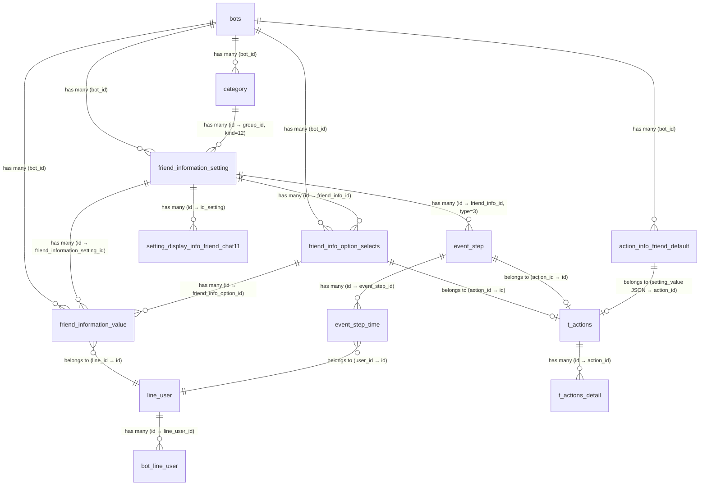

# [FA-015] Quản lý thông tin bạn bè — DB Mapping

> **Tính năng**: FA-015 — Quản lý thông tin bạn bè (「友だち情報管理」)
> **Ngày tạo**: 2026-03-26
> **Mức độ tin cậy tổng thể**: **Cao** (xác nhận từ schema, sample data, source code, logic-spec, job-spec)

---

## 1. Primary Tables (trực tiếp liên quan)

| # | Bảng | Vai trò | Model (Laravel) | Data size |
|---|------|---------|-----------------|-----------|
| 1 | `friend_information_setting` | Bảng chính — định nghĩa trường thông tin bạn bè | `FriendInformationSetting` | 627KB |
| 2 | `friend_information_value` | Giá trị thực tế của từng bạn bè cho mỗi trường | `FriendInformationValue` | 134KB |
| 3 | `friend_info_option_selects` | Danh sách options cho trường kiểu 選択肢 (select) | `FriendInfoOptionSelects` | 199KB |
| 4 | `action_info_friend_default` | Cấu hình action cho trường mặc định hệ thống (d_1 ~ d_6) | `ActionInfoFriendDefault` | 609KB |
| 5 | `category` | Folder phân loại (kind = 12 = information_friend) | `Category` | 509KB |
| 6 | `setting_display_info_friend_chat11` | Cấu hình hiển thị trường thông tin trên chat 1:1 | `SettingDisplayInfoFriendChat11` | 394KB |
| 7 | `line_user` | Thông tin bạn bè — lưu default fields (view_name, phone, email, birthday, age, province) | `LineUser` | 139.1MB |

## 2. Secondary Tables (gián tiếp — FK, action, scheduling, cascade)

| # | Bảng | Vai trò | Model | Data size |
|---|------|---------|-------|-----------|
| 8 | `t_actions` | Định nghĩa action (gắn vào option/scheduling) | `Actions` | 8.8MB |
| 9 | `t_actions_detail` | Chi tiết action (type, data JSON, filters) | `ActionDetail` | 14.7MB |
| 10 | `event_step` | Cấu hình step scheduling — type = 3 cho friend info date | `EventStep` (JPA) | 1.1MB |
| 11 | `event_step_time` | Queue lịch gửi action cụ thể cho từng user | `EventStepTime` (JPA) | 1.4MB |
| 12 | `bot_line_user` | Liên kết bot ↔ line_user (dùng khi query default fields) | `BotLineUser` | 137.2MB |
| 13 | `sync_elasticsearch` | Queue đồng bộ Elasticsearch (khi xoá default field d_1) | `SyncElasticsearch` | 174KB |
| 14 | `backup_history` | Kiểm tra bot đang backup → chặn thao tác write | `BackupHistory` | 18KB |
| 15 | `calendar_setting_send_forms` | Form gửi calendar — cascade update khi đổi option select | `CalendarSettingSendForms` | 260KB |
| 16 | `calendar_salon_setting_send_forms` | Form gửi salon — cascade update khi đổi option select | `CalendarSalonSettingSendForms` | 385KB |
| 17 | `form_answer_details` | Chi tiết form answer — cascade update khi đổi option select | `FormAnswerDetails` | 8.3MB |
| 18 | `filter_v2_cross_backup` | Bộ lọc v2 — cascade update khi đổi option select | `FilterV2` | 300KB |

---

## 3. Entity Details

### 3.1. `friend_information_setting` — Bảng chính

**Mức độ tin cậy**: **Cao**

#### Columns

| # | Cột | Kiểu | Nullable | Default | Mô tả |
|---|-----|------|----------|---------|-------|
| 1 | `id` | int(10) UNSIGNED | NOT NULL | — | PK, auto-increment |
| 2 | `bot_id` | int(11) | NOT NULL | — | FK → `bots.id`, xác định LINE OA account |
| 3 | `order` | int(11) | NOT NULL | 0 | Thứ tự hiển thị trong folder |
| 4 | `title` | varchar(255) | NOT NULL | — | Tên quản lý (「管理名」, max 20 ký tự từ UI) |
| 5 | `group_id` | int(11) | NOT NULL | 0 | FK → `category.id` (kind=12). 0 = 未分類 |
| 6 | `type_data` | int(11) | NOT NULL | — | Kiểu dữ liệu (enum 1-6, xem bảng Enum) |
| 7 | `default_value` | varchar(500) | NULL | NULL | Giá trị mặc định (không thấy dùng trong UI) |
| 8 | `setting_value` | text | NULL | — | JSON cấu hình actions (xem BR-03 trong logic-spec) |
| 9 | `total_user_has_value` | int(11) | NOT NULL | 0 | Đếm số bạn bè có giá trị (「回答人数」) |
| 10 | `calendar_id` | bigint(20) | NULL | NULL | FK → calendar (cascade update từ calendar) |
| 11 | `calendar_salon_id` | bigint(20) | NULL | NULL | FK → calendar salon |
| 12 | `form_answer_detail_id` | bigint(20) | NULL | NULL | FK → form answer detail |
| 13 | `created_at` | timestamp | NOT NULL | CURRENT_TIMESTAMP | Ngày tạo (hiển thị UI dạng YYYY.MM.DD) |
| 14 | `updated_at` | timestamp | NOT NULL | CURRENT_TIMESTAMP ON UPDATE | Ngày cập nhật |

#### Sample Data

```
id=50, bot_id=451, order=11, title='select', group_id=511, type_data=1,
  setting_value='{"action_mode":"1","setting_actions":[{"action_id":"22252","value":"chon 1...","id":1},...]}'
  total_user_has_value=2

id=52, bot_id=451, order=13, title='kieu date', group_id=511, type_data=3,
  setting_value='{"action_mode":"2","setting_actions":[{"action_id":25485,"number":"1","option_compare1":"1","option_compare2":"1","time":"18:10"},...]}'
  total_user_has_value=4

id=55, bot_id=451, order=17, title='point', group_id=0, type_data=6,
  setting_value='{"action_mode":"2","setting_actions":[{"action_id":"22255","value":"5"},{"action_id":"22256","value":"10"},...]}'
```

---

### 3.2. `friend_information_value` — Giá trị thông tin bạn bè

**Mức độ tin cậy**: **Cao**

#### Columns

| # | Cột | Kiểu | Nullable | Default | Mô tả |
|---|-----|------|----------|---------|-------|
| 1 | `id` | int(10) UNSIGNED | NOT NULL | — | PK, auto-increment |
| 2 | `bot_id` | int(11) | NOT NULL | — | FK → `bots.id` |
| 3 | `friend_information_setting_id` | int(11) | NOT NULL | — | FK → `friend_information_setting.id`. Giá trị 0 = legacy data |
| 4 | `line_id` | int(11) | NOT NULL | — | FK → `line_user.id` (tên cột gây nhầm lẫn — thực chất là line_user.id, không phải line_user.line_id) |
| 5 | `value` | varchar(500) | NULL | NULL | Giá trị: text, date (YYYY-MM-DD), number, file path, option text |
| 6 | `action` | int(4) | NULL | NULL | Trạng thái action đã thực thi. NULL = chưa chạy, có giá trị = đã trigger action |
| 7 | `created_at` | timestamp | NOT NULL | CURRENT_TIMESTAMP | Ngày tạo |
| 8 | `updated_at` | timestamp | NOT NULL | CURRENT_TIMESTAMP ON UPDATE | Ngày cập nhật |
| 9 | `friend_info_option_id` | int(11) | NULL | NULL | FK → `friend_info_option_selects.id` (cho type select) |

#### Sample Data

```
-- Type select: value = option text, friend_info_option_id = option ID, action = execution count
id=206, bot_id=451, friend_information_setting_id=71, line_id=5670, value='thanh 1', action=2, friend_info_option_id=4
id=283, bot_id=451, friend_information_setting_id=80, line_id=5670, value='chon 1', action=1, friend_info_option_id=9

-- Type date: value = YYYY-MM-DD
id=199, bot_id=451, friend_information_setting_id=52, line_id=5666, value='2022-03-01', action=NULL

-- Type text: value = free text
id=198, bot_id=451, friend_information_setting_id=72, line_id=5666, value='chao ban', action=NULL

-- Type point: value = number (string)
id=347, bot_id=451, friend_information_setting_id=55, line_id=5670, value='4', action=NULL

-- Type image: value = file path
id=245, bot_id=451, friend_information_setting_id=53, line_id=5670, value='/images_form_answer/form_answer...jpeg'

-- Type PDF: value = file path
id=518, bot_id=300, friend_information_setting_id=212, line_id=5659, value='/msg_template/media/pdf/...'
```

---

### 3.3. `friend_info_option_selects` — Options kiểu lựa chọn

**Mức độ tin cậy**: **Cao**

#### Columns

| # | Cột | Kiểu | Nullable | Default | Mô tả |
|---|-----|------|----------|---------|-------|
| 1 | `id` | int(10) UNSIGNED | NOT NULL | — | PK, auto-increment |
| 2 | `bot_id` | int(11) | NOT NULL | — | FK → `bots.id` |
| 3 | `friend_info_id` | int(11) | NOT NULL | — | FK → `friend_information_setting.id` |
| 4 | `option_value` | varchar(255) | NULL | NULL | Text hiển thị của option (「選択肢」) |
| 5 | `action_id` | int(11) | NULL | NULL | FK → `t_actions.id`. NULL hoặc 0 = chưa gắn action |
| 6 | `created_at` | timestamp | NOT NULL | CURRENT_TIMESTAMP | Ngày tạo |
| 7 | `updated_at` | timestamp | NOT NULL | CURRENT_TIMESTAMP ON UPDATE | Ngày cập nhật |

#### Sample Data

```
id=1, bot_id=451, friend_info_id=50, option_value='chon 1 ádfdsgdfgdfg...', action_id=22252
id=4, bot_id=451, friend_info_id=71, option_value='thanh 1', action_id=22543
id=8, bot_id=451, friend_info_id=75, option_value='2', action_id=NULL  -- option không gắn action
```

---

### 3.4. `action_info_friend_default` — Cấu hình trường mặc định

**Mức độ tin cậy**: **Cao**

#### Columns

| # | Cột | Kiểu | Nullable | Default | Mô tả |
|---|-----|------|----------|---------|-------|
| 1 | `id` | int(10) UNSIGNED | NOT NULL | — | PK, auto-increment |
| 2 | `id_info` | varchar(255) | NOT NULL | — | ID trường mặc định: 'd_1', 'd_2', 'd_3', 'd_4', 'd_6' |
| 3 | `bot_id` | int(11) | NOT NULL | — | FK → `bots.id` |
| 4 | `order` | int(11) | NOT NULL | 0 | Thứ tự hiển thị |
| 5 | `title` | varchar(255) | NOT NULL | — | Tên trường (JP): システム表示名, 携帯電話, メールアドレス, 生年月日, 都道府県 |
| 6 | `group_id` | int(11) | NOT NULL | -1 | Nhóm: -1 = thông tin cơ bản |
| 7 | `type_data` | int(11) | NOT NULL | — | Kiểu: 2 (text) hoặc 3 (date) hoặc 1 (select cho d_6) |
| 8 | `default_value` | varchar(500) | NULL | NULL | Giá trị mặc định |
| 9 | `setting_value` | text | NULL | — | JSON cấu hình action (tương tự friend_information_setting) |
| 10 | `created_at` | timestamp | NOT NULL | CURRENT_TIMESTAMP | Ngày tạo |
| 11 | `updated_at` | timestamp | NOT NULL | CURRENT_TIMESTAMP ON UPDATE | Ngày cập nhật |

#### Sample Data

```
-- Mỗi bot có 5 records mặc định (d_1 ~ d_4, d_6)
id=6,  id_info='d_1', bot_id=300, title='システム表示名',  group_id=-1, type_data=2, setting_value=NULL
id=7,  id_info='d_2', bot_id=300, title='携帯電話',        group_id=-1, type_data=2, setting_value=NULL
id=8,  id_info='d_3', bot_id=300, title='メールアドレス',  group_id=-1, type_data=2, setting_value=NULL
id=9,  id_info='d_4', bot_id=300, title='生年月日',        group_id=-1, type_data=3, setting_value='{"action_mode":"1","setting_actions":[{"action_id":25579,"number":"1","option_compare1":1,"option_compare2":1,"time":"08:10"}]}'
id=10, id_info='d_6', bot_id=300, title='都道府県',        group_id=-1, type_data=1, setting_value='{"action_mode":1,"setting_actions":[]}'
```

---

### 3.5. `category` — Folder (kind = 12)

**Mức độ tin cậy**: **Cao**

#### Columns

| # | Cột | Kiểu | Nullable | Default | Mô tả |
|---|-----|------|----------|---------|-------|
| 1 | `id` | int(11) | NOT NULL | — | PK, auto-increment |
| 2 | `bot_id` | int(11) | NOT NULL | — | FK → `bots.id` |
| 3 | `kind` | int(11) | NOT NULL | — | Loại category. **12** = information_friend (folder friend info) |
| 4 | `name` | varchar(100) | NOT NULL | — | Tên folder (「フォルダ名」, max 15 ký tự từ UI) |
| 5 | `position` | int(11) | NULL | NULL | Thứ tự sắp xếp |
| 6 | `is_deleted` | int(11) | NULL | 0 | Soft delete: 0 = active, 1 = deleted |
| 7 | `created_at` | timestamp | NOT NULL | CURRENT_TIMESTAMP | Ngày tạo |
| 8 | `updated_at` | timestamp | NULL | NULL ON UPDATE | Ngày cập nhật |
| 9 | `category_id_old` | int(11) | NOT NULL | -1 | ID cũ (dùng cho backup/migrate) |

#### Ghi chú
- Bảng `category` dùng chung cho nhiều loại folder (tag, template, autoreply, ...), phân biệt bằng `kind`
- `kind = 12` = `config('sns-line.category_kind.information_friend')`
- Folder「未分類」(chưa phân loại) **KHÔNG** có record trong `category` — dùng convention `group_id = 0`
- Relationship: `Category hasMany FriendInformationSetting` qua `group_id`

#### Sample Data (kind = 12)

```
id=421, bot_id=437, kind=12, name='test 123',   position=3, is_deleted=1
id=422, bot_id=437, kind=12, name='test 123',   position=1, is_deleted=0
id=423, bot_id=437, kind=12, name='folder 2',   position=2, is_deleted=0
id=3211, bot_id=541, kind=12, name='この受付枠を削除して新しく追加', position=1, is_deleted=0
```

---

### 3.6. `setting_display_info_friend_chat11` — Hiển thị trên Chat 1:1

**Mức độ tin cậy**: **Cao**

#### Columns

| # | Cột | Kiểu | Nullable | Default | Mô tả |
|---|-----|------|----------|---------|-------|
| 1 | `id` | int(10) UNSIGNED | NOT NULL | — | PK, auto-increment |
| 2 | `bot_id` | int(11) | NOT NULL | — | FK → `bots.id` |
| 3 | `type` | int(11) | NOT NULL | 0 | 0 = default, 1 = custom (friend info) |
| 4 | `id_setting` | int(11) | NOT NULL | — | FK → `friend_information_setting.id` |
| 5 | `line_id` | int(11) | NULL | NULL | FK → `line_user.id` (nullable) |
| 6 | `order` | int(11) | NOT NULL | 0 | Thứ tự hiển thị |
| 7 | `title` | varchar(255) | NULL | NULL | Tiêu đề (cache từ setting.title) |
| 8 | `value` | varchar(500) | NULL | NULL | Giá trị hiện tại (cache) |
| 9 | `created_at` | timestamp | NOT NULL | CURRENT_TIMESTAMP | Ngày tạo |
| 10 | `updated_at` | timestamp | NOT NULL | CURRENT_TIMESTAMP ON UPDATE | Ngày cập nhật |

---

### 3.7. `line_user` — Thông tin bạn bè (default fields)

**Mức độ tin cậy**: **Cao**

#### Columns (chỉ liệt kê cột liên quan FA-015)

| # | Cột | Kiểu | Nullable | Default | Mô tả | Default field ID |
|---|-----|------|----------|---------|-------|-----------------|
| 1 | `id` | int(12) | NOT NULL | — | PK | — |
| 2 | `line_id` | varchar(128) | NOT NULL | — | LINE user ID (từ LINE Platform) | — |
| 3 | `name` | varchar(128) | NULL | NULL | Tên LINE (「友だち名」) | — |
| 4 | `view_name` | varchar(128) | NULL | NULL | Tên hiển thị hệ thống (「システム表示名」) | d_1 |
| 5 | `phone_number` | varchar(15) | NULL | NULL | Số điện thoại (「携帯電話」) | d_2 |
| 6 | `email` | varchar(100) | NULL | NULL | Email (「メールアドレス」) | d_3 |
| 7 | `birthday` | date | NULL | NULL | Ngày sinh (「生年月日」) | d_4 |
| 8 | `age` | int(11) | NULL | NULL | Tuổi (「年齢」) | d_5 |
| 9 | `province` | varchar(255) | NULL | NULL | Tỉnh/thành (「都道府県名」) | d_6 / -6 |

---

### 3.8. `event_step` — Cấu hình step scheduling

**Mức độ tin cậy**: **Cao**

#### Columns (chỉ liệt kê cột liên quan FA-015, type = 3)

| # | Cột | Kiểu | Nullable | Default | Mô tả |
|---|-----|------|----------|---------|-------|
| 1 | `id` | int(10) UNSIGNED | NOT NULL | — | PK, auto-increment |
| 2 | `event_id` | int(11) | NOT NULL | — | ID sự kiện cha. = 0 khi tạo từ friend info |
| 3 | `friend_info_id` | varchar(16) | NULL | NULL | ID friend info setting (số) hoặc 'd_4' cho birthday |
| 4 | `is_action_repeat` | int(11) | NOT NULL | 0 | 0 = lặp lại hàng năm, 1 = chỉ 1 lần |
| 5 | `is_day_month` | int(11) | NULL | 1 | 1 = mode 月日 (lặp hàng năm), 0 = 年月日 (1 lần) |
| 6 | `bot_id` | int(11) | NOT NULL | — | FK → `bots.id` |
| 7 | `templates_id` | varchar(256) | NOT NULL | — | Template IDs (comma-separated), dùng khi không có action_id |
| 8 | `type` | int(11) | NOT NULL | 0 | Loại event step. **3** = EVENT_FRIEND_INFO |
| 9 | `before_day` | smallint(6) | NOT NULL | — | Số ngày offset trước/sau ngày mốc |
| 10 | `time_send` | varchar(16) | NOT NULL | — | Giờ gửi (HH:mm) |
| 11 | `is_after_day` | int(11) | NOT NULL | — | 0 = trước ngày (前), 1 = sau ngày (後) |
| 12 | `action_id` | int(11) | NULL | NULL | FK → `t_actions.id` |
| 13 | `created_at` | timestamp | NOT NULL | CURRENT_TIMESTAMP | — |
| 14 | `updated_at` | timestamp | NOT NULL | CURRENT_TIMESTAMP ON UPDATE | — |

---

### 3.9. `event_step_time` — Queue lịch gửi action

**Mức độ tin cậy**: **Cao**

#### Columns (chỉ liệt kê cột liên quan FA-015)

| # | Cột | Kiểu | Nullable | Default | Mô tả |
|---|-----|------|----------|---------|-------|
| 1 | `id` | int(10) UNSIGNED | NOT NULL | — | PK, auto-increment |
| 2 | `event_id` | int(11) | NOT NULL | — | = 0 khi tạo từ friend info |
| 3 | `event_time_id` | int(11) | NOT NULL | — | = 0 khi tạo từ friend info |
| 4 | `event_step_id` | int(11) | NOT NULL | — | FK → `event_step.id` |
| 5 | `bot_id` | int(11) | NOT NULL | — | FK → `bots.id` |
| 6 | `user_id` | int(11) | NULL | NULL | FK → `line_user.id` |
| 7 | `sent_date_time` | datetime | NOT NULL | — | Thời điểm gửi action (điều kiện poll chính) |
| 8 | `status` | tinyint(4) | NOT NULL | 0 | State machine: 0=chờ, 1=đang gửi, 2=đã gửi, 3=lỗi, 4=skip hết plan, 5=skip course off |
| 9 | `total_send` | int(11) | NOT NULL | 0 | Số tin nhắn đã gửi thành công |
| 10 | `created_at` | timestamp | NOT NULL | CURRENT_TIMESTAMP | — |
| 11 | `updated_at` | timestamp | NOT NULL | CURRENT_TIMESTAMP ON UPDATE | — |

---

### 3.10. `t_actions` — Định nghĩa Action

**Mức độ tin cậy**: **Cao**

#### Columns

| # | Cột | Kiểu | Nullable | Default | Mô tả |
|---|-----|------|----------|---------|-------|
| 1 | `id` | int(10) UNSIGNED | NOT NULL | — | PK, auto-increment |
| 2 | `parent_id` | int(11) | NOT NULL | — | ID parent (grouping) |
| 3 | `type` | varchar(255) | NOT NULL | — | Loại action |
| 4 | `update_timestamp` | bigint(20) | NOT NULL | — | Timestamp cập nhật (Unix millis) |
| 5 | `created_at` | timestamp | NOT NULL | CURRENT_TIMESTAMP | — |
| 6 | `updated_at` | timestamp | NOT NULL | CURRENT_TIMESTAMP ON UPDATE | — |

---

### 3.11. `t_actions_detail` — Chi tiết Action

**Mức độ tin cậy**: **Cao**

#### Columns

| # | Cột | Kiểu | Nullable | Default | Mô tả |
|---|-----|------|----------|---------|-------|
| 1 | `id` | int(10) UNSIGNED | NOT NULL | — | PK, auto-increment |
| 2 | `action_id` | int(11) | NOT NULL | — | FK → `t_actions.id` |
| 3 | `bot_id` | int(11) | NULL | NULL | FK → `bots.id` |
| 4 | `type` | varchar(255) | NOT NULL | — | Loại action detail: 'tag', 'template', 'text', 'friend_info', 'step', 'remind', 'richmenu', 'bookmark', 'status', 'block' |
| 5 | `data` | text | NOT NULL | — | JSON chứa cấu hình action (nội dung khác nhau theo type) |
| 6 | `embed_regex_text` | varchar(255) | NULL | NULL | Text embed regex |
| 7 | `has_filters` | tinyint(4) | NOT NULL | 0 | 1 = có filter_v2 gắn kèm |
| 8 | `update_timestamp` | bigint(20) | NOT NULL | — | Timestamp cập nhật |
| 9 | `created_at` | timestamp | NOT NULL | CURRENT_TIMESTAMP | — |
| 10 | `updated_at` | timestamp | NOT NULL | CURRENT_TIMESTAMP ON UPDATE | — |

---

## 4. UI ↔ DB Field Mapping

### 4.1. SCR-FRI-01: Danh sách thông tin bạn bè

| # | Label UI (JP) | DB Table | DB Column | Mapping Type | Mức độ tin cậy |
|---|--------------|----------|-----------|-------------|---------------|
| 1 | 「作成日」(Ngày tạo) | `friend_information_setting` | `created_at` | Direct — format YYYY.MM.DD trên UI | **Cao** |
| 2 | 「管理名」(Tên quản lý) | `friend_information_setting` | `title` | Direct | **Cao** |
| 3 | 「情報タイプ」(Kiểu thông tin) | `friend_information_setting` | `type_data` | Enum — int → text JP (xem bảng Enum) | **Cao** |
| 4 | 「回答人数」(Số người trả lời) | `friend_information_setting` | `total_user_has_value` | Direct — append「人」trên UI | **Cao** |
| 5 | Folder panel (trái) | `category` | `name` (where kind=12) | FK — group_id → category.id | **Cao** |
| 6 | Folder item count | `category` JOIN `friend_information_setting` | COUNT(*) | Aggregated — LEFT JOIN đếm settings per folder | **Cao** |
| 7 | 「未分類」folder | — (virtual) | group_id = 0 | Computed — không có record category, đếm settings với group_id=0 | **Cao** |
| 8 | Sort order (items) | `friend_information_setting` | `order` | Direct — ORDER BY order DESC | **Cao** |
| 9 | Sort order (folders) | `category` | `position` | Direct — ORDER BY position DESC | **Cao** |

### 4.2. SCR-FRI-02: Form tạo/chỉnh sửa — Kiểu「選択肢」(Select)

| # | Label UI (JP) | DB Table | DB Column | Mapping Type | Mức độ tin cậy |
|---|--------------|----------|-----------|-------------|---------------|
| 1 | 「友だち情報（管理名）」 | `friend_information_setting` | `title` | Direct | **Cao** |
| 2 | 「フォルダ」(Folder) | `friend_information_setting` | `group_id` | FK → `category.id` (kind=12) | **Cao** |
| 3 | 「情報タイプ選択」(Kiểu) | `friend_information_setting` | `type_data` | Enum (xem bảng Enum) | **Cao** |
| 4 | 「稼働設定」(Mode) | `friend_information_setting` | `setting_value` → JSON `.action_mode` | Computed — JSON field. 1 = 一度のみ, 2 = 何度でも稼働 | **Cao** |
| 5 | 「選択肢」(Tên option) | `friend_info_option_selects` | `option_value` | Direct | **Cao** |
| 6 | 「アクション設定」(Action) | `friend_info_option_selects` | `action_id` → `t_actions.id` | FK — link tới bảng actions qua action_id | **Cao** |
| 7 | Option sort order | `friend_information_setting` | `setting_value` → JSON `.setting_actions[].id` | Computed — thứ tự trong JSON array + match với option_selects.id | **Cao** |

### 4.3. SCR-FRI-03: Form kiểu「記述」(Text Input)

| # | Label UI (JP) | DB Table | DB Column | Mapping Type | Mức độ tin cậy |
|---|--------------|----------|-----------|-------------|---------------|
| 1 | 「友だち情報（管理名）」 | `friend_information_setting` | `title` | Direct | **Cao** |
| 2 | 「フォルダ」 | `friend_information_setting` | `group_id` | FK | **Cao** |
| 3 | 「情報タイプ選択」 | `friend_information_setting` | `type_data` | Enum — giá trị 2 | **Cao** |

> Kiểu 記述 (text) không có action config → `setting_value` = NULL

### 4.4. SCR-FRI-04: Form kiểu「年月日」(Date) — Action Scheduling

| # | Label UI (JP) | DB Table | DB Column | Mapping Type | Mức độ tin cậy |
|---|--------------|----------|-----------|-------------|---------------|
| 1 | 「登録」(月日 / 年月日) | `friend_information_setting` | `setting_value` → JSON `.setting_actions[].option_compare1` | Computed — 1 = 月日 (lặp hàng năm), 2 = 年月日 (1 lần) | **Cao** |
| 2 | 「から {N} 日」(Số ngày offset) | `friend_information_setting` | `setting_value` → JSON `.setting_actions[].number` | Computed — JSON field | **Cao** |
| 3 | 「前」/「後」(Trước/Sau) | `friend_information_setting` | `setting_value` → JSON `.setting_actions[].option_compare2` | Computed — 1 = 前 (trước), 2 = 後 (sau) | **Cao** |
| 4 | Thời gian (HH:mm) | `friend_information_setting` | `setting_value` → JSON `.setting_actions[].time` | Computed — JSON field | **Cao** |
| 5 | Action ID | `friend_information_setting` | `setting_value` → JSON `.setting_actions[].action_id` | FK → `t_actions.id` | **Cao** |
| 6 | 「稼働設定」 | `friend_information_setting` | `setting_value` → JSON `.action_mode` | Computed | **Cao** |

**Scheduling tables (tạo khi lưu):**

| # | Dữ liệu | DB Table | DB Column | Mapping Type | Mức độ tin cậy |
|---|---------|----------|-----------|-------------|---------------|
| 7 | Event step config | `event_step` | `type=3, friend_info_id, before_day, time_send, is_after_day, action_id, is_day_month` | Direct — mỗi setting_action → 1 event_step | **Cao** |
| 8 | Lịch gửi per user | `event_step_time` | `event_step_id, user_id, sent_date_time, status` | Computed — tính từ date value ± N days + HH:mm | **Cao** |

### 4.5. SCR-FRI-05: Form kiểu「ポイント」(Point)

| # | Label UI (JP) | DB Table | DB Column | Mapping Type | Mức độ tin cậy |
|---|--------------|----------|-----------|-------------|---------------|
| 1 | 「稼働設定」 | `friend_information_setting` | `setting_value` → JSON `.action_mode` | Computed | **Cao** |
| 2 | Threshold point | `friend_information_setting` | `setting_value` → JSON `.setting_actions[].value` | Computed — ngưỡng điểm trigger action | **Cao** |
| 3 | Action ID | `friend_information_setting` | `setting_value` → JSON `.setting_actions[].action_id` | FK → `t_actions.id` | **Cao** |

### 4.6. SCR-FRI-06: Dialog Action Settings (SC-004)

| # | Action Type UI (JP) | DB Table | DB Column | DB Value | Mức độ tin cậy |
|---|-------------------|----------|-----------|---------|---------------|
| 1 | 「ステップ」 | `t_actions_detail` | `type` | `'step'` | **Cao** |
| 2 | 「テンプレート」 | `t_actions_detail` | `type` | `'template'` | **Cao** |
| 3 | 「テキスト」 | `t_actions_detail` | `type` | `'text'` | **Cao** |
| 4 | 「リマインド」 | `t_actions_detail` | `type` | `'remind'` | **Cao** |
| 5 | 「タグ」 | `t_actions_detail` | `type` | `'tag'` | **Cao** |
| 6 | 「リッチメニュー」 | `t_actions_detail` | `type` | `'richmenu'` | **Cao** |
| 7 | 「ブックマーク」 | `t_actions_detail` | `type` | `'bookmark'` | **Cao** |
| 8 | 「友だち情報」 | `t_actions_detail` | `type` | `'friend_info'` | **Cao** |
| 9 | 「対応ステータス」 | `t_actions_detail` | `type` | `'status'` | **Trung bình** |
| 10 | 「ブロック」 | `t_actions_detail` | `type` | `'block'` | **Trung bình** |

### 4.7. SCR-FRI-07: Popup tạo folder

| # | Label UI (JP) | DB Table | DB Column | Mapping Type | Mức độ tin cậy |
|---|--------------|----------|-----------|-------------|---------------|
| 1 | 「フォルダ名」(Tên folder) | `category` | `name` | Direct — max 15 ký tự (UI constraint), DB cho phép 100 | **Cao** |
| 2 | (auto) | `category` | `kind` | Direct — luôn = 12 | **Cao** |
| 3 | (auto) | `category` | `bot_id` | Direct — từ session | **Cao** |
| 4 | (auto) | `category` | `is_deleted` | Direct — mặc định 0 | **Cao** |

### 4.8. SCR-FRI-08/09: Danh sách câu trả lời (情報一覧)

#### Cho custom fields (id > 0)

| # | Label UI (JP) | DB Table | DB Column | Mapping Type | Mức độ tin cậy |
|---|--------------|----------|-----------|-------------|---------------|
| 1 | 「友だち名」(Tên bạn bè) | `line_user` | `name` | Direct — JOIN qua friend_information_value.line_id = line_user.id | **Cao** |
| 2 | 「情報」(Giá trị - kiểu date) | `friend_information_value` | `value` | Direct — format YYYY-MM-DD | **Cao** |
| 3 | 「情報」(Giá trị - kiểu select) | `friend_information_value` | `value` | Direct — text hiển thị option đã chọn | **Cao** |
| 4 | 「情報」(Giá trị - kiểu text) | `friend_information_value` | `value` | Direct — free text | **Cao** |
| 5 | 「情報」(Giá trị - kiểu point) | `friend_information_value` | `value` | Direct — số dạng string | **Cao** |
| 6 | Header label (tên trường) | `friend_information_setting` | `title` | Direct | **Cao** |
| 7 | Link → friend page | `friend_information_value` | `line_id` | Direct — dùng làm friendId trong URL `/basic/friendlist/my_page/{friendId}` | **Cao** |

#### Cho default fields (d_1 ~ d_6)

| # | Default ID | DB Table | DB Column | Mô tả | Mức độ tin cậy |
|---|-----------|----------|-----------|-------|---------------|
| 1 | d_1 | `line_user` | `view_name` | システム表示名 | **Cao** |
| 2 | d_2 | `line_user` | `phone_number` | 携帯電話 | **Cao** |
| 3 | d_3 | `line_user` | `email` | メールアドレス | **Cao** |
| 4 | d_4 | `line_user` | `birthday` | 生年月日 | **Cao** |
| 5 | d_5 | `line_user` | `age` | 年齢 | **Cao** |
| 6 | d_6 / -6 | `line_user` | `province` | 都道府県名 | **Cao** |

#### Cho address fields (ID < 0, không phải default)

| # | ID | DB Table | DB Column (suy luận) | Mô tả | Mức độ tin cậy |
|---|---|----------|---------------------|-------|---------------|
| 1 | -7 | `friend_information_value` | `value` (friend_information_setting_id = -7) | 郵便番号 (zip code) | **Trung bình** |
| 2 | -8 | `friend_information_value` | `value` (friend_information_setting_id = -8) | 市区町村名 (district) | **Trung bình** |
| 3 | -9 | `friend_information_value` | `value` (friend_information_setting_id = -9) | 町名/番地 (township) | **Trung bình** |
| 4 | -10 | `friend_information_value` | `value` (friend_information_setting_id = -10) | 建物名・部屋番号 (building) | **Trung bình** |

---

## 5. Enum / Status Values

### 5.1. `friend_information_setting.type_data` — Kiểu dữ liệu

| Giá trị | Constant (Laravel) | Tên JP | Tên VI | Ghi chú |
|---------|-------------------|--------|--------|---------|
| 1 | `TYPE_DATA_SELECT` | 選択肢 | Lựa chọn | Có action per option |
| 2 | `TYPE_DATA_INPUT` | 記述 | Mô tả văn bản | Không action |
| 3 | `TYPE_DATA_DATETIME` | 年月日 | Ngày tháng | Có action scheduling |
| 4 | `TYPE_DATA_IMAGE` | 画像 | Hình ảnh | Bị ẩn khỏi danh sách folder |
| 5 | `TYPE_DATA_FILE` | PDF | File PDF | Bị ẩn khỏi danh sách folder |
| 6 | `TYPE_DATA_POINT` | ポイント | Điểm | Có action khi đạt ngưỡng |

**Mức độ tin cậy**: **Cao** — khai báo constants trong Model + COMMENT trong schema

### 5.2. `friend_information_setting.setting_value` → `action_mode`

| Giá trị | Tên JP | Mô tả |
|---------|--------|-------|
| 1 | 一度のみ | Action chỉ trigger 1 lần (kiểm tra `friend_information_value.action`) |
| 2 | 何度でも稼働 | Action trigger mỗi khi giá trị thay đổi (reset `action = null`) |

**Mức độ tin cậy**: **Cao**

### 5.3. `setting_value` → `option_compare1` (kiểu date)

| Giá trị | Tên JP | Mô tả |
|---------|--------|-------|
| 1 | 月日 | Lặp hàng năm (chỉ so tháng/ngày) |
| 2 | 年月日 | 1 lần duy nhất (so cả năm/tháng/ngày) |

**Mức độ tin cậy**: **Cao**

### 5.4. `setting_value` → `option_compare2` (kiểu date)

| Giá trị | Tên JP | Mô tả | event_step.is_after_day |
|---------|--------|-------|------------------------|
| 1 | 前 | Trước ngày mốc (trừ N ngày) | 0 |
| 2 | 後 | Sau ngày mốc (cộng N ngày) | 1 |

**Mức độ tin cậy**: **Cao**

### 5.5. `event_step_time.status` — State machine

| Giá trị | Constant (Java) | Mô tả |
|---------|-----------------|-------|
| 0 | `STATUS_NOT_SEND_YET` | Chờ gửi — job poll |
| 1 | `STATUS_SENDING` | Đang xử lý |
| 2 | `STATUS_SEND` | Đã gửi thành công |
| 3 | `STATUS_SEND_ERROR` | Gửi thất bại |
| 4 | `STATUS_SKIP_BOT_EXPIRED_PLAN` | Bỏ qua — bot hết hạn > 7 ngày |
| 5 | `STATUS_SKIP_COURSE_OFF` | Bỏ qua — course đã tắt |

**Mức độ tin cậy**: **Cao**

### 5.6. `event_step.type` — Loại event step

| Giá trị | Constant (Java) | Mô tả | Liên quan FA-015? |
|---------|-----------------|-------|-------------------|
| 0 | `EVENT_FIXED_TIME` | Sự kiện lịch cố định | Không |
| 1 | `EVENT_FLEX_TIME_1` | Sự kiện linh hoạt 1 | Không |
| 2 | `EVENT_FLEX_TIME_2` | Sự kiện linh hoạt 2 | Không |
| **3** | **`EVENT_FRIEND_INFO`** | **Friend info date action** | **Có** |
| 4 | `EVENT_LESSON_CALENDAR` | Lịch bài học | Không |
| 5 | `EVENT_SALON_CALENDAR` | Lịch salon | Không |
| 6 | `EVENT_FORM_ANSWER` | Form answer | Không |

**Mức độ tin cậy**: **Cao**

### 5.7. `category.kind` — Loại category

| Giá trị | Config key | Mô tả | Liên quan FA-015? |
|---------|-----------|-------|-------------------|
| 0 | `tag` | Folder tag | Không |
| 1 | `auto_reply` | Folder auto reply | Không |
| 2 | `template` | Folder template | Không |
| 3 | `scenario` | Folder scenario | Không |
| **12** | **`information_friend`** | **Folder friend info** | **Có** |

**Mức độ tin cậy**: **Cao** — giá trị 12 xác nhận qua config + sample data

### 5.8. `backup_history.status` — Trạng thái backup

| Giá trị | Mô tả | Chặn write? |
|---------|-------|-------------|
| 0 | Waiting | Có |
| 1 | Doing | Có |
| 2 | Done | Không |
| 3 | Failure | Không |

**Mức độ tin cậy**: **Cao** — COMMENT trong schema

---

## 6. Unmapped Items

| # | Label UI / Field | Nguyên nhân | Mức độ tin cậy |
|---|-----------------|-------------|---------------|
| 1 | 「Cross Analysis」mode (EP-06 param `cross`) | Logic ở frontend, không có cột DB riêng. Chỉ thay đổi cách query (nhóm theo type thay vì folder) | **Trung bình** |
| 2 | Cookie `folder_info_friend` | Lưu ở client-side, không có bảng DB. Format: `{ "{bot_id}": folder_id }` | **Cao** |
| 3 | `friend_information_setting.default_value` | Cột tồn tại trong schema nhưng không thấy UI hiển thị hoặc logic sử dụng | **Trung bình** |
| 4 | `friend_information_setting.calendar_id` | FK tới calendar, tạo từ calendar feature (không phải từ UI friend info) | **Trung bình** |
| 5 | `friend_information_setting.calendar_salon_id` | FK tới calendar salon, tạo từ salon feature | **Trung bình** |
| 6 | `friend_information_setting.form_answer_detail_id` | FK tới form answer detail, tạo từ form feature | **Trung bình** |
| 7 | `line_user.action_count` | Đếm action đã thực thi, cập nhật bởi hệ thống action, không hiển thị trực tiếp trong FA-015 | **Trung bình** |
| 8 | `line_user.action` | Trạng thái action chung, không dùng trực tiếp trong FA-015 | **Trung bình** |
| 9 | `setting_display_info_friend_chat11.value` | Cached value — hiển thị trên giao diện chat 1:1, không phải màn hình FA-015 | **Cao** |
| 10 | `event_step.remind_calendar_index` | Dùng cho calendar reminder, không dùng cho friend info | **Cao** |
| 11 | `event_step.is_use_filter_remind` | Filter cho reminder, không trực tiếp liên quan UI FA-015 | **Trung bình** |
| 12 | `event_step.send_message` / `send_message_course` | Dùng cho event types khác (calendar, course) | **Cao** |
| 13 | `action_info_friend_default` cho `d_5` (年齢/age) | Config có trong code nhưng bị comment out. Có thể truy cập bằng ID `-5` nhưng không hiển thị trên UI | **Trung bình** |

---

## 7. Entity Relationships



### Quan hệ đặc biệt

| Quan hệ | Mô tả | Mức độ tin cậy |
|---------|-------|---------------|
| `friend_information_setting.group_id = 0` → 「未分類」 | Virtual folder — không có record trong `category` | **Cao** |
| `friend_information_setting.group_id = -1` → Default info | Thông tin mặc định hệ thống (d_1~d_4), dữ liệu ở `action_info_friend_default` | **Cao** |
| `friend_information_setting.group_id = -2` → Address info | Thông tin địa chỉ (-6~-10), dữ liệu ở `action_info_friend_default` + `friend_information_value` | **Cao** |
| `friend_information_value.line_id` → `line_user.id` | Tên cột gây nhầm: `line_id` thực chất là FK tới `line_user.id`, KHÔNG phải `line_user.line_id` | **Cao** |
| `friend_information_setting.setting_value` (JSON) | Chứa cả action config + option refs. `setting_actions[].id` → `friend_info_option_selects.id` | **Cao** |
| `t_actions_detail.type = 'friend_info'` | Khi xoá info setting → cascade xoá `t_actions_detail` type='friend_info' tham chiếu đến setting | **Cao** |

---

## 8. Cascade Operations Summary

### Khi xoá 1 friend information setting

| Bước | Bảng | Thao tác | Mức độ tin cậy |
|------|------|----------|---------------|
| 1 | `t_actions_detail` | DELETE WHERE type='friend_info' AND data chứa info ID | **Cao** |
| 2 | `friend_information_value` | DELETE WHERE friend_information_setting_id = id | **Cao** |
| 3 | `friend_information_setting` | DELETE record | **Cao** |
| 4 | `setting_display_info_friend_chat11` | DELETE WHERE id_setting = id | **Cao** |
| 5 | `friend_info_option_selects` | DELETE WHERE friend_info_id = id | **Cao** |
| 6 | `event_step` + `event_step_time` | Implicit — xoá khi lưu lại setting (step 3 của saveSettingInfoFriend) | **Cao** |

### Khi đổi tên option (type select)

| Bước | Bảng | Thao tác | Mức độ tin cậy |
|------|------|----------|---------------|
| 1 | `friend_info_option_selects` | UPDATE `option_value` | **Cao** |
| 2 | `friend_information_value` | UPDATE `value` WHERE friend_info_option_id matching | **Cao** |
| 3 | `calendar_setting_send_forms` | UPDATE `options` / `options_information_friend` | **Cao** |
| 4 | `calendar_salon_setting_send_forms` | UPDATE tương tự | **Cao** |
| 5 | `form_answer_details` | UPDATE `settings.items` | **Cao** |
| 6 | `t_actions_detail` | UPDATE `data.content` cho actions tham chiếu option | **Cao** |
| 7 | `filter_v2_cross_backup` | UPDATE `data.valueOption` + `selected_op` | **Cao** |

### Khi xoá giá trị default field

| Default ID | Bảng | Thao tác | Side effect | Mức độ tin cậy |
|-----------|------|----------|-------------|---------------|
| d_1 | `line_user` | SET `view_name = NULL` | INSERT `sync_elasticsearch` (đồng bộ ES) | **Cao** |
| d_2 | `line_user` | SET `phone_number = NULL` | — | **Cao** |
| d_3 | `line_user` | SET `email = NULL` | — | **Cao** |
| d_4 | `line_user` | SET `birthday = NULL` | DELETE `event_step_time` liên quan | **Cao** |
| d_5 | `line_user` | SET `age = NULL` | — | **Cao** |
| d_6 / -6 | `line_user` | SET `province = NULL` | — | **Cao** |
