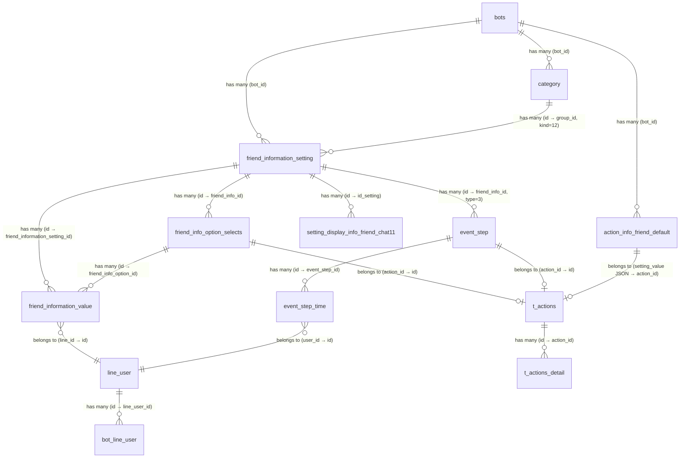

# [FA-015] Quản lý thông tin bạn bè — Feature Spec

> **Mã tính năng**: FA-015
> **Tên JP**: 「友だち情報管理」
> **Ngày tổng hợp**: 2026-03-26
> **Trạng thái validation**: **ĐẠT** — 0 vấn đề nghiêm trọng, 3 trung bình, 9 nhẹ
> **Nguồn**: ui-spec, api-spec, logic-spec, job-spec, db-mapping, validation-report

---

## 1. Tổng quan

### Mục đích
Quản lý các trường thông tin tuỳ chỉnh (custom fields) gắn với bạn bè LINE. Admin có thể tạo các trường thông tin với **6 kiểu dữ liệu** khác nhau (lựa chọn, mô tả, ngày tháng, hình ảnh, PDF, điểm), tổ chức theo folder, và cấu hình hành động tự động (action) khi giá trị thay đổi.

Ngoài custom fields, hệ thống còn có **default fields** (tên hiển thị, số điện thoại, email, ngày sinh, tuổi, tỉnh/thành) và **address fields** (mã bưu điện, quận/huyện, phường/xã, toà nhà) — được quản lý qua cùng giao diện nhưng lưu ở bảng khác.

### Actors

| Actor | Vai trò | Quyền truy cập |
|-------|---------|----------------|
| Admin | Quản lý toàn bộ: tạo/sửa/xoá trường thông tin, quản lý folder, xem danh sách câu trả lời | Toàn quyền |
| Staff | Truy cập theo phân quyền custom role | Tuỳ role — có thể bị giới hạn |
| LINE User | Gián tiếp — cập nhật giá trị qua form, postback, landing page | Không truy cập trực tiếp |

### Phạm vi

- **9 màn hình** (SCR-FRI-01 ~ SCR-FRI-09)
- **15 API endpoints** (EP-01 ~ EP-15) + 6 Mobile API endpoints
- **18 bảng DB** (7 primary + 11 secondary)
- **1 background job** (NewEventRemindTask — action scheduling cho kiểu ngày tháng)
- **1 shared component** (SC-004 Action Settings)

---

## 2. Các màn hình và Luồng xử lý end-to-end

### SCR-FRI-01: Danh sách thông tin bạn bè

- **URL**: `/basic/friend-information`
- **Tiêu đề**: 「友だち情報管理」

**Layout**: Panel trái (25%) = cây thư mục, Panel phải (75%) = bảng danh sách + thanh công cụ.

#### Luồng: Load trang

```
User truy cập URL
  → [EP-01] GET /basic/friend-information
    → Controller: index() — đọc cookie folder_info_friend, validate folder trong category (kind=12)
    → DB: SELECT category WHERE kind=12, is_deleted=0 (kiểm tra folder hợp lệ)
    → Response: HTML view basic.friend_information.index
  → [EP-06] POST /ajax/init-information (AJAX tự động)
    → Controller: ajaxInitInformation() — load folders + items theo group_id
    → DB: SELECT category WHERE kind=12, bot_id={bot_id}
    → DB: SELECT friend_information_setting WHERE bot_id={bot_id}, group_id={group_id}, type_data IN (1,2,3,6)
    → Response JSON: { groups: [...], items: [...], count_default }
  → UI render: Panel trái (folders + count), Panel phải (bảng items)
```

**Bảng dữ liệu:**

| Cột UI | Text JP | DB Table.Column | Format |
|--------|---------|-----------------|--------|
| Ngày tạo | 「作成日」 | `friend_information_setting.created_at` | YYYY.MM.DD |
| Tên quản lý | 「管理名」 | `friend_information_setting.title` | Link → form edit |
| Kiểu thông tin | 「情報タイプ」 | `friend_information_setting.type_data` | Enum → text JP |
| Số người trả lời | 「回答人数」 | `friend_information_setting.total_user_has_value` | "{N}人", link → SCR-FRI-08/09 |

**Folder panel:**

| Element | DB Table.Column | Ghi chú |
|---------|-----------------|---------|
| Folder item | `category.name` (kind=12) | Hiển thị tên + count items |
| 「未分類」 | Virtual — `group_id = 0` | Folder mặc định, không xoá được |
| Folder count | COUNT(friend_information_setting) per group_id | LEFT JOIN aggregation |

#### Luồng: Tạo folder

```
User click icon (+)
  → Mở popup SCR-FRI-07
  → Nhập tên folder (max 15 ký tự)
  → Click「決定」
  → [EP-06] POST /ajax/init-information (action=addAndEditGroup)
    → Kiểm tra backup lock (BackupHistory status ∈ [0,1] → chặn)
    → DB: INSERT INTO category (bot_id, kind=12, name, position)
    → Response JSON: danh sách folders + items cập nhật
  → UI: folder mới xuất hiện trong panel trái
```

#### Luồng: Xoá hàng loạt items

```
User chọn checkbox các items → click「一括削除」
  → [EP-06] POST /ajax/init-information (action=deleteItems, item_ids=[...])
    → Kiểm tra backup lock
    → Cho mỗi item: cascade xoá (xem BR-06)
      → DELETE t_actions_detail WHERE type='friend_info' tham chiếu đến info
      → DELETE friend_information_value WHERE setting_id
      → DELETE friend_information_setting
      → DELETE setting_display_info_friend_chat11 WHERE id_setting
      → DELETE friend_info_option_selects WHERE friend_info_id
    → Response JSON: danh sách cập nhật
```

#### Luồng: Chuyển folder hàng loạt

```
User chọn checkbox → click「一括フォルダ変更」
  → [EP-06] POST /ajax/init-information (action=moveItem, item_ids, folder_move_id)
    → Kiểm tra backup lock
    → DB: UPDATE friend_information_setting SET group_id = folder_move_id WHERE id IN (item_ids)
    → Response JSON: danh sách cập nhật
```

#### Luồng: Sắp xếp

```
User click「並べ替え」→ kéo thả sắp xếp items
  → [EP-06] POST /ajax/init-information (action=sortItem, sort_ids, sort_position)
    → DB: UPDATE friend_information_setting SET order = position WHERE id = id
    → Response JSON: danh sách cập nhật
```

---

### SCR-FRI-02: Form tạo/chỉnh sửa — Kiểu「選択肢」(Lựa chọn)

- **URL tạo**: `/basic/friend-information/add?folderId={folderId}`
- **URL sửa**: `/basic/friend-information/{id}`
- **Tiêu đề**: 「友だち情報作成」

#### Luồng: Tạo mới

```
User click「新規作成」tại SCR-FRI-01
  → [EP-02] GET /basic/friend-information/add?folderId={folderId}
    → Controller: addInfo() — validate folderId trong category (kind=12, is_deleted=0)
    → Response: HTML form create
  → User nhập:
    - 「管理名」(max 20 ký tự)
    - 「フォルダ」(dropdown folders)
    - 「情報タイプ」= 「選択肢」(type_data=1) — KHÔNG thể đổi sau khi lưu
    - Thêm options: nhập tên + gắn action qua SC-004
    - 「稼働設定」: 「一度のみ」(action_mode=1) hoặc「何度でも稼働」(action_mode=2)
  → Click「保存」
  → [EP-09] POST /basic/save-setting-info-friend
    → Kiểm tra backup lock
    → DB: INSERT friend_information_setting (bot_id, title, group_id, type_data=1, setting_value=JSON, order=max+1)
    → DB: INSERT friend_info_option_selects cho mỗi option (bot_id, friend_info_id, option_value, action_id)
    → DB: INSERT t_actions + t_actions_detail cho mỗi action
    → Response: { status: true }
  → Redirect về SCR-FRI-01
```

#### Luồng: Chỉnh sửa

```
User click「管理名」link tại SCR-FRI-01
  → [EP-03] GET /basic/friend-information/{id}
    → Controller: editInfo() — tìm trong friend_information_setting, fallback sang action_info_friend_default
    → Response: HTML form edit
  → [EP-07] POST /basic/initDataInfo (AJAX load data)
    → Controller: initDataInfo() — load setting + resolve action details (tags, scenario, richmenu)
    → DB: SELECT friend_information_setting WHERE id={id}
    → DB: SELECT t_actions_detail → resolve chi tiết action
    → Response JSON: { data: { id, title, type_data, setting_actions: [...] } }
  → User sửa (情報タイプ disabled — KHÔNG đổi được)
  → Click「保存」
  → [EP-09] POST /basic/save-setting-info-friend
    → Side effects khi update:
      1. Nếu title thay đổi → UPDATE t_actions_detail.data.name cho actions type='friend_info'
      2. Nếu option_value thay đổi → cascade updates:
         - UPDATE friend_info_option_selects.option_value
         - UPDATE friend_information_value.value (matching friend_info_option_id)
         - UPDATE calendar_setting_send_forms.options
         - UPDATE calendar_salon_setting_send_forms
         - UPDATE form_answer_details.settings.items
         - UPDATE filter_v2.data
      3. Nếu action_mode=2 → UPDATE friend_information_value SET action=null (reset trigger)
      4. Xoá orphan friend_info_option_selects (options bị xoá khỏi form)
    → Response: { status: true }
```

---

### SCR-FRI-03: Form kiểu「記述」(Mô tả văn bản)

- **URL sửa**: `/basic/friend-information/{id}`

Chỉ có phần chung (管理名, フォルダ, 情報タイプ=2) + nút「保存」. **Không có action config.** `setting_value = NULL`.

---

### SCR-FRI-04: Form kiểu「年月日」(Ngày tháng) — Action Scheduling

- **URL**: `/basic/friend-information/add?folderId={folderId}` hoặc `/basic/friend-information/{id}`

#### Luồng: Cấu hình action scheduling

```
User tạo/sửa trường kiểu 年月日
  → Cấu hình action scheduling:
    - 「登録」: 月日 (option_compare1=1, lặp hàng năm) hoặc 年月日 (option_compare1=2, 1 lần)
    - 「から {N} 日」: số ngày offset (number)
    - 「前」/「後」: trước (option_compare2=1) / sau (option_compare2=2)
    - Thời gian: HH:mm
    - Action: qua dialog SC-004
  → Click「保存」
  → [EP-09] POST /basic/save-setting-info-friend
    → Lưu friend_information_setting (setting_value = JSON với scheduling config)
    → Xoá event_step cũ (type=3, friend_info_id={id})
    → Xoá event_step_time cũ
    → Tạo event_step mới cho mỗi setting_action có action_id
    → Cho mỗi line_user có giá trị date:
      - Tính sent_date_time = date ± N days + HH:mm
      - Nếu sent_date_time > now → INSERT event_step_time (status=0)
      - Nếu sent_date_time <= now AND option_compare1=1 (月日) → addYear() → INSERT
    → Background job (NewEventRemindTask) poll event_step_time → gửi action khi đến giờ
```

**Lưu ý hiển thị trên UI:**
- 「登録「月日」を選択した場合、毎年その月日にアクションが稼働します。」
- 「登録「年月日」を選択した場合、1度しかアクションは稼働しません。」

---

### SCR-FRI-05: Form kiểu「ポイント」(Điểm)

- **URL**: `/basic/friend-information/add?folderId={folderId}` hoặc `/basic/friend-information/{id}`

Cấu hình:
- 「稼働設定」: action_mode (1 lần / nhiều lần)
- Ngưỡng điểm (threshold): `setting_value.setting_actions[].value` = số điểm trigger
- Action: gắn qua SC-004

Khi tổng điểm của bạn bè đạt ngưỡng → trigger action tương ứng.

---

### SCR-FRI-06: Dialog Action Settings (SC-004)

- **Loại**: Modal dialog
- **Shared Component**: **SC-004** — dùng chung với FA-003, FA-012, FA-013, v.v.

10 loại action:

| # | Action | Text JP | DB `t_actions_detail.type` |
|---|--------|---------|---------------------------|
| 1 | Step delivery | 「ステップ」 | `step` |
| 2 | Template message | 「テンプレート」 | `template` |
| 3 | Text message | 「テキスト」 | `text` |
| 4 | Reminder | 「リマインド」 | `remind` |
| 5 | Tag | 「タグ」 | `tag` |
| 6 | Rich Menu | 「リッチメニュー」 | `richmenu` |
| 7 | Bookmark | 「ブックマーク」 | `bookmark` |
| 8 | Friend Info | 「友だち情報」 | `friend_info` |
| 9 | Status | 「対応ステータス」 | `status` |
| 10 | Block | 「ブロック」 | `block` |

---

### SCR-FRI-07: Popup tạo folder

- **Loại**: Popup/Overlay
- **Fields**: Tên folder (「フォルダ名」, max 15 ký tự)
- **Buttons**: 「決定」(tạo) / 「キャンセル」(huỷ)
- **Endpoint**: EP-06 action=addAndEditGroup

---

### SCR-FRI-08/09: Danh sách câu trả lời (情報一覧)

- **URL**: `/basic/friend-information/item/{id}`
- **Tiêu đề**: 「情報一覧」
- SCR-FRI-08 = kiểu ngày tháng, SCR-FRI-09 = kiểu lựa chọn (cùng cấu trúc, khác format cột giá trị)

#### Luồng: Xem danh sách

```
User click số「回答人数」tại SCR-FRI-01
  → [EP-05] GET /basic/friend-information/item/{id}
    → Controller: listFriendByInfo() — render view
  → [EP-08] POST /basic/initDataItemInfo (AJAX)
    → Controller: initDataItemInfo()
    → Custom ID (id > 0):
      → DB: SELECT fiv.*, lu.name FROM friend_information_value fiv
             JOIN line_user lu ON fiv.line_id = lu.id
             WHERE fiv.friend_information_setting_id = {id}
    → Default ID (d_1 ~ d_6):
      → DB: SELECT lu.{field}, blu.* FROM line_user lu
             JOIN bot_line_user blu ON lu.id = blu.line_user_id
    → Response JSON: { data: [...], dataType, settingInfoTitle }
  → UI render bảng: 友だち名 (link → FA-013) + 情報 (giá trị)
```

#### Luồng: Export CSV

```
User click「CSV書き出し」
  → [EP-13] POST /basic/friend-info-export-csv (id, lineIds optional)
    → Query data → Maatwebsite\Excel (ExportListFriendOfInfo) → file CSV
    → DB: lưu file tại storage/app/public/list_friend_of_info_{timestamp}.csv
    → Response: { file_name: "..." }
  → [EP-14] GET /basic/friend-info/download-csv?fileName={file_name}
    → Response: file download
```

#### Luồng: Xoá dữ liệu bạn bè

```
User chọn checkbox → click「一括削除」
  → [EP-11] POST /basic/deleteFriendInfo (lineIds, id)
    → Custom ID: DELETE friend_information_value + giảm total_user_has_value + xoá event_step_time (type=3)
    → Default ID d_1: SET line_user.view_name = NULL + INSERT sync_elasticsearch
    → Default ID d_2: SET line_user.phone_number = NULL
    → Default ID d_3: SET line_user.email = NULL
    → Default ID d_4: SET line_user.birthday = NULL + DELETE event_step_time liên quan
    → Default ID d_5: SET line_user.age = NULL
    → Default ID d_6/-6: SET line_user.province = NULL
    → Response: { status: true }
```

---

## 3. Data Model

### Entities chính

| Entity | DB Table | Mô tả |
|--------|----------|-------|
| FriendInformationSetting | `friend_information_setting` | Định nghĩa trường thông tin — title, type, folder, action config |
| FriendInformationValue | `friend_information_value` | Giá trị thực tế của từng bạn bè cho mỗi trường |
| FriendInfoOptionSelects | `friend_info_option_selects` | Options cho trường kiểu 選択肢 |
| ActionInfoFriendDefault | `action_info_friend_default` | Cấu hình action cho default fields (d_1 ~ d_6) |
| Category | `category` (kind=12) | Folder phân loại |
| SettingDisplayInfoFriendChat11 | `setting_display_info_friend_chat11` | Hiển thị trên chat 1:1 |
| LineUser | `line_user` | Thông tin bạn bè — default fields |
| EventStep | `event_step` (type=3) | Cấu hình scheduling cho action kiểu ngày tháng |
| EventStepTime | `event_step_time` | Queue gửi action cụ thể cho từng user |

### ER Diagram



### Quan hệ đặc biệt

| Quan hệ | Mô tả |
|---------|-------|
| `group_id = 0` → 「未分類」 | Virtual folder — không có record trong `category` |
| `group_id = -1` → Default info | Thông tin mặc định hệ thống (d_1~d_4), lưu ở `action_info_friend_default` |
| `group_id = -2` → Address info | Thông tin địa chỉ (-6~-10) |
| `friend_information_value.line_id` → `line_user.id` | Tên cột gây nhầm: `line_id` thực chất FK tới `line_user.id`, KHÔNG phải `line_user.line_id` |
| `setting_value` (JSON) | Chứa cả action config + option refs. `setting_actions[].id` → `friend_info_option_selects.id` |

---

## 4. Field Traceability Matrix

| # | UI Element | Màn hình | DB Table.Column | Hướng | Validation | Business Rule |
|---|-----------|----------|-----------------|-------|-----------|---------------|
| 1 | 「作成日」(Ngày tạo) | SCR-FRI-01 | `friend_information_setting.created_at` | Read | — | Format YYYY.MM.DD trên UI |
| 2 | 「管理名」(Tên quản lý) | SCR-FRI-01, 02-05 | `friend_information_setting.title` | Read/Write | Max 20 ký tự (client) | Khi đổi tên → cập nhật t_actions_detail (BR-11) |
| 3 | 「情報タイプ」(Kiểu) | SCR-FRI-01, 02-05 | `friend_information_setting.type_data` | Read/Write | Enum 1-6 | KHÔNG thể thay đổi sau khi lưu. Type 4,5 bị ẩn khỏi danh sách folder (BR-02) |
| 4 | 「回答人数」(Số trả lời) | SCR-FRI-01 | `friend_information_setting.total_user_has_value` | Read | — | Đếm tự động, append「人」 |
| 5 | 「フォルダ」(Folder) | SCR-FRI-01, 02-05, 07 | `friend_information_setting.group_id` → `category.id` | Read/Write | FK valid, kind=12 | 0 = 未分類 (BR-01) |
| 6 | 「フォルダ名」(Tên folder) | SCR-FRI-07 | `category.name` | Write | Max 15 ký tự (client), DB max 100 | kind=12, is_deleted=0 |
| 7 | 「稼働設定」(Mode) | SCR-FRI-02, 04, 05 | `friend_information_setting.setting_value` → `.action_mode` | Write | 1 hoặc 2 | 1=一度のみ, 2=何度でも稼働. Mode 2 → reset action=null (BR-04) |
| 8 | 「選択肢」(Option name) | SCR-FRI-02 | `friend_info_option_selects.option_value` | Write | — | Đổi tên → cascade 7 bảng (BR-09) |
| 9 | 「アクション設定」(Action) | SCR-FRI-02, 04, 05, 06 | `friend_info_option_selects.action_id` → `t_actions.id` | Write | — | SC-004, 10 loại action |
| 10 | 「登録」(月日/年月日) | SCR-FRI-04 | `setting_value` → `.setting_actions[].option_compare1` | Write | 1 hoặc 2 | 1=月日 lặp hàng năm, 2=年月日 1 lần (BR-08) |
| 11 | 「から{N}日」(Offset) | SCR-FRI-04 | `setting_value` → `.setting_actions[].number` | Write | Integer ≥ 0 | Số ngày offset |
| 12 | 「前」/「後」(Trước/Sau) | SCR-FRI-04 | `setting_value` → `.setting_actions[].option_compare2` | Write | 1 hoặc 2 | 1=前 (trước, -N days), 2=後 (sau, +N days) |
| 13 | Thời gian HH:mm | SCR-FRI-04 | `setting_value` → `.setting_actions[].time` | Write | Format HH:mm | Giờ gửi action |
| 14 | Ngưỡng điểm (Point) | SCR-FRI-05 | `setting_value` → `.setting_actions[].value` | Write | Integer | Threshold trigger action |
| 15 | 「友だち名」(Tên bạn bè) | SCR-FRI-08/09 | `line_user.name` | Read | — | JOIN qua friend_information_value.line_id |
| 16 | 「情報」(Giá trị) | SCR-FRI-08/09 | `friend_information_value.value` | Read | — | Format theo type_data |
| 17 | Thứ tự items | SCR-FRI-01 | `friend_information_setting.order` | Write | Integer | ORDER BY order DESC |
| 18 | Thứ tự folders | SCR-FRI-01 | `category.position` | Write | Integer | ORDER BY position DESC |

---

## 5. Business Rules

### BR-01: Hệ thống folder
- Folder lưu trong `category` (kind=12). 「未分類」= `group_id = 0` (virtual, không có record).
- Folder ID đặc biệt: -1 = thông tin mặc định, -2 = thông tin địa chỉ.
- Xoá folder → cascade xoá toàn bộ info settings + values + options + display settings bên trong.
- **Tin cậy**: **Cao** | **File**: `FriendInformationController.php:542-569`

### BR-02: 6 kiểu dữ liệu (type_data)

| Giá trị | Tên JP | Có action? | Ghi chú |
|---------|--------|-----------|---------|
| 1 | 選択肢 (Lựa chọn) | Có — per option | Mỗi option gắn riêng action |
| 2 | 記述 (Mô tả) | Không | Text tự do |
| 3 | 年月日 (Ngày tháng) | Có — scheduling | Action trigger theo lịch ± N ngày |
| 4 | 画像 (Hình ảnh) | Chưa rõ | **Bị ẩn khỏi danh sách folder** (whereIn loại trừ) |
| 5 | PDF | Chưa rõ | **Bị ẩn khỏi danh sách folder** |
| 6 | ポイント (Điểm) | Có — threshold | Trigger khi đạt ngưỡng |

- **Tin cậy**: **Cao** | **File**: `FriendInformationSetting.php` constants

### BR-03: Cấu trúc JSON setting_value

```json
{
  "action_mode": 1,
  "setting_actions": [
    {
      "value": "Option text / threshold",
      "action_id": 123,
      "id": 456,
      "number": 5,
      "time": "16:40",
      "option_compare1": 1,
      "option_compare2": 1
    }
  ]
}
```

| Field | Type áp dụng | Ý nghĩa |
|-------|-------------|---------|
| `action_mode` | 1, 3, 6 | 1=一度のみ, 2=何度でも稼働 |
| `value` | 1 (select) | Text option |
| `value` | 6 (point) | Ngưỡng điểm |
| `action_id` | 1, 3, 6 | FK → `t_actions.id` |
| `id` | 1 (select) | FK → `friend_info_option_selects.id` |
| `number` | 3 (calendar) | Số ngày offset |
| `time` | 3 (calendar) | Giờ gửi HH:mm |
| `option_compare1` | 3 (calendar) | 1=月日 lặp hàng năm, 2=年月日 1 lần |
| `option_compare2` | 3 (calendar) | 1=前 (trước), 2=後 (sau) |

- **Tin cậy**: **Cao**

### BR-04: Action mode và trigger
- `action_mode = 1` (一度のみ): action chỉ trigger khi `friend_information_value.action` = NULL.
- `action_mode = 2` (何度でも稼働): khi lưu setting → reset tất cả `friend_information_value.action = NULL` để action trigger lại.
- **Tin cậy**: **Cao** | **File**: `FriendInformationController.php:1150-1152`

### BR-05: Deep clone (sao chép info)
Clone: setting + actions + action_details + filter_v2 + option_selects. Reset total_user_has_value = 0, order = max+1.
- **Tin cậy**: **Cao** | **File**: `FriendInformationController.php:830-928`

### BR-06: Cascade xoá info setting
1. DELETE `t_actions_detail` type='friend_info' tham chiếu
2. DELETE `friend_information_value`
3. DELETE `friend_information_setting`
4. DELETE `setting_display_info_friend_chat11`
5. DELETE `friend_info_option_selects`
6. Implicit: xoá `event_step` + `event_step_time` (type=3)
- **Tin cậy**: **Cao** | **File**: `FriendInformationController.php:590-636`

### BR-07: Backup lock
Tất cả thao tác write kiểm tra `BackupHistory` (status ∈ [0,1]) → nếu bot đang backup → trả HTTP 500 + `MESSAGE_NOTIFY_BACKUP`.
- **Tin cậy**: **Cao**

### BR-08: Event scheduling (kiểu ngày tháng)
Khi lưu setting type=3: xoá event_step cũ → tạo event_step mới → tính sent_date_time cho mỗi user. Nếu 月日 mode (lặp hàng năm) và thời gian đã qua → addYear() tính ngày gửi năm sau.
- **Tin cậy**: **Cao** | **File**: `FriendInformationController.php:1044-1265`

### BR-09: Cascade khi đổi tên option (type select)
Cập nhật 7 bảng: option_selects → information_value → calendar_setting_send_forms → calendar_salon_setting_send_forms → form_answer_details → t_actions_detail → filter_v2.
- **Tin cậy**: **Cao** | **File**: `FriendInformationController.php:969-1406`

### BR-10: Default info fields
2 nhóm fields mặc định:

| Nhóm | group_id | Fields |
|------|----------|--------|
| Thông tin cơ bản | -1 | d_1 (view_name), d_2 (phone), d_3 (email), d_4 (birthday) |
| Thông tin địa chỉ | -2 | -6/d_6 (province), -7 (zip), -8 (district), -9 (township), -10 (building) |

d_1~d_4 lưu trực tiếp trong `line_user`. -7~-10 lưu trong `friend_information_value` (setting_id = ID âm). Cấu hình action lưu trong `action_info_friend_default`.
- **Tin cậy**: **Cao** | **File**: `config/sns-line.php:751-920`

### BR-11: Đổi tên info → cập nhật ActionDetail
Khi title thay đổi → tìm tất cả `t_actions_detail` type='friend_info' chứa info ID → update `data.name`.
- **Tin cậy**: **Cao**

### BR-12: Cookie folder
Cookie `folder_info_friend` lưu folder đang chọn. Format: `{ "{bot_id}": folder_id }`. Max age: 14400 phút (10 ngày).
- **Tin cậy**: **Cao**

---

## 6. API Endpoints

### Tổng hợp

| Mã | Method | URL | Mô tả | Màn hình | Tin cậy |
|----|--------|-----|-------|----------|---------|
| EP-01 | GET | `/basic/friend-information` | Trang danh sách | SCR-FRI-01 | **Cao** |
| EP-02 | GET | `/basic/friend-information/add` | Trang tạo mới | SCR-FRI-02~05 | **Cao** |
| EP-03 | GET | `/basic/friend-information/{id}` | Trang chỉnh sửa | SCR-FRI-02~05 | **Cao** |
| EP-04 | GET | `/basic/friend-information/copy/{id}` | Trang sao chép | SCR-FRI-02~05 | **Cao** |
| EP-05 | GET | `/basic/friend-information/item/{id}` | Trang danh sách câu trả lời | SCR-FRI-08/09 | **Cao** |
| EP-06 | POST | `/ajax/init-information` | AJAX: CRUD folder/item + load data | SCR-FRI-01 | **Cao** |
| EP-07 | POST | `/basic/initDataInfo` | AJAX: chi tiết 1 info setting | SCR-FRI-02~05 | **Cao** |
| EP-08 | POST | `/basic/initDataItemInfo` | AJAX: danh sách bạn bè theo info | SCR-FRI-08/09 | **Cao** |
| EP-09 | POST | `/basic/save-setting-info-friend` | Lưu tạo/cập nhật | SCR-FRI-02~05 | **Cao** |
| EP-10 | POST | `/basic/copy-setting-info-friend` | Sao chép info | SCR-FRI-01 | **Cao** |
| EP-11 | POST | `/basic/deleteFriendInfo` | Xoá giá trị câu trả lời | SCR-FRI-08/09 | **Cao** |
| EP-12 | POST | `/basic/getFolder` | Lấy danh sách folder | SCR-FRI-01 | **Cao** |
| EP-13 | POST | `/basic/friend-info-export-csv` | Xuất CSV | SCR-FRI-08/09 | **Cao** |
| EP-14 | GET | `/basic/friend-info/download-csv` | Download CSV | SCR-FRI-08/09 | **Cao** |
| EP-15 | GET | `/basic/get-friend-info` | Lấy info theo type (internal) | Dùng bởi components khác | **Cao** |

### EP-06: Chi tiết actions (endpoint đa năng)

| Action | Mô tả | Params bổ sung |
|--------|-------|----------------|
| `addAndEditGroup` | Tạo/đổi tên folder | `id`, `group_name` |
| `deleteGroup` | Xoá folder + items | `group_id` |
| `renameGroup` | Đổi tên folder | `group_id`, `group_name` |
| `deleteItem` | Xoá 1 info setting | `item_id` |
| `deleteItems` | Xoá nhiều items | `item_ids` (array) |
| `moveItem` | Chuyển items sang folder khác | `item_ids`, `folder_move_id` |
| `sortItem` | Sắp xếp items | `sort_ids`, `sort_position` |
| `sortFolder` | Sắp xếp folders | `sort_ids`, `sort_position` |

### Liên kết Endpoint ↔ Màn hình

| Màn hình | Endpoints |
|----------|-----------|
| SCR-FRI-01 (Danh sách) | EP-01, EP-06, EP-12 |
| SCR-FRI-02~05 (Form tạo/sửa) | EP-02, EP-03, EP-07, EP-09 |
| SCR-FRI-07 (Popup folder) | EP-06 (addAndEditGroup) |
| SCR-FRI-08/09 (Câu trả lời) | EP-05, EP-08, EP-11, EP-13, EP-14 |

### Middleware

| Middleware | Mô tả |
|-----------|-------|
| `web` | Session, CSRF, cookies |
| `NotifyChatworkRequestTimeSlow` | Thông báo Chatwork nếu request chậm |
| `LogRequestMultipart` | Log multipart requests |

### Mobile API (ngoài scope Admin portal)

| Method | URL | Action |
|--------|-----|--------|
| POST | `/api/mobile/save-custom-info` | Lưu custom info |
| POST | `/api/mobile/save-custom-info-v2` | Lưu custom info v2 |
| POST | `/api/mobile/save-setting-info-my-page` | Lưu setting info my page |
| POST | `/api/mobile/save-show-custom-info` | Cấu hình hiển thị |
| POST | `/api/mobile/block-friend` | Block bạn bè |
| POST | `/api/mobile/delete-friend` | Xoá bạn bè |

---

## 7. Background Jobs

### NewEventRemindTask — Action scheduling cho kiểu ngày tháng

**Mục đích**: Poll bảng `event_step_time` định kỳ, gửi action (tin nhắn LINE, kịch bản, v.v.) tự động khi đến thời điểm đã lên lịch.

**Kiến trúc**: Producer-Consumer pattern
- **1 Scan Thread**: Poll `event_step_time WHERE status=0 AND sent_date_time <= NOW()` mỗi 5 giây
- **20 Worker Threads**: Xử lý từng record, thực thi action

**Queue Tables:**

| Bảng | Vai trò |
|------|---------|
| `event_step` (type=3) | Cấu hình step — friend_info_id, before_day, time_send, is_after_day, action_id, is_day_month |
| `event_step_time` | Queue gửi — event_step_id, user_id, sent_date_time, status |

**State Machine (`event_step_time.status`):**

```
                    ┌──────────────────────┐
                    │                      ▼
[0] NOT_SEND_YET ──→ [1] SENDING ──→ [2] SEND (done)
                    │                      │
                    │                      ▼
                    │              [3] SEND_ERROR
                    │
                    ├──→ [4] SKIP_BOT_EXPIRED_PLAN
                    └──→ [5] SKIP_COURSE_OFF
```

**Xử lý cho Friend Info (type=3):**
1. Load user từ `eventStepTime.userId`
2. Kiểm tra Filter V2 — bỏ qua nếu không pass
3. Nếu `isDayMonth == 1` (月日, lặp hàng năm) → clone record `event_step_time` với `sentDateTime + 1 year`, status=0
4. Nếu có `actionId` → `ActionModel.doActionWithRequestSent()` (trigger type = TYPE_ADD_FRIEND_INFO = 6004)
5. Nếu không có `actionId` → build message từ `templatesId` → push vào `RequestSentQueue` → gửi LINE API
6. Update status = 2 (SEND), total_send = count

**Trigger points (ngoài Admin portal):**

| Nguồn | File | Mô tả |
|-------|------|-------|
| Postback handler | `HandlePostbackTask.java` | Cập nhật birthday (d_4) → scheduling |
| Action thay đổi friend info | `ActionModel.java` | Type=3 hoặc birthday → scheduling |
| Landing page / webhook | `BotLineUserModel.java` | Cập nhật friend info date → scheduling |
| CSV import | `HandleImportCsvTask.java` | Import date values → scheduling |

**Cấu hình:**

| Property | Mặc định | Mô tả |
|----------|----------|-------|
| `ENABLE_EVENT_REMIND` | `0` (off) | Bật/tắt NewEventRemindTask |
| `MAX_REMIND_THREAD` | `20` | Số worker threads |

**Error Handling:**

| Tình huống | Xử lý |
|------------|--------|
| Bot hết hạn > 7 ngày | status = 4 (SKIP), bỏ qua |
| EventStep đã bị xoá | status = 2 (SEND), total=0, bỏ qua |
| Không tìm thấy user | status = 2 (SEND), total=0, bỏ qua |
| User không pass filter | Bỏ qua user |
| Exception | status = 3 (ERROR), log + Chatwork notification |
| Resume sau restart | Load tất cả status=1 (SENDING) → add lại queue |

**Data Flow:**

```
Admin (Laravel)                    Spring Boot
──────────────                    ───────────
Lưu setting type=3                     │
  → INSERT event_step (type=3)         │
  → INSERT event_step_time (status=0)  │
                                       │
                        NewEventRemindTask (Scan Thread)
                          Poll: status=0 AND sent_date_time <= NOW
                          Update: status → 1 (SENDING)
                                       │
                        Worker Thread
                          Load EventStep + LineUser
                          isDayMonth=1 → clone cho năm sau
                          actionId > 0 → ActionModel.doActionWithRequestSent()
                          Else → RequestSentQueue → LINE API
                          Update: status → 2 (SEND)
```

---

## 8. Phụ thuộc chéo (Cross-references)

### Shared Components

| Mã SC | Tên | Nơi sử dụng |
|-------|-----|-------------|
| SC-004 | Action Settings | SCR-FRI-06 — Dialog 10 loại action. Dùng chung với FA-003, FA-012, FA-013 |

### Tính năng liên quan

| Mã FA | Tên | Quan hệ |
|-------|-----|---------|
| FA-013 | Danh sách bạn bè | Link từ SCR-FRI-08/09「友だち名」→ `/basic/friendlist/my_page/{id}` |
| FA-001 | Chat 1:1 | Thông tin bạn bè hiển thị trên giao diện chat (qua `setting_display_info_friend_chat11`) |
| FA-014 | Quản lý CSV | Endpoint `/ajax/init-friend-information-for-csv` lấy danh sách friend info cho CSV import/export |
| FA-019 | Đặt lịch bài học | `calendar_setting_send_forms` cascade update khi đổi option select |
| FA-020 | Đặt lịch salon | `calendar_salon_setting_send_forms` cascade update khi đổi option select |
| FA-011 | Tạo biểu mẫu | `form_answer_details` cascade update khi đổi option select |

### Bảng cascade update khi đổi tên option (type select)

| Bảng | Tính năng liên quan |
|------|-------------------|
| `calendar_setting_send_forms` | FA-019 Đặt lịch bài học |
| `calendar_salon_setting_send_forms` | FA-020 Đặt lịch salon |
| `form_answer_details` | FA-011 Tạo biểu mẫu |
| `filter_v2_cross_backup` | FA-024 Phân tích chéo, FA-013 Danh sách bạn bè |

---

## 9. Gaps và Unknowns

### Từ Validation Report

| # | Mức độ | Nội dung | Nguồn |
|---|--------|---------|-------|
| 1 | Trung bình | Kiểu「画像」(type=4) và「PDF」(type=5) chưa có form chi tiết. Theo BR-02, chúng bị loại khỏi danh sách folder query → có thể ít quan trọng | UI Spec |
| 2 | Trung bình | Staff permissions chưa xác nhận — không phát hiện Policy/Gate riêng trong controller. Có thể kiểm tra ở route group middleware hoặc Blade view | Logic Spec |
| 3 | Trung bình | Tên bảng `filter_v2_cross_backup` trong DB schema vs Model `FilterV2` — cần xác nhận tên bảng thực tế | DB Mapping |
| 4 | Nhẹ | Cấu hình ngưỡng điểm (ポイント) — giao diện chi tiết khi click「追加」chưa được chụp | UI Spec |
| 5 | Nhẹ | Pagination trên danh sách chính và danh sách câu trả lời chưa xác nhận | UI Spec |
| 6 | Nhẹ | Menu context (⋯) trên mỗi dòng bảng — chưa xác nhận chính xác các action. Suy luận: chỉnh sửa, xoá, sao chép (EP-04 copy tồn tại) | UI Spec + API Spec |
| 7 | Nhẹ | EP-04 (copy page) và EP-10 (copy POST) có trong code nhưng UI chưa thể hiện nút copy. Có thể nằm trong menu (⋯) | API Spec |
| 8 | Nhẹ | Mobile API (6 endpoints) chỉ liệt kê, chưa phân tích chi tiết — ngoài scope Admin portal | API Spec |
| 9 | Nhẹ | Export class `ExportListFriendOfInfo` — format CSV output chưa đọc chi tiết | Logic Spec |
| 10 | Nhẹ | Address fields (-7 ~ -10) mapping mức tin cậy Trung bình — suy luận từ code, chưa xác nhận hoàn toàn | DB Mapping |
| 11 | Nhẹ | Validation phía client (JS/Blade) chưa kiểm tra — max length 20 chars (title), 15 chars (folder name) chỉ xác nhận từ UI | Logic Spec |
| 12 | Nhẹ | Folder rename/delete UI chưa quan sát cụ thể. Icon pencil gợi ý có rename, code xác nhận có renameGroup và deleteGroup | UI Spec |

---

## 10. Chất lượng Spec

### Metrics

| Chỉ số | Giá trị |
|--------|---------|
| Tổng fields UI đã mapping | ~95% (18 fields trong matrix + các default/address fields) |
| Tổng endpoints đã xác nhận | 15/15 (100%) |
| Tổng business rules đã xác nhận | 12/12 (100%) |
| Tổng bảng DB đã mapping | 18 bảng (7 primary + 11 secondary) |
| Tổng cross-checks passed | UI↔API 13/13, API↔Controller 15/15, Model↔Table 17/18, Enum 12/12, Job↔Logic 8/8 |

### Phân bổ mức độ tin cậy

| Mức độ | Phần trăm | Ghi chú |
|--------|-----------|---------|
| **Cao** | ~90% | Đọc trực tiếp từ source code, DB schema, sample data |
| **Trung bình** | ~8% | Suy luận từ UI + code, chưa xác nhận 100% (address fields, staff permissions, filter_v2 table name) |
| **Thấp** | ~2% | Chỉ từ UI observation (menu context actions, pagination) |

### Open Questions

1. Kiểu 画像 (image) và PDF — chúng có thể tạo/sửa nhưng bị ẩn khỏi danh sách. Liệu đây là design intention hay bug?
2. Staff permissions — admin tạo staff với custom role, nhưng không rõ tính năng FA-015 kiểm tra quyền ở đâu.
3. `filter_v2_cross_backup` vs `filter_v2` — Model Laravel dùng tên `FilterV2`, bảng thực tế có thể đã được rename.

### Validation Summary

- **0 vấn đề Nghiêm trọng**
- **3 vấn đề Trung bình** (không chặn sử dụng spec)
- **9 vấn đề Nhẹ** (cải thiện khi có thời gian)
- **Kết luận**: Bộ specs đạt chất lượng cao, đủ để dev/tester sử dụng.
