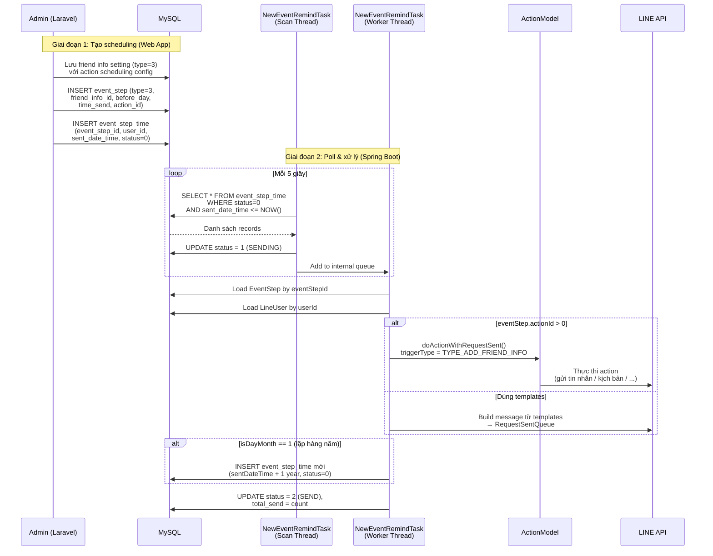

# [FA-015] Quản lý thông tin bạn bè — Job Spec

## Tổng quan

- **Tính năng**: FA-015 — Quản lý thông tin bạn bè (「友だち情報管理」)
- **Lý do cần background job**: Khi Admin cấu hình action scheduling cho thông tin bạn bè kiểu 年月日 (ngày tháng), hệ thống cần gửi action (tin nhắn, kịch bản, v.v.) tự động vào thời điểm đã lên lịch cho từng LINE user. Việc gửi này không thể thực hiện đồng bộ tại thời điểm lưu setting mà cần background job poll định kỳ.
- **Kiểu giao tiếp**: Database Polling — Laravel web app INSERT records vào queue tables, Spring Boot poll và xử lý
- **Feature Flags**: `ENABLE_EVENT_REMIND` (mặc định: `false`, cấu hình trong `config.properties`)
- **Mức độ tin cậy tổng thể**: **Cao** (đọc trực tiếp từ source code)

---

## 1. Queue Tables

### 1.1. `event_step` — Cấu hình step scheduling

- **Entity JPA**: `EventStep`
- **File**: `src/job/linect-service/src/main/java/sns/line/models/linedb/entities/EventStep.java`
- **Repository**: `EventStepRepository`
- **File**: `src/job/linect-service/src/main/java/sns/line/models/linedb/repository/EventStepRepository.java`

**Vai trò**: Lưu cấu hình action scheduling — mỗi record mô tả 1 action cần thực thi (gửi trước/sau bao nhiêu ngày, lúc mấy giờ, action nào).

**Các cột quan trọng (cho friend info type = 3):**

| Cột | Kiểu | Mô tả |
|-----|------|-------|
| `id` | long, PK | ID tự tăng |
| `event_id` | long | ID sự kiện cha (= 0 khi tạo từ friend info) |
| `bot_id` | long | ID bot (LINE OA) |
| `type` | int | Loại event step. **type = 3** = `EVENT_FRIEND_INFO` |
| `friend_info_id` | String | ID friend info setting (số hoặc `"d_4"` cho birthday mặc định) |
| `before_day` | int | Số ngày trước/sau ngày mốc |
| `time_send` | String | Giờ gửi (format `HH:mm`) |
| `is_after_day` | int | 0 = gửi trước ngày mốc, 1 = gửi sau ngày mốc |
| `action_id` | Long | ID action cần thực thi |
| `is_action_repeat` | Integer | 0 = lặp lại hàng năm, 1 = chỉ 1 lần |
| `is_day_month` | Integer | 1 = mode 月日 (lặp lại hàng năm), 0 = không |
| `templates_id` | String | Danh sách template IDs (comma-separated), dùng khi không có action_id |

**Type constants:**

| Constant | Giá trị | Ý nghĩa |
|----------|---------|---------|
| `EVENT_FIXED_TIME` | 0 | Sự kiện lịch cố định |
| `EVENT_FLEX_TIME_1` | 1 | Sự kiện linh hoạt 1 |
| `EVENT_FLEX_TIME_2` | 2 | Sự kiện linh hoạt 2 |
| `EVENT_FRIEND_INFO` | 3 | **Friend info date action** (liên quan FA-015) |
| `EVENT_LESSON_CALENDAR` | 4 | Lịch bài học |
| `EVENT_SALON_CALENDAR` | 5 | Lịch salon |
| `EVENT_FORM_ANSWER` | 6 | Form answer |

**Mức độ tin cậy**: **Cao**

### 1.2. `event_step_time` — Lịch gửi action cụ thể

- **Entity JPA**: `EventStepTime`
- **File**: `src/job/linect-service/src/main/java/sns/line/models/linedb/entities/EventStepTime.java`
- **Repository**: `EventStepTimeRepository`
- **File**: `src/job/linect-service/src/main/java/sns/line/models/linedb/repository/EventStepTimeRepository.java`

**Vai trò**: Queue table chính — mỗi record = 1 lần gửi action cho 1 user cụ thể tại 1 thời điểm cụ thể.

**Các cột:**

| Cột | Kiểu | Mô tả |
|-----|------|-------|
| `id` | long, PK | ID tự tăng |
| `event_id` | long | ID sự kiện cha (= 0 khi tạo từ friend info) |
| `bot_id` | long | ID bot |
| `event_step_id` | long | FK → `event_step.id` |
| `event_time_id` | long | ID event time (= 0 khi tạo từ friend info) |
| `sent_date_time` | LocalDateTime | **Thời điểm gửi** — điều kiện poll chính |
| `user_id` | Long | ID LINE user nhận action |
| `status` | int | Trạng thái (state machine) |
| `total_send` | int | Số tin nhắn đã gửi thành công |
| `user_booking_id` | Long | ID booking (null cho friend info) |
| `datetime_end` | String | Thời gian kết thúc (dùng cho form answer) |

**State Machine (`status`):**

```
                    ┌──────────────────────┐
                    │                      ▼
[0] NOT_SEND_YET ──→ [1] SENDING ──→ [2] SEND (done)
                    │                      │
                    │                      ▼
                    │              [3] SEND_ERROR
                    │
                    ├──→ [4] SKIP_BOT_EXPIRED_PLAN
                    └──→ [5] SKIP_COURSE_OFF
```

| Status | Constant | Giá trị | Ý nghĩa |
|--------|----------|---------|---------|
| Chờ gửi | `STATUS_NOT_SEND_YET` | 0 | Record mới, chờ job poll |
| Đang gửi | `STATUS_SENDING` | 1 | Job đã nhận, đang xử lý |
| Đã gửi | `STATUS_SEND` | 2 | Hoàn thành |
| Lỗi | `STATUS_SEND_ERROR` | 3 | Xử lý thất bại |
| Bỏ qua (hết plan) | `STATUS_SKIP_BOT_EXPIRED_PLAN` | 4 | Bot hết hạn > 7 ngày |
| Bỏ qua (course off) | `STATUS_SKIP_COURSE_OFF` | 5 | Course đã tắt (dùng cho calendar) |

**Điều kiện poll**: `status = 0 (NOT_SEND_YET) AND sent_date_time <= NOW()`

**Tần suất poll**: Mỗi 5 giây (nếu queue rỗng, sleep 5s rồi poll lại)

**Mức độ tin cậy**: **Cao**

---

## 2. Task Managers

### 2.1. NewEventRemindTask (ACTIVE — code đang chạy)

- **File**: `src/job/linect-service/src/main/java/sns/line/threads/event_remind/NewEventRemindTask.java`
- **Feature Flag**: `ConfigFile.ENABLE_EVENT_REMIND`
- **Khởi tạo bởi**: `AppMain.run()` (dòng 327-328)
- **Thread Pool**: `FixedThreadPool(MAX_REMIND_THREAD + 1)` — mặc định 21 threads (1 scan + 20 worker)
- **Cấu hình**: `MAX_REMIND_THREAD` = 20 (configurable qua `config.properties`)

**Kiến trúc 2 loại thread:**

1. **Scan Thread** (1 thread): Poll `event_step_time` liên tục, đưa records vào internal queue
2. **Worker Threads** (N threads): Lấy từ internal queue, xử lý từng `EventStepTime`

**Polling Logic (Scan Thread):**
```
RESUME: Load tất cả records status = SENDING → add vào queue (khôi phục sau restart)
LOOP:
  1. Query: findAllByStatusAndSentDateTimeLessThanEqual(STATUS_NOT_SEND_YET, NOW)
  2. Nếu rỗng → sleep 5000ms
  3. Nếu có records:
     - Update status → SENDING
     - Add vào LinkedList queue (synchronized)
  4. Catch exception → sleep 10000ms
```

**Worker Logic:**
```
LOOP:
  1. Poll từ LinkedList queue (synchronized)
  2. Nếu null → sleep 500ms
  3. Nếu có → startEventStepTime(eventStepTime)
```

**Mức độ tin cậy**: **Cao**

### 2.2. BotTaskManager + EventBotTask (DEPRECATED — code bị comment out)

- **File**: `src/job/linect-service/src/main/java/sns/line/task/BotTaskManager.java`
- **File**: `src/job/linect-service/src/main/java/sns/line/task/EventBotTask.java`
- **Feature Flag**: `ConfigFile.ENABLE_EVENT` (mặc định: `false`)

**Trạng thái**: Gần toàn bộ code xử lý `event_step_time` trong `BotTaskManager` và `EventBotTask` đã bị **comment out**. `BotTaskManager.startTask()` hiện chỉ chạy polling cho `ActionScheduleBotTask` (bảng `action_schedules`), phần `EventBotTask` không còn hoạt động.

`NewEventRemindTask` đã thay thế hoàn toàn `EventBotTask` với kiến trúc tốt hơn (producer-consumer pattern thay vì per-bot polling).

**Mức độ tin cậy**: **Cao**

---

## 3. Processing Chain

### 3.1. Luồng chính: NewEventRemindTask → startEventStepTime()

```
NewEventRemindTask.startJobScan()
  │ Poll event_step_time WHERE status=0 AND sent_date_time <= NOW
  │ Update status → 1 (SENDING)
  │ Add to LinkedList queue
  ▼
NewEventRemindTask.startJobRun() [worker threads]
  │ Poll from queue
  ▼
startEventStepTime(eventStepTime)
  │
  ├── Load Bot → kiểm tra hết hạn → skip nếu expired > 7 ngày
  │
  ├── Load EventStep by eventStepId
  │   └── Nếu null → mark SEND, return
  │
  ├── Xác định loại event step:
  │   ├── type = 0 (FIXED_TIME): load users by eventTimeId
  │   ├── type = 3 (FRIEND_INFO): load single user by userId ← LIÊN QUAN FA-015
  │   ├── type = 4 (LESSON_CALENDAR): load user by booking
  │   ├── type = 5 (SALON_CALENDAR): load user by booking
  │   ├── type = 6 (FORM_ANSWER): load single user + filter check
  │   └── type > 0 (catch-all): load single user by userId
  │
  ├── Nếu lineUsers rỗng → mark SEND (total=0), return
  │
  ├── [type = 3, FRIEND_INFO] Logic đặc biệt:
  │   ├── Kiểm tra isDayMonth == 1 → clone record cho năm sau
  │   ├── Nếu có actionId > 0:
  │   │   └── ActionModel.doActionWithRequestSent() với startActionInfo = TYPE_ADD_FRIEND_INFO
  │   └── Nếu không có actionId (dùng templates):
  │       └── Build message từ templateList → RequestSentQueue
  │
  └── sendDone(): mark status = SEND, update totalSend
```

### 3.2. Xử lý cho Friend Info type = 3 (chi tiết)

Khi `eventStep.type == 3` (EVENT_FRIEND_INFO):

1. **Load user**: Lấy `lineUser` từ `eventStepTime.userId` (1 user duy nhất cho mỗi record)
2. **Filter V2**: Kiểm tra `LineUserModel.isValidFilterV2(FILTER_TYPE_EVENT_STEP, ...)` — bỏ qua user nếu không pass filter
3. **Clone cho năm sau**: Nếu `eventStep.isDayMonth == 1` (lặp hàng năm) → tạo bản sao `EventStepTime` với `sentDateTime + 1 year`, status = NOT_SEND_YET
4. **Thực thi action**:
   - Nếu `eventStep.actionId > 0` → gọi `ActionModel.doActionWithRequestSent()` với `StartActionInfo(TYPE_ADD_FRIEND_INFO, friendInfoId)`
   - Nếu `eventStep.actionId == null/0` → build message từ `eventStep.templatesId` → push vào `RequestSentQueue`
5. **Hoàn thành**: Update `status = 2 (SEND)`, `total_send = sendCount`

**Mức độ tin cậy**: **Cao**

---

## 4. Services & Helpers

### 4.1. EventModel — Tạo/cập nhật event scheduling

- **File**: `src/job/linect-service/src/main/java/sns/line/models/EventModel.java`
- **Vai trò**: Logic tạo và cập nhật `event_step` + `event_step_time` khi giá trị friend info kiểu date thay đổi

#### settingActionFriendInfoDate(botId, friendInfoId, lineUserId, dateNow)

**Input:**
| Tham số | Kiểu | Mô tả |
|---------|------|-------|
| `botId` | long | ID bot |
| `friendInfoId` | String | ID friend info setting (số hoặc `"d_4"` cho birthday) |
| `lineUserId` | long | ID LINE user |
| `dateNow` | String | Giá trị ngày (format `yyyy-MM-dd`), null = xoá tất cả scheduling |

**Logic chính:**

1. Nếu `dateNow == null`: Xoá tất cả `event_step_time` của user cho friend info này
2. Nếu `dateNow != null`:
   a. Load setting value (từ `ActionInfoFriendDefault` nếu `friendInfoId == "d_4"`, hoặc từ `FriendInfoSetting`)
   b. Parse JSON `setting_value` → `SettingValueInfoFriendDefault`
   c. Cho mỗi `settingAction` trong `settingActions`:
      - Tính `dateCustom`:
        - `optionCompare2 == 1` (trước): `dateNow - N ngày`
        - `optionCompare2 == 2` (sau): `dateNow + N ngày`
      - Nếu `optionCompare1 == 1` (月日 mode, lặp hàng năm): điều chỉnh năm
      - Tính `localDateTimeSend` = `dateCustom` + `HH:mm`
      - Tìm `EventStep` matching (botId, type=3, friendInfoId, beforeDay, timeSend, isAfterDay, actionId)
      - Nếu tìm thấy EventStep:
        - Tìm `EventStepTime` (eventStepId, userId, status=0)
        - Nếu có → update `sentDateTime`
        - Nếu không có và thời gian tương lai → insert mới
        - Nếu thời gian đã qua + 月日 mode → `+1 year` rồi insert
      - Nếu không tìm thấy EventStep → tạo `EventStep` mới + insert `EventStepTime`

**Bảng đọc**: `action_info_friend_default`, `friend_information_setting`, `event_step`, `event_step_time`
**Bảng ghi**: `event_step`, `event_step_time`

**Mức độ tin cậy**: **Cao**

#### csvSettingActionFriendInfoDate(botId, friendInfoId, lineUserId, dateNow, hasAction, caseAction)

**Vai trò**: Wrapper cho CSV import — gọi `settingActionFriendInfoDate` nếu `hasAction == true`, hoặc xoá scheduling nếu giá trị thay đổi.

**Mức độ tin cậy**: **Cao**

### 4.2. ActionModel.doActionWithRequestSent()

- **File**: `src/job/linect-service/src/main/java/sns/line/models/ActionModel.java`
- **Vai trò**: Thực thi action cho user — có thể gửi tin nhắn LINE, thêm tag, gán kịch bản, thay đổi richmenu, v.v.
- **Trigger type**: `TriggerStartActionConstants.TYPE_ADD_FRIEND_INFO` (= 6004) — đánh dấu action được trigger từ friend info date

**Mức độ tin cậy**: **Cao**

### 4.3. RequestSentQueue

- **File**: `src/job/linect-service/src/main/java/sns/line/helper/RequestSentQueue.java`
- **Vai trò**: Internal queue gửi tin nhắn LINE — nhận request, gửi qua LINE Messaging API
- **Sử dụng khi**: `eventStep` không có `actionId`, chỉ có `templatesId` → build message → push vào queue

**Mức độ tin cậy**: **Cao**

### 4.4. BotLineUserModel — Trigger từ landing page / webhook

- **File**: `src/job/linect-service/src/main/java/sns/line/models/BotLineUserModel.java`
- **Vai trò**: Khi giá trị friend info kiểu date được cập nhật từ landing page hoặc webhook (form, postback), gọi `EventModel.settingActionFriendInfoDate()` để tạo/cập nhật scheduling

**Các điểm gọi:**
1. `setFriendInfoByLanding()` — cập nhật từ landing page: nếu type = calendar → gọi scheduling
2. Default field `-4` (birthday): khi thay đổi → gọi scheduling cho `"d_4"`

**Mức độ tin cậy**: **Cao**

---

## 5. External API Calls

### LINE Messaging API

- **Điểm gọi**: Qua `RequestSentQueue.pushRequestToQueue()` → gửi tin nhắn LINE
- **Khi nào gọi**: Khi `eventStep` chứa `templatesId` (không phải actionId)
- **Giới hạn**: Kiểm tra `BotModel.getAvailableSendCount()` trước khi gửi — đếm quota tin nhắn còn lại

**Mức độ tin cậy**: **Cao**

---

## 6. Data Flow



---

## 7. Error Handling

| Tình huống | Xử lý | Mức độ tin cậy |
|------------|--------|----------------|
| Bot hết hạn > 7 ngày | Set status = `SKIP_BOT_EXPIRED_PLAN` (4), bỏ qua | **Cao** |
| EventStep null (đã bị xoá) | Set status = `SEND` (2), total_send = 0, bỏ qua | **Cao** |
| Không tìm thấy LINE user | Set status = `SEND` (2), total_send = 0, bỏ qua | **Cao** |
| User không pass Filter V2 | Bỏ qua user, tiếp tục user khác | **Cao** |
| Exception khi xử lý | Set status = `SEND_ERROR` (3), log error, gửi thông báo qua Chatwork | **Cao** |
| Scan thread exception | Log error, sleep 10s rồi tiếp tục loop | **Cao** |
| Resume sau restart | Load tất cả records status = `SENDING` (1), add lại vào queue để xử lý tiếp | **Cao** |
| Exception trong EventModel | Log error, gửi Chatwork notification (kèm botId, friendInfoId, lineUserId) | **Cao** |

---

## 8. Liên kết với Web App

### Luồng từ Web → Queue → Job → Kết quả

| Hành động trên Web | Queue Table | Task Manager | Kết quả |
|---------------------|-------------|--------------|---------|
| Admin lưu friend info setting kiểu 年月日 với action scheduling | Laravel tạo `event_step` (type=3) + `event_step_time` cho mỗi user có date value | `NewEventRemindTask` poll `event_step_time` | Thực thi action hoặc gửi tin nhắn LINE cho user khi đến thời điểm |
| User cập nhật giá trị date qua postback/form | `HandlePostbackTask` → `EventModel.settingActionFriendInfoDate()` → insert/update `event_step_time` | `NewEventRemindTask` | Cập nhật lịch gửi mới |
| User cập nhật giá trị date qua landing page | `BotLineUserModel.setFriendInfoByLanding()` → `EventModel.settingActionFriendInfoDate()` | `NewEventRemindTask` | Cập nhật lịch gửi mới |
| CSV import giá trị date | `HandleImportCsvTask` → `EventModel.csvSettingActionFriendInfoDate()` | `NewEventRemindTask` | Tạo scheduling cho users từ CSV |
| Admin xoá friend info value | `ActionModel` → `EventModel.settingActionFriendInfoDate(date=null)` → xoá `event_step_time` | Không còn record để poll | Huỷ scheduling |
| Admin xoá friend info setting | Laravel xoá `event_step` + `event_step_time` liên quan | Không còn record để poll | Huỷ tất cả scheduling |

### Các trigger point trong Spring Boot gọi settingActionFriendInfoDate():

| File | Ngữ cảnh | Mức độ tin cậy |
|------|----------|----------------|
| `HandlePostbackTask.java` (dòng ~3534, 3537) | Postback xử lý friend info date (-4 birthday) | **Cao** |
| `ActionModel.java` (dòng ~445, 448, 498, 589) | Action thay đổi friend info value (type=3 hoặc birthday) | **Cao** |
| `BotLineUserModel.java` (dòng ~166, 232) | Landing page / webhook cập nhật friend info date | **Cao** |
| `HandleImportCsvTask.java` (qua csvSettingActionFriendInfoDate) | CSV import friend info date values | **Cao** |

---

## 9. Cấu hình

| Property | Giá trị mặc định | Mô tả |
|----------|-------------------|-------|
| `ENABLE_EVENT_REMIND` | `0` (false) | Bật/tắt NewEventRemindTask |
| `ENABLE_EVENT` | `0` (false) | Bật/tắt BotTaskManager (deprecated cho event) |
| `MAX_REMIND_THREAD` | `20` | Số worker threads xử lý event_step_time |

**File cấu hình**: `src/job/linect-service/src/main/java/sns/line/ConfigFile.java`

---

## 10. Tóm tắt các file Java liên quan

| File | Vai trò |
|------|---------|
| `task/BotTaskManager.java` | Task manager cho ActionSchedule (event phần cũ đã deprecated) |
| `task/EventBotTask.java` | Xử lý event per-bot (DEPRECATED — code comment out) |
| `threads/event_remind/NewEventRemindTask.java` | **ACTIVE** — Poll + xử lý event_step_time (producer-consumer pattern) |
| `models/EventModel.java` | Logic tạo/cập nhật event scheduling cho friend info date |
| `models/ActionModel.java` | Thực thi action (gọi từ worker khi có actionId) |
| `models/BotLineUserModel.java` | Trigger scheduling từ landing page / webhook |
| `models/linedb/entities/EventStep.java` | Entity JPA cho bảng `event_step` |
| `models/linedb/entities/EventStepTime.java` | Entity JPA cho bảng `event_step_time` |
| `models/linedb/entities/FriendInfoSetting.java` | Entity JPA cho bảng `friend_information_setting` |
| `models/linedb/entities/ActionInfoFriendDefault.java` | Entity JPA cho bảng `action_info_friend_default` |
| `models/linedb/repository/EventStepRepository.java` | Repository cho `event_step` |
| `models/linedb/repository/EventStepTimeRepository.java` | Repository cho `event_step_time` |
| `models/objects/SettingValueInfoFriendDefault.java` | POJO parse JSON `setting_value` |
| `values/TriggerStartActionConstants.java` | Constants: `TYPE_ADD_FRIEND_INFO = 6004` |
| `ConfigFile.java` | Feature flags + cấu hình thread pool |
| `AppMain.java` | Entry point — khởi tạo task managers theo feature flags |
| `threads/csv/HandleImportCsvTask.java` | CSV import — trigger scheduling cho friend info date |
| `task/HandlePostbackTask.java` | Postback handler — trigger scheduling cho birthday |
