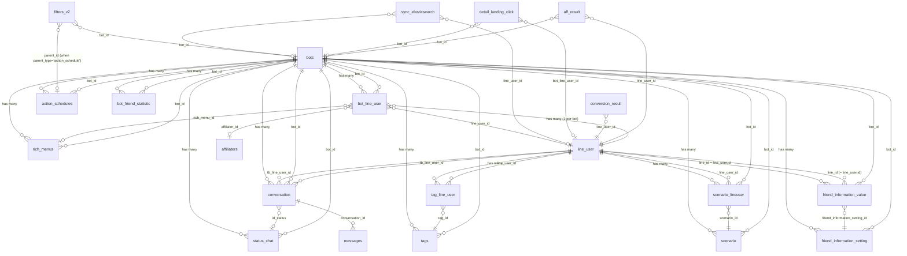

# FA-013 Danh sách bạn bè「友だちリスト」 — DB Mapping

> **Feature ID:** FA-013
> **Portal:** Admin
> **Ngày tạo:** 2026-03-25
> **Nguồn dữ liệu:** DB schema (`db/schema/tables/`), logic-spec.md, api-spec.md, job-spec.md, db-hint.md

---

## 1. Primary Tables

Các bảng trực tiếp liên quan — được Eloquent Models trong controller tham chiếu.

| # | Bảng | Model Eloquent | Vai trò | Tin cậy |
|---|------|---------------|---------|---------|
| 1 | `bot_line_user` | `BotLineUser` | Bảng pivot chính: liên kết LINE user ↔ Bot. Chứa `followed_at`, `is_blocked`, `rich_menu_id`, `memo`, `phone_number`, `is_tester` | Cao |
| 2 | `line_user` | `LineUser` | Thông tin LINE user: `name`, `view_name`, `email`, `avatar_url`, `real_name`, `line_id` | Cao |
| 3 | `conversation` | `Conversation` | Cuộc hội thoại: `is_blocked`, `blocked_by`, `is_hide`, `datetime_hide`, `last_message`, `last_time_message`, `id_status`, `status_last_message`, `memo` | Cao |
| 4 | `tag_line_user` | `tagLineUser` | Pivot tag ↔ user | Cao |
| 5 | `tags` | `Tags` | Định nghĩa tags, `count_user_tag` counter cache | Cao |
| 6 | `scenario_lineuser` | `ScenarioLineuser` | Subscription user ↔ scenario step, `is_following` (0/1/2) | Cao |
| 7 | `friend_information_setting` | `FriendInformationSetting` | Định nghĩa custom fields (tên, kiểu, options) | Cao |
| 8 | `friend_information_value` | `FriendInformationValue` | Giá trị custom fields per user | Cao |

---

## 2. Secondary Tables

Các bảng liên quan gián tiếp — dùng cho filter, action, job, thống kê.

| # | Bảng | Vai trò | Tin cậy |
|---|------|---------|---------|
| 9 | `scenario` | Định nghĩa step scenario, counter caches (`count_follow`, `count_stop`, `count_unfinish`) | Cao |
| 10 | `bots` | Thông tin LINE OA bot, `count_user_unconfirm`, `count_app_notify` | Cao |
| 11 | `rich_menus` | Định nghĩa rich menus, `status_rich`, `status_line`, `count_user_rich` | Cao |
| 12 | `status_chat` | Trạng thái chat tuỳ chỉnh, `count` counter | Cao |
| 13 | `filters_v2` | Lưu filter conditions cho ActionSchedule (bulk action > 200 users) | Cao |
| 14 | `action_schedules` | Queue bảng cho bulk action background job | Cao |
| 15 | `sync_elasticsearch` | Queue bảng đồng bộ Elasticsearch | Cao |
| 16 | `messages` | Tin nhắn chat, dùng để lấy `last_message` | Cao |
| 17 | `conversion_result` | Kết quả conversion, dùng cho filter | Cao |
| 18 | `detail_landing_click` | QR code/landing click, dùng cho filter | Cao |
| 19 | `aff_result` | Kết quả affiliator, dùng cho filter | Cao |
| 20 | `bot_friend_statistic` | Thống kê follow/unfollow theo ngày, cập nhật khi delete user | Cao |
| 21 | `scenario_step_time` | Scheduled step deliveries, bị xoá khi block/delete user | Trung bình |
| 22 | `action_schedule_history` | Lịch sử chạy action schedule | Cao |
| 23 | `action_schedules_line_users` | Log từng user đã xử lý trong bulk action | Cao |

---

## 3. Entity Details

### 3.1 `bot_line_user` — Pivot LINE user ↔ Bot

| Cột | Kiểu | Nullable | Default | Key | Mô tả |
|-----|------|----------|---------|-----|-------|
| `id` | int(11) | NO | — | PK | Auto-increment |
| `line_user_id` | int(11) | NO | — | FK → `line_user.id` | ID user LINE |
| `bot_id` | int(11) | NO | — | FK → `bots.id` | ID bot LINE OA |
| `affiliater_id` | int(11) | YES | NULL | FK → `affiliaters.id` | Affiliator giới thiệu |
| `rich_menu_id` | int(11) | YES | NULL | FK → `rich_menus.id` | Rich menu đang hiển thị |
| `followed_at` | timestamp | YES | NULL | — | Ngày thêm bạn bè (kết bạn) |
| `is_blocked` | int(11) | YES | 0 | — | 0 = bình thường, 1 = bị block |
| `status` | int(11) | YES | 0 | — | Trạng thái (chưa rõ mục đích) |
| `memo` | text | YES | NULL | — | Ghi chú của Admin |
| `phone_number` | varchar(25) | YES | NULL | — | Số điện thoại (format +81xxx) |
| `is_tester` | tinyint(1) | NO | 0 | — | 0 = user thường, 1 = tester |
| `is_friend` | int(11) | NO | 0 | — | Flag bạn bè |
| `u_code` | varchar(50) | YES | NULL | — | Mã user unique |
| `contact_status` | int(11) | NO | 0 | — | 0=chưa đăng ký, 1=đăng ký, 2=hợp đồng, 3=hủy |
| `register_service_date` | datetime | YES | NULL | — | Ngày đăng ký dịch vụ |
| `register_contact_date` | datetime | YES | NULL | — | Ngày đăng ký liên hệ |
| `cancel_contact_date` | datetime | YES | NULL | — | Ngày hủy liên hệ |
| `paypal_product_id` | varchar(255) | YES | NULL | — | PayPal product ID |
| `paypal_plan_id` | varchar(255) | YES | NULL | — | PayPal plan ID |
| `paypal_subcription_id` | varchar(255) | YES | NULL | — | PayPal subscription ID |
| `paypal_error_message` | varchar(255) | YES | NULL | — | Lỗi PayPal |
| `time_unlink_rich_menu` | bigint(20) | YES | 0 | — | Timestamp unlink rich menu |
| `action_count` | int(11) | NO | 0 | — | Đếm số action |
| `updated_at` | timestamp | YES | NULL | — | Thời gian cập nhật |
| `created_at` | timestamp | NO | CURRENT_TIMESTAMP | — | Thời gian tạo |
| `is_quick_reply` | tinyint(4) | YES | NULL | — | Flag quick reply |

**Sample data:**
```
(80, line_user_id=42, bot_id=35, affiliater_id=NULL, rich_menu_id=NULL, followed_at='2018-10-10 07:02:10', is_blocked=1, memo=NULL, is_tester=0)
(81, line_user_id=31, bot_id=35, affiliater_id=NULL, rich_menu_id=NULL, followed_at='2018-10-10 04:59:23', is_blocked=0, memo=NULL, is_tester=0)
```

---

### 3.2 `line_user` — Thông tin LINE user

| Cột | Kiểu | Nullable | Default | Key | Mô tả |
|-----|------|----------|---------|-----|-------|
| `id` | int(12) | NO | — | PK | Auto-increment |
| `line_id` | varchar(128) | NO | — | UNIQUE | LINE user ID (Uxxxxx) |
| `name` | varchar(128) | YES | NULL | — | Tên hiển thị LINE (đồng bộ từ LINE API) |
| `real_name` | varchar(128) | YES | NULL | — | Tên thật (Admin nhập) |
| `status_message` | text | YES | NULL | — | Status message LINE |
| `avatar_url` | varchar(256) | YES | NULL | — | URL ảnh đại diện |
| `view_name` | varchar(128) | YES | NULL | — | Tên hiển thị hệ thống (Admin tự đặt) |
| `add_friend_url` | varchar(250) | YES | NULL | — | URL thêm bạn |
| `phone_number` | varchar(15) | YES | NULL | — | Số điện thoại |
| `email` | varchar(100) | YES | NULL | — | Email |
| `birthday` | date | YES | NULL | — | Ngày sinh |
| `age` | int(11) | YES | NULL | — | Tuổi |
| `province` | varchar(255) | YES | NULL | — | Tỉnh/thành |
| `action_count` | int(11) | YES | 0 | — | Đếm action |
| `created_at` | datetime | NO | CURRENT_TIMESTAMP | — | Thời gian tạo |
| `updated_at` | datetime | YES | CURRENT_TIMESTAMP | — | Thời gian cập nhật |
| `action` | int(11) | YES | NULL | — | (chưa rõ mục đích) |
| `type` | tinyint(4) | NO | 0 | — | 0=line user, 1=group chat, 2=member in group |

**Sample data:**
```
(5, line_id='U6975f86527fa40c634a6ba138ecc3985', name='サポート　WSS 🌸\', view_name=NULL, email=NULL, phone_number=NULL, type=0)
```

---

### 3.3 `conversation` — Cuộc hội thoại

| Cột | Kiểu | Nullable | Default | Key | Mô tả |
|-----|------|----------|---------|-----|-------|
| `id` | int(11) | NO | — | PK | Auto-increment |
| `conversation_name` | varchar(255) | NO | — | — | Tên conversation |
| `bot_id` | int(11) | NO | — | FK → `bots.id` | ID bot |
| `line_id` | varchar(255) | NO | — | — | line_user.id dạng string |
| `tb_line_user_id` | int(11) | YES | NULL | FK → `line_user.id` | FK đến line_user |
| `conversation_kind` | int(11) | YES | 0 | — | 0=1:1, 1=group |
| `last_message` | text | YES | NULL | — | Nội dung tin nhắn cuối |
| `last_time_message` | timestamp | YES | NULL | — | Thời gian tin nhắn cuối |
| `confirm_count` | int(11) | YES | 0 | — | Đếm xác nhận |
| `status_last_message` | int(11) | YES | 1 | — | Trạng thái tin nhắn cuối (0=chưa xác nhận, 1=đã xác nhận) |
| `has_status_0..9` | int(11) | YES | 0 | — | Flags trạng thái tin nhắn |
| `is_blocked` | int(11) | NO | — | — | 0=bình thường, 1=bị block |
| `created_at` | timestamp | NO | CURRENT_TIMESTAMP | — | Thời gian tạo |
| `updated_at` | timestamp | YES | NULL | — | Thời gian cập nhật |
| `blocked_by` | tinyint(4) | NO | 0 | — | 0=user block, 1=admin block |
| `is_bookmark` | int(11) | NO | 0 | — | Flag bookmark |
| `id_status` | int(11) | YES | NULL | FK → `status_chat.id` | Trạng thái chat tuỳ chỉnh |
| `is_old_friend` | tinyint(4) | NO | 0 | — | 0=bạn mới, 1=bạn cũ |
| `is_hide` | tinyint(4) | NO | 0 | — | 0=hiện, 1=ẩn |
| `datetime_hide` | datetime | YES | NULL | — | Thời gian ẩn |
| `memo` | varchar(256) | YES | NULL | — | Ghi chú |
| `blocked_at` | datetime | YES | NULL | — | Thời gian block |

**Sample data:**
```
(130, bot_id=35, line_id='31', tb_line_user_id=31, conversation_kind=0, is_blocked=0, blocked_by=1, is_hide=0)
```

---

### 3.4 `tag_line_user` — Pivot tag ↔ user

| Cột | Kiểu | Nullable | Default | Key | Mô tả |
|-----|------|----------|---------|-----|-------|
| `id` | int(12) | NO | — | PK | Auto-increment |
| `line_user_id` | int(12) | YES | NULL | FK → `line_user.id` | ID user |
| `tag_id` | int(12) | YES | NULL | FK → `tags.id` | ID tag |
| `is_deleted` | tinyint(1) | YES | NULL | — | Soft delete flag |
| `created_at` | datetime | NO | — | — | Thời gian tạo |
| `updated_at` | datetime | YES | NULL | — | Thời gian cập nhật |

---

### 3.5 `tags` — Định nghĩa tags

| Cột | Kiểu | Nullable | Default | Key | Mô tả |
|-----|------|----------|---------|-----|-------|
| `id` | int(12) | NO | — | PK | Auto-increment |
| `bot_id` | int(12) | YES | NULL | FK → `bots.id` | ID bot |
| `name` | varchar(255) | NO | — | — | Tên tag |
| `category_id` | int(12) | NO | — | FK → `category.id` | ID category |
| `rich_menu_id` | int(11) | YES | NULL | — | Rich menu gắn tag |
| `position` | int(12) | NO | — | — | Thứ tự |
| `scenario_id` | int(12) | YES | NULL | — | Scenario trigger khi gán tag |
| `action_id` | int(11) | YES | NULL | — | Action trigger |
| `count_user_tag` | int(11) | YES | 0 | — | Counter cache — số user có tag này |
| `deleted_at` | timestamp | YES | NULL | — | Soft delete |
| `created_at` | datetime | NO | — | — | Thời gian tạo |
| `updated_at` | datetime | YES | CURRENT_TIMESTAMP | — | Thời gian cập nhật |

*(Bỏ qua các cột ít liên quan: `add_template_id`, `scenario_day`, `scenario_time`, `is_2th_apply`, `max_users_number`, `ins_*`, `action_mode`, `is_limit`, `limit`, `limit_action_id`, `limit_action_mode`, `user_id_del`)*

---

### 3.6 `scenario_lineuser` — Subscription user ↔ scenario

| Cột | Kiểu | Nullable | Default | Key | Mô tả |
|-----|------|----------|---------|-----|-------|
| `id` | int(12) | NO | — | PK | Auto-increment |
| `bot_id` | int(12) | NO | — | FK → `bots.id` | ID bot |
| `scenario_id` | int(12) | NO | — | FK → `scenario.id` | ID scenario |
| `line_user_id` | int(12) | NO | — | FK → `line_user.id` | ID user |
| `is_following` | int(12) | YES | NULL | — | 0=chưa hoàn thành, 1=đang follow, 2=đã dừng |
| `start_day` | int(12) | YES | NULL | — | Ngày bắt đầu (offset) |
| `start_time` | time | YES | NULL | — | Giờ bắt đầu |
| `start_datetime` | datetime | YES | NULL | — | Thời điểm bắt đầu |
| `stop_datetime` | datetime | YES | NULL | — | Thời điểm dừng |
| `is_deleted` | tinyint(1) | YES | 0 | — | Soft delete |
| `created_at` | timestamp | NO | CURRENT_TIMESTAMP | — | Thời gian tạo |
| `updated_at` | timestamp | YES | NULL | — | Thời gian cập nhật |

*(Bỏ qua cột ít liên quan: `sent_start_day`, `sent_start_time`, `delay_time`, `last_time_send_delay_2`)*

---

### 3.7 `friend_information_setting` — Custom field definitions

| Cột | Kiểu | Nullable | Default | Key | Mô tả |
|-----|------|----------|---------|-----|-------|
| `id` | int(10) UNSIGNED | NO | — | PK | Auto-increment |
| `bot_id` | int(11) | NO | — | FK → `bots.id` | ID bot |
| `order` | int(11) | NO | 0 | — | Thứ tự hiển thị |
| `title` | varchar(255) | NO | — | — | Tên field (hiển thị trên UI) |
| `group_id` | int(11) | NO | 0 | — | Nhóm field |
| `type_data` | int(11) | NO | — | — | Kiểu dữ liệu (xem enum bên dưới) |
| `default_value` | varchar(500) | YES | NULL | — | Giá trị mặc định |
| `setting_value` | text | YES | NULL | — | JSON config (options cho select, action settings...) |
| `total_user_has_value` | int(11) | NO | 0 | — | Counter cache — số user có giá trị |
| `calendar_id` | bigint(20) | YES | NULL | — | Liên kết calendar |
| `calendar_salon_id` | bigint(20) | YES | NULL | — | Liên kết salon calendar |
| `form_answer_detail_id` | bigint(20) | YES | NULL | — | Liên kết form answer |
| `created_at` | timestamp | NO | CURRENT_TIMESTAMP | — | Thời gian tạo |
| `updated_at` | timestamp | NO | CURRENT_TIMESTAMP | — | Thời gian cập nhật |

**Enum `type_data`:**

| Giá trị | Tên | Mô tả |
|---------|-----|-------|
| 1 | select | Lựa chọn (options trong `setting_value` JSON) |
| 2 | input | Text nhập tự do |
| 3 | calendar | Ngày tháng (date picker) |
| 4 | image | Ảnh (upload) |
| 5 | file | File đính kèm |
| 6 | point | Điểm số (số nguyên) |

**Tin cậy:** Cao — COMMENT trong schema + sample data khớp.

---

### 3.8 `friend_information_value` — Custom field values

| Cột | Kiểu | Nullable | Default | Key | Mô tả |
|-----|------|----------|---------|-----|-------|
| `id` | int(10) UNSIGNED | NO | — | PK | Auto-increment |
| `bot_id` | int(11) | NO | — | FK → `bots.id` | ID bot |
| `friend_information_setting_id` | int(11) | NO | — | FK → `friend_information_setting.id` | Field definition |
| `line_id` | int(11) | NO | — | FK → `line_user.id` | ID user (tên cột gây nhầm — thực tế chứa `line_user.id`, không phải LINE ID string) |
| `value` | varchar(500) | YES | NULL | — | Giá trị field |
| `action` | int(4) | YES | NULL | — | (chưa rõ mục đích) |
| `created_at` | timestamp | NO | CURRENT_TIMESTAMP | — | Thời gian tạo |
| `updated_at` | timestamp | NO | CURRENT_TIMESTAMP | — | Thời gian cập nhật |
| `friend_info_option_id` | int(11) | YES | NULL | — | ID option (cho select type) |

---

### 3.9 `filters_v2` — Filter conditions

| Cột | Kiểu | Nullable | Default | Key | Mô tả |
|-----|------|----------|---------|-----|-------|
| `id` | int(10) UNSIGNED | NO | — | PK | Auto-increment |
| `bot_id` | int(11) | YES | NULL | FK → `bots.id` | ID bot |
| `parent_type` | varchar(255) | YES | NULL | — | Loại parent: `'action_schedule'`, `'broadcast'`, v.v. |
| `parent_id` | int(11) | YES | NULL | — | FK đến parent record |
| `operator` | varchar(100) | YES | NULL | — | `'and'` hoặc `'or'` |
| `type` | varchar(255) | YES | NULL | — | Loại filter: `tag`, `friend_name`, `day_add_friend`, `scenario`, `conversion`, `qr_code`, `friend_info`, `status_search`, `affiliater`, `new_old_friend`, `richmenu` |
| `data` | text | YES | NULL | — | JSON data cho filter condition |
| `text_preview` | text | YES | NULL | — | Text preview hiển thị |
| `created_at` | timestamp | NO | CURRENT_TIMESTAMP | — | Thời gian tạo |
| `updated_at` | timestamp | NO | CURRENT_TIMESTAMP | — | Thời gian cập nhật |
| `rich_menu_item_id` | int(11) | YES | NULL | — | (rich menu liên quan) |
| `rich_menu_redirect_id` | int(11) | YES | NULL | — | (rich menu redirect) |

---

### 3.10 `action_schedules` — Queue bulk action

| Cột | Kiểu | Nullable | Default | Key | Mô tả |
|-----|------|----------|---------|-----|-------|
| `id` | int(10) UNSIGNED | NO | — | PK | Auto-increment |
| `name` | varchar(255) | NO | — | — | Tên schedule. Friend list: 「【自動生成】友だち一括アクション」 |
| `action_id` | int(10) UNSIGNED | YES | NULL | FK → `actions.id` | ID action cần thực hiện |
| `bot_id` | int(10) UNSIGNED | NO | — | FK → `bots.id` | ID bot |
| `next_running_day` | datetime | NO | — | — | Thời gian chạy tiếp theo |
| `status` | tinyint(4) | NO | — | — | 0=chờ/running, 1=đang gửi, 2=kết thúc |
| `end_date_type` | varchar(255) | NO | — | — | `'unlimited'`, `'day_limit'`, `'times'` |
| `repeat_type` | varchar(255) | NO | — | — | `'day'`, `'week'`, `'month'` |
| `number_of_repetitions` | tinyint(4) | YES | NULL | — | Số lần lặp tối đa |
| `filter_ids` | text | YES | NULL | — | CSV IDs → `filters_v2.id` |
| `action_count` | int(11) | NO | 0 | — | Số lần đã thực hiện |
| `created_at` | timestamp | YES | NULL | — | Thời gian tạo |
| `updated_at` | timestamp | YES | NULL | — | Thời gian cập nhật |

*(Bỏ qua cột ít liên quan: `category_id`, `from_id`, `profile_send`, `start_date`, `start_time`, `end_date`, `day_add`, `number_week_to_repeat`, `day_of_week_repeat`, `number_month_to_repeat`, `date_repeat_after_number_of_month`, `skip_date`, `position`, `number_user_filter`, `first_day_of_running`)*

---

### 3.11 `sync_elasticsearch` — Queue ES sync

| Cột | Kiểu | Nullable | Default | Key | Mô tả |
|-----|------|----------|---------|-----|-------|
| `id` | int(10) UNSIGNED | NO | — | PK | Auto-increment |
| `type` | int(11) | YES | NULL | — | Loại sync (xem enum bên dưới) |
| `line_user_id` | int(11) | YES | NULL | FK → `line_user.id` | ID user |
| `bot_id` | int(11) | YES | NULL | FK → `bots.id` | ID bot |
| `status` | int(11) | YES | 0 | — | 0=chờ, 1=đang sync, 2=thành công, 3=lỗi |
| `data_sync` | text | YES | NULL | — | JSON data cần sync |
| `time_sync_success` | varchar(255) | YES | NULL | — | Thời gian sync OK |
| `message_error` | varchar(255) | YES | NULL | — | Thông báo lỗi |
| `created_at` | timestamp | NO | CURRENT_TIMESTAMP | — | Thời gian tạo |
| `updated_at` | timestamp | NO | CURRENT_TIMESTAMP | — | Thời gian cập nhật |

**Enum `type`:**

| Giá trị | Hằng số | Mô tả |
|---------|---------|-------|
| 0 | TYPE_BOT_LINE_USER | Cập nhật bot_line_user (hide/unhide) |
| 1 | TYPE_LINE_USER | Cập nhật thông tin user (tên, avatar) |
| 2 | TYPE_CONVERSATION | Cập nhật conversation |
| 3 | TYPE_TAG | Cập nhật tag |
| 4 | TYPE_FRIEND_INFO | Cập nhật custom fields |
| 5 | TYPE_LANDING | Cập nhật landing |
| 6 | TYPE_SCENARIO | Cập nhật scenario |
| 7 | TYPE_CONVERSION | Cập nhật conversion |
| 11 | TYPE_DELETE_LINE_USER | Xoá user khỏi ES |
| 12 | TYPE_DELETE_BOT | Xoá toàn bộ bot khỏi ES |

**Tin cậy:** Cao — COMMENT trong schema + job-spec.md xác nhận.

---

### 3.12 `rich_menus` — Định nghĩa Rich Menu

| Cột | Kiểu | Nullable | Default | Key | Mô tả |
|-----|------|----------|---------|-----|-------|
| `id` | int(11) | NO | — | PK | Auto-increment |
| `bot_id` | int(11) | YES | NULL | FK → `bots.id` | ID bot |
| `rich_menu_id` | varchar(100) | YES | NULL | — | LINE API rich menu ID |
| `name` | varchar(255) | YES | NULL | — | Tên rich menu |
| `status_rich` | int(11) | NO | 1 | — | 0=inactive, 1=active |
| `status_line` | int(11) | NO | 0 | — | 0=chưa link LINE, 1=đã link |
| `count_user_rich` | int(11) | YES | 0 | — | Counter — số user đang dùng |
| `deleted_at` | timestamp | YES | NULL | — | Soft delete |
| `created_at` | datetime | YES | NULL | — | Thời gian tạo |
| `updated_at` | timestamp | NO | CURRENT_TIMESTAMP | — | Thời gian cập nhật |

*(Bỏ qua nhiều cột ít liên quan với Friend List)*

---

### 3.13 `status_chat` — Trạng thái chat tuỳ chỉnh

| Cột | Kiểu | Nullable | Default | Key | Mô tả |
|-----|------|----------|---------|-----|-------|
| `id` | int(10) UNSIGNED | NO | — | PK | Auto-increment |
| `bot_id` | int(11) | NO | — | FK → `bots.id` | ID bot |
| `position` | int(11) | NO | 0 | — | Thứ tự |
| `name_status` | varchar(255) | NO | — | — | Tên trạng thái (JP) |
| `color` | varchar(255) | NO | — | — | Mã màu |
| `bg_status` | varchar(255) | YES | NULL | — | Màu nền status |
| `bg_choose` | varchar(255) | YES | NULL | — | Màu nền khi chọn |
| `is_save` | tinyint(4) | NO | 1 | — | Flag lưu |
| `count` | int(11) | NO | 0 | — | Counter — số conversation có status này |
| `created_at` | timestamp | NO | CURRENT_TIMESTAMP | — | Thời gian tạo |
| `updated_at` | timestamp | NO | CURRENT_TIMESTAMP | — | Thời gian cập nhật |

---

### 3.14 `scenario` — Định nghĩa Step Scenario (cột liên quan)

| Cột | Kiểu | Nullable | Default | Key | Mô tả |
|-----|------|----------|---------|-----|-------|
| `id` | int(11) | NO | — | PK | Auto-increment |
| `bot_id` | int(11) | NO | — | FK → `bots.id` | ID bot |
| `name` | varchar(200) | NO | — | — | Tên scenario |
| `status` | int(11) | NO | 0 | — | Trạng thái |
| `count_follow` | int(11) | YES | 0 | — | Counter — đang follow |
| `count_stop` | int(11) | YES | 0 | — | Counter — đã dừng |
| `count_unfinish` | int(11) | NO | 0 | — | Counter — chưa hoàn thành |
| `is_deleted` | int(11) | YES | 0 | — | Soft delete |
| `created_at` | timestamp | NO | CURRENT_TIMESTAMP | — | Thời gian tạo |
| `updated_at` | timestamp | YES | NULL | — | Thời gian cập nhật |

---

### 3.15 `bot_friend_statistic` — Thống kê follow/unfollow

| Cột | Kiểu | Nullable | Default | Key | Mô tả |
|-----|------|----------|---------|-----|-------|
| `id` | int(10) UNSIGNED | NO | — | PK | Auto-increment |
| `bot_id` | int(11) | NO | — | FK → `bots.id` | ID bot |
| `count_user_followed` | int(11) | NO | 0 | — | Số user follow trong ngày |
| `count_user_unfollowed` | int(11) | NO | 0 | — | Số user unfollow trong ngày |
| `statistic_date` | datetime | NO | — | — | Ngày thống kê |
| `created_at` | timestamp | NO | CURRENT_TIMESTAMP | — | Thời gian tạo |
| `updated_at` | timestamp | NO | CURRENT_TIMESTAMP | — | Thời gian cập nhật |

---

## 4. UI ↔ DB Field Mapping

### 4.1 SCR-FRL-01: Danh sách bạn bè (trang chính)

| UI Element | Label JP | DB Table | Column | Mapping Type | Tin cậy | Ghi chú |
|-----------|----------|----------|--------|-------------|---------|---------|
| Cột ngày thêm | 「友だち追加日時」 | `bot_line_user` | `followed_at` | Direct | Cao | Timestamp → format date trên UI |
| Cột tin nhắn mới | 「最新メッセージ」 | `conversation` | `last_time_message` | Direct | Cao | Cache trên conversation, không query messages mỗi lần |
| Cột tên LINE | 「LINE登録名」 | `line_user` | `name` | Direct | Cao | Đồng bộ từ LINE API |
| Cột tên hệ thống | 「システム表示名」 | `line_user` | `view_name` | Direct | Cao | Admin tự đặt, hiển thị "-" khi NULL |
| Cột email | 「メールアドレス」 | `line_user` | `email` | Direct | Trung bình | Có thể là custom field trong `friend_information_value` thay vì `line_user.email` tuỳ cấu hình |
| Cột step status | 「ステップ配信状況」 | `scenario_lineuser` | `is_following` + `scenario.name` | Computed | Cao | is_following=2 → 「停止中」, is_following=1 → hiển thị `scenario.name` |
| Số kết quả | 「検索結果： N人」 | `bot_line_user` | COUNT(*) | Aggregated | Cao | `WHERE bot_id=? AND is_blocked=0` |
| Link chi tiết | `/basic/friendlist/my_page/{id}` | `line_user` | `id` | Direct | Cao | PK bảng `line_user` |
| Avatar | (ảnh đại diện) | `line_user` | `avatar_url` | Direct | Cao | URL ảnh từ LINE CDN |
| Search box | 「友だち名・システム表示名」 | `line_user` | `name`, `view_name`, `email` | Computed | Cao | `LIKE '%keyword%'` trên 3 cột |

### 4.2 SCR-FRL-02: Modal lọc nâng cao「絞り込み」

| UI Element | Label JP | DB Table | Column / Logic | Mapping Type | Tin cậy | Ghi chú |
|-----------|----------|----------|---------------|-------------|---------|---------|
| Filter tag | 「タグ」 | `tag_line_user` | Subquery `WHERE tag_id = ?` | FK | Cao | |
| Filter tên | 「友だち名」 | `line_user` | `name LIKE` hoặc `view_name LIKE` | Computed | Cao | |
| Filter ngày thêm | 「友だち追加日」 | `bot_line_user` | `followed_at BETWEEN` | Direct | Cao | Hỗ trợ date range và duration days |
| Filter step | 「ステップ購読状況」 | `scenario_lineuser` | Subquery `WHERE scenario_id = ? AND is_following = ?` | FK | Cao | |
| Filter QR code | 「QRコードアクション」 | `detail_landing_click` | Subquery `WHERE landing_id = ?` | FK | Cao | |
| Filter conversion | 「コンバージョン」 | `conversion_result` | Subquery `WHERE conversion_id = ?` | FK | Cao | |
| Filter xác nhận | 「確認状況」 | `conversation` | `status_last_message` hoặc `id_status` | Direct / FK | Cao | 0=未確認, 1=確認済み, hoặc custom status_chat.id |
| Filter friend info | 「友だち情報」 | `friend_information_value` | Subquery `WHERE friend_information_setting_id = ? AND value = ?` | FK | Cao | |
| Filter status chat | 「対応ステータス」 | `conversation` | `id_status` → `status_chat.id` | FK | Cao | |
| Filter affiliator | 「アフィリエイター」 | `aff_result` | Subquery `WHERE aff_id = ?` | FK | Cao | |
| Filter mới/cũ | 「新規・既存 友だち」 | `bot_line_user` | `is_new_friend` | Direct | Trung bình | Cột không thấy trong schema → có thể là `conversation.is_old_friend` (đảo ngược) |
| Filter rich menu | (trong filter) | `bot_line_user` | `rich_menu_id IN (?)` | FK | Cao | |
| Logic AND/OR | (toggle) | `filters_v2` | `operator` = `'and'` / `'or'` | Direct | Cao | Lưu khi tạo ActionSchedule |

**Ghi chú filter `new_old_friend`:** Logic-spec ghi `bot_line_user.is_new_friend` nhưng schema `bot_line_user` không có cột này. Schema `conversation` có `is_old_friend` (0=mới, 1=cũ). Có khả năng code dùng `conversation.is_old_friend` và đảo logic. **Tin cậy: Thấp** — cần kiểm tra thêm.

### 4.3 SCR-FRL-03: Chi tiết bạn bè「友だち情報詳細」

| UI Element | Label JP | DB Table | Column | Mapping Type | Tin cậy | Ghi chú |
|-----------|----------|----------|--------|-------------|---------|---------|
| Tên LINE | 「LINE名」 | `line_user` | `name` | Direct | Cao | Read-only, đồng bộ từ LINE API |
| Ngày thêm + flag | 「友だち追加日時」 | `bot_line_user` | `followed_at` | Direct | Cao | |
| Flag mới/cũ | 「既存友だち」/「新規友だち」 | `conversation` | `is_old_friend` | Enum | Cao | 0 → 「新規友だち」, 1 → 「既存友だち」 |
| Affiliator | 「紹介アフィリエイター」 | `bot_line_user` | `affiliater_id` → `affiliaters.username` | FK | Cao | NULL khi không có |
| Rich menu hiển thị | 「表示中リッチメニュー」 | `bot_line_user` | `rich_menu_id` → `rich_menus.name` | FK | Cao | |
| QR code action | 「QRコードアクション」 | `detail_landing_click` | `landing_id` → `landing.name` | FK | Trung bình | Tra cứu từ landing click history |
| Tin nhắn cuối | 「最終メッセージ受信」 | `conversation` | `last_time_message` | Direct | Cao | |
| Tên hệ thống | 「システム表示名」 | `line_user` | `view_name` | Direct | Cao | Editable |
| Email | 「メールアドレス」 | `line_user` | `email` | Direct | Cao | Editable, validation `nullable|email` |
| Số điện thoại | 「携帯電話」 | `line_user` | `phone_number` / `bot_line_user.phone_number` | Direct | Cao | Cả 2 bảng đều lưu, chuyển `0→+81` |
| Tên thật | (hidden) | `line_user` | `real_name` | Direct | Cao | Validation `max:20` |
| Memo | 「メモ」 | `conversation` | `memo` | Direct | Cao | varchar(256) |
| Tester flag | (toggle) | `bot_line_user` | `is_tester` | Direct | Cao | 0/1 |
| Custom fields | (dynamic) | `friend_information_value` | `value` | FK | Cao | JOIN `friend_information_setting` để lấy title, type |

### 4.4 SCR-FRL-04: Bạn bè đang ẩn「非表示中の友だち」

| UI Element | Label JP | DB Table | Column | Mapping Type | Tin cậy | Ghi chú |
|-----------|----------|----------|--------|-------------|---------|---------|
| Ngày ẩn | 「非表示にした日時」 | `conversation` | `datetime_hide` | Direct | Cao | |
| Tên LINE | 「LINE登録名」 | `line_user` | `name` | Direct | Cao | |
| Tên hệ thống | 「システム表示名」 | `line_user` | `view_name` | Direct | Cao | |
| Filter condition | (is_hide) | `conversation` | `is_hide = 1` | Direct | Cao | |
| Date range filter | (from/to) | `conversation` | `datetime_hide BETWEEN` | Direct | Cao | |

**Action DB changes:**
- 「再表示」→ `conversation.is_hide = 0`, `datetime_hide = NULL` + ghi `sync_elasticsearch`
- 「削除」→ Cascade delete (xem mục 3.3 + logic-spec 1.10)

### 4.5 SCR-FRL-05: Bạn bè bị user block「ブロックされた友だち」

| UI Element | Label JP | DB Table | Column | Mapping Type | Tin cậy | Ghi chú |
|-----------|----------|----------|--------|-------------|---------|---------|
| Ngày block | 「ブロックされた日時」 | `conversation` | `blocked_at` | Direct | Cao | |
| Tên LINE | 「LINE登録名」 | `line_user` | `name` | Direct | Cao | |
| Tên hệ thống | 「システム表示名」 | `line_user` | `view_name` | Direct | Cao | |
| Filter condition | (user block) | `conversation` | `is_blocked = 1 AND blocked_by = 0` | Computed | Cao | blocked_by=0 → user block |

**Action DB changes:**
- 「削除」→ Cascade delete

### 4.6 SCR-FRL-06: Bạn bè bị admin block「ブロックした友だち」

| UI Element | Label JP | DB Table | Column | Mapping Type | Tin cậy | Ghi chú |
|-----------|----------|----------|--------|-------------|---------|---------|
| Ngày block | 「ブロックした日時」 | `conversation` | `blocked_at` | Direct | Cao | |
| Tên LINE | 「LINE登録名」 | `line_user` | `name` | Direct | Cao | |
| Tên hệ thống | 「システム表示名」 | `line_user` | `view_name` | Direct | Cao | |
| Filter condition | (admin block) | `conversation` | `is_blocked = 1 AND blocked_by = 1` | Computed | Cao | blocked_by=1 → admin block |

**Action DB changes:**
- 「ブロック解除」→ Kiểm tra LINE API `getProfile()`, nếu còn follow → `bot_line_user.is_blocked = 0`, `conversation.is_blocked = 0`
- 「削除」→ Cascade delete

---

## 5. Enum / Status Values

### 5.1 `conversation.blocked_by`

| DB Value | UI Display | Mô tả |
|----------|-----------|-------|
| 0 | 「ブロックされた友だち」(SCR-FRL-05) | User tự block OA trên LINE |
| 1 | 「ブロックした友だち」(SCR-FRL-06) | Admin block từ hệ thống |

### 5.2 `conversation.is_hide`

| DB Value | UI Display | Mô tả |
|----------|-----------|-------|
| 0 | Hiển thị trong danh sách chính | Bình thường |
| 1 | Hiển thị trong「非表示中の友だち」(SCR-FRL-04) | Đang ẩn |

### 5.3 `conversation.is_old_friend`

| DB Value | UI Display | Mô tả |
|----------|-----------|-------|
| 0 | 「新規友だち」 | Bạn mới |
| 1 | 「既存友だち」 | Bạn cũ (đã follow trước khi kết nối OA) |

### 5.4 `conversation.status_last_message`

| DB Value | UI Display | Mô tả |
|----------|-----------|-------|
| 0 | 「未確認」 | Chưa xác nhận tin nhắn |
| 1 | 「確認済み」 | Đã xác nhận |

### 5.5 `scenario_lineuser.is_following`

| DB Value | UI Display | Mô tả |
|----------|-----------|-------|
| 0 | (không hiển thị hoặc chưa hoàn thành) | Chưa hoàn thành step |
| 1 | Hiển thị tên scenario trên cột「ステップ配信状況」 | Đang follow (đang nhận step) |
| 2 | 「停止中」 | Đã dừng |

### 5.6 `bot_line_user.is_blocked`

| DB Value | UI Display | Mô tả |
|----------|-----------|-------|
| 0 | Hiển thị trong danh sách chính | Không bị block |
| 1 | Hiển thị trong SCR-FRL-05 hoặc SCR-FRL-06 (tuỳ `conversation.blocked_by`) | Bị block |

### 5.7 `friend_information_setting.type_data`

| DB Value | UI Display | Mô tả |
|----------|-----------|-------|
| 1 | Dropdown select | Lựa chọn |
| 2 | Text input | Nhập text |
| 3 | Date picker | Chọn ngày |
| 4 | Image upload | Tải ảnh |
| 5 | File upload | Tải file |
| 6 | Number input | Điểm số |

### 5.8 `sync_elasticsearch.status`

| DB Value | Mô tả |
|----------|-------|
| 0 | STATUS_WAIT_SYNC — chờ sync |
| 1 | STATUS_SYNCHRONIZING — đang sync |
| 2 | STATUS_SYNC_SUCCESS — thành công |
| 3 | STATUS_SYNC_ERROR — lỗi |

### 5.9 `action_schedules.status`

| DB Value | Mô tả |
|----------|-------|
| 0 | STATUS_WAIT_TO_SENT / STATUS_RUNNING — chờ xử lý |
| 1 | STATUS_SENDING — đang xử lý |
| 2 | STATUS_END — kết thúc |

### 5.10 `bot_line_user.contact_status`

| DB Value | Mô tả |
|----------|-------|
| 0 | Chưa đăng ký |
| 1 | Đã đăng ký |
| 2 | Đang hợp đồng |
| 3 | Đã hủy hợp đồng |

---

## 6. Unmapped Items

### 6.1 UI Fields không tìm thấy DB match chính xác

| UI Element | Label JP | Màn hình | Vấn đề | Tin cậy |
|-----------|----------|----------|--------|---------|
| Filter「新規・既存」 | 「新規・既存 友だち」 | SCR-FRL-02 | Logic-spec ghi `bot_line_user.is_new_friend` nhưng schema không có cột này. Có thể dùng `conversation.is_old_friend` đảo logic | Thấp |
| Cột email trên danh sách | 「メールアドレス」 | SCR-FRL-01 | Không rõ lấy từ `line_user.email` hay `friend_information_value` (custom field email). Cả hai đều có thể — logic-spec ghi lấy từ `LineUser` model | Trung bình |

### 6.2 DB Columns không xuất hiện trên UI (các bảng chính)

| Bảng | Cột | Mô tả | Ghi chú |
|------|-----|-------|---------|
| `bot_line_user` | `status` | Trạng thái (default 0) | Không thấy UI hiển thị |
| `bot_line_user` | `is_friend` | Flag bạn bè | Không rõ UI nào dùng |
| `bot_line_user` | `u_code` | Mã unique | Không hiển thị trên Friend List |
| `bot_line_user` | `contact_status` | Trạng thái hợp đồng | Liên quan module khác (item/payment) |
| `bot_line_user` | `register_service_date` | Ngày đăng ký DV | Liên quan module khác |
| `bot_line_user` | `paypal_*` (4 cột) | PayPal integration | Liên quan module payment |
| `bot_line_user` | `time_unlink_rich_menu` | Timestamp unlink | Internal tracking |
| `bot_line_user` | `is_quick_reply` | Flag quick reply | Không hiển thị trên Friend List |
| `line_user` | `add_friend_url` | URL thêm bạn | Không hiển thị |
| `line_user` | `birthday` | Ngày sinh | Không hiển thị trên Friend List (có thể dùng ở nơi khác) |
| `line_user` | `age` | Tuổi | Không hiển thị |
| `line_user` | `province` | Tỉnh/thành | Không hiển thị |
| `line_user` | `action_count` | Đếm action | Internal |
| `line_user` | `action` | (chưa rõ) | Không hiển thị |
| `line_user` | `type` | 0=user, 1=group, 2=member | Dùng nội bộ để phân biệt |
| `conversation` | `conversation_name` | Tên conversation | Không hiển thị trên Friend List |
| `conversation` | `confirm_count` | Đếm xác nhận | Internal |
| `conversation` | `has_status_0..9` | Flags trạng thái | Internal cache cho filter performance |
| `conversation` | `is_bookmark` | Flag bookmark | Không hiển thị trên Friend List |
| `conversation` | `conversation_kind` | 0=1:1, 1=group | Dùng nội bộ filter (chỉ hiện 1:1 trên friend list) |

---

## 7. Entity Relationships



---

## 8. Data Flow — Ghi/Xoá DB khi thao tác

### 8.1 Block bạn bè (Admin-side)

| Bước | Bảng | Thao tác |
|------|------|----------|
| 1 | `bot_line_user` | `is_blocked = 1` |
| 2 | `conversation` | `is_blocked = 1`, `blocked_by = 1`, `blocked_at = NOW()` |
| 3 | `scenario_lineuser` | `is_following = 0` (tất cả scenario) |
| 4 | `scenario_step_time` | DELETE WHERE `status = 0` (chưa gửi) |
| 5 | `bots` | Cập nhật `count_user_unconfirm` |

### 8.2 Xoá bạn bè (Cascade Delete)

Xoá cascade ~20+ bảng (chi tiết tại logic-spec mục 1.10):

| Bước | Bảng bị ảnh hưởng |
|------|-------------------|
| 1 | `bot_friend_statistic` — giảm counter |
| 2 | `bot_line_user` — xoá record chính |
| 3 | `bot_line_user_item` — xoá items |
| 4 | `conversation` — xoá conversation |
| 5 | `tag_line_user` — xoá + giảm `tags.count_user_tag` |
| 6 | `scenario_lineuser` — xoá + giảm `scenario.count_*` |
| 7 | `scenario_step_time` — xoá scheduling |
| 8 | `friend_information_value` — xoá + giảm `friend_information_setting.total_user_has_value` |
| 9 | `sync_elasticsearch` — ghi record delete |
| 10 | `order_history`, `cycle_order_history` — xoá |
| 11 | `mobile_notify` — xoá |
| 12 | `status_chat` — giảm `count` |
| 13 | `auto_reply_history` — xoá |
| 14 | `user_button` — xoá |
| 15 | `form_answer_result`, `user_open_formanswer`, `form_answer_user_accept` — xoá |
| 16 | `b_booking`, `calendar_salon_line_booking`, `calendar_course_booking` — xoá bookings |
| 17 | `event_step_time`, `user_event` — xoá events |
| 18 | `bc_user_booking` — xoá + gọi Google Calendar delete |
| 19 | `url_shorten`, `url_shorten_detail`, `detail_url_click` — xoá URL tracking |
| 20 | `detail_landing_click`, `collect_open_landing`, `time_action_landing` — xoá landing data |
| 21 | `conversion_result` — xoá |
| 22 | `step_message_history` — xoá |

### 8.3 Bulk Action (> 200 users)

| Bước | Bảng | Thao tác |
|------|------|----------|
| 1 | `filters_v2` | INSERT filter conditions (parent_type='action_schedule') |
| 2 | `action_schedules` | INSERT record (name='【自動生成】友だち一括アクション', status=0, next_running_day=NOW()+2s) |
| 3 | (Spring Boot poll) | `action_schedules` → status=1 (sending) |
| 4 | `filters_v2` | READ → build dynamic SQL |
| 5 | (per user) | Thực hiện action (gửi tin, gán tag, v.v.) |
| 6 | `action_schedules_line_users` | INSERT log per user |
| 7 | `action_schedule_history` | INSERT history |
| 8 | `action_schedules` | DELETE (one-time, name='【自動生成】...') |

### 8.4 ES Sync (mọi thay đổi quan trọng)

| Trigger | `sync_elasticsearch.type` | Bảng nguồn |
|---------|--------------------------|------------|
| Cập nhật tên LINE | 1 (TYPE_LINE_USER) | `line_user` |
| Xoá bạn bè | 11 (TYPE_DELETE_LINE_USER) | `bot_line_user` |
| Ẩn/hiện bạn bè | 0 (TYPE_BOT_LINE_USER) | `conversation` |
| Gán/gỡ tag | 3 (TYPE_TAG) | `tag_line_user` |
| Cập nhật friend info | 4 (TYPE_FRIEND_INFO) | `friend_information_value` |

---

## 9. Ghi chú bổ sung

### 9.1 Cột `friend_information_value.line_id` gây nhầm lẫn
Tên cột là `line_id` nhưng thực tế chứa `line_user.id` (integer PK), KHÔNG phải LINE user ID string (`Uxxxxx`). Đây là naming convention không nhất quán trong codebase.

**Tin cậy:** Cao — xác nhận qua logic-spec và data context.

### 9.2 Memo lưu ở 2 nơi
- `bot_line_user.memo` — memo trên bảng pivot (dùng trong một số context)
- `conversation.memo` — memo trên conversation (hiển thị trên chi tiết bạn bè SCR-FRL-03)

Logic-spec cho thấy UI mypage dùng `conversation.memo`.

**Tin cậy:** Trung bình — cần kiểm tra view Blade để xác nhận chính xác.

### 9.3 Phone number lưu ở 2 nơi
- `line_user.phone_number` — varchar(15)
- `bot_line_user.phone_number` — varchar(25)

Controller `updateLineInfo()` update CẢ HAI bảng. Format: `0xxx` → `+81xxx`.

**Tin cậy:** Cao — logic-spec mục 1.7.

### 9.4 Stored Procedure
`SelectLastMessageByLineId(user_id, bot_id)` — dùng trong `sort()` để lấy tin nhắn mới nhất hiệu quả. Không tìm thấy definition trong dump (có thể cần export riêng).

**Tin cậy:** Cao — xác nhận trong logic-spec nhưng chưa đọc definition.

### 9.5 Bảng `bot_line_user` data rất lớn (137.2MB)
Đây là bảng có data size lớn nhất liên quan tính năng, cho thấy đây là bảng core với nhiều records. Cần lưu ý performance khi query.

### 9.6 Elasticsearch là backend tìm kiếm
Danh sách bạn bè chính (`advanceFilterPost`) query MySQL trực tiếp. Tuy nhiên, hệ thống duy trì ES index song song qua `sync_elasticsearch` queue → Spring Boot `SyncEsTask`. ES có thể được dùng ở chỗ khác (chưa xác nhận dùng trong Friend List search trực tiếp).

**Tin cậy:** Trung bình — biết ES sync tồn tại, chưa xác nhận nơi query ES.
