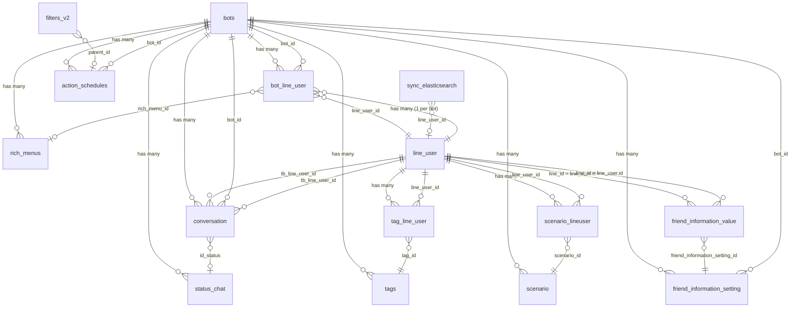

# FA-013 Danh sách bạn bè「友だちリスト」 — Feature Spec

> **Feature ID:** FA-013
> **Portal:** Admin
> **URL chính:** `/basic/friendlist`
> **Controller:** `Basic\FriendlistController` (4329 dòng)
> **Ngày tạo:** 2026-03-25
> **Trạng thái:** Hoàn thành — Validation PASS (64/64 cross-checks)

---

## 1. Tổng quan

### Mục đích
Tính năng「友だちリスト」cho phép Admin quản lý toàn bộ danh sách bạn bè (LINE friends) đã kết bạn với LINE Official Account. Đây là tính năng trung tâm của hệ thống LME, kết nối với hầu hết các module khác (chat, broadcast, step delivery, tag, form, event, v.v.).

### Actors

| Actor | Vai trò | Hành động chính |
|-------|---------|----------------|
| Admin (LINE OA) | Quản lý LINE Official Account | Xem, tìm kiếm, lọc, xem chi tiết, block, ẩn, xoá bạn bè, thực hiện bulk action |
| Staff | Nhân viên do Admin tạo | Tương tự Admin, giới hạn theo quyền (chưa xác nhận chi tiết — xem Gaps #7) |
| LINE User | Người dùng LINE | Không tương tác trực tiếp; hành vi (block, nhắn tin) ảnh hưởng dữ liệu hiển thị |

### Phạm vi

- **6 màn hình**: Danh sách chính, modal lọc nâng cao, chi tiết bạn bè, bạn bè ẩn, bạn bè bị user block, bạn bè bị admin block
- **35 API endpoints**: CRUD, filter, bulk actions, import/export CSV
- **23 bảng DB**: 8 primary + 15 secondary
- **2 background jobs**: ActionScheduleBotTask (bulk action), SyncEsTask (Elasticsearch sync)
- **4 external services**: Elasticsearch, LINE Messaging API, Firebase Cloud Messaging, Chatwork

---

## 2. Các màn hình & Luồng xử lý end-to-end

### SCR-FRL-01: Danh sách bạn bè (trang chính)

**URL:** `/basic/friendlist`

**Layout:** Header + Sidebar (menu admin) + Main content (toolbar + bảng + pagination + bulk action panel)

#### Toolbar
| Thành phần | Mô tả |
|-----------|-------|
| Search box | Textbox placeholder「友だち名・システム表示名」 |
| Nút tìm kiếm | Submit search |
| Nút「絞込み」 | Mở modal lọc nâng cao (SCR-FRL-02) |
| Link「非表示中の友だち」 | → SCR-FRL-04 |
| Link「ブロックされた友だち」 | → SCR-FRL-05 |
| Link「ブロックした友だち」 | → SCR-FRL-06 |

#### Bảng dữ liệu
| Cột | Label JP | Sortable | DB Source |
|-----|---------|----------|-----------|
| Checkbox |「全選択」| Không | — |
| Ngày thêm |「友だち追加日時」| Có | `bot_line_user.followed_at` |
| Tin nhắn mới |「最新メッセージ」| Có | `conversation.last_time_message` |
| Tên LINE |「LINE登録名」| Không | `line_user.name` (link → SCR-FRL-03) |
| Tên hệ thống |「システム表示名」| Không | `line_user.view_name` |
| Email |「メールアドレス」| Không | `line_user.email` (Tin cậy: Trung bình) |
| Step status |「ステップ配信状況」| Không | `scenario_lineuser.is_following` + `scenario.name` |

#### Bulk Action Panel
- Heading:「友だち一括アクション」
- Counter:「選択中 {N}人」
- Nút「アクション選択」→ mở dropdown chọn action (nội dung chưa thu thập — xem Gaps #1)

#### Luồng end-to-end: Xem danh sách

```
Admin mở /basic/friendlist
  → EP-01 GET /basic/friendlist
    → index(): lấy bot_id từ session, đếm tổng bạn bè (is_blocked=0), lấy richMenus/scenarios/conversions
    → DB: bot_line_user (COUNT), rich_menus, scenario, conversion, status_chat
    → Response: HTML (Blade view)
  → Frontend Vue.js gọi AJAX
    → EP-02 POST post-advance-filter-v2
      → postFilterAdvance(): parse item_search JSON, gọi Conversation::advanceFilterPost()
      → DB: bot_line_user JOIN line_user JOIN conversation + subqueries (tag, scenario, conversion...)
      → Response: JSON paginated (200 items/page)
  → UI render bảng danh sách
```

#### Luồng end-to-end: Tìm kiếm

```
Admin nhập keyword → click tìm kiếm
  → EP-04 POST result_search
    → searchLineUser(): line_user.name LIKE '%keyword%', is_blocked=0
    → DB: bot_line_user JOIN line_user + stored procedure SelectLastMessageByLineId
    → Response: HTML partial (50 items/page)
  → UI thay thế nội dung bảng
```

#### Luồng end-to-end: Sắp xếp

```
Admin click header cột sort
  → EP-05 GET /basic/friendlist/sort?value={1|2|3}
    → sort(): value=1 → followed_at ASC, value=2 → followed_at DESC, value=3 → last_time_message DESC
    → DB: bot_line_user JOIN line_user + stored procedure
    → Response: JSON array
  → UI re-render bảng
```

---

### SCR-FRL-02: Modal lọc nâng cao「絞り込み」

**URL:** `/basic/friendlist` (dialog overlay)

#### 11 loại filter

| # | Label JP | DB Logic |
|---|---------|----------|
| 1 |「タグ」| Subquery `tag_line_user WHERE tag_id = ?` |
| 2 |「友だち名」| `line_user.name LIKE` hoặc `view_name LIKE` |
| 3 |「友だち追加日」| `bot_line_user.followed_at BETWEEN` |
| 4 |「ステップ購読状況」| Subquery `scenario_lineuser WHERE scenario_id=? AND is_following=?` |
| 5 |「QRコードアクション」| Subquery `detail_landing_click WHERE landing_id=?` |
| 6 |「コンバージョン」| Subquery `conversion_result WHERE conversion_id=?` |
| 7 |「確認状況」| `conversation.status_last_message` hoặc `id_status` |
| 8 |「友だち情報」| Subquery `friend_information_value WHERE setting_id=? AND value=?` |
| 9 |「対応ステータス」| `conversation.id_status → status_chat.id` |
| 10 |「アフィリエイター」| Subquery `aff_result WHERE aff_id=?` |
| 11 |「新規・既存 友だち」| `conversation.is_old_friend` (Tin cậy: Thấp — xem Gaps #9) |

#### Logic AND/OR
- Vùng AND:「全て満たす」必要がある条件 — tất cả phải thoả mãn
- Vùng OR:「どれか1つ以上満たす」必要がある条件 — ít nhất 1 thoả mãn

#### Luồng end-to-end: Lọc nâng cao

```
Admin click「絞込み」→ Modal mở
  → Admin chọn filter types, cấu hình điều kiện AND/OR
  → Click「保存」
    → EP-02 POST post-advance-filter-v2
      → postFilterAdvance(): parse item_search (AND) + item_search_or (OR) từ JSON
      → Conversation::advanceFilterPost() build dynamic SQL:
        - Base: BotLineUser WHERE bot_id=? AND is_blocked=0
        - AND conditions: WHERE clauses kết hợp AND
        - OR conditions: WHERE clauses kết hợp OR
      → DB: bot_line_user JOIN line_user + dynamic subqueries
      → paginate(200)
      → Bổ sung: name, email, view_name (LineUser), conver_id (Conversation), scenario_name (ScenarioLineuser)
      → Response: JSON paginated
    → UI cập nhật bảng, hiển thị「検索結果： N人」
  → Admin click「クリア」→ navigate lại /basic/friendlist (reset filter)
```

**Shared component:** SC-003 (Friend Filter/Segment) — modal lọc 11 filter types dùng chung với FA-002, FA-003.

---

### SCR-FRL-03: Chi tiết bạn bè「友だち情報詳細」

**URL:** `/basic/friendlist/my_page/{line_user_id}`

#### Action Buttons
| Label | Hành vi |
|-------|---------|
|「チャット」| Mở chat 1:1 → FA-001 |
|「ブロック」| Block bạn bè (admin-side) → xác nhận → EP-31 |
|「削除」| Xoá bạn bè → xác nhận → EP-14 |

#### 7 Tabs
| # | Label JP | Mô tả |
|---|---------|-------|
| 1 |「基本情報」| Thông tin cơ bản + custom fields + memo (mặc định) |
| 2 |「ステップ配信」| Trạng thái step delivery |
| 3 |「リマインド配信」| Trạng thái remind delivery |
| 4 |「タグ」| Tags đã gán → SC-002 |
| 5 |「イベント予約」| Lịch sử đặt lịch |
| 6 |「購入履歴」| Lịch sử mua hàng |
| 7 |「フォーム回答」| Lịch sử trả lời form |

> **Lưu ý:** Chỉ thu thập chi tiết tab「基本情報」. Các tab còn lại chưa khảo sát nội dung (xem Gaps #3).

#### Tab「基本情報」— Thông tin cơ bản

| Label JP | DB Source | Editable |
|---------|-----------|----------|
|「LINE名」| `line_user.name` | Không (đồng bộ LINE API) |
|「友だち追加日時」| `bot_line_user.followed_at` + `conversation.is_old_friend` | Không |
|「紹介アフィリエイター」| `bot_line_user.affiliater_id → affiliaters.username` | Không |
|「表示中リッチメニュー」| `bot_line_user.rich_menu_id → rich_menus.name` | Không |
|「QRコードアクション」| `detail_landing_click.landing_id → landing.name` | Không |
|「最終メッセージ受信」| `conversation.last_time_message` | Không |

#### Tab「基本情報」— Custom fields「友だち情報」

Các fields do Admin định nghĩa tại FA-015 (友だち情報管理). Mỗi field có type khác nhau:

| type_data | UI Control | Mô tả |
|-----------|-----------|-------|
| 1 (select) | Dropdown | Lựa chọn từ options |
| 2 (input) | Text input | Nhập tự do |
| 3 (calendar) | Date picker | Chọn ngày |
| 4 (image) | Image upload | Tải ảnh |
| 5 (file) | File upload | Tải file |
| 6 (point) | Number input | Điểm số |

DB: `friend_information_setting` (định nghĩa) + `friend_information_value` (giá trị per user)

#### Editable fields

| Label JP | DB Column | Validation |
|---------|----------|-----------|
|「システム表示名」| `line_user.view_name` | `nullable|max:20` |
|「メールアドレス」| `line_user.email` | `nullable|email` |
|「携帯電話」| `line_user.phone_number` + `bot_line_user.phone_number` | `nullable|regex:/(^\+?[0-9]{9,15}$)/u` |
| 本名 (hidden) | `line_user.real_name` | `nullable|max:20` |
|「メモ」| `conversation.memo` | varchar(256) |

#### Luồng end-to-end: Xem chi tiết

```
Admin click tên LINE trong danh sách
  → EP-06 GET /basic/friendlist/my_page/{line_id}
    → mypage():
      1. Tìm conversation → nếu null → redirect 404
      2. Kiểm tra BotLineUser → nếu null → redirect chat-v3
      3. Đồng bộ LINE API (getInfoFromLine): cập nhật name, avatar_url, status_message
         → Nếu tên thay đổi → ghi sync_elasticsearch (TYPE_LINE_USER=1)
      4. Tính special_status (trạng thái xác nhận tin nhắn)
      5. Lấy line_user info, tags theo category
    → DB: conversation, bot_line_user, line_user, tags, scenario_lineuser, friend_information_setting/value
    → External: LINE Messaging API (getProfile)
    → Response: HTML (Blade view mypage_v2)
```

#### Luồng end-to-end: Cập nhật thông tin

```
Admin sửa field → click lưu
  → EP-28 POST /basic/update_line_info
    → updateLineInfo():
      1. Validate (view_name max:20, email format, phone regex)
      2. Chuyển phone: 0xxx → +81xxx
      3. Update line_user table
      4. Update bot_line_user.phone_number
    → DB: line_user (UPDATE), bot_line_user (UPDATE)
    → Response: JSON success
```

#### Luồng end-to-end: Block bạn bè

```
Admin click「ブロック」→ Confirm dialog → Xác nhận
  → EP-31 POST /basic/line_users/block
    → updateLineUsersBlock():
      1. bot_line_user.is_blocked = 1
      2. conversation.is_blocked = 1, blocked_by = 1, blocked_at = NOW()
      3. scenario_lineuser.is_following = 0 (dừng tất cả scenario)
      4. Xoá scenario_step_time chưa gửi (status=0)
      5. Cập nhật bots.count_user_unconfirm, gọi updateBadge()
    → DB: bot_line_user, conversation, scenario_lineuser, scenario_step_time, bots (UPDATE)
    → Response: JSON success
  → Bạn bè chuyển sang SCR-FRL-06
```

#### Luồng end-to-end: Xoá bạn bè

```
Admin click「削除」→ Confirm dialog → Xác nhận
  → EP-14 POST /ajax/friendlist/delete-user-block
    → deleteUserBlock(): CASCADE DELETE ~30 bước:
      1. bot_friend_statistic: giảm count_user_followed
      2. LINE API: DELETE richmenu (unlink)
      3. Xoá: bot_line_user_item, order_history, cycle_order_history
      4. Xoá: mobile_notify, auto_reply_history, user_button
      5. scenario_lineuser: giảm scenario counters → xoá
      6. Ghi sync_elasticsearch (TYPE_DELETE_LINE_USER=11)
      7. Xoá: bot_line_user, conversation
      8. Xoá: tag_line_user (giảm tags.count_user_tag)
      9. Xoá: form_answer_result, b_booking, calendar bookings
      10. Xoá: friend_information_value, url_shorten, detail_landing_click, conversion_result
      11. Cập nhật: bots.count_user_unconfirm, status_chat.count
    → DB: ~20+ bảng (DELETE/UPDATE)
    → External: LINE API (unlink rich menu), ghi sync_elasticsearch
    → Job: SyncEsTask sẽ xoá document trên Elasticsearch
    → Response: JSON success
```

---

### SCR-FRL-04: Bạn bè đang ẩn「非表示中の友だち」

**URL:** `/basic/friendlist/hidden`

#### Bảng dữ liệu
| Cột | DB Source |
|-----|-----------|
|「非表示にした日時」| `conversation.datetime_hide` |
|「LINE登録名」| `line_user.name` |
|「システム表示名」| `line_user.view_name` |
| Nút「再表示」| → EP-16 / EP-34 |
| Nút「削除」| → EP-14 |

#### Bulk actions:「再表示」(hiện lại) +「削除」(xoá hàng loạt)

#### Luồng end-to-end: Hiện lại bạn bè

```
Admin click「再表示」(per-row hoặc bulk)
  → EP-16 POST /basic/friendlist/unhidden-friend
    → unHiddenFriend():
      - conversation.is_hide = 0, datetime_hide = NULL
      - Ghi sync_elasticsearch (TYPE_BOT_LINE_USER=0)
    → DB: conversation (UPDATE), sync_elasticsearch (INSERT)
    → Job: SyncEsTask sẽ upsert document trên Elasticsearch
    → Response: JSON success
  → Bạn bè quay lại danh sách chính (SCR-FRL-01)
```

**Filter:** `conversation.is_hide = 1`, `datetime_hide BETWEEN start_date AND end_date`
**Phân trang:** Không phân trang (get all)

---

### SCR-FRL-05: Bạn bè bị user block「ブロックされた友だち」

**URL:** `/basic/friendlist/user-block`

#### Bảng dữ liệu
| Cột | DB Source |
|-----|-----------|
|「ブロックされた日時」| `conversation.blocked_at` |
|「LINE登録名」| `line_user.name` |
|「システム表示名」| `line_user.view_name` |
| Nút「削除」| → EP-14 |

#### Bulk action:「削除」(xoá hàng loạt)

> **Business rule:** Admin KHÔNG thể unblock cho user — chỉ user tự unblock trên LINE. Admin chỉ có thể xoá khỏi hệ thống.

**Filter:** `conversation.is_blocked = 1 AND blocked_by = 0`
**Phân trang:** 50 items/page

---

### SCR-FRL-06: Bạn bè bị admin block「ブロックした友だち」

**URL:** `/basic/friendlist/block`

#### Bảng dữ liệu
| Cột | DB Source |
|-----|-----------|
|「ブロックした日時」| `conversation.blocked_at` |
|「LINE登録名」| `line_user.name` |
|「システム表示名」| `line_user.view_name` |
| Nút「ブロック解除」| → EP-13 |
| Nút「削除」| → EP-14 |

#### Bulk actions:「ブロック解除」(bỏ block) +「削除」(xoá hàng loạt)

#### Luồng end-to-end: Bỏ block

```
Admin click「ブロック解除」
  → EP-13 POST /basic/friendlist/unblock-friend
    → unblockFriend():
      1. Gọi LINE API getProfile() kiểm tra user còn follow không
      2. Nếu CÒN follow → is_blocked = 0 (cả bot_line_user + conversation), tạo message unblock
      3. Nếu KHÔNG còn follow → giữ is_blocked = 1 (user đã block từ phía LINE)
      4. Cập nhật bots.count_user_unconfirm, gọi updateBadge()
    → DB: bot_line_user, conversation (UPDATE), messages_v2s (INSERT), bots (UPDATE)
    → External: LINE Messaging API (getProfile)
    → Response: JSON success
```

**Filter:** `conversation.is_blocked = 1 AND blocked_by = 1`
**Phân trang:** Không phân trang (get all)

---

## 3. Data Model

### Entities chính

| # | Entity | Table | Vai trò |
|---|--------|-------|---------|
| 1 | BotLineUser | `bot_line_user` | Pivot LINE user ↔ Bot. Chứa followed_at, is_blocked, rich_menu_id, memo, phone_number, is_tester |
| 2 | LineUser | `line_user` | Thông tin LINE user: name, view_name, email, avatar_url, line_id |
| 3 | Conversation | `conversation` | Cuộc hội thoại: is_blocked, blocked_by, is_hide, last_message, memo, id_status |
| 4 | tagLineUser | `tag_line_user` | Pivot tag ↔ user |
| 5 | Tags | `tags` | Định nghĩa tags, count_user_tag counter cache |
| 6 | ScenarioLineuser | `scenario_lineuser` | Subscription user ↔ scenario step |
| 7 | FriendInformationSetting | `friend_information_setting` | Định nghĩa custom fields |
| 8 | FriendInformationValue | `friend_information_value` | Giá trị custom fields per user |

### ER Diagram



---

## 4. Field Traceability Matrix

| # | UI Element | Màn hình | DB Table.Column | Hướng | Validation | Business Rule |
|---|-----------|----------|----------------|-------|-----------|--------------|
| 1 | 「友だち追加日時」 | SCR-FRL-01 | `bot_line_user.followed_at` | Read | — | Timestamp → format YYYY-MM-DD trên UI |
| 2 | 「最新メッセージ」 | SCR-FRL-01 | `conversation.last_time_message` | Read | — | Cache trên conversation, không query messages mỗi lần |
| 3 | 「LINE登録名」 | SCR-FRL-01,03,04,05,06 | `line_user.name` | Read | — | Đồng bộ từ LINE API khi mở chi tiết |
| 4 | 「システム表示名」 | SCR-FRL-01,03,04,05,06 | `line_user.view_name` | Read/Write | `nullable|max:20` | Admin tự đặt, hiển thị "-" khi NULL |
| 5 | 「メールアドレス」(danh sách) | SCR-FRL-01 | `line_user.email` | Read | — | Tin cậy Trung bình — có thể là custom field |
| 6 | 「メールアドレス」(chi tiết) | SCR-FRL-03 | `line_user.email` | Read/Write | `nullable|email` | — |
| 7 | 「ステップ配信状況」 | SCR-FRL-01 | `scenario_lineuser.is_following` + `scenario.name` | Read | — | is_following=2 →「停止中」, =1 → tên scenario |
| 8 | 「携帯電話」 | SCR-FRL-03 | `line_user.phone_number` + `bot_line_user.phone_number` | Read/Write | `regex:/(^\+?[0-9]{9,15}$)/u` | BR-07: 0xxx → +81xxx |
| 9 | 「メモ」 | SCR-FRL-03 | `conversation.memo` | Read/Write | varchar(256) | — |
| 10 | 「友だち追加日時」(chi tiết) | SCR-FRL-03 | `bot_line_user.followed_at` + `conversation.is_old_friend` | Read | — | 0 →「新規友だち」, 1 →「既存友だち」 |
| 11 | 「紹介アフィリエイター」 | SCR-FRL-03 | `bot_line_user.affiliater_id → affiliaters.username` | Read | — | NULL → hiển thị "-" |
| 12 | 「表示中リッチメニュー」 | SCR-FRL-03 | `bot_line_user.rich_menu_id → rich_menus.name` | Read | — | — |
| 13 | 「最終メッセージ受信」 | SCR-FRL-03 | `conversation.last_time_message` | Read | — | — |
| 14 | Custom fields「友だち情報」 | SCR-FRL-03 | `friend_information_value.value` JOIN `friend_information_setting` | Read/Write | Theo type_data | 6 loại: select, input, calendar, image, file, point |
| 15 | 「非表示にした日時」 | SCR-FRL-04 | `conversation.datetime_hide` | Read | — | — |
| 16 | 「ブロックされた日時」 | SCR-FRL-05 | `conversation.blocked_at` | Read | — | Filter: blocked_by=0 |
| 17 | 「ブロックした日時」 | SCR-FRL-06 | `conversation.blocked_at` | Read | — | Filter: blocked_by=1 |
| 18 | Tester flag | SCR-FRL-03 | `bot_line_user.is_tester` | Read/Write | 0/1 | Toggle trên UI chưa xác nhận (Gaps #4) |
| 19 | Search keyword | SCR-FRL-01 | `line_user.name`, `view_name`, `email` | Filter | — | LIKE '%keyword%' trên 3 cột |
| 20 | Filter「タグ」 | SCR-FRL-02 | `tag_line_user WHERE tag_id=?` | Filter | — | SC-002 |
| 21 | Filter「友だち情報」 | SCR-FRL-02 | `friend_information_value WHERE setting_id=? AND value=?` | Filter | — | — |
| 22 | Filter「対応ステータス」 | SCR-FRL-02 | `conversation.id_status → status_chat.id` | Filter | — | — |
| 23 | Filter「新規・既存」 | SCR-FRL-02 | `conversation.is_old_friend` (?) | Filter | — | Tin cậy Thấp — xem Gaps #9 |

---

## 5. Business Rules

| Mã | Rule | Chi tiết | Nguồn | Tin cậy |
|----|------|---------|-------|---------|
| BR-01 | Block types | `blocked_by=0` → user block (Admin chỉ xoá, không unblock). `blocked_by=1` → admin block (Admin có thể unblock hoặc xoá) | Logic :1714, :3108 | Cao |
| BR-02 | Unblock verification | Bỏ block chỉ thành công nếu user vẫn follow LINE OA. Kiểm tra qua LINE API `getProfile()` | Logic :3181-3203 | Cao |
| BR-03 | Hide/Unhide | Ẩn: `is_hide=1`, `datetime_hide=NOW()`. Hiện: `is_hide=0`, `datetime_hide=NULL`. Bạn bè ẩn không xuất hiện trong danh sách chính | Logic :3120-3169, :4228-4275 | Cao |
| BR-04 | Page sizes | Danh sách chính: **200**/page. User block: **50**/page. Search: **50**/page. Hidden/Admin block: **không phân trang** | Logic :3036, :3110, :266, :3161 | Cao |
| BR-05 | Bulk action threshold | > 200 users → tạo ActionSchedule cho background job. <= 200 → xử lý trực tiếp | Logic :927, :963 | Cao |
| BR-06 | Cascade delete | Xoá bạn bè cascade ~20+ bảng. Hàm phức tạp nhất (~400 dòng) | Logic :3219-3617 | Cao |
| BR-07 | Phone format | Số bắt đầu bằng `0` → chuyển thành `+81` (format Nhật) | Logic :1761 | Cao |
| BR-08 | Scenario khi block | Block → tất cả scenario is_following = 0, xoá scheduled step times (status=0) | Logic :1980-1981 | Cao |
| BR-09 | Filter v1 vs v2 | v1: `advanceFilter()` params trực tiếp. v2: `advanceFilterPost()` JSON-based, linh hoạt hơn. Frontend chủ yếu dùng v2 | Logic :2829-3071 | Cao |
| BR-10 | LINE API integration | `getProfile()` (unblock), `POST richmenu/{id}` (link), `DELETE richmenu` (unlink) | Logic :3181, :1379 | Cao |
| BR-11 | Elasticsearch sync | Mọi thay đổi quan trọng ghi `sync_elasticsearch` → background job đồng bộ ES | Logic :1662, :3347, :4242 | Cao |
| BR-12 | Stored Procedure | `SelectLastMessageByLineId(user_id, bot_id)` — lấy tin nhắn mới nhất hiệu quả | Logic :376, :405 | Cao |

---

## 6. API Endpoints

### Tổng quan 35 endpoints

| Mã | Method | URL | Mô tả | Tin cậy |
|----|--------|-----|-------|---------|
| EP-01 | GET | `/basic/friendlist` | Trang chính (HTML) | Cao |
| EP-02 | POST | `/basic/friendlist/post-advance-filter-v2` | Lọc nâng cao v2 (JSON, 200/page) | Cao |
| EP-03 | GET | `/basic/friendlist/advance-filter` | Lọc nâng cao v1 cũ (JSON) | Cao |
| EP-04 | POST | `/basic/friendlist/result_search` | Tìm kiếm keyword (HTML, 50/page) | Cao |
| EP-05 | GET | `/basic/friendlist/sort` | Sắp xếp (JSON) | Cao |
| EP-06 | GET | `/basic/friendlist/my_page/{line_id}` | Chi tiết bạn bè (HTML/JSON) | Cao |
| EP-07 | GET | `/basic/friendlist/hidden` | Trang bạn bè ẩn (HTML) | Cao |
| EP-08 | POST | `/basic/friendlist/get-friend-hidden` | Lấy DS bạn bè ẩn (JSON) | Cao |
| EP-09 | GET | `/basic/friendlist/user-block` | Trang user block (HTML) | Cao |
| EP-10 | POST | `/basic/friendlist/get-friend-user-block` | Lấy DS user block (JSON, 50/page) | Cao |
| EP-11 | GET | `/basic/friendlist/block` | Trang admin block (HTML) | Cao |
| EP-12 | POST | `/basic/friendlist/get-friend-block` | Lấy DS admin block (JSON) | Cao |
| EP-13 | POST | `/basic/friendlist/unblock-friend` | Bỏ block (admin) | Cao |
| EP-14 | POST | `/ajax/friendlist/delete-user-block` | Xoá 1 bạn bè (cascade) | Cao |
| EP-15 | POST | `/ajax/friendlist/delete-multiple-user-block` | Xoá hàng loạt (cascade) | Cao |
| EP-16 | POST | `/basic/friendlist/unhidden-friend` | Hiện lại bạn bè ẩn | Cao |
| EP-17 | POST | `/basic/friendlist/send-action` | Bulk action | Cao |
| EP-18 | POST | `/basic/friendlist/save-tag` | Gán tag hàng loạt | Cao |
| EP-19 | POST | `/basic/friendlist/remove-tag` | Gỡ tag hàng loạt | Cao |
| EP-20 | POST | `/basic/friendlist/setting-scenario` | Gán step scenario hàng loạt | Cao |
| EP-21 | POST | `/basic/friendlist/save-rich-menu` | Gán rich menu hàng loạt | Cao |
| EP-22 | POST | `/ajax/get-list-group-template-friendlist` | Lấy DS category + template | Cao |
| EP-23 | POST | `/basic/friendlist/export` | Export CSV | Cao |
| EP-24 | GET | `/basic/friendlist/download-csv` | Tải file CSV | Cao |
| EP-25 | GET | `/basic/friendlist/import` | Trang import CSV | Cao |
| EP-26 | POST | `/basic/friendlist/read_file_csv` | Đọc file CSV upload | Cao |
| EP-27 | POST | `/basic/friendlist/save_file_csv` | Lưu dữ liệu từ CSV | Cao |
| EP-28 | POST | `/basic/update_line_info` | Cập nhật thông tin bạn bè | Cao |
| EP-29 | POST | `/basic/friendlist/my_page/save-scenario` | Lưu scenario mypage | Cao |
| EP-30 | POST | `/basic/friendlist/my_page/send-message` | Gửi tin nhắn mypage | Cao |
| EP-31 | POST | `/basic/line_users/block` | Block bạn bè (admin-side) | Cao |
| EP-32 | POST | `/ajax/get-bot-data` | Lấy dữ liệu bot | Cao |
| EP-33 | GET | `/basic/friend-list/basic-filter-friend` | Lọc cơ bản (API service) | Cao |
| EP-34 | POST | `/ajax/remove-hide-friend` | Hiện lại 1 bạn bè ẩn (per-row) | Cao |
| EP-35 | POST | `/basic/update_is_tester` | Đánh dấu tester | Cao |

### Middleware chung
Tất cả endpoints: `web`, `NotifyChatworkRequestTimeSlow`, `LogRequestMultipart`

### Validation rules (EP-28: updateLineInfo)

| Field | Rule | Message lỗi |
|-------|------|------------|
| `line_id` | `nullable|int` | — |
| `view_name` | `nullable|max:20` | 「システム表示名を20文字以下で入力してください」 |
| `real_name` | `nullable|max:20` | 「本名を20文字以下で入力してください」 |
| `email` | `nullable|email` | — |
| `phone_number` | `nullable|regex:/(^\+?[0-9]{9,15}$)/u` | 「9-15数字以内」 |

---

## 7. Background Jobs

### 7.1 ActionScheduleBotTask — Bulk Action (> 200 users)

| Thuộc tính | Giá trị |
|-----------|---------|
| **Trigger** | `sendActionFriend()` tạo record `action_schedules` khi > 200 users |
| **Queue table** | `action_schedules` |
| **Feature flag** | `ENABLE_EVENT` (mặc định: tắt) |
| **Poll interval** | 5 giây |
| **Tên record** | 「【自動生成】友だち一括アクション」 |
| **Xử lý** | Lấy users từ FilterV2 → parallelStream → ActionModel.doAction() cho từng user |
| **Sau xử lý** | DELETE record (one-time execution) |
| **Timeout** | 30 phút → process exit + restart |
| **Error handling** | Log + Chatwork notification |

**Processing chain:**
```
BotTaskManager (poll 5s) → ActionScheduleBotTask.run()
  → Query action_schedules WHERE status=0 AND next_running_day <= NOW()
  → Lấy users từ FilterV2 (build dynamic SQL)
  → parallelStream().forEach → ActionModel.doAction() (gửi tin, gán tag, v.v.)
  → Lưu history → DELETE record → Gửi mobile notify (nếu bật)
```

### 7.2 SyncEsTask — Elasticsearch Sync

| Thuộc tính | Giá trị |
|-----------|---------|
| **Trigger** | Mọi thay đổi dữ liệu bạn bè (update tên, delete, hide, tag, friend info) |
| **Queue table** | `sync_elasticsearch` (database: `historydb`) |
| **Feature flag** | `ENABLE_SYNC_ES_TASK` (mặc định: bật) |
| **Pattern** | Producer-Consumer (1 producer + 5 consumers) |
| **Batch size** | 200 records/poll |
| **Max queue** | 10,000 records in-memory |
| **Lock** | Theo key `{bot_id}_{line_user_id}` — tránh conflict |
| **Error handling** | status=3 (error), log message_error, Chatwork notification |

**Type values liên quan Friend List:**

| Type | Giá trị | Trigger | ES Operation |
|------|---------|---------|-------------|
| TYPE_BOT_LINE_USER | 0 | Hide/unhide | Upsert |
| TYPE_LINE_USER | 1 | Cập nhật tên | Upsert + update tất cả docs cùng line_user_id |
| TYPE_CONVERSATION | 2 | Thay đổi conversation | Upsert |
| TYPE_TAG | 3 | Gán/gỡ tag | Upsert |
| TYPE_FRIEND_INFO | 4 | Thay đổi custom fields | Upsert |
| TYPE_DELETE_LINE_USER | 11 | Xoá user | Delete document |

### 7.3 External Services

| Service | Sử dụng | Tin cậy |
|---------|---------|---------|
| Elasticsearch | Tìm kiếm nhanh bạn bè (ES-backed search) | Cao |
| LINE Messaging API | getProfile, push message, richmenu link/unlink | Trung bình |
| Firebase Cloud Messaging | Mobile notification sau bulk action | Trung bình |
| Chatwork | Error reporting (tag 2 users) | Cao |

---

## 8. Phụ thuộc chéo (Cross-references)

### Shared Components

| ID | Tên | Mô tả | Phát hiện tại |
|----|-----|-------|--------------|
| SC-002 | Tag Selector | Component gán/lọc tag | SCR-FRL-02 filter「タグ」, SCR-FRL-03 tab「タグ」 |
| SC-003 | Friend Filter/Segment | Modal lọc 11 filter types, AND/OR logic | SCR-FRL-02 — dùng chung với FA-002, FA-003 |
| SC-004 | Action Settings | Component chọn action cho bulk operation | SCR-FRL-01「アクション選択」(cần xác nhận) |

### Tính năng liên quan

| Feature | Liên kết |
|---------|---------|
| FA-001 (Chat) | Nút「チャット」trên SCR-FRL-03 → mở chat 1:1 |
| FA-002 (Broadcast) | Dùng chung SC-003 filter, SC-002 tag |
| FA-003 (Auto-reply) | Dùng chung SC-003 filter |
| FA-015 (友だち情報管理) | Định nghĩa custom fields hiển thị trên SCR-FRL-03 |
| Step Delivery | Tab「ステップ配信」trên SCR-FRL-03, filter「ステップ購読状況」 |
| Rich Menu | Gán/unlink rich menu cho bạn bè |
| Form/Event/Purchase | Tabs trên SCR-FRL-03, cascade delete khi xoá bạn bè |

---

## 9. Gaps và Unknowns

| # | Mô tả | Mức độ | Nguồn | Đề xuất |
|---|-------|--------|-------|---------|
| 1 | Nút「アクション選択」trong bulk action panel — chưa mở xem danh sách actions | Trung bình | UI-2 | Thu thập: mở dropdown/modal, ghi nhận danh sách actions |
| 2 | Cơ chế trigger ẩn bạn bè (非表示) — không thấy nút「非表示」trên SCR-FRL-01 hay SCR-FRL-03 | Trung bình | UI-3 | Kiểm tra FA-001 (Chat) hoặc bulk action |
| 3 | 6 tab trên SCR-FRL-03 chưa thu thập nội dung (chỉ có「基本情報」) | Nhẹ | UI-1 | Thu thập bổ sung, ưu tiên tab「タグ」(SC-002) |
| 4 | Toggle tester (EP-35) không thấy trên UI đã thu thập | Nhẹ | API-2 | Kiểm tra lại SCR-FRL-03 |
| 5 | Import CSV (EP-25/26/27) không thấy nút trên UI | Nhẹ | API-1 | Xác nhận nút import trên UI |
| 6 | EP-33 `basicFilterFriend` — vai trò so với EP-02 filter v2 chưa rõ | Nhẹ | API-3 | Có thể là API nội bộ dùng cho module khác |
| 7 | Staff permissions — controller không có middleware phân quyền riêng | Nhẹ | LOGIC-3 | Kiểm tra route middleware group + Blade views `@can`/`@role` |
| 8 | `HelperService::sendAction()` — method quan trọng chưa đọc chi tiết | Trung bình | LOGIC-1 | Đọc chi tiết `HelperService.php` |
| 9 | Filter「新規・既存」: `bot_line_user.is_new_friend` không tồn tại trong schema. Có thể dùng `conversation.is_old_friend` đảo logic | Trung bình | DB-1 | Grep codebase: `is_new_friend` |
| 10 | Email trên danh sách (SCR-FRL-01): `line_user.email` hay custom field `friend_information_value`? | Nhẹ | DB-2 | Đọc response builder xác nhận |
| 11 | Code có typo `frist()` thay vì `first()` — custom method hay bug? | Nhẹ | LOGIC-2 | Grep codebase tìm method `frist()` |

---

## 10. Chất lượng Spec

### Metrics

| Hạng mục | Giá trị |
|----------|---------|
| Màn hình UI | 6 / 6 thu thập (100%) |
| API endpoints | 35 xác nhận từ source code |
| DB tables mapped | 23 (8 primary + 15 secondary) |
| Business rules | 12 (BR-01 → BR-12) |
| Background jobs | 2 (ActionScheduleBotTask, SyncEsTask) |
| Cross-check pass rate | **64/64 (100%)** |
| Vấn đề Nghiêm trọng | **0** |
| Vấn đề Trung bình | **4** (#1, #2, #8, #9) |
| Vấn đề Nhẹ | **7** (#3, #4, #5, #6, #7, #10, #11) |

### Phân bổ Tin cậy

| Mức | Tỉ lệ | Mô tả |
|-----|--------|-------|
| **Cao** | ~85% | Đọc trực tiếp từ source code, DB schema, Playwright snapshots |
| **Trung bình** | ~12% | Suy luận từ UI + code, chưa xác nhận 100% |
| **Thấp** | ~3% | Chỉ quan sát từ UI hoặc phỏng đoán (filter `new_old_friend`) |

### Open Questions (ưu tiên cao)
1. Filter「新規・既存」dùng cột DB nào? (`bot_line_user.is_new_friend` không tồn tại)
2. `HelperService::sendAction()` xử lý action cụ thể như thế nào cho <= 200 users?
3. Nút「アクション選択」mở ra danh sách actions gì?
4. Cơ chế ẩn bạn bè được trigger từ đâu?

### Hiệu năng lưu ý
- **N+1 query**: `postFilterAdvance()` bước 9 — mỗi item (tối đa 200) gọi 3 query riêng (LineUser, Conversation, ScenarioLineuser)
- **Parallel processing**: `ActionScheduleBotTask` dùng `parallelStream()` — có thể gây tải cao trên LINE API khi danh sách users lớn
- **Cascade delete**: `deleteUserBlock()` ~30 bước, ~20+ bảng — thao tác nặng, cần đảm bảo transaction
