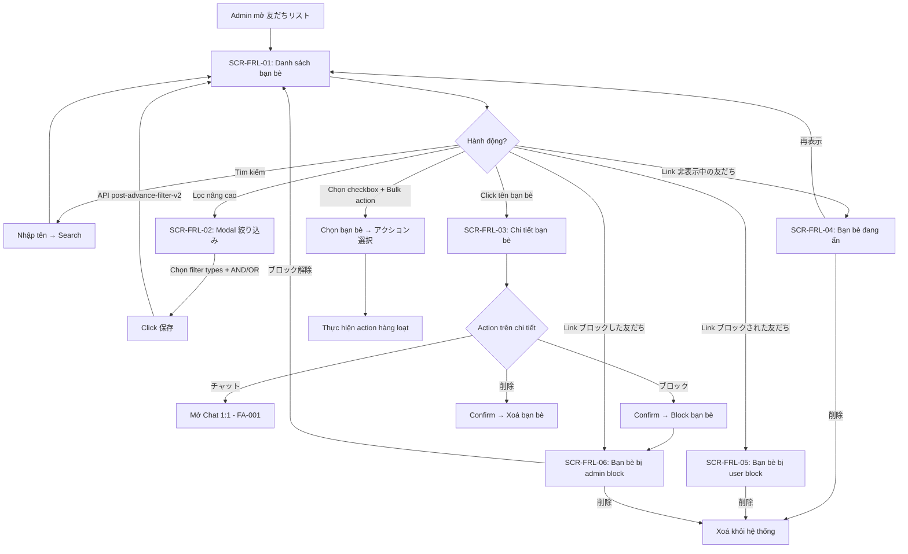

# FA-013 Danh sách bạn bè「友だちリスト」 — UI Spec

> **Feature ID:** FA-013
> **Portal:** Admin
> **URL chính:** `/basic/friendlist`
> **Ngày tạo:** 2026-03-25
> **Nguồn dữ liệu:** Playwright CLI snapshots + screenshots

---

## 1. Tổng quan tính năng

Tính năng「友だちリスト」cho phép Admin quản lý toàn bộ danh sách bạn bè (LINE friends) đã kết bạn với LINE Official Account. Bao gồm:

- **Xem danh sách** bạn bè với thông tin cơ bản (tên LINE, tên hệ thống, email, ngày thêm, tin nhắn mới nhất, trạng thái step)
- **Tìm kiếm & lọc** bạn bè theo nhiều tiêu chí phức tạp (tag, ngày thêm, step, conversion, v.v.) với logic AND/OR
- **Xem chi tiết** từng bạn bè: thông tin cơ bản, thông tin tuỳ chỉnh (友だち情報), memo, các tab liên quan (step, remind, tag, event, purchase, form)
- **Hành động hàng loạt** (bulk action) trên nhiều bạn bè đã chọn
- **Quản lý bạn bè ẩn** (非表示): ẩn/hiện lại, xoá
- **Quản lý bạn bè bị block bởi user** (ブロックされた): xoá khỏi hệ thống
- **Quản lý bạn bè bị block bởi admin** (ブロックした): bỏ block, xoá khỏi hệ thống

## 2. Actors

| Actor | Vai trò | Hành động chính |
|-------|---------|----------------|
| Admin (LINE OA) | Quản lý LINE Official Account | Xem, tìm kiếm, lọc, xem chi tiết, block, ẩn, xoá bạn bè, thực hiện bulk action |
| Staff | Nhân viên do Admin tạo | Tương tự Admin, nhưng bị giới hạn theo quyền được phân (cần kiểm tra thêm) |
| LINE User | Người dùng LINE | Không trực tiếp tương tác với UI này, nhưng hành vi của họ (block, unblock, nhắn tin) ảnh hưởng dữ liệu hiển thị |

## 3. Danh sách màn hình

| Mã | Tên màn hình | URL | Screenshot |
|----|-------------|-----|------------|
| SCR-FRL-01 | Danh sách bạn bè (trang chính) | `/basic/friendlist` | `screenshots/main.png` |
| SCR-FRL-02 | Modal lọc nâng cao | `/basic/friendlist` (dialog overlay) | `screenshots/filter-panel.png` |
| SCR-FRL-03 | Chi tiết bạn bè | `/basic/friendlist/my_page/{id}` | `screenshots/friend-detail.png` |
| SCR-FRL-04 | Bạn bè đang ẩn | `/basic/friendlist/hidden` | `screenshots/hidden-friends.png` |
| SCR-FRL-05 | Bạn bè bị block bởi user | `/basic/friendlist/user-block` | `screenshots/user-blocked.png` |
| SCR-FRL-06 | Bạn bè bị block bởi admin | `/basic/friendlist/block` | `screenshots/admin-blocked.png` |

---

## SCR-FRL-01: Danh sách bạn bè (trang chính)

### Layout

| Vùng | Mô tả |
|------|-------|
| Header (top bar) | Logo「L Message」, tên tài khoản「Xoài」, thông tin配信数 (L Message: 463/無制限 プロ, LINE公式アカウント: 89/500 コミュニケーション) |
| Sidebar (trái) | Menu navigation chính Admin portal — nhóm「情報管理」chứa link「友だちリスト」(active) |
| Main content | Heading「友だちリスト」, toolbar (search + filter + links), bảng danh sách, pagination, panel bulk action |

### Toolbar

| Thành phần | Mô tả |
|-----------|-------|
| Search box | Textbox placeholder「友だち名・システム表示名」— tìm kiếm theo tên |
| Nút tìm kiếm | Button icon kính lúp (ref=e139) — submit search |
| Nút「絞込み」 | Button mở modal lọc nâng cao (SCR-FRL-02) |
| Link「非表示中の友だち」 | Navigate đến SCR-FRL-04 (`/basic/friendlist/hidden`) |
| Link「ブロックされた友だち」 | Navigate đến SCR-FRL-05 (`/basic/friendlist/user-block`) — có icon |
| Link「ブロックした友だち」 | Navigate đến SCR-FRL-06 (`/basic/friendlist/block`) — có icon |

### Thông tin kết quả

- Text「検索結果： 24人」hiển thị tổng số kết quả
- Link「クリア」— reset bộ lọc, navigate lại `/basic/friendlist`

### Data Table

| # | Tiêu đề cột (JP) | Kiểu dữ liệu | Sortable | Ghi chú |
|---|------------------|--------------|----------|---------|
| 1 | 「全選択」 | Checkbox | Không | Checkbox chọn tất cả / từng dòng — dùng cho bulk action |
| 2 | 「友だち追加日時」 | Date (YYYY-MM-DD) | Có (icon sort) | Ngày bạn bè kết bạn với LINE OA |
| 3 | 「最新メッセージ」 | Date (YYYY-MM-DD) | Có (icon sort) | Ngày tin nhắn gần nhất |
| 4 | 「LINE登録名」 | Text (link) | Không | Tên đăng ký LINE — click vào navigate đến chi tiết (`/basic/friendlist/my_page/{id}`) |
| 5 | 「システム表示名」 | Text | Không | Tên hiển thị trong hệ thống (Admin tự đặt) |
| 6 | 「メールアドレス」 | Email / "-" | Không | Địa chỉ email, hiển thị "-" nếu chưa có |
| 7 | 「ステップ配信状況」 | Text (status) | Không | Trạng thái step delivery — giá trị quan sát: 「停止中」, chuỗi text tên step (vd: "test bug j...") bị cắt ngắn |

**Dữ liệu mẫu (3 dòng đầu):**

| 全選択 | 友だち追加日時 | 最新メッセージ | LINE登録名 | システム表示名 | メールアドレス | ステップ配信状況 |
|--------|-------------|-------------|-----------|-------------|-------------|---------------|
| ☐ | 2022-09-21 | 2026-02-27 | テスト(Tan) | kin2 | d1s@gmail.com | 停止中 |
| ☐ | 2023-03-06 | 2026-02-27 | Thinh Nguyen | Thinh | ab@gmail.com | 停止中 |
| ☐ | 2023-05-22 | 2026-02-27 | Duy | Duy test | test@gmail.com | 停止中 |

### Pagination

- Text「24人中 1 - 24人目を表示中」— hiện tại hiển thị tất cả trên 1 trang
- Có pagination controls (prev/next arrows) nhưng chỉ 1 trang trong data mẫu
- **Tin cậy:** Trung bình — chưa rõ page size mặc định khi data lớn hơn

### Bulk Action Panel (phía dưới bảng)

| Thành phần | Mô tả |
|-----------|-------|
| Heading | 「友だち一括アクション」 |
| Mô tả | 「選択中の友だちに一括でアクションを稼働させます。」 |
| Counter | 「選択中 {N}人」— hiển thị số bạn bè đã chọn |
| Button「アクション選択」 | Mở dropdown/modal chọn action — **chưa mở để xem nội dung** |

**Observations:**
- Bulk action panel luôn hiển thị ở cuối trang, kể cả khi chưa chọn bạn bè nào
- Nút「アクション選択」có thể là SC-004 (Action Settings) — cần xác nhận
- Bảng không có cột「対応ステータス」hay「タグ」trực tiếp, nhưng có thể lọc theo các tiêu chí này qua modal

---

## SCR-FRL-02: Modal lọc nâng cao「絞り込み」

### Layout

- Dialog overlay (modal) hiển thị trên SCR-FRL-01
- Heading「絞り込み」
- Nút đóng (X) ở góc trên phải
- 2 vùng thêm điều kiện: AND và OR
- Danh sách filter types (buttons)
- 2 khu vực hiển thị điều kiện đã thêm
- Nút「保存」ở cuối

### Thêm điều kiện

| Vùng | Label JP | Mô tả |
|------|---------|-------|
| AND | 「「全て満たす」必要がある条件 (and条件)を追加」 | Click để thêm điều kiện AND — tất cả phải thoả mãn |
| OR | 「「どれか1つ以上満たす」必要がある条件 (or条件)を追加」 | Click để thêm điều kiện OR — ít nhất 1 thoả mãn |

### Filter Types (11 loại)

| # | Label JP | Mô tả dự đoán |
|---|---------|---------------|
| 1 | 「タグ」 | Lọc theo tag đã gán cho bạn bè → liên quan SC-002 |
| 2 | 「友だち名」 | Lọc theo tên bạn bè (LINE name / system name) |
| 3 | 「友だち追加日」 | Lọc theo ngày thêm bạn bè (date range) |
| 4 | 「ステップ購読状況」 | Lọc theo trạng thái đăng ký step delivery |
| 5 | 「QRコードアクション」 | Lọc theo QR code action đã thực hiện |
| 6 | 「コンバージョン」 | Lọc theo trạng thái conversion |
| 7 | 「確認状況」 | Lọc theo trạng thái xác nhận (message read status) |
| 8 | 「友だち情報」 | Lọc theo thông tin tuỳ chỉnh (custom friend info fields) |
| 9 | 「対応ステータス」 | Lọc theo trạng thái xử lý (support status) |
| 10 | 「アフィリエイター」 | Lọc theo affiliator giới thiệu |
| 11 | 「新規・既存 友だち」 | Lọc theo loại bạn bè: mới hay cũ |

### Khu vực điều kiện

| Vùng | Label JP |
|------|---------|
| AND conditions | 「「全て満たす」必要がある条件 (and条件)」 |
| OR conditions | 「「どれか1つ以上満たす」必要がある条件 (or条件)」 |

### Action Buttons

| Label JP | Type | Hành vi |
|---------|------|---------|
| 「保存」 | Button (submit) | Lưu bộ lọc và áp dụng — gọi API `POST /basic/friendlist/post-advance-filter-v2` |
| X (close) | Button (icon) | Đóng modal không lưu |

**Observations:**
- Modal filter này rất giống SC-003 (Friend Filter/Segment) đã ghi nhận ở FA-002, FA-003 — 11 filter types, AND/OR logic
- Điểm khác biệt với FA-003: FA-003 cũng có 11 filter types nhưng danh sách có thể khác nhau một chút. Cần so sánh kỹ hơn ở web-analyzer
- API endpoint dùng `post-advance-filter-v2` — gợi ý có version cũ (v1)

---

## SCR-FRL-03: Chi tiết bạn bè「友だち情報詳細」

### Layout

| Vùng | Mô tả |
|------|-------|
| Header | Heading「友だち情報詳細」 |
| Friend identity | Tên LINE「[W] サポート/🌸❤️❤️」/ Tên hệ thống「サポート WSS's」 |
| Action buttons | 3 nút hành động bên phải tên |
| Tabs | 7 tab navigation |
| Tab content | Nội dung tab đang chọn (mặc định:「基本情報」) |

### Action Buttons

| Label JP | Type | Hành vi |
|---------|------|---------|
| 「チャット」 | Button (icon + text) | Mở chat 1:1 với bạn bè này → navigate đến FA-001 |
| 「ブロック」 | Link (`javascript:block({id})`) | Block bạn bè — xác nhận rồi block (admin-side) |
| 「削除」 | Link (`javascript:deleteLineUser({id})`) | Xoá bạn bè khỏi hệ thống — xác nhận rồi xoá |

### Tabs (7 tab)

| # | Label JP | Mô tả dự đoán |
|---|---------|---------------|
| 1 | 「基本情報」 | Thông tin cơ bản + thông tin tuỳ chỉnh + memo (mặc định hiển thị) |
| 2 | 「ステップ配信」 | Trạng thái step delivery cho bạn bè này |
| 3 | 「リマインド配信」 | Trạng thái remind delivery |
| 4 | 「タグ」 | Danh sách tag đã gán → liên quan SC-002 |
| 5 | 「イベント予約」 | Lịch sử đặt lịch sự kiện |
| 6 | 「購入履歴」 | Lịch sử mua hàng |
| 7 | 「フォーム回答」 | Lịch sử trả lời biểu mẫu |

### Tab「基本情報」 — Bảng thông tin cơ bản

| Label JP | Giá trị mẫu | Ghi chú |
|---------|------------|---------|
| 「LINE名」 | [W] サポート/🌸❤️❤️ | Tên đăng ký LINE — read-only |
| 「友だち追加日時」 | 2025.08.26 12:32 既存友だち | Ngày giờ kết bạn + loại (新規/既存) |
| 「紹介アフィリエイター」 | - | Affiliator giới thiệu |
| 「表示中リッチメニュー」 | - | Rich menu đang hiển thị cho user này |
| 「QRコードアクション」 | - | QR code action đã dùng |
| 「最終メッセージ受信」 | 2026.03.21 10:44 | Thời gian nhận tin nhắn cuối |

**Nút「表示設定」:** Button bên cạnh heading「基本情報」— điều chỉnh cột hiển thị/ẩn trong bảng.

### Tab「基本情報」 — Bảng thông tin bạn bè tuỳ chỉnh「友だち情報」

| Label JP | Giá trị mẫu | Kiểu field |
|---------|------------|-----------|
| 「date 1」 | (trống, có icon calendar) | Date picker |
| 「date 2」 | (trống, có icon calendar) | Date picker |
| 「システム表示名」 | サポート WSS's | Text — editable |
| 「ảnh」 | (ảnh + nút「編集」) | Image upload — có nút edit |
| 「select」 | (trống) | Select dropdown |
| 「メールアドレス」 | Test212@gmail.com | Email — editable |
| 「携帯電話」 | 0976870074 | Phone — editable |
| 「test act EDIT 16.10」 | (trống, có icon calendar) | Date picker |
| 「kieu point 1」 | (trống) | Number (point type) |

**Nút「表示設定」:** Button bên cạnh heading「友だち情報」— điều chỉnh fields hiển thị/ẩn.

**Observations:**
- Bảng「友だち情報」chứa các custom fields do Admin định nghĩa tại FA-015 (友だち情報管理)
- Tên fields (「date 1」,「ảnh」,「select」,「test act EDIT 16.10」,「kieu point 1」) là tên tuỳ chỉnh do Admin tạo
- Mỗi field có kiểu dữ liệu riêng: text, date, image, select, email, phone, number/point

### Memo

| Thành phần | Mô tả |
|-----------|-------|
| Label | 「メモ」 |
| Textbox | Textarea chứa nội dung memo — giá trị mẫu: "Ngan check memo" |
| Nút「保存」 | Lưu memo |

---

## SCR-FRL-04: Bạn bè đang ẩn「非表示中の友だち」

### Layout

| Vùng | Mô tả |
|------|-------|
| Heading | 「非表示中の友だち」 |
| Date range filter | 「表示期間」với 2 date picker (từ — đến) |
| Data table | Bảng danh sách bạn bè ẩn |
| Bulk action panel | 「一括友だち操作」với 2 nút |

### Date Range Filter

| Thành phần | Label JP | Giá trị mẫu |
|-----------|---------|------------|
| Date from | (textbox) | 2026/02/23 |
| Separator | 「から」 | — |
| Date to | (textbox) | 2026/03/25 |

### Data Table

| # | Tiêu đề cột (JP) | Kiểu dữ liệu | Ghi chú |
|---|------------------|--------------|---------|
| 1 | 「全選択」 | Checkbox | Chọn tất cả / từng dòng |
| 2 | 「非表示にした日時」 | Datetime (YYYY/MM/DD HH:MM:SS) | Ngày giờ ẩn bạn bè |
| 3 | 「LINE登録名」 | Text (link) | Tên LINE — click navigate đến chi tiết |
| 4 | 「システム表示名」 | Text | Tên hệ thống |
| 5 | 「再表示」 | Button「再表示」 | Hiện lại bạn bè (per-row action) |
| 6 | 「エルメ上から削除」 | Button「削除」 | Xoá bạn bè khỏi hệ thống (per-row action) |

**Dữ liệu mẫu:**

| 全選択 | 非表示にした日時 | LINE登録名 | システム表示名 | 再表示 | エルメ上から削除 |
|--------|---------------|-----------|-------------|--------|---------------|
| ☐ | 2026/03/06 16:21:06 | Tung テスト | Tung | [再表示] | [削除] |

### Bulk Action Panel

| Label JP | Mô tả |
|---------|-------|
| 「一括友だち操作」 | Heading panel |
| Nút「再表示」 | Hiện lại tất cả bạn bè đã chọn |
| Nút「削除」 | Xoá tất cả bạn bè đã chọn khỏi hệ thống |

---

## SCR-FRL-05: Bạn bè bị block bởi user「ブロックされた友だち」

### Layout
Tương tự SCR-FRL-04 nhưng dành cho bạn bè đã block LINE OA từ phía user.

### Date Range Filter
Giống SCR-FRL-04: 「表示期間」với 2 date picker (2026/02/23 — 2026/03/25).

### Data Table

| # | Tiêu đề cột (JP) | Kiểu dữ liệu | Ghi chú |
|---|------------------|--------------|---------|
| 1 | 「全選択」 | Checkbox | Chọn tất cả / từng dòng |
| 2 | 「ブロックされた日時」 | Datetime (YYYY/MM/DD HH:MM:SS) | Ngày giờ bị block |
| 3 | 「LINE登録名」 | Text (link) | Tên LINE — click navigate đến chi tiết |
| 4 | 「システム表示名」 | Text | Tên hệ thống |
| 5 | 「エルメ上から削除」 | Button「削除」 | Xoá bạn bè khỏi hệ thống (per-row action) |

**Dữ liệu mẫu:**

| 全選択 | ブロックされた日時 | LINE登録名 | システム表示名 | エルメ上から削除 |
|--------|----------------|-----------|-------------|---------------|
| ☐ | 2026/03/03 18:11:11 | テスト | - | [削除] |
| ☐ | 2026/02/26 18:43:31 | Ngọc Ánh | - | [削除] |
| ☐ | 2026/02/26 17:28:44 | テスト | sss | [削除] |

**Observations:**
- Không có nút「再表示」hay「ブロック解除」— Admin không thể unblock cho user (hợp lý: user tự block, chỉ user tự unblock được)
- Chỉ có hành động「削除」(xoá khỏi Elme, không ảnh hưởng LINE)

### Bulk Action Panel

| Label JP | Mô tả |
|---------|-------|
| 「一括友だち削除」 | Heading panel |
| Nút「削除」 | Xoá hàng loạt bạn bè đã chọn khỏi hệ thống |

---

## SCR-FRL-06: Bạn bè bị block bởi admin「ブロックした友だち」

### Layout
Tương tự SCR-FRL-04, SCR-FRL-05 nhưng dành cho bạn bè Admin đã chủ động block.

### Date Range Filter
Giống SCR-FRL-04: 「表示期間」với 2 date picker (2026/02/23 — 2026/03/25).

### Data Table

| # | Tiêu đề cột (JP) | Kiểu dữ liệu | Ghi chú |
|---|------------------|--------------|---------|
| 1 | 「全選択」 | Checkbox | Chọn tất cả / từng dòng |
| 2 | 「ブロックした日時」 | Datetime (YYYY/MM/DD HH:MM:SS) | Ngày giờ Admin block |
| 3 | 「LINE登録名」 | Text (link) | Tên LINE — click navigate đến chi tiết |
| 4 | 「システム表示名」 | Text | Tên hệ thống |
| 5 | 「ブロック解除」 | Button「ブロック解除」 | Bỏ block bạn bè (per-row action) |
| 6 | 「エルメ上から削除」 | Button「削除」 | Xoá bạn bè khỏi hệ thống (per-row action) |

**Dữ liệu mẫu:** Bảng trống (không có bạn bè nào bị admin block trong khoảng thời gian lọc).

### Bulk Action Panel

| Label JP | Mô tả |
|---------|-------|
| 「一括友だち操作」 | Heading panel |
| Nút「ブロック解除」 | Bỏ block hàng loạt bạn bè đã chọn |
| Nút「削除」 | Xoá hàng loạt bạn bè đã chọn khỏi hệ thống |

---

## 4. User Flows

### Flow 1: Tìm kiếm và xem bạn bè (Happy path)

1. Admin mở「友だちリスト」từ sidebar → SCR-FRL-01 hiển thị bảng 24 bạn bè
2. Admin nhập tên vào search box「友だち名・システム表示名」→ click nút tìm kiếm
3. Bảng cập nhật hiển thị kết quả lọc theo tên
4. Admin click vào tên LINE (link) trong cột「LINE登録名」→ navigate đến SCR-FRL-03
5. Admin xem thông tin cơ bản, chuyển tab để xem step/remind/tag/event/purchase/form

### Flow 2: Lọc nâng cao (Happy path)

1. Admin click nút「絞込み」→ modal SCR-FRL-02 mở ra
2. Admin click「「全て満たす」必要がある条件 (and条件)を追加」→ danh sách filter types hiện ra
3. Admin chọn loại filter (vd:「タグ」) → cấu hình điều kiện
4. Admin có thể thêm nhiều điều kiện AND và/hoặc OR
5. Admin click「保存」→ API `POST /basic/friendlist/post-advance-filter-v2` được gọi
6. Modal đóng, bảng cập nhật kết quả theo bộ lọc
7. Admin click「クリア」để reset bộ lọc

### Flow 3: Thực hiện bulk action

1. Admin tick checkbox từng bạn bè hoặc「全選択」
2. Counter「選択中 {N}人」cập nhật
3. Admin click「アクション選択」→ dropdown/modal chọn action hiện ra
4. Admin chọn action → hệ thống thực hiện action cho tất cả bạn bè đã chọn

### Flow 4: Block và xoá bạn bè

1. Admin mở chi tiết bạn bè (SCR-FRL-03) → click「ブロック」
2. Hệ thống hiện confirm dialog → Admin xác nhận
3. Bạn bè bị block → xuất hiện trong SCR-FRL-06
4. Admin vào SCR-FRL-06 → click「ブロック解除」để bỏ block, hoặc「削除」để xoá khỏi hệ thống

### Flow 5: Ẩn và hiện lại bạn bè

1. (Cơ chế ẩn chưa rõ — có thể từ bulk action hoặc action khác trên chi tiết)
2. Bạn bè bị ẩn → xuất hiện trong SCR-FRL-04
3. Admin vào SCR-FRL-04 → click「再表示」để hiện lại, hoặc「削除」để xoá

---

## 5. Flow Diagram

---

## 6. Network Requests (API Calls quan sát được)

| Method | URL | Mô tả |
|--------|-----|-------|
| POST | `/ajax/check-init-tutorial` | Kiểm tra trạng thái tutorial |
| POST | `/ajax/get-bot-data` | Lấy dữ liệu bot (LINE OA) hiện tại |
| POST | `/ajax/get-list-group-template-friendlist` | Lấy danh sách group template cho friend list — có thể là template cho bulk action |
| POST | `/basic/friendlist/post-advance-filter-v2` | Lọc nâng cao — gọi khi load trang hoặc khi apply filter |
| GET | `/full-emoji-list.json` | Lấy danh sách emoji (dùng cho hiển thị tên có emoji) |

---

## 7. Shared Components phát hiện

| Shared Component | Mã SC | Nơi phát hiện | Mô tả |
|-----------------|------|--------------|-------|
| Friend Filter/Segment | SC-003 | SCR-FRL-02 (modal「絞り込み」) | Modal lọc 11 filter types, AND/OR logic — rất giống FA-002 và FA-003 |
| Tag Selector | SC-002 | SCR-FRL-03 tab「タグ」, SCR-FRL-02 filter「タグ」 | Component gán/lọc tag cho bạn bè |
| Action Settings | SC-004 | SCR-FRL-01 panel「友だち一括アクション」→「アクション選択」 | Component chọn action cho bulk operation — cần xác nhận |

---

## 8. Điểm chưa rõ / cần điều tra

| # | Câu hỏi | Mức ưu tiên | Ghi chú |
|---|---------|------------|---------|
| 1 | Nút「アクション選択」trong bulk action panel mở ra gì? Dropdown hay modal? Danh sách action nào? | Cao | Có thể là SC-004 Action Settings |
| 2 | Cơ chế ẩn bạn bè (非表示) được thực hiện từ đâu? Từ chi tiết hay bulk action? | Trung bình | Không thấy nút「非表示」trên SCR-FRL-01 hay SCR-FRL-03 |
| 3 | Các tab trên SCR-FRL-03 (ステップ配信, リマインド配信, タグ, イベント予約, 購入履歴, フォーム回答) có nội dung gì? | Trung bình | Chỉ thu thập tab「基本情報」mặc định |
| 4 | Nút「表示設定」trên SCR-FRL-03 mở ra UI gì? Có thể ẩn/hiện cột nào? | Thấp | Có 2 nút: 1 cho「基本情報」, 1 cho「友だち情報」 |
| 5 | Page size mặc định của bảng bạn bè là bao nhiêu? Pagination hoạt động thế nào khi > 1 trang? | Thấp | Hiện tại data chỉ 24 người, hiển thị hết |
| 6 | Cột「ステップ配信状況」hiển thị tên step khi đang active — bị cắt ngắn ("test bug j..."). Full text là gì? | Thấp | Cần xem ở detail hoặc expand |
| 7 | Staff có quyền truy cập「友だちリスト」không? Có bị giới hạn action nào? | Trung bình | Cần kiểm tra quyền staff |
| 8 | API `get-list-group-template-friendlist` trả về gì? Có liên quan đến SC-001 Template Message không? | Trung bình | Tên gợi ý liên quan template |
