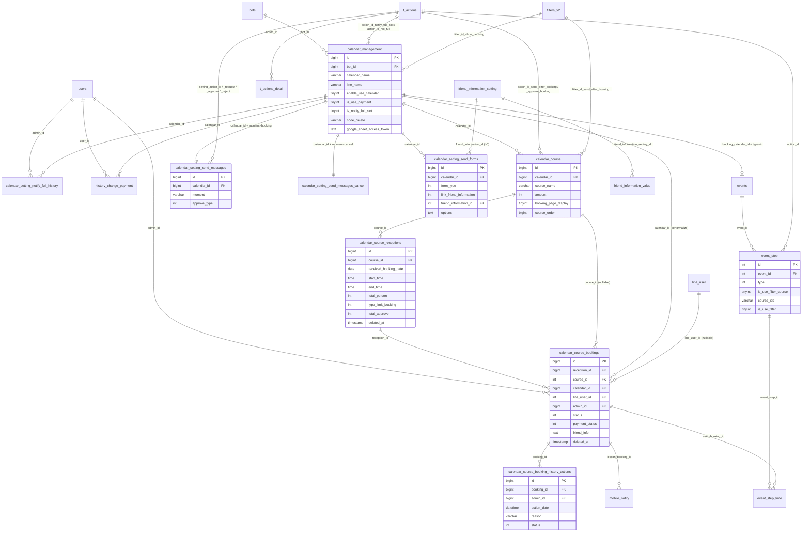

# FA-019 「レッスン予約」 — Database Mapping

> Tạo bởi: **db-mapper** agent
> Đầu vào: `_internal/db-hint.md`, `_internal/db-hint-liff.md`, `web/logic-spec.md`, `web/logic-spec-public.md`, `web/api-spec.md`, `web/api-spec-public.md`, `job/job-spec.md`, `ui/ui-spec.md`, `ui/ui-spec-liff.md`
> Nguồn DB: `db/index.md`, `db/schema/tables/{table}.sql`, `db/data/{table}.sql` (dump ngày 2026-04-20)
> Phạm vi: 26 màn Admin (SCR-LSN-01…26) + 21 màn LINE User/LIFF (SCR-LSN-L01…L21)

**Mục lục**
1. [Primary Tables](#1-primary-tables)
2. [Secondary Tables](#2-secondary-tables)
3. [Entity Details](#3-entity-details)
4. [UI ↔ DB Field Mapping](#4-ui--db-field-mapping)
5. [Enum / Status Values](#5-enum--status-values)
6. [Unmapped Items](#6-unmapped-items)
7. [Entity Relationships](#7-entity-relationships)
8. [Chỉ số coverage](#8-chỉ-số-coverage)
9. [Mâu thuẫn giữa các spec đầu vào](#9-mâu-thuẫn-giữa-các-spec-đầu-vào)

---

## 0. Cảnh báo phân biệt tính năng (đã kiểm chứng)

| Nhóm bảng | Thuộc về | Kết luận |
|---|---|---|
| `calendar_management`, `calendar_course*`, `calendar_setting_*` (không có `salon`) | **FA-019 レッスン予約** | ✔ Dùng trong tài liệu này |
| `calendar_salon*` (18 bảng) | **FA-020 サロン予約** | ✘ **Không** thuộc FA-019 |
| `b_c_*`, `booking_calendar`, `google_calendar_events`, `google_calendar_callback`, `callback_events_google_calendar` | 予約管理 **thế hệ cũ** + đồng bộ Google Calendar của FA-020 | ✘ **Không** thuộc FA-019 |
| `history_change_payment` | **FA-019** | ✔ Đối xứng với `calendar_salon_history_change_setting_payment` của FA-020 |

> **Xác nhận không có tích hợp Google Calendar cho FA-019**: `calendar_management` có cột `google_calendar_id` nhưng **174/174 bản ghi đều NULL**; FA-019 chỉ tích hợp **Google Sheets** (`google_sheet_*`). Kết luận của `job-spec.md` được **xác nhận bằng dữ liệu**. **Tin cậy: Cao**

---

## 1. Primary Tables

| Bảng | Vai trò | Model Eloquent | Cột | Bản ghi mẫu | SoftDeletes |
|---|---|---|---|---|---|
| `calendar_management` | Bản ghi gốc 1 hệ thống 「レッスン予約」 (1 lịch = 1 trang đặt chỗ LIFF). Chứa cả cấu hình hiển thị, 空き枠通知, 決済連携, Google Sheet, 利用規約 | `App\CalendarManagement` | 54 | **174** | ✘ (xoá cứng) |
| `calendar_course` | Khoá học 「コース」 thuộc 1 lịch — tên, thời lượng, giá, ảnh, 2 tin nhắn tự động + action | `App\CalendarCourse` | 23 | **384** | ✘ (xoá cứng) |
| `calendar_course_receptions` | Khung nhận đặt 「受付枠」 — 1 buổi học cụ thể (ngày + giờ bắt đầu/kết thúc + sức chứa). Có sẵn 6 cột đếm tổng hợp | `App\CalendarCourseReception` | 17 | **4 296** (466 đã soft-delete) | ✔ |
| `calendar_course_bookings` | Đặt chỗ 「予約」 của LINE User hoặc Admin thêm tay. Bảng trung tâm — kèm toàn bộ dữ liệu thanh toán và snapshot khoá học | `App\CalendarCourseBooking` | 41 | **2 731** (563 đã soft-delete) | ✔ |
| `calendar_course_booking_history_actions` | Nhật ký 16 loại thao tác trên 1 đặt chỗ (「予約履歴」) | `App\CalendarCourseBookingHistoryAction` | 9 | **4 846** (66 đã soft-delete) | ✔ |
| `calendar_setting_send_messages` | Cấu hình tin nhắn + hạn nhận đặt/huỷ. **Đúng 2 dòng/lịch** (`moment = 'booking'` và `'cancel'`) | `App\CalendarSettingSendMessage` | 37 | **394** = 197 booking + 197 cancel (14 soft-delete) | ✔ |
| `calendar_setting_send_forms` | Câu hỏi 「お客様への質問項目」 hiển thị trên trang đặt chỗ LIFF | `App\CalendarSettingSendForms` | 25 | **836** (287 soft-delete) | ✔ |
| `calendar_setting_notify_full_history` | Lịch sử bật/tắt 「空き枠通知受け取り」 | `App\CalendarSettingNotifyFullHistory` | 9 | ~140 | ✘ |
| `history_change_payment` | Lịch sử bật/tắt 「決済機能の利用」 của FA-019 (bảng mà `db-hint.md` §15 chưa tìm ra) | Truy vấn `DB::table()` trực tiếp — **không có model** | 7 | ~180 | ✘ |

> **Ghi chú kiến trúc DB**: toàn bộ 9 bảng trên chỉ có `PRIMARY KEY (id)`, **không có một index phụ nào và không có một ràng buộc khoá ngoại nào**. Xem §3.10.

---

## 2. Secondary Tables

| Bảng | Quan hệ gián tiếp với FA-019 | Dùng ở đâu | Tin cậy |
|---|---|---|---|
| `events` | 1 lịch ⟶ **tối đa 1** bản ghi `events` với `type = 4`, `booking_calendar_id = calendar_management.id`, `category_id = -1`. Là "container" cho các mốc nhắc lịch | SCR-LSN-14 リマインドメッセージ; BR-37 | **Cao** — 146/146 bản ghi `events.type = 4` đều có `booking_calendar_id` khác NULL |
| `event_step` | Mỗi mốc nhắc 「送信タイミング」 là 1 dòng `event_step` (`type = 4`, `event_id` trỏ về `events` ở trên) | SCR-LSN-14 | **Cao** — 397 dòng `event_step` thuộc 146 event `type = 4` |
| `event_step_time` | Hàng đợi gửi thực tế: 1 dòng = 1 tin nhắn nhắc sẽ gửi cho 1 booking tại 1 thời điểm. `user_booking_id` = `calendar_course_bookings.id` | Job Spring Boot; backfill `addActionRemindNew()` | **Cao** — 1 102/8 865 dòng thuộc event `type = 4` |
| `mobile_notify` | Thông báo đẩy tới app di động của Admin. Cột **`lesson_booking_id`** = `calendar_course_bookings.id`, `type = 4` (Booking) | Badge 「新着」, thông báo đặt chỗ mới | **Cao** — tên cột `lesson_booking_id` khớp trực tiếp |
| `job_config_daily` | Con trỏ cursor của job Spring Boot: cột **`lesson_booking_last_id`** = id booking cuối cùng đã xử lý | Job quét đặt chỗ mới | **Cao** — giá trị hiện tại **3165** (xem §3.11) |
| `t_actions` / `t_actions_detail` | エルメアクション (SC-004). FA-019 tham chiếu qua 8 cột `action_id_*` / `setting_action_*` | Mọi màn có 「アクション設定」 | **Cao** |
| `filters_v2` | Bộ lọc bạn bè (SC-003). Tham chiếu qua `filter_id_send_after_booking`, `filter_id_send_approve_booking`, `filter_id_show_booking` | SCR-LSN-09 tab アクション, SCR-LSN-17 | **Cao** |
| `line_user` | Thông tin LINE User đặt chỗ. `calendar_course_bookings.line_user_id` → `line_user.id` | Cột 「お名前」 mọi bảng đặt chỗ | **Cao** — quan hệ `lineUser()` `belongsTo` khai báo trong model |
| `bot_line_user` | Quan hệ bạn bè giữa `line_user` và `bots` — dùng để lấy `real_name`, avatar, trạng thái block | Hiển thị tên/ảnh khách | **Trung bình** |
| `bots` | Tài khoản LINE OA sở hữu lịch. `calendar_management.bot_id` → `bots.id`. `bots.liff_app_id_booking` (fallback `liff_app_id`) sinh URL trang đặt chỗ; `bots.plan_type` quyết định hạn mức | SCR-LSN-01 「予約ページURL」, BR-04 | **Cao** |
| `friend_information_setting` | Mục hồ sơ bạn bè. `calendar_setting_send_forms.friend_information_id` → `friend_information_setting.id` (id **âm** = mục hệ thống) | SCR-LSN-16 「友だち情報に回答を記録」 | **Cao** — quan hệ `friendInformationSetting()` khai báo trong model |
| `friend_information_value` | Giá trị hồ sơ bạn bè đã ghi. Được cập nhật khi khách trả lời form | Auto-fill form LIFF; ghi ngược khi đặt chỗ | **Cao** |
| `friend_info_option_selects` | Tuỳ chọn của mục hồ sơ dạng chọn + action gắn kèm. Liên quan `options_information_friend` | SCR-LSN-16 | **Trung bình** |
| `notification_pc` | Thông báo hiện trên trình duyệt Admin | Thông báo đặt chỗ mới | **Trung bình** |
| `users` | Người thao tác. `calendar_course_bookings.admin_id`, `..._history_actions.admin_id`, `calendar_setting_notify_full_history.admin_id`, `history_change_payment.user_id` → `users.id`. Cột `users.enable_tooltip_calendar` điều khiển banner hướng dẫn SCR-LSN-01 | Cột 「操作した人」 | **Cao** |
| `strip_bots` | Cấu hình liên kết Stripe / UnivaPay ở cấp bot (`status_strip_bot == 3` = đã liên kết; `univapay_app_id`, `univapay_app_test_id`) | SCR-LSN-23 決済連携 | **Cao** |
| `bot_contracts` | `contract_type` — gói cước, quyết định có được bật thanh toán không | SCR-LSN-23 | **Cao** |

---

## 3. Entity Details

### 3.1 `calendar_management` (54 cột, 174 bản ghi)

| Cột | Kiểu | Null | Default | Key | Mô tả nghiệp vụ |
|---|---|---|---|---|---|
| `id` | bigint(20) UNSIGNED | ✘ | — | **PK** | Id lịch, xuất hiện trong URL LIFF |
| `bot_id` | bigint(20) | ✘ | — | FK ngầm → `bots.id` | Tài khoản LINE OA sở hữu |
| `calendar_name` | varchar(100) | ✘ | — | | 「エルメ上での管理名」 — chỉ Admin thấy (UI giới hạn 10 ký tự, DB cho 100) |
| `line_name` | varchar(100) | ✘ | — | | 「店舗名」 — hiển thị cho khách (UI giới hạn 30 ký tự) |
| `enable_use_calendar` | tinyint(4) | ✘ | `1` | | 0 = 無効, 1 = 有効 (toggle SCR-LSN-01) |
| `google_calendar_id` | varchar(255) | ✔ | NULL | | **Cột chết** — 174/174 NULL. Di sản copy từ FA-020 |
| `order` | int(11) | ✔ | `0` | | Thứ tự thẻ lịch (kéo-thả). Model event `creating` gán `MAX(order)+1` **toàn cục, không lọc bot** |
| `created_at` / `updated_at` | timestamp | ✘ | CURRENT_TIMESTAMP | | |
| `store_name` | varchar(256) | ✔ | NULL | | **Cột chết** — 0/174 có giá trị. UI 「店舗名」 ghi vào `line_name`, không phải cột này |
| `image_calendar` | varchar(256) | ✔ | NULL | | Ảnh màn 「店舗・ビジネス情報」 (SCR-LSN-19) |
| `show_policy` | tinyint(4) | ✘ | `0` | | 「利用規約の表示」 0 = ẩn, 1 = hiện (biến blade `showContentPolicy`) |
| `content_policy` | text | ✔ | NULL | | Nội dung 「利用規約」 (SCR-LSN-20) |
| `url_website` | varchar(255) | ✔ | NULL | | 店舗情報 — website |
| `phone` | varchar(16) | ✔ | NULL | | 店舗情報 — 電話番号 |
| `address` | varchar(256) | ✔ | NULL | | 店舗情報 — 住所 |
| `access` | varchar(256) | ✔ | NULL | | 店舗情報 — アクセス |
| `business_hours` | varchar(256) | ✔ | NULL | | 店舗情報 — 営業時間 |
| `business_hours_holiday` | varchar(256) | ✔ | NULL | | 店舗情報 — 定休日 |
| `facility` | varchar(256) | ✔ | NULL | | 店舗情報 — 設備 |
| `parking` | varchar(256) | ✔ | NULL | | 店舗情報 — 駐車場 |
| `google_sheet_access_token` | text | ✔ | NULL | | **JSON OAuth thô** của Google (27/174 có giá trị) — xem cảnh báo §3.10 |
| `google_sheet_id` | varchar(128) | ✔ | NULL | | Id spreadsheet đang đồng bộ |
| `google_sheet_name` | varchar(128) | ✔ | NULL | | Tên spreadsheet |
| `google_sheet_account_email` | varchar(255) | ✔ | NULL | | Email tài khoản Google đã liên kết |
| `google_account_name` | varchar(255) | ✔ | NULL | | Tên hiển thị tài khoản Google |
| `google_account_picture` | varchar(255) | ✔ | NULL | | URL avatar Google |
| `payment_method` | varchar(256) | ✔ | NULL | | 店舗情報 — 支払い方法 (mô tả tự do, **khác** `type_payment`) |
| `number_staff` | int(11) | ✔ | NULL | | 店舗情報 — スタッフ数 |
| `description` | text | ✔ | NULL | | 「テキスト」 màn 店舗・ビジネス情報 (SCR-LSN-19) |
| `datetime_connect_google_sheet` | datetime | ✔ | NULL | | Thời điểm liên kết Google Sheet |
| `code_delete` | varchar(16) | ✔ | NULL | | **Mã xác thực xoá lịch, lưu plaintext** — 13/174 bản ghi còn giữ mã (xem §3.10) |
| `type_payment` | int(11) | ✔ | NULL | | 0 = Stripe, 1 = UnivaPay. Không đổi được sau khi lưu |
| `environment` | int(11) | ✔ | NULL | | 0 = テスト環境, 1 = 本番環境 |
| `description_payment` | text | ✔ | NULL | | 「特定商取引法に基づく表記」 (TinyMCE) |
| `is_use_payment` | tinyint(4) | ✘ | `0` | | 「決済機能の利用」 0/1 |
| `is_notify_full_slot` | tinyint(4) | ✘ | `0` | | 「空き枠通知受け取り」 0 = 停止中, 1 = 受付中 |
| `use_message_notify_full_slot` | tinyint(4) | ✘ | `0` | | Toggle 「利用しない」 cho tin nhắn khi khách đăng ký nhận thông báo |
| `message_notify_full_slot` | text | ✔ | NULL | | Nội dung tin nhắn 通知受け取り申請時 |
| `action_id_notify_full_slot` | int(11) | ✔ | NULL | FK ngầm → `t_actions.id` | Action khi khách đăng ký nhận thông báo. **Tên cột thật là `action_id_notify_full_slot`, không phải `action_id_full`** như db-hint đoán |
| `use_message_notify_not_full` | int(4) | ✘ | `0` | | Toggle 「利用しない」 cho tin nhắn khi có chỗ trống |
| `message_notify_not_full` | text | ✔ | NULL | | Nội dung tin nhắn 受付再開時 |
| `action_id_not_full` | int(11) | ✔ | NULL | FK ngầm → `t_actions.id` | Action khi có chỗ trống |
| `is_display_course_cost` | tinyint(4) | ✘ | `1` | | 「コース料金」 hiện/ẩn trên trang đặt chỗ |
| `is_display_capacity` | tinyint(4) | ✘ | `1` | | 「残りの定員（残席）数の表示」 |
| `is_display_course_full` | tinyint(4) | ✘ | `1` | | 「満席のコース」 hiện/ẩn |
| `booking_setting_name` | varchar(255) | ✔ | NULL | | 「システムワード変更」 — thay chữ 「コース」 hiển thị cho khách |
| `image_calendar_top` | varchar(255) | ✔ | NULL | | Ảnh màn 「トップ画面」 (SCR-LSN-18) |
| `description_top` | text | ✔ | NULL | | 「テキスト」 màn トップ画面 — **cột riêng, KHÁC `description`** ⇒ giải đáp câu hỏi mở #6 của db-hint |
| `setting_show_calendar` | varchar(255) | ✔ | `'week'` | | 「週・月 表示設定」 — chỉ 2 giá trị `week` (173) / `month` (1) |
| `enable_top_page` | tinyint(4) | ✔ | `1` | | 「トップ画面を表示する/しない」 |
| `filter_number_show_booking` | int(11) | ✔ | NULL | | Số bạn bè khớp bộ lọc hiển thị trang đặt chỗ (cache đếm) |
| `filter_id_show_booking` | text | ✔ | NULL | FK ngầm → `filters_v2` | Id bộ lọc giới hạn ai xem được trang đặt chỗ |
| `google_sheet_status` | tinyint(4) | ✘ | `1` | | 1 = liên kết bình thường, 0 = lỗi/đã huỷ (9/174 = 0) |

**Index**: chỉ `PRIMARY KEY (id)`. **Không** có index trên `bot_id` — mọi truy vấn danh sách lịch của 1 bot là full scan.
**Khoá ngoại**: **không khai báo ràng buộc nào**. FK ngầm: `bot_id` → `bots.id`; `action_id_notify_full_slot` / `action_id_not_full` → `t_actions.id`; `filter_id_show_booking` → `filters_v2.id`.

**Dữ liệu mẫu thật** (`db/data/calendar_management.sql`):
```
(2, 789, 'test21', 'test', 1, NULL, 2, '2024-03-11 10:43:04', '2024-06-21 09:55:50', NULL,
 '/msg_template/media/images/115/789/calendar_new/1718937698HyiS5P.png', 0, NULL, … ,
 0, 0, NULL, 1, 0, 0, NULL, NULL, 0, NULL, NULL, 1, 1, 1, NULL,
 '/msg_template/media/images/115/789/calendar_new_top/1718937664UBMvKz.png', NULL, 'week', 1, NULL, NULL, 1)
```
Bản ghi `id = 3` chứa `google_sheet_access_token` là **JSON đầy đủ** gồm `access_token`, `refresh_token`, `id_token` (JWT), `scope`, `expires_in` — lưu **plaintext, không mã hoá**.

---

### 3.2 `calendar_course` (23 cột, 384 bản ghi)

| Cột | Kiểu | Null | Default | Key | Mô tả nghiệp vụ |
|---|---|---|---|---|---|
| `id` | bigint(20) UNSIGNED | ✘ | — | **PK** | |
| `calendar_id` | bigint(20) | ✘ | — | FK ngầm → `calendar_management.id` | Lịch chứa khoá học |
| `course_name` | varchar(100) | ✘ | — | | 「コース名（お客様に表示されます）」 |
| `hour_done` | int(11) | ✘ | — | | Số **giờ** của 「所要時間」. Mutator `ltrim('0')` khi ghi ⇒ 0 giờ lưu thành **chuỗi rỗng** → cột int nhận `0`; accessor `str_pad` trả `"00"` |
| `minute_done` | int(11) | ✘ | — | | Số **phút** của 「所要時間」 — cùng cơ chế accessor/mutator |
| `amount` | int(11) | ✔ | NULL | | 「コース料金」 (yên). `0`/NULL → UI hiện 「設定なし」. 365/384 có giá trị |
| `created_at` / `updated_at` | timestamp | ✘ | CURRENT_TIMESTAMP | | |
| `course_image` | varchar(255) | ✔ | NULL | | 「イメージ」 — path tương đối, ghép `env('URL_SERVER_MEDIA')`. 110/384 |
| `system_name` | varchar(255) | ✔ | NULL | | 「システム管理名（お客様には表示されません）」. 245/384 |
| `course_description` | text | ✔ | NULL | | 「コース説明」. **Tên cột thật là `course_description`, không phải `description`** như db-hint đoán. 29/384 |
| `message_send_after_booking` | longtext | ✔ | NULL | | Tin nhắn tự động 予約完了時 (JSON template). **Tên thật, không có tiền tố `message_notify_`** |
| `action_id_send_after_booking` | int(11) | ✔ | NULL | FK ngầm → `t_actions.id` | Action 予約完了時. 11/384 |
| `filter_id_send_after_booking` | varchar(255) | ✔ | NULL | FK ngầm → `filters_v2.id` | Bộ lọc bạn bè cho tin nhắn 予約完了時. 10/384 |
| `message_send_approve_booking` | longtext | ✔ | NULL | | Tin nhắn tự động 予約リクエスト承認時 |
| `action_id_send_approve_booking` | int(11) | ✔ | NULL | FK ngầm → `t_actions.id` | Action 承認時. 7/384 |
| `filter_id_send_approve_booking` | varchar(255) | ✔ | NULL | FK ngầm → `filters_v2.id` | Bộ lọc cho tin nhắn 承認時. **0/384 — chưa từng dùng** |
| `booking_page_display` | tinyint(4) | ✘ | `0` | | 「予約ページ表示」 0 = ẩn (46), 1 = hiện (338) |
| `course_order` | bigint(20) | ✘ | `1` | | Thứ tự kéo-thả. **Tên thật là `course_order`, không phải `order`** |
| `use_message_notify_send_after_booking` | tinyint(4) | ✘ | `0` | | Toggle 「利用しない」 予約完了時 — **1 = TẮT** (theo db-hint §7) |
| `use_message_notify_send_approve_booking` | tinyint(4) | ✘ | `0` | | Toggle 「利用しない」 承認時 |
| `filter_number_send_after_booking` | int(11) | ✘ | `0` | | Số bạn bè khớp bộ lọc (cache đếm hiển thị 「◯人」) |
| `filter_number_send_approve_booking` | int(11) | ✘ | `0` | | như trên cho 承認時 |

**Index**: chỉ `PRIMARY KEY (id)` — **không** có index trên `calendar_id`.
**Dữ liệu mẫu**: `(5, 6, '初心者向けトレーニング', 1, 0, 0, …, '/msg_template/media/images/115/542/setting-calendar-course/1714985938Y3fOIA.gif', '初心者向けトレーニン', NULL, …, 0, 1, 0, 0, 0, 0)`

---

### 3.3 `calendar_course_receptions` (17 cột, 4 296 bản ghi)

| Cột | Kiểu | Null | Default | Key | Mô tả nghiệp vụ |
|---|---|---|---|---|---|
| `id` | bigint(20) UNSIGNED | ✘ | — | **PK** | |
| `course_id` | bigint(20) | ✘ | — | FK ngầm → `calendar_course.id` | **Không có `calendar_id`** — muốn biết lịch phải join qua khoá học |
| `received_booking_date` | date | ✘ | — | | 「コースの開催日」 |
| `start_time` | time | ✘ | — | | 「コース開始時間」. Accessor `format('H:i')` — **ném exception nếu NULL** |
| `end_time` | time | ✘ | — | | Giờ kết thúc. `00:00:00` được job hiểu là 24:00 |
| `total_person` | int(11) | ✘ | `0` | | 「受付上限（定員）」 — số người tối đa |
| `type_limit_booking` | int(11) | ✘ | `0` | | 0 = 上限を設定しない (3 574), 1 = có giới hạn (722). **Tên thật là `type_limit_booking`, không phải `type_limit`** ⇒ giải đáp câu hỏi mở #3 |
| `set_end_time` | tinyint(4) | ✘ | `0` | | 1 = Admin đã nhập giờ kết thúc thủ công (902); 0 = suy từ `hour_done`/`minute_done` của khoá học (3 394) |
| `total_booking` | int(11) | ✘ | `0` | | Cache tổng số bản ghi đặt chỗ |
| `total_approve` | int(11) | ✘ | `0` | | Cache đếm 「予約確定」 (status 1, 2) — dùng chặn xoá khung |
| `total_request` | int(11) | ✘ | `0` | | Cache đếm 「リクエスト」 (status 0) |
| `total_request_cancel` | int(11) | ✘ | `0` | | Cache đếm yêu cầu huỷ chờ duyệt (status 5) |
| `total_request_booking_wait_cancel` | int(11) | ✘ | `0` | | Cache đếm 「通知受取希望」 (status 3) |
| `total_cancel` | int(11) | ✘ | `0` | | Cache đếm 「キャンセル」 (status 4, 7) |
| `created_at` / `updated_at` | timestamp | ✔ | NULL | | |
| `deleted_at` | timestamp | ✔ | NULL | | SoftDeletes — 466/4 296 đã xoá |

**Index**: chỉ `PRIMARY KEY (id)`. Không index trên `course_id` hay `received_booking_date` — màn lịch tháng quét toàn bảng.
**Dữ liệu mẫu**: `(1, 13, '2024-04-25', '03:00:00', '04:00:00', 2, 0, 1, 1, 1, 0, 0, 0, 0, '2024-04-25 08:08:46', '2024-04-25 08:48:13', NULL)`
> **Không có cột `amount` trên bảng này.** `db-hint.md` §5 đoán 「コース料金」 lấy từ `calendar_course_receptions.amount` (accessor `number_format`) — accessor đó tồn tại trong model nhưng **cột không tồn tại trong schema**; giá trị luôn tới từ `calendar_course.amount` qua join. Xem §6b và §9.
> **Không có `time_booking_from` / `time_booking_to`** như db-hint §17 phỏng đoán — 2 cột đó nằm trên `calendar_setting_send_messages`.

---

### 3.4 `calendar_course_bookings` (41 cột, 2 731 bản ghi) — bảng trung tâm

| Cột | Kiểu | Null | Default | Key | Mô tả nghiệp vụ |
|---|---|---|---|---|---|
| `id` | bigint(20) UNSIGNED | ✘ | — | **PK** | Cursor của job Spring Boot theo cột này |
| `reception_id` | bigint(20) | ✘ | — | FK ngầm → `calendar_course_receptions.id` | Khung nhận đặt |
| `course_id` | int(11) | ✔ | NULL | FK ngầm → `calendar_course.id` | 2 675/2 731 có giá trị; NULL sau khi khoá học bị xoá |
| `calendar_id` | bigint(20) | ✘ | — | FK ngầm → `calendar_management.id` | ⚠ Dữ liệu thật có bản ghi `calendar_id = 0` (dòng id = 1) ⇒ **không tin cậy tuyệt đối**, code join qua `reception → course → calendar` |
| `admin_id` | bigint(20) | ✔ | NULL | FK ngầm → `users.id` | Khác NULL ⇒ do Admin thao tác. 1 047/2 731 |
| `booking_date` | datetime | ✘ | — | | Thời điểm đặt chỗ (khác `received_booking_date` là ngày học) |
| `line_user_id` | int(11) | ✔ | NULL | FK ngầm → `line_user.id` | NULL ⇒ khách nhập tay 「エルメ上に表示されていない友だちです」. 2 486/2 731 |
| `name` | varchar(255) | ✔ | NULL | | Tên khách trích từ đáp án form (1 211/2 731) |
| `email` | varchar(255) | ✔ | NULL | | Email trích từ đáp án form (1 515/2 731) |
| `do_action` | tinyint(4) | ✘ | `0` | | 「予約時アクションの実行」 0/1. ⚠ Dữ liệu thật có **1 bản ghi giá trị `3`** — ngoài dải hợp lệ |
| `payment_system` | varchar(255) | ✔ | NULL | | `'0'` = Stripe (483), `'1'` = UnivaPay (203). **Kiểu varchar dù chứa số** |
| `payment_amount` | varchar(255) | ✔ | NULL | | 「決済金額」 — **lưu dạng varchar**; accessor `number_format` trả chuỗi có dấu phẩy |
| `payment_card_number` | varchar(255) | ✔ | NULL | | **Cột chết** — 0/2 731. May mắn: không lưu số thẻ đầy đủ |
| `last4` | varchar(10) | ✔ | NULL | | 4 số cuối thẻ (525/2 731) |
| `payment_card_expired` | varchar(255) | ✔ | NULL | | 「有効期限」 (363/2 731) |
| `status` | int(11) | ✘ | `0` | | **Trạng thái đặt chỗ 0–7** — xem §5.1. Tất cả 8 giá trị đều xuất hiện thật |
| `payment_status` | int(11) | ✘ | `0` | | **Trạng thái thanh toán 0–3** — xem §5.2 |
| `created_at` / `updated_at` | timestamp | ✔ | NULL | | |
| `deleted_at` | timestamp | ✔ | NULL | | SoftDeletes — **563/2 731 đã soft-delete** ⇒ màn 削除済み予約 (SCR-LSN-07) đọc đúng cột này |
| `strip_customer_id` | varchar(255) | ✔ | NULL | | Stripe customer (361) |
| `strip_pm_id` | varchar(255) | ✔ | NULL | | Stripe payment method (386) |
| `charge_id` | varchar(255) | ✔ | NULL | | Id giao dịch (Stripe `pi_…` / UnivaPay charge) — 398 |
| `strip_setup_intent_id` | varchar(255) | ✔ | NULL | | **Cột chết** — 0/2 731 |
| `brand_name` | varchar(100) | ✔ | NULL | | Thương hiệu thẻ (`visa`, `mastercard`…) — 525 |
| `payment_email` | varchar(255) | ✔ | NULL | | Email gửi biên lai (140) |
| `univapay_customer_code` | varchar(255) | ✔ | NULL | | (143) |
| `univapay_customer_id` | varchar(255) | ✔ | NULL | | (143) |
| `univapay_token` | varchar(255) | ✔ | NULL | | **Token thẻ UnivaPay lưu plaintext** (142) |
| `environment` | tinyint(4) | ✔ | NULL | | 0 = テスト (1 368), 1 = 本番 (**chỉ 57**), NULL (1 306). Badge 「テスト決済」 khi `environment != 1 && payment_status != 2` |
| `friend_info` | text | ✔ | NULL | | **JSON mảng đáp án form** của khách — giải đáp câu hỏi mở #1: **không có bảng đáp án riêng**. 2 499/2 731 |
| `line_user_name` | varchar(255) | ✔ | NULL | | Tên khách khi Admin nhập tay (`showSelectUser == 2`) — 250 |
| `refund_type` | varchar(10) | ✔ | NULL | | `'now'` = 「エルメから操作」 (30), `'other'` = 「決済システムから操作」 (15) |
| `course_name` | varchar(100) | ✔ | NULL | | **Snapshot** tên khoá học, chỉ ghi khi khoá học bị xoá (73/2 731) |
| `course_amount` | int(11) | ✔ | NULL | | Snapshot giá khoá học (73) |
| `course_image` | varchar(255) | ✔ | NULL | | Snapshot ảnh khoá học (54) |
| `system_name` | varchar(255) | ✔ | NULL | | Snapshot 管理名 khoá học (56) |
| `user_update_time` | timestamp | ✔ | NULL | | 「操作が行われた日時」 — thời điểm khách (không phải Admin) thao tác cuối. 523/2 731 |
| `status_webhook` | tinyint(4) | ✔ | NULL | | Trạng thái webhook UnivaPay — dữ liệu thật **chỉ có NULL (2 395) và 1 (336)**; 0, 2, 3, 4 chưa từng xuất hiện |
| `error_message` | varchar(255) | ✔ | NULL | | **Cột chết** — 0/2 731 |
| `error_code` | varchar(255) | ✔ | NULL | | **Cột chết** — 0/2 731 |

**Index**: chỉ `PRIMARY KEY (id)`. **Không** index trên `reception_id`, `calendar_id`, `line_user_id`, `status`, `deleted_at` — mọi màn danh sách/lọc đều full scan trên bảng lớn nhất của tính năng.
**Không có cột `register_notify_slot`** hay bất kỳ cột riêng nào cho 「キャンセル待ち」: đăng ký nhận thông báo chỗ trống được biểu diễn bằng **một bản ghi booking có `status = 3`** (94 bản ghi thật), đếm gộp vào `calendar_course_receptions.total_request_booking_wait_cancel`.

**`friend_info` — mẫu thật** (đã unescape):
```json
[{"form_type":"1","question":"お名前を入力してください","sub_question":null,"required":"1",
  "rules":"required_calendar","friend_information_id":null,"display_method":"1",
  "date_beginning":null,"value":"Ss"},
 {"form_type":"1","question":"メールアドレスを入力してください", …, "value":"Zz"}]
```
⇒ JSON **sao chép cả câu hỏi lẫn đáp án** tại thời điểm đặt chỗ (snapshot), nên sửa câu hỏi sau này không ảnh hưởng bản ghi cũ. Không thể truy vấn/lọc theo đáp án bằng SQL thông thường.

---

### 3.5 `calendar_course_booking_history_actions` (9 cột, 4 846 bản ghi)

| Cột | Kiểu | Null | Default | Key | Mô tả |
|---|---|---|---|---|---|
| `id` | bigint(20) UNSIGNED | ✘ | — | **PK** | |
| `booking_id` | bigint(20) | ✘ | — | FK ngầm → `calendar_course_bookings.id` | |
| `admin_id` | bigint(20) | ✔ | NULL | FK ngầm → `users.id` | NULL ⇒ thao tác do khách thực hiện (2 496/4 846 NULL) |
| `action_date` | datetime | ✘ | — | | 「日時」 hiển thị trong 予約履歴 |
| `reason` | varchar(255) | ✘ | — | | Chuỗi JP hiển thị cột 「内容」. **Lưu văn bản đã render**, không phải mã |
| `status` | int(11) | ✘ | `0` | | 16 giá trị `SBH_*` — xem §5.4 |
| `created_at` / `updated_at` | timestamp | ✔ | NULL | | |
| `deleted_at` | timestamp | ✔ | NULL | | SoftDeletes (66 bản ghi) |

**Phân bố `reason` thật (top)**: 「予約完了」1 053 · 「手動予約追加」978 · 「予約リクエスト」780 · 「予約リクエスト 承認」427 · 「手動予約キャンセル」351 · 「キャンセルリクエスト」244 · **「キャンセル待ち 登録」149** · 「予約リクエスト 否認」143 · 「予約キャンセル」139 · 「キャンセルリクエスト 承認」112 · 「予約情報の削除」102 · **chuỗi rỗng 99** · 「キャンセルリクエスト 否認」90 · 「受付枠削除による予約削除」52 · 「コース削除による予約削除」32 · **`approveBooking` 9 · `cancel` 8 · `denyBooking` 5** (rò rỉ tên tham số kỹ thuật vào cột hiển thị) · 「¥1,500︎の返金（エルメから）」và các biến thể 返金 (~70).

> ⚠ Hằng số model ghi 「キャンセル接待ち 登録」 (db-hint §16) nhưng **dữ liệu thật là 「キャンセル待ち 登録」** — bản dump hiện tại **không** chứa typo. Xem §9 mâu thuẫn M-3.

---

### 3.6 `calendar_setting_send_messages` (37 cột, 394 bản ghi = 197 lịch × 2)

| Cột | Kiểu | Null | Default | Mô tả nghiệp vụ |
|---|---|---|---|---|
| `id` | bigint(20) UNSIGNED | ✘ | — | **PK** |
| `calendar_id` | bigint(20) | ✘ | — | FK ngầm → `calendar_management.id` |
| `bot_id` | bigint(20) | ✘ | — | FK ngầm → `bots.id` (denormalize) |
| `moment` | varchar(10) | ✘ | `'booking'` | **`'booking'` (197) / `'cancel'` (197)** — giải đáp câu hỏi mở #10 |
| `approve_type` | int(11) | ✘ | `1` | 1 = 全承認 (333), 2 = リクエスト制 (61), 3 = 予約後のキャンセル不可 (**0 bản ghi thật**) |
| `start_receive_booking_type` | int(11) | ✘ | `1` | 1 = luôn nhận (387), 2 = theo cài đặt (7) |
| `deadline_receive_booking_type` | int(11) | ✘ | `1` | 1 = không deadline (388), 2 = có deadline (6) |
| `deadline_cancel_booking_type` | int(11) | ✘ | `1` | 1 = huỷ được tới trước giờ học (384), 2 = có deadline riêng (10). **Chỉ có nghĩa với `moment = 'cancel'`** |
| `setting_time_booking_type` | int(11) | ✔ | `1` | Kiểu cài giờ bắt đầu nhận: 1 (387) / 2 (7) |
| `setting_deadline_time_booking_type` | int(11) | ✘ | `1` | 1 (389) / 2 (4) / **0 (1 bản ghi bất thường)** |
| `before_booking_day` | int(11) | ✔ | NULL | 「コース開始日 {n}日前」 bắt đầu nhận (≤180) |
| `before_booking_hour` | time | ✔ | NULL | Giờ bắt đầu nhận. Accessor `format('H:i')` |
| `booking_time_from` | int(11) | ✔ | NULL | **Kiểu int, không phải time** — giờ (0–23) của khung nhận đặt |
| `booking_time_to` | int(11) | ✔ | NULL | **Kiểu int** — phút (0–59) hoặc giờ tuỳ ngữ cảnh; dữ liệu thật có cả `59`, `52`, `30`, `25` |
| `deadline_before_booking_day` | int(11) | ✔ | NULL | 「コース開始日 {n}日前」 deadline |
| `deadline_before_booking_hour` | time | ✔ | NULL | Giờ deadline |
| `deadline_booking_time_from` | int(11) | ✔ | NULL | như `booking_time_from` |
| `deadline_booking_time_to` | int(11) | ✔ | NULL | như `booking_time_to` |
| `limit_book_each_customer` | int(11) | ✘ | `0` | 0 = không giới hạn (371), 1 = có giới hạn (23) |
| `number_limit_booking` | int(11) | ✘ | `0` | Số lần đặt tối đa mỗi khách |
| `message_send_end` | longtext | ✔ | NULL | Tin nhắn 予約完了時 (296/394) |
| `message_send_booking` | longtext | ✔ | NULL | Tin nhắn 予約リクエスト受付時 (295) |
| `message_send_approve` | longtext | ✔ | NULL | Tin nhắn 予約リクエスト承認時 (294) |
| `message_send_deny` | longtext | ✔ | NULL | Tin nhắn 予約リクエスト否認時 (291) |
| `is_send_message` | tinyint(4) | ✘ | `0` | Toggle 「利用しない」 完了 (39 bật). Accessor ép boolean |
| `is_send_message_request` | tinyint(4) | ✘ | `0` | Toggle 受付 (42 bật) |
| `is_send_message_approve` | tinyint(4) | ✘ | `0` | Toggle 承認 (24 bật) |
| `is_send_message_reject` | tinyint(4) | ✘ | `0` | Toggle 否認 (22 bật) |
| `setting_action_id` | int(11) | ✔ | NULL | FK ngầm → `t_actions.id` — action 完了時 (27) |
| `setting_action_request` | int(11) | ✔ | NULL | Action 受付時 (22) |
| `setting_action_approve` | int(11) | ✔ | NULL | Action 承認時 (19) |
| `setting_action_reject` | int(11) | ✔ | NULL | Action 否認時 (23) |
| `text_limit_book_each_customer` | text | ✔ | NULL | Văn bản hiện khi khách đạt giới hạn đặt (**auto-save**, chỉ 8/394) |
| `text_filter_show_booking` | text | ✔ | NULL | Văn bản hiện khi khách bị bộ lọc chặn (**auto-save**, 44/394) |
| `created_at` / `updated_at` | timestamp | ✔ | NULL | |
| `deleted_at` | timestamp | ✔ | NULL | SoftDeletes (14) |

**Dữ liệu mẫu thật** (`id = 11`, `calendar_id = 8`, `moment = 'booking'`): `approve_type=1, start_receive_booking_type=2, deadline_receive_booking_type=2, before_booking_day=7, before_booking_hour='00:00:00', booking_time_from=0, booking_time_to=0, limit_book_each_customer=1, number_limit_booking=0` — lưu ý cặp `limit_book_each_customer=1` (bật giới hạn) đi cùng `number_limit_booking=0` là **cấu hình mâu thuẫn tồn tại trong dữ liệu thật**.

---

### 3.7 `calendar_setting_send_forms` (25 cột, 836 bản ghi)

| Cột | Kiểu | Null | Default | Mô tả nghiệp vụ |
|---|---|---|---|---|
| `id` | bigint(20) UNSIGNED | ✘ | — | **PK** |
| `calendar_id` | bigint(20) | ✘ | — | FK ngầm → `calendar_management.id` |
| `bot_id` | bigint(20) | ✘ | — | FK ngầm → `bots.id` |
| `form_type` | int(11) | ✘ | — | 1 短文 (472), 2 長文 (83), 3 単一選択 (134), 4 複数選択 (73), 5 日時 (74) |
| `question` | text | ✘ | — | 「質問内容」. ⚠ Khai báo `NOT NULL` nhưng **184/836 là chuỗi rỗng** |
| `sub_question` | text | ✔ | NULL | 「補足」 (29/836) |
| `required` | tinyint(4) | ✘ | `1` | 1 = 必須 (721), 0 = 任意 (115) |
| `rule_type` | tinyint(4) | ✘ | `0` | 1 = 制限する (136), 0 = 制限しない (700) |
| `rule_validation_type` | varchar(255) | ✔ | NULL | `email` (119), `number` (8), `phone` (7), `katakana` (6). **`text` khai báo trong comment nhưng không xuất hiện thật** |
| `link_friend_information` | int(11) | ✘ | `1` | 1 = なし (275), 2 = 自動生成 (75), 3 = 既存に記録 (486) |
| `friend_information_id` | int(11) | ✔ | NULL | FK ngầm → `friend_information_setting.id`. **Giá trị âm = mục hệ thống**: `-1` システム表示名 (192), `-2` (10), `-3` メールアドレス (177), `-4` (15), `-6` (23), `-7`/`-8`/`-9`/`-10` (≤3 mỗi loại) |
| `options` | text | ✔ | NULL | **JSON** 「選択肢」 dạng `[{"title":"…","value":"…"}]` — giải đáp câu hỏi mở #8. 65/836 |
| `options_information_friend` | text | ✔ | NULL | JSON tuỳ chọn tương ứng bên hồ sơ bạn bè (51/836) |
| `options_text_information_friend` | text | ✔ | NULL | JSON nhãn văn bản của tuỳ chọn hồ sơ (chỉ 3/836) |
| `display_method` | int(11) | ✔ | `1` | 1 = ラジオボタン (816), 2 = ドロップダウン (20) |
| `date_form` | tinyint(4) | ✘ | `0` | 0 = 当日 (812), 1 = 指定日 (24) |
| `date_beginning` | date | ✔ | NULL | Ngày chỉ định khi `date_form = 1` (26/836) |
| `recording_time` | tinyint(4) | ✘ | `0` | 「時間の記録」 1 = có giờ (13), 0 = chỉ ngày (823) |
| `enable_load_friend_information` | tinyint(4) | ✘ | `0` | Auto-fill từ hồ sơ bạn bè — 772/836 **bật** |
| `order` | int(11) | ✘ | — | Thứ tự kéo-thả. Model event `creating` gán `MAX(order)+1` **toàn cục** |
| `can_delete` | int(11) | ✘ | `1` | 0 = câu hỏi hệ thống không xoá được (358), 1 = xoá được (478) |
| `enable` | tinyint(4) | ✘ | `1` | 「表示設定」 1 = 表示 (821), 0 = 非表示 (15) |
| `created_at` / `updated_at` | timestamp | ✔ | NULL | |
| `deleted_at` | timestamp | ✔ | NULL | SoftDeletes (287/836 — tỉ lệ cao) |

---

### 3.8 `calendar_setting_notify_full_history` (9 cột)

| Cột | Kiểu | Null | Default | Mô tả |
|---|---|---|---|---|
| `id` | int(10) UNSIGNED | ✘ | — | **PK** |
| `calendar_id` | int(11) | ✘ | — | FK ngầm → `calendar_management.id` |
| `admin_id` | int(11) | ✘ | — | FK ngầm → `users.id` |
| `bot_id` | int(11) | ✘ | — | FK ngầm → `bots.id` |
| `admin_name` | varchar(64) | ✔ | NULL | **Snapshot tên** người thao tác (denormalize) — cột 「操作した人」 |
| `status_old` | tinyint(4) | ✘ | — | Trạng thái trước: 0 = 停止中, 1 = 受付中 |
| `status_current` | tinyint(4) | ✘ | — | Trạng thái sau |
| `created_at` / `updated_at` | timestamp | ✘ | CURRENT_TIMESTAMP | 「日時」 |

**Dữ liệu mẫu thật**: `(1, 59, 115, 542, 'phuongthanhtest123', 1, 0, '2024-05-11 11:13:38', …)`

---

### 3.9 `history_change_payment` (7 cột) — **bảng mà db-hint chưa tìm ra**

| Cột | Kiểu | Null | Default | Mô tả |
|---|---|---|---|---|
| `id` | int(10) UNSIGNED | ✘ | — | **PK** |
| `user_id` | int(11) | ✘ | — | FK ngầm → `users.id` — 「操作した人」 |
| `calendar_id` | int(11) | ✘ | — | FK ngầm → `calendar_management.id` |
| `from` | tinyint(4) | ✘ | — | Trạng thái trước khi đổi |
| `to` | tinyint(4) | ✘ | — | Trạng thái sau khi đổi |
| `created_at` / `updated_at` | timestamp | ✔ | NULL | 「日時」 |

**Dữ liệu mẫu thật**: `(1, 115, 15, 0, 1, '2024-04-25 08:01:46', …)`, `(5, 115, 25, 0, 2, '2024-05-07 01:57:32', …)`
> Giá trị `from`/`to` quan sát được: `0`, `1`, `2` — **3 trạng thái**, không phải nhị phân is_use_payment. `api-spec.md` (EP :352) cho biết giá trị do `getStatusChange()` (`SettingPaymentCalendarController:107-150`) suy ra từ tổ hợp `is_use_payment` + `type_payment` + `environment`, rồi gắn nhãn JP khi đọc ra. **Tin cậy: Trung bình** — chưa tra được bảng nhãn đầy đủ trong dữ liệu.

---

### 3.10 Nhận xét chung về schema (3 phát hiện quan trọng)

**(a) Không có một index phụ nào, không có một khoá ngoại nào.**
Trích `db/schema/all-tables.sql` — với cả 9 bảng primary, khối `ALTER TABLE` chỉ chứa duy nhất `ADD PRIMARY KEY (id);`. Toàn dump **không có bất kỳ `FOREIGN KEY`** nào. Hệ quả: mọi quan hệ là FK ngầm ở tầng ứng dụng; không có `ON DELETE CASCADE` nên xoá dây chuyền phải làm thủ công (khớp mô tả 9.5/9.6 của `logic-spec.md`), và đặt chỗ mồ côi khi cascade thất bại giữa chừng. **Tin cậy: Cao**

**(b) `calendar_management.code_delete` lưu mã xác thực xoá dạng plaintext và không bao giờ xoá.**
13/174 bản ghi còn giữ mã 10 ký tự: `MjAW5ut95a`, `aj5dPe8qZD`, `6Gs77hNyzj`, `92vFi7yhr4`, `ow2VPlID8T`, `XvCuplHRbM`, `xbZo5FAgZ1`, `ZllUNAD4CA`, … Khớp cảnh báo A-05 của `api-spec.md`: mã sinh bằng `Str::random(10)`, **không băm, không có thời hạn, không bị xoá sau khi dùng hoặc sau khi hết hạn**. Bất kỳ ai đọc được DB (hoặc khai thác được một lỗ SQLi/mass-assignment) đều dùng lại được mã để xoá toàn bộ hệ thống đặt lịch. **Tin cậy: Cao — xác nhận bằng dữ liệu thật**

**(c) `calendar_management.google_sheet_access_token` lưu JSON OAuth thô, không mã hoá.**
27/174 bản ghi. Nội dung gồm `access_token`, **`refresh_token`** (không hết hạn), `id_token` (JWT chứa email/tên/ảnh của chủ tài khoản Google), `scope` (`spreadsheets` + `userinfo.profile`). Tương tự, `calendar_course_bookings.univapay_token` (142 bản ghi) lưu token thẻ plaintext. **Tin cậy: Cao — xác nhận bằng dữ liệu thật**

---

### 3.11 Bảng hàng đợi & cursor (secondary — chi tiết)

**`job_config_daily`** — 1 dòng duy nhất (`id = 1`). Giá trị hiện tại của dump:
```
lesson_booking_last_id = 3165      (FA-019)
salon_booking_last_id  = 8675      (FA-020)
modified               = 2026-02-24 04:43:46
```
> ⚠ `lesson_booking_last_id = 3165` **lớn hơn** `MAX(calendar_course_bookings.id)` suy ra từ 2 731 bản ghi hiện có — do các bản ghi đã bị xoá cứng (deleteCalendar cascade) nên id đã tiêu hao. Cursor tiến đơn điệu và không bao giờ lùi ⇒ nếu job bị nhảy cursor thì các đặt chỗ nằm dưới mốc sẽ **không bao giờ được xử lý lại**. **Tin cậy: Cao**

**`event_step`** (26 cột) — chỉ các dòng có `event_id` thuộc `events.type = 4` mới thuộc FA-019 (**397/6 688 dòng**).

| Cột dùng bởi FA-019 | Giá trị thật trong 397 dòng | Ghi chú |
|---|---|---|
| `type` | `4` (395), `2` (2) | 2 dòng `type = 2` là dữ liệu lẫn |
| `type_remind` | 1 = 日時で指定 (356), 2 = 経過時間で指定 (41) | |
| `is_after_day` | 0 = コース開始前 (230), 1 = コース終了後 (167) | |
| `before_day` | 0–127 (phổ biến: 1 → 251 dòng, 0 → 119) | |
| `time_send` | varchar `HH:mm` | |
| `is_use_message` | 1 = **tắt** tin nhắn (315), 0 (6), NULL (76) | ⚠ code **đảo giá trị** khi ghi: `$is_use_message == 'true' ? 0 : 1` |
| `send_message_course` | text — nội dung tin nhắn nhắc (312/397) | |
| `action_id` | FK → `t_actions.id` (39/397) | |
| `is_use_filter_course` | **0 (385) / 1 (12) — 397/397 khác NULL** | Cột **được ghi** khi Admin bật lọc khoá học |
| `course_ids` | chuỗi id phân tách dấu phẩy: `'17,134'`, `'149,55,170'` (13/397) | |
| **`is_use_filter`** | **NULL ở 397/397 dòng** | Cột **được đọc nhầm** — xem R-04 §5.7 |
| `is_use_filter_remind` | 0 ở 397/397 | Cột của nhánh khác |
| `staff_ids`, `time_send_type`, `remind_calendar_index`, `templates_id`, `friend_info_id`, `is_day_month` | NULL / rỗng ở toàn bộ 397 dòng | Cột của FA-020 / các tính năng khác |

**`event_step_time`** (15 cột, 8 865 dòng — **1 102 thuộc FA-019**)

| Cột | Vai trò trong FA-019 | Dữ liệu thật |
|---|---|---|
| `event_id` | → `events.id` (`type = 4`) | |
| `event_step_id` | → `event_step.id` (mốc nhắc) | |
| `event_time_id` | **`int(11) NOT NULL` không có DEFAULT nhưng code không set** | **7 499/8 865 dòng có giá trị `0`** ⇒ **xác nhận R-14**: MySQL đang chạy **không strict mode**, cột nhận giá trị 0 ngầm |
| `user_booking_id` | → `calendar_course_bookings.id` | 6 913/8 865 khác NULL |
| `user_id` | → `line_user.id` (nhánh khác dùng) | chỉ 612 |
| `sent_date_time` | Thời điểm sẽ gửi | |
| `status` | 0 = chờ gửi (**194**), 2 (8 509), 3 (1), 4 (152), 5 (9). **Không có dòng `status = 1`** | |
| `total_send` | Số lần đã gửi | |
| `bot_id` | Denormalize | |
| `form_result_id`, `form_item_id`, `datetime_end` | Cột của tính năng form — không dùng ở FA-019 | |

---

## 4. UI ↔ DB Field Mapping

Chú giải **Loại map**: `Direct` = ánh xạ 1-1 sang cột · `Computed` = server tính/derive · `Enum` = giá trị số ↔ nhãn JP · `FK` = khoá ngoại tới bảng khác · `Aggregated` = tổng hợp nhiều dòng · `JSON` = trường nằm trong cột JSON · `UI-only` = không lưu DB.

### 4.A — Portal Admin (SCR-LSN-01 … 26)

#### SCR-LSN-01 — Danh sách lịch 「レッスン予約（一覧）」

| UI Element | Label JP | Bảng | Cột | Loại map | Tin cậy | Ghi chú |
|---|---|---|---|---|---|---|
| Tên quản lý trên thẻ | 「エルメ上での管理名」 | `calendar_management` | `calendar_name` | Direct | **Cao** | `varchar(100)`; UI giới hạn 10 ký tự — DB không ép |
| Toggle 有効/無効 | 「有効」/「無効」 | `calendar_management` | `enable_use_calendar` | Enum | **Cao** | 1/0 |
| Ảnh thẻ | — | `calendar_management` | `image_calendar_top` | Direct | **Cao** | Path tương đối, ghép `URL_SERVER_MEDIA` |
| Icon Google Sheet | — | `calendar_management` | `google_sheet_access_token` + `google_sheet_status` | Computed | **Cao** | Biến `calendar.using_google` là giá trị suy ra, không phải cột |
| Link spreadsheet | — | `calendar_management` | `google_sheet_id` | Direct | **Cao** | |
| 「予約ページURL」 | 「予約ページURL」 | `bots` + `calendar_management` | `bots.liff_app_id_booking` (fallback `liff_app_id`) + `calendar_management.id` | Computed | **Cao** | `CalendarManagementController:99-103` |
| 「予約履歴ページURL」 | — | như trên | như trên + `&tab=history` | Computed | **Cao** | |
| 「登録カレンダー数：{n}/{max}」 | — | `calendar_management` (COUNT) + `bot_contracts` | — | Aggregated | **Cao** | Mẫu số từ `BotSlotService::getNumberCalendarByContract()` |
| Thứ tự thẻ (kéo-thả) | 「並べ替え」 | `calendar_management` | `order` | Direct | **Cao** | `saveSort()` ghi `index+1` từng dòng |
| Banner hướng dẫn | — | `users` | `enable_tooltip_calendar` | Direct | **Cao** | Cấp user, không phải cấp lịch |

#### SCR-LSN-02 — Tạo lịch mới

| UI Element | Label JP | Bảng | Cột | Loại map | Tin cậy | Ghi chú |
|---|---|---|---|---|---|---|
| Ô tên cửa hàng | 「店舗名を入力してください」 | `calendar_management` | `line_name` | Direct | **Cao** | UI 30 ký tự, DB `varchar(100)`; **không** ghi vào cột `store_name` |
| Ô tên quản lý | 「エルメ上での管理名…」 | `calendar_management` | `calendar_name` | Direct | **Cao** | |
| (ngầm khi tạo) | — | `calendar_setting_send_messages` | 2 dòng `moment='booking'`/`'cancel'` | Computed | **Cao** | `storeCalendar()` khởi tạo ngay — dữ liệu thật 197/197 |
| (ngầm khi tạo) | — | `calendar_setting_send_forms` | 2 dòng mặc định (họ tên `friend_information_id=-1`, email `-3`) | Computed | **Cao** | Dữ liệu thật: 192 dòng `-1`, 177 dòng `-3` |

#### SCR-LSN-03 — Khoá học đầu tiên

| UI Element | Label JP | Bảng | Cột | Loại map | Tin cậy | Ghi chú |
|---|---|---|---|---|---|---|
| Ô tên khoá học | 「コース名」 | `calendar_course` | `course_name` | Direct | **Cao** | |
| Select giờ | 「所要時間」(時間) | `calendar_course` | `hour_done` | Direct | **Cao** | Mutator `ltrim('0')` — 0 giờ lưu thành chuỗi rỗng → cột int nhận 0 |
| Select phút | 「所要時間」(分) | `calendar_course` | `minute_done` | Direct | **Cao** | như trên |
| Upload ảnh | 「イメージ」 | `calendar_course` | `course_image` | Direct | **Cao** | |
| Ô giá | 「サービス利用料」 | `calendar_course` | `amount` | Direct | **Cao** | |
| (ngầm) | — | `calendar_course` | `calendar_id` | FK | **Cao** | Từ query string `calendarId` |

#### SCR-LSN-04 — Khung trang chi tiết & tab bar

| UI Element | Label JP | Bảng | Cột | Loại map | Tin cậy | Ghi chú |
|---|---|---|---|---|---|---|
| Breadcrumb `$calendarName` | — | `calendar_management` | `calendar_name` | Direct | **Cao** | |
| `<h3>` tiêu đề `$storeName` | — | `calendar_management` | `line_name` | Direct | **Cao** | Biến tên `storeName` nhưng đọc `line_name` |
| Badge 「テスト環境」/「本番環境」/「利用なし」 | — | `calendar_management` | `is_use_payment` + `environment` | Enum | **Cao** | |
| Modal cảnh báo Google Sheet | 「Googleスプレッドシートの連携が解除されました」 | `calendar_management` | `google_sheet_status`, `google_sheet_access_token` | Computed | **Cao** | `is_google_sheet_error` = có token & `status == 0` (9 lịch) |
| `$hashCalendarId` | — | `calendar_management` | `id` (Hashids) | Computed | **Cao** | |
| `$totalUser` | — | `bot_line_user` (COUNT) | — | Aggregated | **Trung bình** | Tổng bạn bè của bot, phục vụ đếm filter |

#### SCR-LSN-05 — Tab 「本日／新着の予約」

| UI Element | Label JP | Bảng | Cột | Loại map | Tin cậy | Ghi chú |
|---|---|---|---|---|---|---|
| `item.userUpdateTime` | 「操作が行われた日時」 | `calendar_course_bookings` | `user_update_time` | Direct | **Cao** | Cột thật (523/2 731 khác NULL) |
| `item.received_booking_date` | 「来店予定日時」 | `calendar_course_receptions` | `received_booking_date` | Direct | **Cao** | |
| `item.dayOfWeek` | (曜日) | — | — | Computed | **Cao** | Suy từ `received_booking_date` |
| `item.start_time` / `end_time` | 「開催時間」 | `calendar_course_receptions` | `start_time`, `end_time` | Direct | **Cao** | Accessor `H:i`; `00:00:00` hiển thị 24:00 |
| `item.booking_status` | 「ステータス」 | `calendar_course_bookings` | `status` | Enum | **Cao** | 0–7 (§5.1) |
| `item.lineBookingName` | 「お名前」 | `line_user` / `bot_line_user` | `line_user.name`, `bot_line_user.real_name` | FK | **Cao** | Qua `calendar_course_bookings.line_user_id` |
| `item.lineBookingName` (nhập tay) | 「お名前」 | `calendar_course_bookings` | `line_user_name` | Direct | **Cao** | Khi `line_user_id` NULL (250 bản ghi) |
| `item.line_avatar` | — | `line_user` | `avatar_url` | FK | **Cao** | Fallback `/images/blank_avatar.png` |
| `item.lineUserId` | — | `calendar_course_bookings` | `line_user_id` | FK | **Cao** | Quyết định chú thích 「エルメ上に表示されていない友だちです」 |
| `item.course_name` | 「コース」 | `calendar_course` | `course_name` | FK | **Cao** | Fallback snapshot `calendar_course_bookings.course_name` khi khoá học đã xoá |
| `item.payment_amount` | 「決済金額」 | `calendar_course_bookings` | `payment_amount` | Direct | **Cao** | Cột `varchar`; accessor `number_format` |
| `item.payment_status` / `_text` | — | `calendar_course_bookings` | `payment_status` | Enum | **Cao** | §5.2 |
| `item.environment` | 「テスト決済」 | `calendar_course_bookings` | `environment` | Enum | **Cao** | 0 = test, 1 = live |
| Danh sách 「新着の予約」 | 「7日間以内の新着予約」 | `calendar_course_bookings` | `user_update_time >= NOW() - 7 ngày` | Computed | **Trung bình** | |

#### SCR-LSN-06 — Tab 「予約カレンダー」

| UI Element | Label JP | Bảng | Cột | Loại map | Tin cậy | Ghi chú |
|---|---|---|---|---|---|---|
| 「予約確定」{n} | — | `calendar_course_receptions` | `total_approve` | Aggregated | **Cao** | Cache đếm status ∈ {1,2} |
| 「リクエスト」{n} | — | ↑ | `total_request` + `total_request_cancel` | Aggregated | **Cao** | status 0 + 5 |
| 「キャンセル」{n} | — | ↑ | `total_cancel` | Aggregated | **Cao** | status 4 + 7 |
| 「通知希望」{n} | — | ↑ | `total_request_booking_wait_cancel` | Aggregated | **Cao** | status 3 |
| 「満」 | — | ↑ | `total_person` − `total_approve` + `type_limit_booking` | Computed | **Cao** | `remain <= 0 && type_limit_booking == 1` |
| Giờ ô lịch | — | ↑ | `start_time`, `end_time` | Direct | **Cao** | |
| `reception.row`/`space`/`startTimOnFrame` | — | — | — | UI-only | **Cao** | Tính ở server để dựng lưới |
| 「コース料金」 (view 受付枠一覧) | 「コース料金」 | `calendar_course` | `amount` | FK | **Cao** | ⚠ Biến blade `reception.amount` nhưng `calendar_course_receptions` **không có cột `amount`** — xem §9 M-1 |
| 「予約確定/残数」 | — | `calendar_course_receptions` | `total_approve` / `total_person` | Aggregated | **Cao** | |
| Ô tìm 「友だち名・システム表示名」 | — | `line_user`, `bot_line_user` | `name`, `real_name` | Computed | **Trung bình** | |
| Ô tìm 「コース名」 | — | `calendar_course` | `course_name` | Direct | **Trung bình** | ⚠ Blade bind nhầm cùng `v-model="lineName"` |
| Lọc 「コースの開催日」 | — | `calendar_course_receptions` | `received_booking_date` | Direct | **Cao** | |
| Lọc 「コース開始時間」 | — | ↑ | `start_time` | Direct | **Cao** | |
| Lọc 「表示するコース」 | — | `calendar_course` | `id` | FK | **Cao** | |
| Lọc 「予約ステータス」 | — | `calendar_course_bookings` | `status` | Enum | **Cao** | |
| Lọc 「決済ステータス」 | — | ↑ | `payment_status` | Enum | **Cao** | |
| 「予約数/キャンセル数 {n} 件」 | — | ↑ (COUNT) | `status` | Aggregated | **Cao** | |

**Modal 「受付枠追加」**

| UI Element | Label JP | Bảng | Cột | Loại map | Tin cậy | Ghi chú |
|---|---|---|---|---|---|---|
| Select khoá học | 「コース名」 | `calendar_course_receptions` | `course_id` | FK | **Cao** | |
| Lịch chọn nhiều ngày / chọn thứ | 「受付枠を追加したい日程を選択」 | ↑ | `received_booking_date` (nhiều dòng) | Computed | **Cao** | `scheduleType` là UI-only |
| 「繰り返しの期限を選択」 | — | — | — | UI-only | **Cao** | Chỉ sinh dãy ngày, **không lưu** |
| Checkbox 「開始-終了時間」 | 「設定済みの所要時間とは異なる…」 | ↑ | `set_end_time` | Direct | **Cao** | 902/4 296 = 1 |
| 「開始時間」 | — | ↑ | `start_time` | Direct | **Cao** | |
| 「終了時間」 | — | ↑ | `end_time` | Direct | **Cao** | Khi `set_end_time=0` server tính từ `hour_done`/`minute_done` |
| Radio 「定員（予約上限）」 | — | ↑ | `type_limit_booking` | Enum | **Cao** | 0 = 設定しない (3 574), 1 = có (722) |
| Số người | — | ↑ | `total_person` | Direct | **Cao** | |

**Modal 「予約追加」 (thêm đặt chỗ thủ công)**

| UI Element | Label JP | Bảng | Cột | Loại map | Tin cậy | Ghi chú |
|---|---|---|---|---|---|---|
| Radio 「追加するお客様」 | — | — | — | UI-only | **Cao** | Quyết định ghi `line_user_id` hay `line_user_name` |
| Tên khách nhập tay | — | `calendar_course_bookings` | `line_user_name` | Direct | **Cao** | |
| Chọn bạn LINE | — | ↑ | `line_user_id` | FK | **Cao** | |
| Checkbox auto-fill | 「予約時の入力情報」 | `friend_information_value` | `value` | Computed | **Trung bình** | Chỉ prefill, không lưu cờ |
| Đáp án từng câu hỏi | — | `calendar_course_bookings` | `friend_info` (JSON) | JSON | **Cao** | Snapshot cả question + value |
| Trích họ tên | — | ↑ | `name` | Computed | **Cao** | Từ đáp án `friend_information_id = -1` |
| Trích email | — | ↑ | `email` | Computed | **Cao** | Từ `friend_information_id = -3` |
| Radio 「予約時アクションの実行」 | — | ↑ | `do_action` | Enum | **Cao** | 1/0 (dữ liệu thật có 1 dòng giá trị `3`) |
| (kết quả) | — | ↑ | `status = 2`, `admin_id` | Computed | **Cao** | + history `status = 5` (978 dòng) |

**Chuyển trạng thái (modal 「リクエスト一括操作」 và các modal chi tiết)**

| Hành động UI | Label JP | Bảng | Cột | Loại map | Tin cậy | Ghi chú |
|---|---|---|---|---|---|---|
| `approveBooking` | 「新規予約リクエストを承認する」 | `calendar_course_bookings` | `status` ← 1 | Enum | **Cao** | + history `status=4` (462 dòng) |
| `denyBooking` | 「新規予約リクエストを否認する」 | ↑ | `status` ← 6 | Enum | **Cao** | + history `status=14` (122 dòng) |
| `approveCancel` | 「キャンセルリクエストを承認する」 | ↑ | `status` ← 4 | Enum | **Cao** | + history `status=9` (109); **có** DELETE `event_step_time` |
| `denyCancel` | 「キャンセルリクエストを否認する」 | ↑ | `status` ← 1 | Enum | **Trung bình** | + history `status=15` (85); giá trị trả về chưa xác nhận từ dữ liệu |
| `adminCancel` | 「キャンセルを実行する」 | ↑ | `status` ← 7 | Enum | **Cao** | + history `status=10` (367) |
| `deleteBooking` | 「削除する」 | ↑ | `deleted_at` ← NOW() | Direct | **Cao** | + history `status=13` (189) |
| `orderRefund` | 「返金する」 | ↑ | `payment_status` ← 3, `refund_type` | Enum | **Cao** | + history `status=12` (70); `refund_type` thật: 30 `now` / 15 `other` |
| Radio 「アクションの実行」 | 「実行する」/「実行しない」 | — | — | UI-only | **Cao** | Không lưu cột |
| Checkbox xác nhận hoàn tiền | 「返金後の取り消し操作はできない…」 | — | — | UI-only | **Cao** | |

**Modal 「CSV管理」**

| UI Element | Label JP | Bảng | Cột | Loại map | Tin cậy | Ghi chú |
|---|---|---|---|---|---|---|
| Khoảng ngày export | 「エクスポートする期間」 | `calendar_course_receptions` | `received_booking_date` | Computed | **Cao** | Chỉ đọc |
| Chọn khoá học export | 「エクスポートするコース」 | `calendar_course` | `id` | FK | **Cao** | |
| Import CSV | 「受付枠を登録するコース」 | `calendar_course_receptions` | INSERT/UPDATE (trùng ngày+giờ thì ghi đè) | Computed | **Trung bình** | |

#### SCR-LSN-07 — 「削除済み予約」

| UI Element | Label JP | Bảng | Cột | Loại map | Tin cậy | Ghi chú |
|---|---|---|---|---|---|---|
| `booking.deletedAt` | 「削除した日時」 | `calendar_course_bookings` | `deleted_at` | Direct | **Cao** | **563 bản ghi thật** |
| Tên khách | 「お名前」 | `line_user` / `calendar_course_bookings.line_user_name` | — | FK | **Cao** | |
| `booking.courseName` | 「予約していたコース」 | `calendar_course_bookings` | `course_name` (snapshot), fallback join `calendar_course` | Direct | **Cao** | Snapshot chỉ 73 dòng |
| Ngày giờ khung | 「予約していた日時」 | `calendar_course_receptions` | `received_booking_date`, `start_time`, `end_time` | FK | **Cao** | |
| 「90日後に自動で削除されます」 | — | — | — | **Không map** | **Thấp** | Không tìm thấy job xoá theo `deleted_at + 90 ngày`; dữ liệu vẫn còn bản ghi `deleted_at` từ 2024 ⇒ quy tắc **chưa được thực thi**. Xem §6a |

#### SCR-LSN-08 — Tab 「コース設定」

| UI Element | Label JP | Bảng | Cột | Loại map | Tin cậy | Ghi chú |
|---|---|---|---|---|---|---|
| Checkbox hiển thị | 「予約ページ表示」 | `calendar_course` | `booking_page_display` | Enum | **Cao** | 1 = hiện (338/384) |
| Ảnh | 「イメージ」 | ↑ | `course_image` | Direct | **Cao** | |
| Tên khoá học | 「コース名」 | ↑ | `course_name` | Direct | **Cao** | |
| Giá | 「料金」 | ↑ | `amount` | Direct | **Cao** | 0/NULL → 「設定なし」 |
| Thời lượng | 「基本所要時間」 | ↑ | `hour_done`, `minute_done` | Direct | **Cao** | |
| Kéo-thả thứ tự | — | ↑ | `course_order` | Direct | **Cao** | |
| Modal tạo khoá học | 「コース名を入力してください」 | ↑ | `course_name` | Direct | **Cao** | v-model `course_line_name` → cột `course_name` |

#### SCR-LSN-09 — Chi tiết khoá học

| UI Element | Label JP | Bảng | Cột | Loại map | Tin cậy | Ghi chú |
|---|---|---|---|---|---|---|
| `formEditCourse.courseName` | 「コース名（お客様に表示されます）」 | `calendar_course` | `course_name` | Direct | **Cao** | |
| `formEditCourse.systemName` | 「システム管理名…」 | ↑ | `system_name` | Direct | **Cao** | 245/384 |
| `hourDone` / `minuteDone` | 「所要時間」 | ↑ | `hour_done`, `minute_done` | Direct | **Cao** | |
| `formEditCourse.amount` | 「コース料金」 | ↑ | `amount` | Direct | **Cao** | Server lọc `preg_replace('/[^0-9]/','')` |
| `formEditCourse.description` | 「コース説明」 | ↑ | **`course_description`** | Direct | **Cao** | Tên biến ≠ tên cột |
| Ảnh | 「イメージ」 | ↑ | `course_image` | Direct | **Cao** | Xoá → NULL |
| Textarea 予約完了時 | — | ↑ | **`message_send_after_booking`** | Direct | **Cao** | Biến blade `message_notify_send_after_booking` |
| Toggle 利用しない (完了) | 「利用しない」 | ↑ | `use_message_notify_send_after_booking` | Enum | **Cao** | 1 = tắt (161/384) |
| Textarea 承認時 | — | ↑ | **`message_send_approve_booking`** | Direct | **Cao** | |
| Toggle 利用しない (承認) | 「利用しない」 | ↑ | `use_message_notify_send_approve_booking` | Enum | **Cao** | |
| Action 完了時 | 「アクション登録・編集」 | ↑ → `t_actions` | `action_id_send_after_booking` | FK | **Cao** | 11/384 |
| Action 承認時 | — | ↑ → `t_actions` | `action_id_send_approve_booking` | FK | **Cao** | 7/384 |
| 「対象人数」 (完了時) | — | ↑ | `filter_number_send_after_booking` | Direct | **Cao** | Cache đếm |
| Bộ lọc 完了時 | 「絞り込み条件 登録・編集」 | ↑ → `filters_v2` | `filter_id_send_after_booking` | FK | **Cao** | |
| 「対象人数」 (承認時) | — | ↑ | `filter_number_send_approve_booking` | Direct | **Cao** | |
| Bộ lọc 承認時 | — | ↑ → `filters_v2` | `filter_id_send_approve_booking` | FK | **Trung bình** | **0/384 có giá trị** — chưa từng dùng thật |
| 「このコースを削除する」 | — | `calendar_course` (DELETE cứng) | — | Computed | **Cao** | Snapshot vào booking rồi soft-delete booking + reception |

#### SCR-LSN-10 — Khung 「全体設定」

Sidebar thuần điều hướng — **UI-only**, không map cột nào.

#### SCR-LSN-11/12 — 「予約時の各種設定」 (bản ghi `moment = 'booking'`)

| UI Element | Label JP | Bảng | Cột | Loại map | Tin cậy | Ghi chú |
|---|---|---|---|---|---|---|
| Radio 全承認/リクエスト | 「全承認制にする」/「リクエスト制にする」 | `calendar_setting_send_messages` | `approve_type` | Enum | **Cao** | 1 (333) / 2 (61) |
| Textarea 予約完了時 | — | ↑ | `message_send_end` | Direct | **Cao** | 296/394 |
| Textarea 予約リクエスト受付時 | — | ↑ | `message_send_booking` | Direct | **Cao** | |
| Textarea 予約リクエスト承認時 | — | ↑ | `message_send_approve` | Direct | **Cao** | |
| Textarea 予約リクエスト否認時 | — | ↑ | `message_send_deny` | Direct | **Cao** | |
| Toggle 利用しない ×4 | 「利用しない」 | ↑ | `is_send_message`, `is_send_message_request`, `is_send_message_approve`, `is_send_message_reject` | Enum | **Cao** | Accessor ép boolean |
| Action ×4 | 「アクション登録・編集」 | ↑ → `t_actions` | `setting_action_id`, `setting_action_request`, `setting_action_approve`, `setting_action_reject` | FK | **Cao** | 27 / 22 / 19 / 23 |
| Radio bắt đầu nhận đặt | — | ↑ | `start_receive_booking_type` | Enum | **Cao** | 1 = always (387) / 2 = setting (7) |
| Select kiểu cài giờ bắt đầu | — | ↑ | `setting_time_booking_type` | Enum | **Cao** | 1 = theo ngày / 2 = theo khung giờ |
| 「コース開始日 {n}日前」 | — | ↑ | `before_booking_day` | Direct | **Cao** | UI chặn ≤180 |
| Giờ bắt đầu nhận | — | ↑ | `before_booking_hour` | Direct | **Cao** | `time`, accessor `H:i` |
| Khung giờ from/to | — | ↑ | `booking_time_from`, `booking_time_to` | Direct | **Trung bình** | **Cột kiểu `int`, không phải `time`** |
| Radio kết thúc nhận đặt | — | ↑ | `deadline_receive_booking_type` | Enum | **Cao** | 1 (388) / 2 (6) |
| Select kiểu deadline | — | ↑ | `setting_deadline_time_booking_type` | Enum | **Cao** | có 1 bản ghi giá trị `0` bất thường |
| Deadline 日前 / 時刻 | — | ↑ | `deadline_before_booking_day`, `deadline_before_booking_hour` | Direct | **Cao** | |
| Deadline khung giờ | — | ↑ | `deadline_booking_time_from`, `deadline_booking_time_to` | Direct | **Trung bình** | kiểu `int` |
| Radio 「予約の受付制限」 | 「制限なし」/「同時に予約できる件数」 | ↑ | `limit_book_each_customer` | Enum | **Cao** | 0 (371) / 1 (23) |
| Số lượng giới hạn | — | ↑ | `number_limit_booking` | Direct | **Cao** | |
| Textarea đạt giới hạn | 「受付制限に達している場合の案内テキスト」 | ↑ | `text_limit_book_each_customer` | Direct | **Cao** | Auto-save `@change` (8/394) |
| 「対象人数」 ẩn trang đặt chỗ | — | `calendar_management` | `filter_number_show_booking` | Direct | **Cao** | ⚠ Cột nằm trên `calendar_management`, **không** phải bảng setting |
| Bộ lọc ẩn trang đặt chỗ | 「絞り込み条件 登録・編集」 | `calendar_management` → `filters_v2` | `filter_id_show_booking` | FK | **Cao** | |
| Textarea trang bị ẩn | 「予約ページの案内テキスト」 | `calendar_setting_send_messages` | `text_filter_show_booking` | Direct | **Cao** | Auto-save (44/394); SCR-LSN-L19 đọc đúng cột này |

#### SCR-LSN-13 — 「予約キャンセル時の各種設定」 (bản ghi `moment = 'cancel'`)

| UI Element | Label JP | Bảng | Cột | Loại map | Tin cậy | Ghi chú |
|---|---|---|---|---|---|---|
| Radio 3 lựa chọn | 「全承認制」/「リクエスト制」/「予約後のキャンセル不可」 | `calendar_setting_send_messages` (`moment='cancel'`) | `approve_type` | Enum | **Cao** | Giá trị 3 **chưa xuất hiện trong dữ liệu thật** |
| 4 textarea + 4 toggle + 4 action | — | ↑ | cùng bộ cột như SCR-LSN-12 | Direct/FK | **Cao** | Phân biệt bằng `moment` |
| Radio deadline huỷ | — | ↑ | `deadline_cancel_booking_type` | Enum | **Cao** | 1 (384) / 2 (10) |
| Fields deadline huỷ | — | ↑ | `before_booking_day`, `before_booking_hour`, `booking_time_from`, `booking_time_to` | Direct | **Trung bình** | ⚠ Sub-tab 2 tái dùng **chính các cột "bắt đầu nhận đặt"** trên bản ghi `cancel` |

#### SCR-LSN-14 — 「予約前後に送るリマインドメッセージ」

| UI Element | Label JP | Bảng | Cột | Loại map | Tin cậy | Ghi chú |
|---|---|---|---|---|---|---|
| (container mốc nhắc) | — | `events` | `type = 4`, `booking_calendar_id`, `category_id = -1` | FK | **Cao** | 146 bản ghi, 1 dòng/lịch |
| Radio 「日時で指定」/「経過時間で指定」 | — | `event_step` | `type_remind` | Enum | **Cao** | 1 (356) / 2 (41) |
| Khối trước/sau | 「コース開始前」/「コース終了後」 | ↑ | `is_after_day` | Enum | **Cao** | 0 (230) / 1 (167) |
| Số ngày | — | ↑ | `before_day` | Direct | **Cao** | |
| Giờ gửi | — | ↑ | `time_send` | Direct | **Cao** | `varchar(16)` dạng `HH:mm` |
| Giờ/phút (mode 経過時間) | — | ↑ | `time_send` (ghép) | Computed | **Trung bình** | |
| Toggle lọc khoá học | 「コースの絞り込み設定」 | ↑ | **`is_use_filter_course`** | Enum | **Cao** | 397/397 khác NULL; 12 dòng = 1 |
| Danh sách khoá học chọn | — | ↑ | `course_ids` | Direct | **Cao** | Chuỗi id phân tách `,` (13/397) |
| Toggle 利用しない | 「利用しない」 | ↑ | `is_use_message` | Enum | **Cao** | ⚠ Code **đảo giá trị** khi ghi |
| Textarea nội dung | — | ↑ | `send_message_course` | Direct | **Cao** | 312/397 |
| Action | 「アクション登録・編集」 | ↑ → `t_actions` | `action_id` | FK | **Cao** | 39/397 |
| Nhãn 「コースごとの絞り込みが設定されています」 | — | ↑ | `is_use_filter_course == 1 && course_ids` | Computed | **Cao** | UI hiển thị **đúng** cột |
| (hàng đợi gửi thực tế) | — | `event_step_time` | `event_step_id`, `user_booking_id`, `sent_date_time`, `status` | Computed | **Cao** | 1 102 dòng thuộc FA-019 |

> ⚠ **R-04 xác nhận bằng dữ liệu** — xem §5.7.

#### SCR-LSN-15 — 「空き枠通知受け取り設定」

| UI Element | Label JP | Bảng | Cột | Loại map | Tin cậy | Ghi chú |
|---|---|---|---|---|---|---|
| Toggle nhận thông báo | 「空き枠通知受け取り」 | `calendar_management` | `is_notify_full_slot` | Enum | **Cao** | 1 = 受付中 (33/174) |
| Dòng trạng thái | 「現在、…は{受付中\|停止中}です」 | ↑ | `is_notify_full_slot` | Enum | **Cao** | |
| Textarea 通知受け取り申請時 | — | ↑ | `message_notify_full_slot` | Direct | **Cao** | |
| Toggle 利用しない (tab 1) | 「利用しない」 | ↑ | `use_message_notify_full_slot` | Enum | **Cao** | |
| Action tab 1 | — | ↑ → `t_actions` | **`action_id_notify_full_slot`** | FK | **Cao** | Biến JS `action_id_full` — tên cột thật khác |
| Textarea 受付再開時 | — | ↑ | `message_notify_not_full` | Direct | **Cao** | |
| Action tab 2 | — | ↑ → `t_actions` | `action_id_not_full` | FK | **Cao** | |
| (không có trên UI) | — | ↑ | `use_message_notify_not_full` | — | **Cao** | Tab 2 **không có toggle 「利用しない」** — xem §6b |
| Modal 変更履歴 「日時」 | — | `calendar_setting_notify_full_history` | `created_at` | Direct | **Cao** | |
| 「操作した人」 | — | ↑ | `admin_name` (+ `admin_id`) | Direct | **Cao** | Snapshot tên |
| 「内容」 「{旧} → {新} に変更」 | — | ↑ | `status_old`, `status_current` | Enum | **Cao** | 0 = 停止中, 1 = 受付中 |

#### SCR-LSN-16 — 「お客様への質問項目」

| UI Element | Label JP | Bảng | Cột | Loại map | Tin cậy | Ghi chú |
|---|---|---|---|---|---|---|
| Loại câu hỏi | 「短文回答」…「日時」 | `calendar_setting_send_forms` | `form_type` | Enum | **Cao** | 1–5, cả 5 đều có dữ liệu |
| Textarea 「質問内容」 | 「質問内容」 | ↑ | `question` | Direct | **Cao** | `NOT NULL` nhưng 184/836 rỗng |
| Textarea 「補足」 | 「補足」 | ↑ | `sub_question` | Direct | **Cao** | 29/836 |
| Toggle 表示/非表示 | 「表示設定」 | ↑ | `enable` | Enum | **Cao** | |
| Toggle 必須/任意 | 「回答設定」 | ↑ | `required` | Enum | **Cao** | |
| Toggle 制限する/しない | 「入力内容」 | ↑ | `rule_type` | Enum | **Cao** | |
| Select ràng buộc | 「メールアドレス」/「電話番号」/「カナ入力」/「整数」 | ↑ | `rule_validation_type` | Enum | **Cao** | `email`/`phone`/`katakana`/`number` |
| Radio ghi hồ sơ bạn bè | 「友だち情報に回答を記録」 | ↑ | `link_friend_information` | Enum | **Cao** | 1/2/3 (§5.6) |
| Chọn mục hồ sơ | — | ↑ → `friend_information_setting` | `friend_information_id` | FK | **Cao** | Giá trị âm = mục hệ thống |
| Nhãn 「システム表示名」/「メールアドレス」… | — | ↑ | `friend_information_id` ∈ {-1,-2,-3,-4,-6,…} | Enum | **Cao** | §5.8 |
| Checkbox auto-fill | — | ↑ | `enable_load_friend_information` | Enum | **Cao** | 772/836 bật |
| Radio 「表示方法」 | 「ラジオボタン」/「ドロップダウン」 | ↑ | `display_method` | Enum | **Cao** | 1 (816) / 2 (20) |
| Danh sách 「選択肢」 | 「選択肢を入力」 | ↑ | `options` (JSON `[{"title","value"}]`) | JSON | **Cao** | 65/836 |
| Đối chiếu tuỳ chọn hồ sơ | 「友だち情報に登録されている選択肢」 | ↑ | `options_information_friend` | JSON | **Cao** | 51/836 |
| (nhãn văn bản tuỳ chọn) | — | ↑ | `options_text_information_friend` | JSON | **Trung bình** | Chỉ 3/836 |
| Toggle 「デフォルト日付」 | 「当日」/「指定日」 | ↑ | `date_form` | Enum | **Cao** | |
| Ngày chỉ định | — | ↑ | `date_beginning` | Direct | **Cao** | |
| Toggle 「時間の記録」 | — | ↑ | `recording_time` | Enum | **Cao** | |
| Kéo-thả thứ tự | — | ↑ | `order` | Direct | **Cao** | |
| Khả năng xoá | 「この項目を削除」 | ↑ | `can_delete` | Enum | **Cao** | 0 = câu hỏi hệ thống (358) |
| Nút 「プレビュー」 | — | — | — | UI-only | **Cao** | Mở SCR-LSN-26 |

#### SCR-LSN-17 — 「予約ページの表示設定」

| UI Element | Label JP | Bảng | Cột | Loại map | Tin cậy | Ghi chú |
|---|---|---|---|---|---|---|
| Radio giá khoá học | 「コース料金」 | `calendar_management` | `is_display_course_cost` | Enum | **Cao** | |
| Radio số chỗ còn | 「残りの定員（残席）数の表示」 | ↑ | `is_display_capacity` | Enum | **Cao** | |
| Radio khoá học kín chỗ | 「満席…のコース」 | ↑ | `is_display_course_full` | Enum | **Cao** | |
| Radio tuần/tháng | 「週・月 表示設定」 | ↑ | `setting_show_calendar` | Enum | **Cao** | `week` (173) / `month` (1) |
| Ô đổi từ hệ thống | 「システムワード変更」 | ↑ | `booking_setting_name` | Direct | **Cao** | Thay chữ 「コース」 |
| Khối xem trước | — | — | — | UI-only | **Cao** | Mock tĩnh |

#### SCR-LSN-18 — 「トップ画面設定」

| UI Element | Label JP | Bảng | Cột | Loại map | Tin cậy | Ghi chú |
|---|---|---|---|---|---|---|
| Radio hiện/ẩn top page | 「トップ画面を表示する/しない」 | `calendar_management` | `enable_top_page` | Enum | **Cao** | 1 (167) / 0 (7) |
| Ảnh top | 「イメージ」 | ↑ | `image_calendar_top` | Direct | **Cao** | |
| Ô 「店舗名」 | 「店舗名」 | ↑ | **`line_name`** | Direct | **Cao** | ⚠ Input `name="store_name"` nhưng v-model `line_name`; cột `store_name` **không bao giờ được ghi** (0/174) |
| Textarea 「テキスト」 | 「テキスト」 | ↑ | **`description_top`** | Direct | **Cao** | ⇒ Giải đáp câu hỏi mở #6: **2 cột riêng biệt** |

#### SCR-LSN-19 — 「店舗・ビジネス情報」

| UI Element | Label JP | Bảng | Cột | Loại map | Tin cậy | Ghi chú |
|---|---|---|---|---|---|---|
| Ảnh | 「イメージ」 | `calendar_management` | `image_calendar` | Direct | **Cao** | |
| Textarea | 「テキスト」 | ↑ | `description` | Direct | **Cao** | Khác `description_top` |
| (không còn ô nhập) | — | ↑ | `url_website`, `phone`, `address`, `access`, `business_hours`, `business_hours_holiday`, `facility`, `parking`, `payment_method`, `number_staff` | — | **Cao** | 10 cột 店舗情報 **không có ô nhập nào trên UI hiện tại** — xem §6b |

#### SCR-LSN-20 — 「利用規約」

| UI Element | Label JP | Bảng | Cột | Loại map | Tin cậy | Ghi chú |
|---|---|---|---|---|---|---|
| Toggle hiện/ẩn | 「利用規約の表示」 | `calendar_management` | **`show_policy`** | Enum | **Cao** | Biến JS `showContentPolicy` |
| Textarea nội dung | 「利用規約を入力してください」 | ↑ | `content_policy` | Direct | **Cao** | |

#### SCR-LSN-21 — 「Googleスプレッドシート連携」

| UI Element | Label JP | Bảng | Cột | Loại map | Tin cậy | Ghi chú |
|---|---|---|---|---|---|---|
| Trạng thái liên kết | 「Googleアカウント連携が完了していません」 | `calendar_management` | `google_sheet_access_token`, `google_sheet_status` | Computed | **Cao** | |
| Email tài khoản | 「接続されたGoogleアカウント」 | ↑ | `google_sheet_account_email` | Direct | **Cao** | |
| Tên tài khoản | — | ↑ | `google_account_name` | Direct | **Cao** | |
| Ảnh tài khoản | — | ↑ | `google_account_picture` | Direct | **Cao** | |
| Link spreadsheet | 「スプレッドシート」 | ↑ | `google_sheet_id`, `google_sheet_name` | Direct | **Cao** | |
| (không hiện trên UI) | — | ↑ | `datetime_connect_google_sheet` | — | **Cao** | Lưu nhưng không hiển thị |
| Huỷ liên kết | 「接続を解除する」 | ↑ | `google_sheet_status` ← 0 / token ← NULL | Computed | **Cao** | |

#### SCR-LSN-22 — 「予約システムの削除」

| UI Element | Label JP | Bảng | Cột | Loại map | Tin cậy | Ghi chú |
|---|---|---|---|---|---|---|
| 「削除用認証コードをメールで受け取る」 | — | `calendar_management` | `code_delete` | Direct | **Cao** | ⚠ Plaintext, 13 bản ghi còn mã, không hết hạn (§3.10b) |
| Ô 「認証コードを入力」 | — | ↑ | so khớp `code_delete` + `bot_id` | Computed | **Cao** | |
| Nút 「予約システムを削除する」 | — | 8+ bảng | DELETE cứng dây chuyền | Computed | **Cao** | `calendar_management`, `calendar_course`, `calendar_course_receptions`, `calendar_course_bookings`, `calendar_setting_*`, `events`, `event_step`, `event_step_time`, `mobile_notify` |

#### SCR-LSN-23 — 「決済連携」

| UI Element | Label JP | Bảng | Cột | Loại map | Tin cậy | Ghi chú |
|---|---|---|---|---|---|---|
| Toggle 「決済機能の利用」 | 「利用しない」/「利用する」 | `calendar_management` | `is_use_payment` | Enum | **Cao** | 33/174 bật |
| Dropdown cổng thanh toán | 「利用する決済システム」 | ↑ | `type_payment` | Enum | **Cao** | 0 = Stripe (25), 1 = UnivaPay (20) |
| Radio môi trường | 「販売環境設定」 | ↑ | `environment` | Enum | **Cao** | 0 = テスト (44), 1 = 本番 (**chỉ 1 lịch**). ⚠ id/value HTML đặt ngược nhãn |
| TinyMCE 特商法 | 「特定商取引法に基づく表記」 | ↑ | `description_payment` | Direct | **Cao** | |
| 「変更履歴」 「日時」 | — | `history_change_payment` | `created_at` | Direct | **Cao** | |
| 「操作した人」 | — | ↑ → `users` | `user_id` | FK | **Cao** | |
| 「内容」 「{cũ} → {mới} に変更」 | — | ↑ | `from`, `to` | Enum | **Trung bình** | Giá trị thật quan sát: 0, 1, 2 |
| Điều kiện gói cước | 「有料プラン契約」 | `bot_contracts` | `contract_type` | FK | **Cao** | `'free'` → chặn |
| Trạng thái liên kết cổng | — | `strip_bots` | `status_strip_bot`, `univapay_app_id`, `univapay_app_test_id` | FK | **Cao** | |
| Bảng ダミーカード番号 | — | — | — | UI-only | **Cao** | Hằng số tĩnh |

#### SCR-LSN-24/25 — Preview トップ / 店舗情報

| UI Element | Label JP | Bảng | Cột | Loại map | Tin cậy | Ghi chú |
|---|---|---|---|---|---|---|
| Ảnh (SCR-24) | — | `calendar_management` | `image_calendar_top` | Direct | **Cao** | |
| Nội dung (SCR-24) | — | ↑ | `description` | Direct | **Trung bình** | ⚠ `preview_top.blade.php:32` đọc `description` chứ **không** phải `description_top` ⇒ preview trang top hiển thị **sai nội dung**. Xem §9 M-2 |
| Ảnh (SCR-25) | — | ↑ | `image_calendar` | Direct | **Cao** | |
| Nội dung (SCR-25) | — | ↑ | `description` | Direct | **Cao** | |

#### SCR-LSN-26 — Preview form câu hỏi

| UI Element | Label JP | Bảng | Cột | Loại map | Tin cậy | Ghi chú |
|---|---|---|---|---|---|---|
| Toàn bộ câu hỏi render | 「お客様情報入力」 | `calendar_setting_send_forms` | mọi cột (`enable = 1`, sắp theo `order`) | Direct | **Cao** | Chỉ đọc |

### 4.B — LINE User / LIFF (SCR-LSN-L01 … L21)

#### SCR-LSN-L01 — Trang giới thiệu đầu 「トップページ」

| UI Element | Label JP | Bảng | Cột | Loại map | Tin cậy | Ghi chú |
|---|---|---|---|---|---|---|
| Điều kiện hiển thị màn | — | `calendar_management` | `enable_top_page` | Enum | **Cao** | 0 → nhảy thẳng bước 1 |
| Banner | — | ↑ | `image_calendar_top` | Direct | **Cao** | |
| `calendar.store_name` | — | ↑ | **`line_name`** | Direct | **Trung bình** | Biến JS tên `store_name` nhưng cột `store_name` rỗng toàn bộ (0/174) ⇒ server map từ `line_name`. Xem §9 M-4 |
| Mô tả (`v-html`) | — | ↑ | `description_top` | Direct | **Cao** | LIFF đọc **đúng** cột (khác preview Admin) |
| Chuyển hướng 受付停止 | — | `calendar_management` → `filters_v2` | `filter_id_show_booking` | Computed | **Cao** | Biến `isValidFilter` |

#### SCR-LSN-L02 — Thông tin cơ bản 「基本情報」

| UI Element | Label JP | Bảng | Cột | Loại map | Tin cậy | Ghi chú |
|---|---|---|---|---|---|---|
| Banner | — | `calendar_management` | `image_calendar` | Direct | **Cao** | |
| Mô tả | — | ↑ | `description` | Direct | **Cao** | |
| (khối 「店舗名」 bị comment) | — | ↑ | `line_name` | — | **Cao** | Code chết trong blade `:19-22` |

#### SCR-LSN-L03 — Menu trượt bên phải

| UI Element | Label JP | Bảng | Cột | Loại map | Tin cậy | Ghi chú |
|---|---|---|---|---|---|---|
| Mục 「特定商取引法に関する記載」 | — | `calendar_management` | `is_use_payment` | Enum | **Cao** | Chỉ render khi = 1 |
| Mục 「予約履歴一覧」 | — | `calendar_course_bookings` | — | FK | **Cao** | Mở SCR-LSN-L13 |

#### SCR-LSN-L04 / L05 — Chọn khoá học & modal chi tiết

| UI Element | Label JP | Bảng | Cột | Loại map | Tin cậy | Ghi chú |
|---|---|---|---|---|---|---|
| Tiêu đề động | 「{X}を選んでください」 | `calendar_management` | `booking_setting_name` | Direct | **Cao** | Rỗng → 「コース」 |
| Điều kiện lọc danh sách | — | `calendar_course` | `booking_page_display = 1` | Enum | **Cao** | |
| Thứ tự thẻ | — | ↑ | `course_order` | Direct | **Cao** | |
| Lọc theo bạn bè | — | ↑ → `filters_v2` | `filter_id_send_after_booking` | FK | **Cao** | `parent_type = 'calendar-course-setting-status-send-after-booking'` |
| Ảnh | — | ↑ | `course_image` | Direct | **Cao** | Fallback `/images/image-course-default.png` |
| Tên | — | ↑ | `course_name` | Direct | **Cao** | |
| Thời lượng | 「{h}時間{m}分」 | ↑ | `hour_done`, `minute_done` | Direct | **Cao** | |
| Giá | 「{n}円（税込）」 | ↑ | `amount` | Direct | **Cao** | Điều kiện hiện: `calendar_management.is_use_payment = 1` **hoặc** `is_display_course_cost = 1` |
| Mô tả (modal) | — | ↑ | `course_description` | Direct | **Cao** | |
| `checkHasPayment` | — | `calendar_management` + `strip_bots` + `calendar_course.amount` | `is_use_payment`, `status_strip_bot`, `univapay_app_id` | Computed | **Cao** | |

#### SCR-LSN-L06 — Chọn ngày giờ

| UI Element | Label JP | Bảng | Cột | Loại map | Tin cậy | Ghi chú |
|---|---|---|---|---|---|---|
| Chế độ hiển thị mặc định | 「週」/「月」 | `calendar_management` | `setting_show_calendar` | Enum | **Cao** | |
| Danh sách khung giờ | — | `calendar_course_receptions` | `received_booking_date`, `start_time`, `end_time` | Direct | **Cao** | |
| `itemTime.id` (radio value) | — | ↑ | `id` | Direct | **Cao** | |
| `itemTime.new_end_time` | — | ↑ | `end_time` (`00:00:00` → 24:00) | Computed | **Cao** | |
| 「残り {n}」 | — | ↑ | `total_person` − `total_booking` | Aggregated | **Cao** | Server trả `total_person` đã trừ |
| 「定員上限なし」 | — | ↑ | `type_limit_booking = 0` | Enum | **Cao** | |
| 「通知受け取り」 (icon loa) | — | ↑ + `calendar_management` | `total_person = 0 && type_limit_booking = 1 && is_notify_full_slot = 1` | Computed | **Cao** | |
| Ẩn/hiện cột số chỗ | — | `calendar_management` | `is_display_capacity` | Enum | **Cao** | |
| Ẩn hẳn khung đã kín | — | ↑ | `is_notify_full_slot`, `is_display_course_full` | Computed | **Cao** | Cả 2 = 0 → bỏ khỏi response |
| `is_valid_start_receive` | — | `calendar_setting_send_messages` (`booking`) | `start_receive_booking_type`, `setting_time_booking_type`, `before_booking_day`, `before_booking_hour`, `booking_time_from/to` | Computed | **Cao** | |
| `is_valid_deadline_receive` | — | ↑ | `deadline_receive_booking_type`, `setting_deadline_time_booking_type`, `deadline_before_booking_*` | Computed | **Cao** | |
| `checkCustomerReachesMax` | — | ↑ + `calendar_course_bookings` (COUNT) | `limit_book_each_customer`, `number_limit_booking` | Aggregated | **Cao** | |
| Thông báo đạt giới hạn | — | ↑ | `text_limit_book_each_customer` | Direct | **Cao** | Mặc định 「1人あたりの予約受付上限に達しています」 |

#### SCR-LSN-L07 — Nhập thông tin khách

| UI Element | Label JP | Bảng | Cột | Loại map | Tin cậy | Ghi chú |
|---|---|---|---|---|---|---|
| Danh sách câu hỏi | — | `calendar_setting_send_forms` | `enable = 1 && question IS NOT NULL`, sắp `order` | Direct | **Cao** | |
| Nhãn câu hỏi | — | ↑ | `question` | Direct | **Cao** | |
| Mô tả phụ | — | ↑ | `sub_question` | Direct | **Cao** | |
| Dấu `*` bắt buộc | — | ↑ | `required` | Enum | **Cao** | |
| Loại input | — | ↑ | `form_type` | Enum | **Cao** | 1–5 |
| Radio vs dropdown | — | ↑ | `display_method` | Enum | **Cao** | |
| Tuỳ chọn | — | ↑ | `options` | JSON | **Cao** | |
| Có ô giờ | — | ↑ | `recording_time` | Enum | **Cao** | |
| Ngày mặc định | — | ↑ | `date_form`, `date_beginning` | Direct | **Cao** | |
| Chuỗi `info.rules` | — | ↑ | `required`, `rule_type`, `rule_validation_type`, `can_delete`, `friend_information_id` | Computed | **Cao** | Sinh `required_calendar`, `email_calendar`, `phone_calendar`, `kana`, `number` |
| Prefill giá trị | — | `friend_information_value` | `value` | FK | **Cao** | Khi `link_friend_information != 1 && enable_load_friend_information = 1` |
| (kết quả submit) | — | `calendar_course_bookings` | `friend_info` (JSON), `name`, `email` | JSON | **Cao** | |

#### SCR-LSN-L08 — Nhập thẻ

| UI Element | Label JP | Bảng | Cột | Loại map | Tin cậy | Ghi chú |
|---|---|---|---|---|---|---|
| Bảng phí | 「お支払い料金」/「合計」 | `calendar_course` | `amount` | Direct | **Cao** | |
| Chọn cổng | — | `calendar_management` | `type_payment` | Enum | **Cao** | 0 = Stripe Elements, 1 = UnivaPay checkout.js |
| Logo thẻ | — | — | — | UI-only | **Cao** | Hằng số PHP `$flag_brand_card_univapay` |
| (kết quả tokenize Stripe) | — | `calendar_course_bookings` | `strip_customer_id`, `strip_pm_id`, `last4`, `brand_name`, `payment_card_expired` | Direct | **Cao** | |
| (kết quả tokenize UnivaPay) | — | ↑ | `univapay_customer_code`, `univapay_customer_id`, `univapay_token`, `payment_email` | Direct | **Cao** | ⚠ `univapay_token` plaintext (142 dòng) |
| Ô nhập số thẻ | 「カード番号」 | — | — | **Không lưu** | **Cao** | iframe bên thứ ba; cột `payment_card_number` tồn tại nhưng **0/2 731** |
| Ô CVV | 「セキュリティ番号」 | — | — | **Không lưu** | **Cao** | Không có cột tương ứng — đúng chuẩn PCI |

#### SCR-LSN-L09 — Xác nhận cuối 「内容の最終確認」

| UI Element | Label JP | Bảng | Cột | Loại map | Tin cậy | Ghi chú |
|---|---|---|---|---|---|---|
| Tên khoá học | — | `calendar_course` | `course_name` | Direct | **Cao** | |
| 「予約日時」 | — | `calendar_course_receptions` | `received_booking_date`, `start_time`, `end_time` | Direct | **Cao** | |
| 「料金（税込）」 | — | `calendar_course` | `amount` | Direct | **Cao** | |
| 「お客様情報」 | — | (client) → `calendar_course_bookings` | `friend_info` | JSON | **Cao** | `value_preview` chỉ tồn tại phía client |
| 「カード番号」 `****-{last4}` | — | `calendar_course_bookings` | `last4` | Direct | **Cao** | |
| 「有効期限」 | — | ↑ | `payment_card_expired` | Direct | **Cao** | |
| 「ご利用規約」 hiện/ẩn | — | `calendar_management` | `show_policy` | Enum | **Cao** | |
| Nội dung điều khoản | — | ↑ | `content_policy` | Direct | **Cao** | |
| Checkbox 「同意する」 | — | — | — | UI-only | **Cao** | **Không lưu bằng chứng đồng ý** — xem §6a |
| Cảnh báo リクエスト制 | — | `calendar_setting_send_messages` (`booking`) | `approve_type = 2` | Enum | **Cao** | |
| Nút 「申し込む」 | — | `calendar_course_bookings` | INSERT (`status` 0 hoặc 1) | Computed | **Cao** | + history 1/2, + `event_step_time`, + `mobile_notify` |

#### SCR-LSN-L10 / L12 — Nhánh đăng ký nhận thông báo trống chỗ

| UI Element | Label JP | Bảng | Cột | Loại map | Tin cậy | Ghi chú |
|---|---|---|---|---|---|---|
| Điều kiện vào nhánh | — | `calendar_course_receptions` + `calendar_management` | `total_person = 0 && type_limit_booking = 1` + `is_notify_full_slot = 1` | Computed | **Cao** | |
| Thông tin khung giờ | — | `calendar_course_receptions` | `received_booking_date`, `start_time`, `end_time` | Direct | **Cao** | |
| Giá (luôn hiện ở màn này) | 「料金（税込）」 | `calendar_course` | `amount` | Direct | **Cao** | Không có điều kiện `is_display_course_cost` |
| Nút 「通知受け取りを申し込む」 | — | `calendar_course_bookings` | INSERT `status = 3` | Enum | **Cao** | **94 bản ghi thật**; + history `status = 11`, reason 「キャンセル待ち 登録」 (149 dòng) |
| (không có form khách/thẻ) | — | ↑ | `friend_info` NULL, `payment_status = 2` | Computed | **Trung bình** | |
| Cập nhật cache đếm | — | `calendar_course_receptions` | `total_request_booking_wait_cancel` | Aggregated | **Cao** | |

#### SCR-LSN-L11 — Hoàn tất đặt chỗ

| UI Element | Label JP | Bảng | Cột | Loại map | Tin cậy | Ghi chú |
|---|---|---|---|---|---|---|
| Tiêu đề 「予約完了」/「予約リクエスト完了」 | — | `calendar_setting_send_messages` (`booking`) | `approve_type` | Enum | **Cao** | |
| Nội dung khoá học/ngày giờ/giá | — | `calendar_course`, `calendar_course_receptions` | như trên | Direct | **Cao** | |
| `url_line_chat` | — | `bots` | `url_add_friend` / LINE OA id | FK | **Trung bình** | Cập nhật lại từ response `/ajax/calendar-order` |

#### SCR-LSN-L13 — Lịch sử đặt chỗ 「予約履歴」

| UI Element | Label JP | Bảng | Cột | Loại map | Tin cậy | Ghi chú |
|---|---|---|---|---|---|---|
| Nhóm 「現在の予約」 | 「現在の予約」 | `calendar_course_bookings` | `status`, ngày học ≥ hôm nay | Computed | **Cao** | Loại `status = 3` và (`status=1 && payment_status=0 && status_webhook ∈ {0,3,4}`) |
| Nhóm 「通知受け取り」 | 「通知受け取り」 | ↑ | `status = 3` | Enum | **Cao** | |
| Nhóm 「過去の予約」 | 「過去の予約」 | ↑ | ngày học quá khứ | Computed | **Cao** | |
| Badge trạng thái | 「予約リクエスト中」… | ↑ | `status` | Enum | **Cao** | §5.1 — nhãn LIFF khác nhãn Admin |
| Badge 「終了」 | 「終了」 | `calendar_course_receptions` | `received_booking_date` + `end_time < NOW()` | Computed | **Cao** | |
| Ảnh/tên khoá học | — | `calendar_course` | `course_image`, `course_name` | FK | **Cao** | |
| Giá | — | `calendar_course_bookings` | `payment_amount` | Direct | **Cao** | |
| Tab 「月次」 | 「月次」 | `calendar_course_receptions` | `received_booking_date` theo tháng | Computed | **Cao** | |
| `is_can_cancel` | — | `calendar_setting_send_messages` (`cancel`) | `approve_type`, `deadline_cancel_booking_type`, `before_booking_day/hour` | Computed | **Cao** | |
| 「同じ内容で予約」 | 「同じ内容で予約」 | `calendar_course_bookings` | `course_id` | FK | **Cao** | |

#### SCR-LSN-L14 — Chi tiết đặt chỗ

| UI Element | Label JP | Bảng | Cột | Loại map | Tin cậy | Ghi chú |
|---|---|---|---|---|---|---|
| Toàn bộ thẻ chi tiết | — | `calendar_course_bookings` (+ join) | như SCR-LSN-L13 | Direct | **Cao** | |
| Ẩn link huỷ | 「予約をキャンセルする」 | `calendar_setting_send_messages` (`cancel`) | `approve_type = 3` | Enum | **Trung bình** | Giá trị 3 **chưa xuất hiện trong dữ liệu thật** |
| Nhánh 「通知受け取りを停止」 | — | `calendar_course_bookings` | `status = 3` | Enum | **Cao** | |
| `booking_detail.friend_info` | 「お客様情報」 | ↑ | `friend_info` (JSON) | JSON | **Cao** | |
| `booking_detail.charge_id` | — | ↑ | `charge_id` | Direct | **Cao** | Quyết định hiện khối カード情報 |

#### SCR-LSN-L15 / L16 — Huỷ đặt chỗ

| UI Element | Label JP | Bảng | Cột | Loại map | Tin cậy | Ghi chú |
|---|---|---|---|---|---|---|
| Nhãn nút | 「キャンセルを確定する」/「キャンセルを申し込む」 | `calendar_setting_send_messages` (`cancel`) | `approve_type` | Enum | **Cao** | 1 → huỷ ngay, 2 → xin huỷ |
| Khối 「お客様情報」 | — | `calendar_course_bookings` | `friend_info` | JSON | **Cao** | |
| Khối 「カード情報」 | — | ↑ | `charge_id`, `last4`, `payment_card_expired` | Direct | **Cao** | |
| Ghi chú hoàn tiền | — | ↑ | `payment_status = 2` hay khác | Enum | **Cao** | |
| Kết quả huỷ (auto) | 「キャンセル完了」 | ↑ | `status` ← 4 | Enum | **Cao** | + history `status = 6`, reason 「予約キャンセル」 (139 dòng) |
| Kết quả xin huỷ | 「キャンセルリクエスト完了」 | ↑ | `status` ← 5 | Enum | **Cao** | + history `status = 7`, reason 「キャンセルリクエスト」 (244 dòng) |

#### SCR-LSN-L17 — 「特定商取引法に関する記載」

| UI Element | Label JP | Bảng | Cột | Loại map | Tin cậy | Ghi chú |
|---|---|---|---|---|---|---|
| Nội dung | — | `calendar_management` | `description_payment` | Direct | **Cao** | Khối HTML tự do |
| Điều kiện hiện mục menu | — | ↑ | `is_use_payment` | Enum | **Cao** | |

#### SCR-LSN-L18 — Chờ xử lý thanh toán

| UI Element | Label JP | Bảng | Cột | Loại map | Tin cậy | Ghi chú |
|---|---|---|---|---|---|---|
| Điều kiện vào màn | — | `calendar_course_bookings` | `status_webhook` (chờ callback UnivaPay) | Enum | **Trung bình** | Dữ liệu thật chỉ có NULL và 1 |
| Toàn bộ nội dung | — | — | — | UI-only | **Cao** | Text tĩnh |

#### SCR-LSN-L19 — Trang 「受付停止」

| UI Element | Label JP | Bảng | Cột | Loại map | Tin cậy | Ghi chú |
|---|---|---|---|---|---|---|
| Thông điệp | — | `calendar_setting_send_messages` (`moment='booking'`) | `text_filter_show_booking` | Direct | **Cao** | ⚠ Blade không kiểm null (chỉ 44/394 có giá trị) |
| Link 「トーク画面に戻る」 | — | `bots` | `url_add_friend` | FK | **Cao** | |
| Điều kiện vào trang | — | `calendar_management` → `filters_v2` | `filter_id_show_booking` | FK | **Cao** | |

#### SCR-LSN-L20 — Modal dừng nhận thông báo

| UI Element | Label JP | Bảng | Cột | Loại map | Tin cậy | Ghi chú |
|---|---|---|---|---|---|---|
| Nút 「停止する」 | 「停止する」 | `calendar_course_bookings` | **DELETE cứng** dòng `status = 3` | Computed | **Cao** | Không dùng SoftDeletes ở nhánh này |
| Cập nhật lại số đếm | — | `calendar_course_receptions` | `total_booking` | Aggregated | **Cao** | |
| Dọn thông báo | — | `mobile_notify` | dòng theo `lesson_booking_id` | FK | **Cao** | |

#### SCR-LSN-L21 — Trạng thái toàn trang

| UI Element | Label JP | Bảng | Cột | Loại map | Tin cậy | Ghi chú |
|---|---|---|---|---|---|---|
| Trang 「この予約は現在利用できません。」 | — | `calendar_management` | `enable_use_calendar != 1` | Enum | **Cao** | |
| Banner preview | 「この画面はプレビューとなります。」 | — | — | UI-only | **Cao** | `lineUserId == 'preview'` |
| Hạn chế chế độ preview | — | — | — | UI-only | **Cao** | Không ghi DB ở chế độ preview |

---

## 5. Enum / Status Values

> Cột 「Xuất hiện thật」 đối chiếu trực tiếp với `db/data/{table}.sql` của dump 2026-04-20.

### 5.1 `calendar_course_bookings.status` — trạng thái đặt chỗ (8 giá trị)

| Giá trị | Hằng số PHP | Nhãn Admin (JP) | Nhãn LIFF (JP) | Chiếm chỗ? | Xuất hiện thật |
|---|---|---|---|---|---|
| `0` | `SB_REQUEST_BOOKING` | 「リクエスト」 | 「予約リクエスト中」 | ✘ | **217** |
| `1` | `SB_BOOKING_APPROVE` | 「予約確定」 | 「予約確定」 | ✔ | **885** |
| `2` | `SB_BOOKING_ADMIN_BOOK` | 「予約確定」+「手動で追加された予約です」 | 「予約確定」 | ✔ | **792** |
| `3` | `SB_REQUEST_BOOKING_WAIT_CANCEL` | 「通知希望」/「通知受取希望」 | 「通知受け取り」 | ✘ | **94** |
| `4` | `SB_BOOKING_CANCEL` | 「キャンセル」 | 「キャンセル」 | ✘ | **269** |
| `5` | `SB_REQUEST_BOOKING_CANCEL` | 「リクエスト」 | 「キャンセルリクエスト中」 | ✔ | **51** |
| `6` | `SB_BOOKING_DENY` | 「否認済」 | 「否認済」 | ✘ | **134** |
| `7` | `SB_BOOKING_ADMIN_CANCEL` | 「キャンセル」 | 「キャンセル」 | ✘ | **289** |

> ✔ **Cả 8 giá trị đều xuất hiện trong dữ liệu thật** — không có giá trị chết.
> ⚠ Mảng `BOOKING_STATUS` trong model chỉ khai báo 6 khoá (thiếu `6` và `7`) dù cả hai có tổng cộng **423 bản ghi thật** ⇒ mọi chỗ dùng mảng này để dịch nhãn sẽ trả rỗng. **Tin cậy: Cao**
> ⚠ Không có cột riêng cho 「キャンセル待ち」/`register_notify_slot` — trạng thái `3` **chính là** cơ chế đó.

### 5.2 `calendar_course_bookings.payment_status` (`SP_*`)

| Giá trị | Hằng số | Nhãn JP | Xuất hiện thật |
|---|---|---|---|
| `0` | `SP_NOT_PAYMENT` | 「未決済」 | **276** |
| `1` | `SP_PAYMENT` | 「決済成功」 | **305** |
| `2` | `SP_NO_PAYMENT` | 「決済なし」 | **2 080** (mặc định cho lịch không dùng thanh toán) |
| `3` | `SP_REFUND` | 「返金済み」 | **70** |

Badge phụ 「テスト決済」 = `environment != 1 && payment_status != 2`.

### 5.3 `calendar_course_bookings.status_webhook` (UnivaPay)

| Giá trị | Hằng số | Ý nghĩa | Xuất hiện thật |
|---|---|---|---|
| `NULL` | — | Không áp dụng (Stripe / không thanh toán) | **2 395** |
| `0` | `STATUS_WEBHOOK_UNPROCESSED` | Chưa xử lý webhook | **0** |
| `1` | `STATUS_WEBHOOK_PROCESSED` | Đã xử lý callback | **336** |
| `2` | `STATUS_WEBHOOK_ERROR` | Callback báo lỗi | **0** |
| `3` | `STATUS_WEBHOOK_TIMEOUT` | Hết hạn chờ phía ứng dụng | **0** |
| `4` | `STATUS_WEBHOOK_TIMEOUT_WEBHOOK` | Hết hạn chờ webhook | **0** |

> ⚠ **4/5 giá trị chưa từng xuất hiện.** Cột `error_message` và `error_code` (đi kèm nhánh lỗi) cũng **0/2 731** ⇒ nhánh xử lý lỗi webhook chưa từng chạy trên dữ liệu này, hoặc lỗi bị nuốt trước khi ghi. Bộ lọc ở LIFF (`status_webhook ∈ {0,3,4}` để ẩn booking khỏi 「現在の予約」) **thực tế không bao giờ khớp**. **Tin cậy: Cao**

### 5.4 `calendar_course_booking_history_actions.status` (`SBH_*`, 16 giá trị)

| Giá trị | Hằng số | Nhãn JP hiển thị | `reason` lưu trong DB | Xuất hiện thật |
|---|---|---|---|---|
| `0` | `SB_REQUEST_BOOKING` | 「予約リクエスト」 | — | **0** |
| `1` | `SB_REQUEST_BOOKING_AUTO_APPROVE` | 「予約完了」 | 「予約完了」 | **1 099** |
| `2` | `SB_REQUEST_BOOKING_WAITING_APPROVE` | 「予約リクエスト」 | 「予約リクエスト」 | **331** |
| `3` | `SB_REQUEST_BOOKING_WAITING_APPROVE_HISTORY` | (không hiển thị riêng) | 「予約リクエスト」 | **484** |
| `4` | `SB_REQUEST_BOOKING_APPROVE` | 「予約リクエスト 承認」 | 「予約リクエスト 承認」 | **462** |
| `5` | `SB_REQUEST_BOOKING_ADMIN_BOOK` | 「手動予約追加」 | 「手動予約追加」 | **978** |
| `6` | `SB_REQUEST_CANCEL_AUTO_APPROVE` | 「予約キャンセル」 | 「予約キャンセル」 | **146** |
| `7` | `SB_REQUEST_CANCEL_WAITING_APPROVE` | 「キャンセルリクエスト」 | 「キャンセルリクエスト」 | **68** |
| `8` | `SB_REQUEST_CANCEL_WAITING_APPROVE_HISTORY` | (không hiển thị riêng) | 「キャンセルリクエスト」 | **179** |
| `9` | `SB_REQUEST_CANCEL_APPROVE` | 「キャンセルリクエスト 承認」 | 同上 | **109** |
| `10` | `SB_REQUEST_CANCEL_ADMIN_CANCEL` | 「手動予約キャンセル」 | 同上 | **367** |
| `11` | `SB_REQUEST_BOOKING_WAIT_ANOTHER_CANCEL` | 「キャンセル待ち 登録」 | 「キャンセル待ち 登録」 | **157** |
| `12` | `SB_REFUND` | 「返金」 | 「¥{金額}︎の返金（エルメから\|決済システムから）」 | **70** |
| `13` | `SB_DELETE_BOOKING` | 「予約情報の削除」 | 「予約情報の削除」/「受付枠削除による予約削除」/「コース削除による予約削除」 | **189** |
| `14` | `SB_REQUEST_BOOKING_DENY` | 「予約リクエスト 否認」 | 同上 | **122** |
| `15` | `SB_REQUEST_CANCEL_DENY` | 「キャンセルリクエスト 否認」 | 同上 | **85** |

> **15/16 giá trị xuất hiện thật** — chỉ `0` chưa từng được ghi (khớp nhận xét 「không thấy nơi ghi」 của `logic-spec.md`).
> ⚠ **Rò rỉ giá trị kỹ thuật vào cột hiển thị `reason`**: 9 dòng `approveBooking`, 8 dòng `cancel`, 5 dòng `denyBooking`, và **99 dòng chuỗi rỗng** — tổng 121 dòng lịch sử hiển thị sai/trống cho Admin. **Tin cậy: Cao — xác nhận bằng dữ liệu thật**

### 5.5 `calendar_setting_send_messages.moment` và `approve_type`

| Cột | Giá trị | Ý nghĩa | Xuất hiện thật |
|---|---|---|---|
| `moment` | `'booking'` | Nhóm cài đặt lúc đặt chỗ | **197** |
| `moment` | `'cancel'` | Nhóm cài đặt lúc huỷ | **197** |
| `approve_type` | `1` (`..._AUTO`) | 「全承認制にする」 | **333** |
| `approve_type` | `2` (`..._ADMIN`) | 「リクエスト制にする」 | **61** |
| `approve_type` | `3` (`..._NO_CANCEL`) | 「予約後のキャンセル不可」 (chỉ `moment='cancel'`) | **0** |

> Tỉ lệ 197/197 chứng minh **bất biến "mỗi lịch đúng 2 dòng"** đúng trên toàn bộ dữ liệu. **Tin cậy: Cao**
> Giá trị `3` chưa từng được dùng thật, dù cả UI Admin (SCR-LSN-13) lẫn UI LIFF (SCR-LSN-L14) đều có nhánh xử lý.

Các enum khác của bảng này:

| Cột | Giá trị & ý nghĩa | Xuất hiện thật |
|---|---|---|
| `start_receive_booking_type` | `1` luôn nhận / `2` theo cài đặt | 387 / 7 |
| `deadline_receive_booking_type` | `1` không deadline / `2` có deadline | 388 / 6 |
| `deadline_cancel_booking_type` | `1` huỷ tới trước giờ học / `2` deadline riêng | 384 / 10 |
| `setting_time_booking_type` | `1` theo ngày / `2` theo khung giờ | 387 / 7 |
| `setting_deadline_time_booking_type` | `1` / `2` (+ `0` bất thường) | 389 / 4 / **1** |
| `limit_book_each_customer` | `0` không giới hạn / `1` có giới hạn | 371 / 23 |

### 5.6 `calendar_setting_send_forms` — các enum

**`form_type` (`SETTING_FORM_*` 1–5)**

| Giá trị | Hằng số | Nhãn JP | Xuất hiện thật |
|---|---|---|---|
| `1` | `FORM_TYPE_TEXT` | 「短文回答」 | **472** |
| `2` | `FORM_TYPE_TEXTAREA` | 「長文回答」 | **83** |
| `3` | `FORM_TYPE_RADIO` | 「単一選択」 | **134** |
| `4` | `FORM_TYPE_CHECKBOX` | 「複数選択」 | **73** |
| `5` | `FORM_TYPE_DATETIME` | 「日時」 | **74** |

> ⚠ Tên hằng số trong yêu cầu ban đầu ghi `SETTING_FORM_*` cho cột `form_type`; thực tế model dùng **hai** bộ hằng riêng: `FORM_TYPE_*` (1–5) cho `form_type` và `SETTING_FORM_*` (1–3) cho `link_friend_information`. Xem §9 M-5.

**`link_friend_information` (`SETTING_FORM_*` 1–3)**

| Giá trị | Hằng số | Nhãn JP | Xuất hiện thật |
|---|---|---|---|
| `1` | `SETTING_FORM_NO_LINK_FRIEND` | 「利用しない」 | **275** |
| `2` | `SETTING_FORM_LINK_NEW_FRIEND` | 「自動で友だち情報を生成して回答を記録」 | **75** |
| `3` | `SETTING_FORM_LINK_FRIEND_EXIST` | 「すでに作成済みの友だち情報に回答を記録」 | **486** |

**`rule_validation_type`**

| Giá trị | Nhãn JP | Rule vee-validate | Xuất hiện thật |
|---|---|---|---|
| `email` | 「メールアドレス」 | `email_calendar` | **119** |
| `phone` | 「電話番号（11桁ハイフンなし）」 | `phone_calendar` | **7** |
| `katakana` | 「カナ入力」 | `kana` | **6** |
| `number` | 「整数」 | `number` | **8** |
| `text` | (ghi trong COMMENT của cột) | — | **0 — giá trị chết** |

**`display_method`**: `1` ラジオボタン (816) / `2` ドロップダウン (20).
**`date_form`**: `0` 当日 (812) / `1` 指定日 (24). · **`recording_time`**: `0` không giờ (823) / `1` có giờ (13).
**`can_delete`**: `0` câu hỏi hệ thống (358) / `1` xoá được (478). · **`enable`**: `1` 表示 (821) / `0` 非表示 (15).

### 5.7 `event_step` — enum của mốc nhắc & **kết luận R-04**

| Cột | Giá trị | Ý nghĩa | Trong 397 dòng FA-019 |
|---|---|---|---|
| `type` | `4` | Mốc nhắc của レッスン予約 | **395** (+2 dòng `type = 2` lẫn vào) |
| `type_remind` | `1` / `2` | 「日時で指定」 / 「経過時間で指定」 | 356 / 41 |
| `is_after_day` | `0` / `1` | 「コース開始前」 / 「コース終了後」 | 230 / 167 |
| `is_use_message` | `1` / `0` / NULL | ⚠ **đảo nghĩa** khi ghi (`'true' ? 0 : 1`) | 315 / 6 / 76 |
| **`is_use_filter_course`** | `0` / `1` | Bật lọc theo khoá học — **cột được GHI** | **385 / 12 — 397/397 khác NULL** |
| **`is_use_filter`** | — | Cột của nhánh salon — **cột được ĐỌC nhầm** | **NULL ở 397/397** |
| `is_use_filter_remind` | `0` | Cột của nhánh khác | 397/397 |

#### ✅ Kết luận R-04 — **XÁC NHẬN, bằng cả schema lẫn dữ liệu thật**

1. **Cả hai cột đều tồn tại** trong `db/schema/tables/event_step.sql`: `is_use_filter_course` (dòng 20) và `is_use_filter` (dòng 25). Không phải lỗi đọc nhầm schema.
2. `saveSettingSendMessageEventStep()` (`CMC:1265`) **ghi** vào `is_use_filter_course` — dữ liệu chứng minh: **397/397** dòng `event_step` của FA-019 có `is_use_filter_course` khác NULL (385 dòng = 0, 12 dòng = 1).
3. `addActionRemindNew()` (`CMC:1010`) **đọc** `$stepRemind->is_use_filter == 1` — dữ liệu chứng minh: **397/397** dòng của FA-019 có `is_use_filter` = **NULL**. Điều kiện `NULL == 1` **không bao giờ đúng**.
4. Nhánh còn lại `CalendarCourseBookingService::addActionRemind()` (`:613`) đọc **đúng** `is_use_filter_course` — nên bộ lọc chỉ hoạt động ở luồng đặt chỗ đơn lẻ, còn **luồng backfill hàng loạt bỏ qua bộ lọc**.
5. Trên bình diện toàn bảng, `is_use_filter` **có** được dùng — 2 999/6 688 dòng khác NULL với các giá trị `0`, `1`, `2`, `3` — nhưng **không dòng nào thuộc FA-019**. Cột này đi kèm `staff_ids` (48 dòng, đều ngoài FA-019) ⇒ đúng là **cột của nhánh サロン予約**.

**Hệ quả nghiệp vụ**: khi Admin bật 「コースの絞り込み設定」 và bấm 保存, hệ thống xoá đúng các `event_step_time` lệch bộ lọc, rồi **ngay lập tức sinh lại remind cho toàn bộ đặt chỗ** vì đọc sai cột. Kết quả: **bộ lọc khoá học của nhắc lịch bị vô hiệu hoàn toàn**; khách của mọi khoá học đều nhận tin nhắn nhắc. Ảnh hưởng thực tế hiện tại: **12 mốc nhắc** (trên 8 lịch) đang bật bộ lọc, **13 mốc** có `course_ids`.
**Tin cậy: Cao.**

### 5.8 `calendar_setting_send_forms.friend_information_id` âm — mục hồ sơ hệ thống

| Giá trị | Nhãn JP | Xuất hiện thật |
|---|---|---|
| `-1` | 「システム表示名」 | **192** |
| `-2` | 「携帯電話」 | **10** |
| `-3` | 「メールアドレス」 | **177** |
| `-4` | 「生年月日」 | **15** |
| `-5` | (bỏ trống — **không có nhánh trong blade**) | **0** |
| `-6` | 「都道府県名」 | **23** |
| `-7` | 「郵便番号」 | **3** |
| `-8` | 「市区町村名」 | **2** |
| `-9` | 「町名/番地」 | **2** |
| `-10` | 「建物名・部屋番号」 | **3** |
| `> 0` | Mục hồ sơ do Admin tạo → `friend_information_setting.id` | 155 |

> Nguồn nhãn: `setting_form.blade.php:147-173`. Giá trị `-5` **bị bỏ trống trong dãy** — nếu dữ liệu nào có `-5` thì UI hiển thị rỗng. **Tin cậy: Cao**

### 5.9 `calendar_management` — các enum còn lại

| Cột | Giá trị | Nhãn JP | Xuất hiện thật |
|---|---|---|---|
| `enable_use_calendar` | `1`/`0` | 有効 / 無効 | — |
| `type_payment` | `0`/`1` | Stripe / UnivaPay | 25 / 20 (NULL 129) |
| `environment` | `0`/`1` | 「テスト環境」/「本番環境」 | 44 / **1** (NULL 129) |
| `is_use_payment` | `1`/`0` | 利用する / 利用しない | 33 / 141 |
| `is_notify_full_slot` | `1`/`0` | 受付中 / 停止中 | 33 / 141 |
| `google_sheet_status` | `1`/`0` | Bình thường / lỗi-đã huỷ | 165 / 9 |
| `setting_show_calendar` | `week`/`month` | 「週を先に表示」/「月を先に表示」 | 173 / **1** |
| `enable_top_page` | `1`/`0` | 表示する / 表示しない | 167 / 7 |
| `show_policy` | `1`/`0` | 表示する / 表示しない | — |
| `is_display_course_cost` / `is_display_capacity` / `is_display_course_full` | `1`/`0` | 表示する / 表示しない | — |

> ⚠ **Chỉ 1/174 lịch đang ở 本番環境** (`environment = 1`) trong khi 33 lịch bật `is_use_payment` — dấu hiệu đa số là môi trường thử nghiệm, hoặc cột `environment` không được cập nhật khi bật thanh toán.

### 5.10 `calendar_course_receptions` & các enum phụ

| Cột | Giá trị | Ý nghĩa | Xuất hiện thật |
|---|---|---|---|
| `type_limit_booking` | `0`/`1` | 「上限を設定しない」/「上限あり」 | 3 574 / 722 |
| `set_end_time` | `0`/`1` | Giờ kết thúc suy từ khoá học / Admin nhập tay | 3 394 / 902 |

### 5.11 `event_step_time.status` (hàng đợi gửi)

| Giá trị | Xuất hiện thật (toàn bảng) | Ghi chú |
|---|---|---|
| `0` | **194** | Chờ gửi — nhóm bị DELETE khi huỷ/sửa mốc nhắc |
| `1` | **0** | Job vừa nhặt — **không có dòng nào**, trạng thái chuyển tiếp rất ngắn |
| `2` | **8 509** | Đã gửi xong |
| `3` | 1 | — |
| `4` | 152 | — |
| `5` | 9 | — |

> Ý nghĩa các giá trị 3/4/5 **không xác định được** từ nguồn hiện có (không có hằng số trong model FA-019). **Tin cậy: Thấp**.
> ⚠ BR-41 (「xoá mốc nhắc chỉ xoá `status = 0`」) hàm ý các dòng `status = 1` vẫn được gửi — nhưng **không có dòng `status = 1` nào tồn tại**, nên rủi ro thực tế thấp hơn mô tả.

---

## 6. Unmapped Items

### 6a. Trường / hành vi trên UI **không** tìm thấy cột DB

| # | Màn hình | Phần tử UI (Label JP) | Vì sao không có cột | Tin cậy |
|---|---|---|---|---|
| U-01 | SCR-LSN-07 | 「削除された日時から90日後に自動で削除されます」 | **Không có job, không có cột hạn**. Dữ liệu thật còn bản ghi `deleted_at` từ 2024 vẫn tồn tại đến dump 2026 ⇒ **quy tắc chưa được thực thi**. Trả lời câu hỏi mở #9 của db-hint: **không có job dọn 90 ngày** | **Cao** |
| U-02 | SCR-LSN-L09 | Checkbox 「同意する」 (利用規約) | **Không lưu bằng chứng đồng ý** — không có cột `agreed_at`/`policy_version` trên `calendar_course_bookings`. Rủi ro pháp lý: không chứng minh được khách đã đồng ý điều khoản nào | **Cao** |
| U-03 | Modal 予約追加 | Radio 「追加するお客様」 (`showSelectUser`) | Chỉ quyết định ghi `line_user_id` hay `line_user_name`, bản thân lựa chọn không lưu | **Cao** |
| U-04 | Modal 予約追加 | Checkbox 「予約時の入力情報 自動入力」 (`autoFill`) | Chỉ prefill từ `friend_information_value`, không lưu cờ | **Cao** |
| U-05 | Modal 受付枠追加 | 「カレンダーから選択」/「曜日から選択」 (`scheduleType`) | Chỉ dùng để sinh dãy `received_booking_date`, không lưu | **Cao** |
| U-06 | Modal 受付枠追加 | 「繰り返しの期限を選択」 (`repeatDueDate`) | Không lưu ⇒ **không thể sửa/gia hạn lịch lặp**; muốn đổi phải xoá và tạo lại toàn bộ | **Cao** |
| U-07 | Modal duyệt/huỷ | Radio 「（承認/否認）アクションの実行」 (`executeAction`) | Không lưu; chỉ ảnh hưởng side-effect ngay lúc gọi. **Khác với** `do_action` của luồng thêm đặt chỗ (có lưu) | **Cao** |
| U-08 | Modal 返金確認 | Checkbox 「返金後の取り消し操作はできないことを確認しました。」 (`is_confirm_refund`) | Không lưu bằng chứng xác nhận | **Cao** |
| U-09 | Modal 受付枠編集 | 「受付期限」 (「受付開始」/「受付終了」) | Chỉ đọc, tính từ `calendar_setting_send_messages`; **không có cột deadline cấp khung giờ** | **Cao** |
| U-10 | SCR-LSN-06 | Chế độ hiển thị 「日」/「週」/「月」/「一覧」 | Không lưu (chỉ `localStorage.tab` giữ tab cấp trang). ⚠ Khác với `calendar_management.setting_show_calendar` — cột đó chỉ áp cho **màn LIFF của khách** | **Cao** |
| U-11 | SCR-LSN-05/06 | 「表示件数」, số trang, hướng sort | UI-only | **Cao** |
| U-12 | SCR-LSN-15 | `tab_current` (「通知受け取り申請時」/「受付再開時」) | UI-only | **Cao** |
| U-13 | SCR-LSN-23 | Bảng 「ダミーカード番号」 | Hằng số tĩnh trong blade | **Cao** |
| U-14 | SCR-LSN-24/25/26 | Toàn bộ 3 màn preview | Chỉ đọc, không có trạng thái lưu | **Cao** |
| U-15 | SCR-LSN-L08 | 「セキュリティ番号（CVV）」, 「カード名義人」 | **Không lưu — đúng chuẩn**; dữ liệu thẻ nằm trong iframe Stripe/UnivaPay | **Cao** |
| U-16 | SCR-LSN-L06 | `timeShowWeek` / `timeShowMonth` (cơ chế tự nhảy tới tuần có chỗ) | Tham số truy vấn, không lưu | **Cao** |
| U-17 | SCR-LSN-L09/L15 | `info.value_preview` (nhãn của lựa chọn radio) | Chỉ tồn tại phía client; DB chỉ lưu `value` trong `friend_info` | **Trung bình** |
| U-18 | SCR-LSN-L18 | Màn 「決済処理を行っています」 | Không có cột trạng thái riêng; suy từ `status_webhook` — mà cột đó **chỉ có NULL và 1** trong dữ liệu thật | **Trung bình** |
| U-19 | SCR-LSN-09 | 「対象人数 {n}人（友だち全員)」 khi chưa có filter | Số tổng bạn bè lấy từ `bot_line_user` (COUNT), không phải cột | **Cao** |
| U-20 | SCR-LSN-11 | Xem trước エルメアクション (テンプレート/リッチメニュー/…) | Nằm trong `t_actions_detail.data` (shared component SC), ngoài phạm vi bảng FA-019 | **Trung bình** |

### 6b. Cột DB **không** xuất hiện trên UI

#### `calendar_management` — 14 cột

| Cột | Phân loại | Bằng chứng |
|---|---|---|
| `google_calendar_id` | **Cột chết / di sản** | 174/174 NULL. Copy từ FA-020; FA-019 **không** tích hợp Google Calendar |
| `store_name` | **Cột chết** | 0/174 có giá trị. Input SCR-LSN-18 mang `name="store_name"` nhưng v-model ghi vào `line_name` |
| `url_website` | Di sản 店舗情報 | Không còn ô nhập trên SCR-LSN-19 |
| `phone` | Di sản 店舗情報 | như trên |
| `address` | Di sản 店舗情報 | như trên |
| `access` | Di sản 店舗情報 | như trên |
| `business_hours` | Di sản 店舗情報 | như trên |
| `business_hours_holiday` | Di sản 店舗情報 | như trên |
| `facility` | Di sản 店舗情報 | như trên |
| `parking` | Di sản 店舗情報 | như trên |
| `payment_method` | Di sản 店舗情報 | Khác hoàn toàn `type_payment`; không có ô nhập |
| `number_staff` | Di sản 店舗情報 | như trên |
| `datetime_connect_google_sheet` | Lưu nhưng không hiển thị | SCR-LSN-21 không hiện thời điểm liên kết |
| `use_message_notify_not_full` | **Cột mồ côi** | Tab 2 「受付再開時」 của SCR-LSN-15 **không có toggle 「利用しない」** dù cột tồn tại ⇒ không thể tắt tin nhắn 受付再開時 từ UI |

> 10 cột 店舗情報 (`url_website` … `number_staff`) là một **màn hình đã bị gỡ bỏ**: UI 「店舗・ビジネス情報」 hiện chỉ còn ảnh + text. **Tin cậy: Cao**

#### `calendar_course_bookings` — 8 cột

| Cột | Phân loại | Bằng chứng |
|---|---|---|
| `payment_card_number` | **Cột chết** | 0/2 731 — may mắn, vì lưu số thẻ đầy đủ sẽ vi phạm PCI-DSS |
| `strip_setup_intent_id` | **Cột chết** | 0/2 731 |
| `error_message` | **Cột chết** | 0/2 731 |
| `error_code` | **Cột chết** | 0/2 731 |
| `booking_date` | Lưu nhưng không hiển thị | Thời điểm đặt chỗ; UI luôn hiển thị ngày học (`received_booking_date`) hoặc `user_update_time` |
| `calendar_id` | Denormalize dư thừa & không tin cậy | Có bản ghi `calendar_id = 0`; code join qua `reception → course → calendar` |
| `do_action` | Lưu nhưng không hiển thị lại | Ghi lúc tạo, không hiện ở màn chi tiết |
| `system_name` | Snapshot chỉ dùng nội bộ | 56/2 731; không thấy hiển thị trên màn nào |

#### `calendar_course_receptions` — 2 cột

| Cột | Phân loại | Bằng chứng |
|---|---|---|
| `total_booking` | Cache nội bộ | Chỉ dùng để tính 「残り」, không hiển thị trực tiếp |
| `deleted_at` | Không có màn hình | Có 466 khung đã soft-delete nhưng **không có màn 「削除済み受付枠」** tương ứng (khác `calendar_course_bookings` có SCR-LSN-07) |

#### `calendar_course` — 0 cột không map

Toàn bộ 23 cột đều có phần tử UI tương ứng. Riêng `filter_id_send_approve_booking` có UI nhưng **0/384 bản ghi dùng thật**.

#### `calendar_setting_send_messages` — 0 cột không map

37/37 cột đều có phần tử UI. Lưu ý `booking_time_from`/`booking_time_to` và cặp `deadline_*` dùng chung cột giữa nhóm 「予約開始」 và (trên bản ghi `cancel`) nhóm 「キャンセル締切」.

#### `calendar_setting_send_forms` — 0 cột không map

25/25 cột có UI. `options_text_information_friend` chỉ 3/836 bản ghi.

#### `calendar_setting_notify_full_history` — 3 cột

`bot_id`, `admin_id`, `updated_at` — lưu nhưng không hiển thị (UI dùng `admin_name` snapshot và `created_at`).

#### `history_change_payment` — 1 cột

`updated_at` — không hiển thị.

#### `event_step` — 11 cột không thuộc FA-019

`friend_info_id`, `is_action_repeat`, `is_day_month`, `templates_id`, `remind_calendar_index`, `time_send_type`, `is_use_filter_remind`, `send_message`, **`is_use_filter`**, `staff_ids`, `update_timestamp` — thuộc các tính năng khác dùng chung bảng; trong 397 dòng FA-019 đều NULL/0 (trừ `is_use_filter_remind` = 0).

#### `event_step_time` — 3 cột

`form_result_id`, `form_item_id`, `datetime_end` — thuộc tính năng form, không dùng ở FA-019. Cột `event_time_id` **được ghi giá trị `0` ngầm** (xem R-14, §3.11).

#### `mobile_notify` — nhiều cột

FA-019 chỉ dùng `line_user_id`, `bot_id`, `type = 4`, `notify_*`, `status`, `is_confirm`, **`lesson_booking_id`**. Các cột `salon_booking_id`, `booking_calendar_id`, `order_item_id`, `conversion_id`, `affiliater_id`, `landing_id`, `action_schedule_id`, `type_aff`, `bot_setting_aff_id` thuộc tính năng khác.

---

## 7. Entity Relationships



> ⚠ **Toàn bộ quan hệ trên là FK ngầm ở tầng ứng dụng** — dump không chứa một `FOREIGN KEY` nào, và không bảng nào có index phụ. `calendar_setting_send_messages_cancel` trong sơ đồ là **cùng một bảng**, tách ra chỉ để thể hiện ràng buộc "2 dòng/lịch".

---

## 8. Chỉ số coverage

### 8.1 Tổng quan

| Chỉ số | Giá trị |
|---|---|
| Bảng **primary** | **9** |
| Bảng **secondary** | **17** |
| Tổng cột của 9 bảng primary | **232** |
| Phần tử được liệt kê trong §4 (47 màn hình) | **332** |
| Phần tử UI ánh xạ được tới cột/bảng DB | **312** |
| Phần tử UI **không** có cột DB (UI-only + không lưu) | **16** |
| Dòng "ngược" (cột DB không có UI, ghi trong bảng §4) | **4** |
| **Coverage UI → DB** | **312 / 328 = 95,1 %** |

### 8.2 Phân bố mức tin cậy (332 dòng của §4)

| Mức | Số dòng | Tỉ lệ |
|---|---|---|
| **Cao** | **311** | 93,7 % |
| **Trung bình** | **20** | 6,0 % |
| **Thấp** | **1** | 0,3 % |

Mức **Thấp** duy nhất: quy tắc 「90日後に自動削除」 của SCR-LSN-07 (§6a U-01) — không tìm được cột hay job nào hiện thực hoá.

### 8.3 Phân bố loại map

| Loại | Số dòng |
|---|---|
| Direct | 129 |
| Enum | 83 |
| Computed | 43 |
| FK | 35 |
| UI-only | 13 |
| Aggregated | 12 |
| JSON | 9 |
| Không lưu / Không map | 3 |
| Dòng ngược (cột DB không có UI) | 4 |
| Direct/FK (gộp) | 1 |

### 8.4 Coverage theo bảng primary (cột có UI tương ứng)

| Bảng | Tổng cột | Có UI | Không có UI | Tỉ lệ |
|---|---|---|---|---|
| `calendar_management` | 54 | 40 | 14 | 74,1 % |
| `calendar_course` | 23 | 23 | 0 | 100 % |
| `calendar_course_receptions` | 17 | 15 | 2 | 88,2 % |
| `calendar_course_bookings` | 41 | 33 | 8 | 80,5 % |
| `calendar_course_booking_history_actions` | 9 | 9 | 0 | 100 % |
| `calendar_setting_send_messages` | 37 | 37 | 0 | 100 % |
| `calendar_setting_send_forms` | 25 | 25 | 0 | 100 % |
| `calendar_setting_notify_full_history` | 9 | 6 | 3 | 66,7 % |
| `history_change_payment` | 7 | 6 | 1 | 85,7 % |
| **Tổng** | **222** | **194** | **28** | **87,4 %** |

### 8.5 Câu hỏi mở của `db-hint.md` — trạng thái trả lời

| # | Câu hỏi | Trả lời | Tin cậy |
|---|---|---|---|
| 1 | Bảng nào lưu đáp án form? | **Không có bảng riêng** — cột JSON `calendar_course_bookings.friend_info` (2 499/2 731) | **Cao** |
| 2 | Remind của FA-019 lưu ở đâu? | Dùng chung `events` (`type=4`) + `event_step` (`type=4`) + `event_step_time`; **397 dòng `event_step` thuộc FA-019** | **Cao** |
| 3 | Reception có cột `type_limit` riêng? | **Có**, tên thật là **`type_limit_booking`** | **Cao** |
| 4 | Cấu hình 決済 nằm đâu? | Ngay trên `calendar_management`: `type_payment`, `environment`, `description_payment`, `is_use_payment` | **Cao** |
| 5 | Bảng lịch sử đổi 決済利用 của FA-019? | **`history_change_payment`** (7 cột) | **Cao** |
| 6 | 2 màn top/店舗情報 dùng chung `description`? | **Không** — 2 cột riêng: `description_top` và `description` | **Cao** |
| 7 | Thứ tự calendar lưu ở cột nào? | `calendar_management.order` | **Cao** |
| 8 | 「選択肢」 lưu ở đâu? | Cột JSON `calendar_setting_send_forms.options` | **Cao** |
| 9 | Có job xoá booking sau 90 ngày? | **Không tìm thấy** — dữ liệu 2024 vẫn còn | **Cao** |
| 10 | `moment` nhận giá trị gì? | `'booking'` / `'cancel'` — mỗi lịch đúng 2 dòng | **Cao** |

---

## 9. Mâu thuẫn giữa các spec đầu vào

| Mã | Mâu thuẫn | Nguồn A | Nguồn B | Kết luận theo DB |
|---|---|---|---|---|
| **M-1** | Cột `amount` của khung nhận đặt | `db-hint.md` §5: 「`calendar_course_receptions.amount` — **có cột amount riêng ở reception**, xem accessor `App\CalendarCourseReception:26-29`」 | `db/schema/tables/calendar_course_receptions.sql` — **17 cột, không có `amount`** | **Cột không tồn tại.** Accessor `getAmountAttribute()` trong model là **accessor mồ côi** — chỉ chạy khi giá trị được gán từ join (`calendar_course.amount`). Mọi giá trị 「コース料金」 ở view 受付枠一覧 đến từ khoá học. **Tin cậy: Cao** |
| **M-2** | Preview トップ画面 đọc cột nào | `ui-spec.md` SCR-LSN-24: 「Nội dung: `$calendar->description`」 (`preview_top.blade.php:32`) | `ui-spec.md` SCR-LSN-18 + `db-hint.md` §13: textarea 「テキスト」 của トップ画面 lưu vào `description_top`; `ui-spec-liff.md` SCR-LSN-L01: LIFF đọc `description_top` | **Cả hai đều đúng — đây là bug thật**: Admin lưu vào `description_top` nhưng màn **preview** hiển thị `description` (nội dung của màn 店舗情報). Preview không phản ánh trang thật. **Tin cậy: Cao** |
| **M-3** | Chuỗi `REASON_REQUEST_WAIT_CANCEL` | `db-hint.md` §16 + `ui-spec.md`: 「キャンセル**接**待ち 登録」 (typo) | `logic-spec.md` §3.5: 「キャンセル待ち 登録」 | **Dữ liệu thật là 「キャンセル待ち 登録」** (149 dòng, không dòng nào chứa 「接」). Hoặc typo đã được sửa sau khi dữ liệu được ghi, hoặc ui-parser đọc nhầm. **Tin cậy: Cao (theo dữ liệu)** |
| **M-4** | `calendar.store_name` phía LIFF | `ui-spec-liff.md` SCR-LSN-L01: 「Tên cửa hàng: `@{{ calendar.store_name }}`」 | Schema: cột `store_name` tồn tại nhưng **0/174 bản ghi có giá trị**; UI Admin ghi vào `line_name` | Thuộc tính `store_name` trên object JS **được server gán từ `line_name`** (hoặc màn top page **luôn hiển thị rỗng**). Cần xác nhận ở `CalendarController::index()`. **Tin cậy: Trung bình** |
| **M-5** | Tên hằng số của `form_type` | Yêu cầu tác vụ + `ui-spec.md` SCR-LSN-16: `SETTING_FORM_TEXT = 1` … `SETTING_FORM_DATETIME = 5` | `logic-spec.md` §3.7: model khai báo `FORM_TYPE_TEXT = 1` … `FORM_TYPE_DATETIME = 5`, còn `SETTING_FORM_*` = **1–3** dành cho `link_friend_information` | **Hai bộ hằng khác nhau, trùng tiền tố ở tầng JS**: front-end đặt `SETTING_FORM_TEXT`… cho `form_type`, back-end đặt `FORM_TYPE_*`. Không sai chức năng nhưng **dễ gây nhầm khi đọc spec**. **Tin cậy: Cao** |
| **M-6** | Tên cột action của 空き枠通知 | `db-hint.md` §10: `action_id_full`, `action_id_not_full` | Schema: **`action_id_notify_full_slot`**, `action_id_not_full` | Cột thứ nhất có tên khác hẳn tên biến JS. **Tin cậy: Cao** |
| **M-7** | Ý nghĩa `environment` 0/1 | `ui-spec.md` SCR-LSN-23: 「`id="environment-test"` value `1` → 「本番環境」; `id="environment-live"` value `0` → 「テスト環境」 — **id và value đặt ngược nghĩa**」 | `db-hint.md` §15 nghi ngờ 「radio gán id ngược — cần xác minh」 | **DB là nguồn chân lý**: COMMENT của cột ghi rõ `'0: test, 1: live'`, badge ở `detail.blade.php:151-159` cũng dùng `0 → テスト`. Vậy **giá trị lưu đúng**, chỉ **thuộc tính `id=` của HTML bị đặt ngược nhãn** — lỗi cosmetic, không ảnh hưởng dữ liệu. **Tin cậy: Cao** |
| **M-8** | Rủi ro BR-41 (`event_step_time` `status = 1` vẫn được gửi) | `logic-spec.md` BR-41 & R-03: bản ghi `status = 1` đã bị job nhặt vẫn sẽ gửi dù mốc nhắc đã xoá | Dữ liệu: **0/8 865 dòng có `status = 1`** | Rủi ro **có thật về mặt logic** nhưng **cửa sổ thời gian cực hẹp** — chưa từng quan sát được trạng thái này trong dump. Mức nghiêm trọng thực tế thấp hơn mô tả. **Tin cậy: Cao** |
| **M-9** | 「`success: true` giả」 | Có **hai** chỗ trả `success:true` giả, không phải một | (a) modal 削除済み予約 → **EP-42** `POST /{id}/booking/change-status`: `findById()` = `find()` **không** `withTrashed()` (`CalendarCourseBookingRepository.php:24-27`) ⇒ booking đã soft-delete trả `null` ⇒ `continue` (`CalendarCourseBookingService.php:760-764`) ⇒ controller vẫn trả `true` vì `isset(null['paymentStatus'])` = false (`CalendarManagementController.php:320-338`); (b) **EP-46** `POST /{id}/course/reception/update`: service `return false` (`CalendarCourseReceptionService.php:279-283`) bị controller vứt bỏ (`CalendarManagementController.php:374-383`) | **ĐÃ SỬA theo `_internal/validation-report.md` V-07 / §3.1.** Bản trước của mục này kết luận sai ("đề bài nhầm endpoint") do đối chiếu nhầm **EP-45** (endpoint chỉ đọc) thay vì **EP-42** (hành động ghi thật của modal). **Cả hai đều đúng — 2 lỗi độc lập.** Cột `calendar_course_bookings.deleted_at` tồn tại và hoạt động thật (563/2 731 bản ghi) — soft-delete không giả, nhưng phản hồi của EP-42 với bản ghi đã xoá thì giả. **Tin cậy: Cao** |
| **M-10** | Cột 「テキスト」 của 2 màn dùng chung `name="description"` | `db-hint.md` §13 cảnh báo 「trùng name — phải xác định 2 cột riêng hay dùng chung」 | Schema: có **cả** `description` và `description_top` | **2 cột riêng biệt.** Cả 2 màn cùng gọi `POST /ajax/calendar/save/info`; server phân biệt bằng khoá khác trong payload, không bằng `name=` của input. **Tin cậy: Cao** |

### 9.1 Các điểm cần điều tra thêm (ngoài phạm vi db-mapper)

1. `event_step_time.status` giá trị `3`, `4`, `5` — ý nghĩa chưa xác định (thuộc job Spring Boot).
2. `history_change_payment.from`/`to` — bảng nhãn JP đầy đủ nằm trong `getStatusChange()` (`SettingPaymentCalendarController:107-150`), chưa đối chiếu được với 3 giá trị thật `0/1/2`.
3. `calendar_course_bookings.calendar_id = 0` — cần xác định luồng nào ghi giá trị 0 (có thể là dữ liệu di trú cũ).
4. `calendar_course_bookings.do_action = 3` (1 bản ghi) — giá trị ngoài dải hợp lệ.
5. `calendar_setting_send_messages.setting_deadline_time_booking_type = 0` (1 bản ghi) — ngoài dải `1`/`2`.
