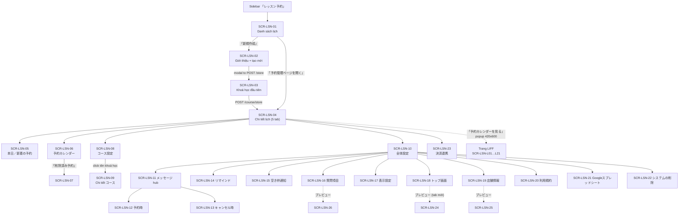
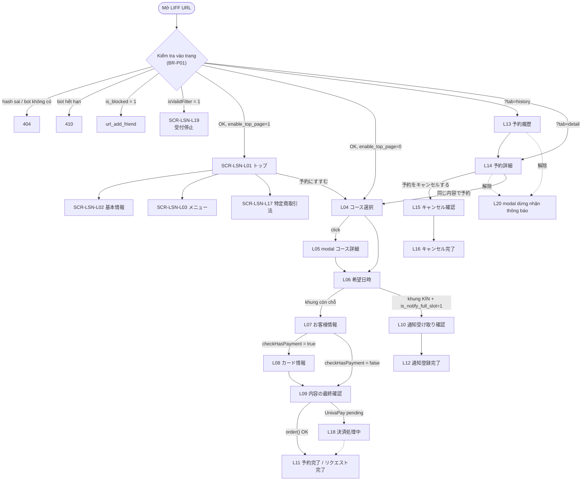
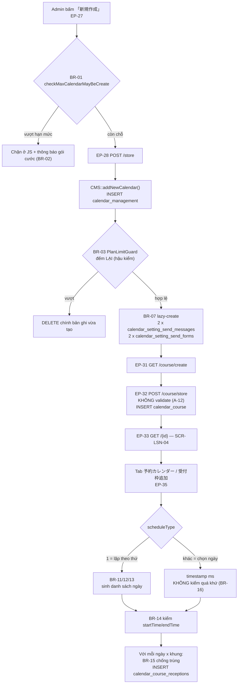
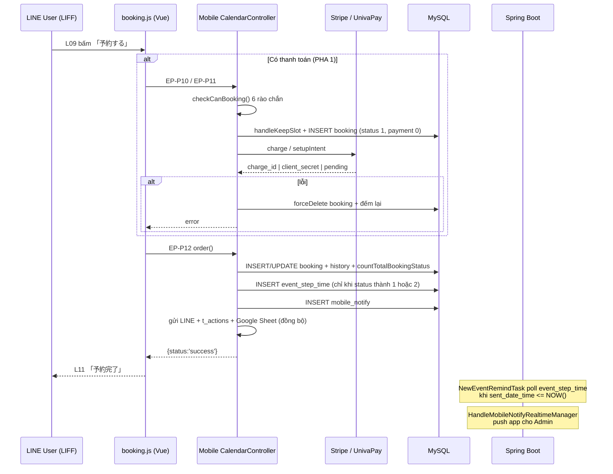
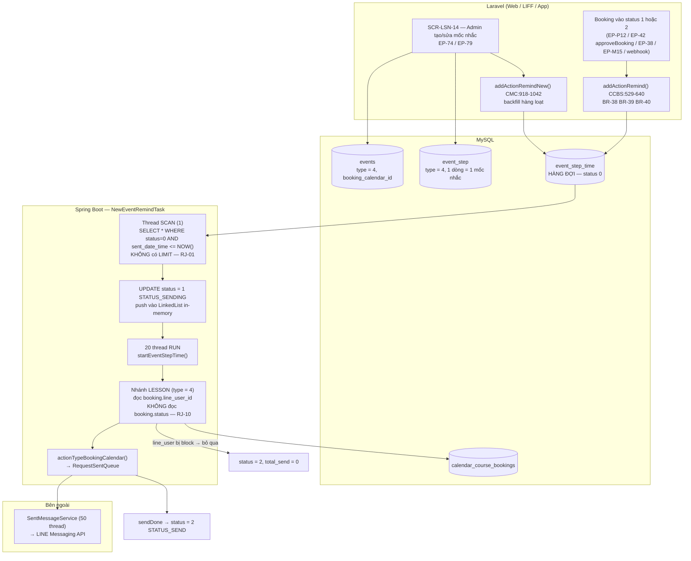
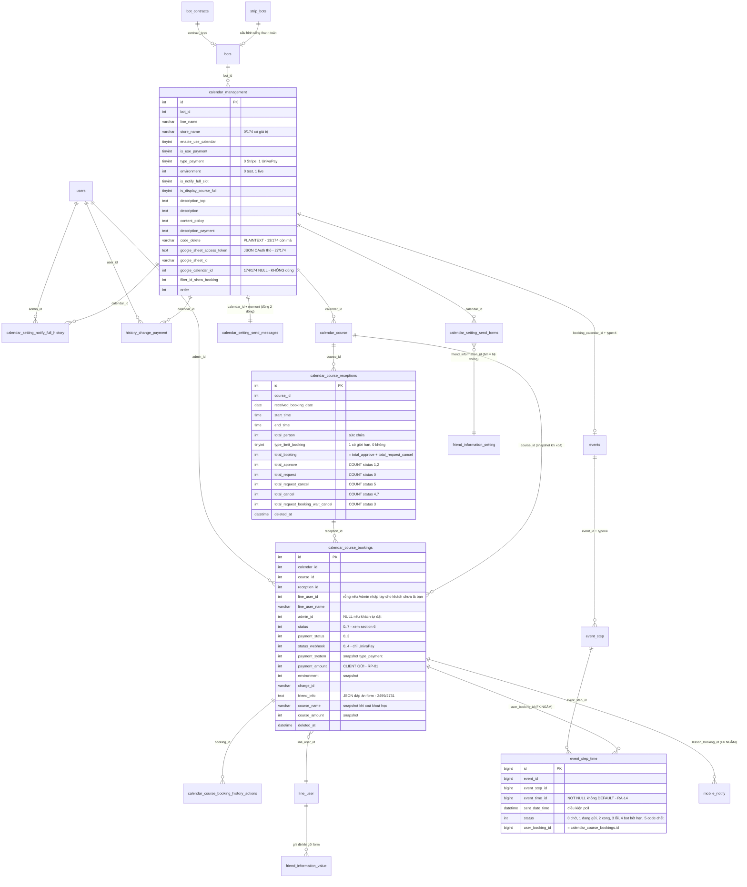
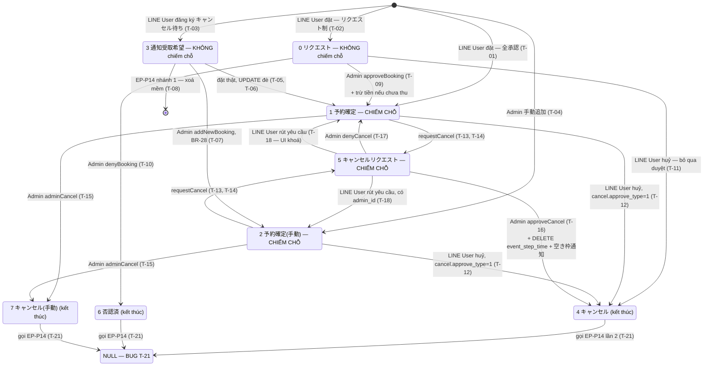

# FA-019 — Đặt lịch bài học (「レッスン予約」)

> **Tài liệu tổng hợp cuối cùng** — dành cho PM, tester và dev.
> Tạo bởi: **spec-compiler** agent | Ngày: 2026-08-24 | Kết luận kiểm tra chéo: **ĐẠT (có điều kiện)** — 0 vấn đề Nghiêm trọng ở tài liệu.
> Portal: **Admin / Staff** (`/basic/calendar-management`) + **LINE User** (LIFF `/mobile/calendar/{hash}`) + **ứng dụng di động Admin** (`/api/mobile/calendar-lesson/*`).
> Độ tin cậy tổng thể: **Cao** cho cấu trúc, API, logic nghiệp vụ, dữ liệu — **Trung bình** cho mảng trực quan (không có screenshot, xem §2.3).

**Tài liệu chi tiết đi kèm** (file này **tổng hợp + dẫn chiếu**, không lặp lại nguyên văn):

| Phạm vi | File | Dòng |
|---|---|---|
| UI Admin (26 màn) | [`ui/ui-spec.md`](ui/ui-spec.md) | 1 562 |
| UI LINE User / LIFF (21 màn) | [`ui/ui-spec-liff.md`](ui/ui-spec-liff.md) | 1 083 |
| API Admin (82 endpoint) | [`web/api-spec.md`](web/api-spec.md) | 1 451 |
| API LIFF + app di động (32 endpoint) | [`web/api-spec-public.md`](web/api-spec-public.md) | 932 |
| Business logic Admin (56 rule) | [`web/logic-spec.md`](web/logic-spec.md) | 1 366 |
| Business logic public (37 rule) | [`web/logic-spec-public.md`](web/logic-spec-public.md) | 1 066 |
| Background jobs (6 job) | [`job/job-spec.md`](job/job-spec.md) | 675 |
| Database mapping (26 bảng) | [`db/db-mapping.md`](db/db-mapping.md) | 1 554 |
| Báo cáo kiểm tra chéo | [`_internal/validation-report.md`](_internal/validation-report.md) | 692 |

---

## Mục lục

1. [Tổng quan](#1-tổng-quan)
2. [Nguồn dữ liệu & phương pháp](#2-nguồn-dữ-liệu--phương-pháp)
3. [Bản đồ màn hình (47 màn)](#3-bản-đồ-màn-hình-47-màn)
4. [Luồng xử lý end-to-end](#4-luồng-xử-lý-end-to-end)
5. [Mô hình dữ liệu](#5-mô-hình-dữ-liệu)
6. [State machine trạng thái đặt chỗ](#6-state-machine-calendar_course_bookingsstatus)
7. [Ma trận truy vết trường](#7-ma-trận-truy-vết-trường-field-traceability-matrix)
8. [Business Rules (93 rule)](#8-business-rules-93-rule)
9. [API Endpoints (114 endpoint)](#9-api-endpoints-114-endpoint)
10. [Background Jobs](#10-background-jobs)
11. [Rủi ro & nợ kỹ thuật](#11-rủi-ro--nợ-kỹ-thuật) ← **mục quan trọng nhất**
12. [Phụ thuộc chéo](#12-phụ-thuộc-chéo)
13. [Gaps & Unknowns](#13-gaps--unknowns)
14. [Chất lượng spec](#14-chất-lượng-spec)

---

## 1. Tổng quan

### 1.1 Mục đích

「レッスン予約」 (Đặt lịch bài học) là **một trong ba hệ thống đặt chỗ** của LME. Đặc trưng cốt lõi: **chỉ nhận đặt chỗ trong các khung giờ 「受付枠」 (reception slot) mà Admin đã đăng ký trước**, mỗi khung có 定員 (sức chứa) riêng.

Khẩu hiệu định vị ngay trên màn tạo mới (`create.blade.php:64`):
> 「決まった時間枠だけ予約を受付できます」 — *Chỉ nhận đặt chỗ đúng những khung thời gian đã định.*

**Ngành nghề mục tiêu** (`create.blade.php:90-105`): 「学習塾」「料理教室」「パソコン教室」「オンラインレッスン」「ヨガ・ピラティス教室」.
**Ngành nghề KHÔNG hỗ trợ** (`create.blade.php:173-185`): 「時間貸し施設予約」「物品レンタル予約」「飲食店予約」「宿泊予約」.

### 1.2 Phân biệt với 2 tính năng anh em trong nhóm 「予約管理」

| | **FA-019 「レッスン予約」** | FA-020 「サロン・面談予約」 | FA-021 「イベント予約」 |
|---|---|---|---|
| Cơ chế nhận đặt | **Khung giờ cố định (受付枠)** do Admin tạo trước, mỗi khung có 定員 | Nhận đặt bất kỳ lúc nào trong giờ mở cửa, theo ca làm việc (シフト) của nhân viên | Sự kiện có ngày giờ tổ chức cố định, nhận đăng ký tham dự |
| Khái niệm 「スタッフ」 | **Không có** | Có (calendar loại 「スタッフ」/「個人」) | Không có |
| Đơn vị con | コース + 受付枠 | コース + スタッフ + シフト | イベント |
| Prefix URL | `/basic/calendar-management` | `/basic/manager-booking`, `/basic/calendar-salon` | `/basic/booking-event-day/list-event` |
| Bảng chính | `calendar_management`, `calendar_course`, `calendar_course_receptions`, `calendar_course_bookings` | `calendar_salon*` (18 bảng) | `booking_event*`, `b_*` |
| **Tích hợp Google Calendar** | ❌ **KHÔNG CÓ** | ✔ Đồng bộ 2 chiều | ❌ |
| Tích hợp Google Sheets | ✔ Có (`google_sheet_*`) | ✔ | — |
| Hạn mức lịch tối đa | **1 / 3 / 10** theo gói (BR-01) | 20 | — |

> 🔴 **Điểm phải nhớ khi đọc spec**: FA-019 **KHÔNG có bất kỳ tích hợp Google Calendar nào**. Đây là khác biệt cơ bản với FA-020.
> **Đã kiểm chứng bằng 2 nguồn độc lập**: (a) `job-spec.md` §12 — grep toàn bộ `src/job/`: `GoogleCalendarEventTask`, `HandleGoogleCalendarCallbackManager`, `HandleSalonCalendarCallbackManager` đều chỉ thao tác trên `b_c_*` (予約管理 cũ) và `calendar_salon*`; (b) `db-mapping.md` §0 — cột `calendar_management.google_calendar_id` có tồn tại nhưng **174/174 bản ghi đều NULL**. Cũng **không có cron Laravel nào** cho FA-019 (`job-spec.md` §10). **Tin cậy: Cao.**

### 1.3 Actors

| Actor | Cổng truy cập | Quyền & giới hạn |
|---|---|---|
| **Admin (LINE OA)** | Portal web `/basic/calendar-management` — sidebar 「レッスン予約」 (`sidebar.blade.php:423`) | Toàn quyền: tạo lịch/khoá học/khung giờ, duyệt–từ chối đặt chỗ, thêm đặt chỗ tay, hoàn tiền, cấu hình tin nhắn & thanh toán, xoá hệ thống |
| **Staff** | **Cùng giao diện Admin** | Phân quyền **theo tên route** qua `BasicAccess` + `getRouterBotInvite()` (BR-56). **Không có một lệnh `checkHasPermission()` nào** trong 2 controller Admin (0/82 endpoint). 🔴 Nhóm route `/ajax/calendar/*` (17 endpoint) **nằm ngoài** cơ chế này — xem A-01 |
| **LINE User** | LIFF `https://liff.line.me/{liffId}?calendar_id={id}` → `/mobile/calendar/{calendarHashId}/{uCode?}` | Đặt chỗ, xem/huỷ lịch sử, đăng ký 「キャンセル待ち」, xem 特定商取引法. **Không xác thực** — danh tính chỉ dựa vào `line_user_id` / `uCode` client gửi |
| **Ứng dụng di động Admin** | `POST /api/mobile/calendar-lesson/*` (guard `api-mobile`) | 15 endpoint: duyệt/huỷ/hoàn tiền/thêm đặt chỗ/sửa khung giờ. **14/15 endpoint không kiểm quyền role** (S-18) |

```
System Admin (ngoài phạm vi FA-019)
        │
Admin (bot / LINE OA) ──tạo──► Lịch (calendar_management)
        │                          ├── コース (calendar_course)
        │                          │      └── 受付枠 (calendar_course_receptions)
        │                          │             └── 予約 (calendar_course_bookings)
        ├──tạo & phân quyền──► Staff (cùng portal, giới hạn theo tên route)
        └──dùng app di động──► API /api/mobile/calendar-lesson/*
                                   ▲
LINE User ──LIFF──► trang đặt chỗ public ──┘ (cùng bảng dữ liệu)
```

### 1.4 Phạm vi tính năng

**Trong phạm vi**

- Quản lý nhiều lịch 「レッスン予約」 (1 lịch = 1 trang đặt chỗ LIFF độc lập), số lượng theo gói cước
- 「コース」: tên, ảnh, thời lượng, giá, mô tả, tin nhắn + action riêng theo khoá học
- 「受付枠」: theo ngày cụ thể hoặc lặp theo thứ trong tuần, có 定員 hoặc không giới hạn
- Theo dõi đặt chỗ theo **4 chế độ xem**: 日 / 週 / 月 / 一覧
- Chế độ duyệt: 全承認 (tự động xác nhận) hoặc リクエスト制 (chờ Admin duyệt) — cấu hình **riêng** cho luồng đặt và luồng huỷ
- Thêm đặt chỗ thủ công (kể cả cho khách **chưa là bạn LINE**)
- Thanh toán online **Stripe / UnivaPay** + hoàn tiền
- Tin nhắn tự động: khi đặt / khi huỷ / **nhắc lịch trước-sau buổi học** / **thông báo khi có chỗ trống**
- 「キャンセル待ち」 — đăng ký nhận thông báo khi khung giờ kín chỗ
- Tuỳ biến form câu hỏi cho khách, trang top, thông tin cửa hàng, 利用規約
- Liên kết **Google Spreadsheet**, xuất/nhập CSV
- Xoá hệ thống đặt lịch (xác thực bằng mã gửi qua email)

**Ngoài phạm vi**

- Google Calendar (không có — xem §1.2)
- Hệ 予約管理 thế hệ cũ (`b_c_*`, `booking_calendar`) và FA-020 `calendar_salon*` — xem `db-mapping.md` §0
- Hệ thống Action 「エルメアクション」, Filter V2, Template, Rich Text Editor — là **shared component** SC-001…SC-005 (§12)

---

## 2. Nguồn dữ liệu & phương pháp

### 2.1 Phương pháp: code-first

Tại thời điểm dựng spec, **session browser Playwright đã hết hạn** ⇒ toàn bộ bộ spec được dựng **code-first**: đọc trực tiếp blade + controller + service + model + JS front-end + schema/dữ liệu DB, **không scan live**.

> Đây là **quyết định đã được chấp thuận** và **KHÔNG bị tính là lỗi** trong `validation-report.md` §0. Tuy nhiên hệ quả về độ tin cậy phải được giữ nguyên khi đọc tài liệu này.

| Nguồn | Nhánh / phiên bản | Ghi chú |
|---|---|---|
| Source code Laravel | `src/web/sns-line/` — nhánh `main`, commit `9f3ec48` | Laravel 5 + PHP 7.2 |
| Source code Spring Boot | `src/job/linect-service/` | Java 1.8 |
| Database | `db/schema/tables/*.sql` + `db/data/tables/*.sql` — **dump ngày 2026-04-20** | 308 bảng; FA-019 dùng 26 bảng |
| **Screenshot** | ❌ **KHÔNG CÓ** — `ui/screenshots/` rỗng | Xem §2.3 |

### 2.2 File nguồn đã đọc

| Nhóm | Số lượng | Chi tiết |
|---|---|---|
| Blade Admin | **70 file** | `resources/views/basic/calendar_management/` — 6 file gốc + 24 `modal/*` + 40 `tabs/**` |
| Blade LIFF | **23/23 file** | `…/calendar_management/bookings/**` (gồm 3 file chết không được include ở đâu) |
| Controller | 4 | `Basic\CalendarManagementController` (2 598 dòng), `Basic\SettingPaymentCalendarController` (213), `Mobile\CalendarController` (2 971), `Api\CalendarLessonController` (1 862) |
| Service | 8 | `App\Services\CalendarManagement\*` |
| Model Eloquent | 8 | + 1 bảng truy vấn `DB::table()` trực tiếp (`history_change_payment`) |
| Middleware | 6 | `BasicAccess`, `IsExpire`, `CheckRememberToken`, `HttpsProtocol`, `CheckLogin`, `CheckLessonCalendarBelongToBot` |
| FormRequest | 2 | `CreateCalendarCourse`, `EditCalendarCourse` |
| JS front-end | 7 | `calendar_detail.js` (258 KB), `edit_course.js`, `index.js`, `create_course.js`, `setting-payment.js`, `booking_news/booking.js` (1 852 dòng), `booking_news/validate.js` |
| Java (job) | ~12 | `NewEventRemindTask` (706 dòng), `MonitorCalendarBookingTask` (142), `AppMain`, `ConfigFile`, entity JPA… |

> **Độ phủ blade: 93/93 = 100 %.** **Độ phủ endpoint: 114/114 route thật = 100 %.** (`validation-report.md` §1.1, §1.2 — đếm lại trực tiếp trên đĩa.)

### 2.3 Hạn chế do không có screenshot — **BẮT BUỘC ĐỌC**

| Khía cạnh | Ảnh hưởng | Mức tin cậy |
|---|---|---|
| Cấu trúc DOM, id/class, `v-if`/`v-model`, nhãn tiếng Nhật | Không ảnh hưởng — đọc thẳng từ blade | **Cao** |
| Endpoint, tham số, validation, business rule | Không ảnh hưởng — đọc thẳng từ controller/service/FormRequest | **Cao** |
| Enum, tên bảng/cột, quan hệ DB | Không ảnh hưởng — đọc thẳng từ schema + dữ liệu thật | **Cao** |
| **Bố cục thực tế, màu sắc, khoảng cách, thứ tự hiển thị** | **Không xác nhận được** | **Trung bình** |
| **Nhánh `v-if` nào là mặc định trong vận hành thật** | **Không xác nhận được** — spec liệt kê *toàn bộ* nhánh | **Trung bình** |
| **Hành vi runtime của các bug UI đã phát hiện** (alert, `ReferenceError`…) | **Không xác nhận được** — chỉ suy từ mã | **Trung bình** |
| Dữ liệu vận hành thật (tên lịch, khoá học, số đặt chỗ) | Bù một phần bằng dump `db/data/` (2026-04-20) | **Trung bình–Cao** |

> ⚠ **Quy tắc khi dùng tài liệu này**: mọi khẳng định về **trực quan** giữ ở mức **Trung bình** — không được nâng lên Cao. Việc bổ sung screenshot 47 màn hình là hạng mục tồn đọng (§13).

### 2.4 Quy ước mã ID

| Prefix | Ý nghĩa | Số lượng |
|---|---|---|
| `SCR-LSN-01…26` | Màn hình Portal Admin | 26 |
| `SCR-LSN-L01…L21` | Màn hình LINE User (LIFF) | 21 |
| `EP-01…EP-82` | Endpoint Admin (nhóm A: 01–65, nhóm B: 66–82) | 82 |
| `EP-P01…EP-P17` | Endpoint LIFF public | 17 |
| `EP-M01…EP-M15` | Endpoint app di động Admin | 15 |
| `BR-01…BR-56` | Business rule phía Admin | 56 |
| `BR-P01…BR-P37` | Business rule phía public/LIFF | 37 |
| `RA-01…RA-19` | Rủi ro phía **A**dmin/web | 19 |
| `RP-01…RP-15` | Rủi ro phía **P**ublic/LIFF | 15 |
| `RJ-01…RJ-15` | Rủi ro phía **J**ob (Spring Boot) | 15 |
| `A-01…A-25` / `Q-01…Q-20` | Lỗ hổng bảo mật / bất thường chất lượng — phía Admin | 45 |
| `S-01…S-22` | Lỗ hổng bảo mật — phía public/app | 22 |
| `B-1…B-14` | Bug **hệ thống** đã hiệu chỉnh mức độ sau kiểm chứng mã nguồn | 14 |
| `V-01…V-14` | Lỗi **tài liệu** phát hiện khi kiểm tra chéo | 14 |

> Ba bộ mã rủi ro `RA-*` / `RP-*` / `RJ-*` đã được **đổi tên để hết trùng** (sửa lỗi V-02). Các file spec con đã áp bản sửa.

---

## 3. Bản đồ màn hình (47 màn)

**26 màn Portal Admin + 21 màn LINE User (LIFF) = 47 màn.** Chi tiết từng trường, `v-model`, validation → `ui/ui-spec.md` §5 và `ui/ui-spec-liff.md` §4.

### 3.1 Portal Admin — SCR-LSN-01…26

| Mã | Tên màn hình | Đường dẫn / vị trí | Vai trò |
|---|---|---|---|
| SCR-LSN-01 | 「レッスン予約（一覧）」 | `GET /basic/calendar-management` | Danh sách lịch, đổi 管理名, sắp xếp, banner hướng dẫn |
| SCR-LSN-02 | 「レッスン予約（新規作成）」 | `GET /create` | Trang giới thiệu + modal tạo lịch mới |
| SCR-LSN-03 | Đăng ký khoá học đầu tiên | `GET /course/create` | Bắt buộc ngay sau khi tạo lịch |
| SCR-LSN-04 | Chi tiết lịch — khung & tab bar | `GET /{id}` | Khung 5 tab + breadcrumb + nút mở trang đặt chỗ |
| SCR-LSN-05 | Tab 「本日／新着の予約」 | tab trong SCR-LSN-04 | Đặt chỗ hôm nay / mới đến; duyệt–từ chối, hoàn tiền |
| SCR-LSN-06 | Tab 「予約カレンダー」 | tab | 4 chế độ xem 日/週/月/一覧; tạo–sửa–xoá 受付枠; CSV |
| SCR-LSN-07 | 「削除済み予約」 | view trong tab 予約カレンダー | Đặt chỗ đã xoá **trong 90 ngày** (BR-54) |
| SCR-LSN-08 | Tab 「コース設定」 | tab | Danh sách khoá học, bật/tắt hiển thị, sắp xếp, xoá |
| SCR-LSN-09 | Chi tiết khoá học | `GET /{id}/edit-course/{courseId}` | Tên, ảnh, giá, thời lượng, tin nhắn + action theo khoá |
| SCR-LSN-10 | Tab 「全体設定」 — sidebar | tab | Menu trái 250 px dẫn tới SCR-LSN-11…22 |
| SCR-LSN-11 | 「予約・キャンセルのメッセージ・リクエストと締切」 | 全体設定 | Hub — 2 thẻ 予約 / キャンセル |
| SCR-LSN-12 | 「予約時の各種設定」 | 全体設定 | `moment='booking'`: 承認方式, hạn nhận đặt, tin nhắn, action |
| SCR-LSN-13 | 「予約キャンセル時の各種設定」 | 全体設定 | `moment='cancel'`: 承認方式 (1/2/**3** = không cho huỷ), hạn huỷ |
| SCR-LSN-14 | 「予約前後に送るリマインドメッセージ」 | 全体設定 | Mốc nhắc lịch trước/sau buổi học (`event_step` type = 4) |
| SCR-LSN-15 | 「空き枠通知受け取り設定」 | 全体設定 | Bật/tắt 「キャンセル待ち」 + nội dung 2 loại tin |
| SCR-LSN-16 | 「予約時のお客様への質問項目」 | 全体設定 | Form builder: 5 `form_type`, liên kết hồ sơ bạn bè |
| SCR-LSN-17 | 「予約ページの表示設定」 | 全体設定 | Bật/tắt trang, lọc bạn bè được xem (`filter_id_show_booking`) |
| SCR-LSN-18 | 「トップ画面設定」 | 全体設定 | Ảnh + `description_top` (TinyMCE) |
| SCR-LSN-19 | 「店舗・ビジネス情報」 | 全体設定 | Ảnh + `description` + `line_name`/`store_name` |
| SCR-LSN-20 | 「利用規約」 | 全体設定 | `content_policy` (TinyMCE) |
| SCR-LSN-21 | 「Googleスプレッドシート連携」 | 全体設定 | OAuth Google Sheets, tạo/ngắt liên kết |
| SCR-LSN-22 | 「予約システムの削除」 | 全体設定 | 3 bước: gửi mã email → kiểm mã → xoá |
| SCR-LSN-23 | Tab 「決済連携」 | tab | Stripe/UnivaPay, 本番/テスト環境, 特定商取引法 |
| SCR-LSN-24 | Preview 「トッププレビュー」 | `GET /{id}/preview-top` | ⚠ Hiển thị `description` thay vì `description_top` — bug M-2 |
| SCR-LSN-25 | Preview 「店舗情報プレビュー」 | `GET /{id}/preview` | |
| SCR-LSN-26 | Preview 「質問項目プレビュー」 | `GET /{id}/preview-form` | |

**Modal Admin**: 24 file `modal/*.blade.php` + 8 file `tabs/booking/modal/*.blade.php` (7 cặp trùng lặp — xem RA-19 / §12.4). Modal lớn nhất: `detail_reception.blade.php` (853 dòng).

### 3.2 LINE User / LIFF — SCR-LSN-L01…L21

Toàn bộ là **SPA Vue 2 một trang** — chuyển màn lớn bằng biến `screen_show`, chuyển bước wizard bằng `step_booking`.

| Mã | Tên màn hình | Blade | Vai trò |
|---|---|---|---|
| SCR-LSN-L01 | 「トップページ」 | `top_page.blade.php` | Trang giới thiệu đầu; bỏ qua khi `enable_top_page = 0` |
| SCR-LSN-L02 | 「基本情報」 | `basic_information.blade.php` | Thông tin cửa hàng |
| SCR-LSN-L03 | Menu trượt bên phải | `menu-right.blade.php` | 基本情報 / 予約履歴一覧 / 特定商取引法 |
| SCR-LSN-L04 | Bước 1 — 「コースを選んでください」 | `booking_create_step1.blade.php` | Danh sách khoá học (đã lọc FilterV2) |
| SCR-LSN-L05 | Modal chi tiết khoá học | inline `layouts/main.blade.php` | Ảnh, giá, thời lượng, mô tả |
| SCR-LSN-L06 | Bước 2 — 「希望日時を選んでください」 | `booking_create_step2.blade.php` | Lịch 週/月 (FullCalendar 6), badge 残り N / 定員上限なし / 通知受け取り |
| SCR-LSN-L07 | Bước 3 — 「お客様情報を入力してください」 | `booking_create_step3.blade.php` | Form động 5 `form_type`, prefill hồ sơ bạn bè |
| SCR-LSN-L08 | Bước 4 — 「カード情報を入力してください」 | `booking_create_step4.blade.php` | Stripe Elements **hoặc** UnivaPay iframe — **dữ liệu thẻ không đi qua DOM của LME** |
| SCR-LSN-L09 | Bước 5 — 「内容の最終確認」 | `booking_create_step5.blade.php` | Xác nhận + nút 予約する |
| SCR-LSN-L10 | Bước 5 (nhánh) — xác nhận đăng ký 「キャンセル待ち」 | `register-notify-slot.blade.php` | |
| SCR-LSN-L11 | Bước 6 — hoàn tất đặt chỗ | `booking_status.blade.php` | 「予約完了」 hoặc 「リクエスト完了」 |
| SCR-LSN-L12 | Bước 6 (nhánh) — hoàn tất đăng ký nhận thông báo | `booking_status_register_notify.blade.php` | |
| SCR-LSN-L13 | 「予約履歴」 (danh sách) | `booking_history.blade.php` | 3 nhóm 現在 / 通知受け取り / 過去; 8 badge trạng thái |
| SCR-LSN-L14 | 「予約履歴」 (chi tiết) | `booking_history_detail.blade.php` | 5 nhánh loại trừ; nút 予約をキャンセルする; 同じ内容で予約 |
| SCR-LSN-L15 | Bước 7 — 「キャンセル内容の最終確認」 | `confirm-cancel.blade.php` | |
| SCR-LSN-L16 | Bước 8 — kết quả huỷ | `status_cancel.blade.php` | 「キャンセル完了」 hoặc 「リクエスト完了」 |
| SCR-LSN-L17 | 「特定商取引法に関する記載」 | `regulations.blade.php` | `v-html` từ `description_payment` |
| SCR-LSN-L18 | 「決済処理を行っています」 | `wait-process.blade.php` | Chờ webhook UnivaPay |
| SCR-LSN-L19 | 「受付停止」 | `close-booking.blade.php` | Trang HTML **độc lập** — khi filter chặn hoặc tắt nhận đặt |
| SCR-LSN-L20 | Modal xác nhận dừng nhận thông báo | trong L13 + L14 | Nhân bản 2 lần trong cùng tính năng |
| SCR-LSN-L21 | Trạng thái toàn trang (banner preview / lỗi) | `layouts/main.blade.php` | 「この予約は現在利用できません。」, redirect 404/410 |

> 3 blade **chết** (không được include ở đâu trong toàn repo): `layouts/header.blade.php`, `layouts/step.blade.php`, `calendar.blade.php`. Xác minh bằng grep toàn repo. **Tin cậy: Cao.**

### 3.3 Sơ đồ điều hướng — Portal Admin



### 3.4 Sơ đồ điều hướng — LINE User (LIFF)



> ⚠ Thanh tiến trình 5 chấm: chấm thứ 4 (bước thẻ) bị ẩn khi `step_booking > 2 && !checkHasPayment`. Hai computed `current_step` / `percent_progress` trong `booking.js` là **code chết** — không blade nào dùng. **Tin cậy: Cao.**

---

## 4. Luồng xử lý end-to-end

7 luồng chính, mỗi luồng đi trọn: **hành động người dùng → UI → endpoint → business logic → bảng DB → job (nếu có) → phản hồi → cập nhật UI**.

Ký hiệu đường dẫn source: `CMC` = `Basic/CalendarManagementController.php`, `CCBS` = `Services/CalendarManagement/CalendarCourseBookingService.php`, `CCRS` = `…/CalendarCourseReceptionService.php`, `CCS` = `…/CalendarCourseService.php`, `CMS` = `…/CalendarManagementService.php`, `SPCC` = `Basic/SettingPaymentCalendarController.php`, `MC` = `Mobile/CalendarController.php`, `AC` = `Api/CalendarLessonController.php`.

---

### 4.1 (a) Admin thiết lập: tạo lịch → tạo khoá học → tạo khung nhận đặt

| # | Hành động người dùng | Màn hình | Endpoint | Business logic | Ghi DB | Phản hồi & cập nhật UI |
|---|---|---|---|---|---|---|
| 1 | Bấm 「新規作成」 | SCR-LSN-01 | `EP-27 GET /create` | `checkMaxCalendarMayBeCreate()` — **BR-01** (1/3/10 lịch theo gói) | — | Mở **tab mới** SCR-LSN-02; vượt hạn mức thì JS chặn nút + hiện thông báo gói cước (**BR-02**) |
| 2 | Điền tên trong modal 「レッスン予約新規作成」 → 保存 | SCR-LSN-02 | `EP-28 POST /store` | `CMS::addNewCalendar()`; sau INSERT chạy `PlanLimitGuard::rollbackIfOverLimit()` — **BR-03** (hậu kiểm, không khoá: 2 request cùng lọt thì bản id lớn hơn **tự xoá chính nó**) | INSERT `calendar_management` (`store_name = line_name`, mẫu tin 空き枠通知 mặc định — **BR-08**, **BR-10**) | JSON; JS redirect sang SCR-LSN-03 |
| 3 | *(tự động)* Lazy-create cấu hình mặc định | — | (trong luồng bước 2 / lần đọc đầu tiên) | **BR-07** — lazy-create: mọi lần đọc thấy rỗng đều tạo lại | INSERT **2** dòng `calendar_setting_send_messages` (`moment='booking'` + `'cancel'`), **2** dòng `calendar_setting_send_forms` (họ tên `friend_information_id = -1`, email `-3`, cả hai `can_delete = 0`) | — |
| 4 | Nhập khoá học đầu tiên → 「基本情報を保存」 | SCR-LSN-03 | `EP-32 POST /course/store` | ⚠ **A-12** — endpoint này **bỏ qua toàn bộ validation**: không FormRequest, không kiểm trần 200 khoá / gói free 2 khoá, `calendar_id` do client gửi (khác hẳn `EP-07` cùng chức năng) | INSERT `calendar_course` (`booking_page_display = 1`; `use_message_notify_send_after_booking = 1` và `…_send_approve_booking = 1` — giá trị `1` nghĩa là **「利用しない」 = tắt gửi tin**, **BR-09**) | Redirect `GET /{id}` → SCR-LSN-04 |
| 5 | Tab 「予約カレンダー」 → 「受付枠追加」 | SCR-LSN-06, modal `add_new_reception` | `EP-35 POST /{id}/course/reception/create` | `CCRS::create()`: `scheduleType == 1` (lặp theo thứ) ⇒ **BR-11** (≥1 thứ), **BR-12** (không quá khứ), **BR-13** (≤ 1 năm); `scheduleType` khác (chọn ngày cụ thể) ⇒ nhận `dateCanBooking` là **timestamp mili-giây**, **không kiểm quá khứ, không kiểm 1 năm** (**BR-16**). Với mỗi ngày × khung: **BR-14** (bắt buộc `startTime`/`endTime`) rồi **BR-15** (chống trùng `course_id + ngày + giờ`) | INSERT nhiều dòng `calendar_course_receptions` (`total_person`, `type_limit_booking`) | `{success:true}`; JS gọi lại `EP-34`/`EP-41` để vẽ lại lịch |
| 6 | *(tuỳ chọn)* Bật thanh toán | SCR-LSN-23 | `EP-20 POST /save-setting-payment` | **BR-52** (tab chỉ mở khi bot đã liên kết Stripe `status_strip_bot=3` hoặc UnivaPay có đủ 2 app id); **BR-50** cưỡng bức bật 2 mục form họ tên + email (`enable=1, required=1`) — **kể cả khi TẮT thanh toán**; **BR-51** chỉ ghi `type_payment`/`environment`/`description_payment` khi bật | UPDATE `calendar_management`; UPDATE `calendar_setting_send_forms`; INSERT `history_change_payment` | Reload cấu hình qua `EP-21` |



> ⚠ **Rủi ro liên quan**: `EP-35` có thể tạo tới **365 ngày × N khung trong 1 request**, **không transaction, không giới hạn khối lượng** (A-17, RA-01).

---

### 4.2 (b) LINE User đặt chỗ — 3 biến thể

Điểm kiến trúc mấu chốt: **đặt chỗ CÓ thanh toán đi 2 request** (`EP-P10`/`EP-P11` giữ chỗ + thu tiền → rồi `EP-P12` chốt); **đặt chỗ KHÔNG thanh toán chỉ đi 1 request** (`EP-P12`). Toàn bộ khác biệt do **cờ `checkHasPayment` do client gửi** quyết định (`MC:1425`, `:1468`) — xem 🔴 **RP-01**.

#### Bước chung 0–4 (không ghi DB)

| Bước UI | Màn | Endpoint | Xử lý server |
|---|---|---|---|
| Mở trang | L01–L03 | `EP-P01` | **BR-P01** — kiểm Hashids, calendar, bot, `is_blocked`, hết hạn hợp đồng, filter `filter_id_show_booking`. Bot gói `free` ⇒ ép `is_use_payment = 0` **chỉ trên object PHP**, DB không đổi (**BR-P21**) |
| Kiểm tra còn là bạn bè | toàn trang | `EP-P17` | **Dùng chung endpoint của FA-020** `POST /ajax/mobile/calendar-salon/check-friend` (§12) |
| Chọn コース | L04, L05 | `EP-P03` | **BR-P03** — chỉ hiện khoá có `booking_page_display = 1` và thoả FilterV2 |
| Chọn 希望日時 | L06 | `EP-P04` (週) / `EP-P05` (月) | **BR-P04** ẩn/khoá slot; **BR-P05** 月 và 週 hiển thị lệch nhau; **BR-P06** tự nhảy tối đa 4 tuần / 2 tháng. Trả `total_person` đã bị `selectRaw` ghi đè thành **số chỗ CÒN LẠI** (clamp về 0) |
| Nhập お客様情報 | L07 | `EP-P06` | Prefill từ `line_user` + `friend_information_values` |
| Nhập カード情報 | L08 | `EP-P08`, `EP-P09` (UnivaPay) | Tokenize ở phía cổng thanh toán — **dữ liệu thẻ không đi qua server LME** |

#### Biến thể B1 — KHÔNG thanh toán, 全承認 (`approve_type = 1`) → 1 request

```
L09 「予約する」
  → POST /ajax/calendar-order  (EP-P12, order() MC:1414)
      1. checkCanBooking()  — 6 rào chắn BR-P07/P08/P09/P16 (MC:2073-2151)
      2. xoá sạch mọi trường thẻ client gửi; payment_status = 2 (SP_NO_PAYMENT)
      3. INSERT calendar_course_bookings  status = 1 (BR-P13)
      4. "arbiter" chống trùng đồng thời (chỉ bắt request trùng tới từng GIÂY — RP-02)
      5. INSERT calendar_course_booking_history_actions  status = 1 「予約完了」 (T-01)
      6. countTotalBookingStatus(reception_id) — BR-21, ghi lại 6 bộ đếm
      7. side effect:
           INSERT event_step_time      (addActionRemind — hàng đợi nhắc lịch)
           INSERT mobile_notify        ('autoApprove', status = 100)
           sendAction t_actions '11001'
           gửi LINE: message_send_after_booking (cấp コース) ưu tiên, fallback message_send_end
           insertDataToGoogleSheet()   ← ĐỒNG BỘ trong request (RP-13)
           UPDATE đè hồ sơ bạn bè (line_user + friend_information_values) — BR-P36
  ← {status: 'success'}  →  UI chuyển L11 「予約完了」
```
**Job kích hoạt**: `NewEventRemindTask` sẽ nhặt `event_step_time` khi tới `sent_date_time` (§4.5); `HandleMobileNotifyRealtimeManager` đẩy push cho Admin.

#### Biến thể B2 — CÓ thanh toán, 全承認 → 2 pha

```
PHA 1  L09 「予約する」 → EP-P10 (Stripe) hoặc EP-P11 (UnivaPay)
   checkCanBooking()
   handleKeepSlot() → checkValidSlot() GIỮ CHỖ (atomic) → createOrderPayment()
        INSERT booking  status = 1, payment_status = 0, status_webhook = 0 (hoặc 3)
   Stripe : paymentIntents(confirm=true, setup_future_usage=off_session)
        lỗi        → deleteOrderError() forceDelete booking + đếm lại chỗ (BR-P23)
        cần 3-DS   → trả client_secret; client hỏng thì phải tự gọi EP-P13
   UnivaPay: chargeMoneyUnivapaySale(metadata.module = 'lesson')
        có webhook → poll 5 lần x 1s (BR-P24)
             success → tiếp PHA 2
             pending → status_webhook = 4, UI chuyển L18 「決済処理を行っています」
                       webhook UnivaPay chốt sau qua handleOrderCallback() (BR-P25, BR-P26)

PHA 2  → EP-P12 order()
   UPDATE booking: payment_status = 1, status = 1, status_webhook = 1 (LUÔN ghi đè — RP-14)
   INSERT history, countTotalBookingStatus(), toàn bộ side effect như B1
   ← UI chuyển L11
```

#### Biến thể B3 — CẦN DUYỆT (`moment='booking'.approve_type = 2`, リクエスト制)

```
EP-P12 order()  →  INSERT booking  status = 0 (BR-P13)
                   history status = 2 SB_REQUEST_BOOKING_WAITING_APPROVE 「予約リクエスト」 (T-02)
                   mobile_notify 'requestBooking';  t_actions '11002'
                   gửi LINE message_send_booking
                   KHÔNG tạo event_step_time  (nhắc lịch chỉ sinh khi status vào 1 hoặc 2)
                   Stripe: chỉ setupIntent() LƯU THẺ — KHÔNG giữ chỗ, KHÔNG tạo booking ở pha 1
                   UnivaPay: vẫn THU TIỀN NGAY bất kể approve_type (BR-P22)
UI → L11 「リクエスト完了」

Sau đó Admin duyệt:
  Web  : SCR-LSN-05 → EP-42 POST /{id}/booking/change-status  (actionChange = approveBooking)
  App  : EP-M01 change-status-booking
  → BR-24: nếu payment_status = 0 thì TRỪ TIỀN TRƯỚC; thất bại thì return ngay, status giữ nguyên
  → status 0 → 1;  history (2)→(3) rồi INSERT (4) 「予約リクエスト 承認」
  → INSERT event_step_time (nhắc lịch bắt đầu tồn tại từ đây)
  → mobile_notify, gửi LINE, Google Sheet updateStatusBooking()
  → countTotalBookingStatus()
```

> 🔴 **`status = 0` KHÔNG chiếm chỗ** ⇒ chế độ リクエスト制 nhận **vô hạn** yêu cầu; `approveBooking` lại **không kiểm sức chứa** ⇒ Admin duyệt hàng loạt là overbooking (**B-10**, RP-03, §6.3).



---

### 4.3 (c) 「キャンセル待ち」 — đăng ký nhận thông báo khi kín chỗ

**Không có bảng riêng.** Một đăng ký chờ chỗ = **một hàng `calendar_course_bookings` với `status = 3`** (`SB_REQUEST_BOOKING_WAIT_CANCEL`), đếm vào `calendar_course_receptions.total_request_booking_wait_cancel`.

#### Đăng ký

| # | Hành động | Màn | Endpoint | Logic | DB |
|---|---|---|---|---|---|
| 1 | Chọn khung giờ **đã kín** trên lịch (chỉ hiện khi `calendar_management.is_notify_full_slot = 1`) | L06 | — | **BR-P04** — slot kín vẫn hiện nhưng `is_can_booking = false` | — |
| 2 | Xác nhận 「通知を受け取る」 | L10 | `EP-P12` với `register_notify_slot = 'true'` | **BR-P12** — **BỎ QUA hoàn toàn `checkCanBooking()`**: không kiểm khoá học hiển thị, không kiểm hạn nhận đặt, không kiểm trần số lần đặt/khách. Chỉ kiểm `is_notify_full_slot != 0` (ngược lại ném lỗi code `3` 「この機能は現在利用できませんん。」 — typo 2 chữ ん, D-05). `amount` ép về `0` | INSERT booking `status = 3`; INSERT history `status = 11` `reason = 「キャンセル待ち 登録」` (T-03); `countTotalBookingStatus()` |
| 3 | Side effect | — | — | `sendAction` `t_actions` code `11009`; gửi LINE `message_notify_full_slot`. **BỎ QUA** `insertNotifyLesson()` ⇒ **Admin KHÔNG nhận push** (BR-P33); **BỎ QUA** Google Sheet (BR-P35); **BỎ QUA** `addActionRemind()` | — |
| 4 | Kết quả | L12 「通知受け取り登録完了」 | — | **BR-P11** — mỗi khách chỉ **1** đăng ký/slot | — |

#### Bắn thông báo khi có chỗ trống

Toàn bộ do **`CCBS::sendNotifyWhenThereIsSlotEmpty()`** (`CCBS:1292-1355`) — **chạy ĐỒNG BỘ trong request**, **không queue, KHÔNG có job Spring Boot**.

```
Điều kiện chạy (BR-32 / BR-P32):
   calendar.is_notify_full_slot = 1
   reception còn tồn tại
   received_booking_date + start_time >= NOW()   (slot chưa qua)

4 nơi gọi:
   EP-P14  LINE User huỷ và trạng thái ra = 4        (MC:2376-2379)
   EP-M01  approveCancel  (5 → 4)                    (AC:387)
   EP-M01  adminCancel    (1/2 → 7)                  (AC:449)
   EP-M11  Admin TĂNG sức chứa slot đang kín         (AC:1508-1512)
   + BR-19: sửa 定員 qua CCRS khi khung đang đầy

Hành vi (BR-33 / BR-P31):
   gửi cho TẤT CẢ booking status = 3 của slot, ĐỒNG LOẠT
   không xếp hàng, không ưu tiên ai đăng ký trước, KHÔNG giữ chỗ tạm
   bản ghi status = 3 KHÔNG bị xoá sau khi gửi
   nội dung: message_notify_not_full (khi use_message_notify_not_full = 0)
   action  : action_id_not_full → t_actions code '11009'
```

> ⚠ **Hệ quả vận hành** (RP-09, RP-10): 10 người chờ + 1 chỗ trống ⇒ 10 tin gửi đi, 9 người bấm vào gặp 「予約がいっぱいです」. Slot có 100 người chờ ⇒ request huỷ của khách phải gửi 100 tin LINE **trước khi trả về** ⇒ nguy cơ timeout. Bản đăng ký không hết hạn ⇒ tích luỹ và gửi lặp mãi.
> ⚠ **BR-35**: `saveSettingNotifyFull()` **luôn ép** `use_message_notify_not_full = 0` ⇒ tin 「空き枠通知」 **không thể tắt** từ giao diện, chỉ tắt được bằng cách xoá rỗng nội dung.
> ⚠ Khi khách đặt thật, bản ghi `status = 3` bị **UPDATE đè** thành booking (T-05/T-06/T-07, **BR-28**) ⇒ **mất dấu vết** người này từng chờ chỗ.

---

### 4.4 (d) Huỷ đặt chỗ

#### d1 — LINE User yêu cầu huỷ → Admin duyệt / từ chối

| # | Hành động | Màn | Endpoint | Logic | DB | Kết quả UI |
|---|---|---|---|---|---|---|
| 1 | 「予約をキャンセルする」 | L14 → L15 | — | **BR-P16** — kiểm hạn huỷ `checkIsValidCancel()` (`deadline_cancel_booking_type = 2`) | — | Màn xác nhận L15 |
| 2 | Xác nhận huỷ | L15 | `EP-P14 POST /ajax/calendar-cancel-booking` | **BR-P14** — đọc `approve_type` của hàng `moment='cancel'` **từ DB** (an toàn hơn luồng đặt): `= 1` ⇒ về `4` ngay (T-12); `= 2` ⇒ về `5` chờ duyệt (T-13). **Ngoại lệ**: booking đang ở `status = 0` **luôn** về `4` bất kể cấu hình (T-11) | UPDATE `status`; INSERT history `6` hoặc `7`; `countTotalBookingStatus()` | L16 「キャンセル完了」 / 「リクエスト完了」 |
| 3a | Nếu về `4` (huỷ tự động) | — | — | **DELETE `event_step_time`** (`status = 0`, có điều kiện `approve_type == 1`, `MC:2304-2314`); `mobile_notify 'autoCancel'`; `t_actions '11005'`; LINE `message_send_end`; Google Sheet `updateStatusBooking()`; **gọi `sendNotifyWhenThereIsSlotEmpty()`** | | |
| 3b | Nếu về `5` (chờ duyệt) | — | — | **Vẫn CHIẾM CHỖ** (BR-20). `mobile_notify 'requestCancel'`; `t_actions '11006'`; LINE `message_send_booking`. **Không** đụng `event_step_time` (đúng nghiệp vụ — huỷ chưa được chấp thuận) | | |
| 4 | Admin xử lý yêu cầu huỷ | SCR-LSN-05/06 modal 履歴 | `EP-42` (`approveCancel` / `denyCancel`) hoặc `EP-M01` | `approveCancel`: `5 → 4`, history `9` 「キャンセルリクエスト 承認」, **DELETE `event_step_time`**, gọi 空き枠通知. `denyCancel`: `5 → 1`, history `15` 「キャンセルリクエスト 否認」 | UPDATE + history + đếm lại | Modal đóng, bảng vẽ lại |

> ⚠ **`denyCancel` là "hoàn tác" không hoàn hảo**: đưa `5 → 1` **kể cả khi trạng thái trước khi xin huỷ là `2` (手動追加)** ⇒ đặt chỗ do Admin tạo bị đổi thành `1` và **mất dấu vết 「手動追加」**.
> ⚠ **BR-P15** — backend **CÓ** năng lực "rút lại yêu cầu huỷ" (`5 → 1/2`, T-18) qua `EP-P14`, nhưng **UI khoá**: `cancelRequestCancel()` (`booking.js:944`) không được blade nào bind; L14 hiện text chết 「キャンセルリクエストの取り消しはできません」. Vẫn là **lỗ hổng** vì endpoint không xác thực — kẻ tấn công gọi trực tiếp để rút yêu cầu huỷ của người khác (S-03).
> ⚠ **BR-P17 / RP-08 — bug `status = NULL`**: gọi `EP-P14` **hai lần liên tiếp** trên cùng `booking_id` (lần 1 → `4`, lần 2 rơi vào `else` cuối) ⇒ ghi `status = NULL` (T-21). Booking rơi khỏi **mọi** truy vấn `whereIn('status', …)` kể cả `countTotalBookingStatus()` ⇒ bộ đếm sai vĩnh viễn, **không phục hồi được qua UI**.

#### d2 — Admin huỷ trực tiếp

```
SCR-LSN-05/06 → modal 「予約のキャンセル」 → EP-42 (actionChange = adminCancel)
  guard: status ∈ {1, 2}   →  status = 7 SB_BOOKING_ADMIN_CANCEL
  history status = 10 「手動予約キャンセル」
  DELETE event_step_time (status = 0, event_step.type = 4)   ← CCBS:929-942
  sendNotifyWhenThereIsSlotEmpty()
  nội dung tin theo BR-46: chọn theo approve_type của hàng moment='cancel'
       1 全承認   → setting_action_id      + message_send_end
       2 リクエスト制 → setting_action_approve + message_send_approve
       3 không cho huỷ → KHÔNG gửi gì
  mobile_notify 'adminCancel';  Google Sheet updateStatusBooking()
  countTotalBookingStatus()
  ← {success: true}
```

#### d3 — Admin **xoá** đặt chỗ (khác với huỷ)

```
modal 「予約情報の削除」 → EP-43 DELETE /{id}/booking/delete → CCBS::delete() :1075-1098
  SOFT-DELETE booking (deleted_at)
  INSERT history status = 13 「予約情報の削除」
  ⚠ KHÔNG xoá event_step_time  →  B-5: khách vẫn nhận nhắc lịch cho đặt chỗ đã xoá
  ⚠ INSERT history nằm NGOÀI if($booking) → có thể sinh history trỏ tới booking không tồn tại
  Bản ghi hiện ở SCR-LSN-07 「削除済み予約」 trong 90 ngày (BR-54 — chỉ là BỘ LỌC HIỂN THỊ,
     không có job nào thật sự xoá; dữ liệu 2024 vẫn còn trong dump)
```

> 🔴 Modal 「削除済み予約」 chứa **2 bug chồng nhau** — xem **B-1 / B-2** ở §11.2, **phải sửa cùng lúc**.

---

### 4.5 (e) Nhắc lịch tự động (web ghi `event_step_time` → `NewEventRemindTask` → LINE)

Đây là **luồng duy nhất của FA-019 thực sự đi qua Spring Boot**.



**Chi tiết luồng**

| # | Mắt xích | Bằng chứng | Ghi chú |
|---|---|---|---|
| 1 | Admin cấu hình mốc nhắc | `EP-74` `POST /ajax/calendar/save-setting/remind` | **BR-37** — mỗi lịch tối đa **1** bản ghi `events` (`type = 4`, `category_id = -1`); mỗi mốc là 1 `event_step` (`type = 4`). ⚠ **Q-01**: `remindStepId` **không bao giờ được dùng** ⇒ EP-74 **luôn INSERT, không bao giờ UPDATE** ⇒ lưu nhiều lần sinh mốc trùng, khách nhận tin lặp |
| 2 | Tính thời điểm gửi | `CCBS:561-609`, `CMC:951-1003` | **BR-38** `type_remind = 1` (theo ngày): `sent = (ngày buổi học + time_send) ∓ before_day`. **BR-39** `type_remind = 2` (đếm ngược): `sent = giờ **bắt đầu** − HH:mm` (trước) hoặc `giờ **kết thúc** + HH:mm` (sau) |
| 3 | INSERT hàng đợi | `CCBS:613-628` | **BR-40** — chỉ INSERT khi `sent_date_time >= NOW()`; `type_remind = 1` còn cần `is_send_remind_real_time = 1`. ⚠ **RA-14**: cột `event_step_time.event_time_id` là `int NOT NULL` **không có DEFAULT** nhưng cả 2 điểm INSERT đều không set ⇒ chỉ chạy được khi MySQL **không** ở `STRICT_TRANS_TABLES`; và cả 2 hàm **nuốt exception** ⇒ sự cố hoàn toàn im lặng (RJ-13) |
| 4 | Job SCAN | `NewEventRemindTask.java:70` | `SELECT * FROM event_step_time WHERE status = 0 AND sent_date_time <= NOW()` — **không LIMIT**; rỗng ⇒ `sleep(5000)`; lỗi ⇒ `sleep(10000)`. Resume sau restart: nạp lại `status = 1` (`:54-61`) |
| 5 | Job RUN (20 thread) | `:123-338` | Bot hết hạn > 7 ngày ⇒ `status = 4`; `event_step` không tồn tại hoặc không tìm được LINE user ⇒ `status = 2, total_send = 0`; ngoại lệ ⇒ `status = 3` + báo Chatwork |
| 6 | Nhánh LESSON | `:161-173`, `:224-241` | Đọc `calendar_course_bookings` theo `user_booking_id`, lấy `line_user_id`; **người dùng đã block bot bị bỏ qua**. Nạp `CalendarCourse` rồi gọi `actionTypeBookingCalendar()` và `return` |
| 7 | Gửi LINE | `SentMessageService` (50 thread) | `RequestSentQueue` là `LinkedList` **in-memory tĩnh, KHÔNG có resume** ⇒ message đã rời `event_step_time` (status 2) nhưng chưa tới LINE là **mất vĩnh viễn** (RJ-02) |
| 8 | Đếm hạn mức gửi tin | `CCBS:1065-1070` | **BR-48** — mỗi tin tăng `bots.free_send_count += 1` và `updateMessageSendCount(botId, hôm nay, 3, 1)` |

**Dọn hàng đợi khi huỷ/xoá — bảng chốt** (`validation-report.md` §3.5, đã phân xử):

| Hành động | Xoá `event_step_time`? | Đánh giá |
|---|---|---|
| `approveBooking` | ✘ (ngược lại — **tạo** remind) | ✅ Đúng nghiệp vụ |
| `denyBooking` (0 → 6) | ✘ | ✅ **VÔ HẠI** — `status = 0` chưa từng có remind (`addActionRemind()` chỉ chạy ở `status ∈ {1,2}`) |
| `denyCancel` (5 → 1) | ✘ | ✅ Đúng — booking quay về APPROVE |
| `requestCancel` (1/2 → 5) | ✘ | ✅ Đúng — chưa huỷ thật |
| `approveCancel` (5 → 4) | ✔ | ✅ |
| `adminCancel` (1/2 → 7) | ✔ | ✅ |
| LIFF `autoCancel` (`approve_type = 1`) | ✔ (có điều kiện) | ✅ `MC:2304-2314` |
| **`deleteBooking()`** (soft-delete) | ✘ | ❌ **B-5 — lỗ hổng thật** |
| **`CCRS::delete()`** (xoá **1** khung) | ✘ — **đoạn xoá bị comment** | ❌ **B-6** — trong khi `deleteList()` (xoá **nhiều** khung) **vẫn xoá** ⇒ 2 đường UI, 2 hành vi |
| `CCRS::deleteList()` / `CCS::deleteCalendarCourse()` / `CMC::deleteCalendar()` / `CMC::deleteEventStep()` | ✔ | ✅ |

---

### 4.6 (f) Hoàn tiền

**Chỉ Admin thực hiện, chỉ hoàn TOÀN PHẦN, KHÔNG đổi `status`, KHÔNG thông báo cho khách** (BR-P27).

| # | Hành động | Màn | Endpoint | Logic | DB |
|---|---|---|---|---|---|
| 1 | Mở modal 「返金確認」 từ chi tiết đặt chỗ | SCR-LSN-05/06 (`modal/refund_booking.blade.php`) | — | Điều kiện thực tế: `payment_status = 1 (決済成功)`. ⚠ **Server KHÔNG kiểm lại** — xem A-09 | — |
| 2 | Chọn `refundType` rồi bấm 「返金する」 | modal 返金確認 | `EP-24 POST /order-refund` (web) hoặc `EP-M08` (app) | `refundType == 'now'` ⇒ gọi API hoàn tiền thật (Stripe `Refund` / UnivaPay `refundMoney`), dùng khoá theo `booking.environment` **snapshot tại lúc đặt**. `refundType` **khác** ⇒ **chỉ đánh dấu thủ công, không gọi cổng thanh toán** (BR-P28) | UPDATE `calendar_course_bookings`: `payment_status = 3 (SP_REFUND)`, `refund_type`, `admin_id`; INSERT history `status = 12` reason 「¥{金額}︎の返金（エルメから／決済システムから）」 |
| 3 | Đồng bộ | — | — | `CalendarGoogleSheetService::updateStatusPaymentBooking()` | — |
| 4 | Phản hồi | — | — | JSON `{success:true}` | Modal đóng, bảng vẽ lại; badge 「返金済み」 |

> 🟠 **RA-07 / A-09 — hoàn tiền thiếu 4 chốt**: (a) không kiểm `bot_id` ⇒ **IDOR**: hoàn tiền cho đặt chỗ của bot khác; (b) **không kiểm `payment_status` hiện tại** ⇒ **hoàn tiền lặp**, gọi API cổng thanh toán nhiều lần cho cùng `charge_id`; (c) không đối chiếu `payment_amount` với số thực đã trừ; (d) `refundType` **không có danh sách trắng** — mọi giá trị khác `'now'` đều rơi vào nhánh "đánh dấu thủ công" và được ghi thẳng vào cột `refund_type`.
> ⚠ **RA-15** — thao tác nhạy cảm nhất này **không được ghi nhật ký** ở tầng ứng dụng.
> ⚠ Booking đã hoàn tiền **vẫn giữ `status` cũ** ⇒ **vẫn chiếm chỗ** trong `total_booking`.

---

### 4.7 (g) Xoá hệ thống đặt lịch (xác thực mã qua email)

```
SCR-LSN-22 「予約システムの削除」  — 3 bước, TẤT CẢ thuộc nhóm B /ajax/calendar/*
                                       (KHÔNG basic_access, KHÔNG is_expire, KHÔNG CSRF — A-01)

B1  「削除用認証コードをメールで受け取る」
      EP-69 POST /ajax/calendar/send-mail/delete     CMC:645-679
        sinh mã 10 ký tự → UPDATE calendar_management.code_delete (PLAINTEXT)
        gửi App\Mail\SendAuthCode tới email của user đang đăng nhập  (BR-53)
        🔴 A-05: mã ĐƯỢC TRẢ THẲNG trong response JSON ('code' => $code, :670)

B2  Nhập mã → EP-70 POST /ajax/calendar/check-author/delete    CMC:681-713
        so khớp code_delete + bot_id → mở khoá nút xoá
        ⚠ mã KHÔNG có hạn dùng, KHÔNG bị xoá sau khi dùng (BR-53)

B3  「削除する」 → EP-71 POST /ajax/calendar/action/delete      CMC:715-771
        Thứ tự xoá 10 nhóm (KHÔNG TRANSACTION — RA-01, A-14):
         1. calendar_management                       XOÁ CỨNG
         2. calendar_course (theo calendar_id)        XOÁ CỨNG
         3. calendar_course_receptions (theo course_id[])   forceDelete
         4. mỗi booking: history forceDelete; mobile_notify delete()
              ⚠ chỉ lấy booking CHƯA soft-delete (không withTrashed)
         5. calendar_course_bookings (theo calendar_id)     forceDelete  ← xoá CẢ bản đã soft-delete
              ⇒ history + mobile_notify của chúng thành MỒ CÔI (RA-08)
         6. calendar_setting_notify_full_history      XOÁ CỨNG
         7. calendar_setting_send_forms / _send_messages    forceDelete
         8. mỗi events(type=4): DELETE event_step, DELETE event_step_time (MỌI status)
         9. events (type = 4)                         XOÁ CỨNG
        10. recountAppBadgeNotify(getBotId())
        ← {status: true, message: 'delete calendar success'}  (A-22: chuỗi tiếng Anh lọt ra UI Nhật)
```

> 🔴 **Đây là thao tác phá huỷ nhất của tính năng, lại nằm ở nhóm route yếu nhất**: `check_login` **không có nhánh `else`** ⇒ người chưa đăng nhập nhận HTTP **200 body rỗng** thay vì 401 (A-20); route được miễn CSRF; Staff bị cấm route `calendar.index` **vẫn gọi được** (A-01).
> 🔴 **Dữ liệu thật**: **13/174** lịch còn giữ mã xoá plaintext trong `calendar_management.code_delete` tại thời điểm dump.
> ⚠ **A-14** — trộn `delete()` (mềm) với `forceDelete()` (cứng) ⇒ **mất vĩnh viễn lịch sử thanh toán**, không đối soát được; lỗi giữa chừng để lại dữ liệu mồ côi vì không có transaction.

---

## 5. Mô hình dữ liệu

**9 bảng primary + 17 bảng secondary = 26 bảng.** Chi tiết từng cột (kiểu, null, default, mô tả nghiệp vụ, số bản ghi thật) → `db/db-mapping.md` §3.

### 5.1 Bảng primary (9)

| # | Bảng | Model Eloquent | Cột | Bản ghi (dump 2026-04-20) | SoftDeletes | Vai trò |
|---|---|---|---|---|---|---|
| 1 | `calendar_management` | `App\CalendarManagement` | 54 | **174** | ✘ xoá cứng | Bản ghi gốc 1 hệ thống 「レッスン予約」 (1 lịch = 1 trang LIFF). Chứa cả cấu hình hiển thị, 空き枠通知, 決済連携, Google Sheet, 利用規約 |
| 2 | `calendar_course` | `App\CalendarCourse` | 23 | **384** | ✘ xoá cứng | 「コース」 — tên, thời lượng, giá (`amount`), ảnh, 2 tin nhắn tự động + action |
| 3 | `calendar_course_receptions` | `App\CalendarCourseReception` | 17 ⚠ | **4 296** (466 đã soft-delete) | ✔ | 「受付枠」 — 1 buổi học cụ thể (ngày + giờ bắt đầu/kết thúc + 定員). Có **6 cột đếm tổng hợp** |
| 4 | **`calendar_course_bookings`** | `App\CalendarCourseBooking` | 41 | **2 731** (563 đã soft-delete) | ✔ | **Bảng trung tâm** — đặt chỗ của LINE User hoặc Admin thêm tay; kèm toàn bộ dữ liệu thanh toán và snapshot khoá học |
| 5 | `calendar_course_booking_history_actions` | `App\CalendarCourseBookingHistoryAction` | 9 | **4 846** (66 soft-delete) | ✔ | Nhật ký **16 loại thao tác** trên 1 đặt chỗ (「予約履歴」) |
| 6 | `calendar_setting_send_messages` | `App\CalendarSettingSendMessage` | 37 | **394** = 197 lịch × 2 | ✔ | Cấu hình tin nhắn + hạn nhận đặt/huỷ. **Đúng 2 dòng/lịch** (`moment = 'booking'` và `'cancel'`) |
| 7 | `calendar_setting_send_forms` | `App\CalendarSettingSendForms` | 25 | **836** (287 soft-delete) | ✔ | Câu hỏi 「お客様への質問項目」 trên trang đặt chỗ LIFF |
| 8 | `calendar_setting_notify_full_history` | `App\CalendarSettingNotifyFullHistory` | 9 | ~140 | ✘ | Lịch sử bật/tắt 「空き枠通知受け取り」 |
| 9 | `history_change_payment` | **không có model** — truy vấn `DB::table()` trực tiếp | 7 | ~180 | ✘ | Lịch sử bật/tắt 「決済機能の利用」 (bảng mà `db-hint.md` bỏ sót, db-mapper tìm ra) |

> ⚠ **Đính chính V-11**: `db-mapping.md` ghi `calendar_course_receptions` có **17 cột**; đếm lại trực tiếp từ `db/schema/tables/calendar_course_receptions.sql` là **18 cột**. Sai lệch 1 cột, không ảnh hưởng kết luận nào.

### 5.2 🔴 Đặc điểm schema quan trọng nhất — KHÔNG có FK, KHÔNG có index phụ

> **Toàn bộ 9 bảng primary chỉ có `PRIMARY KEY (id)`. Không một `FOREIGN KEY` nào. Không một index phụ nào.**
> Nguồn: `db-mapping.md` §1 (ghi chú) + §3.10 — đọc trực tiếp `db/schema/tables/*.sql`. **Tin cậy: Cao.**

Hệ quả:

| Hệ quả | Chi tiết |
|---|---|
| **Toàn bộ quan hệ là FK ngầm ở tầng ứng dụng** | Không có `ON DELETE CASCADE` ⇒ mọi thao tác xoá phải tự dọn thủ công (§4.7) ⇒ nguồn gốc của RA-08 (dữ liệu mồ côi) |
| **Không có ràng buộc toàn vẹn** | Dữ liệu bất thường tồn tại thật: `calendar_course_bookings.calendar_id = 0`, `do_action = 3` (ngoài dải), `setting_deadline_time_booking_type = 0` (ngoài dải `1`/`2`) |
| **Hiệu năng truy vấn** | Mọi `WHERE calendar_id = …`, `WHERE reception_id = …`, `WHERE course_id = …`, `WHERE status IN (…)` đều **full table scan**. `calendar_course_bookings` đã có 2 731 dòng, `calendar_course_receptions` 4 296 dòng |
| **Chống trùng chỉ ở tầng PHP** | BR-15 (chống trùng khung giờ), BR-11 (1 đăng ký chờ chỗ/khách/slot) đều là check-then-act **không có unique index** ⇒ race condition (RA-02, RP-02) |
| **Xoá cứng vs xoá mềm không nhất quán** | `calendar_management` và `calendar_course` **không** có SoftDeletes; các bảng con thì có ⇒ khi xoá khoá học, reception/booking chỉ soft-delete nhưng bản ghi cha đã biến mất (cứu bằng snapshot — **BR-31**) |

### 5.3 Bảng secondary chính (17)

| Bảng | Cột liên kết với FA-019 | Dùng ở đâu |
|---|---|---|
| `events` | `booking_calendar_id` = `calendar_management.id`, `type = 4`, `category_id = -1` | Container mốc nhắc lịch — **BR-37**. 146/146 bản ghi `type = 4` đều có `booking_calendar_id` |
| `event_step` | `event_id` → `events.id`, `type = 4` | 1 dòng = 1 mốc nhắc. **397 dòng thuộc FA-019** |
| **`event_step_time`** | **`user_booking_id` = `calendar_course_bookings.id`** | **Hàng đợi nhắc lịch — giao diện Laravel ↔ Spring Boot.** 1 102/8 865 dòng thuộc `events.type = 4` |
| `mobile_notify` | **`lesson_booking_id`** = `calendar_course_bookings.id`, `type = 4` | Push app cho Admin; badge 「新着」 |
| `notification_pc` | — | Web push trên trình duyệt Admin |
| `job_config_daily` | **`lesson_booking_last_id`** | Con trỏ cursor của `MonitorCalendarBookingTask` (giá trị hiện tại **3165**) |
| `t_actions` / `t_actions_detail` | 8 cột `action_id_*` / `setting_action_*` | 「エルメアクション」 — **SC-004** |
| `filters_v2` | `filter_id_send_after_booking`, `filter_id_send_approve_booking`, `filter_id_show_booking` | 「絞り込み」 — **SC-003** |
| `line_user` | `calendar_course_bookings.line_user_id` | Tên khách; **bị UPDATE đè** khi khách gửi form (BR-P36) |
| `bot_line_user` | `u_code`, `is_blocked`, `real_name` | Nhận diện LINE User qua `uCode`; job bỏ qua người đã block |
| `bots` | `calendar_management.bot_id`; `liff_app_id_booking` → `liff_app_id` → `liff_app_id_old`; `plan_type`; `free_send_count` | URL trang đặt chỗ, hạn mức, đếm tin gửi |
| `friend_information_setting` | `calendar_setting_send_forms.friend_information_id` (id **âm** = mục hệ thống) | Form câu hỏi ↔ hồ sơ bạn bè |
| `friend_information_value` | ghi khi khách trả lời form | Auto-fill + ghi ngược |
| `friend_info_option_selects` | tuỳ chọn dạng chọn | SCR-LSN-16 |
| `users` | `admin_id` (3 bảng), `history_change_payment.user_id`, `users.enable_tooltip_calendar` | Cột 「操作した人」, banner hướng dẫn |
| `strip_bots` | `status_strip_bot`, `strip_secret_*_key`, `univapay_app_*`, `univapay_webhook_id`, `status_webhook` | Cấu hình cổng thanh toán cấp bot |
| `bot_contracts` | `contract_type`, `status` | Hạn mức lịch (BR-01), chặn bot hết hạn |
| *(bổ sung V-03)* `sync_elasticsearch` | ghi ở nhánh LIFF, **không ghi ở nhánh Admin** | Chỉ mục lọc bạn bè bị lệch — **RA-13** |

### 5.4 Sơ đồ quan hệ (ER)



### 5.5 Enum quan trọng (12 enum, nhất quán trên cả 5 file spec)

| Enum | Cột | Giá trị | Ghi chú |
|---|---|---|---|
| Trạng thái đặt chỗ | `calendar_course_bookings.status` | `0`…`7` (`SB_*`) | Xem **§6** |
| Trạng thái thanh toán | `.payment_status` (`SP_*`) | `0` 未決済 / `1` 決済成功 / `2` 決済なし / `3` 返金済み | |
| Trạng thái webhook | `.status_webhook` | `0` chờ / `1` đã xử lý / `2` lỗi / `3` client báo không webhook / `4` poll timeout | **4/5 giá trị chưa từng xuất hiện** trong dump |
| Lịch sử thao tác | `…_history_actions.status` (`SBH_*`) | 16 giá trị | UI chỉ hiển thị 13/16 (đúng thiết kế) |
| Chế độ duyệt | `calendar_setting_send_messages.approve_type` | `1` 全承認 / `2` リクエスト制 / `3` không cho huỷ (chỉ `moment='cancel'`) | Giá trị `3`: **0 bản ghi thật** |
| Thời điểm cấu hình | `.moment` | `'booking'` / `'cancel'` | **197/197 lịch có đủ 2 dòng** |
| Loại câu hỏi | `calendar_setting_send_forms.form_type` | `1`…`5` (`FORM_TYPE_*`) | ⚠ **M-5 / V-04**: front-end gọi nhầm là `SETTING_FORM_*` (bộ hằng khác, dải 1–3 cho `link_friend_information`) |
| Liên kết hồ sơ | `.link_friend_information` | `1`…`3` (`SETTING_FORM_*`) | |
| Mục hồ sơ hệ thống | `.friend_information_id` **âm** | `-1` 表示名, `-2` 携帯電話, `-3` メール, `-4` 生年月日, `-6` 都道府県, `-7`…`-10` địa chỉ | ⚠ **`-5` bị bỏ trống trong dãy** — nếu có dữ liệu `-5` thì UI hiện rỗng |
| Hiển thị khoá học | `calendar_course.booking_page_display` | `0` / `1` | |
| Giới hạn sức chứa | `calendar_course_receptions.type_limit_booking` | `1` có giới hạn / `0` **không giới hạn** | ⚠ **Q-19**: 「無制限」 lưu `total_person = 1` — giá trị **rác**, chỉ `type_limit_booking` có nghĩa |
| Môi trường thanh toán | `calendar_management.environment` | `0` test / `1` live (theo COMMENT của cột) | ⚠ **B-8 / M-7**: HTML đặt `id="environment-test"` cho `value="1"` (= 本番) — **cosmetic**, giá trị lưu **đúng** |
| Hàng đợi nhắc lịch | `event_step_time.status` | `0`…`5` | `5 STATUS_SKIP_COURSE_OFF` là **code chết** (RJ-09) |

> ✅ `validation-report.md` §2.5: **12/12 enum nhất quán tuyệt đối trên cả 5 file spec.** Hai lệch duy nhất (M-5 tên hằng, M-7 thuộc tính HTML) **không ảnh hưởng giá trị lưu trong DB**.

---

## 6. State machine `calendar_course_bookings.status`

Hằng số: `app/CalendarCourseBooking.php:16-23`. Nhãn hiển thị app: `Api/CalendarLessonController.php:890-908`.

### 6.1 Tám trạng thái

| Giá trị | Hằng số | Ý nghĩa nghiệp vụ | Nhãn hiển thị | **Chiếm chỗ?** |
|---|---|---|---|---|
| `0` | `SB_REQUEST_BOOKING` | Khách gửi yêu cầu, chờ Admin duyệt (chế độ 承認制) | 「リクエスト」 | **KHÔNG** |
| `1` | `SB_BOOKING_APPROVE` | Đặt chỗ đã xác nhận (tự động duyệt hoặc Admin đã duyệt) | 「予約確定」 | **CÓ** |
| `2` | `SB_BOOKING_ADMIN_BOOK` | Admin đặt hộ khách (手動追加) | 「予約確定」 | **CÓ** |
| `3` | `SB_REQUEST_BOOKING_WAIT_CANCEL` | 「キャンセル待ち」 — đăng ký nhận thông báo khi có chỗ | 「通知受取希望」 | **KHÔNG** |
| `4` | `SB_BOOKING_CANCEL` | Khách đã huỷ (hoặc Admin duyệt huỷ) | 「キャンセル」 | Không |
| `5` | `SB_REQUEST_BOOKING_CANCEL` | Khách xin huỷ, **chờ Admin duyệt** | 「リクエスト」 | **CÓ** |
| `6` | `SB_BOOKING_DENY` | Admin từ chối yêu cầu đặt | 「否認済」 | Không |
| `7` | `SB_BOOKING_ADMIN_CANCEL` | Admin chủ động huỷ | 「キャンセル」 | Không |

> ⚠ **Nhãn hiển thị gộp nhập nhằng**: `0` và `5` cùng hiện 「リクエスト」 dù **ý nghĩa trái ngược** (xin đặt vs xin huỷ); `1` và `2` cùng 「予約確定」; `4` và `7` cùng 「キャンセル」 ⇒ người vận hành **không phân biệt được ai huỷ**. **Tin cậy: Cao** (`AC:890-908`).
> ⚠ Hằng số `CalendarCourseBooking::BOOKING_STATUS` (model `:36-43`) **thiếu mục cho `6` và `7`** — nhưng là **hằng số chết**, không nơi nào dùng (`logic-spec.md` §11.2).

### 6.2 🔴 Nhóm chiếm chỗ `{1, 2, 5}` và hệ quả

**Nguồn sự thật của "còn bao nhiêu chỗ"** được lưu **denormalized** trên `calendar_course_receptions`, tính lại bằng `countTotalBookingStatus()` (`CCBS:1424-1443`) sau **mọi** thay đổi (**BR-21**):

```
total_approve                     = COUNT(status IN (1, 2))
total_request_cancel              = COUNT(status = 5)
total_booking                     = total_approve + total_request_cancel   ← CHỖ ĐANG BỊ CHIẾM
total_request                     = COUNT(status = 0)
total_cancel                      = COUNT(status IN (4, 7))
total_request_booking_wait_cancel = COUNT(status = 3)
(mọi phép đếm đều kèm whereNull('deleted_at'))
```

✅ **Đã xác minh nhất quán trên cả 4 tầng** (`validation-report.md` §2.6.2, §3.6):

| Tầng | Bằng chứng | Tập hợp |
|---|---|---|
| Admin web | `CCBS:1426-1433` | `{1, 2, 5}` |
| LIFF | `MC:1654-1658` — biến đặt tên đúng nghĩa `$occupyStatuses = [SB_BOOKING_APPROVE, SB_BOOKING_ADMIN_BOOK, SB_REQUEST_BOOKING_CANCEL]` | `{1, 2, 5}` |
| DB (cột 「Chiếm chỗ?」) | `db-mapping.md` §5.1 | `{1, 2, 5}` |
| Job Spring Boot | `MonitorCalendarBookingTask.java:96` — `Arrays.asList(1,2,5)` | `{1, 2, 5}` |

**Hệ quả nghiệp vụ — bắt buộc PM/tester nắm:**

| # | Hệ quả | Chi tiết |
|---|---|---|
| 1 | 🔴 **`status = 0` KHÔNG chiếm chỗ** ⇒ ở chế độ 「リクエスト制」 (`approve_type = 2`) hệ thống **nhận yêu cầu VÔ HẠN** | Slot chỉ bị chiếm khi Admin bấm 承認. `approveBooking` lại **không kiểm sức chứa** ⇒ duyệt hàng loạt là **overbooking chắc chắn**. Đây chính là lý do `MonitorCalendarBookingTask` tồn tại — và nó **chỉ cảnh báo Chatwork, KHÔNG tự sửa** (**B-10**) |
| 2 | **`status = 3` KHÔNG chiếm chỗ** | Đúng thiết kế — đăng ký chờ chỗ không được giữ chỗ |
| 3 | **`status = 5` VẪN chiếm chỗ** | Đúng nghiệp vụ — yêu cầu huỷ chưa được chấp thuận |
| 4 | Job chỉ giám sát **một phần** | `MonitorCalendarBookingTask` chỉ quét booking có `admin_id IS NULL` **và** `status = 1` ⇒ **đặt chỗ do Admin tạo (`status = 2`) không bao giờ bị giám sát** (RA-02) |
| 5 | Job dùng **magic number** | Java viết cứng `1,2,5`, không dùng hằng số chung ⇒ nếu PHP đổi nhóm status, Java **lệch âm thầm** |
| 6 | ⚠ `total_person` mang **2 nghĩa** | Trong bảng `calendar_course_receptions` là **sức chứa tối đa**; trong response LIFF bị `selectRaw('total_person - total_booking as total_person')` ghi đè thành **số chỗ CÒN LẠI** rồi clamp về 0 |

### 6.3 Bảng chuyển trạng thái đầy đủ — 21 chuyển tiếp

Hợp nhất từ `logic-spec.md` §9.3 (6 cặp phía Admin web) và `logic-spec-public.md` §3.6 (21 chuyển tiếp T-01…T-21). **Hai mô tả đã được đối chiếu và khớp 100 % ở 6 cặp chung** (`validation-report.md` §2.6.1).

| # | `status` vào | Tác nhân | Hành động / endpoint | `status` ra | `history.status` | `reason` |
|---|---|---|---|---|---|---|
| T-01 | — | LINE User | `EP-P12 order`, `booking.approve_type = 1` | `1` | `1` | 予約完了 |
| T-02 | — | LINE User | `EP-P12 order`, `booking.approve_type = 2` | `0` | `2` | 予約リクエスト |
| T-03 | — | LINE User | `EP-P12 order`, `register_notify_slot = true` | `3` | `11` | キャンセル待ち 登録 |
| T-04 | — | Admin (web `EP-38` / app `EP-M15`) | Thêm đặt chỗ thủ công | `2` | `5` | 手動予約追加 |
| T-05 | `3` | LINE User | `EP-P10`/`EP-P11` `handleKeepSlot()` thấy bản `status=3` cùng slot ⇒ **UPDATE đè** | `1` | (tạo ở pha 2) | |
| T-06 | `3` | LINE User | `EP-P12` `bookingType = notify` ⇒ UPDATE đè | `1` hoặc `0` | theo `approve_type` | |
| T-07 | `3` | Admin | `EP-38`/`EP-M15` — khách đã có bản `status=3` ở slot (**BR-28**) | `2` | `5` | 手動予約追加 |
| T-08 | `3` | LINE User | `EP-P14` nhánh 1 — 「通知受け取りを解除」 (màn L20) | **xoá mềm** | — | |
| **T-09** | `0` | Admin | `EP-42`/`EP-M01` **`approveBooking`** (+ trừ tiền nếu `payment_status = 0` — BR-24) | `1` | `4` | 予約リクエスト 承認 |
| **T-10** | `0` | Admin | `EP-42`/`EP-M01` **`denyBooking`** | `6` | `14` | 予約リクエスト 否認 |
| T-11 | `0` | LINE User | `EP-P14` — **huỷ thẳng, bỏ qua duyệt** bất kể `approve_type` | `4` | `6` (+ sửa bản cũ `2`→`3`) | 予約キャンセル |
| T-12 | `1`/`2` | LINE User | `EP-P14`, `cancel.approve_type = 1` | `4` | `6` | 予約キャンセル |
| T-13 | `1`/`2` | LINE User | `EP-P14`, `cancel.approve_type = 2` | `5` | `7` | キャンセルリクエスト |
| **T-14** | `1`/`2` | Admin | `EP-42`/`EP-M01` **`requestCancel`** | `5` | `7` | キャンセルリクエスト |
| **T-15** | `1`/`2` | Admin | `EP-42`/`EP-M01` **`adminCancel`** | `7` | `10` | 手動予約キャンセル |
| **T-16** | `5` | Admin | `EP-42`/`EP-M01` **`approveCancel`** (+ DELETE `event_step_time`, gửi 空き枠通知) | `4` | `9` | キャンセルリクエスト 承認 |
| **T-17** | `5` | Admin | `EP-42`/`EP-M01` **`denyCancel`** | `1` | `15` | キャンセルリクエスト 否認 |
| T-18 | `5` | LINE User | `EP-P14` nhánh 2 — **rút lại yêu cầu huỷ** (`admin_id` có ⇒ về `2`, không ⇒ về `1`). **UI khoá** — BR-P15 | `1`/`2` | — | |
| T-19 | bất kỳ | LINE User | `EP-P13 deleteOrderConfirmFail` (3-D Secure hỏng) | **xoá cứng** | — | |
| T-20 | bất kỳ | Server | `deleteOrderError()` — thanh toán hỏng ở pha 1 | **xoá cứng** | — | |
| **T-21** | `4`/`6`/`7` | LINE User | `EP-P14` rơi vào `else` cuối | 🐛 **`status = NULL`** | tạo bản ghi `status = null` | `null` |

*(6 cặp in đậm T-09/T-10/T-14/T-15/T-16/T-17 là bảng `actionMapping` của Admin — `CCBS:718-753`, guard tại `:791, 863, 905, 928`.)*

### 6.4 Sơ đồ trạng thái hợp nhất



### 6.5 Ai được phép chuyển trạng thái

| Tác nhân | Chuyển được | Cơ chế xác thực **thực tế** |
|---|---|---|
| **LINE User (LIFF)** | T-01, T-02, T-03, T-05, T-06, T-08, T-11, T-12, T-13, T-18, T-19 | 🔴 **KHÔNG CÓ** — chỉ cần biết `booking_id` (số nguyên tự tăng). Không CSRF, không rate limit (S-02, S-03) |
| **Admin / Staff (portal web)** | 6 cặp `actionMapping` (T-09/10/14/15/16/17) + T-04 | `basic_access` + CSRF; nhưng **`bookingId` không đối chiếu với `{id}` calendar** ⇒ IDOR (A-06) |
| **Admin / Staff (app di động)** | 6 cặp như trên + T-04 | Guard `api-mobile`; **không kiểm quyền role** (14/15 endpoint); **không kiểm booking thuộc bot mình** (S-18, S-19) |
| **Webhook UnivaPay** | Chỉ đổi `payment_status` + `status_webhook`, **không đổi `status`** | 🔴 **Không xác thực chữ ký / IP / secret** (RP-07) |
| **Job Spring Boot** | **KHÔNG chuyển `status`** — chỉ đọc `event_step_time` để gửi nhắc lịch, `mobile_notify` để đẩy push | — |

**Chốt chặn chung**: **BR-23 / BR-P19** — mọi thao tác đổi trạng thái bị **khoá** khi booking đang chờ webhook UnivaPay (`payment_system = 1` **và** `status_webhook ∈ {0, 3, 4}` **và** không phải `from_callback`) → 「決済処理を行っていますので、操作できません。」. ⚠ Booking kẹt ở `status_webhook = 4` bị **khoá vĩnh viễn với Admin** và **ẩn khỏi lịch sử của khách** — không có đường thoát tự động (**RP-04**).

**BR-22 / BR-P18** — trạng thái nguồn không khớp guard nào ⇒ **không nhánh nào chạy**, nhưng `updateStatusBooking()` + `countTotalBookingStatus()` vẫn chạy và API **vẫn trả `success: true`** (RA-17).

---

## 7. Ma trận truy vết trường (Field Traceability Matrix)

> **Đây là bản CHỌN LỌC** các trường quan trọng nhất, tổng hợp theo màn hình. **Ma trận đầy đủ 332 dòng** (47 màn hình × mọi phần tử UI) nằm ở [`db/db-mapping.md` §4](db/db-mapping.md) — §4.A cho Admin (SCR-LSN-01…26), §4.B cho LIFF (SCR-LSN-L01…L21).
>
> **Loại map**: `Direct` = 1-1 sang cột · `Computed` = server tính/derive · `Enum` = số ↔ nhãn JP · `FK` = khoá ngoại · `Aggregated` = tổng hợp nhiều dòng · `JSON` = nằm trong cột JSON · `UI-only` = không lưu DB.

| # | Phần tử UI | Màn hình | Bảng.Cột | Hướng | Validation | Business rule |
|---|---|---|---|---|---|---|
| **Thiết lập lịch** |
| 1 | 「エルメ上での管理名」 | SCR-LSN-01/02 | `calendar_management.calendar_name` | Direct ↔ | UI ép 10 ký tự; DB `varchar(100)`, **server không ép** | BR-01, BR-03 (hạn mức) |
| 2 | Toggle 「有効」/「無効」 | SCR-LSN-01, 17 | `calendar_management.enable_use_calendar` | Enum ↔ | 0/1 | `!= 1` ⇒ trang LIFF chỉ in text đỏ, **không nạp Vue** |
| 3 | 「予約ページURL」 | SCR-LSN-01 | `bots.liff_app_id_booking` (fallback `liff_app_id`) + `calendar_management.id` (Hashids) | Computed → | — | BR-P01 (3-tier LIFF fallback) |
| 4 | Thứ tự thẻ (kéo thả) | SCR-LSN-01 modal 並べ替え | `calendar_management.order` | Direct ← | — | ⚠ RA-16 — UPDATE **từng dòng** trong vòng lặp |
| 5 | 「店舗名」 | SCR-LSN-19 | `calendar_management.line_name` **và** `store_name` | Direct ← | — | **BR-08** — ghi **cả hai cột cùng một giá trị**; `store_name` có **0/174 bản ghi** trong dump |
| 6 | 「テキスト」 トップ画面 | SCR-LSN-18 | `calendar_management.description_top` | Direct ↔ (TinyMCE) | Không lọc HTML | ⚠ **A-19** stored XSS tiềm tàng; ⚠ **M-2** — SCR-LSN-24 preview đọc nhầm `description` |
| 7 | 「テキスト」 店舗情報 | SCR-LSN-19 | `calendar_management.description` | Direct ↔ (TinyMCE) | Không lọc HTML | M-10 — 2 cột riêng biệt, cùng gọi `EP-68`, phân biệt bằng khoá payload |
| 8 | 「利用規約」 | SCR-LSN-20 | `calendar_management.content_policy` | Direct ↔ (TinyMCE) | Không lọc HTML | A-19 |
| **Khoá học (コース)** |
| 9 | 「コース名」 | SCR-LSN-09 | `calendar_course.course_name` | Direct ↔ | FormRequest `CreateCalendarCourse` | ⚠ **Q-06** — rule `CheckCourseNameUnique` **đã bị comment** ⇒ **cho phép trùng tên** |
| 10 | 「システム管理名」 | SCR-LSN-09 | `calendar_course.system_name` | Direct ↔ | | Q-06 — `CheckSystemNameUnique` cũng bị comment |
| 11 | 「料金」 | SCR-LSN-09 | `calendar_course.amount` (`int`, nullable) | Direct ↔ | | **BR-29** — snapshot vào `booking.payment_amount` lúc tạo. ⚠ **M-1/B-9**: `calendar_course_receptions` **không có** cột `amount`; accessor `getAmountAttribute()` là **accessor mồ côi** ⇒ `$reception->amount` trả chuỗi `"0"` khi nạp qua đường không-JOIN (**silent-zero**) |
| 12 | 「所要時間」 | SCR-LSN-09 | `calendar_course.hour_done`, `minute_done` | Direct ↔ | | Dùng tính `end_time` khi `set_end_time = 0` |
| 13 | Toggle hiển thị trên trang đặt | SCR-LSN-08 | `calendar_course.booking_page_display` | Enum ↔ | 0/1 | **BR-P03**; ⚠ **RJ-09** — job vẫn gửi nhắc lịch cho khoá học đã tắt (nhánh kiểm tra **bị comment**) |
| 14 | Ảnh khoá học | SCR-LSN-09 | `calendar_course.image` | Direct ↔ | | **BR-31** — snapshot `course_image` vào booking trước khi xoá khoá học |
| **Khung nhận đặt (受付枠)** |
| 15 | Select khoá học | SCR-LSN-06 modal 受付枠追加 | `calendar_course_receptions.course_id` | FK ← | | ⚠ **A-06** — `courseId` **không** đối chiếu với `{id}` calendar |
| 16 | 「受付枠を追加したい日程」 | ↑ | `calendar_course_receptions.received_booking_date` (nhiều dòng) | Computed ← | `scheduleType=1`: BR-11/12/13. `scheduleType` khác: **không kiểm** | BR-16 — timestamp **mili-giây** |
| 17 | 「開始時間」/「終了時間」 | ↑ | `.start_time`, `.end_time` | Direct ← | **BR-14** — bắt buộc, kiểm **trước** khi ghi dòng nào | BR-15 chống trùng `(course_id, ngày, start, end)` |
| 18 | Checkbox 「所要時間とは異なる」 | ↑ | `.set_end_time` | Direct ← | | 902/4 296 = 1 |
| 19 | Radio 「定員（予約上限）」 | ↑ | `.type_limit_booking` | Enum ← | 0/1 | 3 574 = 0 (không giới hạn) / 722 = 1. **BR-P09** |
| 20 | Số người | ↑ | `.total_person` | Direct ← | **Không chặn hạ dưới `total_booking`** | ⚠ **B-6 / S-22** (`EP-46`, `EP-M11`); **BR-19** — tăng 定員 khi khung đầy ⇒ tự chạy 空き枠通知 |
| 21 | 「予約確定」{n} | SCR-LSN-06 | `.total_approve` | Aggregated → | — | **BR-21** — `COUNT(status IN (1,2))` |
| 22 | 「リクエスト」{n} | ↑ | `.total_request` + `.total_request_cancel` | Aggregated → | — | status 0 + 5 |
| 23 | 「キャンセル」{n} | ↑ | `.total_cancel` | Aggregated → | — | status 4 + 7 |
| 24 | 「通知希望」{n} | ↑ | `.total_request_booking_wait_cancel` | Aggregated → | — | status 3 |
| 25 | Badge 「満」 | ↑ / L06 | `total_person − total_approve` + `type_limit_booking` | Computed → | — | `remain <= 0 && type_limit_booking == 1` |
| 26 | 「コース料金」 ở view 受付枠一覧 | ↑ | `calendar_course.amount` (**JOIN**) | FK → | — | ⚠ M-1 — biến blade là `reception.amount` |
| **Đặt chỗ (予約)** |
| 27 | Radio 「追加するお客様」 | modal 予約追加 | — | UI-only | — | Quyết định ghi `line_user_id` (bạn LINE) hay `line_user_name` (chưa là bạn) |
| 28 | Chọn bạn LINE | ↑ | `calendar_course_bookings.line_user_id` | FK ← | | **BR-26** — `line_user_id` rỗng ⇒ **không gửi tin nhắn/action nào** cho khách |
| 29 | Tên khách nhập tay | ↑ | `.line_user_name` | Direct ← | | |
| 30 | Đáp án từng câu hỏi form | ↑ / L07 | `.friend_info` (**JSON**) | JSON ← | Không có `$request->validate()` nào ở tầng public (D-01) | Snapshot cả question + value. **2 499/2 731** bản ghi có giá trị |
| 31 | Họ tên (trích) | ↑ | `.name` | Computed ← | | Từ đáp án `friend_information_id = -1` |
| 32 | Email (trích) | ↑ | `.email` | Computed ← | | Từ `friend_information_id = -3`; **BR-50** ép bắt buộc khi bật thanh toán |
| 33 | Radio 「予約時アクションの実行」 | ↑ | `.do_action` | Enum ← | 1/0 | **BR-49** — `0` ⇒ không gửi tin/action nhưng **trạng thái vẫn đổi**. ⚠ Dữ liệu thật có 1 dòng `= 3` (ngoài dải) |
| 34 | (kết quả tạo tay) | ↑ | `.status = 2`, `.admin_id = Auth::id()`, `.payment_status = 2` | Computed ← | **Không kiểm sức chứa** | **BR-29**; **BR-28** — nếu khách đã có bản `status=3` cùng slot ⇒ **UPDATE đè**; ⚠ **RA-02 / S-20** overbooking |
| 35 | Badge trạng thái | SCR-LSN-05/06, L13/L14 | `.status` | Enum → | — | §6.1 — 8 giá trị; nhãn **gộp nhập nhằng** |
| 36 | 「決済金額」 | SCR-LSN-05, L09 | `.payment_amount` (`varchar`) | Direct ↔ | ❌ **KHÔNG kiểm** — client gửi | 🔴 **RP-01 / S-04** |
| 37 | Badge 決済ステータス | SCR-LSN-05 | `.payment_status` | Enum → | — | §5.5 — `SP_*` 0–3 |
| 38 | Badge 「テスト決済」 | SCR-LSN-05 | `.environment` | Enum → | — | Snapshot `calendar.environment` lúc đặt ⇒ hoàn tiền sau này vẫn dùng đúng khoá |
| 39 | Danh sách 「新着の予約」 | SCR-LSN-05 | `.user_update_time >= NOW() − 7 ngày` | Computed → | — | Tin cậy **Trung bình** |
| 40 | 「削除済み予約」 (90 ngày) | SCR-LSN-07 | `.deleted_at` (bộ lọc 90 ngày) | Direct → | — | **BR-54** — chỉ là **bộ lọc hiển thị**; **không có job nào thật sự xoá** (dữ liệu 2024 vẫn còn). Tin cậy **Thấp** cho phần 「90日後に自動削除」 |
| **Chuyển trạng thái** |
| 41 | 「新規予約リクエストを承認する」 | modal 一括操作 / 履歴 | `.status ← 1` + history `4` | Enum ← | Guard `status = 0` | **T-09**, **BR-24** (trừ tiền trước), **BR-25** (hạ cấp history 2→3). 462 dòng history |
| 42 | 「新規予約リクエストを否認する」 | ↑ | `.status ← 6` + history `14` | Enum ← | Guard `status = 0` | **T-10**; **BR-45** — dùng chung `setting_action_reject` với `denyCancel` |
| 43 | 「キャンセルリクエストを承認する」 | ↑ | `.status ← 4` + history `9` | Enum ← | Guard `status = 5` | **T-16**; **DELETE `event_step_time`**; gọi 空き枠通知. 109 dòng |
| 44 | 「キャンセルリクエストを否認する」 | ↑ | `.status ← 1` + history `15` | Enum ← | Guard `status = 5` | **T-17**; ⚠ đưa về `1` **kể cả khi trước đó là `2`** ⇒ mất dấu 手動追加. 85 dòng |
| 45 | 「キャンセルを実行する」 | ↑ | `.status ← 7` + history `10` | Enum ← | Guard `status ∈ {1,2}` | **T-15**; DELETE `event_step_time`; **BR-46** chọn nội dung theo `approve_type` của `moment='cancel'`. 367 dòng |
| 46 | 「削除する」 | modal 予約情報の削除 | `.deleted_at ← NOW()` + history `13` | Direct ← | | ⚠ **B-5** — **không** xoá `event_step_time`. 189 dòng |
| 47 | 「返金する」 | modal 返金確認 | `.payment_status ← 3`, `.refund_type`, `.admin_id` + history `12` | Enum ← | ❌ **không kiểm `payment_status` hiện tại, không kiểm `bot_id`** | 🟠 **RA-07 / A-09**. `refund_type` thật: **30 `now` / 15 `other`**. 70 dòng history |
| **Cấu hình tin nhắn & duyệt** |
| 48 | Radio 承認方式 (予約) | SCR-LSN-12 | `calendar_setting_send_messages(moment='booking').approve_type` | Enum ↔ | 1/2 | 🔴 **BR-P03** — server **KHÔNG đọc lại từ DB** trong `order()`, lấy từ `$request->approve_type` **do client gửi** |
| 49 | Radio 承認方式 (キャンセル) | SCR-LSN-13 | `…(moment='cancel').approve_type` | Enum ↔ | 1/2/**3** | ✅ **Được đọc từ DB** (`MC:2237`) ⇒ luồng huỷ **an toàn hơn** luồng đặt. Giá trị `3` (không cho huỷ): **0 bản ghi thật** |
| 50 | 「予約受付の締切」 | SCR-LSN-12 | `.deadline_receive_booking_type`, `.before_booking_day`, `.before_booking_hour`, `.booking_time_from`, `.booking_time_to` | Direct ↔ | | **BR-P08**; ⚠ **D-09** — `booking_time_from/to` thực chất là **số giờ/số phút**, không phải mốc thời gian |
| 51 | 「キャンセルの締切」 | SCR-LSN-13 | cùng bộ cột, hàng `moment='cancel'` | Direct ↔ | | **BR-P16** |
| 52 | Nội dung tin nhắn | SCR-LSN-12/13 | `.message_send_end`, `.message_send_booking`, `.message_send_approve`, `.message_send_deny` | Direct ↔ | | **BR-44** (ưu tiên cấp コース đè cấp lịch), **BR-45** |
| 53 | Cờ 「利用しない」 | ↑ | `.is_send_message*` | Enum ↔ | | 🔴 **BR-47** — mang **nghĩa ĐẢO**: chỉ gửi khi giá trị `== 0` |
| **Nhắc lịch (リマインド)** |
| 54 | 「送信タイミング」 loại | SCR-LSN-14 | `event_step.type_remind` | Enum ↔ | 1/2 | **BR-38** (theo ngày, 356 dòng) / **BR-39** (đếm ngược, 41 dòng) |
| 55 | 「コース開始前」/「終了後」 | ↑ | `event_step.is_after_day` | Enum ↔ | 0/1 | 230 / 167 |
| 56 | 「◯日前」 + giờ gửi | ↑ | `event_step.before_day`, `.time_send` | Direct ↔ | | ⚠ **Q-09** — `time_send` **không zero-pad**: `9h5` ⇒ `"9:5"` |
| 57 | **Toggle 「コースの絞り込み設定」** | ↑ | GHI `event_step.is_use_filter_course` | Enum ↔ | | 🔴 **RA-04 / B-14** — `addActionRemindNew()` **ĐỌC nhầm cột `is_use_filter`**. **Dữ liệu xác nhận: `is_use_filter_course` khác NULL ở 397/397 dòng; `is_use_filter` NULL ở 397/397 dòng** ⇒ điều kiện `NULL == 1` **không bao giờ đúng** ⇒ **bộ lọc bị vô hiệu hoàn toàn** |
| 58 | Danh sách khoá học được lọc | ↑ | `event_step.course_ids` | Direct ↔ | | 13 mốc có `course_ids`, 12 mốc đang bật lọc (trên 8 lịch) |
| 59 | (kết quả) hàng đợi gửi | — | `event_step_time.sent_date_time`, `.status`, `.user_booking_id` | Computed ← | **BR-40** — chỉ INSERT khi `sent_date_time >= NOW()` | ⚠ **RA-14** — thiếu cột `event_time_id` (`NOT NULL` không DEFAULT) |
| **空き枠通知 (キャンセル待ち)** |
| 60 | Toggle bật/tắt | SCR-LSN-15 | `calendar_management.is_notify_full_slot` | Enum ↔ | 0/1 | **BR-32**; ghi `calendar_setting_notify_full_history` **chỉ khi giá trị đổi** (**BR-36**) |
| 61 | Hiện slot đã kín trên lịch | SCR-LSN-17 / L06 | `calendar_management.is_display_course_full` | Enum ↔ | 0/1 | **BR-P04** |
| 62 | Nội dung tin đăng ký | SCR-LSN-15 | `.message_notify_full_slot`, `.use_message_notify_full_slot` | Direct ↔ | | |
| 63 | Nội dung tin báo có chỗ | ↑ | `.message_notify_not_full`, `.use_message_notify_not_full` | Direct ↔ | | 🔴 **BR-35** — `saveSettingNotifyFull()` **luôn ép `use_message_notify_not_full = 0`** ⇒ **không thể tắt** tin này từ UI (**Q-07**) |
| 64 | Action gắn kèm | ↑ | `.action_id_notify_full_slot`, `.action_id_not_full` | FK ↔ | | ⚠ **M-6** — tên cột **khác hẳn** tên biến JS (`action_id_full`) |
| **Form câu hỏi** |
| 65 | Loại câu hỏi | SCR-LSN-16 | `calendar_setting_send_forms.form_type` | Enum ↔ | 1–5 | ⚠ **M-5 / V-04** — front-end gọi nhầm `SETTING_FORM_*` |
| 66 | 「選択肢」 | ↑ | `.options` (**JSON**) | JSON ↔ | | |
| 67 | 「友だち情報に回答を記録」 | ↑ | `.friend_information_id` (âm = mục hệ thống) | FK ↔ | | §5.5 — ⚠ giá trị `-5` bị **bỏ trống trong dãy** |
| 68 | 「必須」 | ↑ | `.required` | Enum ↔ | 0/1 | **BR-50** — ép `1` cho họ tên + email khi bật thanh toán |
| 69 | Số câu hỏi | ↑ | COUNT | Aggregated → | **BR-05** — trần **100**/lịch | ⚠ **A-17** — đếm-rồi-tạo, không khoá ⇒ vượt trần khi thao tác song song |
| **Thanh toán** |
| 70 | Toggle 「決済機能の利用」 | SCR-LSN-23 | `calendar_management.is_use_payment` | Enum ↔ | | **BR-52**; **BR-P21** — bot gói `free` bị ép `0` **chỉ trên object PHP**, DB không đổi; INSERT `history_change_payment` |
| 71 | Radio cổng thanh toán | ↑ | `.type_payment` | Enum ↔ | 0 Stripe / 1 UnivaPay | **BR-51** — chỉ ghi khi `is_use_payment = 1`; **BR-P20** snapshot vào `booking.payment_system` |
| 72 | Radio 販売環境 | ↑ | `.environment` | Enum ↔ | 0 test / 1 live | ⚠ **B-8** — `id="environment-test"` gắn `value="1"` (= 本番): **cosmetic**, `value` và DB **đúng** |
| 73 | 「特定商取引法に関する記載」 | ↑ / L17 | `.description_payment` | Direct ↔ (TinyMCE) | | Render `v-html` trên trang public |
| **Xoá hệ thống** |
| 74 | 「削除用認証コード」 | SCR-LSN-22 | `calendar_management.code_delete` | Direct ↔ | Mã 10 ký tự | 🔴 **A-05** — **plaintext**, **trả thẳng trong response JSON**, **không hết hạn, không xoá sau khi dùng**. **13/174 lịch còn giữ mã thật trong DB** |
| **Google Sheets** |
| 75 | Trạng thái liên kết | SCR-LSN-21 | `.google_sheet_access_token`, `.google_sheet_status`, `.google_sheet_id` | Computed → | | 🔴 **`google_sheet_access_token` lưu JSON OAuth THÔ, không mã hoá — 27/174 lịch có giá trị** (gồm `access_token`, `refresh_token`, `id_token` JWT, `scope`). **BR-55** + **Q-16** — `cancelGoogsheet()` xoá token nhưng **không reset `google_sheet_status`** |

**Trường không lưu DB** (`db-mapping.md` §6a — 20 mục U-01…U-20): `scheduleType`, `repeatDueDate`, 「アクションの実行」 radio, checkbox xác nhận hoàn tiền, `reception.row/space/startTimOnFrame` (tính ở server để dựng lưới), quy tắc 「90日後に自動削除」 (**không tìm được cột/job nào hiện thực hoá** — dòng Tin cậy **Thấp** duy nhất của toàn bộ ma trận)…

**Cột DB không lên UI** (`db-mapping.md` §6b — 28 cột): 14 cột `calendar_management`, 8 cột `calendar_course_bookings`, 2 cột `calendar_course_receptions`, 3 cột `calendar_setting_notify_full_history`, 1 cột `history_change_payment` — phân loại rõ 「cột chết」/「di sản」/「cache nội bộ」.

---

## 8. Business Rules (93 rule)

**56 rule phía Admin (`BR-01…BR-56`) + 37 rule phía public/LIFF (`BR-P01…BR-P37`) = 93 rule.**
**100 % rule đều truy vết được tới `file:dòng` và đều có Confidence = Cao** (`validation-report.md` §1.3).
Nội dung đầy đủ: [`web/logic-spec.md` §7](web/logic-spec.md) và [`web/logic-spec-public.md` §9](web/logic-spec-public.md).

### 8.1 Hạn mức & gói cước — BR-01…BR-06

| ID | Tóm tắt |
|---|---|
| **BR-01** | Số lịch tối đa theo `bot_contracts.contract_type` + `bots.flag_contract_new`: `free` → **1**; `standard`(mới) hoặc `enterprise` → **3**; `standard`(cũ), `pro`, `enterprise_pro` → **10**. Loại khác ⇒ không giới hạn nhưng nút vẫn bật |
| **BR-02** | 2 thông điệp chạm hạn mức khác nhau theo gói: 「アップグレードが必要になります。」 vs 「上限に達したので、新しく追加できません。」 |
| **BR-03** | 🔴 **Chốt chặn HẬU KIỂM, không dùng khoá**: INSERT trước → đếm lại → nếu vượt thì **tự xoá chính bản ghi vừa tạo**. Hai request cùng lọt ⇒ bản **id nhỏ hơn được giữ** |
| **BR-04** | Khoá học tối đa: `bots.plan_type = 2` (free) → **2**/lịch; gói khác → trần cứng **200**/lịch |
| **BR-05** | Câu hỏi form tối đa **100**/lịch |
| **BR-06** | Dùng chung `PlanLimitGuard` với FA-020 nhưng **khác feature key** (`FEATURE_LESSON_*` vs `FEATURE_SALON_*`). ⚠ Hạn mức 20 lịch là của **FA-020**, không phải FA-019 |

### 8.2 Khởi tạo dữ liệu mặc định — BR-07…BR-10

| ID | Tóm tắt |
|---|---|
| **BR-07** | Tạo lịch ⇒ sinh ngay **2** `calendar_setting_send_messages` (`booking`/`cancel`) + **2** `calendar_setting_send_forms` (họ tên `-1`, email `-3`, `can_delete = 0`). Cơ chế **lazy-create**: mọi lần đọc thấy rỗng đều tạo lại (⇒ **Q-12**: method `get*` có side effect ghi DB) |
| **BR-08** | `store_name` gán bằng `line_name` lúc tạo; về sau ghi **cả hai cột cùng giá trị** |
| **BR-09** | Khoá học mới: `booking_page_display = 1`, `use_message_notify_send_*_booking = 1`. Giá trị `1` = **「利用しない」 = TẮT gửi tin** ⇒ khoá học mới **không** tự gửi tin cấp khoá học |
| **BR-10** | 4 mã biến mặc định: `[LESSON_CALENDAR_date_time]`, `[…_course]`, `[…_reservation_currency]`, `[…_url_cancel]` |

### 8.3 Khung nhận đặt (受付枠) — BR-11…BR-19

| ID | Tóm tắt |
|---|---|
| **BR-11/12/13** | Chế độ lặp: ≥ 1 thứ trong tuần; `repeatDueDate` **không quá khứ**; **tối đa 1 năm** |
| **BR-14** | Bắt buộc `startTime` + `endTime`, kiểm **trước** khi ghi dòng nào |
| **BR-15** | Chống trùng `(course_id, received_booking_date, start_time, end_time)` — trùng thì **bỏ qua im lặng**, không lỗi |
| **BR-16** | ⚠ Chế độ chọn ngày cụ thể nhận **timestamp mili-giây**, **không kiểm quá khứ, không kiểm giới hạn 1 năm** |
| **BR-17** | **Không xoá được khung khi còn 「予約確定」** (`total_approve > 0`); xoá hàng loạt kiểm `SUM(total_approve) > 0` |
| **BR-18** | Xoá khung ⇒ **soft-delete toàn bộ đặt chỗ trong khung** (kể cả リクエスト và 通知希望), ghi history 「受付枠削除による予約削除」 |
| **BR-19** | Sửa 定員: khung **đang đầy** + (tăng `maxPerson` hoặc bỏ giới hạn) ⇒ **tự chạy 空き枠通知** |

### 8.4 Trạng thái & sức chứa đặt chỗ — BR-20…BR-31, BR-P07…BR-P19

| ID | Tóm tắt |
|---|---|
| **BR-20 / BR-P10** | 🔴 Nhóm chiếm chỗ = **`{1, 2, 5}`** — nhất quán trên 4 tầng. `status = 0` và `3` **không** chiếm chỗ ⇒ 承認制 nhận **vô hạn** yêu cầu (§6.2) |
| **BR-21** | `countTotalBookingStatus()` tính lại **6 bộ đếm** sau **mọi** thay đổi; mọi phép đếm loại bản ghi soft-delete |
| **BR-22 / BR-P18** | Chỉ **6 cặp guard** (status nguồn, action) hợp lệ; cặp không khớp ⇒ **im lặng**, API vẫn `success: true` |
| **BR-23 / BR-P19** | Khoá mọi thao tác khi UnivaPay đang chờ webhook (`payment_system = 1` && `status_webhook ∈ {0,3,4}`) |
| **BR-24** | `approveBooking` + `payment_status = 0` ⇒ **trừ tiền TRƯỚC**; thất bại ⇒ `return` ngay, trạng thái giữ nguyên |
| **BR-25** | Duyệt/từ chối đều **hạ cấp** bản ghi history đang chờ (`2`→`3`, `7`→`8`) rồi ghi bản mới |
| **BR-26** | Chỉ gửi tin/action khi `booking.line_user_id` khác rỗng ⇒ khách Admin nhập tay (chưa là bạn LINE) **không nhận thông báo nào** |
| **BR-27** | Chỉ ghi `mobile_notify` khi trạng thái **thực sự đổi** |
| **BR-28 / BR-P11** | Khách đã có bản `status = 3` cùng slot ⇒ **UPDATE đè** thay vì tạo dòng mới |
| **BR-29** | Đặt chỗ Admin tạo luôn `payment_status = 2 (決済なし)`, `payment_amount` lấy từ `calendar_course.amount` lúc tạo — **không phát sinh giao dịch** |
| **BR-30** | Không xoá được khoá học khi còn đặt chỗ tương lai `status ∉ {4,7}` — ⚠ **chỉ kiểm ở FRONT-END**, server **không kiểm lại** |
| **BR-31** | Xoá khoá học ⇒ **snapshot** `course_name`/`course_amount`/`system_name`/`course_image` vào **mọi** booking (kể cả đã soft-delete) trước khi xoá |
| **BR-P07** | Trần số lần đặt/khách: đếm booking cùng calendar + `line_user_id` + slot tương lai + `status ∈ {1,2,5}`. **Bỏ qua hoàn toàn** khi `register_notify_slot`, khi `uCode='preview'`, và khi Admin đặt hộ |
| **BR-P08** | Chặn nếu chưa tới mốc mở nhận đặt hoặc đã quá hạn |
| **BR-P09** | `type_limit_booking = 0` ⇒ **không giới hạn sức chứa**, `checkValidSlot()` **luôn** trả `true` |
| **BR-P13** | Trạng thái khởi tạo: `register_notify_slot` → `3`; `approve_type=1` → `1`; `approve_type=2` → `0`; Admin đặt hộ → `2` |
| **BR-P14** | Khách huỷ: `cancel.approve_type = 1` → `4` ngay; `= 2` → `5` chờ duyệt. **Ngoại lệ**: `status = 0` **luôn** về `4` |
| **BR-P15** | Backend **có** năng lực rút lại yêu cầu huỷ nhưng **UI khoá** |
| **BR-P17** | Trạng thái kết thúc `4`/`6`/`7`; gọi `EP-P14` lên chúng ⇒ 🐛 **ghi `status = NULL`** |

### 8.5 Truy cập & hiển thị trang public — BR-P01…BR-P06

| ID | Tóm tắt |
|---|---|
| **BR-P01** | 6 điều kiện chặn trước khi render: Hashids giải mã được → calendar tồn tại → bot tồn tại → không `is_blocked` → bot chưa hết hạn (410) → `enable_use_calendar = 1` |
| **BR-P02** | `uCode = 'preview'` ⇒ bỏ qua **toàn bộ** filter bạn bè và bỏ qua trần số lần đặt |
| **BR-P03** | Khoá học chỉ hiện khi `booking_page_display = 1` **và** khách thoả FilterV2 |
| **BR-P04** | Slot **bị ẩn** khi quá hạn nhận đặt, hoặc kín chỗ + `is_notify_full_slot = 0` + `is_display_course_full = 0`. **Hiện nhưng khoá** khi kín chỗ mà `is_notify_full_slot = 1` |
| **BR-P05** | ⚠ Chế độ 「月」 **loại bỏ** slot chưa tới giờ mở nhận đặt, chế độ 「週」 chỉ **khoá** ⇒ **hai chế độ hiển thị lệch nhau** |
| **BR-P06** | Không có slot ⇒ server **tự nhảy** tối đa 4 tuần / 2 tháng rồi trả kết quả kể cả rỗng |

### 8.6 Thông báo chỗ trống (キャンセル待ち) — BR-32…BR-36, BR-P12, BR-P31…BR-P32

| ID | Tóm tắt |
|---|---|
| **BR-32 / BR-P32** | Chỉ chạy khi `is_notify_full_slot = 1`, khung còn tồn tại và **thời điểm bắt đầu chưa qua** |
| **BR-33 / BR-P31** | Gửi cho **mọi** booking `status = 3` của khung — **không giới hạn số lượng, không xếp thứ tự ưu tiên, gửi đồng loạt**; bản ghi `status = 3` **giữ nguyên** sau khi gửi |
| **BR-34** | Nội dung gửi khi `use_message_notify_not_full = 0` và nội dung khác rỗng; action code `11009` |
| **BR-35** | 🔴 `saveSettingNotifyFull()` **luôn ép** `use_message_notify_not_full = 0` ⇒ **không thể tắt** tin 空き枠通知 từ UI |
| **BR-36** | Chỉ ghi lịch sử khi `is_notify_full_slot` **đổi giá trị**; thay đổi nội dung/action **không** để lại dấu vết |
| **BR-P12** | 🔴 Đăng ký 「キャンセル待ち」 **bỏ qua toàn bộ `checkCanBooking()`** |

### 8.7 Nhắc lịch (リマインド) — BR-37…BR-43, BR-P30

| ID | Tóm tắt |
|---|---|
| **BR-37** | Mỗi lịch tối đa **1** bản ghi `events` (`type = 4`, `category_id = -1`); mỗi mốc nhắc là 1 `event_step` con |
| **BR-38** | `type_remind = 1` (theo ngày): `sent = (ngày buổi học + time_send) ∓ before_day` |
| **BR-39** | `type_remind = 2` (đếm ngược): `sent = giờ **bắt đầu** − HH:mm` (trước) / `giờ **kết thúc** + HH:mm` (sau) |
| **BR-40** | Chỉ INSERT khi `sent_date_time >= NOW()`; `type_remind = 1` còn cần `is_send_remind_real_time = 1` (cờ tắt khi mốc nhắc rơi **nghịch chiều** so với giờ buổi học) |
| **BR-41** | Xoá 1 mốc ⇒ DELETE `event_step` + `event_step_time` **có `status = 0`**; bản ghi đã `status = 1` (job vừa nhặt) **vẫn sẽ được gửi**. *(Mức thực tế thấp — **M-8**: 0/8 865 dòng có `status = 1` trong dump)* |
| **BR-42** | Sửa mốc ⇒ tính lại toàn bộ `event_step_time` `status = 0`: quá hạn/lệch bộ lọc thì DELETE, hợp lệ thì UPDATE; booking chưa có mốc thì backfill |
| **BR-43** | Nội dung mặc định chứa chuỗi **văn bản cứng** 「1日前」/「昨日」 — **không đổi** theo `before_day` thực tế |
| **BR-P30** | `event_step_time` **chỉ được tạo** khi booking vào `status ∈ {1, 2}`; **chỉ bị xoá** với bản ghi `status = 0` |

### 8.8 Tin nhắn & action khi đổi trạng thái — BR-44…BR-49, BR-P29, BR-P33…BR-P37

| ID | Tóm tắt |
|---|---|
| **BR-44 / BR-P29** | **Thứ tự ưu tiên**: cấu hình cấp **khoá học** đè cấp **lịch**; chỉ fallback khi cả `actionId` và nội dung cấp khoá học đều rỗng |
| **BR-45** | ⚠ `denyBooking` và `denyCancel` **dùng chung** `setting_action_reject` + `message_send_deny` ⇒ **không tách được** nội dung từ chối đặt và từ chối huỷ |
| **BR-46** | `adminCancel` chọn nội dung theo `approve_type` của hàng `moment='cancel'`: `1` → `message_send_end`; `2` → `message_send_approve`; `3` → **không gửi gì** |
| **BR-47** | 🔴 Cờ `is_send_message*` mang **nghĩa ĐẢO** — chỉ gửi khi `== 0`. Ngoài ra `saveSettingSendMessageEventStep()` ghi `is_use_message = ($v == 'true') ? 0 : 1` (**Q-08**) |
| **BR-48 / BR-P34** | Mọi tin nhắn gửi từ FA-019 đều **tăng `bots.free_send_count += 1`** và gọi `updateMessageSendCount(botId, hôm nay, 3, 1)`. ⚠ **RP-11** — dùng `$bot->free_send_count + 1` thay vì `DB::raw` ⇒ **lost update** |
| **BR-49** | 「実行しない」 (`doAction = 0`) ⇒ không gửi tin, không chạy action, **nhưng trạng thái vẫn đổi và history vẫn ghi** |
| **BR-P33** | Admin **không** nhận `mobile_notify` cho 2 sự kiện: đăng ký 「キャンセル待ち」 và **hoàn tiền** |
| **BR-P35** | Google Sheet **không** đồng bộ cho đăng ký 「キャンセル待ち」 và cho `EP-P14` nhánh 1/2 |
| **BR-P36** | 🟠 Mỗi lần gửi form 「お客様情報」, hệ thống **GHI ĐÈ hồ sơ bạn bè** (`line_user` + `friend_information_values`), trừ khi `link_friend_information == 1` |
| **BR-P37** | Xử lý > 120 giây ⇒ gửi tin LINE trấn an (thành công) hoặc báo lỗi thẻ (thất bại) |

### 8.9 Thanh toán — BR-50…BR-52, BR-P20…BR-P28

| ID | Tóm tắt |
|---|---|
| **BR-50** | Bật thanh toán ⇒ **cưỡng bức bật** 2 mục form họ tên (`-1`) + email (`-3`) là `enable=1, required=1`. ⚠ Áp dụng **kể cả khi TẮT** (khối UPDATE nằm ngoài `if`) |
| **BR-51** | Chỉ ghi `type_payment`/`environment`/`description_payment` khi `is_use_payment = 1`; khi tắt, giá trị cũ **giữ nguyên** trong DB |
| **BR-52** | Tab 決済連携 chỉ mở khi bot đã liên kết Stripe (`status_strip_bot = 3`) hoặc UnivaPay (có **cả** `univapay_app_id` và `univapay_app_test_id`) |
| **BR-P20** | Cổng do `calendar_management.type_payment` quyết định; **snapshot** vào `booking.payment_system` và `booking.environment` |
| **BR-P21** | Bot gói `free` ⇒ `is_use_payment` bị ép `0` **chỉ trên object PHP**, DB không đổi. 🔴 Client vẫn gửi `checkHasPayment=true` thì server **vẫn thu tiền** |
| **BR-P22** | Stripe + `approve_type=1` ⇒ thu ngay. Stripe + `approve_type=2` ⇒ **chỉ lưu thẻ** (`setupIntent`), thu khi Admin duyệt. **UnivaPay ⇒ LUÔN thu ngay** bất kể `approve_type` |
| **BR-P23** | Thanh toán hỏng ở pha 1 ⇒ booking bị **xoá cứng** + đếm lại chỗ. Cần 3-D Secure ⇒ booking **giữ nguyên**, client phải tự gọi `EP-P13` khi hỏng |
| **BR-P24** | UnivaPay có webhook ⇒ server poll **5 lần × 1s**; hết mà chưa có kết quả ⇒ `status_webhook = 4` + trả `pending` (màn L18) |
| **BR-P25** | Webhook thất bại ⇒ `status = 7` + `payment_status = 2`; nếu `status_webhook` cũ là `3` (kèm `from_job`) hoặc `4` ⇒ **xoá cứng booking** |
| **BR-P26** | ✅ Webhook xử lý **đúng một lần** (`status_webhook ∈ {1,2}` ⇒ bỏ qua) — **cơ chế idempotency DUY NHẤT của toàn bộ tính năng** |
| **BR-P27** | Hoàn tiền là **toàn phần**, Admin bấm tay, **KHÔNG đổi `status`** (booking **vẫn chiếm chỗ**), **KHÔNG thông báo cho khách** |
| **BR-P28** | `refundType != 'now'` ⇒ **chỉ đánh dấu**, không gọi cổng thanh toán |

### 8.10 Xoá lịch & phân quyền — BR-53…BR-56

| ID | Tóm tắt |
|---|---|
| **BR-53** | Xoá hệ thống cần **mã 10 ký tự** gửi email; mã lưu ở `code_delete` và **không có hạn dùng, không xoá sau khi dùng** |
| **BR-54** | 「削除済み予約」 chỉ hiển thị bản ghi xoá **trong 90 ngày**; UI nói dữ liệu tự xoá sau 90 ngày nhưng **không có job/cron nào thực sự xoá** — chỉ là bộ lọc hiển thị |
| **BR-55** | Google Sheet coi là **lỗi liên kết** khi có token nhưng `google_sheet_status = 0` ⇒ tự mở modal cảnh báo. `cancelGoogsheet()` xoá token nhưng **không reset status** |
| **BR-56** | 🔴 Quyền Staff xét **theo tên route**. Hai cặp route **trùng tên** (`calendar.getListCalendar` tại `web.php:1518` & `:1520`; `save.setting.calendar.notify.full` tại `:3530` & `:3533`) ⇒ **cấp 1 tên là mở 2 URL**, và `route()` chỉ sinh URL của bản đăng ký **sau** |

---

## 9. API Endpoints (114 endpoint)

**114/114 route thật — không thiếu, không thừa** (`validation-report.md` §1.2, đếm lại trực tiếp từ `routes/*.php`).
Chi tiết request/response/validation từng endpoint: [`web/api-spec.md` §2](web/api-spec.md) (Admin) và [`web/api-spec-public.md`](web/api-spec-public.md) (LIFF + app).

### 9.1 Tổng quan 4 nhóm & middleware

| Nhóm | Prefix | Số EP | Middleware thực tế | CSRF | Kiểm quyền role | Kiểm sở hữu `bot_id` |
|---|---|---|---|---|---|---|
| **A** — Admin, quản lý lịch/khoá học/đặt chỗ | `/basic/calendar-management/*` (+2 route `/basic/calendar/*`) | **65** (EP-01…65) | `basic_access`, `https_protocol`(**no-op**), `is_expire`, `check_remember_token` (+ `checkLessonCalendarInBot` cho EP-33…64) | ✅ Có | ❌ 0/65 `checkHasPermission` | ⚠ chỉ ở cấp `{id}` calendar, **không kiểm id con** |
| **B** — Admin, cấu hình toàn cục & remind | `/ajax/calendar/*` | **17** (EP-66…82) | 🔴 **CHỈ** `check_login`, `check_remember_token` | ❌ **KHÔNG** (`'/ajax/*'` trong `$except`) | ❌ Không, **và cũng không có `basic_access`** | ❌ Không |
| **LIFF public** | `/mobile/calendar/*`, `/ajax/*` | **17** (EP-P01…P17) | 🔴 **KHÔNG có bất kỳ middleware xác thực nào** | ❌ **KHÔNG** | ❌ Không | ❌ Không |
| **App di động Admin** | `POST /api/mobile/calendar-lesson/*` | **15** (EP-M01…M15) | `mobile-auth` (guard `api-mobile`, 401 khi thất bại) + `mobile_contract_expire` | Không áp dụng | ⚠ **1/15** (chỉ `EP-M02`) | ❌ **0/15** |

**Middleware — hành vi thực tế đáng chú ý** (`api-spec.md` §3.1):

| Middleware | Hành vi thật |
|---|---|
| `basic_access` | Yêu cầu `Auth::check()` + `role ∈ {-1,0,1,2}`. Với **bot được mời (Staff)**: lấy danh sách route được phép qua `getRouterBotInvite()`; route không nằm trong danh sách ⇒ redirect kèm 「この権限は許可されていません。」. Ghi `user_access_bot` (1 bản ghi/ngày) |
| `is_expire` | Chặn bot hết hạn hợp đồng. ⚠ Có **cửa hậu bảo trì**: `MAINTAIN_SERVE = true\|'SOS'` chỉ cho **4 user id cứng** (`29, 152543, 3710, 151876`) đi tiếp. **Bỏ qua hoàn toàn** nếu `env('ENABLE_PAYPAL')` falsy |
| `check_remember_token` | So `session('remember_token')` với `users.remember_token_reset_pass`. Với AJAX trả JSON kèm **6 khoá đồng nghĩa** (`result`, `status`, `success`, `message`, `msg`, `errors`) — **HTTP 200**, không phải 401 |
| `https_protocol` | 🔴 **NO-OP** — toàn bộ thân hàm đã bị comment (`:17-20`). Tên gợi ý ép HTTPS nhưng **không làm gì** |
| `check_login` | 🔴 Chỉ kiểm `Auth::check()`, **không có nhánh `else`** ⇒ chưa đăng nhập nhận HTTP **200 body rỗng**, không redirect, không 401 |
| `checkLessonCalendarInBot` | Kiểm `CalendarManagement WHERE id = {id} AND bot_id = getBotId()`; thất bại ⇒ **redirect im lặng** về `calendar.index` (các nhánh trả JSON 500 đã bị comment). 🔴 **CHỈ kiểm `{id}` cấp calendar** — `receptionId`, `bookingId`, `courseId`, `receptionList`, `selectedItems` **không được kiểm** (A-06) |

### 9.2 Nhóm A — `/basic/calendar-management` (65 endpoint)

| Mã | Method | URL (rút gọn) | Mô tả | Màn hình |
|---|---|---|---|---|
| EP-01 | GET | `/basic/calendar/redirect-google-sheet` | Callback OAuth Google Sheets — lưu token | SCR-LSN-21 |
| EP-02 | GET | `/basic/calendar/cancel-google-sheet/{id}` | Ngắt liên kết Google Sheets | SCR-LSN-21 |
| EP-03 | GET | `/{calendar_id}/get-list-booking` | Danh sách đặt chỗ của lịch | SCR-LSN-05 |
| EP-04…EP-16 | | `/api/{calendarId}/get-list-courses`, `/api/course/*` | **CRUD khoá học** + sortable + toggle hiển thị + action + filter + ảnh + kiểm tra trước khi xoá | SCR-LSN-08, 09 |
| EP-17…EP-19 | | `/{id}/init-data-filter`, `/{calendarId}/get-booking-setting-display`, `/setting-booking-display` | Cấu hình hiển thị trang đặt | SCR-LSN-17 |
| EP-20, EP-21 | POST/GET | `/save-setting-payment`, `/init-data-setting-payment` | Cấu hình thanh toán | SCR-LSN-23 |
| EP-22, EP-23 | GET | `/get-data-friend-info`, `/get-category-id-of-friend-setting` | Trường hồ sơ bạn bè cho form | SCR-LSN-16 |
| EP-24 | POST | `/order-refund` | **Hoàn tiền** | modal 返金確認 |
| EP-25…EP-32 | | `/`, `/get-list-calendar`, `/create`, `/store`, `/{id}/edit`, `/sort`, `/course/create`, `/course/store` | Vòng đời lịch + khoá học đầu tiên | SCR-LSN-01, 02, 03 |
| EP-33 | GET | `/{id}` | View chi tiết lịch (khung 5 tab) | SCR-LSN-04 |
| EP-34…EP-41 | | `/{id}/course/list`, `/course/reception/create`, `/course/reception/{receptionId}`, `/today-booking/reception/{receptionId}`, `/course/booking/create`, `/course/reception/booking-list`, `/booking-list`, `/reception/list` | Khung giờ + đặt chỗ trong khung | SCR-LSN-05, 06 |
| EP-42 | POST | `/{id}/booking/change-status` | **Đổi trạng thái đặt chỗ** (6 cặp guard) | SCR-LSN-05, 06, 07 |
| EP-43 | DELETE | `/{id}/booking/delete` | Xoá (soft-delete) đặt chỗ | modal 削除 |
| EP-44, EP-45 | GET | `/{id}/booking/{bookingId}/history`, `/{id}/booking/deleted` | Lịch sử thao tác; danh sách đã xoá | modal 履歴, SCR-LSN-07 |
| EP-46, EP-47, EP-63, EP-64 | | `/course/reception/update`, `/delete`, `/reception-list/delete`, `/check-delete` | Sửa/xoá 1 khung, xoá nhiều khung, kiểm tra trước khi xoá | SCR-LSN-06 |
| EP-48 | GET | `/{id}/edit-course/{courseId}` | View sửa khoá học | SCR-LSN-09 |
| EP-49 | POST | `/{id}/reception/export-csv` | Xuất CSV đặt chỗ **của 1 受付枠** | modal detail_reception |
| EP-50 | POST | `/{id}/course/export-csv` | Xuất CSV đặt chỗ **theo khoảng ngày × khoá học** | modal CSV管理 |
| EP-51 | POST | `/{id}/course/import-csv` | **Nhập CSV khung giờ** | modal CSV管理 |
| EP-52, EP-53 | GET/POST | `/{id}/setting-message`, `/save-setting-message` | Cấu hình tin nhắn đặt/huỷ | SCR-LSN-11, 12, 13 |
| EP-54…EP-58 | | `/{id}/setting-form`, `/create-new-setting-form`, `/update-setting-form`, `/delete-setting-form`, `/sort-setting-form` | CRUD câu hỏi form | SCR-LSN-16 |
| EP-59, EP-60, EP-61 | GET | `/{id}/preview-top`, `/preview`, `/preview-form` | 3 màn preview | SCR-LSN-24, 25, 26 |
| EP-62 | GET | `/{id}/booking/last-booking/{lineId}` | Đặt chỗ gần nhất của 1 LINE User (⚠ **Q-11**: tên số ít nhưng trả **10** bản ghi) | modal 予約追加 |
| EP-65 | POST | `/disable-tooltip` | Tắt banner hướng dẫn | SCR-LSN-01 |

> ⚠ **V-01 đã sửa**: EP-03 thuộc **SCR-LSN-05** (tab 本日／新着), EP-40 thuộc **SCR-LSN-06** (tab 予約カレンダー chế độ 一覧).
> ⚠ **V-14 đã sửa**: EP-49 = CSV **của 1 受付枠**; EP-50 = CSV **theo khoảng ngày × khoá học**.

### 9.3 Nhóm B — `/ajax/calendar` (17 endpoint) 🔴 nhóm nguy hiểm nhất

| Mã | Method | URL | Mô tả | Màn hình |
|---|---|---|---|---|
| EP-66 | GET | `/init-detail/{id}` | Chi tiết lịch + action 空き枠通知 | SCR-LSN-10, 15 |
| EP-67 | POST | `/save/policy` | Lưu 「利用規約」 | SCR-LSN-20 |
| EP-68 | POST | `/save/info` | Lưu 「店舗・ビジネス情報」 + 「トップ画面設定」 | SCR-LSN-18, 19 |
| **EP-69** | POST | `/send-mail/delete` | Gửi mã xác thực xoá lịch qua email | SCR-LSN-22 |
| **EP-70** | POST | `/check-author/delete` | Kiểm tra mã xác thực | SCR-LSN-22 |
| **EP-71** | POST | `/action/delete` | 🔴 **XOÁ HỆ THỐNG ĐẶT LỊCH** (12 bảng, không transaction) | SCR-LSN-22 |
| EP-72, EP-73 | POST/GET | `/save-setting/notify-full-slot`, `/history-setting/notify-full-slot` | Cấu hình + lịch sử 空き枠通知 | SCR-LSN-15 |
| EP-74 | POST | `/save-setting/remind` | Tạo/sửa mốc nhắc (⚠ **Q-01** — **luôn INSERT, không bao giờ UPDATE**) | SCR-LSN-14 |
| EP-75 | GET | `/get-list-step-remind` | Danh sách mốc nhắc (⚠ **A-15** — `GET` **gây ghi DB**: tự tạo `events` + 2 `event_step`) | SCR-LSN-14 |
| EP-76 | POST | `/delete-step-remind` | Xoá mốc nhắc (🔴 **A-04** — không kiểm `bot_id`, không kiểm `type` ⇒ xoá bước gửi tin của **bất kỳ bot / bất kỳ tính năng nào**) | SCR-LSN-14 |
| EP-77, EP-78, EP-79, EP-80 | | `/get-detail-event-step`, `/get-list-course-by-calendar`, `/save-setting-send-message-event-step`, `/delete-item-action-event-step` | Chi tiết + nội dung + action của mốc nhắc | SCR-LSN-14 |
| EP-81 | POST | `/delete-item-action-calendar` | Xoá 1 item action cấp lịch | SCR-LSN-15 |
| EP-82 | POST | `/save-info-form-booking` | Lưu form câu hỏi + **ghi đè hồ sơ bạn bè** (🟠 A-13) | SCR-LSN-16 |

### 9.4 LIFF public — 17 endpoint (EP-P01…EP-P17)

| Mã | Method | URL | Mô tả | Màn |
|---|---|---|---|---|
| EP-P01 | GET | `/mobile/calendar/{calendarHashId?}/{uCode?}` | Render SPA đặt chỗ | L01–L18, L21 |
| EP-P02 | GET | `/mobile/calendar-lesson/{hash}/close-booking` | Trang 「受付停止」 | L19 |
| EP-P03 | GET | `/ajax/get-list-course-by-calendar` | Danh sách コース đã lọc FilterV2 | L04 |
| EP-P04 | GET | `/ajax/get-list-time-booking-by-course` | Khung giờ theo **tuần** | L06 (週) |
| EP-P05 | GET | `/ajax/init-data-booking-calendar` | Ngày có chỗ trong **tháng** | L06 (月) |
| EP-P06 | GET | `/ajax/get-data-friend-info-calendar` | Cấu hình form + prefill hồ sơ (🔴 **S-05** rò rỉ hồ sơ bạn bè) | L07 |
| EP-P07 | GET | `/ajax/check-reaches-max-each-customer` | ⚠ **CODE CHẾT** — không client nào gọi | — |
| EP-P08, EP-P09 | POST | `/ajax/calendar/call-create-customer-id`, `/get-info-card-event-booking` | UnivaPay: tạo `customer_id`, đọc thông tin thẻ | L08 |
| EP-P10 | POST | `/ajax/calendar-payment-stripe` | Giữ chỗ + thanh toán/lưu thẻ Stripe | L09 |
| EP-P11 | POST | `/ajax/calendar-payment-univapay` | Giữ chỗ + thu tiền UnivaPay | L09 |
| **EP-P12** | POST | `/ajax/calendar-order` | **Chốt đặt chỗ / đăng ký キャンセル待ち** (🔴 **S-04** bỏ qua thanh toán) | L09, L10 |
| EP-P13 | POST | `/ajax/calendar-delete-order-confirm-fail` | Xoá **CỨNG** booking khi 3-DS hỏng (🔴 **S-02** IDOR ghi) | L09 |
| **EP-P14** | POST | `/ajax/calendar-cancel-booking` | Huỷ / xin huỷ / rút yêu cầu / dừng nhận thông báo (🔴 **S-03** IDOR ghi; 🐛 bug `status = NULL`) | L15, L20 |
| EP-P15 | GET | `/ajax/get-list-booking-history-calendar` | Lịch sử đặt chỗ 3 nhóm (🟠 **S-09**) | L13 |
| EP-P16 | GET | `/ajax/get-detail-booking-calendar` | Chi tiết 1 đặt chỗ (🔴 **S-01** — **rò rỉ PII hàng loạt, xuyên bot**) | L14 |
| EP-P17 | POST | `/ajax/mobile/calendar-salon/check-friend` | Kiểm tra còn là bạn OA — **DÙNG CHUNG endpoint của FA-020** | toàn trang |

> 🔴 **Toàn bộ 17 endpoint LIFF: không xác thực, không CSRF, không rate limit.** Danh tính chỉ dựa vào `line_user_id` / `uCode` do client gửi. `throttle:60,1` đã bị comment (`Kernel.php:44-47`).
> ⚠ Toàn bộ `Mobile\CalendarController` (2 971 dòng) **không có một lệnh `$request->validate()` nào** (D-01).

### 9.5 App di động Admin — 15 endpoint (EP-M01…EP-M15)

Tất cả đều là `POST /api/mobile/calendar-lesson/…`, response bọc `ResponseData`: `{"result":"ok"|"error","data":…,"errorMessage":…}`.

| Mã | URL | Mô tả | Ghi chú |
|---|---|---|---|
| **EP-M01** | `/change-status-booking` | **State machine** — 6 cặp guard, giống hệt web | Bị khoá khi UnivaPay chờ webhook (BR-P19) |
| EP-M02 | `/get-list-calendar-lesson` | Danh sách calendar + URL LIFF | ✅ **Endpoint DUY NHẤT** gọi `checkHasPermission('calendar.index')` |
| EP-M03 | `/get-calendar-lesson-info-by-id` | Chi tiết 1 calendar | ⚠ log ghi nhãn sai `'Api getCalendarSalonInfoById start'` (D-11) |
| EP-M04 | `/get-list-booking-lesson-by-tab` | Danh sách đặt chỗ theo tab 新規/本日 | |
| EP-M05, EP-M06, EP-M07 | `/get-detail-booking-lesson`, `/get-detail-history-booking-lesson`, `/get-detail-history-bill-lesson` | Chi tiết + lịch sử thao tác + lịch sử hoá đơn | |
| **EP-M08** | `/order-refund` | Hoàn tiền | 🟡 **S-21** — không kiểm `payment_status` hiện tại |
| EP-M09, EP-M10 | `/get-list-course-lesson`, `/get-detail-list-calendar-month-day` | Khoá học (kể cả ẩn); lịch tháng/ngày | |
| **EP-M11** | `/course-reception/update` | Sửa sức chứa khung giờ | 🟡 **S-22** — **không chặn hạ dưới `total_booking`**; gọi 空き枠通知 khi tăng sức chứa |
| EP-M12 | `/setting-send-form-booking` | Cấu hình form お客様情報 | ⚠ **D-07** — dùng `bot_id` trong khi 14 endpoint khác dùng `botId` |
| EP-M13, EP-M14 | `/add-reception`, `/delete-reception` | Tạo/xoá khung giờ | ⚠ **D-08** — `EP-M14` **so sánh lỗi bằng chuỗi tiếng Nhật cứng** |
| **EP-M15** | `/add-booking` | Admin đặt chỗ hộ khách | 🟡 **S-20** — **không kiểm sức chứa** ⇒ overbooking tuỳ ý |

> ⚠ **Code chết**: `checkDeleteReception` (`:1649`) và `changeStatusBookingOld` (`:85`) tồn tại trong controller nhưng **không có route** nào trỏ tới.

### 9.6 Quy ước response — 2 chuẩn song song

| Quy ước | Dùng ở | Ví dụ |
|---|---|---|
| `{success: bool, data: …, message: string}` | Hầu hết Nhóm A | `EP-28`, `EP-42`, `EP-43` |
| `{status: bool\|string, …}` | Chủ yếu Nhóm B | `EP-69`, `EP-71` |
| `{result: 'ok'\|'error', data, errorMessage}` | Toàn bộ app di động | `EP-M01`…`EP-M15` |

> ⚠ **Q-02** — `EP-79` dùng **cả hai** chuẩn trong **một method** (`status` khi OK, `success` khi lỗi). **Q-03** — `EP-64` dùng `success` mang **nghĩa nghiệp vụ** ("có thể xoá") thay vì "gọi API thành công". **Q-05** — nhiều **lỗi nghiệp vụ trả HTTP 500** (EP-05, 06, 10, 11, 13, 15, 19, 68) ⇒ làm nhiễu monitoring.

---

## 10. Background Jobs

**Kiến trúc: Database Polling — KHÔNG có message broker.** Toàn bộ giao tiếp Laravel ↔ Spring Boot đi qua bảng MySQL:

```
Laravel (Web / LIFF / App)
  │  INSERT/UPDATE bản ghi vào "queue table" (status = pending + thời điểm thực thi)
  ▼
MySQL
  ▲  SELECT … WHERE status = pending AND time <= NOW()   ← while(true) + Thread.sleep()
Spring Boot (linect-service)
  │  xử lý → UPDATE status (pending → sending → done/error)
  ▼
LINE Messaging API / Firebase / Chatwork
```

Entry point: `AppMain.run()`. Mỗi task bật/tắt bằng một cờ `ConfigFile.ENABLE_*` nạp từ file properties runtime.

### 10.1 Danh sách 6 job + feature flag

| # | Task class | Feature flag | Khởi tạo | Vai trò với FA-019 | Mức liên quan |
|---|---|---|---|---|---|
| 1 | **`NewEventRemindTask`** | `ENABLE_EVENT_REMIND` | `AppMain.java:350-351` | **Job CHÍNH** — gửi tin nhắn nhắc lịch (`EventStep.type = 4`) | **Trực tiếp** |
| 2 | **`MonitorCalendarBookingTask`** | `ENABLE_MONITOR_CALENDAR_BOOKING` | `AppMain.java:292-293` | **Job CHÍNH** — giám sát overbooking nhánh LESSON | **Trực tiếp** |
| 3 | `SentMessageService` | *(luôn bật, không cờ)* | `AppMain.java:208` | Bơm message ra LINE Messaging API | Hạ tầng dùng chung |
| 4 | `HandleMobileNotifyRealtimeManager` | `ENABLE_HANDLE_MOBILE_NOTIFY_REALTIME` | `AppMain.java:301-302` | Push notify app di động cho Admin | Hạ tầng dùng chung |
| 5 | `HandleWebpushManager` + `HandlePushNotifyChatwork` / `HandlePushNotifyPc` | `ENABLE_HANDLE_WEB_PUSH`, `ENABLE_HANDLE_PUSH_NOTIFY_CHATWORK_TASK` | `AppMain.java:298-299`, `:227-228`, `:852-855` | Web push PC (`notification_pc`) + tổng hợp Chatwork | Hạ tầng dùng chung |
| 6 | `ChangeBotTask` → `ChangeBotJob` | `ENABLE_CHANGE_BOT_TASK` | `AppMain.java:328-329` | Bước 6 dọn dữ liệu khi 「アカウント切替」: `deleteCalendarCourseBookingByBotId()` + `resetCalendarCourseReceptionsByBotId()` | **Gián tiếp** |

> ⚠ **Tất cả cờ `ENABLE_*` mặc định `false`** trong `ConfigFile.java:92-137`, ghi đè từ properties lúc runtime (`:240-290`). **Giá trị thật trên production chưa xác minh được** (§13, G-05).
> `MAX_REMIND_THREAD = 20`, `MAX_SENT_MESSAGE_THREAD = 50` (`ConfigFile.java:75-76`).

### 10.2 Queue table

| Bảng | Vai trò | Cột liên kết FA-019 | Câu poll thật | Tần suất |
|---|---|---|---|---|
| **`event_step_time`** | **Queue CHÍNH của FA-019** — 1 dòng = 1 tin nhắn nhắc sẽ gửi cho 1 booking tại 1 thời điểm | `user_booking_id` = `calendar_course_bookings.id`; `event_id` → `events(type=4)` | `SELECT * FROM event_step_time WHERE status = 0 AND sent_date_time <= NOW()` — 🔴 **KHÔNG có `LIMIT`** | rỗng ⇒ `sleep(5000)`; lỗi ⇒ `sleep(10000)` |
| `job_config_daily` | Checkpoint (cursor) của job giám sát | `lesson_booking_last_id` (giá trị hiện tại **3165**) | đọc `findById(1)` | mỗi 60 s |
| `calendar_course_bookings` | **Nguồn dữ liệu, không phải queue** | job đọc `line_user_id`, `reception_id` — ⚠ **không đọc `status`** khi gửi | quét 1000 bản ghi/lô từ cursor | mỗi 60 s |
| `mobile_notify` | Queue push app cho Admin | `lesson_booking_id` = `booking.id`, `type = 4` | `status` 100 → 101 → 1 | manager + 10 worker |
| `notification_pc` | Queue web push PC | — | — | — |
| `schedule_change_bot` | Queue đổi bot (gián tiếp) | — | — | — |

**State machine `event_step_time.status`** (`EventStepTime.java:10-15`):

```
0 STATUS_NOT_SEND_YET      ← Laravel INSERT
  │ (thread SCAN nhặt được, UPDATE ngay)
1 STATUS_SENDING           ← đã nạp vào LinkedList in-memory
  ├─→ 2 STATUS_SEND                  đã gửi xong (kể cả bỏ qua hợp lệ: event_step không tồn tại,
  │                                  không tìm được LINE user hợp lệ ⇒ total_send = 0)
  ├─→ 3 STATUS_SEND_ERROR            ngoại lệ khi xử lý + báo Chatwork
  ├─→ 4 STATUS_SKIP_BOT_EXPIRED_PLAN bot hết hạn > 7 ngày
  └─→ 5 STATUS_SKIP_COURSE_OFF       ⚠ CODE CHẾT — nhánh set nó đã bị comment (RJ-09)
```

> ✅ **Resume sau restart**: `NewEventRemindTask:54-61` nạp lại toàn bộ bản ghi `status = 1` vào queue trước khi vào vòng lặp ⇒ tránh kẹt vĩnh viễn. ⚠ **`RequestSentQueue` KHÔNG có cơ chế này** (RJ-02).
> ✅ **Dữ liệu thật**: **0/8 865** dòng có `status = 1` trong dump ⇒ cửa sổ kẹt rất hẹp trên thực tế (M-8).

### 10.3 Job 1 — `NewEventRemindTask` (nhắc lịch)

| Thuộc tính | Giá trị |
|---|---|
| File | `threads/event_remind/NewEventRemindTask.java` (706 dòng) |
| Thread pool | `MAX_REMIND_THREAD + 1` = **21 thread** — **1 thread SCAN** + **20 thread RUN** |
| Hàng đợi trung gian | `LinkedList<EventStepTime>` **in-memory**, đồng bộ bằng `synchronized` |
| Nhánh LESSON | `EventStep.EVENT_LESSON_CALENDAR = 4` (`:161-173`) — đọc `calendar_course_bookings` theo `user_booking_id`, lấy `line_user_id`; **người dùng đã block bot bị bỏ qua**; nạp `CalendarCourse` rồi gọi `actionTypeBookingCalendar()` và `return` |
| Gửi ra ngoài | → `RequestSentQueue` → `SentMessageService` (50 thread) → LINE Messaging API |

Chuỗi 9 mắt xích đầy đủ (Laravel → MySQL → SCAN → RUN → RequestSentQueue → LINE) và DFD 20 node: `job-spec.md` §4.1, §7.

### 10.4 Job 2 — `MonitorCalendarBookingTask` (giám sát overbooking)

```
while (true) {
    jobConfigDaily = findById(1).orElse(null)        ← ⚠ RJ-04 NPE tiềm tàng
    monitorSalonCalendar(jobConfigDaily)             ← xử lý cả nhánh SALON và LESSON
    sleep(60000)                                     ← 60 giây
}

Nhánh LESSON (:94-121), batch SIZE = 1000:
  listStatus = [1, 2, 5]                             ← khớp BR-20
  đọc lesson_booking_last_id → lấy 1000 booking kế tiếp
  với mỗi booking:
      cập nhật cursor = max(id)                      ← ⚠ RJ-05: NÂNG TRƯỚC cả khi bỏ qua
      admin_id != null  → BỎ QUA                     ← booking Admin tạo KHÔNG BAO GIỜ được giám sát
      status != 1       → BỎ QUA                     ← booking status 0 lúc quét, sau đó lên 1 ⇒ LỌT LƯỚI
      nếu reception.type_limit_booking == 1:
          countByReceptionIdAndStatusIn(receptionId, [1,2,5]) > reception.total_person
              → thêm vào listLessonNeedCheck
  save(jobConfigDaily)
  nếu danh sách không rỗng → NotifyUtils.sendMessageChatwork(msg, "291087346")   ← room hardcode
```

> 🔴 **Bản chất: job CHỈ CẢNH BÁO cho đội vận hành qua Chatwork — KHÔNG tự sửa dữ liệu, KHÔNG huỷ booking thừa.** Ràng buộc thật sự phải nằm ở tầng Laravel — mà tầng đó **không có** (RA-02, RP-02).

### 10.5 Job đã loại trừ khỏi FA-019

| Job | Lý do loại |
|---|---|
| `GoogleCalendarEventTask`, `HandleGoogleCalendarCallbackManager/Task` | Chỉ thao tác `b_c_*` — thuộc 予約管理 **thế hệ cũ** |
| `HandleSalonCalendarCallbackManager/Task`, `HandleExportSalonCalendarManager` | Thuộc **FA-020** |
| `EventBotTask` | Nhánh `CalendarCourseBooking` / `actionTypeBookingCalendar` **đã bị comment toàn bộ** (`:78-297`) — code chết, đã chuyển sang `NewEventRemindTask` |
| `BotTaskManager` | Grep `CalendarCourseBooking` **không khớp** file này — đầu mối trong đề bài ban đầu **không chính xác** |
| Cron Laravel `job:jobChannelCallbackGoogleCalendar` / `…Salon` | Thuộc 予約管理 cũ và FA-020 |

> ✅ **FA-019 không có cron Laravel định kỳ nào** (`app/Console/Kernel.php` — grep `calendar`/`lesson`).
> Chỉ có **1 command chạy tay**: `recover:remindLesson` (`RecoverRemindLesson.php`) — khắc phục dữ liệu một lần: tính lại `sent_date_time` cho `event_step_time` `status = 0` tạo trước `2025-10-29`, dùng khi phát hiện sai mốc nhắc "sau buổi học".

### 10.6 Xử lý lỗi phía job

| Vị trí | Vấn đề |
|---|---|
| `MonitorCalendarBookingTask:22-35` | 🔴 **try-catch nằm NGOÀI `while(true)`** ⇒ một ngoại lệ làm **thread thoát hẳn**, không có watchdog khởi động lại ⇒ cảnh báo overbooking **im lặng ngừng hoạt động** (RJ-03) |
| `NewEventRemindTask:328` | Báo lỗi Chatwork ghi **nhãn class sai** (`EventBotTask.class`) ⇒ khó truy vết (RJ-12) |
| `NotifyUtils.java:65, 72` | Chatwork room-id `291087346`, `316148419` và `[To:6395420]` **hardcode trong mã nguồn** (RJ-15) |

---

## 11. Rủi ro & nợ kỹ thuật

> **MỤC QUAN TRỌNG NHẤT của tài liệu này.** Tổng hợp toàn bộ `RA-*` (Admin/web) + `RP-*` (Public/LIFF) + `RJ-*` (Job) + `A-*` (lỗ hổng Admin) + `S-*` (lỗ hổng public) + `Q-*` (bất thường chất lượng) + `B-*` (bug hệ thống đã hiệu chỉnh mức độ).
> Mọi mục đều có **bằng chứng `file:dòng`** và **Confidence = Cao** trừ khi ghi khác.

### 11.1 🔴 TOP 12 — ưu tiên xử lý cao nhất

| # | Mã gốc | Mức | Mô tả ngắn | Ảnh hưởng nghiệp vụ | Bằng chứng `file:dòng` |
|---|---|---|---|---|---|
| **1** | **RP-01** / S-04 | 🔴 Nghiêm trọng | **Bỏ qua thanh toán bằng một cờ boolean từ client.** `checkHasPayment`, `amount`, `approve_type` đều do client gửi; server **KHÔNG** đối chiếu với `calendar_management.is_use_payment` hay `calendar_course.amount` hay kết quả thật từ cổng thanh toán | Gửi `checkHasPayment=false` ⇒ booking 「予約確定」 + `payment_status = 2 (決済なし)` mà **không mất tiền**. Admin nhìn vào app **không phân biệt được** với khoá học miễn phí hợp lệ. `amount` cũng do client đặt ⇒ trả 1 yên cho khoá 10 000 yên | `Mobile/CalendarController.php:1425-1430`, `:1468-1487`, `:1546-1567`; `Api/CalendarLessonController.php:890-925` |
| **2** | **A-01** | 🔴 Nghiêm trọng | **Nhóm route `/ajax/calendar/*` (17 EP) thiếu `basic_access` + thiếu `is_expire` + miễn CSRF.** Chỉ được che bởi `check_login` — mà `check_login` **không có nhánh `else`** | Staff bị cấm route `calendar.index` **vẫn gọi được** `EP-71` **xoá hệ thống đặt lịch**, `EP-67`/`EP-68` sửa 利用規約/店舗情報, `EP-74` cấu hình remind. Bot hết hạn hợp đồng vẫn thao tác được. Trang bên thứ ba POST được (không CSRF) | `routes/web.php:2485`; `VerifyCsrfToken.php:16`; `Kernel.php:34-42`; `CheckLogin.php:21-42` |
| **3** | **A-02** | 🔴 Nghiêm trọng | **IDOR ghi + mass assignment trên `POST /{id}/edit`** (EP-29). Route nằm **ngoài** `checkLessonCalendarInBot`; `editCalendar()` = `where('id',$id)->update($request->all() trừ 'id')` — **không lọc `bot_id`, không validate trường nào** | Endpoint này chỉ để đổi 「管理名」, nhưng cho phép sửa **tuỳ ý** bản ghi `calendar_management` của **bot khác**: đặt `bot_id`, `is_use_payment`, `environment`, `google_sheet_access_token`, `code_delete`… | `CalendarManagementController.php:154-163`; `CalendarManagementService.php:88-93`; `CalendarManagementRepository.php:35-38`; `routes/web.php:1524` |
| **4** | **A-06** | 🔴 Nghiêm trọng | **`checkLessonCalendarInBot` CHỈ kiểm `{id}` cấp calendar, KHÔNG kiểm id con.** `receptionId`, `bookingId`, `courseId`, `receptionList`, `selectedItems`, `courseList` đều do client gửi và **không được đối chiếu với calendar `{id}`** | Chỉ cần có **1 calendar hợp lệ của mình** là đọc/sửa/xoá/xuất CSV được khung giờ, đặt chỗ, khoá học của **bot khác**. Ảnh hưởng EP-36, 38, 42, 43, 44, 46, 47, 50, 63 | `CheckLessonCalendarBelongToBot.php:20-30`; ví dụ `CalendarCourseBookingService.php:758`, `CalendarCourseReceptionService.php:281`, `:306`, `:415` |
| **5** | **A-05** | 🔴 Nghiêm trọng | **Mã xác thực xoá lịch bị trả THẲNG trong response JSON** (`'code' => $code`) và lưu **plaintext** ở `calendar_management.code_delete`; **không hết hạn, không xoá sau khi dùng**. Mã còn rò qua A-07 | Toàn bộ cơ chế "xác thực 2 bước bằng email" trước khi **xoá hệ thống đặt lịch** là **hình thức**. **Dữ liệu thật: 13/174 lịch còn giữ mã trong DB** | `CalendarManagementController.php:645-679` (`:670`), `:715-771`; `db-mapping.md` §3.1 |
| **6** | *(mới)* | 🔴 Nghiêm trọng | **`google_sheet_access_token` lưu JSON OAuth THÔ, không mã hoá** — chứa đủ `access_token`, `refresh_token`, `id_token` (JWT), `scope`, `expires_in` | Ai đọc được DB (hoặc khai thác A-07/A-08 vốn trả **toàn bộ bản ghi** `calendar_management`) là chiếm được quyền truy cập Google Drive/Sheets của khách hàng. **Dữ liệu thật: 27/174 lịch có giá trị** | `db-mapping.md` §3.1 (`:102`, `:146`), §3.10(c); A-07 `CalendarManagementController.php:514-521`, `:570-575` |
| **7** | **RA-01** / RP-05 | 🔴 Nghiêm trọng | **KHÔNG có DB transaction ở BẤT KỲ luồng ghi nào.** Grep `beginTransaction` toàn bộ `Services/CalendarManagement/*` + 2 controller ⇒ **3 kết quả, cả 3 đều là dòng COMMENT** | Luồng `CCBS::create()` ghi **12 nhóm trên 8 bảng**: lỗi giữa chừng ⇒ đặt chỗ tồn tại **nhưng không có history, không có remind, không có thông báo**. `changeStatusBooking()` trừ tiền xong rồi repository lỗi ⇒ **khách mất tiền mà trạng thái vẫn là 「リクエスト」**. `deleteCalendar()` xoá 10 nhóm liên tiếp. Đáng chú ý: transaction **từng có** và **đã bị comment** ⇒ quyết định có ý thức | `CalendarCourseService.php:609, 633, 641` (comment); `Mobile/CalendarController.php:1624`, `:2204` (comment) |
| **8** | **RA-02** / RP-02 / B-10 | 🔴 Nghiêm trọng | **Race condition overbooking.** `CCBS::create()` **không đọc `total_person`**, không so với `total_booking` trước INSERT; `checkCanBooking()` phía LIFF là **check-then-act** không khoá; `countTotalBookingStatus()` chỉ là **hậu kiểm** | Lớp vá "arbiter" chỉ bắt request **trùng nhau tới từng GIÂY** và chỉ xét `status = 1`. Kết hợp với việc `status = 0` không chiếm chỗ + `approveBooking` không kiểm sức chứa ⇒ **overbooking chắc chắn ở chế độ 承認制**. Job chỉ **cảnh báo Chatwork**, và **bỏ qua booking `status = 2`** (Admin tạo) | `CalendarCourseBookingService.php:86-127`; `Mobile/CalendarController.php:2144-2151`, `:1651-1699`; `MonitorCalendarBookingTask.java:104-118` |
| **9** | **RA-04** / B-14 | 🔴 Nghiêm trọng | **Bộ lọc khoá học của mốc nhắc BỊ VÔ HIỆU do sai tên cột**: `saveSettingSendMessageEventStep()` **GHI** vào `is_use_filter_course` (`CMC:1265`) nhưng `addActionRemindNew()` **ĐỌC** `is_use_filter` (`CMC:1010`) — `is_use_filter` là cột của **nhánh salon** | Admin bật 「このコースだけリマインドする」 rồi lưu ⇒ hệ thống xoá đúng các `event_step_time` lệch bộ lọc, **rồi ngay lập tức sinh lại remind cho TOÀN BỘ đặt chỗ** ⇒ **khách của mọi khoá học đều nhận nhắc lịch**. Ảnh hưởng hiện tại: **12 mốc nhắc trên 8 lịch**. ✅ **ĐÃ XÁC NHẬN BẰNG DỮ LIỆU: `is_use_filter` NULL ở 397/397 dòng; `is_use_filter_course` khác NULL ở 397/397 dòng** ⇒ điều kiện `NULL == 1` **không bao giờ đúng** | `CalendarManagementController.php:1265` vs `:1010`; `db/schema/tables/event_step.sql:20, 25`; `db-mapping.md` §5.7 |
| **10** | **B-2** / RA-17 / M-9(a) | 🟠 Trung bình | **`success: true` GIẢ #1 — modal 「削除済み予約」 (EP-42).** `findById()` = `find()` **không có `withTrashed()`**, model có `SoftDeletes` ⇒ booking đã xoá trả `null` ⇒ `continue` im lặng ⇒ method kết thúc **không có `return`** ⇒ `isset(null['paymentStatus'])` = `false` ⇒ **luôn `success: true`** | Front-end `calendar_detail.js:4168` thấy `response.success` ⇒ **đóng modal + vẽ lại bảng** ⇒ **UI báo thành công, DB không đổi**. Admin tưởng đã duyệt/từ chối | `CalendarCourseBookingRepository.php:24-27`; `CalendarCourseBookingService.php:760-764`; `CalendarManagementController.php:320-338` |
| **11** | **B-4** / A-23 / M-9(b) | 🟠 Trung bình | **`success: true` GIẢ #2 — `updateReception` (EP-46).** Service `return false` khi reception không tồn tại, nhưng controller **VỨT BỎ giá trị trả về** và luôn trả `{'success' => true}` | **Lỗi ĐỘC LẬP với #10** — hai chỗ khác nhau, hai nguyên nhân khác nhau. Admin sửa khung giờ, UI báo thành công, DB không đổi | `CalendarCourseReceptionService.php:279-283`; `CalendarManagementController.php:374-383` |
| **12** | **B-1** | 🔴 **Nghiêm trọng tiềm tàng** (tác động hiện tại = 0) | **Nút 「承認する」/「否認する」 ĐẢO handler** ở modal 削除済み予約 — `@click="changeRequestBooking(id, 'approveBooking')"` gắn nhãn 「否認する」 và ngược lại. **Lặp lại ở 2 file, cả 2 đang được `@include`** | ⚠️ **ĐANG BỊ BUG #10 CHE.** Vì `find()` loại bản ghi soft-delete nên hiện tại **không hành động nào diễn ra** ⇒ tác động thực tế = 0. 🔴 **NẾU SỬA #10 MÀ KHÔNG SỬA NHÃN, LỖI SẼ NỔ NGAY LẬP TỨC**: bấm 「承認する」 → booking bị **TỪ CHỐI**. **PHẢI SỬA CÙNG LÚC.** Modal thường (`history_booking_status.blade.php:169-176`) làm **đúng** — dùng làm đối chứng | `modal/history_deleted_booking_status.blade.php:165-174`; bản sao `tabs/booking/modal/history_deleted_booking_status.blade.php:159, 164`; include tại `tabs/calendar.blade.php:174`, `tabs/booking/booking_list.blade.php:461` |

### 11.2 Bảng đầy đủ — Bảo mật & IDOR

| Mã | Mức | Mô tả ngắn | Ảnh hưởng nghiệp vụ | Bằng chứng |
|---|---|---|---|---|
| **S-01** | 🔴 | **IDOR đọc — rò rỉ PII hàng loạt** (`EP-P16`). `booking_id` tự tăng, **không kiểm chủ sở hữu, không kiểm `booking.calendar_id == calendar_id`** | Duyệt id ⇒ lấy `friend_info` (họ tên, email, SĐT, mọi đáp án form), `last4`, `payment_card_expired`, `charge_id`, số tiền của **MỌI booking trên toàn hệ thống, XUYÊN BOT** | `Mobile/CalendarController.php:2557-2620` |
| **S-02** | 🔴 | **IDOR ghi — xoá VĨNH VIỄN đặt chỗ** (`EP-P13`). `forceDelete()` theo `bookingId` client gửi, không xác thực, **luôn trả `{"status":true}`** | Xoá cứng bất kỳ đặt chỗ nào; không dọn `event_step_time`/`mobile_notify`/Google Sheet; **không báo cho ai** dù đang chiếm chỗ | `:1371-1384` |
| **S-03** | 🔴 | **IDOR ghi — huỷ / rút yêu cầu huỷ đặt chỗ người khác** (`EP-P14`). Chỉ cần `id` | Kèm bug T-21 `status = NULL` (gọi 2 lần) | `:2157-2196` |
| **S-05** | 🔴 | **Rò rỉ hồ sơ bạn bè** (`EP-P06`). Có `line_id` là lấy được tên/email/SĐT/ngày sinh/tỉnh/mọi trường tuỳ biến | | `:643-724` |
| **S-06** | 🟠 | **Ghi đè hồ sơ bạn bè không xác thực** (`EP-P12`). `friend_info_settings` gửi kèm `order()` sẽ **UPDATE `line_user.view_name/phone_number/email/birthday/province`** và `friend_information_values` của LINE User bất kỳ | | `:1732-1736`, `:1934-2071` |
| **S-07** | 🟠 | **Không CSRF trên mọi endpoint ghi của LIFF** (`'/ajax/*'` trong `$except`) | Trang bên thứ ba POST tạo/huỷ/xoá đặt chỗ | `VerifyCsrfToken.php:16` |
| **S-08** | 🟠 | **Không rate limit** — `throttle:60,1` đã bị comment | Quét toàn bộ `booking_id`; tạo customer UnivaPay hàng loạt; DoS bằng `getListTimeBookingByCourse` (5 truy vấn tuần/request) | `Kernel.php:44-47` |
| **S-09** | 🟠 | **Rò rỉ lịch sử đặt chỗ theo `line_id`** (`EP-P15`) — trả cả `friend_info`, `charge_id`, `last4` | | `:2409-2547` |
| **S-10** | 🟠 | **Client điều khiển môi trường thanh toán** (`EP-P09`) — `environment` client gửi quyết định dùng khoá **test hay LIVE** của UnivaPay | | `:2640` |
| **S-13** | 🟡 | `botId` do client gửi, **không đối chiếu `calendar->bot_id`** khi gọi API UnivaPay bằng **khoá bí mật của bot** | | `:2692-2697` |
| **S-16** | 🟡 | **Nguy cơ lộ khoá thanh toán qua view** — controller truyền **TOÀN BỘ record `strip_bots`** vào blade công khai | | `:190` |
| **S-18** | 🟠 | **App di động: 14/15 endpoint không kiểm quyền role** ⇒ Staff bị hạn chế vẫn duyệt/huỷ/hoàn tiền được | | `CalendarLessonController.php:491` (đối chứng duy nhất) |
| **S-19** | 🟠 | **App di động: 0/15 endpoint kiểm sở hữu** `calendarId`/`bookingId`/`receptionId` thuộc `botId` ⇒ **IDOR xuyên tài khoản Admin** | | toàn file |
| **RP-07** | 🟠 | 🔴 **Webhook UnivaPay KHÔNG xác thực chữ ký.** `POST /mobile/univapay-callback-payment` không middleware, nằm trong `$except` CSRF, controller **không kiểm chữ ký / IP / secret** — chỉ đọc `metadata.module` và `event` | Ai gửi được payload đúng dạng đều **điều khiển được trạng thái thanh toán** của booking (cần Hashids hợp lệ). Webhook này phục vụ **9 module** ⇒ ảnh hưởng toàn hệ thống thanh toán | `routes/web.php:4067`; `WebhookUnivapayControler.php:11-38`; `VerifyCsrfToken.php:52` |
| **A-03** | 🔴 | **IDOR ghi trên cấu hình thanh toán** (`EP-20`). `calendar_id` lấy thẳng từ body, route ngoài CLC | **Tắt thanh toán hoặc chuyển lịch của bot khác sang môi trường TEST** ⇒ khách đặt chỗ mà không bị thu tiền | `SettingPaymentCalendarController.php:151-211`; `routes/web.php:1505` |
| **A-04** | 🔴 | **IDOR xoá `event_step` toàn hệ thống** (`EP-76`). `step_id` không kiểm `bot_id`, không kiểm `type`, không kiểm chủ sở hữu | Xoá bước gửi tin của **bất kỳ bot và bất kỳ tính năng nào** dùng `event_step` (kịch bản, remind sự kiện) — **không giới hạn ở FA-019** | `:1045-1055` |
| **A-07** | 🟠 | **IDOR đọc** (`EP-67`, `EP-68`) — `getById()` nằm **ngoài** `if ($exist)` ⇒ trả **toàn bộ bản ghi** `calendar_management` của calendar không thuộc bot, **gồm `google_sheet_access_token`, `code_delete`, `content_policy`** | Đây là **đường rò** cho rủi ro #5 và #6 ở §11.1 | `:514-521`, `:570-575` |
| **A-08** | 🟠 | **IDOR đọc/ghi cấu hình hiển thị trang đặt** (`EP-18`, `EP-19`) — route `{calendarId}` ngoài CLC; `EP-18` trả **toàn bộ bản ghi** | | `:1826-1868`; `routes/web.php:1502-1503` |
| **A-09** | 🟠 | **IDOR ghi trên hoàn tiền** (`EP-24`) — `booking_id` không đối chiếu bot; `refundType != 'now'` **không gọi cổng thanh toán** mà vẫn set `payment_status = 3`; **không kiểm `payment_status` hiện tại** ⇒ **hoàn tiền lặp** | Đánh dấu hoàn tiền cho đặt chỗ của bot khác; gọi API Stripe/UnivaPay nhiều lần cho cùng `charge_id` | `:2016`, `:2081-2100` |
| **A-10** | 🟠 | **File CSV chứa PII ghi vào `public/export/`** với tên **đoán được** (`{tên_khoá_học}{timestamp}.csv`), **không có cơ chế dọn**, phục vụ trực tiếp qua web **không cần đăng nhập** | CSV chứa tên khách, mọi đáp án form, số tiền, trạng thái thanh toán | `CalendarCourseService.php:301-311`; `CalendarCourseBookingService.php:1154-1291` |
| **A-11** | 🟠 | **IDOR đọc `event_step`** (`EP-77`) — đọc nội dung tin nhắn nhắc, `action_id`, `course_ids` của **bất kỳ** bước gửi tin nào | | `:1162-1194` |
| **A-12** | 🟠 | **Bỏ qua toàn bộ validation khi tạo khoá học qua `POST /course/store`** (`EP-32`): không FormRequest, không kiểm trần 200, không kiểm gói free, `calendar_id` do client gửi — trong khi `EP-07` cùng chức năng **kiểm đủ** | | `:175-184` vs `:1536-1600` |
| **A-13** | 🟠 | **Ghi đè hồ sơ bạn bè không kiểm bot** (`EP-82`) — chỉ kiểm `booking.calendar_id == calendar_id`, **không kiểm calendar thuộc bot** | Sửa `line_user.*` và `friend_information_values` của bạn bè thuộc **bot khác** | `:2503`, `:2588-2640` |
| **A-16** | 🟡 | **Rủi ro LFI/SSRF ở import CSV** (`EP-51`): `fopen($request['file'], "r")` — nếu `file` đến dưới dạng **chuỗi** thì `fopen` mở đúng đường dẫn/URL đó và parse như CSV. *(Confidence: Trung bình)* | | `CalendarCourseService.php:357` |
| **A-18** | 🟡 | **Mass assignment khi tạo lịch** (`EP-28`): `array_merge($request, $data)` đưa **mọi field client gửi** vào `create()`. *(Confidence: Trung bình)* | | `CalendarManagementService.php:66` |
| **A-19** | 🟡 | **Stored XSS tiềm tàng** — `content_policy` (`EP-67`), `description`/`description_top` (`EP-68`) là HTML Admin nhập, **không lọc**, hiển thị cho LINE User. *(Confidence: Trung bình — phụ thuộc blade dùng `{{ }}` hay `{!! !!}`)* | | `:507-525`, `:527-577` |
| **RA-06** / RP-15 | 🟠 | **Mass assignment diện rộng** — **mọi model `$guarded = []`**; 3 điểm nặng nhất: `CMS::editCalendar()` (`:88-93`), `CMC::storeCourse()` (`:177`), `CMC::updateSettingForm()` (`:1432` — đổi được `can_delete` của **mục hệ thống**, vốn là chốt duy nhất của `deleteSettingForm`) | | như bên |

### 11.3 Bảng đầy đủ — Toàn vẹn dữ liệu & hành vi

| Mã | Mức | Mô tả ngắn | Ảnh hưởng nghiệp vụ | Bằng chứng |
|---|---|---|---|---|
| **B-5** / RA-03(a) | 🟠 **Trung bình–Cao** | **`deleteBooking()` (soft-delete) KHÔNG xoá `event_step_time`** | Booking chỉ soft-delete ⇒ `user_booking_id` vẫn resolve được ở phía job ⇒ **khách nhận tin nhắn nhắc lịch cho đặt chỗ đã bị XOÁ**. Kết hợp **RJ-10** (job không đọc `booking.status`) ⇒ chắc chắn xảy ra | `CalendarCourseBookingService.php:1075-1098`; controller `:340-350` |
| **B-6** / RA-03(b) | 🟠 | **`CCRS::delete()` (xoá 1 khung) có đoạn xoá `event_step_time` BỊ COMMENT**, trong khi `deleteList()` (xoá nhiều khung) **vẫn xoá bình thường** | **Hai đường UI cho hai hành vi khác nhau** — xoá 1 khung để lại rác remind, xoá nhiều khung thì dọn sạch | `CalendarCourseReceptionService.php:311-318` (comment) vs `:425-434` |
| **B-3** / V-10 | 🟠 | **Modal 削除済み予約 THIẾU cặp action huỷ.** Cụm nút có `v-if` theo `SBH_REQUEST_BOOKING_WAITING_APPROVE \|\| SBH_REQUEST_CANCEL_WAITING_APPROVE`, nhưng bên trong **chỉ có** `approveBooking`/`denyBooking`, **thiếu** `approveCancel`/`denyCancel` (modal thường có ở `:183-190`) | Với một **yêu cầu huỷ**, không nhánh nào của service khớp ⇒ **no-op im lặng thứ hai** | `modal/history_deleted_booking_status.blade.php:140` |
| **RJ-10** | 🔴 Cao (job) | **Job KHÔNG kiểm tra trạng thái booking lúc gửi.** Nhánh lesson chỉ đọc `line_user_id`, **không đọc `calendar_course_bookings.status`** | Việc chặn remind cho booking đã huỷ **hoàn toàn dựa vào Laravel DELETE bản ghi `event_step_time`**. Laravel huỷ qua đường khác (SQL tay, luồng chưa gọi delete, bản ghi đã sang `status = 1`) ⇒ **user đã huỷ vẫn nhận tin nhắn nhắc lịch** | `NewEventRemindTask.java:161-173` |
| **RJ-09** | 🟡 | **Kiểm tra `booking_page_display` bị vô hiệu hoá** — trạng thái `STATUS_SKIP_COURSE_OFF (5)` khai báo nhưng nhánh set nó **bị comment** | Khoá học đã tắt hiển thị **vẫn gửi remind** cho người đã đặt | `NewEventRemindTask.java:229-236` |
| **RJ-05** | 🟡 | **Con trỏ giám sát tiến TRƯỚC cả khi bỏ qua** — `lesson_booking_last_id` nâng ngay khi duyệt tới bản ghi, kể cả trường hợp `continue` | Booking `status = 0` lúc quét, sau đó chuyển sang `1` thì **không bao giờ được kiểm tra lại** ⇒ **overbooking lọt lưới** | `MonitorCalendarBookingTask.java:101-111` |
| **RJ-03** | 🔴 Cao (job) | **Thread giám sát chết là chết luôn** — try-catch nằm **ngoài** `while(true)`, không có watchdog | Một NPE (`jobConfigDaily = null`) làm thread thoát; **cảnh báo overbooking im lặng ngừng hoạt động** vô thời hạn | `MonitorCalendarBookingTask.java:22-35, 41` |
| **RJ-01** | 🔴 Cao (job) | **Poll không giới hạn số bản ghi** — `findAllByStatusAndSentDateTimeLessThanEqual` **không có `LIMIT`** | Job dừng lâu hoặc backfill `addActionRemindNew` sinh hàng chục nghìn bản ghi cùng lúc ⇒ nạp **toàn bộ** vào `LinkedList` in-memory ⇒ **OOM** + tải DB đột biến | `NewEventRemindTask.java:70` |
| **RJ-02** | 🔴 Cao (job) | **Hàng đợi trung gian nằm trong RAM.** `RequestSentQueue` là `LinkedList` **tĩnh, KHÔNG có resume** | Message đã rời `event_step_time` (`status = 2`) nhưng chưa tới LINE là **MẤT VĨNH VIỄN** | `RequestSentQueue.java:11`; `NewEventRemindTask.java:37` |
| **RA-14** | 🟡 | **INSERT `event_step_time` thiếu cột `NOT NULL` không có DEFAULT** (`event_time_id`) | Chỉ chạy được khi MySQL **không** ở `STRICT_TRANS_TABLES`. Bật strict mode ⇒ **mọi lời gọi tạo nhắc lịch đổ lỗi** — và vì cả 2 hàm **nuốt exception**, sự cố **hoàn toàn im lặng** | `CCBS.php:621-628`, `CMC:1009-1015`; `db/schema/tables/event_step_time.sql:5` |
| **RA-08** | 🟠 | **Xoá dữ liệu dở dang.** (a) `deleteCalendar()` bước 4 chỉ duyệt booking **chưa** soft-delete để dọn history/notify, nhưng bước 5 `forceDelete()` **mọi** booking ⇒ **mồ côi**; (b) `deleteCalendarCourse()` xoá **cứng** khoá học trong khi con chỉ soft-delete; (c) `cancelGoogsheet()` xoá token nhưng giữ `google_sheet_status = 1`; (d) `CCBS::delete()` ghi history **ngoài** `if ($booking)` | | `CMC:740-761`; `CCS.php:540-605`; `:635-640`; `CCBS.php:1084` |
| **RP-04** | 🟠 | **Booking treo chiếm chỗ VĨNH VIỄN.** Bỏ ngang giữa pha 1 và pha 2 ⇒ `status=1, payment_status=0, status_webhook ∈ {0,3,4}` | Bộ ba này **bị ẩn khỏi lịch sử của khách** (`EP-P15`) nên khách **không tự huỷ được**, và **bị khoá thao tác Admin** (`EP-M01`). **Không có job dọn dẹp.** *(Confidence: Trung bình)* | `MC:2417`, `:2475`; `AC:294-308` |
| **RP-06** | 🟠 | **Tiền charge nhưng trạng thái không đổi** (UnivaPay + webhook). `approveBooking` trả `ok` ngay sau khi charge, giao việc đổi `status` cho webhook | Webhook không về ⇒ **đã trừ tiền, booking vẫn `status = 0`**, Admin bị khoá thao tác | `AC:328-336`; `SV:437-441` |
| **RP-03** | 🟠 | **Luồng 承認制 + Stripe không giữ chỗ và không xác minh thẻ.** Khách gửi yêu cầu ⇒ không chiếm chỗ; `approveBooking` **không kiểm sức chứa** ⇒ vẫn duyệt | Slot có thể đầy trước khi Admin duyệt ⇒ overbooking. Thẻ chỉ được `setupIntent`, **lỗi thanh toán lộ ra sau nhiều ngày và khách KHÔNG được báo** | `MC:985-1010`; `AC:315-374` |
| **RP-08** / T-21 | 🟡 | **Bug `status = NULL`** — gọi `EP-P14` hai lần liên tiếp | Booking rơi khỏi **mọi** truy vấn `whereIn('status', …)` kể cả `countTotalBookingStatus()` ⇒ **bộ đếm sai vĩnh viễn**; `getTextBookingStatus(null)` ⇒ app hiện chuỗi rỗng; **không phục hồi được qua UI** | `MC:2226-2284` |
| **RP-09** | 🟡 | **Thông báo chỗ trống gửi ĐỒNG LOẠT, ĐỒNG BỘ trong request** | N người chờ ⇒ N tin LINE trong request huỷ ⇒ **timeout**; N−1 người vào sau gặp lỗi hết chỗ | `SV:1319-1355` |
| **RP-10** | 🟡 | **Bản đăng ký `status = 3` không hết hạn** — không xoá sau khi gửi, không xoá khi slot đã qua | Tích luỹ và **gửi lặp mãi** ở mọi lần huỷ tiếp theo của slot | `SV:1319-1355` |
| **RP-11** | 🟡 | **Lost update `free_send_count`** — dùng `$bot->free_send_count + 1` thay vì `DB::raw` | Sai lệch **chỉ số tính phí gửi tin** | `MC:1856-1858`, `:2360` |
| **RP-14** | 🟡 | **`status_webhook` bị ghi đè thành `1` ở pha 2** bất kể pha 1 để `0`/`3` | **Mất dấu vết "đang chờ webhook"** | `MC:1621` |
| **RA-13** / V-03 | 🟡 | **Nhánh Admin không ghi `sync_elasticsearch`** khi cập nhật hồ sơ bạn bè (nhánh LIFF thì có) | **Chỉ mục Elasticsearch** (dùng cho màn lọc bạn bè) **lệch dữ liệu** mỗi khi Admin thêm đặt chỗ tay có kèm đáp án form | `CCBS.php:148-225` vs `:1823-1956` |
| **RA-12** | 🟡 | **Ba nguồn nhãn trạng thái không đồng bộ**; Google Sheet ghi **ô rỗng** cho `status = 3` | | `logic-spec.md` §11.2 |
| **RA-09** / RP-13 | 🟠 | **Gọi API ngoài ĐỒNG BỘ trong request** (Stripe/UnivaPay/Google Sheets/SMTP), có cả **vòng chờ 25 lần** (`checkStatusProcessCallback`) | Thao tác hàng loạt 50-100 đặt chỗ ⇒ mỗi bản ghi ≥ 1 lần gọi Google Sheets API ⇒ **timeout PHP và thao tác hàng loạt DỪNG GIỮA CHỪNG** (các bản đã xử lý đã commit, phần còn lại thì không) — hệ quả trực tiếp của RA-01 | `CCBS.php:1958-1995`, `:960` |
| **RA-15** | 🟡 | **Thiếu nhật ký cho các thao tác nhạy cảm nhất**: hoàn tiền, đổi cấu hình thanh toán, xoá khoá học | Không truy vết được ai làm gì | `logic-spec.md` §6.5 |
| **RA-16** | 🟡 | **N+1 query & vòng lặp UPDATE**: `getDeletedBooking()` gọi `CalendarCourse::find()` **trong vòng lặp** trên tối đa 90 ngày dữ liệu; 3 hàm sort UPDATE từng dòng | | `CCBS.php:1105`; `CMS.php:105-111`; `CSSFS.php:260-265`; `CCS.php:701-727` |
| **RA-10** | 🟠 | **Phân trang bị vô hiệu hoá** — `listsCourse($calendarId, $perpage = 100000)`; khối phân trang trong blade **đã bị comment** | Response luôn kèm **toàn bộ cột** `calendar_course` (gồm `message_send_after_booking`, `action_id_*`, `filter_id_*`) | `CMC:1491`; `course_list.blade.php:183-202` |
| **RA-11** / BR-56 | 🟡 | **Route trùng tên** — 2 cặp | Ảnh hưởng **cả điều hướng lẫn phân quyền Staff**: cấp 1 tên là mở 2 URL | `routes/web.php:1518 & 1520`, `:3530 & 3533` |
| **RJ-04, RJ-06, RJ-07** | 🟡 | Job giám sát: NPE khi thiếu checkpoint; ghi checkpoint không transaction (⇒ **cảnh báo gửi trùng** khi lỗi giữa lô); kiểm tra overbooking là **hậu kiểm không khoá** | | `MonitorCalendarBookingTask.java:28, 41, 122, 114-118` |
| **RJ-13** | 🟡 | **Nuốt lỗi khi tạo remind** — chỉ `Log::error`, không thông báo ai | Booking tạo thành công nhưng **mất mốc nhắc** — không ai biết cho tới khi khách phàn nàn | `CCBS.php:636-639`; `CMC:1032-1041` |
| **RJ-14** | 🟢 | Cache calendar TTL **10 giây**, 500 phần tử, `getItem` là `synchronized` ⇒ điểm nghẽn tiềm tàng | | `CalendarLessonManager.java:11-12, 23` |
| **RJ-15** | 🟢 | Chatwork room-id `291087346`, `316148419`, `[To:6395420]` **hardcode trong mã nguồn** | | `MonitorCalendarBookingTask.java:126`; `NotifyUtils.java:65, 72` |

### 11.4 Bất thường chất lượng (không phải lỗ hổng) — `Q-*` / `D-*` / `RA-18` / `RA-19`

| Mã | Vấn đề | Bằng chứng |
|---|---|---|
| **Q-01** | **`remindStepId` không bao giờ được dùng** ⇒ `EP-74` **luôn INSERT, không bao giờ UPDATE** ⇒ lưu nhiều lần sinh mốc nhắc trùng, **khách nhận tin lặp** | `:834`, `:877-906` |
| **Q-04 / D-08** | **So sánh lỗi bằng chuỗi tiếng Nhật CỨNG** (`EP-47`, `EP-63`, `EP-M14`) — sửa 1 ký tự ở service biến **lỗi thành thành công** | `:387`, `:405`; `AC:1672-1679` |
| **Q-06 / RA-18** | **3 rule chống trùng tên đã bị comment** (`CheckCourseNameUnique`, `…WhenUpdate`, `CheckSystemNameUnique`) ⇒ **cho phép trùng tên khoá học và trùng システム管理名** | `CreateCalendarCourse.php:33`; `EditCalendarCourse.php:40, 47` |
| **Q-07** | `use_message_notify_not_full` **hard-code `0`** — cột không bao giờ bật được từ UI (= BR-35) | `:804` |
| **Q-08 / BR-47** | `is_use_message` **bị đảo nghĩa** ở `EP-79`: `'true'` ⇒ lưu `0` | `:1267` |
| **Q-09** | `time_send` **không zero-pad**: `startHourse=9, startMinute=5` ⇒ `"9:5"` | `:873`, `:1261` |
| **Q-11 / D-09** | **Tên sai nghĩa**: `lineName` ở `EP-41` thực chất lọc **tên khoá học**; route `last-booking` (số ít) gọi `getLastTenBooking` (10 bản ghi); `booking_time_from/to` thực chất là **số giờ/số phút** | `CalendarCourseReceptionRepository.php:114`; `:2208-2215`; `MC:434-436` |
| **Q-12** | **Method `get*` có side effect ghi DB**: `getSettingMessage`, `getSettingForm`, `getListStepRemind` đều tạo bản ghi mặc định | `:143-144`, `:1085-1119` |
| **Q-14** | **Log ghi nhãn sai**: `EP-72` log `'deleteCalendar id: '`; `EP-81` log `'deleteItemActionEventStep success'` | `:776`, `:2185` |
| **Q-16** | `cancelGoogsheet` **không reset `google_sheet_status`** ⇒ trạng thái liên kết Google Sheet sai sau khi ngắt | `:628-644` |
| **Q-17** | Nhánh `catch (\Google_Exception)` **không `return`** ⇒ trang trắng HTTP 200 | `:613-618` |
| **Q-19** | 「無制限」 lưu thành `total_person = 1` — **giá trị rác**, chỉ `type_limit_booking` có nghĩa | `CalendarCourseService.php:428-429` |
| **A-22 / S-15 / D-04** | **Thông điệp lỗi tiếng Anh lọt ra UI tiếng Nhật**: `'Calendar does not exist'`, `'Calendar does not exit'` (sai chính tả), `'Course not found'`, `'line user not exists'`, `'create customer error'`, `'delete calendar success'`… | nhiều vị trí |
| **D-05** | **Lỗi chính tả trong text hiển thị**: 「この機能は現在利用できません**んん**。」 (hai ký tự ん) | `MC:60` |
| **B-7** | **Typo 「キャンセル接待ち 登録」 hardcode ở 7 blade** (thừa chữ 接). ✅ **DB lưu ĐÚNG** — hằng `REASON_REQUEST_WAIT_CANCEL = 'キャンセル待ち 登録'`, **149/149 dòng dữ liệu đúng**. Blade **không đọc `reason` từ DB** mà hardcode nhãn theo `status == 11` | `CalendarCourseBookingHistoryAction.php:43` (đúng) vs 7 blade: `modal/history_booking_status:66`, `…_custom:66`, `…_deleted:65`, `tabs/booking/modal/*:66,66,64`, `calendar_salon/modal/history_booking_status:67` |
| **B-8** | **Radio 販売環境**: `id="environment-test"` gắn `value="1"` (= 本番). ✅ **Cosmetic** — `for=` khớp `id=` nên click nhãn vẫn chọn đúng, `v-model` bind theo `value` nên **DB nhận đúng**. Rủi ro **chỉ với dev / selector E2E** | `tabs/link_payment/setting-payment.blade.php:147-172` |
| **B-9** | **Accessor `getAmountAttribute()` trên cột không thuộc bảng ⇒ SILENT-ZERO.** Laravel gọi accessor **trước** khi kiểm attribute tồn tại ⇒ `$reception->amount` **luôn trả chuỗi `"0"`** (không phải `null`, không ném lỗi) khi model nạp bằng đường **không-JOIN** | `CalendarCourseReception.php:27-30`; đường không-JOIN: `CCBS.php:841`, `CCRS.php:281` |
| **M-2** | **Preview トップ画面 (SCR-LSN-24) hiển thị `description` thay vì `description_top`** ⇒ **preview không phản ánh trang thật** | `preview_top.blade.php:32` |
| **RA-18** | **Code chết**: `sendActionAdmin()` — 11 dòng khai báo tham số, **thân hàm RỖNG**; `CalendarCourseBooking::BOOKING_STATUS` không nơi dùng; `initDataFilterSendApproveBooking()` bị comment toàn bộ ⇒ `initDataFilter` chỉ trả **1 nửa** dữ liệu; `checkValidBooking()` còn dùng `>= 0` sai logic; `EP-P07`, `cancelRequestCancel()`, `changeStatusBookingOld`, `checkDeleteReception` | `CCBS.php:517-527`; `CalendarCourseBooking.php:36-43`; `CCS.php:794-804`; `CMC:1789-1793` |
| **D-03** | **Comment-out làm ĐỔI HÀNH VI**: transaction (`MC:1624`, `:2204`), `countTotalBookingStatus` trong `handleKeepSlot` (`MC:1292`), redirect `closeBooking` (`:173-175`), `whereNotNull('charge_id')` ở thống kê hoá đơn (`AC:993`), map `bookingStatus` (`AC:1206-1222`), `PaginationResource` (`AC:731`), `throttle` (`Kernel.php:44-47`) | như bên |
| **RA-19 / D-11** | **Trùng lặp mã nguồn với FA-020**: `calendar_salon/calendar_detail.js:41-43` là **bản sao** của `calendar_management/calendar_detail.js:41-43`; `CalendarSalonLineBooking.php:16-43` **sao chép nguyên bộ hằng số** `SB_*` với **cùng giá trị 0-7**; log ghi `'Api getCalendarSalonInfoById start'` trong controller lesson; `booking.js` của lesson nằm ở `public/js/calendar_salon/`. ⇒ **Sửa quy tắc trạng thái phải nhớ sửa CẢ HAI tính năng** | như bên |
| **D-12** | **`getBotId()` dựa session Admin bị gọi trong request LINE User** (`recountAppBadgeNotify(getBotId())` ở `EP-P14`) — cùng loại lỗi đã ghi nhận trong BUG **#38208** | `MC:2174`; `AC:1667-1669` |
| **D-13, D-14** | **Đo thời gian rải rác trong code sản phẩm** (6 biến `$endtExcecute*`); **comment tiếng Việt** trong code sản phẩm, kèm số ticket nội bộ (`lessons #37711/#37780`) | `MC:1714-1876`, `:1651-1660` |
| **Nội bộ** | **7 cặp blade nhân bản** trong cùng tính năng (`modal/*` ↔ `tabs/booking/modal/*`, chỉ khác id modal + tham số `'today_new_booking'`); khối preview アクション lặp **~250 dòng × 6 lần**; `preview_action_send_after_booking` ↔ `…_send_approve_booking` gần y hệt (219 dòng mỗi file) | `_internal/shared-candidates.md` §C |

### 11.5 Thứ tự sửa đề xuất

| Ưu tiên | Hạng mục | Ghi chú |
|---|---|---|
| **P0 — chặn khai thác** | RP-01/S-04 (xác minh lại thanh toán ở server) · A-01 (thêm `basic_access` + CSRF cho `/ajax/calendar/*`) · A-05 + `google_sheet_access_token` (bỏ trả mã trong response, mã hoá token, dọn 13 + 27 bản ghi) · S-01/S-02/S-03 (thêm kiểm sở hữu cho endpoint LIFF) · RP-07 (xác thực chữ ký webhook) | Đều là lỗ hổng khai thác được từ **bên ngoài** |
| **P0 — mất tiền / sai dữ liệu** | RA-07/A-09 (chốt `payment_status` + `bot_id` trước khi hoàn tiền) · RA-01 (thêm transaction cho `CCBS::create()`, `changeStatusBooking()`, `deleteCalendar()`) | |
| **P1 — sai nghiệp vụ im lặng** | **B-1 + B-2 phải sửa CÙNG LÚC** · B-4 · RA-04/B-14 (đổi `is_use_filter` → `is_use_filter_course` ở `CMC:1010`) · B-5 + B-6 (dọn `event_step_time`) · RP-08 (chặn `status = NULL`) | Người dùng **không thấy lỗi** nhưng dữ liệu sai |
| **P1 — overbooking** | RA-02/RP-02/B-10: thêm kiểm sức chứa ở `CCBS::create()`, `approveBooking`, `EP-M15`; thêm unique/lock ở tầng DB | Job hiện chỉ cảnh báo |
| **P2 — vận hành** | RJ-01 (thêm `LIMIT`), RJ-03 (đưa try-catch vào trong `while`), RJ-05 (không nâng cursor khi `continue`), RA-09 (đưa Google Sheets ra queue), RP-09 (đưa 空き枠通知 ra queue) | |
| **P2 — schema** | Thêm index cho `calendar_id`, `reception_id`, `course_id`, `status`, `deleted_at`; đặt DEFAULT cho `event_step_time.event_time_id` (RA-14) | §5.2 |
| **P3 — cosmetic** | B-7 (7 blade typo), B-8 (đổi `id=`), M-2 (preview đọc đúng cột), Q-09 (zero-pad), A-22/D-04/D-05 (chuẩn hoá thông điệp lỗi) | |

---

## 12. Phụ thuộc chéo

### 12.1 Shared components ĐÃ XÁC NHẬN (registry `features/shared/registry.md`)

FA-019 đã được ghi vào cột 「Được dùng bởi」 của **5 shared component**:

| Mã | Tên | Vị trí dùng trong FA-019 | Bằng chứng |
|---|---|---|---|
| **SC-001** | Template Message 「テンプレート」 | SCR-LSN-11/12/13/15 — hiển thị trong preview action 「テンプレート … を送信」 | `setting_message.blade.php:56-64`; endpoint `POST /ajax/template-v2/get-data` (`calendar_detail.js:5191`, `edit_course.js:268`) |
| **SC-002** | Tag Selector 「タグ」 | **Gián tiếp** — qua preview エルメアクション 「タグ … をつける/をはずす」 | `setting_notify_full.blade.php:487-498` |
| **SC-003** | Friend Filter/Segment 「絞り込み」 | SCR-LSN-09 (絞り込み表示 khoá học), SCR-LSN-12, SCR-LSN-17 (chặn hiển thị trang đặt), L04 (lọc khoá học) | `detail.blade.php:185` `@include('layout.modal_filter_v2')`; `EP-14`, `EP-17`. **2 `parent_type` mới cần bổ sung vào spec SC-003**: `calendar-setting-show-booking-form`, `calendar-course-setting-status-send-after-booking` |
| **SC-004** | Action Settings 「アクション設定」 | SCR-LSN-09 (2 vị trí), SCR-LSN-12 (4), SCR-LSN-13 (4), SCR-LSN-14, SCR-LSN-15 (2) — **13 vị trí** | `detail.blade.php:184` `@include('layout.modal_setting.modal_select_action')`; `EP-13`, `EP-80`, `EP-81`. Mã action FA-019 dùng: `11001`, `11002`, `11003`, `11005`, `11006`, `11009` (⚠ `11009` dùng cho **2 sự kiện khác nhau**) |
| **SC-005** | Rich Text / Message Editor (TinyMCE) | **4 vị trí**: SCR-LSN-18 (`#calendarDetailInfoTopDescription`), SCR-LSN-19 (`#calendarDetailInfoDescription`), SCR-LSN-20 (`#txtarea_content_policy`), SCR-LSN-23 (`#description_payment`). Phía LIFF là **phía hiển thị** — `v-html` ở L01, L02, L09, L17 | `detail.blade.php:5-6` nạp `tinymce.min.js` + `langs/ja.js` |

> 💡 Khi viết `shared-spec.md` cho **SC-004**, nên mô tả luôn khối **preview アクション** (10 loại: テンプレート / リッチメニュー / ステップ / テキスト / リマインド / タグ / ブックマーク / 友だち情報 / 対応ステータス / ブロック・非表示) — trích được đầy đủ từ `setting_notify_full.blade.php:156-594`. Khối này **lặp lại ~250 dòng × 6 lần** trong FA-019.

### 12.2 🔴 Phụ thuộc THẬT vào FA-020 「サロン・面談予約」

Không chỉ là trùng giao diện — đây là **phụ thuộc mã nguồn trực tiếp**:

| Loại | Chi tiết | Bằng chứng |
|---|---|---|
| **Dùng chung ENDPOINT** | FA-019 gọi thẳng `POST /ajax/mobile/calendar-salon/check-friend` → `Mobile\CalendarSalonController@checkFriend` để kiểm tra khách còn là bạn OA. **`EP-P17` của FA-019 CHÍNH LÀ endpoint của FA-020.** Sửa FA-020 **ảnh hưởng trực tiếp** FA-019 | `public/js/booking_news/booking.js:409`; `routes/web.php:3810`; `Mobile/CalendarSalonController.php:4408-4438` |
| **Middleware song sinh có CÙNG khiếm khuyết** | `CheckLessonCalendarBelongToBot` ↔ `CheckCalendarSalonInBot` — cả hai **chỉ kiểm `id` cấp calendar** (A-06). **Sửa một phải sửa cả hai** | — |
| **Sao chép hằng số trạng thái** | `CalendarSalonLineBooking.php:16-43` **sao chép nguyên bộ** `SB_*` của `CalendarCourseBooking.php` (cùng tên, cùng giá trị 0–7). **Đổi quy tắc trạng thái phải sửa cả hai tính năng** | — |
| **Sao chép JS** | `public/js/calendar_salon/calendar_detail.js:41-43` khai báo **y hệt** 3 hằng `SETTING_MESSAGE_APPROVE_TYPE_*` của `calendar_management/calendar_detail.js:41-43`. File `booking.js` của lesson lại nằm ở thư mục `public/js/calendar_salon/` | RA-19, D-11 |
| **Blade fork copy-paste** | 18 blade LIFF cùng tên; `regulations.blade.php` và `wait-process.blade.php` **khác 0 dòng** (giống hệt 100 %); `basic_information` khác 2 dòng; `menu-right` khác 5 dòng | `_internal/shared-candidates-liff.md` §1 |
| **Log ghi nhãn sai** | `Api\CalendarLessonController:540` log `'Api getCalendarSalonInfoById start'` | D-11 |
| **Typo dùng chung** | Typo 「キャンセル**接**待ち」 (B-7) cũng có ở `calendar_salon/modal/history_booking_status.blade.php:67` | validation-report §3.3 |
| **Hạn mức** | Dùng chung `PlanLimitGuard` nhưng **khác feature key** — FA-019: `FEATURE_LESSON_CALENDAR`/`FEATURE_LESSON_COURSE`; FA-020: `FEATURE_SALON_*` (BR-06) | — |

### 12.3 Webhook UnivaPay dùng chung — 9 module

`POST /mobile/univapay-callback-payment` (`routes/web.php:4067`) → `WebhookUnivapayControler@webhook` → job Laravel `HandleWebhookUnivapay` (`ShouldQueue`) phục vụ **9 module**:

```
lesson  ·  lesson_change_status  ←── FA-019
salon   ·  salon_change_status   ←── FA-020
event-booking  ·  event_booking_change  ←── FA-021
sales   ·  sales_change_card  ·  sales_job
```

> 🔴 **Sửa controller hoặc job này ảnh hưởng TOÀN BỘ tính năng thanh toán của hệ thống.**
> ⚠ Đây là **job Laravel queue**, **khác** hệ Spring Boot. Nếu **queue worker Laravel chết** ⇒ mọi booking UnivaPay kẹt ở `status_webhook ∈ {0, 4}` ⇒ khoá thao tác Admin và ẩn khỏi lịch sử khách (RP-04).

### 12.4 Phụ thuộc hạ tầng khác

| Thành phần | Quan hệ với FA-019 | Ghi chú |
|---|---|---|
| **Job Spring Boot** | `event_step_time` (nhắc lịch), `mobile_notify` (push Admin), `job_config_daily` (cursor giám sát) | §10 |
| **Google Sheets** | `GoogleSheetService`, `CalendarGoogleSheetService` — `insertDataToGoogleSheet()`, `updateStatusBooking()`, `updateStatusPaymentBooking()`, `updateFriendInfo()` | ⚠ Chạy **đồng bộ trong request** (RA-09, RP-13) |
| **Cổng thanh toán** | `StripePayment`, `UnivapayPayment`, bảng `strip_bots` | Cấu hình ở cấp **bot**, không phải cấp lịch |
| **Hồ sơ bạn bè** | `friend_information_settings`, `friend_information_values`, `line_user`, `friend_info_option_selects` | Đọc ở `EP-22`/`EP-23`/`EP-P06`; **GHI ĐÈ** ở `EP-38`, `EP-82`, `EP-P12`, `EP-M15` (BR-P36) |
| **Elasticsearch** | `sync_elasticsearch` — chỉ ghi ở nhánh LIFF | ⚠ **RA-13** — nhánh Admin không ghi ⇒ chỉ mục lệch |
| **Hạn mức gói** | `PlanLimitGuard`, `bot_slots`, `bot_contracts` | BR-01…BR-06 |
| **Email hệ thống** | `App\Mail\SendAuthCode` | `EP-69` (mã xoá lịch) |
| **Badge app di động** | `recountAppBadgeNotify()` | `EP-43`, `EP-71`, `EP-P14`. ⚠ **D-12** — gọi trong request LINE User (BUG #38208) |
| **Rich menu / Kịch bản / Conversion / Status chat** | `rich_menus`, `scenario`, `conversion`, `status_chat` | Truyền vào view ở `EP-33`, `EP-48` để cấu hình action |
| **Màn timeout dùng chung** | `GET /lme/timeout/{bot_id?}/{type?}/{calendar_id?}` (`routes/web.php:4155`) — tham số `type = 'lesson'` | **Đã được thiết kế dùng chung** cho nhiều loại calendar |
| **Chatwork** | `NotifyUtils.sendMessageChatwork()` — cảnh báo overbooking + báo lỗi job; `NotifyChatworkRequestTimeSlow` middleware | Room-id hardcode (RJ-15) |

### 12.5 Ứng viên shared component MỚI (chờ tạo SC)

Đã được main session gộp vào [`features/shared/pending-refs.md`](../../shared/pending-refs.md). **6 ứng viên đã đủ điều kiện ≥ 2 tính năng** (bằng chứng file-level FA-019 + FA-020):

| # | Ứng viên | Bằng chứng đủ điều kiện |
|---|---|---|
| 1 | **Public Booking Page Template (LIFF)** — wizard 5 bước + `screen_show`/`step_booking` + menu phải + 特定商取引法 + 決済処理中 + luồng huỷ 2 bước | `regulations.blade.php` và `wait-process.blade.php` **khác 0 dòng** giữa FA-019/FA-020 |
| 2 | **Booking Form Builder** 「お客様への質問項目」 | Bảng DB **đối xứng 1:1**: `calendar_setting_send_forms` ↔ `calendar_salon_setting_send_forms`, **cùng 25 cột cùng tên** |
| 3 | **Card Payment Form (Stripe Elements / UnivaPay)** | Endpoint dùng chung `POST /ajax/calendar/get-info-card-event-booking` — **tên chứa `event-booking`** dù đang phục vụ lesson ⇒ bằng chứng có cả FA-021/FA-023 |
| 4 | **Booking Status Badge Set** (8 badge, `status` 0–7) | Model 2 tính năng có **cùng tên hằng số và cùng giá trị** |
| 5 | **Booking History Modal** 「予約履歴」 | Bảng history 2 tính năng cùng cấu trúc |
| 6 | **LIFF Bootstrap + check-friend** (3-tier fallback LIFF ID) | **Dùng chung endpoint thật** — §12.2 |
| 7 | **Booking Payment Link Settings** 「決済連携」 | FA-019 + FA-020 + FA-021 — **xác nhận lần 2 cho candidate "Environment Toggle"** (lần 1 tại FA-026) |

**Chờ xác nhận thêm**: Reservation/Friend Info Inserter (cân nhắc gộp SC-004/SC-005), Google Spreadsheet Link, Drag-drop Sort List, Left Sidebar Settings Menu, CSV Import/Export Modal, Refund Confirmation Modal, Image Upload Modal, Delete-with-email-auth Flow (⚠ nếu tạo SC phải ghi rõ đây là **anti-pattern**, xem A-05 — **không nhân bản**), Date/Time Picker bundle (cân nhắc gộp **SC-007**).

---

## 13. Gaps & Unknowns

### 13.1 Điểm chưa xác minh được — cần hành động cụ thể

| Mã | Điểm chưa rõ | Lý do | Hành động đề xuất | Mức tin cậy hiện tại |
|---|---|---|---|---|
| **G-01** | Dữ liệu `access_feature` / `bot_role_access` cho FA-019 — **Staff thực sự được cấp những route con nào** | Nằm trong DB production, không có trong source; `db/index.md` không cho biết nội dung | `SELECT id, route, parent FROM access_feature WHERE route LIKE 'calendar%'` | **Thấp** |
| **G-02** | Giá trị DEFAULT của `calendar_setting_send_messages.approve_type` | Chưa đọc `db/schema/tables/calendar_setting_send_messages.sql` ở mục này | Xác nhận — nếu DEFAULT là `0` thì **mọi lịch mới đều ở trạng thái ngoài 3 hằng số hợp lệ** | **Trung bình** |
| **G-03** | Chế độ SQL mode thật trên production (liên quan **RA-14**) | Không truy cập được | `SELECT @@sql_mode` — nếu có `STRICT_TRANS_TABLES` thì **mọi lời gọi tạo nhắc lịch đang đổ lỗi im lặng** | **Thấp** |
| **G-04** | Số bản ghi kẹt thực tế ở `event_step_time.status ∈ {1, 3}` | Không truy vấn được production | `SELECT status, COUNT(*) FROM event_step_time GROUP BY status`. *(Dump 2026-04-20 cho 0/8 865 dòng `status = 1`)* | **Trung bình** |
| **G-05** | **Giá trị thật của các cờ `ENABLE_*` trên production** — job nhắc lịch và job giám sát có đang chạy không | File properties runtime **không có trong repo**; `ConfigFile.java` chỉ khai báo mặc định `false` | Xin file cấu hình môi trường production | **Thấp** |
| **G-06** | `event_step_time.status` giá trị `3`, `4`, `5` — ý nghĩa từ góc nhìn DB | Thuộc phía Spring Boot | ✅ **Đã đóng bởi `job-spec.md` §2.1** — `3` lỗi, `4` bot hết hạn, `5` code chết |  **Cao** |
| **G-07** | **Bố cục / màu sắc / thứ tự hiển thị thật của 47 màn hình**; nhánh `v-if` nào là mặc định; hành vi runtime của các bug UI (alert, `ReferenceError`, `showPicker()` chỉ `alert(id)`) | **Không có screenshot** — session browser hết hạn | `/setup-admin-auth` → Playwright CLI → chụp 47 màn hình; đối chiếu `ui-spec.md` §8 (18 mục) và `ui-spec-liff.md` §8 (12 mục) | **Trung bình** |
| **G-08** | `calendar_course_bookings.calendar_id = 0` — luồng nào ghi giá trị 0 | Có thể là dữ liệu di trú cũ | Truy vấn `SELECT * FROM calendar_course_bookings WHERE calendar_id = 0` | **Trung bình** |
| **G-09** | `calendar_course_bookings.do_action = 3` (1 bản ghi) và `calendar_setting_send_messages.setting_deadline_time_booking_type = 0` (1 bản ghi) — **giá trị ngoài dải hợp lệ** | Không có ràng buộc DB (§5.2) | Xác định nguồn ghi; cân nhắc dữ liệu rác | **Trung bình** |
| **G-10** | `calendar_management.store_name` có **0/174 bản ghi** nhưng LIFF hiển thị `calendar.store_name` (M-4) | Chưa xác nhận `CalendarController::index()` có gán từ `line_name` không | Đọc `Mobile/CalendarController.php` phần dựng object `calendar` truyền vào view. Nếu không gán ⇒ **màn top page LUÔN hiển thị rỗng** | **Trung bình** |
| **G-11** | `history_change_payment.from` / `.to` — bảng nhãn JP đầy đủ | Nằm trong `getStatusChange()` (`SPCC:107-150`), chưa đối chiếu với 3 giá trị thật `0/1/2` | Đọc bổ sung | **Trung bình** |
| **G-12** | Chuỗi bên trong `ActionModel.doActionWithRequestSent(...)` — nhánh khi mốc nhắc gắn `action_id` | Đi vào hệ thống Action dùng chung nhiều tầng | **Nên tách thành `shared-spec.md` cho SC-004** | **Trung bình** |
| **G-13** | `HandlePushNotifyChatwork` / `HandlePushNotifyPc` — điều kiện lọc theo loại notify lesson | Chỉ đọc phần khung poll, chưa trace phần dựng nội dung | Ngoài phạm vi FA-019 — **nên tách spec shared cho hạ tầng notify** | **Trung bình** |

### 13.2 Vấn đề TÀI LIỆU còn tồn (từ `validation-report.md` §4.2)

**5 vấn đề 🟠 Trung bình đã được SỬA trước khi compile** — các file spec con hiện là bản đã sửa:

| Mã | File | Nội dung sửa | Trạng thái |
|---|---|---|---|
| **V-01** | `web/api-spec.md` §1.1, §4 | EP-03 → SCR-LSN-05; EP-40 → SCR-LSN-06 | ✅ **ĐÃ SỬA** |
| **V-02** | 3 file logic/job | Đổi mã rủi ro `R-*` trùng nhau → `RA-*` / `RP-*` / `RJ-*` | ✅ **ĐÃ SỬA** |
| **V-06** | `web/logic-spec.md` RA-03 | Bỏ `denyBooking` khỏi danh sách lỗ hổng (`status = 0` **chưa từng có** remind ⇒ **vô hại**); giữ 2 lỗ hổng thật `deleteBooking()` + `CCRS::delete()`; hạ mức 🔴 → 🟠 | ✅ **ĐÃ SỬA** |
| **V-07** | `db/db-mapping.md` §9 M-9 | Viết lại: **2 lỗi ĐỘC LẬP đều có thật** — (a) EP-42 modal 削除済み予約, (b) EP-46 `updateReception` | ✅ **ĐÃ SỬA** |
| **V-14** | `web/api-spec.md` §1.1 | EP-49 = CSV **của 1 受付枠**; EP-50 = CSV **theo khoảng ngày × khoá học** | ✅ **ĐÃ SỬA** |

**9 vấn đề 🟢 Nhẹ — trạng thái**:

| Mã | File | Nội dung | Trạng thái trong `feature-spec.md` |
|---|---|---|---|
| **V-03** | `db-mapping.md` §2 | Thiếu `sync_elasticsearch` trong danh sách Secondary | ✅ **Đã bổ sung** ở §5.3 (dòng cuối) |
| **V-04** | `db-mapping.md` §5.6 | Tiêu đề ghi `SETTING_FORM_*` trong khi các dòng ghi `FORM_TYPE_*` | ✅ **Đã ghi rõ** ở §5.5 và §7 (#65) |
| **V-05** | `logic-spec.md` §9.3 | Sơ đồ `stateDiagram-v2` chỉ vẽ nhánh Admin, thiếu 5 chuyển tiếp LIFF | ✅ **Đã hợp nhất** — §6.4 vẽ đủ 21 chuyển tiếp |
| **V-08** | `db-mapping.md` §9 M-3 | Kết luận đúng nhưng **cả 2 lời giải thích đều sai** | ✅ **Đã viết lại đúng** ở §11.4 (B-7): typo **hardcode ở 7 blade**, DB lưu đúng, blade **không đọc `reason`** từ DB |
| **V-09** | `job-spec.md` §13 G7 + RJ-11 | Gap G7 **đã ĐÓNG**; RJ-11 nói `autoCancel` không xoá là **SAI** | ✅ **Đã đính chính** ở §4.5 (bảng chốt) — `autoCancel` **CÓ** xoá (`MC:2304-2314`, điều kiện `approve_type == 1`). ⚠ **File `job/job-spec.md` §11 RJ-11 vẫn chưa cập nhật câu chữ** |
| **V-10** | `logic-spec.md` §11.1 | Câu 「Hai nút không có `v-if`」 chưa chính xác | ✅ **Đã ghi đúng** ở §11.3 (B-3): **có** `v-if` (`:140`) nhưng lọc theo *loại bản ghi lịch sử*, không phân biệt 予約 vs キャンセル |
| **V-11** | `db-mapping.md` M-1 | (a) chưa nêu hệ quả **silent-zero**; (b) số cột 17 vs 18 | ✅ **Đã bổ sung** ở §5.1 (ghi chú) và §7 (#11), §11.4 (B-9) |
| **V-12** | `ui-spec.md` §2, §6 | Ghi 「23 file `modal/*`」 trong khi thư mục có **24** | ✅ **Đã dùng số đúng (24)** ở §3.1. ⚠ **File `ui/ui-spec.md` vẫn ghi 23** |
| **V-13** | `ui/`, `ui/screenshots/` | **Không có screenshot** — đã được chấp thuận | ✅ **Đã giữ nguyên cảnh báo** ở §2.3; **không nâng confidence** các mục trực quan. Tồn đọng = **G-07** |

> ⚠ **Còn tồn ở file spec con** (không chặn, chỉ là câu chữ): `job/job-spec.md` §11 RJ-11 và §13 G7 (V-09); `ui/ui-spec.md` §2/§6 con số 23 (V-12). `feature-spec.md` này đã dùng thông tin **đúng**.

### 13.3 Điểm nghi vấn UI cần xác minh khi có screenshot (G-07)

| # | Nghi vấn | Nguồn | Mức |
|---|---|---|---|
| 1 | **2 ô search trong tab 予約カレンダー cùng `v-model="lineName"`** — ô 「友だち名」 và ô 「コース名」 bind cùng biến | `ui-spec.md` §8 | Cần xác minh |
| 2 | `showPicker()` **chỉ `alert(id)`** — không mở picker thật | `ui-spec.md` §8 | Cần xác minh |
| 3 | `ReferenceError` ở handler Stripe | `ui-spec-liff.md` §8 | Cần xác minh |
| 4 | Placeholder 「フォルダ名を入力」 xuất hiện ở nơi không phải folder | `ui-spec.md` §8 | Cosmetic |
| 5 | Nhánh `v-if` nào là mặc định thực tế ở modal `detail_reception` (853 dòng) | `ui-spec.md` §6 | Ảnh hưởng test case |
| 6 | Thứ tự hiển thị / bố cục thật của 5 tab và sidebar 全体設定 | §2.3 | Ảnh hưởng tài liệu hướng dẫn |

---

## 14. Chất lượng spec

### 14.1 Kết luận kiểm tra chéo

> ## ⭐ ĐẠT (có điều kiện)

**0 vấn đề mức Nghiêm trọng ở TÀI LIỆU.** Điều kiện kèm theo — sửa 5 mục 🟠 (V-01, V-02, V-06, V-07, V-14) trước khi compile — **đã được thực hiện đầy đủ**; các file spec con hiện là bản đã sửa.

| Mức | Số lượng | Trạng thái |
|---|---|---|
| 🔴 Nghiêm trọng | **0** | — |
| 🟠 Trung bình | **5** (V-01, V-02, V-06, V-07, V-14) | ✅ **Đã sửa 5/5** |
| 🟢 Nhẹ | **9** (V-03…V-05, V-08…V-13) | ✅ Đã phản ánh đúng trong `feature-spec.md`; còn 2 mục câu chữ ở file con (§13.2) |

### 14.2 Độ phủ

| Hạng mục | Chỉ số | Nguồn xác minh | Tin cậy |
|---|---|---|---|
| **Màn hình Admin** | **26/26** (SCR-LSN-01…26) | `find` blade: 70 file Admin | **Cao** |
| **Màn hình LINE User** | **21/21** (SCR-LSN-L01…L21) | 23/23 blade `bookings/` | **Cao** |
| **Độ phủ blade** | **93/93 = 100 %** | Đếm trực tiếp trên đĩa | **Cao** |
| Endpoint Admin nhóm A | **65/65** | `routes/web.php:1482-1600` | **Cao** |
| Endpoint Admin nhóm B | **17/17** | group `ajax/calendar` `routes/web.php:3522-3547` | **Cao** |
| Endpoint LIFF | **17/17** | `routes/web.php:3803-3865` | **Cao** |
| Endpoint app di động | **15/15** | `routes/api.php:274-289` | **Cao** |
| **Tổng endpoint** | **114/114 = 100 %** | — | **Cao** |
| **Business rules** | **93** (56 + 37) — **100 % có `file:dòng`** | — | **Cao** |
| Controller / Service / Model | 4 / 8 / 8 — **100 %** | — | **Cao** |
| Job Spring Boot | 6 job + 6 queue table + 3 processing chain + 1 DFD | `src/job/` | **Cao** |
| **Coverage UI → DB** | **312 / 328 = 95,1 %** | `db-mapping.md` §8.1 | **Cao** |
| Coverage cột bảng primary | **194 / 222 = 87,4 %** | `db-mapping.md` §8.4 | **Cao** |
| Bảng primary / secondary | **9 / 17** — khớp 1-1 với 8 model + `history_change_payment` | — | **Cao** |
| Enum nhất quán trên 5 file | **12/12** | `validation-report.md` §2.5 | **Cao** |
| Nhóm trạng thái chiếm chỗ | **`{1,2,5}`** — nhất quán 4 tầng | Đọc source PHP + Java | **Cao** |
| Queue `event_step_time` | **5 điểm ghi / 8 điểm xoá** — đã lập bảng đầy đủ | Đọc source | **Cao** |
| Cảnh báo bảo mật | **25 (A) + 22 (S) + 20 (Q) = 67 mục** — 100 % có bằng chứng | — | **Cao** |
| Mâu thuẫn nội bộ đã phân xử | **10/10** (M-1…M-10) + G7 | `validation-report.md` Phần 3 | **Cao** |

### 14.3 Phân bố mức tin cậy

**Ma trận truy vết trường — 332 dòng của `db-mapping.md` §4:**

| Mức | Số dòng | Tỉ lệ |
|---|---|---|
| **Cao** | **311** | **93,7 %** |
| **Trung bình** | 20 | 6,0 % |
| **Thấp** | **1** | 0,3 % |

> Mức **Thấp** duy nhất: quy tắc 「90日後に自動削除」 của SCR-LSN-07 (§7 #40) — **không tìm được cột hay job nào hiện thực hoá**.

**Phân bố loại map**: Direct 129 · Enum 83 · Computed 43 · FK 35 · UI-only 13 · Aggregated 12 · JSON 9 · Không lưu 3 · Dòng ngược 4 · Direct/FK 1.

**Theo khía cạnh:**

| Khía cạnh | Tin cậy |
|---|---|
| Cấu trúc DOM, endpoint, validation, business rule, enum, schema DB | **Cao** |
| Dữ liệu vận hành (dump 2026-04-20, không phải live) | **Trung bình–Cao** |
| **Bố cục / màu sắc / nhánh `v-if` mặc định / hành vi runtime của bug UI** | **Trung bình** (thiếu screenshot — §2.3, G-07) |
| Quyền Staff thực tế (`access_feature`) — G-01 | **Thấp** |
| Giá trị cờ `ENABLE_*` trên production — G-05 | **Thấp** |
| SQL mode production (RA-14) — G-03 | **Thấp** |

> **Độ tin cậy tổng thể: Cao** cho mọi khẳng định về cấu trúc, API, logic nghiệp vụ và dữ liệu; **Trung bình** cho mảng trực quan; **Thấp** cho 3 mục phụ thuộc cấu hình môi trường production (đã ghi rõ là gap).

### 14.4 Vấn đề còn tồn theo mức

| Loại | 🔴 Nghiêm trọng | 🟠 Cao/Trung bình | 🟡 Trung bình | 🟢 Thấp | Tổng |
|---|---|---|---|---|---|
| **Bug hệ thống** (`B-*`) | 5 (B-1 tiềm tàng, B-10, B-11, B-12, B-13, B-14) | 3 (B-2, B-3, B-4, B-5, B-6) | — | 3 (B-7, B-8, B-9) | **14** |
| **Lỗ hổng bảo mật Admin** (`A-*`) | 6 | 7 | 9 | 2 | **25** |
| **Lỗ hổng bảo mật public/app** (`S-*`) | 5 | 7 | 9 | 1 | **22** |
| **Rủi ro Admin/web** (`RA-*`) | 3 | 7 | 7 | 2 | **19** |
| **Rủi ro public/LIFF** (`RP-*`) | 2 | 5 | 7 | 1 | **15** |
| **Rủi ro job** (`RJ-*`) | — | 4 | 7 | 4 | **15** |
| **Bất thường chất lượng** (`Q-*` + `D-*`) | — | — | — | 35 | **35** |
| **Lỗi tài liệu** (`V-*`) | 0 | 5 (**đã sửa**) | — | 9 (đã phản ánh) | **14** |

### 14.5 Đánh giá tổng kết

**Điểm mạnh của bộ spec**

- Độ phủ **tuyệt đối**: 100 % blade, 100 % endpoint, 100 % business rule có `file:dòng`
- **Kiểm chứng bằng dữ liệu thật**, không chỉ đọc code: 3 kết luận nghiêm trọng nhất đều được xác nhận bằng đếm bản ghi (`is_use_filter` 397/397 NULL; `code_delete` 13/174; `google_sheet_access_token` 27/174; `google_calendar_id` 174/174 NULL)
- **Phát hiện code chết** bằng grep toàn repo: 3 blade LIFF, `sendActionAdmin()` thân rỗng, `EP-P07`, `cancelRequestCancel()`, `changeStatusBookingOld`, `checkDeleteReception`, `STATUS_SKIP_COURSE_OFF`
- **Phân xử được 10/10 mâu thuẫn** giữa các spec con bằng cách đọc thẳng mã nguồn, kể cả trường hợp một agent kết luận sai (M-9, M-1, M-3)
- Phát hiện được **cặp bug che nhau** (B-1 ↔ B-2) — dạng lỗi nguy hiểm nhất khi refactor

**Hạn chế đã biết**

- **Không có screenshot** cho 47 màn hình ⇒ mảng trực quan giữ ở mức Trung bình (G-07)
- 3 mục phụ thuộc **cấu hình môi trường production** chưa xác minh được (G-01, G-03, G-05)
- Dữ liệu là **dump 2026-04-20**, không phải live

**Việc cần làm tiếp** (không chặn — bộ spec đã dùng được)

1. Chạy `/setup-admin-auth` → Playwright CLI chụp 47 màn hình, đối chiếu 30 điểm nghi vấn UI (§13.3)
2. Truy vấn `access_feature` để đóng **G-01** (quyền Staff)
3. Xin file properties production để đóng **G-05** (cờ `ENABLE_*`)
4. Chạy `/shared-component` cho **SC-004** (Action Settings) — khối preview アクション lặp 6 lần trong FA-019
5. Tạo SC mới cho **7 ứng viên đã đủ điều kiện** ở §12.5
6. Cập nhật câu chữ 2 mục còn tồn ở file spec con: `job/job-spec.md` RJ-11 + G7 (V-09), `ui/ui-spec.md` con số 23 → 24 (V-12)

---

> **Hết tài liệu FA-019.**
> Cập nhật lần cuối: 2026-08-24 bởi **spec-compiler** agent | Nhánh `main`, commit `9f3ec48` | Dump DB 2026-04-20.
