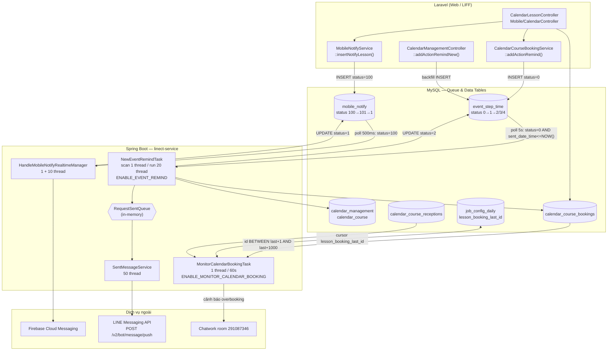

# FA-019 — Đặt lịch bài học (「レッスン予約」) — Job Spec

> Tạo bởi: job-analyzer agent | Ngày: 2026-08-21 | Confidence tổng thể: **Cao**
> Portal: Admin | URL: `/basic/calendar-management`
> Root job service: `src/job/linect-service/src/main/java/sns/line/`

---

## 1. Tổng quan

### 1.1 Tính năng cần background job để làm gì

| Nhóm xử lý nền | Mô tả | Job phụ trách |
|---|---|---|
| **Nhắc lịch (リマインド配信)** | Gửi tin nhắn LINE nhắc trước/sau buổi học cho người đặt chỗ, theo cấu hình 「予約前後のリマインドメッセージ」 | `NewEventRemindTask` |
| **Giám sát overbooking** | Quét các bản ghi đặt chỗ mới, phát hiện trường hợp số người đặt vượt `total_person` của khung tiếp nhận → cảnh báo Chatwork | `MonitorCalendarBookingTask` (nhánh LESSON) |
| **Thông báo cho Admin (mobile/PC/Chatwork)** | Đẩy notify realtime tới app mobile của Admin khi có đặt chỗ / hủy / yêu cầu duyệt | `HandleMobileNotifyRealtimeManager`, `HandleWebpushManager`, `HandlePushNotifyChatwork`, `HandlePushNotifyPc` (hạ tầng dùng chung) |
| **Đẩy tin nhắn LINE ra ngoài** | Hàng đợi in-memory nhận request rồi gọi LINE Messaging API | `SentMessageService` (hạ tầng dùng chung) |
| **Dọn dữ liệu khi đổi bot** | Khi Admin thực hiện 「アカウント切替」, xoá toàn bộ `calendar_course_bookings` và reset `calendar_course_receptions` của bot | `ChangeBotTask` → `ChangeBotJob.step6FinalCleanup` |
| **Render nút mở LIFF đặt lịch** | Khi job dựng message LINE, action type = 8 sinh URL LIFF trỏ vào calendar lesson | `MessageBuilder` + `CalendarLessonManager` (helper dùng chung) |

### 1.2 Kiến trúc giao tiếp — Database Polling

Hệ thống **không dùng message broker**. Toàn bộ giao tiếp Laravel ↔ Spring Boot đi qua bảng MySQL:

```
Laravel (Web/LIFF)
  │ INSERT / UPDATE bản ghi vào "queue table" (status = pending + thời điểm thực thi)
  ▼
MySQL
  ▲ SELECT ... WHERE status = pending AND time <= NOW()
  │ while(true) + Thread.sleep(...)
Spring Boot (linect-service)
  │ xử lý → UPDATE status (pending → sending/in-queue → done/error)
  ▼
LINE Messaging API / Firebase / Chatwork
```

Entry point: `AppMain.run()` — mỗi task được bật/tắt bằng một cờ `ConfigFile.ENABLE_XXX` nạp từ file properties.
**Confidence:** Cao — `src/job/linect-service/src/main/java/sns/line/AppMain.java:200-360`, `ConfigFile.java:240-410`

### 1.3 Danh sách job thuộc FA-019 + feature flag

| # | Task class | Feature flag | Khởi tạo | Vai trò với FA-019 | Mức liên quan |
|---|---|---|---|---|---|
| 1 | `NewEventRemindTask` | `ENABLE_EVENT_REMIND` | `AppMain.java:350-351` | **Chính** — gửi remind lesson (`EventStep.type = 4`) | Trực tiếp |
| 2 | `MonitorCalendarBookingTask` | `ENABLE_MONITOR_CALENDAR_BOOKING` | `AppMain.java:292-293` | **Chính** — giám sát overbooking nhánh LESSON | Trực tiếp |
| 3 | `SentMessageService` | (luôn bật, không cờ) | `AppMain.java:208` | Đẩy message remind ra LINE API | Hạ tầng dùng chung |
| 4 | `HandleMobileNotifyRealtimeManager` | `ENABLE_HANDLE_MOBILE_NOTIFY_REALTIME` | `AppMain.java:301-302` | Push notify app cho Admin về sự kiện đặt chỗ lesson | Hạ tầng dùng chung |
| 5 | `HandleWebpushManager` | `ENABLE_HANDLE_WEB_PUSH` | `AppMain.java:298-299` | Push notify PC (`notification_pc`) | Hạ tầng dùng chung |
| 6 | `HandlePushNotifyChatwork` / `HandlePushNotifyPc` | `ENABLE_HANDLE_PUSH_NOTIFY_CHATWORK_TASK` (`AppMain.java:227-228`) | `AppMain.java:852-855` | Tổng hợp `mobile_notify` gửi Chatwork / PC theo lịch của `notify_setting` | Hạ tầng dùng chung |
| 7 | `ChangeBotTask` → `ChangeBotJob` | `ENABLE_CHANGE_BOT_TASK` | `AppMain.java:328-329` | Xoá dữ liệu đặt chỗ lesson khi đổi bot | Gián tiếp |

**Ghi chú giá trị mặc định:** tất cả các cờ trên khai báo mặc định `false` trong `ConfigFile.java` (dòng 92-137) và được ghi đè từ properties lúc runtime (`ConfigFile.java:240-290`). `MAX_REMIND_THREAD = 20` (`ConfigFile.java:75`), `MAX_SENT_MESSAGE_THREAD = 50` (`ConfigFile.java:76`).
**Confidence:** Cao

---

## 2. Queue Tables / Bảng trung gian

### 2.1 `event_step_time` — Hàng đợi nhắc lịch (queue chính của FA-019)

**Entity JPA:** `EventStepTime`
**File:** `src/job/linect-service/src/main/java/sns/line/models/linedb/entities/EventStepTime.java`

| Cột | Kiểu Java | Dòng | Ý nghĩa trong ngữ cảnh lesson |
|---|---|---|---|
| `id` | `long` | 19-20 | PK |
| `event_id` | `long` | 22-23 | `events.id` — bản ghi `events.type = 4` gắn với `calendar_management.id` |
| `bot_id` | `long` | 25-26 | Bot sở hữu |
| `event_step_id` | `long` | 28-29 | `event_step.id` — cấu hình 1 mốc nhắc (`event_step.type = 4`) |
| `event_time_id` | `long` | 31-32 | Không dùng cho lesson (chỉ dùng cho `EVENT_FIXED_TIME`) |
| `sent_date_time` | `LocalDateTime` | 34-35 | **Thời điểm phải gửi** — điều kiện poll |
| `user_id` | `Long` | 37-38 | `null` với lesson |
| `status` | `int` | 40-41 | State machine bên dưới |
| `total_send` | `int` | 43-44 | Số message đã đẩy |
| `user_booking_id` | `Long` | 46-47 | **`calendar_course_bookings.id`** — khoá liên kết tới đặt chỗ lesson |
| `datetime_end` | `String` | 49-50 | Thời điểm kết thúc buổi (dùng cho loại đếm ngược) |

**State machine** (`EventStepTime.java:10-15`):

```
0  STATUS_NOT_SEND_YET        ← Laravel INSERT (mặc định)
   │ (scan thread nhặt được)
1  STATUS_SENDING             ← đã nạp vào queue in-memory / đang gửi
   │
   ├─→ 2  STATUS_SEND                    (đã gửi xong, kể cả trường hợp bỏ qua hợp lệ)
   ├─→ 3  STATUS_SEND_ERROR              (ngoại lệ khi xử lý)
   ├─→ 4  STATUS_SKIP_BOT_EXPIRED_PLAN   (bot hết hạn > 7 ngày)
   └─→ 5  STATUS_SKIP_COURSE_OFF         (khai báo nhưng nhánh dùng nó đã bị comment)
```

**Câu poll thật** (`NewEventRemindTask.java:70`):

```java
List<EventStepTime> list = EventModel.getEventStepTimeRepository()
    .findAllByStatusAndSentDateTimeLessThanEqual(EventStepTime.STATUS_NOT_SEND_YET, LocalDateTime.now());
```

Tương đương: `SELECT * FROM event_step_time WHERE status = 0 AND sent_date_time <= NOW()` — **không có LIMIT**.

**Tần suất:** khi kết quả rỗng → `sleep(5000)` (5 giây); khi có dữ liệu → nạp hết vào queue rồi lặp ngay (`NewEventRemindTask.java:73-84`). Lỗi → `sleep(10000)`.

**Resume sau restart** (`NewEventRemindTask.java:54-61`): nạp lại toàn bộ bản ghi `status = 1 (STATUS_SENDING)` vào queue trước khi vào vòng lặp — tránh kẹt vĩnh viễn.

**Confidence:** Cao

---

### 2.2 `job_config_daily` — Bảng checkpoint của job giám sát

**Entity JPA:** `JobConfigDaily`
**File:** `src/job/linect-service/src/main/java/sns/line/models/linedb/entities/JobConfigDaily.java:6-22`

| Cột | Dòng | Ý nghĩa |
|---|---|---|
| `id` | 11-12 | Luôn đọc bản ghi `id = 1` |
| `salon_booking_last_id` | 19-20 | Checkpoint nhánh SALON (FA-020) |
| **`lesson_booking_last_id`** | 21-22 | **Checkpoint nhánh LESSON (FA-019)** — id lớn nhất của `calendar_course_bookings` đã quét |

Đây **không phải queue theo status** mà là **queue theo con trỏ tăng dần (cursor / high-water mark)**.

**Câu poll thật** (`MonitorCalendarBookingTask.java:96-98`):

```java
long lessonBookingLastId = jobConfigDaily.getLessonBookingLastId();
List<CalendarCourseBooking> list = ...getCalendarCourseBookingRepository()
    .findAllByIdBetween(lessonBookingLastId + 1, lessonBookingLastId + SIZE);   // SIZE = 1000
```

Tương đương: `SELECT * FROM calendar_course_bookings WHERE id BETWEEN :last+1 AND :last+1000`.

**Tần suất:** `sleep(60000)` — mỗi 60 giây (`MonitorCalendarBookingTask.java:30`).
**Confidence:** Cao

---

### 2.3 `calendar_course_bookings` — Bảng đặt chỗ chính (nguồn dữ liệu, không phải queue)

**Entity JPA:** `CalendarCourseBooking`
**File:** `src/job/linect-service/src/main/java/sns/line/models/linedb/entities/CalendarCourseBooking.java`

Entity phía job chỉ ánh xạ **7/41 cột** (job chỉ đọc, không ghi):

| Cột | Dòng |
|---|---|
| `id` | 10-12 |
| `admin_id` | 13-14 |
| `reception_id` | 15-16 |
| `line_user_id` | 17-18 |
| `course_id` | 19-20 |
| `calendar_id` | 21-22 |
| `status` | 23-24 |

**Giá trị `status`** (nguồn: Laravel `src/web/sns-line/app/CalendarCourseBooking.php:16-23` — phía Java không khai báo hằng số):

| Giá trị | Hằng số | Ý nghĩa |
|---|---|---|
| 0 | `SB_REQUEST_BOOKING` | User đặt, chờ Admin duyệt |
| 1 | `SB_BOOKING_APPROVE` | Tự động duyệt (auto accept) |
| 2 | `SB_BOOKING_ADMIN_BOOK` | Admin đặt hộ |
| 3 | `SB_REQUEST_BOOKING_WAIT_CANCEL` | Đăng ký nhận thông báo khi có chỗ trống |
| 4 | `SB_BOOKING_CANCEL` | User huỷ |
| 5 | `SB_REQUEST_BOOKING_CANCEL` | User xin huỷ, chờ duyệt |
| 6 | `SB_BOOKING_DENY` | Admin từ chối |
| 7 | `SB_BOOKING_ADMIN_CANCEL` | Admin huỷ |

**Confidence:** Cao

---

### 2.4 `mobile_notify` — Hàng đợi thông báo cho Admin

**Entity JPA:** `MobileNotify` — `models/linedb/entities/MobileNotify.java:12` (`@Table(name = "mobile_notify")`)

**State machine dùng cho realtime** (`MobileNotify.java:29-31`):

```
100 STATUS_REALTIME_WAITING    ← Laravel set (App\MobileNotify::STATUS_PENDING_NOTIFY = 100)
    │
101 STATUS_REALTIME_IN_QUEUE   ← manager nạp vào queue in-memory
    │
1   STATUS_SENT                ← worker gửi Firebase xong
```

**Câu poll thật** (`threads/notify/HandleMobileNotifyRealtimeManager.java:63`):
`findTop100ByStatus(MobileNotify.STATUS_REALTIME_WAITING)` — lấy tối đa 100 bản ghi.

**Tần suất:** queue > 200 → `sleep(1000)`; không có bản ghi → `sleep(500)`; lỗi → `sleep(1000)` + báo Chatwork.
**Resume:** nạp lại `status = 101` khi khởi động (`HandleMobileNotifyRealtimeManager.java:44-46`).

**Liên kết FA-019:** Laravel ghi bản ghi có `type = config('sns-line.type_of_notification_key.calendar_lesson')`, `notify_title = 'レッスン予約'`, `lesson_booking_id = calendar_course_bookings.id` (`app/Services/Notify/MobileNotifyService.php:121-200`).
**Confidence:** Cao

---

### 2.5 `notification_pc` — Hàng đợi web push PC

**Entity JPA:** `NotificationPc`; hằng số ở `Constants.NotificationPc`.
**Poll** (`threads/notify/HandleWebpushManager.java:46`): `findTop100ByStatus(STATUS_NEW)` → chuyển `STATUS_RUNNING` (dòng 63-64). Resume `STATUS_RUNNING` khi khởi động (dòng 29).
Laravel `insertMobileNotify()` chèn `NotificationPC::insert(...)` rồi set `status_pc = 1` (`app/Helpers/functions.php` ~7255).
**Confidence:** Trung bình — đã xác minh luồng job; phía Laravel chỉ đọc lướt.

---

### 2.6 `schedule_change_bot` — Hàng đợi đổi bot (gián tiếp)

**Entity JPA:** `ScheduleChangeBot`; poll `findTop50ByStatusOrderByIdAsc(ScheduleChangeBot.STATUS_WAITING)` (`task/ChangeBotTask.java:82-83`), nhịp `ChangeBotConstants.SCAN_INTERVAL_MS` / `PER_RECORD_DELAY_MS` (`ChangeBotTask.java:67`), lỗi → `ERROR_BACKOFF_MS` (dòng 72).
**Confidence:** Cao

---

## 3. Task Managers

### 3.1 `NewEventRemindTask` — Job nhắc lịch (job chính của FA-019)

| Thuộc tính | Giá trị |
|---|---|
| Class | `sns.line.threads.event_remind.NewEventRemindTask` |
| File | `src/job/linect-service/src/main/java/sns/line/threads/event_remind/NewEventRemindTask.java` (706 dòng) |
| Feature flag | `ConfigFile.ENABLE_EVENT_REMIND` (`ConfigFile.java:93`, nạp tại `:253`) |
| Khởi tạo | `AppMain.java:350-351` → `newEventRemindTask.start()` |
| Thread pool | `Executors.newFixedThreadPool(ConfigFile.MAX_REMIND_THREAD + 1)` = **21 thread** (`NewEventRemindTask.java:43`) |
| Cấu trúc | 1 thread **scan** (`startJobScan`, dòng 49) + 20 thread **run** (`startJobRun`, dòng 93) |
| Hàng đợi trung gian | `LinkedList<EventStepTime> eventStepTimeQueue` — **in-memory**, đồng bộ bằng `synchronized` (dòng 37) |

**Vòng lặp scan** (dòng 63-88):
1. Kiểm tra `AppMain.getInstance().isPrepareStop() || isNeedStop()` → thoát êm.
2. `findAllByStatusAndSentDateTimeLessThanEqual(0, now())`.
3. Rỗng → `sleep(5000)`. Có → với mỗi bản ghi: set `status = 1` rồi `updateStatusById(...)` (dòng 79-80), push vào `eventStepTimeQueue`.
4. Ngoại lệ → log + `sleep(10000)` (dòng 84-86).

**Vòng lặp run** (dòng 96-121): poll queue → `startEventStepTime(eventStepTime)`; queue rỗng → `sleep(500)`.

**`startEventStepTime()` — chuyển trạng thái** (dòng 123-338):

| Điều kiện | Trạng thái đặt |
|---|---|
| Bot null hoặc hết hạn > 7 ngày | `4 STATUS_SKIP_BOT_EXPIRED_PLAN` (dòng 130-136) |
| `event_step` không tồn tại | `2 STATUS_SEND`, `total_send = 0` (dòng 142-149) |
| Không tìm được LINE user hợp lệ | `2 STATUS_SEND`, `total_send = 0` (dòng 215-221) |
| Xử lý xong | `sendDone(eventStepTime, sendCount)` |
| Ngoại lệ | `3 STATUS_SEND_ERROR` + báo Chatwork (dòng 332-337) |

**Nhánh LESSON** (`EventStep.EVENT_LESSON_CALENDAR = 4`, `EventStep.java:13`) tại dòng 161-173:
```java
calendarCourseBooking = ...getCalendarCourseBookingRepository().findById(eventStepTime.getUserBookingId())
if (calendarCourseBooking != null && calendarCourseBooking.getLineUserId() > 0) {
    LineUser lineUser = ...getLineUserRepository().findById(calendarCourseBooking.getLineUserId())
    BotLineUser botLineUser = ...findFirstByLineUserIdAndBotId(lineUser.getId(), bot.getId());
    if (botLineUser != null && botLineUser.getIsBlocked() == 0) { lineUsers = [lineUser]; }
}
```
→ **Người dùng đã block bot sẽ bị bỏ qua**.

Sau đó dòng 224-241: nạp `CalendarCourse` theo `calendarCourseBooking.getCourseId()` rồi gọi `actionTypeBookingCalendar(...)` và `return` (không đi tiếp nhánh gửi template chung).

**Ghi chú code chết:** khối kiểm tra `calendarCourse.getBookingPageDisplay() == 0` → `STATUS_SKIP_COURSE_OFF (5)` đã bị **comment toàn bộ** (dòng 229-236). Vì vậy remind vẫn gửi kể cả khi khoá học đã tắt hiển thị trên trang đặt chỗ. **Confidence:** Cao.

---

### 3.2 `MonitorCalendarBookingTask` — Giám sát overbooking (nhánh LESSON)

| Thuộc tính | Giá trị |
|---|---|
| Class | `sns.line.task.MonitorCalendarBookingTask` (extends `StoppableTask`) |
| File | `src/job/linect-service/src/main/java/sns/line/task/MonitorCalendarBookingTask.java` (142 dòng) |
| Feature flag | `ConfigFile.ENABLE_MONITOR_CALENDAR_BOOKING` (`ConfigFile.java:137`, nạp tại `:288`) |
| Khởi tạo | `AppMain.java:292-293` → `new MonitorCalendarBookingTask().startTask()` |
| Thread pool | Dùng chung `AppMain.getInstance().getExecutorService()`, **1 thread duy nhất** (dòng 20) |
| Nhịp lặp | `sleep(60000)` — 60 giây (dòng 30) |
| Batch size | `SIZE = 1000` (dòng 17) |

**Vòng lặp** (dòng 22-31):
```java
while (true) {
    if (AppMain.getInstance().isPrepareStop()) break;
    JobConfigDaily jobConfigDaily = ...getJobConfigDailyRepository().findById(1).orElse(null);
    monitorSalonCalendar(jobConfigDaily);
    sleep(60000);
}
```

**Logic nhánh LESSON** (`monitorSalonCalendar`, dòng 94-121):

1. `listStatus = [1, 2, 5]` — chỉ đếm booking đang chiếm chỗ: đã duyệt / admin đặt / đang xin huỷ (dòng 94).
2. Đọc `lesson_booking_last_id`, lấy 1000 bản ghi `calendar_course_bookings` kế tiếp.
3. Với mỗi booking:
   - Cập nhật con trỏ `lessonBookingLastId` = max id đã thấy (dòng 101-103) — **cập nhật trước cả khi bỏ qua**.
   - `admin_id != null` → bỏ qua (booking do Admin tạo, không kiểm tra) (dòng 104-107).
   - `status != 1` → bỏ qua (chỉ kiểm tra booking auto-accept) (dòng 108-111).
   - Nạp `CalendarCourseReception` theo `reception_id`; nếu `type_limit_booking == 1` (giới hạn theo số người):
     `countByReceptionIdAndStatusIn(receptionId, [1,2,5])` > `reception.getTotalPerson()` → ghi vào `listLessonNeedCheck` dạng `"{bookingId} -> receptionId {receptionId}"` (dòng 112-120).
4. `save(jobConfigDaily)` — ghi lại con trỏ (dòng 122).
5. Nếu `listSalonNeedCheck` hoặc `listLessonNeedCheck` không rỗng → `NotifyUtils.sendMessageChatwork(messageNotify, "291087346")` (dòng 123-127).

**Bản chất:** job **chỉ cảnh báo cho đội vận hành**, không tự sửa dữ liệu, không huỷ booking thừa.
**Confidence:** Cao

---

### 3.3 `SentMessageService` — Bơm message ra LINE API (hạ tầng dùng chung)

| Thuộc tính | Giá trị |
|---|---|
| Class | `sns.line.helper.SentMessageService` |
| File | `src/job/linect-service/src/main/java/sns/line/helper/SentMessageService.java` |
| Feature flag | **Không có** — luôn chạy |
| Khởi tạo | `AppMain.java:208` → `sentMessageService.startService()` |
| Thread pool | `ConfigFile.MAX_SENT_MESSAGE_THREAD = 50` (`ConfigFile.java:76`) |
| Hàng đợi | `RequestSentQueue.requestQueue` — **`LinkedList` in-memory tĩnh** (`helper/RequestSentQueue.java:11`) |

Vòng lặp (dòng 28-41): `RequestSentQueue.getRequestFromQueue()`; null → `sleep(200)`; ngược lại `SentMessageHelper.getHelper().sentMessage(request)`.
Kết quả `status == 1000` → đẩy lại `retryRequestQueue` (dòng 51-52). Ngoại lệ → log + Chatwork phòng `291087346` (dòng 47).
**Confidence:** Cao

---

### 3.4 `HandleMobileNotifyRealtimeManager` — Push notify app cho Admin

| Thuộc tính | Giá trị |
|---|---|
| File | `threads/notify/HandleMobileNotifyRealtimeManager.java` (98 dòng) + `HandleMobileNotifyRealtimeTask.java` (124 dòng) |
| Feature flag | `ConfigFile.ENABLE_HANDLE_MOBILE_NOTIFY_REALTIME` |
| Khởi tạo | `AppMain.java:301-302` → `AppMain.startHandleMobileNotifyRealtimeManager()` (`AppMain.java:844-846`) |
| Thread | 1 manager (scan) + **10 worker** (`numberThread = 10`, dòng 25) |

Worker gọi `FirebaseMessagingModel.sentNotifyV2ByToken(...)` rồi `sentUpdateBadgeV2ByUser(...)`, cuối cùng `updateStatusById(STATUS_SENT, id)` (`HandleMobileNotifyRealtimeTask.java:102-113`).
**Confidence:** Cao

---

### 3.5 `ChangeBotTask` / `ChangeBotJob` — Dọn dữ liệu đặt chỗ khi đổi bot

| Thuộc tính | Giá trị |
|---|---|
| File | `task/ChangeBotTask.java`, `threads/changebot/ChangeBotJob.java` |
| Feature flag | `ConfigFile.ENABLE_CHANGE_BOT_TASK` |
| Khởi tạo | `AppMain.java:328-329` |

Bước 6 của quy trình dọn dữ liệu (`ChangeBotJob.java:326-333`) đụng đến FA-019:

```java
cleanupRepo.deleteCalendarCourseBookingByBotId(botId);
cleanupRepo.resetCalendarCourseReceptionsByBotId(botId);
```

SQL thật (`models/linedb/repository/ChangeBotDataCleanupRepository.java:285-298`):
```sql
DELETE ccb FROM `calendar_course_bookings` ccb
  JOIN `calendar_management` cm ON cm.`id` = ccb.`calendar_id`
 WHERE cm.`bot_id` = :botId;

UPDATE `calendar_course_receptions` ccr
  JOIN `calendar_course` cc ON cc.`id` = ccr.`course_id`
  JOIN `calendar_management` cm ON cm.`id` = cc.`calendar_id`
   ... WHERE cm.`bot_id` = :botId;   -- reset số chỗ đã đặt
```
**Confidence:** Cao

---

## 4. Processing Chain

### 4.1 Chuỗi nhắc lịch lesson (luồng chính)

```
Laravel: CalendarCourseBookingService::addActionRemind()
  → INSERT event_step_time (status = 0, user_booking_id = calendar_course_bookings.id, sent_date_time)
        │
        ▼
NewEventRemindTask.startJobScan (1 thread, poll 5s)
  → SELECT status=0 AND sent_date_time <= NOW()
  → UPDATE status = 1 (SENDING)
  → push vào eventStepTimeQueue (in-memory)
        │
        ▼
NewEventRemindTask.startJobRun (20 thread)
  → startEventStepTime()
      ├─ BotManager.getNewBot(botId)          → kiểm tra hạn gói
      ├─ EventStep (type = 4) → nhánh LESSON
      ├─ CalendarCourseBooking → LineUser → BotLineUser (is_blocked = 0)
      ├─ CalendarCourse (course_id)
      └─ actionTypeBookingCalendar()
             ├─ lọc theo is_use_filter_course / course_ids
             ├─ CalendarManagement (calendar_id) → store_name, calendar_name
             ├─ UrlModel.replaceLessonCalendar() thay biến động
             ├─ TemplateCacheManager.addTextMessage() → tạo template tạm
             ├─ tạo MessagesV2s (msg_kind = 20, type = 21)
             └─ RequestSentQueue.pushRequestToQueue(request)
                       │  (hoặc ActionModel.doActionWithRequestSent nếu event_step.action_id != null)
                       ▼
             SentMessageService (50 thread)
               → SentMessageHelper.sentMessage()
               → POST https://api.line.me/v2/bot/message/push
        │
        ▼
sendDone(eventStepTime, sendCount) → UPDATE status = 2 (SEND), total_send
```
**Confidence:** Cao — `NewEventRemindTask.java:49-121, 123-338, 340-437`

### 4.2 Chuỗi giám sát overbooking

```
MonitorCalendarBookingTask (1 thread, 60s)
  → job_config_daily (id = 1) → lesson_booking_last_id
  → calendar_course_bookings WHERE id BETWEEN last+1 AND last+1000
  → lọc: admin_id IS NULL AND status = 1
  → calendar_course_receptions (reception_id), type_limit_booking = 1
  → COUNT(calendar_course_bookings WHERE reception_id = ? AND status IN (1,2,5))
  → nếu COUNT > total_person → listLessonNeedCheck
  → UPDATE job_config_daily.lesson_booking_last_id
  → NotifyUtils.sendMessageChatwork(..., room "291087346")
```
**Confidence:** Cao

### 4.3 Chuỗi thông báo Admin

```
Laravel: CalendarCourseBookingService → MobileNotifyService::insertNotifyLesson()
  → functions.php::insertMobileNotify()  (kiểm tra notify_setting.is_notify_lesson_booking
                                          và notify_setting.lesson_booking chứa setting_value)
  → INSERT mobile_notify (type = calendar_lesson, lesson_booking_id, notify_title = 'レッスン予約')
  → UPDATE status = 100 (STATUS_PENDING_NOTIFY)
        │
        ▼
HandleMobileNotifyRealtimeManager (poll 500ms, top 100)
  → UPDATE status = 101 → queue in-memory
        │
        ▼
HandleMobileNotifyRealtimeTask (10 thread)
  → FirebaseMessagingModel.sentNotifyV2ByToken() + sentUpdateBadgeV2ByUser()
  → UPDATE status = 1 (SENT)

Song song:
  NotificationPC → HandleWebpushManager/Task  (web push PC)
  mobile_notify (status_chatwork = 0 / status_pc = 0)
      → HandlePushNotifyChatwork / HandlePushNotifyPc (gom theo lịch notify_setting, 30-60s)
```
**Confidence:** Cao (nhánh mobile) / Trung bình (nhánh PC & Chatwork — kiểm chứng ở mức manager)

---

## 5. Services & Helpers

| Method | Input | Output | Logic | Bảng đọc / ghi |
|---|---|---|---|---|
| `NewEventRemindTask.startJobScan()`<br>`NewEventRemindTask.java:49` | — | nạp `eventStepTimeQueue` | Poll `event_step_time` đến hạn, đổi status 0→1 | Đọc+ghi `event_step_time` |
| `NewEventRemindTask.startEventStepTime(EventStepTime)`<br>`:123` | 1 bản ghi queue | void | Định tuyến theo `event_step.type`; type = 4 → nhánh lesson | Đọc `event_step`, `bots`, `calendar_course_bookings`, `line_users`, `bot_line_user`, `calendar_course`; ghi `event_step_time` |
| `NewEventRemindTask.actionTypeBookingCalendar(...)`<br>`:340` | bot, eventStepTime, eventStep, booking, course, lineUsers | void | Lọc khoá học → dựng nội dung → đẩy `RequestSentQueue` hoặc chạy action | Đọc `calendar_management`, `calendar_course_receptions`; ghi `messages_v2`, `conversations` (gián tiếp) |
| `UrlModel.detectLessonCalendar / replaceLessonCalendar`<br>gọi tại `:351-352` | chuỗi mẫu | chuỗi đã thay biến | Thay 5 mã biến (bảng §5.1) | Đọc `calendar_course_receptions`, `calendar_course`, `calendar_management` |
| `TemplateCacheManager.addTextMessage(String)`<br>gọi tại `:403` | nội dung text | `templateId` | Tạo template tạm để gửi | Ghi bảng template |
| `MonitorCalendarBookingTask.monitorSalonCalendar(JobConfigDaily)`<br>`:39` | bản ghi checkpoint | void | Quét SALON + LESSON, gom danh sách nghi vấn | Đọc `calendar_course_bookings`, `calendar_course_receptions`; ghi `job_config_daily` |
| `CalendarLessonManager.getItem(long)`<br>`helper/cache/CalendarLessonManager.java:23` | `calendar_management.id` | `CalendarManagement` | Cache in-memory, TTL **10 giây**, tối đa **500** phần tử, `synchronized` | Đọc `calendar_management` |
| `MessageBuilder` (action type = 8)<br>`models/line/MessageBuilder.java:884, 1188, 3476, 3921` | button/imagemap có `calendar_lesson_id` | URL LIFF | Sinh `https://liff.line.me/{liffId}?calendar_id={id}&&ts={epoch}`; không tìm thấy calendar → `{HOST_SNSLINE}/error/404` | Đọc `calendar_management` qua cache |
| `NotifyUtils.sendMessageChatwork(msg, roomId)`<br>`utils/NotifyUtils.java:114` | nội dung, room | void | Gửi report vận hành | — |

### 5.1 Bảng mã biến trong nội dung nhắc lịch lesson

`NewEventRemindTask.java:352-396` — hàm `replaceLessonCalendar`:

| Mã | Kết quả | Nguồn |
|---|---|---|
| `date_time` | `yyyy年MM月dd日（曜日）HH:mm-HH:mm` | `calendar_course_receptions.received_booking_date/start_time/end_time`; `end_time = 00:00:00` được đổi thành `24:00` (dòng 361-363) |
| `course` | Tên khoá học | `calendar_course.course_name` |
| `reservation_currency` | `{số tiền}円` | `calendar_course.amount` qua `TextUtils.getMoneyValue` |
| `url_cancel` | `https://liff.line.me/{liffId}?calendar_id={calendarId}&tab=detail&booking_id={bookingId}` | `bot.getLiffAppIdBookingWithDefault()` (dòng 386-388) |
| `reservation_name` | Tên cửa hàng | `calendar_management.store_name` |

Không khớp mã nào → trả về chuỗi rỗng (dòng 395).
**Confidence:** Cao

---

## 6. External API Calls

| API | Endpoint | Nơi gọi | Mục đích |
|---|---|---|---|
| **LINE Messaging API** | `POST https://api.line.me/v2/bot/message/push` | `models/base/apiservice/ILineService.java:43`, gọi qua `SentMessageHelper` từ `SentMessageService.java:41` | Gửi tin nhắn nhắc lịch tới LINE user |
| **LINE LIFF (URL, không phải API)** | `https://liff.line.me/{liffAppId}?calendar_id=...` | `NewEventRemindTask.java:387`, `MessageBuilder.java:887, 3479` | Link mở màn hình đặt chỗ / huỷ đặt chỗ |
| **Firebase Cloud Messaging** | qua `FirebaseMessagingModel.sentNotifyV2ByToken()` / `sentUpdateBadgeV2ByUser()` | `threads/notify/HandleMobileNotifyRealtimeTask.java:102, 111` | Push notify + badge cho app mobile Admin |
| **Chatwork (qua backend nội bộ)** | `backendService.reportChatwork(ReportChatworkBody)` | `utils/NotifyUtils.java:88, 117` | Cảnh báo vận hành. Room `291087346` (chung + monitor booking), `316148419` (Google Calendar callback) |
| **Google Calendar API** | — | — | **Không có** trong phạm vi FA-019 (xem §12 Job đã loại trừ) |

**Confidence:** Cao

---

## 7. Data Flow Diagram



---

## 8. Error Handling

| Vị trí | Cơ chế | Chi tiết |
|---|---|---|
| `MonitorCalendarBookingTask.startTask()`<br/>`:32-35` | try-catch bao **toàn bộ** `while(true)` | Ngoại lệ bất kỳ → log `LOGGER.error` + `NotifyUtils.sendReportChatwork(..., "[To:6395420]Exception!!!")` → **thread chết luôn**, không tự khởi động lại |
| `NewEventRemindTask.startJobScan()`<br/>`:84-86` | try-catch **trong** vòng lặp | `logger.error` + `sleep(10000)` rồi tiếp tục — thread sống sót |
| `NewEventRemindTask.startEventStepTime()`<br/>`:332-337` | try-catch toàn method | Log + `sendReportChatwork` + set `status = 3 STATUS_SEND_ERROR` |
| `NewEventRemindTask` vòng gửi từng user<br/>`:326-329` | try-catch trong `for` | Lỗi 1 user không làm hỏng cả bản ghi; báo Chatwork với class `EventBotTask.class` (**nhãn sai class**, gây khó truy vết) |
| `SentMessageService`<br/>`:42-48` | try-catch mỗi request | Log + Chatwork room `291087346`; `status == 1000` → đẩy sang `retryRequestQueue` |
| `HandleMobileNotifyRealtimeManager`<br/>`:68-71` | try-catch trong vòng lặp | Chatwork `[To:6395420] [To:6155382]` + `sleep(1000)` |
| `NotifyUtils.sendReportChatwork`<br/>`:80`, `:116` | Chặn theo môi trường | Nếu `ConfigFile.HOST_SNSLINE == "https://lme.watermeru.com"` thì **không gửi** (môi trường test) |
| Laravel `addActionRemind`<br/>`CalendarCourseBookingService.php:636-639` | try-catch toàn method | `Log::error` — **nuốt lỗi im lặng**, không báo ai; nếu insert `event_step_time` thất bại thì booking vẫn tạo nhưng mất remind |

**Confidence:** Cao

---

## 9. Liên kết với Web App

| Hành động trên Web/LIFF | Bảng được ghi | Task manager tiêu thụ | Kết quả người dùng thấy |
|---|---|---|---|
| LINE user đặt chỗ qua LIFF (auto-approve) — `Api/CalendarLessonController.php:161, 356, 1835`, `Mobile/CalendarController.php:1728` → `CalendarCourseBookingService::addActionRemind()` (`:529-640`) | `calendar_course_bookings` (status 1) + `event_step_time` (status 0) | `NewEventRemindTask` | Nhận tin nhắn nhắc lịch LINE đúng mốc đã cấu hình |
| Admin duyệt yêu cầu đặt chỗ — `CalendarCourseBookingService.php:843` | `event_step_time` (status 0) | `NewEventRemindTask` | Như trên |
| Thanh toán online thành công (Univapay/Stripe callback) — `CalendarCourseBookingService.php:1689` | `event_step_time` (status 0) | `NewEventRemindTask` | Như trên |
| Admin **tạo/sửa** cấu hình nhắc lịch 「予約前後のリマインドメッセージ」 — `Basic/CalendarManagementController.php:909, 1366-1368` → `addActionRemindNew()` (`:918-1042`) | `event_step`, rồi **backfill hàng loạt** `event_step_time` cho mọi booking status ∈ {1, 2, 5} của calendar đó | `NewEventRemindTask` | Booking đã tồn tại cũng được nhắc theo cấu hình mới |
| Admin **huỷ** booking (`adminCancel`) — `CalendarCourseBookingService.php:929-942` | **DELETE** `event_step_time` WHERE `user_booking_id` = booking AND `status = 0` AND `event_step.type = 4` | — | Không còn nhận nhắc lịch |
| Admin **duyệt yêu cầu huỷ** (`approveCancel`) — `CalendarCourseBookingService.php:866-880` | Như trên | — | Như trên |
| Mọi thay đổi trạng thái booking — `CalendarCourseBookingService.php:257, 859, 901, 924, 956, 1687` → `MobileNotifyService::insertNotifyLesson()` | `mobile_notify` (status 100), `notification_pc` | `HandleMobileNotifyRealtimeManager`, `HandleWebpushManager`, `HandlePushNotifyChatwork/Pc` | Admin nhận push app / web push / Chatwork với tiêu đề 「レッスン予約」 |
| Admin gửi tin nhắn theo mốc booking (`sendMessage` → `sendMessageAction`, `CalendarCourseBookingService.php:966, 1449-1482`) | `messages_v2` (`msg_kind = KIND_MESSAGE_ACTION_FROM_BOOKING`, `type = TYPE_MESSAGE_ACTION_FROM_BOOKING_LESSON`), history gắn `table_name = 'calendar_course_bookings'` | Gửi trực tiếp từ Laravel (`MessageService::createMessageV2`) | Tin nhắn tới LINE user ngay lập tức |
| Admin đổi bot 「アカウント切替」 | `schedule_change_bot` (status WAITING) | `ChangeBotTask` → `ChangeBotJob.step6FinalCleanup` | Toàn bộ đặt chỗ lesson của bot bị xoá, `calendar_course_receptions` reset |
| Đặt template/richmenu có nút "mở lịch lesson" (action type = 8, `calendar_lesson_id`) | `templates` / `rich_menus` | `MessageBuilder` khi job dựng message | Nút mở LIFF đặt chỗ; nếu calendar đã xoá → trang `/error/404` |

**Ghi chú kích hoạt remind:** hàm `addActionRemind` tìm `Events` theo `['booking_calendar_id' => $calendarId, 'bot_id' => $botId, 'type' => 4]` (`CalendarCourseBookingService.php:539-543`) — tức mỗi `calendar_management` có tối đa **1** bản ghi `events` loại lesson, và các mốc nhắc là các `event_step` con.

**Hai loại mốc nhắc** (`event_step.type_remind`, `CalendarCourseBookingService.php:561-606`):

| `type_remind` | Cách tính `sent_date_time` |
|---|---|
| `1` — theo ngày | `is_after_day = 0`: `(ngày buổi học + time_send) - before_day ngày`<br/>`is_after_day = 1`: `(ngày buổi học + time_send) + before_day ngày` |
| `2` — đếm ngược | `is_after_day = 0`: `giờ bắt đầu buổi học - HH:mm của time_send`<br/>`is_after_day = 1`: `giờ kết thúc buổi học + HH:mm của time_send` |

Chỉ INSERT khi `sent_date_time >= NOW()` (mốc đã qua bị bỏ, không có backfill). Với `type_remind = 1` còn thêm điều kiện `is_send_remind_real_time == 1` để tránh sinh mốc nghịch chiều.
**Confidence:** Cao

---

## 10. Cron Laravel liên quan

### 10.1 Cron định kỳ trong `app/Console/Kernel.php`

**Không có cron Laravel nào chạy định kỳ cho FA-019.** Đã grep `calendar` / `lesson` trong `app/Console/Kernel.php`: chỉ tìm thấy

```php
$schedule->command('job:jobChannelCallbackGoogleCalendar')->dailyAt('03:00');      // Kernel.php:174 — 予約管理 (b_c_*)
$schedule->command('job:jobChannelCallbackGoogleCalendarSalon')->dailyAt('02:05'); // Kernel.php:175 — FA-020 salon
```

Cả hai **không** thuộc FA-019 (xem §12).

> Khác biệt so với FA-020 (salon) — salon có 3 job Laravel; FA-019 **không có**. Lý do: nhánh lesson không tích hợp Google Calendar.

**Confidence:** Cao

### 10.2 Command thủ công (không có trong `$schedule`)

| Command | File | Mục đích |
|---|---|---|
| `recover:remindLesson` | `app/Console/Commands/RecoverRemindLesson.php:22` | Command khắc phục dữ liệu một lần: quét `events.type = 4` → `event_step.type = 4` có `is_after_day = 1`, tìm `event_step_time` `status = 0` tạo trước `2025-10-29 00:00:00`, đối chiếu `calendar_course_bookings` + `calendar_course_receptions` để tính lại `sent_date_time`. Chạy tay khi phát hiện sai mốc nhắc "sau buổi học". |

**Confidence:** Cao — đọc trực tiếp `RecoverRemindLesson.php:46-80`

---

## 11. Rủi ro / Nợ kỹ thuật

| # | Rủi ro | Vị trí | Mức | Mô tả |
|---|---|---|---|---|
| RJ-01 | **Poll không giới hạn số bản ghi** | `NewEventRemindTask.java:70` | Cao | `findAllByStatusAndSentDateTimeLessThanEqual` không có `LIMIT`. Nếu job dừng lâu hoặc backfill `addActionRemindNew` sinh hàng chục nghìn bản ghi cùng lúc → nạp toàn bộ vào `LinkedList` in-memory, nguy cơ OOM và tải DB đột biến |
| RJ-02 | **Hàng đợi trung gian nằm trong RAM** | `NewEventRemindTask.java:37`, `RequestSentQueue.java:11` | Cao | Bản ghi đã chuyển `status = 1` nhưng chưa gửi xong mà process chết → chỉ được cứu nhờ nhánh resume `findAllByStatus(STATUS_SENDING)` (`:55`). Riêng `RequestSentQueue` **không có resume** → message đã rời `event_step_time` (status 2) nhưng chưa tới LINE là **mất vĩnh viễn** |
| RJ-03 | **Thread giám sát chết là chết luôn** | `MonitorCalendarBookingTask.java:22-35` | Cao | try-catch nằm **ngoài** `while(true)`. Một ngoại lệ (ví dụ `jobConfigDaily` = null → NPE tại `:41`) làm thread thoát; không có watchdog khởi động lại. Cảnh báo overbooking im lặng ngừng hoạt động |
| RJ-04 | **NPE tiềm tàng khi thiếu bản ghi checkpoint** | `MonitorCalendarBookingTask.java:28, 41` | Trung bình | `findById(1).orElse(null)` rồi truyền thẳng vào `monitorSalonCalendar()` mà không kiểm tra null |
| RJ-05 | **Con trỏ tiến trước cả khi bỏ qua** | `MonitorCalendarBookingTask.java:101-111` | Trung bình | `lesson_booking_last_id` được nâng ngay khi duyệt tới bản ghi, kể cả trường hợp `continue`. Booking có `status = 0` (chờ duyệt) lúc quét, sau đó mới chuyển sang `1` thì **không bao giờ được kiểm tra lại** → overbooking lọt lưới |
| RJ-06 | **Ghi checkpoint không transaction** | `MonitorCalendarBookingTask.java:122` | Trung bình | `save(jobConfigDaily)` chỉ chạy sau khi duyệt xong cả SALON và LESSON. Nếu ngoại lệ ở giữa, con trỏ không lưu → lần sau quét lại từ đầu (idempotent, chấp nhận được) nhưng cũng có nghĩa mọi cảnh báo trong lô đó bị gửi trùng |
| RJ-07 | **Race condition trong kiểm tra overbooking** | `MonitorCalendarBookingTask.java:114-118` | Trung bình | Việc kiểm tra là **hậu kiểm** (post-hoc), không có khoá. Job chỉ phát hiện chứ không ngăn; ràng buộc thật nằm ở tầng Laravel |
| RJ-08 | **Code chết trong `EventBotTask`** | `task/EventBotTask.java:78-297` | Thấp | Toàn bộ nhánh xử lý `CalendarCourseBooking` / `actionTypeBookingCalendar` đã bị comment; logic thật đã chuyển sang `NewEventRemindTask`. **Xác nhận kết luận của FA-021 cũng đúng cho nhánh lesson** |
| RJ-09 | **Kiểm tra `booking_page_display` bị vô hiệu hoá** | `NewEventRemindTask.java:229-236` | Trung bình | Trạng thái `STATUS_SKIP_COURSE_OFF (5)` khai báo nhưng nhánh set nó bị comment → khoá học đã tắt hiển thị **vẫn gửi remind** cho người đã đặt |
| RJ-10 | **Không kiểm tra trạng thái booking lúc gửi** | `NewEventRemindTask.java:161-173` | Cao | Nhánh lesson chỉ đọc `line_user_id`, **không đọc `calendar_course_bookings.status`**. Việc chặn remind cho booking đã huỷ hoàn toàn dựa vào Laravel `DELETE` bản ghi `event_step_time`. Nếu Laravel huỷ qua đường khác (SQL tay, luồng chưa gọi delete, hoặc bản ghi đã sang `status = 1` do job vừa nhặt) → **user đã huỷ vẫn nhận tin nhắn nhắc lịch** |
| RJ-11 | **Xoá remind bị bỏ sót ở 2 nhánh** _(đã kiểm chứng — xem `_internal/validation-report.md` §3.5)_ | `CalendarCourseBookingService.php:866-880, 929-942, 1075-1098`; `Mobile/CalendarController.php:2305-2314`; `CalendarCourseReceptionService.php:314-318` | Trung bình | **Đã xoá đúng**: `approveCancel`, `adminCancel`, và `autoCancel` phía LINE User (`Mobile/CalendarController.php:2305-2314`, điều kiện `approve_type == 1`). **Không xoá nhưng vô hại**: `denyBooking` (booking `status = 0` chưa từng được `addActionRemind()` tạo remind) và `requestCancel` (đúng nghiệp vụ — vẫn có thể bị từ chối). **Lỗ hổng thật**: `deleteBooking()` (soft-delete, `CCBS.php:1075-1098`) và `CCRS::delete()` (xoá 1 khung — đoạn xoá **bị comment** `:314-318`, trong khi `deleteList()` vẫn xoá). Kết hợp với RJ-10 (job không đọc `booking.status`) ⇒ khách vẫn nhận nhắc lịch cho buổi đã xoá |
| RJ-12 | **Nhãn class sai khi báo lỗi** | `NewEventRemindTask.java:328` | Thấp | `NotifyUtils.sendReportChatwork(EventBotTask.class, ...)` trong khi lỗi phát sinh ở `NewEventRemindTask` → khó truy vết |
| RJ-13 | **Nuốt lỗi khi tạo remind** | `CalendarCourseBookingService.php:636-639`, `CalendarManagementController.php:1032-1041` | Trung bình | Chỉ `Log::error`, không thông báo. Booking tạo thành công nhưng mất mốc nhắc — không ai biết cho tới khi user phàn nàn |
| RJ-14 | **Cache calendar TTL rất ngắn** | `helper/cache/CalendarLessonManager.java:11-12` | Thấp | TTL 10 giây, giới hạn 500 phần tử, toàn bộ `getItem` là `synchronized` (dòng 23) → có thể trở thành điểm nghẽn khi nhiều thread dựng message cùng lúc |
| RJ-15 | **Chatwork room-id hardcode** | `MonitorCalendarBookingTask.java:126`, `NotifyUtils.java:65, 72` | Thấp | Room `291087346`, `316148419` và ID người nhận `[To:6395420]` được viết cứng trong mã nguồn |

---

## 12. Job đã loại trừ (KHÔNG thuộc FA-019)

| Job | Feature flag | Bảng/entity thao tác | Kết luận |
|---|---|---|---|
| `GoogleCalendarEventTask` | `ENABLE_JOB_CALENDAR_EVENT` (`AppMain.java:265`) | `BCUserBooking` (`b_c_user_bookings`), `BCSettingTimeBlockStaff`, `GoogleCalendarEvent` (`GoogleCalendarEventTask.java:8-11, 54-80`) | **Không thuộc FA-019.** Chỉ phục vụ 予約管理 cũ (`booking_calendar`, họ bảng `b_c_*`). Không có tham chiếu nào tới `calendar_course*` hay `calendar_management` |
| `HandleGoogleCalendarCallbackManager` / `HandleGoogleCalendarCallbackTask` | `ENABLE_HANDLE_GOOGLE_CALENDAR_CALLBACK` (`AppMain.java:249`) | `GoogleCalendarCallback` (bảng `google_calendar_callback`); trong task chỉ dùng `BCGoogleCalendar` (`:109`), `BCUserBooking` (`:286`), `BCSettingTimeBlockStaff` (`:356`), `BCCourse` (`:442`), `BCStaff` (`:443`) | **Không thuộc FA-019.** Cũng chỉ phục vụ 予約管理 cũ |
| `HandleSalonCalendarCallbackManager` / `HandleSalonCalendarCallbackTask` | `ENABLE_HANDLE_SALON_CALENDAR_CALLBACK` (`AppMain.java:252`) | `salon_google_calendar_callback` | **Không thuộc FA-019** — thuộc FA-020 (salon) |
| `HandleExportSalonCalendarManager` | `ENABLE_HANDLE_EXPORT_SALON_CALENDAR` (`AppMain.java:243`) | `calendar_salon_download_csv_sync_google_calendar` | **Không thuộc FA-019** — thuộc FA-020 |
| `EventBotTask` | `ENABLE_EVENT` (`AppMain.java:347-348`) | Nhánh `CalendarCourseBooking` bị comment hoàn toàn (`:78-297`) | **Không phục vụ FA-019** — code chết, thay thế bởi `NewEventRemindTask` |
| `BotTaskManager` | — | Grep `CalendarCourseBooking` **không khớp** file này | Đầu mối trong đề bài **không chính xác**: `task/BotTaskManager.java` không tham chiếu `CalendarCourseBooking`. Danh sách file có tham chiếu chỉ gồm: `CalendarCourseBooking.java`, `CalendarCourseBookingRepository.java`, `ChangeBotDataCleanupRepository.java`, `ShareDbRepository.java`, `EventBotTask.java`, `MonitorCalendarBookingTask.java`, `ChangeBotJob.java`, `NewEventRemindTask.java` |
| Cron Laravel `job:jobChannelCallbackGoogleCalendar` (`Kernel.php:174`) | — | `b_c_google_calendar` | **Không thuộc FA-019** |
| Cron Laravel `job:jobChannelCallbackGoogleCalendarSalon` (`Kernel.php:175`) | — | Bảng google calendar của salon | **Không thuộc FA-019** — thuộc FA-020 |

**Kết luận quan trọng:** **FA-019 không có bất kỳ tích hợp Google Calendar nào.** Đây là khác biệt cơ bản so với FA-020 (salon) và 予約管理 cũ. Các bảng `callback_events_google_calendar` / `b_c_google_calendar` không liên quan tới `calendar_management`.
**Confidence:** Cao

---

## 13. Gaps — Điểm chưa xác minh được

| # | Điểm chưa rõ | Lý do | Đề xuất |
|---|---|---|---|
| G1 | Giá trị thực tế của các cờ `ENABLE_*` trên production | File properties runtime không có trong repo; `ConfigFile.java` chỉ khai báo mặc định `false` | Xin file cấu hình môi trường production |
| G2 | Bảng `calendar_setting_send_messages` (37 cột) có được job đọc không | Grep toàn bộ `src/job/` **không** tìm thấy entity/repository nào ánh xạ bảng này. Job chỉ đọc `event_step.send_message_course` | Xác nhận với `db-mapper`: nhiều khả năng Laravel đọc bảng này và ghi xuống `event_step`, job không đụng tới |
| G3 | `calendar_setting_send_forms`, `calendar_setting_notify_full_history` | Không có entity JPA phía job. `sendNotifyWhenThereIsSlotEmpty()` (`CalendarCourseBookingService.php:1292`) chưa được đọc chi tiết | Cần `web-analyzer` xác định đây là xử lý đồng bộ trong Laravel hay có queue |
| G4 | `calendar_course_booking_history_actions` | Không có entity JPA phía job → job không ghi lịch sử | Confidence Trung bình: lịch sử hoàn toàn do Laravel ghi |
| G5 | Các queue dùng chung `action_schedules`, `sync_elasticsearch`, `csv_management`, `broadcast` | Grep `action_schedules` / `ActionSchedule` trong `app/Services/CalendarManagement/*` và `Api/CalendarLessonController.php` **không khớp**. `action_schedules` chỉ xuất hiện gián tiếp qua `ActionModel.doActionWithRequestSent` khi `event_step.action_id != null` | Xác nhận: FA-019 **không** dùng trực tiếp các queue này. Nhánh action-per-remind cần trace riêng nếu Admin cấu hình "chạy action" thay vì "gửi tin nhắn" |
| G6 | Chuỗi bên trong `ActionModel.doActionWithRequestSent(...)` | `NewEventRemindTask.java:429` — nhánh khi mốc nhắc gắn `action_id`; chuỗi này đi vào hệ thống Action dùng chung (nhiều tầng) | Nên tách thành spec shared component 「アクション」 riêng |
| ~~G7~~ | ~~`denyBooking` / `autoCancel` có xoá `event_step_time` không~~ | **ĐÃ ĐÓNG** — `web-analyzer` đã rà toàn bộ `changeStatusBooking` và `Mobile\CalendarController`; phán quyết chính thức tại `_internal/validation-report.md` §3.5 | Kết luận: `autoCancel` **CÓ** xoá; `denyBooking` không xoá **nhưng vô hại**; lỗ hổng thật là `deleteBooking()` và `CCRS::delete()`. Xem RJ-11 đã cập nhật |
| G8 | Số lượng bản ghi kẹt thực tế ở `event_step_time.status ∈ {1, 3}` | Không truy vấn được production | Chạy query kiểm tra vận hành: `SELECT status, COUNT(*) FROM event_step_time GROUP BY status` |
| G9 | `HandlePushNotifyChatwork` / `HandlePushNotifyPc` — điều kiện lọc theo loại notify lesson | Chỉ đọc phần khung poll, chưa trace phần dựng nội dung theo `type` | Ngoài phạm vi FA-019 (hạ tầng notify dùng chung), nên tách spec shared |
