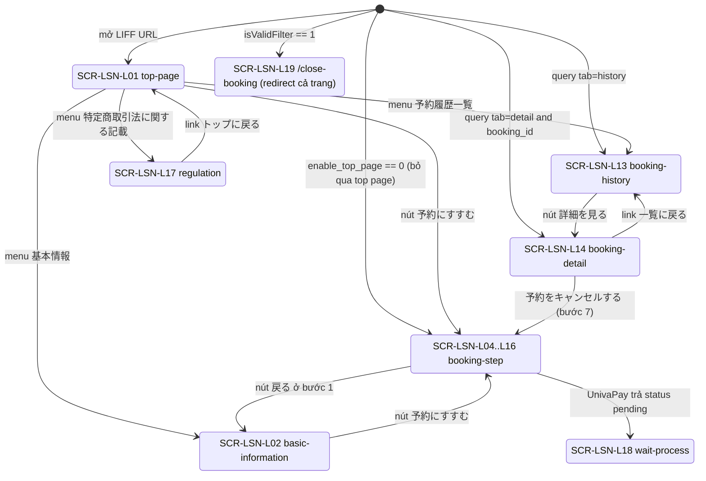
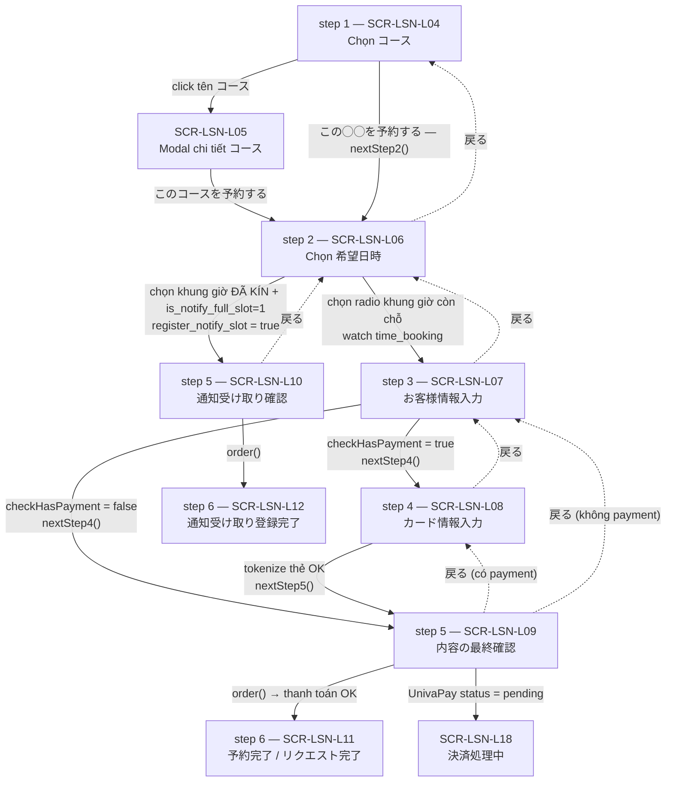
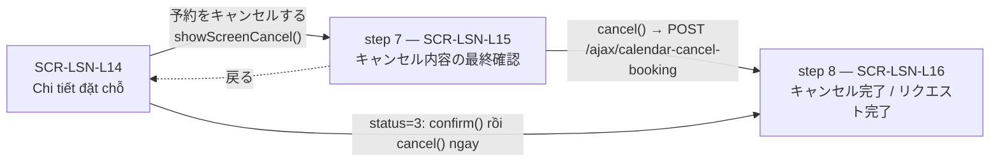

# FA-019 「レッスン予約」 — UI Spec: Trang public cho LINE User (LIFF / mobile)

> Tạo bởi: **ui-parser** agent | Phương pháp: **code-first** (không có screenshot — session browser đã hết hạn)
> Phạm vi: chỉ phần trang công khai dành cho **LINE User**. Phần Admin portal nằm ở `ui-spec.md` riêng.
> Confidence tổng thể: **Cao** cho cấu trúc DOM / điều kiện rẽ nhánh / endpoint (đọc trực tiếp từ blade + JS + controller);
> **Trung bình** cho mô tả trải nghiệm hình ảnh (màu sắc, bố cục thực tế) vì không quan sát được runtime.

---

## 1. Tổng quan

### 1.1 Tính năng làm gì
「レッスン予約」 (Đặt lịch bài học / lesson booking) cho phép **LINE User** — bạn bè của một LINE Official Account — tự đặt chỗ cho một 「コース」 (khóa học / buổi học) trong một khung giờ 「受付枠」 (reception slot) do Admin tạo sẵn, ngay bên trong LINE thông qua **LIFF (LINE Front-end Framework)**.

Luồng chính là một **wizard nhiều bước** (tối đa 5 bước nhập + 1 bước kết quả) chạy hoàn toàn client-side bằng **Vue 2**, tất cả các bước nằm trong **một trang HTML duy nhất** (SPA), chuyển bước bằng biến `step_booking`, chuyển màn hình lớn bằng biến `screen_show`.

Ngoài đặt chỗ, trang public còn có: xem/huỷ lịch sử đặt chỗ, đăng ký nhận thông báo khi có chỗ trống (dạng "chờ huỷ"/キャンセル待ち), xem điều khoản 特定商取引法, và màn hình chờ khi thanh toán xử lý bất đồng bộ.

### 1.2 Điểm vào (entry points)

| Điểm vào | URL | Ghi chú |
|---|---|---|
| Trang đặt chỗ | `GET /mobile/calendar/{calendarHashId?}/{uCode?}` | route name `calendarMobile.index` → `Mobile\CalendarController@index` (`app/Http/Controllers/Mobile/CalendarController.php:73`) |
| Trang đóng nhận đặt | `GET /mobile/calendar-lesson/{calendarHashId}/close-booking` | route name `calendarMobile.closeBooking` → `CalendarController@closeBooking` (:209) |
| Mở tab lịch sử | `…/mobile/calendar/{hash}/{uCode}?tab=history` | query `tab` đọc ở `layouts/main.blade.php:166` |
| Mở thẳng chi tiết 1 đặt chỗ | `…?tab=detail&booking_id={id}` | query `booking_id` đọc ở `layouts/main.blade.php:165`; xử lý ở `booking.js:269 switchTab()` |
| Chế độ xem thử của Admin | `uCode = 'preview'` | `CalendarController.php:153` — `$lineId = 'preview'` |

- `calendarHashId` = `Hashids::decode()` của `calendar_management.id` (`CalendarController.php:80`). Sai/không giải mã được → redirect `route('404')`.
- `uCode` = `bot_line_users.u_code` — dùng để xác định LINE User mà **không cần** LIFF (`CalendarController.php:105-121`).

### 1.3 Yêu cầu LIFF ID

`layouts/main.blade.php:158-221`:
- Nạp SDK `https://static.line-scdn.net/liff/edge/2/sdk.js`.
- **Chỉ khi `lineUserId` rỗng** (tức không lấy được từ `uCode`) mới gọi `liff.init()`.
- Thử **3 LIFF ID theo thứ tự fallback**: `$bot->liff_app_id_booking` → `$bot->liff_app_id` → `$bot->liff_app_id_old`. Cả 3 fail → chỉ log `"init failure"`, trang vẫn hiện nhưng không có `lineUserId`.
- Sau khi init thành công: `lineUserId = liff.getContext().userId`, rồi gọi `app.checkFriendCalendar()` và `app.switchTab(tab, booking_id)`.

### 1.4 Điều kiện chặn trước khi render (từ controller `index()`)

| Điều kiện | Kết quả | Dòng |
|---|---|---|
| `Hashids::decode()` rỗng hoặc calendar không tồn tại | redirect `route('404')` | :82, :90 |
| Gói hợp đồng bot = `free` | ép `is_use_payment = 0` (tắt thanh toán) | :99-102 |
| `bot_line_users.is_blocked` = 1 | redirect `$bot->url_add_friend` | :112-115 |
| Bot không tồn tại | redirect `route('404')` | :144 |
| Bot hết hạn (`plan_type=1` và `expired_date + 7 ngày < now`, hoặc `bot_contracts.status = 3`) | redirect `route('410')` | :148-150, `checkIsBotExpired()` :232 |
| User-Agent chứa `facebookexternalhit` | trả view `preview_url` nhẹ (chỉ OGP), không render app | :177-186 |
| `$calendar->enable_use_calendar != 1` | Blade in text đỏ 「この予約は現在利用できません。」, **không nạp Vue/JS** | `layouts/main.blade.php:68`, `:278-282` |
| `$calendar->filter_id_show_booking` có và filter khớp | `isValidFilter = true` → JS tự redirect sang trang 受付停止 | :157-172; `booking.js:238-240` |

### 1.5 Kiến trúc render

- **Một view gốc duy nhất**: `resources/views/basic/calendar_management/bookings/layouts/main.blade.php` include 7 partial (`:86-92`), trong đó `step-booking` lại include tiếp 10 partial (`step-booking.blade.php:48-57`).
- **Toàn bộ nội dung render động bằng Vue 2.7.16** (`layouts/main.blade.php:233`) — blade chỉ là template tĩnh với `v-if`/`v-show`/`@{{ }}`.
- Dữ liệu khởi tạo được nhúng vào JS globals (`layouts/main.blade.php:258-273`): `calendar`, `stripeBot`, `calendarSetting` (= `calendarSettingBooking`), `calendarSettingCancel`, `flagImage`, `emailDefault`, `url_line_chat`, `botId`, `lineUserId`, `isValidFilter`, `hashCalendarId`.
- Logic Vue nằm ở **`public/js/booking_news/booking.js`** (1852 dòng) — file này là nguồn sự thật cho mọi hành vi nút/ajax.
- Thư viện: jQuery, LoadingOverlay, moment, FullCalendar 6.1.11 (chỉ chế độ tháng), vee-validate 3.4.15, bootstrap-timepicker, Stripe.js **hoặc** UnivaPay checkout.js (chọn theo `$calendar->type_payment`, `layouts/main.blade.php:242-246`).

---

## 2. Nguồn dữ liệu & phương pháp

**Code-first.** Không có screenshot, không có DOM snapshot runtime, không có network capture. Mọi khẳng định dưới đây truy vết đến file:dòng.

### 2.1 Blade đã đọc (23/23 file)

| # | File (dưới `resources/views/basic/calendar_management/bookings/`) | Vai trò |
|---|---|---|
| 1 | `layouts/main.blade.php` | View gốc, HTML shell, LIFF init, biến JS, modal chi tiết khóa học |
| 2 | `layouts/header.blade.php` | **Không được include ở đâu** — mockup tĩnh còn sót (「ページタイトル」/`http://aaa.com`) |
| 3 | `layouts/step.blade.php` | **Không được include ở đâu** — mockup tĩnh 5 chấm bước |
| 4 | `calendar.blade.php` | **Không được include ở đâu** — chỉ có `@section('calendar')<div id="calendar">` |
| 5 | `top_page.blade.php` | SCR-LSN-L01 |
| 6 | `basic_information.blade.php` | SCR-LSN-L02 |
| 7 | `menu-right.blade.php` | SCR-LSN-L03 |
| 8 | `step-booking.blade.php` | Khung wizard (header + thanh bước + footer) |
| 9 | `booking_create_step1.blade.php` | SCR-LSN-L04 |
| 10 | `booking_create_step2.blade.php` | SCR-LSN-L06 |
| 11 | `booking_create_step3.blade.php` | SCR-LSN-L07 |
| 12 | `booking_create_step4.blade.php` | SCR-LSN-L08 |
| 13 | `booking_create_step5.blade.php` | SCR-LSN-L09 |
| 14 | `register-notify-slot.blade.php` | SCR-LSN-L10 |
| 15 | `booking_status.blade.php` | SCR-LSN-L11 |
| 16 | `booking_status_register_notify.blade.php` | SCR-LSN-L12 |
| 17 | `booking_history.blade.php` | SCR-LSN-L13 + SCR-LSN-L20 |
| 18 | `booking_history_detail.blade.php` | SCR-LSN-L14 + SCR-LSN-L20 |
| 19 | `confirm-cancel.blade.php` | SCR-LSN-L15 |
| 20 | `status_cancel.blade.php` | SCR-LSN-L16 |
| 21 | `regulations.blade.php` | SCR-LSN-L17 |
| 22 | `wait-process.blade.php` | SCR-LSN-L18 |
| 23 | `close-booking.blade.php` | SCR-LSN-L19 (trang HTML độc lập) |

### 2.2 Nguồn khác

| File | Dùng để |
|---|---|
| `app/Http/Controllers/Mobile/CalendarController.php` (2971 dòng) | `index()` :73, `closeBooking()` :209 render view; 14 method ajax cho response fields |
| `public/js/booking_news/booking.js` (1852 dòng) | Vue instance `app` — toàn bộ hành vi nút, ajax, rẽ nhánh bước |
| `public/js/booking_news/validate.js` | Rule vee-validate tuỳ biến (`required_calendar`, `email_calendar`, `phone_calendar`, `kana`, `number`) |
| `app/CalendarCourseBooking.php` | Hằng số `status` / `payment_status` |
| `raw/features/lesson-booking/routes-inventory.md` mục B | Danh sách route mobile + ajax |

---

## 3. Sơ đồ luồng đặt chỗ nhiều bước

### 3.1 Máy trạng thái tổng (biến `screen_show`)



### 3.2 Wizard đặt chỗ (biến `step_booking`)



> Nguồn: `booking.js` — `watch.time_booking` :113-156, `nextStep2()` :838, `nextStep3` (`nextStep4()`) :1198, `nextStep5()` :306, `order()` :862, `backBookingStep()` :1277.

### 3.3 Luồng huỷ (dùng chung `step_booking` 7 và 8)



### 3.4 Số bước hiển thị trên thanh tiến trình

`step-booking.blade.php:64-82` vẽ 5 chấm; chấm thứ 4 (bước thẻ) **bị ẩn** khi `step_booking > 2 && !checkHasPayment` (`:76`).
`booking.js` còn có computed `current_step` (:179) và `percent_progress` (:193) tính tổng bước = 6 / 5 / 4 tuỳ `checkHasPayment` và `register_notify_slot` — nhưng **không thấy blade nào dùng 2 computed này** → code chết (Confidence: Cao).

---

## 4. Từng màn hình

---

### SCR-LSN-L01 — Trang giới thiệu đầu (「トップページ」)

- **Điều kiện hiển thị**: `screen_show == SCREEN_TOP_PAGE` (`'top-page'`) — giá trị mặc định (`booking.js:65`).
- **Bị bỏ qua** khi `calendar.enable_top_page == 0` → `mounted()` gọi thẳng `showScreenBookingStep1()` (`booking.js:241-243`).
- **Blade**: `top_page.blade.php:1-27`

**Layout / nội dung**

| Vùng | Nội dung | Nguồn |
|---|---|---|
| Nút mở menu | icon `fal fa-bars`, `@click="toggleMenu"` | `top_page.blade.php:3-6` |
| Banner | `` `calendar.image_calendar_top`, prefix `env('URL_SERVER_MEDIA')`; chỉ khi có ảnh **và** `enable_top_page == 1` | `:8-9` |
| Tên cửa hàng | `@{{ calendar.store_name }}` (h3) | `:13` |
| Mô tả | `v-html="calendar.description_top"`, class `no-tailwin` (CSS `all: revert` — `layouts/main.blade.php:44`), cắt bằng `text-overflow: ellipsis` | `:16-20` |

**Buttons**

| Nhãn JP | Hành vi | Endpoint |
|---|---|---|
| 「予約にすすむ」 | `showScreenBookingStep1()` → `screen_show='booking-step'`, `step_booking=1`; nếu `courses` rỗng thì gọi ajax | `GET /ajax/get-list-course-by-calendar?calendarId&line_id` (`booking.js:492-509`) |

**Rẽ nhánh đặc biệt**
- `showScreenBookingStep1()` kiểm tra `isValidFilter == 1` trước → nếu đúng thì `window.location.href = '/mobile/calendar-lesson/{hashCalendarId}/close-booking'` (`booking.js:475-478`, `:259-261`).

**Ghi chú**
- Toàn bộ vùng `booking-public` (tên + mô tả) chỉ render khi `enable_top_page == 1`, nhưng **nút 予約にすすむ nằm ngoài `v-if`** → khi `enable_top_page == 0` mà vì lý do nào đó vẫn ở màn top page, người dùng chỉ thấy một nút trống trơn. Confidence: Cao (đọc DOM), tác động thực tế: Thấp (vì `mounted()` đã tự chuyển màn).

---

### SCR-LSN-L02 — Thông tin cơ bản (「基本情報」)

- **Điều kiện**: `screen_show == SCREEN_BASIC_INFO` (`'basic-information'`).
- **Blade**: `basic_information.blade.php:1-32`
- **Vào từ**: menu phải → 「基本情報」 (`menu-right.blade.php:10-15` → `showScreenBasicInfo()` `booking.js:474`), hoặc nút 「戻る」 ở bước 1 (`backBookingStep()` `booking.js:1278-1279`).

**Nội dung**

| Vùng | Nguồn |
|---|---|
| Tiêu đề 「基本情報」 | `:4` |
| Nút 「予約ページ」 (icon lịch) → `showScreenBookingStep1` | `:6-12` |
| Banner `calendar.image_calendar` (khác ảnh top page) | `:15-16` |
| Mô tả `v-html="calendar.description"` (khác `description_top`) | `:23` |
| Nút 「予約にすすむ」 → `showScreenBookingStep1` | `:26-30` |

**Ghi chú**: dùng `v-show` chứ không `v-if` → DOM luôn tồn tại. Có một khối `field-store-name` bị comment (`:19-22`) — trước đây từng hiện 「店舗名」.

---

### SCR-LSN-L03 — Menu trượt bên phải

- **Điều kiện**: luôn có trong DOM; hiện khi `isMenuVisible == true` (class `show-menu-right`).
- **Blade**: `menu-right.blade.php:1-28`

| Mục | Nhãn JP | Hành vi |
|---|---|---|
| Đóng | icon `fa-times` | `isMenuVisible = false` (`:5`) |
| Mục 1 | 「基本情報」 | `showScreenBasicInfo()` (`:11`) |
| Mục 2 | 「予約履歴一覧」 | `showScreenHistory()` (`:17`) → `GET /ajax/get-list-booking-history-calendar`; **bỏ qua ajax khi `lineUserId == 'preview'`** (`booking.js:344-346`) |
| Mục 3 | 「特定商取引法に関する記載」 | Chỉ render khi **`@if($calendar->is_use_payment)`** (blade PHP, `:24`) → `screen_show = SCREEN_REGULATION` |

**Ghi chú**
- `showScreenBasicInfo()` gọi `toggleMenu()` **rồi lại** set `isMenuVisible = false` (`booking.js:475-477`) — thừa nhưng vô hại.
- `mounted()` gắn listener capture trên `document.body`: click ra ngoài `#menu-right` sẽ đóng menu (`booking.js:229-235`).
- `is_use_payment` được kiểm tra ở **phía PHP lúc render**, không phải Vue → nếu contract là `free`, controller ép `is_use_payment = 0` (`CalendarController.php:99-102`) nhưng đó là trên object `$calendar` **sau khi** blade đã dùng… thực tế cùng object nên mục này bị ẩn. Confidence: Cao.

---

### SCR-LSN-L04 — Bước 1: Chọn khóa học (「コースを選んでください」)

- **Điều kiện**: `screen_show == 'booking-step'` && `step_booking == 1`.
- **Blade**: `booking_create_step1.blade.php:1-46`; tiêu đề ở `step-booking.blade.php:21`.
- **Tiêu đề động**: `@{{ calendar.booking_setting_name ? calendar.booking_setting_name : 'コース' }}を選んでください` — Admin có thể đổi từ 「コース」 thành tên khác.

**Danh sách thẻ khóa học** (`v-for="(course, indexCourse) in courses"`)

| Phần tử | Biến | Điều kiện |
|---|---|---|
| Ảnh khóa học | `course.course_image` (prefix `URL_SERVER_MEDIA`); không có → `/images/image-course-default.png` + class `no-image` | `:12-15` |
| Tên khóa học (clickable) | `course.course_name` → `showModalDetail(indexCourse)` | `:18-22` |
| Thời lượng | `course.hour_done`時間`course.minute_done`分 | `:23-28` |
| Giá | `formatNumber(course.amount)` 円（税込） | chỉ khi `is_use_payment == 1` **hoặc** (`is_use_payment == 0` && `is_display_course_cost == 1`) — `:29` |
| Nút đặt | 「この{booking_setting_name\|コース}を予約する」 → `nextStep2(indexCourse)` | `:37` |

**API nạp danh sách**: `GET /ajax/get-list-course-by-calendar` (`booking.js:493`), params `calendarId`, `line_id`.
Controller `getListCourseByCalendar()` (`CalendarController.php:281`) chỉ trả khóa học có `booking_page_display = BOOKING_DISPLAY_ON`, sắp theo `course_order`, và **lọc thêm theo filter bạn bè**: mỗi course có `filter_id_send_after_booking` sẽ bị loại nếu LINE User không khớp filter `parent_type = 'calendar-course-setting-status-send-after-booking'` (:307-355). Ở chế độ `preview` bỏ qua lọc.

**Hành vi `nextStep2(index)`** (`booking.js:838-861`)
1. `course_preview = courses[index]`.
2. Bật `checkHasPayment` nếu `course_preview.amount > 0` && `calendar.is_use_payment == 1` && (`stripeBot.status_strip_bot == 3` **hoặc** có `univapay_app_id` && `univapay_app_test_id`).
3. Reset `timeShowWeek = timeShowMonth = 1`.
4. `displayTypeCalendar(calendar.setting_show_calendar == 'week' ? 'week' : 'month')` → nạp khung giờ.
5. `step_booking = 2`.

**Ghi chú**: danh sách rỗng thì blade **không có empty state** — trang trắng. Confidence: Cao.

---

### SCR-LSN-L05 — Modal chi tiết khóa học

- **Điều kiện**: `isModalDetail == true` (class `show-detail`).
- **Blade**: `layouts/main.blade.php:96-154` (nằm ở layout gốc, không phải partial riêng).
- **Mở từ**: click tên khóa học ở SCR-LSN-L04 → `showModalDetail(index)` (`booking.js:441-448`) — cũng set `course_preview` và `index_course_selected`.

| Vùng | Biến | Nguồn |
|---|---|---|
| Nút đóng | icon `fal fa-times` → `hideModalDetail()` | `:100-102` |
| Ảnh lớn | `course_preview.course_image` / ảnh mặc định | `:109-111` |
| Tên | `course_preview.course_name` | `:118` |
| Thời lượng | `course_preview.hour_done`時間`.minute_done`分 | `:125` |
| Giá | `formatNumber(course_preview.amount)` 円（税込） — cùng điều kiện hiển thị giá | `:129-133` |
| Mô tả | `v-html="course_preview.course_description"` | `:140` |
| Nút | 「このコースを予約する」 → `nextStep2(index_course_selected)` | `:145-149` |

**Ghi chú**: `watch.isModalDetail` khoá scroll `body` khi mở (`booking.js:157-163`). `toggleMenu()` cũng tắt modal (`booking.js:436`).

---

### SCR-LSN-L06 — Bước 2: Chọn ngày giờ (「希望日時を選んでください」)

- **Điều kiện**: `step_booking == 2`.
- **Blade**: `booking_create_step2.blade.php:1-182`.

**Vùng tóm tắt trên cùng**
- Nhãn 「選択したコース」 + `course_preview.course_name` (`:3-13`).

**Thanh điều khiển lịch**

| Điều khiển | Nhãn JP | Hành vi |
|---|---|---|
| Nút hôm nay | 「今日」 (`id="btn-date-now"`) | `getTimeBookingStartToday()` (`booking.js:536`); ngoài ra FullCalendar gắn thêm listener `calendar.today()` (`booking.js:1477-1479`) |
| Tab 「週」 | tuần | `changeDisplayCalendar('week')` |
| Tab 「月」 | tháng | `changeDisplayCalendar('month')` |
| Mũi tên trái | — | `prevFilterDate()` — **chặn lùi về quá khứ**: tuần thì `if (today >= start_date) return`; tháng thì không cho lùi trước tháng hiện tại (`booking.js:547-581`). Mũi tên đổi màu `#efefef` khi bị chặn (`:40`) |
| Mũi tên phải | — | `nextFilterDate()` (`booking.js:582-599`) |
| Nhãn khoảng | tuần: `YYYY年MM月DD日 - DD日`; tháng: `YYYY年MM月` | `:42-43` |

**Lưới lịch tháng**: `<div class="full-calendar" id="calendar">` (`:50`) — FullCalendar 6.1.11 `dayGridMonth`, `locale: 'ja'`, `firstDay: 1`, không header toolbar, mỗi event render thành radio 「choose-day-{id}」 (`booking.js:1610-1623`). Click ngày → set `start_date = end_date = ngày đó` rồi `getListTimeBookingByCourse()` (`booking.js:1457-1465`).

**Danh sách khung giờ** (`v-for date in booking_times` → `v-for itemTime in date.data`)

| Phần tử | Nội dung | Nguồn |
|---|---|---|
| Tiêu đề ngày | `YYYY年MM月DD日（曜日）` — `getTextDayOfWeek()` trả `日月火水木金土` | `:57-59`, `booking.js:600-605` |
| Khung giờ | `itemTime.start_time` - `itemTime.new_end_time` (3 cột) | `:61-68` |
| Radio chọn | `v-model="time_booking"`, `:value="itemTime.id"` (= `calendar_course_receptions.id`) | `:71-76` |
| Nhãn còn chỗ | `type_limit_booking == 1` → 「残り {total_person}」; nếu `total_person == 0 && is_notify_full_slot == 1` → 「通知受け取り」; `type_limit_booking == 0` → 「定員上限なし」 | `:97-102` |
| Ẩn/hiện cột này | chỉ khi `calendar.is_display_capacity == 1` (dùng `visibility: hidden` nên vẫn chiếm chỗ) | `:94` |

**Ba biến thể icon trong ô chọn** (`:77-90`)

| Trường hợp | Hiển thị |
|---|---|
| `(total_person != 0 \|\| type_limit_booking == 0) && is_valid_start_receive` | radio tròn (`c-radio`) — chọn được |
| `(total_person == 0 && is_notify_full_slot == 0 && type_limit_booking == 1)` **hoặc** `!is_valid_start_receive` | icon gạch ngang `far fa-minus` — không chọn |
| `total_person == 0 && is_notify_full_slot == 1 && type_limit_booking == 1` | icon loa `fal fa-volume` — chuyển sang luồng đăng ký nhận thông báo |

**Điều kiện `disabled` của radio** (`:75`)
`!itemTime.is_can_booking || (checkCustomerReachesMax && (type_limit_booking == 0 || (type_limit_booking == 1 && total_person > 0)))`

**Thông báo khi click ô không chọn được** — `showMessage(itemTime)` (`booking.js:281-304`), dùng `alert()`:

| Điều kiện | Message JP |
|---|---|
| Vượt giới hạn số đặt chỗ / khách | `text_limit_book_each_customer` từ server, mặc định 「1人あたりの予約受付上限に達しています」 |
| `!is_valid_start_receive` | 「予約の受付を開始していません。」 |
| `!is_valid_deadline_receive` | 「予約の受付が終了されました。」 |

**API**

| Chế độ | Endpoint | Params |
|---|---|---|
| Tuần | `GET /ajax/get-list-time-booking-by-course` (`booking.js:810`) | `courseId`, `start_date`, `end_date`, `calendarId`, `line_id`, `timeShowWeek` |
| Tháng | `GET /ajax/init-data-booking-calendar` (`booking.js:673`) | `courseId`, `calendarId`, `month`, `calendar{is_notify_full_slot,is_display_course_full}`, `timeShowMonth` |
| Kiểm tra giới hạn/khách | `GET /ajax/check-reaches-max-each-customer` — **route tồn tại nhưng KHÔNG thấy `booking.js` gọi** (Confidence: Cao) |

Server (`getListTimeWeek()` `CalendarController.php:2756`) tính sẵn cho mỗi slot: `is_can_booking`, `is_valid_start_receive`, `is_valid_deadline_receive`, `new_end_time`, `total_person` (= `total_person - total_booking`), và loại bỏ slot quá hạn. Khi `is_notify_full_slot == 0 && is_display_course_full == 0` thì slot kín bị **bỏ hẳn** khỏi response (:2795-2801).

**Chuyển bước — `watch.time_booking`** (`booking.js:113-156`)
1. `booking_approved = false`; tìm slot theo id → `time_selected`.
2. Nếu `total_person == 0 && type_limit_booking == 1` → `register_notify_slot = true`, `step_booking = 5`, `checkHasPayment = false` → nhảy thẳng SCR-LSN-L10, **bỏ qua form khách và thẻ**.
3. Ngược lại → `register_notify_slot = false`, `funcCheckHasPayment()`, `step_booking = 3`; nếu chưa nạp form thì gọi `getDataFriendInfo()`.

**Ghi chú**: `timeShowWeek`/`timeShowMonth` là cơ chế "tự nhảy tới tuần/tháng có chỗ": lần đầu (`= 1`) server thử tối đa **4 lần** tuần kế tiếp cho đến khi tìm được slot rồi trả kèm `startDate`/`endDate` mới (`CalendarController.php:363-...`).

---

### SCR-LSN-L07 — Bước 3: Nhập thông tin khách (「お客様情報を入力してください」)

- **Điều kiện**: `step_booking == 3`; container `id="_booking-manager-step-3"`.
- **Blade**: `booking_create_step3.blade.php:1-174`.

**Vùng tóm tắt**: 「選択したコース」 + `course_preview.course_name` (`:3-16`); 「選択した日時」 + `time_selected.received_booking_date`（曜日）`start_time` - `new_end_time` (`:17-23`).

**Form động** — `v-for="(info, indexInfo) in friend_info_settings"`, bọc trong `<validation-observer>` / `<validation-provider>` của vee-validate (`:26-33`).

| Nhãn hiển thị | Loại input | name / model | Bắt buộc | Validation |
|---|---|---|---|---|
| `info.question` (v-html) + `*` nếu `info.required == 1` | phụ thuộc `info.form_type` | `info.value` | `info.required` | chuỗi `info.rules` do server sinh |
| — (mô tả phụ) | text tĩnh `info.sub_question` (v-html) | — | — | — |

**Ánh xạ `form_type` → input** (hằng số `booking.js:9-13`)

| `form_type` | Hằng | Render | Nguồn |
|---|---|---|---|
| 1 | `FORM_TYPE_TEXT` | `<input type="text" class="form-control">` | `:50-53` |
| 2 | `FORM_TYPE_TEXTAREA` | `<textarea rows="5">` | `:55-61` |
| 3 + `display_method == 1` | `FORM_TYPE_RADIO` | radio list, `name="radio-{info.id}"`, `id="option{i}-{info.id}"`, `data-preview_value="{option.title}"` | `:63-83` |
| 3 + `display_method == 2` | `FORM_TYPE_RADIO` | `<select name="select-{info.id}">` + option đầu 「選択してください」 value `""` | `:85-102` |
| 4 | `FORM_TYPE_CHECKBOX` | checkbox list, `name="checkbox-{info.id}"` | `:104-122` |
| 5 | `FORM_TYPE_DATETIME` | `<input type="date" name="friend-info-{indexInfo}" id="input-date-hide-{info.id}">` + overlay hiển thị `YYYY/MM/DD` + icon lịch | `:124-143` |
| 5 + `recording_time == 1` | — | thêm `<input class="form-control timepicker">` (bootstrap-timepicker, 24h, step 1 phút) gắn `data-field_name="recording_time"`, `data-index` | `:145-155`, `booking.js:773-799` |

**Lỗi validation**: `<div class="text-danger text-error">@{{ errors[0] }}</div>` (`:158`).

**Rule sinh từ server** (`getDataFriendInfo()` `CalendarController.php:560-...`)

| Điều kiện | Rule thêm vào |
|---|---|
| `required == 1` | `required_calendar` |
| `rule_type == 1` && `rule_validation_type == 'email'` | `email_calendar` |
| … `== 'phone'` | `phone_calendar` |
| … `== 'katakana'` | `kana` |
| … `== 'number'` | `number` |
| `can_delete == 0` && `friend_information_id == -3` && `rule_type == 0` | `email_calendar` (ép email cho trường email hệ thống) |

**Nút**

| Nhãn JP | Điều kiện | Hành vi |
|---|---|---|
| 「決済情報入力にすすむ」 khi `checkHasPayment` / 「内容の最終確認にすすむ」 khi không | `id="btn-next-step3"`, `:disabled="disableButtonNextFriendInfo"` (true cho tới khi ajax form trả về), thêm class `disabled-btn` khi `lineUserId == 'preview'` | submit form → `handleSubmit(nextStep4)` (`:27`, `:163-168`) |

**`nextStep4()`** (`booking.js:1198-1276`)
1. **Return ngay nếu `lineUserId == 'preview'`** — không đặt được ở chế độ xem thử.
2. Với field datetime + `recording_time == 1`: nối `' ' + info.time` vào `info.value`.
3. Với radio: lấy `data-preview_value` từ DOM → gán `info.value_preview` (dùng để hiển thị ở bước xác nhận).
4. Với field hệ thống (`can_delete == 0`): `friend_information_id == -1` → gán `this.name`; `== -3` → gán `this.email`.
5. `checkHasPayment` → `step_booking = 4` và (UnivaPay) gọi `addFormCardUnivapay(email)`; ngược lại → `step_booking = 5`.

**API nạp form**: `GET /ajax/get-data-friend-info-calendar` params `calendarId`, `line_user_id`, `botId` (`booking.js:753`).
Chỉ lấy `calendar_setting_send_forms` có `enable = 1` và `question` khác null, sắp theo `order` (`CalendarController.php:564-569`). Giá trị mặc định có thể được **prefill từ hồ sơ bạn bè** (`friend_information_values`) khi `link_friend_information != 1 && enable_load_friend_information == 1`.

**Xử lý lỗi HTTP đặc biệt**: `$.ajaxSetup` gắn statusCode 400/401/403/404/408/500/502/503/504 → `window.location.href = '/lme/timeout/{botId}/lesson/{calendarId}'` (`booking.js:720-751`). Confidence: Cao — đây là màn hình timeout dùng chung, **nằm ngoài** 23 blade được giao.

---

### SCR-LSN-L08 — Bước 4: Nhập thẻ (「カード情報を入力してください」)

- **Điều kiện**: `step_booking == 4`. Chỉ đến được khi `checkHasPayment == true`.
- **Blade**: `booking_create_step4.blade.php:1-132`.

**Vùng tóm tắt**: khóa học (`:3-16`), ngày giờ (`:18-24`).

**Bảng phí** — hiện khi `is_use_payment == 1` hoặc (`is_use_payment == 0 && is_display_course_cost == 1`) (`:27`)

| Nhãn JP | Giá trị |
|---|---|
| 「お支払い料金」 (tiêu đề) | — |
| tên khóa học | `course_preview.course_name` |
| — | ￥`formatNumber(course_preview.amount)`- |
| 「合計」 | ￥`formatNumber(course_preview.amount)`- 「(税込)」 |

**Logo thẻ chấp nhận**

| Cổng | Điều kiện | Logo |
|---|---|---|
| Stripe (`type_payment == 0`) | `flagImage == 0` | Visa, Mastercard, AmEx (`:55-59`) |
| Stripe | `flagImage != 0` | + JCB, Diners (`:60-66`) |
| UnivaPay (`type_payment != 0`) | mảng PHP `$flag_brand_card_univapay` (0=Visa,1=Master,2=AmEx,3=JCB,4=Diners) | render bằng `@if(in_array(n, …))` — **quyết định ở PHP lúc render** (`:70-84`) |

**Form thẻ — 2 biến thể**

| Cổng | DOM | Nguồn |
|---|---|---|
| Stripe | `<form id="payment-form">` chứa 3 div rỗng `#card-number`, `#card-expiry`, `#card-cvc`; nhãn 「カード番号」/「有効期限」/「セキュリティ番号」; vùng lỗi `#card-errors` | `:101-114` |
| UnivaPay | `<form id="payment-form" onsubmit="getPaymentInfo(event)">` chứa `<div id="checkout">` (rỗng, được `addFormCardUnivapay()` nhồi HTML) + `<button id="btn-submit-univapay">Pay</button>` | `:115-121` |

> **Ô nhập thẻ là iframe của bên thứ ba** — Stripe Elements mount vào 3 div (`booking.js:1508-1514`, placeholder 「ハイフン不要」 / `MM/YY` / `CVC`), UnivaPay checkout.js render `<span id="form-payment-univa">` thành iframe (`booking.js:1815-1838`). **Không có input thẻ nào thuộc DOM của LME** → dữ liệu thẻ không đi qua server LME. Confidence: Cao.

**Nút**

| Nhãn JP | Hành vi |
|---|---|
| 「内容の最終確認にすすむ」 | `nextStep5()`, `:disabled="is_processing_form_payment"` (`:125-128`) |

**`nextStep5()`** (`booking.js:305-317`) — **không** tự chuyển bước; nó chỉ submit form thẻ:
- `calendar.is_use_payment == 1` → `$('#payment-form').submit()`
- ngược lại → `$('#btn-submit-univapay').click()`

Bước 5 chỉ được set **sau khi tokenize thành công**: Stripe `createPaymentMethod` OK → `app.step_booking = 5` (`booking.js:1697`); UnivaPay `getInfoCard()` trả `status` true → `app.step_booking = 5` (`booking.js:1787`).

**Thông báo lỗi thẻ**: `booking.js:1516-1600` định nghĩa 2 từ điển tiếng Nhật — `errorMessages` (18 mã Stripe: `incorrect_number`, `invalid_cvc`, `expired_card`, `incomplete_number`…) và `declineMessages` (39 `decline_code`: `insufficient_funds`, `lost_card`, `fraudulent`…). Lỗi hiển thị inline trong `#card-errors`, click vào để xoá (`booking.js:1712-1717`). UnivaPay dùng `renderMessageError()` từ `/js/validate/message_error_univapay.js` (`booking.js:1750-1757`).

**Bug quan sát được**: trong 3 handler `change` của Stripe Elements, nhánh `else if (result.error.code == "card_declined")` tham chiếu biến `result` **không tồn tại trong scope** (chỉ có `event`) → sẽ ném `ReferenceError` khi mã lỗi là `card_declined` (`booking.js:1607`, `:1633`, `:1659`). Confidence: Cao.

---

### SCR-LSN-L09 — Bước 5: Xác nhận cuối (「内容の最終確認」)

- **Điều kiện**: `step_booking == 5 && !register_notify_slot` (`v-if`).
- **Blade**: `booking_create_step5.blade.php:11-123`.

**Cảnh báo đầu trang**: 「まだ予約は完了していません」 / 「ご予約内容の最終確認をしてください」 (`:14-17`).

**Khối 「予約内容」** (`:20-46`)

| Nhãn JP | Giá trị |
|---|---|
| `{booking_setting_name\|コース}` | `course_preview.course_name` |
| 「予約日時」 | `time_selected.received_booking_date`（曜日）`start_time` - `new_end_time` |
| 「料金（税込）」 | ￥`formatNumber(course_preview.amount)`- — ẩn nếu không hiện giá |

**Khối 「お客様情報」** (`:47-73`) — lặp `friend_info_settings`, hiển thị `question` (+ `sub_question`), giá trị:
- `FORM_TYPE_TEXTAREA` → khối `min-height: 100px`, `white-space: pre-line`
- `FORM_TYPE_RADIO` → dùng `info.value_preview` (nhãn, không phải value)
- checkbox (mảng) → `info.value.join('・')`
- datetime → `info.value + (recording_time == 1 ? ' ' + info.time : '')`

**Khối 「カード情報」** (`:74-92`) — hiện khi `checkHasPayment`:

| Nhãn JP | Giá trị |
|---|---|
| 「カード番号」 | `**** - **** - **** - {info_payment.last4}` |
| 「有効期限」 | `info_payment.expired_card` hoặc `--/--` |
| 「セキュリティ番号」 | luôn `...` |

**Khối 「ご利用規約」** (`:94-107`) — hiện khi `calendar.show_policy == 1`; nội dung `v-html="calendar.content_policy"`; checkbox `id="singleCheckbox"` `v-model="isChecked"` nhãn 「同意する」.

**Cảnh báo chế độ duyệt** (`:108-112`) — hiện khi `calendarSetting.approve_type == 2`:
- 「この予約はリクエスト制となります」 (đỏ)
- 「申込みをしても予約が確定するわけではありません」
- Thêm dòng khi `is_use_payment == 1 && course_preview.amount > 0`: 「※前ページでカード情報を入力された方は、リクエストが承認された時に、カード決済が行われます。」

**Nút**

| Nhãn JP | Trạng thái | Hành vi |
|---|---|---|
| 「申し込む」 | class `active-btn box-shadow-btn` chỉ khi `isChecked \|\| show_policy == 0`; `:disabled="is_processing_order"` | `order()` (`:113-119`) |

> **Điểm bất thường**: nút chỉ **đổi màu** khi chưa tick, chứ không `disabled`. Việc chặn nằm trong `order()`: `if (!isChecked && !register_notify_slot) return;` (`booking.js:866-871`) — user bấm mà không tick sẽ **không có phản hồi gì** (im lặng). Confidence: Cao.

---

### SCR-LSN-L10 — Bước 5 (nhánh): Xác nhận đăng ký nhận thông báo trống chỗ

- **Điều kiện**: `step_booking == 5 && register_notify_slot && !booking_approved`.
- **Blade**: `register-notify-slot.blade.php:1-47`.
- **Vào từ**: chọn khung giờ đã kín chỗ + `calendar.is_notify_full_slot == 1` ở SCR-LSN-L06.

**Cảnh báo đầu** (`:3-11`)
- 「これは予約ではありません」 (đỏ, icon `fa-info-circle`)
- 「選択いただいた受付枠に空き枠が発生した時に通知を受け取る登録です。」
- 「通知を受け取った場合は、改めて予約の申し込みが必要となります。」 (đỏ)

**Khối 「空き枠発生時の通知受け取り受付枠」** (`:13-37`): tên khóa học, 「予約日時」, 「料金（税込）」 — **không có `v-show` điều kiện giá** ở đây, giá luôn hiện (khác các màn khác). Confidence: Cao.

**Nút**: 「通知受け取りを申し込む」 → `order()` (`:42-45`).

**Ghi chú**: bước này **bỏ qua hoàn toàn** form khách hàng (bước 3) và form thẻ (bước 4); `checkHasPayment` bị ép `false` (`booking.js:140`). Nút 「戻る」 quay về bước 2 (`booking.js:1301-1303`).

---

### SCR-LSN-L11 — Bước 6: Hoàn tất đặt chỗ

- **Điều kiện**: `step_booking == 6 && !register_notify_slot`.
- **Blade**: `booking_status.blade.php:1-48`; tiêu đề ở `step-booking.blade.php:27-28`.

| `calendarSetting.approve_type` | Tiêu đề header | Banner tròn |
|---|---|---|
| 1 (duyệt tự động) | 「予約完了」 | 「ご予約ありがとうございました」 |
| 2 (chờ duyệt) | 「予約リクエスト完了」 | 「予約リクエストを受け付けました」 |

**Khối cảnh báo khi `approve_type == 2`** (`:7-12`)
- 「この予約はリクエスト制となります」/「まだ予約は確定していません。」/「承認状況は予約履歴一覧より確認できます。」
- Thêm khi `is_use_payment == 1 && amount > 0`: 「※予約時にカード情報を入力された方は、リクエストが承認された時に、カード決済が行われます。」

**Nội dung**: `{booking_setting_name|コース}`, 「予約日時」, 「料金（税込）」 (`:16-37`).

**Nút**: 「トーク画面に戻る」 → `backToScreenChat()` = `window.location.href = url_line_chat` (`booking.js:1001-1003`). `url_line_chat` được **cập nhật lại từ response** của `/ajax/calendar-order` (`booking.js:1017`).

**Ghi chú**: `step-booking.blade.php:59` ẩn footer (nút 戻る + thanh bước) khi `step_booking` là 6 hoặc 8 → không quay lui được sau khi đặt xong.

---

### SCR-LSN-L12 — Bước 6 (nhánh): Hoàn tất đăng ký nhận thông báo

- **Điều kiện**: `step_booking == 6 && register_notify_slot && booking_approved`.
- **Blade**: `booking_status_register_notify.blade.php:1-55`; tiêu đề 「通知受け取り登録完了」 (`step-booking.blade.php:30`).
- Banner tròn: 「通知受け取り登録を受け付けました」.
- Cùng khối thông tin khóa học/ngày giờ/giá (`:9-31`).
- Nhắc lại: 「これは予約ではありません」 + 「通知を受け取った場合は、改めて予約の申し込みが必要となります。」 (`:35-46`).
- Nút: 「トーク画面に戻る」 → `backToScreenChat()`.

---

### SCR-LSN-L13 — Lịch sử đặt chỗ (「予約履歴」)

- **Điều kiện**: `screen_show == SCREEN_BOOKING_HISTORY` (`'booking-history'`).
- **Blade**: `booking_history.blade.php:1-252`.
- **Vào từ**: menu 「予約履歴一覧」, hoặc URL `?tab=history` (`booking.js:269-280`).

**Header cố định** (`position: fixed`): tiêu đề 「予約履歴」, nút 「予約ページ」, 2 tab.

| Tab | Nhãn JP | `tab_history` | Hành vi |
|---|---|---|---|
| 1 | 「一覧」 | `'list'` | `changeTab('list')` |
| 2 | 「月次」 | `'month'` | `changeTab('month')` — reset `month_history = hôm nay` |

**Bộ chọn tháng** (chỉ khi `tab_history === 'month'`, `:29-37`): mũi tên trái `previousMonth()` / nhãn `YYYY年MM月` / mũi tên phải `nextMonth()` — cả hai gọi lại `getBookingHistory()`.

**Ba nhóm danh sách**

| Nhóm | Tiêu đề JP | Biến | Điều kiện hiện |
|---|---|---|---|
| Sắp tới | 「現在の予約」 | `currentBookings` | `length > 0` (`:38-40`) |
| Đang chờ thông báo | 「通知受け取り」 | `waitingBookings` | `length > 0` (`:109-111`) |
| Quá khứ | 「過去の予約」 | `beforeBookings` | `length > 0` (`:158-160`) |

**Badge trạng thái** (`item.status` — `:54-76` cho nhóm 1, `:172-206` cho nhóm 3)

| `status` | Hằng (`app/CalendarCourseBooking.php`) | Badge JP | Class |
|---|---|---|---|
| 0 | `SB_REQUEST_BOOKING` | 「予約リクエスト中」 | `request-approve` |
| 1 | `SB_BOOKING_APPROVE` | 「予約確定」 | `approve` |
| 2 | `SB_BOOKING_ADMIN_BOOK` | 「予約確定」 | `approve` |
| 3 | `SB_REQUEST_BOOKING_WAIT_CANCEL` | 「通知受け取り」 (nhóm 2: 「通知受け取り中」 + icon loa) | `notify` |
| 4 | `SB_BOOKING_CANCEL` | 「キャンセル」 | `cancel` |
| 5 | `SB_REQUEST_BOOKING_CANCEL` | 「キャンセルリクエスト中」 | `request-cancel` |
| 6 | `SB_BOOKING_DENY` | 「否認済」 | `cancel` |
| 7 | `SB_BOOKING_ADMIN_CANCEL` | 「キャンセル」 | `cancel` |
| 1/2 + `received_booking_date + end_time < now` | — | 「終了」 (chỉ nhóm 「過去の予約」) | `end` |

**Thẻ mỗi mục**: ảnh khóa học, tên (`item.course_name`), `YYYY/MM/DD（曜日）HH:mm - HH:mm` (end_time `00:00:00` → hiện `24:00`), `item.payment_amount` 円（税込）(theo điều kiện hiện giá).

**Nút trên thẻ**

| Nhóm | Nhãn JP | Hành vi |
|---|---|---|
| 1, 3 | 「詳細を見る」 | `redirectBookingDetail(index, 'current'\|'before')` → chỉ set `booking_detail` từ mảng local, **không gọi API** (`booking.js:462-473`) |
| 1, 3 | 「同じ内容で予約」 (link) | `copyBooking(item)` |
| 2 | 「通知受け取りを停止」 | `confirmDeleteWaitingBooking(item)` → mở modal SCR-LSN-L20 |

**`copyBooking(booking)`** (`booking.js:616-648`)
1. Chặn nếu `isValidFilter == 1` → chuyển trang 受付停止.
2. `getListCourseByCalendar(booking.course_id)` (**ajax đồng bộ `async: false`**) để tìm `index_course_selected`.
3. Nếu khóa học không còn (`index === -1`) → `alert('コースが存在していません。')` rồi dừng.
4. Dựng lại `course_preview` từ dữ liệu booking, reset `time_booking`, nhảy tới `step_booking = 2`.

> **Lỗi tiềm ẩn**: `copyBooking` dựng `course_preview` chỉ với `{id, course_name, amount}` — **thiếu `course_image`, `hour_done`, `minute_done`, `course_description`** → các bước sau hiển thị thiếu. Ngoài ra `checkHasPayment` **không được tính lại** ở nhánh này (khác `nextStep2`), nó chỉ được tính trong `watch.time_booking` → `funcCheckHasPayment()`. Confidence: Cao (đọc code), tác động: Trung bình.

**API**: `GET /ajax/get-list-booking-history-calendar` params `line_user_id`, `calendarId`, `type` (= `tab_history`), `month` (`booking.js:386`).
Server (`getListHistoryBooking()` `CalendarController.php:2391`) loại các booking `status = 3` và các booking `status=1 && payment_status=0 && status_webhook ∈ {0,3,4}` (đang chờ webhook) khỏi `currentBookings` (:2417). Bổ sung `is_can_cancel` cho mỗi booking dựa trên `calendar_setting_send_messages` `moment='cancel'`.

---

### SCR-LSN-L14 — Chi tiết đặt chỗ (「予約履歴」 detail)

- **Điều kiện**: `screen_show == SCREEN_BOOKING_DETAIL` (`'booking-detail'`).
- **Blade**: `booking_history_detail.blade.php:1-165`.
- **Vào từ**: nút 「詳細を見る」 (dữ liệu local), hoặc URL `?tab=detail&booking_id=…` → `getDetailBookingCalendar(bookingId)` gọi `GET /ajax/get-detail-booking-calendar` (`booking.js:354-380`).

Header + tab giống SCR-LSN-L13. Thẻ chi tiết dùng `booking_detail.*` với cùng bộ badge (`:45-76`).

**Vùng hành động — 5 nhánh loại trừ nhau** (`:101-146`)

| # | Điều kiện | Hiển thị |
|---|---|---|
| 1 | `status ∈ [1,2]` && chưa tới giờ bắt đầu && `calendarSettingCancel.approve_type != 3` | link 「予約をキャンセルする」 → `showScreenCancel()` |
| 2 | `status == 0` && chưa tới giờ && `approve_type != 3` | text 「予約リクエストの取り消しはできません」 (không click được) |
| 3 | `status == 5` && chưa tới giờ | text 「キャンセルリクエストの取り消しはできません」 |
| 4 | `status == 3` | 2 nút: 「予約ページにすすむ」 (`showScreenBookingStep1`) + 「通知受け取りを停止」 (`confirmDeleteWaitingBooking`) |
| 5 | còn lại | link 「同じ内容で予約」 → `copyBooking(booking_detail)` |

> `calendarSettingCancel.approve_type == 3` ⇒ **cấm huỷ hoàn toàn** — không hiện link huỷ. Confidence: Cao (suy từ `!= 3` ở `:104` và `:114`); ý nghĩa chính xác của giá trị 3 chưa xác nhận từ Admin spec.

**Link cuối**: 「< 一覧に戻る」 → `backToListHistory()` — nếu cả `currentBookings` và `beforeBookings` rỗng thì gọi lại `getBookingHistory()` (`booking.js:262-268`).

**`showScreenCancel()`** (`booking.js:916-943`)
1. `status == 3` (đăng ký nhận thông báo) → `confirm('キャンセルしますか？')`, đồng ý thì gọi thẳng `cancel()` — **không qua màn xác nhận**.
2. `!booking_detail.is_can_cancel` → `alert('キャンセルできません。')` rồi dừng.
3. Ngược lại → `screen_show = 'booking-step'`, `step_booking = 7`, và `booking_detail.friend_info = JSON.parse(booking_detail.friend_info)`.

> **Lỗi tiềm ẩn**: `JSON.parse` được gọi mỗi lần vào màn huỷ; nếu người dùng vào rồi bấm 戻る rồi vào lại, lần thứ hai parse một object (không phải chuỗi) sẽ ném exception. Confidence: Trung bình (phụ thuộc Vue reactivity thực tế).

---

### SCR-LSN-L15 — Bước 7: Xác nhận huỷ (「キャンセル内容の最終確認」)

- **Điều kiện**: `step_booking == 7`.
- **Blade**: `confirm-cancel.blade.php:11-106`; tiêu đề ở `step-booking.blade.php:32`.
- Thanh 5 chấm bị ẩn ở bước này (`step-booking.blade.php:64`).

**Cảnh báo**: 「まだキャンセルは完了していません」 / 「キャンセル内容の最終確認をしてください」 (`:15-16`).

**Khối 「予約内容」** (`:20-46`): tên khóa học `booking_detail.course_name`, 「予約日時」 (định dạng lại `start_time`/`end_time` từ `HH:mm:ss`), 「料金（税込）」 `booking_detail.payment_amount`.

**Khối 「お客様情報」** (`:47-72`): lặp `booking_detail.friend_info` (mảng đã parse từ JSON lưu kèm booking), cùng logic hiển thị theo `form_type` như bước 5.

**Khối 「カード情報」** (`:73-91`): chỉ khi `booking_detail.charge_id` có giá trị — `last4`, `payment_card_expired`, `...`.

**Cảnh báo chế độ duyệt huỷ** (`:93-96`): khi `calendarSettingCancel.approve_type == 2 && booking_detail.status != 0` — 「このキャンセルはリクエスト制となります」 / 「申込みをしてもキャンセルが確定するわけではありません。」

**Nút** (`:99-102`)

| Điều kiện | Nhãn JP |
|---|---|
| `calendarSettingCancel.approve_type == 1` **hoặc** `booking_detail.status == 0` | 「キャンセルを確定する」 |
| còn lại | 「キャンセルを申し込む」 |

→ `cancel()` → `POST /ajax/calendar-cancel-booking` body `{id}` (`booking.js:950-1000`).

**Nút 戻る** ở bước 7 → về `screen_show = SCREEN_BOOKING_DETAIL` (`booking.js:1308-1309`).

---

### SCR-LSN-L16 — Bước 8: Kết quả huỷ

- **Điều kiện**: `step_booking == 8`.
- **Blade**: `status_cancel.blade.php:1-60`; tiêu đề ở `step-booking.blade.php:33-34`.

| Điều kiện | Tiêu đề header | Banner tròn |
|---|---|---|
| `calendarSettingCancel.approve_type == 1` **hoặc** `booking_detail.status == 4` | 「キャンセル完了」 | 「ご予約のキャンセルが完了しました」 |
| `approve_type == 2 && status != 4` | 「キャンセルリクエスト完了」 | 「キャンセルリクエストを受け付けました」 + khối 「このキャンセルはリクエスト制となります」/「まだキャンセルは確定していません。」/「承認状況は予約履歴一覧より確認できます。」 |

**Ghi chú hoàn tiền** (chỉ nhánh huỷ hoàn tất, `:44-51`)

| `booking_detail.payment_status` | Text JP |
|---|---|
| `== 2` (`SP_NO_PAYMENT` — không thu tiền) | 「コース料金の請求は行われておりませんので、返金はございません。」 |
| `!= 2` | 「お支払い済みのコース料金の返金に関しましては、サービス運営元までお問い合わせください。」 |

> Hoàn tiền **không tự động** ở phía LINE User — phải liên hệ đơn vị vận hành (Admin có chức năng `orderRefund` riêng). Confidence: Cao.

**Nút**: 「トーク画面に戻る」 → `backToScreenChat()`.

---

### SCR-LSN-L17 — Điều khoản giao dịch (「特定商取引法に関する記載」)

- **Điều kiện**: `screen_show == SCREEN_REGULATION` (`'regulation'`).
- **Blade**: `regulations.blade.php:1-39`.
- **Vào từ**: menu phải mục 3 — chỉ tồn tại khi `$calendar->is_use_payment` truthy.
- Nội dung: `v-html="calendar.description_payment"` (`:12`) — **một khối HTML tự do do Admin nhập**, không phải các field riêng (「運営統括責任者」/「所在地」/「電話番号」/「メールアドレス」 nằm trong comment `:16-33`, không dùng).
- Nút 「予約ページ」 (`:6-9`) → `showScreenBookingStep1`; link 「トップに戻る」 (`:37`) → `screen_show = SCREEN_TOP_PAGE`.

---

### SCR-LSN-L18 — Chờ xử lý thanh toán (「決済処理を行っています」)

- **Điều kiện**: `screen_show == 'wait-process'` (chuỗi literal, **không có hằng số** — khác các màn khác).
- **Blade**: `wait-process.blade.php:1-26`.
- **Vào từ**: `paymentUnivapay()` nhận `res.status == 'pending'` (`booking.js:1189-1190`).

**Nội dung**
- Icon `/images/icon_card.svg`
- 「決済処理を行っています」
- 「この処理には2~3分かかる場合があります。」
- 「決済の成功・失敗が確定しましたら」/「LINEへのメッセージ送信でお知らせいたします。」 (màu `#5799DB`)
- 「画面を閉じてお待ちください。」
- Nút 「画面を閉じる」 → `backToScreenChat()`

**Ghi chú**
- Có method `showScreenWaitProcess()` (`booking.js:1046-1065`) đặt timer 45 giây rồi tự chuyển sang màn này — nhưng **cả 2 chỗ gọi đều đã bị comment** (`booking.js:1157`, `:1163`) → code chết. Confidence: Cao.
- Kết quả cuối được thông báo qua **tin nhắn LINE** (webhook UnivaPay), không phải trên trang.

---

### SCR-LSN-L19 — Trang đóng nhận đặt (「受付停止」)

- **URL**: `GET /mobile/calendar-lesson/{calendarHashId}/close-booking`
- **Blade**: `close-booking.blade.php:1-76` — **trang HTML độc lập**, không dùng `layouts/main`, không Vue, dùng Tailwind (`/js/tailwindcss.js` `:23`).
- **Vào từ**: `showPageCloseBooking()` — `window.location.href` (`booking.js:259-261`), được gọi khi `isValidFilter == 1` ở `mounted()` (`:238`), `showScreenBookingStep1()` (`:475`), `copyBooking()` (`:617`).

| Vùng | Nội dung |
|---|---|
| Header | 「受付停止」 (`:28`) |
| Icon | SVG lịch + dấu X đỏ, nền `#FDEBE9` (`:32-61`) |
| Tiêu đề | 「予約できません」 (đỏ `#F44336`, `:65`) |
| Thông điệp | `nl2br($calendarSendMessage->text_filter_show_booking)` — **text do Admin cấu hình** (`:66`) |
| Link | 「トーク画面に戻る」 → `$bot->url_add_friend` (`:67`) |

**Ghi chú**
- Controller `closeBooking()` (`CalendarController.php:209-231`) **không kiểm tra** filter/quyền — bất kỳ ai có hash calendar hợp lệ đều xem được trang này.
- `$calendarSendMessage` lấy record `moment = 'booking'`; **không kiểm tra null** trước khi dùng `->text_filter_show_booking` ở blade → sẽ lỗi nếu calendar chưa có setting. Confidence: Cao.
- Trong `index()`, đoạn redirect sang trang này khi `isValidFilter` **đã bị comment ở PHP** (`:173-175`) và chuyển sang xử lý ở JS (`booking.js:238`) → có một khoảnh khắc trang chính hiện ra trước khi redirect. Confidence: Cao.

---

### SCR-LSN-L20 — Modal xác nhận dừng nhận thông báo

- **Điều kiện**: `showStopNotifyModal == true`.
- **Blade**: **định nghĩa 2 lần** — `booking_history.blade.php:241-251` và `booking_history_detail.blade.php:154-164` (nội dung giống hệt).

| Phần tử | Nội dung |
|---|---|
| Tiêu đề | 「通知受け取りを<br>停止してよろしいですか？」 |
| Nút đóng | `✕` → `showStopNotifyModal = false` |
| Click nền | `@click.self` → đóng |
| Nút chính | 「停止する」 → `stopWaitingNotification()` |

**`stopWaitingNotification()`** (`booking.js:1341-1377`)
- `POST /ajax/calendar-cancel-booking` body `{id: selectedWaitingItem.id}`.
- Thành công → xoá item khỏi `waitingBookings`; nếu đang ở màn chi tiết thì quay về danh sách và gọi lại `getBookingHistory()`.

**Phía server** (`cancelBooking()` `CalendarController.php:2165-2181`): với `status == SB_REQUEST_BOOKING_WAIT_CANCEL` (3) → **xoá cứng** bản ghi `calendar_course_bookings`, đếm lại `total_booking` của reception, xoá bản ghi `mobile_notifies` liên quan, và trả `{status:true, delete_booking:true}`.

---

### SCR-LSN-L21 — Các trạng thái toàn trang (banner preview / lỗi)

**a) Banner chế độ xem thử** (`layouts/main.blade.php:77-81`) — hiện khi `lineUserId == 'preview'`:
- 「この画面はプレビューとなります。」
- 「このページのURLを配信することはできません。」
- Nền trang đổi `#f8f8f8`, khung nội dung `height: calc(100vh - 100px)` + đổ bóng để giả lập khung điện thoại (`:72`, `:83`).

**b) Trang không khả dụng** (`layouts/main.blade.php:278-282`) — khi `$calendar->enable_use_calendar != 1`:
- Text đỏ 「この予約は現在利用できません。」, căn giữa, `margin-top: 50px`.
- **Không nạp Vue, jQuery, Stripe/UnivaPay** → trang tĩnh hoàn toàn.

**c) Hạn chế ở chế độ preview**

| Nơi | Hành vi |
|---|---|
| `showScreenHistory()` | không gọi API lịch sử (`booking.js:344-346`) |
| `nextStep4()` | **return ngay**, không sang bước 4/5 (`booking.js:1201-1203`) |
| Nút bước 3 | thêm class `disabled-btn` (`booking_create_step3.blade.php:165`) |
| `getListCourseByCalendar` server | bỏ qua lọc filter bạn bè (`CalendarController.php:307`) |

**d) Blade chết (không được include ở đâu)** — xác nhận bằng grep toàn repo:

| File | Nội dung |
|---|---|
| `layouts/header.blade.php` | header mockup tĩnh với text giả 「ページタイトル」 và `http://aaa.com` |
| `layouts/step.blade.php` | thanh 5 chấm tĩnh + nút 「戻る」 (đã được viết lại inline trong `step-booking.blade.php`) |
| `calendar.blade.php` | 3 dòng `@section('calendar')<div id="calendar"></div>@endsection` |

---

## 5. Các nhánh đặc biệt

### 5.1 Đăng ký nhận thông báo khi kín chỗ (「キャンセル待ち」/ 通知受け取り)

| Bước | Màn hình | Cơ chế |
|---|---|---|
| Kích hoạt | SCR-LSN-L06 | Slot có `type_limit_booking == 1` && `total_person == 0` && `calendar.is_notify_full_slot == 1` → icon loa `fal fa-volume`, nhãn 「通知受け取り」 |
| Chọn | — | `watch.time_booking` set `register_notify_slot = true`, `checkHasPayment = false`, nhảy `step_booking = 5` |
| Xác nhận | SCR-LSN-L10 | Nút 「通知受け取りを申し込む」 → `order()` với `register_notify_slot: true` (server ép `amount = 0`, `CalendarController.php:1476-1478`) |
| Hoàn tất | SCR-LSN-L12 | `status = SB_REQUEST_BOOKING_WAIT_CANCEL` (3) (`CalendarController.php:1547`) |
| Xem lại | SCR-LSN-L13 nhóm 「通知受け取り」 | badge 「通知受け取り中」 + icon loa |
| Dừng | SCR-LSN-L20 | `POST /ajax/calendar-cancel-booking` → **xoá cứng bản ghi** |
| Khi có chỗ trống | — | Người dùng nhận tin LINE, **phải tự vào đặt lại** (「改めて予約の申し込みが必要となります」). Khi họ đặt lại, `order()` nhận `bookingType = 'notify'` và tái sử dụng bản ghi cũ (`CalendarController.php:1514-1521`) |
| Chặn | — | `order()` ném lỗi 「この機能は現在利用できませんん。」 (nguyên văn có lỗi chính tả 2 chữ ん) nếu `is_notify_full_slot == 0` (`CalendarController.php:59`, `:1466-1468`) |

### 5.2 Huỷ đặt chỗ

Xem SCR-LSN-L14 → L15 → L16. Ba chế độ theo `calendarSettingCancel.approve_type`:

| `approve_type` | Ý nghĩa | Kết quả sau `cancel()` |
|---|---|---|
| 1 | Huỷ tự động | `status → 4` (`SB_BOOKING_CANCEL`), màn 「キャンセル完了」 |
| 2 | Huỷ cần duyệt | `status → 5` (`SB_REQUEST_BOOKING_CANCEL`), màn 「キャンセルリクエスト完了」 |
| 3 | **Không cho huỷ** | Link 「予約をキャンセルする」 không render (Confidence: Trung bình) |

**Trường hợp đặc biệt** (`CalendarController.php:2182-2195`): nếu booking **đang ở `status = 5`** (đã gửi yêu cầu huỷ) mà gọi lại `cancelBooking` → server **rút lại yêu cầu huỷ**, trả `status` về 1 hoặc 2 (tuỳ có `admin_id`) và trả `cancel_request_booking: true`. Tuy nhiên **UI không có nút nào dẫn đến trường hợp này** (màn chi tiết hiện text 「キャンセルリクエストの取り消しはできません」). Method `cancelRequestCancel()` (`booking.js:944-949`) tồn tại nhưng **không blade nào gọi** → code chết. Confidence: Cao — đây là **điểm bất thường đáng chú ý**: backend hỗ trợ nhưng frontend chặn.

**Hạn chót huỷ**: `is_can_cancel` do server tính khi `calendarSettingCancel.deadline_cancel_booking_type == 2`, dựa trên `setting_time_booking_type`, `before_booking_day`, `before_booking_hour`, `booking_time_from/to`. Không đạt → `alert('キャンセルできません。')`.

### 5.3 Lịch sử đặt chỗ

Xem SCR-LSN-L13/L14. Hai chế độ xem (`一覧` = tất cả, `月次` = lọc theo tháng). Chức năng 「同じ内容で予約」 (copyBooking) cho phép đặt lại cùng khóa học với ngày giờ mới.

### 5.4 Điều khoản 特定商取引法

Xem SCR-LSN-L17. Chỉ hiện khi calendar bật thanh toán — phù hợp với luật thương mại điện tử Nhật Bản (yêu cầu công bố thông tin người bán khi thu tiền).

### 5.5 Màn hình chờ xử lý

Xem SCR-LSN-L18. Chỉ áp dụng UnivaPay + webhook.

### 5.6 Đóng nhận đặt / chặn theo filter

Xem SCR-LSN-L19. Cơ chế: Admin gán `filter_id_show_booking` cho calendar; controller đánh giá filter với LINE User hiện tại (`isValidFilter()` `CalendarController.php:2728`) → biến JS `isValidFilter` → JS redirect.

> **Lưu ý ngữ nghĩa**: tên biến `isValidFilter` gây hiểu nhầm — giá trị `true` nghĩa là **KHỚP filter chặn** → **bị chặn**, không phải "hợp lệ". Confidence: Cao.

---

## 6. Thanh toán

### 6.1 Chọn cổng

`calendar.type_payment`: `0` = **Stripe**, khác 0 = **UnivaPay** (`layouts/main.blade.php:242-246`).
`checkHasPayment` bật khi **tất cả** đúng (`booking.js:305-317` / `:842-848`):
- `course_preview.amount > 0`
- `!register_notify_slot`
- `calendar.is_use_payment == 1`
- Stripe: `stripeBot.status_strip_bot == 3` — hoặc UnivaPay: có cả `univapay_app_id` **và** `univapay_app_test_id`

> **Khác biệt giữa 2 chỗ tính**: `funcCheckHasPayment()` (:305) kiểm tra `type_payment` khớp với cổng; `nextStep2()` (:842) **không** kiểm tra `type_payment` (chỉ OR hai điều kiện). Hai hàm cho kết quả khác nhau khi bot cấu hình cả 2 cổng. Confidence: Cao — **điểm bất thường**.

`calendar.environment`: `0` = test (dùng `strip_public_test_key` / `univapay_app_token_test`), khác 0 = live (`booking.js:1088`, `:1499`, `:1817`).

### 6.2 Luồng Stripe (`type_payment == 0`)

```mermaid
sequenceDiagram
    participant U as LINE User
    participant P as Trang LIFF
    participant S as Stripe.js
    participant L as Server LME
    U->>P: Bước 4, nhập thẻ vào Stripe Elements
    U->>P: 内容の最終確認にすすむ → nextStep5()
    P->>S: stripe.createPaymentMethod(card)
    S-->>P: paymentMethod {id, brand, last4, exp}
    P->>P: info_payment = {pm_id, brand_name, last4, expired_card}; step_booking = 5
    U->>P: 申し込む → order()
    P->>L: POST /ajax/calendar-payment-stripe (dataPost)
    L-->>P: {status, bookingId, bookingType, charge_id, customer_id, client_secret, isConfirm, isPaymentAfter}
    alt isPaymentAfter (approve_type=2, chỉ giữ thẻ)
        P->>S: confirmCardSetup(client_secret, pm_id)
        S-->>P: setupIntent.status
    else thanh toán ngay
        P->>S: confirmCardPayment(client_secret, pm_id)
        S-->>P: paymentIntent.status
    end
    alt succeeded
        P->>L: POST /ajax/calendar-order (dataPost + bookingId/charge_id)
        L-->>P: {status:true, url_line_chat}
        P->>P: step_booking = 6 (SCR-LSN-L11)
    else thất bại
        P->>L: POST /ajax/calendar-delete-order-confirm-fail {bookingId, receptionId}
        P->>P: alert(error), resetElement(), quay lại step 4
    end
```
Nguồn: `booking.js:1066-1152`, `paymentStripe()` `CalendarController.php:848`.

> Nhánh `isPaymentAfter` **không** gọi `deleteOrderConfirmFail` khi confirm thất bại (`booking.js:1108-1112`) — khác nhánh thanh toán ngay (`:1130`). Có thể để lại booking mồ côi. Confidence: Cao.

### 6.3 Luồng UnivaPay (`type_payment != 0`)

**Bước 4 — dựng form**: `nextStep4()` gọi `addFormCardUnivapay(email)` (`booking.js:1268-1271`, định nghĩa `:1791-1852`):
1. `POST /ajax/calendar/call-create-customer-id` body `{botId, calendarId}` → nhận `{customer_id, customer_code}`; `success == 0` → `alert(msg)`.
2. Lưu `info_payment = {univapay_customer_id, univapay_customer_code}`.
3. Chèn `<span id="form-payment-univa">` với các data-attr: `data-app-id` (token theo `environment`), `data-checkout="token"`, `data-inline="true"`, `data-token-type="recurring"`, `data-email`, `data-payment-type="card"`, `data-locale="ja-jp"`, `data-univapay-customer-id`; **thêm `data-cvv-authorize="true"` khi `calendarSetting.approve_type == 2`**.

**Submit form** → `getPaymentInfo(event)` (`booking.js:1740-1765`): `UnivapayCheckout.submit(iframe)` → nhận `token` → `getInfoCard()`.

**`getInfoCard()`** (`booking.js:1767-1789`): `POST /ajax/calendar/get-info-card-event-booking` body `{botId, token, emailDefault, nameDefault, calendarId, environment}` → nhận `infoCard.univapay` → gán `last4`, `payment_email`, `brand_name`, `charge_id` (= `authorizeChargeId`) → `step_booking = 5`.

**Đặt chỗ**: `order()` phân nhánh (`booking.js:900-910`):
- `approve_type == 1` → `paymentUnivapay(dataPost)` (thu tiền ngay)
- `approve_type == 2` → `paymentSuccess(dataPost)` (chỉ giữ authorization, thu khi Admin duyệt)

**`paymentUnivapay()` xử lý 3 trạng thái response** (`booking.js:1163-1195`):

| `res.status` | Xử lý |
|---|---|
| `'success'` + `isProcessWithWebhook == true` | Chuyển thẳng `step_booking = 6`, `booking_approved = true`, **không gọi `/ajax/calendar-order`** |
| `'success'` + `isProcessWithWebhook == false` | Gọi tiếp `paymentSuccess()` → `/ajax/calendar-order` |
| `'error'` | `alert(res.errorMessage)` |
| `'pending'` | `screen_show = 'wait-process'` (SCR-LSN-L18) |

### 6.4 Bảng endpoint thanh toán

| Endpoint | Method | Gọi từ | Payload chính |
|---|---|---|---|
| `/ajax/calendar/call-create-customer-id` | POST | `addFormCardUnivapay()` | `botId`, `calendarId` |
| `/ajax/calendar/get-info-card-event-booking` | POST | `getInfoCard()` | `botId`, `token`, `emailDefault`, `nameDefault`, `calendarId`, `environment` |
| `/ajax/calendar-payment-stripe` | POST | `paymentStripe()` | toàn bộ `dataPost` |
| `/ajax/calendar-payment-univapay` | POST | `paymentUnivapay()` | toàn bộ `dataPost` |
| `/ajax/calendar-order` | POST | `paymentSuccess()` | `dataPost` + `bookingId`, `bookingType`, `charge_id`, `customer_id` |
| `/ajax/calendar-delete-order-confirm-fail` | POST | `deleteOrderConfirmFail()` | `bookingId`, `receptionId` |

**`dataPost` chung** (`booking.js:872-888`):
`amount`, `courseId`, `calendarId`, `reception_id`, `line_user_id`, `email`, `name`, `...info_payment` (pm_id / univapay_token / univapay_customer_id / univapay_customer_code / last4 / brand_name / expired_card / charge_id / payment_email), `approve_type`, `friend_info_settings` (đã xoá `options` và `can_delete` trước khi gửi, `:890-896`), `register_notify_slot`, `checkHasPayment`, `botId`.

---

## 7. User flows

### 7.1 Happy path — không thanh toán, duyệt tự động

`L01 → (予約にすすむ) → L04 → (nextStep2) → L06 → (chọn giờ) → L07 → (nextStep4, checkHasPayment=false) → L09 → (申し込む → order → paymentSuccess → /ajax/calendar-order) → L11 「予約完了」`
DB: `status = 1` (`SB_BOOKING_APPROVE`).

### 7.2 Happy path — không thanh toán, cần duyệt

Giống 7.1 nhưng `calendarSetting.approve_type == 2`:
- L09 hiện khối 「この予約はリクエスト制となります」
- L11 tiêu đề 「予約リクエスト完了」, banner 「予約リクエストを受け付けました」
DB: `status = 0` (`SB_REQUEST_BOOKING`).

### 7.3 Happy path — có thanh toán Stripe, duyệt tự động

`L01 → L04 → L06 → L07 → (checkHasPayment=true) → L08 (nhập thẻ) → nextStep5 → createPaymentMethod OK → L09 → 申し込む → /ajax/calendar-payment-stripe → confirmCardPayment → /ajax/calendar-order → L11`
DB: `status = 1`, `payment_status = 1` (`SP_PAYMENT`).

### 7.4 Happy path — có thanh toán, cần duyệt (thu tiền sau)

- Stripe: `isPaymentAfter = true` → `confirmCardSetup` (chỉ lưu thẻ) → `/ajax/calendar-order` → L11 「予約リクエスト完了」
- UnivaPay: `approve_type == 2` → thêm `data-cvv-authorize="true"`, `order()` gọi thẳng `paymentSuccess()` (giữ authorization)
DB: `status = 0`, `payment_status = 0` (`SP_NOT_PAYMENT`). Thu tiền khi Admin duyệt.

### 7.5 Happy path — đăng ký nhận thông báo trống chỗ

`L06 (chọn slot kín, icon loa) → L10 → (通知受け取りを申し込む → order) → L12`
DB: `status = 3`, `amount` ép về 0.

### 7.6 Happy path — huỷ đặt chỗ

`L13 → (詳細を見る) → L14 → (予約をキャンセルする) → L15 → (キャンセルを確定する) → L16`

### 7.7 Đặt lại theo lịch sử

`L13/L14 → (同じ内容で予約 → copyBooking) → L06 (bước 2, giữ nguyên khóa học)`

### 7.8 Error cases

| Tình huống | Nơi phát hiện | Phản hồi cho user |
|---|---|---|
| Hash calendar sai / calendar không tồn tại | `index()` :82, :90 | redirect 404 |
| Bot hết hạn | `index()` :148 | redirect 410 |
| Bạn bè bị block | `index()` :112 | redirect `url_add_friend` |
| Calendar bị tắt | `layouts/main.blade.php:68` | 「この予約は現在利用できません。」 |
| Bị chặn bởi filter | `booking.js:238` | chuyển trang SCR-LSN-L19 「予約できません」 + text Admin cấu hình |
| Chưa tới giờ mở nhận đặt | `showMessage()` | `alert` 「予約の受付を開始していません。」 |
| Đã quá hạn nhận đặt | `showMessage()` | `alert` 「予約の受付が終了されました。」 |
| Vượt giới hạn đặt chỗ/khách | `showMessage()` | `alert` text Admin cấu hình / 「1人あたりの予約受付上限に達しています」 |
| Chưa tick đồng ý điều khoản | `order()` :869 | **im lặng, không phản hồi** |
| Lỗi thẻ (validate) | Stripe Elements | text tiếng Nhật inline trong `#card-errors` |
| Thẻ bị từ chối | `confirmCardPayment` | `alert` + `resetElement()` + quay lại bước 4 |
| Ajax form khách lỗi 4xx/5xx | `$.ajaxSetup` | redirect `/lme/timeout/{botId}/lesson/{calendarId}` |
| Booking đã bị xoá (mở link chi tiết cũ) | `getDetailBookingCalendar()` | `alert('予約が削除されました。')` + về top page |
| Khóa học không còn khi 「同じ内容で予約」 | `copyBooking()` | `alert('コースが存在していません。')` |
| Quá hạn huỷ | `showScreenCancel()` | `alert('キャンセルできません。')` |
| Chức năng thông báo bị tắt giữa chừng | `order()` server | `alert` 「この機能は現在利用できませんん。」 (lỗi chính tả trong source) |
| LINE User không tồn tại | `order()` server :1466 | `alert('line user not exists')` — **tiếng Anh, lọt ra UI người dùng Nhật** |
| Không phải bạn bè của OA | `checkFriendCalendar()` | `POST /ajax/mobile/calendar-salon/check-friend` trả `success=false` → redirect `res.url` |

---

## 8. Điểm chưa rõ / cần điều tra

| # | Vấn đề | Mức độ | Cần làm gì |
|---|---|---|---|
| 1 | Không có screenshot — bố cục, màu sắc, khoảng cách thực tế chưa xác nhận | Trung bình | Chạy lại `/setup-admin-auth` rồi chụp màn LIFF (hoặc dùng `?uCode=preview`) |
| 2 | Ý nghĩa chính xác của `calendarSettingCancel.approve_type == 3` | Trung bình | Đối chiếu màn Admin 「メッセージ設定」 của FA-019 |
| 3 | `/ajax/check-reaches-max-each-customer` có route nhưng không thấy client nào gọi | Thấp | Kiểm tra app mobile native (`Api\CalendarLessonController`) |
| 4 | Endpoint `/ajax/mobile/calendar-salon/check-friend` dùng chung với FA-020 (salon) — không có trong `routes-inventory.md` mục B | Trung bình | Bổ sung vào inventory; xác định controller |
| 5 | Màn hình `/lme/timeout/{botId}/lesson/{calendarId}` nằm ngoài 23 blade được giao | Thấp | Spec riêng nếu cần |
| 6 | `booking_setting_name` được dùng làm nhãn thay 「コース」 ở 8 chỗ — không rõ giới hạn ký tự | Thấp | Xem màn Admin cấu hình |
| 7 | `calendar.setting_show_calendar` (`'week'`/`'month'`) — giá trị mặc định khi null? | Thấp | Kiểm tra schema `calendar_management` |
| 8 | Điều kiện `is_display_capacity` dùng `visibility: hidden` chứ không `display: none` → có thể để lại khoảng trắng | Thấp | Xác nhận bằng screenshot |
| 9 | Không rõ khi nào `flagImage` (`strip_bots.flag_image`) khác 0 | Thấp | Xem cấu hình Stripe của bot |
| 10 | Backend hỗ trợ "rút lại yêu cầu huỷ" (`status 5 → 1/2`) nhưng UI chặn | Trung bình | Xác nhận đây là quyết định thiết kế hay bug |
| 11 | Modal SCR-LSN-L20 bị nhân bản trong 2 blade — nếu cả 2 màn cùng trong DOM (`v-if` nên chỉ 1 render) | Thấp | Xác nhận không có id trùng |
| 12 | `showPicker(id)` chỉ chạy `alert(id)` (`booking.js:661-663`) — hàm debug còn sót, gắn vào icon lịch và overlay ngày ở bước 3 | **Cao** | Xác nhận trên runtime: bấm icon lịch ở field datetime có hiện alert số id không |

---

## 9. Bảng tổng hợp endpoint (mục B của routes-inventory)

| # | Endpoint | Method | Màn hình dùng | Method JS |
|---|---|---|---|---|
| 1 | `/mobile/calendar/{hash}/{uCode?}` | GET | L01–L18 | (page load) |
| 2 | `/mobile/calendar-lesson/{hash}/close-booking` | GET | L19 | `showPageCloseBooking()` |
| 3 | `/ajax/get-list-course-by-calendar` | GET | L04, copyBooking | `showScreenBookingStep1()`, `getListCourseByCalendar()` |
| 4 | `/ajax/get-list-time-booking-by-course` | GET | L06 (tuần) | `getListTimeBookingByCourse()` |
| 5 | `/ajax/init-data-booking-calendar` | GET | L06 (tháng) | `initDataBooking()` |
| 6 | `/ajax/get-data-friend-info-calendar` | GET | L07 | `getDataFriendInfo()` |
| 7 | `/ajax/calendar-payment-stripe` | POST | L09 | `paymentStripe()` |
| 8 | `/ajax/calendar-payment-univapay` | POST | L09 | `paymentUnivapay()` |
| 9 | `/ajax/calendar-order` | POST | L09, L10 | `paymentSuccess()` |
| 10 | `/ajax/calendar-delete-order-confirm-fail` | POST | L09 (rollback) | `deleteOrderConfirmFail()` |
| 11 | `/ajax/calendar-cancel-booking` | POST | L15, L20 | `cancel()`, `stopWaitingNotification()` |
| 12 | `/ajax/get-list-booking-history-calendar` | GET | L13 | `getBookingHistory()` |
| 13 | `/ajax/get-detail-booking-calendar` | GET | L14 (deep link) | `getDetailBookingCalendar()` |
| 14 | `/ajax/check-reaches-max-each-customer` | GET | — (không dùng) | — |
| 15 | `/ajax/calendar/call-create-customer-id` | POST | L08 (UnivaPay) | `addFormCardUnivapay()` |
| 16 | `/ajax/calendar/get-info-card-event-booking` | POST | L08 (UnivaPay) | `getInfoCard()` |
| 17 | `/ajax/mobile/calendar-salon/check-friend` | POST | toàn trang (sau LIFF init) | `checkFriendCalendar()` |
