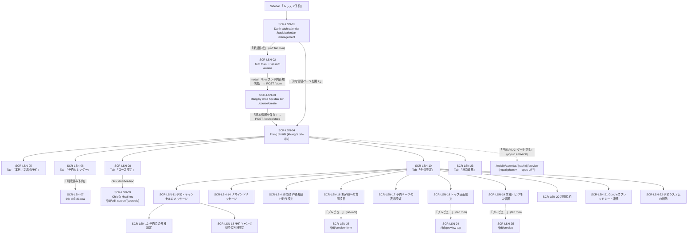

# FA-019 — Đặt lịch bài học (「レッスン予約」) — UI Spec (Portal Admin)

> Tạo bởi: ui-parser agent (code-first) | Nguồn: blade views + controller Laravel | Confidence tổng thể: **Trung bình–Cao**
> Phạm vi: **chỉ portal Admin/Staff**. Trang public cho LINE User (`resources/views/basic/calendar_management/bookings/**`, `Mobile\CalendarController`) nằm ngoài tài liệu này.

---

## 1. Tổng quan tính năng

「レッスン予約」 (Đặt lịch bài học) là một trong ba hệ thống đặt chỗ của LME. Đặc trưng của nó là **chỉ nhận đặt chỗ trong các khung giờ (受付枠 / reception slot) đã được đăng ký sẵn**.

Khẩu hiệu ngay trên màn hình tạo mới nêu rõ định vị (`create.blade.php:64`):
> 「決まった時間枠だけ予約を受付できます」 — Chỉ nhận đặt chỗ đúng những khung thời gian đã định.

Ngành nghề mục tiêu được liệt kê trên chính màn hình đó (`create.blade.php:90-105`): 「学習塾」,「料理教室」,「パソコン教室」,「オンラインレッスン」,「ヨガ・ピラティス教室」.
Ngành nghề **không** hỗ trợ (`create.blade.php:173-185`): 「時間貸し施設予約」,「物品レンタル予約」,「飲食店予約」,「宿泊予約」.

### Khác biệt so với 2 tính năng anh em

| | FA-019 「レッスン予約」 | FA-020 「サロン・面談予約」 | FA-021 「イベント予約」 |
|---|---|---|---|
| Cơ chế nhận đặt | Khung giờ cố định (受付枠) do Admin tạo trước, mỗi khung có định員 (sức chứa) | Nhận đặt bất kỳ lúc nào trong giờ mở cửa, theo ca làm việc (シフト) của nhân viên | Sự kiện có ngày giờ tổ chức cố định, nhận đăng ký tham dự |
| Khái niệm nhân viên (スタッフ) | **Không có** | Có (calendar loại 「スタッフ」 / 「個人」) | Không có |
| Đơn vị con | コース (khoá học) + 受付枠 (khung nhận đặt) | コース + スタッフ + シフト | イベント |
| Prefix URL | `/basic/calendar-management` | `/basic/manager-booking`, `/basic/calendar-salon` | `/basic/booking-event-day/list-event` |
| Bảng chính | `calendar_management`, `calendar_course`, `calendar_course_receptions`, `calendar_course_bookings` | `calendar_salon*` | `booking_event*` |

> Nguồn suy ra khác biệt: `create.blade.php:138-165` (nút chéo sang 2 tính năng còn lại), model `app/CalendarCourseBooking.php` vs `app/CalendarSalonLineBooking.php`.
> Confidence: **Cao** cho URL và bảng; **Trung bình** cho mô tả cơ chế FA-021.

### Chức năng chính (Admin)
- Quản lý nhiều lịch (calendar), số lượng tối đa phụ thuộc gói hợp đồng (`$numberCalendar` — `CalendarManagementController.php:101`)
- Tạo 「コース」 (khoá học): tên, ảnh, thời lượng, giá, mô tả, action riêng theo khoá
- Tạo 「受付枠」 (khung nhận đặt): theo ngày cụ thể hoặc lặp theo thứ trong tuần, có định員 (giới hạn số người)
- Theo dõi đặt chỗ theo 4 chế độ xem: ngày / tuần / tháng / danh sách
- Duyệt / từ chối request đặt & request huỷ (chế độ 全承認 hoặc リクエスト制)
- Thêm đặt chỗ thủ công cho khách (kể cả khách chưa là bạn LINE)
- Thanh toán online (Stripe / UnivaPay), hoàn tiền
- Tin nhắn tự động khi đặt / huỷ / nhắc lịch trước-sau buổi học, đăng ký nhận thông báo khi có chỗ trống (キャンセル待ち)
- Tuỳ biến form câu hỏi cho khách, trang top, điều khoản sử dụng
- Liên kết Google Spreadsheet, xuất/nhập CSV
- Xoá hệ thống đặt lịch (có xác thực bằng mã gửi email)

---

## 2. Nguồn dữ liệu & phương pháp

Session browser đã hết hạn tại thời điểm dựng spec ⇒ spec được dựng **code-first**, đọc trực tiếp blade + controller + JS front-end. **Không có screenshot**.

### File đã đọc

**Blade — trang chính**
| File | Dòng | Vai trò |
|---|---|---|
| `resources/views/basic/calendar_management/index.blade.php` | 248 | Danh sách calendar |
| `resources/views/basic/calendar_management/create.blade.php` | 262 | Trang giới thiệu + modal tạo mới |
| `resources/views/basic/calendar_management/course_create.blade.php` | 80 | Đăng ký khoá học đầu tiên |
| `resources/views/basic/calendar_management/detail.blade.php` | 265 | Khung trang chi tiết + tab bar |
| `resources/views/basic/calendar_management/header.blade.php` | 13 | Header tiêu đề trang |
| `resources/views/basic/calendar_management/breadcrumb.blade.php` | 17 | Breadcrumb 「カレンダー一覧 > {tên}」 |

**Blade — tabs** (5 nhóm): `tabs/booking/*`, `tabs/calendar.blade.php` + `tabs/calendar_tab/*`, `tabs/course/*`, `tabs/setting-calendar.blade.php` + `tabs/setting_calendar_tab/*`, `tabs/link_payment/*`.

**Blade — modals**: toàn bộ 24 file `modal/*.blade.php` + 8 file `tabs/booking/modal/*.blade.php`.

**Controller**
- `app/Http/Controllers/Basic/CalendarManagementController.php` (2598 dòng) — các method render view: `index:97`, `create:124`, `courseCreate:165`, `detailCalendar:197`, `editCourse:421`, `preview:1889`, `previewTop:1900`, `previewForm:1912`
- `app/Http/Controllers/Basic/SettingPaymentCalendarController.php` (213 dòng) — `initDataSettingPayment:16`, `saveSettingPayment:151`
- `app/Http/Middleware/CheckLessonCalendarBelongToBot.php`

**Model (để lấy hằng số trạng thái)**
- `app/CalendarCourseBooking.php:16-27` — hằng số `SB_*`, `SP_*`
- `app/CalendarCourseReception.php`, `app/CalendarCourse.php`

**JavaScript** (nguồn xác định endpoint của từng nút)
- `public/js/calendar_management/index.js` (13.9KB)
- `public/js/calendar_management/create_course.js` (4.7KB)
- `public/js/calendar_management/calendar_detail.js` (258KB — chỉ trích endpoint và hằng số)
- `public/js/calendar_management/edit_course.js` (37.8KB)
- `public/js/calendar_management/setting-payment.js` (7.3KB)

**Khác**: `raw/features/lesson-booking/routes-inventory.md`, `resources/views/layout/basic/sidebar.blade.php:423`

### Giới hạn phương pháp
- Toàn bộ nội dung động render bằng **Vue 2** (`v-for`, `@{{ }}`, `v-if`). Dữ liệu thật (số lượng calendar, tên khoá học, danh sách đặt chỗ) **không quan sát được** — chỉ biết tên biến.
- Text hiển thị điều kiện (`v-if`) được liệt kê **toàn bộ nhánh**, không rõ nhánh nào là mặc định thực tế.
- Một số validation nằm trong `vee-validate` / server-side ⇒ ghi ở mức **Thấp** nếu không thấy attribute HTML.

---

## 3. Actors & phân quyền

| Actor | Truy cập | Ghi chú |
|---|---|---|
| **Admin** (LINE OA) | Toàn bộ | Menu sidebar 「レッスン予約」 → `route('calendar.index')` (`sidebar.blade.php:423`) |
| **Staff** | Cùng giao diện Admin, giới hạn theo custom role | Không thấy check quyền riêng trong blade FA-019 ⇒ phân quyền do middleware `basic_access` ở tầng route group cha xử lý. Confidence: **Trung bình** |
| **LINE User** | Không truy cập portal | Chỉ vào LIFF `https://liff.line.me/{liffId}?calendar_id={id}` — chi tiết trong spec LIFF riêng |

### Middleware

| Middleware | Áp dụng | Hành vi |
|---|---|---|
| `basic_access` | Toàn bộ nhóm `/basic/*` | Xác thực đăng nhập Admin/Staff |
| `checkLessonCalendarInBot` | Nhóm route con từ `web.php:1541` trở đi (tất cả route có `{id}` calendar) | `CheckLessonCalendarBelongToBot.php` — nếu thiếu `id` **hoặc** calendar không thuộc `bot_id` hiện tại → `redirect()->route('calendar.index')` (redirect im lặng, **không** báo lỗi) |

> Chú ý: các route `GET /` (index), `GET /create`, `POST /store`, `POST /{id}/edit`, `POST /sort`, `GET /course/create`, `POST /course/store` và toàn bộ nhóm `/api/course/*` **nằm ngoài** middleware này (`routes-inventory.md:10-56`). `courseCreate()` tự kiểm tra `$calendar->bot_id != getBotId()` thủ công (`CalendarManagementController.php:167-170`).

---

## 4. Sơ đồ điều hướng màn hình



---

## 5. Chi tiết từng màn hình

### SCR-LSN-01 — Danh sách lịch (「レッスン予約（一覧）」)

| | |
|---|---|
| **Route** | `GET /basic/calendar-management` → `calendar.index` → `CalendarManagementController@index` |
| **Blade** | `resources/views/basic/calendar_management/index.blade.php` |
| **Title** | `@section('title', 'レッスン予約（一覧）')` — `index.blade.php:24` |
| **Biến từ controller** | `$liffId` (LIFF app id của bot — ưu tiên `liff_app_id_booking`), `$numberCalendar` (hạn mức theo gói) — `CalendarManagementController.php:99-103` |
| **API nạp danh sách** | `GET /basic/calendar-management/get-list-calendar` (`index.js:86`) → trả `calendar[]`, `canCreate`, `enableTooltipCalendar`, `messageErrorMax` |

**Layout**: header tiêu đề (`@include header`) → thanh công cụ → banner hướng dẫn (tuỳ điều kiện) → lưới thẻ 3 cột (`grid-cols-3`, màn 2xl là 4 cột).

#### Action buttons

| Label JP | Loại | Vị trí | Hành vi | Nguồn |
|---|---|---|---|---|
| 「新規作成」 | Nút xanh dương + icon `+` | Toolbar trái | `checkCanCreateCalendar()` → nếu `canCreate` thì `window.open('/basic/calendar-management/create', '__blank')`; nếu không → cảnh báo hạn mức | `index.blade.php:31-36`, `index.js:323-329` |
| 「並び替え」 | Nút viền xám + icon mũi tên | Toolbar phải | Mở modal `#sortModal`. **Disabled** (`opacity-60`) khi `calendarList.length == 0` | `index.blade.php:42-50` |
| 「予約管理ページを開く」 | Nút xanh lá, full width | Trong mỗi thẻ | `redirectUrl(id)` → xoá `localStorage.tab` rồi `location.href = '/basic/calendar-management/' + id` | `index.blade.php:112-116`, `index.js:357-360` |
| Icon Google Spreadsheet | Icon 32×30 | Góc phải trên thẻ, chỉ khi `calendar.using_google` | Mở `https://docs.google.com/spreadsheets/d/{google_sheet_id}` ở tab mới | `index.blade.php:83-88` |
| Icon copy (×2) | Icon | Cạnh 2 ô URL | `copyTextToClipboard('current'\|'history', id)` — copy giá trị input tương ứng | `index.blade.php:124-126, 136-138`, `index.js:226-232` |
| Nút `×` banner | Icon | Banner hướng dẫn | `disableTooltip()` → `POST /basic/calendar-management/disable-tooltip` (tắt vĩnh viễn tooltip cho user) | `index.blade.php:55-59`, `index.js:338` |

#### Thẻ calendar — thành phần

| Thành phần | Chi tiết | Biến |
|---|---|---|
| Toggle 「有効」/「無効」 | Checkbox kiểu switch. `@change="enableUseCalendar(id)"` → mở modal đổi tên?? — thực tế `enableUseCalendar` set `currentCalendar` rồi gọi API edit | `calendar.enable_use_calendar` |
| Nền thẻ | `bg-[#FFFFFF]` khi bật, `bg-[#F8F8F8]` khi tắt | `calendar.enable_use_calendar` |
| Tên quản lý | Thanh xám, click → mở modal `#edit-management-name` | `calendar.calendar_name` |
| Ảnh top | 150px; nếu trống hiện placeholder `/images/picture.png` | `calendar.image_calendar_top` (ghép với `env('URL_SERVER_MEDIA')`) |
| 「予約ページURL」 | Input readonly hiển thị `https://liff.line.me/{$liffId}?calendar_id={id}&ts={timestamp}` | `index.blade.php:119-122` |
| 「予約履歴ページURL」 | `https://liff.line.me/{$liffId}?calendar_id={id}&tab=history&ts={timestamp}` | `index.blade.php:131-134` |

#### Thông tin phụ

| Hiển thị | Điều kiện |
|---|---|
| 「登録カレンダー数：{n} / {$numberCalendar}」 | Luôn hiện — `index.blade.php:39` |
| Banner xanh 「新規作成をクリックして、はじめのレッスン予約を作成しましょう。」 | `enableTooltipCalendar && is_finished_loading` — `index.blade.php:52-54` |
| 「まだ登録されたカレンダー予約がありません。」 | `calendarList.length == 0` — `index.blade.php:63` |

#### Modal 「カレンダー管理名 変更」 (`#edit-management-name`, `index.blade.php:145-184`)

| Field | Type | v-model | Bắt buộc | Ghi chú |
|---|---|---|---|---|
| Tên quản lý | `text` | `currentCalendar.calendar_name` | Có (suy đoán) | Đếm ký tự hiển thị `{n}/10` ⇒ giới hạn **10 ký tự**. Không có attribute `maxlength` ⇒ chặn ở JS/server. Confidence: **Trung bình** |

Nhãn phụ: 「エルメ上での管理名（入力内容はお客様に表示されません）」
Nút: 「保存」 → `saveEditCalendar(id)` → `POST /basic/calendar-management/{id}/edit` (`index.js:169`) · 「戻る」 đóng modal.

#### Modal 「並べ替え」 (`#sortModal`, `index.blade.php:186-246`)

- Danh sách kéo-thả bằng `vuedraggable` (`<draggable v-model="calendarListSort">`)
- Mỗi dòng có dropdown `…` với 2 lệnh: 「一番上に移動」 (disabled khi `index == 0`), 「一番下に移動」 (disabled khi ở cuối)
- Nút 「変更を保存」 → `saveSort()` → `POST /basic/calendar-management/sort` (`index.js:301`)

**Ghi chú quan sát**: trang này dùng Vue 2 + Tailwind CDN (`/js/tailwindcss.js`) + toastify-js cho thông báo. Toàn bộ danh sách render động ⇒ không có dữ liệu mẫu trong blade.

---

### SCR-LSN-02 — Trang giới thiệu & tạo lịch mới (「レッスン予約（新規作成）」)

| | |
|---|---|
| **Route** | `GET /basic/calendar-management/create` → `CalendarManagementController@create` |
| **Blade** | `create.blade.php` (title dòng 55) |
| **Biến** | Không có — view tĩnh 100% |

**Layout**: card trắng bo góc 700px giữa màn hình, trên nền xám. Ảnh banner `/images/top-example.png` → phần mô tả → phần điều hướng chéo → phần cảnh báo → 2 nút CTA.

#### Nội dung tĩnh

| Vùng | Nội dung JP | Dòng |
|---|---|---|
| Tiêu đề | 「レッスン予約の新規作成」 | 62 |
| Phụ đề | 「決まった時間枠だけ予約を受付できます」 + icon `?` (hover mở tooltip) | 64-66 |
| Tooltip `#explain-question` | 「例) 設定された時間枠だけ予約受付」 / 「10:00~11:00 ヨガ教室」 / 「15:30-16:30 ピラティス教室」 | 71-79 |
| Khối 「この様なビジネスに対応しています」 | 5 chip: 学習塾 / 料理教室 / パソコン教室 / オンラインレッスン / ヨガ・ピラティス教室 | 87-105 |
| Card chéo 1 | 「サロン・面談予約はこちら」 → `/basic/manager-booking` (tab mới). Chip: 美容室 / 整体 / オンライン面談. Mô tả 「営業時間中ならいつでも予約を受付」 | 121-145 |
| Card chéo 2 | 「イベント予約はこちら」 → `/basic/booking-event-day/list-event` (tab mới). Chip: 各種イベント開催 / セミナー申込み. Mô tả 「開催日時が決まっている参加予約を受付」 | 146-166 |
| Cảnh báo | 「以下のビジネスには対応できない場合があります」 + 4 chip xám: 時間貸し施設予約 / 物品レンタル予約 / 飲食店予約 / 宿泊予約 | 169-188 |

#### Action buttons

| Label JP | Vị trí | Hành vi |
|---|---|---|
| 「新規作成にすすむ ▶」 | Nút xanh lá 386×50, giữa trang | `showCreateCalendarModal = true` (`create.blade.php:108-112`) |
| 「レッスン予約の新規作成にすすむ ▶」 | Nút viền xanh lá 350×40, cuối trang | Cùng hành vi (`create.blade.php:190-194`) |
| 「戻る」 | Nút viền xám 100×40 | `goBack()` (`create.blade.php:197-201`) |

#### Modal 「レッスン予約新規作成」 (`#create-calendar`, `create.blade.php:205-260`)

Phụ đề: 「入力内容は、後から変更が可能です」

| Label JP | Type | v-model | Bắt buộc | Placeholder | Giới hạn | Dòng |
|---|---|---|---|---|---|---|
| 「店舗名を入力してください（**入力内容がお客様に表示されます**）」 | `text` | `formCreateCalendar.line_name` | Có (suy đoán) | 「パーソナルトレーニング エルメ 渋谷店」 | Counter `{n}/30` ⇒ **30 ký tự** | 223-231 |
| 「エルメ上での管理名を入力してください（**入力内容はお客様に表示されません**)」 | `text` | `formCreateCalendar.calendar_name` | Có (suy đoán) | 「渋谷店」 | Counter `{n}/10` ⇒ **10 ký tự** | 234-243 |

Nút: 「レッスン予約を新規作成」 → `createNewCalendar()` → `POST /basic/calendar-management/store` (`index.js:129`) · 「戻る」 đóng modal.

**Ghi chú**: `storeCalendar()` đếm lại hạn mức sau khi tạo và **xoá lịch vừa tạo nếu vượt gói**, trả về chuỗi 「現在のプランは利用できない機能です。アップグレードが必要になります。」 hoặc 「上限に達したので、新しく追加できません。」 (`CalendarManagementController.php:129-140`, comment `[#39230]`).

---

### SCR-LSN-03 — Đăng ký khoá học đầu tiên

| | |
|---|---|
| **Route** | `GET /basic/calendar-management/course/create?calendarId={id}` → `CalendarManagementController@courseCreate` |
| **Blade** | `course_create.blade.php` |
| **Title** | `@section('title', $calendar->calendar_name)` — dòng 20 (tên calendar, không phải tiêu đề cố định) |
| **Biến** | `$calendar` (object `CalendarManagement`) |
| **Guard** | Nếu calendar rỗng hoặc `bot_id != getBotId()` → redirect `calendar.index` (`CalendarManagementController.php:167-170`) |

**Layout**: header + form một cột dọc.

Text hướng dẫn (dòng 25-27):
- 「提供しているコース情報を1つ登録しましょう」
- 「※登録内容は、後から変更が可能です」
- 「※コースが2つ以上の場合、基本情報の登録完了後に追加で登録が可能です。」

#### Form fields

| Label JP | Type | v-model | Bắt buộc | Placeholder / Default | Dòng |
|---|---|---|---|---|---|
| 「コース名」 | `text` (w 450px) | `formCreateCourse.course_name` | **Có** — đánh dấu `＊` đỏ | 「例) 初心者向けトレーニング」 | 29-33 |
| 「所要時間」 → giờ | `select` (w 80px) | `formCreateCourse.hour_done` | **Có** — `＊` đỏ | options từ mảng `hours` | 38-43 |
| 「所要時間」 → phút | `select` (w 80px) | `formCreateCourse.minute_done` | **Có** | options từ mảng `minutes` | 44-49 |
| 「イメージ」 | `file` (`accept="image/*"`, id `inputFile`, `hidden`) | `formCreateCourse.course_image` | Không | Placeholder `/images/Group3022.png`. Chú thích 「推奨 1,000 × 500（px）」 | 52-59 |
| 「サービス利用料」 | `text` căn phải (w 150px) | `formCreateCourse.amount` | Không | `value="0"`, hậu tố 「円」 | 68-72 |

Link ảnh: 「アップロード」 / 「変更」 / 「削除」 — hiển thị theo cờ `buttonUpload.isShowBtnUpload / isShowBtnEdit / isShowBtnDelete` (dòng 60-66). 「アップロード」/「変更」 gọi `showModalUpload()` (modal chọn ảnh dùng chung của hệ thống — **render động, không nằm trong blade này**).

#### Action buttons

| Label JP | Hành vi |
|---|---|
| 「基本情報を保存」 | `createCourse()` → `POST /basic/calendar-management/course/store` (`create_course.js:62`) → chuyển sang trang chi tiết calendar |

---

### SCR-LSN-04 — Trang chi tiết lịch — khung & tab bar (「レッスン予約（カレンダー詳細）」)

| | |
|---|---|
| **Route** | `GET /basic/calendar-management/{id}` → `calendar.detail` → `CalendarManagementController@detailCalendar` (middleware `checkLessonCalendarInBot`) |
| **Blade** | `detail.blade.php` |
| **Title** | 「レッスン予約（カレンダー詳細）」 — dòng 2 |

**Biến từ controller** (`CalendarManagementController.php:230-245`):
`google_sheet_auth_url`, `google_sheet_auth_url_reconnect`, `richMenus`, `scenario`, `conversion`, `statusObject`, `calendarName`, `storeName`, `usePayment`, `hashCalendarId` (Hashids), `totalUser`, `google_sheet_status`, `is_google_sheet_error`.

**Layout**
1. Breadcrumb 「カレンダー一覧 > {$calendarName}」 (`breadcrumb.blade.php`)
2. Header: `<h3>{$storeName}</h3>` + 2 nút bên phải
3. Tab bar 5 tab + badge môi trường thanh toán
4. Vùng `tab-content` với 5 `tab-pane`

#### Action buttons (header)

| Label JP | Hành vi | Dòng |
|---|---|---|
| 「予約カレンダーを見る」 (icon lịch) | `openPreviewBooking('{$hashCalendarId}')` → `window.open('/mobile/calendar/{hashId}/preview', ..., "left=700,top=100,width=420,height=600")` — popup mô phỏng màn hình điện thoại | 104-107, `calendar_detail.js:2584-2587` |
| 「一覧ページに戻る」 | `location.href = '/basic/calendar-management'` | 108-111 |

#### Tab bar (5 tab)

| # | Label JP | id tab | `href` pane | Handler | Màn hình |
|---|---|---|---|---|---|
| 1 | 「本日／新着の予約」 | `booking-today-tab` | `#booking-today-tab-content` | `changeTabDetailCourse('booking-today-tab')` | SCR-LSN-05 |
| 2 | 「予約カレンダー」 | `calendar-tab` | `#calendar-tab-content` | `changeTabDetailCourse('calendar-tab')` | SCR-LSN-06 |
| 3 | 「コース設定」 | `calendar-course-tab` | `#calendar-course-tab-content` | `changeTabDetailCourse('calendar-course-tab')` | SCR-LSN-08 |
| 4 | 「全体設定」 | `setting-calendar-tab` | `#setting-calendar-tab-content` | `changeTabDetailCourse('setting-calendar-tab')` | SCR-LSN-10 |
| 5 | 「決済連携」 | `setting-payment-tab` | `#setting-payment-tab-content` | `changeTabDetailCourse('setting-payment-tab')` | SCR-LSN-23 |

> Nguồn: `detail.blade.php:114-161`. Tab đang chọn được ghi nhớ qua `localStorage.tab` (`index.js:358` xoá key này; `setting-payment.blade.php:47` set key này khi mở tab mới).

#### Badge môi trường thanh toán (`detail.blade.php:151-159`)

| Hiển thị | Điều kiện | Màu |
|---|---|---|
| 「テスト環境」 | `is_use_payment && setting_payment.environment == 0` | chữ `#222222`, nền `#F8F8F8` |
| 「本番環境」 | `is_use_payment && setting_payment.environment == 1` | chữ `#08BF5A`, nền `#F4FBF2` |
| 「利用なし」 | `!is_use_payment` | chữ `#888888`, nền `#F8F8F8` |

#### Modal cấp trang

| Modal | Nội dung | Nguồn |
|---|---|---|
| `#modalAlertGoogleSheetError` | 「Googleスプレッドシートの連携が解除されました」 + 「連携が解除された状態では、正常にデータ連携が行われません。」. Nút 「再連携する」 (link `$google_sheet_auth_url_reconnect`), link 「再連携せずにこの画面を閉じる」. **Tự mở** khi `is_google_sheet_error` truthy | `detail.blade.php:186-217, 259-264` |
| `layout.modal_setting.modal_select_action` | Modal chọn/soạn エルメアクション — **shared component** | `detail.blade.php:184` |
| `layout.modal_filter_v2` | Modal 絞り込み V2 — **shared component** | `detail.blade.php:185` |
| `modal.create_course` | Modal tạo khoá học (dùng chung cho tab コース設定) | `detail.blade.php:182` |

#### Ghi chú kỹ thuật
- Nạp TinyMCE (`/tinymce/js/tinymce/tinymce.min.js` + `langs/ja.js`), bootstrap-datepicker (locale ja), daterangepicker, bootstrap-timepicker, vuedraggable, vee-validate (+ `vee-validate_ja`).
- Nếu `session('message')` tồn tại → `alert()` sau 200ms (`detail.blade.php:221-225`).
- Biến JS toàn cục truyền từ PHP: `basic_home_new` (danh sách 対応ステータス từ `$statusObject`), `getScenario`, `conversion`, `google_sheet_status`, `is_google_sheet_error`, `totalUser`.

---

### SCR-LSN-05 — Tab 「本日／新着の予約」

| | |
|---|---|
| **Blade** | `tabs/booking/booking_list.blade.php` (463 dòng) |
| **API** | `GET /basic/calendar-management/{calendarId}/get-list-booking?page={n}` (`calendar_detail.js:1384`) → `CalendarManagementController@getListBooking:1877` |

**Layout**: dòng ngày hiện tại + 2 sub-tab → chọn số dòng/trang + phân trang mini → bảng → phân trang dưới.

#### Header
- Ngày hiện tại: `{YYYY}年{M}月{D}日({thứ})` (`booking_list.blade.php:60-64`)
- Sub-tab (`ul.booking_list`):

| Sub-tab | Label JP | Icon | Handler | `href` |
|---|---|---|---|---|
| 1 | 「新着の予約」 | `fa-sparkles` | `changeTabBookingList('tab1')` | `#booking-tab-1` |
| 2 | 「本日の予約」 | (icon) | `changeTabBookingList('tab2')` | `#booking-tab-2` |

#### Toolbar
| Thành phần | Chi tiết |
|---|---|
| 「表示件数：」 + `select` | `v-model="booking_lists.pagination.perPage"`, `@change="changePerPageBookingList"`. Options từ mảng `optionsPage`, hiển thị 「{n}件」 |
| Chỉ số trang | 「{from} - {to} / {totalPage}行」; khi rỗng 「0 - 0 / 0行」 |
| Mũi tên ‹ › | `changePageBookingList(currentPage ± 1)` |

#### Bảng — sub-tab 1 「新着の予約」 (`booking_list.blade.php:124-135`)

| Cột JP | Dữ liệu | Kiểu | Sort/Filter |
|---|---|---|---|
| 「操作が行われた日時」 | `item.userUpdateTime` | datetime | Không |
| 「来店予定日時」 | `item.received_booking_date`(`item.dayOfWeek`) `item.start_time`~`getEndTimeFormated(item.end_time)` | date + time range | Không |
| 「ステータス」 | badge theo `item.booking_status` | enum | Không |
| 「お名前」 | avatar `item.line_avatar` (fallback `/images/blank_avatar.png`) + `item.lineBookingName` | string | Không |
| 「コース」 | `item.course_name` | string | Không |
| 「決済金額」 | 「¥ {item.payment_amount}」 + nhãn trạng thái | money + enum | Không |
| (cột cuối) | Nút 「詳細」 → `showDetailTodayBooking(item)` | action | — |

Trạng thái rỗng: 「7日間以内の新着予約はありません」 (colspan 8).

#### Bảng — sub-tab 2 「本日の予約」 (`booking_list.blade.php:279-284`)

Giống trên nhưng **bỏ cột 「操作が行われた日時」**, cột đầu là 「開催時間」 (`item.start_time`~`end_time`).
Trạng thái rỗng: 「本日の予約はありません」 (colspan 7).

#### Badge trạng thái đặt chỗ (dùng lại ở hầu hết màn hình)

| Hiển thị JP | Điều kiện (`booking_status`) | Hằng số |
|---|---|---|
| 「リクエスト」 | `== 0` hoặc `== 5` | `SB_REQUEST_BOOKING`, `SB_REQUEST_BOOKING_CANCEL` |
| 「予約確定」 | `== 1` | `SB_BOOKING_APPROVE` |
| 「予約確定」 + chú thích 「手動で追加された予約です」 (nếu có `lineUserId`) / 「エルメ上に表示されていない友だちです」 (nếu không) | `== 2` | `SB_BOOKING_ADMIN_BOOK` |
| 「通知希望」 | `== 3` | `SB_REQUEST_BOOKING_WAIT_CANCEL` |
| 「キャンセル」 | `== 4` hoặc `== 7` | `SB_BOOKING_CANCEL`, `SB_BOOKING_ADMIN_CANCEL` |
| 「否認済」 | `== 6` | `SB_BOOKING_DENY` |

> Nguồn: `booking_list.blade.php:149-200`; hằng số `calendar_detail.js:10-17` và `app/CalendarCourseBooking.php:16-23`.

#### Badge trạng thái thanh toán (`booking_list.blade.php:225-256`)

| `environment` | `payment_status` | Hiển thị |
|---|---|---|
| `1` (本番) | 0 / 1 / 2 / 3 | `item.payment_status_text` (server sinh — tương ứng 未決済 / 決済成功 / 決済なし / 返金済み) |
| `0` (テスト) | `!= 2` | 「テスト決済」 |
| `0` | `== 2` | 「決済なし」 |

#### Modal liên quan (`booking_list.blade.php:456-463`)
`tabs/booking/modal/detail_today_booking.blade.php`, `cancel_booking_approve`, `delete_booking_cancel`, `history_booking_status`, `detail_booking_deleted`, `history_deleted_booking_status`, `history_booking_status_custom`, `refund_booking`.

---

### SCR-LSN-06 — Tab 「予約カレンダー」

| | |
|---|---|
| **Blade** | `tabs/calendar.blade.php` (176 dòng) + 4 file con trong `tabs/calendar_tab/` |
| **API danh sách** | `GET /basic/calendar-management/{id}/booking-list?...` (`calendar_detail.js:2747`) và `GET /basic/calendar-management/{id}/reception/list?...` (`calendar_detail.js:2789`) |

#### Toolbar trái

| Thành phần | Chi tiết | Dòng |
|---|---|---|
| Nút 「今日」 | `changeDisplayMode(selectModeDisplay)` — nhảy về hôm nay | 5-9 |
| Điều hướng ‹ / › | `previousCalendar()` / `nextCalendar()` | 13-16, 44-47 |
| Ô chọn ngày | Hiển thị `{M}月{D}日({thứ})`, phủ `<input type="date" id="datepicker" required>` trong suốt. Chỉ hiện ở mode `day` / `week` | 17-30 |
| Ô chọn tháng | Hiển thị `{YYYY}年{M}月`, phủ `<input type="month">`. Chỉ hiện ở mode `month` | 31-43 |
| Ô ngày kết thúc tuần | Chỉ ở mode `week` — hiển thị `lastTimeCalendar` (đọc-only, nền xám) | 48-59 |
| Ô khoảng ngày | `<input type="text" id="timeCustom" readonly>` + icon lịch — daterangepicker. Chỉ ở mode `custom` | 61-69 |
| Bộ chọn chế độ | `ul` 4 mục: 「日」/「週」/「月」/「一覧」 → `changeDisplayMode('day'\|'week'\|'month'\|'custom')` | 70-95 |
| Nút 「受付枠追加」 | `showAddNewReception()` → mở modal `add_new_reception` | 96-112 |
| Link 「受付枠の一括確認・削除」 | `redirectToListCustom()` → chuyển sang mode `custom`, view 受付枠一覧 | 102, 110-111 |

#### Toolbar phải

| Label JP | Điều kiện | Hành vi |
|---|---|---|
| 「絞り込み」 (icon phễu) | Chỉ ở mode `custom` | `showFilterBooking()` → modal `filter_booking`. Khi `isFiltering` → thêm class `filtering` + nút tròn `×` để `clearFilter()` |
| 「削除済み予約」 | Luôn | `handelShowDeletedBooking()` → chuyển sang SCR-LSN-07 |
| 「CSV管理」 | Luôn | `showHandleCsv()` → modal `handle_csv` |

#### Chế độ hiển thị 「日」 (`calendar_tab/calendar_display_day.blade.php`, 312 dòng)

- Lưới ngang: cột đầu 「コース」, các cột còn lại là mốc giờ (`calendarTimes`)
- Mỗi ô là một 受付枠 hiển thị `{startTime}-{endTime}` + các chỉ số:

| Nhãn | Nguồn số | Ý nghĩa |
|---|---|---|
| 「予約なし」 | tất cả `total*` = 0 | Không có đặt chỗ |
| 「満」 | `reception.remain <= 0 && typeLimitBooking` | Đã đầy |
| 「予約確定」 | `reception.totalApprove` | Số đã xác nhận |
| 「リクエスト」 | `totalRequest` + `totalRequestCancel` | Số chờ duyệt |
| 「キャンセル」 | `totalCancel` | Số đã huỷ |
| 「通知希望」 | `totalRequestBookingWaitCancel` | Số đăng ký chờ chỗ trống |

- Link 「詳細を見る」 → `showDetailReception(reception.id, courseData)` → modal `detail_reception`
- Khi khoá học chưa có khung nào: 「受付枠が登録されていないため、予約を受け付けることができません。」 + link 「受付枠追加」 (`showAddNewReception(courseData.id)`) 「から受付可能な日時を登録してください。」 (dòng 302-305)

#### Chế độ hiển thị 「週」 (`calendar_display_week.blade.php`, 106 dòng)

- Bảng: cột đầu là giờ, 7 cột 「{ngày}(月)」…「{ngày}(日)」
- Mỗi ô tổng hợp 4 chỉ số như trên; link 「詳細を見る」 → `showBookingListWeek(index, time, dayList.courseList, 'bookingList')` → modal `booking_list_week`
- Ô không có đặt chỗ vẫn click được; hiện tối đa 2 tên khoá học, còn lại hiện 「その他」

#### Chế độ hiển thị 「月」 (`calendar_display_month.blade.php`, 109 dòng)

- Bảng 7 cột 「月曜日」…「日曜日」
- Mỗi ô ngày tổng hợp 4 chỉ số; link 「詳細を見る」 → `showBookingListMonth(dayInWeek, courseList)` → modal `booking_list_month`
- Hiện tối đa 2 khoá học, còn lại 「他 {n} 件」

#### Chế độ hiển thị 「一覧」 (`calendar_display_custom.blade.php`, 309 dòng)

Có 2 view con chuyển bằng `changeShowListCustom('booking'|'reception')`:

**View 「予約一覧」** (`showBookingListDataCustom == true`)

| Cột JP | Dữ liệu | Kiểu | Sort/Filter |
|---|---|---|---|
| checkbox | `booking.id` → `selectedItems` | bool | chọn tất cả ở header |
| 「コース」 | tên khoá học | string | lọc qua modal |
| 「日時」 | ngày + giờ | datetime | lọc qua modal |
| 「ステータス」 | badge `booking.status` | enum | lọc qua modal |
| 「お名前」 | avatar + tên | string | ô search 「友だち名・システム表示名」 |
| 「決済金額」 | 「¥ {paymentAmount}」 + nhãn | money | lọc qua modal |
| — | Nút 「詳細」 → `showDetailBookingCustom(booking)` | action | — |

Nhãn thanh toán ở view này ghi rõ chữ (dòng 157-164): `paymentStatus` 0→「未決済」, 1→「決済成功」, 2→「決済なし」, 3→「返金済み」; nếu `environment != 1` → 「テスト決済」 / 「決済なし」.

**View 「受付枠一覧」** (`showBookingListDataCustom == false`)

| Cột JP | Dữ liệu | Sort |
|---|---|---|
| checkbox | `reception.id` → `selectedReception` | chọn tất cả |
| 「日時」 | ngày giờ khung | **Có** — `@click="sortReception"` (dòng 188-190) |
| 「コース」 | tên khoá học | — |
| 「コース料金」 | 「¥{reception.amount}」 | — |
| 「予約確定/残数」 | số đã xác nhận / còn lại | — |
| 「リクエスト」 | số chờ duyệt | — |
| 「通知受取希望」 | số đăng ký chờ chỗ | — |
| — | Nút 「詳細」 → `showDetailReception(reception.id, reception.course)` | — |

**Ô tìm kiếm** (dòng 5-18): 1 input `v-model="lineName"` placeholder 「友だち名・システム表示名」 ở view booking; 1 input placeholder 「コース名」 ở view reception. ⚠ Cả hai đều bind `v-model="lineName"` — có vẻ là **bug/nhầm biến** trong blade.

**Phân trang**: 「表示件数：」 select 50件 / 100件 (`v-model="limit"`), 「{from} - {to} / {totalBooking}行」, `previousPage()` / `nextPage()` / `changePage(number)`.

**Thanh thao tác hàng loạt (footer cố định)**

| View | Nội dung | Dòng |
|---|---|---|
| 予約一覧 | 「リクエスト一括操作（チェックを入れた友だち全員に適用されます）」 + nút 「アクションを選択する >」 → `showActionBooking()`. Bên phải: 「表示期間：{from} 〜 {to}」, 「予約数 {n} 件」, 「キャンセル数 {n} 件」 | 250-289 |
| 受付枠一覧 | 「受付枠一括操作」 + nút 「選択した受付枠を一括削除」 → `deleteReceptionList()` | 300-306 |

#### Modal liên quan (`tabs/calendar.blade.php:160-176`)
`detail_reception`, `add_new_reception`, `booking_list_week`, `filter_booking`, `action_multiple_booking`, `add_new_booking`, `cancel_booking_approve`, `delete_booking_cancel`, `refund_booking`, `history_booking_status`, `detail_booking_deleted`, `handle_csv`, `detail_booking`, `detail_booking_week`, `history_deleted_booking_status`, `history_booking_status_custom`, `booking_list_month`.

---

### SCR-LSN-07 — Màn 「削除済み予約」 (view trong tab 予約カレンダー)

| | |
|---|---|
| **Blade** | `tabs/calendar_tab/deleted-booking.blade.php` (72 dòng) |
| **API** | `GET /basic/calendar-management/{id}/booking/deleted?sortStatus={n}` (`calendar_detail.js:4471`) |
| **Vào màn** | Nút 「削除済み予約」 ở toolbar tab 予約カレンダー (`showDeletedBooking = true`) |

**Layout**: breadcrumb nội bộ 「予約カレンダー > 削除済み予約」 (link đầu `showDeletedBooking = false`) → tiêu đề → 2 dòng cảnh báo → bảng.

Cảnh báo (dòng 23-25):
- 「このページでは「削除した予約内容の確認」「返金」を行うことができます。予約を元の状態に戻すことはできません。」
- 「このページの内容は手動では削除することができず、削除された日時から90日後に自動で削除されます。」

#### Bảng

| Cột JP | Dữ liệu | Sort |
|---|---|---|
| 「削除した日時」 | `booking.deletedAt` | **Có** — `@click="sortStatusDeletedBooking"` (dòng 29-32) |
| 「お名前」 | avatar + tên (nhánh khác khi không có `line_user_id`) | Không |
| 「予約していたコース」 | `booking.courseName` | Không |
| 「予約していた日時」 | `booking.receivedBookingDate` `{startTime}~{endTime}` | Không |
| — | Nút 「詳細」 → `showDetailBookingDeleted(booking)` → modal `detail_booking_deleted` | — |

---

### SCR-LSN-08 — Tab 「コース設定」

| | |
|---|---|
| **Blade** | `tabs/course/course_list.blade.php` (302 dòng) |
| **API** | `GET /basic/calendar-management/api/{calendarId}/get-list-courses?page={n}` (`calendar_detail.js:1619`) |

Mô tả đầu trang: 「このページではコースの料金や基本所要時間、コースごとのアクションの設定ができます。」 (dòng 113)

#### Action buttons

| Label JP | Hành vi |
|---|---|
| 「コース作成」 (icon `+`) | `openModalCreateCourse()` → modal `modal/create_course.blade.php` |

#### Bảng khoá học (dòng 121-171)

| Cột JP | Dữ liệu | Kiểu | Ghi chú |
|---|---|---|---|
| (cột kéo-thả) | handle | — | Sắp xếp bằng SortableJS (`placeholder: 'custom-placeholder'`, dòng 219) → `POST /basic/calendar-management/api/course/sortable` |
| 「予約ページ表示」 | `<input type="checkbox" value="1" v-model="item.booking_page_display">` → `updateBookingPageDisplayCalendarCourse(item.id, ...)` | bool (0/1) | Hằng số `BOOKING_DISPLAY_ON = 1` / `OFF = 0` (`app/CalendarCourse.php:14-15`) |
| 「イメージ」 | ảnh khoá học | image | — |
| 「コース名」 | link `redirectPage(item.calendar_id, item.id)` → `/basic/calendar-management/{calendarId}/edit-course/{courseId}` | string | `calendar_detail.js:1608-1611` |
| 「料金」 | 「¥{item.amount}」, nếu 0 → 「設定なし」 | money | — |
| 「基本所要時間」 | 「{item.hour_done}時間{item.minute_done}分」 | duration | — |

Trạng thái rỗng: 「データが見つかりません」 (colspan 7).
Phân trang đã bị **comment out** trong blade (dòng 183-202) ⇒ hiện tại tải toàn bộ (`listsCourse($calendarId, $perpage = 100000)` — `CalendarManagementController.php:1491`).

#### Modal 「コース新規作成」 (`modal/create_course.blade.php`)

Phụ đề 「入力内容は、後から変更が可能です」

| Label JP | Type | v-model | Placeholder |
|---|---|---|---|
| 「コース名を入力してください」 | `text` | `formCreateCourse.course_line_name` | 「例）初心者向けコース」 |

Nút 「コースを作成する」 → `createCalendarCourse()` → `POST /basic/calendar-management/api/{calendarId}/course/create` (`calendar_detail.js:1677`).

---

### SCR-LSN-09 — Chi tiết khoá học (「レッスン予約（コース詳細）」)

| | |
|---|---|
| **Route** | `GET /basic/calendar-management/{id}/edit-course/{courseId}` → `calendar.edit.course` → `CalendarManagementController@editCourse` |
| **Blade** | `tabs/course/edit_course.blade.php` (633 dòng) — **là một trang đầy đủ**, không phải partial (có `@section('title', 'レッスン予約（コース詳細）')` dòng 2) |
| **Biến** | `statusObject`, `conversion`, `scenario`, `richMenus`, `courseId`, `calendarId`, `botId`, `botPlanType`, `totalUser` (`CalendarManagementController.php:437-447`) |
| **API nạp** | `GET /api/course/{courseId}/edit` (`edit_course.js:386`), `GET /api/course/{courseId}/get-message-notify` (:231), `GET /api/course/{courseId}/init-data-action` (:604), `GET /api/course/{courseId}/init-data-filter` (:317) |

**Layout**: `<h3>コース詳細</h3>` → 2 tab dọc bên trái → nội dung → footer 3 nút.

#### Tab con

| # | Label JP | `tabCourse` | Handler |
|---|---|---|---|
| 1 | 「基本情報」 | `1` | `tabCourse = 1` (dòng 177-178) |
| 2 | 「予約完了・リクエスト承認時アクション」 | `2` | `loadDataAction()` (dòng 182-186) |

#### Tab 1 — 「基本情報」

| Label JP | Type | v-model | Bắt buộc | Placeholder / Ghi chú | Dòng |
|---|---|---|---|---|---|
| (ảnh) | `file` `accept="image/*"` id `inputFile` | — | Không | 「アップロード」/「変更」/「削除」. Chú thích 「推奨 1,000 × 500（px）」 | 198-216 |
| 「コース名（お客様に表示されます）」 | `text` (id `myField`) | `formEditCourse.courseName` | **Có** (`＊`) | placeholder 「フォルダ名を入力」 ⚠ **placeholder sai ngữ cảnh** (copy từ màn folder) | 220-228 |
| 「システム管理名（お客様には表示されません）」 | `text` | `formEditCourse.systemName` | **Có** (`＊`) | 「システム管理名を入力」 | 236-247 |
| 「所要時間」 giờ | `select` | `formEditCourse.hourDone` | **Có** (`＊`) | hậu tố 「時間」 | 253-262 |
| 「所要時間」 phút | `select` | `formEditCourse.minuteDone` | **Có** | hậu tố 「分」 | 263-270 |
| 「コース料金」 | `text` (w 120px) | `formEditCourse.amount` | Không | 「5,000」, hậu tố 「円（税込）」 | 272-276 |
| 「コース説明」 | `textarea` | `formEditCourse.description` | Không | — | 281-286 |

Cảnh báo gói cước (dòng 278): 「決済機能の利用は、有料プランに **アップグレード** する必要があります」 — link tới `route('botAdd', ['upgrade_bot_id' => Hashids::encode($botId)])`.

**Khối 「プレビュー」** (dòng 298-332): xem trước thẻ khoá học như hiển thị cho khách — các dòng 「コース」/「料金」(「￥{amount}-（税込）」 hoặc 「設定なし」)/「所要時間」(「{h}時間{m}分」)/「説明」.

#### Tab 2 — 「予約完了・リクエスト承認時アクション」

Cảnh báo (dòng 351): 「このアクションが設定されている場合は、全体設定の予約（リクエスト承認）時アクションは稼働しません。」

Hai sub-tab:

| Sub-tab | Label JP | `tab_current` | `href` |
|---|---|---|---|
| a | 「予約完了時」 | `status-send-after-booking` | `#message-send-after-booking` |
| b | 「予約リクエスト承認時」 | `status-send-approve-booking` | `#message-send-approve-booking` |

Mỗi sub-tab có cùng bộ điều khiển:

| Thành phần | Chi tiết | v-model / handler |
|---|---|---|
| Nút 「＋ LINE名」 | Chèn `{name}` vào textarea | `appendTextInformation('{name}', 2)` |
| Nút 「予約情報」 | Mở modal `reservation_information` | `showReservationInformationModal = true` |
| Nút 「友だち情報」 | Mở modal `friend_information` + nạp dữ liệu | `showFriendInformationModal = true; getDataFriendInfo()` |
| Link 「例文を挿入する」 | Chèn mẫu câu | `insertExampleSentence()` / `insertExampleSentenceRequest()` |
| Toggle 「利用しない」 | Tắt gửi tin | `calendarCourseSettingNotify.use_message_notify_send_after_booking` / `..._send_approve_booking` (checkbox, `== 1` là tắt) |
| `textarea` | Nội dung tin nhắn | id `message_notify_send_after_booking` / `message_notify_send_approve_booking`, `:disabled` khi toggle bật |
| Nút 「アクション登録・編集」 | Mở modal action (shared) | `openSettingActionSendAfterBooking(...)` / `openSettingActionSendApproveBooking(...)` |
| Khối 「エルメアクション」 | Xem trước action đã đăng ký | `tabs/course/preview_action_send_after_booking.blade.php` (219 dòng) / `preview_action_send_approve_booking.blade.php` (219 dòng) |

**Khối 「コースの絞り込み表示」** (dòng 435-469 / 526-565):
- Mô tả: 「以下で設定した条件を満たす友だちにだけこのコースを表示する設定です。」 / 「例）「新規顧客」タグが付いている友だちにだけ、新規顧客専用コースを表示する など」
- 「対象人数」: link 「{n}人（友だち全員)」 (khi chưa có filter) hoặc 「{n}人」 → `showNumberFilterSendAfterBooking()`
- Nút 「絞り込み条件 登録・編集」 → `showModalFilterV2SendAfterBooking(courseId, 'status-send-after-booking')` (**shared component** `layout.modal_filter_v2`)
- Khi rỗng: 「絞り込み条件が登録されていません」

#### Footer

| Label JP | Hành vi |
|---|---|
| Link đổi tab | `hyperlinkChangeTab()` — text đổi theo tab: 「予約完了・リクエスト承認時アクションを設定する」 ↔ 「基本情報を設定する」 |
| 「保存」 | `updateCourse()` → `POST /api/course/{courseId}/update` (`edit_course.js:443`) |
| 「戻る」 | `backToList()` |
| 「このコースを削除する」 | `handleDeleteCourse()` → gọi `GET /api/course/{courseId}/check-booking-cancel` (`edit_course.js:507`) rồi mở modal `delete_course` |

#### Modal 「コースの削除」 (`modal/delete_course.blade.php`)
Nội dung: 「削除するコース」 {tên} + cảnh báo 「コースを削除した場合、このコースが関連する予約はすべて「削除済み予約」に表示されます。」
Nút 「このコースを削除する」 → `deleteCourse()` → `POST /api/course/{courseId}/delete` (`edit_course.js:526`); 「戻る」 huỷ.

---

### SCR-LSN-10 — Tab 「全体設定」 — khung sidebar

| | |
|---|---|
| **Blade** | `tabs/setting-calendar.blade.php` (124 dòng) |

**Layout**: sidebar trái 250px (`#tab-right-menu`) + vùng nội dung phải. Sidebar chia 4 nhóm:

| Nhóm | Icon | Mục | `href` pane | Handler khi click | Màn hình |
|---|---|---|---|---|---|
| 「メッセージ・予約の各種設定」 | `fa-clock` | 「予約・キャンセルの<br>メッセージ・リクエストと締切」 | `#setting-message` | `changeTabSetting('setting-message'); typeAddText = 1` | SCR-LSN-11 |
| | | 「予約前後に送る<br>リマインドメッセージ」 | `#setting-remind` | `getListStepRemind(), isEditRemind = false` | SCR-LSN-14 |
| | | 「空き枠通知受け取り設定」 | `#setting-notify-full` | `initDetailCalendar(); typeAddText = 2` | SCR-LSN-15 |
| 「予約画面」 | `fa-list-alt` | 「お客様への質問項目」 | `#setting-form` | `changeTabSetting('setting-form')` | SCR-LSN-16 |
| | | 「予約ページの表示設定」 | `#setting-booking` | `changeTabBookingSettingDisplay()` | SCR-LSN-17 |
| | | 「トップ画面設定」 | `#setting-calendar-info-top` | `initDetailCalendar()` | SCR-LSN-18 |
| | | 「店舗・ビジネス情報」 | `#setting-calendar-info` | `initDetailCalendar()` | SCR-LSN-19 |
| | | 「利用規約」 | `#setting-policy` | `initDetailCalendar` | SCR-LSN-20 |
| 「連携設定」 | `fa-link` | 「Googleスプレッドシート連携」 | `#setting-google-preadsheet` | `initDetailCalendar()` | SCR-LSN-21 |
| 「その他」 | `fa-list-alt` | 「予約システムの削除」 | `#delete-calendar` | `initDetailCalendar()` | SCR-LSN-22 |

> Mục đầu tiên (`#setting-message`) có class `active` mặc định (`setting-calendar.blade.php:8`).
> API `initDetailCalendar()` → `GET /ajax/calendar/init-detail/{calendarId}` (`calendar_detail.js:1732`).

Modal cấp tab: `modal/reservation_information`, `modal/friend_information` (dòng 123-124).

---

### SCR-LSN-11 — 「予約・キャンセルのメッセージ・リクエストと締切」 (hub)

| | |
|---|---|
| **Blade** | `tabs/setting_calendar_tab/setting_message.blade.php` (1166 dòng) |
| **API nạp** | `GET /basic/calendar-management/{calendarId}/setting-message` (`calendar_detail.js:4671`) |
| **API lưu** | `POST /basic/calendar-management/{calendarId}/save-setting-message` (`calendar_detail.js:5397, 5486`) |

Đây là màn **tổng quan 2 thẻ**, mỗi thẻ dẫn tới màn cấu hình chi tiết:

| Thẻ | Label JP | 3 tab tóm tắt | Dẫn tới |
|---|---|---|---|
| 1 | 「予約時」 (dòng 12) | 「メッセージ」/「アクション」/「各種設定」 (dòng 19-27) | SCR-LSN-12 (`setting_message_approve`) |
| 2 | 「キャンセル時」 (dòng 596) | 「メッセージ」/「アクション」/「各種設定」 (dòng 600-609) | SCR-LSN-13 (`setting_message_cancel`) |

Tiêu đề trang: 「予約・キャンセル時のメッセージと各種設定」 · Mô tả: 「このページでは各種タイミングで送信されるメッセージや締切、リクエストの設定などを行います。」 (dòng 3-4)

Khi chưa cấu hình: 「メッセージは<br>設定されていません」 (dòng 44).

Khối 「アクション」 hiển thị bản xem trước các エルメアクション đã đăng ký (テンプレート/リッチメニュー/ステップ/テキスト/リマインド/タグ/ブックマーク/友だち情報/対応ステータス/ブロック・非表示 …), mỗi mục có nhãn 「絞り込みあり」/「絞り込みなし」 (`checkActionFilter(item)`) click mở `openModalFilterAction(...)`. Đây là **shared component** (xem SC candidates).

Mỗi thẻ có 1 nút chuyển màn ở cuối (dòng 584, 1156).
Cuối file `@include` 2 màn con: `setting_message_approve` (dòng 1165), `setting_message_cancel` (dòng 1166).

---

### SCR-LSN-12 — 「予約時の各種設定」

| | |
|---|---|
| **Blade** | `tabs/setting_calendar_tab/setting_message_approve.blade.php` (1421 dòng) |

Header: 「予約時の各種設定」 + 「このページではお客様が予約をする時に関連する項目を設定します。」 · breadcrumb nội bộ 「設定一覧 > 予約時の各種設定」 (link đầu `backToSettingMessage`).

#### 3 sub-tab (dòng 23-35)

| # | Label JP | `href` |
|---|---|---|
| 1 | 「基本設定・メッセージ」 | `#setting-notification` |
| 2 | 「予約の開始・締切」 | `#setting-time-booking` |
| 3 | 「オプション設定」 | `#setting-option` |

#### Sub-tab 1 — 「基本設定・メッセージ」

**「予約の全承認・リクエスト」** (radio, `dataSettingMessageBooking.approve_type`)

| Label JP | value | id | Hằng số |
|---|---|---|---|
| 「全承認制にする」 | `1` | `autoApprove` | `SETTING_MESSAGE_APPROVE_TYPE_AUTO` |
| 「リクエスト制にする」 | `2` | `adminApprove` | `SETTING_MESSAGE_APPROVE_TYPE_ADMIN` |

**「お客様に送信するメッセージ・アクション」**
Chú ý (dòng 60-63): 「コースごとにメッセージ・アクションを設定する場合は **コース設定** > コース詳細 > 予約完了・リクエスト承認時アクション を利用してください」 — link `redirectTab('#calendar-course-tab', 'setting_course')`.

Bộ nút chọn thời điểm — hiển thị tuỳ `approve_type`:

| `approve_type` | Nút |
|---|---|
| `1` (全承認) | 「予約完了時」 (`ACTION_TYPE_END = 1`) |
| `2` (リクエスト) | 「予約リクエスト受付時」 (`ACTION_TYPE_REQUEST = 2`), 「予約リクエスト承認時」 (`ACTION_TYPE_APPROVE = 3`), 「予約リクエスト否認時」 (`ACTION_TYPE_DENY = 4`) |

Công cụ soạn thảo (giống mọi màn tin nhắn): 「＋ LINE名」 (`appendTextInformation('{name}')`), 「予約情報」 (modal, chèn mặc định `[LESSON_CALENDAR_date_time]`), 「友だち情報」 (`showFriendInformation`), 「例文を挿入する」 (`insertExampleSentence('booking')`).

4 textarea + 4 toggle 「利用しない」 tương ứng:

| Thời điểm | textarea (v-model) | toggle 「利用しない」 |
|---|---|---|
| 予約完了時 | `dataSettingMessageBooking.message_send_end` | `is_send_message` |
| 予約リクエスト受付時 | `message_send_booking` | `is_send_message_request` |
| 予約リクエスト承認時 | `message_send_approve` | `is_send_message_approve` |
| 予約リクエスト否認時 | `message_send_deny` | `is_send_message_reject` |

4 khối 「エルメアクション」 tương ứng, mở qua `openModalActionNotifyFull(key, actionId)`:

| Key | Trường lưu action id |
|---|---|
| `setting_message_booking` | `setting_action_id` |
| `setting_message_booking_request` | `setting_action_request` |
| `setting_message_booking_approve` | `setting_action_approve` |
| `setting_message_booking_deny` | `setting_action_reject` |

Footer: 「保存」 (dòng 1207-1209) + 1 nút phụ (dòng 1211).

#### Sub-tab 2 — 「予約の開始・締切」 (「予約の開始・締め切り」, dòng 1217)

**Khối bắt đầu nhận đặt** — radio `start_receive_booking_type`

| Label | value | id |
|---|---|---|
| (luôn nhận) | `1` | `always` |
| (theo cài đặt) | `2` | `setting` |

Khi chọn `2` → select `setting_time_booking_type` với 2 nhánh:

| Nhánh | Field | v-model | Ghi chú |
|---|---|---|---|
| Theo ngày | 「コース開始日」 `{n}日前` + giờ | `before_booking_day`, `before_booking_hour` (timepicker `#startSettingTime`) | 「※設定できるのは最大180日前からになります」 |
| Theo khung giờ | 「コース開始日時の」 from–to | `booking_time_from`, `booking_time_to` | 「※設定できるのは23時間59分以内です」 |

**Khối kết thúc nhận đặt** — radio `deadline_receive_booking_type` (`1` = `noEnd`, `2` = `setEnd`), cấu trúc tương tự với `setting_deadline_time_booking_type`, `deadline_before_booking_day`, `deadline_before_booking_hour` (timepicker `#deadlineSettingTime`), `deadline_booking_time_from`, `deadline_booking_time_to`.

Footer: 「保存」 (dòng 1347-1349).

#### Sub-tab 3 — 「オプション設定」

**「予約の受付制限」** (dòng 1358-1381)
Mô tả: 「1人のお客様が同時に予約できる件数を制限できます」

| Label JP | Type | value | v-model |
|---|---|---|---|
| 「制限なし」 | radio (`rd_no_limit`) | `0` | `limit_book_each_customer` |
| 「同時に予約できる件数」 | radio (`rd_number_of_reservations`) + input text | `1` | `limit_book_each_customer` + `number_limit_booking` |
| 「受付制限に達している場合の案内テキスト ＊」 | `textarea` | — | `text_limit_book_each_customer`, placeholder 「1人あたりの予約可能上限に達しています…」, `@change="saveSettingCalendar('text_limit_book_each_customer')"` (auto-save) |

**「予約ページの非表示」** (dòng 1384-1418)
- 「以下で設定した条件を満たす場合、予約ページ自体を表示しない設定です」 / 「例）「来店拒否」タグが付いている友だちに予約ページを表示しない など」
- 「対象人数」 → `{calendarSettingFilter.count_filter}人` (link `showNumberFilterHideBooking`)
- Nút 「絞り込み条件 登録・編集」 → `showModalFilterV2()` (**shared**)
- Khi rỗng: 「絞り込み条件が登録されていません」
- 「予約ページの案内テキスト」 `textarea` `text_filter_show_booking`, placeholder 「詳細は運営元までお問い合わせください」, auto-save qua `saveSettingCalendar('text_filter_show_booking')`

---

### SCR-LSN-13 — 「予約キャンセル時の各種設定」

| | |
|---|---|
| **Blade** | `tabs/setting_calendar_tab/setting_message_cancel.blade.php` (1264 dòng) |

Header: 「予約キャンセル時の各種設定」 · 「このページではお客様が予約をキャンセルする時に関連する項目を設定します。」

#### 2 sub-tab (dòng 14-22)

| # | Label JP | `href` |
|---|---|---|
| 1 | 「基本設定・メッセージ」 | `#setting-notification-cancel` |
| 2 | 「キャンセルの締切」 | `#setting-time-cancel` |

#### Sub-tab 1
Tiêu đề đổi theo `approve_type` (dòng 26-29): 「予約キャンセルの…」 khi `AUTO`/`NO_CANCEL`, 「予約変更の全承認・リクエスト」 khi `ADMIN`.

Radio `dataSettingMessageCancel.approve_type`:

| Label JP | value | id |
|---|---|---|
| 「全承認制にする」 | `1` | `autoApproveCancel` |
| 「リクエスト制にする」 | `2` | `adminApproveCancel` |
| 「予約後のキャンセル不可」 | `3` | `ignoreCancel` (`SETTING_MESSAGE_APPROVE_TYPE_NO_CANCEL`) |

Bộ soạn thảo + 4 textarea/toggle/action giống SCR-LSN-12 nhưng prefix `dataSettingMessageCancel.*` và key action: `setting_message_cancel_booking`, `setting_message_cancel_request`, `setting_message_cancel_approve`, `setting_message_cancel_deny`.

#### Sub-tab 2 — 「予約キャンセルの締め切り」 (dòng 1196)
Radio `deadline_cancel_booking_type`: `1` = `noDeadline`, `2` = `setDeadline`.
Khi `2` → select `setting_time_booking_type`, các field `before_booking_day`, `before_booking_hour` (timepicker `#cancelSettingTime`), hoặc `booking_time_from` / `booking_time_to`. Cùng 2 dòng chú thích 180日 / 23時間59分.
Footer 「保存」 (dòng 1261).

---

### SCR-LSN-14 — 「予約前後に送るリマインドメッセージ」

| | |
|---|---|
| **Blade** | `tabs/setting_calendar_tab/setting_remind.blade.php` (476 dòng) |
| **API** | list: `GET /ajax/calendar/get-list-step-remind` (`calendar_detail.js:2441`); tạo: `POST /ajax/calendar/save-setting/remind` (:2218); chi tiết: `GET /ajax/calendar/get-detail-event-step` (:2536); lưu nội dung: `POST /ajax/calendar/save-setting-send-message-event-step` (:2597); xoá: `POST /ajax/calendar/delete-step-remind` (:2411) |

Tiêu đề: 「予約前後に送るリマインドメッセージ」 · 「このページでは予約前後に送るメッセージ・アクションを設定します。」 · Cảnh báo: 「このリマインドメッセージ・アクションは、予約が変更・キャンセルされた場合、自動的に変更・停止します。」

#### Màn danh sách (dòng 176-285)

Hai khối timeline đối xứng quanh mốc 「コース開始」 / 「コース終了」:

| Khối | Label JP | Nút thêm |
|---|---|---|
| Trước | 「コース開始前のメッセージ・アクション」 | 「送信タイミングを追加する」 → `showSettingRemind(0)` |
| Sau | 「コース終了後のメッセージ・アクション」 | 「送信タイミングを追加する」 → `showSettingRemind(1)` |

Mỗi step hiển thị:
- `type_remind == 1`: 「コース開始 {before_day}日前の {HH}時{mm}分」 / 「コース終了 {before_day}日後の …」
- `type_remind == 2`: 「コース開始 {HH} 時間 {mm} 分 前」 / 「コース終了 … 後」
- Nhãn lọc: 「コースごとの絞り込みが設定されています」 khi `is_use_filter_course == 1 && course_ids`, ngược lại 「コースごとの絞り込みは設定されていません」
- Nút 「プレビュー・編集」 → `showModalRemindSettingMessage(step.id)` → modal `setting_remind_message`

Khi rỗng: 「メッセージ・アクションが登録されていません」

#### Modal 「配信タイミング選択」 (`modal/setting_remind.blade.php`)

Tiêu đề đổi theo `isRemindAfter`: 「コース開始前 配信タイミング選択」 / 「コース終了後 配信タイミング選択」

| Lựa chọn | value (`typeRemind`) | Fields | Chú thích |
|---|---|---|---|
| 「日時で指定」 | `1` | `startDay` (text) + `startTime` (readonly timepicker) → 「コース開始日時の {n}日前 {HH:mm} に配信する」 | 「※コース開始当日に送信する場合は「0日後」を選択してください」 |
| 「経過時間で指定」 | `2` | `startHourse` + `startMinute` → 「コース開始日時の {H} 時間 {m} 分前に配信する」 | 「※設定できるのは23時間59分以内です」 |

Nút 「決定」 → `saveCreateSettingRemind()`.

#### Màn chỉnh sửa step (`isEditRemind == true`, dòng 293-472)

Breadcrumb nội bộ: 「送信タイミング設定 > {コース開始前|コース終了後}のメッセージ・アクション」

| Vùng | Nội dung |
|---|---|
| 「送信するタイミング」 | Sửa lại `startDay`/`startTime` (timepicker `#edit-timepicker-remind`) hoặc `startHourse`/`startMinute` |
| 「コースの絞り込み設定」 | Toggle `is_use_filter_course` + danh sách checkbox `course_ids`. Mô tả 「下記で選択したコースを予約したお客様だけに、メッセージ・アクションを稼働します。」 / 「絞り込み設定がOFFの場合は、予約者全員にメッセージ・アクションが稼働します。」 |
| Soạn tin | 「＋ LINE名」/「予約情報」/「友だち情報」/「例文を挿入する」 + toggle 「利用しない」 (`is_use_message`) + `textarea` `send_message_course` |
| エルメアクション | 「アクション登録・編集」 → `openModalSettingActionStep()`. Khi rỗng: 「エルメアクションが登録されていません」. Xem trước: `preview-action-setting-remind.blade.php` (242 dòng) |
| Footer | 「保存」 → `saveSettingSendMessageEventStep`; 「このメッセージ・アクションを削除する」 → `deleteEventStep(is_after_day, id)`; 「戻る」 → `isEditRemind = false; getListStepRemind()` |

#### Modal 「プレビュー・編集」 (`modal/setting_remind_message.blade.php`, 129 dòng)
2 tab: 「メッセージ」 (`#setting-remind-message`) / 「アクション」 (`#setting-remind-action`).
Textarea ở chế độ `disabled`; khi rỗng hiện 「メッセージが登録されていません」 / 「アクションが登録されていません」.
Nút 「編集する」 → `showEditSettingMessageStep()` chuyển sang màn chỉnh sửa.

---

### SCR-LSN-15 — 「空き枠通知受け取り設定」 (キャンセル待ち)

| | |
|---|---|
| **Blade** | `tabs/setting_calendar_tab/setting_notify_full.blade.php` (625 dòng) |
| **API** | lưu: `POST /ajax/calendar/save-setting/notify-full-slot` (`calendar_detail.js:2121`); lịch sử: `GET /ajax/calendar/history-setting/notify-full-slot` (:2177) |

Dòng trạng thái (dòng 63): 「現在、空き枠通知受け取り設定は **{受付中|停止中}** です」 (`calendarSettingNotifyFullSlot.is_notify_full_slot`)
Tiêu đề: 「空き枠通知受け取り（キャンセル待ち）設定」 · 「満席になったコースでも、残り枠が増加した場合に通知を受け取ることができます。」

| Thành phần | Chi tiết |
|---|---|
| Toggle 「空き枠通知受け取り」 | checkbox `value="1"` `v-model="is_notify_full_slot"`, `@change="changeSlot()"`. Nhãn 2 bên: 「停止中」 / 「受付中」 |
| Link 「変更履歴」 | `showHistorySettingNotifyFullSlot = true; getHistorySettingNotifyFullFull()` → modal `history_setting_notify_full_slot` |

#### 2 sub-tab 「通知メッセージ・アクション」 (dòng 94-104)

| `tab_current` | Label JP |
|---|---|
| `1` | 「通知受け取り申請時」 |
| `2` | 「受付再開時」 |

| Tab | textarea | toggle 「利用しない」 | Action key | Action id |
|---|---|---|---|---|
| 1 | `message_notify_full_slot` | `use_message_notify_full_slot` | `calendar_notify_full` | `action_id_full` |
| 2 | `message_notify_not_full` | (không có toggle) | `calendar_notify_not_full` | `action_id_not_full` |

Cùng bộ nút 「＋ LINE名」/「予約情報」/「友だち情報」/「例文を挿入」 (`insertExampleSentenceNotifyFull('full'|'not_full')`).
Khối 「エルメアクション」: nút 「アクション登録・編集」, khi rỗng 「エルメアクションが登録されていません」.
Footer 「保存」 → `saveSettingCalendarNotifyFull()` (dòng 623).

#### Modal 「空き枠通知受け取り設定 変更履歴」 (`modal/history_setting_notify_full_slot.blade.php`)
Bảng 3 cột: 「日時」/「操作した人」/「内容」. Nội dung: 「{受付中|停止中} → {受付中|停止中} に変更」 (`item.status_old`, `item.status_current`). Nút 「閉じる」.

---

### SCR-LSN-16 — 「予約時のお客様への質問項目」

| | |
|---|---|
| **Blade** | `tabs/setting_calendar_tab/setting_form.blade.php` (1013 dòng) |
| **API** | nạp: `GET /basic/calendar-management/{calendarId}/setting-form` (`calendar_detail.js:4703`); tạo: `POST /{calendarId}/create-new-setting-form` (:4835); sửa: `POST /{calendarId}/update-setting-form` (:5020); xoá: `DELETE /{calendarId}/delete-setting-form` (:5529); sắp xếp: `POST /{calendarId}/sort-setting-form` (:5561) |

Tiêu đề: 「予約時のお客様への質問項目」 + link YouTube 「回答内容をお客様に送信する方法はこちら」 (`https://www.youtube.com/watch?v=HZp9BAsN3eY`).

#### Bảng chọn loại câu hỏi (「追加したい項目を選択してください」, dòng 9-89)

| Label JP | Hằng số | Handler |
|---|---|---|
| 「短文回答」 | `SETTING_FORM_TEXT = 1` | `addNewForm(SETTING_FORM_TEXT)` |
| 「長文回答」 | `SETTING_FORM_TEXTAREA = 2` | `addNewForm(...)` |
| 「単一選択」 | `SETTING_FORM_RADIO = 3` | `addNewForm(...)` |
| 「複数選択」 | `SETTING_FORM_CHECKBOX = 4` | `addNewForm(...)` |
| 「日時」 | `SETTING_FORM_DATETIME = 5` | `addNewForm(...)` |

Mỗi thẻ có nút phụ 「この項目を追加」.

#### Cột trái — danh sách 「項目」 (dòng 99-186)
- Kéo-thả `<draggable v-model="formQuestions" @change="sortPositionForm">`
- Nút 「プレビュー」 → `window.open('/basic/calendar-management/{calendarId}/preview-form', '_blank')` (SCR-LSN-26)
- Mỗi dòng hiển thị badge 「必須」/「任意」 và nhãn liên kết friend-info: 「システム表示名」/「携帯電話」/「メールアドレス」/「生年月日」/「都道府県名」/「郵便番号」/「市区町村名」/「町名/番地」/「建物名・部屋番号」/「自動生成」/「なし」

#### Cột phải — 「編集」 (dòng 190 trở đi)
Badge loại: 「短文回答」/「長文回答」/「単一選択」/「複数選択」/「日時」

| Field | Type | v-model | Ghi chú |
|---|---|---|---|
| 「質問内容」 | `textarea` | `currentQuestion.question` | — |
| 「質問の補足を入力」 (link mở/đóng) | — | `show_description` | — |
| 「補足」 | `textarea` | `currentQuestion.sub_question` | placeholder 「補足情報を入力してください」 |
| 「表示設定」 | toggle 「表示」/「非表示」 | `currentQuestion.enable` | Chú ý: 「決済機能を有効にしている場合、表示は必須となります。」/「決済機能を利用しない場合のみ、非表示の設定が可能です。」 |
| 「回答設定」 | toggle 「必須」/「任意」 | `currentQuestion.required` | — |
| 「入力内容」 | toggle 「制限する」/「制限しない」 | `currentQuestion.rule_type` | — |
| (loại ràng buộc) | `select` | `currentQuestion.rule_validation_type` | Options: `email` 「メールアドレス」, `phone` 「電話番号（11桁ハイフンなし）」, `katakana` 「カナ入力」, `number` 「整数」 + hậu tố 「のみ入力可能にする」 |
| 「友だち情報に回答を記録」 | radio 3 lựa chọn | `currentQuestion.link_friend_information` | 「利用しない」 (`SETTING_FORM_NO_LINK_FRIEND = 1`), 「自動で友だち情報を生成して回答を記録」 (`= 2`), 「すでに作成済みの友だち情報に回答を記録」 (`= 3`) |
| Chọn friend info | radio trong dropdown theo folder | `currentQuestion.friend_information_id` | Nạp qua `GET /get-data-friend-info` (:4782) và `GET /get-category-id-of-friend-setting` (:4736). Cảnh báo 「すでに友だち情報が記録されている場合、情報が上書きされますのでご注意下さい。」 |
| Auto-fill | checkbox | `currentQuestion.enable_load_friend_information` | 「すでに友だち情報が登録されている場合、初めから入力された状態にする」 |

**Riêng loại 単一選択 (radio)**

| Field | v-model | Chi tiết |
|---|---|---|
| 「表示方法」 | `currentQuestion.display_method` | `1` = 「ラジオボタン」 (「選択肢が少ない場合に適しています」), `2` = 「ドロップダウン」 (「選択肢が多い場合に適しています」). Có khối 「< 例 >」 minh hoạ 選択肢A/B/C |
| 「選択肢を入力」 | `currentQuestion.options[].title` | Kéo-thả `<draggable>`, placeholder 「選択肢を入力してください」, icon xoá `removeOption(index)`, nút 「選択肢追加」 `addMoreOption` |
| — | — | Khi liên kết friend info: 「入力した選択肢が自動的に友だち情報として保存されます。」; đối chiếu 2 cột 「表示される選択肢」 / 「友だち情報に登録されている選択肢」 |

**Riêng loại 複数選択 (checkbox)**: cùng khối 「選択肢を入力」, nhưng có cảnh báo 「複数選択の場合、友だち情報に回答を紐付けすることはできません」 (dòng 780).

**Riêng loại 日時**

| Field | Type | v-model |
|---|---|---|
| 「デフォルト日付」 | toggle 「当日」/「指定日」 | `currentQuestion.date_form` |
| (ngày chỉ định) | `input type="date"` placeholder `yyyy-mm-dd` | `currentQuestion.date_beginning` — hậu tố 「を初めから入力された状態にする」 |
| 「時間の記録」 | toggle 「利用する」/「利用しない」 | `currentQuestion.recording_time` — chú ý 「時間の記録を利用しない場合、日付だけの登録となります。なお、時間の記録を利用する場合、友だち情報への回答記録は利用できません」 |

Footer: link 「この項目を削除」 → `deleteFormQuestion()` (dòng 1008-1009).

---

### SCR-LSN-17 — 「予約ページの表示設定」

| | |
|---|---|
| **Blade** | `tabs/setting_calendar_tab/setting_booking.blade.php` (249 dòng) |
| **API** | nạp `GET /basic/calendar-management/{calendarId}/get-booking-setting-display` (`calendar_detail.js:1442`); lưu `POST /{calendarId}/setting-booking-display` (:1467) |

Tiêu đề: 「予約ページの表示設定」 · 「このページでは、お客様に表示される予約ページの表示設定ができます。」

| Nhóm | Label JP | Type | v-model | Options |
|---|---|---|---|---|
| 1 | 「コース料金」 | radio (`check1`/`check2`) | `booking_setting_display.is_display_course_cost` | `1` = 「表示する」, `0` = 「表示しない」 |
| 2 | 「残りの定員（残席）数の表示」 | radio (`check3`/`check4`) | `is_display_capacity` | `1` / `0` |
| 3 | 「満席（予約上限に達している）のコース」 | radio (`check5`/`check6`) | `is_display_course_full` | `1` / `0` |
| 4 | 「週・月 表示設定」 | radio `name="setting_show_calendar"` | `setting_show_calendar` | `week` = 「週を先に表示」, `month` = 「月を先に表示」 |
| 5 | 「システムワード変更」 | `text` | `booking_setting_name` | 「現在」 = 「コース」 → 「変更後」 (placeholder 「例）レッスン」) |

Mỗi nhóm 1-3 có **khối xem trước trực quan** ngay dưới (mock card 「初心者向けコース」 với 「所要時間 0時間45分」, 「料金（税込） ￥5,000-」, 「詳細を見る」, 「残り 3」/「残り 0」).

Ghi chú:
- 「※ 決済機能を利用している場合は、自動的にコース料金が表示されます。」 (dòng 116)
- 「※ キャンセル待ちを利用している場合は、自動的にキャンセル待ち予約が表示されます。」 (dòng 200)
- 「お客様に表示される予約ページで週・月のどちらを先に表示するかの設定ができます。」 (dòng 203)

Footer: 「保存」 → `settingBookingDisplay()` (dòng 245-249).

---

### SCR-LSN-18 — 「トップ画面設定」

| | |
|---|---|
| **Blade** | `tabs/setting_calendar_tab/setting_calendar_top.blade.php` (119 dòng) |
| **API lưu** | `POST /ajax/calendar/save/info` (`calendar_detail.js:1889`) |

Tiêu đề 「トップ画面設定」 · 「予約画面トップに表示する内容を設定します。」

Giải thích 「表示設定」 (dòng 24-27):
- 「お客様の予約画面で、トップ画面を表示するかどうかを選択できます。」
- 「通常、予約リンクをタップすると、トップ画面が表示され、その後コース選択画面に進みます。」
- 「「トップ画面を表示しない」を選択すると、お客様にトップ画面は表示されません。」

| Label JP | Type | name / v-model | Value | Dòng |
|---|---|---|---|---|
| 「トップ画面を表示する」 | radio | `enable_top_page` / `calendarDetailInfo.enable_top_page` | `1` | 31-32 |
| 「トップ画面を表示しない」 | radio | 同上 | `0` | 35-36 |
| 「イメージ」 | `file` `name="image_calendar_top"` `accept="image/*"` | `calendarDetailInfo.image_calendar_top` | — | 49-55 |
| 「店舗名」 | `text` `name="store_name"` | `calendarDetailInfo.line_name` | placeholder 「パーソナルトレーニング エルメ 渋谷店」 | 63-65 |
| 「テキスト」 | `textarea` id `calendarDetailInfoTopDescription` `name="description"` `rows="4"` | (TinyMCE) | — | 68-69 |

Ảnh: khi trống hiện 「設定されていません」; link 「アップロード」/「変更」 + 「削除」 (`deleteImageCalendar('top')`). Chú thích 「推奨 1,000 × 500（px）」.

Footer: 「保存」 → `saveCalendarInfo()` · 「プレビュー」 → `saveCalendarInfo('previewTop')` — **chỉ hiện khi `enable_top_page == 1`** (dòng 77).

---

### SCR-LSN-19 — 「店舗・ビジネス情報」

| | |
|---|---|
| **Blade** | `tabs/setting_calendar_tab/setting_calendar_info.blade.php` (93 dòng) |
| **API lưu** | `POST /ajax/calendar/save/info` |

Tiêu đề 「店舗・ビジネス情報」 · 「入力されている情報のみお客様に表示されます」

| Label JP | Type | name / v-model | Ghi chú |
|---|---|---|---|
| 「イメージ」 | `file` `name="image_calendar"` `accept="image/*"` | `calendarDetailInfo.image_calendar` | 「推奨 1,000 × 500（px）」; khi trống 「設定されていません」; link 「アップロード」/「変更」/「削除」 (`deleteImageCalendar()`) |
| 「テキスト」 | `textarea` id `calendarDetailInfoDescription` `name="description"` `rows="4"` | `calendarDetailInfo.description` | TinyMCE |

Footer: 「保存」 → `saveCalendarInfo()` · 「プレビュー」 → `saveCalendarInfo('preview')` (SCR-LSN-25).

---

### SCR-LSN-20 — 「利用規約」

| | |
|---|---|
| **Blade** | `tabs/setting_calendar_tab/setting_policy.blade.php` (~46 dòng nội dung) |
| **API lưu** | `POST /ajax/calendar/save/policy` (`calendar_detail.js:1824`) |

Tiêu đề 「利用規約の設定」 · 「利用規約を予約確認ページに表示して、チェックを入れないと予約ボタンを押せないように設定できます。」

| Label JP | Type | v-model |
|---|---|---|
| 「利用規約の表示」 | toggle 「表示しない」 / 「表示する」 | `showContentPolicy` (checkbox, `:value="showContentPolicy ? 1 : 0"`) |
| 「利用規約を入力してください」 | `textarea` id `txtarea_content_policy` (TinyMCE) | `calendarPolicy.content_policy` |

Footer: 「保存」 → `savePolicy()`.

---

### SCR-LSN-21 — 「Googleスプレッドシート連携」

| | |
|---|---|
| **Blade** | `tabs/setting_calendar_tab/setting_connect_google.blade.php` (195 dòng) |
| **Route liên quan** | `GET /basic/calendar/redirect-google-sheet` (`calendar.redirectGoogleSheet`), `GET /basic/calendar/cancel-google-sheet/{id}` (`calendar.cancel.GoogleSheet`) |

Tiêu đề 「Googleスプレッドシート連携」 · 「Googleスプレッドシートに予約情報を表示することができます。」

#### Trạng thái chưa liên kết
- 「Googleアカウント連携が完了していません」
- Nút 「Googleアカウントを連携する」 → `$google_sheet_auth_url` (OAuth, callback `{DOMAIN_WEB_ADMIN}basic/calendar/redirect-google-sheet` + state = calendar id — `CalendarManagementController.php:205-208`)

#### Trạng thái đã liên kết
- 「接続されたGoogleアカウント」 + thông tin tài khoản
- Dòng 「スプレッドシート」 + link + icon copy (`copyURL`)
- 「※1つ以上予約が入るとデータ更新が開始されます。」

**Khối 「スプレッドシート利用の注意点」** (dòng 147-149):
- 「・シート名「シート1」は絶対に変更しないでください。」
- 「・シートの最終行を非表示にするとデータ更新が行われなくなります。」
- 「・予約時のお客様への質問項目が追加・削除されるとシート上の列も変更されます。」

**Khối 「スプレッドシートのリカバリー方法」** (dòng 153-160): 4 bước ①〜④.

- Link 「Googleアカウントの接続を解除する」 → `showModalDisconnectGoogleSheet = true`

#### Modal 「Googleアカウント接続解除」 (dòng 174-191)
Nội dung: 「接続を解除するGoogleアカウント」 {email} + 「接続を解除した場合、スプレッドシートへの連携が停止し、同じシートへの再連携はできなくなりますがよろしいですか？」
Nút 「接続を解除する」.

---

### SCR-LSN-22 — 「予約システムの削除」

| | |
|---|---|
| **Blade** | `tabs/setting_calendar_tab/remove_calendar.blade.php` (62 dòng) |
| **API** | gửi mã: `POST /ajax/calendar/send-mail/delete` (`calendar_detail.js:2003`); kiểm mã: `POST /ajax/calendar/check-author/delete` (:2029); xoá: `POST /ajax/calendar/action/delete` (:2082) |

Tiêu đề 「予約システムの削除」 · 「このレッスン予約を削除します。」

**Luồng 3 bước:**

| Bước | UI | Handler |
|---|---|---|
| 1 | Link 「削除用認証コードをメールで受け取る」 (chỉ hiện khi `!showInputAuthenCode`) + chú thích 「※ 主管理者の登録メールアドレスにメールが送信されます。」 | `sendMailAuthDelete()` |
| 2 | Thông báo 「エルメ主管理者の登録メールアドレスに認証メールが送信されました。」 + link 「メールを再送する」; ô 「認証コードを入力」 (`input type="text" v-model="authCodeInput" placeholder="認証コード"`); link 「削除の最終確認にすすむ」 | `checkCodeAuthDelete()` |
| 3 | Modal 「予約システムの削除」: 「削除するレッスン予約」 {tên} + cảnh báo 「予約システムを削除した場合、データの復元は一切できません。現在登録されている予約情報を含めた予約に関する全ての情報が操作・閲覧ができなくなります。」; nút 「予約システムを削除する」 / 「戻る」 | `deleteCalendar()` |

---

### SCR-LSN-23 — Tab 「決済連携」

| | |
|---|---|
| **Blade** | `tabs/link_payment/setting-payment.blade.php` (243 dòng) + 3 partial |
| **Controller** | `Basic\SettingPaymentCalendarController` |
| **API** | nạp: `GET /basic/calendar-management/init-data-setting-payment` (`setting-payment.js:84`); lưu: `POST /basic/calendar-management/save-setting-payment` (:177) |

Dòng trạng thái (dòng 17-19): 「**{テスト環境|本番環境}** が選択されています。」 + 「（決済は行われません。メッセージ・アクションの確認に利用します）」 hoặc 「（実際に決済が行われます）」

#### Khối 「決済設定」 — 「決済を利用する場合」 (dòng 24-64) — nội dung tĩnh 8 gạch đầu dòng
- 「事前にStripeまたはUnivaPayアカウントの作成が必要です。」
- 「アカウントの作成には審査が必要となり、事前に事業説明のためのホームページなどの準備が必要になります。」
- 「弊社では審査期間や内容に関しまして一切関与しておりませんので、審査に関するご質問にはお答えできかねます。」
- 「アカウントが作成できましたら、**決済システム連携設定** (`/basic/list-items`) より事前にエルメとの連携を行ってください。」
- 「決済画面に表示されるカードブランド（Visa・Master・アメリカン エキスプレス・JCB・ダイナース）は…」
- 「クレジットカード以外の決済方法（銀行振込・Paidy・QRコード決済・コンビニ決済など）には対応しておりません。」
- 「コースの料金を変更する場合、**コース管理** > コース詳細 > コース料金から金額を変更してください。」 (link mở tab mới `/basic/calendar-management/{calendarId}` với `localStorage.tab = 'calendar-course-tab'`)
- 「決済を利用すると、お客様情報入力ページの後に決済ページが表示され、決済が完了すると予約完了となり予約完了ページが表示されます。」 / 「決済が完了するまでは予約完了とはなりませんのでご注意ください。」 / 「リクエスト予約を否認した場合は決済されません。」
- 「テスト決済をする場合は の **ダミーカード番号** をご利用ください」 → `showModalCardTest()`

#### Form

| Label JP | Type | v-model | Ghi chú |
|---|---|---|---|
| 「決済機能の利用」 | toggle 「利用しない」 / 「利用する」 | `is_use_payment` | Yêu cầu 「有料プラン契約」; click khi không đủ gói → `showMessageError()`. Link 「変更履歴」 → `showHistoryChangePayment()` |
| 「利用する決済システム」 | dropdown tuỳ biến (`toggleDropdown`) | `setting_payment.type_payment` | `0` = Stripe, `1` = UnivaPay; khi chưa chọn hiện 「選択して下さい」. Cảnh báo 「※保存後に決済システムの変更はできません」 |
| 「販売環境設定」 | radio `name="environment"` | `setting_payment.environment` | `id="environment-test"` value `1` → 「本番環境」 「実際に決済が行われます」; `id="environment-live"` value `0` → 「テスト環境」 「決済は行われません。アクションの確認に利用します」. ⚠ **id và value đặt ngược nghĩa** so với nhãn |
| 「特定商取引法に基づく表記」 | `textarea` id `description_payment` (TinyMCE) | — | Chú thích: 「ネット上で決済を行う場合「特定商取引法に基づく表記」を掲載することが義務付けられています。」 / link 「特定商取引ガイド」 (`no-trouble.caa.go.jp`) / 「決済システムのアカウント作成審査にはエルメの特商法ページは利用できません。」 |

Nút 「テスト決済時のダミーカード番号一覧」 → `showModalCardTest()`.
Footer 「保存」 → `saveSettingPaymentMethod()`.

#### Partial / modal

| File | Nội dung |
|---|---|
| `tabs/link_payment/menu-left.blade.php` (panel trượt) | 「決済利用 変更履歴」 — bảng 「日時」/「操作した人」/「内容」 (「{cũ} → {mới} に変更」). Nút 「閉じる」 |
| `tabs/link_payment/modal-test-card.blade.php` | 「ダミーカード番号」 — bảng cho 「Stripeの場合」 (カード番号 / 有効期限 「来月以降の未来の年月を入力」 / セキュリティコード（CVV） 「任意の3桁の数字」) và 「UnivaPayの場合」 (カード番号 / カード名義人 / 有効期限 / セキュリティコード（CVV） / メールアドレス). Nút 「閉じる」 |
| `tabs/link_payment/modal-notify-link-payment.blade.php` | 「決済機能をご利用される場合」 — 「事前にStripeまたはUnivaPayアカウントの作成が必要です。」 + nút 「決済連携をする」 → `redirectToLinkPayment()` |

---

### SCR-LSN-24 — Preview trang top (「レッスン予約（トッププレビュー）」)

| | |
|---|---|
| **Route** | `GET /basic/calendar-management/{id}/preview-top` → `calendar.previewTop` → `CalendarManagementController@previewTop:1900` |
| **Blade** | `tabs/setting_calendar_tab/preview_top.blade.php` (~119 dòng) — **trang HTML độc lập**, không extend layout |
| **Biến** | `$calendar` |

- Banner cảnh báo: 「この画面はプレビューとなります。」 / 「このページのURLを配信することはできません。」
- Ảnh: `$calendar->image_calendar_top` (fallback `/images/img-preview-top-calendar.png`), rộng 390px
- Nội dung: `$calendar->description` (render HTML thô)
- Nút giả: 「予約にすすむ」
- Title dùng chung với FA-020: `{{ $type == 'salon' ? 'サロン予約（トッププレビュー）' : 'レッスン予約（トッププレビュー）' }}`

---

### SCR-LSN-25 — Preview thông tin cửa hàng (「レッスン予約（店舗情報プレビュー）」)

| | |
|---|---|
| **Route** | `GET /basic/calendar-management/{id}/preview` → `calendar.preview` → `CalendarManagementController@preview:1889` |
| **Blade** | `tabs/setting_calendar_tab/preview.blade.php` |
| **Biến** | `$calendar` |

Cùng cấu trúc SCR-LSN-24 nhưng dùng `$calendar->image_calendar` và `$calendar->description`.

---

### SCR-LSN-26 — Preview form câu hỏi (「レッスン予約（質問項目プレビュー）」)

| | |
|---|---|
| **Route** | `GET /basic/calendar-management/{id}/preview-form` → `calendar.previewForm` → `CalendarManagementController@previewForm:1912` |
| **Blade** | `tabs/setting_calendar_tab/preview_form.blade.php` (380 dòng) |
| **Biến** | `$settings` (danh sách câu hỏi đã cấu hình) |

- Banner: 「この画面はプレビューとなります。 このページのURLを配信することはできません。」
- 「お客様情報を入力してください」 + `<h2>お客様情報入力</h2>`
- Render lại toàn bộ câu hỏi theo loại (text / textarea / radio / checkbox / date+time). Các `select` mặc định 「選択してください」 (value `0`)
- Nút giả cuối trang: 「決済情報入力にすすむ」
- Dùng jQuery + bootstrap-timepicker (không phải Vue)

---

## 6. Danh mục modal (Portal Admin)

### `modal/` — 24 file

| File | Tiêu đề JP | Mở từ | Ghi chú |
|---|---|---|---|
| `add_new_reception.blade.php` (145) | 「受付枠追加」 | Tab 予約カレンダー | Xem chi tiết bên dưới |
| `detail_reception.blade.php` (853) | Chi tiết 受付枠 | `showDetailReception()` | 3 chế độ: danh sách đặt chỗ / chi tiết 1 đặt chỗ / sửa khung |
| `add_new_booking.blade.php` (295) | Thêm đặt chỗ thủ công | 「予約追加」 | Xem chi tiết bên dưới |
| `booking_list_week.blade.php` (218) | Danh sách đặt chỗ theo tuần | `showBookingListWeek()` | 2 view: 「コース別」 / 「一覧」 |
| `booking_list_month.blade.php` (55) | Danh sách đặt chỗ theo tháng | `showBookingListMonth()` | Bảng 開催日時/コース/予約確定/リクエスト/キャンセル |
| `detail_booking.blade.php` (634) | 予約詳細 (view 一覧) | `showDetailBookingCustom()` | |
| `detail_booking_week.blade.php` (444) | 予約詳細 (view 週) | `showDetailBooking(user, course, 'week')` | Có thêm phần sửa 受付枠 |
| `detail_booking_deleted.blade.php` (376) | 削除済み予約詳細 | `showDetailBookingDeleted()` | Chỉ đọc + 返金 |
| `filter_booking.blade.php` (152) | 「絞り込み設定」 | 「絞り込み」 | |
| `action_multiple_booking.blade.php` (77) | 「リクエスト一括操作」 | 「アクションを選択する」 | |
| `cancel_booking_approve.blade.php` (88) | 「予約のキャンセル」 | 「この予約をキャンセルする」 | |
| `delete_booking_cancel.blade.php` (~25) | 「予約情報の削除」 | 「この予約を削除する」 | |
| `refund_booking.blade.php` (67) | 「返金確認」 | 「返金する」 | |
| `history_booking_status.blade.php` (197) | Chi tiết 1 dòng lịch sử | 「詳細」 trong tab 予約履歴 | |
| `history_booking_status_custom.blade.php` (198) | (bản cho view 一覧) | | Nội dung gần như trùng file trên |
| `history_deleted_booking_status.blade.php` (179) | (bản cho 削除済み予約) | | ⚠ Nhãn 2 nút 承認/否認 **đảo ngược** so với handler (dòng 165-172) |
| `history_setting_notify_full_slot.blade.php` | 「空き枠通知受け取り設定 変更履歴」 | 「変更履歴」 | |
| `handle_csv.blade.php` (122) | 「CSV管理」 | 「CSV管理」 | 2 tab エクスポート/インポート |
| `create_course.blade.php` (~40) | 「コース新規作成」 | 「コース作成」 | |
| `delete_course.blade.php` (50) | 「コースの削除」 | 「このコースを削除する」 | |
| `friend_information.blade.php` (68) | 「友だち情報の挿入」 | 「友だち情報」 | **Shared candidate** |
| `reservation_information.blade.php` (54) | 「予約情報の挿入」 | 「予約情報」 | 5 mã: `[LESSON_CALENDAR_date_time]` 予約日時, `[LESSON_CALENDAR_course]` コース名, `[LESSON_CALENDAR_reservation_currency]` 料金, `[LESSON_CALENDAR_url_cancel]` キャンセル用URL, `[LESSON_CALENDAR_reservation_name]` 店舗名 |
| `setting_remind.blade.php` (68) | 配信タイミング選択 | 「送信タイミングを追加する」 | |
| `setting_remind_message.blade.php` (129) | プレビュー・編集 | 「プレビュー・編集」 | |

### `tabs/booking/modal/` — 8 file
`detail_today_booking` (664), `cancel_booking_approve` (68), `delete_booking_cancel`, `detail_booking_deleted` (202), `history_booking_status` (195), `history_booking_status_custom` (197), `history_deleted_booking_status` (172), `refund_booking` (67).

> Đây là **bản sao gần như y hệt** của các modal cùng tên trong `modal/`, khác ở id modal (`detail-today-new-booking-modal`, `detail-today-booking-deleted-modal`) và tham số `'today_new_booking'` truyền vào handler. Confidence: **Cao** (so khớp trực tiếp nội dung).

---

### Chi tiết modal 「受付枠追加」 (`modal/add_new_reception.blade.php`)

| Label JP | Type | v-model | Bắt buộc | Options / Ghi chú |
|---|---|---|---|---|
| 「コース名」 | `select` id `course_name` | `formAddNewReception.courseId` | Có | Mặc định `value="0"` 「選択してください」 |
| 「受付枠を追加したい日程を選択」 | 2 nút chuyển | `formAddNewReception.scheduleType` | Có | `0` = 「カレンダーから選択」, `1` = 「曜日から選択」 |
| (lịch chọn nhiều ngày) | `input type="hidden" id="selectedDate"` + datepicker multidate | — | Khi `scheduleType == 0` | |
| 「登録したい曜日を選択」 | 7 chip 月〜日 | `chooseDayOfWeekSchedule(1..6, 0)` | Khi `scheduleType == 1` | |
| 「繰り返しの期限を選択」 | `input type="date"` | `formAddNewReception.repeatDueDate` | Khi `scheduleType == 1` | 「※ 最大1年後までの日付を選択できます」 |
| 「開始-終了時間」 | checkbox | `formAddNewReception.needEndTime` | — | 「設定済みの所要時間とは異なるの時間を設定」 (bật mới cho sửa giờ kết thúc) |
| 「開始時間」 | `input type="time"` (lặp) | `settingTime.startTime` | Có | |
| 「終了時間」 | `input type="time"` (lặp) | `settingTime.endTime` | — | `:disabled="!formAddNewReception.needEndTime"` |
| 「定員（予約上限）」 | radio + text | `settingTime.typeLimit` / `settingTime.maxPerson` | — | `0` = 「設定しない」, `1` = nhập số + hậu tố 「人」 |
| (thêm dòng) | link 「＋受付時間を追加」 | `addMoreSettingTimeAddReception()` | — | Mỗi dòng có icon xoá `removeSettingTimeAddReception(key)` |

Nút 「保存する」 → `addNewReception()` → `POST /basic/calendar-management/{calendarId}/course/reception/create` (`calendar_detail.js:3201`).

---

### Chi tiết modal thêm đặt chỗ thủ công (`modal/add_new_booking.blade.php`)

Header hiển thị 「定員：{上限なし | maxBook}」.

| Label JP | Type | v-model | Ghi chú |
|---|---|---|---|
| 「追加するお客様」 | radio `name="selectUser"` | `formAddNewBooking.showSelectUser` | `1` = 「エルメ上に表示されている」 (chọn từ danh sách bạn bè), `2` = 「LINE公式アカウントに友だち追加していない」/「または、エルメ上に表示されていない」 |
| (tên khách nhập tay) | `text` id `lineUserNameCustom` | `formAddNewBooking.lineUserName` | placeholder 「お客様名を入力してください」, chỉ khi chọn `2` |
| 「予約時の入力情報」 | checkbox | `formAddNewBooking.autoFill` | 「すでに情報が登録されている場合、自動入力する」 |
| (các câu hỏi động) | text / textarea / radio / select / checkbox / date+time | `form.answer` theo `form.id` | Render theo `setting_form`; lỗi hiển thị 「回答を入力してください」 (`#error_question{id}`) |
| 「予約時アクションの実行」 | radio `name="doAction"` | `formAddNewBooking.doAction` | `1` = 「実行する」 (`doActionYes`), `0` = 「実行しない」 (`doActionNo`) |

Chú ý (dòng 281-282): 「エルメ上に表示されていない友だちの場合」/「メッセージ送信・アクション実行は行われません。」
Nút 「登録する」 → `submitAddNewBooking()` → `POST /{calendarId}/course/booking/create` (`calendar_detail.js:3546`) · Link 「< 戻る」 đóng modal.

---

### Chi tiết modal 「絞り込み設定」 (`modal/filter_booking.blade.php`)

| Label JP | Type | v-model | Ghi chú |
|---|---|---|---|
| 「コースの開催日」 | `text` (daterangepicker) | — | |
| 「コース開始時間」 | 2 × `text` (timepicker `.start-time-filter` / `.end-time-filter`) | — | Ngăn cách bằng 「−」 |
| 「表示するコース」 | checkbox list + 「全選択」 | `selectedItemsFilterCourse` | Xuất hiện **2 lần** trong blade (dòng 47 và 117) — 1 cho view 予約一覧, 1 cho view 受付枠一覧 |
| 「予約ステータス」 | checkbox list + 「全選択」 | `selectedItemsFilterBookingStatus` | |
| 「決済ステータス」 | checkbox list + 「全選択」 | `selectedItemsFilterPaymentStatus` | |

Nút 「絞り込み表示」 → `filterBooking()`; 「閉じる」.
Dữ liệu khởi tạo: `GET /basic/calendar-management/{id}/init-data-filter` (`calendar_detail.js:5758`).

---

### Chi tiết modal 「リクエスト一括操作」 (`modal/action_multiple_booking.blade.php`)

Header: 「操作したい内容を以下から1つだけ選択してください」 / 「{n}︎人を選択中」

| Nhóm | Label JP | value (`actionChange`) |
|---|---|---|
| 「新規予約リクエスト」 | 「新規予約リクエストを承認する」 | `approveBooking` |
| | 「新規予約リクエストを否認する」 | `denyBooking` |
| 「キャンセルリクエスト」 | 「キャンセルリクエストを承認する」 | `approveCancel` |
| | 「キャンセルリクエストを否認する」 | `denyCancel` |
| 「承認/否認時 アクションの実行」 | 「実行する」 / 「実行しない」 | `doAction` = `1` / `0` |

Nút 「リクエスト一括操作を実行する」 → `actionBooking()` → `POST /{calendarId}/booking/change-status` (`calendar_detail.js:3773`).

---

### Chi tiết modal 「返金確認」 (`modal/refund_booking.blade.php`)

Cảnh báo 「注意」 3 mục:
- 「返金金額は、連携している決済システム内の売上残高から差し引かれます。」
- 「連携している決済システム内の売上残高が不足している場合は、返金エラーとなりますので、予め売上残高をご確認下さい。」
- 「この画面から返金を行った場合、友だちが支払った全額が返金されます。（決済手数料差し引きでの返金等を行いたい場合は、決済システム…）」

| Lựa chọn | value (`refundType`) | Mô tả |
|---|---|---|
| 「この画面から返金を行う」 | `now` | 「決済金額全額が返金されます」 |
| 「返金は決済システム管理画面から行い エルメ上のステータスのみ返金済みに変更する」 | `other` | 「決済システム管理画面からの返金の場合、返金金額が自由に設定できます」 |

Checkbox xác nhận (`#check-refund`, `is_confirm_refund`): 「返金後の取り消し操作はできないことを確認しました。」
Nút 「返金する」 → `orderRefund()` → `POST /basic/calendar-management/order-refund` (`calendar_detail.js:4264`).

---

### Chi tiết modal 「CSV管理」 (`modal/handle_csv.blade.php`)

| Tab | `href` | Nội dung |
|---|---|---|
| 「エクスポート」 | `#export` | 「エクスポートする期間」: 「開始日」 `input type="date" id="exportCsvFrom" v-model="startTimeExportCsv"`, 「終了日」 `#exportCsvTo` / `endTimeExportCsv`. 「エクスポートするコース」 checkbox list + 「全選択」 (`selectedItemsCsv`), chú thích 「コースごとにCSVが作成されます。」. Nút 「CSVダウンロード」 → `exportCsv()` → `POST /{calendarId}/course/export-csv`. Link 「CSVインポートはこちら」 |
| 「インポート」 | `#import` | 「CSVに記載した情報で受付枠を一括登録できます。」/「すでに登録済みの日時と重複した場合は上書きされます。」. 「受付枠を登録するコース」 `select` (`courseImportCsv`, mặc định `0` 「選択してください」). `input type="file" id="fileImportCsv" accept="text/csv"` + nút 「CSVアップロード」 (`chooseFile()` → `importCsv()` → `POST /{calendarId}/course/import-csv`). Link 「CSVエクスポートはこちら」 |

---

### Chi tiết modal chi tiết 受付枠 (`modal/detail_reception.blade.php`, 853 dòng)

Modal lớn nhất, có **3 chế độ** điều khiển bằng `detailBookingModeView` và `bookingListReception` / `editSlot`:

#### Chế độ A — Danh sách đặt chỗ của khung (`bookingListReception == true`)
- Header: 「定員：{上限なし | maxBook}」
- Nút 「予約追加」 → `showAddNewBooking(null)`
- Nút xuất CSV → `exportCsvReception(receptionId)` → `POST /{calendarId}/reception/export-csv`
- Bảng: 「ステータス」 (có sort — `sortStatusDetailReception(receptionId)`), 「お名前」, nút 「詳細」 → `showDetailBooking(user)`
- Rỗng: 「まだ予約はありません」

#### Chế độ B — Chi tiết 1 đặt chỗ
2 nút chuyển: 「予約履歴」 (`detailBookingModeView = 'bookingHistory'`) / 「予約情報」 (`= 'bookingInformation'`)

**B1. 「予約情報」** — 2 sub-view (`bookingInformationModeView`):

| Sub-view | Label JP | Nội dung |
|---|---|---|
| `friendInfo` | 「お客様情報」 | Danh sách câu trả lời form. Link 「お客様情報を編集」 → `showEditFormBooking()` cho phép sửa; nút 「保存」 → `saveInfoFormBooking(id)` → `POST /ajax/calendar/save-info-form-booking` (`calendar_detail.js:1273`) |
| `paymentInfo` | 「決済情報」 | 「決済金額」 「¥{paymentAmount}」 + 「（予定）」 khi `paymentStatus == SP_NOT_PAYMENT`. Tooltip: 「予約リクエスト承認後に請求が行われます。」/「リクエストを否認した場合、請求は行われません。」. Nút 「返金する」 → `showRefundBooking(status)`; nhãn 「返金済み」/「未決済」/「決済なし」/「テスト決済」 |

Cảnh báo (dòng 571): 「予約コース・日時を変更することはできません。変更する場合は、この予約を削除して新しく予約を手動追加してください。」

Nút: 「閉じる」 · 「この予約をキャンセルする」 → `showCancelBookingApprove()` · 「この予約を削除する」 → `showDeleteBookingCancel()`

Khối duyệt request (chỉ khi trạng thái là request):
- Nhãn 「{キャンセルリクエスト | 予約リクエスト}（承認/否認）アクションの実行」 + radio 「実行する」/「実行しない」 (`formDetailBooking.executeAction`)
- 「このリクエストを」 + nút 「承認する」 (`changeRequestBooking(id, 'approveBooking' | 'approveCancel')`) / 「否認する」 (`'denyBooking' | 'denyCancel'`)

**B2. 「予約履歴」**
- Bảng 「この受付枠の予約履歴」: 「日時」/「操作した人」/「内容」 + nút 「詳細」 → `showNewBookingStatus(booking)`
- Bảng 「過去（直近10件）の予約一覧」: 「日時」/「ステータス」/「コース」

#### Chế độ C — 「受付枠編集」 (dòng 786-848)
Cảnh báo: 「予約コース・日時を変更することはできません。」/「変更したい場合は、この受付枠を削除して新しく追加してください。」

| Label JP | Type | v-model |
|---|---|---|
| 「受付上限（定員）」 + 「何人の予約が入ったら、このコースの予約を停止しますか？」 | radio | `detailReception.typeLimit` — 「上限を設定しない」 / nhập số + 「人」 (`detailReception.maxBook`) |
| 「受付期限」 | chỉ đọc | 「受付開始」: `timeBookingFrom` 「から 受付開始」 hoặc 「設定されていません」; 「受付終了」: `timeBookingTo` 「まで 予約できます」 |

Chú thích: 「受付期限の変更は **こちら**」 → `redirectTab('#setting-calendar-tab', 'setting_time')` (nhảy sang SCR-LSN-12).
Nút 「保存」 → `updateReception()` → `POST /{calendarId}/course/reception/update`; link 「この受付枠を削除する」 → `deleteReception()` (trước đó gọi `GET /{calendarId}/course/reception/{receptionId}/check-delete`); link 「< 戻る」.

---

### Chi tiết modal 「予約のキャンセル」 (`modal/cancel_booking_approve.blade.php`)
Hiển thị 「コース」/「日時」/「お客様」 + 「キャンセル時アクションの実行」 radio 「実行する」(`1`)/「実行しない」(`0`) (`formDetailBooking.executeAction`).
Cảnh báo: 「料金の返金がある場合は、事前に返金を行なってから」/「予約のキャンセルをして下さい」
Nút 「キャンセルを実行する」 → `changeRequestBooking(id, 'adminCancel')`.

### Chi tiết modal 「予約情報の削除」 (`modal/delete_booking_cancel.blade.php`)
Cảnh báo: 「料金の返金がある場合は、事前に返金を行なってから」/「予約情報の削除をして下さい。」 · 「予約情報を削除しますか？」
Nút 「削除する」 → `deleteBooking(id)` → `DELETE /{calendarId}/booking/delete`.
Chú thích: 「※ 削除した予約は「削除済み予約」から90日間確認できます。」

### Chi tiết modal lịch sử trạng thái (`modal/history_booking_status.blade.php` & 2 biến thể)

13 nhãn hành động theo `detailBookingHistory.status` (hằng số `SBH_*` — `calendar_detail.js:19-34`):

| Nhãn JP | Hằng số | Giá trị |
|---|---|---|
| 「予約完了」 | `SBH_REQUEST_BOOKING_AUTO_APPROVE` | 1 |
| 「予約リクエスト」 | `SBH_REQUEST_BOOKING` / `..._WAITING_APPROVE` | 0 / 2 |
| 「予約リクエスト 承認」 | `SBH_REQUEST_BOOKING_APPROVE` | 4 |
| 「予約リクエスト 否認」 | `SBH_REQUEST_BOOKING_DENY` | 14 |
| 「手動予約追加」 | `SBH_REQUEST_BOOKING_ADMIN_BOOK` | 5 |
| 「予約キャンセル」 | `SBH_REQUEST_CANCEL_AUTO_APPROVE` | 6 |
| 「キャンセルリクエスト」 | `SBH_REQUEST_CANCEL_WAITING_APPROVE` | 7 |
| 「キャンセルリクエスト 承認」 | `SBH_REQUEST_CANCEL_APPROVE` | 9 |
| 「キャンセルリクエスト 否認」 | `SBH_REQUEST_CANCEL_DENY` | 15 |
| 「手動予約キャンセル」 | `SBH_REQUEST_CANCEL_ADMIN_CANCEL` | 10 |
| 「キャンセル接待ち 登録」 (⚠ typo, đúng phải là 「キャンセル**待ち**」) | `SBH_REQUEST_BOOKING_WAIT_ANOTHER_CANCEL` | 11 |
| 「返金」 | `SBH_REFUND` | 12 |
| 「予約情報の削除」 | `SBH_DELETE_BOOKING` | 13 |

Các trường hiển thị: 「お客様」, 「コース」, 「日時」, 「返金した金額」/「料金」 「¥ {paymentAmount}」, 「返金処理」 「{エルメから操作 | 決済システムから操作}（{Stripe | UnivaPay}）」, 「この操作が行われた日時」, 「この操作を行ったユーザー」.
API nạp: `GET /{calendarId}/booking/{bookingId}/history` (`calendar_detail.js:4125`).

---

## 7. User flows

### 7.1 Happy path — Thiết lập hệ thống đặt lịch mới

```
1. Sidebar 「レッスン予約」 → SCR-LSN-01
2. 「新規作成」 → SCR-LSN-02 (tab mới)
3. 「新規作成にすすむ」 → modal → nhập 「店舗名」 (≤30) + 「管理名」 (≤10)
   → 「レッスン予約を新規作成」 → POST /store
4. → SCR-LSN-03: nhập 「コース名」 + 「所要時間」 (+ ảnh, giá)
   → 「基本情報を保存」 → POST /course/store
5. → SCR-LSN-04 (tab 本日／新着の予約 mặc định)
6. Tab 「予約カレンダー」 → 「受付枠追加」 → chọn コース, ngày/thứ, giờ, 定員 → 「保存する」
7. Tab 「全体設定」:
   a. 「お客様への質問項目」 → thêm câu hỏi → 「プレビュー」 kiểm tra
   b. 「予約・キャンセルのメッセージ…」 → 「予約時」 → chọn 全承認 / リクエスト → soạn tin nhắn + action → 「保存」
   c. 「予約前後に送るリマインドメッセージ」 → 「送信タイミングを追加する」 → soạn nội dung
   d. 「トップ画面設定」 / 「店舗・ビジネス情報」 / 「利用規約」 → 「保存」 + 「プレビュー」
8. Tab 「決済連携」 (tuỳ chọn): bật 「決済機能の利用」 → chọn Stripe/UnivaPay → 「テスト環境」 → 「保存」
9. Về SCR-LSN-01 → copy 「予約ページURL」 → phát cho LINE User
```

### 7.2 Happy path — Xử lý một đặt chỗ (chế độ リクエスト制)

```
LINE User đặt → trạng thái SB_REQUEST_BOOKING (0)
1. Admin mở SCR-LSN-04 → tab 「本日／新着の予約」 → sub-tab 「新着の予約」
2. Thấy dòng badge 「リクエスト」 → nút 「詳細」
3. Modal detail_today_booking → tab 「予約情報」 kiểm tra câu trả lời + 決済金額
4. Chọn 「予約リクエスト（承認/否認）アクションの実行」 = 実行する
5. Nút 「承認する」 → changeRequestBooking(id, 'approveBooking')
   → status → SB_BOOKING_APPROVE (1); gửi tin 「予約リクエスト承認時」 + chạy action
```

### 7.3 Happy path — Thao tác hàng loạt

```
1. Tab 「予約カレンダー」 → chế độ 「一覧」 → view 「予約一覧」
2. (tuỳ chọn) 「絞り込み」 → chọn コース / 予約ステータス / 決済ステータス → 「絞り込み表示」
3. Tick checkbox nhiều dòng
4. Footer 「アクションを選択する >」 → modal 「リクエスト一括操作」
5. Chọn 1 trong 4 hành động + 実行する/実行しない → 「リクエスト一括操作を実行する」
```

### 7.4 Happy path — Hoàn tiền & xoá đặt chỗ

```
1. Mở chi tiết đặt chỗ → tab 「決済情報」 → 「返金する」
2. Modal 「返金確認」: chọn 'now' (hoàn qua LME) hoặc 'other' (chỉ đổi trạng thái)
3. Tick 「返金後の取り消し操作はできないことを確認しました。」 → 「返金する」
4. (nếu cần) 「この予約をキャンセルする」 → 「この予約を削除する」
   → dòng chuyển sang 「削除済み予約」, tự xoá sau 90 ngày
```

### 7.5 Error cases / cảnh báo

| Tình huống | Hiển thị / hành vi | Nguồn |
|---|---|---|
| Vượt hạn mức gói khi tạo calendar | Alert 「現在のプランは利用できない機能です。アップグレードが必要になります。」 hoặc 「上限に達したので、新しく追加できません。」; lịch vừa tạo bị xoá lại | `CalendarManagementController.php:132-137` |
| `calendar_id` không thuộc bot | Redirect im lặng về `/basic/calendar-management` | `CheckLessonCalendarBelongToBot.php:28-31` |
| `courseCreate` với calendar sai bot | Redirect `calendar.index` | `CalendarManagementController.php:167-170` |
| Google Sheet bị huỷ liên kết | Modal `#modalAlertGoogleSheetError` tự mở khi vào trang chi tiết | `detail.blade.php:186-217, 259-264` |
| Khoá học chưa có 受付枠 | 「受付枠が登録されていないため、予約を受け付けることができません。」 + link tạo | `calendar_display_day.blade.php:302-305` |
| Khách đạt giới hạn số đặt chỗ đồng thời | Hiển thị `text_limit_book_each_customer` (Admin tự soạn, placeholder 「1人あたりの予約可能上限に達しています」) | `setting_message_approve.blade.php:1379-1380` |
| Khách bị lọc khỏi trang đặt | Hiển thị `text_filter_show_booking` (placeholder 「詳細は運営元までお問い合わせください」) | `setting_message_approve.blade.php:1415-1417` |
| Bật 決済 khi gói free | `showMessageError()` — chặn toggle | `setting-payment.blade.php:90` |
| Khách chưa là bạn LINE | 「エルメ上に表示されていない友だちです」; không gửi tin & không chạy action | `add_new_booking.blade.php:281-282` |
| Không có đặt chỗ mới | 「7日間以内の新着予約はありません」 / 「本日の予約はありません」 | `booking_list.blade.php:269, 414` |
| Chưa có calendar | 「まだ登録されたカレンダー予約がありません。」 | `index.blade.php:63` |
| Xoá khoá học có đặt chỗ | Gọi `check-booking-cancel` trước; cảnh báo 「コースを削除した場合、このコースが関連する予約はすべて「削除済み予約」に表示されます。」 | `modal/delete_course.blade.php:35` |
| Xoá hệ thống đặt lịch | Bắt buộc mã xác thực gửi qua email chủ tài khoản; 「データの復元は一切できません」 | `remove_calendar.blade.php` |

---

## 8. Điểm chưa rõ / cần điều tra

| # | Điểm chưa rõ | Lý do | Cách xác minh |
|---|---|---|---|
| 1 | Số lượng calendar tối đa theo từng gói (`$numberCalendar`) | `botSlotService->getNumberCalendarByContract()` chưa đọc | Đọc `BotSlotService` + bảng cấu hình gói |
| 2 | Danh sách options `hours` / `minutes` của 所要時間 | Sinh trong JS `create_course.js` / `edit_course.js` | Đọc phần `data()` của Vue instance |
| 3 | Options của `optionsPage` (số dòng/trang tab 本日／新着) | Sinh trong `calendar_detail.js` | Đọc `data()` |
| 4 | Giá trị của `setting_time_booking_type` / `setting_deadline_time_booking_type` | Chỉ thấy `v-model`, options render động | Đọc `calendar_detail.js` + DB |
| 5 | Nội dung 例文 (mẫu câu) chèn qua `insertExampleSentence*` | Hardcode trong JS hoặc `getMessageTemplateRemind($type)` (`CalendarManagementController.php:2217`) | Đọc method đó |
| 6 | Cấu trúc modal upload ảnh (`showModalUpload()`) | Là component dùng chung nạp động | Scan live hoặc tìm blade `modal_upload*` |
| 7 | Cấu trúc modal `layout.modal_setting.modal_select_action` và `layout.modal_filter_v2` | Shared component ngoài phạm vi FA-019 | Spec SC-003 / SC-004 |
| 8 | Giới hạn ký tự thực tế các textarea tin nhắn | Không có `maxlength` trong blade | Kiểm tra validation server / vee-validate rules |
| 9 | Trường 「操作した人」 hiển thị gì khi hành động do LINE User thực hiện | Không thấy nhánh phân biệt trong blade | Xem data mẫu bảng lịch sử |
| 10 | Vai trò của nút phụ cạnh 「保存」 ở `setting_message_approve.blade.php:1211` và `:1351` | Label bị cắt trong quá trình trích | Đọc lại nguyên văn 2 dòng đó |
| 11 | Cơ chế đồng bộ Google Spreadsheet (job nền?) | Có thể do Spring Boot xử lý | `/spec-job lesson-booking` |
| 12 | Ai gửi reminder message (queue Laravel hay Spring Boot job) | Route chỉ lưu cấu hình | `/spec-job lesson-booking` |
| 13 | Bug tiềm ẩn: 2 ô search ở view 一覧 cùng bind `lineName` | `calendar_display_custom.blade.php:8, 18` | Kiểm tra trên hệ thống thật |
| 14 | Bug tiềm ẩn: `environment` value `1` gắn id `environment-test` nhưng nhãn 「本番環境」 | `setting-payment.blade.php:150-170` | Đối chiếu với `SettingPaymentCalendarController@saveSettingPayment` |
| 15 | Bug tiềm ẩn: nhãn 承認/否認 đảo ngược ở `history_deleted_booking_status.blade.php:165-172` | Nút 「否認する」 gọi `approveBooking`, nút 「承認する」 gọi `denyBooking` | Kiểm tra trên hệ thống thật |
| 16 | Placeholder 「フォルダ名を入力」 ở ô コース名 (SCR-LSN-09) | `edit_course.blade.php:228` — có vẻ copy nhầm | Kiểm tra trên hệ thống thật |
| 17 | Toàn bộ dữ liệu mẫu (tên calendar/khoá học/đặt chỗ thật) | Session hết hạn, không scan được | Chạy `/setup-admin-auth` rồi bổ sung |
| 18 | Ảnh chụp màn hình | Không có | Chạy `/setup-admin-auth` + Playwright |
