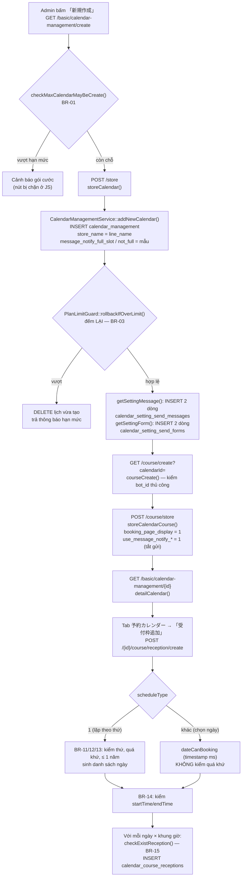
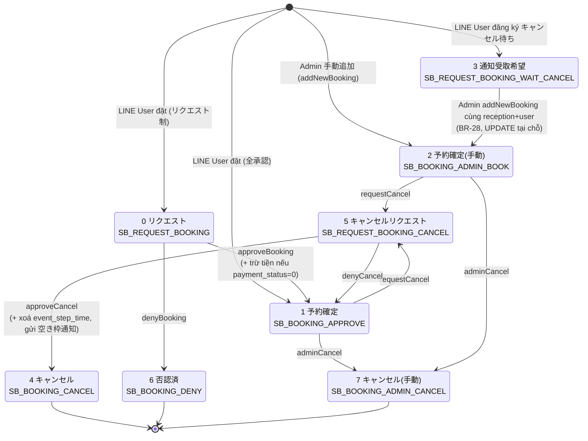
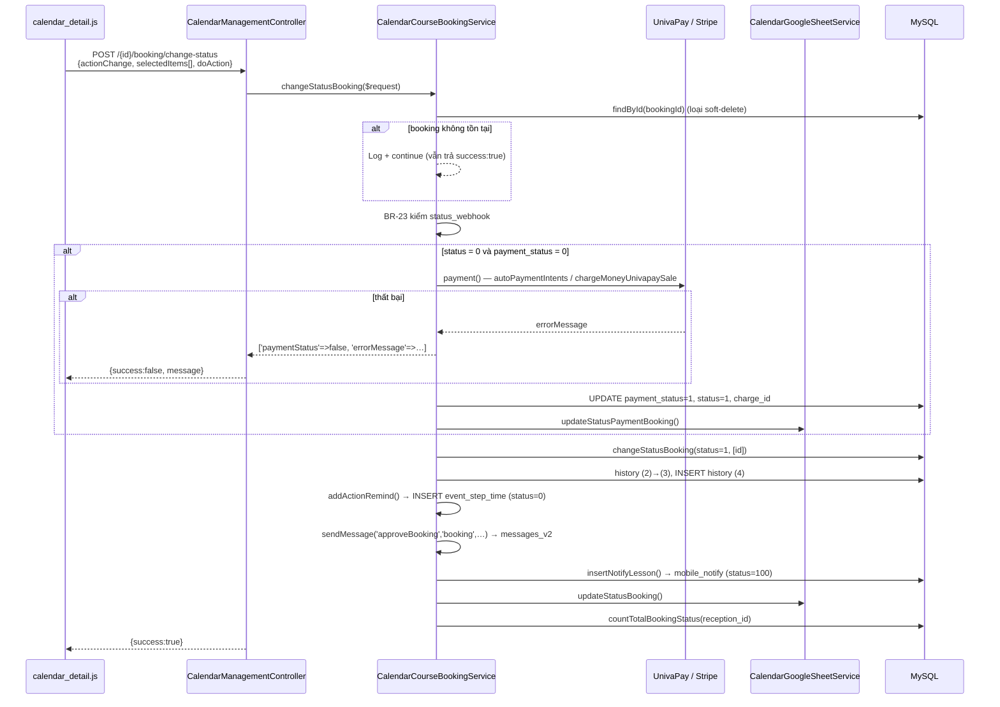
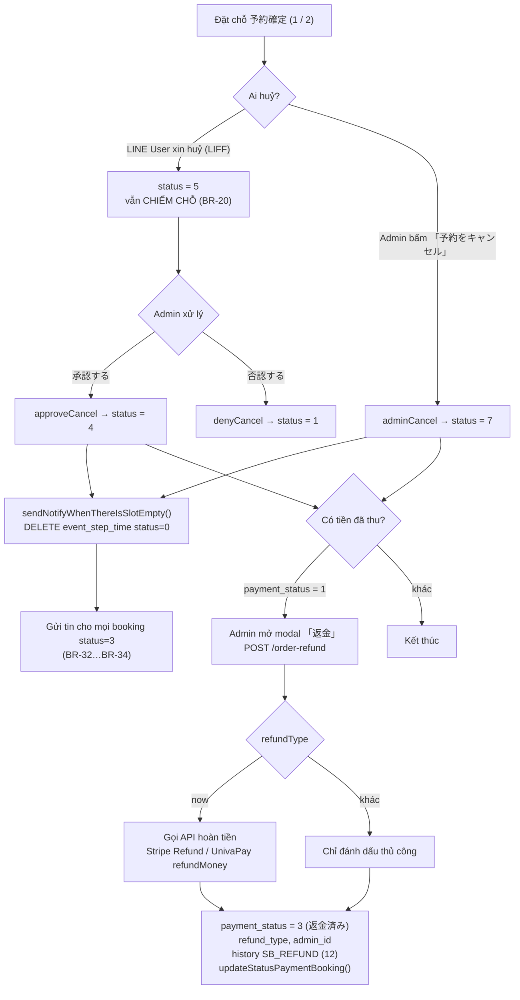

# FA-019 — 「レッスン予約」 — Business Logic Spec (Portal Admin)

> Tạo bởi: web-analyzer agent | Phạm vi: **chỉ portal Admin/Staff** (`Basic\CalendarManagementController`, `Basic\SettingPaymentCalendarController` và các service `App\Services\CalendarManagement\*`).
> **Ngoài phạm vi**: `Mobile\CalendarController` (LIFF public) và `Api\CalendarLessonController` (API app di động) — xem `web/api-spec-public.md`.
> Root source: `src/web/sns-line/` (mọi đường dẫn dưới đây tương đối theo root này).
> Tài liệu liên quan: `ui/ui-spec.md`, `job/job-spec.md`, `web/api-spec-public.md`.

**Mục lục**
1. [Controllers & Actions](#1-controllers--actions)
2. [Services](#2-services)
3. [Models Eloquent & hằng số trạng thái](#3-models-eloquent--hằng-số-trạng-thái)
4. [Form Requests / Validation](#4-form-requests--validation)
5. [Ghi queue table & side effect](#5-ghi-queue-table--side-effect)
6. [Authorization](#6-authorization)
7. [Business Rules](#7-business-rules)
8. [Tích hợp ngoài](#8-tích-hợp-ngoài)
9. [Luồng nghiệp vụ chính & state machine](#9-luồng-nghiệp-vụ-chính--state-machine)
10. [Nợ kỹ thuật / rủi ro](#10-nợ-kỹ-thuật--rủi-ro)
11. [Xác minh 2 nghi vấn của ui-parser](#11-xác-minh-2-nghi-vấn-của-ui-parser)

---

## 1. Controllers & Actions

### 1.1 Tổng quan

| Controller | File | Dòng | Vai trò |
|---|---|---|---|
| `Basic\CalendarManagementController` | `app/Http/Controllers/Basic/CalendarManagementController.php` | 2598 | **Toàn bộ** nghiệp vụ FA-019 phía Admin: lịch, khoá học, khung nhận đặt, đặt chỗ, cài đặt, remind, Google Sheet, hoàn tiền |
| `Basic\SettingPaymentCalendarController` | `app/Http/Controllers/Basic/SettingPaymentCalendarController.php` | 213 | Tab 「決済連携」 — bật/tắt thanh toán, chọn cổng & môi trường, lịch sử thay đổi |

Controller thứ nhất inject **9 service** qua constructor (`CalendarManagementController.php:74-93`): `CalendarManagementService`, `CalendarCourseService`, `CalendarCourseReceptionService`, `BotService`, `BotSlotService`, `CalendarCourseBookingService`, `CalendarCourseBookingHistoryService`, `CalendarSettingMessageService`, `CalendarSettingSendFormService`. `CalendarGoogleSheetService` **không** inject mà `app()->make(...)` tại chỗ dùng.

Controller thứ hai **không inject service nào** — thao tác Eloquent trực tiếp.

### 1.2 Hai nhóm route (điểm mà `routes-inventory.md` §A còn thiếu)

FA-019 có **2** nhóm route riêng biệt, đều nằm trong group cha `['prefix' => 'basic', 'middleware' => ['basic_access','https_protocol','is_expire','check_remember_token']]` (`routes/web.php:882`):

| Nhóm | Prefix URL | Dòng `web.php` | `checkLessonCalendarInBot` |
|---|---|---|---|
| A | `/basic/calendar-management/*` | 1484-1599 | Chỉ áp dụng cho nhóm con `1532-1596` |
| **B (bổ sung)** | `/ajax/calendar/*` | **nhóm cha `ajax` mở tại 2485; nhóm con `calendar` tại 3521-3548** | **Không** — 15 route |

Nhóm B (chưa có trong routes-inventory) gồm: `init-detail/{id}`, `save/policy`, `save/info`, `send-mail/delete`, `check-author/delete`, `action/delete`, `save-setting/notify-full-slot`, `history-setting/notify-full-slot`, `save-setting/remind`, `get-list-step-remind`, `delete-step-remind`, `get-detail-event-step`, `get-list-course-by-calendar`, `save-setting-send-message-event-step`, `delete-item-action-event-step`, `delete-item-action-calendar`, `save-info-form-booking`.

> ⚠ Hai route **trùng tên**: `calendar.getListCalendar` gán cho cả `/get-list-calendar` (`web.php:1518`) và `/create` (`:1520`); `save.setting.calendar.notify.full` gán cho cả `/save-setting/notify-full-slot` (`:3530`) và `/save-setting/remind` (`:3533`). Laravel giữ **route đăng ký sau cùng** khi sinh URL bằng `route()`, và whitelist quyền của Staff cũng tra theo tên route ⇒ ảnh hưởng cả điều hướng lẫn phân quyền. Xem BR-24 và RA-11. **Confidence: Cao**

### 1.3 `CalendarManagementController` — chi tiết từng method

Ký hiệu cột **Ownership**: 🔒 = có kiểm calendar thuộc bot (middleware hoặc `checkCalendarBelongBot`) · ⚠ = **không kiểm** · ○ = không cần (không nhận id ngoài).

#### Nhóm A — Danh sách & vòng đời lịch

| Method | Dòng | Nghiệp vụ | Validation | Side effect | Ownership |
|---|---|---|---|---|---|
| `index()` | 97-104 | Render `basic.calendar_management.index`. Lấy `liffId` = `bot.liff_app_id_booking` (fallback `bot.liff_app_id`), `numberCalendar` = `BotSlotService::getNumberCalendarByContract()` | — | — | ○ |
| `getListCalendar()` | 106-122 | Trả danh sách lịch của bot qua `CalendarResource`, kèm `canCreate` (`checkMaxCalendarMayBeCreate()`), `enableTooltipCalendar` (`users.enable_tooltip_calendar`), `messageErrorMax` | — | — | 🔒 (lọc theo `getBotId()` trong repository) |
| `create()` | 124-127 | Render trang giới thiệu (view tĩnh) | — | — | ○ |
| `storeCalendar()` | 129-152 | Tạo lịch mới. Gọi `CalendarManagementService::addNewCalendar()`; nếu trả về **chuỗi** thông báo hạn mức ⇒ `success = false`. Thành công thì **khởi tạo ngay** 2 bản ghi `calendar_setting_send_messages` và 2 bản ghi `calendar_setting_send_forms` mặc định | **Không có** — `line_name` / `calendar_name` không validate ở server | INSERT `calendar_management`, `calendar_setting_send_messages` ×2, `calendar_setting_send_forms` ×2 | ○ |
| `editCalendar()` | 154-163 | Đổi tên quản lý. `CalendarManagementService::editCalendar($id, $request->all())` — **truyền thẳng toàn bộ input** vào `update()`, chỉ loại khoá `id` | **Không có** | UPDATE `calendar_management` (mass assignment) | ⚠ **không kiểm bot** |
| `saveSort()` | 186-195 | Lưu thứ tự thẻ lịch: lặp `listId`, ghi `order = index + 1` | Không | UPDATE `calendar_management.order` từng dòng (N truy vấn) | ⚠ |
| `disableTooltip()` | 1997-2005 | `users.enable_tooltip_calendar = 0` cho user hiện tại | — | UPDATE `users` | ○ |
| `sendMailCodeAuthDeleteCalendar()` | 645-679 | Sinh mã ngẫu nhiên 10 ký tự (`Str::random(10)` → `checkRandomStringCodeDeleteLesson()`), gửi email tới `users.email` của user hiện tại, ghi `calendar_management.code_delete` | Kiểm `checkCalendarBelongBot` | Gửi mail `SendAuthCode`, UPDATE `code_delete` | 🔒 |
| `checkAuthorDeleteCalendar()` | 681-713 | Đối chiếu `code` với `code_delete` (kèm `bot_id`) | Kiểm sở hữu | — | 🔒 |
| `deleteCalendar()` | 715-771 | **Xoá toàn bộ hệ thống đặt lịch.** Kiểm mã xác thực rồi xoá dây chuyền (chi tiết mục 9.6) | Kiểm mã | DELETE 8 bảng + `recountAppBadgeNotify()` | 🔒 |

#### Nhóm B — Khoá học (コース)

| Method | Dòng | Nghiệp vụ | Validation | Side effect | Ownership |
|---|---|---|---|---|---|
| `courseCreate()` | 165-173 | Render form khoá học đầu tiên. Tự kiểm `empty($calendar) \|\| $calendar->bot_id != getBotId()` → redirect `calendar.index` | — | — | 🔒 (thủ công) |
| `storeCourse()` | 175-184 | Tạo khoá học đầu tiên qua `CalendarCourseService::storeCalendarCourse($request->all())` — **mass assignment toàn bộ input** | **Không có** | INSERT `calendar_course` (+ upload ảnh base64) | ⚠ |
| `listsCourse()` | 1491-1507 | Danh sách khoá học. Tham số mặc định **`$perpage = 100000`** ⇒ thực chất **tắt phân trang** | — | — | ⚠ |
| `course()` | 1474-1483 | Chi tiết khoá học theo `courseId` | — | — | ⚠ |
| `getMessageNotify()` | 1809-1817 | Lấy 2 tin nhắn tự động của khoá học | — | — | ⚠ |
| `createCourse()` | 1536-1600 | Tạo khoá học từ modal. Kiểm 2 hạn mức: gói free (`bots.plan_type == 2`) tối đa **2** khoá; trần cứng **200** khoá/lịch. Sau khi tạo chạy `PlanLimitGuard::rollbackIfOverLimit()` (xoá bản ghi vừa tạo nếu vượt) | `CreateCalendarCourse` | INSERT `calendar_course`, có thể DELETE lại | ⚠ |
| `updateCourse()` | 1610-1660 | Lưu 「コース詳細」. `amount` được lọc `preg_replace("/[^0-9]/","")` ⇒ **chỉ giữ chữ số** (số âm/thập phân bị biến dạng chứ không bị chặn). Upload ảnh base64 nếu `imageNew == "true"`; xoá ảnh nếu `imageDelete == "true"` | `EditCalendarCourse` | UPDATE `calendar_course`, UPDATE `filter_v2.parent_id` | ⚠ |
| `deleteCalendarCourse()` | 1663-1677 | Xoá khoá học + dây chuyền (mục 9.5) | — | DELETE `calendar_course`, `calendar_course_receptions`, `calendar_course_bookings`, `event_step_time`, `mobile_notify` | ⚠ |
| `deleteImageCalendarCourse()` | 1686-1700 | Xoá ảnh khoá học | — | UPDATE `calendar_course.course_image` | ⚠ |
| `updateBookingPageDisplay()` | 1509-1530 | Bật/tắt hiển thị khoá học trên trang đặt chỗ. `$status = $request->input(...) === 'true' ? 1 : 0` | — | UPDATE `calendar_course.booking_page_display` | ⚠ |
| `updateCalendarCourseOrder()` | 1709-1727 | Lưu thứ tự kéo-thả | — | UPDATE `calendar_course.course_order` | ⚠ |
| `checkBookingCancel()` | 2241-2264 | Kiểm có thể xoá khoá học không: tìm các `reception` **từ hiện tại trở đi**, nếu còn booking `status ∉ {4,7}` và chưa soft-delete ⇒ `allow_delete_course = false` | — | — | ⚠ |
| `initDataActionCalendarCourseSetting()` | 1733-1750 | Nạp dữ liệu action của khoá học cho tab 2 | — | — | ⚠ |
| `deleteItemAction()` | 1756-1781 | Xoá 1 mục エルメアクション của khoá học | — | DELETE `action_detail`, có thể set `calendar_course.action_id_* = null` | ⚠ |
| `initDataFilter()` | 1787-1795 | Preview điều kiện lọc bạn bè của khoá học (`parent_type = 'calendar-course-setting-status-send-after-booking'`) | — | — | ⚠ |
| `editCourse()` | 421-448 | Render trang 「コース詳細」, truyền `statusObject`, `conversion`, `scenario`, `richMenus`, `botPlanType`, `totalUser` | — | — | 🔒 (middleware theo `{id}` calendar; `courseId` **không** đối chiếu) |

#### Nhóm C — Khung nhận đặt (受付枠)

| Method | Dòng | Nghiệp vụ | Validation | Side effect | Ownership |
|---|---|---|---|---|---|
| `addNewReception()` | 258-263 | Tạo khung nhận đặt — 2 chế độ: lặp theo thứ (`scheduleType == 1`) hoặc chọn ngày cụ thể | Validate **trong service** (mục 2.3) | INSERT nhiều dòng `calendar_course_receptions` | 🔒 |
| `detailReception()` | 265-274 | Chi tiết 1 khung + cài đặt tin nhắn của lịch | — | — | 🔒 |
| `updateReception()` | 374-383 | Sửa 定員 (`maxPerson`) & kiểu giới hạn (`typeLimit`) | — | UPDATE `calendar_course_receptions`; **có thể gửi tin 「空き枠」** | 🔒 |
| `deleteReception()` | 385-401 | Xoá 1 khung. Chặn nếu `total_approve > 0` | — | soft-delete reception + soft-delete booking + ghi history | 🔒 |
| `deleteListReception()` | 403-419 | Xoá hàng loạt khung. Chặn nếu tổng `total_approve > 0` | — | như trên + **DELETE `event_step_time`** | 🔒 |
| `checkDeleteReception()` | 2270-2278 | Kiểm khung có xoá được không | — | — | 🔒 |
| `getReceptionListDataCustom()` | 309-318 | Danh sách khung ở view 「受付枠一覧」 | — | — | 🔒 |
| `exportCsvReception()` | 461-470 | Xuất CSV đặt chỗ của 1 khung (SJIS) | — | Tạo file | 🔒 |

#### Nhóm D — Đặt chỗ (予約)

| Method | Dòng | Nghiệp vụ | Validation | Side effect | Ownership |
|---|---|---|---|---|---|
| `getListBooking()` | 1877-1886 | Tab 「本日／新着の予約」 — `perPage` mặc định 50, `condition` = tab1/tab2 | — | — | 🔒 |
| `getBookingList()` | 287-296 | Danh sách đặt chỗ trong 1 khung | — | — | 🔒 |
| `getBookingListDataCustom()` | 298-307 | Danh sách 「予約一覧」 có lọc/tìm/phân trang | — | — | 🔒 |
| `getDetailBookingBySlot()` | 2197-2206 | Chi tiết đặt chỗ theo khung (dùng ở tab 本日) | — | — | 🔒 |
| `addNewBooking()` | 276-285 | **Admin thêm đặt chỗ thủ công** (mục 9.2) | **Không có** | INSERT/UPDATE booking, cập nhật hồ sơ bạn bè, action, history, Google Sheet, `event_step_time`, `mobile_notify` | 🔒 |
| `changeStatusBooking()` | 320-338 | **Trung tâm chuyển trạng thái** — 6 hành động (mục 9.3). Trả `success = false` kèm thông báo khi service trả `paymentStatus` | **Không có** | Rất nhiều — xem mục 5 | 🔒 theo `{id}` calendar, ⚠ theo `bookingId` |
| `deleteBooking()` | 340-350 | Soft-delete đặt chỗ, ghi `addLogUserAction`, xoá `mobile_notify` chưa xác nhận, `recountAppBadgeNotify()` | **Không có** | soft-delete + INSERT history + DELETE `mobile_notify` | 🔒 theo calendar, ⚠ theo `bookingId` |
| `getBookingHistory()` | 352-361 | Lịch sử thao tác của 1 đặt chỗ | — | — | ⚠ theo `bookingId` |
| `getBookingDeleted()` | 363-372 | Danh sách đặt chỗ đã xoá — **chỉ trong 90 ngày gần nhất** (`CalendarCourseBookingRepository.php:230-231`) | — | — | 🔒 |
| `getLastBooking()` | 2208-2215 | 10 đặt chỗ gần nhất của 1 LINE user trong lịch | — | — | 🔒 |
| `orderRefund()` | 2007-2113 | **Hoàn tiền** (mục 8.3). `refundType = 'now'` gọi API hoàn tiền; giá trị khác chỉ đánh dấu thủ công | **Không có** | Gọi Stripe/UnivaPay, UPDATE booking, INSERT history, cập nhật Google Sheet | ⚠ **không kiểm bot** |
| `exportCsv()` | 450-459 | Xuất CSV khoá học | — | — | 🔒 |
| `importCsv()` | 472-488 | Nhập CSV khung nhận đặt | Validate trong service | INSERT `calendar_course_receptions` | 🔒 |

#### Nhóm E — Cài đặt tổng thể (全体設定)

| Method | Dòng | Nghiệp vụ | Ownership |
|---|---|---|---|
| `detailCalendar()` | 197-245 | Render trang chi tiết. Sinh URL OAuth Google Sheet khi chưa kết nối / `google_sheet_status == 0`; nạp `richMenus`, `scenario`, `conversion`, `statusObject`, `hashCalendarId` (Hashids), `totalUser`. `is_google_sheet_error = access_token && status == 0` | 🔒 |
| `ajaxGetDetailCalendar()` | 490-505 | Chi tiết lịch + preview action 「満枠通知」/「空き枠通知」 | 🔒 |
| `savePolicyCalendar()` | 507-525 | Lưu 「利用規約」 (`show_policy`, `content_policy`) | 🔒 |
| `saveCalendarInfo()` | 527-577 | Lưu 「店舗・ビジネス情報」 + 「トップ画面設定」 (17 cột). Bắt buộc `line_name` (trả HTTP 500 nếu rỗng). Upload 2 ảnh base64 vào `media/images/{userId}/{botId}/calendar_new[_top]/` | 🔒 |
| `saveSettingNotifyFull()` | 773-810 | Lưu 「空き枠通知受け取り設定」. Ghi `calendar_setting_notify_full_history` **chỉ khi** `is_notify_full_slot` đổi giá trị. **Luôn ép `use_message_notify_not_full = 0`** | 🔒 |
| `getHistorySettingNotifyFullSlot()` | 812-828 | Lịch sử bật/tắt thông báo chỗ trống | 🔒 |
| `getSettingMessage()` | 1375-1384 | Lấy 2 bản ghi cài đặt tin nhắn (booking/cancel), **tự tạo nếu chưa có** | 🔒 |
| `saveSettingMessage()` | 1386-1395 | Lưu cài đặt tin nhắn theo `type` ∈ {`message`, `startDeadline`, `option`, `text_limit_book_each_customer`, `text_filter_show_booking`} | ⚠ theo `request.id` |
| `getSettingSendForm()` | 1397-1406 | Lấy 「お客様への質問項目」, **tự tạo 2 mục mặc định** (họ tên, email) nếu chưa có | 🔒 |
| `createNewSettingForm()` | 1408-1425 | Thêm câu hỏi. Chặn khi đã có **≥ 100** mục: 「質問数の上限（100）を超えるため、これ以上作成できません。」 | 🔒 |
| `updateSettingForm()` | 1427-1436 | Sửa câu hỏi — truyền `$request->except(['id'])` **nguyên khối** vào `update()` | ⚠ theo `request.id` |
| `deleteSettingForm()` | 1438-1454 | Xoá câu hỏi, **chỉ khi `can_delete = 1`** | 🔒 (service kiểm `calendar_id` + `bot_id`) |
| `sortSettingForm()` | 1456-1465 | Lưu thứ tự câu hỏi | ⚠ |
| `getDataBookingSettingDisplay()` | 1826-1835 | Lấy 「予約ページの表示設定」 | ⚠ |
| `settingBookingDisplay()` | 1844-1867 | Lưu 5 cờ hiển thị: `is_display_course_cost`, `is_display_capacity`, `is_display_course_full`, `booking_setting_name`, `setting_show_calendar` | ⚠ |
| `initDataFilterShowBooking()` | 1799-1806 | Preview điều kiện lọc bạn bè được xem trang đặt chỗ (`filter_id_show_booking`) | ⚠ |
| `deleteItemActionCalendar()` | 2115-2195 | Xoá 1 mục action; nếu action rỗng thì set `null` cho đúng cột theo `type_action` (10 nhánh) | 🔒 (mọi query đều kèm `bot_id`) |
| `getDataFriendInfo()` | 2281-2440 | Danh mục hồ sơ bạn bè để chèn biến vào tin nhắn | 🔒 |
| `getCategoryOfFriendSetting()` | 2442-2496 | Lấy `category_id` của một mục hồ sơ bạn bè | 🔒 |
| `saveInfoFormBooking()` | 2498-2598 | Lưu 「予約情報」 chèn vào tin nhắn | (chưa đọc chi tiết — **Confidence: Thấp**) |
| `preview()` / `previewTop()` / `previewForm()` | 1889 / 1900 / 1912-1991 | 3 trang xem trước. `previewForm()` lọc `enable = 1`, dựng options theo `friend_information_id` (`-6` = tỉnh/thành → `PROVINCE_DEFAULT`), bỏ mục radio/checkbox không có option hợp lệ | 🔒 (`checkCalendarBelongBot`, rỗng thì render dữ liệu trống) |

#### Nhóm F — Nhắc lịch (リマインドメッセージ) — cầu nối sang job

| Method | Dòng | Nghiệp vụ | Ownership |
|---|---|---|---|
| `saveCreateSettingRemind()` | 830-916 | **Tạo 1 mốc nhắc mới.** Tìm/`insertGetId` bản ghi `events` (`type = 4`, `booking_calendar_id`, `category_id = -1`), rồi `insertGetId` `event_step` (`type = 4`, `is_after_day` 0/1, `before_day`, `time_send`, `type_remind`, `send_message_course` = mẫu mặc định, `is_use_message = 1`, `is_use_filter_course = 0`). Cuối cùng gọi `addActionRemindNew()` | 🔒 |
| `addActionRemindNew()` | 918-1042 | **Backfill hàng loạt** `event_step_time` cho mọi booking `status ∈ {1,2,5}` của lịch (mục 5.2) | (nội bộ) |
| `deleteEventStep()` | 1045-1055 | Xoá 1 mốc nhắc: DELETE `event_step` + DELETE `event_step_time` `status = 0` | ⚠ **không kiểm bot** |
| `getListStepRemind()` | 1069-1160 | Danh sách mốc nhắc, sắp xếp theo thời điểm | 🔒 |
| `getDetailEventStep()` | 1162-1194 | Chi tiết 1 mốc nhắc, tách `course_ids` thành mảng | 🔒 |
| `deleteItemActionEventStep()` | 1196-1224 | Xoá 1 mục action gắn với mốc nhắc | 🔒 |
| `saveSettingSendMessageEventStep()` | 1226-1372 | **Sửa mốc nhắc** + tính lại toàn bộ `event_step_time` `status = 0` (mục 5.3) | 🔒 |
| `getListCourseByCalendar()` | 1057-1067 | Danh sách khoá học để chọn trong bộ lọc của mốc nhắc | 🔒 |
| `getMessageTemplateRemind($type)` | 2217-2239 | Sinh mẫu tin nhắn nhắc: `1` = trước buổi học 1 ngày, `2` = sau buổi học. Dùng 4 mã biến `[LESSON_CALENDAR_date_time \| course \| reservation_currency \| url_cancel]` | (nội bộ) |

#### Nhóm G — Google Spreadsheet

| Method | Dòng | Nghiệp vụ | Ownership |
|---|---|---|---|
| `redirectUriGoogleSheet()` | 580-626 | Callback OAuth. Kiểm `scope` chứa `.../auth/spreadsheets`, thiếu → redirect kèm 「Googleスプレッドシートのアクセス権限をチェックしてください」. Thành công: tạo spreadsheet mới tên = `calendar.line_name`, lưu `google_sheet_id`, `google_sheet_access_token` (JSON), `google_account_name/picture`, `datetime_connect_google_sheet`, `google_sheet_status = 1`. `Google_Exception` → `google_sheet_status = 0` | 🔒 (`state` = calendarId, có `checkCalendarBelongBot`) |
| `cancelGoogsheet()` | 628-643 | Ngắt liên kết: xoá `google_sheet_access_token`, `google_sheet_id`. **Không** reset `google_sheet_status` | 🔒 |

### 1.4 `SettingPaymentCalendarController` — chi tiết

| Method | Dòng | Nghiệp vụ | Ownership |
|---|---|---|---|
| `initDataSettingPayment()` | 16-106 | Nạp tab 「決済連携」: đọc `strip_bots` để xác định `checkLinkedStripe` (`status_strip_bot == 3`), `checkLinkedUnivapay` (có cả `univapay_app_id` và `univapay_app_test_id`), `checkLinkPayment` (**chưa** liên kết cổng nào). Trả `settingPayment` (4 cột `type_payment`, `environment`, `description_payment`, `is_use_payment`), lịch sử `history_change_payment` đã dịch nhãn, `contractType`, và `checkEnableNameAndEmailDefault` (2 mục form mặc định họ tên + email đều `enable = 1` và `required = 1`) | ⚠ **không kiểm bot** |
| `getStatusChange()` (private) | 108-150 | Suy ra cặp `from`/`to` cho bản ghi lịch sử theo 3 tình huống: bật mới, tắt, đổi môi trường. Trường hợp không đổi gì → `from = null` (không ghi lịch sử) | — |
| `saveSettingPayment()` | 151-212 | Lưu cài đặt. `is_use_payment = ($request->is_use_payment == 'true') ? 1 : 0`. Chỉ ghi `type_payment` / `environment` / `description_payment` **khi bật**. Sau đó **cưỡng bức bật** 2 mục form mặc định: `friend_information_id = -1` (họ tên) → `enable = 1, required = 1, rule_type = 0`; `friend_information_id = -3` (email) → `enable = 1, required = 1, rule_type = 1, rule_validation_type = 'email'` | ⚠ **không kiểm bot** |

**Nhãn lịch sử** (`SettingPaymentCalendarController.php:59-77`): `from` → 「停止」/「本番環境」/「テスト環境」; `to` → 「利用中(本番環境)」/「利用中(テスト環境)」/「本番環境」/「テスト環境」/「停止」.

---

## 2. Services

Tất cả nằm trong `app/Services/CalendarManagement/`. Mỗi service phụ thuộc **Repository interface** (`app/Contracts/Repositories/*`) được bind sang `app/Repositories/Eloquents/*`.

| Service | Dòng | Trách nhiệm chính |
|---|---|---|
| `CalendarManagementService` | 280 | Vòng đời lịch, hạn mức gói, mẫu tin nhắn 満枠/空き枠, preview filter |
| `CalendarCourseService` | ~1130 | Khoá học, danh sách/chi tiết đặt chỗ theo lịch tuần/tháng, CSV |
| `CalendarCourseReceptionService` | ~490 | Khung nhận đặt: tạo lặp/theo ngày, sửa 定員, xoá (đơn/hàng loạt) |
| `CalendarCourseBookingService` | ~2010 | **Lớn nhất** — tạo/đổi trạng thái/xoá đặt chỗ, thanh toán, remind, thông báo chỗ trống, callback webhook |
| `CalendarCourseBookingHistoryService` | 27 | Chỉ 1 method — đọc lịch sử thao tác |
| `CalendarSettingMessageService` | ~175 | 2 bản ghi cài đặt tin nhắn (booking/cancel) + mẫu mặc định |
| `CalendarSettingSendFormService` | ~265 | Form câu hỏi khách hàng, đồng bộ sang hồ sơ bạn bè |
| `CalendarGoogleSheetService` | ~815 | Đẩy/cập nhật dữ liệu đặt chỗ lên Google Sheets |

### 2.1 `CalendarManagementService` — `CalendarManagementService.php`

| Method | Dòng | Trách nhiệm | Đọc | Ghi |
|---|---|---|---|---|
| `getListCalendar()` | 26-29 | Danh sách lịch của `getBotId()` | `calendar_management` | — |
| `addNewCalendar($request)` | 31-86 | Tính hạn mức theo gói (BR-01), gán `bot_id`, `store_name = line_name`, 2 mẫu tin nhắn mặc định, tạo bản ghi rồi **đếm lại** bằng `PlanLimitGuard::rollbackIfOverLimit()` | `bot_slots`, `bot_contracts`, `bots` | `calendar_management` |
| `editCalendar($id, $request)` | 88-93 | `collect($request)->except(['id'])` rồi UPDATE — **mọi cột đều ghi được** | — | `calendar_management` |
| `getById($id)` | 95-98 | Tìm theo id, **không lọc bot** | `calendar_management` | — |
| `getTotalCalendar()` | 100-103 | Đếm lịch của bot | `calendar_management` | — |
| `sort($listId)` | 105-111 | Ghi `order = key + 1` cho từng id, **không kiểm bot** | — | `calendar_management` |
| `checkMaxCalendarMayBeCreate()` | 113-158 | Trả `['status' => bool, 'message' => JP]` theo gói (BR-01) | `bot_slots`, `bot_contracts`, `bots` | — |
| `checkCalendarBelongBot($id)` | 160-164 | **Hàm kiểm sở hữu duy nhất** dùng lại ở ~15 method của nhóm route B | `calendar_management` | — |
| `getBookingSettingDisplay` / `updateBookingSettingDisplay` | 166-198 | Đọc/ghi 5 cờ hiển thị trang đặt chỗ. Nhánh không tìm thấy gọi `redirect()` **mà không `return`** ⇒ vô tác dụng | `calendar_management` | `calendar_management` |
| `getMessageTemplate($type)` | 200-225 | Mẫu tin 「満枠通知」 (`1`) / 「空き枠通知」 (`2`), có 4 mã biến `[LESSON_CALENDAR_*]` | — | — |
| `initDataFilter` / `getPreviewFilter` | 227-279 | Dựng `text_preview` cho FilterV2 (`parent_type = 'calendar-setting-show-booking-form'`), tách nhóm `and` / `or` | `filter_v2` | — |

### 2.2 `CalendarCourseService` — `CalendarCourseService.php`

| Method | Dòng | Trách nhiệm | Đọc | Ghi |
|---|---|---|---|---|
| `storeCalendarCourse($request)` | 57-82 | Tạo khoá học đầu tiên: bật `booking_page_display = 1`, `course_order = MAX(course_order) + 1` (**toàn cục, không theo lịch** — `CalendarCourseRepository.php:219-222`), 2 mẫu tin nhắn, `use_message_notify_send_* = 1` (tức **tắt gửi**), upload ảnh base64 | `bot_line_user`, `calendar_course` | `calendar_course` |
| `storeCourse($courseName, $calendarId)` | 498-533 | Tạo khoá học từ modal: chỉ tên; `hour_done = 1`, `minute_done = 0` | như trên | `calendar_course` |
| `getCourseList($data, $calendarId)` | 84-281 | Dựng dữ liệu lịch cho các chế độ 日/週/月/一覧 (gộp reception + số liệu đặt chỗ) | `calendar_course`, `calendar_course_receptions`, `calendar_course_bookings` | — |
| `getListsCourse($calendarId, $perpage)` | 463-471 | Danh sách khoá học cho tab 「コース設定」 | `calendar_course` | — |
| `getCourse` / `getMessageNotify` | 535-538 / 848-851 | Chi tiết khoá học | `calendar_course` | — |
| `updateBookingPage($courseId, $status)` | 473-496 | Bật/tắt hiển thị | `calendar_course` | `calendar_course` |
| `updateCalendarCourse(array $data, $courseId)` | 607-647 | Cập nhật khoá học + gán `filter_v2.parent_id`. **`DB::beginTransaction()`/`commit()`/`rollback()` đã bị comment** (`:609`, `:632`, `:643`) | `calendar_course` | `calendar_course`, `filter_v2` |
| `deleteCalendarCourse($courseId)` | 540-605 | **Xoá dây chuyền** — sao lưu snapshot khoá học vào từng booking (`course_name`, `course_amount`, `system_name`, `course_image`, kể cả bản đã soft-delete) rồi xoá khoá học, reception, booking; ghi history 「コース削除による予約削除」; xoá `mobile_notify`; DELETE `event_step_time` `status = 0` của các mốc `event_step.type = 4` | nhiều | `calendar_course`, `calendar_course_receptions`, `calendar_course_bookings`, `calendar_course_booking_history_actions`, `mobile_notify`, `event_step_time` |
| `uploadImageCalendarCourse` / `deleteImage` | 649-699 | Upload/xoá ảnh khoá học | — | `calendar_course` |
| `updateOrderCourse(array $order)` | 701-727 | Lưu thứ tự | — | `calendar_course` |
| `initDataActionCalendarCourseSetting` / `deteteItemAction` | 729-780 | Action theo khoá học | `action_detail` | `action_detail`, `calendar_course` |
| `initDataFilterSendAfterBooking` / `getPreviewFilter` | 782-846 | Preview filter của khoá học | `filter_v2` | — |
| `listBookings($perPage, $calendarId, $condition)` | 853-1002 | Tab 「本日／新着の予約」 — `condition` chọn nhánh 新着 (7 ngày) hay 本日 | nhiều | — |
| `getDetailBookingBySlot($calendarId, $receptionId, $type)` | 1004-1104 | Chi tiết đặt chỗ theo khung | nhiều | — |
| `exportCsv` / `importCsv` | 297-461 | CSV khung nhận đặt; `convert()` (`:331`) mã hoá **SJIS**, `convertToUtf8()` (`:341`) đọc ngược | `calendar_course_receptions` | `calendar_course_receptions` |
| `getMessageTemplate($type)` | 1106-… | Mẫu tin 「予約完了」 (1) / 「リクエスト承認」 (2) của khoá học | — | — |

### 2.3 `CalendarCourseReceptionService` — `CalendarCourseReceptionService.php`

| Method | Dòng | Trách nhiệm | Ghi |
|---|---|---|---|
| `create($request)` | 52-135 | Tạo khung nhận đặt. **Toàn bộ validation của tính năng nằm ở đây** (BR-07…BR-10). 2 chế độ: `scheduleType == 1` sinh danh sách ngày từ hôm nay tới `repeatDueDate` khớp `dayOfWeekSchedule`; ngược lại nhận `dateCanBooking` là mảng **timestamp mili-giây** (`Carbon::createFromTimestamp($date / 1000)`). Với mỗi (ngày × khung giờ) gọi `checkExistReception()` để **chống trùng** rồi mới INSERT | `calendar_course_receptions` |
| `getDetailReception($request, $receptionId, $calendarId)` | 137-143 | Chi tiết khung + cài đặt tin nhắn 「booking」 của lịch | — |
| `checkStillSlotBooking($receptionId)` | 145-153 | Còn chỗ trống hay không | — |
| `getBookingList` / `getReceptionListDataCustom` | 155-277 | Dữ liệu bảng 予約一覧 / 受付枠一覧 | — |
| `update($request)` | 279-302 | Sửa `total_person` + `type_limit_booking`. Nếu (nâng 定員 vượt `total_booking` **hoặc** chuyển sang không giới hạn) **và** trước đó đã đầy (`total_booking == total_person`) ⇒ gọi `sendNotifyWhenThereIsSlotEmpty()` | `calendar_course_receptions` (+ gửi tin) |
| `delete($request)` | 304-362 | Xoá 1 khung. Chặn khi `total_approve > 0`. Soft-delete reception + từng booking, xoá `mobile_notify`, hạ cấp history đang chờ duyệt, ghi history 「受付枠削除による予約削除」. ⚠ **Đoạn DELETE `event_step_time` đã bị comment** (`:314-318`) | `calendar_course_receptions`, `calendar_course_bookings`, `mobile_notify`, `calendar_course_booking_history_actions` |
| `deleteFromApp($request)` | 364-411 | Bản dành cho API app — suy `bot_id` qua `reception → calendar_course → calendar_management` vì `getBotId()` rỗng ngoài session web (comment `BUG #38208`, `:352-361`) | như trên |
| `deleteList($request)` | 413-468 | Xoá hàng loạt. Chặn khi `SUM(total_approve) > 0`. **Có** DELETE `event_step_time` `status = 0` (`:421-431`) — khác hẳn `delete()` | như `delete()` + `event_step_time` |
| `checkCanDeleteReception($receptionId)` | 470-… | `total_approve > 0` ⇒ `false` | — |

### 2.4 `CalendarCourseBookingService` — `CalendarCourseBookingService.php` (service trung tâm)

| Method | Dòng | Trách nhiệm | Bảng ghi |
|---|---|---|---|
| `create($request, $calendarId)` | 86-259 | **Admin thêm đặt chỗ thủ công** (mục 9.2) | `calendar_course_bookings`, `line_user`, `friend_information_values`, `friend_information_settings`, `calendar_course_booking_history_actions`, `calendar_course_receptions`, `event_step_time`, `mobile_notify` |
| `getBookingListDataCustom($request, $id)` | 262-366 | Dữ liệu bảng 「予約一覧」 | — |
| `payment($request, $botId, $booking)` | 368-515 | **Trừ tiền khi Admin duyệt** (mục 8.1-8.2) | `calendar_course_bookings.status_webhook` |
| `sendActionAdmin(...)` | 517-527 | **Thân hàm rỗng** — code chết | — |
| `addActionRemind($booking, $botId, $reception)` | 529-640 | Sinh `event_step_time` cho **1** booking theo mọi `event_step` của lịch (mục 5.1) | `event_step_time` |
| `callbackChangeStatusBooking($data, $paymentMethod)` | 642-707 | Nhánh webhook UnivaPay quay lại luồng đổi trạng thái (`metadata.module = 'lesson_change_status'`) | gián tiếp |
| `changeStatusBooking($request)` | 709-964 | **State machine 6 hành động** (mục 9.3) | rất nhiều |
| `sendMessage($type, $moment, $booking, $executeAction, $bot)` | 966-1073 | Chọn nội dung/action theo hành động + `approve_type`, ưu tiên cấu hình **cấp khoá học** rồi mới tới **cấp lịch**; gửi qua `sendAction()` và/hoặc `sendMessageAction()`; tăng `bots.free_send_count` và `updateMessageSendCount(..., 3, 1)` | `messages_v2`, `conversations`, `bots` |
| `delete($request)` | 1075-1098 | Soft-delete booking, cập nhật số liệu khung, ghi history 「予約情報の削除」, xoá `mobile_notify` chưa xác nhận, `recountAppBadgeNotify()`. ⚠ **Không** xoá `event_step_time` | `calendar_course_bookings`, `calendar_course_booking_history_actions`, `mobile_notify` |
| `getDeletedBooking($request, $id)` | 1100-1152 | Danh sách đã xoá trong 90 ngày; `end_time == '00:00:00'` hiển thị 「24:00」 | — |
| `exportCsv($request, $calendarId)` | 1154-1280 | CSV đặt chỗ của khung, chuyển sang **SJIS** (`convert()` `:1282-1290`) | — |
| `sendNotifyWhenThereIsSlotEmpty($receptionId, $calendarId, $userLoginId)` | 1292-1356 | Gửi tin cho mọi booking `status = 3` (キャンセル待ち) khi có chỗ trống (BR-16) | `messages_v2`, `conversations` |
| `sendActionBooking(...)` | 1358-1422 | Chạy action/tin nhắn 「予約完了」 khi Admin đặt hộ; ưu tiên cấu hình khoá học → cấp lịch theo `approve_type` | `messages_v2`, `action_*` |
| `countTotalBookingStatus($receptionId)` | 1424-1440 | **Tính lại 6 bộ đếm** của khung (BR-14) | `calendar_course_receptions` |
| `getLastTenBooking($calendarId, $lineId)` | 1442-1447 | 10 đặt chỗ gần nhất | — |
| `sendMessageAction(...)` | 1449-1483 | Bọc `MessageService::createMessageV2` với `msg_kind = KIND_MESSAGE_ACTION_FROM_BOOKING`, `type = TYPE_MESSAGE_ACTION_FROM_BOOKING_LESSON`, history gắn `table_name = 'calendar_course_bookings'` | `messages_v2` |
| `getDataCallback` / `handleOrderCallback` | 1485-1794 | Webhook UnivaPay (`POST /univapay/get-callback-webhook`) — chủ yếu phục vụ luồng LIFF, xem `api-spec-public.md` | `calendar_course_bookings`, `event_step_time` |
| `checkExecutionTimeMoreThanTwoMinute` / `sendNotifyExecutionTimeMoreThanTwoMinute` | 1796-1821 | Cảnh báo khi xử lý thanh toán quá 2 phút | — |
| `updateFriendInfoValue($friendInfo, $lineUser, $botId)` | 1823-1956 | Đồng bộ câu trả lời form vào hồ sơ bạn bè (nhánh LIFF) | `line_user`, `friend_information_values` |
| `checkStatusProcessCallback($bookingId, $retryNumber = 25)` | 1958-1995 | **Vòng chờ đồng bộ** webhook UnivaPay, tối đa 25 lần | — |
| `getBookingTimeout()` | 1997-… | Lấy các booking treo do webhook | — |

### 2.5 `CalendarCourseBookingHistoryService` — `CalendarCourseBookingHistoryService.php`

Chỉ 1 method `getBookingHistoryList($bookingId)` (`:19`) — đọc `calendar_course_booking_history_actions` (kèm `admin`) theo `booking_id`.

### 2.6 `CalendarSettingMessageService` — `CalendarSettingMessageService.php`

| Method | Dòng | Trách nhiệm |
|---|---|---|
| `getSettingMessage($calendarId)` | 16-86 | **Lazy-create**: nếu chưa có bản ghi nào thì tạo đúng **2** dòng (`moment = 'booking'` và `'cancel'`) với giá trị mặc định (BR-04), rồi nạp `detail_action*` bằng `getActionDetailByActionId()`, trả mảng `['settingBooking' => …, 'settingCancel' => …]` |
| `saveSettingMessage($request)` | 89-157 | Ghi theo `type`: `message` (13 cột gồm `approve_type`), `startDeadline` (thời hạn nhận đặt / huỷ), `option` & `text_limit_book_each_customer` (giới hạn số lần đặt/khách), `text_filter_show_booking`. UPDATE theo `$request['id']` — **id của bản ghi setting**, không kiểm sở hữu |
| `getMessageTemplate($type, $isCancel)` | 159-… | 4 mẫu: `1` = hoàn tất, `2` = tiếp nhận yêu cầu, `3` = duyệt, `4` = từ chối; nhân đôi theo `$isCancel` |

**Giá trị mặc định khi tạo mới** (`:20-54`): `start_receive_booking_type = 1`, `deadline_receive_booking_type = 1`, `before_booking_day = 7`, `before_booking_hour = '00:00'`, `deadline_before_booking_day = 1`, `deadline_before_booking_hour = '23:59'`, `limit_book_each_customer = 0`, `text_filter_show_booking = '詳細は運営元までお問い合わせください'`. Bản ghi `cancel` thêm `deadline_cancel_booking_type = 1`.
> ⚠ Cả 2 bản ghi **không set `approve_type`** ⇒ nhận giá trị mặc định của cột DB. Vì hằng số hợp lệ bắt đầu từ `1`, một lịch mới tạo mà chưa vào màn hình cài đặt sẽ có `approve_type` nằm ngoài 3 giá trị đã định nghĩa. **Confidence: Trung bình** (chưa đọc default của cột).

### 2.7 `CalendarSettingSendFormService` — `CalendarSettingSendFormService.php`

| Method | Dòng | Trách nhiệm |
|---|---|---|
| `getSettingForm($calendarId)` | 21-65 | **Lazy-create** 2 mục bắt buộc khi trống: 「お名前を入力してください」 (`friend_information_id = -1`) và 「メールアドレスを入力してください」 (`-3`, `rule_type = 1`, `rule_validation_type = 'email'`), cả hai `can_delete = 0`, `link_friend_information = 3`. Với mục `friend_information_id = -6` (tỉnh/thành) chưa có options thì nạp `PROVINCE_DEFAULT` |
| `createNewSettingForm($request, $calendarId)` | 68-78 | Tạo mục rỗng, mặc định `form_type = FORM_TYPE_TEXT` |
| `updateSettingForm($id, $request, $calendarId)` | 80-245 | Chuẩn hoá `options` (bỏ mục rỗng, `value = title`), đồng bộ `friend_info_option_selects` khi `link_friend_information = 2`, rồi `update($id, $request)` — **ghi nguyên khối mảng request** |
| `deleteSettingForm($id, $calendarId)` | 247-258 | **Có kiểm sở hữu đầy đủ** (`id` + `calendar_id` + `bot_id`) và chỉ xoá khi `can_delete` truthy |
| `sortSettingForm($sortArray)` | 260-265 | Ghi `order = key + 1`, không kiểm sở hữu |

### 2.8 `CalendarGoogleSheetService` — `CalendarGoogleSheetService.php`

| Method | Dòng | Trách nhiệm |
|---|---|---|
| `insertDataToGoogleSheet($calendar, $bookingNew)` | 14-105 | Thêm dòng mới cho đặt chỗ vừa tạo |
| `executeInsert(...)` | 107-179 | Dựng header (kể cả cột động từ form câu hỏi) và ghi |
| `mappingFriendInfo` / `makeRowData` | 181-251 | Ánh xạ câu trả lời form thành cột |
| `getBookings` / `getLatestBooking` | 253-371 | Nạp dữ liệu để dựng lại sheet |
| `getStatusBooking($status)` | 278-313 | Dịch `status` sang chuỗi JP cho sheet |
| `getStatusPayment($status, $environment)` | 315-345 | Dịch `payment_status` (có phân biệt môi trường test) |
| `updateStatusBooking($id)` | 373-523 | Cập nhật ô trạng thái sau khi đổi trạng thái đặt chỗ |
| `updateStatusPaymentBooking($id)` | 525-676 | Cập nhật ô thanh toán sau khi trừ tiền / hoàn tiền |
| `updateFriendInfo($id)` | 678-805 | Cập nhật cột hồ sơ bạn bè |
| `columnNumberToLetter(int $num)` | 807-… | Đổi chỉ số cột sang chữ cái A, B… AA |

---

## 3. Models Eloquent & hằng số trạng thái

Đặc điểm chung của **toàn bộ** model FA-019: `protected $guarded = []` (không có `$fillable`) ⇒ **mass assignment mở hoàn toàn**, mọi cột đều có thể gán từ input người dùng. Xem RA-06 mục 10.

### 3.1 `App\CalendarManagement` — `CalendarManagement.php`

| Mục | Giá trị |
|---|---|
| Table | `calendar_management` (`:9`) |
| `$guarded` | `[]` — mass assignment mở (`:10`) |
| `$timestamps` | `true` (`:11`) |
| SoftDeletes | **Không** — `deleteCalendar()` xoá cứng |
| Quan hệ | **Không khai báo quan hệ nào** — mọi join đều viết tay ở service/controller |

**Model event `creating`** (`:17-20`): tự gán `order = MAX(order) + 1`.
> ⚠ `static::max('order')` **không lọc `bot_id`** ⇒ `order` là số toàn cục xuyên mọi bot, không phải thứ tự trong bot. Chỉ vô hại vì `saveSort()` ghi đè lại `order` theo vị trí (`CalendarManagementService.php:105-111`). **Confidence: Cao**

**Static helper** `getNameById($id, $bot_id)` (`:22-25`): lấy `calendar_name` có lọc `bot_id`.

### 3.2 `App\CalendarCourse` — `CalendarCourse.php`

| Mục | Giá trị |
|---|---|
| Table | `calendar_course` (`:10`) |
| `$guarded` | `[]` (`:11`) |
| SoftDeletes | **Không** — `deleteCalendarCourse()` xoá cứng |

**Hằng số** (`:14-15`)

| Hằng số | Giá trị | Ý nghĩa |
|---|---|---|
| `BOOKING_DISPLAY_ON` | `1` | Hiện khoá học trên trang đặt chỗ LIFF |
| `BOOKING_DISPLAY_OFF` | `0` | Ẩn khoá học (đặt chỗ đã có vẫn giữ nguyên) |

**Quan hệ**

| Tên | Loại | Định nghĩa |
|---|---|---|
| `calendarCourseReceptions()` | `hasMany` | `CalendarCourseReception` qua `course_id` (`:22-25`) |
| `calendarCourseReceptionsInDay()` | `hasMany` + `whereDate('received_booking_date', hôm nay)` | Khung nhận đặt của **ngày hiện tại** (`:17-20`) |
| `calendarSettingSendMessageBooking()` | `hasOne` | `CalendarSettingSendMessage` nối bằng `calendar_id` (**không phải** `course_id`) và lọc `moment = 'booking'` (`:47-50`) |

**Accessor / Mutator**

| Thuộc tính | Loại | Hành vi |
|---|---|---|
| `hour_done` | mutator (`:27-30`) | `ltrim($value, '0')` khi ghi ⇒ `"00"` biến thành **chuỗi rỗng** |
| `minute_done` | mutator (`:32-35`) | như trên |
| `hour_done` | accessor (`:37-40`) | `str_pad(…, 2, '0', LEFT)` khi đọc ⇒ trả `"01"`, `"09"` |
| `minute_done` | accessor (`:42-45`) | như trên |

> ⚠ Cặp mutator/accessor này khiến cột lưu **chuỗi rỗng** khi thời lượng là 0 giờ / 0 phút, còn đầu ra luôn là chuỗi 2 ký tự chứ không phải số ⇒ mọi phép so sánh số học phải ép kiểu. **Confidence: Cao**

### 3.3 `App\CalendarCourseReception` — `CalendarCourseReception.php`

| Mục | Giá trị |
|---|---|
| Table | `calendar_course_receptions` (`:13`) |
| `$guarded` | `[]` (`:14`) |
| SoftDeletes | **Có** (`use SoftDeletes` — `:11`) |

**Quan hệ**: `calendarCourseBooking()` `hasMany` `CalendarCourseBooking` qua `reception_id` (`:32-35`); `calendarCourse()` `belongsTo` `CalendarCourse` qua `course_id` (`:37-40`).

**Accessor**

| Thuộc tính | Hành vi | Rủi ro |
|---|---|---|
| `start_time` (`:17-20`) | `Carbon::createFromTimeString($value)->format('H:i')` | Cắt mất giây; **ném exception nếu cột NULL/rỗng** |
| `end_time` (`:22-25`) | như trên | như trên; `00:00:00` được job hiểu là "24:00" (job-spec §5.1) |
| `amount` (`:27-30`) | `number_format($value)` | Trả **chuỗi có dấu phẩy** (`"5,000"`) ⇒ mọi so sánh/tính tiền phải dùng giá trị gốc |

### 3.4 `App\CalendarCourseBooking` — `CalendarCourseBooking.php` (model trung tâm)

| Mục | Giá trị |
|---|---|
| Table | `calendar_course_bookings` (`:12`) |
| `$guarded` | `[]` (`:13`) |
| SoftDeletes | **Có** (`:10`) — `deleteBooking()` dùng soft delete |

#### Hằng số `status` — 8 giá trị (`:16-23`)

| Hằng số | Giá trị | Ý nghĩa nghiệp vụ | Nhãn UI |
|---|---|---|---|
| `SB_REQUEST_BOOKING` | `0` | LINE User gửi **yêu cầu đặt chỗ**, chờ Admin duyệt (chế độ 「リクエスト制」) | 「リクエスト」 |
| `SB_BOOKING_APPROVE` | `1` | Đặt chỗ **đã xác nhận** — user đặt ở chế độ 全承認 hoặc Admin đã duyệt request | 「予約確定」 |
| `SB_BOOKING_ADMIN_BOOK` | `2` | Đặt chỗ do **Admin thêm thủ công** (kể cả khách chưa là bạn LINE) | 「予約確定」 |
| `SB_REQUEST_BOOKING_WAIT_CANCEL` | `3` | Đăng ký **nhận thông báo khi có chỗ trống** (キャンセル待ち) — không chiếm chỗ | 「通知希望」/「通知受取希望」 |
| `SB_BOOKING_CANCEL` | `4` | LINE User **đã huỷ** (chế độ huỷ tự động) | 「キャンセル」 |
| `SB_REQUEST_BOOKING_CANCEL` | `5` | LINE User **xin huỷ**, chờ Admin duyệt — **vẫn chiếm chỗ** | 「リクエスト」 |
| `SB_BOOKING_DENY` | `6` | Admin **từ chối** yêu cầu đặt chỗ | 「否認済」 |
| `SB_BOOKING_ADMIN_CANCEL` | `7` | Admin **huỷ** đặt chỗ đã xác nhận | 「キャンセル」 |

**Nhóm trạng thái chiếm chỗ (occupying)** = `{1, 2, 5}` — dùng ở mọi phép đếm sức chứa, cả phía Laravel lẫn phía job (`job-spec.md` §3.2). Nhóm không chiếm chỗ = `{0, 3, 4, 6, 7}`.

#### Hằng số `payment_status` (`:25-28`)

| Hằng số | Giá trị | Ý nghĩa | Nhãn UI |
|---|---|---|---|
| `SP_NOT_PAYMENT` | `0` | Chưa thanh toán (đơn đang chờ / thất bại) | 「未決済」 |
| `SP_PAYMENT` | `1` | Thanh toán thành công | 「決済成功」 |
| `SP_NO_PAYMENT` | `2` | Không phát sinh thanh toán (miễn phí / lịch tắt thanh toán) | 「決済なし」 |
| `SP_REFUND` | `3` | Đã hoàn tiền | 「返金済み」 |

#### Hằng số `status_webhook` (`:30-34`) — theo dõi webhook UnivaPay

| Hằng số | Giá trị | Ý nghĩa |
|---|---|---|
| `STATUS_WEBHOOK_UNPROCESSED` | `0` | Chưa nhận / chưa xử lý webhook |
| `STATUS_WEBHOOK_PROCESSED` | `1` | Đã xử lý xong callback |
| `STATUS_WEBHOOK_ERROR` | `2` | Callback báo lỗi |
| `STATUS_WEBHOOK_TIMEOUT` | `3` | Hết hạn chờ phía ứng dụng |
| `STATUS_WEBHOOK_TIMEOUT_WEBHOOK` | `4` | Hết hạn chờ webhook |

#### `BOOKING_STATUS` — mảng nhãn **thiếu 2 khoá** (`:36-43`)

Mảng chỉ có 6 khoá: `SB_REQUEST_BOOKING`, `SB_REQUEST_BOOKING_CANCEL`, `SB_BOOKING_APPROVE`, `SB_BOOKING_ADMIN_BOOK`, `SB_REQUEST_BOOKING_WAIT_CANCEL`, `SB_BOOKING_CANCEL` — **thiếu** `SB_BOOKING_DENY` (6) và `SB_BOOKING_ADMIN_CANCEL` (7). Phân tích nơi dùng & hệ quả: **mục 11.2**.

#### Accessor & quan hệ

| Thành phần | Chi tiết |
|---|---|
| `payment_amount` (accessor `:45-48`) | `number_format($value)`; `0`/`null` trả **số nguyên `0`** ⇒ kiểu trả về **không nhất quán** (int hoặc string có dấu phẩy) |
| `lineUser()` | `belongsTo` `LineUser` qua `line_user_id` (`:50-53`) |
| `reception()` | `belongsTo` `CalendarCourseReception` qua `reception_id` (`:55-57`) |
| `course()` | `belongsTo` `CalendarCourse` qua `course_id` (`:59-61`) |
| `getNameLessonByBooking($id)` (static `:62-65`) | 2 truy vấn nối tiếp lấy `calendar_name`; **không lọc `bot_id`** |

### 3.5 `App\CalendarCourseBookingHistoryAction` — `CalendarCourseBookingHistoryAction.php`

| Mục | Giá trị |
|---|---|
| Table | `calendar_course_booking_history_actions` (`:12`) |
| `$guarded` | `[]` (`:13`) |
| SoftDeletes | **Có** (`:10`) |
| Quan hệ | `admin()` `belongsTo` `User` qua `admin_id` (`:48-51`) |

#### Hằng số `status` (16 giá trị, `:16-31`) — nhật ký thao tác

| Hằng số | Giá trị | Ý nghĩa |
|---|---|---|
| `SB_REQUEST_BOOKING` | `0` | Khai báo cho đủ bộ; không thấy nơi ghi |
| `SB_REQUEST_BOOKING_AUTO_APPROVE` | `1` | User đặt chỗ ở chế độ tự động xác nhận |
| `SB_REQUEST_BOOKING_WAITING_APPROVE` | `2` | User gửi yêu cầu đặt chỗ, chờ duyệt |
| `SB_REQUEST_BOOKING_WAITING_APPROVE_HISTORY` | `3` | Bản ghi lịch sử kèm theo của trạng thái chờ duyệt |
| `SB_REQUEST_BOOKING_APPROVE` | `4` | Admin **duyệt** yêu cầu đặt chỗ |
| `SB_REQUEST_BOOKING_ADMIN_BOOK` | `5` | Admin thêm đặt chỗ thủ công |
| `SB_REQUEST_CANCEL_AUTO_APPROVE` | `6` | User huỷ ở chế độ huỷ tự động |
| `SB_REQUEST_CANCEL_WAITING_APPROVE` | `7` | User gửi yêu cầu huỷ, chờ duyệt |
| `SB_REQUEST_CANCEL_WAITING_APPROVE_HISTORY` | `8` | Bản ghi lịch sử kèm theo của yêu cầu huỷ |
| `SB_REQUEST_CANCEL_APPROVE` | `9` | Admin **duyệt** yêu cầu huỷ |
| `SB_REQUEST_CANCEL_ADMIN_CANCEL` | `10` | Admin tự huỷ đặt chỗ |
| `SB_REQUEST_BOOKING_WAIT_ANOTHER_CANCEL` | `11` | User đăng ký nhận thông báo chỗ trống |
| `SB_REFUND` | `12` | Hoàn tiền |
| `SB_DELETE_BOOKING` | `13` | Xoá bản ghi đặt chỗ |
| `SB_REQUEST_BOOKING_DENY` | `14` | Admin **từ chối** yêu cầu đặt chỗ |
| `SB_REQUEST_CANCEL_DENY` | `15` | Admin **từ chối** yêu cầu huỷ |

#### Hằng số `reason` — chuỗi hiển thị trong lịch sử (`:33-46`)

| Hằng số | Chuỗi JP |
|---|---|
| `REASON_ADMIN_BOOKING` | 「手動予約追加」 |
| `REASON_USER_BOOKING` | 「予約完了」 |
| `REASON_REQUEST_BOOKING` | 「予約リクエスト」 |
| `REASON_REQUEST_BOOKING_APPROVE` | 「予約リクエスト 承認」 |
| `REASON_REQUEST_BOOKING_DENY` | 「予約リクエスト 否認」 |
| `REASON_USER_CANCEL` | 「予約キャンセル」 |
| `REASON_ADMIN_CANCEL` | 「手動予約キャンセル」 |
| `REASON_REQUEST_CANCEL` | 「キャンセルリクエスト」 |
| `REASON_REQUEST_CANCEL_APPROVE` | 「キャンセルリクエスト 承認」 |
| `REASON_REQUEST_CANCEL_DENY` | 「キャンセルリクエスト 否認」 |
| `REASON_REQUEST_WAIT_CANCEL` | 「キャンセル待ち 登録」 |
| `REASON_DELETE_BOOKING` | 「予約情報の削除」 |
| `REASON_DELETE_BOOKING_BY_DELETE_SLOT` | 「受付枠削除による予約削除」 |
| `REASON_DELETE_BOOKING_BY_DELETE_COURSE` | 「コース削除による予約削除」 |

### 3.6 `App\CalendarSettingSendMessage` — `CalendarSettingSendMessage.php`

| Mục | Giá trị |
|---|---|
| Table | `calendar_setting_send_messages` (`:13`) |
| `$guarded` | `[]` (`:14`) · SoftDeletes: **Có** (`:10`) |

**Hằng số `moment`** (`:17-18`): `MOMENT_BOOKING = 'booking'` (nhóm cài đặt lúc đặt chỗ), `MOMENT_CANCEL = 'cancel'` (nhóm cài đặt lúc huỷ). Mỗi calendar có **2 bản ghi**, mỗi `moment` một bản.

**Accessor**: `before_booking_hour`, `deadline_before_booking_hour` → `Carbon::parse(...)->format('H:i')` (`:20-28`); `is_send_message`, `is_send_message_request`, `is_send_message_approve`, `is_send_message_reject` → ép về **boolean** `$value == 1` (`:30-48`).

**Hằng số `approve_type` — KHÔNG khai báo phía PHP.** Chỉ tồn tại ở front-end (`public/js/calendar_management/calendar_detail.js:41-43`):

| Hằng số JS | Giá trị | Ý nghĩa |
|---|---|---|
| `SETTING_MESSAGE_APPROVE_TYPE_AUTO` | `1` | 全承認 — tự động chấp nhận (đặt chỗ / huỷ) |
| `SETTING_MESSAGE_APPROVE_TYPE_ADMIN` | `2` | リクエスト制 — Admin duyệt thủ công |
| `SETTING_MESSAGE_APPROVE_TYPE_NO_CANCEL` | `3` | **Chỉ dùng cho `moment = 'cancel'`** — không cho phép khách tự huỷ |

> Đây là **magic number xuyên tầng**: server so sánh `approve_type` bằng số trần. **Confidence: Cao** — grep `APPROVE_TYPE_` toàn repo chỉ khớp file JS (`calendar_management/calendar_detail.js`, `edit_course.js`, và bản sao của FA-020 `calendar_salon/calendar_detail.js`).

### 3.7 `App\CalendarSettingSendForms` — `CalendarSettingSendForms.php`

| Mục | Giá trị |
|---|---|
| Table | `calendar_setting_send_forms` (`:13`) |
| `$guarded` | `[]` (`:14`) · SoftDeletes: **Có** (`:10`) |
| Quan hệ | `friendInformationSetting()` `hasOne` `FriendInformationSetting` — **nối ngược** `hasOne(..., 'id', 'friend_information_id')` (`:81-84`), thực chất là `belongsTo` viết bằng `hasOne` |

**Hằng số `type` — loại ô nhập của form câu hỏi** (`:17-21`)

| Hằng số | Giá trị | Ý nghĩa |
|---|---|---|
| `FORM_TYPE_TEXT` | `1` | Ô nhập một dòng |
| `FORM_TYPE_TEXTAREA` | `2` | Ô nhập nhiều dòng |
| `FORM_TYPE_RADIO` | `3` | Chọn một |
| `FORM_TYPE_CHECKBOX` | `4` | Chọn nhiều |
| `FORM_TYPE_DATETIME` | `5` | Ngày / giờ |

**Hằng số `SETTING_FORM_*` — cách liên kết câu trả lời với hồ sơ bạn bè** (`:22-24`)

| Hằng số | Giá trị | Ý nghĩa |
|---|---|---|
| `SETTING_FORM_NO_LINK_FRIEND` | `1` | Không liên kết — chỉ lưu vào bản ghi đặt chỗ |
| `SETTING_FORM_LINK_NEW_FRIEND` | `2` | Tạo **mục hồ sơ bạn bè mới** rồi ghi câu trả lời vào đó |
| `SETTING_FORM_LINK_FRIEND_EXIST` | `3` | Ghi vào **mục hồ sơ bạn bè đã có** (`friend_information_id`) |

**Model event `creating`** (`:26-34`): `order = MAX(order) + 1` — cùng lỗi phạm vi toàn cục như `CalendarManagement` (không lọc `calendar_id`), nhưng `sortSettingForm()` ghi đè nên vô hại.

**Accessor**: `options`, `options_information_friend`, `options_text_information_friend` → `json_decode(..., true)`, rỗng trả `[]` (`:41-54`); `enable_load_friend_information`, `enable`, `required`, `rule_type`, `date_form`, `recording_time` → boolean `$value == 1` (`:36-79`).

### 3.8 `App\CalendarSettingNotifyFullHistory` — `CalendarSettingNotifyFullHistory.php`

Model **trần**: table `calendar_setting_notify_full_history` (`:9`), `$guarded = []` (`:10`), `$timestamps = true` (`:11`). Không hằng số, không quan hệ, không accessor. Lưu lịch sử thay đổi cấu hình 「空き枠通知受け取り設定」.

---

## 4. Form Requests / Validation

Toàn tính năng chỉ có **2 Form Request**; mọi endpoint còn lại nhận `Illuminate\Http\Request` **không validate** (xem RA-01 mục 10).

### 4.1 `App\Http\Requests\CreateCalendarCourse` — `CreateCalendarCourse.php`

Dùng bởi `CalendarManagementController@createCourse` (`:1536`) — modal 「コース新規作成」.

| Trường | Rule (`:27-35`) | Thông báo lỗi (`:38-43`) |
|---|---|---|
| `course_name` | `bail`, `required`, `string`, `max:50` | 「コース名を入力してください」 / 「コース名は最大50文字まで」 |

- `authorize()` trả **`true` vô điều kiện** (`:15-18`) ⇒ không kiểm quyền, không kiểm `calendarId` thuộc bot.
- Rule `new CheckCourseNameUnique()` **đã bị comment** (`:33`) ⇒ **cho phép trùng tên khoá học** trong cùng một lịch.

### 4.2 `App\Http\Requests\EditCalendarCourse` — `EditCalendarCourse.php`

Dùng bởi `CalendarManagementController@updateCourse` (`:1610`) — màn hình 「コース詳細」.

| Trường | Rule (`:34-53`) | Thông báo lỗi (`:67-77`) |
|---|---|---|
| `courseName` | `bail`, `required`, `string`, `max:50` | 「コース名を入力してください」 / 「コース名は最大50文字まで」 |
| `systemName` | `bail`, `nullable`, `string`, `max:10` | 「システム名は10文字まで入力できます。」 |
| `amount` | `nullable`, `numeric` | 「数字のみ入力可能」 |
| `courseDescription` | `bail`, `nullable`, `string`, `max:1000` | 「コースの説明は最大 1000 文字まで入力できます。」 |
| `messageSendAfterBooking` | `bail`, `nullable`, `string`, `max:5000` | 「メッセージの最大長は 5000 文字です」 |
| `messageSendApproveBooking` | `bail`, `nullable`, `string`, `max:5000` | 「メッセージの最大長は 5000 文字です」 |
| `courseImage` | Chỉ áp dụng khi `imageNew === "true"` (`:55-62`): `nullable`, `Base64IsImage`, `Base64ImageType(['jpeg','png','jpg','gif','webp'])`, `Base64ImageSize(10240)` | mặc định |

- `authorize()` cũng trả `true` (`:21-24`).
- 2 rule unique `CheckCourseNameUniqueWhenUpdate`, `CheckSystemNameUnique` **đã bị comment** (`:40`, `:47`).
- ⚠ `amount` chỉ `numeric` ⇒ chấp nhận **số âm** và **số thập phân** làm giá tiền. **Confidence: Cao**
- ⚠ `imageNew` do client gửi: gửi giá trị khác `"true"` là **bỏ qua toàn bộ kiểm tra ảnh**. **Confidence: Cao**

### 4.3 Giới hạn độ dài chỉ ép ở front-end

| Trường | Giới hạn | Nơi ép |
|---|---|---|
| `calendar_management.calendar_name` (管理名) | 10 ký tự | Chỉ đếm ký tự ở front-end (`index.blade.php`, `create.blade.php`) — **server không kiểm** |
| `calendar_management.store_name` (店舗名) | 30 ký tự | Chỉ front-end — **server không kiểm** |

---

## 5. Ghi queue table & side effect

Đối chiếu với `job-spec.md` §2 và §9 — **không có mâu thuẫn**; phần dưới bổ sung chính xác vị trí ghi phía Admin.

### 5.0 Bảng tổng hợp

| Bảng | FA-019 Admin có ghi? | Nơi ghi | Nơi xoá |
|---|---|---|---|
| `event_step_time` | **Có** | `CalendarCourseBookingService::addActionRemind()` `:634-640`; `CalendarManagementController::addActionRemindNew()` `:1009-1015`; `saveSettingSendMessageEventStep()` `:1345-1347` (UPDATE `sent_date_time`) | `changeStatusBooking()` nhánh `approveCancel` `:866-880` và `adminCancel` `:929-942`; `deleteEventStep()` `:1051`; `CalendarCourseReceptionService::deleteList()` `:421-431`; `CalendarCourseService::deleteCalendarCourse()` `:578-589`; `CalendarManagementController::deleteCalendar()` `:753-760` |
| `mobile_notify` | **Có** (gián tiếp qua `MobileNotifyService::insertNotifyLesson()`) | `CalendarCourseBookingService::create()` `:258`; `changeStatusBooking()` `:859, 901, 924, 956` | `delete()` `:1091-1096`; `ReceptionService::delete()/deleteList()`; `CourseService::deleteCalendarCourse()`; `Controller::deleteCalendar()` |
| `notification_pc` | Gián tiếp | bên trong `insertMobileNotify()` (helper dùng chung) | — |
| **`t_actions`** | **Không trực tiếp** | Grep `t_actions` / `TAction` trong `app/Services/CalendarManagement/*` và `CalendarManagementController.php` **không khớp**. Action được chạy qua helper dùng chung `sendAction()` (`app/Helpers/functions.php:8056`) | — |
| **`sync_elasticsearch`** | **Chỉ ở nhánh LIFF** | `CalendarCourseBookingService::updateFriendInfoValue()` `:1836-1846` (và các case tương tự) — **hàm này chỉ được gọi từ luồng LINE User đặt chỗ**. Nhánh Admin `create()` `:148-225` cập nhật `line_user` + `friend_information_values` mà **không** ghi `sync_elasticsearch` ⇒ chỉ mục tìm kiếm lệch dữ liệu. Xem RA-13 | — |
| `messages_v2` / `conversations` | **Có** | `sendMessage()` `:1063`, `sendActionBooking()` `:1411`, `sendNotifyWhenThereIsSlotEmpty()` `:1348` — đều qua `MessageService::createMessageV2()` | — |
| `calendar_course_booking_history_actions` | **Có** | 8 vị trí, xem mục 9.7 | Không xoá (soft delete cùng booking) |
| `calendar_setting_notify_full_history` | **Có** | `saveSettingNotifyFull()` `:786-795` — chỉ khi `is_notify_full_slot` thay đổi | `deleteCalendar()` `:748` |
| `history_change_payment` | **Có** | `SettingPaymentCalendarController::saveSettingPayment()` `:173` | — |
| `action_schedules`, `csv_management`, `broadcast` | **Không** | Xác nhận kết luận G5 của `job-spec.md` | — |

### 5.1 `addActionRemind()` — sinh remind cho **1** đặt chỗ

`CalendarCourseBookingService.php:529-640`. Gọi từ 3 chỗ trong phạm vi Admin:
- `create()` `:255-257` — sau khi Admin thêm đặt chỗ, **chỉ khi `booking->line_user_id` khác rỗng**
- `changeStatusBooking()` `:838-843` — sau khi Admin **duyệt** yêu cầu đặt chỗ (`approveBooking`)
- (nhánh LIFF/webhook — ngoài phạm vi tài liệu này)

Quy trình:
1. Tìm `events` theo `['booking_calendar_id' => $calendarId, 'bot_id' => $botId, 'type' => 4]` (`:539-543`) ⇒ mỗi lịch tối đa **1** bản ghi `events`.
2. Lấy **mọi** `event_step` của event đó (`:547-550`) — ⚠ **không lọc `type = 4`**.
3. Với mỗi mốc, tính `sent_date_time` theo `type_remind` (BR-17, BR-18).
4. Chỉ INSERT khi `sent_date_time >= NOW()`; với `type_remind = 1` còn cần `is_send_remind_real_time == 1`.
5. Bộ lọc khoá học: `if ($event_remind->is_use_filter_course == 1 && $event_remind->course_ids)` (`:613`) — **dùng đúng cột**.
6. `DB::table('event_step_time')->insertGetId([...])` (`:621-628`) với `event_id`, `event_step_id`, `bot_id`, `user_id = null`, `user_booking_id`, `sent_date_time`. **Không set `status`** (dựa vào DEFAULT `0`) và **không set `event_time_id`** (cột `NOT NULL` không có DEFAULT — chỉ chạy được ở chế độ MySQL không strict). Xem RA-14.
7. Toàn hàm bọc `try/catch` chỉ `Log::error` (`:636-639`) — **nuốt lỗi**.

### 5.2 `addActionRemindNew()` — backfill hàng loạt

`CalendarManagementController.php:918-1042`. Gọi từ `saveCreateSettingRemind()` `:909` và `saveSettingSendMessageEventStep()` `:1366-1368`.

- Khi không truyền `$bookings`, tự nạp **toàn bộ** booking của lịch có `status ∈ {SB_BOOKING_APPROVE, SB_BOOKING_ADMIN_BOOK, SB_REQUEST_BOOKING_CANCEL}` (`:926-935`) — không giới hạn số lượng, không phân lô.
- Công thức tính thời điểm **giống hệt** `addActionRemind()`.
- ⚠ **Khác biệt then chốt**: bộ lọc khoá học đọc `$stepRemind->is_use_filter` (`:1010`) trong khi `saveSettingSendMessageEventStep()` lại **ghi vào `is_use_filter_course`** (`:1265`). Hai cột này tồn tại song song trong bảng `event_step` (`db/schema/tables/event_step.sql:20, 25`) và `is_use_filter` là cột của nhánh salon. ⇒ **Bộ lọc 「コースの絞り込み」 không bao giờ được áp dụng ở luồng backfill**; mọi booking đều được sinh remind. Xem RA-04. **Confidence: Cao**
- `$booking->status` được ghi log (`:1027`) nhưng câu `get(['course_id','reception_id','id'])` **không select cột `status`** ⇒ luôn log rỗng.
- 2 tầng `try/catch` đều chỉ `Log` (`:1035-1041`).

### 5.3 `saveSettingSendMessageEventStep()` — tính lại remind khi sửa mốc

`CalendarManagementController.php:1226-1372`:
1. UPDATE `event_step` (`is_use_filter_course`, `send_message_course`, `is_use_message` — lưu ý **đảo giá trị**: `$is_use_message == 'true' ? 0 : 1`, `action_id`, `course_ids`, `before_day`, `time_send`).
2. Duyệt mọi `event_step_time` `status = 0` của mốc đó:
   - Booking hoặc reception không còn ⇒ `continue` (**bỏ lại bản ghi mồ côi**, không xoá).
   - Tính lại `sent_date_time`; nếu mốc đã qua ⇒ `DELETE` bản ghi (`:1358`).
   - Không khớp bộ lọc khoá học ⇒ `DELETE` (`:1336`).
   - Còn hợp lệ ⇒ `UPDATE sent_date_time` và gom `user_booking_id` vào `$bookingAddRemind`.
3. Gọi `addActionRemindNew()` cho phần booking **chưa** có remind (`:1352-1368`).

### 5.4 Thông báo cho Admin (`mobile_notify`)

`MobileNotifyService::insertNotifyLesson($booking, $action)` được gọi tại:

| Vị trí | Tham số `$action` | Ngữ cảnh |
|---|---|---|
| `CalendarCourseBookingService.php:258` | `'autoApprove'` | Admin thêm đặt chỗ thủ công |
| `:859` | `$action` (`approveBooking` / `denyBooking`) | Duyệt / từ chối yêu cầu đặt chỗ |
| `:901` | `approveCancel` / `denyCancel` | Duyệt / từ chối yêu cầu huỷ |
| `:924` | `requestCancel` | Chuyển sang trạng thái xin huỷ |
| `:956` | `adminCancel` | Admin huỷ |

Tất cả đều bọc trong điều kiện `if ($statusOld != $statusNew)` ⇒ **không sinh thông báo trùng** khi trạng thái không đổi (ví dụ `denyCancel` đưa về đúng trạng thái cũ `SB_BOOKING_APPROVE`).

Xoá thông báo: `delete()` `:1091-1096` xoá `mobile_notify` khớp `lesson_booking_id` + `bot_id` + `type = config('sns-line.type_of_notification_key.calendar_lesson')` + `is_confirm = 0`, rồi `recountAppBadgeNotify(getBotId())`.

### 5.5 Google Sheets — side effect đồng bộ (blocking)

| Điểm gọi | Hàm | Ghi chú |
|---|---|---|
| `create()` `:250-254` | `insertDataToGoogleSheet($calendar, $booking)` | Chỉ khi `calendar.google_sheet_id` khác rỗng |
| `changeStatusBooking()` `:833` | `updateStatusPaymentBooking($bookingId)` | Sau khi trừ tiền thành công |
| `changeStatusBooking()` `:960` | `updateStatusBooking($bookingId)` | **Chạy cho mọi vòng lặp**, kể cả khi không nhánh `if` nào khớp |
| `orderRefund()` `:2088-2089` | `updateStatusPaymentBooking($bookingId)` | Sau khi hoàn tiền |

Toàn bộ đều **gọi đồng bộ trong request** — không có queue. Xem RA-09.

---

## 6. Authorization

### 6.1 Kết luận ngắn

**FA-019 không có Policy, không có Gate, không có `authorize()` nào.** Cả 2 Form Request đều `return true` vô điều kiện (`CreateCalendarCourse.php:17`, `EditCalendarCourse.php:23`). Toàn bộ kiểm soát truy cập dựa vào **3 lớp**:

| Lớp | Cơ chế | Phạm vi |
|---|---|---|
| 1 | Middleware `basic_access` (`App\Http\Middleware\BasicAccess`) | Đăng nhập + phân quyền Staff **theo tên route** |
| 2 | Middleware `checkLessonCalendarInBot` (`App\Http\Middleware\CheckLessonCalendarBelongToBot`) | Chỉ nhóm route con `web.php:1532-1596` |
| 3 | Kiểm thủ công `CalendarManagementService::checkCalendarBelongBot($id)` hoặc so sánh `bot_id != getBotId()` | Rải rác, không đồng nhất |

### 6.2 Lớp 1 — `BasicAccess` và quyền của Staff

`app/Http/Middleware/BasicAccess.php:27-186`:
- Chỉ cho qua khi `Auth::user()->role ∈ {-1, 0, 1, 2}` (`:31`), ngược lại redirect `logout`.
- Nếu bot đang chọn **không** thuộc user (`$bot->admin_id !== Auth::id()`, `:45`) thì đặt `session('is_bot_invite') = true` ⇒ user là **Staff**.
- Với Staff: lấy whitelist `getRouterBotInvite()` (`app/Helpers/functions.php:4696-4772`) và kiểm `in_array(Route::currentRouteName(), $routeList)`; không khớp → redirect `adminIndex` kèm 「この権限は許可されていません。」
- Whitelist được dựng từ `bot_role_access` → `access_feature.route` của role, cộng route con (`access_feature.parent`, `menu_id IS NULL`).
- Sidebar hiển thị mục 「レッスン予約」 dựa trên `in_array('calendar.index', $routeListAccess)` (`resources/views/layout/basic/sidebar.blade.php:422-424`) ⇒ **tên feature gốc của FA-019 là `calendar.index`**.

**Hệ quả quan trọng cho FA-019**

| Vấn đề | Chi tiết |
|---|---|
| Phân quyền **theo tên route, không theo hành động** | Staff có `calendar.index` (kèm các route con của nó trong `access_feature`) là dùng được toàn bộ tính năng. **Không có mức quyền chỉ-đọc**: xem danh sách và duyệt/huỷ/hoàn tiền cùng chung một feature. **Confidence: Trung bình** — phụ thuộc dữ liệu bảng `access_feature` trên production, không đọc được từ source |
| 2 route bị **trùng tên** | `calendar.getListCalendar` (`web.php:1518` và `:1520`), `save.setting.calendar.notify.full` (`:3530` và `:3533`). Một tên route được cấp quyền sẽ mở luôn cả 2 URL, và `route()` chỉ sinh được URL của bản đăng ký sau. Xem BR-24 |
| Không có kiểm quyền ở tầng service | Không hàm nào trong `app/Services/CalendarManagement/*` gọi `userHasScreenAccess()` (`functions.php:4788`) hay `checkHasPermission()` — grep toàn thư mục **không khớp**. Nếu Admin thu hồi role của Staff trong khi Staff đang mở trang, các lời gọi AJAX vẫn chạy được cho tới khi Staff tải lại trang (đúng tình huống mà `userHasScreenAccess` được viết ra để chặn) |

### 6.3 Lớp 2 — `checkLessonCalendarInBot`

`app/Http/Middleware/CheckLessonCalendarBelongToBot.php:17-33`:
```php
$calendarId = $request->route('id');
if (!$calendarId) return redirect()->route('calendar.index');
$calendar = CalendarManagement::query()->where('id', $calendarId)->where('bot_id', getBotId())->first();
if (!$calendar) return redirect()->route('calendar.index');
```
- Chỉ đọc tham số route **tên `id`** ⇒ route dùng tên khác (`{calendar_id}`, `{calendarId}`) **không được bảo vệ**, ví dụ `GET /{calendar_id}/get-list-booking` (`web.php:1485`) và `GET /api/{calendarId}/get-list-courses` (`:1486`).
- Trả về **redirect 302** thay vì lỗi JSON, kể cả với endpoint AJAX ⇒ front-end nhận HTML trang danh sách và hiển thị lỗi khó hiểu (2 nhánh JSON đã bị comment, `:23`, `:29`).
- **Chỉ kiểm `id` của lịch**, không kiểm `courseId`, `receptionId`, `bookingId` trong cùng URL/body.

### 6.4 Ma trận endpoint × mức bảo vệ

| Nhóm endpoint | `basic_access` | `checkLessonCalendarInBot` | Kiểm thủ công | Kết luận |
|---|---|---|---|---|
| `/basic/calendar-management/{id}/...` (`web.php:1532-1596`, 25 route) | ✔ | ✔ | — | An toàn ở mức **calendar**; **không** ở mức `courseId`/`receptionId`/`bookingId` |
| `/basic/calendar-management/api/course/*` (10 route, `:1487-1498`) | ✔ | ✘ | ✘ | **IDOR đầy đủ theo `courseId`** — đọc, sửa, xoá khoá học của bot khác |
| `/basic/calendar-management/{calendarId}/get-list-courses`, `/{calendar_id}/get-list-booking` | ✔ | ✘ (sai tên tham số) | ✘ | **IDOR đọc** |
| `/basic/calendar-management/{id}/edit`, `/sort`, `/store`, `/course/store` | ✔ | ✘ | ✘ | **IDOR ghi** |
| `/basic/calendar-management/order-refund` | ✔ | ✘ | ✘ | **IDOR + hoàn tiền lặp** |
| `/basic/calendar-management/save-setting-payment`, `/init-data-setting-payment` | ✔ | ✘ | ✘ | **IDOR ghi cấu hình thanh toán** |
| `/basic/calendar-management/{calendarId}/get-booking-setting-display`, `/setting-booking-display`, `/{id}/init-data-filter` | ✔ | ✘ | ✘ | **IDOR** |
| `/ajax/calendar/*` (nhóm B, nhóm con `:3521-3548` trong nhóm `ajax` `:2485`) | ✔ | ✘ | **Phần lớn có** `checkCalendarBelongBot` | An toàn, **trừ** `delete-step-remind` (`deleteEventStep()` `:1045`) và `save-setting-send-message-event-step`/`delete-item-action-event-step` (có kiểm calendar nhưng **không** kiểm `event_step_id` thuộc calendar đó) |
| `/basic/calendar-management/{id}/update-setting-form`, `/sort-setting-form` | ✔ | ✔ (calendar) | ✘ (theo `request.id`) | **IDOR + mass assignment** trên `calendar_setting_send_forms` |
| `/basic/calendar-management/{id}/save-setting-message` | ✔ | ✔ (calendar) | ✘ (theo `request.id`) | **IDOR** trên `calendar_setting_send_messages` |
| `/basic/calendar-management/{id}/booking/change-status`, `/booking/delete` | ✔ | ✔ (calendar) | ✘ (theo `bookingId`) | **IDOR** — sửa/xoá đặt chỗ của lịch khác, bot khác |

> Ghi chú CSRF: các route trên **nằm trong** `web` middleware group ⇒ có `VerifyCsrfToken`. Đây là điểm khác biệt so với nhóm `/ajax/*` của LIFF (đã liệt kê ở `api-spec-public.md` §3.1 S-07).

### 6.5 Ghi nhật ký thao tác

Nhiều điểm nhạy cảm có gọi `addLogUserAction(...)`: `deleteBooking` (`:342`), `saveCalendarInfo` (`:531`), `redirectUriGoogleSheet` (`:582`), `cancelGoogsheet` (`:630`), `sendMailCodeAuthDeleteCalendar` (`:657`), `checkAuthorDeleteCalendar` (`:673`), `deleteCalendar` (`:718`), `saveSettingNotifyFull` (`:775`), `saveCreateSettingRemind` (`:832`), `CalendarCourseBookingService::create()` (`:88`), `changeStatusBooking()` (`:711`), `delete()` (`:1077`), `ReceptionService::create()` (`:54`).
⚠ **Không** có log cho: `orderRefund()` (hoàn tiền), `saveSettingPayment()` (đổi cấu hình thanh toán), `deleteCalendarCourse()` (xoá khoá học kèm mọi đặt chỗ), `deleteListReception()`. Xem RA-15.

---

## 7. Business Rules

Đường dẫn rút gọn: `CMC` = `app/Http/Controllers/Basic/CalendarManagementController.php`, `CCBS` = `app/Services/CalendarManagement/CalendarCourseBookingService.php`, `CCRS` = `…/CalendarCourseReceptionService.php`, `CCS` = `…/CalendarCourseService.php`, `CMS` = `…/CalendarManagementService.php`, `CSMS` = `…/CalendarSettingMessageService.php`, `CSSFS` = `…/CalendarSettingSendFormService.php`, `SPCC` = `app/Http/Controllers/Basic/SettingPaymentCalendarController.php`.

### 7.1 Hạn mức & gói cước

| ID | Quy tắc | Bằng chứng | Confidence |
|---|---|---|---|
| **BR-01** | Số lịch tối đa theo `bot_contracts.contract_type` + `bots.flag_contract_new`: `free` → **1**; `standard` với `flag_contract_new = 1` hoặc `enterprise` → **3**; `standard` với `flag_contract_new = 0`, `pro`, `enterprise_pro` → **10**. Contract type khác (hoặc không có `bot_slots`) → **không giới hạn** ở `addNewCalendar()` nhưng `checkMaxCalendarMayBeCreate()` trả `status = true` ⇒ nút 「新規作成」 vẫn bật | `CMS.php:44-57`, `:134-153` | Cao |
| **BR-02** | Thông báo khi chạm hạn mức: gói free / standard-new / enterprise → 「現在のプランは利用できない機能です。アップグレードが必要になります。」 (`PlanLimitGuard::PLAN_MESSAGE`); gói standard-old / pro / enterprise_pro → 「上限に達したので、新しく追加できません。」 (`PlanLimitGuard::LIMIT_MESSAGE`) | `CMS.php:43, 52`, `PlanLimitGuard.php:63-66` | Cao |
| **BR-03** | **Chốt chặn hậu kiểm** (không dùng khoá): sau khi INSERT, đếm lại; nếu bản ghi vừa tạo nằm ngoài hạn mức thì **xoá chính nó** và báo lỗi. Khi 2 request cùng lọt: bản ghi **id nhỏ hơn được giữ**, id lớn hơn bị xoá | `PlanLimitGuard.php:17-28`, `CMS.php:71-83`, `CMC:1574-1593` | Cao |
| **BR-04** | Số khoá học tối đa: `bots.plan_type == 2` (gói free) → **2** khoá/lịch; mọi gói khác → trần cứng **200** khoá/lịch (「コース数の上限（200）を超えるため、これ以上作成できません。」) | `CMC:1541-1563`, `:1574` | Cao |
| **BR-05** | Số câu hỏi form tối đa **100** mỗi lịch — 「質問数の上限（100）を超えるため、これ以上作成できません。」 | `CMC:1410-1414` | Cao |
| **BR-06** | **FA-019 dùng chung `PlanLimitGuard` với FA-020 nhưng khác feature key**: `FEATURE_LESSON_CALENDAR` / `FEATURE_LESSON_COURSE` (FA-019) vs `FEATURE_SALON_CALENDAR` / `FEATURE_SALON_COURSE` / `FEATURE_SALON_STAFF` (FA-020). Hạn mức 20 lịch nêu trong đề bài **không đúng cho FA-019** — FA-019 tối đa **10** lịch | `PlanLimitGuard.php:75-79`, `CMS.php:48-51` | Cao |

### 7.2 Khởi tạo dữ liệu mặc định

| ID | Quy tắc | Bằng chứng | Confidence |
|---|---|---|---|
| **BR-07** | Tạo lịch mới ⇒ ngay lập tức sinh **2** bản ghi `calendar_setting_send_messages` (`moment = 'booking'` và `'cancel'`) và **2** bản ghi `calendar_setting_send_forms` (họ tên `friend_information_id = -1`, email `-3`, cả hai `can_delete = 0`). Cơ chế là **lazy-create**: mọi lần đọc mà thấy rỗng đều tạo lại | `CMC:141-142`, `CSMS.php:18-55`, `CSSFS.php:23-46` | Cao |
| **BR-08** | `calendar_management.store_name` được gán bằng `line_name` lúc tạo; về sau `saveCalendarInfo()` ghi **cả hai cột cùng một giá trị** | `CMS.php:63`, `CMC:540-541` | Cao |
| **BR-09** | Khoá học mới luôn có `booking_page_display = 1`, `use_message_notify_send_after_booking = 1` và `use_message_notify_send_approve_booking = 1`. Giá trị `1` mang nghĩa **「利用しない」 — tắt gửi tin**, nên khoá học mới **không** tự gửi tin nhắn cấp khoá học | `CCS.php:67-72`, `:517-521`; đối chiếu điều kiện đọc `use_message_notify_send_approve_booking == 0` tại `CCBS.php:989` | Cao |
| **BR-10** | Mẫu tin nhắn mặc định dùng 4 mã biến `[LESSON_CALENDAR_date_time]`, `[LESSON_CALENDAR_course]`, `[LESSON_CALENDAR_reservation_currency]`, `[LESSON_CALENDAR_url_cancel]`; mẫu 「空き枠通知」 đổi nhãn thành 「◇ ご予約用URL」 và thêm câu 「ご予約は先着順となりますので、お早めにご予約ください。」 | `CMS.php:200-225`, `CMC:2217-2239` | Cao |

### 7.3 Khung nhận đặt (受付枠)

| ID | Quy tắc | Bằng chứng | Confidence |
|---|---|---|---|
| **BR-11** | Chế độ lặp (`scheduleType == 1`) phải chọn **ít nhất 1 thứ** — 「曜日を選択してください」 | `CCRS.php:67-70` | Cao |
| **BR-12** | `repeatDueDate` **không được ở quá khứ** — 「将来の日付を選択してください。」 | `CCRS.php:71-74` | Cao |
| **BR-13** | `repeatDueDate` **tối đa 1 năm** kể từ hôm nay — 「最大1年後までの日付を選択できます」 | `CCRS.php:75-78` | Cao |
| **BR-14** | Mỗi khung giờ phải có `startTime` (「開始時間を入力してください」) và `endTime` (「終了時間を入力してください」); kiểm **trước** khi ghi bất kỳ dòng nào | `CCRS.php:103-118` | Cao |
| **BR-15** | **Chống trùng khung**: trước mỗi INSERT kiểm `(course_id, received_booking_date, start_time, end_time)` đã tồn tại chưa; trùng thì bỏ qua (không lỗi, không cập nhật `total_person`) | `CCRS.php:125-129`, `CalendarCourseReceptionRepository.php:181-189` | Cao |
| **BR-16** | Chế độ chọn ngày cụ thể nhận `dateCanBooking` là **timestamp mili-giây**: `Carbon::createFromTimestamp($date / 1000)` — không kiểm quá khứ, không kiểm giới hạn 1 năm | `CCRS.php:90-94` | Cao |
| **BR-17** | **Không xoá được khung khi còn đặt chỗ 「予約確定」** (`total_approve > 0`) — 「「ステータス：予約確定」の予約が残っています。…」; xoá hàng loạt kiểm `SUM(total_approve) > 0` với thông báo riêng | `CCRS.php:306-309`, `:415-417`; `CMC:387-394`, `:405-412` | Cao |
| **BR-18** | Xoá khung ⇒ **soft-delete toàn bộ đặt chỗ trong khung** (kể cả 「リクエスト」, 「通知希望」), ghi history 「受付枠削除による予約削除」, hạ 2 bản ghi history đang chờ duyệt sang trạng thái `*_HISTORY` | `CCRS.php:311-360`, `:422-466` | Cao |
| **BR-19** | Sửa 定員: nếu khung **đang đầy** (`total_booking == total_person`) **và** (`maxPerson > total_booking` với `typeLimit == 1`, **hoặc** `typeLimit == 0` = bỏ giới hạn) ⇒ tự động chạy 「空き枠通知」 | `CCRS.php:292-301` | Cao |

### 7.4 Trạng thái & sức chứa đặt chỗ

| ID | Quy tắc | Bằng chứng | Confidence |
|---|---|---|---|
| **BR-20** | **Nhóm trạng thái chiếm chỗ** = `{1 予約確定, 2 手動追加, 5 キャンセルリクエスト}`. Dùng thống nhất ở `addActionRemindNew()` (`CMC:928-934`), backfill (`CMC:1355-1361`) và phía job (`MonitorCalendarBookingTask.java:94`) | như bên | Cao |
| **BR-21** | `countTotalBookingStatus($receptionId)` tính lại **6** bộ đếm sau **mọi** thay đổi: `total_approve` = COUNT{1,2}; `total_request_cancel` = COUNT{5}; **`total_booking` = total_approve + total_request_cancel**; `total_request` = COUNT{0}; `total_cancel` = COUNT{4,7}; `total_request_booking_wait_cancel` = COUNT{3}. Mọi phép đếm loại bản ghi soft-delete | `CCBS.php:1424-1440`, `CalendarCourseBookingRepository.php:266-274` | Cao |
| **BR-22** | Chuyển trạng thái chỉ hợp lệ theo 4 cặp guard (mục 9.3). Trạng thái nguồn không khớp ⇒ **không nhánh nào chạy**, nhưng `updateStatusBooking()` + `countTotalBookingStatus()` vẫn chạy và API trả `success: true` | `CCBS.php:791, 863, 905, 928, 959-962` | Cao |
| **BR-23** | **Khoá thao tác khi thanh toán UnivaPay đang chờ webhook**: `payment_system == 1` **và** `status_webhook ∈ {0, 3, 4}` **và** request không phải `from_callback` ⇒ chặn với 「決済処理を行っていますので、操作できません。」 (khi chỉ chọn 1 bản ghi) hoặc âm thầm `continue` (khi chọn nhiều) | `CCBS.php:766-783` | Cao |
| **BR-24** | Duyệt yêu cầu đặt chỗ (`approveBooking`) mà `payment_status == SP_NOT_PAYMENT (0)` ⇒ **trừ tiền trước**, chỉ khi thành công mới đặt `payment_status = SP_PAYMENT (1)` và ghi `charge_id`. Thanh toán lỗi ⇒ **return ngay**, trạng thái đặt chỗ giữ nguyên | `CCBS.php:792-833` | Cao |
| **BR-25** | Duyệt / từ chối yêu cầu đặt chỗ đều **hạ cấp** bản ghi history `SB_REQUEST_BOOKING_WAITING_APPROVE (2)` → `..._HISTORY (3)` rồi ghi bản ghi mới `(4)` hoặc `(14)`. Tương tự cho nhánh huỷ: `(7)` → `(8)`, rồi `(9)` hoặc `(15)` | `CCBS.php:834-848`, `:864-889` | Cao |
| **BR-26** | Chỉ gửi tin nhắn/action cho khách khi `booking.line_user_id` khác rỗng — đặt chỗ Admin nhập tay cho khách chưa là bạn LINE (`line_user_name`) **không** nhận thông báo nào | `CCBS.php:851-853`, `:891-893`, `:920-922`, `:951-953`, `:1379` | Cao |
| **BR-27** | Chỉ ghi `mobile_notify` khi trạng thái **thực sự đổi** (`$statusOld != $statusNew`) — vì vậy `denyCancel` (đưa `5 → 1`, bằng trạng thái trước khi xin huỷ) vẫn ghi, còn thao tác lặp lại thì không | `CCBS.php:855-857` | Cao |
| **BR-28** | Admin thêm đặt chỗ cho khách **đang ở danh sách chờ chỗ trống** (đã có bản ghi `status = 3` cùng `reception_id` + `line_user_id`) ⇒ **UPDATE bản ghi đó** thành `status = 2` thay vì tạo dòng mới | `CCBS.php:119-125`, `CalendarCourseBookingRepository.php:296-303` | Cao |
| **BR-29** | Đặt chỗ do Admin tạo luôn có `payment_status = SP_NO_PAYMENT (2)` và `payment_amount` lấy từ `calendar_course.amount` tại thời điểm tạo — **không phát sinh giao dịch** | `CCBS.php:95-117` | Cao |
| **BR-30** | Không xoá được khoá học khi còn đặt chỗ ở các khung **từ thời điểm hiện tại trở đi** với `status ∉ {4, 7}` — kiểm bằng `checkBookingCancel()` **ở phía front-end**, server **không kiểm lại** khi thực sự xoá | `CMC:2241-2264` vs `CCS.php:540-605` | Cao |
| **BR-31** | Xoá khoá học ⇒ **snapshot** `course_name`, `course_amount`, `system_name`, `course_image` vào từng `calendar_course_bookings` (kể cả bản đã soft-delete) trước khi xoá, để màn 「削除済み予約」 vẫn hiển thị được tên khoá học | `CCS.php:550-557`, `CCBS.php:1105-1113` | Cao |

### 7.5 Thông báo chỗ trống (キャンセル待ち)

| ID | Quy tắc | Bằng chứng | Confidence |
|---|---|---|---|
| **BR-32** | 「空き枠通知」 chỉ chạy khi `calendar_management.is_notify_full_slot == 1`; ngoài ra khung phải còn tồn tại và **thời điểm bắt đầu chưa qua** (`received_booking_date + start_time >= NOW()`) | `CCBS.php:1295-1316` | Cao |
| **BR-33** | Người nhận = mọi đặt chỗ `status = SB_REQUEST_BOOKING_WAIT_CANCEL (3)` của khung đó — **không giới hạn số lượng, không xếp thứ tự ưu tiên, gửi đồng loạt** | `CCBS.php:1318-1322`, `:1331-1355` | Cao |
| **BR-34** | Nội dung gửi khi `use_message_notify_not_full == 0` **và** `message_notify_not_full` khác rỗng; action chạy khi `action_id_not_full` khác rỗng (`typeStartScenario = '11009'`). Sau khi gửi, bản ghi `status = 3` **vẫn giữ nguyên** — không tự chuyển thành đặt chỗ | `CCBS.php:1332-1354` | Cao |
| **BR-35** | `saveSettingNotifyFull()` **luôn ép** `use_message_notify_not_full = 0` bất kể người dùng gửi gì ⇒ tin 「空き枠通知」 **không thể tắt** từ giao diện, chỉ tắt được bằng cách xoá rỗng nội dung | `CMC:803` | Cao |
| **BR-36** | Chỉ ghi `calendar_setting_notify_full_history` khi `is_notify_full_slot` **đổi giá trị**; các thay đổi nội dung/action **không** để lại dấu vết | `CMC:786-795` | Cao |

### 7.6 Nhắc lịch (リマインド)

| ID | Quy tắc | Bằng chứng | Confidence |
|---|---|---|---|
| **BR-37** | Mỗi lịch có tối đa **1** bản ghi `events` (`type = 4`, `booking_calendar_id = calendarId`, `category_id = -1`); các mốc nhắc là `event_step` con | `CMC:851-866`, `CCBS.php:539-543` | Cao |
| **BR-38** | `type_remind = 1` (theo ngày): `is_after_day = 0` ⇒ `sent = (ngày buổi học + time_send) − before_day ngày`; `is_after_day = 1` ⇒ `sent = (ngày buổi học + time_send) + before_day ngày` | `CCBS.php:561-586`, `CMC:951-976` | Cao |
| **BR-39** | `type_remind = 2` (đếm ngược): `is_after_day = 0` ⇒ `sent = giờ **bắt đầu** buổi học − HH:mm`; `is_after_day = 1` ⇒ `sent = giờ **kết thúc** buổi học + HH:mm` | `CCBS.php:587-606`, `CMC:977-1000` | Cao |
| **BR-40** | Chỉ INSERT `event_step_time` khi `sent_date_time >= NOW()`. Với `type_remind = 1` còn cần `is_send_remind_real_time == 1` — cờ này bị tắt khi mốc nhắc rơi **nghịch chiều** so với giờ buổi học (nhắc "trước" mà lại sau giờ học, hoặc ngược lại) | `CCBS.php:578-585, 607-609`, `CMC:968-975, 1001-1003` | Cao |
| **BR-41** | Xoá 1 mốc nhắc ⇒ DELETE `event_step` + DELETE mọi `event_step_time` của mốc đó **có `status = 0`**; bản ghi đã `status = 1` (job vừa nhặt) **vẫn sẽ được gửi** | `CMC:1045-1055` | Cao |
| **BR-42** | Sửa mốc nhắc ⇒ tính lại toàn bộ `event_step_time` `status = 0`: quá hạn hoặc lệch bộ lọc khoá học thì **DELETE**, còn hợp lệ thì UPDATE `sent_date_time`; booking chưa có mốc thì gọi backfill | `CMC:1274-1368` | Cao |
| **BR-43** | Nội dung nhắc mặc định: mốc **trước** dùng mẫu 「ご予約の【1日前】となりましたので…」 (`getMessageTemplateRemind(1)`), mốc **sau** dùng 「昨日はご来店、誠にありがとうございました。」 (`getMessageTemplateRemind(2)`) — chuỗi「1日前」và「昨日」 là **văn bản cứng**, không đổi theo `before_day` thực tế | `CMC:2217-2239`, `:876, 889` | Cao |

### 7.7 Tin nhắn & action khi đổi trạng thái

| ID | Quy tắc | Bằng chứng | Confidence |
|---|---|---|---|
| **BR-44** | **Thứ tự ưu tiên cấu hình**: với `approveBooking`, nếu khoá học có (`use_message_notify_send_approve_booking == 0` **và** `message_send_approve_booking` khác rỗng) **hoặc** có `action_id_send_approve_booking` (kèm ít nhất 1 `action_detail`) ⇒ dùng cấu hình **cấp khoá học**; chỉ khi cả `actionId` và `contentSendMessage` đều rỗng mới rơi xuống cấu hình **cấp lịch** | `CCBS.php:982-1006` | Cao |
| **BR-45** | `denyBooking` và `denyCancel` **dùng chung** `calendarSetting.setting_action_reject` + `message_send_deny` (chỉ khác `typeAction` `11004` vs `11008`) — **không tách được** nội dung từ chối đặt chỗ và từ chối huỷ | `CCBS.php:1008-1021` | Cao |
| **BR-46** | `adminCancel` chọn nội dung **theo `approve_type` của bản ghi `moment = 'cancel'`**: `approve_type == 1` (全承認) → `setting_action_id` + `message_send_end`; `approve_type == 2` (リクエスト制) → `setting_action_approve` + `message_send_approve`; `approve_type == 3` (không cho huỷ) → **không gửi gì** | `CCBS.php:1030-1043` | Cao |
| **BR-47** | Cờ `is_send_message*` mang nghĩa **đảo**: chỉ gửi nội dung khi giá trị `== 0` (「利用しない」 chưa bật). Ngoài ra `saveSettingSendMessageEventStep()` ghi `is_use_message = ($is_use_message == 'true') ? 0 : 1` — cũng đảo | `CCBS.php:998, 1002, 1011, 1024, 1033, 1039`, `CMC:1265` | Cao |
| **BR-48** | Mọi tin nhắn gửi từ FA-019 đều **tăng `bots.free_send_count` +1** và gọi `updateMessageSendCount($botId, hôm nay, 3, 1)` — tức tính vào hạn mức gửi tin của bot | `CCBS.php:1065-1070`, `:1412-1418` | Cao |
| **BR-49** | Người dùng bấm 「実行しない」 (`doAction = 0`) ⇒ **không gửi tin, không chạy action**, nhưng trạng thái đặt chỗ **vẫn đổi** và history vẫn ghi | `CCBS.php:1046, 1050` | Cao |

### 7.8 Thanh toán, xoá lịch, phân quyền

| ID | Quy tắc | Bằng chứng | Confidence |
|---|---|---|---|
| **BR-50** | Bật thanh toán ⇒ **cưỡng bức bật** 2 mục form mặc định: họ tên (`friend_information_id = -1`) và email (`-3`) đều `enable = 1, required = 1`; email thêm `rule_type = 1, rule_validation_type = 'email'`. Áp dụng **kể cả khi tắt** thanh toán (khối UPDATE nằm ngoài `if ($isUsePayment == 1)`) | `SPCC.php:187-207` | Cao |
| **BR-51** | Chỉ ghi `type_payment` / `environment` / `description_payment` khi `is_use_payment == 1`; khi tắt, các giá trị cũ **giữ nguyên** trong DB | `SPCC.php:176-186` | Cao |
| **BR-52** | Tab 「決済連携」 chỉ mở khi bot đã liên kết Stripe (`strip_bots.status_strip_bot == 3`) hoặc UnivaPay (có **cả** `univapay_app_id` và `univapay_app_test_id`) | `SPCC.php:27-41` | Cao |
| **BR-53** | Xoá hệ thống đặt lịch cần **mã xác thực 10 ký tự** gửi tới email của user đang đăng nhập; mã lưu ở `calendar_management.code_delete` và **không có hạn dùng, không xoá sau khi dùng** | `CMC:645-679`, `:715-745` | Cao |
| **BR-54** | Màn 「削除済み予約」 chỉ hiển thị bản ghi bị xoá **trong 90 ngày gần nhất**; UI ghi rõ dữ liệu tự xoá sau 90 ngày, nhưng **không tìm thấy job/cron nào thực sự xoá** — chỉ là bộ lọc hiển thị | `CalendarCourseBookingRepository.php:230-231, 245`; `job-spec.md` §10 xác nhận không có cron | Cao |
| **BR-55** | Google Sheet coi như **lỗi liên kết** khi có `google_sheet_access_token` nhưng `google_sheet_status == 0`; khi đó trang chi tiết tự mở modal 「Googleスプレッドシートの連携が解除されました」. `cancelGoogsheet()` xoá token nhưng **không reset `google_sheet_status`** | `CMC:203-207, 228, 244`, `:628-643` | Cao |
| **BR-56** | Quyền Staff xét **theo tên route**; tên gốc của FA-019 là `calendar.index`. Hai cặp route bị **trùng tên** (`calendar.getListCalendar` tại `web.php:1518` & `:1520`; `save.setting.calendar.notify.full` tại `:3530` & `:3533`) ⇒ cấp 1 tên là mở 2 URL, và `route()` chỉ sinh URL của bản đăng ký sau | `BasicAccess.php:41-50`, `functions.php:4696-4772`, `sidebar.blade.php:422-424`, `routes/web.php` | Cao |

---

## 8. Tích hợp ngoài

Phạm vi Admin của FA-019 gọi **3** dịch vụ ngoài. **Không có tích hợp Google Calendar** — khớp kết luận `job-spec.md` §12.

| Dịch vụ | Helper | Khoá dùng | Điểm gọi trong FA-019 Admin |
|---|---|---|---|
| Stripe | `App\Helpers\StripePayment` | `strip_bots.strip_secret_test_key` / `strip_secret_live_key` | `CCBS::payment()` `:398-424`; `CMC::orderRefund()` `:2029-2048` |
| UnivaPay | `App\Helpers\UnivapayPayment` | bản ghi `strip_bots` (`univapay_app_id`, `univapay_app_test_id`, `univapay_webhook_id`, `status_webhook`) | `CCBS::payment()` `:425-503`; `CMC::orderRefund()` `:2050-2078` |
| Google Sheets | `App\Helpers\GoogleSheetService` + `CalendarGoogleSheetService` | `calendar_management.google_sheet_access_token` (JSON) | `CMC::detailCalendar()`, `redirectUriGoogleSheet()`, `cancelGoogsheet()`; 4 điểm đồng bộ ở mục 5.5 |

### 8.1 Stripe

**Trừ tiền khi Admin duyệt** (`CCBS.php:398-424`):
```php
$secretKey = $booking->environment == 0 ? $botKey->strip_secret_test_key : $botKey->strip_secret_live_key;
$charge = $stripePayment->autoPaymentIntents($secretKey, $amount, $description, $booking->strip_customer_id, $booking->strip_pm_id, $email);
```

| Mục | Chi tiết |
|---|---|
| Chọn môi trường | Theo **`booking.environment`** (giá trị chốt lúc đặt chỗ), **không** theo `calendar.environment` hiện tại ⇒ đặt chỗ tạo ở chế độ test rồi Admin chuyển sang bản, khi duyệt vẫn dùng khoá test |
| `amount` | `str_replace(",", "", $booking->payment_amount)` — phải gỡ dấu phẩy do accessor `number_format()` (mục 3.4) |
| `description` | `calendar_course.course_name` của khoá học **có `booking_page_display = 1`** (`:388-392`); nếu khoá học đã tắt hiển thị hoặc đã xoá ⇒ fallback `calendar_management.line_name`. Helper còn tự thêm tiền tố `"Server {APP_URL}->"` (`StripePayment.php:386`) |
| `email` | `booking.email`, rỗng thì lấy `line_user.email` (`:381-384`) |
| Thẻ | Dùng `strip_customer_id` + `strip_pm_id` đã lưu sẵn trên bản ghi đặt chỗ (off-session) |
| Thành công | `$charge['status'] && $charge['responseIntent']->status == 'succeeded'` ⇒ `chargeId = responseIntent->id` |
| Thất bại | Trả `errorMessage` từ Stripe (**tiếng Anh, hiển thị thẳng cho người dùng Nhật**) và `changeStatusBooking()` `return` ngay — trạng thái đặt chỗ **không đổi** |

**Hoàn tiền** (`CMC:2029-2048`): `setApiKey($secretKey)` rồi `refundMoneyPaymentIntent($booking->charge_id)` → `\Stripe\Refund::create(['payment_intent' => …])`; `status != 'succeeded'` ⇒ `success = false` (`StripePayment.php:209-221`). Hoàn **toàn bộ** số tiền — không có hoàn một phần.

### 8.2 UnivaPay

**Trừ tiền khi Admin duyệt** (`CCBS.php:425-503`) — phức tạp hơn Stripe vì có nhánh webhook:

1. Dựng `metaData` (`:427-436`): `module = 'lesson_change_status'`, `booking_id` và `bot_id` đều **mã hoá Hashids**, kèm `doAction`, `actionChange`, `user_login_id`, `shipping_details`.
2. `isProcessWithWebhook($botKey)` (`functions.php:138-147`) = có `univapay_webhook_id` **và** `status_webhook == 1`. Nếu đúng ⇒ đặt `booking.status_webhook = STATUS_WEBHOOK_UNPROCESSED (0)` trước khi gọi API.
3. `chargeMoneyUnivapaySale($botKey, 1, $booking->univapay_token, $amount, $booking->univapay_customer_id, $booking->environment, null, $metaData)`.
4. Thành công ⇒ gọi `getInfoTokenSale()` lấy `authorizeChargeId`, nếu có thì `cancelCharge()` (**huỷ giao dịch giữ tiền tạm** đã tạo lúc khách nhập thẻ) (`:466-479`).
5. Nhánh webhook: `checkStatusProcessCallback($booking->id, 25)` — **vòng chờ tối đa 25 lần** (`:1958-1995`) đọc lại `status_webhook`:
   - `STATUS_WEBHOOK_ERROR (2)` ⇒ trả lỗi đã dịch bằng `getMessageErrorUnivapay()`
   - vẫn `STATUS_WEBHOOK_UNPROCESSED (0)` ⇒ thông báo 「この処理には2~3分かかる場合があります。\n画面を閉じてお待ちください。」 và **để webhook hoàn tất sau** qua `callbackChangeStatusBooking()` (`:642-707`)
   - còn lại ⇒ coi là thành công
6. Nhánh không webhook: `getChargesSale($botKey, $chargeId, 0, $environment, 'web')` để xác nhận.

**Hoàn tiền** (`CMC:2050-2078`): `refundMoney($botKey, $charge_id, (int)$amount, $environment)` rồi `getRefundMoney(...)` để xác nhận; lỗi ⇒ `getMessageErrorUnivapay($errorMessage, $errorCode)` (`UnivapayPayment.php:2016`) — **đây là hàm duy nhất dịch lỗi sang tiếng Nhật**, nhánh Stripe không có.

**Quay lại từ webhook**: `POST /univapay/get-callback-webhook` → `CCBS::handleOrderCallback()` (`:1527`); với `metadata.module = 'lesson_change_status'` thì gọi lại `changeStatusBooking()` với `from_callback` đặt sẵn, khi đó `paramsUpdate['status_webhook'] = STATUS_WEBHOOK_PROCESSED (1)` và `chargeId` lấy từ callback (`CCBS.php:812-819`).

### 8.3 Hoàn tiền — luồng chung `orderRefund()` (`CMC:2007-2113`)

| Bước | Chi tiết |
|---|---|
| Nạp đặt chỗ | `CalendarCourseBooking::withTrashed()->find($bookingId)` — **cho phép hoàn tiền cả bản ghi đã xoá** (đúng ý đồ của màn 「削除済み予約」) |
| `refundType == 'now'` | Gọi API hoàn tiền thật; lý do ghi vào lịch sử = 「¥{số tiền}︎の返金（エルメから）」 |
| `refundType` khác | **Chỉ đánh dấu**, không gọi API; lý do = 「¥{số tiền}︎の返金（決済システムから）」 (Admin tự hoàn ở cổng thanh toán) |
| Điều kiện gọi API | Chỉ khi `booking.charge_id` khác rỗng; nếu rỗng thì bỏ qua bước gọi API nhưng **vẫn** đánh dấu `SP_REFUND` |
| Ghi nhận | UPDATE `payment_status = SP_REFUND (3)`, `admin_id = Auth::id()`, `refund_type`; đồng bộ Google Sheet; INSERT history `SB_REFUND (12)` |
| **Không kiểm** | `bot_id` của đặt chỗ; `payment_status` hiện tại (có thể hoàn lặp lại); `payment_amount` vs số đã trừ thực tế |
| Lỗi | `catch (\Exception)` trả `{"status": false}` **không kèm thông điệp** ⇒ giao diện không nói được vì sao |

### 8.4 Google Sheets

**Bắt tay OAuth** (`CMC:203-210`, `:580-626`):
1. Trang chi tiết sinh `authUrl` khi `!google_sheet_access_token || google_sheet_status == 0`, scope = `SPREADSHEETS` + `USERINFO_PROFILE`, redirect URI = `{DOMAIN_WEB_ADMIN}basic/calendar/redirect-google-sheet`, `state` = **calendarId dạng số trần**.
2. Callback kiểm `checkCalendarBelongBot($state)`; thiếu scope `.../auth/spreadsheets` ⇒ redirect kèm 「Googleスプレッドシートのアクセス権限をチェックしてください」.
3. Tạo spreadsheet mới tên = `calendar.line_name`, lưu `google_sheet_id`, `google_sheet_access_token` (JSON đầy đủ, **bao gồm refresh token**), `google_account_name`, `google_account_picture`, `datetime_connect_google_sheet`, `google_sheet_status = 1`.
4. `Google_Exception` ⇒ chỉ đặt `google_sheet_status = 0` và **rơi khỏi hàm không `return`** ⇒ trả `null` cho response HTTP (trang trắng).

**Đồng bộ dữ liệu**: 4 điểm gọi liệt kê ở mục 5.5, tất cả **chạy đồng bộ trong request**, không try/catch tại điểm gọi.

**Ánh xạ trạng thái lên sheet** (`CalendarGoogleSheetService.php:278-345`):

| `status` | Chuỗi ghi vào sheet |
|---|---|
| 1 | 「予約確定」 |
| 2 | 「予約確定（手動追加）」 |
| 0 | 「予約リクエスト」 |
| 4 | 「キャンセル」 |
| 5 | 「キャンセルリクエスト」 |
| 7 | 「キャンセル（手動）」 |
| 6 | 「否認」 |
| **3** | **(không có nhánh — ghi chuỗi rỗng)** |

| `payment_status` | `environment = 1` | `environment = 0` |
|---|---|---|
| 0 | 「未決済」 | 「テスト決済」 |
| 1 | 「決済済み」 | 「テスト決済」 |
| 2 | 「決済なし」 | 「決済なし」 |
| 3 | 「返金済み」 | 「テスト決済」 |

### 8.5 Email

`sendMailCodeAuthDeleteCalendar()` (`CMC:645-679`) gọi `App\Mail\SendAuthCode::SendAuthCodeDeleteCalendar($email, $code)` — gửi **đồng bộ** (không queue) tới `users.email` của tài khoản đang đăng nhập, kể cả khi tài khoản đó là Staff.

---

## 9. Luồng nghiệp vụ chính & state machine

### 9.1 Luồng thiết lập: tạo lịch → khoá học → khung nhận đặt



### 9.2 Luồng Admin thêm đặt chỗ thủ công (`addNewBooking`)

`CCBS::create($request, $calendarId)` — `CalendarCourseBookingService.php:86-259`.

| Bước | Hành động | Dòng |
|---|---|---|
| 1 | `CalendarCourseReception::find($receptionId)` → suy `course_id`; `CalendarManagement::find($calendarId)` | 91-94 |
| 2 | `paymentAmount = calendar_course.amount` (giá tại thời điểm tạo) | 97-99 |
| 3 | Dựng bản ghi: `admin_id = Auth::id()`, `booking_date = now()`, `status = SB_BOOKING_ADMIN_BOOK (2)`, `payment_status = SP_NO_PAYMENT (2)`, `environment = calendar.environment`, `friend_info = json_encode(formQuestion)` | 101-117 |
| 4 | `showSelectUser == 1` ⇒ gán `line_user_id`; `== 2` ⇒ gán `line_user_name` (khách chưa là bạn LINE) | 105-106 |
| 5 | **BR-28**: nếu đã có bản ghi `status = 3` cùng `(reception_id, line_user_id)` ⇒ **UPDATE** bản ghi đó; ngược lại INSERT mới | 119-125 |
| 6 | `countTotalBookingStatus($receptionId)` — **BR-21**. ⚠ **Không kiểm sức chứa** trước đó | 127 |
| 7 | Đồng bộ câu trả lời form vào hồ sơ bạn bè (chỉ khi `lineUserId > 0 && showSelectUser == 1`): bỏ qua mục rỗng, mục `FORM_TYPE_CHECKBOX`, mục không có `friend_information_id`, mục `recording_time == 1`. Ánh xạ id âm: `-1` họ tên, `-2` SĐT, `-3` email, `-4` ngày sinh (kèm `settingEventTimeFriendInfo`), `-6` tỉnh/thành, `-7…-10` địa chỉ; id dương ghi `friend_information_values` (+ `friend_info_option_id` khi `type_data == 1`, `increment('total_user_has_value')` khi tạo mới). Mọi thay đổi gọi `recordFriendInfoHistory(..., '11001')` | 129-225 |
| 8 | `doAction == 1` ⇒ `sendActionBooking(..., 'lessonAdminBooking', $booking)` — **BR-44** | 227-230 |
| 9 | INSERT history `SB_REQUEST_BOOKING_ADMIN_BOOK (5)` / 「手動予約追加」 | 232-238 |
| 10 | `calendar.google_sheet_id` khác rỗng ⇒ `insertDataToGoogleSheet()` | 240-244 |
| 11 | `booking.line_user_id` khác rỗng ⇒ `addActionRemind()` → INSERT `event_step_time` | 246-250 |
| 12 | `MobileNotifyService::insertNotifyLesson($booking, 'autoApprove')` → INSERT `mobile_notify` | 252 |

⚠ Toàn bộ 12 bước **không nằm trong transaction** — xem RA-01.

### 9.3 State machine `calendar_course_bookings.status`

#### Bảng chuyển trạng thái do Admin điều khiển

| # | `actionChange` | Trạng thái nguồn bắt buộc | Trạng thái đích | `history.status` | `reason` | `moment` |
|---|---|---|---|---|---|---|
| 1 | `approveBooking` | `0` `SB_REQUEST_BOOKING` | `1` `SB_BOOKING_APPROVE` | `4` | 「予約リクエスト 承認」 | `booking` |
| 2 | `denyBooking` | `0` `SB_REQUEST_BOOKING` | `6` `SB_BOOKING_DENY` | `14` | 「予約リクエスト 否認」 | `booking` |
| 3 | `approveCancel` | `5` `SB_REQUEST_BOOKING_CANCEL` | `4` `SB_BOOKING_CANCEL` | `9` | 「キャンセルリクエスト 承認」 | `cancel` |
| 4 | `denyCancel` | `5` `SB_REQUEST_BOOKING_CANCEL` | `1` `SB_BOOKING_APPROVE` | `15` | 「キャンセルリクエスト 否認」 | `cancel` |
| 5 | `requestCancel` | `1` hoặc `2` | `5` `SB_REQUEST_BOOKING_CANCEL` | `7` | 「キャンセルリクエスト」 | `cancel` |
| 6 | `adminCancel` | `1` hoặc `2` | `7` `SB_BOOKING_ADMIN_CANCEL` | `10` | 「手動予約キャンセル」 | `cancel` |

> Nguồn: `CCBS.php:718-753` (bảng ánh xạ) và `:791, 863, 905, 928` (guard trạng thái nguồn).

#### Sơ đồ



**Nhận xét về state machine**

| Điểm | Chi tiết |
|---|---|
| Trạng thái cuối | `4`, `6`, `7` — **không có** hành động nào đưa chúng trở lại. Màn 「削除済み予約」 ghi rõ 「予約を元の状態に戻すことはできません。」 |
| `3` (キャンセル待ち) tách biệt | Chỉ vào được từ LIFF, chỉ ra được bằng `addNewBooking` của Admin (BR-28). Không nằm trong bảng `actionMapping` ⇒ Admin **không** đổi trực tiếp trạng thái này được |
| `denyCancel` là "hoàn tác" | Đưa `5 → 1` — kể cả khi trạng thái trước khi xin huỷ là `2` (手動追加). ⇒ **Đặt chỗ do Admin tạo, sau khi khách xin huỷ rồi bị từ chối, sẽ bị đổi thành `1` và mất dấu vết "手動追加"**. Xem RA-05 |
| `adminCancel` từ `2` | Vẫn cho phép, tạo `7` |
| Không có guard "đã quá giờ" | Mọi hành động đều thực hiện được trên buổi học đã diễn ra xong |
| Xử lý hàng loạt | `selectedItems` là **mảng**; vòng lặp xử lý từng bản ghi; lỗi thanh toán ở bản ghi đầu tiên làm `return` **bỏ dở toàn bộ phần còn lại** (`:807, 812, 823`) |

#### Sơ đồ trình tự cho `approveBooking` có thanh toán



### 9.4 Luồng huỷ & hoàn tiền



⚠ **Chỉ 2 nhánh `approveCancel` và `adminCancel` xoá `event_step_time`.** `deleteBooking()` (soft-delete) **không** xoá ⇒ bản ghi đã xoá **vẫn nhận tin nhắn nhắc lịch**. `denyBooking` (status → 6) cũng không xoá nhưng **vô hại** — `addActionRemind()` chỉ chạy ở `status ∈ {1,2}`, nên đặt chỗ `status = 0` **chưa từng có** bản ghi remind nào để dọn. Điều này **xác nhận RJ-10** và **bác bỏ một phần RJ-11** trong `job-spec.md` §11 (`autoCancel` phía LINE User **CÓ** xoá — `Mobile/CalendarController.php:2305-2314`, điều kiện `approve_type == 1`), đồng thời **đóng gap G7**. Xem RA-03.

### 9.5 Luồng xoá khoá học (`deleteCalendarCourse`)

`CalendarCourseService.php:540-605`, thứ tự:
1. Snapshot `course_name` / `course_amount` / `system_name` / `course_image` vào **mọi** `calendar_course_bookings` của khoá học (`withTrashed()`) — **BR-31**.
2. `$course->delete()` — **xoá cứng** (model không có SoftDeletes).
3. `CalendarCourseReception::where('course_id', …)->delete()` — **soft delete** (model có SoftDeletes).
4. Với mỗi booking chưa xoá: INSERT history 「コース削除による予約削除」 `SB_DELETE_BOOKING (13)`; DELETE `mobile_notify` (`is_confirm = 0`, `status = 1`).
5. Vòng lặp thứ hai: DELETE `event_step_time` `status = 0` thuộc `event_step.type = 4`.
6. `CalendarCourseBooking::where('course_id', …)->delete()` — soft delete.
7. `recountAppBadgeNotify(getBotId())`.

⚠ Không transaction, không kiểm ràng buộc BR-30 ở server (chỉ front-end gọi `checkBookingCancel` trước), không kiểm `bot_id`.

### 9.6 Luồng xoá toàn bộ hệ thống đặt lịch (`deleteCalendar`)

`CMC:715-771` — sau khi xác thực mã email (BR-53):

| Thứ tự | Thao tác | Kiểu xoá |
|---|---|---|
| 1 | `calendar_management` (kèm `bot_id`) | **cứng** (model không SoftDeletes) |
| 2 | `calendar_course` theo `calendar_id` | **cứng** |
| 3 | `calendar_course_receptions` theo `course_id[]` | `forceDelete()` — **cứng** |
| 4 | Với mỗi booking: `calendar_course_booking_history_actions` `forceDelete()`; `mobile_notify` (`is_confirm = 0`, `status = 1`) `delete()` | cứng / mềm |
| 5 | `calendar_course_bookings` theo `calendar_id` | `forceDelete()` — **cứng** |
| 6 | `calendar_setting_notify_full_history` | cứng |
| 7 | `calendar_setting_send_forms`, `calendar_setting_send_messages` | `forceDelete()` |
| 8 | Với mỗi `events` (`type = 4`): DELETE `event_step`, DELETE `event_step_time` (**mọi status**, không chỉ `0`) | cứng |
| 9 | `events` (`type = 4`) | cứng |
| 10 | `recountAppBadgeNotify(getBotId())` | — |

⚠ Bước 4 chỉ lấy `CalendarCourseBooking::where('calendar_id', $id)->get()` (**không** `withTrashed()`) ⇒ **history và mobile_notify của các đặt chỗ đã soft-delete không được dọn**, trong khi bước 5 lại `forceDelete()` chúng ⇒ để lại bản ghi mồ côi. Không transaction. Xem RA-08.

### 9.7 Bản đồ ghi lịch sử `calendar_course_booking_history_actions`

| Nguồn ghi | `status` | `reason` |
|---|---|---|
| `CCBS::create()` `:232-238` | `5` | 「手動予約追加」 |
| `changeStatusBooking()` `:846-852` | `4` / `14` | 「予約リクエスト 承認」/「予約リクエスト 否認」 |
| `changeStatusBooking()` `:886-892` | `9` / `15` | 「キャンセルリクエスト 承認」/「キャンセルリクエスト 否認」 |
| `changeStatusBooking()` `:915-921` | `7` | 「キャンセルリクエスト」 |
| `changeStatusBooking()` `:946-952` | `10` | 「手動予約キャンセル」 |
| `CCBS::delete()` `:1084-1090` | `13` | 「予約情報の削除」 |
| `CCRS::delete()/deleteList()` | `13` | 「受付枠削除による予約削除」 |
| `CCS::deleteCalendarCourse()` `:565-571` | `13` | 「コース削除による予約削除」 |
| `CMC::orderRefund()` `:2091-2097` | `12` | 「¥{金額}︎の返金（エルメから／決済システムから）」 |

⚠ `CCBS::delete()` ghi history **kể cả khi booking không tồn tại** (`:1084` nằm ngoài `if ($booking)`) ⇒ có thể sinh bản ghi lịch sử trỏ tới `booking_id` không có thật.
⚠ Không nơi nào ghi các hằng số `SB_REQUEST_BOOKING (0)`, `SB_REQUEST_BOOKING_AUTO_APPROVE (1)`, `SB_REQUEST_BOOKING_WAITING_APPROVE (2)`, `SB_REQUEST_CANCEL_AUTO_APPROVE (6)`, `SB_REQUEST_BOOKING_WAIT_ANOTHER_CANCEL (11)` từ phía Admin — chúng do luồng LIFF ghi (xem `api-spec-public.md`).

---

## 10. Nợ kỹ thuật / rủi ro

Sắp theo mức nghiêm trọng. Tất cả **Confidence: Cao** trừ khi ghi khác.

### 10.1 Bảng tổng hợp

| # | Mức | Vấn đề | Bằng chứng |
|---|---|---|---|
| RA-01 | 🔴 | **Không có DB transaction ở bất kỳ đâu** | grep `beginTransaction` toàn bộ `app/Services/CalendarManagement/*` + 2 controller: **3 kết quả, cả 3 đều là dòng comment** (`CalendarCourseService.php:609, 633, 641`) |
| RA-02 | 🔴 | **Race condition overbooking** — không có kiểm sức chứa ở luồng Admin, không khoá dòng | `CCBS.php:86-127` |
| RA-03 | 🟠 | **`deleteBooking()` và `CCRS::delete()` không xoá `event_step_time`** ⇒ gửi nhắc lịch cho đặt chỗ đã xoá / khung giờ đã xoá. (`denyBooking` cũng không xoá nhưng **vô hại** — xem RA-03 chi tiết) | `CCBS.php:1075-1098`; `CCRS.php:314-318` (đoạn xoá bị comment) vs `CCRS.php:421-431` |
| RA-04 | 🔴 | **Sai tên cột khiến bộ lọc khoá học của mốc nhắc vô hiệu** — đọc `is_use_filter`, ghi `is_use_filter_course` | `CMC:1010` vs `CMC:1265`; `db/schema/tables/event_step.sql:20, 25` |
| RA-05 | 🟠 | **IDOR trên toàn bộ nhóm `/api/course/*` và một số route khác** | mục 6.4 |
| RA-06 | 🟠 | **Mass assignment** — mọi model `$guarded = []`, nhiều chỗ truyền thẳng `$request->all()` | `CMS.php:88-93`, `CMC:177`, `CMC:1432` |
| RA-07 | 🟠 | **Hoàn tiền lặp** — `orderRefund()` không kiểm `payment_status` hiện tại và không kiểm `bot_id` | `CMC:2007-2113` |
| RA-08 | 🟠 | **Xoá dữ liệu dở dang** ở `deleteCalendar()` và `deleteCalendarCourse()` | `CMC:740-761`, `CCS.php:540-605` |
| RA-09 | 🟠 | **Gọi API ngoài đồng bộ trong request** (Stripe/UnivaPay/Google Sheets/SMTP), có cả **vòng chờ 25 lần** | `CCBS.php:1958-1995`, mục 5.5 |
| RA-10 | 🟠 | **Phân trang bị vô hiệu hoá** | `CMC:1491` (`$perpage = 100000`), `course_list.blade.php:183-202` (khối phân trang bị comment) |
| RA-11 | 🟡 | **Route trùng tên** ảnh hưởng cả điều hướng lẫn phân quyền Staff | `routes/web.php:1518 & 1520`, `:3530 & 3533` |
| RA-12 | 🟡 | **Ba nguồn nhãn trạng thái không đồng bộ**; Google Sheet ghi ô rỗng cho `status = 3` | mục 11.2 |
| RA-13 | 🟡 | **Nhánh Admin không ghi `sync_elasticsearch`** khi cập nhật hồ sơ bạn bè | `CCBS.php:148-225` vs `:1823-1956` |
| RA-14 | 🟡 | **INSERT `event_step_time` thiếu cột `NOT NULL` không có DEFAULT** (`event_time_id`) | `CCBS.php:621-628`, `CMC:1009-1015`, `db/schema/tables/event_step_time.sql:5` |
| RA-15 | 🟡 | **Thiếu nhật ký cho các thao tác nhạy cảm nhất** (hoàn tiền, đổi cấu hình thanh toán, xoá khoá học) | mục 6.5 |
| RA-16 | 🟡 | **N+1 query & vòng lặp UPDATE** | `CCBS.php:1105`, `CMS.php:105-111`, `CSSFS.php:260-265`, `CCS.php:701-727` |
| RA-17 | 🟡 | **Phản hồi "thành công" giả** ở nhiều nhánh không làm gì | `CCBS.php:761-765`, `:959-962`; mục 11.1 |
| RA-18 | 🟢 | **Code chết** — hàm rỗng, hằng số không dùng, rule validation bị comment | `CCBS.php:517-527`, `CalendarCourseBooking.php:36-43`, `CreateCalendarCourse.php:33` |
| RA-19 | 🟢 | **Trùng lặp mã nguồn với FA-020** | `public/js/calendar_salon/calendar_detail.js:41-43` là bản sao của `calendar_management/calendar_detail.js:41-43`; `CalendarSalonLineBooking.php:36` sao chép `BOOKING_STATUS` |

### 10.2 Chi tiết các mục 🔴

#### RA-01 — Không có DB transaction

Luồng `CCBS::create()` (mục 9.2) thực hiện **12 nhóm ghi** trên 8 bảng khác nhau mà không có transaction. Kịch bản hỏng thực tế:
- Ghi xong `calendar_course_bookings` rồi `LineUser::update()` ném exception (dữ liệu form quá dài) ⇒ **đặt chỗ tồn tại nhưng không có history, không có remind, không có thông báo**.
- `changeStatusBooking()` trừ tiền thành công (`payment_status = 1`) rồi `changeStatusBooking()` ở repository lỗi ⇒ **khách mất tiền mà trạng thái vẫn là 「リクエスト」**.
- `deleteCalendar()` (mục 9.6) xoá 10 nhóm bảng liên tiếp; lỗi ở bước 5 để lại lịch đã xoá nhưng còn nguyên `calendar_setting_*` và `events`.

Đáng chú ý: `CalendarCourseService::updateCalendarCourse()` **từng có** transaction và đã bị comment (`:609, 633, 641`) — tức là quyết định có ý thức, không phải bỏ sót.

#### RA-02 — Race condition overbooking

- `CCBS::create()` (Admin thêm đặt chỗ) **không đọc `total_person` và không so sánh với `total_booking`** trước khi INSERT. Cùng lúc, `updateReception()` cho phép **hạ `total_person` xuống dưới `total_booking`** (`CCRS.php:279-291` chỉ UPDATE, không kiểm).
- `countTotalBookingStatus()` là **hậu kiểm**: đọc lại DB rồi ghi đè 6 bộ đếm. Hai request song song đều đọc số cũ ⇒ giá trị cuối cùng vẫn đúng (vì là COUNT chứ không phải increment), nhưng **không ngăn được việc vượt sức chứa**.
- Ràng buộc thật sự duy nhất nằm ở luồng LIFF, và `api-spec-public.md` §3.2 S-20 xác nhận API app cũng không kiểm.
- Hệ quả: `MonitorCalendarBookingTask` phía job **chỉ phát hiện và báo Chatwork**, không sửa (`job-spec.md` §3.2). Ngoài ra job chỉ quét booking có `admin_id IS NULL` và `status = 1` ⇒ **đặt chỗ do Admin tạo (`status = 2`) không bao giờ bị giám sát**.

#### RA-03 — Nhắc lịch không được dọn

Đối chiếu đầy đủ (trả lời gap **G7** của `job-spec.md`):

| Hành động | Xoá `event_step_time`? | Bằng chứng |
|---|---|---|
| `approveCancel` | ✔ (`status = 0`, `event_step.type = 4`) | `CCBS.php:866-880` |
| `adminCancel` | ✔ | `CCBS.php:929-942` |
| **`denyBooking`** | ✘ — **vô hại**: `status = 0` chưa từng có remind (`addActionRemind()` chỉ chạy ở `status ∈ {1,2}`) | `CCBS.php:834-857` — không có đoạn xoá |
| **`requestCancel`** | ✘ (hợp lý — vẫn có thể bị từ chối) | `CCBS.php:905-926` |
| **`deleteBooking()`** (soft-delete) | ✘ | `CCBS.php:1075-1098` |
| **`CCRS::delete()`** (xoá 1 khung) | ✘ — **đoạn xoá đã bị comment** | `CCRS.php:314-318` |
| `CCRS::deleteList()` (xoá nhiều khung) | ✔ | `CCRS.php:421-431` |
| `CCS::deleteCalendarCourse()` | ✔ | `CCS.php:578-589` |
| `CMC::deleteCalendar()` | ✔ (mọi status) | `CMC:753-760` |
| `CMC::deleteEventStep()` | ✔ (chỉ `status = 0`) | `CMC:1051` |

⇒ **Hai lỗ hổng hành vi thật**: (a) `deleteBooking()` (soft-delete) để lại remind cho đặt chỗ đã xoá; (b) **xoá 1 khung** để lại remind trong khi **xoá nhiều khung** thì dọn — hai đường dẫn UI dẫn tới kết quả khác nhau. Kết hợp với `job-spec.md` RJ-10 (job **không** đọc `calendar_course_bookings.status` khi gửi) ⇒ khách vẫn nhận tin nhắn nhắc buổi học đã bị xoá.

⚠ **Đính chính (theo `_internal/validation-report.md` V-06)**: `denyBooking` **không** phải lỗ hổng — đặt chỗ ở `status = 0` chưa bao giờ được `addActionRemind()` tạo bản ghi remind, nên không có gì để dọn. Tương tự, `requestCancel` không xoá là **đúng nghiệp vụ**.

#### RA-04 — Bộ lọc khoá học của mốc nhắc không hoạt động

```php
// CMC:1265  — GHI
'is_use_filter_course' => $is_use_filter_course,
// CMC:1010  — ĐỌC
if ($stepRemind->is_use_filter == 1 && $stepRemind->course_ids) {
```
Bảng `event_step` có **cả hai** cột (`is_use_filter_course` dòng 20, `is_use_filter` dòng 25 trong `db/schema/tables/event_step.sql`); `is_use_filter` thuộc nhánh salon (đi kèm `staff_ids`). Hàm `CCBS::addActionRemind()` (`:613`) dùng **đúng** cột.

⇒ Hệ quả: khi Admin cấu hình 「このコースだけリマインドする」 và nhấn lưu, đường `saveSettingSendMessageEventStep()` xoá đúng các `event_step_time` lệch bộ lọc (`CMC:1326-1337` dùng biến local `$is_use_filter_course` — đúng), nhưng ngay sau đó `addActionRemindNew()` (`CMC:1366-1368`) **sinh lại remind cho tất cả booking** vì đọc sai cột. Kết quả cuối cùng: **bộ lọc bị vô hiệu**, khách của mọi khoá học đều nhận nhắc lịch.

### 10.3 Chi tiết các mục 🟠

#### RA-05 — IDOR

Danh sách endpoint không kiểm sở hữu đã liệt kê ở **mục 6.4**. Ba nhóm nặng nhất:

| Nhóm | Khai thác | Bằng chứng |
|---|---|---|
| `/api/course/{id}/delete`, `/update`, `/edit`, `/image/delete`, `/get-message-notify` | Đoán `courseId` (số tự tăng) ⇒ **xoá khoá học + toàn bộ đặt chỗ của bot khác**, hoặc đọc nội dung tin nhắn tự động | `CMC:1663-1677`, `CCS.php:540-605` — không truy vấn nào kèm `bot_id` |
| `/save-setting-payment`, `/init-data-setting-payment` | Đọc/ghi `is_use_payment`, `environment`, `type_payment` của lịch bất kỳ ⇒ **chuyển lịch của bot khác sang môi trường test** (khách trả tiền giả) hoặc ngược lại | `SPCC.php:16-106`, `:151-212` — không có `bot_id` ở đâu |
| `/order-refund`, `/{id}/booking/change-status`, `/{id}/booking/delete` | `booking_id` / `bookingId` không đối chiếu với `{id}` calendar (đã qua middleware) ⇒ đổi trạng thái, xoá, hoàn tiền đặt chỗ bất kỳ trên hệ thống | `CMC:2007-2113`, `CCBS.php:758-762`, `:1079` |

Ngoài ra `/delete-step-remind` (`CMC:1045-1055`) xoá `event_step` theo `step_id` client gửi, không kiểm `bot_id`.

> Khác biệt so với LIFF: các endpoint này **có CSRF token** và đòi phiên đăng nhập Admin ⇒ kẻ tấn công phải là một Admin hợp lệ của hệ thống, không phải người ngoài. Mức 🟠 thay vì 🔴.

#### RA-06 — Mass assignment

3 điểm nguy hiểm nhất:

| Vị trí | Vấn đề |
|---|---|
| `CMS::editCalendar()` `:88-93` | `collect($request)->except(['id'])` rồi UPDATE ⇒ POST `/basic/calendar-management/{id}/edit` với `bot_id`, `is_use_payment`, `google_sheet_access_token`, `code_delete`… đều ghi được. Endpoint này chỉ dùng để đổi 「管理名」 |
| `CMC::storeCourse()` `:177` | `storeCalendarCourse($request->all())` ⇒ đặt được `calendar_id` tuỳ ý, `amount`, `booking_page_display`… |
| `CMC::updateSettingForm()` `:1432` | `$request->except(['id'])` truyền thẳng vào `update()` ⇒ đổi được `calendar_id`, `bot_id`, `can_delete` của một mục form — **kể cả mục hệ thống `can_delete = 0`** (là chốt duy nhất của `deleteSettingForm`) |

#### RA-07 — Hoàn tiền

`orderRefund()` thiếu 4 chốt: (a) `bot_id`; (b) `payment_status` hiện tại — hoàn lặp gọi API Stripe/UnivaPay nhiều lần cho cùng `charge_id`; (c) đối chiếu `payment_amount` với số thực đã trừ; (d) `refundType` không nằm trong danh sách trắng — mọi giá trị khác `'now'` đều rơi vào nhánh "đánh dấu thủ công" và được ghi thẳng vào cột `refund_type`.

#### RA-08 — Xoá dữ liệu dở dang

| Vị trí | Vấn đề |
|---|---|
| `deleteCalendar()` `:740-746` | Chỉ duyệt booking **chưa** soft-delete để dọn history/`mobile_notify`, nhưng dòng `:747` `forceDelete()` **mọi** booking ⇒ history và notify của booking đã xoá thành mồ côi |
| `deleteCalendarCourse()` `:558` | `$course->delete()` là **xoá cứng** (`CalendarCourse` không có SoftDeletes) trong khi reception và booking chỉ **soft delete** ⇒ bản ghi con trỏ tới khoá học không còn tồn tại; may nhờ snapshot ở BR-31 nên UI vẫn hiển thị được |
| `cancelGoogsheet()` `:635-640` | Xoá token nhưng giữ `google_sheet_status = 1` ⇒ trang chi tiết vẫn coi là "đã kết nối" nhưng mọi lời gọi Sheets sẽ hỏng. Ngược lại, `is_google_sheet_error` chỉ true khi **có** token và `status = 0` ⇒ trạng thái này không cảnh báo được |
| `CCBS::delete()` `:1084` | INSERT history nằm **ngoài** `if ($booking)` ⇒ ghi lịch sử cho `booking_id` có thể không tồn tại |

#### RA-09 — API ngoài gọi đồng bộ

`checkStatusProcessCallback($bookingId, 25)` (`CCBS.php:1958-1995`) là vòng lặp chờ webhook UnivaPay ngay trong request HTTP. Cộng thêm `insertDataToGoogleSheet()` / `updateStatusBooking()` chạy **mỗi vòng lặp** của `changeStatusBooking()` (`:960`) và không có try/catch ở điểm gọi ⇒ khi thao tác hàng loạt trên 50-100 đặt chỗ, mỗi bản ghi phát sinh ≥ 1 lần gọi Google Sheets API. Nguy cơ timeout PHP và **thao tác hàng loạt dừng giữa chừng** (các bản ghi đã xử lý đã commit, phần còn lại thì không) — hệ quả trực tiếp của RA-01.

#### RA-10 — Phân trang bị vô hiệu

`listsCourse($calendarId, $perpage = 100000)` (`CMC:1491`) — endpoint `GET /api/{calendarId}/get-list-courses`. Khối phân trang trong `tabs/course/course_list.blade.php:183-202` đã bị comment. Với trần 200 khoá học/lịch (BR-04) thì hiện tại vô hại, nhưng response luôn kèm `plan_type_bot` và toàn bộ cột của `calendar_course` (gồm `message_send_after_booking`, `action_id_*`, `filter_id_*`).

### 10.4 Chi tiết các mục 🟡 / 🟢 đáng lưu ý

| # | Chi tiết bổ sung |
|---|---|
| RA-13 | Nhánh LIFF (`updateFriendInfoValue()` `:1836-1846`) ghi `SyncElasticsearch::insertElasticsearch()` sau mỗi thay đổi hồ sơ bạn bè. Nhánh Admin (`create()` `:148-225`) làm **cùng những UPDATE đó** trên `line_user` và `friend_information_values` nhưng **không** ghi ⇒ chỉ mục Elasticsearch (dùng cho màn lọc bạn bè) lệch dữ liệu mỗi khi Admin thêm đặt chỗ tay có kèm câu trả lời form |
| RA-14 | Cột `event_step_time.event_time_id` khai báo `int(11) NOT NULL` **không có DEFAULT** nhưng cả 2 điểm INSERT đều không set ⇒ chỉ chạy được khi MySQL **không** ở chế độ `STRICT_TRANS_TABLES`. Bật strict mode là mọi lời gọi tạo nhắc lịch đổ lỗi — và vì cả 2 hàm đều **nuốt exception** (`CCBS.php:636-639`, `CMC:1035-1041`), sự cố sẽ **hoàn toàn im lặng** |
| RA-16 | `getDeletedBooking()` `:1105` gọi `CalendarCourse::find($item->course_id)` **trong vòng lặp** trên tối đa 90 ngày dữ liệu; `CMS::sort()` `:105-111`, `CSSFS::sortSettingForm()` `:260-265`, `CCS::updateOrderCourse()` `:701-727` đều UPDATE từng dòng trong vòng lặp |
| RA-17 | `changeStatusBooking()` trả `success: true` khi: (a) booking không tồn tại/đã xoá (`:761-765`); (b) trạng thái nguồn không khớp guard nào (`:791-958` không nhánh nào chạy); (c) `actionChange` không có trong `actionMapping` ⇒ `$actionMapping[$action]['status']` ném `Undefined index` — **trường hợp duy nhất báo lỗi, nhưng là HTTP 500** |
| RA-18 | `sendActionAdmin()` (`CCBS.php:517-527`) — 11 dòng khai báo tham số, **thân hàm rỗng**; `CalendarCourseBooking::BOOKING_STATUS` không nơi dùng (mục 11.2); 3 rule unique bị comment (`CreateCalendarCourse.php:33`, `EditCalendarCourse.php:40, 47`) ⇒ **cho phép trùng tên khoá học và trùng システム管理名**; `initDataFilterSendApproveBooking()` bị comment toàn bộ (`CCS.php:794-804`) và endpoint `initDataFilter` chỉ trả 1 nửa dữ liệu (`CMC:1789-1793`) |
| RA-19 | `public/js/calendar_salon/calendar_detail.js:41-43` khai báo **y hệt** 3 hằng số `SETTING_MESSAGE_APPROVE_TYPE_*` của `calendar_management/calendar_detail.js:41-43`; `CalendarSalonLineBooking.php:16-43` sao chép nguyên bộ hằng số của `CalendarCourseBooking.php`. Sửa quy tắc trạng thái phải nhớ sửa **cả hai** tính năng |

### 10.5 Điểm chưa xác minh được

| # | Điểm | Lý do | Đề xuất |
|---|---|---|---|
| G-01 | Dữ liệu bảng `access_feature` / `bot_role_access` cho FA-019 — Staff được cấp những route con nào | Nằm trong DB, không có trong source; `db/index.md` không cho biết nội dung | Truy vấn `SELECT id, route, parent FROM access_feature WHERE route LIKE 'calendar%'` |
| G-02 | Giá trị DEFAULT của `calendar_setting_send_messages.approve_type` | Chưa đọc `db/schema/tables/calendar_setting_send_messages.sql` | `db-mapper` xác nhận; nếu DEFAULT là `0` thì mọi lịch mới đều ở trạng thái ngoài 3 hằng số hợp lệ |
| G-03 | Nội dung `saveInfoFormBooking()` (`CMC:2498-2598`) | Chưa đọc chi tiết (nằm cuối file) | Đọc bổ sung nếu spec cần mô tả modal 「予約情報」 |
| G-04 | Chi tiết `CalendarCourseService::getCourseList()` (`:84-281`, ~200 dòng dựng dữ liệu 4 chế độ lịch) | Rất dài, chủ yếu là biến đổi dữ liệu hiển thị, không chứa quy tắc nghiệp vụ mới | Đọc bổ sung khi làm `db-mapping` |
| G-05 | `handleOrderCallback()` (`CCBS.php:1527-1794`) | Chủ yếu phục vụ luồng LIFF; phần liên quan Admin (`module = 'lesson_change_status'`) đã trace qua `callbackChangeStatusBooking()` | Xem `api-spec-public.md` |
| G-06 | Chế độ SQL mode thực tế trên production (liên quan RA-14) | Không truy cập được | `SELECT @@sql_mode` |

---

## 11. Xác minh 2 nghi vấn của ui-parser

### 11.1 Nút 「否認する」 gọi `approveBooking` — **bug thật ở blade, nhưng hiện đang vô hại**

**Kết luận: lỗi thật (nhãn ↔ tham số bị hoán đổi), không phải chỉ đặt tên hàm JS ngược. Tác động thực tế = 0 vì màn hình đó luôn thao tác trên đặt chỗ đã soft-delete.**

**Chuỗi bằng chứng**

1. **Blade sai** — `resources/views/basic/calendar_management/modal/history_deleted_booking_status.blade.php:164-172`:
   - nút đỏ nhãn 「否認する」 → `changeRequestBooking(detailBooking.id, 'approveBooking')`
   - nút xanh nhãn 「承認する」 → `changeRequestBooking(detailBooking.id, 'denyBooking')`

   Bản sao thứ hai của cùng modal `tabs/booking/modal/history_deleted_booking_status.blade.php:157-165` **có cùng lỗi**.

2. **Blade đúng để đối chiếu** — `modal/history_booking_status.blade.php:168-177`: 「否認する」 → `'denyBooking'`, 「承認する」 → `'approveBooking'`. Cùng dạng ở `history_booking_status_custom.blade.php:169,175`, `detail_booking.blade.php:475,489`, `detail_reception.blade.php:622,636`, `detail_today_booking.blade.php:474,488`. ⇒ **8/9 modal đúng, chỉ 2 file `history_deleted_booking_status` sai**.

3. **`changeRequestBooking` không đảo tham số** — `public/js/calendar_management/calendar_detail.js:4153-4200`:
   ```js
   async changeRequestBooking(bookingId, status, module = null) {
       await $.ajax({
           url: `/basic/calendar-management/${calendarId}/booking/change-status`,
           method: 'post',
           data: { actionChange: status, selectedItems: [bookingId], doAction: self.formDetailBooking.executeAction },
   ```
   ⇒ chuỗi truyền vào được gửi **nguyên xi** làm `actionChange`.

4. **Server hiểu đúng nghĩa gốc** — `CalendarCourseBookingService::changeStatusBooking()` `:718-728`:
   `'approveBooking' => status SB_BOOKING_APPROVE (1)`, `'denyBooking' => status SB_BOOKING_DENY (6)`.

   ⇒ Nếu request tới được nhánh xử lý, bấm 「否認する」 sẽ **duyệt** đặt chỗ và ngược lại.

5. **Vì sao chưa gây sự cố**: modal chỉ mở từ `showDeletedBookingStatus(booking)` (`calendar_detail.js:4316-4318`), được gọi duy nhất từ `modal/detail_booking_deleted.blade.php:276` và `tabs/booking/modal/detail_booking_deleted.blade.php:152` — tức màn hình 「削除済み予約」, nơi mọi bản ghi đều **đã soft-delete**. Trong khi đó `changeStatusBooking()` nạp booking bằng `CalendarCourseBookingRepository::findById()` = `$this->model->find($id)` (`CalendarCourseBookingRepository.php:24-27`) — **loại bản ghi có `deleted_at`**. Kết quả rơi vào `if (empty($booking)) { Log::debug('booking da bi xoa id: ...'); continue; }` (`CalendarCourseBookingService.php:761-765`) ⇒ **không đổi gì**, nhưng controller vẫn trả `success: true` (`CalendarManagementController.php:322-338`) nên JS đóng modal và làm mới bảng như thể đã thành công.

**Mức độ**: hiện tại 🟡 **Trung bình** — người dùng nhận phản hồi "thành công" giả (silent no-op). Sẽ nâng lên 🔴 **Nghiêm trọng** ngay khi ai đó (a) đổi `findById()` sang `withTrashed()`, hoặc (b) tái sử dụng modal này cho đặt chỗ chưa xoá. Hai nút cũng **không có `v-if` theo trạng thái** (khác với `history_booking_status.blade.php:166, 180` có `v-if="detailBookingHistory.status == SBH_..."`) nên luôn hiển thị, kể cả với bản ghi mà duyệt/từ chối vô nghĩa.

**Đề xuất sửa**: hoán đổi 2 chuỗi trong 2 file `history_deleted_booking_status.blade.php`, đồng thời bọc `v-if` theo `SBH_REQUEST_BOOKING_WAITING_APPROVE` / `SBH_REQUEST_CANCEL_WAITING_APPROVE` như các modal khác, và cho `changeStatusBooking()` trả `success = false` khi không tìm thấy booking nào.

### 11.2 `CalendarCourseBooking::BOOKING_STATUS` thiếu 2 khoá — **hằng số chết, không nơi nào dùng**

**Kết luận: hiện tại không có hệ quả runtime nào, vì hằng số này hoàn toàn không được tham chiếu. Nhưng bản thân nó có 2 khiếm khuyết thiết kế khiến việc dùng lại trong tương lai chắc chắn sinh lỗi.**

1. **Không có nơi sử dụng.** Grep `BOOKING_STATUS` toàn bộ `src/web/sns-line` (`*.php`, `*.blade.php`) chỉ khớp **2 dòng khai báo**: `app/CalendarCourseBooking.php:36` và bản sao của FA-020 `app/CalendarSalonLineBooking.php:36`. Không có lời gọi `CalendarCourseBooking::BOOKING_STATUS` nào. **Confidence: Cao**

2. **Khoá là TÊN hằng số, không phải GIÁ TRỊ.** Mảng dùng khoá chuỗi `'SB_REQUEST_BOOKING'`, `'SB_BOOKING_APPROVE'`… trong khi cột DB lưu số `0..7`. Vì vậy cách tra cứu tự nhiên `BOOKING_STATUS[$booking->status]` sẽ **luôn** ném `Undefined index` — mảng không dùng được nếu không viết thêm lớp ánh xạ số → tên.

3. **Thiếu 2 khoá `SB_BOOKING_DENY` (6) và `SB_BOOKING_ADMIN_CANCEL` (7).** Nếu ai đó khắc phục điểm (2) rồi đem mảng ra hiển thị, mọi đặt chỗ 「否認済」 và 「キャンセル（手動）」 sẽ hiện **nhãn rỗng**.

4. **Nguồn nhãn thực tế đang dùng là 3 chỗ khác nhau, mỗi chỗ một bộ chữ** — đây mới là rủi ro thật:

| Nơi | Cách làm | Bao phủ | Nhãn cho `status = 2` | Nhãn cho `status = 3` |
|---|---|---|---|---|
| Blade Vue (`booking_list.blade.php:149-200`, `calendar_display_custom.blade.php`) | Chuỗi `v-if` so sánh số | **8/8** | 「予約確定」 + chú thích | 「通知希望」 |
| `CalendarGoogleSheetService::getStatusBooking()` `:278-312` | `switch` theo hằng số | **7/8** — **thiếu `SB_REQUEST_BOOKING_WAIT_CANCEL` (3)** | 「予約確定（手動追加）」 | **chuỗi rỗng** |
| `CalendarCourseBooking::BOOKING_STATUS` `:36-43` | Mảng hằng | 6/8 | 「予約確定」 | 「通知受取希望」 |

⇒ Cùng một trạng thái được gọi bằng 3 tên khác nhau (「通知希望」/「通知受取希望」/rỗng, 「予約確定」/「予約確定（手動追加）」). **Lỗi có tác động thực tế** không nằm ở hằng số chết mà ở `getStatusBooking()`: đặt chỗ 「キャンセル待ち」 (`status = 3`) được đẩy lên Google Spreadsheet với **ô trạng thái trống**. Xem RA-12.

**Đề xuất**: xoá `BOOKING_STATUS` (hoặc viết lại thành mảng khoá-số và dùng thống nhất ở cả blade lẫn `getStatusBooking()`), và bổ sung nhánh `case SB_REQUEST_BOOKING_WAIT_CANCEL` cho Google Sheet.
