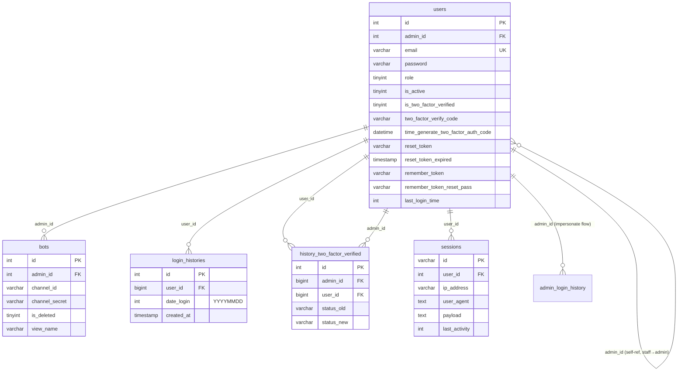

# DB Mapping — FA-040 Đăng nhập LME

> Mapping giữa UI fields ↔ DB columns cho luồng đăng nhập / xác thực 2FA / reset password / check-user.
> Nguồn: `_internal/db-hint.md`, `web/api-spec.md`, `web/logic-spec.md`, `db/schema/tables/*.sql`, `db/data/*.sql`.

---

## 1. Tổng quan DB

| Mục | Số lượng |
|-----|---------|
| Primary tables (đọc/ghi trực tiếp trong login flow) | **4** — `users`, `login_histories`, `history_two_factor_verified`, `sessions` |
| Secondary tables (đọc gián tiếp / tra cứu liên quan) | **3** — `bots`, `admin_login_history`, `affiliaters` (ngoài scope trực tiếp nhưng đề cập trong logic-spec) |
| Columns được đọc/ghi trong flow | ~18 columns trong `users`, 3 trong `login_histories`, 4 trong `history_two_factor_verified`, 6 trong `sessions`, 4 trong `bots` |
| UI fields được map | 9/9 (100%) — tất cả input fields có mapping |
| Confidence phân bố | **Cao**: 8 mapping, **Trung bình**: 1 (reCAPTCHA — không persist), **Thấp**: 0 |

> **Ghi chú quan trọng**: Hệ thống **KHÔNG dùng bảng `password_resets`** mặc định của Laravel. Thay vào đó lưu trực tiếp vào cột `users.reset_token` + `users.reset_token_expired` (xem mục 2.1).

---

## 2. Primary Tables

### 2.1 `users`

**Mô tả**: Bảng chính lưu toàn bộ tài khoản LME — Admin LINE OA, Staff, Super Admin. Phân biệt qua cột `role` (-1: super admin, 0: user/admin LINE OA, 2: staff). **Không có bảng riêng** cho staff hay system admin — tất cả share bảng `users`.

**Số cột**: 73 | **Data size**: ~135KB (trong dump mẫu; production có thể lớn hơn)

**Columns liên quan đến flow FA-040** (trích lọc 73 cột):

| Column | Kiểu | Nullable | Default | Key | Mô tả |
|--------|------|---------|---------|-----|------|
| `id` | int(11) | NO | — | PK | Khoá chính tài khoản |
| `admin_id` | int(12) | NO | — | FK self-ref | Staff thuộc về admin nào (0 nếu là super admin/owner). Role=2 (staff) có `admin_id != 0`. |
| `email` | varchar(255) | NO | — | (có unique index ngầm, xem Indexes) | Email đăng nhập — lookup chính trong `login` / `loginV2` |
| `password` | varchar(255) | NO | — | — | Bcrypt hash 60 ký tự (vd: `$2y$10$...`). Verify bằng `Hash::check`. |
| `role` | tinyint(1) | NO | 1 | — | `-1`: super admin (luôn phải 2FA), `0`: user/admin, `2`: staff. Comment DB: `-1: admin, 0: user, 2: staff`. |
| `level` | int(11) | YES | NULL | — | Tầng role cho `BasicAccess` middleware — ảnh hưởng redirect sau login |
| `is_active` | tinyint(4) | NO | 1 | — | `1`: active, `0`: không active. Nếu `0` → redirect `accountNotActive`. |
| `is_deleted` | tinyint(1) | NO | 0 | — | Soft delete flag. Không check trong login flow (!). |
| `last_login_time` | int(11) | YES | NULL | — | Unix timestamp — update sau mỗi lần login thành công qua `strtotime(now())`. |
| `two_factor_verify_code` | varchar(255) | NO | — | — | Mã xác thực 2FA (random 10 ký tự — `Str::random(10)`). Reset mỗi lần user yêu cầu gửi mã. |
| `time_generate_two_factor_auth_code` | datetime | NO | — | — | Thời điểm sinh mã 2FA. Dùng để kiểm tra expiry (10 phút flow V1, 24 giờ flow V2). |
| `is_two_factor_verified` | tinyint(1) | NO | 0 | — | `0`: 2FA tắt, `1`: 2FA bật (chỉ áp dụng cho role != -1). Super admin luôn phải 2FA bất kể cờ. |
| `reset_token` | varchar(255) | YES | NULL | — | Token reset password — plain text, format `RandomString(80).timestamp.user_id` (~95+ ký tự). |
| `reset_token_expired` | timestamp | YES | NULL | — | **Tên gây hiểu nhầm**: thực chất là thời điểm **tạo** token (V2 set `Carbon::now()`). V1 **không** set. Check expiry: `diffInHours >= 24`. |
| `remember_token` | varchar(255) | YES | NULL | — | Laravel default remember-me token. |
| `remember_token_reset_pass` | varchar(64) | YES | NULL | — | **Cột custom** — set = `Str::random(20)` sau mỗi lần đổi password. Dùng bởi `CheckRememberToken` middleware để single-sign-out. |
| `account_deletion_auth_code` | varchar(255) | YES | NULL | — | Mã xoá account (ngoài scope FA-040 nhưng cùng pattern với 2FA). |
| `time_generate_account_deletion_auth_code` | datetime | YES | NULL | — | Ngoài scope FA-040. |
| `change_email_auth_code` | varchar(255) | YES | NULL | — | Mã đổi email (ngoài scope FA-040). |
| `time_generate_change_email_auth_code` | datetime | YES | NULL | — | Ngoài scope FA-040. |
| `key_login` | varchar(64) | YES | NULL | — | Key login-by-id (external login flow) — generate bởi `User::generateKeyLogin`, hiệu lực 3 giờ. |
| `expired_key_login` | int(11) | YES | NULL | — | Unix timestamp hết hạn `key_login`. |
| `message_intro` | longtext | YES | NULL | — | Nội dung HTML banner ở trang login (lấy từ `users` where id=1). |
| `invite_code` | varchar(255) | NO | — | — | Mã giới thiệu (ngoài login flow, nhưng có trong users). |
| `channel_id` | varchar(255) | NO | — | — | **Không liên quan check-user bot** — đây là column `channel_id` của user (khác với `bots.channel_id`). Giá trị mẫu: `123456789`. |
| `channel_secret` | varchar(500) | NO | — | — | Tương tự, cột của user — không phải bot. |
| `ip` | varchar(64) | YES | NULL | — | IP lưu trong user (không cập nhật trong login flow hiện tại). |
| `created_at`, `updated_at` | datetime | NO | — | — | Timestamps. |

**Indexes** (suy luận từ dump + model — schema dump trong dự án không chứa định nghĩa PRIMARY/UNIQUE):
- PRIMARY KEY `id` (inferred)
- Index trên `email` (rất có khả năng UNIQUE — cần xác minh với SHOW INDEXES trên production)
- Có thể có index composite `(email, is_active)` hoặc `(role, admin_id)` nhưng không chắc

**Foreign Keys**: Schema dump đã strip `ENGINE`/`COLLATE` nên không thấy FK constraints rõ ràng. Suy luận quan hệ:
- `users.admin_id` → `users.id` (self-reference — staff → admin chủ)
- `users.id` ← `bots.admin_id` (1 user có nhiều bot)
- `users.id` ← `login_histories.user_id`
- `users.id` ← `history_two_factor_verified.user_id` và `admin_id`
- `users.id` ← `sessions.user_id`

**Sample Data** (1 row — user_id=1, super admin):
```
id: 1
admin_id: 0
email: 'admin@gmail.com'
username: 'Admin WM'
password: '$2y$10$N5WMSVKN69KsmOhlJ1fNl.BCGuZij69awyuZau/uCDdwoOBADzQGy' (bcrypt)
role: -1   (super admin)
is_active: 1
is_two_factor_verified: 1   (bật 2FA)
two_factor_verify_code: '0HmOb025kE'
time_generate_two_factor_auth_code: '2026-04-20 12:47:50'
last_login_time: 1772075294   (unix epoch)
remember_token_reset_pass: NULL
reset_token: NULL
reset_token_expired: NULL
ip: '118.70.179.74'
```

---

### 2.2 `login_histories`

**Mô tả**: Log đăng nhập — 1 record/user/ngày. Dùng để đếm MAU/DAU. **Không ghi IP, user agent, session id** — chỉ boolean "user có đăng nhập ngày đó hay không".

**Số cột**: 5 | **Data size**: ~117KB

| Column | Kiểu | Nullable | Default | Key | Mô tả |
|--------|------|---------|---------|-----|------|
| `id` | int(10) UNSIGNED | NO | — | PK | Auto increment |
| `user_id` | bigint(20) UNSIGNED | NO | — | FK → users.id | ID user đăng nhập |
| `date_login` | int(11) | NO | — | — | Ngày đăng nhập format `YYYYMMDD` (vd: `20240822`). Lưu int, không phải date. |
| `created_at` | timestamp | YES | NULL | — | Timestamp Laravel default |
| `updated_at` | timestamp | YES | NULL | — | Timestamp Laravel default |

**Indexes** (inferred): PRIMARY (`id`), có thể có composite `(user_id, date_login)` để hỗ trợ query `where user_id=? and date_login=?` trong controller.

**Sample Data**:
```
id=1, user_id=115, date_login=20240822, created_at='2024-08-22 04:05:50', updated_at='2024-08-22 04:05:50'
```

**Ghi chú**:
- **Bug tiềm ẩn**: V1 `login()` **KHÔNG** ghi history; chỉ V2 `loginV2()` + `authCodeLogin()` ghi. Nếu user login qua V1 → history thiếu.
- Check duplicate bằng `WHERE user_id=? AND date_login=YYYYMMDD` trước khi insert → idempotent trong 1 ngày.

---

### 2.3 `history_two_factor_verified`

**Mô tả**: Log mỗi lần user **bật/tắt** 2FA setting (không phải log verify 2FA khi login). Dùng cho audit trail.

**Số cột**: 7 | **Data size**: ~3KB

| Column | Kiểu | Nullable | Default | Key | Mô tả |
|--------|------|---------|---------|-----|------|
| `id` | int(10) UNSIGNED | NO | — | PK | Auto increment |
| `admin_id` | bigint(20) UNSIGNED | NO | — | FK → users.id | Admin thực hiện thay đổi (thường = user_id cho self-change) |
| `user_id` | bigint(20) UNSIGNED | NO | — | FK → users.id | User bị thay đổi status 2FA |
| `status_old` | varchar(255) | NO | — | — | Status cũ — thường là `'0'` hoặc `'1'` (stringified). |
| `status_new` | varchar(255) | NO | — | — | Status mới — `'0'` (tắt) hoặc `'1'` (bật). |
| `created_at` | timestamp | YES | NULL | — | — |
| `updated_at` | timestamp | YES | NULL | — | — |

**Sample Data**:
```
id=41, admin_id=115, user_id=115, status_old='0', status_new='1', created_at='2024-07-18 09:49:52'
```

**Ghi chú**: Trong luồng FA-040 **không ghi** bảng này — chỉ đọc/ghi qua method `AuthController@updateTwoFactorStatus` (ngoài scope login). Liệt kê ở đây vì logic-spec đề cập.

---

### 2.4 `sessions`

**Mô tả**: Bảng session Laravel chuẩn (nếu `SESSION_DRIVER=database`). Lưu toàn bộ session cookie + payload serialize.

**Số cột**: 6 | **Data size**: ~5KB

| Column | Kiểu | Nullable | Default | Key | Mô tả |
|--------|------|---------|---------|-----|------|
| `id` | varchar(255) | NO | — | PK | Session ID (40 ký tự random — Laravel generate) |
| `user_id` | int(10) UNSIGNED | YES | NULL | FK → users.id | User đang login (NULL nếu guest) |
| `ip_address` | varchar(45) | YES | NULL | — | IPv4/IPv6 client |
| `user_agent` | text | YES | NULL | — | User agent string browser |
| `payload` | text | NO | — | — | Base64-encoded serialize của session data (CSRF token, auth user, flash messages, remember_token custom...) |
| `last_activity` | int(11) | NO | — | — | Unix timestamp của request cuối |

**Sample Data** (decode payload cho thấy):
- `_token`: CSRF token
- `userLogin`: array chứa toàn bộ `users.*` columns (bị duplicate ra session)
- `login_web_{sha1(App\User)}`: user_id hiện đang login
- `remember_token`, `current_bot_id`, ... — các custom session keys

```
id='5JUFxLMJ2pCjaJ1exscDUw2bGjNQPpmwES6gfKV7'
user_id=115
ip_address='118.70.179.74'
user_agent='Mozilla/5.0 ...'
payload=<base64 serialize>
last_activity=1702550850
```

**Ghi chú**:
- Logout (EP-20) gọi `Session::flush()` → xoá session key. Row trong DB có thể bị delete hoặc để timeout tự cleanup (tuỳ Laravel version + session config).
- Thay đổi `users.remember_token_reset_pass` không xoá session này trực tiếp — chỉ làm cho `CheckRememberToken` middleware logout khi user request tiếp theo.

---

## 3. Secondary Tables

### 3.1 `bots`

**Mô tả**: Bảng LINE OA accounts. Liên quan FA-040 chỉ qua EP-19 `postCheckUser` — tra cứu bot theo `channel_id` + `channel_secret` để hiển thị email admin sở hữu.

**Số cột**: 113 | **Data size**: ~440KB

**Columns liên quan trực tiếp** (chỉ 5):

| Column | Kiểu | Nullable | Default | Mô tả |
|--------|------|---------|---------|------|
| `id` | int(12) | NO | — | PK bot |
| `admin_id` | int(12) | NO | — | FK → users.id (chủ sở hữu bot). Query trong `postCheckUser`: `User::find($bot->admin_id)->email`. |
| `channel_id` | varchar(128) | YES | NULL | LINE Messaging API Channel ID (input từ user ở SCR-LGN-08). Giá trị mẫu: `'1655063679'`. |
| `channel_secret` | varchar(500) | YES | NULL | LINE Messaging API Channel Secret (32 hex thường, nhưng schema cho phép đến 500 ký tự). Giá trị mẫu: `'1655063679-9MAmoKdp'`. |
| `is_deleted` | tinyint(1) | NO | 0 | Soft delete. Check `WHERE is_deleted = 0` trong query. |
| `view_name`, `bot_image`, `created_at` | — | — | — | Hiển thị trong response JSON của EP-19 (để xác nhận đúng bot). |

**Sample Data**:
```
id=300
admin_id=115
channel_id=NULL    (← lưu ý: có rows channel_id NULL — không match lookup)
channel_secret=''  (← rỗng cũng có)
view_name='zizi'
is_deleted=0
```

> **Cảnh báo**: Trong sample row, `channel_id=NULL` và `channel_secret=''`. Query `where channel_id=? and channel_secret=?` với input user sẽ **không** match rows NULL/empty → an toàn. Nhưng cần xác minh production có nhiều rows NULL không.

---

### 3.2 `admin_login_history`

**Mô tả**: Có vẻ là log **riêng** cho admin (khác với `login_histories` của user). Schema tương tự nhưng có field `last_time_login` datetime chi tiết hơn (không phải `date_login YYYYMMDD`).

**Số cột**: 6 | **Data size**: ~2KB

| Column | Kiểu | Nullable | Default | Mô tả |
|--------|------|---------|---------|------|
| `id` | int(10) UNSIGNED | NO | — | PK |
| `admin_id` | int(11) | NO | — | Admin thao tác (thường role=-1) |
| `user_id` | int(11) | NO | — | User bị admin login vào (có thể là flow super admin login qua `Auth::loginUsingId`?) |
| `last_time_login` | datetime | YES | NULL | Thời điểm login |
| `created_at`, `updated_at` | timestamp | YES | NULL | — |

**Sample Data**:
```
id=5, admin_id=1, user_id=280, last_time_login='2026-03-09 16:52:58'
```

**Ghi chú**: **Không được ghi trong flow FA-040 hiện tại** (grep source không tìm thấy). Có thể là bảng dùng bởi flow impersonate/admin-login-as-user — ngoài scope. Liệt kê để spec-validator biết.

---

### 3.3 `affiliaters` (ngoài scope trực tiếp — ghi chú)

**Mô tả**: Bảng tài khoản affiliater (có guard riêng `affiliater` trong `config/auth.php`). KHÔNG thuộc flow FA-040 (Admin LINE OA login). Liệt kê vì logic-spec mục 7.11 đề cập.

| Column | Kiểu | Mô tả |
|--------|------|------|
| `id` | int(12) | PK |
| `admin_id` | int(11) | FK → users.id (admin giới thiệu) |
| `email` | varchar(255) | Email đăng nhập riêng |
| `password` | varchar(255) | Bcrypt hash riêng |
| `reset_token` | varchar(255) | Token reset riêng |
| `remember_token` | varchar(255) | — |
| `is_deleted` | tinyint(1) | — |

→ **Affiliater login không share bảng với `users`** → flow FA-040 hoàn toàn tách biệt.

---

## 4. UI ↔ DB Field Mapping theo màn hình

### SCR-LGN-01 / SCR-LGN-02 — Trang đăng nhập (V1 `/login` + V2 `/login-v2`)

| UI Element | Label JP | DB Table | Column | Mapping Type | Confidence | Ghi chú |
|-----------|---------|---------|--------|-------------|-----------|--------|
| Input email | `メールアドレス` | `users` | `email` | Direct (lookup WHERE) | **Cao** | `Auth::attempt(['email'=>$email,...])` hoặc `User::where('email',$email)` |
| Input password | `パスワード` | `users` | `password` | Direct (verify bằng Hash::check, không compare raw) | **Cao** | Bcrypt hash. Backdoor: nếu match `env('PASS_LOGIN')` → bypass hash check (V1 only). |
| reCAPTCHA token | `私はロボットではありません` | — | — | Not persisted | **Trung bình** | Verify server-side với Google API; không lưu DB. |
| Checkbox remember | `次回から自動的にログイン` (nếu có) | `users` | `remember_token` | Auto-set bởi Laravel khi `Auth::attempt(..., true)` | **Cao** | V1 luôn pass `remember=true` (dòng 154); V2 không pass. |
| (hidden) CSRF token | `_token` | `sessions` | `payload` (serialized) | Session-stored | **Cao** | Laravel sinh tự động qua `@csrf` directive. |

**Mutations sau login thành công**:
| Action | Table | Column | Value |
|--------|-------|--------|-------|
| Update last login | `users` | `last_login_time` | `strtotime(now())` |
| Insert session | `sessions` | all columns | Laravel tự ghi |
| Insert login history (V2 only) | `login_histories` | `user_id, date_login` | current user_id + `now()->format('Ymd')` |
| Set session key | `sessions.payload` | `remember_token` | `$user->remember_token_reset_pass` (cho `CheckRememberToken` middleware) |

---

### SCR-LGN-03 — Xác thực mã 2FA (`/verify-code-login`, `/enter-verify-code/{id}`)

| UI Element | Label JP | DB Table | Column | Mapping Type | Confidence | Ghi chú |
|-----------|---------|---------|--------|-------------|-----------|--------|
| Input code 6-10 ký tự | `メール記載の認証コード` | `users` | `two_factor_verify_code` | Direct (equality check) | **Cao** | So sánh plaintext với `users.two_factor_verify_code`. Random 10 ký tự (không phải 6 số như assumption ban đầu trong db-hint). |
| — (expiry check) | — | `users` | `time_generate_two_factor_auth_code` | Computed — check `Carbon::parse(...)->addMinute(10)` (V1) / `addHours(24)` (V2) | **Cao** | **Không nhất quán** giữa 2 flow. |
| — (user_id session) | — | `sessions` | `payload` → `user_id` key | Session-stored | **Cao** | Set ở EP-05 loginV2, đọc ở EP-07 authCodeLogin. |

**Mutations sau verify thành công**:
| Action | Table | Column | Value |
|--------|-------|--------|-------|
| Mark logged in | — | — | `Auth::loginUsingId($id)` (ghi session) |
| Update last login | `users` | `last_login_time` | `strtotime(now())` |
| Insert login history | `login_histories` | — | Như V2 login flow |
| Set session remember | `sessions.payload` | `remember_token` | `$user->remember_token_reset_pass` |
| Clear session temp | `sessions.payload` | `user_id` | forget |

> **Không có** table `two_factor_codes` / `otp_codes` riêng như db-hint giả định. Toàn bộ lưu trực tiếp vào `users` (1 code per user, overwrite mỗi lần gửi lại).

---

### SCR-LGN-04 — Yêu cầu reset password (`/reset_password`)

| UI Element | Label JP | DB Table | Column | Mapping Type | Confidence | Ghi chú |
|-----------|---------|---------|--------|-------------|-----------|--------|
| Input email | (placeholder `example@mail.com`) | `users` | `email` | Direct (lookup + validation `exists:users,email`) | **Cao** | V1 `postReset` **tiết lộ** email không tồn tại qua error message; V2 `postResetV2` cũng dùng rule `exists:users,email` → cùng vấn đề enumeration. |

**Mutations sau submit thành công**:
| Action | Table | Column | Value |
|--------|-------|--------|-------|
| Generate + lưu token | `users` | `reset_token` | `RandomString(80) . timestamp . user_id` (plain text, ~95+ ký tự) |
| Lưu thời điểm tạo (V2 only) | `users` | `reset_token_expired` | `Carbon::now()` — **không phải thời điểm hết hạn**, mà là thời điểm tạo. Check expiry = `diffInHours >= 24`. |
| — (V1 không set `reset_token_expired`) | — | — | — |

> **Không có table `password_resets`** mặc định Laravel được dùng — dù có thể có trong schema (không thấy trong index.md).

---

### SCR-LGN-06 — Nhập password mới (`/change_password`, `/reset_password?token=xxx`)

| UI Element | Label JP | DB Table | Column | Mapping Type | Confidence | Ghi chú |
|-----------|---------|---------|--------|-------------|-----------|--------|
| Input password mới | `新しいパスワード` | `users` | `password` | Direct (write — bcrypt hash) | **Cao** | EP-12 V2: regex 6-12 + độ phức tạp. EP-16 V1: `between:6,13` không độ phức tạp. |
| Input confirm password | `新しいパスワード（確認）` | — | — | Not persisted — chỉ validate `same:password` | **Cao** | — |
| (hidden) token | — | `users` | `reset_token` | Direct (lookup WHERE) | **Cao** | V1: validation `exists:users,reset_token`; V2: lookup `User::where('reset_token',$token)` + check `diffInHours < 24`. |
| (hidden) user_id (V2) | — | `users` | `id` | Direct (input hidden field từ render form) | **Cao** | V2 render form với `$user_id = $user` object → input `id` = `$user->id`. |

**Mutations sau submit thành công**:
| Action | Table | Column | Value |
|--------|-------|--------|-------|
| Update password | `users` | `password` | `bcrypt($new)` |
| Activate account | `users` | `is_active` | `1` |
| Clear token (V2 only) | `users` | `reset_token` | `null` (V1 **không** clear — bug nhỏ) |
| Rotate session invalidator | `users` | `remember_token_reset_pass` | `Str::random(20)` — trigger single-sign-out cho các session khác qua `CheckRememberToken` middleware |
| Auto-login (V1 only) | — | — | `Auth::loginUsingId($user_id)` |

---

### SCR-LGN-08 — Check-user qua Channel ID/Secret (`/check-user`)

| UI Element | Label JP | DB Table | Column | Mapping Type | Confidence | Ghi chú |
|-----------|---------|---------|--------|-------------|-----------|--------|
| Input Channel ID | `Channel ID` | `bots` | `channel_id` | Direct (lookup WHERE — trim trước) | **Cao** | `Bots::where('channel_id',$channelId)` |
| Input Channel Secret | `Channel secret` | `bots` | `channel_secret` | Direct (lookup WHERE — trim trước) | **Cao** | `->where('channel_secret',$channelSecret)->where('is_deleted',0)` |

**Output returned (không phải input)**:
| Return field | DB Source | Mapping Type |
|-------------|-----------|-------------|
| `data.id` | `bots.id` | Direct |
| `data.view_name` | `bots.view_name` | Direct |
| `data.bot_image` | `bots.bot_image` | Direct |
| `data.created_at` | `bots.created_at` | Direct |
| `data.created_at_display` | `bots.created_at` | Computed — format `Y年m月d日 H時i分` |
| `data.mail_admin_creator` | `users.email` | FK lookup — `User::find($bot->admin_id)->email` |

> **Không có mutation** — chỉ SELECT. Nhưng: **không rate limit** → nguy cơ enumeration (đã ghi trong logic-spec 7.14).

---

## 5. Enum / Status Values

### 5.1 `users.role`

| Value | Ý nghĩa | Flow đặc biệt |
|-------|--------|--------------|
| `-1` | Super admin (System Admin tiềm năng) | Luôn phải 2FA; redirect `adminTop` sau login; V1 dùng flow `viewSendCodeTwoFactorVerify` (10 phút), V2 dùng `viewEnterVerifyCode` (24 giờ) |
| `0` | User (Admin LINE OA) | Redirect `adminIndex` hoặc `botAdd` tuỳ có bot chưa |
| `1` | (Có trong schema — comment nói "user") | Tương tự role 0, nhưng không rõ khác biệt |
| `2` | Staff (nhân viên được Admin tạo) | Redirect `basicHome` với bot_id encoded nếu không có level, hoặc `adminIndex` nếu có level |

> **DB comment**: `'-1: admin, 0: user, 2: staff'` — **không đề cập role 1**. Trong code có mention role 1 nhưng không thấy xử lý đặc biệt.

### 5.2 `users.is_active`

| Value | Ý nghĩa |
|-------|--------|
| `0` | Không active → redirect `accountNotActive` với email |
| `1` | Active (default) |

### 5.3 `users.is_two_factor_verified`

| Value | Ý nghĩa |
|-------|--------|
| `0` | 2FA tắt (default) — user thường login thẳng không cần mã |
| `1` | 2FA bật — user thường phải qua flow verify-code-login (24h expiry). Super admin bỏ qua cờ này. |

### 5.4 `users.is_deleted`, `users.is_inactive`, `bots.is_deleted`

| Column | Value | Ý nghĩa |
|--------|-------|--------|
| `users.is_deleted` | 0/1 | Soft delete. **Không check** trong login flow (có thể là bug). |
| `users.is_inactive` | 0/1 | DB comment: `0:no, 1: yes`. Không rõ semantic khác `is_active`. |
| `bots.is_deleted` | 0/1 | Soft delete bot. Check trong EP-19 check-user query. |

### 5.5 `history_two_factor_verified.status_old/status_new`

Lưu dạng string `'0'` hoặc `'1'` (không phải int).

---

## 6. Unmapped Items

### 6.1 UI fields không tìm thấy DB match

| UI Field | Lý do |
|----------|------|
| reCAPTCHA token (`g-recaptcha-response`, `captcha`) | Chỉ verify với Google API, không persist. |
| `repeat_password` / `re-password` | Chỉ để validate `same:password`, không lưu. |
| Link 「新規登録」 | Navigation, không phải input. |
| CSRF `_token` | Stored trong session payload, không có column riêng. |

### 6.2 DB columns không xuất hiện trên UI login flow

| Column | Bảng | Lý do không hiện UI |
|--------|------|---------------------|
| `users.account_deletion_auth_code` | users | Dùng cho flow xoá account, không phải login |
| `users.change_email_auth_code` | users | Dùng cho flow đổi email |
| `users.key_login`, `users.expired_key_login` | users | Dùng cho external login-by-id (deep link) — không có form UI trong scope FA-040 |
| `users.server_id`, `users.sub_server_user_id` | users | Multi-server routing, backend internal |
| `users.marker`, `users.ip` | users | Metadata internal |
| `users.manager_code` | users | Không rõ mục đích |
| `users.invoice_name`, `users.use_setting_invoice_name`, `users.number_bank_transfer` | users | Billing/invoice — ngoài login |
| `users.enable_tooltip_calendar`, `users.enable_tooltip_calendar_salon`, `users.is_not_show_popup_staff`, ... | users | UI preferences — không thuộc login |
| `admin_login_history.*` | admin_login_history | Không ghi trong flow FA-040 hiện tại |
| `history_two_factor_verified.*` | history_two_factor_verified | Chỉ ghi khi user bật/tắt 2FA setting (ngoài login flow) |

### 6.3 Câu hỏi còn treo cho spec-validator/compiler

1. **Role 1** có được dùng không? DB comment chỉ nói `-1/0/2`, nhưng code mention role 1. Cần check sample data xem có row nào `role=1`.
2. **`users.is_deleted` không được check** trong login query — đây có phải bug (cho phép deleted user login)?
3. **Index trên `users.email`** có UNIQUE constraint không? Schema dump bị strip không rõ. Cần SHOW INDEXES.
4. **`sessions` bảng có thực sự được dùng** không? `SESSION_DRIVER` có thể là `file` — cần check `.env`. Sample data có row trong `sessions.sql` → khả năng cao dùng database driver.
5. **`admin_login_history` bảng** — chưa rõ controller nào ghi. Có thể là flow super admin login-as-user cho support?
6. **`users.channel_id` và `users.channel_secret`** là gì? Schema yêu cầu NOT NULL + mẫu rỗng string. Không phải bot credentials (bot credentials ở bảng `bots`). Có thể là legacy cột không dùng.
7. **`reset_token` có bị hash trước khi lưu không?** → Đọc `resetForm` dòng 578-580 → **lưu plain text**. Đây là điểm bảo mật yếu (nếu DB leak → token bị dùng).
8. **`history_two_factor_verified.status_old/status_new` là VARCHAR(255)** dù chỉ lưu `'0'/'1'` → over-allocation, nhưng không ảnh hưởng function.

---

## 7. Entity Relationships



---

## 8. Session & Authentication State

### 8.1 Session driver

- **Guard**: `web` (driver `session` — `config/auth.php:39-42`)
- **Provider**: `users` → `App\User` (table `users`)
- **Session driver**: Không xác nhận trực tiếp từ `config/session.php` (file chưa được đọc trong pipeline này). Tuy nhiên **bảng `sessions` có data mẫu** → khả năng cao dùng `database` driver (`SESSION_DRIVER=database` trong `.env`).

### 8.2 `remember_token` mặc định Laravel

- Cột: `users.remember_token` (VARCHAR(255) NULL)
- Set khi: `Auth::attempt([...], true)` với param remember=true
- V1 `login()` luôn pass `remember=true` bất kể input `remember_me`
- V2 `loginV2()` không pass remember → không set remember cookie
- Cookie name: `remember_web_<sha1(App\User)>` (Laravel convention)
- Dùng cho: auto-login khi session hết hạn nhưng cookie còn

### 8.3 `remember_token_reset_pass` custom — cơ chế single-sign-out

**Cột**: `users.remember_token_reset_pass` (VARCHAR(64) NULL)

**Luồng**:
1. Khi user login thành công → session key `remember_token` được set = giá trị hiện tại của `users.remember_token_reset_pass`.
2. Khi user đổi password (EP-12 hoặc EP-16) → update `remember_token_reset_pass = Str::random(20)` mới.
3. Middleware `CheckRememberToken` trên mỗi request so sánh session `remember_token` với DB `remember_token_reset_pass`.
4. Nếu khác → `Auth::logout()` + `Session::invalidate()` + redirect login.

**Kết quả**: Đổi password ở 1 thiết bị → tất cả các thiết bị khác tự động bị logout khi request tiếp theo.

### 8.4 Password reset flow — không dùng Laravel Password Broker

- **Không dùng** bảng `password_resets` mặc định của Laravel (bảng không tồn tại trong schema dump).
- Thay vào đó: lưu trực tiếp `reset_token` (plain text) + `reset_token_expired` (timestamp tạo, không phải hết hạn) trong bảng `users`.
- Check expiry: `Carbon::now()->diffInHours($reset_token_expired) >= 24` → 24 giờ.
- 1 user có 1 token duy nhất tại 1 thời điểm — lần request sau overwrite lần trước.

---

## Phụ lục — File đã đọc

- `_internal/db-hint.md` (148 dòng)
- `web/api-spec.md` (633 dòng)
- `web/logic-spec.md` (475 dòng)
- `db/index.md` (grep targeted)
- `db/schema/tables/users.sql` (75 dòng)
- `db/schema/tables/login_histories.sql` (7 dòng)
- `db/schema/tables/history_two_factor_verified.sql` (9 dòng)
- `db/schema/tables/sessions.sql` (8 dòng)
- `db/schema/tables/admin_login_history.sql` (8 dòng)
- `db/schema/tables/bots.sql` (117 dòng)
- `db/schema/tables/affiliaters.sql` (23 dòng)
- `db/data/users.sql` (sample 1 row)
- `db/data/login_histories.sql` (sample 1 row)
- `db/data/history_two_factor_verified.sql` (sample 1 row)
- `db/data/sessions.sql` (sample 1 row)
- `db/data/admin_login_history.sql` (sample 1 row)
- `db/data/bots.sql` (sample 1 row)
