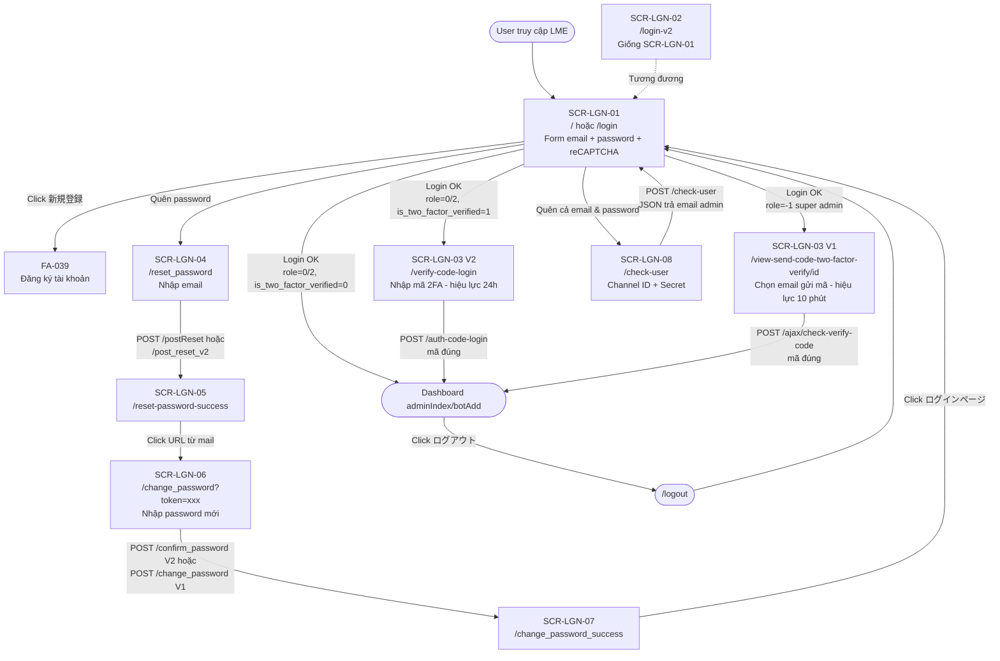
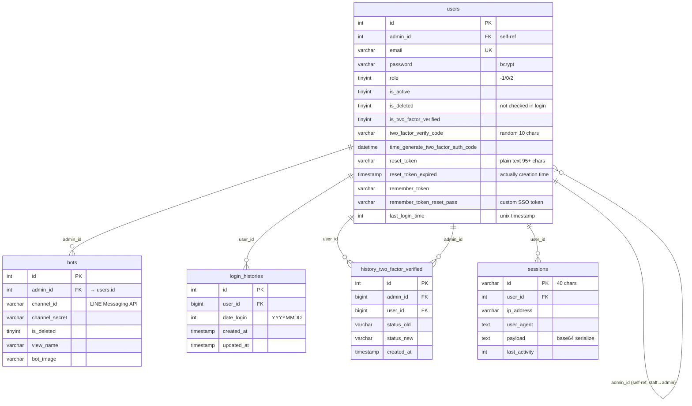

# FA-040 — Đăng nhập LME 「ログイン」

> **Feature Spec tổng hợp** — tài liệu chính của tính năng đăng nhập LME. Tổng hợp từ UI, API, Business Logic, DB mapping và Validation report.
>
> **File chi tiết tham khảo**:
> - [UI spec](ui/ui-spec.md) — 8 màn hình, flow diagram, observations
> - [API spec](web/api-spec.md) — 27 endpoints chi tiết request/response
> - [Logic spec](web/logic-spec.md) — controllers, models, middleware, business rules
> - [DB mapping](db/db-mapping.md) — mapping UI ↔ DB, ER diagram, sample data
> - [Validation report](_internal/validation-report.md) — kiểm tra chéo, các vấn đề phát hiện

---

## 1. Thông tin tổng quan

| Hạng mục | Giá trị |
|----------|---------|
| **Mã tính năng** | **FA-040** |
| **Tên tiếng Việt** | Đăng nhập LME |
| **Tên tiếng Nhật** | 「ログイン」 |
| **Phân loại** | Quản lý hệ thống / Xác thực (Authentication) |
| **Domain** | `https://form.watermeru.com` (subdomain của `lme.jp`) |
| **Portal** | Dùng chung cho Admin LINE OA, Staff, Super Admin |
| **Ngày spec** | 2026-04-21 |

### 1.1 Mục đích

Cung cấp cơ chế xác thực (authentication) cho **tất cả các actor** truy cập hệ thống LME — bao gồm đăng nhập bằng email/password, xác thực 2 bước qua email (2FA), phục hồi mật khẩu, và tra cứu email đăng ký qua Channel ID/Secret của LINE Official Account.

### 1.2 Actors

| Actor | Mô tả | Flow tương ứng |
|-------|-------|----------------|
| **Admin LINE OA** (`users.role = 0`) | Doanh nghiệp/chủ LINE Official Account đăng nhập portal quản lý | Login V1/V2, 2FA (nếu bật), forgot password |
| **Staff** (`users.role = 2`) | Nhân viên do Admin tạo, phân quyền theo `level` | Login cùng form, redirect theo `level` / `bot_id` |
| **Super Admin** (`users.role = -1`) | Quản trị toàn hệ thống | **Luôn luôn** phải qua 2FA (bất kể cờ `is_two_factor_verified`) |
| **Affiliater** | User trong bảng `affiliaters` — có guard `affiliater` và flow riêng (`/affiliate/login`) | **Ngoài scope FA-040** — tham khảo cho context, không thuộc AuthController |
| **Guest** (chưa đăng nhập) | Truy cập các trang công khai login/reset/check-user/register | SCR-LGN-01..08 |

> **Ghi chú**: Hệ thống **KHÔNG có bảng riêng** cho Staff hay System Admin — tất cả chia sẻ bảng `users`, phân biệt bằng cột `role` và `admin_id`.

### 1.3 Phạm vi

**Thuộc scope FA-040** (user đã xác nhận):
- Trang đăng nhập chính + V2 (SCR-LGN-01, SCR-LGN-02)
- Xác thực 2 bước qua email (SCR-LGN-03)
- Phục hồi mật khẩu (SCR-LGN-04 → SCR-LGN-07)
- Tra cứu email qua Channel ID/Secret (SCR-LGN-08)
- Logout
- LINE OAuth callback (`/line/callback/*`) — **document nhưng ngoài scope chính** vì thực chất là flow QR follow + add tag, không phải entry login portal LME

**Không thuộc scope FA-040**:
- Đăng ký tài khoản mới → **FA-039** 「公開新規アカウント登録」
- Cài đặt 2FA (bật/tắt trong settings) → **FA-037** 「ログイン時の二段階認証」
- Affiliater login flow (`/affiliate/login`, `/aff/v2/login`) — có guard riêng

---

## 2. Các màn hình

| Mã | Màn hình | Tên JP | URL | Endpoint submit |
|----|----------|--------|-----|-----------------|
| **SCR-LGN-01** | Đăng nhập chính | 「ログイン」 | `/` và `/login` | POST `/login` (EP-03) |
| **SCR-LGN-02** | Đăng nhập V2 (AJAX) | 「ログイン」 | `/login-v2` | POST `/login-v2` (EP-05) |
| **SCR-LGN-03** | Xác thực mã 2FA | 「ログイン - 認証コード」 | `/verify-code-login`, `/enter-verify-code/{id}` | POST `/auth-code-login` (EP-07) hoặc POST `/ajax/check-verify-code` (EP-24) |
| **SCR-LGN-04** | Yêu cầu reset password | 「パスワード再設定用メール送信」 | `/reset_password` (không token) | POST `/postReset` (V1 EP-10) hoặc POST `/post_reset_v2` (V2 EP-11) |
| **SCR-LGN-05** | Xác nhận đã gửi mail reset | — | `/reset-password-success` | — (purely informational) |
| **SCR-LGN-06** | Nhập password mới | 「パスワード再設定」 | `/change_password` (V1) hoặc `/reset_password?token=xxx` (V2) | POST `/change_password` (V1 EP-16) hoặc POST `/confirm_password` (V2 EP-12) |
| **SCR-LGN-07** | Xác nhận reset password thành công | — | `/change_password_success` | — (purely informational) |
| **SCR-LGN-08** | Xác nhận tài khoản qua Channel ID/Secret | 「エルメ登録アカウントの確認」 | `/check-user` | POST `/check-user` (EP-19) |

> **Ghi chú quan trọng về SCR-LGN-04**: UI spec ban đầu ghi nhầm submit endpoint là `POST /confirm_password`. Thực tế:
> - **V1** submit email reset → `POST /postReset` (EP-10)
> - **V2** submit email reset → `POST /post_reset_v2` (EP-11)
> - `POST /confirm_password` (EP-12) là submit password mới của SCR-LGN-06 V2.
>
> Đây là Issue-1 trong [validation report](_internal/validation-report.md).

### 2.1 Flow diagram tổng quan



---

## 3. Luồng xử lý end-to-end

Format chuẩn: **User action → UI → API endpoint → Business logic → DB tables → Response → UI update**.

### 3.1 Flow — Đăng nhập không 2FA (happy path)

```
User action          Nhập email + password, tick reCAPTCHA, click「ログイン」
        ↓
UI                   SCR-LGN-01 (hoặc SCR-LGN-02 V2)
        ↓
API endpoint         POST /login (V1 EP-03) | POST /login-v2 (V2 EP-05)
                     Payload: email, password, g-recaptcha-response|captcha, remember_me, _token
        ↓
Business logic       1. Validate: required|email, required, required|recaptcha
                        → V1: redirect back với errors
                        → V2: return 422 JSON {errors:{...}}
                     2. Verify reCAPTCHA với Google API (sync)
                     3. Lookup User::where('email',$email)->first()
                     4. Check is_active=1; nếu 0 → redirect accountNotActive
                     5. Verify Hash::check($password, $user->password)
                        → V1 có backdoor: if $password == env('PASS_LOGIN') bypass
                     6. Check is_two_factor_verified:
                        - role=0/2 + cờ=0 → login trực tiếp
                        - role=0/2 + cờ=1 → redirect 2FA (chỉ V2)
                        - role=-1 → luôn 2FA
                     7. Auth::attempt(...) / Auth::loginUsingId(...)
        ↓
DB tables            WRITE users.last_login_time = strtotime(now())
                     WRITE sessions (Laravel auto-create)
                     V2 only: UPSERT login_histories(user_id, date_login=Ymd)
                     V2 only: SET session remember_token = users.remember_token_reset_pass
        ↓
Response             V1: 302 redirect → route('adminIndex')|route('botAdd')|route('adminTop')
                     V2: 200 JSON {"redirect":"/admin/..."}
        ↓
UI update            Browser load dashboard theo role + bot ownership
```

### 3.2 Flow — Đăng nhập có 2FA (V2 user thường)

```
User action          Submit login form như trên
        ↓
Business logic       is_two_factor_verified = 1 phát hiện sau bước verify password
                     → sinh mã random 10 ký tự Str::random(10)
                     → update users.two_factor_verify_code = mã
                     → update users.time_generate_two_factor_auth_code = now()
                     → gửi mail (synchronous) qua MailApiService::sendMailApi
                        POST https://mail2026.watermeru.com/email/add-send
                        Title: 「【L Message】ログイン認証コードのご連絡」
                     → session('user_id') = $user->id
                     → response JSON {"redirect": "/verify-code-login"}
        ↓
UI                   SCR-LGN-03 V2 /verify-code-login — user mở mail, copy mã
        ↓
User action          Paste mã, click「ログイン」 → POST /auth-code-login (EP-07)
        ↓
Business logic       1. user_id = session('user_id')
                     2. User::where('id',$id)->where('two_factor_verify_code',$code)->first()
                     3. Check expiry: time_generate_two_factor_auth_code + 24h > now?
                        → expired → 422 "認証コード期限が切れました..."
                     4. Auth::loginUsingId($id)
                     5. WRITE users.last_login_time
                     6. UPSERT login_histories
                     7. SET session remember_token = users.remember_token_reset_pass
                     8. session()->forget('user_id')
        ↓
Response             200 JSON {"redirect": "/admin/..."}
        ↓
UI update            Browser redirect dashboard
```

**Khác biệt V1 super admin (EP-21/EP-23/EP-24)**:
- Flow redirect sang `/view-send-code-two-factor-verify/{hashId}` → user chọn email nhận mã → AJAX `/ajax/send-code-two-factor-verify` gửi mã qua SMTP custom `ADMIN_MAIL_*` (KHÔNG qua MailApiService) → nhập mã → AJAX `/ajax/check-verify-code`
- **Hiệu lực mã: 10 phút** (khác V2 là 24h — điểm không nhất quán)

### 3.3 Flow — Quên mật khẩu (forgot password)

```
SCR-LGN-01 → click link「パスワードを忘れた場合は こちら」
        ↓
SCR-LGN-04 /reset_password (GET EP-08 không có token → render form nhập email)
        ↓
User nhập email, click「送信する」
        ↓
POST /postReset (V1 EP-10) hoặc /post_reset_v2 (V2 EP-11)
        ↓
Validate: required|email|exists:users,email
   ⚠ Tiết lộ email không tồn tại qua error "メールアドレスが登録されていません。"
        ↓
Generate token = RandomString(80) . timestamp . user_id
WRITE users.reset_token = token (plain text — KHÔNG hash)
V2: WRITE users.reset_token_expired = Carbon::now() (thời điểm tạo, check expire khi dùng)
        ↓
Gửi mail chứa URL /change_password?token=xxx (V1) hoặc /reset_password?token=xxx (V2)
   V1: ResetPassword::resetPassword qua MailApiService
   V2 re-send: ActiveAccount::reSendMailResetPass qua SMTP custom RESEND_MAIL_*
        ↓
Redirect SCR-LGN-05 /reset-password-success
        ↓
User click URL trong mail → SCR-LGN-06 /reset_password?token=xxx (V2) hoặc /change_password (V1)
        ↓
Render form với hidden user_id (V2) hoặc hidden token (V1)
        ↓
User nhập password mới + confirm, click「再設定」
        ↓
V2: POST /confirm_password (EP-12)
   Validate: password regex /^(?=.*[A-Z])(?=.*[a-z])(?=.*\d)(?=.*[\W_]).{6,12}$/
            repeat_password same:password
   Check Hash::check($new, $user->password) — nếu trùng → reject "このパスワードは最近使用されています..."
   WRITE users.password = bcrypt($new)
   WRITE users.is_active = 1
   WRITE users.reset_token = NULL
   WRITE users.remember_token_reset_pass = Str::random(20) ← trigger single-sign-out
V1: POST /change_password (EP-16)
   Validate: token exists:users,reset_token
             password between:6,13 (không yêu cầu phức tạp)
             re-password same:password
   WRITE users.password = bcrypt($new)
   WRITE users.is_active = 1
   WRITE users.remember_token_reset_pass = Str::random(20)
   ⚠ KHÔNG clear users.reset_token (bug nhỏ)
   Auth::loginUsingId($user_id) ← auto-login (V2 không auto-login)
        ↓
Redirect SCR-LGN-07 /change_password_success
        ↓
User click「ログインページ」 → SCR-LGN-01
```

**Kết quả phụ (single-sign-out)**: `remember_token_reset_pass` mới khiến middleware `CheckRememberToken` logout tất cả session khác ở request tiếp theo (so sánh session `remember_token` với cột DB).

### 3.4 Flow — Check-user qua Channel ID/Secret

```
SCR-LGN-01 → click「メールアドレス・パスワードどちらも不明な場合は こちら」
        ↓
SCR-LGN-08 /check-user (GET EP-18)
        ↓
User đọc 3 bước hướng dẫn (đăng nhập account.line.biz → Messaging API → copy Channel ID + Secret)
User nhập 2 giá trị, click「確認する」
        ↓
POST /check-user (EP-19) — AJAX JSON
        ↓
Business logic       ⚠ KHÔNG validate, chỉ trim
                     Bots::where('channel_id',$channelId)
                         ->where('channel_secret',$channelSecret)
                         ->where('is_deleted',0)->first()
                     Nếu tìm thấy: User::find($bot->admin_id)->email
        ↓
Response JSON
   Không tìm thấy: {"status": false, "data": null}
   Tìm thấy: {"status": true, "data": {id, view_name, bot_image, created_at, created_at_display, mail_admin_creator}}
        ↓
UI update            Hiển thị thông tin bot + email admin (user dùng để login)
        ⚠ Không gửi mail tự động, chỉ show email admin
```

**Cảnh báo**: Không rate limit → enumeration attack tiềm năng (xem mục 10).

### 3.5 Flow — Logout

```
User click「ログアウト」 → GET /logout (EP-20)
        ↓
Business logic       1. session()->forget('current_bot_id')
                     2. Clear 13 cookies 'folder_*' (setcookie với expire = -14400)
                        folder_schedule, folder_event_booking, folder_form_answer,
                        folder_info_friend, folder_template, folder_image_rich_menus,
                        folder_reply, folder_scenario, folder_url, folder_rich_menus,
                        folder_cross_analysis, folder_conversion, folder_landing
                     3. Auth::logout() — clear auth guard
                     4. Giữ lại flag invite staff (nếu có):
                        user_access_link_invite, user_access_link_edit_owner_bot, code_invite
                     5. Session::flush() — xoá session hoàn toàn
                     6. Restore flag invite staff vào session mới
        ↓
Redirect route('login') → SCR-LGN-01
```

### 3.6 Flow — LINE OAuth callback (ngoài scope chính)

```
[Flow QR follow khi user đã login LINE nhưng chưa follow bot]
LINE redirect to /line/callback/redirect-login?code=xxx&state=yyy (EP-25)
        ↓
Hardcoded credentials:
  client_id = '1604115650'            (UserController.php:2836)
  client_secret = '032ccbec...'       (UserController.php:2837)
        ↓
Exchange code → access_token → LINE profile
Check LineUser::checkExistsUser + BotLineUser::checkExistsLineUser (bot_id từ session botIdQr)
Nếu friend: add tag / scenario / message template theo qr_url record
        ↓
Redirect callback-login (EP-26, success) hoặc callback-login-error (EP-27)
```

**Ghi chú**: Flow này KHÔNG tạo session admin trong LME. Chỉ phục vụ QR code / friend-add flow — không phải entry login vào portal.

---

## 4. Data Model

### 4.1 Entity chính và relationships

| Entity (Model) | Table | Vai trò |
|----------------|-------|---------|
| `App\User` | `users` | Tài khoản tất cả actor (role = -1/0/2); 73 cột |
| `App\LoginHistory` | `login_histories` | Log 1 record/user/ngày (boolean-per-day) |
| `App\HistoryTwoFactorVerified` | `history_two_factor_verified` | Audit trail bật/tắt 2FA setting (ngoài login flow) |
| (Laravel default) | `sessions` | Session payload (nếu `SESSION_DRIVER=database`) |
| `App\Bots` | `bots` | LINE OA accounts — dùng cho EP-19 check-user |
| (unused) | `admin_login_history` | Không ghi trong FA-040; có thể là impersonate flow |

### 4.2 ER Diagram



---

## 5. Field Traceability Matrix

Bảng truy vết từ UI input/output → DB column → Business rule.

| # | UI Element | Màn hình | DB Table.Column | Hướng | Validation | Business Rule | Confidence |
|---|-----------|----------|----------------|-------|-----------|--------------|-----------|
| 1 | Email | SCR-LGN-01, 02, 04 | `users.email` | IN | required\|email (V1+V2); exists:users,email (EP-10/11) | Lookup key. V1 `postReset` tiết lộ email không tồn tại (enumeration) | Cao |
| 2 | Password | SCR-LGN-01, 02 | `users.password` | IN (verify) | required; Hash::check | Bcrypt hash 60 chars. V1 có backdoor `env('PASS_LOGIN')` bypass | Cao |
| 3 | reCAPTCHA token | SCR-LGN-01, 02 | — (không persist) | Verify via Google API | required\|recaptcha | Chỉ áp dụng EP-03 (`g-recaptcha-response`), EP-05 (`captcha`). Không áp dụng reset/check-user/change | Cao |
| 4 | remember_me checkbox (ngầm) | SCR-LGN-01 | `users.remember_token` | WRITE | — | V1 luôn pass `remember=true` bất kể input. V2 không pass | Cao |
| 5 | 2FA code | SCR-LGN-03 | `users.two_factor_verify_code` | IN (equality) | — (compare string) | Random 10 ký tự `Str::random(10)` — không phải 6 số như giả định ban đầu | Cao |
| 6 | 2FA code expiry | SCR-LGN-03 | `users.time_generate_two_factor_auth_code` | Computed check | — | **10 phút** (V1 super admin) / **24 giờ** (V2 user) — không nhất quán | Cao |
| 7 | Email reset | SCR-LGN-04 | `users.email` | IN (lookup) | required\|email\|exists:users,email | Trigger mail gửi reset | Cao |
| 8 | reset_token (URL) | SCR-LGN-06 | `users.reset_token` | IN (lookup) | V1: required\|exists:users,reset_token; V2: diffInHours<24 | Plain text 95+ ký tự. Hiệu lực 24h | Cao |
| 9 | New password | SCR-LGN-06 | `users.password` | OUT (write bcrypt) | V1: required\|between:6,13; V2: required + regex 6-12 complex | V2 check trùng password cũ | Cao |
| 10 | Confirm password | SCR-LGN-06 | — (validate only) | Validate | required\|same:password | Không persist | Cao |
| 11 | (hidden) user_id V2 | SCR-LGN-06 V2 | `users.id` | IN | — | Render vào form khi check token hợp lệ ở EP-08 | Cao |
| 12 | Channel ID | SCR-LGN-08 | `bots.channel_id` | IN (lookup) | — (không validate, chỉ trim) | LINE Messaging API ID | Cao |
| 13 | Channel Secret | SCR-LGN-08 | `bots.channel_secret` | IN (lookup) | — (không validate, chỉ trim) | LINE Messaging API Secret | Cao |
| 14 | Email admin trả về | SCR-LGN-08 (output) | `users.email` via `bots.admin_id` | OUT | — | FK lookup, không gửi mail auto | Cao |
| 15 | CSRF _token | All POST forms | `sessions.payload` (serialized) | Session-stored | VerifyCsrfToken middleware | Laravel `@csrf` directive | Cao |
| 16 | Last login | (auto, sau login) | `users.last_login_time` | WRITE | — | `strtotime(now())` unix timestamp | Cao |
| 17 | Login history entry | (auto, sau login V2/2FA) | `login_histories.user_id, date_login` | WRITE | — | V1 KHÔNG ghi. Format date_login = `Ymd` int | Cao |
| 18 | Session user_id (2FA partial) | SCR-LGN-03 | `sessions.payload` → key `user_id` | Session-stored | — | Set ở EP-05, đọc + forget ở EP-07 | Cao |
| 19 | remember_token_reset_pass | Logout/change pw | `users.remember_token_reset_pass` | WRITE (rotate) | — | `Str::random(20)` mỗi lần đổi password → trigger single-sign-out qua middleware | Cao |

**UI fields không map DB**: reCAPTCHA token, confirm password, CSRF token (chỉ ở session), navigation links.

---

## 6. Business Rules (tổng hợp)

### 6.1 Validation

**Client-side**:
- Nút submit disabled đến khi reCAPTCHA solved + form hợp lệ (SCR-LGN-01/02)
- Nút「送信する」 disabled khi email trống (SCR-LGN-04)
- Nút「確認する」 disabled khi thiếu Channel ID hoặc Secret (SCR-LGN-08)

**Server-side** (inline `Validator::make` — không có Form Request):
| Endpoint | Rules |
|---------|-------|
| EP-03 login | email: required\|email; password: required; g-recaptcha-response: required\|recaptcha |
| EP-05 loginV2 | email: required\|email; password: required; captcha: required\|recaptcha (khác tên field V1) |
| EP-10 postReset | email: required\|email\|exists:users,email |
| EP-11 postResetV2 | email: required\|email\|exists:users,email |
| EP-12 confirmPassword | password: required\|regex `/^(?=.*[A-Z])(?=.*[a-z])(?=.*\d)(?=.*[\W_]).{6,12}$/`; repeat_password: required\|same:password |
| EP-16 change V1 | password: required\|between:6,13; re-password: required\|same:password; token: required\|exists:users,reset_token |
| EP-19 postCheckUser | **KHÔNG validate** — chỉ trim channel_id, channel_secret |
| EP-24 checkVerifyCode | **KHÔNG validate** — chỉ compare |

**Custom validator `recaptcha`**: `App\Validators\ReCaptcha::validate` → POST `https://www.google.com/recaptcha/api/siteverify` với secret `config('services.recaptcha.secret')`. Đăng ký tại `AppServiceProvider.php:66`.

### 6.2 Password hashing
- Đăng ký / đổi password: `bcrypt($new_password)` — AuthController.php:535 (EP-12), :635 (EP-16)
- Verify login: `Hash::check($input, $user->password)` — V1 dùng `Auth::attempt` (internal gọi Hash::check)

### 6.3 Điều kiện kích hoạt 2FA
| Role | Cờ `is_two_factor_verified` | Flow |
|------|---|------|
| `0` / `2` (admin LINE OA / staff) | `0` | Login thẳng (V1 + V2) |
| `0` / `2` | `1` | V2: qua flow `verifyCode` (24h). V1: **KHÔNG trigger** (bug) |
| `-1` (super admin) | — (bỏ qua cờ) | **Luôn** qua 2FA. V1: `viewSendCodeTwoFactorVerify` (10 phút). V2: `viewEnterVerifyCode` (24 giờ) |

### 6.4 Thời hạn mã 2FA — không nhất quán
- **V1 super admin** (EP-24): 10 phút — `TwoFactorVerifyController.php:93` (`addMinute(10)`)
- **V2 user thường** (EP-07): 24 giờ — `AuthController.php:356` (`addHours(24)`)

### 6.5 Session & remember token
- Guard: `web` (session driver)
- `Auth::attempt($credentials, true)` — V1 luôn remember=true; V2 không pass flag
- Cookie `remember_web_{sha1(App\User)}` (Laravel convention)
- `users.remember_token_reset_pass` (cột custom) — trigger SSO logout qua middleware `CheckRememberToken`

### 6.6 Reset password token
- Format: `RandomString(80) . timestamp . user_id` (~95+ ký tự)
- Lưu **plain text** trong `users.reset_token` (không hash)
- Hiệu lực: 24 giờ — check `Carbon::now()->diffInHours($reset_token_expired) >= 24`
- V2: `reset_token_expired` set = `Carbon::now()` (thời điểm tạo)
- V1: **KHÔNG set** `reset_token_expired` → overwrite mỗi lần request mới
- V1 `change` **KHÔNG clear** `reset_token` sau khi đổi (có thể reuse)

### 6.7 Password policy
- V2 EP-12 `confirm_password`: 6-12 ký tự + `regex` yêu cầu 1 chữ hoa + 1 chữ thường + 1 số + 1 ký tự đặc biệt
- V1 EP-16 `change`: `between:6,13` ký tự, **không** yêu cầu độ phức tạp
- V2 check password mới KHÔNG trùng password cũ (Hash::check); V1 không check

### 6.8 Login history — ghi 1 record/user/ngày
- Format: `date_login = Carbon::now()->format('Ymd')` (int, vd `20240822`)
- Không ghi IP / user_agent / session_id / timestamp chi tiết
- **V1 `login()` KHÔNG ghi**; chỉ V2 (EP-05) + 2FA verify (EP-07) ghi
- Idempotent: check exists trước insert

### 6.9 Single sign-out khi đổi password
Cơ chế qua middleware `CheckRememberToken` (`app/Http/Middleware/CheckRememberToken.php:20-46`):
```
if Auth::check() and session('remember_token') != users.remember_token_reset_pass:
    Auth::logout()
    invalidate session
    redirect login (hoặc JSON cho AJAX)
```
→ Đổi password → tất cả session khác dùng token cũ bị logout ở request kế.

### 6.10 Logout side effects
- Clear 13 folder cookies: folder_schedule, folder_event_booking, folder_form_answer, folder_info_friend, folder_template, folder_image_rich_menus, folder_reply, folder_scenario, folder_url, folder_rich_menus, folder_cross_analysis, folder_conversion, folder_landing
- `Auth::logout()` + `Session::flush()`
- Giữ lại flag invite staff: `user_access_link_invite`, `user_access_link_edit_owner_bot`, `code_invite`

### 6.11 Redirect sau login (theo role)
- `role = -1` (super admin) → `route('adminTop')` (V1) hoặc `route('verifyCode')`/`viewEnterVerifyCode` (V2)
- `role = 0/1` có bot → `route('adminIndex')`. Không bot → `route('botAdd')`
- `role = 2` (staff) có `level` → `route('adminIndex', [Hashids::encode(getBotId())])`. Không `level` → `route('basicHome', [Hashids::encode(getBotId())])`

---

## 7. API Endpoints (tóm tắt)

> Chi tiết request/response/middleware xem [api-spec.md](web/api-spec.md).

| ID | Method | URL | Mục đích | Middleware chính |
|----|--------|-----|----------|------------------|
| EP-01 | GET | `/` | Form login (auto redirect nếu logged) | web, NotifyChatwork |
| EP-02 | GET | `/login` | Alias EP-01 | web, NotifyChatwork |
| EP-03 | POST | `/login` | Submit login V1 (redirect 302) | web + CSRF |
| EP-04 | GET | `/login-v2` | Form login V2 | web |
| EP-05 | POST | `/login-v2` | Submit login V2 (JSON 422/200) | web + CSRF |
| EP-06 | GET | `/verify-code-login` | Form nhập 2FA code V2 | web |
| EP-07 | POST | `/auth-code-login` | Verify 2FA code V2 (hiệu lực 24h) | web + CSRF |
| EP-08 | GET | `/reset_password` | Dual-purpose form reset (email / new pw theo `?token=`) | web |
| EP-09 | GET | `/reset_password_v2` | Variant không check expiry | web |
| EP-10 | POST | `/postReset` | Submit email reset V1 | web + CSRF |
| EP-11 | POST | `/post_reset_v2` | Submit email reset V2 (JSON) | web + CSRF |
| EP-12 | POST | `/confirm_password` | Submit password mới V2 (JSON) | web + CSRF |
| EP-13 | GET | `/reset-password-success` | Thông báo đã gửi mail | web |
| EP-14 | GET | `/change_password` | Form đổi password V1 | web |
| EP-15 | GET | `/change_password_v2` | **Dead route** — method không tồn tại | web |
| EP-16 | POST | `/change_password` | Submit password mới V1 + auto-login | web + CSRF |
| EP-17 | GET | `/change_password_success` | Thông báo đổi xong | web |
| EP-18 | GET | `/check-user` | Form Channel ID + Secret | web |
| EP-19 | POST | `/check-user` | Tra cứu bot → email admin (JSON) | web + CSRF |
| EP-20 | GET | `/logout` | Logout + clear cookies | web |
| EP-21 | GET | `/view-send-code-two-factor-verify/{id}` | View V1 super admin 2FA | web |
| EP-22 | GET | `/enter-verify-code/{id}` | View V2 nhập mã | web |
| EP-23 | POST | `/ajax/send-code-two-factor-verify` | (Re)send mã V1 qua SMTP custom | web + CSRF |
| EP-24 | POST | `/ajax/check-verify-code` | Verify mã V1 (hiệu lực 10 phút) | web + CSRF |
| EP-25 | GET | `/line/callback/redirect-login` | LINE OAuth callback (QR follow — ngoài scope chính) | web |
| EP-26 | GET | `/line/callback/callback-login` | LINE OAuth success | web |
| EP-27 | GET | `/line/callback/callback-login-error` | LINE OAuth error | web |

**Tổng: 27 endpoints**, tất cả nằm trong `AuthController.php` (trừ EP-21..24 ở `Admin\TwoFactorVerifyController.php` và EP-25..27 ở `Admin\UserController.php`).

---

## 8. Background Jobs

**KHÔNG CÓ** background job cho tính năng FA-040.

- Gửi mail 2FA / reset password đều **đồng bộ** qua:
  - `Mail::send(...)` (SMTP default) khi `TYPE_SEND_MAIL=default`
  - `MailApiService::sendMailApi` — HTTP POST đến `https://mail2026.watermeru.com/email/add-send` (Guzzle, timeout 30s) khi `TYPE_SEND_MAIL != default`
  - SMTP custom `ADMIN_MAIL_*` cho `sendMailCodeVerifyAdmin` (super admin 2FA)
  - SMTP custom `RESEND_MAIL_*` cho `reSendMailResetPass` (mail reset lần 2)
- Mailable classes có trait `Queueable` nhưng static methods **không dispatch queue**, gọi trực tiếp.
- Không có `event()`, `dispatch()`, Job, hay Listener nào trong flow login.
- Phía Spring Boot cũng không có job liên quan login.

→ User đã xác nhận: tính năng login **không cần** spec job.

---

## 9. Phụ thuộc chéo (Cross-references)

### 9.1 Tính năng liên quan

| Mã | Tên | Quan hệ |
|----|-----|---------|
| **FA-037** | 「ログイン時の二段階認証」 — Cài đặt 2FA | Trang settings bật/tắt 2FA. FA-040 flow 2FA challenge đọc cờ `users.is_two_factor_verified` được set bởi FA-037. FA-037 ghi `history_two_factor_verified`. |
| **FA-039** | 「公開新規アカウント登録」 — Đăng ký tài khoản | Nút「新規登録」 trong SCR-LGN-01/02 dẫn sang FA-039. |

### 9.2 Shared Components

**KHÔNG** sử dụng shared component nào từ `features/shared/registry.md`.

### 9.3 Shared component nghi ngờ (pending)

Đã ghi vào `features/shared/pending-refs.md`:
- **Required Badge「必須」** — badge nhỏ ở SCR-LGN-08 đánh dấu field bắt buộc (có thể dùng chung form khác)
- **Floating Label Field** — pattern text field với label nổi (thuộc design system cơ bản, không cần SC riêng)

### 9.4 External dependencies

| Service | Mục đích | Sử dụng bởi |
|---------|---------|------------|
| Google reCAPTCHA v2 | Validate bot | EP-03 `g-recaptcha-response`, EP-05 `captcha` |
| Mail API `https://mail2026.watermeru.com/email/add-send` | Gửi mail (hardcoded fallback token) | `MailApiService::sendMailApi` |
| LINE Login Channel (`client_id=1604115650`) | OAuth QR follow | EP-25 (hardcoded credentials) |
| SMTP `ADMIN_MAIL_*` env | Mail super admin 2FA | EP-23 (`sendMailCodeVerifyAdmin`) |
| SMTP `RESEND_MAIL_*` env | Mail reset password lần 2 | EP-11 (`reSendMailResetPass`) |

---

## 10. Gaps và Unknowns

Tổng hợp các câu hỏi cần điều tra thêm, phân loại theo nguồn.

### 10.1 Từ validation report (2 Trung bình + 6 Nhẹ)

| # | Mức độ | Vấn đề |
|---|--------|-------|
| 1 | Nhẹ | [Issue-1] UI spec SCR-LGN-04 ghi nhầm submit endpoint là `/confirm_password` → đúng phải là `/postReset` (V1) hoặc `/post_reset_v2` (V2) |
| 2 | Nhẹ | [Issue-2] db-hint placeholder SCR-LGN-04 `example@mail.com` không lặp trong db-mapping (không ảnh hưởng) |
| 3 | Nhẹ | [Issue-3] db-hint giả định bảng `password_resets` / `two_factor_codes` / `otp_codes` — thực tế không có, lưu trực tiếp vào `users.reset_token` / `users.two_factor_verify_code`. db-mapping đã override |
| 4 | Nhẹ | [Issue-4] api-spec chưa flag `reset_token` lưu plain text (logic-spec + db-mapping có flag) |
| 5 | Nhẹ | [Issue-5] api-spec EP-03 chưa flag V1 không ghi `login_histories` |
| 6 | Nhẹ | [Issue-6] api-spec EP-03 chưa flag V1 không bảo vệ 2FA cho user role != -1 |
| 7 | **Trung bình** | [Issue-7] `users.is_deleted` không được check trong login query → deleted user có thể login |
| 8 | **Trung bình** | [Issue-8] LINE OAuth callbacks (EP-25-27) có trong API/Logic spec nhưng UI spec không có section giải thích |

### 10.2 Từ db-mapping (câu hỏi treo)

1. `users.is_deleted` không check — intentional hay bug?
2. Có row thực tế với `role=1` không? DB comment chỉ ghi `-1/0/2`
3. `users.email` có UNIQUE index không? Schema dump bị strip
4. `SESSION_DRIVER` trên production là `database` hay `file`?
5. `admin_login_history` bảng dùng cho flow nào? (Có thể là impersonate super admin login-as-user)
6. `users.channel_id` và `users.channel_secret` (trên users, khác `bots`) là gì? Legacy columns?
7. `reset_token` plain text → nếu DB leak, token bị lạm dụng
8. `history_two_factor_verified.status_old/new` VARCHAR(255) dù chỉ lưu `'0'/'1'` → over-allocation

### 10.3 Từ logic-spec (điểm điều tra)

1. Production có set env `PASS_LOGIN` không? → ESCALATE security
2. `env('EMAIL_API_TOKEN')` hardcoded fallback `WSSVeSLgGtokfVeY6n4GvBfzy2lIla3rcjcd4gTCzFAQnBDS9sO2YZbbUzqGCe` (ActiveAccount.php:494)
3. LINE OAuth hardcoded client_id/secret (UserController.php:2836-2837) — có rotate chưa?
4. Dead route `/change_password_v2` — nên xoá hay implement `changePasswordV2`?

### 10.4 Từ UI spec (điểm chưa rõ)

1. Behavior của nút「新規登録」 (chưa xác nhận target URL)
2. Điều kiện bật/tắt 2FA từ settings → FA-037 spec
3. Flow LINE OAuth `/line/callback/*` entry point
4. UI kết quả sau `POST /check-user` (hiển thị hay gửi mail?)
5. Khác biệt giữa `/login` và `/login-v2` (V2 chưa rollout hay coexist?)
6. Cột「新規登録」 redirect cụ thể (`lme.jp` / `lgram.jp` / portal đăng ký?)
7. Nút「LINEでログイン」 ẩn đâu đó không?
8. Thời hạn hiệu lực mã 2FA hiển thị trên UI không?
9. Nút「再送信」 gửi lại code 2FA
10. Kết quả `POST /check-user` có gửi mail tự động không? (đáp án: KHÔNG, chỉ show email)

---

## 11. Chất lượng Spec

### 11.1 Metrics coverage

| Hạng mục | Số lượng | % |
|---------|---------|---|
| Màn hình documented | 8 / 8 | 100% |
| Endpoints documented | 27 / 27 | 100% |
| UI fields → DB mapping | 9 / 9 | 100% (thuộc input fields) |
| Controllers documented | 3 / 3 (AuthController, TwoFactorVerifyController, UserController) | 100% |
| Primary DB tables | 4 / 4 (users, login_histories, history_two_factor_verified, sessions) | 100% |
| Secondary DB tables | 3 (bots, admin_login_history, affiliaters) | Đã cover |

### 11.2 Confidence distribution

| Mức độ | Số mục |
|--------|-------|
| **Cao** | Hầu hết mapping (đọc trực tiếp source + schema) |
| **Trung bình** | reCAPTCHA (không persist), role=1 semantic (DB comment không rõ) |
| **Thấp** | 0 — không có mục phải phỏng đoán thuần UI |

### 11.3 Kết luận validation

**CẦN SỬA** — 8 vấn đề (2 Trung bình + 6 Nhẹ). **KHÔNG có vấn đề Nghiêm trọng** cản trở compile.

Top 3 ưu tiên sửa (từ validation report):
1. [Issue-1 Nhẹ] UI spec SCR-LGN-04 submit route
2. [Issue-7 Trung bình] `users.is_deleted` soft-delete bypass
3. [Issue-8 Trung bình] UI spec thêm section LINE OAuth callbacks

Open questions: ~20 mục (8 từ validation + 8 từ db-mapping + 4 từ logic + 10 từ UI, có trùng lặp).

### 11.4 CẢNH BÁO BẢO MẬT ĐẶC BIỆT

Rút từ logic-spec + db-mapping — cần escalate với team dev / security.

#### 🔴 Critical

| # | Vấn đề | Vị trí | Ảnh hưởng |
|---|-------|-------|-----------|
| **S-01** | **Backdoor password** `env('PASS_LOGIN')` | `AuthController.php:146-152` (EP-03 V1) | Bất kỳ ai biết giá trị env `PASS_LOGIN` + 1 email hợp lệ → login được bất kỳ tài khoản. Chỉ có trong V1. |
| **S-02** | **Hardcoded LINE OAuth credentials** | `UserController.php:2836-2837` | `client_id='1604115650'`, `client_secret='032ccbec6e31a36d986f66e146475739'` commit vào source code, không đọc env |

#### 🟠 High

| # | Vấn đề | Vị trí | Ảnh hưởng |
|---|-------|-------|-----------|
| **S-03** | **Không có rate limit** trên `/login`, `/login-v2`, `/reset_password`, `/check-user`, `/confirm_password`, `/change_password`, `/auth-code-login` | Tất cả login routes (không có middleware `throttle`) | Brute force password, enumeration attack, flood mail reset |
| **S-04** | **reset_token lưu plain text** | `users.reset_token` | Nếu DB leak → kẻ tấn công có thể dùng token để đổi password mà không cần đợi mail |
| **S-05** | **2FA expiry không nhất quán** | 10 phút (V1 super admin EP-24) vs 24 giờ (V2 user EP-07) | Mã 2FA của user thường có thời gian sống quá dài (24h) |
| **S-06** | **Enumeration email** qua `/postReset` V1 | Error message tiết lộ email không tồn tại | Kẻ tấn công dò danh sách email đã đăng ký |
| **S-07** | **Enumeration** qua `/check-user` | EP-19 không rate limit | Thử cặp (channel_id, channel_secret) để dò bot + email admin |

#### 🟠 Medium

| # | Vấn đề | Vị trí | Ảnh hưởng |
|---|-------|-------|-----------|
| **S-08** | **V1 bypass 2FA** cho user thường (role != -1) | EP-03 `login()` | User đã bật `is_two_factor_verified=1` vẫn login qua V1 không cần mã |
| **S-09** | **`users.is_deleted` không check** | Tất cả login query | Deleted user có thể login lại |
| **S-10** | **V1 không clear `reset_token`** sau đổi password | EP-16 `change()` | Token có thể reuse cho đến khi bị overwrite |
| **S-11** | **Email API token hardcoded** fallback | `ActiveAccount.php:494` | `env('EMAIL_API_TOKEN', 'WSSVeSLg...')` — fallback value commit vào source |

#### 🟡 Low

| # | Vấn đề | Vị trí | Ảnh hưởng |
|---|-------|-------|-----------|
| **S-12** | **Dead route** `/change_password_v2` | EP-15 | Method `changePasswordV2` không tồn tại → gọi sẽ 500 error |
| **S-13** | **V1 không ghi `login_histories`** | EP-03 | Metric MAU/DAU dùng bảng này → user qua V1 không được tính |
| **S-14** | Mailable có `Queueable` nhưng gọi `Mail::send` synchronous | ActiveAccount / ResetPassword | Login block request đến khi mail API timeout (30s tối đa) |

---

## Phụ lục — Nguồn tham khảo

| File | Dòng | Mục đích |
|------|------|---------|
| `ui/ui-spec.md` | 479 | UI spec 8 màn hình, layout, flow diagram |
| `web/api-spec.md` | 633 | 27 endpoints chi tiết |
| `web/logic-spec.md` | 475 | Controllers, models, middleware, business rules |
| `db/db-mapping.md` | 561 | Mapping UI ↔ DB, ER diagram, sample data |
| `_internal/db-hint.md` | 148 | Gợi ý DB (giả thuyết ban đầu, đã bị db-mapping override) |
| `_internal/validation-report.md` | 237 | 8 issues (2 Trung bình + 6 Nhẹ) |

**Source code chính**:
- `src/web/sns-line/app/Http/Controllers/AuthController.php` (1612 dòng)
- `src/web/sns-line/app/Http/Controllers/Admin/TwoFactorVerifyController.php` (290 dòng)
- `src/web/sns-line/app/Http/Controllers/Admin/UserController.php:2812-2946` (LINE OAuth)
- `src/web/sns-line/app/User.php`, `Bots.php`, `LoginHistory.php`, `HistoryTwoFactorVerified.php`
- `src/web/sns-line/app/Mail/ActiveAccount.php`, `ResetPassword.php`, `MailApiService.php`
- `src/web/sns-line/app/Http/Middleware/CheckRememberToken.php`
- `src/web/sns-line/app/Validators/ReCaptcha.php`
- `src/web/sns-line/routes/web.php:2122-2322`
- `src/web/sns-line/config/auth.php`, `config/services.php`, `app/Http/Kernel.php`
