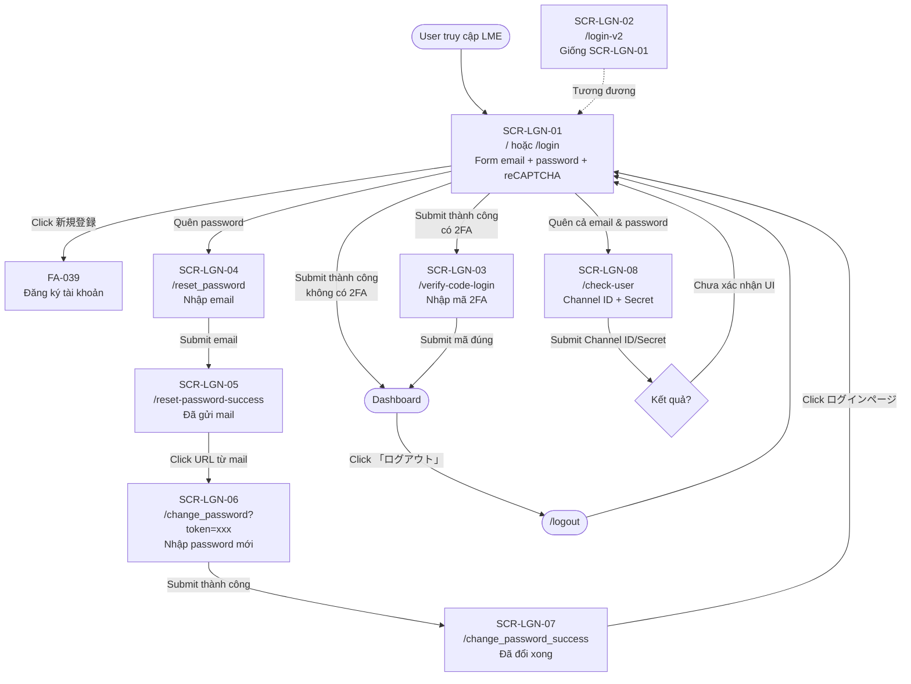

# FA-040: Đăng nhập LME 「ログイン」

## Tổng quan tính năng

Tính năng đăng nhập công khai của hệ thống LME — điểm truy cập duy nhất cho **tất cả các actor** (Admin LINE OA, System Admin, Staff). Tính năng bao gồm:

- **Đăng nhập bằng email/password** có bảo vệ reCAPTCHA (Google reCAPTCHA v2 checkbox)
- **Xác thực 2 bước (2FA)** qua email — nhập mã xác thực được gửi đến email đã đăng ký
- **Phục hồi mật khẩu**: gửi email chứa link reset → đặt lại mật khẩu mới
- **Xác minh tài khoản đã đăng ký** bằng Channel ID / Channel Secret của LINE OA (khi người dùng quên cả email lẫn password)
- **Phiên bản V2** `/login-v2` — giao diện giống hệt bản chính, khác ở endpoint backend (có thể là phiên bản mới đang rollout A/B)
- **Khu vực giới thiệu** (cột phải trên desktop) dành cho người mới — nút 「新規登録」 dẫn đến luồng FA-039

Tính năng được phân phát qua domain `form.watermeru.com` (domain phụ của hệ thống `lme.jp`). Sau khi đăng nhập thành công, session được tạo và người dùng sẽ được redirect đến portal phù hợp với vai trò (dashboard Admin, System Admin hoặc Staff).

## Actors liên quan

| Actor | Vai trò trong tính năng |
|-------|------------------------|
| Admin LINE OA | Đăng nhập vào portal quản lý LINE OA của doanh nghiệp |
| System Admin | Đăng nhập vào portal quản trị hệ thống (chia sẻ cùng form) |
| Staff | Nhân viên đăng nhập bằng email/password do Admin cấp |
| Người dùng chưa đăng ký | Xem khu vực giới thiệu「はじめての方はこちら」và nhấn「新規登録」để chuyển sang luồng đăng ký (FA-039) |
| Người dùng quên password | Sử dụng flow「パスワード再設定用メール送信」 |
| Người dùng quên cả email & password | Sử dụng flow「エルメ登録アカウントの確認」(xác minh qua Channel ID/Secret) |

## Danh sách màn hình

| Mã | Tên màn hình | Tên JP | URL | Mô tả |
|----|-------------|--------|-----|-------|
| SCR-LGN-01 | Trang đăng nhập chính | 「ログイン」 | `/`, `/login` | Form đăng nhập email + password + reCAPTCHA |
| SCR-LGN-02 | Trang đăng nhập V2 | 「ログイン」 | `/login-v2` | Giao diện giống SCR-LGN-01, khác endpoint backend |
| SCR-LGN-03 | Xác thực mã 2FA | 「ログイン - 認証コード」 | `/verify-code-login` | Nhập mã xác thực gửi qua email sau bước login |
| SCR-LGN-04 | Yêu cầu reset password | 「パスワード再設定用メール送信」 | `/reset_password` | Nhập email để nhận mail reset |
| SCR-LGN-05 | Xác nhận đã gửi email reset | — | `/reset-password-success` | Thông báo đã gửi URL reset đến email |
| SCR-LGN-06 | Nhập password mới | 「パスワード再設定」 | `/change_password` | Form đặt lại password (sau khi click link từ email) |
| SCR-LGN-07 | Xác nhận reset password thành công | — | `/change_password_success` | Thông báo password đã được reset, mời quay lại đăng nhập |
| SCR-LGN-08 | Xác nhận tài khoản qua Channel ID/Secret | 「エルメ登録アカウントの確認」 | `/check-user` | Tra cứu account bằng Channel ID/Secret của LINE OA |

---

## Chi tiết từng màn hình

### SCR-LGN-01 — Trang đăng nhập chính 「ログイン」

**URL**: `https://form.watermeru.com/` hoặc `https://form.watermeru.com/login`
**Route**: `GET /` hoặc `GET /login` → `AuthController@checkLogin`
**Submit**: `POST /login` → `AuthController@login`
**Screenshot**: `screenshots/01-login-main.png`

#### Layout

Layout 2 cột trên desktop:

- **Cột trái** (form đăng nhập):
  - Logo LME ở đầu (img「logo」)
  - Heading「ログイン」
  - Form:
    - Text field「メールアドレス」 (floating label)
    - Text field「パスワード」 (floating label, kiểu password)
    - reCAPTCHA checkbox「私はロボットではありません」 (Google reCAPTCHA v2 iframe)
    - Nút「ログイン」 (disabled đến khi reCAPTCHA solved + form hợp lệ)
  - Link trợ giúp:
    -「パスワードを忘れた場合は こちら」→ `/reset_password`
    -「メールアドレス・パスワードどちらも不明な場合は こちら」→ `/check-user`
  - Banner「インスタグラムを活用して集客効率UP！」+ link dẫn sang `lgram.jp` (cross-sell sản phẩm L Gram cho Instagram)

- **Cột phải** (khu vực giới thiệu cho người mới):
  - Heading「はじめての方はこちら」
  - Nút「新規登録」 (dẫn đến FA-039 — luồng đăng ký tài khoản mới)
  - Link ảnh giới thiệu (dẫn tới `lme.jp`)
  - Text「全ての機能が無料からご利用いただけます」
  - 4 box giới thiệu tính năng nổi bật:
    - ステップ配信 — gửi tin theo bước có điều kiện/thời gian
    - 自動応答 — tự động trả lời theo trigger (comment/mention)
    - 予約管理 — quản lý đặt lịch (salon/school/event), hỗ trợ thanh toán trước
    - 商品決済 — thanh toán đơn lẻ hoặc subscription qua màn hình LINE

#### Action Buttons

| Label JP | Type | Ghi chú |
|---------|------|--------|
| ログイン | `button[type=submit]` | Disabled cho đến khi reCAPTCHA solved; submit form POST `/login` |
| 新規登録 | `button` | Dẫn đến luồng đăng ký FA-039 (chưa xác nhận target URL) |

#### Form Fields

| Label JP | Input type | Required | Placeholder | Validation dự kiến |
|---------|-----------|---------|-------------|-------------------|
| メールアドレス | text (floating label) | Có | (không có — label nổi) | Định dạng email |
| パスワード | password (floating label) | Có | (không có — label nổi) | Độ dài tối thiểu (chưa xác định) |
| 私はロボットではありません | reCAPTCHA checkbox | Có | — | Google reCAPTCHA v2 token hợp lệ |

#### Data Tables

Không có.

#### Tabs

Không có.

#### Observations

- Nút「ログイン」 bắt đầu ở trạng thái **disabled** — logic frontend chỉ enable khi reCAPTCHA token đã có (có thể cả khi 2 field đã nhập)
- Label「メールアドレス」 và「パスワード」 là **floating label** (giao diện Material-style): nổi lên khi field có giá trị hoặc focus
- reCAPTCHA được nhúng qua iframe của Google — nhận diện qua `ref=f1e2` trong snapshot
- Domain redirect: sau login thành công, người dùng được redirect về URL internal (dashboard admin/system admin/staff tuỳ vai trò) — chưa quan sát được trong scope
- Có hỗ trợ đăng nhập qua LINE OAuth (routes `/line/callback/redirect-login`, `/callback-login`, `/callback-login-error`) nhưng **không** thấy nút「LINEでログイン」trên trang hiện tại — có thể dành riêng cho luồng trong FA-039

---

### SCR-LGN-02 — Trang đăng nhập V2 「ログイン」

**URL**: `https://form.watermeru.com/login-v2`
**Route**: `GET /login-v2` → `AuthController@checkLoginV2`
**Submit**: `POST /login-v2` → `AuthController@loginV2`
**Screenshot**: `raw/features/login-account/screenshots/05-login-v2.png`

#### Layout

**Giao diện giống hệt SCR-LGN-01** (xem snapshot `05-login-v2.yml`) — cùng 2 cột, cùng form email/password + reCAPTCHA, cùng nội dung giới thiệu bên phải.

#### Khác biệt so với SCR-LGN-01

- Endpoint submit khác: `POST /login-v2` thay vì `POST /login`
- Controller method khác: `checkLoginV2` / `loginV2` thay vì `checkLogin` / `login`
- iframe reCAPTCHA có ref khác (`f13e2` thay vì `f1e2`) — chỉ là khác instance, cùng loại

#### Observations

- Đây có thể là **phiên bản backend mới** đang được phát triển song song (A/B test, rollout dần, hoặc refactor), trong khi UI vẫn giữ nguyên để user không bị ảnh hưởng
- Cần kiểm tra code `AuthController@loginV2` để biết sự khác biệt business logic (ví dụ: hỗ trợ 2FA mặc định, hoặc validate captcha server-side khác)
- Tất cả action buttons, form fields và validation giống SCR-LGN-01 — không mô tả lặp lại

---

### SCR-LGN-03 — Xác thực mã 2FA 「ログイン - 認証コード」

**URL**: `https://form.watermeru.com/verify-code-login`
**Route**: `GET /verify-code-login` → `AuthController@verifyCodeLogin`
**Submit**: `POST /auth-code-login` → `AuthController@authCodeLogin`
**Screenshot**: `screenshots/04-verify-code-login.png`

#### Layout

- **Cột trái** (form nhập code):
  - Logo LME
  - Heading「ログイン」
  - Dòng thông báo:「ご登録のメールアドレスに / 認証メールが送信されました」
  - Khu vực nhập code:
    - Label「メール記載の認証コードをご入力ください」
    - Text field đơn (nhập mã xác thực)
  - Nút「ログイン」 (disabled ban đầu)
  - Link trợ giúp (giống SCR-LGN-01):
    -「パスワードを忘れた場合は こちら」→ `/reset_password`
    -「メールアドレス・パスワードどちらも不明な場合は こちら」→ `/check-user`
- **Cột phải**: khu vực giới thiệu cho người mới — **giống hệt SCR-LGN-01**

#### Action Buttons

| Label JP | Type | Ghi chú |
|---------|------|--------|
| ログイン | `button[type=submit]` | Disabled đến khi mã được nhập; submit POST `/auth-code-login` |
| 新規登録 | `button` | Dẫn đến FA-039 |

#### Form Fields

| Label JP | Input type | Required | Placeholder | Validation dự kiến |
|---------|-----------|---------|-------------|-------------------|
| メール記載の認証コード | text | Có | (không có) | Mã số 4-6 chữ số (chưa xác định chính xác độ dài) |

#### Observations

- Sau khi submit email + password + reCAPTCHA hợp lệ ở SCR-LGN-01, nếu tài khoản bật 2FA → backend tạo mã ngẫu nhiên, gửi qua email và redirect người dùng đến màn hình này
- Màn hình **không có reCAPTCHA** — 2FA đã đủ (có thể server-side lưu session partial)
- Chưa quan sát nút「再送信」 (gửi lại code) — cần kiểm tra khi submit sai hoặc chờ lâu
- Chưa quan sát thông báo thời hạn hiệu lực của mã — có thể có expiry time (ví dụ 10 phút)

---

### SCR-LGN-04 — Yêu cầu reset password 「パスワード再設定用メール送信」

**URL**: `https://form.watermeru.com/reset_password`
**Route**: `GET /reset_password` → `AuthController@resetPassword`
**Submit**: `POST /confirm_password` → `AuthController@confirmPassword`
**Screenshot**: `screenshots/02-reset-password.png`

#### Layout

Layout đơn cột (centered, không có khu vực giới thiệu):

- Logo LME
- Heading「パスワード再設定用メール送信」
- Hướng dẫn (3 dòng):
  - 「パスワード再設定用メールを送信します。」
  - 「ご登録いただいているメールアドレスを入力し。」
  - 「「送信する」ボタンをクリックしてください。」
- Text field email (placeholder: `example@mail.com`)
- Nút「送信する」 (disabled ban đầu — enable khi email hợp lệ)
- Link「ログイン画面に戻る」 (dẫn về `https://form.watermeru.com`)

#### Action Buttons

| Label JP | Type | Ghi chú |
|---------|------|--------|
| 送信する | `button[type=submit]` | Disabled khi email trống/không hợp lệ; submit POST `/confirm_password` |
| ログイン画面に戻る | link | Quay lại SCR-LGN-01 |

#### Form Fields

| Label JP | Input type | Required | Placeholder | Validation dự kiến |
|---------|-----------|---------|-------------|-------------------|
| (email) | text | Có | `example@mail.com` | Định dạng email; phải trùng với tài khoản đã đăng ký để nhận mail |

#### Observations

- Backend có khả năng **không tiết lộ email có tồn tại hay không** (chống enumeration attack) — luôn redirect tới SCR-LGN-05 bất kể email có tồn tại
- Nút được disabled đến khi nhập đủ — validation client-side
- Không có reCAPTCHA ở đây — có thể là điểm cần audit security (rate limiting phải có ở backend)

---

### SCR-LGN-05 — Xác nhận đã gửi email reset

**URL**: `https://form.watermeru.com/reset-password-success`
**Route**: `GET /reset-password-success` → `AuthController@resetPasswordSuccess`
**Screenshot**: `raw/features/login-account/screenshots/07-reset-password-success.png`

#### Layout

Layout đơn cột (thông báo):

- Logo LME
- Đoạn văn bản xác nhận: 「ご入力いただいたメールアドレスにパスワード再設定用 URLを送信しました。メールに記載されたURLよりパスワード再設定のお手続きをお願いいたします。」
- Link「ログインページ」 → `/login`

#### Action Buttons

| Label JP | Type | Ghi chú |
|---------|------|--------|
| ログインページ | link | Dẫn về SCR-LGN-01 |

#### Form Fields

Không có.

#### Observations

- Màn hình purely informational — không có form
- URL reset password được gửi qua email, có chứa token (thường là query parameter như `?token=xxx`) để xác thực khi vào SCR-LGN-06

---

### SCR-LGN-06 — Nhập password mới 「パスワード再設定」

**URL**: `https://form.watermeru.com/change_password` (thường có query `?token=xxx` từ email)
**Route**: `GET /change_password` → `AuthController@changePassword`
**Submit**: `POST /change_password` → `AuthController@change`
**Screenshot**: `screenshots/06-change-password.png`

#### Layout

Layout đơn cột (centered):

- Logo LME
- Heading「パスワード再設定」
- Form:
  - Text field「新しいパスワード」 (password type)
  - Text field「新しいパスワード（確認）」 (password type, confirm)
  - Nút「再設定」

#### Action Buttons

| Label JP | Type | Ghi chú |
|---------|------|--------|
| 再設定 | `button[type=submit]` | Submit POST `/change_password` với 2 password và token |

#### Form Fields

| Label JP | Input type | Required | Placeholder | Validation dự kiến |
|---------|-----------|---------|-------------|-------------------|
| 新しいパスワード | password | Có | (là floating label) | Độ dài tối thiểu; có thể yêu cầu chữ + số + ký tự đặc biệt |
| 新しいパスワード（確認） | password | Có | — | Phải trùng với field phía trên |

#### Observations

- Token reset password nằm trong URL query string (chưa snapshot được vì cần truy cập qua link thật trong email)
- Nút「再設定」 có thể luôn enabled (không thấy `[disabled]` trong snapshot — khác với các màn hình khác) — validation xảy ra khi submit
- Không có reCAPTCHA — dựa vào tính duy nhất của token trong email

---

### SCR-LGN-07 — Xác nhận reset password thành công

**URL**: `https://form.watermeru.com/change_password_success`
**Route**: `GET /change_password_success` → `AuthController@changePasswordSuccess`
**Screenshot**: `raw/features/login-account/screenshots/08-change-password-success.png`

#### Layout

Layout đơn cột (thông báo):

- Logo LME
- Nội dung xác nhận:
  - 「パスワードの再設定が完了しました。」
  - 「再設定いただいたパスワードでログインして下さい。」
- Link「ログインページ」 → `/`

#### Action Buttons

| Label JP | Type | Ghi chú |
|---------|------|--------|
| ログインページ | link | Dẫn về SCR-LGN-01 |

#### Form Fields

Không có.

#### Observations

- Sau khi submit SCR-LGN-06 thành công, user được redirect đến đây
- Không tự động đăng nhập — bắt user quay lại login để nhập password mới (tăng tính bảo mật: đảm bảo user nhớ password mới)

---

### SCR-LGN-08 — Xác nhận tài khoản qua Channel ID/Secret 「エルメ登録アカウントの確認」

**URL**: `https://form.watermeru.com/check-user`
**Route**: `GET /check-user` → `AuthController@checkUser`
**Submit**: `POST /check-user` → `AuthController@postCheckUser`
**Screenshot**: `screenshots/03-check-user.png`

#### Layout

Layout 2 cột:

- **Cột trái** (hướng dẫn):
  - Heading「操作手順」
  - Step 1: 「LINE公式アカウント管理画面に ログイン」 (link dẫn đến `https://account.line.biz/login?redirectUri=https%3A%2F%2Fmanager.line.biz%2F`)
  - Step 2: 「設定 > Messaging API を表示」 (có hình minh hoạ)
  - Step 3: 「Channel ID・Channel secretを入力する」
  - Ảnh minh hoạ tổng thể quy trình

- **Cột phải** (form xác nhận):
  - Heading「エルメ登録アカウントの確認」
  - Hướng dẫn: 「左の操作手順をよく読み、実際に表示されている Channel ID・Channel secretを入力してください」
  - Form:
    - Text field「Channel ID」 + badge「必須」
    - Text field「Channel secret」 + badge「必須」
    - Nút「確認する」 (disabled ban đầu)
    - Link「ログイン画面に戻る」

#### Action Buttons

| Label JP | Type | Ghi chú |
|---------|------|--------|
| 確認する | `button[type=submit]` | Disabled đến khi cả 2 field nhập đủ; submit POST `/check-user` |
| ログイン画面に戻る | link | Quay lại SCR-LGN-01 |

#### Form Fields

| Label JP | Input type | Required | Placeholder | Validation dự kiến |
|---------|-----------|---------|-------------|-------------------|
| Channel ID | text | Có (badge「必須」) | — | Chuỗi số của LINE Messaging API (thường 10 chữ số) |
| Channel secret | text | Có (badge「必須」) | — | Chuỗi 32 ký tự hex của LINE Messaging API |

#### Observations

- Flow thay thế cho user quên cả email và password — dùng Channel ID/Secret để match `bots`/`line_channel` trong DB → tìm ra user/admin sở hữu bot → gửi mail khôi phục hoặc hiển thị email đã đăng ký
- Behavior sau khi submit chưa quan sát được (có thể hiển thị email đã đăng ký, hoặc gửi mail reset password tự động)
- Badge「必須」là pattern UI dùng chung với các form khác trong hệ thống (có thể là shared component nhỏ — chưa đủ điều kiện tạo SC riêng)

---

## User Flows

### Flow 1: Đăng nhập không có 2FA (happy path)

1. User truy cập `https://form.watermeru.com/` hoặc `/login` (SCR-LGN-01)
2. User nhập email + password
3. User tick reCAPTCHA「私はロボットではありません」
4. Nút「ログイン」được enable
5. User click「ログイン」 → `POST /login`
6. Backend validate email/password + captcha token → tạo session → redirect vào dashboard (tuỳ vai trò)

### Flow 2: Đăng nhập có 2FA (happy path)

1. User thực hiện bước 1-5 của Flow 1
2. Backend phát hiện account bật 2FA → tạo mã xác thực, gửi qua email đã đăng ký → tạo session partial → redirect đến SCR-LGN-03 (`/verify-code-login`)
3. User mở email, copy mã xác thực
4. User nhập mã vào field「メール記載の認証コード」 → click「ログイン」 → `POST /auth-code-login`
5. Backend verify mã → complete session → redirect vào dashboard

### Flow 3: Quên password (forgot password flow)

1. Tại SCR-LGN-01, user click「パスワードを忘れた場合は こちら」 → SCR-LGN-04 (`/reset_password`)
2. User nhập email đã đăng ký → click「送信する」 → `POST /confirm_password`
3. Backend validate email tồn tại → tạo token reset + record trong bảng `password_resets` → gửi mail chứa URL `/change_password?token=xxx`
4. Backend redirect đến SCR-LGN-05 (`/reset-password-success`)
5. User mở email, click URL → SCR-LGN-06 (`/change_password?token=xxx`)
6. User nhập password mới + confirm → click「再設定」 → `POST /change_password`
7. Backend verify token chưa hết hạn + chưa sử dụng → update password trong `users`/`admins` (đã hash) → invalidate token
8. Backend redirect đến SCR-LGN-07 (`/change_password_success`)
9. User click「ログインページ」 → quay lại SCR-LGN-01 để đăng nhập với password mới

### Flow 4: Quên cả email và password (check-user flow)

1. Tại SCR-LGN-01, user click「メールアドレス・パスワードどちらも不明な場合は こちら」 → SCR-LGN-08 (`/check-user`)
2. User đọc 3 bước hướng dẫn cột trái:
   - Đăng nhập vào `account.line.biz` (LINE Official Account Manager)
   - Vào「設定 > Messaging API」
   - Copy Channel ID + Channel secret
3. User nhập 2 giá trị vào form → click「確認する」 → `POST /check-user`
4. Backend tra cứu `bots` theo (channel_id, channel_secret) → nếu tìm thấy → tìm owner email → hiển thị thông tin email hoặc gửi mail khôi phục (chưa quan sát được UI kết quả)

### Flow 5: Đăng xuất (logout)

1. Khi đã đăng nhập, user truy cập `/logout` (từ menu) → `AuthController@logout`
2. Backend clear session + cookies → redirect về SCR-LGN-01

---

## Flow Diagram

---

## Điểm chưa rõ / cần điều tra

| Vấn đề | Ưu tiên | Gợi ý điều tra |
|-------|---------|----------------|
| Behavior của nút「新規登録」| Trung bình | Click nút → capture URL target; giả định dẫn đến FA-039 register flow |
| Điều kiện bật/tắt 2FA | Cao | Kiểm tra schema `users`/`admins` có cột `two_factor_enabled` / `otp_enabled` / tương tự; kiểm tra bảng `two_factor_codes` hoặc `otp_codes` |
| Flow LINE OAuth (`/line/callback/*`) | Trung bình | Kiểm tra controller `Admin\UserController` để hiểu flow; có thể không phải entry point từ trang login hiện tại |
| Thời hạn hiệu lực mã 2FA | Thấp | Kiểm tra code `AuthController@authCodeLogin` — thường là 10-15 phút |
| Thời hạn token reset password | Thấp | Kiểm tra bảng `password_resets` có cột `expires_at` / `created_at` |
| Rate limiting cho submit login/reset/check-user | Cao | Kiểm tra middleware (`throttle`) trong routes; captcha không áp dụng cho `/reset_password`, `/check-user` |
| UI kết quả của `POST /check-user` | Trung bình | Submit test để xem redirect đến đâu (thông báo email? gửi mail tự động?) |
| Khác biệt giữa `/login` và `/login-v2` | Trung bình | So sánh `AuthController@login` và `AuthController@loginV2` để hiểu lý do coexist |
| Cột「新規登録」 redirect cụ thể đến đâu | Thấp | Có thể dẫn đến `lgram.jp` (cross-sell), `lme.jp` (marketing), hoặc portal đăng ký riêng |
| Có nút「LINEでログイン」 ẩn đâu đó không | Thấp | Routes `/line/callback/redirect-login` gợi ý có entry point LINE OAuth — có thể hiển thị ở portal khác |

---

## Shared Components được sử dụng

**Không phát hiện shared component nào** đã đăng ký trong `features/shared/registry.md` được sử dụng trong tính năng này. Login là trang public, độc lập với các component nội bộ portal.

### Shared component nghi ngờ mới (chờ xác nhận)

Đã ghi vào `features/shared/pending-refs.md`:

- **Required Badge**「必須」— badge nhỏ đánh dấu field bắt buộc (phát hiện tại SCR-LGN-08). Có thể là pattern UI chung, cần xác nhận khi gặp form khác có badge tương tự.
- **Floating Label Field** — pattern text field với label nổi lên khi focus/có giá trị (SCR-LGN-01, SCR-LGN-02, SCR-LGN-03, SCR-LGN-06). Gần như chắc chắn dùng chung với mọi form trong hệ thống — nhưng thuộc về design system cơ bản, không cần tách SC riêng.
