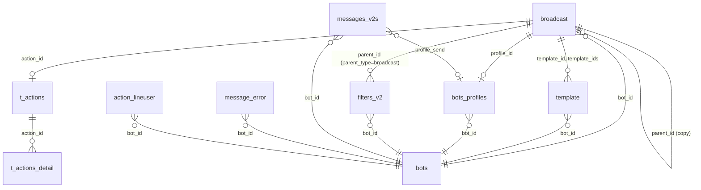

# DB Mapping — FA-008:「メッセージ配信」(Broadcast)

**Feature ID**: FA-008
**Ngày tạo**: 2026-03-26
**Nguồn**: DB schema + logic-spec + job-spec + db-hint

---

## 1. Primary Tables

| Bảng | Mô tả | Vai trò |
|------|-------|---------|
| `broadcast` | Bảng chính — thông tin broadcast | Core entity |
| `template` | Mẫu tin nhắn (nội dung message) | Message content |
| `bots_profiles` | Profile người gửi (sender name) | Sender identity |
| `filters_v2` | Bộ lọc đối tượng nhận (SC-003) | Target filtering |

## 2. Secondary Tables

| Bảng | Mô tả | Vai trò |
|------|-------|---------|
| `t_actions` | Action settings (SC-004) | Post-send actions |
| `t_actions_detail` | Chi tiết action | Action config |
| `messages_v2s` | Log tin nhắn đã gửi | Message log |
| `message_error` | Log lỗi gửi tin | Error tracking |
| `bots` | Thông tin bot LINE | Bot reference |
| `bot_line_user` | Mapping bạn bè LINE ↔ bot | Friend data |
| `action_lineuser` | Queue table cho sendAction | Action queue |
| `url_shorten` | URL rút gọn tracking | URL tracking |
| `template_url_redirect` | URL redirect trong template | URL action |
| `source_messages` | Source message (original content) | Content source |

---

## 3. Entity Details

### 3.1 `broadcast` — Bảng chính

| Column | Kiểu | Nullable | Default | Key | Mô tả |
|--------|------|----------|---------|-----|-------|
| `id` | int(11) | NO | - | PK | ID broadcast |
| `bot_id` | int(11) | NO | - | FK→bots | Bot LINE liên kết |
| `kind` | int(1) | NO | 0 | - | Loại broadcast (0=normal) |
| `tag_id` | varchar(50) | YES | NULL | - | Tag ID (legacy filter) |
| `scenario_id` | int(11) | YES | NULL | FK | Scenario liên kết |
| `send_day` | date | NO | - | - | Ngày gửi |
| `send_time` | time | NO | - | - | Giờ gửi |
| `template_id` | int(11) | YES | NULL | FK→template | Template tin nhắn 1 |
| `template_id_2` | int(11) | NO | - | FK→template | Template tin nhắn 2 |
| `template_id_3` | int(11) | NO | - | FK→template | Template tin nhắn 3 |
| `rich_menu_id` | int(11) | YES | NULL | FK | Rich menu liên kết |
| `status` | enum | NO | 'unregistered' | - | Trạng thái broadcast |
| `send_count` | int(11) | YES | NULL | - | Số lượng đã gửi |
| `updated_at` | timestamp | YES | ON UPDATE | - | Thời gian cập nhật |
| `created_at` | timestamp | NO | CURRENT | - | Thời gian tạo |
| `template_ids` | varchar(500) | YES | NULL | - | Danh sách template IDs (JSON/CSV) |
| `setting_send_message` | tinyint(4) | NO | 1 | - | Cài đặt gửi tin (1=ngay, khác=đặt lịch) |
| `profile_id` | int(11) | YES | NULL | FK→bots_profiles | Profile người gửi |
| `filter_number` | int(11) | NO | 0 | - | Số lượng người qua filter |
| `filter_date` | datetime | YES | NULL | - | Thời gian tính filter |
| `action_id` | int(11) | YES | NULL | FK→t_actions | Action sau khi gửi |
| `parent_id` | int(11) | YES | NULL | FK→broadcast | Broadcast gốc (copy) |
| `name` | varchar(255) | YES | NULL | - | Tiêu đề quản lý |
| `update_timestamp` | bigint(20) | YES | NULL | - | Timestamp cho sync job |

**Status Enum Values:**
| DB Value | Ý nghĩa | Tab UI |
|----------|---------|--------|
| `unregistered` | Chưa đăng ký | - |
| `wait_to_send` | Chờ gửi (đã đặt lịch) | 配信予約 |
| `delivered` | Đã gửi xong | 配信履歴 |
| `delivering` | Đang gửi | 配信履歴 |
| `not_delivery` | Không gửi | - |
| `draft` | Bản nháp | 下書き |
| `send_false` | Gửi thất bại | 配信履歴 |

### 3.2 `template` — Mẫu tin nhắn

| Column | Kiểu | Nullable | Default | Key | Mô tả |
|--------|------|----------|---------|-----|-------|
| `id` | int(11) | NO | - | PK | ID template |
| `bot_id` | int(11) | NO | - | FK→bots | Bot sở hữu |
| `name` | varchar(255) | YES | NULL | - | Tên template |
| `category_id` | int(11) | YES | NULL | FK | Danh mục |
| `position` | int(11) | YES | NULL | - | Thứ tự sắp xếp |
| `type` | varchar(30) | NO | - | - | Loại: text, panel, media, stamp, location |
| `content` | longtext | YES | - | - | Nội dung tin nhắn (JSON) |
| `embed_regex_text` | varchar(255) | YES | NULL | - | Regex cho auto-insert |
| `thumbnail_path` | text | NO | - | - | Đường dẫn thumbnail |
| `duration` | int(11) | YES | NULL | - | Thời lượng (video/audio) |
| `is_shorten_url` | int(11) | NO | 1 | - | Có rút gọn URL không |
| `in_park` | tinyint(4) | NO | 0 | - | Thuộc pack message |
| `type_button` | tinyint(4) | YES | 1 | - | 1=default, 2=custom color, 3=image, 4=quick reply |
| `is_delay_message` | tinyint(4) | YES | NULL | - | Có delay message không |
| `use_preview_url` | tinyint(4) | NO | 1 | - | Hiển thị URL preview |

### 3.3 `bots_profiles` — Profile người gửi

| Column | Kiểu | Nullable | Default | Key | Mô tả |
|--------|------|----------|---------|-----|-------|
| `id` | int(10) unsigned | NO | - | PK | ID profile |
| `bot_id` | int(11) | NO | - | FK→bots | Bot sở hữu |
| `user_id` | int(11) | NO | - | FK | User tạo |
| `avt_path` | varchar(255) | YES | NULL | - | Đường dẫn avatar |
| `nick_name` | varchar(255) | NO | - | - | Tên hiển thị (sender name) |
| `is_default` | tinyint(4) | NO | 0 | - | Profile mặc định |
| `position` | int(11) | NO | 1 | - | Thứ tự |

### 3.4 `filters_v2` — Bộ lọc đối tượng

| Column | Kiểu | Nullable | Default | Key | Mô tả |
|--------|------|----------|---------|-----|-------|
| `id` | int(10) unsigned | NO | - | PK | ID filter |
| `bot_id` | int(11) | YES | NULL | FK→bots | Bot sở hữu |
| `parent_type` | varchar(255) | YES | NULL | - | Loại parent: 'broadcast', 'scenario', etc. |
| `parent_id` | int(11) | YES | NULL | - | ID của parent (broadcast.id) |
| `operator` | varchar(100) | YES | NULL | - | 'and' / 'or' |
| `type` | varchar(255) | YES | NULL | - | Filter type: 'tag', 'friend_name', etc. |
| `data` | text | YES | - | - | Dữ liệu filter (JSON) |
| `text_preview` | text | YES | - | - | Text preview cho hiển thị |

### 3.5 `t_actions` — Action settings

| Column | Kiểu | Nullable | Default | Key | Mô tả |
|--------|------|----------|---------|-----|-------|
| `id` | int(10) unsigned | NO | - | PK | ID action |
| `parent_id` | int(11) | NO | - | - | ID parent (broadcast.id) |
| `type` | varchar(255) | NO | - | - | Loại: 'broadcast', 'scenario', etc. |

### 3.6 `t_actions_detail` — Chi tiết action

| Column | Kiểu | Nullable | Default | Key | Mô tả |
|--------|------|----------|---------|-----|-------|
| `id` | int(10) unsigned | NO | - | PK | ID |
| `action_id` | int(11) | NO | - | FK→t_actions | Action parent |
| `bot_id` | int(11) | YES | NULL | FK→bots | Bot |
| `type` | varchar(255) | NO | - | - | Loại action: add_tag, remove_tag, send_template, etc. |
| `data` | text | NO | - | - | Dữ liệu action (JSON) |
| `has_filters` | tinyint(4) | NO | 0 | - | Có filter không |

### 3.7 `messages_v2s` — Log tin nhắn đã gửi

| Column | Kiểu | Nullable | Default | Key | Mô tả |
|--------|------|----------|---------|-----|-------|
| `id` | bigint(20) unsigned | NO | - | PK | ID |
| `bot_id` | int(11) | NO | - | FK→bots | Bot |
| `user_id` | int(11) | YES | NULL | - | User gửi |
| `message_from` | int(11) | YES | NULL | - | Nguồn message |
| `conversation_id` | int(11) | NO | - | FK | Conversation |
| `profile_send` | int(11) | YES | NULL | FK→bots_profiles | Profile gửi |
| `msg_kind` | int(11) | YES | NULL | - | Loại message |
| `type` | int(11) | YES | NULL | - | Type |
| `content` | mediumtext | YES | - | - | Nội dung |
| `status` | int(11) | YES | NULL | - | Trạng thái |
| `line_message_id` | varchar(255) | YES | NULL | - | LINE message ID |

### 3.8 `message_error` — Log lỗi

| Column | Kiểu | Nullable | Default | Key | Mô tả |
|--------|------|----------|---------|-----|-------|
| `id` | int(10) unsigned | NO | - | PK | ID |
| `message_id` | int(11) | YES | NULL | FK | Message liên kết |
| `bot_id` | int(11) | YES | NULL | FK→bots | Bot |
| `error_message` | text | YES | - | - | Nội dung lỗi |
| `error_code` | varchar(32) | YES | 'unknow' | - | Mã lỗi |
| `type` | tinyint(4) | NO | 1 | - | 1=other, 2=chat, 3=send_all, 4=scenario |
| `status` | tinyint(4) | YES | 0 | - | 1=waiting, 2=done |
| `date_send` | timestamp | YES | NULL | - | Thời gian gửi |
| `retry_count` | int(11) | YES | NULL | - | Số lần retry |

---

## 4. UI ↔ DB Field Mapping

### SCR-BC-01: Danh sách broadcast

| UI Element | Label JP | DB Table | Column | Mapping Type | Confidence |
|------------|----------|----------|--------|-------------|------------|
| Ngày giờ gửi | 配信予定日時 | broadcast | send_day + send_time | Computed (DATE+TIME) | Cao |
| Ngày tạo/cập nhật | 作成・更新日時 | broadcast | updated_at / created_at | Direct | Cao |
| Ngày đã gửi | 配信日時 | broadcast | send_day + send_time (status=delivered) | Computed | Cao |
| Tiêu đề | 管理用タイトル | broadcast | name | Direct | Cao |
| Lọc đối tượng | 配信先絞込み | filters_v2 | text_preview (WHERE parent_type='broadcast') | FK + text | Cao |
| Số lượng gửi | 配信数 | broadcast | send_count / filter_number | Direct | Cao |
| Tên người gửi | 送信者名 | bots_profiles | nick_name (via broadcast.profile_id) | FK | Cao |
| Action | アクション | t_actions_detail | type (via broadcast.action_id) | FK | Trung bình |
| Quick test | クイックテスト | - | - | - | Thấp (chưa xác định column) |
| Checkbox | (checkbox) | - | broadcast.id | Direct | Cao |
| Tab | 配信予約/下書き/配信履歴 | broadcast | status | Enum | Cao |

### SCR-BC-02/04: Form tạo/chỉnh sửa broadcast

| UI Element | Label JP | DB Table | Column | Mapping Type | Confidence |
|------------|----------|----------|--------|-------------|------------|
| Tiêu đề | 管理用タイトル | broadcast | name | Direct | Cao |
| Tên người gửi | 送信者名 | bots_profiles | nick_name (via profile_id) | FK | Cao |
| Timing option | 配信タイミング設定 | broadcast | setting_send_message | Enum (1=ngay) | Cao |
| Ngày gửi | 配信予約 日付 | broadcast | send_day | Direct (DATE) | Cao |
| Giờ gửi | 配信予約 時刻 | broadcast | send_time | Direct (TIME) | Cao |
| Filter option | 配信先絞込み | broadcast + filters_v2 | kind + filters_v2.data | FK | Cao |
| Số người nhận | 配信数 | broadcast | filter_number | Direct | Cao |
| Messages | メッセージ | template | (via broadcast.template_ids) | FK (1-N) | Cao |
| Action | エルメアクション | t_actions/t_actions_detail | (via broadcast.action_id) | FK | Cao |

### SCR-BC-05: Soạn tin nhắn

| UI Element | Label JP | DB Table | Column | Mapping Type | Confidence |
|------------|----------|----------|--------|-------------|------------|
| Loại tin nhắn | メッセージタイプ | template | type | Direct | Cao |
| Nội dung text | テキスト登録 | template | content | Direct (JSON) | Cao |
| Raw URL option | そのままのURL | template | is_shorten_url | Direct (invert: 0=raw) | Cao |
| Char count | 0/5,000 | template | content (length) | Computed | Cao |
| Auto insert | 情報自動挿入 | template | embed_regex_text | Direct | Trung bình |

---

## 5. Enum/Status Values

### broadcast.status

| DB Value | Tab UI | UI Display JP | UI Display VN |
|----------|--------|---------------|---------------|
| `unregistered` | - | (không hiển thị) | Chưa đăng ký |
| `wait_to_send` | 配信予約 | 配信予約 | Đặt lịch gửi |
| `delivered` | 配信履歴 | 配信済み | Đã gửi |
| `delivering` | 配信履歴 | 配信中 | Đang gửi |
| `not_delivery` | - | 未配信 | Không gửi |
| `draft` | 下書き | 下書き | Bản nháp |
| `send_false` | 配信履歴 | 送信エラー | Gửi thất bại |

### broadcast.setting_send_message

| DB Value | UI Display JP | UI Display VN |
|----------|---------------|---------------|
| 1 | メッセージ登録後すぐに配信 | Gửi ngay sau khi đăng ký |
| Khác | 配信予約 | Đặt lịch |

### template.type

| DB Value | UI Display JP | UI Display VN |
|----------|---------------|---------------|
| text | テキスト | Text |
| panel / button | パネル・ボタン | Panel & Button |
| media | 画像・動画・音声 | Hình ảnh/Video/Audio |
| stamp | スタンプ | Sticker |
| location | 位置情報 | Vị trí |

### message_error.type

| DB Value | Mô tả |
|----------|-------|
| 1 | Other |
| 2 | Chat 1:1 |
| 3 | Send all (Broadcast) |
| 4 | Scenario |

### filters_v2.operator

| DB Value | UI Display JP | UI Display VN |
|----------|---------------|---------------|
| and | 「全て満たす」(and条件) | Thoả tất cả |
| or | 「どれか1つ以上満たす」(or条件) | Thoả ít nhất 1 |

### filters_v2.type (11 loại filter)

| DB Value (dự đoán) | UI Display JP |
|---------------------|---------------|
| tag | タグ |
| friend_name | 友だち名 |
| add_date | 友だち追加日 |
| step_subscription | ステップ購読状況 |
| qr_action | QRコードアクション |
| conversion | コンバージョン |
| confirm_status | 確認状況 |
| friend_info | 友だち情報 |
| support_status | 対応ステータス |
| affiliator | アフィリエイター |
| new_existing | 新規・既存 友だち |

---

## 6. Unmapped Items

### UI fields không tìm thấy DB match rõ ràng

| UI Element | Label JP | Ghi chú |
|------------|----------|---------|
| Quick test config | クイックテスト | Chưa xác định lưu ở đâu — có thể là field trong broadcast hoặc bảng riêng |
| Multi schedule slots | 配信日時追加 (max 10) | broadcast chỉ có 1 cặp send_day/send_time — multi-slot có thể dùng parent_id hoặc bảng riêng |
| Preview & Test | プレビューとテスト | Gọi LINE API trực tiếp, không lưu DB |

### DB columns quan trọng không xuất hiện trên UI

| Table | Column | Mô tả |
|-------|--------|-------|
| broadcast | kind | Loại broadcast (0=normal) — UI không hiển thị |
| broadcast | scenario_id | Liên kết scenario — dùng cho step delivery, không phải broadcast thường |
| broadcast | rich_menu_id | Rich menu liên kết — chưa thấy trên UI |
| broadcast | parent_id | Broadcast gốc khi copy — UI có nút copy (cột操作) |
| broadcast | update_timestamp | Timestamp cho sync với Spring Boot job |
| template | carousel_action_type | Loại action cho carousel — không thấy trên UI broadcast |
| template | in_park | Pack message flag — liên quan đến message grouping |

---

## 7. Entity Relationships



---

## 8. Data Flow — Web → DB → Job

```
Admin tạo broadcast (web)
  → INSERT broadcast (status='draft' hoặc 'unregistered')
  → INSERT template (content tin nhắn)
  → INSERT filters_v2 (điều kiện lọc, parent_type='broadcast')
  → INSERT t_actions + t_actions_detail (nếu có action)
  → UPDATE broadcast.profile_id (sender name)

Admin gửi / đặt lịch
  → UPDATE broadcast (status='wait_to_send', send_day, send_time)

Spring Boot BroadcastTask poll
  → SELECT broadcast WHERE status='wait_to_send' AND send_day+send_time <= NOW()
  → UPDATE broadcast.status = 'delivering'
  → Đọc template, filters_v2, bots_profiles
  → Lọc LINE users theo filters
  → Gửi tin nhắn qua LINE API (multicast)
  → INSERT messages_v2s (log mỗi tin nhắn)
  → INSERT message_error (nếu lỗi)
  → UPDATE broadcast.status = 'delivered', send_count = actual_count
  → INSERT action_lineuser (nếu có action → ActionService xử lý)
```

---

## 9. Ghi chú Confidence

- **Cao**: Xác nhận từ DB schema + logic-spec code analysis
- **Trung bình**: Suy luận từ tên column + UI behavior
- **Thấp**: Đoán — cần xác nhận thêm (filters_v2.type values, quick test storage)

**Coverage**: ~85% UI fields đã map được. Các items unmapped (quick test, multi-schedule) cần điều tra thêm trong code.
