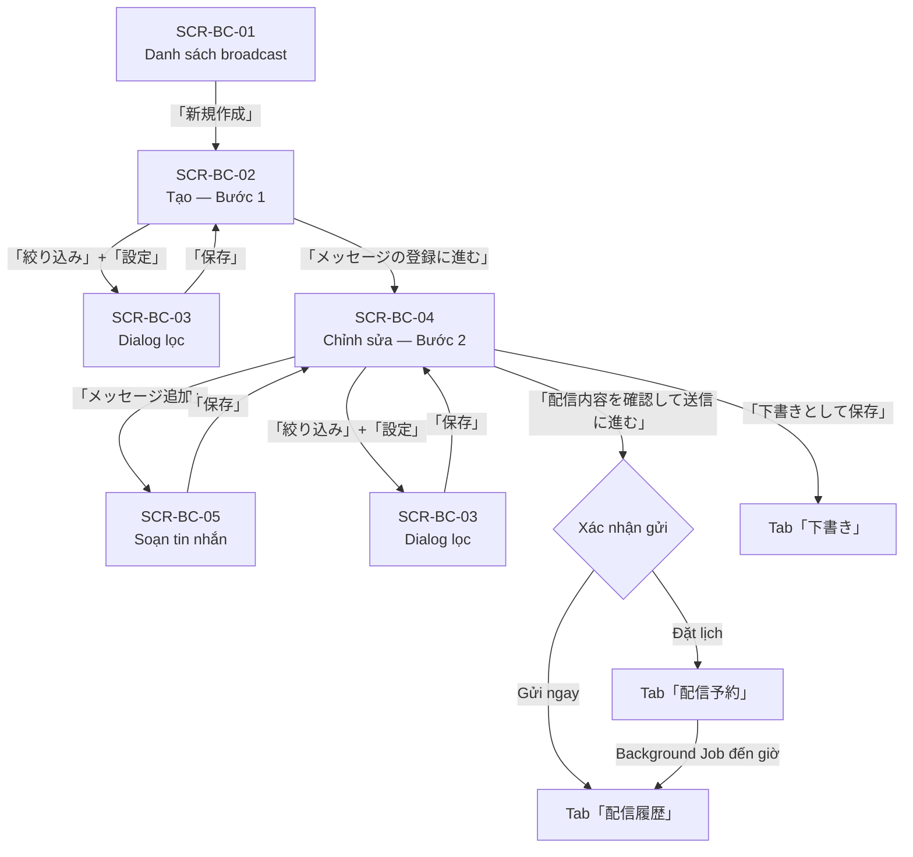
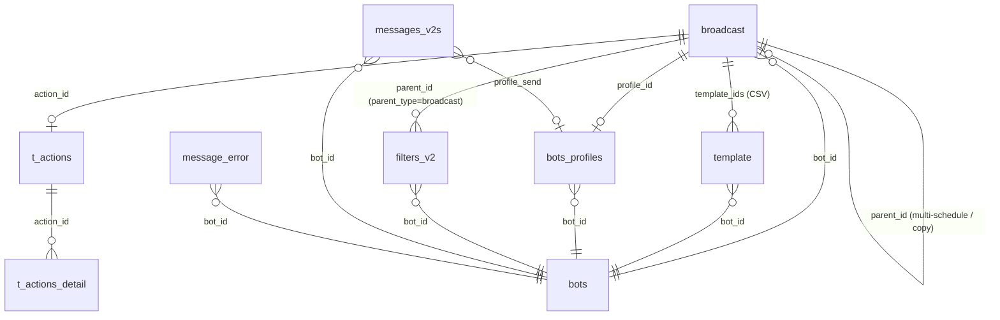

# Feature Spec — FA-008:「メッセージ配信」(Gửi tin nhắn hàng loạt)

**Feature ID**: FA-008
**Portal**: Admin
**Ngày tạo**: 2026-03-26
**Phiên bản**: 1.0
**Trạng thái**: REVIEWED (tất cả 5 sub-specs đã pass validation)

---

## 1. Tổng quan

### Mục đích

「メッセージ配信」(Broadcast) cho phép Admin và Staff tạo và gửi tin nhắn hàng loạt đến toàn bộ hoặc một nhóm bạn bè LINE (followers) của một LINE Official Account. Tính năng hỗ trợ:

- Gửi ngay lập tức hoặc đặt lịch gửi (tối đa 10 thời điểm khác nhau cho 1 broadcast)
- Lọc đối tượng nhận theo 11 tiêu chí (tag, tên, ngày thêm, trạng thái step, v.v.)
- Soạn 5 loại tin nhắn: text, panel & button (Flex Message), hình ảnh/video/âm thanh, sticker, vị trí
- Cấu hình profile người gửi (tên hiển thị, avatar)
- Thực thi action sau khi gửi (gán tag, trigger step, thay đổi rich menu, v.v.)
- Xem trước và gửi thử trước khi broadcast chính thức

### Actors

| Actor | Vai trò |
|-------|---------|
| **Admin** | Toàn quyền: tạo, chỉnh sửa, xoá, gửi, đặt lịch, quản lý profile người gửi |
| **Staff** | Tạo, chỉnh sửa, gửi broadcast (theo quyền Admin cấp). Chỉ quản lý profile của chính mình |
| **LINE User** | Người nhận tin nhắn broadcast qua ứng dụng LINE |
| **Background Job** | Spring Boot service — thực hiện gửi tin nhắn hàng loạt theo lịch đã đặt |

### Phạm vi

- **URL gốc**: `/basic/message-send-all`
- **Module**: Nhắn tin → Gửi hàng loạt
- **Phụ thuộc**: LINE Messaging API (gửi tin nhắn), MySQL (lưu trữ), Spring Boot Job Service (xử lý nền)

### Shared Components sử dụng

| Mã | Component | Mô tả | Vị trí |
|----|-----------|-------|--------|
| SC-003 | Friend Filter「絞り込み」| Dialog lọc đối tượng 11 loại điều kiện AND/OR | SCR-BC-03 — overlay trên form tạo/chỉnh sửa |
| SC-004 | Action Settings「エルメアクション設定」| Cấu hình action thực thi sau gửi | SCR-BC-04 — section「エルメアクションを追加」|
| SC-005 | Message Editor「メッセージ編集」| Soạn thảo nội dung tin nhắn (5 loại) | SCR-BC-05 |
| SC-006 | Delivery Target Selector「配信先」| Chọn tất cả hoặc lọc đối tượng nhận | SCR-BC-02/04 — section「配信先絞込み」|
| SC-007 | Schedule Settings「配信日時」| Chọn gửi ngay hoặc đặt lịch | SCR-BC-02/04 — section「配信タイミング設定」|

---

## 2. Các màn hình và Luồng xử lý end-to-end

### Màn hình tổng thể

| Screen ID | Tên JP | Tên VN | URL |
|-----------|--------|--------|-----|
| SCR-BC-01 | 一斉配信（一覧） | Danh sách broadcast | `/basic/message-send-all` |
| SCR-BC-02 | 一斉配信（作成） | Tạo broadcast — Bước 1 | `/basic/add-broadcast-v2` |
| SCR-BC-03 | 絞り込み | Dialog lọc đối tượng | Dialog overlay |
| SCR-BC-04 | 一斉配信（編集） | Chỉnh sửa broadcast — Bước 2 | `/basic/add-broadcast-v2?broadcast_id=XXX` |
| SCR-BC-05 | メッセージタイプを選択 | Soạn tin nhắn | `/basic/template-v2/add-template?...` |

### Flow navigation tổng thể



### Luồng end-to-end từng hành động

#### Hành động 1: Tạo mới và gửi ngay

| Bước | User action | UI | API endpoint | Business logic | DB | Response |
|------|------------|-----|-------------|---------------|-----|---------|
| 1 | Vào trang broadcast | SCR-BC-01 hiển thị | GET EP-01 | Query scenario, conversion, statusChat, richMenus | Đọc `broadcast` + related | HTML view |
| 2 | Click「新規作成」| Chuyển sang SCR-BC-02 | GET EP-02 (không có broadcast_id) | Đếm totalUser (bot_line_user không bị block) | Đọc `bot_line_user` | HTML view |
| 3 | Nhập tiêu đề, chọn gửi ngay, chọn đối tượng | SCR-BC-02 form | — | Validation frontend | — | — |
| 4 | Click「メッセージの登録に進む」| — | POST EP-10 (saveBroadcastV2) | Tạo broadcast với status='draft'. Nếu có delivery_dates → tạo child broadcasts. Cập nhật bots_tutorial | INSERT `broadcast`, INSERT `filters_v2` | `{status:true, broadcastIdNew:123}` |
| 5 | Click「メッセージ追加」| Mở SCR-BC-05 | — | — | — | — |
| 6 | Soạn nội dung và lưu | SCR-BC-05 → quay về SCR-BC-04 | POST (template save) | Tạo template. URL tracking nếu có URL | INSERT `template`, INSERT `url` | Redirect về SCR-BC-04 |
| 7 | Click「配信内容を確認して送信に進む」→ xác nhận gửi | — | POST EP-10 (update status='wait_to_send') | Validate 5 phút rule. Update status. Cập nhật delivery_dates | UPDATE `broadcast.status` = 'wait_to_send' | `{status:true}` |
| 8 | Background Job poll | (ẩn — không có UI) | — | Spring Boot poll mỗi 5s. Tìm `wait_to_send` đến giờ. Set `delivering`. Lọc users, gửi từng user qua LINE API | UPDATE `broadcast.status`='delivering' → INSERT `messages_v2s` → UPDATE 'delivered' | Notification mobile (nếu bật) |
| 9 | Reload SCR-BC-01 | Broadcast xuất hiện ở tab「配信履歴」| POST EP-11 (status=delivered) | Query broadcasts có status IN ('delivered','send_false') | Đọc `broadcast` | JSON list |

#### Hành động 2: Đặt lịch gửi

Giống hành động 1 nhưng ở bước 3: chọn「配信予約」→ nhập ngày/giờ. Broadcast xuất hiện ở tab「配信予約」sau khi lưu. Background Job sẽ gửi vào đúng thời điểm đã đặt.

#### Hành động 3: Lưu nháp

Ở bước 7: click「下書きとして保存」thay vì「配信内容を確認して送信に進む」. API EP-10 nhận `status='draft'`. Broadcast xuất hiện ở tab「下書き」.

#### Hành động 4: Tính lại số người nhận

| User action | API | Logic | DB |
|------------|-----|-------|-----|
| Click「再計算」(nút tính lại) | POST EP-17 | Lấy filters AND/OR từ `filters_v2`. Gọi `Conversation::advanceFilterPost()` count distinct `bot_line_user.id` | UPDATE `broadcast.filter_number`, `broadcast.filter_date`. Cũng update children |

#### Hành động 5: Xoá hàng loạt

| User action | API | Logic | DB |
|------------|-----|-------|-----|
| Check checkbox → Click「一括削除」| POST EP-15 | Nếu `wait_to_send`: kiểm tra 5 phút rule. Xoá templates (`category_id = broadcast category`). Xoá broadcast records | DELETE `template`, DELETE `broadcast` |

#### Hành động 6: Sao chép broadcast

| User action | API | Logic | DB |
|------------|-----|-------|-----|
| Click nút Copy trong cột「操作」| POST EP-16 | Clone broadcast, templates (broadcast-specific `-11` → clone, shared `>=0` → reference), actions, filters, children | INSERT `broadcast` (status=draft), INSERT `template` (clones), INSERT `filters_v2` |

---

## 3. Data Model

### Entities chính

| Entity | Bảng DB | Vai trò |
|--------|---------|---------|
| Broadcast | `broadcast` | Thực thể chính — quản lý thông tin gửi, trạng thái, lịch |
| Template | `template` | Nội dung tin nhắn (text, hình, video, sticker, v.v.) |
| BotsProfiles | `bots_profiles` | Profile người gửi (tên + avatar hiển thị cho người nhận LINE) |
| FilterV2 | `filters_v2` | Điều kiện lọc đối tượng nhận (AND/OR, 11 loại) |
| Action | `t_actions` + `t_actions_detail` | Action thực thi sau khi gửi tin (gán tag, trigger step, v.v.) |
| MessagesV2s | `messages_v2s` | Log từng tin nhắn đã gửi cho từng LINE user |
| MessageError | `message_error` | Log lỗi gửi tin nhắn |
| SourceMessages | `source_messages` | Tracking delivery — 1 record per broadcast version |

### ER Diagram



### Broadcast Status — State Machine

```
[Tạo mới] → draft / unregistered
    ↓ (thêm template + đặt lịch/gửi ngay)
wait_to_send  ← Spring Boot poll ở trạng thái này
    ↓ (Job pick up)
delivering    ← Job đang xử lý (không cho phép sửa/xoá)
    ↓                 ↓
delivered        send_false
(gửi xong)      (gửi thất bại / quá hạn 15 phút)
```

| Status DB | Tab UI | Ý nghĩa |
|-----------|--------|---------|
| `draft` / `not_delivery` | 下書き | Bản nháp (V2 / legacy) |
| `unregistered` | 下書き | Chưa có template (legacy) |
| `wait_to_send` | 配信予約 | Đã đặt lịch, chờ gửi |
| `delivering` | 配信履歴 | Đang gửi |
| `delivered` | 配信履歴 | Đã gửi xong |
| `send_false` | 配信履歴 | Gửi thất bại |

---

## 4. Field Traceability Matrix

| # | UI Element | Màn hình | DB Table.Column | Hướng | Validation | Business Rule |
|---|-----------|----------|----------------|-------|-----------|--------------|
| 1 | 管理用タイトル (Tiêu đề quản lý) | SCR-BC-02/04 | `broadcast.name` | Write | Bắt buộc, max 20 ký tự | Không hiển thị cho LINE User |
| 2 | 送信者名 (Tên người gửi) | SCR-BC-02/04 | `bots_profiles.nick_name` via `broadcast.profile_id` | Read/Write | — | Default = tên LINE OA. profile_id=null → dùng default |
| 3 | 配信タイミング設定 (Thời gian gửi) | SCR-BC-02/04 | `broadcast.setting_send_message` | Write | — | 1=gửi ngay, khác=đặt lịch |
| 4 | 配信予約 — Ngày gửi | SCR-BC-02/04 | `broadcast.send_day` | Write | Bắt buộc, format YYYY-MM-DD | Không được trống hoặc '0000:00:00' |
| 5 | 配信予約 — Giờ gửi | SCR-BC-02/04 | `broadcast.send_time` | Write | Bắt buộc, format HH:mm | — |
| 6 | 配信先絞込み (Lọc đối tượng) | SCR-BC-02/04 | `broadcast.flag_setting_filter` + `filters_v2.data` | Write | — | 0=tất cả, 1=có filter. Filter lưu trong `filters_v2` (parent_type='broadcast') |
| 7 | 配信数 (Số người nhận) | SCR-BC-02/04 | `broadcast.filter_number` | Read | — | Cập nhật khi nhấn「再計算」hoặc thay đổi filter |
| 8 | メッセージ登録 (Tin nhắn) | SCR-BC-04 | `template` via `broadcast.template_ids` | Write | — | Comma-separated IDs. ButtonQuickReply luôn ở cuối |
| 9 | エルメアクション (Action) | SCR-BC-04 | `t_actions` + `t_actions_detail` via `broadcast.action_id` | Write | — | Action thực thi sau khi gửi tin cho từng user |
| 10 | 配信予定日時 (Ngày/giờ dự kiến) | SCR-BC-01 (tab予約) | `broadcast.send_day` + `broadcast.send_time` | Read | — | Computed: DATE + TIME |
| 11 | 作成・更新日時 (Ngày tạo/cập nhật) | SCR-BC-01 (tab下書き) | `broadcast.updated_at` / `broadcast.created_at` | Read | — | — |
| 12 | 配信日時 (Ngày đã gửi) | SCR-BC-01 (tab履歴) | `broadcast.send_day` + `broadcast.send_time` (status=delivered) | Read | — | — |
| 13 | Tab 配信予約/下書き/配信履歴 | SCR-BC-01 | `broadcast.status` | Read | — | Enum mapping: wait_to_send → 予約, draft/unregistered/not_delivery → 下書き, delivered/delivering/send_false → 履歴 |
| 14 | メッセージタイプ (Loại tin nhắn) | SCR-BC-05 | `template.type` | Write | Không thể thay đổi sau khi lưu | text, panel, media, stamp, location |
| 15 | Nội dung text | SCR-BC-05 | `template.content` | Write | Max 5,000 ký tự | — |
| 16 | Sử dụng URL nguyên bản | SCR-BC-05 | `template.is_shorten_url` | Write | — | 0=URL nguyên bản (tắt tracking). 1=rút gọn URL (bật tracking) |
| 17 | 配信先絞込み text hiển thị | SCR-BC-01 | `filters_v2.text_preview` | Read | — | '設定済み' nếu có filter, '未設定（全員）' nếu chưa |

---

## 5. Business Rules

### BR-01: Broadcast Status Lifecycle (Vòng đời trạng thái)

Broadcast V2 bắt đầu với `draft` khi tạo mới. Chuyển sang `wait_to_send` khi Admin xác nhận gửi và có template. Spring Boot Job đổi thành `delivering` khi pick up, rồi `delivered` khi hoàn thành, hoặc `send_false` nếu thất bại hoặc quá hạn.

**Không thể chỉnh sửa/xoá broadcast khi `delivering` hoặc `delivered`.**

### BR-02: Quy tắc 5 phút trước giờ gửi (Edit Lock)

Broadcast `wait_to_send` **không thể sửa hoặc xoá** nếu thời gian gửi - hiện tại < 5 phút.

- Áp dụng cho: sửa thông tin, xoá đơn, xoá hàng loạt, thêm/xoá message, thêm/xoá action
- Thực tế trong code: buffer 6 phút (`subMinutes(6)`) — UI hiển thị「5分前」
- Lỗi trả về: 「配信予定日時5分前からは配信内容の編集はできません。」

### BR-03: Multi-schedule — Nhiều thời điểm gửi

1 broadcast có thể gửi vào **tối đa 10 thời điểm** khác nhau.
- Thời điểm đầu = broadcast chính (parent)
- Các thời điểm bổ sung = child broadcasts (`parent_id = broadcast.id`)
- Child broadcasts clone đầy đủ templates, actions, filters từ parent

### BR-04: Template management — Quản lý tin nhắn

- Broadcast V2 dùng `template_ids` (comma-separated string)
- 5 loại tin nhắn: text, panel & button (Flex Message), media (hình/video/audio), sticker, vị trí
- **ButtonQuickReply** (nếu có) luôn đứng cuối danh sách `template_ids`
- **Không thể thay đổi loại** (type) của template sau khi lưu
- Gửi tối đa 5 messages/batch qua LINE API

### BR-05: Profile người gửi (Sender Identity)

- Default profile = tên và avatar LINE Official Account
- Admin có thể tạo nhiều custom profiles
- Staff chỉ tạo/quản lý profile của chính mình
- Khi chọn default profile → `broadcast.profile_id = null`
- Khi xoá profile đang dùng → broadcast tự động fallback về default

### BR-06: Lọc đối tượng (FilterV2)

- Lưu trong bảng `filters_v2` (parent_type = 'broadcast')
- Hỗ trợ tổ hợp AND (tất cả điều kiện phải thoả) + OR (ít nhất 1 điều kiện thoả)
- 11 loại filter: tag, tên bạn bè, ngày thêm bạn, trạng thái step, QR code action, conversion, xác nhận, thông tin bạn bè, trạng thái xử lý, affiliate, bạn mới/cũ
- `filter_number` được lưu cache vào broadcast; nút「再計算」để tính lại

### BR-07: Sao chép broadcast (Copy)

Khi copy: broadcast, templates, actions, filters, child broadcasts đều được clone.
- Templates dùng chung (category_id ≥ 0) → giữ reference, không clone
- Templates riêng của broadcast (category_id = -11) → clone tạo bản mới
- Broadcast bản copy luôn bắt đầu với status = `'draft'`

### BR-08: Kiểm tra bot switch (Bot Switch Guard)

Khi submit form legacy, hệ thống kiểm tra `botIdCurrent` (từ form) == `getBotId()` (session). Nếu khác nhau (user đã switch sang bot khác ở tab khác) → lỗi「別のアカウントに切り替えたので、要求を処理できません。」

### BR-09: URL tracking trong text message

- URL trong nội dung text được detect tự động
- Mặc định: URL rút gọn để tracking (là_shorten_url = 1)
- Khi chọn「このメッセージでは入力したそのままのURLを利用する」: tắt tracking, tắt URL tap action
- Tự động thêm space trước/sau URL (Android compatibility)

### BR-10: Giới hạn plan và send count

- Free plan: tối đa 1,000 tin nhắn/tháng
- Paid plan: không giới hạn (-1)
- Khi hết quota LINE plan → ghi `MessageError` với code `REACH_LIMIT_LINE`, không retry

### BR-11: Broadcast quá hạn (Expiry Check)

Spring Boot kiểm tra: nếu `sendTime + 15 phút < NOW()` **VÀ** `updatedAt + 15 phút < NOW()` → set `send_false`. Tránh gửi broadcast quá cũ khi service bị down.

---

## 6. API Endpoints

### Tổng hợp endpoints theo nhóm chức năng

| Nhóm | Endpoint | Method | URL | Mô tả |
|------|---------|--------|-----|-------|
| **Xem danh sách** | EP-01 | GET | `/basic/message-send-all` | Trang danh sách (HTML) |
| | EP-11 | POST | `/ajax/get-list-broadcast` | Lấy dữ liệu 3 tabs (JSON, phân trang) |
| **Tạo/chỉnh sửa** | EP-02 | GET | `/basic/add-broadcast-v2` | Form tạo/chỉnh sửa (HTML) |
| | EP-10 | POST | `/ajax/save-broadcast-v2` | **CORE** — Lưu broadcast (tạo/sửa/copy) |
| | EP-12 | POST | `/ajax/get-detail-broadcast-v2` | Lấy chi tiết broadcast |
| | EP-14 | GET | `/ajax/get-list-message-broadcast` | Danh sách messages trong broadcast |
| **Xoá / Copy** | EP-15 | POST | `/ajax/delete-multiple-broadcast` | Xoá hàng loạt |
| | EP-16 | POST | `/ajax/copy-broadcast-v2` | Sao chép broadcast |
| **Filter** | EP-17 | POST | `/ajax/get-filter-number-broadcast` | Tính lại số người nhận |
| | EP-40 | GET | `/ajax/initDataFilterBroadcast` | Dữ liệu khởi tạo dialog filter |
| **Test** | EP-19 | POST | `/ajax/send-for-test-broadcast-v3` | Gửi thử tin nhắn (V3, recommended) |
| **Profile người gửi** | EP-25 | POST | `/ajax/broadcast/init-list-bots-profiles` | Danh sách profiles |
| | EP-26 | POST | `/basic/broadcast/save-selected-profile-bot` | Chọn profile |
| | EP-28 | POST | `/ajax/save-bot-profile-v2` | Tạo/sửa profile |
| | EP-30 | POST | `/ajax/upload-file-bot-profile-broadcast` | Upload avatar profile |
| **Message** | EP-37 | POST | `/ajax/remove-item-message-broadcast-v2` | Xoá message khỏi broadcast |
| **Action** | EP-38 | POST | `/ajax/save-action-broadcast` | Xoá action khỏi broadcast |
| | EP-39 | POST | `/ajax/delete-action-detail-broadcast` | Xoá 1 action detail |

### EP-10 (CORE) — Tham số chính

```json
{
  "broadcast_id": null,          // null = tạo mới
  "name": "テスト配信",           // bắt buộc
  "status": "wait_to_send",      // 'draft' hoặc 'wait_to_send'
  "send_day": "2026-04-01",
  "send_time": "10:00:00",
  "setting_send_message": 1,     // 0=gửi ngay, 1=đặt lịch
  "profile_id": 123,
  "arr_template_ids": [456, 789],
  "flag_setting_filter": 1,      // 0=tất cả, 1=có filter
  "filter_ids": [10, 11],
  "delivery_dates": [            // multi-schedule (tối đa 10)
    {"send_day": "2026-04-02", "send_time": "10:00:00"}
  ]
}
```

**Lưu ý middleware**: Tất cả routes broadcast dùng middleware chung `web` + `auth`. Không có middleware access control riêng — phân quyền Staff/Admin xử lý ở middleware layer chung (`RoleAccess`, `AccessFeature`).

---

## 7. Background Jobs

### Tổng quan kiến trúc Job

Tính năng broadcast sử dụng **Database Polling Model** — không dùng Kafka hay message queue:

1. **Laravel** tạo/cập nhật `broadcast` với `status='wait_to_send'`, `send_day`, `send_time`
2. **Spring Boot** (BroadcastTask) poll bảng `broadcast` mỗi **5 giây**, tìm records đến giờ gửi
3. Gửi tin nhắn tuần tự từng LINE user qua LINE Messaging API Push Message

### Queue Tables

| Bảng | Vai trò trong Job |
|------|-----------------|
| `broadcast` | Queue table chính — poll theo trường `status` + `send_day` + `send_time` |
| `filters_v2` | Điều kiện lọc users |
| `bot_line_user` | Danh sách users của bot |
| `source_messages` | Tracking per broadcast version |
| `messages_v2s` | Log từng message gửi cho từng user |
| `message_error` | Log lỗi |

### Processing Chain

```
BroadcastTask — polling mỗi 5s
  → Tìm broadcast: status='wait_to_send' AND send_day+send_time <= NOW()
  → validateSendTime(): nếu quá 15 phút → send_false, skip
  → Set status='delivering'
  → BroadcastNewJob.run() per bot:
      → Lấy filter (FilterV2 → legacy fallback)
      → Lấy danh sách LINE users (pre-cached FilterService hoặc query trực tiếp)
      → Build MessageBuilderHelper per template (cache, dùng cho tất cả users)
      → Tạo SourceMessages (tracking)
      → Với mỗi LINE user: tạo RequestSentTemplateToUser → push RequestSentQueue
      → updateStatusFinished(): status='delivered', send_count=N  ← đặt ngay sau khi đẩy queue
  → SentMessageService — thread pool (poll mỗi 200ms):
      → SentMessageHelper.sentMessage()
      → Gom tối đa 5 messages/batch → LINE Push API
      → Nếu thành công: addSendCount, doAction (nếu có)
      → Rate limited: retry queue, chờ 3s, tối đa 10 lần
      → User cuối: gửi mobile notification + cập nhật summary stats
```

**Quan trọng**: `status='delivered'` được set ngay sau khi đẩy hết requests vào in-memory queue — KHÔNG phải sau khi LINE API xác nhận gửi xong. Tức là `delivered` = "đã đưa vào hàng đợi gửi".

### Resume sau restart

Khi service khởi động lại, BroadcastTask tự tìm broadcasts đang `delivering` (gửi dở do crash) và resume từ user cuối cùng đã gửi.

### Concurrency & Reliability

- Mỗi bot có 1 `BroadcastNewJob` instance riêng (HashMap per bot_id)
- Nếu 1 bot job treo > 30 phút → `System.exit(0)` (restart toàn bộ service)
- `PrepareFilterTask` pre-filter danh sách users trước giờ gửi (mỗi 60s) để tăng hiệu suất
- Alert Chatwork nếu: job exception, queue treo > 1 phút, API chậm > 10s

### External APIs

| API | URL | Mục đích | Retry |
|-----|-----|---------|-------|
| LINE Push Message | POST `/v2/bot/message/push` | Gửi tin đến 1 user, tối đa 5 msg/batch | Rate limit → retry 3s, max 10 lần |
| LINE Reply Message | POST `/v2/bot/message/reply` | Trả lời (nếu có reply token) | — |
| Chatwork API | — | Alert lỗi và cảnh báo | Không |
| Mobile Push | — | Thông báo broadcast hoàn thành cho Admin | Không |

---

## 8. Phụ thuộc chéo (Cross-references)

### Shared Components

| Component | Feature sử dụng chung |
|-----------|----------------------|
| SC-003 (Friend Filter) | FA-002 (Step Delivery), FA-009, FA-013, FA-024 |
| SC-004 (Action Settings) | Được dùng ở nhiều tính năng có action post-send |
| SC-005 (Message Editor) | Tái sử dụng cho tạo template, step message |
| SC-006 (Delivery Target) | Tương tự filter target ở các tính năng gửi tin |
| SC-007 (Schedule Settings) | Tương tự scheduling ở Step Delivery |

### Tính năng liên quan

| Tính năng | Liên kết |
|-----------|---------|
| FA-002: Step Delivery | Sử dụng SC-003 cùng filter logic |
| Template Library | Broadcast có thể thêm tin nhắn từ template (EP-35) |
| Rich Menu | Broadcast có thể gắn rich_menu_id |
| Analytics | `messages_v2s` + `source_messages` cung cấp data cho báo cáo |
| Quick Test | Cài đặt trên broadcast — gửi thử trước khi broadcast chính thức |
| Action System | `t_actions` + `t_actions_detail` — thực thi sau khi gửi tin |

### Tích hợp giữa Web và Job

| Laravel (Web) | Spring Boot (Job) |
|---------------|------------------|
| INSERT/UPDATE `broadcast` | Poll `broadcast` mỗi 5s |
| INSERT `template` | Đọc `template` để build messages |
| INSERT `filters_v2` | Đọc `filters_v2` để lọc users |
| INSERT `t_actions` | Đọc `t_actions_detail` để doAction |
| — | INSERT `messages_v2s`, `message_error`, `source_messages` |
| — | UPDATE `broadcast.status`, `send_count` |

---

## 9. Gaps và Unknowns

Tổng hợp từ validation-report + các điểm chưa xác định trong quá trình reverse spec.

### Gaps cần bổ sung (từ Validation Report)

| Mã | Vấn đề | Mức độ | Đề xuất xử lý |
|----|--------|--------|--------------|
| V-03 | EP-12 đến EP-40 thiếu response format chi tiết (đặc biệt EP-15, EP-16, EP-28) | Trung bình | Bổ sung response JSON mẫu khi cần viết test cases API |
| V-04 | `FriendlistController@initDataFilterBroadcast` (EP-40) chưa được document trong logic-spec | Trung bình | Controller này xử lý dữ liệu khởi tạo dialog SC-003 — cần bổ sung |
| V-05 | `BroadcastService` chưa được document đầy đủ | Nhẹ | Chỉ có `sendTestBroadcast` được đề cập; các methods khác cần review |
| V-07 | `source_messages` table chưa có schema chi tiết trong db-mapping | Nhẹ | Bảng này được dùng cho tracking và resume — cần bổ sung schema |
| V-08 | Cột「クイックテスト」(Quick test) trong SCR-BC-01 chưa xác định được DB field | Nhẹ | Cần grep source code tìm `quick_test` / `is_quick_tester` field |

### Unknowns từ UI Spec

| # | Câu hỏi | Ưu tiên |
|---|---------|---------|
| U-01 | Màn hình xác nhận gửi (sau「配信内容を確認して送信に進む」) trông như thế nào? | Cao |
| U-02 | Chi tiết UI của 4 loại tin nhắn còn lại (panel & button, media, sticker, vị trí)? | Cao |
| U-03 | Chi tiết bên trong từng loại filter ở SCR-BC-03? | Trung bình |
| U-04 | Tab「URL表示期限・アクション設定」ở SCR-BC-05 chứa gì? | Trung bình |
| U-05 | Nút「設定」của送信者名 mở dialog gì? Cho phép thay đổi gì? | Trung bình |
| U-06 | Nút「Choose File」ở cuối SCR-BC-01 dùng để import broadcast từ CSV? | Thấp |
| U-07 | Quick test hoạt động như thế nào? Gửi thử cho ai? | Trung bình |
| U-08 | Cột「操作」chứa nút nào? Sửa? Xoá? Sao chép? | Trung bình |
| U-09 | Khi sửa broadcast đặt lịch < 5 phút trước giờ gửi — UX thông báo lỗi như thế nào? | Cao |
| U-10 | Staff có quyền gì khác so với Admin? Module permission cụ thể? | Trung bình |

### Mâu thuẫn cần xác nhận

| # | Mâu thuẫn | Nguồn |
|---|-----------|-------|
| M-01 | UI hiển thị "5分前" nhưng code dùng `subMinutes(6)` — buffer 1 phút | logic-spec BR-02 |
| M-02 | `broadcast.status='delivered'` = "đã đưa vào queue" KHÔNG phải "đã gửi xong LINE API" — có thể gây hiểu nhầm cho tester | job-spec section 4.1 |
| M-03 | `broadcast.setting_send_message`: DB value `1` = gửi ngay (UI label「メッセージ登録後すぐに配信」) nhưng tên field "setting_send_message" gây nhầm lẫn về ngữ nghĩa | db-mapping section 5 |

---

## 10. Chất lượng Spec

### Metrics tổng thể

| Chỉ số | Giá trị |
|--------|---------|
| UI fields đã map DB | ~85% (17/20 fields chính) |
| Endpoints documented | 40 endpoints (EP-01 đến EP-40) |
| Endpoints có request/response mẫu | 5/40 (EP-10, EP-11, EP-12, EP-17, EP-19) |
| Business rules documented | 11 rules (BR-01 đến BR-11) |
| DB tables identified | 14 bảng (4 primary + 10 secondary) |
| Confidence distribution | Cao: ~80%, Trung bình: ~15%, Thấp: ~5% |
| Open questions (UI unknowns) | 10 câu hỏi |
| Validation issues | 8 issues (2 trung bình, 6 nhẹ) |

### Confidence phân theo layer

| Layer | Confidence | Ghi chú |
|-------|-----------|---------|
| UI Spec | Cao | 5 màn hình chính được document. SCR-BC-03 chi tiết filter chưa đủ |
| API Spec | Cao | 40 endpoints từ source code. Response format thiếu ở các EP phụ |
| Logic Spec | Cao | 2 controllers + services + business rules đầy đủ |
| Job Spec | Cao | Spring Boot source code phân tích trực tiếp, tin cậy cao |
| DB Mapping | Cao | Schema từ DB dump. Quick test column chưa xác định |

### Trạng thái sẵn sàng

| Mục đích sử dụng | Sẵn sàng? | Ghi chú |
|-----------------|-----------|---------|
| Dev đọc để implement | ✅ | Đủ thông tin cho cả FE, BE, Job |
| Tester viết test cases | ✅ | Business rules và data model rõ ràng |
| QA viết test plan | ✅ | Flow và edge cases đã document |
| BA review requirements | ✅ | Nhưng cần resolve unknowns U-01, U-09 (cao) |
| API test automation | ⚠️ | Cần bổ sung response format cho EP-15, EP-16, EP-28 (V-03) |
