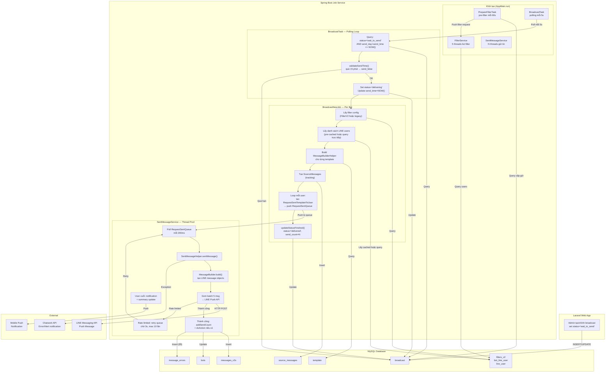

# Job Spec — FA-008:「メッセージ配信」(Broadcast)

**Feature ID**: FA-008
**Portal**: Admin
**Ngày phân tích**: 2026-03-26
**Nguồn**: Spring Boot codebase (`reverse-spec/src/job/linect-service/src/main/java/sns/line/`)

---

## 1. Tổng quan

### Tại sao cần Background Job?

Broadcast gửi tin nhắn đến hàng nghìn ~ hàng chục nghìn LINE users cùng lúc. Không thể xử lý realtime trong web request vì:
- Giới hạn LINE API rate limit (push message)
- Cần gửi tuần tự từng user, xử lý lỗi, retry
- Hỗ trợ đặt lịch gửi (scheduled delivery)
- Cần resume nếu service restart giữa chừng

### Kiểu giao tiếp: Database Polling Model

- **Laravel** (web app) tạo/cập nhật record trong bảng `broadcast` với `status = 'wait_to_send'`, `send_day`, `send_time`
- **Spring Boot** chạy `while(true)` loop, poll bảng `broadcast` mỗi **5 giây**
- Khi tìm record có `send_day + send_time <= NOW() AND status = 'wait_to_send'` → xử lý gửi
- **KHÔNG** dùng Kafka, @Scheduled, hay message queue

### Feature Flag

| Flag | File | Mặc định | Mô tả |
|------|------|----------|-------|
| `ENABLE_BROADCAST` | `ConfigFile.java:85` | `true` | Bật/tắt toàn bộ broadcast job |

**Tin cậy: Cao** — đọc trực tiếp từ `ConfigFile.java:85,231`

Khi `ENABLE_BROADCAST = true`, `AppMain.run()` (line 317-322) khởi tạo:
1. `FilterService.startJobListFilter()` — thread pool lọc users
2. `FilterService.startJobClearUnUsedListFilter()` — dọn dẹp filter cache
3. `PrepareFilterTask.startPrepareFilterBroadcast()` — pre-filter trước giờ gửi
4. `BroadcastTask.startBoardCast(executorService)` — polling loop chính

---

## 2. Queue Tables

### 2.1 Bảng `broadcast` (Queue Table chính)

**Entity JPA**: `sns.line.models.linedb.entities.Broadcast`
**Repository**: `sns.line.models.linedb.repository.BroadcastRepository`

| Cột | Kiểu | Vai trò trong Job |
|-----|------|-------------------|
| `id` | long (PK) | Định danh broadcast |
| `bot_id` | long (FK) | Bot sở hữu — dùng để group broadcasts theo bot |
| `status` | String | **State machine** — quyết định flow xử lý |
| `send_day` | Date | Ngày gửi — dùng trong điều kiện poll |
| `send_time` | Time | Giờ gửi — dùng trong điều kiện poll |
| `template_ids` | String | Comma-separated template IDs (V2) |
| `template_id` | long | Template chính (legacy) |
| `template_id_2` | Long | Template 2 (legacy) |
| `template_id_3` | Long | Template 3 (legacy) |
| `action_id` | Long (FK) | Action thực thi sau gửi |
| `profile_id` | Long (FK) | Profile người gửi |
| `rich_menu_id` | Integer (FK) | Rich menu gắn kèm |
| `scenario_id` | long (FK) | Scenario filter (legacy) |
| `tag_ids` | String | Tag filter (legacy) |
| `parent_id` | Long (FK) | Parent broadcast (multi-schedule) |
| `send_count` | int | Số người đã gửi thực tế |
| `update_timestamp` | int | Unix timestamp — dùng tạo version ID |
| `name` | String | Tiêu đề quản lý |
| `updated_at` | String | Thời gian cập nhật cuối — dùng validate send time |

**Tin cậy: Cao** — đọc từ `BroadcastRepository.java`, `BroadcastNewJob.java`

### 2.2 State Machine (Status Values)

```
[Laravel tạo] → draft / unregistered / not_delivery
       ↓ (thêm template + đặt lịch)
  wait_to_send  ←── [Spring Boot poll ở trạng thái này]
       ↓ (Job pick up)
  delivering    ←── [Job đang xử lý]
       ↓ (thành công)
  delivered     ←── [Hoàn thành]
       ↓ (thất bại)
  send_false    ←── [Lỗi / hết hạn]
```

| Status | Constant | Ý nghĩa | Ai set |
|--------|----------|---------|--------|
| `wait_to_send` | `Constants.Broadcast.STATUS_WAIT_TO_SEND` | Chờ gửi | Laravel |
| `delivering` | `Constants.Broadcast.STATUS_DELIVERING` | Đang gửi | Spring Boot (BroadcastTask) |
| `delivered` | `Constants.Broadcast.STATUS_DELIVERED` | Đã gửi xong | Spring Boot (BroadcastNewJob) |
| `send_false` | `Constants.Broadcast.STATUS_SEND_FALSE` | Gửi thất bại | Spring Boot |

**Tin cậy: Cao** — đọc từ `Constants.java:44-49`

### 2.3 Điều kiện Poll

**Query chính** (`BroadcastRepository.java:18-19`):
```sql
SELECT * FROM broadcast
WHERE ((send_day = CURRENT_DATE AND send_time <= CURRENT_TIME)
       OR send_day < CURRENT_DATE)
  AND status = 'wait_to_send'
```

**Tần suất poll**: Mỗi **5 giây** (`Thread.sleep(5 * 1000)` — `BroadcastTask.java:186`)

**Resume query** — tìm broadcast đang gửi dở (sau restart):
```sql
SELECT * FROM broadcast WHERE status = 'delivering'
```
Gọi qua `BroadcastModel.getListBroadcastSending()` → `MessageBuilderModelService.getListBroadcastSending()` → `broadcastRepository.getAllByStatus("delivering")`

**Tin cậy: Cao** — đọc từ `BroadcastRepository.java:15-19`

### 2.4 Bảng hỗ trợ

| Bảng | Entity | Vai trò |
|------|--------|---------|
| `source_messages` | `SourceMessages` | Tracking delivery — 1 record per broadcast version |
| `messages_v2s` | `MessagesV2s` | Lưu từng message gửi cho từng user |
| `filters_v2` | `FilterV2` | Lọc đối tượng nhận (AND/OR conditions) |
| `bot_line_user` | `BotLineUser` | Danh sách LINE users của bot |
| `line_user` | `LineUser` | Thông tin LINE user |
| `template` | `Template` | Nội dung tin nhắn |
| `message_errors` | `MessageError` | Log lỗi gửi message |
| `bots` | `Bot` | Thông tin bot — plan type, send count |
| `notify_settings` | `NotifySetting` | Cài đặt thông báo hoàn thành broadcast |
| `conversation` | `Conversation` | Liên kết bot ↔ LINE user |

---

## 3. Task Managers

### 3.1 BroadcastTask — Polling Loop chính

**File**: `reverse-spec/src/job/linect-service/src/main/java/sns/line/task/BroadcastTask.java`
**Class**: `sns.line.task.BroadcastTask extends StoppableTask`
**Feature flag**: `ENABLE_BROADCAST`

#### Khởi tạo

`AppMain.run()` gọi `broadcastTask.startBoardCast(executorService)` khi `ENABLE_BROADCAST = true`.

#### 2 Thread chính

**Thread 1 — Bot Scanner** (line 71-98):
- `while(true)` loop
- Mỗi vòng: lấy danh sách active bots (`BotModel.findAllActiveBot()`)
- Loại bỏ bots inactive khỏi `mBroadCastMapJob` (HashMap<Long, BroadcastNewJob>)
- Sleep **1 ngày** (`DateTimeUtils.M_1_DAY`) giữa mỗi vòng scan
- Mục đích: dọn dẹp job map, giải phóng tài nguyên cho bots đã deactivate

**Thread 2 — Broadcast Sender** (line 100-225):
1. **Resume phase** (line 106-132):
   - Khi service vừa start, tìm broadcasts đang `delivering` (gửi dở do crash/restart)
   - Group theo `bot_id`, tạo `BroadcastNewJob` per bot
   - Gọi `job.startResume(broadcastList)` — tiếp tục gửi từ user cuối cùng

2. **Polling loop** (line 134-218):
   - `while(true)` — kiểm tra `isNeedStop()` mỗi vòng
   - Gọi `BroadcastModel.getBroadcastWillSend()` — query broadcasts sẵn sàng gửi
   - Validate từng broadcast:
     - Bot null → set `delivered`, skip
     - `validateSendTime()` fail → set `send_false`, skip
   - Group broadcasts theo `bot_id`
   - Với mỗi bot: lấy/tạo `BroadcastNewJob`, gọi `lockForStartWork()` + `startWork()`
   - **Trước khi gửi**: set `status = 'delivering'`, cập nhật `send_time = NOW()`
   - Sleep **5 giây** giữa mỗi polling cycle

#### validateSendTime() (line 252-266)

Kiểm tra broadcast có quá hạn không:
- Nếu `sendTime + 15 phút < NOW()` **VÀ** `updatedAt + 15 phút < NOW()` → return `false` (quá cũ)
- Broadcast quá hạn 15 phút so với giờ gửi dự kiến VÀ không được cập nhật trong 15 phút gần nhất → `send_false`
- Mục đích: tránh gửi broadcast đã quá cũ (VD: service down lâu)

**Tin cậy: Cao** — đọc từ `BroadcastTask.java:252-266`

#### Concurrency Model

- `mBroadCastMapJob`: HashMap<Long, BroadcastNewJob> — mỗi bot 1 BroadcastNewJob instance
- `synchronized(mBroadCastMapJob)` khi thao tác map
- `BroadcastNewJob.lockForStartWork()` — đảm bảo mỗi bot chỉ chạy 1 job tại 1 thời điểm
- Nếu bot đang `WORKING` quá 30 phút (`LIMIT_WORKING_TIME = 1800000ms`) → `System.exit(0)` (restart toàn bộ service)

**Tin cậy: Cao** — đọc từ `BroadcastNewJob.java:315-332`

### 3.2 PrepareFilterTask — Pre-filter trước giờ gửi

**File**: `reverse-spec/src/job/linect-service/src/main/java/sns/line/task/PrepareFilterTask.java`

- Chạy song song với BroadcastTask
- Mỗi **60 giây** scan broadcasts sắp đến giờ gửi (trong khoảng `PREPARE_FILTER_BROADCAST_BEFORE` phút tới)
- Đẩy filter request vào `FilterService` queue → tính toán danh sách LINE users trước
- Khi `BroadcastNewJob.run()` cần danh sách users → kiểm tra `FilterService.filterListUser()`:
  - Nếu đã pre-filter xong → dùng kết quả cache
  - Nếu đang filter → chờ (polling mỗi 1s, timeout 30 phút)
  - Nếu chưa có → filter trực tiếp (fallback)

**Tin cậy: Cao** — đọc từ `PrepareFilterTask.java:26-117`

---

## 4. Processing Chain

```
BroadcastTask (polling)
  → BroadcastNewJob.startWork() / startResume()
    → BroadcastNewJob.run() / sendResumeBroadcast()
      → Xác định danh sách LINE users (FilterService / LineUserModel)
      → BroadcastNewJob.sendBroadcast()
        → Build templates → MessageBuilderHelper.build()
        → Tạo SourceMessages (tracking)
        → Với mỗi LineUser:
          → Tạo MessagesV2s record
          → Tạo RequestSentTemplateToUser
          → Đẩy vào RequestSentQueue (in-memory queue)
        → updateStatusFinished() → set 'delivered' + send_count

RequestSentQueue (in-memory LinkedList)
  → SentMessageService (thread pool, poll mỗi 200ms)
    → SentMessageHelper.sentMessage()
      → MessageBuilder.build() → tạo LINE message objects
      → callSentPushMessage() → gom tối đa 5 msg/batch
        → LineModel.sendPushMessageV2() → LINE Messaging API
      → Nếu thành công: BotModel.addSendCount(), successSendCount++
      → Nếu có actionId: ActionModel.doAction() → thực thi action
      → Nếu rate limited: retry (đẩy lại retryRequestQueue, chờ 3s)
    → Khi currentSendCount == totalSendCount (user cuối):
      → Cập nhật summary message send
      → Gửi mobile notification (nếu cấu hình)
```

### 4.1 BroadcastNewJob — Xử lý gửi per Bot

**File**: `reverse-spec/src/job/linect-service/src/main/java/sns/line/threads/broadcast/BroadcastNewJob.java`

#### run() — Gửi broadcasts mới (line 114-189)

1. Refresh bot info (`BotManager.getNewBot()`)
2. Kiểm tra bot hết hạn plan > 7 ngày → set `delivered`, skip
3. Lấy filter config:
   - Ưu tiên `FilterV2` (parent_type = 'broadcast')
   - Fallback: legacy filter (scenario_id, tag_ids)
4. Lấy danh sách LINE users:
   - Ưu tiên `FilterService.filterListUser()` (pre-cached)
   - Nếu đang filter → chờ (polling mỗi 1s, timeout 1800s = 30 phút)
   - Fallback: `LineUserModel.getListLineUserFromFilterV2()` (query trực tiếp)
5. Nếu không có users → `updateStatusFinished(broadcast, 0)`
6. Gọi `sendBroadcast(broadcast, lineUsers, lineUsers.size())`

#### sendBroadcast() — Gửi tin nhắn (line 191-297)

1. **Lấy template IDs**: ưu tiên `template_ids` (V2), fallback `template_id/2/3` (legacy)
2. **Build message helpers**: với mỗi template → `MessageBuilderHelper.build()` → cache vào `mapBuilderHelper`
3. **Tạo SourceMessages**: `MessageModel.buildSourceMessageForBroadcast()` — tracking record
4. **Kiểm tra plan limit**: `BotModel.getAvailableSendCount(bot.getId())`
   - Free plan: tối đa 1000 tin/tháng (trả về số còn lại, hoặc 0 nếu hết)
   - Paid plan: trả về -1 (unlimited)
5. **HTTP client rotation**: chia `lineUsers.size() / 100` index (tối đa 80) — phân tải HTTP connections
6. **Với mỗi LINE user**:
   - Kiểm tra `numberAvailableToSend` (-1 = unlimited, >0 = còn quota)
   - Tạo `MessagesV2s` record (chưa save — sẽ save trong SentMessageHelper)
   - Tạo `RequestSentTemplateToUser` với đầy đủ context
   - `RequestSentQueue.pushRequestToQueue(request)` — đẩy vào in-memory queue
7. **Update status**: `updateStatusFinished()` → `status = 'delivered'`, `send_count = lineUsers.size()`

**Lưu ý quan trọng**: `updateStatusFinished()` được gọi **ngay sau khi đẩy hết requests vào queue**, KHÔNG phải sau khi gửi xong LINE API. Tức là `delivered` status nghĩa là "đã đưa vào hàng đợi gửi", không phải "đã gửi xong cho tất cả users".

**Tin cậy: Cao** — đọc trực tiếp từ code

#### sendResumeBroadcast() — Resume gửi dở (line 44-112)

1. Tìm `SourceMessages` cuối cùng cho broadcast + version
2. Tìm message cuối cùng đã gửi (qua `MessagesV2s`)
3. Xác định `lastUserSend` — user cuối cùng đã nhận tin
4. Lọc danh sách users: bỏ tất cả users đã gửi (từ đầu đến `lastUserSend`)
5. Đếm `sendCount` hiện tại (messages đã gửi thành công)
6. Gọi `sendBroadcast()` với danh sách users còn lại

**Tin cậy: Cao**

---

## 5. Services & Helpers

### 5.1 RequestSentQueue — In-memory Message Queue

**File**: `reverse-spec/src/job/linect-service/src/main/java/sns/line/helper/RequestSentQueue.java`

| Method | Input | Output | Logic |
|--------|-------|--------|-------|
| `pushRequestToQueue(req)` | `RequestSentTemplateToUser` | void | Đẩy request vào `requestQueue` (synchronized LinkedList) |
| `getRequestFromQueue()` | - | `RequestSentTemplateToUser` hoặc null | Poll từ đầu queue |
| `retryPushRequestToQueue(req)` | `RequestSentTemplateToUser` | void | Đẩy vào `retryRequestQueue` — chờ retry |
| `checkInTimeRetryRequest()` | - | void | Kiểm tra retry queue, đẩy lại request đến thời gian retry vào main queue |

**Tables đọc/ghi**: Không — hoạt động hoàn toàn in-memory

### 5.2 SentMessageService — Thread Pool gửi tin nhắn

**File**: `reverse-spec/src/job/linect-service/src/main/java/sns/line/helper/SentMessageService.java`

| Thành phần | Chi tiết |
|------------|----------|
| Thread pool size | `ConfigFile.MAX_SENT_MESSAGE_THREAD` (configurable) |
| Polling interval | 200ms (khi queue rỗng) |
| Worker logic | Poll `RequestSentQueue` → `SentMessageHelper.sentMessage()` |
| Retry logic | Status 1000 (rate limit) → đẩy lại `retryRequestQueue` |
| Tracking queue | Thread riêng, mỗi 1 phút kiểm tra items trong queue > 1 phút → Chatwork alert |

**Post-send logic cho broadcast** (line 53-81):
- Khi `msgKind == TYPE_MESSAGE_SEND_ALL`:
  - `currentSendCount.incrementAndGet()` (atomic)
  - Khi `currentSendCount == totalSendCount` (user cuối):
    - `GroupActionLaterService.pushActionUpdateSummaryMessageSendBroadcast()` — cập nhật thống kê
    - Kiểm tra `NotifySetting.isNotifySendAll` → gửi mobile notification cho Admin

**Tin cậy: Cao**

### 5.3 SentMessageHelper — Gửi tin nhắn thực tế

**File**: `reverse-spec/src/job/linect-service/src/main/java/sns/line/helper/SentMessageHelper.java`

| Method | Input | Output | Logic |
|--------|-------|--------|-------|
| `sentMessage(req)` | `RequestSentTemplateToUser` | int (status) | Orchestrate: build → send → action |
| `callSentPushMessage(bot, lineUser, req, msgs)` | Bot, LineUser, Request, List<MessageSentLine> | int | Gom batch 5 msg → gọi LINE API |
| `callSent(isFirst, bot, lineUser, req, msgs)` | ... | int (1=success, 2=fail, 1000=retry) | Gọi LINE API, xử lý lỗi |

**Flow sentMessage()** (line 54-216):
1. Build messages: với mỗi template → `MessageBuilder.build()` hoặc cache
2. Nếu có messages → `callSentPushMessage()`:
   - Gom tối đa 5 messages/batch (LINE API limit)
   - Nếu reply token có → `LineModel.sendReplyMessagesV2()` (batch đầu)
   - Còn lại → `LineModel.sendPushMessageV2()`
3. Nếu thành công:
   - `BotModel.addSendCount(bot.getId(), 1)` — cập nhật bảng `bots`
   - `RichMenuModel.updateRichMenu()` — gắn rich menu nếu có
   - `successSendCount.incrementAndGet()` (cho broadcast)
4. Nếu có `actionId`:
   - `ActionModel.doAction(...)` — thực thi action (gán tag, trigger step, chuyển rich menu, ghi conversion...)
   - `startActionInfo` = TYPE_BROADCAST + broadcast.id

**Tables đọc/ghi**:
- **Đọc**: `template`, `bot`, `line_user`, `conversation`, `bots_profiles`
- **Ghi**: `messages_v2s` (insert), `message_errors` (insert khi lỗi), `bots.free_send_count` (increment), `bot_line_user` (rich menu), `action_line_users` (doAction)

**Tin cậy: Cao**

### 5.4 MessageBuilderHelper — Build LINE message objects

**File**: `reverse-spec/src/job/linect-service/src/main/java/sns/line/helper/MessageBuilderHelper.java`

- Input: `Template` entity + `Bot` entity
- Output: `HashMap<Long, MessageBuilderHelper>` — map templateId → builder
- Xử lý template type `group`: giải nén thành danh sách child templates, build từng cái
- Xử lý các loại: text, image (ImageMap), stamp, voice, video, form, question, location, introduction
- Cache kết quả build → reuse cho tất cả LINE users (tránh build lại mỗi user)

**Tin cậy: Cao**

### 5.5 FilterService — Lọc đối tượng nhận (pre-cache)

**File**: `reverse-spec/src/job/linect-service/src/main/java/sns/line/helper/FilterService.java`

| Thread Pool | Size | Mục đích |
|-------------|------|----------|
| `executorServiceListFilter` | 5 | Xử lý filter list users |
| `executorServiceValidFilter` | 10 | Validate single user |
| Clear unused | 1 (mỗi loại) | Dọn filter cache > 5 phút |

**Flow**:
1. `PrepareFilterTask` push `FilterRequest` vào queue
2. Worker threads poll → `doFilter()` → `LineUserModel.getListLineUserFromFilterV2()`
3. Kết quả lưu vào `listFilter` HashMap (in-memory)
4. `BroadcastNewJob` gọi `filterListUser()` → lấy kết quả hoặc chờ

**Tables đọc**: `filters_v2`, `bot_line_user`, `line_user`, `tag_line_user`, `scenario_lineuser` (qua JPA native query)

**Tin cậy: Cao**

### 5.6 MessageModel — Tạo SourceMessages

**File**: `reverse-spec/src/job/linect-service/src/main/java/sns/line/models/MessageModel.java`

| Method | Logic |
|--------|-------|
| `buildSourceMessageForBroadcast(broadcast, botId, templateIdList)` | Tìm hoặc tạo SourceMessages cho broadcast + version. Capture template content tại thời điểm gửi |
| `getVersionId(broadcastId, updateTimestamp)` | Tạo version ID duy nhất cho mỗi lần gửi |

**Tables ghi**: `source_messages` (insert)

**Tin cậy: Cao**

---

## 6. External API Calls

### 6.1 LINE Messaging API

**File**: `reverse-spec/src/job/linect-service/src/main/java/sns/line/models/line/LineModel.java`

| Method | API | Mô tả |
|--------|-----|-------|
| `sendPushMessageV2()` | POST `/v2/bot/message/push` | Gửi tin nhắn đến 1 user (tối đa 5 msg/batch) |
| `sendReplyMessagesV2()` | POST `/v2/bot/message/reply` | Trả lời tin nhắn (batch đầu tiên, nếu có reply token) |

**Retry logic** (trong `callSent()`):
- Lỗi "access token invalid" → refresh token (`BotManager.refreshToken()`) → retry
- Lỗi "API rate limit exceeded" → đẩy vào retry queue, chờ 3s, tối đa 10 lần
- Lỗi "LINE plan limit reached" → ghi `MessageError` với code `REACH_LIMIT_LINE`, không retry
- Lỗi server (code 500) → retry tối đa 3 lần, sleep 1s giữa mỗi lần
- Các lỗi khác → retry tối đa 3 lần

**Tin cậy: Cao** — đọc từ `LineModel.java:170-262`, `SentMessageHelper.java:307-347`

### 6.2 Chatwork Notification API

**File**: `reverse-spec/src/job/linect-service/src/main/java/sns/line/utils/NotifyUtils.java`

| Trường hợp | Nội dung |
|-------------|---------|
| Job exception | `NotifyUtils.sendReportChatwork(BroadcastNewJob.class, ...)` |
| Send message error | `NotifyUtils.sendReportChatwork(SentMessageService.class, ...)` |
| Queue treo > 1 phút | Alert đến Chatwork room 316148419 |
| Job broadcast treo > 30 phút | `NotifyUtils.NotifyBackend(1, "Warning treo job broadcast", ...)` → restart |
| API call chậm > 10s | Report performance metrics |

**Tin cậy: Cao**

### 6.3 Mobile Push Notification

Khi broadcast gửi xong cho tất cả users:
- Kiểm tra `NotifySetting.isNotifySendAll == 1`
- Tạo `MobileNotify` object:
  - Title: 「メッセージ配信」
  - Content: `配信人数 {count}人  タイトル：{broadcastName}`
  - Type: `MobileNotify.TYPE_SEND_ALL`
- Đẩy vào `ActionLaterService` (low priority) để gửi push notification cho Admin

**Tin cậy: Cao** — đọc từ `SentMessageService.java:60-77`

---

## 7. Data Flow Diagram



---

## 8. Error Handling

### 8.1 Xử lý lỗi theo tầng

| Tầng | Lỗi | Xử lý | Chatwork Alert |
|------|------|--------|----------------|
| **BroadcastTask** | Bot null | Set `delivered`, skip | Không |
| **BroadcastTask** | Send time quá hạn 15 phút | Set `send_false` | Không |
| **BroadcastTask** | Exception trong scan loop | Log + `sendReportChatwork` | Có |
| **BroadcastNewJob** | Bot expired plan > 7 ngày | Set `delivered`, skip | Không |
| **BroadcastNewJob** | Exception trong run() | Set `send_false` + `sendReportChatwork` | Có |
| **BroadcastNewJob** | Filter timeout > 30 phút | Fallback query trực tiếp | Không |
| **BroadcastNewJob** | Job treo > 30 phút | `System.exit(0)` — restart toàn bộ service | Có (NotifyBackend) |
| **SentMessageHelper** | Template not found | Log, skip template đó | Không |
| **SentMessageHelper** | Build message error | Ghi `RequestSentTemplateError`, skip | Không |
| **SentMessageHelper** | LINE API lỗi (500) | Retry tối đa 3 lần | Không |
| **SentMessageHelper** | LINE API rate limit | Retry queue, chờ 3s, max 10 lần (status 1000) | Có (nếu limit_exceeded) |
| **SentMessageHelper** | Access token invalid | Refresh token + retry | Không |
| **SentMessageHelper** | Free plan hết quota | Ghi `MessageError` (REACH_LIMIT_FREE_PLAN), skip | Không |
| **SentMessageHelper** | LINE plan hết quota | Ghi `MessageError` (REACH_LIMIT_LINE), skip | Không |
| **SentMessageService** | Queue treo > 1 phút | Alert Chatwork | Có |
| **SentMessageService** | Send message exception | Log + `sendReportChatwork` | Có |

### 8.2 Retry Strategy

| Loại lỗi | Retry | Khoảng cách | Tối đa |
|-----------|-------|-------------|--------|
| Server error (500) | Trong `callSent()` | 1 giây | 3 lần |
| Rate limit exceeded | Qua `retryRequestQueue` | 3 giây | 10 lần |
| Token expired | Refresh + retry ngay | - | 1 lần |
| Undefined error | Trong `callSent()` | 1 giây | 3 lần |

### 8.3 Graceful Shutdown

- `AppMain.isPrepareStop()` → set flag
- `StoppableTask.isNeedStop()` → kiểm tra flag
- `SentMessageService` threads check flag mỗi vòng poll
- `BroadcastTask` Sender thread kiểm tra mỗi vòng poll
- Requests còn trong queue được log ra (`logAllMessageRequestSendTrappedInQueue`)
- Service restart → Resume phase sẽ pick up broadcasts đang `delivering`

**Tin cậy: Cao**

---

## 9. Liên kết với Web App

### 9.1 Trigger Points (Laravel → Spring Boot)

| Hành động trên Web | Code Location | Hiệu ứng trên broadcast table |
|---------------------|---------------|-------------------------------|
| Tạo broadcast mới có schedule + template/action | `BroadcastV2Controller.php:262-264` | `status = 'wait_to_send'` |
| Edit broadcast: set schedule | `BroadcastController.php:503-504` | `not_delivery → wait_to_send` |
| Multi-schedule: tạo child broadcast | `BroadcastV2Controller.php:326-331` | Mỗi child có `status = 'wait_to_send'` |
| Thêm template vào broadcast chưa có | `BroadcastController.php:351-357` | `unregistered → wait_to_send` (nếu có schedule) |
| Switch status thủ công | `BroadcastController.php:506-507` | `not_delivery → wait_to_send` |

### 9.2 Kết quả ghi lại (Spring Boot → Laravel đọc)

| Dữ liệu | Bảng | Laravel đọc ở đâu |
|----------|------|-------------------|
| Trạng thái broadcast | `broadcast.status` = `delivered` / `send_false` | Tab「配信履歴」— `ajaxGetListBroadcastVer2()` |
| Số người đã gửi | `broadcast.send_count` | Cột「配信数」trong danh sách |
| Chi tiết từng message | `messages_v2s` | `broadcastHistories()` — lịch sử gửi |
| Source tracking | `source_messages` | Join với `messages_v2s` |
| Lỗi gửi | `message_errors` | Hiển thị trong admin panel |
| Số tin free plan | `bots.free_send_count` | Header hiển thị quota |

### 9.3 Action Execution (Side Effects)

Khi broadcast có `action_id`, sau khi gửi tin nhắn thành công cho mỗi user, Spring Boot gọi:
```
ActionModel.doAction(botId, lineUser, ..., actionId, isAvailableToSent, ..., startActionInfo)
```

Với `startActionInfo = StartActionInfo(TYPE_BROADCAST, broadcastId)`.

Action có thể thực hiện:
- Gán/xoá tag cho LINE user
- Chuyển rich menu
- Trigger step message
- Ghi conversion
- Thực thi các action detail khác (theo cấu hình của Admin)

**Tin cậy: Cao** — đọc từ `SentMessageHelper.java:182-200`

---

## 10. Tóm tắt các class và file liên quan

| File | Class | Vai trò |
|------|-------|---------|
| `task/BroadcastTask.java` | `BroadcastTask` | Polling loop chính — pick up broadcasts |
| `threads/broadcast/BroadcastNewJob.java` | `BroadcastNewJob` | Xử lý gửi per bot — filter users, build messages, queue requests |
| `helper/RequestSentQueue.java` | `RequestSentQueue` | In-memory queue (LinkedList) |
| `helper/RequestSentTemplateToUser.java` | `RequestSentTemplateToUser` | DTO chứa context gửi tin nhắn |
| `helper/SentMessageService.java` | `SentMessageService` | Thread pool consume queue → gọi SentMessageHelper |
| `helper/SentMessageHelper.java` | `SentMessageHelper` | Build message + gọi LINE API + xử lý kết quả |
| `helper/MessageBuilderHelper.java` | `MessageBuilderHelper` | Build LINE message objects từ Template |
| `helper/FilterService.java` | `FilterService` | Pre-cache filter results (danh sách users) |
| `task/PrepareFilterTask.java` | `PrepareFilterTask` | Pre-filter broadcasts sắp gửi |
| `models/BroadcastModel.java` | `BroadcastModel` | Query broadcast table |
| `models/MessageModel.java` | `MessageModel` | Tạo SourceMessages tracking |
| `models/BotModel.java` | `BotModel` | Check plan limit, update send count |
| `models/LineUserModel.java` | `LineUserModel` | Query LINE users với filter V2 |
| `models/FilterModel.java` | `FilterModel` | Lấy filter config cho broadcast |
| `models/line/LineModel.java` | `LineModel` | Gọi LINE Messaging API |
| `models/linedb/repository/BroadcastRepository.java` | `BroadcastRepository` | JPA repository — SQL queries |
| `values/Constants.java` | `Constants.Broadcast` | Status constants |
| `ConfigFile.java` | `ConfigFile` | Feature flags (ENABLE_BROADCAST) |
| `AppMain.java` | `AppMain` | Entry point — khởi tạo task managers |
