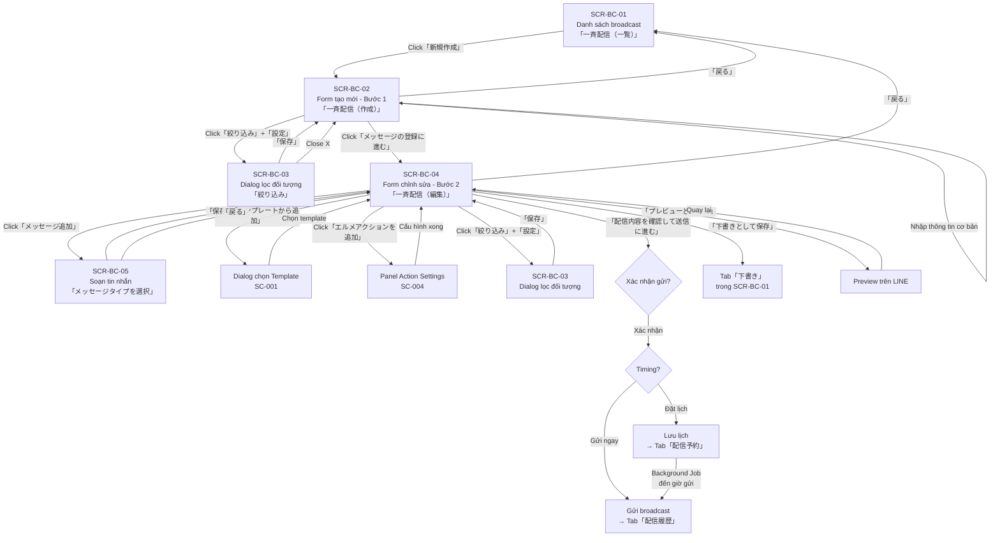

# UI Spec — FA-008:「メッセージ配信」(Gửi tin nhắn hàng loạt / Broadcast)

**Feature ID**: FA-008
**Portal**: Admin
**URL gốc**: `/basic/message-send-all`
**Ngày phân tích**: 2026-03-26
**Nguồn dữ liệu**: Playwright CLI snapshots + screenshots từ production

---

## 1. Tổng quan

Tính năng「メッセージ配信」cho phép Admin/Staff tạo và gửi tin nhắn hàng loạt (broadcast) đến bạn bè LINE. Quy trình gồm 2 bước chính:
1. **Bước 1** — Thiết lập thông tin broadcast (tiêu đề, người gửi, thời gian, đối tượng)
2. **Bước 2** — Soạn nội dung tin nhắn, thêm action, xem trước và gửi

Broadcast có 3 trạng thái chính: **đặt lịch** (配信予約), **bản nháp** (下書き), **đã gửi** (配信履歴).

### Actors

| Actor | Vai trò trong tính năng |
|-------|------------------------|
| **Admin** | Tạo, chỉnh sửa, xoá, gửi broadcast. Toàn quyền. |
| **Staff** | Tạo, chỉnh sửa, gửi broadcast (tuỳ quyền Admin cấp) |
| **LINE User** | Nhận tin nhắn broadcast trên LINE |
| **Background Job** | Thực hiện gửi tin nhắn hàng loạt theo lịch đặt |

### Shared Components sử dụng

| Mã | Component | Vị trí sử dụng |
|----|-----------|----------------|
| SC-003 | Friend Filter/Segment「絞り込み」 | SCR-BC-03: Dialog lọc đối tượng nhận tin |
| SC-004 | Action Settings「アクション設定」 | SCR-BC-04:「エルメアクションを追加」 |
| SC-005 | Rich Text / Message Editor「メッセージ編集」 | SCR-BC-05: Soạn nội dung tin nhắn |
| SC-006 | Delivery Target Selector「配信先」 | SCR-BC-02/04:「配信先絞込み」section |
| SC-007 | Schedule/Timer Settings「配信日時」 | SCR-BC-02/04:「配信タイミング設定」section |

---

## 2. Danh sách màn hình

| Screen ID | Tên JP | Tên VN | URL | Mô tả |
|-----------|--------|--------|-----|-------|
| SCR-BC-01 | 一斉配信（一覧） | Danh sách broadcast | `/basic/message-send-all` | Danh sách broadcast với 3 tabs |
| SCR-BC-02 | 一斉配信（作成）| Form tạo broadcast (Bước 1) | `/basic/add-broadcast-v2` | Nhập tiêu đề, chọn thời gian, chọn đối tượng |
| SCR-BC-03 | 絞り込み | Dialog lọc đối tượng | Dialog trên SCR-BC-02/04 | Chọn điều kiện lọc bạn bè (SC-003) |
| SCR-BC-04 | 一斉配信（編集） | Form chỉnh sửa broadcast (Bước 2) | `/basic/add-broadcast-v2?broadcast_id=XXX` | Soạn tin nhắn, thêm action, xem trước |
| SCR-BC-05 | メッセージタイプを選択 | Soạn tin nhắn | `/basic/template-v2/add-template?...` | Chọn loại tin nhắn và soạn nội dung |

---

## 3. Chi tiết từng màn hình

### SCR-BC-01:「一斉配信（一覧）」— Danh sách broadcast

**URL**: `/basic/message-send-all`

#### Layout
- **Header**: Logo L Message (trái), thông tin tài khoản + nút chọn bot (phải), hiển thị配信数 (số tin đã gửi) với 2 dòng: L Message `0/無制限 (スタンダード)` và LINE公式アカウント `1/500 (コミュニケーション)`, link「詳細を見る」
- **Sidebar trái**: Menu chính (collapsible), mục「メッセージ配信」thuộc nhóm「メッセージ」
- **Main content**: Tiêu đề「メッセージ配信」+ link「マニュアル」, cảnh báo trễ 5-15 phút, tabs, toolbar, bảng dữ liệu

#### Tabs / Sub-navigation

| Tab | Label JP | Label VN | Mô tả |
|-----|----------|----------|-------|
| Tab 1 | 配信予約 | Đặt lịch | Danh sách broadcast đã đặt lịch gửi |
| Tab 2 | 下書き | Bản nháp | Danh sách broadcast lưu nháp |
| Tab 3 | 配信履歴 | Lịch sử gửi | Danh sách broadcast đã gửi |

#### Thông báo cảnh báo
- Dòng text: 「通信状況により配信予定時間から5~15分遅れて配信される場合があります。」(Do tình trạng mạng, có thể trễ 5-15 phút so với giờ đặt lịch)

#### Toolbar

| Element | Label JP | Type | Vị trí | Hành vi |
|---------|----------|------|--------|---------|
| Nút tạo mới | 新規作成 | Link/Button (có icon +) | Toolbar trái | Chuyển đến SCR-BC-02 |
| Bộ lọc thời gian | 全期間 | Button dropdown | Toolbar giữa | Lọc theo khoảng thời gian |
| Ô tìm kiếm | (không label) | Textbox | Toolbar giữa | Tìm kiếm broadcast |
| Xoá hàng loạt | 一括削除 | Button (có icon) | Toolbar phải | Xoá các broadcast đã chọn. Disabled khi chưa chọn |

#### Data Tables

**Tab「配信予約」(Đặt lịch)**

| # | Column Header JP | Column Header VN | Data Type | Sortable | Ghi chú |
|---|-----------------|------------------|-----------|----------|---------|
| 1 | (checkbox) | (checkbox) | Checkbox | - | Chọn nhiều để xoá hàng loạt |
| 2 | 配信予定日時 | Ngày giờ dự kiến gửi | DateTime | Co (icon sort up/down) | Có sort icon |
| 3 | 管理用タイトル | Tiêu đề quản lý | String | Kh | - |
| 4 | 配信先絞込み | Lọc đối tượng | String | Kh | Điều kiện lọc đã chọn |
| 5 | 配信数 | Số lượng gửi | Number | Kh | - |
| 6 | 送信者名 | Tên người gửi | String | Kh | - |
| 7 | アクション | Action | String | Kh | Action đã cấu hình |
| 8 | クイックテスト | Quick test | String | Kh | Trạng thái quick test |
| 9 | 操作 | Thao tác | Action buttons | - | Nút sửa/xoá |

- Empty state: 「配信予約の登録はありません」(Không có broadcast đặt lịch)
- Phân trang: 「全0件中 1-0件を表示」
- Nút「Choose File」ở cuối trang (có thể import CSV)

**Tab「下書き」(Bản nháp)**

| # | Column Header JP | Column Header VN | Data Type | Sortable | Ghi chú |
|---|-----------------|------------------|-----------|----------|---------|
| 1 | (checkbox) | (checkbox) | Checkbox | - | Chọn nhiều để xoá hàng loạt |
| 2 | 作成・更新日時 | Ngày tạo/cập nhật | DateTime | Co (icon sort) | Thay vì配信予定日時 |
| 3 | 管理用タイトル | Tiêu đề quản lý | String | Kh | - |
| 4 | 配信予定日時 | Ngày giờ dự kiến gửi | DateTime | Co (icon sort) | - |
| 5 | 配信先絞込み | Lọc đối tượng | String | Kh | - |
| 6 | 配信数 | Số lượng gửi | Number | Kh | - |
| 7 | 送信者名 | Tên người gửi | String | Kh | - |
| 8 | アクション | Action | String | Kh | - |
| 9 | 操作 | Thao tác | Action buttons | - | - |

- Lưu ý: 「配信予定日時が現在日時より前の場合でも、下書きの場合は配信されません。」(Kể cả khi thời gian đặt lịch đã qua, bản nháp sẽ không được gửi)
- Empty state: 「下書きの登録はありません」
- Nút「一括削除」disabled khi chưa chọn

**Tab「配信履歴」(Lịch sử)**

| # | Column Header JP | Column Header VN | Data Type | Sortable | Ghi chú |
|---|-----------------|------------------|-----------|----------|---------|
| 1 | 配信日時 | Ngày giờ đã gửi | DateTime | Co (icon sort) | KHÔNG có checkbox |
| 2 | 管理用タイトル | Tiêu đề quản lý | String | Kh | - |
| 3 | 配信先絞込み | Lọc đối tượng | String | Kh | - |
| 4 | 配信数 | Số lượng gửi | Number | Kh | - |
| 5 | 送信者名 | Tên người gửi | String | Kh | - |
| 6 | アクション | Action | String | Kh | - |
| 7 | 操作 | Thao tác | Action buttons | - | - |

- Khác biệt: KHÔNG có checkbox, KHÔNG có nút xoá hàng loạt, KHÔNG có cột「クイックテスト」
- Có thêm: ô tìm kiếm, filter「全期間」, và dropdown「表示件数」(100件 / 200件 / 500件)
- Empty state: 「配信履歴はありません」

#### Observations (SCR-BC-01)
- 3 tabs có cấu trúc bảng khác nhau (columns khác nhau)
- Tab「配信予約」và「下書き」có checkbox để xoá hàng loạt, tab「配信履歴」không có
- Tab「配信履歴」có dropdown chọn số dòng hiển thị (100/200/500), 2 tab kia không thấy
- Tab「配信予約」có cột「クイックテスト」, 2 tab kia không có
- Nút「Choose File」ở cuối trang — có thể dùng để import broadcast từ CSV

---

### SCR-BC-02:「一斉配信（作成）」— Form tạo broadcast (Bước 1)

**URL**: `/basic/add-broadcast-v2`
**Breadcrumb**: 「メッセージ登録」>「メッセージ配信一覧に戻る」(link về SCR-BC-01)

#### Layout
- **Header**: giống SCR-BC-01
- **Sidebar**: giống SCR-BC-01
- **Main content**: Tiêu đề「メッセージ登録」, link quay lại danh sách, form nhập liệu, nút hành động ở cuối

#### Form Fields

| # | Label JP | Label VN | Type | Required | Placeholder | Default | Max Length | Validation | Ghi chú |
|---|----------|----------|------|----------|-------------|---------|------------|------------|---------|
| 1 | 管理用タイトル | Tiêu đề quản lý | Textbox | Kh rõ | (trống) | (trống) | 20 ký tự | Counter hiển thị `0/20` | 「（友だちには公開されません）」— Không hiển thị cho bạn bè |
| 2 | 送信者名 | Tên người gửi | Display + Button | - | - | Tên LINE OA hiện tại | - | - | Hiển thị avatar + tên bot, nút「設定」để thay đổi |
| 3 | 配信タイミング設定 | Cài đặt thời gian gửi | Radio group | Co | - | メッセージ登録後すぐに配信 | - | - | → Xem chi tiết bên dưới (SC-007) |
| 4 | 配信先絞込み | Lọc đối tượng nhận | Radio group + Button | Co | - | すべての友だち | - | - | → Xem chi tiết bên dưới (SC-006) |

**配信タイミング設定 (SC-007) — Chi tiết:**

| Option | Label JP | Label VN | Mô tả |
|--------|----------|----------|-------|
| Option 1 | メッセージ登録後すぐに配信 | Gửi ngay sau khi đăng ký | Gửi ngay lập tức khi bấm gửi |
| Option 2 | 配信予約 | Đặt lịch | Chọn ngày giờ gửi, hỗ trợ nhiều slot |

- Khi chọn「配信予約」: hiện date picker (format `YYYY-MM-DD`) + time picker (format `HH:mm`) + text「に配信」(sẽ gửi vào)
- Hiển thị ngày dạng Japanese: `2026年03月26日(木)`
- Lưu ý: 「配信日時は複数登録ができます。最大10個の日時まで登録可能です。」(Có thể đăng ký nhiều ngày giờ, tối đa 10)
- Nút「配信日時追加」(Thêm ngày giờ gửi) — có icon +

**配信先絞込み (SC-006) — Chi tiết:**

| Option | Label JP | Label VN | Mô tả |
|--------|----------|----------|-------|
| Option 1 | すべての友だち | Tất cả bạn bè | Gửi cho tất cả |
| Option 2 | 絞り込み | Lọc | Chọn điều kiện lọc, mở SCR-BC-03 |

- Nút「設定」(Cài đặt): mở dialog filter (SCR-BC-03). Disabled khi chọn「すべての友だち」, enabled khi chọn「絞り込み」
- Hiển thị「配信数」(Số lượng gửi) + icon thông tin: `1人(予定)` (1 người dự kiến)
- Nút「再計算」(Tính lại): cập nhật lại số lượng dự kiến. Disabled khi chọn「すべての友だち」
- Text hiển thị: 「未設定（全員）」(Chưa cài đặt — tất cả)

#### Action Buttons (SCR-BC-02)

| Button | Label JP | Label VN | Type | Vị trí | Hành vi | Trạng thái |
|--------|----------|----------|------|--------|---------|------------|
| Submit | メッセージの登録に進む | Tiến tới đăng ký tin nhắn | Primary button (có icon >) | Footer | Chuyển sang SCR-BC-04 (Bước 2) | Disabled khi form chưa hợp lệ |
| Back | 戻る | Quay lại | Text link | Footer | Quay về SCR-BC-01 | - |

#### Observations (SCR-BC-02)
- Form chia 2 bước: Bước 1 (thông tin chung) → Bước 2 (soạn tin nhắn)
- Nút「メッセージの登録に進む」bị disabled khi form chưa đủ thông tin
- Nút「設定」của送信者名 luôn enabled — cho phép thay đổi tên người gửi
- Tối đa 10 slot thời gian gửi khác nhau cho 1 broadcast
- Trường送信者名 hiển thị avatar + tên bot hiện tại, không phải input text

---

### SCR-BC-03:「絞り込み」— Dialog lọc đối tượng (SC-003)

**Type**: Modal dialog (overlay trên SCR-BC-02 hoặc SCR-BC-04)

#### Layout
- **Header**: Tiêu đề「絞り込み」+ nút đóng (X)
- **2 tabs điều kiện**: AND và OR
- **Sidebar trái**: Danh sách 11 loại filter
- **Main content phải**: 2 khu vực hiển thị điều kiện AND và OR đã chọn
- **Footer**: Nút「保存」

#### Tabs điều kiện

| Tab | Label JP | Label VN | Mô tả |
|-----|----------|----------|-------|
| Tab AND | 「全て満たす」必要がある条件 (and条件)を追加 | Thêm điều kiện AND (phải thoả tất cả) | Click để thêm điều kiện AND |
| Tab OR | 「どれか1つ以上満たす」必要がある条件 (or条件)を追加 | Thêm điều kiện OR (thoả ít nhất 1) | Click để thêm điều kiện OR |

#### Danh sách Filter Types (11 loại)

| # | Filter Type JP | Filter Type VN | Mô tả dự đoán |
|---|---------------|----------------|----------------|
| 1 | タグ | Tag | Lọc theo tag đã gán cho bạn bè |
| 2 | 友だち名 | Tên bạn bè | Lọc theo tên bạn bè LINE |
| 3 | 友だち追加日 | Ngày thêm bạn bè | Lọc theo ngày bạn bè follow |
| 4 | ステップ購読状況 | Trạng thái đăng ký Step | Lọc theo step delivery subscription |
| 5 | QRコードアクション | QR Code Action | Lọc theo QR code action đã thực hiện |
| 6 | コンバージョン | Conversion | Lọc theo conversion đã đạt |
| 7 | 確認状況 | Trạng thái xác nhận | Lọc theo trạng thái xác nhận |
| 8 | 友だち情報 | Thông tin bạn bè | Lọc theo thuộc tính custom của bạn bè |
| 9 | 対応ステータス | Trạng thái xử lý | Lọc theo trạng thái tương tác (đang xử lý, đã xong...) |
| 10 | アフィリエイター | Affiliate | Lọc theo nguồn giới thiệu |
| 11 | 新規・既存 友だち | Bạn bè mới/cũ | Lọc theo bạn mới hay bạn cũ |

#### Khu vực hiển thị điều kiện đã chọn

| Khu vực | Label JP | Label VN |
|---------|----------|----------|
| AND | 「全て満たす」必要がある条件 (and条件) | Điều kiện AND |
| OR | 「どれか1つ以上満たす」必要がある条件 (or条件) | Điều kiện OR |

#### Action Buttons (SCR-BC-03)

| Button | Label JP | Type | Hành vi |
|--------|----------|------|---------|
| Đóng | (icon X) | Icon button | Đóng dialog, không lưu |
| Lưu | 保存 | Primary button | Lưu điều kiện lọc, đóng dialog, cập nhật số配信数 |

#### Observations (SCR-BC-03)
- Mỗi filter type là 1 button trong sidebar trái, click để thêm vào khu vực AND hoặc OR tuỳ tab đang chọn
- Kết hợp AND/OR: các điều kiện AND phải thoả tất cả, các điều kiện OR thoả ít nhất 1
- Chưa quan sát được chi tiết UI bên trong mỗi filter type (cần mở từng loại để xem)
- Component này (SC-003) được dùng chung ở nhiều tính năng khác: FA-002, FA-009, FA-013, FA-024

---

### SCR-BC-04:「一斉配信（編集）」— Form chỉnh sửa broadcast (Bước 2)

**URL**: `/basic/add-broadcast-v2?broadcast_id=XXX`
**Breadcrumb**: 「メッセージ登録」>「メッセージ配信一覧に戻る」

#### Layout
- Giống SCR-BC-02 nhưng thêm section「メッセージ登録」và「エルメアクション」

#### Form Fields
Giữ nguyên tất cả fields từ SCR-BC-02 (管理用タイトル, 送信者名, 配信タイミング設定, 配信先絞込み) + thêm:

**Section「メッセージ登録」(Đăng ký tin nhắn)**

| Element | Label JP | Label VN | Type | Hành vi |
|---------|----------|----------|------|---------|
| Nút thêm tin nhắn | メッセージ追加 | Thêm tin nhắn | Button (icon +) | Mở SCR-BC-05 (message editor) |
| Nút thêm từ template | テンプレートから追加 | Thêm từ template | Button (icon +) | Mở dialog chọn template (SC-001) |
| Quick test | クイックテスト未設定 | Quick test chưa cài đặt | Link/Label | Cài đặt quick test |
| Empty state | メッセージが登録されていません | Chưa đăng ký tin nhắn | Text | Hiển thị khi chưa thêm tin nhắn nào |

**Section「エルメアクション」(SC-004)**

| Element | Label JP | Label VN | Type | Hành vi |
|---------|----------|----------|------|---------|
| Nút thêm action | エルメアクションを追加 | Thêm L Message action | Expandable link (icon >) | Mở panel cấu hình action (SC-004) |

#### Action Buttons (SCR-BC-04)

| Button | Label JP | Label VN | Type | Vị trí | Hành vi |
|--------|----------|----------|------|--------|---------|
| Xác nhận & gửi | 配信内容を確認して送信に進む | Xác nhận nội dung và tiến hành gửi | Primary button (icon >) | Footer | Mở dialog xác nhận gửi |
| Lưu nháp | 下書きとして保存 | Lưu bản nháp | Secondary button | Footer | Lưu broadcast dạng nháp, chuyển về tab「下書き」|
| Xem trước & test | プレビューとテスト | Xem trước và test | Secondary button | Footer | Xem trước tin nhắn trên LINE |
| Quay lại | 戻る | Quay lại | Text link | Footer | Quay về SCR-BC-01 |

#### Observations (SCR-BC-04)
- Bước 2 giữ nguyên toàn bộ form fields của Bước 1 (có thể chỉnh sửa lại)
- Có thể thêm nhiều tin nhắn vào 1 broadcast
- Nút「配信内容を確認して送信に進む」— chuyển sang màn confirm (chưa có snapshot)
- Quick test cho phép gửi thử tin nhắn trước khi gửi chính thức
- Text「戻る」là text link, không phải button

---

### SCR-BC-05:「メッセージタイプを選択」— Soạn tin nhắn (SC-005)

**URL**: `/basic/template-v2/add-template?...`
**Lưu ý**: 「保存後の変更はできません」(Không thể thay đổi type sau khi lưu)

#### Layout
- **Header**: Tiêu đề「メッセージタイプを選択（保存後の変更はできません）」
- **Message type tabs**: 5 loại tin nhắn
- **Sub-tabs**: Tabs cho nội dung và cài đặt
- **Editor area**: Soạn thảo nội dung
- **Footer**: Nút lưu và quay lại

#### Message Type Tabs (5 loại)

| # | Type JP | Type VN | Anchor | Mô tả |
|---|---------|---------|--------|-------|
| 1 | テキスト | Text | `#message-text` | Tin nhắn văn bản thuần |
| 2 | パネル・ボタン | Panel & Button | `#message-form` | Tin nhắn dạng card với nút bấm (Flex Message) |
| 3 | 画像・動画・音声 | Hình ảnh, Video, Audio | `#message-media` | Tin nhắn đa phương tiện |
| 4 | スタンプ | Sticker | `#message-stamp` | Tin nhắn sticker LINE |
| 5 | 位置情報 | Vị trí | `#message-location` | Tin nhắn chia sẻ vị trí |

#### Sub-tabs (trong type「テキスト」)

| Tab | Label JP | Label VN | Mô tả |
|-----|----------|----------|-------|
| Tab 1 | テキスト登録 | Đăng ký text | Soạn nội dung text |
| Tab 2 | URL表示期限・アクション設定 | Cài đặt thời hạn URL & action | Cấu hình URL tracking và action khi click |

#### Form Fields (Type「テキスト」)

| # | Label JP | Label VN | Type | Max Length | Ghi chú |
|---|----------|----------|------|------------|---------|
| 1 | (text area) | Nội dung tin nhắn | Textarea | 5,000 ký tự | Counter: `0/5,000` |
| 2 | このメッセージでは入力したそのままのURLを利用する | Sử dụng URL nguyên bản | Checkbox | - | Khi check: không tracking URL, không action khi tap |

#### Toolbar Buttons (trong editor)

| Button | Label JP | Label VN | Hành vi |
|--------|----------|----------|---------|
| Auto insert | 情報自動挿入 | Tự động chèn thông tin | Chèn biến tự động (tên bạn bè, ngày...) |
| PDF upload | PDFアップロード | Tải PDF lên | Upload file PDF |
| Emoji | 絵文字 | Emoji | Chèn LINE emoji |

#### Lưu ý URL
- 「※ URLの前後には自動的に半角スペースが挿入されます。（Android端末で正常にURLが表示されない場合があるため。）」
- (Tự động chèn space trước và sau URL vì Android có thể không hiển thị đúng URL)
- Khi check「このメッセージでは入力したそのままのURLを利用する」: 「(そのままのURLを利用する場合、配信・開封の情報取得、URLタップ時アクションが利用できません。)」(Không thể tracking và không có action khi tap URL)

#### Action Buttons (SCR-BC-05)

| Button | Label JP | Label VN | Type | Hành vi |
|--------|----------|----------|------|---------|
| Lưu | 保存 | Lưu | Primary button | Lưu tin nhắn, quay về SCR-BC-04 |
| Quay lại | 戻る | Quay lại | Secondary button | Quay về SCR-BC-04 không lưu |

#### Observations (SCR-BC-05)
- Loại tin nhắn không thể thay đổi sau khi lưu — lựa chọn ban đầu quan trọng
- Chỉ quan sát được chi tiết type「テキスト」, 4 type còn lại cần điều tra thêm
- Checkbox URL nguyên bản ảnh hưởng đến tracking và action — trade-off giữa tracking và URL display

---

## 4. User Flows

### Happy Path — Tạo và gửi broadcast ngay lập tức

1. Admin vào SCR-BC-01 → Click「新規作成」
2. Chuyển sang SCR-BC-02 → Nhập「管理用タイトル」, giữ「メッセージ登録後すぐに配信」
3. Chọn đối tượng:「すべての友だち」hoặc「絞り込み」→ mở SCR-BC-03 → chọn filter → 「保存」
4. Click「メッセージの登録に進む」→ chuyển sang SCR-BC-04
5. Click「メッセージ追加」→ mở SCR-BC-05 → chọn type → soạn nội dung → 「保存」
6. (Tuỳ chọn)「エルメアクションを追加」→ cấu hình action
7. (Tuỳ chọn)「プレビューとテスト」→ xem trước trên LINE
8. Click「配信内容を確認して送信に進む」→ xác nhận → gửi
9. Broadcast xuất hiện ở tab「配信履歴」

### Happy Path — Tạo broadcast đặt lịch

1-2. Giống trên, nhưng chọn「配信予約」→ nhập ngày/giờ
3-6. Giống trên
7. Click「配信内容を確認して送信に進む」→ xác nhận
8. Broadcast xuất hiện ở tab「配信予約」
9. Background Job gửi tin nhắn vào thời gian đã đặt

### Happy Path — Lưu nháp

1-6. Giống trên
7. Click「下書きとして保存」
8. Broadcast xuất hiện ở tab「下書き」

### Xoá hàng loạt

1. Admin vào tab「配信予約」hoặc「下書き」
2. Check checkbox các broadcast cần xoá
3. Click「一括削除」
4. Xác nhận xoá

---

## 5. Flow Diagram

---

## 6. Điểm chưa rõ / Cần điều tra thêm

| # | Câu hỏi | Độ ưu tiên | Ghi chú |
|---|---------|------------|---------|
| 1 | Màn hình xác nhận gửi (sau khi click「配信内容を確認して送信に進む」) trông như thế nào? | Cao | Chưa có snapshot |
| 2 | Chi tiết UI của 4 message types còn lại (パネル・ボタン, 画像・動画・音声, スタンプ, 位置情報)? | Cao | Chỉ có snapshot cho type テキスト |
| 3 | Chi tiết bên trong mỗi filter type ở SCR-BC-03 (khi click vào タグ, 友だち名, v.v.)? | Trung bình | Chưa mở chi tiết từng filter |
| 4 | Tab「URL表示期限・アクション設定」ở SCR-BC-05 chứa gì? | Trung bình | Chưa có snapshot |
| 5 | Nút「設定」của送信者名 mở dialog gì? Có thể thay đổi gì? | Trung bình | Chưa có snapshot |
| 6 | Nút「Choose File」ở cuối SCR-BC-01 dùng để làm gì? Import CSV? | Thấp | Có thể là import broadcast |
| 7 | Quick test hoạt động như thế nào? Gửi thử cho ai? | Trung bình | Chưa có snapshot |
| 8 | Cột「操作」(Thao tác) trong bảng chứa nút gì? Sửa? Xoá? Sao chép? | Trung bình | Bảng trống nên không thấy |
| 9 | Giới hạn số tin nhắn tối đa trong 1 broadcast? | Trung bình | LINE API giới hạn 5 bubbles |
| 10 | Khi chỉnh sửa broadcast đã đặt lịch, hành vi ra sao nếu < 5 phút trước giờ gửi? | Cao | Có ghi chú「配信日時5分前から配信内容の編集はできません」|
| 11 | Staff có quyền truy cập tính năng này không? Quyền nào bị giới hạn? | Trung bình | Cần xác nhận access control |
