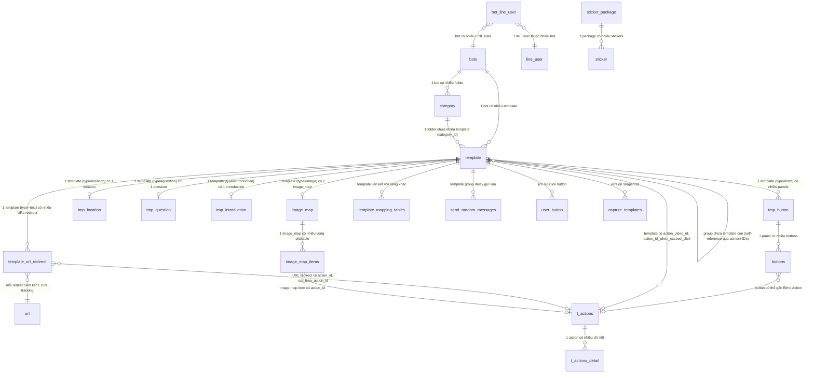

# FA-010 Mẫu tin nhắn「テンプレート」 — DB Mapping

> **Mã tính năng:** FA-010
> **Ngày tạo:** 2026-03-26
> **Nguồn:** DB schema (`db/schema/tables/`), sample data (`db/data/tables/`), cross-reference với ui-spec, api-spec, logic-spec
> **Tin cậy chung:** **Cao** (đọc trực tiếp từ schema + source code model declarations)

---

## 1. Bảng dữ liệu liên quan

### 1.1. Bảng chính (Primary Tables)

| Bảng | Mô tả | Data size | Model Laravel | Liên kết |
|------|-------|-----------|---------------|---------|
| `template` | Bảng chính chứa toàn bộ templates (mọi loại: text, form, stamp, image, video, voice, location, introduction, question, group) | 1.8MB | `App\Template` | Trung tâm tính năng |
| `category` | Folder phân loại template (dùng chung cho nhiều tính năng qua field `kind`) | 509KB | `App\Category` | `template.category_id` → `category.id` |
| `tmp_button` | Panel trong template loại Panel/Button (type=form). Mỗi panel chứa title, text, ảnh | 1.0MB | `App\TmpButton` | `tmp_button.template_id` → `template.id` |
| `buttons` | Button trên mỗi panel — label, action type, action data | 2.8MB | `App\Buttons` | `buttons.button_id` → `tmp_button.id` |
| `tmp_location` | Toạ độ vị trí cho template type=location | 174KB | `App\TmpLocation` | `tmp_location.template_id` → `template.id` |
| `template_url_redirect` | Cấu hình URL redirect/tracking cho template type=text | 180KB | `App\TemplateUrlRedirect` | `template_url_redirect.template_id` → `template.id` |

### 1.2. Bảng phụ (Secondary / Related Tables)

| Bảng | Mô tả | Kiểu | Liên kết chính |
|------|-------|------|---------------|
| `image_map` | Image map settings cho template type=image (khi bật image map) | 1:1 với template | `image_map.template_id` → `template.id` |
| `image_map_items` | Vùng clickable trên image map — toạ độ, action | 1:N với image_map | `image_map_items.image_map_id` → `image_map.id` |
| `tmp_question` | Dữ liệu template type=question (legacy — 2 câu trả lời) | 1:1 với template | `tmp_question.template_id` → `template.id` |
| `tmp_introduction` | Dữ liệu template type=introduction (legacy) | 1:1 với template | `tmp_introduction.template_id` → `template.id` |
| `sticker` | Danh sách sticker LINE (stickerId + packageId) | Reference | Template type=stamp lưu stickerId trong `template.content` |
| `sticker_package` | Package sticker LINE (tên, avatar) | Reference | `sticker.packageId` → `sticker_package.package_id` |
| `media` | Thư viện media (ảnh, video, âm thanh) | Reference | Template type=image/video/voice dùng `media.media_path` |
| `url` | URL tracking (connection `mysql_url` riêng) | Reference | `template_url_redirect.url_id` → `url.id` |
| `t_actions` | Action container (Elme Action / Friend Action) — SC-004 | Reference | `template.action_video_id`, `template.action_id_when_exceed_click`, `buttons.action_id` → `t_actions.id` |
| `t_actions_detail` | Chi tiết action (type + data JSON) | 1:N với t_actions | `t_actions_detail.action_id` → `t_actions.id` |
| `template_mapping_tables` | Mapping liên kết template với các bảng khác (step_message, v.v.) | Pivot | `template_mapping_tables.template_id` → `template.id` |
| `send_random_messages` | Tin nhắn delay gửi sau (cho template group có is_delay_message=1) | Queue | `send_random_messages.template_id` → `template.id` |
| `user_button` | Lưu lịch sử user click button trên template (để đếm tap) | Log | `user_button.template_id` → `template.id`, `user_button.button_id` → `buttons.id` |
| `bot_line_user` | Quan hệ bot ↔ LINE user (dùng cho quick test: is_tester, is_blocked, is_quick_reply) | Reference | Filter is_tester=1 khi gửi test |
| `line_user` | Thông tin LINE user (name, avatar, view_name) | Reference | `bot_line_user.line_user_id` → `line_user.id` |
| `bots_tutorial` | Trạng thái tutorial — cập nhật `status_template` khi tạo template đầu tiên | Config | `bots_tutorial.bot_id` → `bots.id` |
| `backup_history` | Lịch sử backup — kiểm tra trước mọi thao tác ghi | Config | `backup_history.code` = `bots.transfer_code` |
| `capture_templates` | Snapshot template cho version control | Audit | `capture_templates.template_id` → `template.id` |

---

## 2. Chi tiết từng bảng

### 2.1. Bảng: `template`

- **Model Laravel:** `App\Template` (file: `app/Template.php`)
- **Timestamps:** `true` (created_at, updated_at)
- **Guard:** `$guarded = ['url_image']`

#### Columns

| # | Cột | Kiểu | Nullable | Default | Mô tả |
|---|-----|------|----------|---------|-------|
| 1 | `id` | int(11) | Không | AUTO_INCREMENT | Khoá chính |
| 2 | `bot_id` | int(11) | Không | — | ID bot (LINE OA) — filter chính |
| 3 | `name` | varchar(255) | Có | NULL | Tên quản lý template「管理名」 |
| 4 | `category_id` | int(11) | Có | NULL | ID folder. `0` = 「未分類」(mặc định, không có record trong `category`) |
| 5 | `position` | int(11) | Có | NULL | Thứ tự sắp xếp trong folder |
| 6 | `type` | varchar(30) | Không | — | Loại template: text, form, stamp, image, video, voice, location, introduction, question, group |
| 7 | `content` | longtext | Có | NULL | Nội dung chính — ý nghĩa tuỳ type (xem enum bên dưới) |
| 8 | `embed_regex_text` | varchar(255) | Có | NULL | Regex pattern nhúng (ít dùng) |
| 9 | `thumbnail_path` | text | Không | — | Đường dẫn thumbnail (ảnh/video/panel) |
| 10 | `duration` | int(11) | Có | NULL | Thời lượng media (giây) — cho type=video/voice |
| 11 | `answer_type` | tinyint(1) | Không | 0 | Giới hạn tap: 0=unlimited, 1=panel 1 click, 2=carousel 1 click |
| 12 | `is_shorten_url` | int(11) | Không | 1 | Dùng URL rút gọn: 0=không, 1=có |
| 13 | `number_action_url_redirect` | int(11) | Không | 1 | Chế độ action URL:「一度のみ稼働」(1) / 「何度でも稼働」(>1) |
| 14 | `in_park` | tinyint(4) | Không | 0 | Đánh dấu template thuộc park/group: 0=không, 1=có |
| 15 | `created_at` | timestamp | Không | CURRENT_TIMESTAMP | Ngày tạo「作成日」 |
| 16 | `updated_at` | timestamp | Có | ON UPDATE CURRENT_TIMESTAMP | Ngày sửa cuối「最終編集日」 |
| 17 | `carousel_action_type` | tinyint(4) | Không | 0 | Loại action carousel (cho type=form) |
| 18 | `text_video` | varchar(255) | Có | NULL | Text đi kèm video |
| 19 | `action_video_id` | int(11) | Có | NULL | FK → `t_actions.id` — action khi xem video |
| 20 | `image_server` | varchar(255) | Có | NULL | URL media server chứa ảnh |
| 21 | `rate_image_button` | varchar(255) | Có | NULL | Tỷ lệ aspect ratio ảnh panel (dạng "W:H") |
| 22 | `type_button` | tinyint(4) | Có | 1 | Sub-type panel: 1=Standard, 2=Color, 3=Image, 4=Quick Reply |
| 23 | `message_sent_when_exceed_click` | text | Có | NULL | Nội dung tin nhắn khi vượt giới hạn tap「設定タップ数を超えた時の送信メッセージ」 |
| 24 | `is_original_aspect_ratio` | int(11) | Có | NULL | Giữ nguyên tỷ lệ ảnh gốc |
| 25 | `type_size` | varchar(255) | Có | NULL | Kích thước hiển thị (cho image) |
| 26 | `is_setting_image_map` | tinyint(4) | Có | NULL | Bật image map: 0=tắt, 1=bật (cho type=image) |
| 27 | `action_id_when_exceed_click` | int(11) | Có | NULL | FK → `t_actions.id` — action khi vượt giới hạn tap「設定タップ数を超えた時の稼働アクション」 |
| 28 | `flag_type_content_quick_reply` | int(11) | Có | 1 | Flag loại content quick reply |
| 29 | `is_send_message_when_exceed_click` | int(11) | Có | 1 | Toggle gửi message khi vượt tap:「送信する」(1) /「送信しない」(0) |
| 30 | `is_delay_message` | tinyint(4) | Có | NULL | Bật delay message cho group: 0=tắt, 1=bật |
| 31 | `update_timestamp` | bigint(20) | Có | NULL | Timestamp epoch dùng cho sync |
| 32 | `file_size` | int(11) | Có | NULL | Kích thước file media (bytes) |
| 33 | `use_preview_url` | tinyint(4) | Không | 1 | Hiển thị URL preview trên LINE:「表示する」(1) /「表示しない」(0) |

#### Indexes (suy luận từ usage patterns)

| Tên Index | Cột | Kiểu | Mô tả | Tin cậy |
|----------|-----|------|-------|---------|
| PRIMARY | `id` | Primary | Khoá chính | **Cao** |
| (idx_bot_category) | `bot_id`, `category_id` | Index | Filter theo bot + folder | **Trung bình** |
| (idx_bot_type) | `bot_id`, `type` | Index | Filter theo bot + loại | **Trung bình** |

#### Foreign Keys (logic, không có FK constraint trong schema)

| Cột | Tham chiếu | Mô tả | Tin cậy |
|-----|-----------|-------|---------|
| `bot_id` | `bots.id` | Bot sở hữu template | **Cao** |
| `category_id` | `category.id` | Folder chứa template (0 = mặc định) | **Cao** |
| `action_video_id` | `t_actions.id` | Action khi xem video | **Cao** |
| `action_id_when_exceed_click` | `t_actions.id` | Action khi vượt tap limit | **Cao** |

---

### 2.2. Bảng: `category`

- **Model Laravel:** `App\Category` (file: `app/Category.php`)
- **Dùng chung:** Bảng category dùng cho nhiều tính năng, phân biệt bằng field `kind`
- **Kind cho template:** `config('sns-line.category_kind.template')` (giá trị cụ thể trong config)

#### Columns

| # | Cột | Kiểu | Nullable | Default | Mô tả |
|---|-----|------|----------|---------|-------|
| 1 | `id` | int(11) | Không | AUTO_INCREMENT | Khoá chính |
| 2 | `bot_id` | int(11) | Không | — | ID bot sở hữu |
| 3 | `kind` | int(11) | Không | — | Loại category — dùng để phân biệt context (template, scenario, broadcast, v.v.) |
| 4 | `name` | varchar(100) | Không | — | Tên folder「フォルダ名」 |
| 5 | `position` | int(11) | Có | NULL | Thứ tự sắp xếp |
| 6 | `is_deleted` | int(11) | Có | 0 | Soft delete: 0=active, 1=deleted |
| 7 | `created_at` | timestamp | Không | CURRENT_TIMESTAMP | Ngày tạo |
| 8 | `updated_at` | timestamp | Có | ON UPDATE CURRENT_TIMESTAMP | Ngày cập nhật |
| 9 | `category_id_old` | int(11) | Không | -1 | ID cũ (dùng cho migration/backup) |

#### Lưu ý quan trọng
- Folder mặc định「未分類」**không có** record trong bảng `category` — sử dụng convention `category_id = 0` trong code
- Folder mặc định không thể xoá (kiểm tra `group_id = 0` trước khi delete)
- Khi xoá folder → tất cả template trong folder bị hard delete

---

### 2.3. Bảng: `tmp_button`

- **Model Laravel:** `App\TmpButton` (file: `app/TmpButton.php`)
- **Mô tả:** Đại diện 1 panel trong template type=form (Panel/Button). Mỗi template có tối đa 10 panels.

#### Columns

| # | Cột | Kiểu | Nullable | Default | Mô tả |
|---|-----|------|----------|---------|-------|
| 1 | `id` | int(11) | Không | AUTO_INCREMENT | Khoá chính |
| 2 | `template_id` | int(11) | Không | — | FK → `template.id` |
| 3 | `title` | varchar(256) | Có | NULL | Tiêu đề panel「タイトル」(max 40 ký tự trên UI) |
| 4 | `text` | varchar(256) | Không | — | Nội dung text panel「本文」(max 60 ký tự trên UI) |
| 5 | `img_path` | varchar(500) | Có | NULL | Đường dẫn ảnh header panel「画像登録」 |
| 6 | `created_at` | timestamp | Không | CURRENT_TIMESTAMP | Ngày tạo |
| 7 | `updated_at` | timestamp | Có | ON UPDATE CURRENT_TIMESTAMP | Ngày cập nhật |
| 8 | `order` | tinyint(4) | Không | 1 | Thứ tự panel trong carousel |
| 9 | `image_server` | varchar(255) | Có | NULL | URL media server chứa ảnh panel |
| 10 | `title_color` | varchar(20) | Có | NULL | Màu chữ tiêu đề (cho type_button=2 Color) |
| 11 | `title_background` | varchar(20) | Có | NULL | Màu nền tiêu đề |
| 12 | `text_color` | varchar(20) | Có | NULL | Màu chữ nội dung |
| 13 | `text_background` | varchar(20) | Có | NULL | Màu nền nội dung |
| 14 | `is_title_bold` | tinyint(4) | Có | NULL | Tiêu đề in đậm: 0=không, 1=có |
| 15 | `is_text_bold` | tinyint(4) | Có | NULL | Nội dung in đậm: 0=không, 1=có |
| 16 | `number_row_display` | tinyint(4) | Có | NULL | Số dòng hiển thị: 1=1 row, 2=2 row |
| 17 | `default_label_color` | varchar(20) | Có | NULL | Màu chữ mặc định cho label button |
| 18 | `default_label_bg` | varchar(20) | Có | NULL | Màu nền mặc định cho button |
| 19 | `is_apply_title` | tinyint(4) | Không | 1 | Hiển thị tiêu đề: 0=ẩn, 1=hiện |
| 20 | `is_apply_text` | tinyint(4) | Không | 1 | Hiển thị text: 0=ẩn, 1=hiện |
| 21 | `width` | int(11) | Có | NULL | Chiều rộng ảnh (pixel) |
| 22 | `height` | int(11) | Có | NULL | Chiều cao ảnh (pixel) |

---

### 2.4. Bảng: `buttons`

- **Model Laravel:** `App\Buttons` (file: `app/Buttons.php`)
- **Mô tả:** Button trên mỗi panel — chứa label, loại action, dữ liệu action. Max 4 buttons khi 1 panel, max 3 khi 2+ panels.

#### Columns

| # | Cột | Kiểu | Nullable | Default | Mô tả |
|---|-----|------|----------|---------|-------|
| 1 | `id` | int(11) | Không | AUTO_INCREMENT | Khoá chính |
| 2 | `button_id` | int(11) | Không | — | FK → `tmp_button.id` (panel chứa button) |
| 3 | `button_number` | int(11) | Không | — | Số thứ tự button trong panel |
| 4 | `post_back` | int(11) | Không | — | Loại action (xem enum bên dưới) |
| 5 | `method` | int(11) | Có | NULL | Phương thức reply: 0=text, 1=template |
| 6 | `label` | text | Có | NULL | Text hiển thị trên button「ボタンテキスト」 |
| 7 | `data` | text | Có | NULL | Dữ liệu action (URL, text, phone, v.v.) |
| 8 | `scenario` | int(11) | Có | NULL | FK → scenario (legacy) |
| 9 | `tag` | int(11) | Có | NULL | FK → tag (legacy) |
| 10 | `event_time_id` | int(11) | Không | 0 | FK → event_time (legacy) |
| 11 | `action_id` | int(11) | Có | NULL | FK → `t_actions.id` — Elme Action / Friend Action |
| 12 | `type_open_url` | tinyint(4) | Không | 0 | Loại trang mở (khi post_back=10): xem enum |
| 13 | `order` | tinyint(4) | Không | 1 | Thứ tự button |
| 14 | `form_id` | int(11) | Có | NULL | FK → form_answer — khi mở form |
| 15 | `booking_id` | int(11) | Có | NULL | FK → booking event — khi mở booking |
| 16 | `conversion_id` | int(11) | Có | NULL | FK → conversion — khi mở trang conversion |
| 17 | `items_id` | int(11) | Có | NULL | FK → product items — khi mở trang sản phẩm |
| 18 | `bill_type` | tinyint(4) | Không | 1 | Loại thao tác bill: 1=bill, 2=edit, 3=cancel |
| 19 | `site_script_id` | int(11) | Có | NULL | FK → site_script |
| 20 | `label_color` | varchar(20) | Có | NULL | Màu chữ button (cho Color type) |
| 21 | `label_bg` | varchar(20) | Có | NULL | Màu nền button |
| 22 | `type_url_schema` | tinyint(4) | Có | 0 | Loại URL schema (LINE URL Scheme) |
| 23 | `data_url_schema` | text | Có | NULL | Dữ liệu URL schema |
| 24 | `flag_open_url_in_browser` | tinyint(4) | Có | 0 | Mở URL trong browser ngoài: 0=LIFF, 1=browser |
| 25 | `is_setting_url_expired_date` | tinyint(4) | Có | 1 | Bật cài đặt hết hạn URL |
| 26 | `date_url_expired_date` | date | Có | NULL | Ngày hết hạn URL |
| 27 | `time_url_expired_date` | time | Có | NULL | Giờ hết hạn URL |
| 28 | `number_day_url_expired_date` | int(11) | Có | NULL | Số ngày hết hạn (tính từ delivery) |
| 29 | `calendar_id` | int(11) | Có | NULL | FK → booking_calendar — đặt lịch calendar |
| 30 | `url_expired` | varchar(255) | Có | NULL | URL chuyển hướng khi hết hạn |
| 31 | `url_expired_message` | text | Có | NULL | Thông báo khi URL hết hạn |
| 32 | `calendar_salon_id` | int(11) | Có | NULL | FK → calendar_salon — đặt lịch salon |
| 33 | `calendar_lesson_id` | int(11) | Có | NULL | FK → calendar tương ứng — đặt lịch lesson |

---

### 2.5. Bảng: `tmp_location`

- **Model Laravel:** `App\TmpLocation` (file: `app/TmpLocation.php`)
- **Mô tả:** Toạ độ vị trí cho template type=location. Quan hệ 1:1 với `template`.

#### Columns

| # | Cột | Kiểu | Nullable | Default | Mô tả |
|---|-----|------|----------|---------|-------|
| 1 | `id` | int(11) | Không | AUTO_INCREMENT | Khoá chính |
| 2 | `template_id` | int(11) | Không | — | FK → `template.id` |
| 3 | `address` | varchar(100) | Không | — | Địa chỉ「指定された住所」 |
| 4 | `latitude` | double | Không | — | Vĩ độ GPS |
| 5 | `longitude` | double | Không | — | Kinh độ GPS |
| 6 | `created_at` | timestamp | Không | CURRENT_TIMESTAMP | Ngày tạo |
| 7 | `updated_at` | timestamp | Có | ON UPDATE CURRENT_TIMESTAMP | Ngày cập nhật |

**Lưu ý:** Trên UI có thêm 2 field「位置情報タイトル」(max 90) và「位置情報詳細」(max 90) — các giá trị này được lưu trong `template.content` dưới dạng JSON hoặc text phân cách, không có cột riêng trong `tmp_location`. **[Trung bình]**

---

### 2.6. Bảng: `template_url_redirect`

- **Model Laravel:** `App\TemplateUrlRedirect` (file: `app/TemplateUrlRedirect.php`)
- **Mô tả:** Cấu hình URL redirect/tracking cho template type=text. Mỗi URL phát hiện trong nội dung text → 1 record.

#### Columns

| # | Cột | Kiểu | Nullable | Default | Mô tả |
|---|-----|------|----------|---------|-------|
| 1 | `id` | int(10) unsigned | Không | AUTO_INCREMENT | Khoá chính |
| 2 | `url_id` | int(11) | Không | — | FK → `url.id` (bảng URL tracking, connection mysql_url riêng) |
| 3 | `bot_id` | int(11) | Có | NULL | ID bot |
| 4 | `template_id` | int(11) | Không | — | FK → `template.id` |
| 5 | `url_redirect` | varchar(255) | Có | NULL | URL chuyển hướng khi hết hạn |
| 6 | `url_expired_message` | text | Có | NULL | Thông báo khi hết hạn |
| 7 | `url_expired_time` | datetime | Có | NULL | Thời điểm hết hạn cụ thể |
| 8 | `action_id` | int(11) | Có | NULL | FK → `t_actions.id` — action khi click URL (trong thời hạn) |
| 9 | `out_time_action_id` | int(11) | Có | NULL | FK → `t_actions.id` — action khi click URL đã hết hạn |
| 10 | `action_sent_template_id` | int(11) | Có | NULL | FK → template gửi khi click |
| 11 | `action_add_tags_id` | int(11) | Có | NULL | FK → tag gắn khi click |
| 12 | `action_scenario_id` | int(11) | Có | NULL | FK → scenario khi click |
| 13 | `action_scenario_start_day` | int(11) | Có | NULL | Ngày bắt đầu scenario |
| 14 | `action_rich_menu_id` | int(11) | Có | NULL | FK → rich_menu khi click |
| 15 | `created_at` | timestamp | Không | CURRENT_TIMESTAMP | Ngày tạo |
| 16 | `updated_at` | timestamp | Không | ON UPDATE CURRENT_TIMESTAMP | Ngày cập nhật |
| 17 | `duration_from_delivery` | int(11) | Có | NULL | Số ngày hết hạn tính từ lúc gửi |
| 18 | `after_day_time` | time | Có | NULL | Giờ hết hạn trong ngày |
| 19 | `meta_title` | varchar(255) | Có | NULL | OGP title cache |
| 20 | `meta_image` | varchar(255) | Có | NULL | OGP image cache |
| 21 | `meta_description` | varchar(255) | Có | NULL | OGP description cache |
| 22 | `image_server` | varchar(255) | Có | NULL | URL media server cho meta image |
| 23 | `use_preview_url` | tinyint(4) | Không | 1 | Hiển thị URL preview:「表示する」(1) /「表示しない」(0) |
| 24 | `url` | varchar(255) | Có | NULL | URL gốc |

---

### 2.7. Bảng: `image_map`

- **Model Laravel:** `App\ImageMap` (file: `app/ImageMap.php`)
- **Mô tả:** Settings image map cho template type=image. Cấu trúc legacy với 6 vùng cố định (a-f) + cấu trúc mới qua `image_map_items`.

#### Columns

| # | Cột | Kiểu | Nullable | Default | Mô tả |
|---|-----|------|----------|---------|-------|
| 1 | `id` | int(11) | Không | AUTO_INCREMENT | Khoá chính |
| 2 | `template_id` | int(11) | Không | — | FK → `template.id` |
| 3 | `img_map_type` | int(11) | Có | NULL | Loại bố cục image map |
| 4 | `img_width` | double | Không | — | Chiều rộng ảnh gốc |
| 5 | `img_height` | double | Không | — | Chiều cao ảnh gốc |
| 6 | `img_alt` | text | Có | NULL | Alt text cho image map |
| 7-18 | `img_type_{a-f}`, `img_content_{a-f}` | int/varchar | Có | NULL | Vùng cố định legacy: loại action + content (6 vùng a-f) |
| 19 | `created_at` | timestamp | Có | NULL | Ngày tạo |
| 20 | `updated_at` | timestamp | Có | NULL | Ngày cập nhật |
| 21-44 | `action_type_{a-f}`, `action_{a-f}`, `action_content_{a-f}`, `bill_type_{a-f}` | tinyint/int/varchar | Có | NULL | Action settings cho 6 vùng cố định legacy |
| 45 | `is_setting_img_map_manually` | tinyint(4) | Có | NULL | 0=thêm thủ công, 1=chọn từ mẫu |

---

### 2.8. Bảng: `image_map_items`

- **Model Laravel:** `App\ImageMapItems` (file: `app/ImageMapItems.php`)
- **Mô tả:** Vùng clickable trên image map (cấu trúc mới, linh hoạt hơn legacy 6 vùng cố định).

#### Columns

| # | Cột | Kiểu | Nullable | Default | Mô tả |
|---|-----|------|----------|---------|-------|
| 1 | `id` | int(10) unsigned | Không | AUTO_INCREMENT | Khoá chính |
| 2 | `bot_id` | int(11) | Có | NULL | ID bot |
| 3 | `template_id` | int(11) | Có | NULL | FK → `template.id` |
| 4 | `image_map_id` | int(11) | Có | NULL | FK → `image_map.id` |
| 5 | `action_type` | tinyint(4) | Có | NULL | Loại action: 0=no action, 1=URL, 2=text, 3=phone, 4=add LINE, 5=mail |
| 6 | `action_id` | int(11) | Có | NULL | FK → `t_actions.id` |
| 7 | `action_content` | text | Có | NULL | Nội dung action (URL, text, phone, v.v.) |
| 8 | `open_url_type` | tinyint(4) | Có | NULL | 0=URL thường, 1=form, 2=bill, 3=booking, 4=site script, 5=conversion |
| 9 | `url` | varchar(500) | Có | NULL | URL mở |
| 10 | `form_answer_id` | int(11) | Có | NULL | FK → form |
| 11 | `bill_id` | int(11) | Có | NULL | FK → product bill |
| 12 | `bill_type` | tinyint(4) | Có | NULL | 1=bill, 2=change, 3=cancel |
| 13 | `booking_event_id` | int(11) | Có | NULL | FK → booking event |
| 14 | `site_script_id` | int(11) | Có | NULL | FK → site_script |
| 15 | `conversion_id` | int(11) | Có | NULL | FK → conversion |
| 16 | `x` | int(11) | Có | NULL | Toạ độ X vùng clickable |
| 17 | `y` | int(11) | Có | NULL | Toạ độ Y vùng clickable |
| 18 | `width` | int(11) | Có | NULL | Chiều rộng vùng |
| 19 | `height` | int(11) | Có | NULL | Chiều cao vùng |
| 20 | `created_at` | timestamp | Không | CURRENT_TIMESTAMP | Ngày tạo |
| 21 | `updated_at` | timestamp | Không | ON UPDATE CURRENT_TIMESTAMP | Ngày cập nhật |
| 22-33 | URL expiry + calendar fields | various | Có | NULL | Cấu hình hết hạn URL + liên kết calendar (giống `buttons`) |

---

### 2.9. Bảng: `tmp_question` (Legacy)

- **Model Laravel:** `App\TmpQuestion` (file: `app/TmpQuestion.php`)
- **Mô tả:** Template câu hỏi 2 lựa chọn (legacy, không còn tạo mới trên UI V2)

#### Columns

| # | Cột | Kiểu | Nullable | Default | Mô tả |
|---|-----|------|----------|---------|-------|
| 1 | `id` | int(11) | Không | AUTO_INCREMENT | Khoá chính |
| 2 | `template_id` | int(11) | Không | — | FK → `template.id` |
| 3 | `answer_one` | varchar(20) | Không | — | Text lựa chọn 1 |
| 4 | `postback_one` | int(11) | Không | 0 | Action type cho lựa chọn 1 |
| 5 | `method_one` | int(11) | Có | NULL | Reply method cho lựa chọn 1 |
| 6 | `scenario_one` | int(11) | Có | NULL | FK → scenario cho lựa chọn 1 |
| 7 | `tag_one` | int(11) | Có | NULL | FK → tag cho lựa chọn 1 |
| 8 | `data_one` | text | Có | NULL | Dữ liệu action cho lựa chọn 1 |
| 9 | `answer_two` | varchar(20) | Không | — | Text lựa chọn 2 |
| 10-14 | Tương tự `*_one` cho lựa chọn 2 | — | — | — | — |
| 15 | `created_at` | timestamp | Không | CURRENT_TIMESTAMP | Ngày tạo |
| 16 | `updated_at` | timestamp | Có | ON UPDATE CURRENT_TIMESTAMP | Ngày cập nhật |
| 17 | `event_time_one` | int(11) | Có | 0 | FK → event_time cho lựa chọn 1 |
| 18 | `event_time_two` | int(11) | Có | 0 | FK → event_time cho lựa chọn 2 |

---

### 2.10. Bảng: `tmp_introduction` (Legacy)

- **Model Laravel:** `App\TmpIntroduction` (file: `app/TmpIntroduction.php`)
- **Mô tả:** Template giới thiệu LINE OA (legacy)

#### Columns

| # | Cột | Kiểu | Nullable | Default | Mô tả |
|---|-----|------|----------|---------|-------|
| 1 | `id` | int(11) | Không | AUTO_INCREMENT | Khoá chính |
| 2 | `template_id` | int(11) | Không | — | FK → `template.id` |
| 3 | `friend_name` | varchar(100) | Không | — | Tên LINE OA giới thiệu |
| 4 | `display_pc` | text | Có | NULL | Text hiển thị trên PC |
| 5 | `created_at` | timestamp | Không | CURRENT_TIMESTAMP | Ngày tạo |
| 6 | `updated_at` | timestamp | Có | ON UPDATE CURRENT_TIMESTAMP | Ngày cập nhật |

---

### 2.11. Bảng: `send_random_messages`

- **Model Laravel:** `App\SendRandomMessage` (file: `app/SendRandomMessage.php`)
- **Mô tả:** Queue tin nhắn delay gửi sau — Spring Boot background job poll bảng này

#### Columns

| # | Cột | Kiểu | Nullable | Default | Mô tả |
|---|-----|------|----------|---------|-------|
| 1 | `id` | int(10) unsigned | Không | AUTO_INCREMENT | Khoá chính |
| 2 | `bot_id` | int(10) unsigned | Không | — | ID bot |
| 3 | `user_id` | int(11) | Có | NULL | ID user tạo |
| 4 | `line_user_id` | int(10) unsigned | Không | — | FK → line_user — người nhận |
| 5 | `bot_profile_id` | int(11) | Có | NULL | Profile bot gửi |
| 6 | `sender_id` | int(11) | Có | NULL | ID sender |
| 7 | `msg_kind` | tinyint(4) | Có | NULL | Loại message |
| 8 | `template_id` | int(10) unsigned | Không | — | FK → `template.id` — template cần gửi |
| 9 | `time_send` | datetime | Không | — | Thời điểm gửi (delay random 2-5s) |
| 10 | `status` | tinyint(4) | Có | NULL | 0=chờ gửi, 1=đã gửi (suy luận) |
| 11 | `created_at` | timestamp | Có | CURRENT_TIMESTAMP | Ngày tạo |
| 12 | `updated_at` | timestamp | Có | ON UPDATE CURRENT_TIMESTAMP | Ngày cập nhật |

---

### 2.12. Bảng: `template_mapping_tables`

- **Model Laravel:** `App\TemplateMappingTable` (file: `app/TemplateMappingTable.php`)
- **Mô tả:** Pivot table liên kết template với các bảng khác (step_message). Dùng để propagate update khi template bị sửa/xoá.

#### Columns

| # | Cột | Kiểu | Nullable | Default | Mô tả |
|---|-----|------|----------|---------|-------|
| 1 | `id` | bigint(20) | Không | AUTO_INCREMENT | Khoá chính |
| 2 | `bot_id` | int(11) | Có | NULL | ID bot |
| 3 | `template_id` | int(11) | Có | NULL | FK → `template.id` |
| 4 | `table_name` | varchar(50) | Có | NULL | Tên bảng liên kết (vd: "step_message") |
| 5 | `table_id` | bigint(20) | Có | NULL | ID record trong bảng liên kết |
| 6 | `created_at` | datetime | Có | NULL | Ngày tạo |
| 7 | `updated_at` | timestamp | Có | ON UPDATE CURRENT_TIMESTAMP | Ngày cập nhật |

---

### 2.13. Bảng: `user_button`

- **Model Laravel:** (không rõ — suy luận)
- **Mô tả:** Lưu lịch sử user click button trên template — dùng để đếm tap limit

#### Columns

| # | Cột | Kiểu | Nullable | Default | Mô tả |
|---|-----|------|----------|---------|-------|
| 1 | `id` | int(10) unsigned | Không | AUTO_INCREMENT | Khoá chính |
| 2 | `message_id` | bigint(11) | Không | — | ID tin nhắn LINE |
| 3 | `template_id` | int(11) | Có | NULL | FK → `template.id` |
| 4 | `button_id` | int(11) | Có | NULL | FK → `buttons.id` |
| 5 | `line_user_id` | int(11) | Không | — | FK → `line_user.id` |
| 6 | `created_at` | datetime | Không | — | Ngày click |
| 7 | `updated_at` | datetime | Không | — | Ngày cập nhật |
| 8 | `tmp_button_id` | int(11) | Có | NULL | FK → `tmp_button.id` (panel) |

---

## 3. Mapping UI ↔ Database

### 3.1. SCR-TMT-01: Danh sách template「テンプレート（一覧）」

| # | UI Field (JP) | Bảng.Cột | Kiểu DB | Mapping Type | Transform | Confidence |
|---|--------------|----------|---------|-------------|----------|-----------|
| 1 | 「管理名」(cột bảng) | `template.name` | varchar(255) | Direct | — | **Cao** |
| 2 | 「内容」(cột bảng) | `template.content` + `template.type` | longtext + varchar(30) | Computed | Rút gọn content, hiển thị icon theo type | **Cao** |
| 3 | 「作成日」 | `template.created_at` | timestamp | Direct | Format "YYYY.MM.DD" | **Cao** |
| 4 | 「最終編集日」 | `template.updated_at` | timestamp | Direct | Format "YYYY.MM.DD" | **Cao** |
| 5 | 「クイックテスト」 | — | — (action) | — | Gọi EP-70/71, dùng `bot_line_user` (is_tester=1) | **Cao** |
| 6 | 「操作」 | — | — (action) | — | Sửa/Xoá/Copy template | **Cao** |
| 7 | Tên folder (panel trái) | `category.name` | varchar(100) | Direct | kind = template kind constant | **Cao** |
| 8 | Số template trong folder | COUNT(`template`) WHERE `category_id` | int (computed) | Aggregated | Đếm template thuộc category_id | **Cao** |
| 9 | 「未分類」(folder mặc định) | Convention code | — | Enum | category_id = 0, không có record DB | **Cao** |
| 10 | Sắp xếp template「並べ替え」 | `template.position` | int(11) | Direct | Sort by position ASC | **Cao** |
| 11 | Sắp xếp folder | `category.position` | int(11) | Direct | Sort by position ASC | **Cao** |
| 12 | Tìm kiếm「管理名を入力」 | `template.name` | varchar(255) | Direct | WHERE name LIKE '%keyword%' | **Cao** |
| 13 | Thumbnail preview | `template.image_server` + `template.thumbnail_path` | varchar(255) + text | Computed | Ghép URL: image_server + thumbnail_path | **Cao** |

### 3.2. SCR-TMT-02: Dialog tạo template mới

| # | UI Field (JP) | Bảng.Cột | Kiểu DB | Mapping Type | Transform | Confidence |
|---|--------------|----------|---------|-------------|----------|-----------|
| 1 | 「管理名」 | `template.name` | varchar(255) | Direct | Max 20 ký tự (validate UI, DB cho 255) | **Cao** |
| 2 | 「フォルダ」 | `template.category_id` | int(11) | FK | Dropdown từ `category` WHERE kind=template_kind | **Cao** |

### 3.3. SCR-TMT-03: Form thêm folder

| # | UI Field (JP) | Bảng.Cột | Kiểu DB | Mapping Type | Transform | Confidence |
|---|--------------|----------|---------|-------------|----------|-----------|
| 1 | 「フォルダ名」 | `category.name` | varchar(100) | Direct | Max 20 ký tự (validate UI, DB cho 100) | **Cao** |

### 3.4. SCR-TMT-04: Editor — Loại văn bản「テキスト」

| # | UI Field (JP) | Bảng.Cột | Kiểu DB | Mapping Type | Transform | Confidence |
|---|--------------|----------|---------|-------------|----------|-----------|
| 1 | 「管理名」(header) | `template.name` | varchar(255) | Direct | — | **Cao** |
| 2 | 「フォルダ」(header) | `template.category_id` | int(11) | FK | Dropdown từ `category` | **Cao** |
| 3 | Textarea nội dung (0/5,000) | `template.content` | longtext | Direct | Lưu text thuần, normalize line breaks | **Cao** |
| 4 | Checkbox「このメッセージでは入力したそのままのURLを利用する」 | `template.is_shorten_url` | int(11) | Enum | Unchecked=1 (dùng shortened), Checked=0 (giữ URL gốc) | **Trung bình** |
| 5 | 「情報自動挿入」(biến) | `template.content` | longtext | Computed | Chèn `[FRIEND_INFO_xxx]` vào content, resolve khi gửi | **Cao** |
| 6 | 「PDFアップロード」 | Liên kết bên ngoài | — | — | Upload PDF → trả URL, chèn vào content | **Trung bình** |

### 3.5. SCR-TMT-05: Editor — Cài đặt URL/Action

| # | UI Field (JP) | Bảng.Cột | Kiểu DB | Mapping Type | Transform | Confidence |
|---|--------------|----------|---------|-------------|----------|-----------|
| 1 | 「アクション稼働設定」→「一度のみ稼働」/「何度でも稼働」 | `template.number_action_url_redirect` | int(11) | Enum | 1=once, >1=unlimited (suy luận) | **Trung bình** |
| 2 | 「URL表示プレビュー」→「表示する」/「表示しない」 | `template_url_redirect.use_preview_url` | tinyint(4) | Enum | 1=hiển thị, 0=ẩn | **Cao** |
| 3 | Danh sách URL phát hiện | `template_url_redirect` (nhiều records) | — | FK | 1 record per URL trong content | **Cao** |
| 4 | Action khi click URL | `template_url_redirect.action_id` | int(11) | FK | FK → `t_actions.id` | **Cao** |
| 5 | Action khi hết hạn | `template_url_redirect.out_time_action_id` | int(11) | FK | FK → `t_actions.id` | **Cao** |
| 6 | URL redirect khi hết hạn | `template_url_redirect.url_redirect` | varchar(255) | Direct | — | **Cao** |
| 7 | Thời gian hết hạn | `template_url_redirect.url_expired_time` | datetime | Direct | Datetime cụ thể | **Cao** |
| 8 | Hết hạn tính từ gửi | `template_url_redirect.duration_from_delivery` | int(11) | Direct | Số ngày | **Cao** |
| 9 | Giờ hết hạn trong ngày | `template_url_redirect.after_day_time` | time | Direct | — | **Cao** |
| 10 | OGP metadata (title, image, desc) | `template_url_redirect.meta_title`, `.meta_image`, `.meta_description` | varchar(255) | Direct | Cache từ OGP fetch | **Cao** |

### 3.6. SCR-TMT-06: Editor — Loại Panel/Button「パネル・ボタン」

| # | UI Field (JP) | Bảng.Cột | Kiểu DB | Mapping Type | Transform | Confidence |
|---|--------------|----------|---------|-------------|----------|-----------|
| 1 | Panel sub-type「スタンダード」/「カラーボタン」/「画像」/「クイックリプライ」 | `template.type_button` | tinyint(4) | Enum | 1=Standard, 2=Color, 3=Image, 4=Quick Reply | **Cao** |
| 2 | 「画像登録」(ảnh header panel) | `tmp_button.img_path` + `tmp_button.image_server` | varchar(500) + varchar(255) | Computed | Ghép URL: image_server + img_path | **Cao** |
| 3 | 「タイトル」(tiêu đề panel) | `tmp_button.title` | varchar(256) | Direct | Max 40 ký tự trên UI | **Cao** |
| 4 | 「本文」(nội dung panel) | `tmp_button.text` | varchar(256) | Direct | Max 60 ký tự trên UI | **Cao** |
| 5 | 「ボタンテキスト」 | `buttons.label` | text | Direct | Max 20 ký tự trên UI | **Cao** |
| 6 | 「アクション」→「エルメアクション・友だちアクション」 | `buttons.post_back` = 0 + `buttons.action_id` | int + int | Enum + FK | post_back=0, action qua t_actions | **Cao** |
| 7 | 「アクション」→「LINE URLスキーム」 | `buttons.type_url_schema` + `buttons.data_url_schema` | tinyint + text | Enum + Direct | — | **Cao** |
| 8 | Thứ tự panel | `tmp_button.order` | tinyint(4) | Direct | 1-based | **Cao** |
| 9 | Thứ tự button | `buttons.order` | tinyint(4) | Direct | 1-based | **Cao** |
| 10 | Màu button (Color type) | `buttons.label_color`, `buttons.label_bg` | varchar(20) | Direct | Hex color code | **Cao** |
| 11 | Màu panel (Color type) | `tmp_button.title_color`, `.title_background`, `.text_color`, `.text_background` | varchar(20) | Direct | Hex color code | **Cao** |
| 12 | Alt text carousel | `template.content` | longtext | Direct | Lưu alt text khi type=form | **Trung bình** |

### 3.7. SCR-TMT-07: Editor — Panel chi tiết「詳細設定」

| # | UI Field (JP) | Bảng.Cột | Kiểu DB | Mapping Type | Transform | Confidence |
|---|--------------|----------|---------|-------------|----------|-----------|
| 1 | 「選択肢のタップ回数」 | `template.answer_type` | tinyint(1) | Enum | 0=unlimited, 1=all_once (panel), 2=carousel_once — xem enum | **Cao** |
| 2 | Toggle「送信する」/「送信しない」 | `template.is_send_message_when_exceed_click` | int(11) | Enum | 1=送信する, 0=送信しない | **Cao** |
| 3 | Text message khi vượt tap (0/400) | `template.message_sent_when_exceed_click` | text | Direct | Default「タップ回数上限に達しています」 | **Cao** |
| 4 | Action khi vượt tap「エルメアクション」 | `template.action_id_when_exceed_click` | int(11) | FK | FK → `t_actions.id` | **Cao** |
| 5 | 「パソコン版・通知欄の表示テキスト」(0/400) | `template.content` hoặc `template.text_video` | varchar(255) hoặc longtext | Direct | Default「メッセージをご確認ください」 | **Trung bình** |

### 3.8. SCR-TMT-08: Editor — Loại Media「画像・動画・音声」

| # | UI Field (JP) | Bảng.Cột | Kiểu DB | Mapping Type | Transform | Confidence |
|---|--------------|----------|---------|-------------|----------|-----------|
| 1 | File upload (ảnh .png/.jpg) | `template.content` (image path) + `template.thumbnail_path` | longtext + text | Direct | Upload → media server → lưu path | **Cao** |
| 2 | File upload (video .mp4) | `template.content` (Dropbox path) + `template.thumbnail_path` | longtext + text | Direct | Upload → Dropbox → lưu path | **Cao** |
| 3 | File upload (âm thanh .m4a) | `template.content` (audio path) | longtext | Direct | Upload → media server → lưu path | **Cao** |
| 4 | Kích thước file | `template.file_size` | int(11) | Direct | Bytes | **Cao** |
| 5 | Thời lượng media | `template.duration` | int(11) | Direct | Giây | **Cao** |
| 6 | Media library (ảnh) | `media.media_path`, `media.media_thumbnail` | varchar(500), varchar(255) | FK | Chọn từ library → set content = media_path | **Cao** |
| 7 | Media library (video) | `media.media_path`, `media.media_thumbnail` | varchar(500), varchar(255) | FK | Tương tự ảnh | **Cao** |
| 8 | Media library (âm thanh) | `media.media_path` | varchar(500) | FK | Tương tự | **Cao** |
| 9 | Thumbnail video (đổi) | `media.media_thumbnail` | varchar(255) | Direct | Upload → resize 240x240 | **Cao** |
| 10 | Image map toggle | `template.is_setting_image_map` | tinyint(4) | Enum | 0=tắt, 1=bật | **Cao** |
| 11 | Image map areas | `image_map_items.x`, `.y`, `.width`, `.height` | int(11) | Direct | Toạ độ vùng clickable | **Cao** |
| 12 | Image map action | `image_map_items.action_type`, `.action_content` | tinyint + text | Enum + Direct | Xem enum action_type | **Cao** |

### 3.9. SCR-TMT-09: Editor — Loại Sticker「スタンプ」

| # | UI Field (JP) | Bảng.Cột | Kiểu DB | Mapping Type | Transform | Confidence |
|---|--------------|----------|---------|-------------|----------|-----------|
| 1 | Chọn sticker (radio) | `template.content` | longtext | Direct | Lưu stickerId (string) | **Cao** |
| 2 | Sticker package list | `sticker_package.package_id`, `.package_title` | int, varchar(255) | Reference | Load tất cả packages | **Cao** |
| 3 | Sticker items | `sticker.stickerId`, `sticker.packageId` | int, int | Reference | Load stickers theo packageId | **Cao** |

### 3.10. SCR-TMT-10: Editor — Loại Vị trí「位置情報」

| # | UI Field (JP) | Bảng.Cột | Kiểu DB | Mapping Type | Transform | Confidence |
|---|--------------|----------|---------|-------------|----------|-----------|
| 1 | Vị trí bản đồ (pin) — latitude | `tmp_location.latitude` | double | Direct | — | **Cao** |
| 2 | Vị trí bản đồ (pin) — longitude | `tmp_location.longitude` | double | Direct | — | **Cao** |
| 3 | 「指定された住所」 | `tmp_location.address` | varchar(100) | Direct | Geocoding → text | **Cao** |
| 4 | 「位置情報タイトル」(0/90) | `template.content` (phần title) | longtext | Computed | Lưu trong content, tách khi đọc. Hoặc dùng `template.name` cho title | **Thấp** |
| 5 | 「位置情報詳細」(0/90) | `template.content` (phần detail) | longtext | Computed | Lưu trong content, tách khi đọc | **Thấp** |

---

## 4. Enum / Status Values

### 4.1. `template.type` — Loại template

| Giá trị DB | Ý nghĩa | Hiển thị JP | Ghi chú | Tin cậy |
|-----------|---------|------------|---------|---------|
| `text` | Tin nhắn văn bản | 「テキスト」 | — | **Cao** |
| `form` | Panel/Button (carousel/flex) | 「パネル・ボタン」 | Kèm `type_button` để xác định sub-type | **Cao** |
| `image` | Ảnh | 「画像」 | Có thể bật image map | **Cao** |
| `video` | Video | 「動画」 | Upload Dropbox | **Cao** |
| `voice` | Âm thanh | 「音声」 | — | **Cao** |
| `stamp` | LINE sticker | 「スタンプ」 | content = stickerId | **Cao** |
| `location` | Vị trí | 「位置情報」 | Dữ liệu trong tmp_location | **Cao** |
| `question` | Câu hỏi (legacy) | 「質問」 | Không tạo mới trên UI V2 | **Cao** |
| `introduction` | Giới thiệu (legacy) | 「紹介」 | Không tạo mới trên UI V2 | **Cao** |
| `group` | Group/Park template | 「グループ」 | content = comma-separated child IDs | **Cao** |

### 4.2. `template.type_button` — Sub-type Panel/Button

| Giá trị DB | Constant | Hiển thị JP | Mô tả | Tin cậy |
|-----------|----------|------------|-------|---------|
| 1 | `TYPE_BUTTON_STANDARD` | 「スタンダード」 | Carousel tiêu chuẩn | **Cao** |
| 2 | `TYPE_BUTTON_COLOR` | 「カラーボタン」 | Button tuỳ chỉnh màu | **Cao** |
| 3 | `TYPE_BUTTON_IMAGE` | 「画像」 | Image carousel | **Cao** |
| 4 | `TYPE_BUTTON_QUICK_REPLY` | 「クイックリプライ」 | Quick reply buttons | **Cao** |

### 4.3. `template.answer_type` — Giới hạn tap

| Giá trị DB | Hiển thị JP | Mô tả | Tin cậy |
|-----------|------------|-------|---------|
| 0 | 「無制限」 | Unlimited — bấm bao nhiêu lần cũng được | **Cao** |
| 1 | 「全体で1回のみ」 hoặc 「各パネルで1回ずつ」 | Panel-level 1 click | **Trung bình** |
| 2 | 「各選択肢で1回ずつ」 | Carousel-level 1 click per button | **Trung bình** |

**Lưu ý:** UI hiển thị 4 options nhưng DB chỉ có 3 giá trị (0, 1, 2). Mapping chính xác giữa 4 UI options và 3 DB values cần xác nhận thêm. **[Trung bình]**

### 4.4. `buttons.post_back` — Loại action button

| Giá trị DB | Hiển thị JP | Mô tả | Tin cậy |
|-----------|------------|-------|---------|
| 0 | 「選択する」 | Chọn (default — Elme action) | **Cao** |
| 1 | 「URLを開く」 | Mở URL | **Cao** |
| 2 | 「電話をかけさせる」 | Gọi điện | **Cao** |
| 3 | 「他のLOAの友だち追加ページを開く」 | Giới thiệu LINE OA | **Cao** |
| 4 | 「メールを送らせる」 | Gửi email | **Cao** |
| 5 | *(scenario — legacy)* | — | **Cao** |
| 6 | *(tag — legacy)* | — | **Cao** |
| 7 | *(event_time — legacy)* | — | **Cao** |
| 8 | 「送信ボックスにテキストを入力」 | Nhập text vào send box | **Cao** |
| 9 | 「他のLOAのプロフィール画面を開く」 | Mở profile LINE OA | **Cao** |
| 10 | 「エルメで設定したページを開く」 | Mở trang Elme (form, product, booking) | **Cao** |

### 4.5. `buttons.type_open_url` — Loại trang mở (khi post_back=10)

| Giá trị DB | Hiển thị JP | Mô tả | Tin cậy |
|-----------|------------|-------|---------|
| 1 | 「フォーム作成」 | Form | **Cao** |
| 2 | 「商品販売ページ」 | Trang sản phẩm | **Cao** |
| 3 | 「イベント予約」 | Đặt lịch sự kiện | **Cao** |
| 5 | 「コンバージョンで登録したページ」 | Trang conversion | **Cao** |
| 6 | 「カレンダー予約」 | Đặt lịch calendar | **Cao** |
| 7 | 「サロン・面談予約」 | Đặt lịch salon | **Cao** |
| 8 | 「レッスン予約」 | Đặt lịch lesson | **Cao** |

### 4.6. `image_map_items.action_type` — Loại action image map

| Giá trị DB | Mô tả | Tin cậy |
|-----------|-------|---------|
| 0 | Không có action | **Cao** |
| 1 | Mở URL | **Cao** |
| 2 | Gửi text | **Cao** |
| 3 | Gọi điện | **Cao** |
| 4 | Thêm bạn LINE | **Cao** |
| 5 | Gửi mail | **Cao** |

### 4.7. `image_map_items.open_url_type` — Loại URL mở (image map)

| Giá trị DB | Mô tả | Tin cậy |
|-----------|-------|---------|
| 0 | URL thường | **Cao** |
| 1 | Form | **Cao** |
| 2 | Bill (sản phẩm) | **Cao** |
| 3 | Booking event | **Cao** |
| 4 | Site script | **Cao** |
| 5 | Conversion | **Cao** |

### 4.8. `template.use_preview_url` / `template_url_redirect.use_preview_url` — URL preview

| Giá trị DB | Hiển thị JP | Tin cậy |
|-----------|------------|---------|
| 1 | 「表示する」(hiển thị preview) | **Cao** |
| 0 | 「表示しない」(ẩn preview) | **Cao** |

### 4.9. `template.is_send_message_when_exceed_click` — Toggle gửi message khi vượt tap

| Giá trị DB | Hiển thị JP | Tin cậy |
|-----------|------------|---------|
| 1 | 「送信する」 | **Cao** |
| 0 | 「送信しない」 | **Cao** |

### 4.10. `category.is_deleted` — Soft delete folder

| Giá trị DB | Mô tả | Tin cậy |
|-----------|-------|---------|
| 0 | Active | **Cao** |
| 1 | Đã xoá (soft delete) | **Cao** |

### 4.11. `backup_history.status` — Trạng thái backup

| Giá trị DB | Mô tả | Tin cậy |
|-----------|-------|---------|
| 0 | Waiting | **Cao** |
| 1 | Doing | **Cao** |
| 2 | Done | **Cao** |
| 3 | Failure | **Cao** |

---

## 5. Unmapped Items

### 5.1. UI Fields không tìm thấy DB match rõ ràng

| Nguồn | UI Field (JP) | Màn hình | Lý do chưa map | Gợi ý | Tin cậy |
|-------|--------------|----------|---------------|-------|---------|
| UI | 「位置情報タイトル」(0/90) | SCR-TMT-10 | Không có cột riêng trong `tmp_location`, có thể lưu trong `template.content` dưới dạng JSON | Kiểm tra format content khi type=location | **Thấp** |
| UI | 「位置情報詳細」(0/90) | SCR-TMT-10 | Tương tự trên | Kiểm tra format content khi type=location | **Thấp** |
| UI | 「パソコン版・通知欄の表示テキスト」(0/400) | SCR-TMT-07 | Có thể lưu trong `template.text_video` hoặc embedded trong `template.content` | Cần xác nhận qua sample data | **Thấp** |

### 5.2. DB Columns không xuất hiện trực tiếp trên UI

| Bảng | Cột | Mô tả | Lý do không hiển thị | Tin cậy |
|------|-----|-------|---------------------|---------|
| `template` | `embed_regex_text` | Regex pattern nhúng | Xử lý nội bộ, không cần user nhập | **Cao** |
| `template` | `in_park` | Flag thuộc park/group | Tự động set khi thêm vào park, không hiển thị riêng | **Cao** |
| `template` | `carousel_action_type` | Loại action carousel | Lưu nội bộ, giao diện không hiển thị trực tiếp | **Trung bình** |
| `template` | `update_timestamp` | Timestamp epoch sync | Dùng cho background job sync | **Cao** |
| `template` | `rate_image_button` | Tỷ lệ aspect ratio | Tính tự động từ ảnh upload | **Cao** |
| `template` | `is_original_aspect_ratio` | Flag giữ tỷ lệ gốc | Tính tự động | **Trung bình** |
| `template` | `type_size` | Kích thước hiển thị | Nội bộ | **Trung bình** |
| `template` | `flag_type_content_quick_reply` | Flag content quick reply | Nội bộ | **Trung bình** |
| `template` | `is_delay_message` | Flag delay message | Hiển thị trong editor group template, không trên các editor đơn | **Cao** |
| `category` | `kind` | Loại category | Dùng phân biệt context, user không thấy | **Cao** |
| `category` | `is_deleted` | Soft delete flag | Nội bộ | **Cao** |
| `category` | `category_id_old` | ID cũ migration | Nội bộ, backup/migration | **Cao** |
| `tmp_button` | `number_row_display` | Số dòng hiển thị | Có thể tuỳ chọn trong editor nâng cao | **Trung bình** |
| `tmp_button` | `is_apply_title` / `is_apply_text` | Toggle hiển thị title/text | Có thể tuỳ chọn trong editor | **Trung bình** |
| `buttons` | `scenario`, `tag`, `event_time_id` | Legacy action fields | Không dùng trong UI V2 | **Cao** |
| `buttons` | `bill_type` | Loại bill | Chỉ dùng khi mở trang sản phẩm | **Cao** |
| `template_url_redirect` | `action_sent_template_id`, `action_add_tags_id`, `action_scenario_id`, `action_scenario_start_day`, `action_rich_menu_id` | Legacy action fields | Các field cũ, có thể thay thế bởi `action_id` (t_actions) | **Trung bình** |
| `template_mapping_tables` | `table_name`, `table_id` | Bảng/ID liên kết | Nội bộ — propagate update | **Cao** |
| `user_button` | Toàn bộ | Lịch sử click | Chỉ dùng server-side đếm tap, không hiển thị trên template editor | **Cao** |
| `capture_templates` | Toàn bộ | Version snapshot | Nội bộ — version control | **Trung bình** |

---

## 6. Ý nghĩa `template.content` theo type

Field `content` (longtext) lưu dữ liệu khác nhau tuỳ theo `template.type`: **[Cao]**

| Type | Nội dung content | Ví dụ |
|------|-----------------|-------|
| `text` | Nội dung tin nhắn text thuần | `"Xin chào [FRIEND_INFO_system_name]!"` |
| `stamp` | Sticker ID (string) | `"1234"` |
| `image` | Đường dẫn file ảnh trên media server | `"/uploads/bot_123/images/abc.jpg"` |
| `video` | Đường dẫn file video trên Dropbox | `"https://dropbox.com/..."` |
| `voice` | Đường dẫn file âm thanh | `"/uploads/bot_123/audio/xyz.m4a"` |
| `form` | Alt text cho carousel (suy luận) | `"メッセージをご確認ください"` |
| `question` | Nội dung câu hỏi | `"好きな色は？"` |
| `location` | Có thể chứa title + detail (JSON hoặc text) | Cần xác nhận format |
| `introduction` | Nội dung giới thiệu (suy luận) | — |
| `group` | Comma-separated IDs của template con | `"101,102,103"` |

---

## 7. Entity Relationships (ER Diagram)

---

## 8. Tổng kết

### Thống kê mapping

| Hạng mục | Số lượng |
|---------|---------|
| Bảng chính (Primary) | 6 |
| Bảng phụ (Secondary) | 13 |
| UI fields đã map thành công | 63 |
| UI fields chưa map rõ ràng | 3 |
| DB columns không hiển thị trên UI | 25+ |
| Enum values đã xác định | 11 nhóm |

### Đặc điểm kiến trúc DB

1. **Đa hình theo type:** Bảng `template` là bảng đa hình — field `type` xác định loại, field `content` lưu dữ liệu khác nhau tuỳ type. Các bảng con (tmp_button, tmp_location, v.v.) mở rộng theo type.

2. **Không có FK constraints:** Database không sử dụng foreign key constraints ở cấp schema — tất cả relationships được quản lý ở application level (Laravel Eloquent).

3. **Hard delete:** Template sử dụng hard delete (không soft delete), ngoại trừ folder (`category.is_deleted`).

4. **Legacy + V2 song song:** Cả controller legacy (MessageTemplateController) và V2 (TemplateV2Controller) đều đọc/ghi cùng bảng `template`, chỉ khác cách xử lý.

5. **URL tracking tách DB:** Bảng `url` sử dụng connection `mysql_url` riêng biệt (database khác), không cùng database chính.

6. **Action system (SC-004):** Tất cả actions (button, URL redirect, image map, video, exceed click) đều tham chiếu đến `t_actions` + `t_actions_detail` — đây là shared component SC-004.
