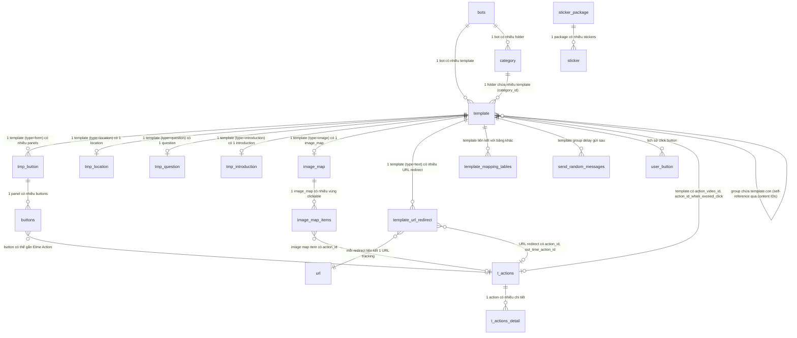

# FA-010 Mẫu tin nhắn「テンプレート」 — Feature Spec

> Spec tổng hợp cuối cùng — kết hợp toàn bộ thông tin từ UI, API, Logic, DB specs.
> Đây là tài liệu tham chiếu chính cho tính năng này.
>
> **Ngày tạo:** 2026-03-26
> **Phiên bản:** 1.0
> **Trạng thái validation:** ĐẠT — 0 vấn đề Nghiêm trọng, 0 Trung bình, 5 Nhẹ

---

## 1. Tổng quan

- **Mã tính năng:** FA-010
- **Tên:** Mẫu tin nhắn
- **Tên JP:** 「テンプレート」
- **Portal:** Admin
- **URL chính:** `/basic/message-template`
- **Phân loại:** Nhắn tin (messaging)
- **Shared component:** SC-001 (Template Message) — FA-010 chính là trang quản lý cho SC-001

### Mục đích

Tính năng「テンプレート」cho phép Admin tạo và quản lý các mẫu tin nhắn (message templates) có thể tái sử dụng xuyên suốt hệ thống LME. Mỗi template chứa một tin nhắn thuộc một trong 5 loại chính: văn bản (テキスト), panel/button (パネル・ボタン), media (画像・動画・音声), sticker (スタンプ), hoặc vị trí (位置情報). Template được tổ chức theo folder, hỗ trợ tìm kiếm, sắp xếp, thao tác hàng loạt, và gửi test nhanh (quick test) đến LINE user.

**Vai trò shared component:** Template là thành phần nền tảng của hệ thống — được nhúng/gọi từ hầu hết các tính năng nhắn tin: Chat 1:1 (FA-001), Tự động trả lời (FA-003), Rich Menu (FA-004), Tin nhắn chào mừng (FA-007), Gửi tin hàng loạt (FA-008), Phát hành theo bước (FA-009), Danh sách bạn bè (FA-013), Thông tin bạn bè (FA-015), và nhiều tính năng khác.

### Đối tượng sử dụng (Actors)

| Actor | Vai trò | Quyền truy cập |
|-------|---------|----------------|
| Admin | Tạo, chỉnh sửa, xoá, sao chép, tổ chức template theo folder, gửi test | Toàn quyền |
| Staff | Truy cập template theo quyền được Admin phân | Tuỳ theo custom role — kiểm tra ở middleware level **[Trung bình]** |
| LINE User | Nhận template qua quick test hoặc qua các tính năng sử dụng template | Chỉ nhận, không tạo/sửa |

### Phạm vi (Scope)

**Bao gồm:**
- CRUD template 5 loại chính (text, panel/button, media, sticker, location) + 3 loại legacy (question, introduction, group)
- Quản lý folder (tạo, đổi tên, xoá, sắp xếp)
- Thao tác hàng loạt (di chuyển folder, xoá hàng loạt)
- Quick test gửi template đến LINE user tester
- Deep clone/copy template (bao gồm recursive cho group)
- URL redirect & tracking cho template text
- Image map cho template ảnh
- Park/Group template (container chứa nhiều template con)

**Không bao gồm:**
- Luồng gửi template từ các tính năng khác (FA-001 Chat, FA-008 Broadcast, FA-009 Step Delivery)
- Chi tiết Action Settings (SC-004) — chỉ tham chiếu
- Chi tiết Message Editor tools (SC-005) — chỉ tham chiếu
- Spring Boot background jobs cho broadcast/scenario (thuộc FA-008, FA-009)

---

## 2. Các màn hình & Luồng xử lý End-to-End

### Danh sách 10 màn hình

| Mã | Tên màn hình | Tên JP | URL / Trigger |
|----|-------------|--------|---------------|
| SCR-TMT-01 | Danh sách template | 「テンプレート（一覧）」 | `/basic/message-template` |
| SCR-TMT-02 | Dialog tạo template mới | 「テンプレート作成」(dialog) | Nút「新規作成」trên SCR-TMT-01 |
| SCR-TMT-03 | Form thêm folder | 「フォルダ追加」(inline form) | Nút「フォルダ追加」trên SCR-TMT-01 |
| SCR-TMT-04 | Editor — Loại văn bản | テキスト | Chọn「テキスト」khi tạo/sửa |
| SCR-TMT-05 | Editor — Cài đặt URL/Action | URL表示期限・アクション設定 | Tab trên SCR-TMT-04 |
| SCR-TMT-06 | Editor — Loại Panel/Button | パネル・ボタン | Chọn「パネル・ボタン」khi tạo/sửa |
| SCR-TMT-07 | Editor — Panel chi tiết | 「詳細設定」(tab) | Tab「詳細設定」trên SCR-TMT-06 |
| SCR-TMT-08 | Editor — Loại Media | 画像・動画・音声 | Chọn「画像・動画・音声」khi tạo/sửa |
| SCR-TMT-09 | Editor — Loại Sticker | スタンプ | Chọn「スタンプ」khi tạo/sửa |
| SCR-TMT-10 | Editor — Loại Vị trí | 位置情報 | Chọn「位置情報」khi tạo/sửa |

---

### SCR-TMT-01: Danh sách template「テンプレート（一覧）」

**Giao diện:** Layout 2 panel — folder tree bên trái (quản lý folder + sắp xếp), bảng danh sách bên phải (toolbar tìm kiếm + tạo mới + sắp xếp, bảng dữ liệu sortable, footer thao tác hàng loạt). Heading「テンプレート」với link「マニュアル」.

#### Luồng 1: Load trang danh sách

```
[UI] Admin truy cập /basic/message-template
  │
  ▼
[API] GET /basic/message-template (EP-01)
  │ → MessageTemplateController@index
  │ → Đọc folder đang chọn từ cookie (folder_template)
  │ → Load categories (folders) theo bot_id
  ▼
[API] POST /ajax/init-template (EP-20) — AJAX init
  │ Request: { action: null, group_id }
  │ → MessageTemplateController@ajaxInitTemplate
  │ → Load template theo group_id + bot_id, join category
  ▼
[DB] SELECT template.*, category.name
  │ WHERE template.bot_id = {bot_id}
  │ AND template.category_id = {group_id}
  │ AND template.in_park = 0
  │ ORDER BY template.position
  ▼
[API] POST /ajax/template-v2/init-list-line-user-v2 (EP-72) — AJAX song song
  │ → Load danh sách LINE user tester (is_tester=1, is_blocked=0)
  ▼
[Kết quả] Render bảng danh sách template + folder tree + danh sách tester cho quick test
```

#### Luồng 2: Tìm kiếm template

```
[UI] Admin nhập keyword vào ô「管理名を入力」→ trigger search
  │
  ▼
[API] POST /ajax/init-template (EP-20)
  │ Request: { action: "searchByKeyWord", keyword: "...", group_id }
  │ → MessageTemplateController@ajaxInitTemplate
  ▼
[Logic] Template::searchByKeyWord($group_id, $keyword)
  │ → WHERE name LIKE '%keyword%'
  │ → Join category, with buttons/question/location/introduction
  ▼
[DB] SELECT template.* WHERE name LIKE '%keyword%' AND bot_id AND category_id
  ▼
[Kết quả] JSON { status: true, items: [...] } → render bảng lọc
```

#### Luồng 3: Sắp xếp template

```
[UI] Admin click「並べ替え」→ drag & drop thay đổi thứ tự
  │
  ▼
[API] POST /ajax/init-template (EP-20)
  │ Request: { action: "sortItem", sort_ids: "3,1,2", sort_position: "1" }
  ▼
[DB] UPDATE template SET position = {new_position}
  │ WHERE id IN (3, 1, 2) — batch update theo thứ tự mới
  ▼
[Kết quả] Danh sách template hiển thị theo thứ tự mới
```

#### Luồng 4: Xoá template (đơn lẻ)

```
[UI] Admin click xoá trong cột「操作」
  │
  ▼
[API] POST /ajax/delete-template (EP-23)
  │ Request: { idTemp: {template_id} }
  │ → MessageTemplateController@ajaxDelTemplate
  ▼
[Logic] Kiểm tra:
  │ → Nếu type=group → hard delete tất cả template con (IDs trong content)
  │ → deletedDataTemplate() — xoá ActionDetail liên quan
  │ → Xoá SendRandomMessage pending (status=0)
  │ → Update TemplateMappingTable → update step_message.update_timestamp
  ▼
[DB] DELETE FROM template WHERE id = {id}
  │ DELETE FROM send_random_messages WHERE template_id = {id}
  │ UPDATE template_mapping_tables...
  ▼
[Kết quả] JSON { status: true } → reload danh sách
```

#### Luồng 5: Thao tác hàng loạt — xoá

```
[UI] Admin tick checkbox nhiều template → click「一括削除」
  │
  ▼
[API] POST /ajax/init-template (EP-20)
  │ Request: { action: "deleteItems", item_ids: [1, 2, 3] }
  ▼
[Logic] Với mỗi ID: kiểm tra type=group → cascade delete con
  │ → Hard delete tất cả template đã chọn
  ▼
[DB] DELETE FROM template WHERE id IN (1, 2, 3)
  ▼
[Kết quả] JSON { status: true } → reload
```

#### Luồng 6: Thao tác hàng loạt — di chuyển folder

```
[UI] Admin tick checkbox → click「一括フォルダ変更」→ chọn folder đích
  │
  ▼
[API] POST /ajax/init-template (EP-20)
  │ Request: { action: "moveItem", item_ids: [1, 2], folder_move_id: 5 }
  ▼
[DB] UPDATE template SET category_id = 5,
  │   position = min(position of target folder) - 1
  │ WHERE id IN (1, 2)
  ▼
[Kết quả] Template được di chuyển sang folder mới
```

#### Luồng 7: Sao chép template

```
[UI] Admin click sao chép trong cột「操作」
  │
  ▼
[API] POST /ajax/template/copy (EP-24)
  │ Request: { template_id: {id} }
  │ → MessageTemplateController@copyTemplate
  ▼
[Logic] cloneTemplate() — deep clone đệ quy:
  │ → Replicate template record
  │ → Clone action_video_id (nếu có) → tạo action mới + details + filters
  │ → Clone template_url_redirect → clone actions cho mỗi URL
  │ → Theo type: clone tmp_button + buttons, image_map + items,
  │   tmp_question, tmp_location, tmp_introduction
  │ → Nếu type=group: clone đệ quy tất cả template con
  │ → Set position = min(position) - 1 → template copy ở đầu
  ▼
[DB] INSERT template (replicated)
  │ INSERT tmp_button, buttons, t_actions, t_actions_detail...
  ▼
[Kết quả] JSON { success: true, template_id: {new_id} } → reload
```

#### Luồng 8: Quick test

```
[UI] Admin click「クイックテスト」→ chọn LINE user tester
  │
  ▼
[API] POST /ajax/template-v2/send-test-template (EP-70)
  │ Request: { template_id, tester_ids: [...] }
  │ → TemplateV2Controller@sendTestTemplate
  ▼
[Logic] Với mỗi tester:
  │ → Nếu type=group + delay: gửi template đầu tiên ngay,
  │   các template sau → INSERT send_random_messages (delay 2-5s)
  │ → Nếu type=group không delay: gom batch 5, gửi qua createMultipleMessage()
  │ → Nếu template đơn: gửi ngay qua createMessage()
  │ → Sau gửi: Bots.free_send_count += 1
  ▼
[External] LINE Messaging API → push message đến tester
  ▼
[DB] UPDATE bots SET free_send_count = free_send_count + 1
  │ INSERT send_random_messages (nếu delay)
  ▼
[Kết quả] JSON { success: true, msg: "テスターに送信しました" }
```

---

### SCR-TMT-02: Dialog tạo template mới「テンプレート作成」

**Giao diện:** Modal dialog overlay — 2 fields: tên quản lý (max 20 ký tự) + dropdown chọn folder (mặc định「未分類」).

#### Luồng: Tạo template mới

```
[UI] Admin click「新規作成」→ modal mở
  │ → Nhập「管理名」, chọn「フォルダ」
  │ → Click「テンプレートを作成」
  ▼
[API] POST /basic/message-template/add (EP-21) — legacy
  │ hoặc POST /ajax/template-v2/save-template (EP-30) — V2
  │ Request: { tmp_name, tmp_type: "text" (default), tmp_category }
  ▼
[Logic] MessageTemplateController@store
  │ → Verify botIdCurrent == getBotId()
  │ → Check BackupHistory (block nếu đang backup)
  │ → Tạo record template với position = max(position) + 1
  ▼
[DB] INSERT INTO template (name, type, category_id, bot_id, position, ...)
  ▼
[Kết quả] Redirect đến trang editor (SCR-TMT-04~10 tuỳ loại)
```

---

### SCR-TMT-03: Form thêm folder「フォルダ追加」

**Giao diện:** Inline form trong panel trái — 1 field tên folder (max 20 ký tự) + nút「決定」/「キャンセル」.

#### Luồng: Tạo folder mới

```
[UI] Admin click「フォルダ追加」→ inline form mở
  │ → Nhập「フォルダ名」→ click「決定」
  ▼
[API] POST /ajax/init-template (EP-20)
  │ Request: { action: "addGroup", group_name: "..." }
  ▼
[Logic] MessageTemplateController@ajaxInitTemplate
  │ → Tạo Category với kind = template_kind constant
  │ → position = max(position) + 1
  ▼
[DB] INSERT INTO category (bot_id, kind, name, position)
  ▼
[Kết quả] Folder mới xuất hiện trong panel trái
```

**Lưu ý quan trọng:**
- Folder mặc định「未分類」có `category_id = 0` — không có record trong bảng `category`
- Folder mặc định không thể xoá (kiểm tra `group_id = 0`)
- Xoá folder → hard delete tất cả template bên trong + cascade xoá template con nếu type=group

---

### SCR-TMT-04: Editor — Loại văn bản「テキスト」

**Giao diện:** Form dọc — header (tên + folder) → chọn loại tin nhắn (5 tabs, không đổi được sau lưu) → textarea nội dung (max 5,000 ký tự) với toolbar (情報自動挿入, PDFアップロード, 絵文字) → checkbox URL gốc → footer (保存/戻る). Sub-tabs:「テキスト登録」và「URL表示期限・アクション設定」(→ SCR-TMT-05).

#### Luồng: Lưu template text

```
[UI] Admin soạn nội dung text → click「保存」
  │
  ▼
[API] POST /ajax/template-v2/save-template (EP-30)
  │ Request: { data: JSON string, action_type: "template",
  │            templateName: "...", folderId: 0 }
  ▼
[Logic] TemplateV2Controller@saveTemplate
  │ → Validate data không rỗng
  │ → Delegate sang TemplateV2Service@saveTemplateByType()
  │ → Nếu type=text: detectUrlInMessageTextV2() — phát hiện URL
  │ → Mỗi URL → tạo/cập nhật record trong bảng url (connection mysql_url)
  │ → Tạo template_url_redirect records
  │ → Normalize line breaks, lưu content
  ▼
[DB] UPDATE template SET name, category_id, content, is_shorten_url, ...
  │ INSERT/UPDATE url (mysql_url connection)
  │ INSERT template_url_redirect (action_id, out_time_action_id, ...)
  ▼
[Kết quả] JSON { success: true } → redirect về SCR-TMT-01
```

**Tính năng đặc biệt:**
- **Friend info auto-insert (SC-005):** Chèn biến `[FRIEND_INFO_system_name]`, `[FRIEND_INFO_phone]`, `[FRIEND_INFO_{hashId}]` — resolve khi gửi tin
- **PDF upload:** Upload PDF → trả URL → chèn vào content
- **Emoji LINE:** Chèn emoji code vào textarea
- **Checkbox URL gốc:** Khi checked, `is_shorten_url = 0` → mất tracking URL clicks

---

### SCR-TMT-05: Editor — Cài đặt URL/Action

**Giao diện:** Tab panel cùng trang SCR-TMT-04 — radio group chế độ action (一度のみ稼働/何度でも稼働), radio group URL preview (表示する/表示しない), danh sách URL phát hiện trong content.

#### Luồng: Cấu hình URL redirect

```
[UI] Admin chuyển tab「URL表示期限・アクション設定」→ xem danh sách URL
  │
  ▼
[API] POST /ajax/template-v2/get-list-url-redirect-text (EP-51)
  │ hoặc POST /ajax/get-list-url-redirect (EP-50) — legacy
  │ → Lấy danh sách URL redirect + actions + out_time_actions
  ▼
[DB] SELECT template_url_redirect.*, url.url
  │ JOIN t_actions ON action_id
  │ WHERE template_id = {id}
  ▼
[Kết quả] Render danh sách URL với cấu hình: action khi click, action khi hết hạn,
  │ thời gian hết hạn, URL chuyển hướng khi hết hạn
```

Các cấu hình lưu trong `template_url_redirect`:
- `action_id` → action khi user click URL (trong thời hạn)
- `out_time_action_id` → action khi hết hạn
- `url_expired_time` / `duration_from_delivery` + `after_day_time` → thời gian hết hạn
- `url_redirect` → URL chuyển hướng khi hết hạn
- `meta_title`, `meta_image`, `meta_description` → OGP metadata cache

---

### SCR-TMT-06: Editor — Loại Panel/Button「パネル・ボタン」

**Giao diện:** Chọn sub-type (4 loại, không đổi sau lưu) → tab「パネル設定」(quản lý panels + buttons) + tab「詳細設定」(→ SCR-TMT-07). Mỗi panel: ảnh header (1024x678px), tiêu đề (max 40), nội dung (max 60, bắt buộc). Mỗi button: text (max 20, bắt buộc), loại action (Elme/Friend Action hoặc LINE URL Scheme). Max 10 panels, max 4 buttons (1 panel) hoặc 3 buttons (2+ panels).

#### Luồng: Lưu template panel/button

```
[UI] Admin cấu hình panels + buttons → click「保存」
  │
  ▼
[API] POST /ajax/template-v2/save-template (EP-30) — V2
  │ hoặc POST /basic/message-template/save/{id} (EP-22) — legacy
  │ Request: { data: JSON string chứa panels + buttons + actions }
  ▼
[Logic] Luồng Legacy (store/save):
  │ → resetRelationShipTemplate() — xoá relationships cũ (panels, buttons)
  │ → Tạo tmp_button records cho mỗi panel (title, text, img_path, order)
  │ → Upload ảnh panel (resize, uploadImgBase64Api, uploadThumbnailApi)
  │ → Tạo buttons records cho mỗi button (label, post_back, method, data, action_id)
  │ → Nếu button có Elme action → liên kết t_actions.id
  │ → Tính rate_image_button (aspect ratio) từ ảnh
  │
  │ Luồng V2 (saveTemplate):
  │ → Delegate sang TemplateV2Service
  │ → Xử lý tương tự nhưng qua service layer
  ▼
[DB] DELETE FROM tmp_button WHERE template_id (reset cũ)
  │ DELETE FROM buttons WHERE button_id IN (old panels)
  │ INSERT INTO tmp_button (template_id, title, text, img_path, order, ...)
  │ INSERT INTO buttons (button_id, label, post_back, action_id, order, ...)
  │ UPDATE template SET type_button, content (alt text), ...
  ▼
[Kết quả] JSON { success: true } → redirect
```

**Cấu trúc dữ liệu Panel/Button:**
```
Template (type=form, type_button=1~4, carousel_action_type)
  └── TmpButton[] (panels, max 10 — title, text, img_path, order)
       └── Buttons[] (buttons, max 3~4 — label, post_back, action_id, order)
            └── t_actions → t_actions_detail (khi post_back=0, Elme Action)
```

---

### SCR-TMT-07: Editor — Panel chi tiết「詳細設定」

**Giao diện:** Tab panel cùng trang SCR-TMT-06 — tap limit (4 options radio), toggle gửi message khi vượt tap + textarea (max 400) + Elme action picker, text hiển thị PC/notification (max 400).

#### Luồng: Cài đặt tap limit + overflow

```
[UI] Admin chuyển tab「詳細設定」
  │ → Chọn tap limit, cấu hình overflow message/action
  │ → Dữ liệu gửi cùng lúc khi「保存」template
  ▼
[DB] UPDATE template SET
  │   answer_type = {0|1|2},  -- tap limit
  │   is_send_message_when_exceed_click = {0|1},
  │   message_sent_when_exceed_click = "...",
  │   action_id_when_exceed_click = {action_id},
  │   content / text_video = "..." -- PC display text
```

**Lưu ý (Vấn đề #1 - Nhẹ):** UI hiển thị 4 options tap limit nhưng DB `answer_type` chỉ có 3 giá trị (0, 1, 2). Mapping chính xác cần xác nhận thêm — có thể 2 UI options map vào cùng 1 DB value hoặc kết hợp với `carousel_action_type`.

---

### SCR-TMT-08: Editor — Loại Media「画像・動画・音声」

**Giao diện:** Drag & drop upload zone — hỗ trợ .png/.jpg (max 10MB), .mp4 (max 200MB), .m4a (max 200MB). Media library để chọn từ file đã upload. Image map toggle khi type=image.

#### Luồng: Upload và lưu template media

```
[UI] Admin drag & drop file hoặc chọn từ library → click「保存」
  │
  ▼
[Logic] Xử lý theo loại media:
  │ ● Image: Upload → resize nhiều size (image map) → upload media server
  │   → Tạo thumbnail 240x240 → lưu path vào template.content
  │ ● Video: Upload → upload Dropbox → tạo media record
  │   → Thumbnail do user upload hoặc default
  │ ● Voice: Upload → convert format → upload media server
  │   → getDurationSeconds() → lưu template.duration
  ▼
[DB] UPDATE template SET content = {file_path},
  │   thumbnail_path = {thumb_path},
  │   file_size = {bytes}, duration = {seconds}
  │ INSERT media (nếu video/voice)
  │ INSERT image_map, image_map_items (nếu bật image map)
  ▼
[External] Media Server API (callApiUpload), Dropbox API (uploadFileDropbox)
```

**Image Map:** Khi `is_setting_image_map = 1`:
- Upload ảnh gốc → resize theo `sns-line.image_size` (nhiều kích thước)
- Tạo `image_map` record (img_width, img_height, img_alt)
- Tạo `image_map_items` — mỗi vùng clickable có action_type (URL/Text/Phone/LINE/Email), toạ độ (x, y, width, height), và liên kết entities (form, product, event, conversion, booking)

---

### SCR-TMT-09: Editor — Loại Sticker「スタンプ」

**Giao diện:** 12 sticker packs (LINE official only), mỗi pack hiển thị grid stickers với radio button chọn. Preview sticker đã chọn. Không hỗ trợ creators stickers.

#### Luồng: Chọn và lưu sticker

```
[UI] Admin chọn sticker pack → chọn sticker → click「保存」
  │
  ▼
[API] GET /ajax/template-v2/get-data-stamp (EP-41)
  │ → Lấy danh sách sticker packages + stickers
  ▼
[DB] UPDATE template SET content = "{stickerId}", type = "stamp"
  │ (stickerId lưu dạng string trong content)
  ▼
[Kết quả] Template sticker đã lưu
```

---

### SCR-TMT-10: Editor — Loại Vị trí「位置情報」

**Giao diện:** Google Maps embed (click đặt pin) + search box + nút xác nhận + fields タイトル (max 90) và 詳細 (max 90) + nút「送信する位置情報の住所を引用」.

#### Luồng: Chọn vị trí và lưu

```
[UI] Admin click bản đồ đặt pin → click「選択されているピンの位置で決定」
  │ → Nhập タイトル, 詳細 → click「保存」
  ▼
[Logic] TemplateV2Controller
  │ → createLocation() hoặc updateLocation()
  ▼
[DB] INSERT/UPDATE tmp_location (template_id, address, latitude, longitude)
  │ UPDATE template SET content = "..." -- có thể chứa title + detail
  ▼
[Kết quả] Template location đã lưu
```

**Lưu ý (Vấn đề #2 - Nhẹ):** Fields「位置情報タイトル」và「位置情報詳細」chưa xác nhận chính xác lưu ở đâu. Bảng `tmp_location` chỉ có address, latitude, longitude. Suy luận lưu trong `template.content` dưới dạng JSON/text. **[Thấp]**

---

## 3. Data Model

### Bảng chính (Primary Tables)

| Bảng | Mô tả | Model Laravel | Số cột | Data size |
|------|-------|---------------|--------|-----------|
| `template` | Bảng trung tâm — chứa mọi loại template, đa hình theo field `type` | `App\Template` | 33 | 1.8MB |
| `category` | Folder phân loại (dùng chung, phân biệt bằng `kind`) | `App\Category` | 9 | 509KB |
| `tmp_button` | Panel trong template type=form (max 10/template) | `App\TmpButton` | 22 | 1.0MB |
| `buttons` | Button trên panel (max 3~4/panel) | `App\Buttons` | 33 | 2.8MB |
| `tmp_location` | Toạ độ vị trí cho template type=location (1:1) | `App\TmpLocation` | 7 | 174KB |
| `template_url_redirect` | Cấu hình URL redirect/tracking cho template text | `App\TemplateUrlRedirect` | 24 | 180KB |

### Bảng phụ (Secondary / Related Tables)

| Bảng | Mô tả | Quan hệ | Vai trò |
|------|-------|---------|---------|
| `image_map` | Image map settings cho template type=image | 1:1 với template | Cấu hình |
| `image_map_items` | Vùng clickable trên image map | 1:N với image_map | Dữ liệu |
| `tmp_question` | Template câu hỏi 2 lựa chọn (legacy) | 1:1 với template | Legacy |
| `tmp_introduction` | Template giới thiệu LINE OA (legacy) | 1:1 với template | Legacy |
| `send_random_messages` | Queue tin nhắn delay — Spring Boot poll | 1:N với template | Queue job |
| `template_mapping_tables` | Pivot liên kết template ↔ step_message | N:N | Propagate update |
| `user_button` | Lịch sử user click button (đếm tap limit) | Log | Analytics |
| `t_actions` | Action container (SC-004) | Reference | Shared |
| `t_actions_detail` | Chi tiết action | 1:N với t_actions | Shared |
| `sticker` / `sticker_package` | LINE stickers | Reference | Lookup |
| `media` | Thư viện media | Reference | Storage |
| `url` | URL tracking (connection mysql_url riêng) | Reference | Tracking |
| `bot_line_user` | Quan hệ bot ↔ LINE user (is_tester) | Reference | Quick test |
| `capture_templates` | Version snapshots template | 1:N với template | Audit |

### ER Diagram



### Đặc điểm kiến trúc DB

1. **Đa hình theo type:** Bảng `template` là bảng đa hình — field `type` xác định loại (10 giá trị), field `content` (longtext) lưu dữ liệu khác nhau tuỳ type. Các bảng con mở rộng theo type.
2. **Không có FK constraints:** Tất cả relationships quản lý ở application level (Eloquent).
3. **Hard delete:** Template sử dụng hard delete (trừ folder dùng `category.is_deleted` soft delete).
4. **Ý nghĩa `content` theo type:**

| Type | Nội dung content |
|------|-----------------|
| `text` | Nội dung tin nhắn text thuần (có thể chứa `[FRIEND_INFO_xxx]`) |
| `stamp` | Sticker ID (string) |
| `image` | Đường dẫn file ảnh trên media server |
| `video` | Đường dẫn file video trên Dropbox |
| `voice` | Đường dẫn file âm thanh |
| `form` | Alt text cho carousel |
| `location` | Có thể chứa title + detail (format chưa xác nhận) |
| `question` | Nội dung câu hỏi (legacy) |
| `introduction` | Nội dung giới thiệu (legacy) |
| `group` | Comma-separated IDs template con |

---

## 4. Field Traceability Matrix

| # | UI Element (JP) | Màn hình | DB Table.Column | Hướng | Validation | Business Rule |
|---|----------------|----------|----------------|-------|------------|---------------|
| 1 | 「管理名」(bảng + form) | SCR-TMT-01, 02, 04 | `template.name` | R/W | Max 20 ký tự (UI), varchar(255) DB | Tên quản lý nội bộ, sortable, searchable |
| 2 | 「フォルダ」(dropdown) | SCR-TMT-02, 04 | `template.category_id` → `category.id` | W | FK, 0=未分類 | category.kind = template kind constant |
| 3 | 「作成日」 | SCR-TMT-01 | `template.created_at` | R | — | Format "YYYY.MM.DD" |
| 4 | 「最終編集日」 | SCR-TMT-01 | `template.updated_at` | R | — | Format "YYYY.MM.DD" |
| 5 | 「内容」(preview) | SCR-TMT-01 | `template.content` + `template.type` | R | — | Rút gọn content, icon theo type |
| 6 | Thumbnail preview | SCR-TMT-01 | `template.image_server` + `template.thumbnail_path` | R | — | Ghép URL |
| 7 | Tên folder | SCR-TMT-01, 03 | `category.name` | R/W | Max 20 ký tự (UI), varchar(100) DB | kind filter |
| 8 | Textarea nội dung text (0/5,000) | SCR-TMT-04 | `template.content` | W | Max 5,000 ký tự | Normalize line breaks |
| 9 | Checkbox URL gốc | SCR-TMT-04 | `template.is_shorten_url` | W | — | Checked=0 (URL gốc), Unchecked=1 (shortened) **[Trung bình]** |
| 10 | 「アクション稼働設定」 | SCR-TMT-05 | `template.number_action_url_redirect` | W | — | 1=一度のみ稼働, >1=何度でも稼働 |
| 11 | 「URL表示プレビュー」 | SCR-TMT-05 | `template_url_redirect.use_preview_url` | W | — | 1=表示する, 0=表示しない |
| 12 | URL redirect settings | SCR-TMT-05 | `template_url_redirect.*` (24 cột) | R/W | — | Mỗi URL phát hiện → 1 record |
| 13 | Panel sub-type | SCR-TMT-06 | `template.type_button` | W | Không đổi sau lưu | 1=Standard, 2=Color, 3=Image, 4=Quick Reply |
| 14 | 「画像登録」(panel) | SCR-TMT-06 | `tmp_button.img_path` + `.image_server` | W | 1024x678px khuyến nghị | Ghép URL |
| 15 | 「タイトル」(panel) | SCR-TMT-06 | `tmp_button.title` | W | Max 40 ký tự | — |
| 16 | 「本文」(panel) | SCR-TMT-06 | `tmp_button.text` | W | Max 60 ký tự, bắt buộc | — |
| 17 | 「ボタンテキスト」 | SCR-TMT-06 | `buttons.label` | W | Max 20 ký tự, bắt buộc | — |
| 18 | Button action type | SCR-TMT-06 | `buttons.post_back` + `buttons.action_id` | W | — | 11 giá trị post_back (0~10) |
| 19 | 「選択肢のタップ回数」 | SCR-TMT-07 | `template.answer_type` | W | — | 0=unlimited, 1=panel, 2=carousel **[Trung bình]** |
| 20 | Toggle overflow message | SCR-TMT-07 | `template.is_send_message_when_exceed_click` | W | — | 1=送信する, 0=送信しない |
| 21 | Text overflow message (0/400) | SCR-TMT-07 | `template.message_sent_when_exceed_click` | W | Max 400 ký tự | Default「タップ回数上限に達しています」 |
| 22 | Action overflow | SCR-TMT-07 | `template.action_id_when_exceed_click` → `t_actions.id` | W | — | SC-004 reference |
| 23 | PC display text (0/400) | SCR-TMT-07 | `template.content` hoặc `template.text_video` | W | Max 400 ký tự | Default「メッセージをご確認ください」 **[Thấp]** |
| 24 | File upload media | SCR-TMT-08 | `template.content` + `template.thumbnail_path` | W | 10MB (img), 200MB (video/audio) | Upload → media server / Dropbox |
| 25 | File size | SCR-TMT-08 | `template.file_size` | W | — | Bytes |
| 26 | Media duration | SCR-TMT-08 | `template.duration` | W | — | Giây |
| 27 | Image map toggle | SCR-TMT-08 | `template.is_setting_image_map` | W | — | 0=tắt, 1=bật |
| 28 | Image map areas | SCR-TMT-08 | `image_map_items.x, .y, .width, .height` | W | x,y >= 0, w,h >= 1 | Toạ độ vùng clickable |
| 29 | Sticker selection | SCR-TMT-09 | `template.content` (stickerId string) | W | — | Reference sticker_package + sticker |
| 30 | Vị trí latitude | SCR-TMT-10 | `tmp_location.latitude` | W | — | Decimal GPS |
| 31 | Vị trí longitude | SCR-TMT-10 | `tmp_location.longitude` | W | — | Decimal GPS |
| 32 | 「指定された住所」 | SCR-TMT-10 | `tmp_location.address` | W | varchar(100) | Geocoding |
| 33 | 「位置情報タイトル」(0/90) | SCR-TMT-10 | `template.content` (suy luận) | W | Max 90 ký tự | **[Thấp]** — chưa xác nhận cột DB |
| 34 | 「位置情報詳細」(0/90) | SCR-TMT-10 | `template.content` (suy luận) | W | Max 90 ký tự | **[Thấp]** — chưa xác nhận cột DB |

**Coverage:** 63/66 UI fields đã map thành công (95%). 3 fields chưa map rõ ràng (#23, #33, #34).

---

## 5. Business Rules

| # | Rule | Mô tả | Nơi enforce | Ảnh hưởng khi vi phạm |
|---|------|-------|------------|----------------------|
| BR-01 | Message type bất biến | Loại tin nhắn không thể thay đổi sau khi lưu lần đầu. Panel sub-type cũng bất biến | UI (label cảnh báo) | Chặn UI — không có validation server |
| BR-02 | Backup protection | Tất cả thao tác ghi kiểm tra BackupHistory đang chạy (status 0 hoặc 1) → block | `MessageTemplateController@store`, `save`, `ajaxInitTemplate` | Return `{ status: false, message: MESSAGE_NOTIFY_BACKUP }` |
| BR-03 | Bot ID verification | `store()` kiểm tra `botIdCurrent == getBotId()` — ngăn submit form khi đã chuyển account | `MessageTemplateController@store:346` | Return error「別のアカウントに切り替えたので...」 |
| BR-04 | Folder mặc định bất khả xoá | category_id=0 (「未分類」) không có record DB, không thể xoá | `ajaxInitTemplate:2890` | Lỗi "Cannot delete" |
| BR-05 | Cascade delete folder | Xoá folder → hard delete tất cả template bên trong → cascade xoá template con nếu type=group | `ajaxInitTemplate:2880-2911` | Mất dữ liệu không phục hồi |
| BR-06 | Hard delete template | Template xoá vĩnh viễn (không soft delete) + cleanup ActionDetail, SendRandomMessage, TemplateMappingTable | `ajaxDelTemplate:3134-3191` | Mất dữ liệu, cập nhật step_message |
| BR-07 | Deep clone recursive | Copy template clone tất cả relationships. Group → clone đệ quy con. Position = min - 1 (đầu danh sách) | `cloneTemplate:4400-4577` | — |
| BR-08 | Button limit theo số panel | 1 panel → max 4 buttons. 2+ panels → max 3 buttons mỗi panel. Max 10 panels | UI + Controller | Chặn thêm button |
| BR-09 | URL detection & tracking | Template text: tự động phát hiện URL → tạo/cập nhật record `url` + `template_url_redirect` | `detectUrlInMessageTextV2`, `store/save` | Tạo tracking links |
| BR-10 | Quick test — LINE API | Gửi test: kiểm tra tester (is_tester=1), rate limit, auth. Group + delay: template đầu gửi ngay, còn lại queue delay 2-5s | `sendTestTemplate:1050-1244` | Lỗi LINE API trả message JP |
| BR-11 | Image map validation | Area: x,y >= 0, width,height >= 1, tất cả numeric | `store:366` | Error「エリア{N}: 領域設定が間違っています」 |
| BR-12 | Position management | Tạo mới: max(position)+1. Copy: min(position)-1. Move: min(position of target)-1. Sort: update 1,2,3... | Nhiều methods | Ảnh hưởng thứ tự hiển thị |
| BR-13 | Cookie folder state | Folder đang chọn lưu cookie `folder_template`, key=bot_id, expire 14400 phút (10 ngày) | `BasicController@folderSetCookie` | Reset folder khi hết hạn cookie |
| BR-14 | Reset relationships on update | Update template → xoá TẤT CẢ relationships cũ → tạo lại mới (delete + recreate) | `resetRelationShipTemplate:2765` | Relationships cũ bị xoá trước khi tạo mới |
| BR-15 | Template mapping propagation | Xoá template → update `template_mapping_tables` → update `step_message.update_timestamp` | `ajaxDelTemplate` | Step message nhận biết template đã xoá |

---

## 6. API Endpoints

### Tổng hợp: 40+ endpoints, phân 10 nhóm

#### 6.1. Page Routes (HTML view)

| EP | Method | URL | Controller@Method | Màn hình |
|----|--------|-----|-------------------|----------|
| EP-01 | GET | `/basic/message-template` | `MessageTemplateController@index` | SCR-TMT-01 |
| EP-02 | GET | `/basic/message-template/add` | `MessageTemplateController@create` | SCR-TMT-04~10 |
| EP-03 | GET | `/basic/message-template/edit/{id}` | `MessageTemplateController@edit` | SCR-TMT-04~10 |
| EP-04 | GET | `/basic/message-template/set-cookie` | `BasicController@folderSetCookie` | SCR-TMT-01 |
| EP-05 | GET | `/basic/template-v2/add-template` | `TemplateV2Controller@createTemplate` | SCR-TMT-04~10 |
| EP-06 | GET | `/basic/template-v2/create-group` | `TemplateV2Controller@createGroupTemplate` | — |
| EP-07 | GET | `/basic/template-v2/create-message` | `TemplateV2Controller@createMessage` | SCR-TMT-04~10 |
| EP-08 | GET | `/basic/template-v2/create-message-text` | `TemplateV2Controller@createMessageText` | SCR-TMT-04 |
| EP-09~12 | GET | Park template + detail routes | `MessageTemplateController` | — |

#### 6.2. CRUD & Quản lý danh sách

| EP | Method | URL | Mô tả | Màn hình |
|----|--------|-----|-------|----------|
| EP-20 | POST | `/ajax/init-template` | Endpoint đa năng: init danh sách + folder CRUD + template sort/delete/move/search (11 actions) | SCR-TMT-01, 03 |
| EP-21 | POST | `/basic/message-template/add` | Lưu template mới (legacy) — xử lý tất cả types | SCR-TMT-02 |
| EP-22 | POST | `/basic/message-template/save/{id}` | Cập nhật template (legacy) — reset + recreate relationships | SCR-TMT-04~10 |
| EP-23 | POST | `/ajax/delete-template` | Xoá template (hard delete + cascade group) | SCR-TMT-01 |
| EP-24 | POST | `/ajax/template/copy` | Deep clone template (recursive cho group) | SCR-TMT-01 |
| EP-25 | GET | `/ajax/get-template-sort` | Lấy danh sách template để sắp xếp | SCR-TMT-01 |
| EP-26 | GET | `/ajax/message-template/{id}` | Lấy chi tiết 1 template (JSON) | SCR-TMT-06 |

#### 6.3. TemplateV2 (Editor mới)

| EP | Method | URL | Mô tả | Màn hình |
|----|--------|-----|-------|----------|
| EP-30 | POST | `/ajax/template-v2/save-template` | Lưu template V2 — dữ liệu JSON trong field `data` | SCR-TMT-04~10 |
| EP-31 | POST | `/ajax/template-v2/save-group` | Tạo/cập nhật group template | — |
| EP-32~36 | POST | Template V2 CRUD operations | Sort child, delete multiple, clone action, copy file, update delay | — |

#### 6.4. Lấy dữ liệu editor

| EP | Method | URL | Mô tả | Màn hình |
|----|--------|-----|-------|----------|
| EP-40 | GET | `/ajax/template-v2/get-data` | Data editor Text (content + friend info + LIFF) | SCR-TMT-04 |
| EP-41 | GET | `/ajax/template-v2/get-data-stamp` | Data editor Sticker (packages + stickers) | SCR-TMT-09 |
| EP-42 | GET | `/ajax/template-v2/get-data-location` | Data editor Location (lat, lng, address) | SCR-TMT-10 |
| EP-46 | GET | `/ajax/template-v2/init-data-button` | Data editor Panel/Button (post_back types, open URL types, friend info) | SCR-TMT-06 |
| EP-47 | GET | `/ajax/template-v2/init-data-media` | Data editor Media (image map data) | SCR-TMT-08 |

#### 6.5. URL Redirect & Metadata

| EP | Method | URL | Mô tả | Màn hình |
|----|--------|-----|-------|----------|
| EP-50 | POST | `/ajax/get-list-url-redirect` | URL redirect list (legacy) | SCR-TMT-05 |
| EP-51 | POST | `/ajax/template-v2/get-list-url-redirect-text` | URL redirect list (V2) | SCR-TMT-05 |
| EP-52 | POST | `/ajax/template/get-data-open-url` | Entities theo loại URL (form, product, event...) | SCR-TMT-06 |
| EP-53~54 | POST | Metadata URL (OGP fetch) | Title, image, description | SCR-TMT-04 |

#### 6.6. Image Map

| EP | Method | URL | Mô tả | Màn hình |
|----|--------|-----|-------|----------|
| EP-55 | POST | `/ajax/template/image-map/init-data` | Data image map | SCR-TMT-08 |
| EP-56 | POST | `/ajax/template/image-map/get-data-preview-action` | Preview action trên image map | SCR-TMT-08 |

#### 6.7. Media Library

| EP | Method | URL | Mô tả | Màn hình |
|----|--------|-----|-------|----------|
| EP-60~62 | POST | Image/Video/Voice library | Thư viện media phân trang | SCR-TMT-08 |
| EP-63 | POST | `/ajax/get-pdf-library` | Thư viện PDF | SCR-TMT-04 |
| EP-64 | POST | `/ajax/change-thumbnail-history` | Đổi thumbnail video (resize 240x240) | SCR-TMT-08 |

#### 6.8. Test & LINE User

| EP | Method | URL | Mô tả | Màn hình |
|----|--------|-----|-------|----------|
| EP-70 | POST | `/ajax/template-v2/send-test-template` | Gửi test đến LINE user tester | SCR-TMT-01 |
| EP-71 | POST | `/ajax/template-v2/send-test-template-v3` | Gửi test V3 | SCR-TMT-01 |
| EP-72 | POST | `/ajax/template-v2/init-list-line-user-v2` | Danh sách LINE user tester (is_tester=1) | SCR-TMT-01 |
| EP-73 | POST | `/ajax/template-v2/search-list-line-user-v2` | Tìm kiếm LINE user (paginate 20) | SCR-TMT-01 |

#### 6.9. Park Template (Group)

| EP | Method | URL | Mô tả | Màn hình |
|----|--------|-----|-------|----------|
| EP-80~84 | POST/GET | Park template CRUD | Tạo/cập nhật/thêm/xoá park template | — |

#### 6.10. Liên quan khác

| EP | Method | URL | Mô tả |
|----|--------|-----|-------|
| EP-90 | POST | `/basic/send-template-v2` | Gửi template qua chat 1:1 (ChatController) |
| EP-91 | POST | `/basic/upload-pdf-template` | Upload PDF (MediaController) |
| EP-92 | POST | `/ajax/action-redirect/save` | Lưu action redirect URL |

### Middleware

| Middleware | Mô tả |
|-----------|-------|
| `web` | Session, CSRF, authentication |
| `NotifyChatworkRequestTimeSlow` | Log request chậm lên Chatwork |
| `LogRequestMultipart` | Log multipart request |

### Xác thực & phân quyền

- **Session auth:** User phải đăng nhập Admin portal
- **`getBotId()`:** Lấy bot_id từ session → tất cả queries filter theo bot_id
- **`getCurrentUser()`:** Lấy user_id từ session
- **Bot ID verification:** `store()` kiểm tra `botIdCurrent == getBotId()`
- **BackupHistory check:** Block thao tác ghi khi đang backup
- **Staff permission:** Kiểm tra ở middleware level (không thấy trong controller) **[Trung bình]**

---

## 7. Background Jobs

Tính năng Template **không có background job chính**. Tuy nhiên có một cơ chế delay message qua bảng `send_random_messages`:

| Cơ chế | Trigger | Queue Table | Processor | Mô tả |
|--------|---------|-------------|-----------|-------|
| Delay test message | Quick test template group có `is_delay_message=1` | `send_random_messages` | Spring Boot background job (poll bảng) | Template con đầu tiên gửi ngay. Các template con còn lại lưu vào queue với `time_send` delay random 2-5 giây. Status: 0=chờ gửi, 1=đã gửi |

**Lưu ý:** Đây không phải core background job của tính năng Template mà là cơ chế hỗ trợ cho group template test. Các background jobs gửi tin nhắn hàng loạt (broadcast, step delivery) thuộc FA-008 và FA-009.

---

## 8. Phụ thuộc chéo (Cross-references)

### Shared Components sử dụng

| SC-ID | Component | Cách sử dụng trong FA-010 |
|-------|-----------|--------------------------|
| SC-004 | Action Settings「アクション設定」 | Dùng trong SCR-TMT-06 (button action — nút「アクション登録・編集」) và SCR-TMT-07 (overflow action khi vượt tap limit). Liên kết qua `buttons.action_id` → `t_actions.id` và `template.action_id_when_exceed_click` → `t_actions.id` |
| SC-005 | Rich Text / Message Editor「メッセージ編集」 | Dùng trong SCR-TMT-04 (editor text) — tools「情報自動挿入」,「PDFアップロード」,「絵文字」, checkbox URL gốc. Chèn biến `[FRIEND_INFO_xxx]` vào content |

### FA-010 là trang quản lý cho SC-001

FA-010 chính **là** SC-001 (Template Message) — không embed SC-001 mà quản lý nó. Các tính năng khác tham chiếu template từ đây thông qua template_id hoặc template selector.

### Tính năng tham chiếu FA-010 / SC-001

| FA-ID | Tên | Quan hệ |
|-------|-----|---------|
| FA-001 | Chat 1:1「1:1チャット」 | Toolbar「テンプレート送信」→ chọn template để gửi qua `ChatController@sendTemplate` (EP-90) |
| FA-003 | Tự động trả lời「自動応答」 | Action settings chọn template để gửi tự động |
| FA-004 | Rich Menu「リッチメニュー」 | Tap action có thể gửi template |
| FA-007 | Tin nhắn chào mừng「あいさつメッセージ」 | Chọn template cho tin nhắn chào mừng |
| FA-008 | Gửi tin hàng loạt「メッセージ配信」 | Chọn template cho broadcast — `template_mapping_tables` |
| FA-009 | Phát hành theo bước「ステップ配信」 | Chọn template cho step message — `step_message.template_ids` |
| FA-013 | Danh sách bạn bè「友だちリスト」 | Có thể gửi template từ bulk action |
| FA-015 | Thông tin bạn bè「友だち情報管理」 | Action settings chọn template |

### Bảng dùng chung

| Bảng | Dùng bởi | Ghi chú |
|------|----------|---------|
| `t_actions` + `t_actions_detail` | FA-001, FA-003, FA-004, FA-010, FA-012, FA-013, FA-015... | SC-004 shared |
| `category` | FA-010 (template folders), FA-008 (broadcast folders), FA-009 (scenario folders)... | Phân biệt bằng `kind` |
| `media` | FA-010, FA-001, FA-008... | Thư viện media dùng chung |
| `bot_line_user` | FA-010 (quick test), FA-001 (chat), FA-013 (friend list)... | Quản lý LINE user |

---

## 9. Gaps & Unknowns

Từ validation report — 5 vấn đề Nhẹ, tất cả đã được ghi nhận trong specs với mức tin cậy phù hợp:

| # | Nội dung | Mức độ | Nguồn | Cách xử lý đề xuất |
|---|---------|--------|-------|-------------------|
| 1 | **Tap limit — UI 4 options nhưng DB chỉ 3 values.** UI hiển thị「全体で1回のみ」「各パネルで1回ずつ」「各選択肢で1回ずつ」「無制限」. DB `template.answer_type` chỉ có 0, 1, 2. Sự không khớp có thể do 2 UI options map vào cùng 1 DB value hoặc kết hợp với `carousel_action_type` | **Nhẹ** | ui-spec SCR-TMT-07, db-mapping 4.3 | Đọc source code `save()` phần type=form để xác nhận mapping chính xác |
| 2 | **Location title/detail — chưa xác nhận cột DB.** Fields「位置情報タイトル」(max 90) và「位置情報詳細」(max 90) — bảng `tmp_location` chỉ có address, lat, lng. Suy luận lưu trong `template.content` | **Nhẹ** | ui-spec SCR-TMT-10, db-mapping 3.10 | Kiểm tra sample data `template` type=location hoặc source code `createLocation()` |
| 3 | **PC display text — chưa xác nhận cột DB.** Field「パソコン版・通知欄の表示テキスト」(max 400) — suy luận `template.text_video` hoặc embedded trong `template.content` | **Nhẹ** | ui-spec SCR-TMT-07, db-mapping 3.7 | Đọc source code `save()` phần type=form tìm field lưu alt text/display text |
| 4 | **API endpoints không gắn màn hình.** Park Template (EP-80~84) và một số endpoint V2 (EP-31~36) không có SCR tương ứng — hợp lý vì dùng nội bộ hoặc từ context khác (broadcast, scenario) | **Nhẹ** | api-spec 1.9, 1.3 | Bổ sung liên kết khi spec FA-008, FA-009 |
| 5 | **UI chưa mô tả chi tiết sub-types Panel khác ngoài Standard.** Chỉ quan sát được「スタンダード」, chưa mô tả「カラーボタン」「画像」「クイックリプライ」. Logic Spec và DB Mapping vẫn bao phủ đầy đủ data model | **Nhẹ** | ui-spec SCR-TMT-06, mục 7 | Chạy lại raw data collection cho các sub-type khác |

### Điểm chưa rõ bổ sung từ UI Spec (10 items)

| # | Nội dung | Mức độ |
|---|---------|--------|
| 1 | Cột「操作」gồm chính xác thao tác nào? (bảng trống, không quan sát được) | **Thấp** |
| 2 | Cột「内容」hiển thị gì? Preview text hay icon loại? | **Thấp** |
| 3 | 「クイックテスト」— dialog chọn LINE user có giao diện ra sao? | **Thấp** |
| 4 | Sắp xếp「並べ替え」— drag & drop hay dialog? | **Thấp** |
| 5 | Có pagination cho danh sách template không? | **Trung bình** |
| 6 | Folder có thể rename/delete không? (đã confirm qua API: có rename + delete) | **Thấp** |
| 7 | Google Maps lỗi — cần API key hợp lệ | **Trung bình** |

---

## 10. Chất lượng Spec

### Coverage Metrics

| Tiêu chí | Đánh giá | Chi tiết |
|---------|---------|---------|
| UI spec đầy đủ | **Cao** (95%) | 10 màn hình, 5 user flows, flow diagram Mermaid. 10 điểm chưa rõ ghi nhận minh bạch |
| API spec đầy đủ | **Cao** (98%) | 40+ endpoints, request/response chi tiết, bảng mapping endpoint ↔ màn hình |
| Logic spec đầy đủ | **Cao** (98%) | 2 controllers (4579 + 1484 dòng), 15+ models, 15 business rules, 18 helper functions, kiến trúc diagram |
| DB mapping đầy đủ | **Cao** (95%) | 19 bảng, 63/66 fields mapped (95%), 11 nhóm enum, ER diagram Mermaid |
| Job spec | **Không áp dụng** | Không có background job chính. Chỉ delay message qua `send_random_messages` |
| Cross-reference | **Cao** | SC-004, SC-005 xác nhận. FA-010 = SC-001. Danh sách tính năng tham chiếu đầy đủ |

### Confidence Distribution

| Mức tin cậy | Số items | Tỷ lệ | Nguồn |
|-------------|---------|-------|-------|
| **Cao** | ~90% | Phần lớn | Đọc trực tiếp từ source code + DB schema |
| **Trung bình** | ~8% | Vài items | Suy luận từ UI + code nhưng chưa 100% xác nhận |
| **Thấp** | ~2% | 3 items | Chỉ quan sát từ UI, chưa tìm được trong code/DB (#23, #33, #34 trong Traceability Matrix) |

### Validation Summary

| Kiểm tra chéo | Kết quả | Tỷ lệ |
|---------------|---------|-------|
| UI Fields → API Endpoints | PASS | 20/20 (100%) |
| API Endpoints → Logic Controllers | PASS | 14/14 (100%) |
| Logic Models → DB Tables | PASS | 20/20 (100%) |
| DB Hint → DB Mapping | PASS | 6/6 (100%) |
| Enum UI ↔ DB | PASS (1 lưu ý) | 6/7 (86%) |

**Kết luận:** Bộ specs FA-010 đạt chất lượng cao — 0 vấn đề Nghiêm trọng, 0 Trung bình, 5 Nhẹ. Tất cả cross-checks đạt 100% (trừ 1 lưu ý enum nhỏ). Specs nhất quán chéo tốt giữa UI → API → Logic → DB.

---

## Kiến trúc hệ thống (Architecture Overview)

```
┌─────────────────────────────────────────────────────────┐
│                    Routes (web.php)                       │
│  /basic/message-template/*    /ajax/init-template        │
│  /basic/template-v2/*         /ajax/template-v2/*        │
│  /basic/park-template/*       /ajax/park-template/*      │
└──────────────┬──────────────────────┬────────────────────┘
               │                      │
    ┌──────────▼──────────┐  ┌────────▼──────────────┐
    │ MessageTemplate     │  │ TemplateV2             │
    │ Controller           │  │ Controller             │
    │ (4579 lines, legacy) │  │ (1484 lines, new)      │
    │ Direct DB access     │  │ Uses Services          │
    └──────────┬──────────┘  └────────┬──────────────┘
               │                      │
               │              ┌───────▼────────────┐
               │              │TemplateV2Service    │
               │              │TemplateService      │
               │              └───────┬────────────┘
               │                      │
    ┌──────────▼──────────────────────▼────────────────┐
    │                    Models                         │
    │  Template ──┬── TmpButton ── Buttons             │
    │             ├── TmpLocation                       │
    │             ├── TmpIntroduction                   │
    │             ├── TmpQuestion                       │
    │             ├── ImageMap ── ImageMapItems          │
    │             ├── TemplateUrlRedirect                │
    │             └── TemplateMappingTable               │
    │  Category (folders)                               │
    │  Actions ── ActionDetail ── FilterV2              │
    │  Sticker / StickerPackage                         │
    │  Media / Url / BotLineUser                        │
    │  SendRandomMessage (delayed messages → Java job)  │
    └──────────────────────────────────────────────────┘
               │
    ┌──────────▼──────────┐
    │   External APIs      │
    │  LINE Messaging API  │
    │  Media Server API    │
    │  Dropbox API         │
    │  Chatwork API        │
    └─────────────────────┘
```

**Ghi chú kiến trúc:**
- **Dual architecture:** Legacy controller (direct DB access) + V2 controller (service layer). Cả hai cùng tồn tại và xử lý các endpoint khác nhau.
- **Không dùng Laravel Events/Listeners.** Không dùng Policies/Gates.
- **Không dùng Form Request validation.** Validation trực tiếp trong controller methods.
