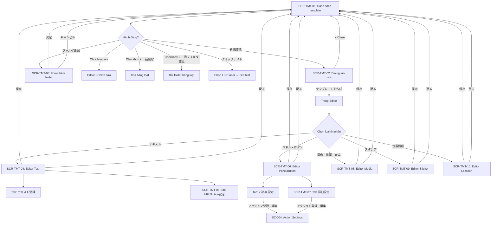

# UI Spec — FA-010 Mẫu tin nhắn「テンプレート」

> **Mã tính năng:** FA-010
> **Tên JP:** 「テンプレート」
> **Portal:** Admin
> **URL chính:** /basic/message-template
> **Phân loại:** Nhắn tin (messaging)
> **Ngày tạo:** 2026-03-26
> **Nguồn:** Accessibility tree snapshots + screenshots từ playwright-cli
> **Shared component:** SC-001 (Template Message) — được dùng bởi nhiều tính năng khác (FA-001, FA-007, FA-008, FA-009, FA-012)

---

## 1. Tổng quan tính năng

Tính năng「テンプレート」cho phép Admin tạo và quản lý các mẫu tin nhắn (message templates) có thể tái sử dụng. Mỗi template chứa một tin nhắn thuộc một trong 5 loại: văn bản (テキスト), panel/button (パネル・ボタン), media (画像・動画・音声), sticker (スタンプ), hoặc vị trí (位置情報).

Template được tổ chức theo folder, hỗ trợ tìm kiếm, sắp xếp, thao tác hàng loạt, và gửi test nhanh (quick test) đến LINE user.

**Vai trò shared component:** Template là thành phần dùng chung — được nhúng/gọi từ các tính năng khác như Chat 1:1 (FA-001), Tin nhắn chào mừng (FA-007), Gửi tin hàng loạt (FA-008), Phát hành theo bước (FA-009), và Action Settings (SC-004).

### Actors

| Actor | Vai trò | Quyền truy cập |
|-------|---------|----------------|
| Admin | Tạo, chỉnh sửa, xoá, tổ chức template theo folder | Toàn quyền |
| Staff | Truy cập template theo quyền được Admin phân | Tuỳ theo custom role |

---

## 2. Danh sách màn hình

| Mã | Tên màn hình | Tên JP | URL / Trigger | Screenshot |
|----|-------------|--------|---------------|------------|
| SCR-TMT-01 | Danh sách template | 「テンプレート（一覧）」 | /basic/message-template | [SCR-TMT-01](screenshots/SCR-TMT-01-list.png) |
| SCR-TMT-02 | Dialog tạo template mới | 「テンプレート作成」(dialog) | Nút「新規作成」trên SCR-TMT-01 | [SCR-TMT-02](screenshots/SCR-TMT-02-create-dialog.png) |
| SCR-TMT-03 | Form thêm folder | 「フォルダ追加」(inline form) | Nút「フォルダ追加」trên SCR-TMT-01 | [SCR-TMT-03](screenshots/SCR-TMT-03-add-folder.png) |
| SCR-TMT-04 | Editor — Loại văn bản | 「テンプレート作成」— テキスト | Chọn「テキスト」khi tạo/sửa template | [SCR-TMT-04](screenshots/SCR-TMT-04-editor-text.png) |
| SCR-TMT-05 | Editor — Cài đặt URL/Action | URL表示期限・アクション設定 | Tab「URL表示期限・アクション設定」trên SCR-TMT-04 | [SCR-TMT-05](screenshots/SCR-TMT-05-editor-url-action.png) |
| SCR-TMT-06 | Editor — Loại Panel/Button | 「テンプレート作成」— パネル・ボタン | Chọn「パネル・ボタン」khi tạo/sửa template | [SCR-TMT-06](screenshots/SCR-TMT-06-editor-panel.png) |
| SCR-TMT-07 | Editor — Panel chi tiết | 「詳細設定」(tab) | Tab「詳細設定」trên SCR-TMT-06 | [SCR-TMT-07](screenshots/SCR-TMT-07-editor-panel-detail.png) |
| SCR-TMT-08 | Editor — Loại Media | 「テンプレート作成」— 画像・動画・音声 | Chọn「画像・動画・音声」khi tạo/sửa template | [SCR-TMT-08](screenshots/SCR-TMT-08-editor-media.png) |
| SCR-TMT-09 | Editor — Loại Sticker | 「テンプレート作成」— スタンプ | Chọn「スタンプ」khi tạo/sửa template | [SCR-TMT-09](screenshots/SCR-TMT-09-editor-stamp.png) |
| SCR-TMT-10 | Editor — Loại Vị trí | 「テンプレート作成」— 位置情報 | Chọn「位置情報」khi tạo/sửa template | [SCR-TMT-10](screenshots/SCR-TMT-10-editor-location.png) |

---

## 3. Chi tiết từng màn hình

### SCR-TMT-01: Danh sách template「テンプレート（一覧）」

**URL:** /basic/message-template
**Layout:** 2 panel — folder tree bên trái, bảng danh sách bên phải
**Heading:** 「テンプレート」(h2) + link「マニュアル」(→ https://lme.jp/manual/templete/)

#### Panel trái — Quản lý folder

| Thành phần | Loại | Mô tả |
|-----------|------|-------|
| 「フォルダ追加」 | Button | Mở inline form thêm folder mới (→ SCR-TMT-03) |
| 「並べ替え」 | Button | Sắp xếp thứ tự folder (drag & drop suy luận) |
| 「未分類 (0)」 | Folder item | Folder mặc định, hiển thị số lượng template trong ngoặc. Click để lọc danh sách |

**Quan sát:** Folder mặc định「未分類」luôn tồn tại, không xoá được (suy luận). Số trong ngoặc là số template thuộc folder đó.

#### Panel phải — Bảng danh sách

**Toolbar:**

| Thành phần | Loại | Mô tả |
|-----------|------|-------|
| 「新規作成」 | Button | Mở dialog tạo template mới (→ SCR-TMT-02) |
| 「並べ替え」 | Button | Sắp xếp thứ tự template |
| Tìm kiếm「管理名を入力」 | Textbox + icon search | Lọc danh sách theo tên quản lý |

**Bảng dữ liệu:**

| Cột | Tên JP | Sortable | Mô tả |
|-----|--------|----------|-------|
| (checkbox) | — | Không | Chọn nhiều template cho thao tác hàng loạt |
| 「管理名」 | 管理名 | Có (up/down arrows) | Tên quản lý nội bộ của template |
| 「内容」 | 内容 | Không | Preview nội dung tin nhắn |
| 「作成日」 | 作成日 | Có (up/down arrows) | Ngày tạo |
| 「最終編集日」 | 最終編集日 | Có (up/down arrows) | Ngày chỉnh sửa lần cuối |
| 「クイックテスト」 | クイックテスト | Không | Gửi test nhanh đến LINE user |
| 「操作」 | 操作 | Không | Các thao tác: sửa, xoá, sao chép (suy luận) |

**Empty state:** 「データがありません。」khi folder không có template.

**Footer actions:**

| Thành phần | Loại | Trạng thái | Mô tả |
|-----------|------|-----------|-------|
| 「フォルダを非表示」 | Toggle link | Mặc định hiển thị | Ẩn/hiện panel folder bên trái |
| 「一括フォルダ変更」 | Button | Disabled (khi chưa chọn template) | Di chuyển template đã chọn sang folder khác |
| 「一括削除」 | Button | Disabled (khi chưa chọn template) | Xoá hàng loạt template đã chọn |

**Network requests khi load trang:**
- `POST /ajax/init-template` — khởi tạo danh sách template
- `POST /ajax/template-v2/init-list-line-user-v2` — lấy danh sách LINE user (cho quick test)
- `POST /ajax/template-v2/search-list-line-user-v2` — tìm kiếm LINE user
- `POST /ajax/check-init-tutorial` — kiểm tra tutorial

---

### SCR-TMT-02: Dialog tạo template mới「テンプレート作成」

**Trigger:** Nút「新規作成」trên SCR-TMT-01
**Loại:** Modal dialog (overlay)

#### Form fields

| Label JP | Loại | Ràng buộc | Bắt buộc | Mô tả |
|---------|------|----------|----------|-------|
| 「管理名」 | Textbox | Max 20 ký tự (hiển thị 0/20) | Suy luận bắt buộc | Tên quản lý nội bộ |
| 「フォルダ」 | Combobox (dropdown) | Danh sách folder đã tạo | Không (mặc định「未分類」) | Chọn folder chứa template |

#### Action buttons

| Nút | Mô tả |
|-----|-------|
| 「テンプレートを作成」 | Submit tạo template → chuyển sang trang editor (SCR-TMT-04 ~ 10 tuỳ loại) |
| X (close) | Đóng dialog, không tạo |

**Quan sát:**
- Dialog chỉ nhập tên và chọn folder. Chọn loại tin nhắn (message type) ở trang editor sau khi tạo.
- Folder combobox liệt kê tất cả folder hiện có, mặc định chọn「未分類」.

---

### SCR-TMT-03: Form thêm folder「フォルダ追加」

**Trigger:** Nút「フォルダ追加」trên SCR-TMT-01
**Loại:** Inline form (mở ngay trong panel trái, không phải dialog)

#### Form fields

| Label JP | Loại | Ràng buộc | Bắt buộc | Mô tả |
|---------|------|----------|----------|-------|
| 「フォルダ名」 | Textbox | Max 20 ký tự (hiển thị 0/20) | Có | Tên folder mới |

#### Action buttons

| Nút | Mô tả |
|-----|-------|
| 「決定」 | Xác nhận tạo folder |
| 「キャンセル」 | Huỷ, đóng form inline |

---

### SCR-TMT-04: Editor — Loại văn bản「テキスト」

**URL:** Trang riêng (navigate từ SCR-TMT-02 sau khi tạo, hoặc click sửa template có sẵn)
**Heading:** 「テンプレート作成」(h2) + text「テンプレートの配信カウントについて」
**Layout:** Form dọc — header (tên + folder) → chọn loại → nội dung editor → footer buttons

#### Header fields (chung cho tất cả loại)

| Label JP | Loại | Ràng buộc | Bắt buộc | Mô tả |
|---------|------|----------|----------|-------|
| 「管理名」 | Textbox | Max 20 ký tự (0/20) | Có | Tên quản lý nội bộ |
| 「フォルダ」 | Combobox | Danh sách folder (18+ options quan sát được) | Không (mặc định「未分類」) | Chọn folder |

#### Chọn loại tin nhắn (message type)

**Lưu ý quan trọng:** 「メッセージタイプを選択（保存後の変更はできません）」 — Loại tin nhắn không thể thay đổi sau khi lưu.

| Tab | Tên JP | Anchor | Mô tả |
|-----|--------|--------|-------|
| Văn bản | 「テキスト」 | #message-text | Tin nhắn dạng text thuần |
| Panel/Button | 「パネル・ボタン」 | #message-form | Tin nhắn dạng carousel/flex với nút bấm |
| Media | 「画像・動画・音声」 | #message-media | Upload file media |
| Sticker | 「スタンプ」 | #message-stamp | Chọn LINE sticker |
| Vị trí | 「位置情報」 | #message-location | Chọn vị trí trên bản đồ |

#### Sub-tabs loại văn bản

| Tab | Tên JP | Mô tả |
|-----|--------|-------|
| 「テキスト登録」 | テキスト登録 | Soạn nội dung văn bản |
| 「URL表示期限・アクション設定」 | URL表示期限・アクション設定 | Cài đặt URL và action (→ SCR-TMT-05) |

#### Nội dung tab「テキスト登録」

| Thành phần | Loại | Ràng buộc | Mô tả |
|-----------|------|----------|-------|
| Vùng soạn thảo | Textarea | Max 5,000 ký tự (0/5,000) | Nội dung tin nhắn text |
| 「情報自動挿入」 | Button | — | Chèn biến tự động (tên LINE user, v.v.) |
| 「PDFアップロード」 | Button | — | Upload file PDF → chuyển thành link |
| 「絵文字」 | Button | — | Chèn emoji LINE |
| Checkbox「このメッセージでは入力したそのままのURLを利用する」 | Checkbox | — | Dùng URL gốc (không tracking). Lưu ý: mất khả năng theo dõi mở/click URL |

**Ghi chú UI:**
- 「(そのままのURLを利用する場合、配信・開封の情報取得、URLタップ時アクションが利用できません。)」— cảnh báo mất tracking khi dùng URL gốc
- 「※ URLの前後には自動的に半角スペースが挿入されます。（Android端末で正常にURLが表示されない場合があるため。）」— tự động thêm space trước/sau URL

#### Footer buttons (chung cho tất cả loại)

| Nút | Mô tả |
|-----|-------|
| 「保存」 | Lưu template |
| 「戻る」 | Quay lại danh sách (SCR-TMT-01) |

---

### SCR-TMT-05: Editor — Cài đặt URL/Action

**Trigger:** Tab「URL表示期限・アクション設定」trên SCR-TMT-04
**Loại:** Tab panel (cùng trang với SCR-TMT-04)

#### Nội dung

| Thành phần | Loại | Giá trị | Mô tả |
|-----------|------|---------|-------|
| 「アクション稼働設定」 | Radio group | 「一度のみ稼働」/「何度でも稼働」 | Số lần action được kích hoạt khi user click URL |
| Ghi chú | Text | 「（稼働テストをする場合は「何度でも稼働」を選択してください）」 | Hướng dẫn chọn khi test |
| Cảnh báo | Text (icon) | 「フォーム作成・カレンダー予約・イベント予約・商品販売・コンバージョン・QRコードアクションのURLは対応していません。」 | Các loại URL không hỗ trợ |
| 「URL表示プレビュー」 | Radio group | 「表示する」/「表示しない」 | Hiển thị preview URL trên LINE hay không |
| Mô tả | Text | 「URLのプレビュー表示の有無を設定します」 | — |

---

### SCR-TMT-06: Editor — Loại Panel/Button「パネル・ボタン」

**Trigger:** Chọn tab「パネル・ボタン」trên trang editor
**Loại:** Cùng trang editor, panel nội dung thay đổi

#### Chọn sub-type (không thể đổi sau khi lưu)

「タイプ選択（保存後の変更はできません）」

| Sub-type | Tên JP | Mô tả |
|----------|--------|-------|
| Standard | 「スタンダード」 | Carousel tiêu chuẩn với ảnh + text + buttons |
| Color Button | 「カラーボタン」 | Carousel với nút màu (suy luận) |
| Image | 「画像」 | Carousel dạng ảnh toàn phần (imagemap suy luận) |
| Quick Reply | 「クイックリプライ」 | Nút quick reply dưới tin nhắn |

#### Sub-tabs

| Tab | Tên JP | Mô tả |
|-----|--------|-------|
| 「パネル設定」 | パネル設定 | Cấu hình nội dung từng panel |
| 「詳細設定」 | 詳細設定 | Cài đặt chi tiết (tap limit, overflow message) → SCR-TMT-07 |

#### Tab「パネル設定」

**Panel management:**
- 「パネル追加」(button) — Thêm panel mới
- Tối đa 10 panel:「※パネルは最大10枚まで登録できます。」
- Panel carousel: thumbnail hiển thị preview (ảnh + タイトル + 本文 + ボタン)
- Mỗi panel có nút「編集中」(đang chỉnh sửa) và icon xoá/di chuyển

**Nội dung 1 panel (vd: パネル1編集):**

| Label JP | Loại | Ràng buộc | Bắt buộc | Mô tả |
|---------|------|----------|----------|-------|
| 「画像登録」 | Image upload | Kích thước khuyến nghị 1024x678 px | Không | Ảnh header của panel |
| 「タイトル」 | Textbox | Max 40 ký tự (0/40) | Không | Tiêu đề panel |
| 「本文」 | Textbox | Max 60 ký tự (0/60) | Có (ký hiệu ＊) | Nội dung text của panel |
| Nút「LINE名」 | Button | — | — | Chèn tên LINE user vào タイトル hoặc 本文 |

**Lưu ý hiển thị:**
- 「表示端末によっては、文字数制限内でも全文表示されない場合があります。」— Có thể bị cắt trên một số thiết bị
- 「呼び出しテキストが文字数制限を超える場合、末尾がカットされます。」— Text quá dài sẽ bị cắt đuôi

**Cấu hình button trong panel:**

| Label JP | Loại | Ràng buộc | Bắt buộc | Mô tả |
|---------|------|----------|----------|-------|
| 「ボタンテキスト」 | Textbox | Max 20 ký tự (0/20) | Có (ký hiệu ＊) | Text hiển thị trên nút |
| 「アクション」 | Radio group | 2 loại | Có | Loại action khi bấm nút |

**Loại action:**

| Option | Tên JP | Mô tả |
|--------|--------|-------|
| Elme Action + Friend Action | 「エルメアクション・友だちアクションを設定する（併用可）」 | Cài đặt action Elme và/hoặc friend action (có thể dùng đồng thời) |
| LINE URL Scheme | 「LINE URLスキームを設定する（他アクションとの併用不可）」 | Dùng LINE URL scheme (không thể kết hợp action khác) |

**Khi chọn Elme Action:**
- Sub-tabs:「エルメアクション」/「友だちアクション」
- Nút「アクション登録・編集」→ mở dialog cài đặt action (→ SC-004 Action Settings)
- State message:「エルメアクションが登録されていません」khi chưa cài

**Giới hạn button:**
- 「※選択肢はパネル1枚の場合は4つ、パネル2枚以上の場合は3つまで登録できます。」
- Panel đơn: tối đa 4 button
- Panel 2+: tối đa 3 button mỗi panel

**Navigation:**
- 「ボタン追加」(button) — thêm button mới
- 「パネル選択に戻る」(link) — quay lại danh sách panel

---

### SCR-TMT-07: Editor — Panel chi tiết「詳細設定」

**Trigger:** Tab「詳細設定」trên SCR-TMT-06
**Loại:** Tab panel (cùng trang)

#### Cài đặt tap limit

| Thành phần | Loại | Giá trị | Mô tả |
|-----------|------|---------|-------|
| 「選択肢のタップ回数」 | Radio group (4 options) | Xem bên dưới | Giới hạn số lần user có thể bấm |
| Ghi chú | Text (icon) | 「タップ時のアクションにエルメアクションが含まれない場合、以下の設定は「無制限」となります。」 | Chỉ áp dụng khi có Elme action |

**Options tap limit:**

| Option | Tên JP | Mô tả (suy luận từ thumbnail) |
|--------|--------|------|
| 1 | 「全体で1回のみ」 | Toàn bộ panel chỉ cho bấm 1 lần tổng cộng |
| 2 | 「各パネルで1回ずつ」 | Mỗi panel cho bấm 1 lần |
| 3 | 「各選択肢で1回ずつ」 | Mỗi nút cho bấm 1 lần |
| 4 | 「無制限」 | Không giới hạn |

#### Cài đặt vượt giới hạn tap

| Thành phần | Loại | Ràng buộc | Mô tả |
|-----------|------|----------|-------|
| 「設定タップ数を超えた時の送信メッセージ」 | Radio + Textbox | 「送信する」/「送信しない」, max 400 ký tự (0/400) | Tin nhắn gửi khi vượt giới hạn |
| Default text | — | 「タップ回数上限に達しています」 | Nội dung mặc định |
| 「設定タップ数を超えた時の稼働アクション」 | Action picker | 「エルメアクション」 | Action chạy khi vượt giới hạn |
| Nút「アクション登録・編集」 | Button | — | Cài đặt Elme action (→ SC-004) |

#### Cài đặt hiển thị PC/notification

| Thành phần | Loại | Ràng buộc | Mô tả |
|-----------|------|----------|-------|
| 「パソコン版・通知欄の表示テキスト」 | Textbox | Max 400 ký tự (0/400), mặc định「メッセージをご確認ください」 | Text hiển thị trên PC/notification (thay cho panel) |
| Ghi chú | Text | 「※端末により「スマートフォンでのみ確認可能なメッセージです」などの文章が表示される場合があります。」 | Lưu ý thiết bị |

---

### SCR-TMT-08: Editor — Loại Media「画像・動画・音声」

**Trigger:** Chọn tab「画像・動画・音声」trên trang editor

#### Nội dung

| Thành phần | Loại | Mô tả |
|-----------|------|-------|
| Vùng upload | Drag & drop zone + button | 「ここにファイルをドロップ」/「または」/「PCから選択」 |

**Bảng format hỗ trợ:**

| Loại dữ liệu (データ形式) | Định dạng (対応形式) | Dung lượng tối đa (最大データ容量) |
|-------------------------|---------------------|--------------------------------|
| Hình ảnh (画像) | .png / .jpg | 10MB |
| Video (動画) | .mp4 | 200MB |
| Âm thanh (音声) | .m4a | 200MB |

---

### SCR-TMT-09: Editor — Loại Sticker「スタンプ」

**Trigger:** Chọn tab「スタンプ」trên trang editor

#### Nội dung

| Thành phần | Loại | Mô tả |
|-----------|------|-------|
| Header | Text | 「スタンプ選択」+「※クリエイターズスタンプは利用できません」 |
| Sticker packs | Tablist (12 tabs) | Danh sách bộ sticker LINE official |
| Sticker grid | Radio group + images | Chọn 1 sticker bằng radio button |
| Preview | Image | 「選択したスタンプ」+ ảnh preview sticker đã chọn |

**Danh sách sticker packs (12 packs):**

| # | Tên JP |
|---|--------|
| 1 | 「ムーンスペシャル」 |
| 2 | 「サリースペシャル」 |
| 3 | 「謝罪のプロ！LINEキャラクターズ」 |
| 4 | 「ちっちゃいブラコニ」 |
| 5 | 「ゆる敬語★ LINEキャラクターズ」 |
| 6 | 「動くブラウン＆コニー＆サリースペシャル」 |
| 7 | 「動くチョコ＆LINEキャラスペシャル」 |
| 8 | 「ユニバースターBT21 スペシャルVer.」 |
| 9 | 「ムーン・ジェームズ」 |
| 10 | 「ブラウン・コニー」 |
| 11 | 「チェリーココ」 |
| 12 | 「デカ絵文字」 |

**Quan sát:** Pack đầu tiên hiển thị ~40 stickers (radio buttons). Mỗi pack có số lượng sticker khác nhau. Chỉ hỗ trợ LINE official stickers, không hỗ trợ creators stickers.

---

### SCR-TMT-10: Editor — Loại Vị trí「位置情報」

**Trigger:** Chọn tab「位置情報」trên trang editor

#### Phần chọn vị trí

| Thành phần | Loại | Mô tả |
|-----------|------|-------|
| Header | Text | 「位置情報選択」+「① 送信したい位置情報を地図上でクリックしてピンの位置を設定してください。」 |
| Google Maps | Map embed | Bản đồ Google Maps cho pin vị trí (click để đặt pin) |
| Search box | Textbox (disabled nếu lỗi Maps) | Tìm kiếm địa chỉ trên bản đồ |
| 「選択されているピンの位置で決定」 | Button | 「② 送信する位置情報を決定する」— xác nhận vị trí đã chọn |
| 「指定された住所」 | Textbox (readonly) | Hiển thị địa chỉ của pin đã chọn |

#### Phần thông tin gửi

| Label JP | Loại | Ràng buộc | Bắt buộc | Mô tả |
|---------|------|----------|----------|-------|
| 「位置情報タイトル」 | Textbox | Max 90 ký tự (0/90) | Suy luận không bắt buộc | Tiêu đề vị trí hiển thị trên LINE |
| 「位置情報詳細」 | Textbox | Max 90 ký tự (0/90) | Suy luận không bắt buộc | Mô tả chi tiết vị trí |
| 「送信する位置情報の住所を引用」 | Button | — | — | Copy địa chỉ từ Maps vào các field |

**Preview:** Mini map + hiển thị タイトル, 詳細, và「Location」text.

---

## 4. User Flows

### 4.1. Tạo template mới (Happy path)

1. Admin truy cập /basic/message-template → SCR-TMT-01
2. Click「新規作成」→ SCR-TMT-02 (modal dialog)
3. Nhập「管理名」(tối đa 20 ký tự), chọn「フォルダ」
4. Click「テンプレートを作成」→ navigate đến trang editor
5. Chọn loại tin nhắn (1 trong 5 tab) — **không thể đổi sau khi lưu**
6. Nhập nội dung tuỳ theo loại đã chọn
7. Click「保存」→ lưu template, quay lại SCR-TMT-01

### 4.2. Tạo template loại Panel/Button

1. Sau bước 4 ở flow 4.1, chọn tab「パネル・ボタン」
2. Chọn sub-type:「スタンダード」/「カラーボタン」/「画像」/「クイックリプライ」— **không thể đổi sau khi lưu**
3. Trên tab「パネル設定」: click「パネル追加」hoặc chỉnh sửa panel hiện có
4. Upload ảnh (1024x678 px), nhập「タイトル」(40 chars),「本文」(60 chars, bắt buộc)
5. Thêm button: nhập「ボタンテキスト」(20 chars, bắt buộc), chọn loại action
6. Nếu chọn「エルメアクション」→ click「アクション登録・編集」→ cài đặt action (SC-004)
7. Tuỳ chọn: tab「詳細設定」→ cài đặt tap limit, overflow message, PC text
8. Click「保存」

### 4.3. Quản lý folder

1. Trên SCR-TMT-01, click「フォルダ追加」→ SCR-TMT-03 (inline form)
2. Nhập「フォルダ名」(tối đa 20 ký tự)
3. Click「決定」→ folder mới xuất hiện trong panel trái
4. Click vào folder → lọc bảng danh sách theo folder đó

### 4.4. Thao tác hàng loạt

1. Trên SCR-TMT-01, tick checkbox cạnh từng template
2. Buttons「一括フォルダ変更」và「一括削除」trở thành active
3. Click「一括フォルダ変更」→ chọn folder đích (suy luận: dialog chọn folder)
4. Hoặc click「一括削除」→ xoá template đã chọn (suy luận: có confirm dialog)

### 4.5. Quick Test

1. Trên SCR-TMT-01, cột「クイックテスト」của template đã tạo
2. Click → chọn LINE user từ danh sách (API init-list-line-user-v2, search-list-line-user-v2)
3. Gửi template test đến LINE user đã chọn

---

## 5. Flow Diagram

---

## 6. Shared Components phát hiện

| Mã SC | Tên | Sử dụng tại | Chi tiết |
|-------|-----|-------------|----------|
| SC-004 | Action Settings | SCR-TMT-06 (button action), SCR-TMT-07 (overflow action) | Nút「アクション登録・編集」→ mở dialog cài đặt Elme action / Friend action. Gồm sub-tabs「エルメアクション」/「友だちアクション」. Message khi chưa cài:「エルメアクションが登録されていません」 |
| SC-005 | Rich Text / Message Editor | SCR-TMT-04 (text editor) | Các công cụ soạn thảo:「情報自動挿入」,「PDFアップロード」,「絵文字」, checkbox URL gốc. Component này tương tự editor trong FA-001 Chat, FA-008 Broadcast |

**Xác nhận SC-001 (Template Message):** FA-010 chính là trang quản lý template — không embed SC-001 mà **là** SC-001. Các tính năng khác (FA-001, FA-008, FA-009) sẽ gọi/tham chiếu template từ đây.

---

## 7. Điểm chưa rõ / cần xác nhận

| # | Nội dung | Mức độ | Ghi chú |
|---|---------|--------|---------|
| 1 | Cột「操作」trong bảng danh sách — chính xác gồm những thao tác nào? (sửa, xoá, sao chép, di chuyển folder?) | **Thấp** | Bảng trống (データがありません), không quan sát được nội dung cột này |
| 2 | Cột「内容」hiển thị gì? Preview text hay icon loại tin nhắn? | **Thấp** | Bảng trống |
| 3 | Cột「クイックテスト」hiển thị nút gì? Dialog chọn LINE user có giao diện ra sao? | **Thấp** | Có API init-list-line-user-v2 nhưng chưa thấy UI |
| 4 | Sub-types của Panel/Button:「カラーボタン」,「画像」,「クイックリプライ」khác nhau thế nào về giao diện editor? | **Trung bình** | Chỉ quan sát được「スタンダード」, các sub-type khác chưa mở |
| 5 | Sắp xếp (「並べ替え」) hoạt động thế nào? Drag & drop hay dialog? | **Thấp** | Chưa click vào nút này |
| 6 | Có pagination cho danh sách template không? | **Trung bình** | Bảng trống nên không thấy pagination |
| 7 | Folder có thể rename/delete không? | **Thấp** | Chưa quan sát được right-click hoặc hover menu trên folder |
| 8 | Google Maps trên SCR-TMT-10 hiển thị lỗi — cần API key hợp lệ để test | **Trung bình** | Maps error:「このページでは Google マップが正しく読み込まれませんでした」 |
| 9 | Sub-type「クイックリプライ」có cấu hình giống Panel hay khác hoàn toàn? | **Trung bình** | Quick Reply của LINE Messaging API là dạng nút ngang dưới tin nhắn, khác với carousel |
| 10 | Template có version/history không? Có thể duplicate không? | **Thấp** | Chưa quan sát được |
