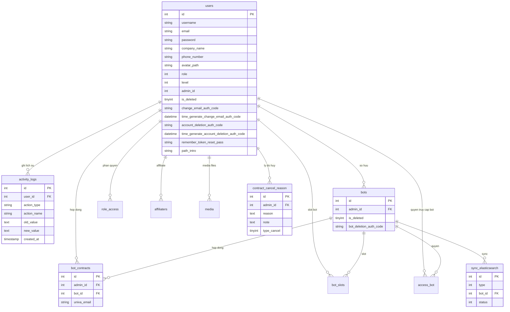

# [FA-036] Trang ca nhan — DB Mapping

> Mapping giua giao dien, API, logic voi co so du lieu.
> Nguon: DB schema (`db/schema/`), sample data (`db/data/`), cross-reference voi ui-spec va api-spec.

---

## Bang du lieu lien quan

### Bang chinh (Primary Tables)
| Bang | Mo ta | Lien ket |
|------|-------|---------|
| `users` | Bang chinh chua thong tin tai khoan: ten, email, mat khau, cong ty, SDT, avatar, ma xac thuc OTP | Model: `App\User` |
| `activity_logs` | Lich su hoat dong cua user (doi ten, doi email, doi mat khau, doi avatar...) | Model: `App\Models\ActivityLog` |

### Bang phu (Secondary Tables — lien quan khi xoa tai khoan)
| Bang | Mo ta | Kieu | Lien ket chinh |
|------|-------|------|---------------|
| `bots` | LINE Official Account — kiem tra dieu kien truoc khi xoa tai khoan, soft-delete khi xoa | Entity | `bots.admin_id` → `users.id` |
| `bot_contracts` | Hop dong bot — cap nhat `univa_email` khi doi email, xoa khi xoa tai khoan | Entity | `bot_contracts.admin_id` → `users.id` |
| `bot_slots` | Slot bot — xoa khi xoa tai khoan | Pivot | `bot_slots.admin_id` → `users.id` |
| `access_bot` | Quyen truy cap bot — xoa khi xoa tai khoan | Pivot | `access_bot.admin_id` → `users.id` |
| `role_access` | Quyen truy cap theo role — xoa khi xoa tai khoan (user + staff) | Pivot | `role_access.user_id` → `users.id` |
| `affiliaters` | Tai khoan affiliate — xoa khi xoa tai khoan | Entity | `affiliaters.admin_id` → `users.id` |
| `affiliate_info` | Thong tin affiliate chi tiet — xoa khi xoa tai khoan | Entity | Lien ket qua `affiliaters` |
| `payment_detail_aff` | Chi tiet thanh toan affiliate — cap nhat roi xoa khi xoa tai khoan | Log | `payment_detail_aff.admin_id` → `users.id` |
| `media` | File media (anh, video, PDF) — xoa files + records khi xoa tai khoan | Entity | `media.admin_id` → `users.id` |
| `contract_cancel_reason` | Ly do huy hop dong / xoa tai khoan | Log | `contract_cancel_reason.admin_id` → `users.id` |
| `sync_elasticsearch` | Queue dong bo du lieu len Elasticsearch — ghi event xoa bot | Queue | `sync_elasticsearch.bot_id` → `bots.id` |

---

## Chi tiet tung bang

### Bang: `users`
- **Model Laravel**: `App\User`
- **Connection**: `mysql`

#### Columns (chi cac cot lien quan FA-036)
| # | Cot | Kieu | Nullable? | Default | Mo ta | Confidence |
|---|-----|------|----------|---------|-------|-----------|
| 1 | `id` | int(11) | Khong | AUTO_INCREMENT | Khoa chinh | **Cao** |
| 2 | `admin_id` | int(12) | Khong | — | ID admin cha (0 = admin goc, > 0 = staff thuoc admin do) | **Cao** |
| 3 | `username` | varchar(255) | Khong | — | Ten hien thi tai khoan | **Cao** |
| 4 | `email` | varchar(255) | Khong | — | Email dang ky | **Cao** |
| 5 | `password` | varchar(255) | Khong | — | Mat khau (bcrypt hash) | **Cao** |
| 6 | `company_name` | varchar(255) | Co | NULL | Ten cong ty / to chuc | **Cao** |
| 7 | `phone_number` | varchar(255) | Co | NULL | So dien thoai | **Cao** |
| 8 | `avatar_path` | varchar(255) | Co | NULL | Duong dan avatar (relative path, noi voi URL_SERVER_MEDIA) | **Cao** |
| 9 | `role` | tinyint(1) | Khong | 1 | Vai tro: -1 = admin he thong, 0 = user (admin LINE OA), 2 = staff | **Cao** |
| 10 | `level` | int(11) | Co | NULL | Cap do (NULL = admin, khac = staff) | **Cao** |
| 11 | `is_deleted` | tinyint(1) | Khong | 0 | Co xoa khong (0 = chua xoa). Dung de kiem tra email trung | **Cao** |
| 12 | `change_email_auth_code` | varchar(255) | Co | NULL | Ma OTP xac thuc doi email (10 ky tu random) | **Cao** |
| 13 | `time_generate_change_email_auth_code` | datetime | Co | NULL | Thoi diem tao ma OTP doi email (hieu luc 24h) | **Cao** |
| 14 | `account_deletion_auth_code` | varchar(255) | Co | NULL | Ma OTP xac thuc xoa tai khoan (10 ky tu random) | **Cao** |
| 15 | `time_generate_account_deletion_auth_code` | datetime | Co | NULL | Thoi diem tao ma OTP xoa tai khoan (hieu luc 24h) | **Cao** |
| 16 | `remember_token_reset_pass` | varchar(64) | Co | NULL | Token buoc logout tat ca session khac (cap nhat khi doi email/pass) | **Cao** |
| 17 | `max_bot` | int(11) | Khong | 0 | So bot toi da — lien quan khi xoa tai khoan | **Trung binh** |
| 18 | `path_intro` | varchar(255) | Co | NULL | Duong dan gioi thieu (referral) — giam khi xoa tai khoan | **Cao** |
| 19 | `is_active` | tinyint(4) | Khong | 1 | Trang thai tai khoan (1 = active, 0 = inactive) | **Trung binh** |
| 20 | `created_at` | datetime | Khong | — | Ngay tao | **Cao** |
| 21 | `updated_at` | datetime | Khong | — | Ngay cap nhat | **Cao** |
| 22 | `last_name` | varchar(255) | Co | NULL | Ho — khong thay su dung trong FA-036 | **Trung binh** |

#### Indexes (suy luan tu schema — khong co khai bao tuong minh trong file dump)
| Ten Index | Cot | Kieu | Mo ta |
|----------|-----|------|-------|
| PRIMARY | `id` | Primary | Khoa chinh |
| (suy luan) | `email` | Index | Tim kiem email (checkExistEmail query) |
| (suy luan) | `admin_id` | Index | Tim staff theo admin |

#### Foreign Keys (khong khai bao tuong minh — quan he logic)
| Cot | Tham chieu | Mo ta |
|-----|-----------|-------|
| `admin_id` | `users.id` (tu tham chieu) | Staff thuoc admin nao (0 = admin goc) |

#### Sample Data (2 dong dau)
| id | admin_id | email | username | company_name | phone_number | avatar_path | role | level | is_deleted |
|----|----------|-------|----------|-------------|-------------|------------|------|-------|-----------|
| 1 | 0 | admin@gmail.com | Admin WM | NULL | NULL | NULL | -1 | 0 | 0 |
| 7 | 1 | kannzakiinfo@gmail.com | 神崎タケシ | NULL | NULL | NULL | 0 | NULL | 0 |

---

### Bang: `activity_logs`
- **Model Laravel**: `App\Models\ActivityLog`
- **Connection**: `mysql`

#### Columns
| # | Cot | Kieu | Nullable? | Default | Mo ta | Confidence |
|---|-----|------|----------|---------|-------|-----------|
| 1 | `id` | int(10) unsigned | Khong | AUTO_INCREMENT | Khoa chinh | **Cao** |
| 2 | `user_id` | int(10) unsigned | Khong | — | FK → users.id — user thuc hien hanh dong | **Cao** |
| 3 | `action_type` | varchar(20) | Khong | — | Loai hanh dong: `create`, `change` | **Cao** |
| 4 | `action_name` | varchar(50) | Khong | — | Ten hanh dong cu the (xem Enum Values) | **Cao** |
| 5 | `target_id` | int(10) unsigned | Co | NULL | ID doi tuong lien quan (khong dung trong FA-036) | **Trung binh** |
| 6 | `description` | varchar(255) | Co | NULL | Mo ta them | **Cao** |
| 7 | `old_value` | text | Co | NULL | Gia tri cu truoc khi thay doi | **Cao** |
| 8 | `new_value` | text | Co | NULL | Gia tri moi sau khi thay doi | **Cao** |
| 9 | `created_at` | timestamp | Co | NULL | Thoi diem hanh dong | **Cao** |
| 10 | `updated_at` | timestamp | Co | NULL | — | **Cao** |

#### Indexes (suy luan)
| Ten Index | Cot | Kieu | Mo ta |
|----------|-----|------|-------|
| PRIMARY | `id` | Primary | Khoa chinh |
| (suy luan) | `user_id` | Index | Loc logs theo user |

#### Foreign Keys (logic, khong khai bao tuong minh)
| Cot | Tham chieu | Mo ta |
|-----|-----------|-------|
| `user_id` | `users.id` | User thuc hien hanh dong |

#### Sample Data
| id | user_id | action_type | action_name | target_id | description | old_value | new_value | created_at |
|----|---------|-------------|-------------|-----------|-------------|-----------|-----------|-----------|
| 1 | 115 | change | change_phone | NULL | NULL | 0999999999 | 09999999998 | 2026-03-19 03:48:10 |
| 2 | 115 | change | change_phone | NULL | NULL | 09999999998 | 0999999999 | 2026-03-19 03:48:13 |

---

### Bang: `bots` (chi cac cot lien quan FA-036)
- **Model Laravel**: `App\Models\Bot` (suy luan)

#### Columns lien quan
| # | Cot | Kieu | Nullable? | Default | Mo ta | Confidence |
|---|-----|------|----------|---------|-------|-----------|
| 1 | `id` | int(12) | Khong | AUTO_INCREMENT | Khoa chinh | **Cao** |
| 2 | `admin_id` | int(12) | Khong | — | FK → users.id — admin so huu bot | **Cao** |
| 3 | `is_deleted` | tinyint(1) | Khong | 0 | Soft-delete (0 = active, 1 = da xoa) | **Cao** |
| 4 | `bot_name` | varchar(128) | Co | NULL | Ten bot | **Cao** |
| 5 | `bot_deletion_auth_code` | varchar(255) | Co | NULL | Ma OTP xac thuc xoa bot | **Cao** |
| 6 | `time_generate_bot_deletion_auth_code` | datetime | Co | NULL | Thoi diem tao ma OTP xoa bot | **Cao** |

#### Vai tro trong FA-036
- EP-15 (`checkAuthDeleteAccount`): kiem tra `bots WHERE admin_id = {id} AND is_deleted = 0` — con bot active thi khong cho xoa tai khoan
- EP-19 (`deleteAccountMyself`): soft-delete tat ca bot `SET is_deleted = 1`
- EP-17 (`sendAuthCode` voi `type_receiver = auth_delete_bot`): luu `bot_deletion_auth_code`

---

### Bang: `bot_contracts` (chi cac cot lien quan FA-036)
- **Model Laravel**: `App\Models\BotContract` (suy luan)

#### Columns lien quan
| # | Cot | Kieu | Nullable? | Default | Mo ta | Confidence |
|---|-----|------|----------|---------|-------|-----------|
| 1 | `id` | int(10) unsigned | Khong | AUTO_INCREMENT | Khoa chinh | **Cao** |
| 2 | `admin_id` | int(11) | Co | NULL | FK → users.id | **Cao** |
| 3 | `bot_id` | int(11) | Co | NULL | FK → bots.id | **Cao** |
| 4 | `univa_email` | varchar(255) | Co | NULL | Email dang ky thanh toan UnivaPay — cap nhat khi doi email | **Cao** |

#### Vai tro trong FA-036
- EP-08 / EP-21 (doi email): tim `bot_contracts` co `univa_email` = email cu → cap nhat thanh email moi + goi PATCH UnivaPay API
- EP-19 (xoa tai khoan): xoa tat ca `bot_contracts` cua user

---

### Bang: `contract_cancel_reason`

#### Columns
| # | Cot | Kieu | Nullable? | Default | Mo ta | Confidence |
|---|-----|------|----------|---------|-------|-----------|
| 1 | `id` | int(10) unsigned | Khong | AUTO_INCREMENT | Khoa chinh | **Cao** |
| 2 | `admin_id` | int(11) | Co | NULL | FK → users.id | **Cao** |
| 3 | `bot_contract_id` | int(11) | Co | NULL | FK → bot_contracts.id | **Cao** |
| 4 | `reason` | text | Co | NULL | Ly do huy (mang `array_reason_account_deletion`) | **Cao** |
| 5 | `note` | text | Co | NULL | Ghi chu ly do (`note_reason_account_deletion`) | **Cao** |
| 6 | `type_cancel` | tinyint(4) | Co | NULL | Loai huy: 1 = xoa bot free, 2 = huy hop dong. Xoa tai khoan dung `config('sns-line.type_reason_cancel.user')` | **Cao** |
| 7 | `bot_name` | varchar(255) | Co | NULL | Ten bot (de-normalize) | **Trung binh** |
| 8 | `user_id` | int(11) | Co | NULL | FK → users.id | **Trung binh** |
| 9 | `bot_id` | int(11) | Co | NULL | FK → bots.id | **Trung binh** |
| 10 | `created_at` | timestamp | Khong | CURRENT_TIMESTAMP | — | **Cao** |
| 11 | `updated_at` | timestamp | Khong | CURRENT_TIMESTAMP | — | **Cao** |

#### Vai tro trong FA-036
- EP-19 (xoa tai khoan): luu ly do xoa vao bang nay voi `type_cancel = config('sns-line.type_reason_cancel.user')`

---

### Bang: `role_access`

#### Columns
| # | Cot | Kieu | Nullable? | Default | Mo ta | Confidence |
|---|-----|------|----------|---------|-------|-----------|
| 1 | `id` | int(10) unsigned | Khong | AUTO_INCREMENT | Khoa chinh | **Cao** |
| 2 | `user_id` | int(11) | Khong | — | FK → users.id | **Cao** |
| 3 | `role_id` | int(11) | Khong | — | FK → roles.id (suy luan) | **Trung binh** |
| 4 | `access_id` | int(11) | Khong | — | FK → accesses.id (suy luan) | **Trung binh** |

#### Vai tro trong FA-036
- EP-19 (xoa tai khoan): xoa tat ca `role_access WHERE user_id IN [admin_id, staff_ids]`

---

### Bang: `bot_slots`

#### Columns
| # | Cot | Kieu | Nullable? | Default | Mo ta | Confidence |
|---|-----|------|----------|---------|-------|-----------|
| 1 | `id` | int(10) unsigned | Khong | AUTO_INCREMENT | Khoa chinh | **Cao** |
| 2 | `admin_id` | int(11) | Co | NULL | FK → users.id | **Cao** |
| 3 | `bot_contract_id` | int(11) | Co | NULL | FK → bot_contracts.id | **Cao** |
| 4 | `bot_id` | int(11) | Co | NULL | FK → bots.id | **Cao** |
| 5 | `is_active` | tinyint(4) | Khong | 1 | Trang thai | **Cao** |

#### Vai tro trong FA-036
- EP-19 (xoa tai khoan): xoa tat ca `bot_slots` cua user

---

### Bang: `access_bot`

#### Columns
| # | Cot | Kieu | Nullable? | Default | Mo ta | Confidence |
|---|-----|------|----------|---------|-------|-----------|
| 1 | `id` | int(10) unsigned | Khong | AUTO_INCREMENT | Khoa chinh | **Cao** |
| 2 | `admin_id` | int(11) | Khong | — | FK → users.id | **Cao** |
| 3 | `bot_id` | int(11) | Khong | — | FK → bots.id | **Cao** |

#### Vai tro trong FA-036
- EP-19 (xoa tai khoan): xoa tat ca `access_bot` cua user

---

### Bang: `sync_elasticsearch`

#### Columns lien quan
| # | Cot | Kieu | Nullable? | Default | Mo ta | Confidence |
|---|-----|------|----------|---------|-------|-----------|
| 1 | `id` | int(10) unsigned | Khong | AUTO_INCREMENT | Khoa chinh | **Cao** |
| 2 | `type` | int(11) | Co | NULL | Loai sync: 0 = BOT_LINE_USER, 1 = LINE_USER... | **Cao** |
| 3 | `bot_id` | int(11) | Co | NULL | FK → bots.id | **Cao** |
| 4 | `status` | int(11) | Co | 0 | 0 = WAIT_SYNC, 1 = SYNCHRONIZING, 2 = SUCCESS, 3 = ERROR | **Cao** |
| 5 | `data_sync` | text | Co | NULL | Du lieu can sync (JSON) | **Trung binh** |

#### Vai tro trong FA-036
- EP-19 (xoa tai khoan): ghi event `delete_bot` cho tung bot de background job xu ly

---

## Mapping UI ↔ Database

### Man hinh SCR-MYP-01: Trang ca nhan (phien ban moi — `/admin/my-page`)

#### Phan 「アカウント設定」 — Thong tin tai khoan
| UI Field (JP) | Bang.Cot | Kieu DB | Transform | Confidence | Ghi chu |
|--------------|----------|---------|----------|-----------|--------|
| 「ユーザー名」 | `users.username` | varchar(255) | Khong — hien thi truc tiep | **Cao** | API tra ve key `name`, map tu cot `username` (xac nhan qua EP-02 logic: `$user->username`) |
| 「会社・組織名」 | `users.company_name` | varchar(255) | Khong — hien thi truc tiep | **Cao** | API tra ve key `company`, map tu cot `company_name` |
| 「電話番号」 | `users.phone_number` | varchar(255) | Khong — hien thi truc tiep | **Cao** | API tra ve key `phone`, map tu cot `phone_number` |
| Anh dai dien (avatar) | `users.avatar_path` | varchar(255) | Noi voi `env('URL_SERVER_MEDIA')` de tao URL day du | **Cao** | API tra ve key `image`. NULL = khong co avatar |

#### Phan 「登録メールアドレス」 — Email
| UI Field (JP) | Bang.Cot | Kieu DB | Transform | Confidence | Ghi chu |
|--------------|----------|---------|----------|-----------|--------|
| 「メールアドレス」 | `users.email` | varchar(255) | Khong — hien thi truc tiep | **Cao** | Doi email qua flow OTP 2 buoc |

#### Phan 「パスワードの変更」 — Mat khau
| UI Field (JP) | Bang.Cot | Kieu DB | Transform | Confidence | Ghi chu |
|--------------|----------|---------|----------|-----------|--------|
| 「現在のパスワード」 | `users.password` | varchar(255) | Doc: `Hash::check()` de xac thuc. Ghi: `bcrypt()` | **Cao** | Chi dung de verify, khong hien thi |
| 「新しいパスワード」 | `users.password` | varchar(255) | Ghi: `bcrypt($newPassword)` | **Cao** | Ghi de mat khau cu |
| 「確認パスワード」 | — | — | Chi validation phia client/server, khong luu DB | **Cao** | So sanh voi new_password |

#### Phan Activity Logs (「アクティビティログ」)
| UI Field (JP) | Bang.Cot | Kieu DB | Transform | Confidence | Ghi chu |
|--------------|----------|---------|----------|-----------|--------|
| Loai hanh dong (icon) | `activity_logs.action_type` | varchar(20) | `create` / `change` → icon/badge tuong ung | **Cao** | Loc theo filter |
| Tieu de hanh dong | `activity_logs.action_name` | varchar(50) | Map sang tieu de JP qua constants (xem Enum Values) | **Cao** | — |
| Ngay thoi gian | `activity_logs.created_at` | timestamp | Format: `Y年m月d日 - H:i` | **Cao** | — |
| Chi tiet thay doi | `activity_logs.old_value` + `activity_logs.new_value` | text | Ghep: `{old_value} → {new_value}` | **Cao** | Mot so action co `detail_label` dac biet |
| Mo ta | `activity_logs.description` | varchar(255) | Hien thi truc tiep | **Cao** | Dung cho create_user (hien thi email) |

### Man hinh SCR-MYP-01: Trang ca nhan (phien ban cu — `/admin/setting`)

| UI Field (JP) | Bang.Cot | Kieu DB | Transform | Confidence | Ghi chu |
|--------------|----------|---------|----------|-----------|--------|
| 「ユーザー名」 | `users.username` | varchar(255) | Khong | **Cao** | EP-14: cap nhat `DB::table('users')...update(['username' => ...])` |
| 「会社・組織名」 | `users.company_name` | varchar(255) | Khong | **Cao** | EP-14 |
| 「電話番号」 | `users.phone_number` | varchar(255) | Khong | **Cao** | EP-14 |
| 「メールアドレス」 | `users.email` | varchar(255) | Khong | **Cao** | EP-14: validate `unique:users,email,{id}` |
| 「パスワード」(cu/moi/xac nhan) | `users.password` | varchar(255) | `bcrypt()` | **Cao** | EP-14: luu kem `remember_token_reset_pass` |

### Man hinh xoa tai khoan (Legacy flow)

| UI Field (JP) | Bang.Cot | Kieu DB | Transform | Confidence | Ghi chu |
|--------------|----------|---------|----------|-----------|--------|
| Ma xac thuc xoa tai khoan | `users.account_deletion_auth_code` | varchar(255) | So sanh truc tiep (plaintext) | **Cao** | 10 ky tu random, hieu luc 24h |
| Ly do xoa tai khoan | `contract_cancel_reason.reason` | text | Serialize mang `array_reason_account_deletion` | **Cao** | — |
| Ghi chu ly do | `contract_cancel_reason.note` | text | Truc tiep tu `note_reason_account_deletion` | **Cao** | — |

---

## Cac cot an (Internal — khong hien thi tren UI nhung thao tac boi FA-036)

| Bang.Cot | Kieu DB | Thao tac | Endpoint | Confidence |
|----------|---------|---------|----------|-----------|
| `users.change_email_auth_code` | varchar(255) | Ghi: luu ma OTP doi email. Doc: so sanh khi verify. Xoa: sau khi doi thanh cong | EP-07, EP-08, EP-17, EP-20, EP-21 | **Cao** |
| `users.time_generate_change_email_auth_code` | datetime | Ghi: `now()`. Doc: kiem tra het han 24h | EP-07, EP-08 | **Cao** |
| `users.account_deletion_auth_code` | varchar(255) | Ghi: luu ma OTP xoa tai khoan. Doc: so sanh khi verify | EP-17, EP-18 | **Cao** |
| `users.time_generate_account_deletion_auth_code` | datetime | Ghi: `now()`. Doc: kiem tra het han 24h | EP-17, EP-18 | **Cao** |
| `users.remember_token_reset_pass` | varchar(64) | Ghi: random 20 ky tu — buoc logout tat ca session khac | EP-08 (needReLogin=true), EP-09, EP-14, EP-21 | **Cao** |
| `users.is_deleted` | tinyint(1) | Doc: `checkExistEmail` kiem tra `is_deleted = 0` | EP-07, EP-08, EP-14 | **Cao** |
| `bot_contracts.univa_email` | varchar(255) | Doc: tim contracts co email cu. Ghi: cap nhat email moi | EP-08, EP-21 | **Cao** |

---

## Enum Values

### `activity_logs.action_type`
| Gia tri DB | Y nghia | Hien thi JP |
|-----------|---------|------------|
| `create` | Hanh dong tao moi | 「開始」 |
| `change` | Hanh dong thay doi | 「変更」 |

### `activity_logs.action_name`
| Gia tri DB | Y nghia | Hien thi JP (tieu de) | action_type |
|-----------|---------|----------------------|------------|
| `change_name` | Doi ten tai khoan | 「ユーザー名変更」 | `change` |
| `change_company` | Doi ten cong ty | 「会社・組織名 変更」 | `change` |
| `change_phone` | Doi so dien thoai | 「電話番号変更」 | `change` |
| `change_email` | Doi email | 「メールアドレス変更」 | `change` |
| `change_password` | Doi mat khau | 「パスワード変更」 | `change` |
| `change_avatar` | Doi anh dai dien | 「アカウント画像変更」 | `change` |
| `delete_avatar` | Xoa anh dai dien | 「アカウント画像削除」 | `change` |
| `create_user` | Dang ky tai khoan | 「L Messageアカウント登録」 | `create` |
| `add_loa` | Ket noi LINE Official Account | 「LINE公式アカウント接続」 | `create` |

### `users.role`
| Gia tri DB | Y nghia | Ghi chu |
|-----------|---------|--------|
| `-1` | Admin he thong (system admin) | — |
| `0` | User (admin LINE OA) | — |
| `1` | (mac dinh) | — |
| `2` | Staff | Suy luan tu comment schema |

### `users.is_deleted`
| Gia tri DB | Y nghia |
|-----------|---------|
| `0` | Tai khoan dang hoat dong |
| `1` | Tai khoan da xoa |

### `bots.is_deleted`
| Gia tri DB | Y nghia |
|-----------|---------|
| `0` | Bot dang hoat dong |
| `1` | Bot da xoa (soft-delete) |

### `contract_cancel_reason.type_cancel`
| Gia tri DB | Y nghia |
|-----------|---------|
| `1` | Xoa bot free |
| `2` | Huy hop dong |
| (config value) | Xoa tai khoan — `config('sns-line.type_reason_cancel.user')` |

### `sync_elasticsearch.type`
| Gia tri DB | Y nghia |
|-----------|---------|
| `0` | TYPE_BOT_LINE_USER |
| `1` | TYPE_LINE_USER |
| `2` | TYPE_CONVERSATION |
| `3` | TYPE_TAG |
| `4` | TYPE_FRIEND_INFO |
| `5` | TYPE_LANDING |
| `6` | TYPE_SCENARIO |
| `7` | TYPE_CONVERSION |

### `sync_elasticsearch.status`
| Gia tri DB | Y nghia |
|-----------|---------|
| `0` | STATUS_WAIT_SYNC |
| `1` | STATUS_SYNCHRONIZING |
| `2` | STATUS_SYNC_SUCCESS |
| `3` | STATUS_SYNC_ERROR |

---

## Unmapped Items

### UI fields khong map truc tiep vao DB
| Nguon | Item | Ly do | Ghi chu |
|-------|------|-------|--------|
| UI | 「確認パスワード」 (xac nhan mat khau) | Chi dung validation — khong luu DB | So sanh voi `new_password` phia server |
| UI | Filter 「全て」/「開始」/「変更」 (activity logs) | Day la params query, khong phai data luu | Loc tren `activity_logs.action_type` |
| UI | Filter ngay (date_from, date_to) | Params query | Loc tren `activity_logs.created_at` |
| UI | Pagination (page, per_page) | Params query | — |

### DB columns trong `users` khong xuat hien tren UI FA-036
| Bang.Cot | Ly do | Ghi chu |
|----------|-------|--------|
| `users.last_name` | Khong su dung trong FA-036 | Co the la truong cu, khong con dung |
| `users.channel_id` | Thuoc tinh LINE channel | Quan ly o tinh nang khac |
| `users.channel_secret` | Thuoc tinh LINE channel | Quan ly o tinh nang khac |
| `users.remember_token` | Laravel default remember token | Khac voi `remember_token_reset_pass` |
| `users.reset_token` | Token reset mat khau (forgot password) | Khong dung trong FA-036 (FA-036 la doi mat khau, khong phai quen mat khau) |
| `users.reset_token_expired` | Thoi han reset token | Khong dung trong FA-036 |
| `users.invite_code` | Ma moi | Quan ly o tinh nang affiliate |
| `users.two_factor_verify_code` | Ma 2FA dang nhap | Khong dung trong FA-036 |
| `users.time_generate_two_factor_auth_code` | Thoi diem tao ma 2FA | Khong dung trong FA-036 |
| `users.url_logo_aff` | Logo affiliate | Quan ly o tinh nang affiliate |
| `users.url_header_aff` | Header affiliate | Quan ly o tinh nang affiliate |
| `users.bot_service_name` | Ten dich vu bot | Quan ly o tinh nang khac |
| `users.action_count` | Dem hanh dong | Khong lien quan FA-036 |
| `users.server_id` | ID server | He thong noi bo |
| `users.sub_server_user_id` | ID user tren sub-server | He thong noi bo |
| `users.key_login` | Key dang nhap | He thong dang nhap |
| `users.expired_key_login` | Han key dang nhap | He thong dang nhap |
| `users.ip` | Dia chi IP | Ghi nhan khi dang ky |

---

## ER Diagram (lien quan tinh nang FA-036)



---

## Ghi chu bo sung

### Thu tu cascade delete khi xoa tai khoan (EP-19)
```
1. DELETE users WHERE admin_id = {id} AND level IS NOT NULL   → xoa staff
2. DELETE role_access WHERE user_id IN [id, staff_ids]        → xoa quyen
3. DELETE affiliaters WHERE admin_id = {id}                   → xoa affiliate
4. DELETE affiliate_info (lien quan)                           → xoa thong tin affiliate
5. UPDATE payment_detail_aff (ghi bot_name = username)        → luu ten truoc khi xoa
6. DELETE payment_detail_aff                                   → xoa chi tiet thanh toan
7. UPDATE bots SET is_deleted = 1 WHERE admin_id = {id}       → soft-delete bots
8. DELETE bot_slots WHERE admin_id = {id}                      → xoa slots
9. DELETE bot_contracts WHERE admin_id = {id}                  → xoa hop dong
10. DELETE access_bot WHERE admin_id = {id}                    → xoa quyen bot
11. INSERT sync_elasticsearch (delete_bot event)               → sync xoa bot
12. DELETE users WHERE id = {id}                               → xoa user chinh
13. DELETE media files + records                               → xoa media
14. INSERT contract_cancel_reason                              → luu ly do xoa
15. UPDATE path_intro (giam referral counter)                  → cap nhat referral
```

### Flow doi email va tuong tac voi UnivaPay
```
User nhap email moi
  → Server gui ma OTP den email HIEN TAI (khong phai email moi)
  → User nhap ma OTP
  → Server verify ma + kiem tra het han 24h
  → UPDATE users.email = email moi
  → Tim bot_contracts WHERE univa_email = email cu
  → PATCH UnivaPay API de cap nhat email
  → UPDATE bot_contracts.univa_email = email moi
```

### Khac biet giua 2 phien ban ve mat DB
| Thao tac | Phien ban cu (EP-14) | Phien ban moi (EP-04..EP-11) |
|---------|---------------------|------------------------------|
| Cap nhat thong tin | 1 query UPDATE (tat ca truong cung luc) | Rieng tung truong, tung API |
| Doi mat khau | Luu `remember_token_reset_pass` (buoc logout) | Khong luu `remember_token_reset_pass` |
| Doi email | Qua TwoFactorVerifyController (`needReLogin = true`) | Qua MyPageController (`needReLogin = false`) |
| Activity Log | Khong ghi activity_logs | Ghi activity_logs cho moi thay doi |
| Avatar | Khong ho tro | Ho tro upload/xoa avatar |
