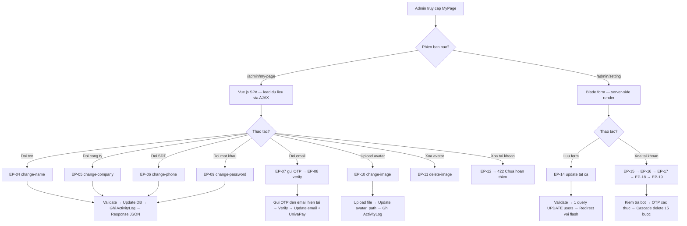
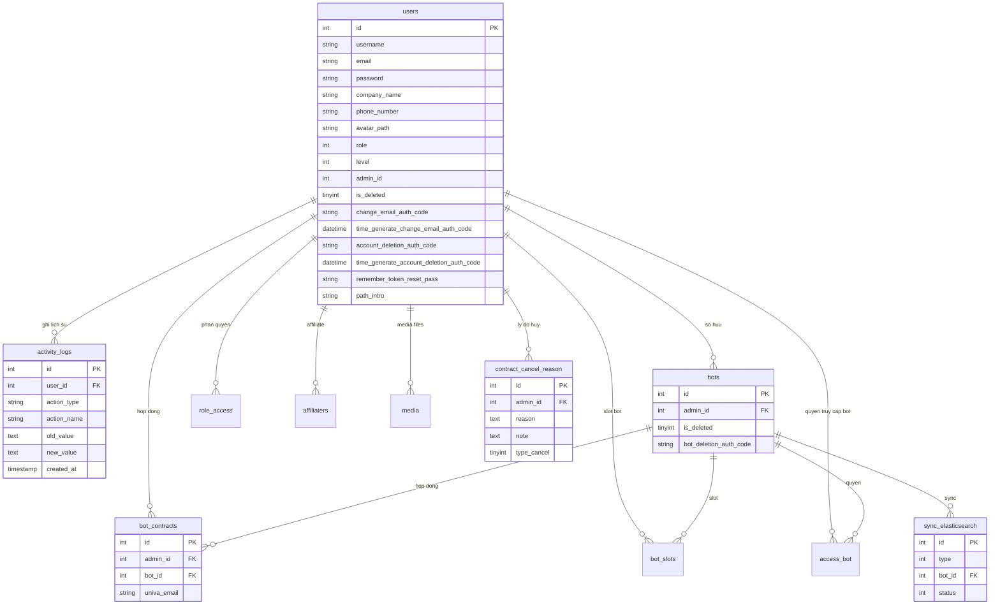

# [FA-036] Trang ca nhan (「マイページ」) — Feature Spec

> Spec tong hop cuoi cung cho tinh nang Trang ca nhan.
> Tong hop tu: ui-spec.md, api-spec.md, logic-spec.md, db-mapping.md, validation-report.md
> Ngay tao: 2026-03-26

---

## 1. Tong quan

### Muc dich
Trang ca nhan cho phep nguoi dung (Admin hoac Staff) quan ly thong tin tai khoan cua minh: cap nhat ten, cong ty, so dien thoai, doi email (qua xac thuc OTP), doi mat khau, quan ly anh dai dien, xem lich su hoat dong, va xoa tai khoan.

### Actors
| Actor | Vai tro | Quyen truy cap | Do tin cay |
|-------|---------|----------------|-----------|
| Admin | Chu tai khoan quan ly LINE Official Account | Toan quyen — xem va chinh sua tat ca thong tin ca nhan, doi mat khau, xoa tai khoan | **Cao** |
| Staff | Nhan vien do Admin tao, phan quyen theo role | Truy cap duoc ca `/admin/my-page` va `/admin/setting` — xac nhan qua middleware (khong co `supper_admin` chan) | **Cao** |

### Pham vi
- Cap nhat thong tin tai khoan (ten, cong ty, so dien thoai)
- Doi email qua xac thuc OTP 2 buoc
- Doi mat khau
- Quan ly anh dai dien (upload / xoa) — chi phien ban moi
- Xem lich su hoat dong (Activity Logs) — chi phien ban moi
- Xoa tai khoan (flow xac thuc OTP qua email)

### Hai phien ban song song
He thong ton tai **2 phien ban giao dien** dang hoat dong dong thoi:

| Dac diem | Phien ban cu (Legacy) | Phien ban moi (MyPage) |
|---------|----------------------|----------------------|
| **URL** | `/admin/setting` | `/admin/my-page` |
| **Rendering** | Server-side (Laravel Blade) | Vue.js SPA |
| **Giao tiep** | Form POST truyen thong | AJAX/JSON API rieng tung truong |
| **Controllers** | `UserController` (9,503 dong) | `MyPageController` (456 dong) |
| **Avatar** | Khong ho tro | Ho tro upload/xoa |
| **Activity Logs** | Khong co | Co — xem lich su thay doi |
| **Xoa tai khoan** | Hoat dong day du (flow OTP) | Chua hoan thien (luon tra ve 422) |
| **Activity Log ghi nhan** | Khong ghi | Ghi moi thay doi |
| **Doi email** | Cho phep doi truc tiep qua form (hoac qua OTP) | Bat buoc qua OTP 2 buoc |
| **Doi mat khau** | Validation chat: 6-12 ky tu, chu hoa + chu thuong + so + dac biet | Validation loi hon: >= 6 ky tu, 1 ky tu dac biet |
| **Luu du lieu** | 1 query UPDATE tat ca truong | Tung API rieng cho tung truong |

---

## 2. Cac man hinh va Luong xu ly End-to-End

### SCR-MYP-01: Trang ca nhan

#### 2.1 Phien ban cu — `/admin/setting`

**Layout**: Sidebar trai (menu Admin) + vung noi dung chinh gom 1 form chia 3 phan:
1. 「アカウント設定」 — Ten, cong ty, SDT
2. 「登録メールアドレス」 — Email + link doi email
3. 「パスワードの変更」 — 3 truong mat khau

**Nut hanh dong**: 「保存」(luu), 「戻る」(quay lai), 「エルメアカウントを削除する」(xoa tai khoan)

**Luong cap nhat thong tin + doi mat khau (Legacy)**:
```
Admin truy cap /admin/setting
  → GET /admin/setting (EP-13) → Blade render form voi du lieu hien tai tu Auth::user()
  → Admin sua truong ten / cong ty / SDT / mat khau
  → Nhan「保存」
  → POST /admin/setting/update (EP-14)
     → UserController@update
        → validateAdmin(): name required|max:50, phone required|regex 10-11 so, email required|email|unique
        → Neu co mat khau cu → kiem tra Hash::check → validate format mat khau moi (regex 6-12 ky tu) → kiem tra khong trung cu → kiem tra confirm khop
        → UPDATE users SET username, company_name, phone_number [, email] [, password, remember_token_reset_pass]
  → Redirect ve /admin/setting voi flash message thanh cong / loi
```

#### 2.2 Phien ban moi — `/admin/my-page`

**Layout**: SPA Vue.js voi cac section:
- Anh dai dien (avatar) — upload / xoa
- 「アカウント設定」 — Tung truong edit rieng (ten, cong ty, SDT)
- 「登録メールアドレス」 — Email + flow doi email OTP
- 「パスワードの変更」 — 3 truong mat khau
- 「アクティビティログ」 — Bang lich su hoat dong voi bo loc

**Luong load trang**:
```
Admin truy cap /admin/my-page
  → GET /admin/my-page (EP-01) → Blade view load Vue.js SPA
  → Vue mount → GET /admin/ajax/my-page/account (EP-02)
     → MyPageController@getAccount → Auth::user()
     → Response JSON: { name, image (avatar_path + URL_SERVER_MEDIA), company, email, phone, action_types }
  → Vue mount → GET /admin/ajax/my-page/activity-logs (EP-03)
     → MyPageController@getActivityLogs → UserService@getMyPageActivityLogs
     → Query activity_logs WHERE user_id, loc theo action_type/date, ORDER BY id DESC, phan trang
     → Response JSON: { logs[], pagination }
```

**Luong doi ten tai khoan**:
```
Admin sua truong 「ユーザー名」 → nhan luu
  → POST /admin/ajax/my-page/change-name (EP-04) { name: "Ten moi" }
     → MyPageController@changeName → validate: required, max 50 ky tu (mb_strlen)
     → UserService@changeMyPageName → UserRepository@updateUser({ username: name })
     → ActivityLog::log(user_id, 'change', 'change_name', old_name, new_name)
     → addLogUserAction(...)
  → Response 200: { success: true, data: { name }, message: "アカウント名を変更しました。" }
  → Vue cap nhat UI
```

**Luong doi ten cong ty**:
```
POST /admin/ajax/my-page/change-company (EP-05) { company: "Ten cong ty moi" }
  → validate: required, max 255 ky tu (mb_strlen)
  → UserService@changeMyPageCompany → update users.company_name
  → Ghi ActivityLog (change_company)
  → Response 200: { success: true, data: { company }, message: "会社・組織名を変更しました。" }
```

**Luong doi so dien thoai**:
```
POST /admin/ajax/my-page/change-phone (EP-06) { phone: "0901234567" }
  → validate: required, chi so (/^\d+$/), 10-11 ky tu
  → UserService@changeMyPagePhone → update users.phone_number
  → Ghi ActivityLog (change_phone)
  → Response 200: { success: true, data: { phone }, message: "電話番号を変更しました。" }
```

**Luong doi email (2 buoc OTP)**:
```
Buoc 1: Admin nhap email moi → nhan gui ma xac thuc
  → POST /admin/ajax/my-page/send-email-verification (EP-07) { email: "new@example.com" }
     → validate: required, email hop le (FILTER_VALIDATE_EMAIL), khong trung email hien tai
     → UserService@sendCodeChangeEmail:
        1. Kiem tra email trung: checkExistEmail (users WHERE email AND is_deleted=0)
        2. Tao ma: Str::random(10) + checkRandomStringAuthCode
        3. Luu: users.change_email_auth_code, users.time_generate_change_email_auth_code = now()
        4. Gui email: SendAuthCode::sendAuthCodeChangeMailUser(email_HIEN_TAI, code)
           ⚠ Ma gui den EMAIL HIEN TAI, khong phai email moi
  → Response 200: { success: true, message: "認証コードを送信しました。メールをご確認ください。" }

Buoc 2: Admin nhap ma xac thuc nhan duoc qua email
  → POST /admin/ajax/my-page/verify-email-code (EP-08) { email: "new@example.com", code: "abc123..." }
     → UserService@validateCodeChangeEmail(request, needReLogin=false):
        1. So sanh code voi users.change_email_auth_code
        2. Kiem tra het han: now() - time_generate <= 24h
        3. Kiem tra email trung (lan nua)
        4. UPDATE users.email = email moi, xoa change_email_auth_code
        5. Tim bot_contracts WHERE univa_email = email cu → PATCH UnivaPay API → UPDATE bot_contracts.univa_email = email moi
        6. needReLogin=false → KHONG cap nhat remember_token_reset_pass
     → Ghi ActivityLog (change_email)
  → Response 200: { success: true, data: { email }, message: "メールアドレスを変更しました。" }
```

**Luong doi mat khau**:
```
Admin dien 3 truong mat khau → nhan luu
  → POST /admin/ajax/my-page/change-password (EP-09) { current_password, new_password, confirm_password }
     → validate: tat ca required, new_password >= 6 ky tu, chua 1 ky tu dac biet (/[^a-zA-Z0-9]/), confirm khop
     → UserService@changeMyPagePassword:
        1. Hash::check(current_password, user.password) → sai thi loi
        2. Hash::check(new_password, user.password) → trung thi loi
        3. UPDATE users.password = bcrypt(new_password)
     → Ghi ActivityLog (change_password), addLogUserAction
  → Response 200: { success: true, message: "パスワードを変更しました。" }
```

**Luong upload anh dai dien**:
```
Admin chon file anh → upload
  → POST /admin/ajax/my-page/change-image (EP-10) [multipart/form-data] { image: file }
     → validate: co file, MIME in [jpeg, png, gif, webp], <= 5MB
     → UserService@changeMyPageImage:
        1. Xoa avatar cu (neu co file tren disk)
        2. Upload file moi vao {FOLDER_MEDIA}/media/user_avatar/{userId}/
        3. UPDATE users.avatar_path = duong dan moi
     → Ghi ActivityLog (change_avatar)
  → Response 200: { success: true, data: { image_url }, message: "アカウント画像を変更しました。" }
```

**Luong xoa anh dai dien**:
```
Admin nhan xoa avatar
  → POST /admin/ajax/my-page/delete-image (EP-11) (khong co params)
     → UserService@deleteMyPageImage:
        1. Xoa file avatar tren disk (neu ton tai)
        2. UPDATE users.avatar_path = NULL
     → Ghi ActivityLog (delete_avatar)
  → Response 200: { success: true, message: "アカウント画像を削除しました。" }
```

**Luong xoa tai khoan (phien ban moi — CHUA HOAN THIEN)**:
```
POST /admin/ajax/my-page/delete-account (EP-12)
  → MyPageController@deleteAccount → luon tra ve 422: 「この機能は現在準備中です。」
  ⚠ Flow xoa hien tai van dung phien ban cu (xem ben duoi)
```

### Luong xoa tai khoan (Legacy — dang hoat dong)

```
1. Admin nhan「エルメアカウントを削除する」
   → POST /admin/check-auth-delete-account/{id} (EP-15)
      → UserController@checkAuthDeleteAccount
      → Kiem tra bots WHERE admin_id = {id} AND is_deleted = 0
      → Con bot active → redirect type_view=not_allowed_delete (KHONG cho xoa)
      → Het bot → redirect type_view=account_deletion

2. Hien thi trang xac thuc xoa
   → GET /admin/auth-delete-account?type_view=account_deletion (EP-16)
      → Blade view: form nhap ma xac thuc + ly do xoa

3. Gui ma xac thuc
   → POST /ajax/send-auth-code (EP-17) { id, type_receiver: "auth_delete_account" }
      → TwoFactorVerifyController@sendAuthCode
      → Tao ma 10 ky tu random
      → Luu users.account_deletion_auth_code + time_generate (hieu luc 24h)
      → Gui email SendAuthCode::sendAuthCodeDeleteAccount (den email HIEN TAI)

4. Xac thuc ma
   → POST /ajax/check-code-auth-delete (EP-18) { user_id, type: "auth_delete_account", code }
      → So sanh code, kiem tra het han 24h

5. Thuc hien xoa
   → POST /admin/delete-account-myself/{id} (EP-19) { note_reason, array_reason }
      → Security: Auth::user()->id == $id (chi tu xoa chinh minh)
      → Cascade delete (15 buoc — xem Data Model)
      → Response: 「削除を受けました。２４時間以内に完了します。」
```

### Flow Diagram tong hop



---

## 3. Data Model

### Entities chinh

| Entity | Bang DB | Mo ta |
|--------|---------|-------|
| User | `users` | Tai khoan nguoi dung (Admin/Staff) — bang chinh cua FA-036 |
| ActivityLog | `activity_logs` | Lich su hoat dong cua user |
| Bot | `bots` | LINE Official Account — kiem tra dieu kien xoa tai khoan |
| BotContract | `bot_contracts` | Hop dong bot — cap nhat email UnivaPay khi doi email |

### Bang phu (chi lien quan khi xoa tai khoan)
`bot_slots`, `access_bot`, `role_access`, `affiliaters`, `affiliate_info`, `payment_detail_aff`, `media`, `contract_cancel_reason`, `sync_elasticsearch`

### ER Diagram



### Cascade Delete khi xoa tai khoan (EP-19)
```
 1. DELETE users WHERE admin_id = {id} AND level IS NOT NULL   → xoa staff
 2. DELETE role_access WHERE user_id IN [id, staff_ids]        → xoa quyen
 3. DELETE affiliaters WHERE admin_id = {id}                   → xoa affiliate
 4. DELETE affiliate_info (lien quan)                           → xoa thong tin affiliate
 5. UPDATE payment_detail_aff (ghi bot_name = username)        → luu ten truoc khi xoa
 6. DELETE payment_detail_aff                                   → xoa chi tiet thanh toan
 7. UPDATE bots SET is_deleted = 1 WHERE admin_id = {id}       → soft-delete bots
 8. DELETE bot_slots WHERE admin_id = {id}                      → xoa slots
 9. DELETE bot_contracts WHERE admin_id = {id}                  → xoa hop dong
10. DELETE access_bot WHERE admin_id = {id}                     → xoa quyen bot
11. INSERT sync_elasticsearch (delete_bot event)               → sync xoa bot
12. DELETE users WHERE id = {id}                               → xoa user chinh
13. DELETE media files + records                               → xoa media
14. INSERT contract_cancel_reason                              → luu ly do xoa
15. UPDATE path_intro (giam referral counter)                  → cap nhat referral
```

---

## 4. Field Traceability Matrix

| # | UI Element | Man hinh / Phien ban | DB Table.Column | Huong | Validation | Business Rule |
|---|-----------|---------------------|----------------|-------|-----------|--------------|
| 1 | 「ユーザー名」 | SCR-MYP-01 / Ca hai | `users.username` | Doc + Ghi | Required, max 50 ky tu (mb_strlen) | BR-01: Ghi ActivityLog khi thay doi |
| 2 | 「会社・組織名」 | SCR-MYP-01 / Ca hai | `users.company_name` | Doc + Ghi | Moi: required, max 255. Cu: khong validate | BR-02: Ghi ActivityLog khi thay doi (chi phien ban moi) |
| 3 | 「電話番号」 | SCR-MYP-01 / Ca hai | `users.phone_number` | Doc + Ghi | Moi: required, chi so, 10-11 ky tu. Cu: required, regex 10-11 so | BR-03: Ghi ActivityLog khi thay doi (chi phien ban moi) |
| 4 | 「メールアドレス」 | SCR-MYP-01 / Ca hai | `users.email` | Doc + Ghi | Required, email hop le, unique (is_deleted=0) | BR-04: Doi qua OTP 2 buoc (moi) hoac truc tiep (cu). Cap nhat UnivaPay |
| 5 | 「現在のパスワード」 | SCR-MYP-01 / Ca hai | `users.password` | Doc | Required (khi doi pass) | BR-05: Hash::check() de xac thuc |
| 6 | 「新しいパスワード」 | SCR-MYP-01 / Ca hai | `users.password` | Ghi | Moi: >= 6 ky tu + 1 dac biet. Cu: 6-12 ky tu, chu hoa+thuong+so+dac biet | BR-05: bcrypt(), khong trung mat khau cu |
| 7 | 「確認パスワード」 | SCR-MYP-01 / Ca hai | — (khong luu) | — | Phai khop voi mat khau moi | BR-05: Chi validation, khong luu DB |
| 8 | Anh dai dien (avatar) | SCR-MYP-01 / Chi moi | `users.avatar_path` | Doc + Ghi | File: jpeg/png/gif/webp, <= 5MB | BR-06: Luu vao {FOLDER_MEDIA}/media/user_avatar/{userId}/ |
| 9 | Activity Logs — loai | SCR-MYP-01 / Chi moi | `activity_logs.action_type` | Doc | — | BR-08: create / change |
| 10 | Activity Logs — tieu de | SCR-MYP-01 / Chi moi | `activity_logs.action_name` | Doc | — | BR-08: Map sang tieu de JP qua constants |
| 11 | Activity Logs — ngay gio | SCR-MYP-01 / Chi moi | `activity_logs.created_at` | Doc | — | BR-08: Format Y年m月d日 - H:i |
| 12 | Activity Logs — chi tiet | SCR-MYP-01 / Chi moi | `activity_logs.old_value` + `new_value` | Doc | — | BR-08: Ghep {old} → {new} |
| 13 | Ma xac thuc doi email | An (khong hien thi) | `users.change_email_auth_code` | Ghi + Doc | — | BR-04: 10 ky tu random, hieu luc 24h |
| 14 | Ma xac thuc xoa tai khoan | An (khong hien thi) | `users.account_deletion_auth_code` | Ghi + Doc | — | BR-07: 10 ky tu random, hieu luc 24h |
| 15 | Ly do xoa tai khoan | Trang xoa / Legacy | `contract_cancel_reason.reason` + `.note` | Ghi | — | BR-07: Serialize mang ly do |
| 16 | Token buoc logout | An (khong hien thi) | `users.remember_token_reset_pass` | Ghi | — | Cap nhat khi doi email (cu) / doi pass (cu) → buoc logout session khac |
| 17 | Email thanh toan UnivaPay | An (khong hien thi) | `bot_contracts.univa_email` | Doc + Ghi | — | BR-04: Cap nhat khi doi email |

---

## 5. Business Rules

### BR-01: Doi ten tai khoan
- **Source**: `MyPageController@changeName`, `UserService@changeMyPageName`
- Ten khong duoc rong, toi da 50 ky tu (do bang `mb_strlen`)
- Ghi lich su thay doi vao `activity_logs` (old_value → new_value)
- Ghi `addLogUserAction`
- **Do tin cay**: Cao

### BR-02: Doi ten cong ty
- **Source**: `MyPageController@changeCompany`, `UserService@changeMyPageCompany`
- Khong duoc rong, toi da 255 ky tu (mb_strlen)
- Phien ban cu (`EP-14`): khong validate truong company_name
- Ghi ActivityLog (change_company)
- **Do tin cay**: Cao

### BR-03: Doi so dien thoai
- **Source**: `MyPageController@changePhone`, `UserService@changeMyPagePhone`
- Chi chua so (`/^\d+$/`), 10-11 ky tu
- Phien ban cu: `required|regex:/^\d{10,11}$/`
- Ghi ActivityLog (change_phone)
- **Do tin cay**: Cao

### BR-04: Doi email — Flow OTP 2 buoc
- **Source**: `MyPageController@sendEmailVerification/verifyEmailCode`, `UserService@sendCodeChangeEmail/validateCodeChangeEmail`
- **Buoc 1**: Gui ma xac thuc den **email hien tai** (khong phai email moi)
- **Buoc 2**: Nhap ma → kiem tra hop le → doi email
- Ma xac thuc: `Str::random(10)` + `checkRandomStringAuthCode`, hieu luc **24 gio**
- Kiem tra email moi khong trung email da dang ky trong he thong (`users WHERE email AND is_deleted=0`) — kiem tra ca khi gui ma va khi xac thuc
- Sau khi doi email → cap nhat `univa_email` tren **UnivaPay** (he thong thanh toan) cho cac `bot_contracts` lien quan
- **Khac biet phien ban**:
  - Phien ban moi (`needReLogin = false`): khong bat dang nhap lai
  - Phien ban cu (`needReLogin = true`): cap nhat `remember_token_reset_pass` → buoc tat ca session khac dang xuat
  - Phien ban cu (EP-14): cho phep doi email truc tiep qua form POST (validate `unique:users,email,{id}`) — khong can OTP. Day la **rui ro bao mat** so voi phien ban moi
- **Do tin cay**: Cao

### BR-05: Doi mat khau
- **Source**: `MyPageController@changePassword`, `UserService@changeMyPagePassword`, `UserController@update`
- Phai nhap dung mat khau hien tai (`Hash::check`)
- Mat khau moi khong duoc trung voi mat khau hien tai
- **Phien ban moi**: >= 6 ky tu, co it nhat 1 ky tu dac biet (`/[^a-zA-Z0-9]/`)
- **Phien ban cu**: 6-12 ky tu, phai co chu hoa + chu thuong + so + ky tu dac biet (`^(?=.*[A-Z])(?=.*[a-z])(?=.*\d)(?=.*[\W_]).{6,12}$`)
- Mat khau luu dang `bcrypt` hash
- Phien ban cu: cap nhat `remember_token_reset_pass` (buoc logout session khac)
- Phien ban moi: khong cap nhat `remember_token_reset_pass`
- **Do tin cay**: Cao

### BR-06: Quan ly anh dai dien (chi phien ban moi)
- **Source**: `MyPageController@changeImage/deleteImage`, `UserService@changeMyPageImage/deleteMyPageImage`
- Upload: JPEG, PNG, GIF, WEBP, toi da 5MB
- Luu vao: `{FOLDER_MEDIA}/media/user_avatar/{userId}/`
- Khi upload moi → xoa file cu truoc
- Khi xoa → set `avatar_path = NULL`, xoa file tren disk
- Hien thi: `env('URL_SERVER_MEDIA')` + `avatar_path`
- Ghi ActivityLog (change_avatar / delete_avatar)
- **Do tin cay**: Cao

### BR-07: Xoa tai khoan (Legacy flow — dang hoat dong)
- **Source**: `UserController@checkAuthDeleteAccount/deleteAccountMyself`, `TwoFactorVerifyController@sendAuthCode/checkCodeAuthDelete`
- **Dieu kien tien quyet**: Tai khoan **khong duoc con bot dang hoat dong** (`bots WHERE admin_id AND is_deleted = 0`). Neu con bot → khong cho xoa
- **Xac thuc**: Gui ma OTP qua email → nhap ma (10 ky tu, hieu luc 24h)
- **Security**: Chi cho phep tu xoa chinh minh (`Auth::user()->id == $id`)
- **Cascade delete**: 15 buoc (xem muc 3 — Data Model)
- **Message thanh cong**: 「削除を受けました。２４時間以内に完了します。」 — goi y co xu ly bat dong bo bo sung
- **Phien ban moi**: Endpoint EP-12 luon tra ve 422 「この機能は現在準備中です。」
- **Do tin cay**: Cao

### BR-08: Lich su hoat dong — Activity Logs (chi phien ban moi)
- **Source**: `MyPageController@getActivityLogs`, `UserService@getMyPageActivityLogs`
- Ghi lai moi thay doi: doi ten, doi cong ty, doi SDT, doi email, doi mat khau, doi/xoa avatar
- Filter theo loai (`create` / `change` / `all`) va khoang thoi gian (`date_from`, `date_to`)
- Phan trang: mac dinh 100 ban ghi/trang, sap xep moi nhat truoc (`id DESC`)
- Hien thi: loai (icon), tieu de (JP), ngay gio (format `Y年m月d日 - H:i`), chi tiet (old → new)
- Dac biet: `create_user` hien thi `detail_label = 'メールアドレス:'`
- **Do tin cay**: Cao

### BR-09: Session va Logout behavior
- Khi cap nhat `remember_token_reset_pass` → tat ca session khac (tru session hien tai) bi dang xuat
- Phien ban cu: cap nhat token khi doi mat khau va doi email
- Phien ban moi: chi cap nhat token khi doi email qua TwoFactorVerifyController (EP-21), **khong** cap nhat khi doi mat khau (EP-09) hay doi email qua MyPageController (EP-08 voi needReLogin=false)
- **Do tin cay**: Cao

---

## 6. API Endpoints

### Nhom A: Phien ban moi — MyPage (AJAX API)

| ID | Method | URL | Mo ta | Controller |
|----|--------|-----|-------|-----------|
| EP-01 | GET | `/admin/my-page` | Hien thi trang SPA | `MyPageController@index` |
| EP-02 | GET | `/admin/ajax/my-page/account` | Lay thong tin tai khoan | `MyPageController@getAccount` |
| EP-03 | GET | `/admin/ajax/my-page/activity-logs` | Lay lich su hoat dong (phan trang, loc) | `MyPageController@getActivityLogs` |
| EP-04 | POST | `/admin/ajax/my-page/change-name` | Doi ten | `MyPageController@changeName` |
| EP-05 | POST | `/admin/ajax/my-page/change-company` | Doi ten cong ty | `MyPageController@changeCompany` |
| EP-06 | POST | `/admin/ajax/my-page/change-phone` | Doi SDT | `MyPageController@changePhone` |
| EP-07 | POST | `/admin/ajax/my-page/send-email-verification` | Gui ma xac thuc doi email | `MyPageController@sendEmailVerification` |
| EP-08 | POST | `/admin/ajax/my-page/verify-email-code` | Xac thuc ma + doi email | `MyPageController@verifyEmailCode` |
| EP-09 | POST | `/admin/ajax/my-page/change-password` | Doi mat khau | `MyPageController@changePassword` |
| EP-10 | POST | `/admin/ajax/my-page/change-image` | Upload avatar | `MyPageController@changeImage` |
| EP-11 | POST | `/admin/ajax/my-page/delete-image` | Xoa avatar | `MyPageController@deleteImage` |
| EP-12 | POST | `/admin/ajax/my-page/delete-account` | Xoa tai khoan (CHUA HOAN THIEN) | `MyPageController@deleteAccount` |

### Nhom B: Phien ban cu — Legacy Setting

| ID | Method | URL | Mo ta | Controller |
|----|--------|-----|-------|-----------|
| EP-13 | GET | `/admin/setting` | Hien thi form Blade | `UserController@setting` |
| EP-14 | POST | `/admin/setting/update` | Luu form (tat ca truong + mat khau) | `UserController@update` |

### Nhom C: Xoa tai khoan (Legacy flow)

| ID | Method | URL | Mo ta | Controller |
|----|--------|-----|-------|-----------|
| EP-15 | POST | `/admin/check-auth-delete-account/{id}` | Kiem tra dieu kien xoa | `UserController@checkAuthDeleteAccount` |
| EP-16 | GET | `/admin/auth-delete-account` | Trang xac thuc xoa tai khoan | `UserController@viewAuthDeleteAccount` |
| EP-17 | POST | `/ajax/send-auth-code` | Gui ma xac thuc (da nang: xoa TK/xoa bot/doi email) | `TwoFactorVerifyController@sendAuthCode` |
| EP-18 | POST | `/ajax/check-code-auth-delete` | Xac thuc ma (da nang) | `TwoFactorVerifyController@checkCodeAuthDelete` |
| EP-19 | POST | `/admin/delete-account-myself/{id}` | Thuc hien xoa tai khoan | `UserController@deleteAccountMyself` |

### Nhom D: Doi email (Legacy — dung chung)

| ID | Method | URL | Mo ta | Controller |
|----|--------|-----|-------|-----------|
| EP-20 | POST | `/ajax/send-change-email-code` | Gui ma doi email (API moi) | `TwoFactorVerifyController@sendChangeEmailCode` |
| EP-21 | POST | `/ajax/validate-code-change-email` | Xac thuc ma + doi email (needReLogin=true) | `TwoFactorVerifyController@validateCodeChangeEmail` |

### Middleware ap dung

| Middleware | Mo ta | Ap dung |
|-----------|-------|---------|
| `web` | Session authentication | Tat ca endpoints |
| `NotifyChatworkRequestTimeSlow` | Log request cham vao Chatwork | Tat ca endpoints |
| `LogRequestMultipart` | Log request multipart | EP-17, EP-18, EP-20, EP-21 |
| `supper_admin` | Chi cho phep Super Admin | **KHONG** ap dung — ca Admin va Staff deu truy cap duoc |

### Response format chuan (phien ban moi)

**Thanh cong (200)**:
```json
{ "success": true, "data": { ... }, "message": "...thong bao JP..." }
```

**Loi validation (422)**:
```json
{ "success": false, "data": null, "message": "...thong bao loi JP..." }
```

### Thong bao loi validation (JP) — tham chieu nhanh

| Truong | Thong bao loi |
|--------|--------------|
| Ten rong | 「アカウント名を入力してください。」 |
| Ten > 50 ky tu | 「アカウント名は50文字以内で入力してください。」 |
| Cong ty rong | 「会社・組織名を入力してください。」 |
| Cong ty > 255 ky tu | 「会社・組織名は255文字以内で入力してください。」 |
| SDT rong | 「電話番号を入力してください。」 |
| SDT khong phai so | 「数値のみ入力してください。」 |
| SDT < 10 ky tu | 「電話番号は10文字以上で入力してください。」 |
| Email rong | 「メールアドレスを入力してください。」 |
| Email sai format | 「有効なメールアドレス形式で入力してください。」 |
| Email trung email hien tai | 「現在のメールアドレスと同じです。」 |
| Email da dang ky | 「このアドレスはすでにエルメに登録されておりますので、ご利用いただくことはできません。」 |
| Ma OTP rong | 「認証コードを入力してください。」 |
| Ma OTP sai | 「認証コードが間違っています。」 |
| Ma OTP het han | 「認証コード期限が切れました。再度発行をしてください」 |
| Mat khau hien tai rong | 「現在のパスワードを入力してください。」 |
| Mat khau hien tai sai | 「現在のパスワードが正しくありません。」 |
| Mat khau moi rong | 「新しいパスワードを入力してください。」 |
| Mat khau moi < 6 ky tu | 「パスワードは6文字以上で入力してください。」 |
| Mat khau moi thieu ky tu dac biet | 「パスワードには少なくとも1つの特殊文字を含めてください。」 |
| Mat khau moi trung cu | 「新しいパスワードは現在のパスワードと異なるものを設定してください。」 |
| Confirm rong | 「確認パスワードを入力してください。」 |
| Confirm khong khop | 「確認パスワードが一致しません。」 |
| Anh khong co file | 「画像ファイルを選択してください。」 |
| Anh sai dinh dang | 「JPG、PNG、GIF、WEBP形式の画像を選択してください。」 |
| Anh > 5MB | 「画像サイズは5MB以下にしてください。」 |

---

## 7. Phu thuoc cheo (Cross-References)

### Shared components
Tinh nang FA-036 **khong su dung shared component** (SC-xxx) nao. Day la trang cai dat ca nhan doc lap, khong chia se UI component voi cac tinh nang khac.

### Tinh nang lien quan
| Tinh nang | Lien ket | Mo ta |
|-----------|---------|-------|
| Dang nhap / Authentication | `users.password`, session management | Doi mat khau anh huong den dang nhap. `remember_token_reset_pass` buoc logout session khac |
| Quan ly Bot (LINE OA) | `bots`, `bot_contracts` | Xoa tai khoan kiem tra bot active. Doi email cap nhat UnivaPay |
| Quan ly Staff | `users` (admin_id, level, role_access) | Xoa tai khoan cascade xoa toan bo staff |
| Affiliate | `affiliaters`, `affiliate_info`, `payment_detail_aff` | Xoa tai khoan cascade xoa du lieu affiliate |
| Elasticsearch Sync | `sync_elasticsearch` | Xoa tai khoan trigger sync xoa bot |
| Media Management | `media` table + files tren disk | Xoa tai khoan cascade xoa media |

### API dung chung
- **EP-17 (`/ajax/send-auth-code`)** va **EP-18 (`/ajax/check-code-auth-delete`)**: Dung chung cho 3 muc dich: xoa tai khoan, xoa bot, doi email. Khong chi danh rieng cho FA-036.
- **EP-20, EP-21**: API doi email duoc dung chung boi nhieu noi.

---

## 8. Gaps va Unknowns

### Tu Validation Report

| # | Muc do | Mo ta | Trang thai |
|---|--------|-------|-----------|
| 1 | **Trung binh** | UI Spec chi mo ta phien ban cu (`/admin/setting`). Thieu man hinh phien ban moi (`/admin/my-page`) voi: avatar, activity logs, tung truong edit rieng. | **Da bu dap** trong feature-spec nay (muc 2.2) nhung UI Spec chua cap nhat |
| 2 | **Trung binh** | UI Spec khong de cap avatar (upload/delete) — trong khi co EP-10, EP-11, BR-06. | **Da bu dap** trong feature-spec |
| 3 | **Trung binh** | UI Spec khong de cap Activity Logs — trong khi co EP-03, BR-08. | **Da bu dap** trong feature-spec |
| 4 | **Trung binh** | Khac biet validation mat khau giua 2 phien ban (cu: 6-12 ky tu + chu hoa/thuong/so/dac biet vs moi: >= 6 + 1 dac biet). Co the gay nhap nham. | **Ghi nhan** — hien trang thuc te |
| 5 | **Nhe** | UI Spec ghi Staff "Chua xac dinh" — da xac nhan Staff truy cap duoc (khong co middleware `supper_admin`) | **Da giai quyet** trong feature-spec |
| 6 | **Nhe** | UI Spec ghi company va phone "Khong ro" bat buoc — da xac nhan qua code | **Da giai quyet** trong feature-spec |
| 7 | **Nhe** | DB Hint du doan bang `password_resets` — thuc te FA-036 khong dung bang nay | **Ghi nhan** — khong anh huong |
| 8 | **Nhe** | Logic Spec ghi User model la "suy luan" — nhung thong tin cot da xac nhan qua code thao tac | **Ghi nhan** — do tin cay van Cao |
| 9 | **Nhe** | EP-14 phien ban cu cho phep doi email truc tiep (khong can OTP) — rui ro bao mat | **Ghi nhan** — hien trang phien ban cu |

### Cac diem van chua ro
| # | Noi dung | Muc do | Ly do |
|---|---------|--------|-------|
| 1 | Noi dung chinh xac cua email gui ma OTP (template email) | Thap | Chua doc truc tiep file `SendAuthCode` mail class |
| 2 | Gia tri cau hinh `config('sns-line.type_reason_cancel.user')` cu the la bao nhieu | Thap | Chua doc file config |
| 3 | Helper function `checkRandomStringAuthCode` lam gi chinh xac | Thap | Chua doc file helpers truc tiep |
| 4 | Logic `addLogUserAction` ghi log o dau (ngoai `activity_logs`) | Thap | Chua doc file helpers truc tiep |
| 5 | Message thanh cong xoa tai khoan goi y "24 gio" — co background job xu ly gi them khong | Trung binh | Can kiem tra them Spring Boot jobs |

---

## 9. Chat luong Spec

### Metrics

| Chi so | Gia tri |
|--------|---------|
| Tong so UI fields | 17 (bao gom ca fields an nhu OTP codes, token) |
| Fields mapped den DB | 17/17 (**100%**) |
| Tong so endpoints | 21 |
| Endpoints co do tin cay Cao | 21/21 (**100%**) |
| Business rules | 9 (BR-01 → BR-09) |
| Business rules co do tin cay Cao | 9/9 (**100%**) |
| Bang DB lien quan | 13 (2 chinh + 11 phu) |
| Validation report — Nghiem trong | **0** |
| Validation report — Trung binh | **4** (da bu dap 3/4 trong feature-spec) |
| Validation report — Nhe | **5** (da giai quyet 2/5, ghi nhan 3/5) |

### Phan bo do tin cay

| Muc do | So luong items | Ty le |
|--------|---------------|-------|
| **Cao** | ~95% cac thong tin | Phan lon — doc truc tiep tu source code va DB schema |
| **Trung binh** | ~4% | Mot so cot DB suy luan, helper functions chua doc truc tiep |
| **Thap** | ~1% | Chi tiet email template, config values |

### Cau hoi mo (Open Questions)
1. Phien ban moi (`/admin/my-page`) se thay the hoan toan phien ban cu (`/admin/setting`) khi nao? Hien tai ca hai song song.
2. EP-12 (xoa tai khoan phien ban moi) bao gio se hoan thien? Hien tai luon tra ve 422.
3. Co nen thong nhat validation mat khau giua 2 phien ban khong? (hien tai phien ban cu chat hon)
4. Phien ban cu cho phep doi email truc tiep qua form (EP-14) — co nen vo hieu hoa de dam bao bao mat nhu phien ban moi (OTP)?
