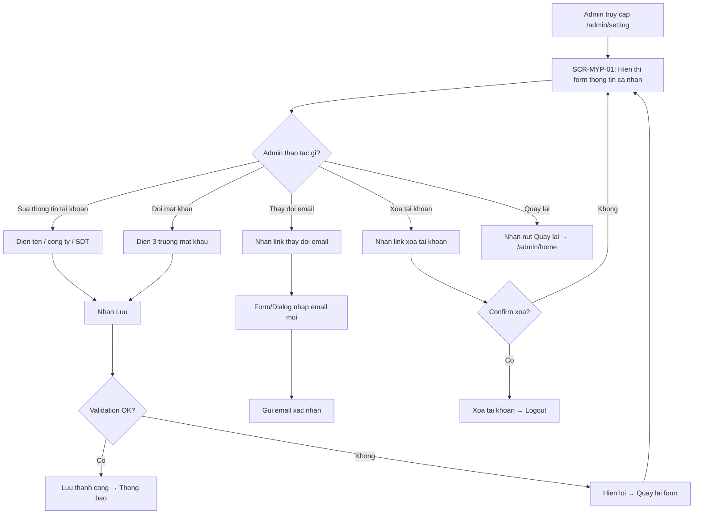

# [FA-036] Trang ca nhan — UI Spec

## Tong quan
- **Ma tinh nang**: FA-036
- **Ten**: Trang ca nhan
- **Ten JP**: 「マイページ」
- **Mo ta**: Trang cai dat thong tin ca nhan cua tai khoan Admin — cho phep cap nhat ten, cong ty, so dien thoai, email dang ky, doi mat khau va xoa tai khoan.
- **Portal**: Admin
- **URL pattern**: `/admin/setting`

## Doi tuong su dung (Actors)
| Actor | Vai tro | Quyen truy cap |
|-------|---------|----------------|
| Admin | Chu tai khoan quan ly LINE Official Account | Toan quyen — xem va chinh sua thong tin ca nhan, doi mat khau, xoa tai khoan |
| Staff | Nhan vien do Admin tao | Chua xac dinh — can kiem tra xem Staff co truy cap duoc `/admin/setting` hay khong. Kha nang cao la KHONG vi day la trang cai dat tai khoan Admin |

## Cac man hinh

### SCR-MYP-01: Trang ca nhan (chinh sua thong tin)
- **URL**: `/admin/setting`
- **Tieu de trang**: 「マイページ」
- **Screenshot**: `screenshots/main.png`

#### Layout tong the
- **Sidebar trai**: Menu dieu huong chung cua portal Admin. Muc 「マイページ」 dang duoc chon (highlighted mau xanh la).
- **Vung noi dung chinh**: Tieu de 「マイページ」 (heading h2), ben duoi la 1 form duy nhat chia thanh 3 phan (sections) xep doc tu tren xuong duoi:
  1. 「アカウント設定」 — Cai dat tai khoan
  2. 「登録メールアドレス」 — Email dang ky
  3. 「パスワードの変更」 — Doi mat khau
- **Cuoi form**: 2 nut hanh dong va 1 link xoa tai khoan.
- Khong co tabs, khong co bang du lieu, khong co phan trang.

#### Form fields

**Phan 1: 「アカウント設定」 (Cai dat tai khoan)**
| # | Label JP | Loai input | Bat buoc? | Gia tri mau | Ghi chu |
|---|---------|-----------|----------|------------|---------|
| 1 | 「ユーザー名」 | Textbox | Co (du doan) | テスト：ゴー・トゥイ・ガン | Ten hien thi cua tai khoan |
| 2 | 「会社・組織名」 | Textbox | Khong ro | Watermelon Software Solution | Ten cong ty / to chuc |
| 3 | 「電話番号」 | Textbox | Khong ro | "0976870074" | So dien thoai, hien thi trong dau ngoac kep tren UI |

**Phan 2: 「登録メールアドレス」 (Email dang ky)**
| # | Label JP | Loai input | Bat buoc? | Gia tri mau | Ghi chu |
|---|---------|-----------|----------|------------|---------|
| 4 | 「メールアドレス」 | Textbox | Co (du doan) | ngothuyngan123@gmail.com | Email dang ky tai khoan. Co the la read-only hoac editable — can kiem tra |
| — | 「メールアドレスを変更する」 | Text link | — | — | Link de thay doi email — co the mo dialog/form rieng hoac redirect sang trang khac |

**Phan 3: 「パスワードの変更」 (Doi mat khau) — fieldset group**
| # | Label JP | Loai input | Bat buoc? | Gia tri mau | Ghi chu |
|---|---------|-----------|----------|------------|---------|
| 5 | 「現在のパスワードをご入力ください」 | Textbox (password) | Co (khi doi mat khau) | (trong) | Mat khau hien tai |
| 6 | 「変更するパスワードをご入力ください」 | Textbox (password) | Co (khi doi mat khau) | (trong) | Mat khau moi |
| 7 | 「確認のためもう一度パスワードをご入力ください」 | Textbox (password) | Co (khi doi mat khau) | (trong) | Xac nhan mat khau moi |

#### Action Buttons
| Vi tri | Element | Text JP | Loai | Hanh vi |
|--------|---------|---------|------|---------|
| Duoi form, trai | Button | 「保存」 | Button (primary) | Luu thong tin da thay doi — submit form. Co the luu thong tin tai khoan va/hoac doi mat khau |
| Duoi form, trai | Button | 「戻る」 | Button (secondary) | Quay lai trang truoc (co the la trang chon tai khoan `/admin/home`) |
| Duoi form, phai/duoi | Link | 「エルメアカウントを削除する」 | Text link (danger) | Xoa tai khoan Elme — kha nang cao se hien confirm dialog truoc khi xoa |

#### Observations
- Trang su dung server-side rendering (Laravel Blade) — khong bat duoc API calls rieng qua network.
- Form co the submit bang POST thong thuong (khong phai AJAX).
- Phan doi mat khau nam trong `<fieldset>` (group) — co the duoc xu ly rieng hoac chung voi phan thong tin tai khoan.
- Link 「メールアドレスを変更する」 la text thuong (khong phai button), goi y co the la redirect hoac mo modal.
- Link 「エルメアカウントを削除する」 co cursor pointer — la hanh dong nguy hiem, can xac nhan.

## Luong nguoi dung (User Flows)

### Luong 1: Cap nhat thong tin tai khoan (Happy path)
1. Admin truy cap 「マイページ」 tu sidebar menu.
2. Trang SCR-MYP-01 hien thi voi thong tin hien tai da dien san.
3. Admin sua cac truong: ten, cong ty, so dien thoai.
4. Admin nhan nut 「保存」.
5. He thong luu thong tin va hien thi thong bao thanh cong (du doan: flash message hoac redirect ve cung trang).

### Luong 2: Doi mat khau (Happy path)
1. Admin truy cap 「マイページ」.
2. Admin dien 3 truong mat khau: mat khau hien tai, mat khau moi, xac nhan mat khau moi.
3. Admin nhan nut 「保存」.
4. He thong xac thuc mat khau hien tai, kiem tra mat khau moi khop, luu mat khau moi.
5. Hien thi thong bao thanh cong.

### Luong 3: Thay doi email
1. Admin nhan link 「メールアドレスを変更する」.
2. He thong co the: (a) mo form/dialog nhap email moi, hoac (b) redirect sang trang thay doi email rieng.
3. He thong gui email xac nhan den dia chi moi (du doan).
4. Admin xac nhan qua email → email duoc cap nhat.

### Luong 4: Xoa tai khoan
1. Admin nhan link 「エルメアカウントを削除する」.
2. He thong hien confirm dialog (du doan — hanh dong nguy hiem).
3. Admin xac nhan xoa.
4. He thong xoa tai khoan va logout Admin.

### Luong 5: Loi validation
1. Admin de trong truong bat buoc hoac nhap sai dinh dang.
2. Admin nhan 「保存」.
3. He thong hien thong bao loi (du doan: inline error hoac flash message).
4. Admin sua va nhan 「保存」 lai.

### Luong 6: Doi mat khau — mat khau hien tai sai
1. Admin nhap sai mat khau hien tai.
2. Admin nhan 「保存」.
3. He thong bao loi mat khau hien tai khong dung.

## Flow Diagram

## Diem chua ro / Can xac minh
| # | Noi dung | Muc do | Ghi chu |
|---|---------|--------|---------|
| 1 | Truong 「メールアドレス」 co the chinh sua truc tiep tren form hay bat buoc phai qua link 「メールアドレスを変更する」? | Trung binh | Can kiem tra source code — textbox co the la read-only |
| 2 | Link 「メールアドレスを変更する」 dan den dau? Modal, form inline, hay trang rieng? | Trung binh | Khong bat duoc tu snapshot tinh |
| 3 | Khi nhan 「保存」, form submit thong tin tai khoan va mat khau cung luc hay tach rieng? | Trung binh | Can kiem tra controller xu ly |
| 4 | 「エルメアカウントを削除する」 co hien confirm dialog khong? Xoa nhung gi (chi tai khoan hay ca du lieu LINE OA)? | Cao | Hanh dong nguy hiem — can xac minh logic xoa |
| 5 | Staff co truy cap duoc trang 「マイページ」 (/admin/setting) khong? | Trung binh | URL nam o /admin/ prefix — co the chi danh cho Admin |
| 6 | Truong 「電話番号」 va 「会社・組織名」 co bat buoc khong? | Thap | Can kiem tra validation rules trong code |
| 7 | Co validation dinh dang so dien thoai hay email khong? | Thap | Can kiem tra validation rules |
