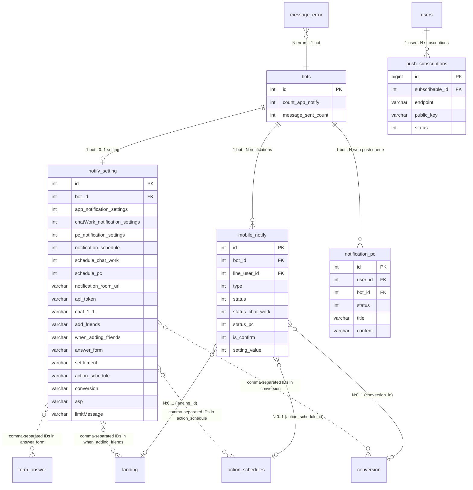

# [FA-006] Cài đặt thông báo — DB Mapping

> Mapping giữa giao diện, API, logic với cơ sở dữ liệu.
> Nguồn: DB schema (`db/schema/tables/`), sample data (`db/data/tables/`), cross-reference với ui-spec, api-spec, logic-spec, job-spec.
> Confidence tổng thể: **Cao** — xác minh từ CREATE TABLE, source code Laravel + Spring Boot, và sample data.

---

## 1. Bảng dữ liệu liên quan

### Bảng chính (Primary Tables)

| Bảng | Mô tả | Data size | Model Laravel | Model JPA (Spring Boot) |
|------|-------|-----------|---------------|------------------------|
| `notify_setting` | Cấu hình thông báo chính — 1 record/bot, lưu toàn bộ toggle, timing, chi tiết sự kiện | 284KB | `App\NotifySetting` | `sns.line.models.linedb.entities.NotifySetting` |
| `mobile_notify` | Queue thông báo — mỗi sự kiện tạo 1 record, 3 status columns cho 3 kênh gửi | 87.6MB | `App\MobileNotify` | `sns.line.models.linedb.entities.MobileNotify` |
| `notification_pc` | Queue web push notification — Laravel INSERT, Spring Boot poll và gửi | 2.4MB | `App\NotificationPC` | `sns.line.models.linedb.entities.NotificationPc` |

### Bảng phụ (Secondary Tables)

| Bảng | Mô tả | Kiểu | Liên kết chính |
|------|-------|------|---------------|
| `push_subscriptions` | Đăng ký nhận Web Push notification từ browser | Config / Subscription | `notification_pc` (gửi đến subscribers) |
| `bots` | Bảng bot chính — cập nhật `count_app_notify`, `message_sent_count` | Master data | `notify_setting.bot_id` |
| `message_error` | Lỗi gửi tin nhắn — đếm để tạo thông báo system | Log / Reference | `mobile_notify` (tạo TYPE_SYSTEM) |
| `landing` | Danh sách QR code / landing page — populate checkbox động | Master data | `notify_setting.when_adding_friends` (chứa landing IDs) |
| `form_answer` | Danh sách form trả lời — populate checkbox động | Master data | `notify_setting.answer_form` (chứa form IDs) |
| `action_schedules` | Danh sách action schedule — populate checkbox động | Master data | `notify_setting.action_schedule` (chứa schedule IDs) |
| `conversion` | Danh sách conversion — populate checkbox động | Master data | `notify_setting.conversion` (chứa conversion IDs) |
| `access_bot` | Quyền truy cập bot — được import trong controller nhưng không sử dụng trực tiếp | Reference | `bots` |

---

## 2. Chi tiết từng bảng

### 2.1. Bảng: `notify_setting`

- **Model Laravel**: `App\NotifySetting` — file `app/NotifySetting.php`
- **Model JPA**: `sns.line.models.linedb.entities.NotifySetting`
- **Guarded**: `[]` (mass assignment cho tất cả fields)
- **Timestamps**: Có (`created_at`, `updated_at`)
- **Ràng buộc nghiệp vụ**: Mỗi bot chỉ có **1 record** — query luôn dùng `where('bot_id', $botId)->first()`

#### Columns

| # | Cột | Kiểu | Nullable? | Default | Mô tả |
|---|-----|------|----------|---------|-------|
| 1 | `id` | int(10) unsigned | Không | AUTO_INCREMENT | Khoá chính |
| 2 | `user_id` | int(11) | Có | NULL | ID user tạo record (admin user) |
| 3 | `admin_id` | int(11) | Có | NULL | ID admin sở hữu |
| 4 | `bot_id` | int(11) | Có | NULL | ID bot LINE OA — FK logic đến `bots.id` |
| 5 | `app_notification_settings` | int(11) | Không | 0 | **Toggle smartphone**: 0 = BẬT, 1 = TẮT (logic đảo!) |
| 6 | `chatWork_notification_settings` | int(11) | Không | 0 | **Toggle ChatWork**: 0 = BẬT, 1 = TẮT (logic đảo!) |
| 7 | `pc_notification_settings` | int(11) | Không | 1 | **Toggle PC desktop**: 0 = BẬT, 1 = TẮT (logic đảo! — default TẮT) |
| 8 | `notification_schedule` | int(11) | Có | NULL | Tần suất smartphone: 0=realtime, 1=15min, 2=30min, 3=1h, 4=3h, 5=6h, 6=12h, 7=24h |
| 9 | `schedule_pc` | int(11) | Có | NULL | Tần suất PC (cùng mapping) |
| 10 | `schedule_chat_work` | tinyint(4) | Có | NULL | Tần suất ChatWork (cùng mapping) |
| 11 | `notification_room_url` | varchar(255) | Có | NULL | URL room ChatWork (chứa room ID dạng `#!rid{roomId}`) |
| 12 | `api_token` | varchar(255) | Có | NULL | ChatWork API token |
| 13 | `type_notify_send_chatwork` | tinyint(4) | Không | 0 | Kiểu gửi thông báo ChatWork |
| 14 | `is_notify_chat11` | tinyint(4) | Không | 1 | Toggle hạng mục「1:1チャット」(1=BẬT) |
| 15 | `chat_1_1` | varchar(255) | Có | NULL | Comma-separated IDs sự kiện chat 1:1 đã chọn |
| 16 | `setting_send_chat` | tinyint(4) | Không | 0 | Cài đặt gửi chat (không rõ mục đích — legacy) |
| 17 | `is_notify_add_friend` | tinyint(4) | Không | 1 | Toggle hạng mục「友だち登録情報」(1=BẬT) |
| 18 | `add_friends` | varchar(255) | Có | NULL | Comma-separated IDs sự kiện bạn bè đã chọn |
| 19 | `is_notify_send_all` | tinyint(4) | Không | 1 | Toggle hạng mục「メッセージ配信」(1=BẬT) |
| 20 | `send_all` | varchar(255) | Có | NULL | Comma-separated IDs sự kiện gửi tin nhắn |
| 21 | `is_notify_qr_code` | tinyint(4) | Không | 1 | Toggle hạng mục「QRコードアクション」(1=BẬT) |
| 22 | `when_adding_friends` | varchar(255) | Có | NULL | Comma-separated IDs: `-1`=chọn tất cả, `0`=bạn thường, `{landingId}`=QR code cụ thể |
| 23 | `is_all_qrcode_new` | tinyint(4) | Không | 0 | Tự động tick QR code mới thêm (1=BẬT) |
| 24 | `update_select_qr_new` | datetime | Có | NULL | Thời điểm bật "tự động tick QR mới" — items tạo sau này sẽ auto-checked |
| 25 | `is_notify_form` | tinyint(4) | Không | 1 | Toggle hạng mục「フォーム作成」(1=BẬT) |
| 26 | `answer_form` | varchar(255) | Có | NULL | Comma-separated IDs: `-1`=chọn tất cả, `{formId}`=form cụ thể |
| 27 | `is_all_form_new` | tinyint(4) | Không | 0 | Tự động tick form mới thêm (1=BẬT) |
| 28 | `update_select_form_new` | datetime | Có | NULL | Thời điểm bật "tự động tick form mới" |
| 29 | `is_notify_salon_booking` | tinyint(4) | Không | 1 | Toggle hạng mục「サロン・面談予約」(1=BẬT) |
| 30 | `salon_booking` | varchar(255) | Có | NULL | Comma-separated IDs sự kiện salon booking |
| 31 | `is_notify_lesson_booking` | tinyint(4) | Không | 1 | Toggle hạng mục「レッスン予約」(1=BẬT) |
| 32 | `lesson_booking` | varchar(255) | Có | NULL | Comma-separated IDs sự kiện lesson booking |
| 33 | `is_notify_calendar_booking` | tinyint(4) | Không | 1 | Toggle hạng mục「イベント予約」(旧 booking calendar) (1=BẬT) |
| 34 | `booking_calendar` | varchar(255) | Có | NULL | Comma-separated IDs sự kiện calendar booking |
| 35 | `is_notify_event_booking` | tinyint(4) | Không | 1 | Toggle hạng mục「イベント予約」(event reservation) (1=BẬT) |
| 36 | `event_reservation_management` | varchar(255) | Có | NULL | Comma-separated IDs sự kiện event booking |
| 37 | `is_notify_items` | tinyint(4) | Không | 1 | Toggle hạng mục「商品販売」(1=BẬT) |
| 38 | `settlement` | varchar(255) | Có | NULL | Comma-separated IDs sự kiện thanh toán |
| 39 | `items` | varchar(255) | Có | NULL | Cột legacy — không rõ khác `settlement` như thế nào |
| 40 | `is_notify_action_schedule` | tinyint(4) | Không | 1 | Toggle hạng mục「アクションスケジュール実行」(1=BẬT) |
| 41 | `action_schedule` | varchar(255) | Có | NULL | Comma-separated IDs action schedule đã chọn |
| 42 | `is_all_schedule_new` | tinyint(4) | Không | 0 | Tự động tick schedule mới thêm (1=BẬT) |
| 43 | `update_select_schedule_new` | datetime | Có | NULL | Thời điểm bật "tự động tick schedule mới" |
| 44 | `is_notify_conversion` | tinyint(4) | Không | 1 | Toggle hạng mục「コンバージョン」(1=BẬT) |
| 45 | `conversion` | varchar(255) | Có | NULL | Comma-separated IDs conversion đã chọn |
| 46 | `is_all_conversion_new` | tinyint(4) | Không | 0 | Tự động tick conversion mới thêm (1=BẬT) |
| 47 | `update_select_conversion_new` | datetime | Có | NULL | Thời điểm bật "tự động tick conversion mới" |
| 48 | `is_notify_asp` | tinyint(4) | Không | 1 | Toggle hạng mục「ASP管理」(1=BẬT) |
| 49 | `asp` | varchar(255) | Có | NULL | Comma-separated IDs sự kiện ASP/affiliate |
| 50 | `is_notify_send_error` | tinyint(4) | Không | 1 | Toggle hạng mục「配信数アラート」(1=BẬT) |
| 51 | `limitMessage` | varchar(255) | Có | NULL | Comma-separated IDs ngưỡng cảnh báo số lượng phát hành |
| 52 | `is_notify_system_notify` | tinyint(4) | Không | 1 | Toggle hạng mục thông báo hệ thống (1=BẬT) |
| 53 | `systemNotify` | varchar(255) | Có | NULL | Comma-separated IDs sự kiện hệ thống |
| 54 | `system_notification` | varchar(255) | Có | NULL | Cột legacy — thông báo hệ thống cũ |
| 55 | `last_notify_time` | datetime | Có | NULL | Thời điểm gửi gần nhất cho App |
| 56 | `next_notify_time` | datetime | Có | NULL | Thời điểm gửi tiếp theo cho App |
| 57 | `last_notify_chat_work_time` | datetime | Có | NULL | Thời điểm gửi gần nhất cho ChatWork |
| 58 | `next_notify_chat_work_time` | datetime | Có | NULL | Thời điểm gửi tiếp theo cho ChatWork |
| 59 | `last_notify_pc_time` | datetime | Có | NULL | Thời điểm gửi gần nhất cho PC |
| 60 | `next_notify_pc_time` | datetime | Có | NULL | Thời điểm gửi tiếp theo cho PC |
| 61 | `app_total_msg_error` | int(11) | Không | 0 | Số lỗi tin nhắn đã biết cho App (snapshot dùng so sánh incremental) |
| 62 | `chat_work_total_msg_error` | int(11) | Không | 0 | Số lỗi tin nhắn đã biết cho ChatWork |
| 63 | `pc_total_msg_error` | int(11) | Không | 0 | Số lỗi tin nhắn đã biết cho PC |
| 64 | `created_at` | timestamp | Không | CURRENT_TIMESTAMP | Thời gian tạo record |
| 65 | `updated_at` | timestamp | Không | CURRENT_TIMESTAMP ON UPDATE | Thời gian cập nhật gần nhất |

#### Indexes

Không có index được khai báo trong schema file ngoài PRIMARY KEY. Tuy nhiên Spring Boot query theo `bot_id` + các điều kiện schedule/time — có thể có index ở production nhưng không thấy trong dump.

#### Foreign Keys

Không có foreign key constraint khai báo trong schema. Liên kết logic:

| Cột | Tham chiếu logic | Mô tả |
|-----|-----------------|-------|
| `bot_id` | `bots.id` | Bot LINE OA sở hữu cấu hình này |
| `user_id` | `users.id` | Admin user tạo record |
| `admin_id` | `admins.id` | Admin sở hữu |

#### Sample Data (record ID=8 — bot_id=451, có đầy đủ cấu hình)

| Cột | Giá trị | Ghi chú |
|-----|---------|---------|
| `id` | 8 | |
| `bot_id` | 451 | |
| `app_notification_settings` | 0 | BẬT (logic đảo) |
| `chatWork_notification_settings` | 0 | BẬT |
| `pc_notification_settings` | 0 | BẬT |
| `notification_schedule` | 1 | 15 phút |
| `schedule_pc` | 1 | 15 phút |
| `schedule_chat_work` | 1 | 15 phút |
| `notification_room_url` | `https://www.chatwork.com/#!rid370480053` | |
| `api_token` | `6901c0295b54f562891e22198545fa2f` | ChatWork API token |
| `is_notify_chat11` | 1 | BẬT |
| `chat_1_1` | `-1,0,1,2,3` | Chọn tất cả (-1) + các sự kiện cụ thể |
| `is_notify_qr_code` | 1 | BẬT |
| `when_adding_friends` | `-1,0,533,534,...` | Chọn tất cả (-1) + QR code IDs cụ thể |
| `is_all_qrcode_new` | 1 | Tự động tick mới = BẬT |
| `is_notify_form` | 1 | BẬT |
| `answer_form` | `-1,0,1,2,3,4,5,6,7,8,9,10,11` | Chọn tất cả |
| `limitMessage` | NULL | Không cấu hình alert |
| `next_notify_time` | `2026-02-25 16:58:51` | |
| `last_notify_time` | `2026-03-21 17:37:12` | |

---

### 2.2. Bảng: `mobile_notify`

- **Model Laravel**: `App\MobileNotify` — file `app/MobileNotify.php`
- **Model JPA**: `sns.line.models.linedb.entities.MobileNotify`
- **Guarded**: `[]`
- **Timestamps**: Có (`created_at`, `updated_at`)

#### Columns

| # | Cột | Kiểu | Nullable? | Default | Mô tả |
|---|-----|------|----------|---------|-------|
| 1 | `id` | int(10) unsigned | Không | AUTO_INCREMENT | Khoá chính |
| 2 | `line_user_id` | int(11) | Có | NULL | LINE user gây ra sự kiện (null cho system/broadcast/alert) |
| 3 | `bot_id` | int(11) | Có | NULL | Bot ID liên quan |
| 4 | `type` | int(11) | Có | NULL | Loại thông báo — xem bảng Type Constants bên dưới |
| 5 | `notify_time` | datetime | Có | NULL | Thời điểm tạo thông báo |
| 6 | `notify_title` | varchar(500) | Có | NULL | Tiêu đề thông báo |
| 7 | `notify_content_main` | text | Có | NULL | Nội dung chính (ngắn gọn, hiển thị) |
| 8 | `notify_content` | text | Có | NULL | Nội dung đầy đủ |
| 9 | `notify_badge` | int(11) | Có | NULL | Badge count (-1 = cập nhật badge tổng) |
| 10 | `status` | int(11) | Không | 0 | **Trạng thái App**: 0=chờ gửi, 1=đã gửi/skip |
| 11 | `status_chat_work` | int(11) | Không | 0 | **Trạng thái ChatWork**: 0=chờ gửi, 1=đã gửi/skip |
| 12 | `status_pc` | tinyint(4) | Không | 0 | **Trạng thái PC**: 0=chờ gửi, 1=đã gửi/skip |
| 13 | `is_confirm` | tinyint(4) | Không | 0 | 0=chưa đọc, 1=đã đọc (user xác nhận) |
| 14 | `last_notify_time` | datetime | Có | NULL | Thời điểm gửi thông báo gần nhất (cho record này) |
| 15 | `send_number` | int(11) | Có | 0 | Số lượng gửi (dùng cho broadcast) |
| 16 | `title_message` | varchar(255) | Có | NULL | Tiêu đề tin nhắn (dùng cho broadcast) |
| 17 | `setting_value` | int(11) | Không | 0 | Giá trị ngưỡng cảnh báo (dùng cho delivery count alert) |
| 18 | `action_schedule_id` | int(11) | Có | NULL | ID action schedule liên quan |
| 19 | `affiliater_id` | int(11) | Có | NULL | ID affiliater liên quan |
| 20 | `bot_setting_aff_id` | int(11) | Có | NULL | ID cài đặt affiliate bot |
| 21 | `type_aff` | tinyint(4) | Có | NULL | Loại affiliate |
| 22 | `landing_id` | int(11) | Có | NULL | ID landing page / QR code |
| 23 | `bot_contract_id` | int(11) | Có | NULL | ID hợp đồng bot (billing) |
| 24 | `booking_calendar_id` | int(10) unsigned | Có | NULL | ID booking calendar liên quan |
| 25 | `order_item_id` | int(10) unsigned | Có | NULL | ID order item (thanh toán) |
| 26 | `model_type` | tinyint(4) | Có | NULL | Kiểu model: 0=order default, 1=order, 2=salon |
| 27 | `salon_booking_id` | int(11) | Có | NULL | ID đặt lịch salon |
| 28 | `lesson_booking_id` | int(11) | Có | NULL | ID đặt lịch lesson |
| 29 | `conversion_id` | int(11) | Có | NULL | ID conversion liên quan |
| 30 | `created_at` | timestamp | Không | CURRENT_TIMESTAMP | Thời gian tạo |
| 31 | `updated_at` | timestamp | Không | CURRENT_TIMESTAMP ON UPDATE | Thời gian cập nhật |

#### Type Constants (cột `type`)

| Giá trị | Constant (Java) | Mô tả | Hạng mục UI |
|---------|-----------------|-------|------------|
| 1 | `TYPE_CHAT_11` | Chat 1:1 | 「1:1チャット」 |
| 2 | `TYPE_ADD_FRIEND` | Thêm bạn bè | 「友だち登録情報」 |
| 3 | `TYPE_ANSWER_FORM` | Trả lời form | 「フォーム作成」 |
| 4 | `TYPE_EVENT` | Đặt lịch sự kiện | 「イベント予約」 |
| 5 | `TYPE_PAYMENT` | Thanh toán | 「商品販売」 |
| 6 | `TYPE_SYSTEM` | Hệ thống (lỗi gửi tin) | Thông báo hệ thống |
| 12 | `TYPE_ADD_FRIEND_QR_CODE` | Bạn bè qua QR code | 「QRコードアクション」 |
| 13 | `TYPE_SEND_ALL` | Broadcast hoàn thành | 「メッセージ配信」 |
| 14 | `TYPE_ACTION_SCHEDULE` | Action schedule thực thi | 「アクションスケジュール実行」 |
| 15 | `TYPE_DELIVERY_COUNT_ALERT` | Cảnh báo số lượng | 「配信数アラート」 |
| 16 | `TYPE_ASP_AFFILIATER` | Affiliate | 「ASP管理」 |

#### State Machine — 3 kênh độc lập

```
status            = 0 → Chờ gửi App (Firebase)     → 1 = Đã gửi / Tắt (skip)
status_chat_work  = 0 → Chờ gửi ChatWork           → 1 = Đã gửi / Tắt (skip)
status_pc         = 0 → Chờ gửi PC Desktop          → 1 = Đã gửi / Tắt (skip)
```

Logic set status khi INSERT:
- Kênh **tắt** (`*_notification_settings = 1`) → set status = 1 ngay (skip)
- Kênh **bật** + timing **realtime** (schedule = 0) → gửi ngay + set status = 1
- Kênh **bật** + timing **scheduled** (schedule != 0) → giữ status = 0, chờ job poll

#### Indexes

Không có index khai báo trong schema dump ngoài PRIMARY KEY. Spring Boot query theo `bot_id` + `status` / `status_chat_work` / `status_pc`.

#### Foreign Keys

Không có FK constraint. Liên kết logic:

| Cột | Tham chiếu logic | Mô tả |
|-----|-----------------|-------|
| `bot_id` | `bots.id` | Bot tạo thông báo |
| `line_user_id` | `bot_line_user.id` | LINE user gây sự kiện |
| `action_schedule_id` | `action_schedules.id` | Action schedule liên quan |
| `landing_id` | `landing.id` | Landing/QR code liên quan |
| `conversion_id` | `conversion.id` | Conversion liên quan |
| `affiliater_id` | `affiliaters.id` | Affiliater liên quan |
| `booking_calendar_id` | `booking_calendar.id` | Booking calendar liên quan |
| `salon_booking_id` | `calendar_salon_line_booking.id` | Salon booking liên quan |
| `lesson_booking_id` | `calendar_course_bookings.id` | Lesson booking liên quan |
| `order_item_id` | `bot_line_user_item.id` | Order item liên quan |

---

### 2.3. Bảng: `notification_pc`

- **Model Laravel**: `App\NotificationPC` — file `app/NotificationPC.php`
- **Model JPA**: `sns.line.models.linedb.entities.NotificationPc`
- **Guarded**: `[]`
- **Timestamps**: Có

#### Columns

| # | Cột | Kiểu | Nullable? | Default | Mô tả |
|---|-----|------|----------|---------|-------|
| 1 | `id` | int(10) unsigned | Không | AUTO_INCREMENT | Khoá chính |
| 2 | `user_id` | int(11) | Không | — | Admin user ID nhận notification |
| 3 | `bot_id` | int(11) | Không | — | Bot ID liên quan |
| 4 | `title` | varchar(256) | Không | — | Tiêu đề notification (VD: `【Bot名】`) |
| 5 | `content` | varchar(500) | Không | — | Nội dung notification |
| 6 | `status` | tinyint(4) | Không | 0 | Trạng thái: 0=NEW, 1=RUNNING, 2=DONE, 3=FALSE |
| 7 | `created_at` | timestamp | Không | CURRENT_TIMESTAMP | Thời gian tạo |
| 8 | `updated_at` | timestamp | Không | CURRENT_TIMESTAMP ON UPDATE | Thời gian cập nhật |

#### State Machine (cột `status`)

```
STATUS_NEW (0) → STATUS_RUNNING (1) → STATUS_DONE (2)
                                     → STATUS_FALSE (3) — lỗi gửi
```

#### Sample Data

| id | user_id | bot_id | title | content | status |
|----|---------|--------|-------|---------|--------|
| 1 | 20 | 960 | 【test moi】 | Duyからのメッセージ：Dloooo | 2 (DONE) |
| 2 | 115 | 1280 | 【Bot_test notify】 | KimCucからのメッセージ：hhhhi [自動応答トリガー] | 2 (DONE) |
| 4 | 115 | 1246 | 【Bot YYY_KO SỬA】 | 新しい通知があります。アプリからご確認ください。 | 2 (DONE) |

---

### 2.4. Bảng: `push_subscriptions`

- **Model Laravel**: `NotificationChannels\WebPush\PushSubscription` (package `laravel-notification-channels/webpush`)
- **Timestamps**: Có

#### Columns

| # | Cột | Kiểu | Nullable? | Default | Mô tả |
|---|-----|------|----------|---------|-------|
| 1 | `id` | bigint(20) unsigned | Không | AUTO_INCREMENT | Khoá chính |
| 2 | `subscribable_id` | int(10) unsigned | Không | — | User ID đăng ký (polymorphic) |
| 3 | `subscribable_type` | varchar(255) | Không | — | Model type (polymorphic) |
| 4 | `endpoint` | varchar(500) | Không | — | Web Push endpoint URL |
| 5 | `public_key` | varchar(255) | Có | NULL | P-256 ECDH public key (dùng dedup subscription) |
| 6 | `auth_token` | varchar(255) | Có | NULL | Authentication secret |
| 7 | `content_encoding` | varchar(255) | Có | NULL | Encoding type (aesgcm / aes128gcm) |
| 8 | `status` | int(11) | Có | NULL | Trạng thái: NULL/1=active, 2=FALSE (expired/invalid) |
| 9 | `message_error` | varchar(500) | Có | NULL | Thông báo lỗi khi gửi thất bại |
| 10 | `domain` | varchar(255) | Có | NULL | Domain của subscription |
| 11 | `created_at` | timestamp | Có | NULL | Thời gian tạo |
| 12 | `updated_at` | timestamp | Có | NULL | Thời gian cập nhật |

---

### 2.5. Bảng: `bots` (chỉ các cột liên quan)

| Cột | Kiểu | Mô tả | Cập nhật bởi |
|-----|------|-------|-------------|
| `count_app_notify` | int(11), default 0 | Số thông báo chưa xác nhận (badge count) | Laravel: `getTotalNotifyExceptSystemAndBillCycle()` sau mỗi save; Spring Boot: sau gửi notification |
| `message_sent_count` | int(11), default 0 | Số tin nhắn đã gửi trong tháng (từ LINE API) | Spring Boot: `HandleCheckNumberOfMessagesSentCurrent` |
| `last_time_count_user_confirm` | datetime | Thời gian confirm gần nhất | Spring Boot |

---

### 2.6. Bảng: `message_error`

| Cột | Kiểu | Mô tả |
|-----|------|-------|
| `id` | int(10) unsigned | Khoá chính |
| `message_id` | int(11) | ID tin nhắn lỗi |
| `line_id` | int(11) | LINE user ID |
| `bot_id` | int(11) | Bot ID |
| `error_message` | text | Nội dung lỗi |
| `is_confirmed` | int(11), default 0 | 0=chưa xác nhận, 1=đã xác nhận |
| `type` | tinyint(4), default 1 | 1=other, 2=chat11, 3=send all, 4=scenario |
| `status` | tinyint(4), default 0 | 1=waiting, 2=done |

**Sử dụng**: Controller đếm `is_confirmed = 0` để lưu vào `notify_setting.app_total_msg_error` / `chat_work_total_msg_error`. Spring Boot so sánh số mới vs số cũ → nếu tăng → INSERT `mobile_notify` TYPE_SYSTEM.

---

## 3. Mapping UI ↔ Database

### SCR-NTF-01 — Phần 1: Phương tiện thông báo (通知先)

| # | UI Element (JP) | DB Table | DB Column | Kiểu DB | Mapping Type | Transform | Confidence |
|---|----------------|----------|-----------|---------|-------------|-----------|-----------|
| 1 | 「スマートフォンアプリ」→「通知受け取り」ON/OFF | `notify_setting` | `app_notification_settings` | int(11) | Direct | **Đảo ngược**: UI ON → DB 0, UI OFF → DB 1 | **Cao** |
| 2 | 「スマートフォンアプリ」→「通知タイミング」dropdown | `notify_setting` | `notification_schedule` | int(11) | Enum | 0=realtime, 1=15min, 2=30min, 3=1h, 4=3h, 5=6h, 6=12h, 7=24h | **Cao** |
| 3 | 「ChatWork（チャットワーク）」→「通知受け取り」ON/OFF | `notify_setting` | `chatWork_notification_settings` | int(11) | Direct | **Đảo ngược**: UI ON → DB 0, UI OFF → DB 1 | **Cao** |
| 4 | 「ChatWork（チャットワーク）」→「通知タイミング」dropdown | `notify_setting` | `schedule_chat_work` | tinyint(4) | Enum | Cùng mapping với smartphone | **Cao** |
| 5 | 「PCデスクトップ」→「通知受け取り」ON/OFF | `notify_setting` | `pc_notification_settings` | int(11) | Direct | **Đảo ngược**: UI ON → DB 0, UI OFF → DB 1 | **Cao** |
| 6 | 「PCデスクトップ」→「通知タイミング」dropdown | `notify_setting` | `schedule_pc` | int(11) | Enum | Cùng mapping với smartphone | **Cao** |

### SCR-NTF-01 — Phần 2: Hạng mục thông báo (通知項目) — Toggle chính

| # | UI Hạng mục (JP) | Toggle Column | Detail Column | Page param (EP-04) | Confidence |
|---|-----------------|---------------|--------------|-------------------|-----------|
| 1 | 「1:1チャット」 | `is_notify_chat11` | `chat_1_1` | `chat_11` | **Cao** |
| 2 | 「友だち登録情報」 | `is_notify_add_friend` | `add_friends` | `addFriend` | **Cao** |
| 3 | 「メッセージ配信」 | `is_notify_send_all` | `send_all` | `sendAll` | **Cao** |
| 4 | 「QRコードアクション」 | `is_notify_qr_code` | `when_adding_friends` | `qrCode` | **Cao** |
| 5 | 「フォーム作成」 | `is_notify_form` | `answer_form` | `form` | **Cao** |
| 6 | 「サロン・面談予約」 | `is_notify_salon_booking` | `salon_booking` | `salonBooking` | **Cao** |
| 7 | 「レッスン予約」 | `is_notify_lesson_booking` | `lesson_booking` | `lessonBooking` | **Cao** |
| 8 | 「イベント予約」 | `is_notify_event_booking` | `event_reservation_management` | `eventBooking` | **Cao** |
| 9 | 「商品販売」 | `is_notify_items` | `settlement` | `items` | **Cao** |
| 10 | 「アクションスケジュール実行」 | `is_notify_action_schedule` | `action_schedule` | `actionSchedule` | **Cao** |
| 11 | 「コンバージョン」 | `is_notify_conversion` | `conversion` | `conversion` | **Cao** |
| 12 | 「ASP管理」 | `is_notify_asp` | `asp` | `asp` | **Cao** |
| 13 | 「配信数アラート」 | `is_notify_send_error` | `limitMessage` | `limitMessage` | **Cao** |

> **Ghi chú**: UI hiển thị thêm hạng mục 「システム通知」 không có trên danh sách 13 mục chính nhưng có toggle `is_notify_system_notify` + detail `systemNotify` + page param `systemNotify`.

### SCR-NTF-01 — Phần 3: Chi tiết sự kiện — Chat 1:1 (cột `chat_1_1`)

| # | Sự kiện (JP) | DB Value | Confidence | Ghi chú |
|---|-------------|----------|-----------|---------|
| 1 | 「通常メッセージを受信した時」 | `0` | **Cao** | Comment trong schema: "0: Normal message" |
| 2 | 「自動応答キーワードを受信した時」 | `1` | **Cao** | Comment trong schema: "1: 【】message" |
| 3 | 「【◯◯】メッセージを受信した時」 | `2` | **Trung bình** | Suy luận từ thứ tự UI + sample data |
| 4 | 「メディア」 | `3` | **Trung bình** | Suy luận từ thứ tự UI + sample data |

> **Ghi chú**: Sample data có `-1` (VD: `-1,0,1,2,3`) — giá trị `-1` = chọn tất cả「以下の全項目」.

### SCR-NTF-01 — Phần 3: Chi tiết sự kiện — Bạn bè (cột `add_friends`)

| # | Sự kiện (JP) | DB Value | Confidence |
|---|-------------|----------|-----------|
| 1 | 「新規友だちの追加時」 | `0` | **Cao** |
| 2 | 「既存友だちの追加時」 | `1` | **Cao** |
| 3 | 「友だちがブロックした時」 | `2` | **Cao** |
| 4 | 「友だちがブロック解除した時」 | `3` | **Cao** |

### SCR-NTF-01 — Phần 3: Chi tiết sự kiện — Gửi tin (cột `send_all`)

| # | Sự kiện (JP) | DB Value | Confidence |
|---|-------------|----------|-----------|
| 1 | 「メッセージ配信完了時」 | `0` | **Cao** |

### SCR-NTF-01 — Phần 3: Chi tiết sự kiện — QR code (cột `when_adding_friends`)

| # | Sự kiện (JP) | DB Value | Confidence | Ghi chú |
|---|-------------|----------|-----------|---------|
| — | 「以下の全項目」 | `-1` | **Cao** | Chọn tất cả |
| — | 通常の友だち追加時 | `0` | **Cao** | Comment schema: "0: Usually add friends" |
| — | Checkbox cho mỗi QR code | `{landing.id}` | **Cao** | ID từ bảng `landing`, load động qua EP-06 |

> **Ghi chú**: Cột `is_all_qrcode_new` + `update_select_qr_new` — khi bật "tự動tick mục mới thêm", items tạo sau `update_select_qr_new` sẽ tự động được chọn.

### SCR-NTF-01 — Phần 3: Chi tiết sự kiện — Form (cột `answer_form`)

| # | Sự kiện (JP) | DB Value | Confidence | Ghi chú |
|---|-------------|----------|-----------|---------|
| — | 「以下の全項目」 | `-1` | **Cao** | Chọn tất cả |
| — | Checkbox cho mỗi form | `{form_answer.id}` | **Cao** | ID từ bảng `form_answer`, load động qua EP-07 |

> **Ghi chú**: Cột `is_all_form_new` + `update_select_form_new` — tương tự QR code.

### SCR-NTF-01 — Phần 3: Chi tiết sự kiện — Salon booking (cột `salon_booking`)

| # | Sự kiện (JP) | DB Value | Constant (Laravel) | Confidence |
|---|-------------|----------|-------------------|-----------|
| 1 | 「予約受付時」 | `0` | `CALENDAR_SALON_BOOKED` | **Cao** |
| 2 | 「予約リクエスト受付時」 | `6` | `CALENDAR_SALON_BOOKING_REQUEST` | **Cao** |
| 3 | 「予約リクエスト承認時」 | `1` | `CALENDAR_SALON_BOOKING_APPROVE` | **Cao** |
| 4 | 「予約リクエスト否認時」 | `9` | `CALENDAR_SALON_BOOKING_DENY` | **Cao** |
| 5 | 「予約キャンセル時」 | `4` | `CALENDAR_SALON_BOOKING_CANCEL` | **Cao** |
| 6 | 「キャンセルリクエスト受付時」 | `8` | `CALENDAR_SALON_REQUEST_BOOKING_CANCEL` | **Cao** |
| 7 | 「キャンセルリクエスト承認時」 | `5` | `CALENDAR_SALON_APPROVE_BOOKING_CANCEL` | **Cao** |
| 8 | 「キャンセルリクエスト否認時」 | `11` | `CALENDAR_SALON_DENY_BOOKING_CANCEL` | **Cao** |

### SCR-NTF-01 — Phần 3: Chi tiết sự kiện — Lesson booking (cột `lesson_booking`)

| # | Sự kiện (JP) | DB Value | Constant (Laravel) | Confidence |
|---|-------------|----------|-------------------|-----------|
| 1 | 「予約受付時」 | `0` | `CALENDAR_LESSON_BOOKED` | **Cao** |
| 2 | 「予約リクエスト受付時」 | `6` | `CALENDAR_LESSON_BOOKING_REQUEST` | **Cao** |
| 3 | 「予約リクエスト承認時」 | `1` | `CALENDAR_LESSON_BOOKING_APPROVE` | **Cao** |
| 4 | 「予約リクエスト否認時」 | `10` | `CALENDAR_LESSON_BOOKING_DENY` | **Cao** |
| 5 | 「予約キャンセル時」 | `4` | `CALENDAR_LESSON_BOOKING_CANCEL` | **Cao** |
| 6 | 「キャンセルリクエスト受付時」 | `8` | `CALENDAR_LESSON_REQUEST_BOOKING_CANCEL` | **Cao** |
| 7 | 「キャンセルリクエスト承認時」 | `5` | `CALENDAR_LESSON_APPROVE_BOOKING_CANCEL` | **Cao** |
| 8 | 「キャンセルリクエスト否認時」 | `11` | `CALENDAR_LESSON_DENY_BOOKING_CANCEL` | **Cao** |

### SCR-NTF-01 — Phần 3: Chi tiết sự kiện — Event booking (cột `event_reservation_management`)

| # | Sự kiện (JP) | DB Value | Constant (Laravel) | Confidence |
|---|-------------|----------|-------------------|-----------|
| 1 | 「予約受付時」 | `0` | `EVENT_BOOKING_BOOKED` | **Cao** |
| 2 | 「予約変更時」 | `1` | `EVENT_BOOKING_CHANGE` | **Cao** |
| 3 | 「予約キャンセル時」 | `2` | `EVENT_BOOKING_CANCEL` | **Cao** |
| 4 | 「予約リクエスト承認時」 | `3` | `EVENT_BOOKING_APPROVE` | **Cao** |
| 5 | 「予約リクエスト否認時」 | `4` | `EVENT_BOOKING_DENY` | **Cao** |
| 6 | 「予約リクエスト受付時」 | `6` | `EVENT_BOOKING_REQUEST` | **Cao** |
| 7 | 「予約変更リクエスト受付時」 | `7` | `EVENT_BOOKING_REQUEST_CHANGE` | **Cao** |
| 8 | 「予約変更リクエスト承認時」 | `8` | `EVENT_BOOKING_APPROVE_CHANGE` | **Cao** |
| 9 | 「予約変更リクエスト否認時」 | `9` | `EVENT_BOOKING_DENY_CHANGE` | **Cao** |
| 10 | 「予約キャンセルリクエスト受付時」 | `10` | `EVENT_BOOKING_REQUEST_CANCEL` | **Cao** |
| 11 | 「予約キャンセルリクエスト承認時」 | `11` | `EVENT_BOOKING_APPROVE_CANCEL` | **Cao** |
| 12 | 「予約キャンセルクエスト否認時」 | `5` | `EVENT_BOOKING_DENY_CANCEL` | **Cao** |

> **Ghi chú**: Mục #12 có lỗi chính tả trên UI (「キャンセルクエスト」thay vì「キャンセルリクエスト」).

### SCR-NTF-01 — Phần 3: Chi tiết sự kiện — Bán hàng (cột `settlement`)

| # | Sự kiện (JP) | DB Value | Constant (Laravel) | Confidence |
|---|-------------|----------|-------------------|-----------|
| 1 | 「単品商品が購入された時」 | `5` | `PRODUCT_SALES_ONE_TIMES_SUCCESS` | **Cao** |
| 2 | 「単品商品の決済が失敗した時」 | `6` | `PRODUCT_SALES_ONE_TIMES_FAIL` | **Cao** |
| 3 | 「継続商品の決済が完了した時」 | `7` | `PRODUCT_SALES_CYCLE_FIRST_SUCCESS` | **Cao** |
| 4 | 「継続商品のトライアルが開始した時」 | `8` | `PRODUCT_SALES_CYCLE_TRIAL_START` | **Cao** |
| 5 | 「継続商品の決済が手動解約された時」 | `9` | `PRODUCT_SALES_CYCLE_ADMIN_CANCEL` | **Cao** |
| 6 | 「継続商品の決済が自動（強制）解約された時」 | `10` | `PRODUCT_SALES_CYCLE_JOB_CANCEL` | **Cao** |
| 7 | 「継続商品の決済が失敗した時」 | `11` | `PRODUCT_SALES_CYCLE_FAIL` | **Cao** |

### SCR-NTF-01 — Phần 3: Chi tiết sự kiện — Action Schedule (cột `action_schedule`)

| # | Sự kiện (JP) | DB Value | Confidence | Ghi chú |
|---|-------------|----------|-----------|---------|
| — | 「以下の全項目」 | `-1` | **Cao** | Chọn tất cả |
| — | Checkbox cho mỗi schedule | `{action_schedules.id}` | **Cao** | Load động qua EP-08 |

> **Ghi chú**: Cột `is_all_schedule_new` + `update_select_schedule_new` — tương tự QR code.

### SCR-NTF-01 — Phần 3: Chi tiết sự kiện — Conversion (cột `conversion`)

| # | Sự kiện (JP) | DB Value | Confidence | Ghi chú |
|---|-------------|----------|-----------|---------|
| — | 「以下の全項目」 | `-1` | **Cao** | Chọn tất cả |
| — | Checkbox cho mỗi conversion | `{conversion.id}` | **Cao** | Load động qua EP-09 |

> **Ghi chú**: Cột `is_all_conversion_new` + `update_select_conversion_new` — tương tự QR code.

### SCR-NTF-01 — Phần 3: Chi tiết sự kiện — ASP (cột `asp`)

| # | Sự kiện (JP) | DB Value | Constant (Laravel) | Confidence |
|---|-------------|----------|-------------------|-----------|
| 1 | 「アフィリエイター新規登録時」 | `1` | `AFF_NEW_REGISTER` | **Cao** |
| 2 | 「自動認証のアフィリエイト報酬が登録された時」 | `2` | `AFF_COMMISSION_AUTO_VERIFICATION` | **Cao** |
| 3 | 「手動認証のアフィリエイト報酬が登録された時」 | `3` | `AFF_COMMISSION_MANUAL_VERIFICATION` | **Cao** |

### SCR-NTF-01 — Phần 3: Chi tiết sự kiện — Alert配信数 (cột `limitMessage`)

| # | Sự kiện (JP) | DB Value | Constant (Java) | Confidence |
|---|-------------|----------|-----------------|-----------|
| 1 | 「LOA配信数が100通以上」 | `1` | `DELIVERY_COUNT_ALERT_LINE_100` | **Cao** |
| 2 | 「LOA配信数が200通以上」 | `2` | `DELIVERY_COUNT_ALERT_LINE_200` | **Cao** |
| 3 | 「LOA配信数が4,000通以上」 | `3` | `DELIVERY_COUNT_ALERT_LINE_4000` | **Cao** |
| 4 | 「LOA配信数が5,000通以上」 | `4` | `DELIVERY_COUNT_ALERT_LINE_5000` | **Cao** |
| 5 | 「LOA配信数が25,000通以上」 | `5` | `DELIVERY_COUNT_ALERT_LINE_25000` | **Cao** |
| 6 | 「LOA配信数が30,000通以上」 | `6` | `DELIVERY_COUNT_ALERT_LINE_30000` | **Cao** |
| 7 | 「エルメ配信数が500通以上」 | `7` | `DELIVERY_COUNT_ALERT_LME_500` | **Cao** |
| 8 | 「エルメ配信数が1,000通以上」 | `8` | `DELIVERY_COUNT_ALERT_LME_1000` | **Cao** |

> **Ghi chú**: Giá trị `0` = `DELIVERY_COUNT_ALERT_ALL` (chọn tất cả) — sử dụng nội bộ, không hiển thị trên UI.

### SCR-NTF-01 — Phần 3: Chi tiết sự kiện — Booking Calendar legacy (cột `booking_calendar`)

| # | DB Value | Ý nghĩa | Confidence | Ghi chú |
|---|---------|---------|-----------|---------|
| 1 | `0` | Đặt lịch thường | **Cao** | Schema comment: "0:booking_normal" |
| 2 | `1` | Duyệt đặt lịch | **Cao** | "1:approve_booking" |
| 3 | `2` | Thay đổi thường | **Cao** | "2:change_normal" |
| 4 | `3` | Duyệt thay đổi | **Cao** | "3:approve_change" |
| 5 | `4` | Hủy thường | **Cao** | "4:cancel_normal" |
| 6 | `5` | Duyệt hủy | **Cao** | "5:approve_cancel" |
| 7 | `6` | Yêu cầu đặt lịch | **Cao** | "6:request_booking" |
| 8 | `7` | Yêu cầu thay đổi | **Cao** | "7:request_change" |
| 9 | `8` | Yêu cầu hủy | **Cao** | "8:request_cancel" |

> **Ghi chú**: Cột `booking_calendar` là cột tổng hợp cho cả booking calendar cũ. Trên UI hiện tại, đặt lịch được tách thành 3 hạng mục riêng (Salon, Lesson, Event), mỗi hạng mục có cột riêng.

### SCR-NTF-01 — Hành động đặc biệt

| # | UI Action | DB Table | DB Column(s) | Transform | Confidence |
|---|----------|----------|-------------|-----------|-----------|
| 1 | Click「以下の全項目」 | `notify_setting` | Detail column tương ứng | Thêm/bỏ giá trị `-1` trong danh sách comma-separated | **Cao** |
| 2 | Click「今後以下に追加される項目に、自動でチェックをいれる」 | `notify_setting` | `is_all_{type}_new`, `update_select_{type}_new` | Flag boolean + timestamp | **Cao** |
| 3 | Click「連携設定」(ChatWork) | `notify_setting` | `notification_room_url`, `api_token`, `type_notify_send_chatwork` | Lưu URL room, API token, kiểu gửi | **Cao** |
| 4 | Click「PC設定」 | `push_subscriptions` | `endpoint`, `public_key`, `auth_token` | Subscribe/unsubscribe Web Push | **Cao** |

---

## 4. Enum/Status Values

### 4.1. Toggle phương tiện — Logic đảo ngược

| Cột DB | DB Value | Ý nghĩa thực | UI hiển thị | Ghi chú |
|--------|---------|-------------|------------|---------|
| `app_notification_settings` | `0` | **BẬT** | ON (xanh lá) | API đảo → trả `1` |
| `app_notification_settings` | `1` | **TẮT** | OFF (xám) | API đảo → trả `0` |
| `chatWork_notification_settings` | `0` | **BẬT** | ON | Tương tự |
| `chatWork_notification_settings` | `1` | **TẮT** | OFF | Tương tự |
| `pc_notification_settings` | `0` | **BẬT** | ON | Default = 1 = TẮT |
| `pc_notification_settings` | `1` | **TẮT** | OFF | Default = 1 = TẮT |

> **Quan trọng**: DB lưu **ngược logic** — `0 = ON`, `1 = OFF`. Controller `getNotifySetting()` đảo giá trị trước khi trả về frontend: `0 → 1` (ON), `khác 0 → 0` (OFF). Confidence: **Cao**.

### 4.2. Timing (notification_schedule, schedule_chat_work, schedule_pc)

| DB Value | Khoảng cách | Hiển thị JP |
|---------|-------------|------------|
| `0` | Realtime (gửi ngay) | 「リアルタイム」 |
| `1` | 15 phút | 「15分」 |
| `2` | 30 phút | 「30分」 |
| `3` | 1 giờ | 「1時間」 |
| `4` | 3 giờ | 「3時間」 |
| `5` | 6 giờ | 「6時間」 |
| `6` | 12 giờ | 「12時間」 |
| `7` | 24 giờ | 「24時間」 |

### 4.3. mobile_notify.type — Loại thông báo

| DB Value | Constant | Mô tả | Hạng mục UI |
|---------|---------|-------|------------|
| `1` | TYPE_CHAT_11 | Chat 1:1 | 「1:1チャット」 |
| `2` | TYPE_ADD_FRIEND | Thêm bạn bè | 「友だち登録情報」 |
| `3` | TYPE_ANSWER_FORM | Trả lời form | 「フォーム作成」 |
| `4` | TYPE_EVENT | Đặt lịch sự kiện | 「イベント予約」 |
| `5` | TYPE_PAYMENT | Thanh toán | 「商品販売」 |
| `6` | TYPE_SYSTEM | Hệ thống | Thông báo hệ thống |
| `12` | TYPE_ADD_FRIEND_QR_CODE | Bạn bè qua QR code | 「QRコードアクション」 |
| `13` | TYPE_SEND_ALL | Broadcast hoàn thành | 「メッセージ配信」 |
| `14` | TYPE_ACTION_SCHEDULE | Action schedule | 「アクションスケジュール実行」 |
| `15` | TYPE_DELIVERY_COUNT_ALERT | Cảnh báo số lượng | 「配信数アラート」 |
| `16` | TYPE_ASP_AFFILIATER | Affiliate | 「ASP管理」 |

> **Ghi chú**: Giá trị 7-11 không thấy trong code liên quan đến thông báo. Có thể dùng nội bộ cho loại thông báo khác (salon=10, lesson=11, calendar=7...).

### 4.4. notification_pc.status — Trạng thái Web Push queue

| DB Value | Constant | Ý nghĩa |
|---------|---------|---------|
| `0` | STATUS_NEW | Mới tạo, chờ xử lý |
| `1` | STATUS_RUNNING | Đang xử lý |
| `2` | STATUS_DONE | Đã gửi thành công |
| `3` | STATUS_FALSE | Gửi thất bại |

### 4.5. push_subscriptions.status

| DB Value | Ý nghĩa |
|---------|---------|
| `NULL` hoặc `1` | Active — subscription hợp lệ |
| `2` | FALSE — expired hoặc invalid, không gửi nữa |

### 4.6. mobile_notify.model_type

| DB Value | Constant | Ý nghĩa |
|---------|---------|---------|
| `0` | MODEL_TYPE_ORDER_NOTIFY_DEFAULT | Thông báo order mặc định |
| `1` | MODEL_TYPE_ORDER_NOTIFY | Thông báo order |
| `2` | MODEL_TYPE_SALON | Thông báo salon |

---

## 5. Unmapped Items

### UI fields không map trực tiếp vào DB

| Nguồn | Item | Lý do chưa map | Gợi ý |
|-------|------|---------------|-------|
| UI | Tên QR code trong danh sách checkbox | Lấy động từ `landing.name` qua EP-06 | Không lưu trong `notify_setting` — chỉ lưu ID |
| UI | Tên form trong danh sách checkbox | Lấy động từ `form_answer.name` qua EP-07 | Không lưu trong `notify_setting` — chỉ lưu ID |
| UI | Tên action schedule trong danh sách checkbox | Lấy động từ `action_schedules.name` qua EP-08 | Không lưu trong `notify_setting` — chỉ lưu ID |
| UI | Tên conversion trong danh sách checkbox | Lấy động từ `conversion.name` qua EP-09 | Không lưu trong `notify_setting` — chỉ lưu ID |

### DB columns không hiển thị trên UI

| Bảng | Cột | Lý do | Mô tả |
|------|-----|-------|-------|
| `notify_setting` | `user_id` | Nội bộ | ID user tạo record — set tự động |
| `notify_setting` | `admin_id` | Nội bộ | ID admin — set tự động |
| `notify_setting` | `setting_send_chat` | Legacy | Không rõ mục đích, default 0, không thấy sử dụng trên UI mới |
| `notify_setting` | `items` | Legacy | Cột cũ — UI mới dùng `settlement` thay thế |
| `notify_setting` | `system_notification` | Legacy | Cột cũ — UI mới dùng `systemNotify` thay thế |
| `notify_setting` | `last_notify_time` | Nội bộ (Job) | Spring Boot dùng để tính next_notify_time |
| `notify_setting` | `next_notify_time` | Nội bộ (Job) | Spring Boot poll theo cột này |
| `notify_setting` | `last_notify_chat_work_time` | Nội bộ (Job) | Tương tự cho ChatWork |
| `notify_setting` | `next_notify_chat_work_time` | Nội bộ (Job) | Tương tự cho ChatWork |
| `notify_setting` | `last_notify_pc_time` | Nội bộ (Job) | Tương tự cho PC |
| `notify_setting` | `next_notify_pc_time` | Nội bộ (Job) | Tương tự cho PC |
| `notify_setting` | `app_total_msg_error` | Nội bộ | Snapshot số lỗi — dùng so sánh incremental |
| `notify_setting` | `chat_work_total_msg_error` | Nội bộ | Tương tự cho ChatWork |
| `notify_setting` | `pc_total_msg_error` | Nội bộ | Tương tự cho PC |
| `mobile_notify` | `last_notify_time` | Nội bộ | Thời điểm gửi gần nhất cho record |
| `mobile_notify` | `bot_contract_id` | Nội bộ | Liên kết billing |
| `mobile_notify` | `model_type` | Nội bộ | Phân loại notification model |
| `mobile_notify` | `booking_calendar_id` | Nội bộ | Liên kết booking |
| `mobile_notify` | `order_item_id` | Nội bộ | Liên kết order |
| `mobile_notify` | `salon_booking_id` | Nội bộ | Liên kết salon booking |
| `mobile_notify` | `lesson_booking_id` | Nội bộ | Liên kết lesson booking |
| `mobile_notify` | `conversion_id` | Nội bộ | Liên kết conversion |
| `push_subscriptions` | `subscribable_type` | Nội bộ | Polymorphic type (Laravel package) |
| `push_subscriptions` | `content_encoding` | Nội bộ | Web Push encoding |
| `push_subscriptions` | `domain` | Nội bộ | Domain subscription |

---

## 6. Cách lưu trữ đặc biệt — Comma-Separated Values

Bảng `notify_setting` sử dụng **chuỗi comma-separated** để lưu danh sách sự kiện đã chọn trong các cột varchar(255). Đây là pattern phổ biến trong Laravel legacy.

### Quy trình đọc/ghi

```
[UI Checkbox Array] → implode(",") → [DB varchar] → explode(",") → [API Response Array]

VD: UI chọn checkbox 0, 1, 3
    → Request: ["0", "1", "3"]
    → Controller: implode(",") → "0,1,3"
    → DB: varchar "0,1,3"
    → API đọc: explode(",") → ["0", "1", "3"]
```

### Giá trị đặc biệt

| Giá trị | Ý nghĩa | Áp dụng cho |
|---------|---------|------------|
| `-1` | Chọn tất cả (「以下の全項目」) | `chat_1_1`, `when_adding_friends`, `answer_form`, `booking_calendar`, `event_reservation_management`, `settlement`, `action_schedule`, `conversion`, `salon_booking`, `lesson_booking` |
| `0` | Sự kiện mặc định / đầu tiên | Tùy hạng mục — xem chi tiết enum ở trên |
| `{entity_id}` | ID của entity động | `when_adding_friends` (landing ID), `answer_form` (form ID), `action_schedule` (schedule ID), `conversion` (conversion ID) |

---

## 7. Entity Relationships (ER Diagram)



### Mô tả quan hệ dạng text

```
bots (1) ──── (0..1) notify_setting       [1 bot có tối đa 1 record cấu hình]
bots (1) ──── (N)    mobile_notify         [1 bot có nhiều thông báo trong queue]
bots (1) ──── (N)    notification_pc       [1 bot có nhiều web push queue items]
users (1) ── (N)     push_subscriptions    [1 user có nhiều browser subscriptions]

notify_setting.when_adding_friends ····· landing.id          [comma-separated FK logic]
notify_setting.answer_form ············· form_answer.id       [comma-separated FK logic]
notify_setting.action_schedule ········· action_schedules.id  [comma-separated FK logic]
notify_setting.conversion ·············· conversion.id        [comma-separated FK logic]

mobile_notify.landing_id ──── landing.id                     [FK logic trực tiếp]
mobile_notify.action_schedule_id ──── action_schedules.id    [FK logic trực tiếp]
mobile_notify.conversion_id ──── conversion.id               [FK logic trực tiếp]

message_error.bot_id ──── bots.id                            [Đếm lỗi → so sánh với *_total_msg_error]
```

---

## 8. Ghi chú đặc biệt

### 8.1. Logic đảo ngược Toggle phương tiện
Đây là thiết kế ban đầu của hệ thống: `*_notification_settings = 0` nghĩa là **BẬT**, `= 1` nghĩa là **TẮT**. Có thể do cột ban đầu có ý nghĩa "đã tắt thông báo" (disable notification). Controller Laravel đảo giá trị trong `getNotifySetting()` trước khi trả về frontend để frontend nhận `1 = ON`, `0 = OFF` (logic thuận). **Confidence: Cao** — xác nhận từ cả Laravel và Spring Boot code.

### 8.2. Comma-separated vs Normalized table
Hệ thống lưu danh sách sự kiện dưới dạng comma-separated string thay vì normalized pivot table. Đây là anti-pattern nhưng phổ biến trong PHP/Laravel legacy. Hạn chế:
- Không thể query hiệu quả (phải dùng FIND_IN_SET hoặc LIKE)
- Không có foreign key constraint
- Giới hạn bởi varchar(255) — với QR code/form có nhiều items, chuỗi có thể dài

### 8.3. Bảng `notification_pc` default = 1 (TẮT)
Cột `pc_notification_settings` có **default = 1** (TẮT), khác với smartphone (default = 0 = BẬT) và ChatWork (default = 0 = BẬT). Điều này có nghĩa PC desktop notification mặc định **tắt** khi tạo record mới.

### 8.4. Spring Boot poll bảng `notify_setting` để xác định thời điểm gửi
Các scheduled jobs không poll `mobile_notify` trực tiếp. Thay vào đó:
1. Poll `notify_setting` theo điều kiện `next_*_time <= now()`
2. Với mỗi bot đến giờ → query `mobile_notify` theo `bot_id` + `status=0`
3. Batch update status → gửi notification
4. Cập nhật `last_*_time` và `next_*_time`

### 8.5. Cột legacy trong `notify_setting`
- `items` — có thể là phiên bản cũ của `settlement`
- `system_notification` — phiên bản cũ của `systemNotify`
- `setting_send_chat` — không rõ mục đích, không thấy sử dụng
- `booking_calendar` — phiên bản tổng hợp trước khi tách thành `salon_booking`, `lesson_booking`, `event_reservation_management`
