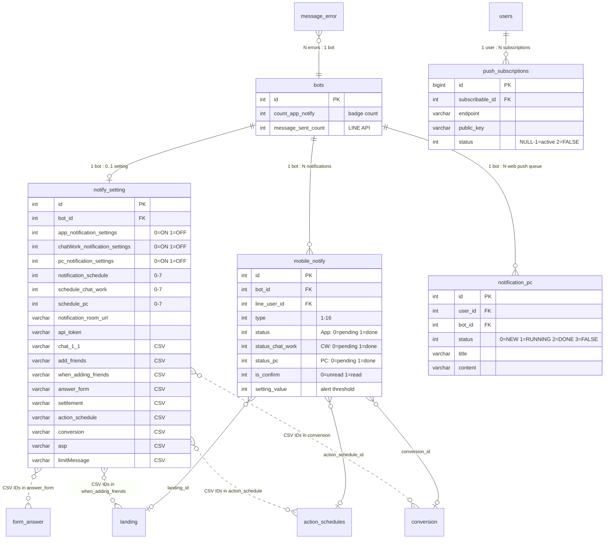

# [FA-006] Cài đặt thông báo「通知設定」 — Feature Spec

> Đặc tả tổng hợp hoàn chỉnh cho tính năng Cài đặt thông báo.
> Tổng hợp từ: ui-spec.md, api-spec.md, logic-spec.md, job-spec.md, db-mapping.md, validation-report.md.
> Ngày tạo: 2026-03-24
> Confidence tổng thể: **Cao**

---

## 1. Tổng quan

### Mục đích
Cho phép Admin (người quản lý LINE Official Account) cấu hình cách thức nhận thông báo từ hệ thống LME. Tính năng bao gồm:
- **Chọn phương tiện nhận thông báo**: Smartphone App (Firebase), ChatWork, PC Desktop (Web Push) — mỗi phương tiện có thể bật/tắt độc lập và cấu hình tần suất nhận (realtime đến 24 giờ/lần).
- **Chọn hạng mục thông báo**: 13 hạng mục (chat, bạn bè, broadcast, đặt lịch, bán hàng, v.v.) — mỗi hạng mục có thể bật/tắt và cấu hình chi tiết từng sự kiện bên trong.
- **Cài đặt liên kết ChatWork**: Nhập URL room, API token, chọn kiểu gửi, test gửi tin nhắn.
- **Cài đặt PC Desktop notification**: Đăng ký/hủy đăng ký Web Push subscription qua browser.

### Thông tin cơ bản

| Thuộc tính | Giá trị |
|-----------|---------|
| **Mã tính năng** | FA-006 |
| **Tên** | Cài đặt thông báo |
| **Tên JP** | 「通知設定」 |
| **Portal** | Admin |
| **URL chính** | `/basic/notify-setting` |
| **Controller** | `Basic\NotifySettingController` (872 dòng) |
| **Số endpoints** | 18 (EP-01 đến EP-18) |
| **Số bảng DB** | 3 chính + 5 phụ |
| **Background Jobs** | 4 services + 1 daily task |

### Đối tượng sử dụng (Actors)

| Actor | Vai trò | Quyền truy cập | Ghi chú |
|-------|---------|----------------|---------|
| Admin | Quản lý LINE Official Account, cấu hình thông báo cho tài khoản | Toàn quyền — bật/tắt tất cả phương tiện và hạng mục thông báo | Actor chính |
| Staff | Nhân viên do Admin tạo, truy cập cùng portal | Tùy role — **chưa xác minh** rõ Staff có được phép truy cập「通知設定」không (Confidence: **Thấp**) | Controller không kiểm tra quyền Staff rõ ràng; có thể bị giới hạn ở route middleware group level |

### Phạm vi

**Trong phạm vi:**
- Cấu hình phương tiện nhận thông báo (3 kênh)
- Cấu hình hạng mục thông báo (13 hạng mục + chi tiết sự kiện)
- Cài đặt liên kết ChatWork (URL room, API token, kiểu gửi, test)
- Cài đặt PC Desktop push notification (VAPID, subscribe/unsubscribe)
- Background jobs gửi thông báo (scheduled + realtime)
- Cảnh báo số lượng tin nhắn phát hành (daily check)

**Ngoài phạm vi:**
- Tạo thông báo (do các tính năng khác tạo — chat, đặt lịch, broadcast, v.v.)
- Hiển thị danh sách thông báo đã nhận (tính năng khác)
- Smartphone app (chỉ cấu hình, không quản lý app)

---

## 2. Các màn hình và luồng xử lý End-to-End

### SCR-NTF-01: Trang chính cài đặt thông báo

- **URL**: `/basic/notify-setting`
- **Tiêu đề trang**: 「通知設定（一覧）」
- **Layout**: Header (tiêu đề + link manual) → Phần 1 (phương tiện thông báo) → Phần 2 (hạng mục thông báo, master-detail)
- **Đặc điểm**: Toàn bộ cấu hình trên 1 trang duy nhất, auto-save khi thay đổi (không có nút「保存」)

#### Luồng 1: Tải trang

```
User truy cập /basic/notify-setting
  → Browser: GET /basic/notify-setting (EP-01)
  → Server: NotifySettingController@index
    → Lấy botId từ session (getBotId())
    → Render Blade view basic.notify_setting.setting
  → Browser: AJAX GET /ajax/basic/notify-setting (EP-02)
  → Server: NotifySettingController@getNotifySetting
    → Query notify_setting WHERE bot_id = {botId}
    → Nếu chưa có record → INSERT mới (tất cả ON, timing realtime)
    → Biến đổi: explode comma-separated → arrays, đảo ngược toggle (DB 0→API 1)
    → Trả JSON {status: true, notifySettingData: {...}}
  → Browser: Render UI với dữ liệu nhận được
```

#### Luồng 2: Bật/tắt phương tiện thông báo

```
User click toggle ON/OFF (VD: ChatWork)
  → Browser: POST /basic/notify-setting-receive (EP-03)
    Body: {app_notification_settings: 0, chatWork_notification_settings: 1, pc_notification_settings: 0,
           notification_schedule: 0, schedule_chat_work: 0, schedule_pc: 0}
  → Server: NotifySettingController@saveNotifySettingReceive
    → Lấy botId, query notify_setting hiện tại
    → Đếm MessageError chưa xác nhận (is_confirmed=0)
    → Nếu phương tiện vừa tắt→bật:
      - UPDATE mobile_notify.status_{channel} = 1 cho records chưa gửi (mark done — không gửi lại cũ)
      - Cập nhật *_total_msg_error = số lỗi hiện tại (snapshot)
    → UPDATE notify_setting (6 trường: 3 toggle + 3 schedule)
    → Nếu timing thay đổi: tính next_notify_*_time = last_time + interval
    → getTotalNotifyExceptSystemAndBillCycle(botId) → UPDATE bots.count_app_notify
    → Trả JSON {success: true}
  → Browser: Toggle cập nhật ngay trên UI (không reload)
```

**Business Rules quan trọng:**
- Toggle **đảo ngược**: UI ON → DB 0, UI OFF → DB 1. API trả về đảo lại (1=ON, 0=OFF).
- Khi **bật lại** phương tiện đã tắt → các thông báo cũ đang pending được **mark done** (không gửi lại), chỉ thông báo mới từ thời điểm bật mới được gửi.

#### Luồng 3: Thay đổi tần suất thông báo

```
User chọn dropdown timing (VD: 「30分ごと」 cho Smartphone)
  → Browser: POST /basic/notify-setting-receive (EP-03)
    Body: {..., notification_schedule: 2, ...}
  → Server: Tương tự Luồng 2, thêm:
    → Tính next_notify_time = last_notify_time + 30 phút
    → Nếu chưa có last_notify_time → dùng now()
    → Nếu realtime (schedule=0) → next_notify_time = now()
  → Browser: Dropdown hiển thị giá trị mới
```

**Mapping tần suất:**

| Giá trị DB | Khoảng cách | Hiển thị JP |
|-----------|-------------|------------|
| 0 | Thời gian thực (gửi ngay) | 「リアルタイム」 |
| 1 | 15 phút | 「15分ごと」 |
| 2 | 30 phút | 「30分ごと」 |
| 3 | 1 giờ | 「1時間ごと」 |
| 4 | 3 giờ | 「3時間ごと」 |
| 5 | 6 giờ | 「6時間ごと」 |
| 6 | 12 giờ | 「12時間ごと」 |
| 7 | 24 giờ | 「24時間ごと」 |

#### Luồng 4: Bật/tắt hạng mục thông báo + chọn sự kiện chi tiết

```
User click vào hạng mục (VD: 「1:1チャット」) → Panel chi tiết hiển thị bên phải
User tick/bỏ tick checkbox sự kiện cụ thể (VD: 「通常メッセージを受信した時」)
  → Browser: POST /basic/notify-setting-receive-page (EP-04)
    Body: {page: "chat_11", is_notify_chat11: 1, chat_1_1: ["0", "1", "2", "3"]}
  → Server: NotifySettingController@saveNotifySettingReceivePage
    → Lấy botId, query notify_setting
    → Switch case theo page (15 cases)
    → Cập nhật toggle (is_notify_*) + detail field (implode(",") → "0,1,2,3")
    → getTotalNotifyExceptSystemAndBillCycle(botId) → UPDATE bots.count_app_notify
    → Trả JSON {success: true}
  → Browser: Checkbox cập nhật ngay
```

**Đặc biệt cho 4 hạng mục có danh sách động** (QR code, Form, Action Schedule, Conversion):

```
User click hạng mục「QRコードアクション」
  → Browser: GET /basic/getLandingBot (EP-06)
  → Server: Query Landing WHERE bot_id = {botId}
  → Trả JSON {status: true, data: [{id, name, ...}, ...]}
  → Browser: Render danh sách checkbox với name + id từ API

User tick「今後以下に追加される項目に、自動でチェックをいれる」
  → Browser: POST /basic/notify-setting-receive-page (EP-04)
    Body: {page: "qrCode", isAllNew: true, is_all_qrcode_new: 1}
  → Server: Cập nhật is_all_qrcode_new = 1, update_select_qr_new = now()
  → Hiệu ứng: Các QR code tạo SAU thời điểm này sẽ tự động được chọn
```

#### Luồng 5: Cài đặt liên kết ChatWork

```
User click「連携設定」trên dòng ChatWork
  → Browser: GET /basic/notify-setting-chatwork (EP-10)
  → Server: Render trang setting_chatwork (truyền landingData, formAnswerData)

Trên trang ChatWork settings:
  User nhập URL room → Browser: POST /ajax/notify/save-url-chat-work (EP-11)
    Body: {notification_room_url: "https://www.chatwork.com/#!rid123456"}
    → Server: UPDATE notify_setting.notification_room_url
    → Trả JSON {success: true, url: "..."}

  User nhập API token → Browser: POST /ajax/notify/save-api-token-chat-work (EP-12)
    Body: {api_token: "xxxxx"}
    → Server: UPDATE notify_setting.api_token
    → Trả JSON {success: true, api_token: "..."} (lưu ý: token trả lại trong response — rủi ro bảo mật)

  User chọn kiểu gửi → Browser: POST /ajax/notify/save-type_notify_send_chatwork (EP-13)
    Body: {type_notify_send_chatwork: 0}
    → Server: UPDATE notify_setting.type_notify_send_chatwork

  User nhấn nút test gửi → Browser: POST /ajax/notify/test-send-chatwork (EP-14)
    → Server: Kiểm tra chatWork_notification_settings == 0 (BẬT)
    → Trích roomId từ URL (split theo #!rid)
    → Gửi POST ChatWork API v2: /v2/rooms/{roomId}/messages
      Header: X-ChatWorkToken = api_token (hoặc fallback env TOKEN_API_BOT_CHATWORK)
      Body: body = "エルメ 通知テスト送信完了"
    → Trả JSON {success: true} hoặc {success: false, msg: "エルメ 通知テスト送信失敗"}
```

#### Luồng 6: Cài đặt PC Desktop notification

```
User click「PC設定」trên dòng PC Desktop
  → Browser: GET /push/get-vapid-public-key (EP-15)
    → Server: Trả JSON {key: "BGxGRmh5Q..."} từ config webpush.vapid.public_key

  → Browser: Sử dụng VAPID key để đăng ký Web Push subscription với browser
  → Browser: POST /push/subscribe-push-notification (EP-16)
    Body: {endpoint: "https://fcm.googleapis.com/...", keys: {p256dh: "BNcR...", auth: "tBH..."}}
    → Server: Kiểm tra subscription đã tồn tại (subscribable_id + public_key)
    → Nếu chưa → user.updatePushSubscription(endpoint, p256dh, auth) → INSERT push_subscriptions
    → Trả JSON {success: true}

Khi user muốn tắt:
  → Browser: POST /push/unsubscribe-push-notification (EP-17)
    Body: {pushKey: "BNcR..."}
    → Server: Tìm PushSubscription theo subscribable_id + public_key → DELETE
    → Trả JSON {success: true}
```

#### Luồng 7: Gửi thông báo (Background — Scheduled)

```
[Sự kiện xảy ra: chat mới, bạn bè đăng ký, broadcast hoàn thành, ...]
  → Laravel/Spring Boot: ActionLaterService.checkAddNotify()
    → Đọc notify_setting cho bot
    → Kiểm tra kênh nào bật + sự kiện có match setting không
    → INSERT mobile_notify (status theo kênh: bật→0=pending, tắt→1=skip)

[Spring Boot scheduled jobs — poll mỗi 60 giây]
  HandlePushMessageNotifyService (App):
    → Poll notify_setting: app_notification_settings=0 AND schedule!=0 AND next_notify_time<=now()
    → Kiểm tra message_error mới → INSERT mobile_notify TYPE_SYSTEM nếu có
    → Batch UPDATE mobile_notify status=0→1
    → Firebase push: "新しい通知があります。アプリからご確認ください。"
    → Cập nhật last/next_notify_time

  HandlePushNotifyChatwork (ChatWork):
    → Poll notify_setting: chatWork_notification_settings=0 AND room_url IS NOT NULL AND next_chat_work_time<=now()
    → Lấy danh sách mobile_notify (status_chat_work=0), gom nội dung
    → ChatWork API: POST /v2/rooms/{roomId}/messages (gửi 1 message gom tất cả)
    → Batch UPDATE status_chat_work=0→1
    → Xử lý lỗi: 403→skip, 429→retry sau 1 giây, quá 24h→auto-expire

  HandlePushNotifyPc (PC scheduled):
    → Poll notify_setting: pc_notification_settings=0 AND schedule_pc!=0 AND next_pc_time<=now()
    → Batch UPDATE mobile_notify status_pc=0→1
    → Web Push: pushNotifyWeb() → Laravel API → INSERT notification_pc
    → HandleWebpushManager (10 worker threads) poll notification_pc → gửi đến browser subscriptions
```

#### Luồng 8: Gửi thông báo (Background — Realtime)

```
[Sự kiện xảy ra] → ActionLaterService.checkAddNotify()
  → INSERT mobile_notify
  → Nếu App bật + schedule=0 + type!=CHAT_11: Firebase gửi ngay, set status=1
  → Nếu PC bật + schedule_pc=0 + type!=CHAT_11: Web Push gửi ngay, set status_pc=1
  → ChatWork: KHÔNG gửi realtime — luôn chờ scheduled poll
  → Chat 1:1 (TYPE_CHAT_11): KHÔNG gửi push App/PC ngay (tránh spam), xử lý ở nơi khác
```

#### Luồng 9: Cảnh báo số lượng tin nhắn phát hành (Daily)

```
[Timer 01:00 AM mỗi ngày]
  → HandleCheckNumberOfMessagesSentCurrent
  → Query tất cả bots (phân trang top 500)
  → 3 worker threads song song:
    → LINE API: GET /v2/bot/message/quota/consumption → totalUsage
    → Xác định ngưỡng: 100, 200, 4000, 5000, 25000, 30000 (LOA), 500, 1000 (Elme)
    → Kiểm tra đã gửi alert trong tháng chưa
    → Đọc notify_setting: is_notify_send_error=1 + limitMessage chứa value
    → INSERT mobile_notify type=15 (DELIVERY_COUNT_ALERT)
    → Gửi qua kênh bật (realtime→ngay, scheduled→chờ poll)
    → UPDATE bots.message_sent_count
```

---

## 3. Data Model

### Entities chính

| Entity | Bảng DB | Model Laravel | Model JPA | Mô tả |
|--------|---------|---------------|-----------|-------|
| NotifySetting | `notify_setting` | `App\NotifySetting` | `sns.line.models.linedb.entities.NotifySetting` | Cấu hình thông báo — 1 record/bot |
| MobileNotify | `mobile_notify` | `App\MobileNotify` | `sns.line.models.linedb.entities.MobileNotify` | Queue thông báo — 1 record/sự kiện |
| NotificationPC | `notification_pc` | `App\NotificationPC` | `sns.line.models.linedb.entities.NotificationPc` | Queue web push — Laravel INSERT, Spring Boot gửi |
| PushSubscription | `push_subscriptions` | `PushSubscription` (package) | — | Đăng ký browser push (polymorphic) |
| Bot | `bots` | `App\Bots` | `sns.line.models.linedb.entities.Bot` | Bot LINE OA — cập nhật count_app_notify |
| MessageError | `message_error` | `App\MessageError` | — | Lỗi gửi tin — đếm để tạo thông báo system |
| Landing | `landing` | `App\Landing` | — | QR code/landing page — populate checkbox động |
| FormAnswer | `form_answer` | `App\FormAnswer` | — | Form trả lời — populate checkbox động |
| ActionSchedule | `action_schedules` | `App\ActionSchedule` | — | Action schedule — populate checkbox động |
| Conversion | `conversion` | `App\Conversion` | — | Conversion — populate checkbox động |

### ER Diagram



### Quan hệ giữa các bảng

```
bots (1) ──── (0..1) notify_setting       [1 bot có tối đa 1 record cấu hình]
bots (1) ──── (N)    mobile_notify         [1 bot có nhiều thông báo trong queue]
bots (1) ──── (N)    notification_pc       [1 bot có nhiều web push queue items]
users (1) ── (N)     push_subscriptions    [1 user có nhiều browser subscriptions]

notify_setting.when_adding_friends ····· landing.id          [comma-separated FK logic]
notify_setting.answer_form ············· form_answer.id       [comma-separated FK logic]
notify_setting.action_schedule ········· action_schedules.id  [comma-separated FK logic]
notify_setting.conversion ·············· conversion.id        [comma-separated FK logic]

mobile_notify.landing_id ──── landing.id                     [FK logic trực tiếp]
mobile_notify.action_schedule_id ──── action_schedules.id    [FK logic trực tiếp]
mobile_notify.conversion_id ──── conversion.id               [FK logic trực tiếp]
message_error.bot_id ──── bots.id                            [Đếm lỗi → tạo TYPE_SYSTEM]
```

---

## 4. Field Traceability Matrix

### Phần 1: Phương tiện thông báo (通知先)

| # | UI Element | Màn hình | DB Table.Column | Hướng | Validation | Business Rule | Confidence |
|---|-----------|---------|----------------|-------|-----------|--------------|-----------|
| 1 | 「スマートフォンアプリ」→「通知受け取り」toggle | SCR-NTF-01 | `notify_setting.app_notification_settings` | Read/Write | Không có validation rõ ràng | **Đảo ngược**: UI ON → DB 0, UI OFF → DB 1. Khi bật lại → mark done thông báo cũ | **Cao** |
| 2 | 「スマートフォンアプリ」→「通知タイミング」dropdown | SCR-NTF-01 | `notify_setting.notification_schedule` | Read/Write | Default 0 nếu empty | Enum 0-7. Thay đổi → tính lại next_notify_time | **Cao** |
| 3 | 「ChatWork（チャットワーク）」→「通知受け取り」toggle | SCR-NTF-01 | `notify_setting.chatWork_notification_settings` | Read/Write | Không có validation rõ ràng | Đảo ngược tương tự. Cần room URL để hoạt động | **Cao** |
| 4 | 「ChatWork（チャットワーク）」→「通知タイミング」dropdown | SCR-NTF-01 | `notify_setting.schedule_chat_work` | Read/Write | Default 0 nếu empty | Enum 0-7 (cùng mapping) | **Cao** |
| 5 | 「PCデスクトップ」→「通知受け取り」toggle | SCR-NTF-01 | `notify_setting.pc_notification_settings` | Read/Write | Không có validation rõ ràng | Đảo ngược. **Default TẮT** (DB default=1) — khác 2 kênh kia | **Cao** |
| 6 | 「PCデスクトップ」→「通知タイミング」dropdown | SCR-NTF-01 | `notify_setting.schedule_pc` | Read/Write | Default 0 nếu empty | Enum 0-7 (cùng mapping) | **Cao** |

### Phần 2: Hạng mục thông báo (通知項目) — Toggle chính

| # | UI Hạng mục | Màn hình | Toggle Column | Detail Column | Page param (EP-04) | Confidence |
|---|------------|---------|---------------|--------------|-------------------|-----------|
| 1 | 「1:1チャット」 | SCR-NTF-01 | `is_notify_chat11` | `chat_1_1` | `chat_11` | **Cao** |
| 2 | 「友だち登録情報」 | SCR-NTF-01 | `is_notify_add_friend` | `add_friends` | `addFriend` | **Cao** |
| 3 | 「メッセージ配信」 | SCR-NTF-01 | `is_notify_send_all` | `send_all` | `sendAll` | **Cao** |
| 4 | 「QRコードアクション」 | SCR-NTF-01 | `is_notify_qr_code` | `when_adding_friends` | `qrCode` | **Cao** |
| 5 | 「フォーム作成」 | SCR-NTF-01 | `is_notify_form` | `answer_form` | `form` | **Cao** |
| 6 | 「サロン・面談予約」 | SCR-NTF-01 | `is_notify_salon_booking` | `salon_booking` | `salonBooking` | **Cao** |
| 7 | 「レッスン予約」 | SCR-NTF-01 | `is_notify_lesson_booking` | `lesson_booking` | `lessonBooking` | **Cao** |
| 8 | 「イベント予約」 | SCR-NTF-01 | `is_notify_event_booking` | `event_reservation_management` | `eventBooking` | **Cao** |
| 9 | 「商品販売」 | SCR-NTF-01 | `is_notify_items` | `settlement` | `items` | **Cao** |
| 10 | 「アクションスケジュール実行」 | SCR-NTF-01 | `is_notify_action_schedule` | `action_schedule` | `actionSchedule` | **Cao** |
| 11 | 「コンバージョン」 | SCR-NTF-01 | `is_notify_conversion` | `conversion` | `conversion` | **Cao** |
| 12 | 「ASP管理」 | SCR-NTF-01 | `is_notify_asp` | `asp` | `asp` | **Cao** |
| 13 | 「配信数アラート」 | SCR-NTF-01 | `is_notify_send_error` | `limitMessage` | `limitMessage` | **Cao** |

> **Ghi chú**: Có thêm 2 page "ẩn" trong code: `bookingCalendar` (legacy — toggle `is_notify_calendar_booking`, detail `booking_calendar`) và `systemNotify` (toggle `is_notify_system_notify`, detail `systemNotify`). Cả hai không hiển thị rõ ràng trong 13 hạng mục chính trên UI.

### Phần 3: Chi tiết sự kiện theo hạng mục

#### 「1:1チャット」 (cột `chat_1_1`)

| # | Sự kiện (JP) | DB Value | Confidence |
|---|-------------|----------|-----------|
| 1 | 「通常メッセージを受信した時」 | `0` | **Cao** |
| 2 | 「自動応答キーワードを受信した時」 | `1` | **Cao** |
| 3 | 「【◯◯】メッセージを受信した時」 | `2` | **Trung bình** |
| 4 | 「メディア」 | `3` | **Trung bình** |

> Giá trị `-1` = 「以下の全項目」(chọn tất cả). Sample data: `-1,0,1,2,3`.

#### 「友だち登録情報」 (cột `add_friends`)

| # | Sự kiện (JP) | DB Value | Confidence |
|---|-------------|----------|-----------|
| 1 | 「新規友だちの追加時」 | `0` | **Cao** |
| 2 | 「既存友だちの追加時」 | `1` | **Cao** |
| 3 | 「友だちがブロックした時」 | `2` | **Cao** |
| 4 | 「友だちがブロック解除した時」 | `3` | **Cao** |

#### 「メッセージ配信」 (cột `send_all`)

| # | Sự kiện (JP) | DB Value | Confidence |
|---|-------------|----------|-----------|
| 1 | 「メッセージ配信完了時」 | `0` | **Cao** |

#### 「QRコードアクション」 (cột `when_adding_friends`)

| # | Sự kiện (JP) | DB Value | Confidence |
|---|-------------|----------|-----------|
| — | 「以下の全項目」 | `-1` | **Cao** |
| — | Thông thường (thêm bạn bè) | `0` | **Cao** |
| — | Mỗi QR code/landing (danh sách động) | `{landing.id}` | **Cao** |

> Cột `is_all_qrcode_new` + `update_select_qr_new`: tự động tick mục mới thêm.

#### 「フォーム作成」 (cột `answer_form`)

| # | Sự kiện (JP) | DB Value | Confidence |
|---|-------------|----------|-----------|
| — | 「以下の全項目」 | `-1` | **Cao** |
| — | Mỗi form (danh sách động) | `{form_answer.id}` | **Cao** |

> Cột `is_all_form_new` + `update_select_form_new`: tương tự QR code.

#### 「サロン・面談予約」 (cột `salon_booking`)

| # | Sự kiện (JP) | DB Value | Constant | Confidence |
|---|-------------|----------|---------|-----------|
| 1 | 「予約受付時」 | `0` | `CALENDAR_SALON_BOOKED` | **Cao** |
| 2 | 「予約リクエスト受付時」 | `6` | `CALENDAR_SALON_BOOKING_REQUEST` | **Cao** |
| 3 | 「予約リクエスト承認時」 | `1` | `CALENDAR_SALON_BOOKING_APPROVE` | **Cao** |
| 4 | 「予約リクエスト否認時」 | `9` | `CALENDAR_SALON_BOOKING_DENY` | **Cao** |
| 5 | 「予約キャンセル時」 | `4` | `CALENDAR_SALON_BOOKING_CANCEL` | **Cao** |
| 6 | 「キャンセルリクエスト受付時」 | `8` | `CALENDAR_SALON_REQUEST_BOOKING_CANCEL` | **Cao** |
| 7 | 「キャンセルリクエスト承認時」 | `5` | `CALENDAR_SALON_APPROVE_BOOKING_CANCEL` | **Cao** |
| 8 | 「キャンセルリクエスト否認時」 | `11` | `CALENDAR_SALON_DENY_BOOKING_CANCEL` | **Cao** |

#### 「レッスン予約」 (cột `lesson_booking`)

| # | Sự kiện (JP) | DB Value | Constant | Confidence |
|---|-------------|----------|---------|-----------|
| 1 | 「予約受付時」 | `0` | `CALENDAR_LESSON_BOOKED` | **Cao** |
| 2 | 「予約リクエスト受付時」 | `6` | `CALENDAR_LESSON_BOOKING_REQUEST` | **Cao** |
| 3 | 「予約リクエスト承認時」 | `1` | `CALENDAR_LESSON_BOOKING_APPROVE` | **Cao** |
| 4 | 「予約リクエスト否認時」 | `10` | `CALENDAR_LESSON_BOOKING_DENY` | **Cao** |
| 5 | 「予約キャンセル時」 | `4` | `CALENDAR_LESSON_BOOKING_CANCEL` | **Cao** |
| 6 | 「キャンセルリクエスト受付時」 | `8` | `CALENDAR_LESSON_REQUEST_BOOKING_CANCEL` | **Cao** |
| 7 | 「キャンセルリクエスト承認時」 | `5` | `CALENDAR_LESSON_APPROVE_BOOKING_CANCEL` | **Cao** |
| 8 | 「キャンセルリクエスト否認時」 | `11` | `CALENDAR_LESSON_DENY_BOOKING_CANCEL` | **Cao** |

> **Lưu ý**: Salon deny = `9`, Lesson deny = `10` — giá trị khác nhau dù UI giống.

#### 「イベント予約」 (cột `event_reservation_management`)

| # | Sự kiện (JP) | DB Value | Constant | Confidence |
|---|-------------|----------|---------|-----------|
| 1 | 「予約受付時」 | `0` | `EVENT_BOOKING_BOOKED` | **Cao** |
| 2 | 「予約変更時」 | `1` | `EVENT_BOOKING_CHANGE` | **Cao** |
| 3 | 「予約キャンセル時」 | `2` | `EVENT_BOOKING_CANCEL` | **Cao** |
| 4 | 「予約リクエスト承認時」 | `3` | `EVENT_BOOKING_APPROVE` | **Cao** |
| 5 | 「予約リクエスト否認時」 | `4` | `EVENT_BOOKING_DENY` | **Cao** |
| 6 | 「予約キャンセルリクエスト否認時」 | `5` | `EVENT_BOOKING_DENY_CANCEL` | **Cao** |
| 7 | 「予約リクエスト受付時」 | `6` | `EVENT_BOOKING_REQUEST` | **Cao** |
| 8 | 「予約変更リクエスト受付時」 | `7` | `EVENT_BOOKING_REQUEST_CHANGE` | **Cao** |
| 9 | 「予約変更リクエスト承認時」 | `8` | `EVENT_BOOKING_APPROVE_CHANGE` | **Cao** |
| 10 | 「予約変更リクエスト否認時」 | `9` | `EVENT_BOOKING_DENY_CHANGE` | **Cao** |
| 11 | 「予約キャンセルリクエスト受付時」 | `10` | `EVENT_BOOKING_REQUEST_CANCEL` | **Cao** |
| 12 | 「予約キャンセルリクエスト承認時」 | `11` | `EVENT_BOOKING_APPROVE_CANCEL` | **Cao** |

> **Lỗi chính tả trên UI**: Mục #6 hiển thị「予約キャンセルクエスト否認時」(thiếu chữ「リ」), đúng phải là「予約キャンセルリクエスト否認時」.

#### 「商品販売」 (cột `settlement`)

| # | Sự kiện (JP) | DB Value | Constant | Confidence |
|---|-------------|----------|---------|-----------|
| 1 | 「単品商品が購入された時」 | `5` | `PRODUCT_SALES_ONE_TIMES_SUCCESS` | **Cao** |
| 2 | 「単品商品の決済が失敗した時」 | `6` | `PRODUCT_SALES_ONE_TIMES_FAIL` | **Cao** |
| 3 | 「継続商品の決済が完了した時」 | `7` | `PRODUCT_SALES_CYCLE_FIRST_SUCCESS` | **Cao** |
| 4 | 「継続商品のトライアルが開始した時」 | `8` | `PRODUCT_SALES_CYCLE_TRIAL_START` | **Cao** |
| 5 | 「継続商品の決済が手動解約された時」 | `9` | `PRODUCT_SALES_CYCLE_ADMIN_CANCEL` | **Cao** |
| 6 | 「継続商品の決済が自動（強制）解約された時」 | `10` | `PRODUCT_SALES_CYCLE_JOB_CANCEL` | **Cao** |
| 7 | 「継続商品の決済が失敗した時」 | `11` | `PRODUCT_SALES_CYCLE_FAIL` | **Cao** |

> Constant `PRODUCT_SALES_CYCLE_SECOND_SUCCESS` (giá trị `12`) tồn tại trong code nhưng không hiển thị trên UI.

#### 「アクションスケジュール実行」 (cột `action_schedule`)

| # | Sự kiện (JP) | DB Value | Confidence |
|---|-------------|----------|-----------|
| — | 「以下の全項目」 | `-1` | **Cao** |
| — | Mỗi action schedule (danh sách động) | `{action_schedules.id}` | **Cao** |

> Cột `is_all_schedule_new` + `update_select_schedule_new`: tự động tick mục mới.

#### 「コンバージョン」 (cột `conversion`)

| # | Sự kiện (JP) | DB Value | Confidence |
|---|-------------|----------|-----------|
| — | 「以下の全項目」 | `-1` | **Cao** |
| — | Mỗi conversion (danh sách động) | `{conversion.id}` | **Cao** |

> Cột `is_all_conversion_new` + `update_select_conversion_new`: tự động tick mục mới.

#### 「ASP管理」 (cột `asp`)

| # | Sự kiện (JP) | DB Value | Constant | Confidence |
|---|-------------|----------|---------|-----------|
| 1 | 「アフィリエイター新規登録時」 | `1` | `AFF_NEW_REGISTER` | **Cao** |
| 2 | 「自動認証のアフィリエイト報酬が登録された時」 | `2` | `AFF_COMMISSION_AUTO_VERIFICATION` | **Cao** |
| 3 | 「手動認証のアフィリエイト報酬が登録された時」 | `3` | `AFF_COMMISSION_MANUAL_VERIFICATION` | **Cao** |

#### 「配信数アラート」 (cột `limitMessage`)

| # | Sự kiện (JP) | DB Value | Constant | Confidence |
|---|-------------|----------|---------|-----------|
| 1 | 「LOA配信数が100通以上に達した場合」 | `1` | `DELIVERY_COUNT_ALERT_LINE_100` | **Cao** |
| 2 | 「LOA配信数が200通以上に達した場合」 | `2` | `DELIVERY_COUNT_ALERT_LINE_200` | **Cao** |
| 3 | 「LOA配信数が4,000通以上に達した場合」 | `3` | `DELIVERY_COUNT_ALERT_LINE_4000` | **Cao** |
| 4 | 「LOA配信数が5,000通以上に達した場合」 | `4` | `DELIVERY_COUNT_ALERT_LINE_5000` | **Cao** |
| 5 | 「LOA配信数が25,000通以上に達した場合」 | `5` | `DELIVERY_COUNT_ALERT_LINE_25000` | **Cao** |
| 6 | 「LOA配信数が30,000通以上に達した場合」 | `6` | `DELIVERY_COUNT_ALERT_LINE_30000` | **Cao** |
| 7 | 「エルメ配信数が500通以上に達した場合」 | `7` | `DELIVERY_COUNT_ALERT_LME_500` | **Cao** |
| 8 | 「エルメ配信数が1,000通以上に達した場合」 | `8` | `DELIVERY_COUNT_ALERT_LME_1000` | **Cao** |

> **Lỗi chính tả trên UI**: Mục 3 hiển thị「以上以上」(lặp 2 lần). Mục 4 hiển thị「通知に以上に」(chữ「に」thừa). Giá trị `0` = `DELIVERY_COUNT_ALERT_ALL` (chọn tất cả) — sử dụng nội bộ, không hiển thị trên UI.

### Phần 4: Cài đặt ChatWork

| # | UI Element | Màn hình | DB Table.Column | Hướng | Confidence |
|---|-----------|---------|----------------|-------|-----------|
| 1 | URL room ChatWork | Trang ChatWork (EP-10) | `notify_setting.notification_room_url` | Write | **Cao** |
| 2 | API token ChatWork | Trang ChatWork (EP-10) | `notify_setting.api_token` | Write | **Cao** |
| 3 | Kiểu gửi ChatWork | Trang ChatWork (EP-10) | `notify_setting.type_notify_send_chatwork` | Write | **Cao** |
| 4 | Nút test gửi | Trang ChatWork (EP-10) | — (gọi ChatWork API) | Action | **Cao** |

### Phần 5: Cài đặt PC Desktop

| # | UI Element | Màn hình | DB Table.Column | Hướng | Confidence |
|---|-----------|---------|----------------|-------|-----------|
| 1 | Browser push subscription | SCR-NTF-01 (PC設定) | `push_subscriptions.endpoint, public_key, auth_token` | Write | **Cao** |

---

## 5. Business Rules

| # | Rule | Mô tả chi tiết | Nơi implement | Confidence |
|---|------|---------------|--------------|-----------|
| BR-01 | **Toggle đảo ngược** | DB lưu `0 = ON`, `1 = OFF` cho `*_notification_settings`. API GET (EP-02) đảo giá trị trước khi trả về frontend: `0 → 1`, `khác 0 → 0`. Frontend nhận `1 = ON`, `0 = OFF` (logic thông thường). Frontend gửi POST (EP-03) giá trị "thường" và DB lưu trực tiếp. | `NotifySettingController@getNotifySetting` dòng 170-172 | **Cao** |
| BR-02 | **Auto-create settings** | Nếu bot chưa có record `notify_setting` → tự tạo mới khi lần đầu truy cập. Mặc định: tất cả toggle is_notify_* = 1 (ON), app/chatWork = 0 (ON), **pc = 1 (OFF)**, timing = 0 (realtime), is_all_*_new = 0. | `NotifySettingController@getNotifySetting` dòng 100-150 | **Cao** |
| BR-03 | **Comma-separated storage** | Danh sách sự kiện được chọn lưu dưới dạng chuỗi comma-separated trong varchar(255). Khi đọc: `explode(',')` → array. Khi ghi: `implode(',')` → string. Giá trị đặc biệt: `-1` = chọn tất cả, `0` = sự kiện mặc định, `{entity_id}` = entity động. | Toàn bộ save/get methods | **Cao** |
| BR-04 | **Bật phương tiện → mark done cũ** | Khi bật lại smartphone (DB 0→request 1): UPDATE `mobile_notify.status = 1` cho tất cả records chưa gửi (`status=0`). Tương tự cho ChatWork (`status_chat_work`). Hiệu ứng: thông báo cũ pending **không được gửi lại**, chỉ thông báo mới. | `NotifySettingController@saveNotifySettingReceive` dòng 196-201 | **Cao** |
| BR-05 | **Next notify time calculation** | Khi thay đổi timing → tính `next_notify_time = last_notify_time + interval`. Nếu chưa có `last_notify_time` → dùng `now()`. Realtime (schedule=0) → `next_notify_time = now()`. Áp dụng riêng cho mỗi kênh. | `NotifySettingController@saveNotifySettingReceive` dòng 217-320 | **Cao** |
| BR-06 | **Error count snapshot** | Khi thay đổi phương tiện → ghi lại số lỗi `MessageError` (is_confirmed=0) hiện tại vào `app_total_msg_error` / `chat_work_total_msg_error`. Spring Boot so sánh số mới vs số cũ → nếu tăng → INSERT `mobile_notify` TYPE_SYSTEM. | `NotifySettingController@saveNotifySettingReceive` dòng 202-207 | **Cao** |
| BR-07 | **Cập nhật badge count** | Sau mỗi lần lưu (EP-03, EP-04, EP-05) → `getTotalNotifyExceptSystemAndBillCycle(botId)` → đếm mobile_notify chưa xác nhận (is_confirm=0, status=1, type khác 1/5/6) → UPDATE `bots.count_app_notify`. | `getTotalNotifyExceptSystemAndBillCycle()` tại helpers dòng 4178 | **Cao** |
| BR-08 | **Tự động tick mục mới** | 4 hạng mục (QR code, Form, Action Schedule, Conversion) có checkbox「今後以下に追加される項目に、自動でチェックをいれる」. Khi `isAllNew=true` → cập nhật `is_all_{type}_new = 1` + `update_select_{type}_new = now()`. Items tạo SAU timestamp này sẽ tự động ON. | `NotifySettingController@saveNotifySettingReceivePage` | **Cao** |
| BR-09 | **ChatWork test — điều kiện** | Chỉ gửi test khi `chatWork_notification_settings == 0` (BẬT). Sử dụng API token từ DB, fallback env `TOKEN_API_BOT_CHATWORK`. Room ID trích từ URL bằng split theo `#!rid`. | `NotifySettingController@ajaxTestSendChatwork` dòng 773-801 | **Cao** |
| BR-10 | **Push subscription dedup** | Khi subscribe, kiểm tra đã tồn tại subscription với cùng `subscribable_id + public_key` chưa. Nếu đã có → không tạo mới. | `NotifySettingController@subscribePushNotification` dòng 819-825 | **Cao** |
| BR-11 | **Mỗi bot 1 record** | Mỗi bot chỉ có 1 record trong `notify_setting`. Query luôn dùng `WHERE bot_id = ? LIMIT 1`. Nếu chưa có → auto-create. | Toàn bộ methods | **Cao** |
| BR-12 | **Chat 1:1 không gửi push realtime** | Khi timing = realtime, TYPE_CHAT_11 KHÔNG gửi push App/PC ngay từ `checkAddNotify()`. Lý do: tránh gửi quá nhiều notification cho mỗi tin nhắn chat. Xử lý ở nơi khác. | `ActionLaterService.checkAddNotify()` | **Trung bình** |
| BR-13 | **ChatWork không gửi realtime** | ChatWork luôn chờ scheduled poll, không gửi realtime từ `checkAddNotify()`. Phù hợp với cảnh báo trên UI: 「30秒~1分程度通知が遅れる場合があります」. | `ActionLaterService.checkAddNotify()` + `HandlePushNotifyChatwork` | **Cao** |
| BR-14 | **ChatWork auto-expire 24h** | Thông báo ChatWork quá 24h kể từ thời điểm tạo sẽ bị auto-expire (mark `status_chat_work=1`), không gửi. | `HandlePushNotifyChatwork` | **Cao** |
| BR-15 | **Web Push subscription cleanup** | Khi gửi Web Push thất bại (expired/invalid subscription) → UPDATE `push_subscriptions.status = 2 (FALSE)`, lưu messageError. Không gửi đến subscription FALSE nữa. | `LineModel.webPushPc()` | **Cao** |

---

## 6. API Endpoints

### Danh sách tổng hợp

| EP | Method | URI | Mô tả | Middleware | Liên kết UI |
|----|--------|-----|-------|-----------|------------|
| EP-01 | GET | `/basic/notify-setting` | Render trang cài đặt (HTML) | web, NotifyChatworkRequestTimeSlow, LogRequestMultipart | SCR-NTF-01: trang load |
| EP-02 | GET | `/ajax/basic/notify-setting` | Lấy toàn bộ cấu hình (AJAX JSON) | web, NotifyChatworkRequestTimeSlow, LogRequestMultipart | SCR-NTF-01: populate data |
| EP-03 | POST | `/basic/notify-setting-receive` | Lưu phương tiện (toggle + timing) | web, NotifyChatworkRequestTimeSlow, LogRequestMultipart | SCR-NTF-01: Phần 1 |
| EP-04 | POST | `/basic/notify-setting-receive-page` | Lưu hạng mục (toggle + sự kiện chi tiết) | web, NotifyChatworkRequestTimeSlow, LogRequestMultipart | SCR-NTF-01: Phần 2 |
| EP-05 | POST | `/basic/notify-setting` | Lưu toàn bộ — **legacy**, redirect | web, NotifyChatworkRequestTimeSlow, LogRequestMultipart | Không dùng trên UI mới |
| EP-06 | GET | `/basic/getLandingBot` | Danh sách QR code/landing | web, NotifyChatworkRequestTimeSlow, LogRequestMultipart | SCR-NTF-01: hạng mục 4 |
| EP-07 | GET | `/basic/getFormAnswerBot` | Danh sách form | web, NotifyChatworkRequestTimeSlow, LogRequestMultipart | SCR-NTF-01: hạng mục 5 |
| EP-08 | GET | `/basic/getActionScheduleBot` | Danh sách action schedule | web, NotifyChatworkRequestTimeSlow, LogRequestMultipart | SCR-NTF-01: hạng mục 10 |
| EP-09 | GET | `/basic/getConversionBot` | Danh sách conversion (chỉ name+id) | web, NotifyChatworkRequestTimeSlow, LogRequestMultipart | SCR-NTF-01: hạng mục 11 |
| EP-10 | GET | `/basic/notify-setting-chatwork` | Trang cài đặt ChatWork (HTML) | web, NotifyChatworkRequestTimeSlow, LogRequestMultipart | Nút「連携設定」 |
| EP-11 | POST | `/ajax/notify/save-url-chat-work` | Lưu URL room ChatWork | web, NotifyChatworkRequestTimeSlow | Trang ChatWork |
| EP-12 | POST | `/ajax/notify/save-api-token-chat-work` | Lưu API token ChatWork | web, NotifyChatworkRequestTimeSlow | Trang ChatWork |
| EP-13 | POST | `/ajax/notify/save-type_notify_send_chatwork` | Chọn kiểu gửi ChatWork | web, NotifyChatworkRequestTimeSlow | Trang ChatWork |
| EP-14 | POST | `/ajax/notify/test-send-chatwork` | Test gửi tin ChatWork | web, NotifyChatworkRequestTimeSlow | Trang ChatWork |
| EP-15 | GET | `/push/get-vapid-public-key` | VAPID public key (Web Push) | web, NotifyChatworkRequestTimeSlow | Nút「PC設定」 |
| EP-16 | POST | `/push/subscribe-push-notification` | Đăng ký push notification | web, NotifyChatworkRequestTimeSlow | PC Desktop setup |
| EP-17 | POST | `/push/unsubscribe-push-notification` | Hủy đăng ký push notification | web, NotifyChatworkRequestTimeSlow | PC Desktop setup |
| EP-18 | POST | `/api/notify/push-notify` | API nội bộ — INSERT notification_pc | api | Gọi từ Spring Boot job |

### Chi tiết EP chính

#### EP-02: GET `/ajax/basic/notify-setting` (Load cấu hình)
- **Request**: Không params. `bot_id` từ session.
- **Response**: `{status: true, notifySettingData: {id, bot_id, app_notification_settings, ..., chat_1_1: ["0","1"], ...}}`
- **Biến đổi**: Comma-separated → array. Toggle đảo ngược (DB 0→API 1).
- **Side effect**: Có thể INSERT record mới nếu chưa tồn tại.

#### EP-03: POST `/basic/notify-setting-receive` (Lưu phương tiện)
- **Request**: `{app_notification_settings, chatWork_notification_settings, pc_notification_settings, notification_schedule, schedule_chat_work, schedule_pc}`
- **Response**: `{success: true}` hoặc `{success: false, message: "..."}`
- **Side effects**: UPDATE notify_setting, UPDATE mobile_notify (khi bật lại), UPDATE bots.count_app_notify.

#### EP-04: POST `/basic/notify-setting-receive-page` (Lưu hạng mục)
- **Request**: `{page: "chat_11", is_notify_chat11: 1, chat_1_1: ["0","1","2","3"]}` hoặc `{page: "qrCode", isAllNew: true}`
- **Response**: `{success: true}`
- **Side effects**: UPDATE notify_setting, UPDATE bots.count_app_notify.

### Validation
**Không có Form Request cho tính năng này.** Hầu như không có validation rõ ràng — request parameters được chấp nhận trực tiếp. Giá trị `page` không khớp switch case sẽ bị bỏ qua (silent fail).

### Middleware đặc biệt

| Middleware | Mô tả |
|-----------|-------|
| `NotifyChatworkRequestTimeSlow` | Đo thời gian xử lý request. Nếu > 4 giây → gửi thông báo slow request |
| `LogRequestMultipart` | Ghi log multipart request |

---

## 7. Background Jobs

### Tổng quan

| Service | Trigger | Kênh gửi | Polling interval | Feature Flag |
|---------|---------|----------|-----------------|-------------|
| `HandlePushMessageNotifyService` | Poll `notify_setting` theo `next_notify_time` | Smartphone (Firebase) | 60 giây | `ENABLE_HANDLE_PUSH_MESSAGE_NOTIFY` |
| `HandlePushNotifyChatwork` | Poll `notify_setting` theo `next_notify_chat_work_time` | ChatWork API v2 | 60 giây | `ENABLE_HANDLE_PUSH_NOTIFY_CHATWORK_TASK` |
| `HandlePushNotifyPc` | Poll `notify_setting` theo `next_notify_pc_time` | PC (Web Push) | 60 giây | `ENABLE_HANDLE_PUSH_NOTIFY_CHATWORK_TASK` (chung flag) |
| `HandleCheckNumberOfMessagesSentCurrent` | Timer 01:00 AM hàng ngày | Tất cả kênh bật | Daily | `ENABLE_HANDLE_CHECK_NUMBER_OF_MESSAGES_SENT_CURRENT` |
| `HandleWebpushManager` + `HandleWebpushTask` (x10) | Poll `notification_pc` | Browser push | 500ms (queue) / 2s (worker) | `ENABLE_HANDLE_WEB_PUSH` |
| `ActionLaterService.checkAddNotify()` | Gọi khi có sự kiện (không phải polling) | Realtime: App + PC | On-demand | — |

### Luồng giao tiếp: Database Polling Model

```
Producer (Laravel): INSERT mobile_notify / notification_pc
Consumer (Spring Boot): while(true) poll → xử lý → gửi external APIs
State machine: status = 0 (pending) → 1 (done/skip)
```

### External APIs

| API | Endpoint | Mục đích | Gọi từ |
|-----|----------|----------|--------|
| Firebase Cloud Messaging | FCM topic push | Gửi push đến smartphone app | `HandlePushMessageNotifyService`, `ActionLaterService` |
| ChatWork API v2 | `POST /v2/rooms/{roomId}/messages` | Gửi tin nhắn vào room ChatWork | `HandlePushNotifyChatwork`, `ajaxTestSendChatwork` |
| LINE Messaging API | `GET /v2/bot/message/quota/consumption` | Lấy số tin nhắn đã gửi trong tháng | `HandleCheckNumberOfMessagesSentCurrent` |
| W3C Web Push API | Per-subscription endpoint | Gửi web push đến browser | `HandleWebpushTask` |
| Laravel Internal API | `POST /api/notify/push-notify` | INSERT notification_pc | `LineModel.pushNotifyWeb()` |

### Error Handling

| Tình huống | Xử lý |
|-----------|-------|
| Bot không tồn tại | Skip, cập nhật next_time, log warning |
| Exception trong main loop | Log error → sleep 30 giây → tiếp tục |
| ChatWork API 403 | Mark done, skip (token/room invalid) |
| ChatWork API 429 | Sleep 1 giây, retry (rate limit) |
| Thông báo ChatWork > 24h | Auto-expire (mark done) |
| Web Push subscription expired | UPDATE status=FALSE, lưu error |
| LINE API token expired | Refresh token → retry 1 lần |

---

## 8. Phụ thuộc chéo (Cross-references)

### Tính năng liên quan

| Tính năng | Mã | Quan hệ với FA-006 |
|-----------|----|--------------------|
| Chat 1:1 | FA-001 | Tạo mobile_notify type=1 khi nhận tin nhắn → FA-006 quyết định gửi qua kênh nào |
| Gửi tin nhắn hàng loạt | FA-008 | Tạo mobile_notify type=13 khi broadcast hoàn thành |
| QR Code Action | FA-017 | Populate danh sách checkbox động (EP-06). Tạo mobile_notify type=12 khi bạn bè quét QR |
| Tạo biểu mẫu | FA-011 | Populate danh sách checkbox động (EP-07). Tạo mobile_notify type=3 khi trả lời form |
| Lịch hẹn hành động | FA-016 | Populate danh sách checkbox động (EP-08). Tạo mobile_notify type=14 khi schedule thực thi |
| Chuyển đổi | FA-025 | Populate danh sách checkbox động (EP-09). Tạo mobile_notify type=17 (suy luận) |
| Đặt lịch bài học | FA-019 | Tạo mobile_notify cho sự kiện đặt lịch lesson |
| Đặt lịch salon | FA-020 | Tạo mobile_notify cho sự kiện đặt lịch salon |
| Đặt lịch sự kiện | FA-021 | Tạo mobile_notify cho sự kiện đặt lịch event |
| Sản phẩm đơn lẻ | FA-026 | Tạo mobile_notify type=5 cho sự kiện mua hàng/thanh toán |
| Lỗi phát hành | FA-028 | Bảng `message_error` — đếm lỗi → tạo thông báo system |
| Tổng hợp số phát hành | FA-029 | Liên quan đến delivery count alert (dùng chung `bots.message_sent_count`) |
| Chương trình giới thiệu | FA-027 | Tạo mobile_notify type=16 cho sự kiện affiliate |

### Shared Components sử dụng
Tính năng FA-006 **không sử dụng** shared component nào từ registry (SC-001 đến SC-007). Giao diện đơn giản, không dùng template editor, tag selector, hay filter.

### Services dùng chung

| Service | Sử dụng bởi | Mô tả |
|---------|-------------|-------|
| `MobileNotifyService` | Các controller/service khác | Tạo bản ghi mobile_notify cho các loại sự kiện. Không gọi từ NotifySettingController. |
| `ActionLaterService.checkAddNotify()` | Nhiều task trong Spring Boot | Kiểm tra setting + INSERT mobile_notify + gửi realtime |
| `getTotalNotifyExceptSystemAndBillCycle()` | EP-03, EP-04, EP-05 | Đếm badge count, UPDATE bots.count_app_notify |

---

## 9. Gaps và Unknowns

### Từ Validation Report

| # | Mức độ | Mô tả | Nguồn | Gợi ý khắc phục |
|---|--------|-------|-------|-----------------|
| G-01 | **Trung bình** | Trang cài đặt ChatWork (EP-10 render view `setting_chatwork`) chưa có màn hình UI riêng. UI Spec mô tả là "dialog" nhưng thực tế là trang riêng. Chưa chụp screenshot hay phân tích chi tiết form fields. | Validation M1 | Bổ sung SCR-NTF-02 cho trang ChatWork. Thông tin đã có đầy đủ trong API spec (EP-10~EP-14) và Logic spec. |
| G-02 | **Trung bình** | UI Spec ghi network request `GET /ajax/basic/notify-setting` được gọi "mỗi khi click hạng mục hoặc thay đổi toggle". Thực tế: GET chỉ dùng để load data (EP-02). Toggle/dropdown gọi POST EP-03. Checkbox gọi POST EP-04. | Validation M2 | Đã ghi rõ trong feature-spec: GET chỉ load data, POST lưu thay đổi. |
| G-03 | **Trung bình** | DB Mapping ghi nhận "UI hiển thị thêm hạng mục「システム通知」" nhưng UI Spec chỉ liệt kê 13 hạng mục (không có System Notify). Code có `systemNotify` page param nhưng chưa xác minh hiển thị trên UI. | Validation M3 | Cần kiểm tra trên giao diện thực tế: hạng mục System Notify có hiển thị không? |
| G-04 | **Trung bình** | Chat 1:1 realtime: code bỏ qua Firebase push trong `checkAddNotify()`. Cơ chế gửi realtime cho chat 1:1 chưa trace hết (có thể nằm ở HandlePostbackTask hoặc Firebase topic subscription). | Validation M4, Job J1 | Cần trace thêm HandlePostbackTask phần xử lý chat message. Nằm ngoài scope chính FA-006. |
| G-05 | **Thấp** | Dialog「PC設定」chưa được chụp/phân tích chi tiết. EP-15~EP-17 đã có đầy đủ trong API/Logic spec. | Validation U2 | Bổ sung mô tả UI cho PC setup flow dựa trên code đã phân tích. |
| G-06 | **Thấp** | Elme delivery count alert (from=1) trong code có nhánh cho Elme limits (500, 1000) nhưng không thấy nơi gọi với from=1. Có thể là dead code. | Job J2 | Ghi nhận — không ảnh hưởng chức năng chính. |
| G-07 | **Thấp** | Quyền Staff truy cập trang「通知設定」chưa xác minh. Controller không kiểm tra permission rõ ràng. | Logic Spec | Cần test với tài khoản Staff hoặc kiểm tra route middleware group. |
| G-08 | **Thấp** | Lỗi chính tả trên UI (3 chỗ): Hạng mục 8 sự kiện 13 thiếu「リ」, Hạng mục 13 sự kiện 3 có「以上以上」, sự kiện 4 có「に」thừa. | UI Spec | Cần xác minh lại trên giao diện thực tế. |

### API Validation Gaps

| Endpoint | Vấn đề | Rủi ro |
|----------|--------|--------|
| EP-03 | Không validate giá trị toggle (0/1) hay schedule (0-7) | Có thể lưu giá trị ngoài phạm vi |
| EP-04 | `page` param không match switch case → silent fail (không báo lỗi) | Client có thể gửi sai page mà không biết |
| EP-11 | Không validate URL room ChatWork (format, domain) | Có thể lưu URL không hợp lệ |
| EP-12 | API token trả lại trong response body | Rủi ro bảo mật — token có thể lộ qua network logs |

---

## 10. Chất lượng Spec

### Metrics

| Metric | Giá trị | Ghi chú |
|--------|---------|---------|
| **UI Fields mapped** | 100% (13/13 hạng mục + 6 phương tiện) | Tất cả UI elements đều có mapping DB tương ứng |
| **Endpoints ↔ Controllers** | 100% (18/18) | Mọi endpoint đều có controller action tương ứng |
| **Models ↔ Tables** | 100% (10/10) | Mọi model đều map đúng bảng DB |
| **UI Actions ↔ APIs** | 100% (16/16) | Mọi action trên UI đều có endpoint tương ứng |
| **Enum Values nhất quán** | 100% (15/15 nhóm) | Giá trị enum nhất quán giữa UI, API, Logic, Job, DB |
| **Job ↔ Logic ↔ DB** | 100% (8/8 kiểm tra) | Type constants, queue schema, polling queries, state machine đều khớp |
| **DB coverage** | ~95% | 8 bảng (3 chính + 5 phụ), chỉ thiếu một số cột legacy |

### Confidence Distribution

| Mức độ | Số items | Tỷ lệ | Loại thông tin |
|--------|---------|--------|---------------|
| **Cao** | ~180+ | ~92% | Đọc trực tiếp từ source code, DB schema, sample data |
| **Trung bình** | ~10 | ~5% | Suy luận từ UI + code pattern, chưa xác nhận 100% |
| **Thấp** | ~5 | ~3% | Phỏng đoán, chỉ quan sát từ UI, chưa tìm thấy trong code |

### Điểm đánh giá từ Validation Report

| Spec | Điểm | Nhận xét |
|------|------|---------|
| UI Spec | 8.5/10 | Tốt, thiếu trang ChatWork riêng và dấu tiếng Việt |
| API Spec | 9.5/10 | Rất tốt, đầy đủ 18 endpoints với chi tiết |
| Logic Spec | 9.5/10 | Rất tốt, đầy đủ business rules và constants |
| Job Spec | 9.5/10 | Xuất sắc, đầy đủ processing chains và data flow |
| DB Mapping | 9.5/10 | Rất tốt, coverage cao, ER diagram đầy đủ |
| **Cross-Check** | **9/10** | Nhất quán cao giữa các specs |

### Kết luận
- **Không có vấn đề nghiêm trọng** — tất cả kiểm tra chính đều pass 100%.
- **4 vấn đề trung bình**: thiếu UI cho trang ChatWork (G-01), sai lệch network method trong UI Spec (G-02), hạng mục System Notify chưa xác minh (G-03), chat 1:1 realtime chưa trace hết (G-04).
- **Tính nhất quán**: Logic đảo ngược toggle được ghi nhận nhất quán ở cả 5 specs.
- **Đặc điểm nổi bật của tính năng**: Auto-save (không có nút Lưu), comma-separated storage (legacy pattern), database polling model cho background jobs, 3 kênh gửi độc lập với state machine riêng.

---

> **Tài liệu liên quan:**
> - UI Spec: `features/admin/notify-setting/ui/ui-spec.md`
> - API Spec: `features/admin/notify-setting/web/api-spec.md`
> - Logic Spec: `features/admin/notify-setting/web/logic-spec.md`
> - Job Spec: `features/admin/notify-setting/job/job-spec.md`
> - DB Mapping: `features/admin/notify-setting/db/db-mapping.md`
> - Validation Report: `features/admin/notify-setting/_internal/validation-report.md`
