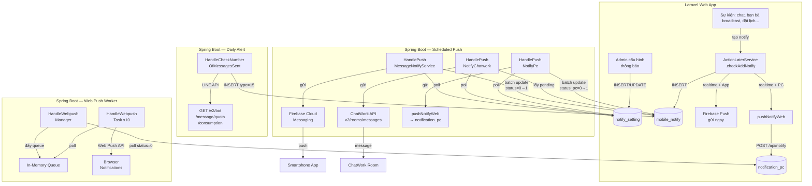

# [FA-006] Cài đặt thông báo — Job Spec

> Phân tích từ source code Spring Boot (`src/job/`).
> Confidence: **Cao** — đọc trực tiếp từ code.

---

## 1. Tổng quan

### Tại sao cần background job?

Tính năng「通知設定」cần background job vì:
1. **Gửi thông báo theo lịch (scheduled)**: Admin cấu hình tần suất nhận thông báo (15 phút, 30 phút, 1 giờ, ... 24 giờ). Job phải poll database định kỳ, gom thông báo và gửi theo batch khi đến thời điểm.
2. **Gửi thông báo qua nhiều kênh song song**: Mỗi kênh (Smartphone App via Firebase, ChatWork API, PC Desktop via Web Push) có logic gửi riêng, cần thread pool riêng.
3. **Kiểm tra cảnh báo số lượng tin nhắn**: Job chạy hàng ngày lúc 1:00 AM, query LINE API lấy số tin nhắn đã gửi trong tháng, so sánh ngưỡng và tạo thông báo cảnh báo.
4. **Xử lý web push notification**: Bảng `notification_pc` nhận records từ Laravel (qua internal API), Spring Boot job poll và gửi web push đến browser subscriptions.

### Kiểu giao tiếp: Database Polling Model

- **Producer**: Laravel web app INSERT records vào bảng `mobile_notify` (queue thông báo) và `notification_pc` (queue web push)
- **Consumer**: Spring Boot chạy `while(true)` loops, poll bảng `notify_setting` theo điều kiện thời gian, xử lý records trong `mobile_notify`, gửi qua external APIs
- **State machine**: `status` / `status_chat_work` / `status_pc` = 0 (chờ gửi) → 1 (đã gửi/đã xử lý)

### Feature Flags (config.properties)

| Flag | Mặc định | Thread/Service khởi tạo | Mô tả |
|------|----------|------------------------|-------|
| `ENABLE_HANDLE_PUSH_MESSAGE_NOTIFY` | 0 (tắt) | `HandlePushMessageNotifyService` | Gửi thông báo qua Smartphone App (Firebase) theo lịch |
| `ENABLE_HANDLE_PUSH_NOTIFY_CHATWORK_TASK` | 0 (tắt) | `HandlePushNotifyChatwork` + `HandlePushNotifyPc` (scheduled) | Gửi thông báo qua ChatWork API + PC Desktop (scheduled) |
| `ENABLE_HANDLE_CHECK_NUMBER_OF_MESSAGES_SENT_CURRENT` | 0 (tắt) | `HandleCheckNumberOfMessagesSentCurrent` | Kiểm tra cảnh báo số lượng tin nhắn hàng ngày |
| `ENABLE_HANDLE_WEB_PUSH` | 0 (tắt) | `HandleWebpushManager` + `HandleWebpushTask` (10 threads) | Gửi web push notification real-time từ bảng `notification_pc` |

> **Lưu ý**: `HandlePushNotifyPc` (xử lý PC scheduled) được khởi tạo cùng flag `ENABLE_HANDLE_PUSH_NOTIFY_CHATWORK_TASK`, không có flag riêng. — **Tin cậy: Cao**

---

## 2. Queue Tables

### 2.1. Bảng `mobile_notify` — Queue thông báo chính

**Vai trò**: Bảng trung gian chứa từng thông báo đơn lẻ. Laravel INSERT record khi có sự kiện (chat mới, bạn bè đăng ký, broadcast hoàn thành, v.v.). Spring Boot poll theo bot_id thông qua bảng `notify_setting`.

**Entity JPA**: `sns.line.models.linedb.entities.MobileNotify`
**File**: `src/job/linect-service/src/main/java/sns/line/models/linedb/entities/MobileNotify.java`

**Repository**: `sns.line.models.linedb.repository.MobileNotifyRepository`
**File**: `src/job/linect-service/src/main/java/sns/line/models/linedb/repository/MobileNotifyRepository.java`

#### Cấu trúc entity

| Cột | Kiểu | Mô tả |
|-----|------|-------|
| `id` | Long (PK, auto) | ID tự tăng |
| `bot_id` | Long | Bot LINE OA liên quan |
| `line_user_id` | Long | User LINE gây ra sự kiện (nullable — null cho system/broadcast/alert) |
| `type` | Integer | Loại thông báo (xem bảng type constants bên dưới) |
| `notify_time` | LocalDateTime | Thời điểm tạo thông báo (mặc định = `now()`) |
| `notify_title` | String | Tiêu đề thông báo |
| `notify_content` | String | Nội dung thông báo (đầy đủ) |
| `notify_content_main` | String | Nội dung chính (ngắn gọn hơn, dùng hiển thị) |
| `notify_badge` | Integer | Badge count (-1 = cập nhật badge tổng) |
| `is_confirm` | Integer | 0 = chưa xác nhận, 1 = đã xác nhận (user đã đọc) |
| `status` | Integer | **0 = chờ gửi App**, 1 = đã gửi App |
| `status_chat_work` | Integer | **0 = chờ gửi ChatWork**, 1 = đã gửi ChatWork |
| `status_pc` | Integer | **0 = chờ gửi PC**, 1 = đã gửi PC |
| `send_number` | Integer | Số lượng gửi (dùng cho broadcast) |
| `action_schedule_id` | Long | ID action schedule liên quan (nullable) |
| `affiliater_id` | Long | ID affiliater liên quan (nullable) |
| `bot_setting_aff_id` | Long | ID cài đặt affiliate bot (nullable) |
| `type_aff` | Integer | Loại affiliate (nullable) |
| `landing_id` | Long | ID landing page / QR code (nullable) |
| `title_message` | String | Tiêu đề tin nhắn (dùng cho broadcast) |
| `setting_value` | Integer | Giá trị ngưỡng cảnh báo (dùng cho delivery count alert) |
| `created_at` | String | Thời gian tạo (DB-managed) |

#### State Machine — 3 kênh độc lập

Mỗi record có **3 status columns** cho 3 kênh gửi. Khi INSERT, mỗi status được set riêng dựa trên cài đặt:

```
status = 0          → Chờ gửi App (Firebase)
status = 1          → Đã gửi App HOẶC App bị tắt (skip)

status_chat_work = 0 → Chờ gửi ChatWork
status_chat_work = 1 → Đã gửi ChatWork HOẶC ChatWork bị tắt (skip)

status_pc = 0       → Chờ gửi PC Desktop
status_pc = 1       → Đã gửi PC HOẶC PC bị tắt (skip)
```

**Logic set status khi INSERT** (trong `ActionLaterService.checkAddNotify()`):
- Nếu kênh bị **tắt** (`*_notification_settings = 1 = DISABLE`) → set status = 1 ngay (skip gửi)
- Nếu kênh **bật** và timing = **realtime** (`schedule = 0`) → gửi ngay + set status = 1
- Nếu kênh **bật** và timing = **scheduled** (`schedule != 0`) → giữ status = 0, chờ job poll

**Tin cậy: Cao** — đọc trực tiếp từ `ActionLaterService.java` dòng 226-266 và `MobileNotify.java` constructor.

#### Type Constants

| Constant | Giá trị | Mô tả | Hạng mục UI tương ứng |
|----------|---------|-------|----------------------|
| `TYPE_CHAT_11` | 1 | Chat 1:1 | 「1:1チャット」 |
| `TYPE_ADD_FRIEND` | 2 | Thêm bạn bè | 「友だち登録情報」 |
| `TYPE_ANSWER_FORM` | 3 | Trả lời form | 「フォーム作成」 |
| `TYPE_EVENT` | 4 | Đặt lịch sự kiện | 「イベント予約」 |
| `TYPE_PAYMENT` | 5 | Thanh toán | 「商品販売」 |
| `TYPE_SYSTEM` | 6 | Hệ thống (lỗi gửi tin, v.v.) | Thông báo hệ thống |
| `TYPE_ADD_FRIEND_QR_CODE` | 12 | Thêm bạn bè qua QR code | 「QRコードアクション」 |
| `TYPE_SEND_ALL` | 13 | Broadcast hoàn thành | 「メッセージ配信」 |
| `TYPE_ACTION_SCHEDULE` | 14 | Action schedule thực thi | 「アクションスケジュール実行」 |
| `TYPE_DELIVERY_COUNT_ALERT` | 15 | Cảnh báo số lượng tin nhắn | 「配信数アラート」 |
| `TYPE_ASP_AFFILIATER` | 16 | Affiliate | 「ASP管理」 |

#### Delivery Count Alert Sub-values (`setting_value`)

| Constant | Giá trị | Ngưỡng |
|----------|---------|--------|
| `DELIVERY_COUNT_ALERT_ALL` | 0 | Chọn tất cả |
| `DELIVERY_COUNT_ALERT_LINE_100` | 1 | LOA >= 100 tin |
| `DELIVERY_COUNT_ALERT_LINE_200` | 2 | LOA >= 200 tin |
| `DELIVERY_COUNT_ALERT_LINE_4000` | 3 | LOA >= 4,000 tin |
| `DELIVERY_COUNT_ALERT_LINE_5000` | 4 | LOA >= 5,000 tin |
| `DELIVERY_COUNT_ALERT_LINE_25000` | 5 | LOA >= 25,000 tin |
| `DELIVERY_COUNT_ALERT_LINE_30000` | 6 | LOA >= 30,000 tin |
| `DELIVERY_COUNT_ALERT_LME_500` | 7 | Elme >= 500 tin |
| `DELIVERY_COUNT_ALERT_LME_1000` | 8 | Elme >= 1,000 tin |

#### Repository Queries

| Method | SQL / Logic | Dùng bởi |
|--------|-----------|---------|
| `updateStatusByBotIdAndStatus(statusNew, botId, statusOld)` | `UPDATE mobile_notify SET status=? WHERE bot_id=? AND status=?` | App scheduled push |
| `updateStatusPcByBotIdAndStatus(statusNew, botId, statusOld)` | `UPDATE mobile_notify SET status_pc=? WHERE bot_id=? AND status_pc=?` | PC scheduled push |
| `updateStatusChatwork(statusNew, botId, statusOld)` | `UPDATE mobile_notify SET status_chat_work=? WHERE bot_id=? AND status_chat_work=?` | ChatWork push |
| `countByBotIdAndStatus(botId, status)` | `COUNT(*) WHERE bot_id=? AND status=?` | Kiểm tra còn pending App |
| `countByBotIdAndStatusPc(botId, status)` | `COUNT(*) WHERE bot_id=? AND status_pc=?` | Kiểm tra còn pending PC |
| `findAllByBotIdAndStatusChatwork(botId, status)` | `SELECT * WHERE bot_id=? AND status_chat_work=?` | Lấy danh sách pending ChatWork |
| `findAllByBotIdAndStatus(botId, status)` | `SELECT * WHERE bot_id=? AND status=?` | Lấy danh sách pending App |
| `findFirstByBotIdAndTypeAndSettingValue...` | `SELECT * WHERE bot_id=? AND type=? AND setting_value=? AND month(notify_time)=? AND year(notify_time)=? ORDER BY id DESC LIMIT 1` | Kiểm tra đã gửi alert trong tháng chưa |

### 2.2. Bảng `notify_setting` — Cấu hình thông báo

**Vai trò**: Lưu cài đặt thông báo của từng bot — kênh nào bật/tắt, tần suất, chi tiết hạng mục. Spring Boot job đọc bảng này để biết khi nào cần gửi và gửi qua kênh nào.

**Entity JPA**: `sns.line.models.linedb.entities.NotifySetting`
**File**: `src/job/linect-service/src/main/java/sns/line/models/linedb/entities/NotifySetting.java`

**Repository**: `sns.line.models.linedb.repository.NotifySettingRepository`
**File**: `src/job/linect-service/src/main/java/sns/line/models/linedb/repository/NotifySettingRepository.java`

#### Các cột quan trọng cho job

| Cột | Kiểu | Mô tả |
|-----|------|-------|
| `app_notification_settings` | Integer | **0 = BẬT** App, 1 = TẮT (logic đảo!) |
| `chatWork_notification_settings` | Integer | **0 = BẬT** ChatWork, 1 = TẮT |
| `pc_notification_settings` | Integer | **0 = BẬT** PC, 1 = TẮT |
| `notification_schedule` | Integer | Tần suất App: 0=realtime, 1=15min, 2=30min, 3=1h, 4=3h, 5=6h, 6=12h, 7=24h |
| `schedule_chat_work` | Integer | Tần suất ChatWork (cùng mapping) |
| `schedule_pc` | Integer | Tần suất PC (cùng mapping) |
| `next_notify_time` | LocalDateTime | Thời điểm gửi tiếp theo cho App |
| `last_notify_time` | LocalDateTime | Thời điểm gửi gần nhất cho App |
| `next_notify_chat_work_time` | LocalDateTime | Thời điểm gửi tiếp theo cho ChatWork |
| `last_notify_chat_work_time` | String | Thời điểm gửi gần nhất cho ChatWork |
| `next_notify_pc_time` | LocalDateTime | Thời điểm gửi tiếp theo cho PC |
| `last_notify_pc_time` | LocalDateTime | Thời điểm gửi gần nhất cho PC |
| `app_total_msg_error` | Integer | Số lỗi tin nhắn đã biết cho App (dùng so sánh incremental) |
| `chat_work_total_msg_error` | Long | Số lỗi tin nhắn đã biết cho ChatWork |
| `pc_total_msg_error` | Long | Số lỗi tin nhắn đã biết cho PC |
| `notification_room_url` | String | URL room ChatWork (chứa room ID) |
| `api_token` | String | ChatWork API token |
| `is_notify_send_error` | Integer | Bật/tắt hạng mục cảnh báo配信数 (1 = bật) |
| `limitMessage` | String | Comma-separated setting values cho delivery count alert |

> **Lưu ý logic đảo**: `*_notification_settings = 0` nghĩa là **BẬT**, `= 1` nghĩa là **TẮT**. Đây là thiết kế ban đầu, Laravel controller đảo giá trị khi trả về frontend. — **Tin cậy: Cao**

#### Polling Queries (điều kiện SELECT)

| Method | SQL | Mô tả |
|--------|-----|-------|
| `selectAppNotificationSettings()` | `WHERE app_notification_settings=0 AND notification_schedule!=0 AND (next_notify_time IS NULL OR next_notify_time<=now())` | Lấy bot cần gửi App scheduled |
| `selectChatworkNotifySetting()` | `WHERE chatWork_notification_settings=0 AND notification_room_url IS NOT NULL AND (next_notify_chat_work_time IS NULL OR next_notify_chat_work_time<=now())` | Lấy bot cần gửi ChatWork |
| `selectPcNotificationSettings()` | `WHERE pc_notification_settings=0 AND schedule_pc!=0 AND (next_notify_pc_time IS NULL OR next_notify_pc_time<=now())` | Lấy bot cần gửi PC scheduled |

### 2.3. Bảng `notification_pc` — Queue Web Push

**Vai trò**: Queue cho web push notification (PC desktop). Laravel INSERT record qua internal API `POST /api/notify/push-notify`, Spring Boot poll và gửi qua Web Push API.

**Entity JPA**: `sns.line.models.linedb.entities.NotificationPc`
**File**: `src/job/linect-service/src/main/java/sns/line/models/linedb/entities/NotificationPc.java`

#### Cấu trúc entity

| Cột | Kiểu | Mô tả |
|-----|------|-------|
| `id` | Long (PK, auto) | ID |
| `user_id` | Long | Admin user ID |
| `bot_id` | Long | Bot ID |
| `title` | String | Tiêu đề notification |
| `content` | String | Nội dung notification |
| `status` | Integer | 0=NEW, 1=RUNNING, 2=DONE, 3=FALSE (lỗi) |
| `created_at` | String | Thời gian tạo |

#### State Machine

```
STATUS_NEW (0) → STATUS_RUNNING (1) → STATUS_DONE (2)
                                    → STATUS_FALSE (3) — lỗi
```

---

## 3. Task Managers & Thread Services

### 3.1. HandlePushMessageNotifyService — Gửi thông báo App (Firebase)

**File**: `src/job/linect-service/src/main/java/sns/line/threads/notify/HandlePushMessageNotifyService.java`
**Khởi tạo bởi**: `AppMain.startHandlePushMessageNotifyApp()` khi `ENABLE_HANDLE_PUSH_MESSAGE_NOTIFY = true`
**Thread**: 1 thread trong `ExecutorService` chung

#### Polling Logic

```
while(true):
  1. Query: selectAppNotificationSettings()
     → Điều kiện: app_notification_settings=0 AND notification_schedule!=0
                   AND (next_notify_time IS NULL OR next_notify_time <= now())
  2. Với mỗi NotifySetting record:
     a. Skip nếu botId=null hoặc bot không tồn tại → cập nhật next_notify_time += schedule interval
     b. Nếu notification_schedule != 0 (có lịch):
        - Tính timeSchedule = last_notify_time + schedule interval
        - Nếu now() >= timeSchedule (đến giờ gửi):
          i.  Kiểm tra message_error mới (countMsgError > appTotalMsgError)
              → Nếu có lỗi mới → INSERT mobile_notify record TYPE_SYSTEM (type=6)
          ii. Đếm mobile_notify chưa gửi (status=0 cho bot_id này)
              → Nếu > 0: UPDATE ALL status=0 → status=1 (batch mark done)
              → Gửi Firebase push: "新しい通知があります。アプリからご確認ください。"
              → Cập nhật bots.count_app_notify
        - Cập nhật last_notify_time = now(), next_notify_time = now() + schedule interval
  3. Sleep 60 giây
  4. Nếu exception → sleep 30 giây rồi tiếp tục
```

#### Schedule Interval Mapping

| Giá trị `notification_schedule` | Khoảng cách |
|---------------------------------|-------------|
| 0 | Realtime (không dùng scheduled job — gửi ngay từ `ActionLaterService`) |
| 1 | 15 phút |
| 2 | 30 phút |
| 3 | 1 giờ |
| 4 | 3 giờ |
| 5 | 6 giờ |
| 6 | 12 giờ |
| 7 | 24 giờ |

**Tin cậy: Cao**

---

### 3.2. HandlePushNotifyChatwork — Gửi thông báo ChatWork

**File**: `src/job/linect-service/src/main/java/sns/line/threads/notify/HandlePushNotifyChatwork.java`
**Khởi tạo bởi**: `AppMain.startHandlePushNotifyChatwork()` khi `ENABLE_HANDLE_PUSH_NOTIFY_CHATWORK_TASK = true`
**Thread**: 1 thread trong `ExecutorService` chung

#### Polling Logic

```
while(true):
  1. Query: selectChatworkNotifySetting()
     → Điều kiện: chatWork_notification_settings=0 AND notification_room_url IS NOT NULL
                   AND (next_notify_chat_work_time IS NULL OR next_notify_chat_work_time <= now())
  2. Với mỗi NotifySetting record:
     a. Skip nếu scheduleChatwork=null hoặc notification_room_url rỗng → cập nhật next time
     b. Skip nếu bot không tồn tại → cập nhật next time
     c. Tính timeSchedule = last_notify_chat_work_time + schedule interval
     d. Nếu now() >= timeSchedule:
        i.   Kiểm tra message_error mới → INSERT mobile_notify TYPE_SYSTEM nếu có lỗi mới
        ii.  Lấy danh sách mobile_notify chưa gửi ChatWork (status_chat_work=0)
        iii. Trích roomId từ notification_room_url bằng regex "rid(?<res>[0-9]*)"
        iv.  Với mỗi notify record:
             - Nếu quá 24h → mark done (auto-expire)
             - Build nội dung theo type (format prefix khác nhau cho từng loại)
        v.   Gom tất cả nội dung thành 1 message, gửi qua ChatWork API
        vi.  Nếu thành công (response=1):
             → UPDATE ALL status_chat_work=0 → 1
             → Cập nhật last + next time + totalMsgError
        vii. Nếu lỗi 403: mark done + cập nhật time (skip — token/room invalid)
        viii.Nếu lỗi 429: sleep 1 giây (rate limit)
        ix.  Lỗi khác: mark done + cập nhật time
  3. Sleep 60 giây
  4. Nếu exception → sleep 30 giây rồi tiếp tục
```

#### ChatWork API Call

- **Endpoint**: ChatWork API v2 — `POST /v2/rooms/{roomId}/messages`
- **Header**: `X-ChatWorkToken` = `api_token` từ DB hoặc fallback `ConfigFile.TOKEN_API_BOT_CHATWORK`
- **Body**: `body` = nội dung gom từ tất cả pending notifications
- **Token**: Ưu tiên API token riêng của bot (lưu trong `notify_setting.api_token`), fallback về token chung hệ thống

#### Nội dung tin nhắn ChatWork theo Type

| Type | Format nội dung |
|------|----------------|
| `TYPE_ADD_FRIEND` (2) | `【{botName}】{userName}{notifyContentMain}` |
| `TYPE_ADD_FRIEND_QR_CODE` (12) | `【{botName}】[QRコードアクション] {userName}{notifyContentMain}` |
| `TYPE_CHAT_11` (1) | `【{botName}】{userName}{notifyContentMain}` |
| `TYPE_SEND_ALL` (13) | `【{botName}】[メッセージ配信が行われました] {notifyContentMain}` |
| `TYPE_ACTION_SCHEDULE` (14) | `【{botName}】[アクションスケジュール実行] {notifyContentMain}` |
| `TYPE_ASP_AFFILIATER` (16) | `【{botName}】{notifyContentMain}` |
| `TYPE_DELIVERY_COUNT_ALERT` (15) | `【{botName}】{notifyContentMain}` |
| Mặc định | `【{botName}】{userName}{notifyContentMain}` |

**Tin cậy: Cao**

---

### 3.3. HandlePushNotifyPc — Gửi thông báo PC Desktop (scheduled)

**File**: `src/job/linect-service/src/main/java/sns/line/threads/notify/HandlePushNotifyPc.java`
**Khởi tạo bởi**: `AppMain.startHandlePushNotifyChatwork()` — cùng method với ChatWork, khi `ENABLE_HANDLE_PUSH_NOTIFY_CHATWORK_TASK = true`
**Thread**: 1 thread trong `ExecutorService` chung

#### Polling Logic

```
while(true):
  1. Query: selectPcNotificationSettings()
     → Điều kiện: pc_notification_settings=0 AND schedule_pc!=0
                   AND (next_notify_pc_time IS NULL OR next_notify_pc_time <= now())
  2. Với mỗi NotifySetting record:
     a. Skip nếu botId=null hoặc bot không tồn tại → cập nhật next_notify_pc_time
     b. Nếu schedule_pc != 0 (có lịch):
        - Tính timeSchedule = last_notify_pc_time + schedule interval
        - Nếu now() >= timeSchedule:
          i.  Kiểm tra message_error mới → INSERT mobile_notify TYPE_SYSTEM nếu có lỗi mới
          ii. Đếm mobile_notify chưa gửi PC (status_pc=0)
              → Nếu > 0: UPDATE ALL status_pc=0 → 1 (batch mark done)
              → Gọi LineModel.pushNotifyWeb(): gửi Web Push đến tất cả browser subscriptions
                 Nội dung: "新しい通知があります。アプリからご確認ください。"
        - Cập nhật last_notify_pc_time = now(), next_notify_pc_time = now() + schedule interval
  3. Sleep 60 giây
  4. Nếu exception → sleep 30 giây rồi tiếp tục
```

**Tin cậy: Cao**

---

### 3.4. HandleCheckNumberOfMessagesSentCurrent — Cảnh báo số lượng tin nhắn

**File**: `src/job/linect-service/src/main/java/sns/line/task/HandleCheckNumberOfMessagesSentCurrent.java`
**Khởi tạo bởi**: `AppMain` khi `ENABLE_HANDLE_CHECK_NUMBER_OF_MESSAGES_SENT_CURRENT = true`
**Thread**: `Timer` schedule chạy hàng ngày lúc 1:00 AM + 3 worker threads + 1 thread lấy bots

#### Luồng xử lý

```
Timer lên lịch chạy lúc 01:00 mỗi ngày:
  1. startJobGetBot():
     - Query tất cả bots (findTop500, phân trang theo id ASC)
     - Đẩy vào Queue<Bot>
  2. doHandleCheckNumMessage() — 3 threads song song:
     - Poll từ Queue<Bot>
     - Với mỗi bot:
       a. numberMessageSentInMonth(bot):
          → Gọi LINE API: GET /v2/bot/message/quota/consumption
          → Header: "Bearer {channelAccessToken}"
          → Parse response → totalUsage (số tin nhắn đã gửi trong tháng)
          → Nếu token hết hạn → refresh token rồi retry
       b. Cập nhật bots.message_sent_count + count_user_confirm
       c. insertNotifyCountMessage(logThread, numberMessageSend, bot, from=2):
          → Xác định ngưỡng cảnh báo theo countNumber:
             100-199   → LINE_100: "[LOA配信数が100通に達しました]..."
             200-3999  → LINE_200: "[LOA配信数が200通に達しました]..."
             4000-4999 → LINE_4000
             5000-24999→ LINE_5000
             25000-29999→ LINE_25000
             30000+    → LINE_30000
          → Kiểm tra đã gửi alert loại này trong tháng chưa
             (findFirstByBotIdAndTypeAndSettingValue...month/year)
          → Nếu chưa gửi → INSERT mobile_notify type=15 (DELIVERY_COUNT_ALERT)
          → Gọi insertMobileNotify():
             * Đọc notify_setting → kiểm tra kênh nào bật
             * Kiểm tra is_notify_send_error=1 và limitMessage chứa settingValue
             * Set status cho từng kênh (bật → 0, tắt → 1)
             * Save mobile_notify
             * Nếu App bật + realtime → gửi Firebase ngay
             * Nếu PC bật + realtime → gửi Web Push ngay
             * Cập nhật bots.count_app_notify
```

#### External API Call — LINE Messaging API

- **Endpoint**: `GET /v2/bot/message/quota/consumption`
- **Header**: `Authorization: Bearer {channelAccessToken}`
- **Response**: `{"totalUsage": N}` — số tin nhắn đã gửi trong tháng hiện tại
- **Retry**: Nếu token expired → gọi `BotManager.refreshToken(bot)` rồi retry 1 lần

**Tin cậy: Cao**

---

### 3.5. HandleWebpushManager + HandleWebpushTask — Gửi Web Push real-time

**File Manager**: `src/job/linect-service/src/main/java/sns/line/threads/notify/HandleWebpushManager.java`
**File Task**: `src/job/linect-service/src/main/java/sns/line/threads/notify/HandleWebpushTask.java`
**Khởi tạo bởi**: `AppMain.startHandleWebpushManager()` khi `ENABLE_HANDLE_WEB_PUSH = true`
**Thread**: 1 thread manager + **10 worker threads** (`numberThread = 10`)

#### Luồng xử lý

```
HandleWebpushManager:
  1. Resume: Lấy records status=RUNNING (1) từ notification_pc → đẩy vào queue
  2. Khởi tạo 10 HandleWebpushTask threads
  3. startJobPushToQueue() — polling loop:
     while(true):
       - Nếu queue size > 200 → sleep 1 giây (back-pressure)
       - Query: findTop100ByStatus(STATUS_NEW=0)
       - UPDATE status = RUNNING (1)
       - Đẩy vào Queue<NotificationPc>
       - Nếu không có record mới → sleep 500ms

HandleWebpushTask (mỗi thread):
  while(true):
    - Poll 1 record từ Queue<NotificationPc>
    - Nếu có: gọi actionPushPc(notificationPc):
      → LineModel.webPushPc(userId, botId, title, content)
      → UPDATE status = DONE (2)
    - Nếu queue rỗng → sleep 2 giây
    - Exception → sleep 60 giây + gửi report ChatWork (room 316148419)
```

#### Web Push — LineModel.webPushPc()

**File**: `src/job/linect-service/src/main/java/sns/line/models/line/LineModel.java` (dòng 281-318)

```
webPushPc(adminId, botId, title, content):
  1. Build payload JSON: PushNotifyPcBody(botId, title, content)
  2. Lấy push_subscriptions cho Admin: findAllBySubscribableId(adminId)
  3. Lấy push_subscriptions cho Staff: findAllByBotIdAndStatusAndIsAdmin(botId, 1, 0)
     → Mỗi Staff → findAllBySubscribableId(userInviteId)
  4. Với mỗi PushSubscription:
     - Skip nếu authToken=null hoặc status=FALSE
     - Gửi: WebPushNotificationService.sendPushNotifyPC(botId, id, endpoint, publicKey, authToken, payload)
     - Nếu lỗi (expired/invalid subscription) → UPDATE status=FALSE, lưu messageError
```

**Bảng liên quan**: `push_subscriptions` (endpoint, public_key, auth_token, subscribable_id, status)

**Tin cậy: Cao**

---

### 3.6. ActionLaterService — Xử lý thông báo real-time (đồng bộ)

**File**: `src/job/linect-service/src/main/java/sns/line/helper/ActionLaterService.java`
**Vai trò**: Xử lý thông báo khi timing = **realtime** (schedule = 0). Không phải polling loop — được gọi từ các task managers khác khi có sự kiện.

#### Method: checkAddNotify()

```
checkAddNotify(taskUniqueKey, bot, conversationId, mobileNotify, type, value, lineUserName):
  1. Đọc notify_setting cho bot
  2. Kiểm tra ít nhất 1 kênh bật (app/chatwork/pc)
  3. Switch theo type:
     - TYPE_ADD_FRIEND → kiểm tra setting value trong addFriends
     - TYPE_ADD_FRIEND_QR_CODE → kiểm tra setting value trong whenAddFriends
     - TYPE_CHAT_11 → kiểm tra setting value trong chat11
     - TYPE_SEND_ALL → kiểm tra setting value trong sendAll
     - TYPE_ACTION_SCHEDULE → kiểm tra setting value trong actionSchedule
     - TYPE_AFFILIATER_AUTO_ACCEPT → kiểm tra setting value trong asp
     - TYPE_MESSAGE_LME_LIMIT → kiểm tra setting value trong limitMessage
  4. hasSetting(): split comma-separated string, kiểm tra value có trong danh sách
  5. Nếu có setting match:
     a. Set status=1 cho kênh đã tắt (skip)
     b. Save mobile_notify
     c. Nếu App bật + realtime (schedule=0) + type != CHAT_11:
        → Gửi Firebase ngay: sentNotifyv2()
        → Set status=1, cập nhật lastNotifyTime
     d. Nếu PC bật + realtime (schedule_pc=0) + type != CHAT_11:
        → Gửi Web Push ngay: pushNotifyWeb()
        → Set status_pc=1, cập nhật lastNotifyTimePc
```

> **Lưu ý**: Chat 1:1 (TYPE_CHAT_11) được xử lý đặc biệt — khi realtime, KHÔNG gửi push App/PC ngay từ `checkAddNotify()`. Lý do: tránh gửi quá nhiều notification cho mỗi tin nhắn chat. Chat 1:1 realtime được xử lý ở nơi khác (có thể là qua Firebase topic subscription trực tiếp). — **Tin cậy: Trung bình** (suy luận từ code, chưa xác nhận hoàn toàn)

---

## 4. Processing Chain

### 4.1. Luồng Scheduled (timing != realtime)

```
[Sự kiện trên Web App]
    │
    ▼
[Laravel Controller] ← ghi record
    │
    ├── INSERT mobile_notify (status=0, status_chat_work=0, status_pc=0)
    │   thông qua ActionLaterService.checkAddNotify() → save()
    │
    └── UPDATE notify_setting (last_notify_time, next_notify_time nếu thay đổi timing)

    ║ (chờ đến next_notify_time)
    ▼

[HandlePushMessageNotifyService] ← poll notify_setting
    │  Điều kiện: app_notification_settings=0 AND schedule!=0 AND next_notify_time<=now()
    │
    ├── Kiểm tra message_error mới → INSERT mobile_notify TYPE_SYSTEM nếu có
    ├── UPDATE mobile_notify SET status=1 WHERE bot_id=? AND status=0 (batch)
    ├── Firebase: sentNotifyv2() → "新しい通知があります。アプリからご確認ください。"
    └── UPDATE notify_setting (last_notify_time, next_notify_time)

[HandlePushNotifyChatwork] ← poll notify_setting
    │  Điều kiện: chatWork_notification_settings=0 AND room_url IS NOT NULL AND next_chat_work_time<=now()
    │
    ├── Lấy danh sách mobile_notify (status_chat_work=0)
    ├── Build nội dung gom
    ├── ChatWork API: POST /v2/rooms/{roomId}/messages
    ├── UPDATE mobile_notify SET status_chat_work=1 (batch)
    └── UPDATE notify_setting (last + next chat_work time)

[HandlePushNotifyPc] ← poll notify_setting
    │  Điều kiện: pc_notification_settings=0 AND schedule_pc!=0 AND next_pc_time<=now()
    │
    ├── Kiểm tra message_error mới → INSERT mobile_notify TYPE_SYSTEM nếu có
    ├── UPDATE mobile_notify SET status_pc=1 WHERE bot_id=? AND status_pc=0 (batch)
    ├── Web Push: LineModel.pushNotifyWeb() → "新しい通知があります。アプリからご確認ください。"
    └── UPDATE notify_setting (last_notify_pc_time, next_notify_pc_time)
```

### 4.2. Luồng Realtime (timing = 0)

```
[Sự kiện trên Web App / Spring Boot task]
    │
    ▼
[ActionLaterService.checkAddNotify()]
    │
    ├── Đọc notify_setting → kiểm tra kênh bật + setting match
    ├── INSERT mobile_notify (set status theo kênh)
    │
    ├── Nếu App bật + schedule=0 + type!=CHAT_11:
    │   → Firebase: sentNotifyv2() → gửi ngay
    │   → Set status=1
    │
    ├── Nếu PC bật + schedule_pc=0 + type!=CHAT_11:
    │   → LineModel.pushNotifyWeb() → gửi ngay (HOẶC insert notification_pc → HandleWebpushManager)
    │   → Set status_pc=1
    │
    └── ChatWork: KHÔNG gửi realtime từ checkAddNotify()
        → Chờ HandlePushNotifyChatwork scheduled poll
```

### 4.3. Luồng Delivery Count Alert (hàng ngày)

```
[Timer 01:00 AM mỗi ngày]
    │
    ▼
[HandleCheckNumberOfMessagesSentCurrent]
    │
    ├── startJobGetBot() → queue tất cả bots
    ├── 3 worker threads:
    │   ├── LINE API: GET /v2/bot/message/quota/consumption → totalUsage
    │   ├── Xác định ngưỡng (100, 200, 4000, 5000, 25000, 30000, LME 500, LME 1000)
    │   ├── Kiểm tra đã gửi alert trong tháng chưa
    │   ├── Đọc notify_setting → kiểm tra is_notify_send_error=1 + limitMessage chứa value
    │   ├── INSERT mobile_notify type=15 (DELIVERY_COUNT_ALERT)
    │   │
    │   ├── Nếu App bật + realtime → Firebase gửi ngay
    │   ├── Nếu PC bật + realtime → Web Push gửi ngay
    │   └── Nếu scheduled → chờ scheduled jobs poll
    │
    └── Cập nhật bots.message_sent_count + count_user_confirm
```

### 4.4. Luồng Web Push (notification_pc)

```
[LineModel.pushNotifyWeb()] ← gọi từ scheduled jobs hoặc realtime
    │
    ├── Gọi Laravel internal API: POST /api/notify/push-notify
    │   Body: {notifyTitle, notifyContent, botId}
    │
    └── Laravel: INSERT notification_pc (status=0)

    ║
    ▼

[HandleWebpushManager] ← poll notification_pc
    │
    ├── Query: findTop100ByStatus(STATUS_NEW=0)
    ├── UPDATE status = RUNNING (1)
    ├── Đẩy vào Queue (in-memory)
    │
    └── [HandleWebpushTask] ← 10 worker threads
        ├── Poll từ queue
        ├── LineModel.webPushPc(userId, botId, title, content)
        │   → WebPushNotificationService.sendPushNotifyPC() → W3C Push API
        └── UPDATE status = DONE (2)
```

> **Phân biệt 2 loại PC push**: (1) `pushNotifyWeb()` = gọi Laravel API, INSERT `notification_pc` → chờ `HandleWebpushManager` xử lý. (2) `webPushPc()` = gửi trực tiếp qua Web Push API đến browser subscriptions. Luồng chính dùng pushNotifyWeb → HandleWebpushManager. — **Tin cậy: Cao**

---

## 5. Data Flow Diagram



---

## 6. External API Calls

| # | API | Endpoint | Gọi từ | Mục đích | Tin cậy |
|---|-----|----------|--------|----------|---------|
| 1 | **Firebase Cloud Messaging** | FCM topic push | `FirebaseMessagingModel.sentNotifyv2()` | Gửi push notification đến smartphone app (topic = `TOPIC + botId`) | **Cao** |
| 2 | **ChatWork API v2** | `POST /v2/rooms/{roomId}/messages` | `HandlePushNotifyChatwork.pushNotifyChatWorkJob()` | Gửi tin nhắn thông báo vào ChatWork room | **Cao** |
| 3 | **LINE Messaging API** | `GET /v2/bot/message/quota/consumption` | `HandleCheckNumberOfMessagesSentCurrent.numberMessageSentInMonth()` | Lấy số tin nhắn đã gửi trong tháng để so sánh ngưỡng cảnh báo | **Cao** |
| 4 | **W3C Web Push API** | Push endpoint (per subscription) | `WebPushNotificationService.sendPushNotifyPC()` | Gửi web push notification đến browser (PC desktop) | **Cao** |
| 5 | **Laravel Internal API** | `POST /api/notify/push-notify` | `LineModel.pushNotifyWeb()` | Gọi từ Spring Boot → Laravel để INSERT record vào `notification_pc` | **Cao** |

---

## 7. Error Handling

| Tình huống | Xử lý | Service |
|-----------|-------|---------|
| Bot không tồn tại (null) | Skip, cập nhật next_notify_time += interval, log warning | Tất cả scheduled jobs |
| BotId = null trong notify_setting | Skip, cập nhật next_notify_time, log | Tất cả scheduled jobs |
| Exception trong main loop | `catch(Exception)` → log error → sleep 30 giây → tiếp tục while(true) | Tất cả scheduled jobs |
| Normal iteration sleep | Sleep 60 giây giữa các vòng poll | `HandlePushMessageNotifyService`, `HandlePushNotifyChatwork`, `HandlePushNotifyPc` |
| ChatWork API trả 403 | Mark done (skip) + cập nhật time — token/room invalid | `HandlePushNotifyChatwork` |
| ChatWork API trả 429 | Sleep 1 giây rồi retry (rate limit) | `HandlePushNotifyChatwork` |
| ChatWork API trả mã lỗi khác | Mark done + cập nhật time | `HandlePushNotifyChatwork` |
| Thông báo ChatWork quá 24h | Auto-expire: mark `status_chat_work=1` (bỏ qua) | `HandlePushNotifyChatwork` |
| Web Push subscription expired/invalid | UPDATE `push_subscriptions.status=FALSE`, lưu messageError | `LineModel.webPushPc()` |
| HandleWebpushTask exception | Log error → gửi report ChatWork (room 316148419) → sleep 60 giây | `HandleWebpushTask` |
| LINE API token expired | `BotManager.refreshToken(bot)` → retry 1 lần | `HandleCheckNumberOfMessagesSentCurrent` |
| Chuẩn bị reboot (`isPrepareStop`) | Dừng while(true) loop an toàn, return | Tất cả services |

---

## 8. Liên kết với Web App

### Action trên Web → Queue Table → Job → Kết quả

| Action trên Web (Laravel) | Queue Table | Record tạo | Job xử lý | Kênh gửi |
|--------------------------|-------------|-----------|-----------|----------|
| Admin toggle ON/OFF phương tiện (EP-03) | `notify_setting` | UPDATE toggle + `mobile_notify.status` nếu bật lại | Scheduled jobs đọc notify_setting | Thay đổi kênh cho batch tiếp theo |
| Admin thay đổi timing (EP-03) | `notify_setting` | UPDATE schedule + next_notify_*_time | Scheduled jobs check next_time | Thay đổi khoảng cách gửi |
| Admin toggle ON/OFF hạng mục (EP-04) | `notify_setting` | UPDATE is_notify_* + detail fields | `ActionLaterService.checkAddNotify()` đọc khi kiểm tra | Filter sự kiện nào tạo thông báo |
| Sự kiện: Chat 1:1 nhận tin nhắn | `mobile_notify` | INSERT type=1 (CHAT_11) | Realtime → Firebase/WebPush; Scheduled → batch poll | App, PC (ChatWork luôn scheduled) |
| Sự kiện: Bạn bè mới đăng ký | `mobile_notify` | INSERT type=2 (ADD_FRIEND) | Tương tự trên | App, ChatWork, PC |
| Sự kiện: Broadcast hoàn thành | `mobile_notify` | INSERT type=13 (SEND_ALL) | `SentMessageService` → `ActionLaterService` | App, ChatWork, PC |
| Sự kiện: Action schedule thực thi | `mobile_notify` | INSERT type=14 (ACTION_SCHEDULE) | `ActionScheduleBotTask` → `ActionLaterService` | App, ChatWork, PC |
| Cảnh báo số lượng tin nhắn (hàng ngày) | `mobile_notify` | INSERT type=15 (DELIVERY_COUNT_ALERT) | `HandleCheckNumberOfMessagesSentCurrent` | App, ChatWork, PC |
| Admin cài đặt ChatWork (EP-11, EP-12) | `notify_setting` | UPDATE notification_room_url, api_token | `HandlePushNotifyChatwork` dùng khi gửi | ChatWork |
| Admin đăng ký Web Push (EP-16) | `push_subscriptions` | INSERT subscription | `HandleWebpushTask` → `webPushPc()` | PC Desktop |

### Khi Admin bật lại phương tiện đã tắt

Laravel `NotifySettingController.saveNotifySettingReceive()` (EP-03) thực hiện:
1. Nếu ChatWork **tắt → bật**: `UPDATE mobile_notify SET status_chat_work=1 WHERE bot_id=? AND status_chat_work=?` (reset pending records cho ChatWork)
2. Nếu Smartphone **tắt → bật**: `UPDATE mobile_notify SET status=1 WHERE bot_id=? AND status=?` (reset pending records cho App)

> Điều này có nghĩa: khi bật lại kênh, các thông báo cũ đang pending sẽ được **mark done** (không gửi lại), chỉ thông báo mới từ thời điểm bật mới được gửi. — **Tin cậy: Cao**

---

## 9. Bảng tổng hợp files đã phân tích

| File | Vai trò | Dòng đọc |
|------|---------|---------|
| `src/job/.../AppMain.java` | Entry point, khởi tạo theo feature flags | 221-291, 533-534, 812-822 |
| `src/job/.../ConfigFile.java` | Feature flags | 115-118, 257-269 |
| `src/job/.../threads/notify/HandlePushMessageNotifyService.java` | Gửi App (Firebase) scheduled | Toàn bộ (147 dòng) |
| `src/job/.../threads/notify/HandlePushNotifyChatwork.java` | Gửi ChatWork scheduled | Toàn bộ (234 dòng) |
| `src/job/.../threads/notify/HandlePushNotifyPc.java` | Gửi PC Desktop scheduled | Toàn bộ (149 dòng) |
| `src/job/.../threads/notify/HandleWebpushManager.java` | Manager poll notification_pc | Toàn bộ (78 dòng) |
| `src/job/.../threads/notify/HandleWebpushTask.java` | Worker gửi web push | Toàn bộ (61 dòng) |
| `src/job/.../task/HandleCheckNumberOfMessagesSentCurrent.java` | Cảnh báo配信数 hàng ngày | Toàn bộ (371 dòng) |
| `src/job/.../helper/ActionLaterService.java` | checkAddNotify — xử lý realtime | 155-284 |
| `src/job/.../models/objects/PriorityTask.java` | Task wrapper cho priority queue | 81-87 |
| `src/job/.../models/objects/TypeOfNotificationKey.java` | Constants loại thông báo | Toàn bộ (13 dòng) |
| `src/job/.../models/linedb/entities/MobileNotify.java` | Entity bảng mobile_notify | Toàn bộ (230 dòng) |
| `src/job/.../models/linedb/entities/NotifySetting.java` | Entity bảng notify_setting | Toàn bộ (285 dòng) |
| `src/job/.../models/linedb/entities/NotificationPc.java` | Entity bảng notification_pc | Toàn bộ (85 dòng) |
| `src/job/.../models/linedb/repository/MobileNotifyRepository.java` | Repository mobile_notify | Toàn bộ (47 dòng) |
| `src/job/.../models/linedb/repository/NotifySettingRepository.java` | Repository notify_setting | Toàn bộ (74 dòng) |
| `src/job/.../models/FirebaseMessagingModel.java` | Firebase Cloud Messaging | 134-178 |
| `src/job/.../models/line/LineModel.java` | pushNotifyWeb + webPushPc | 265-318 |
| `src/job/.../helper/SentMessageService.java` | Tạo MobileNotify cho broadcast | 60-77 |
| `src/job/.../values/Constants.java` | NotificationPc status constants | 97-102 |

---

## 10. Điểm chưa rõ / Cần xác minh

| # | Nội dung | Mức độ | Ghi chú |
|---|---------|--------|---------|
| 1 | Chat 1:1 realtime: code bỏ qua Firebase push trong `checkAddNotify()` — cơ chế gửi realtime cho chat 1:1 có thể nằm ở phần khác (HandlePostbackTask hoặc Firebase topic subscription) | Trung bình | Cần trace thêm `HandlePostbackTask` phần xử lý chat message |
| 2 | Elme delivery count alert (`from=1`): code có nhánh `from != 2` cho Elme limits (500, 1000 tin) nhưng không thấy nơi gọi với `from=1` trong task hiện tại | Trung bình | Có thể được gọi từ task khác hoặc chưa kích hoạt |
| 3 | `pushNotifyWeb()` gọi Laravel API `POST /api/notify/push-notify` → INSERT `notification_pc` — luồng này gián tiếp qua HTTP call, có thể có latency | Thấp | Thiết kế chấp nhận được cho batch notification |
| 4 | ChatWork scheduled job KHÔNG gửi realtime từ `checkAddNotify()` — tất cả ChatWork notification đều phải chờ scheduled poll | Thấp | Đúng với mô tả UI "30秒~1分程度通知が遅れる場合があります" |
| 5 | `HandlePushNotifyPc` dùng chung flag với `HandlePushNotifyChatwork` (`ENABLE_HANDLE_PUSH_NOTIFY_CHATWORK_TASK`) — không thể bật/tắt riêng PC scheduled | Thấp | Thiết kế cố ý — 2 service luôn chạy cùng nhau |
