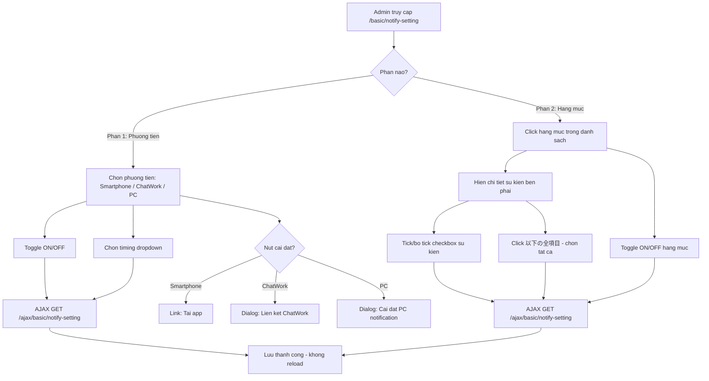

# [FA-006] Cai dat thong bao — UI Spec

## Tong quan
- **Ma tinh nang**: FA-006
- **Ten**: Cai dat thong bao
- **Ten JP**: 「通知設定」
- **Mo ta**: Cho phep Admin cau hinh cach thuc nhan thong bao tu he thong LME. Gom 2 phan chinh: (1) chon phuong tien nhan thong bao (smartphone app, ChatWork, PC desktop) va cau hinh tan suat; (2) chon cac hang muc thong bao cu the (chat, ban be, dat lich, ban hang, v.v.) voi chi tiet tung loai su kien.
- **Portal**: Admin
- **URL pattern**: `/basic/notify-setting`

## Doi tuong su dung (Actors)
| Actor | Vai tro | Quyen truy cap |
|-------|---------|----------------|
| Admin | Quan ly LINE Official Account, cau hinh thong bao cho tai khoan | Toan quyen — bat/tat tat ca phuong tien va hang muc thong bao |
| Staff | Nhan vien do Admin tao, truy cap cung portal | Tuy role — can xac minh co duoc phep truy cap「通知設定」khong |

## Cac man hinh

### SCR-NTF-01: Cai dat thong bao (trang chinh)
- **URL**: `/basic/notify-setting`
- **Tieu de trang**: 「通知設定（一覧）」
- **Screenshot**: `screenshots/SCR-NTF-01-main.png`

#### Layout tong the
- **Header**: Tieu de「通知設定」ben trai, link「マニュアル」(icon + text, tro den `https://lme.jp/manual/notification/`) ben phai
- **Phan 1 — Chon phuong tien thong bao**: Tieu de「1.通知を受け取る媒体を選択してください」, ghi chu canh bao「※ チャットワーク・PCデスクトップ通知は、30秒~1分程度通知が遅れる場合があります。」, theo sau la bang 4 cot
- **Phan 2 — Chon hang muc thong bao**: Tieu de「2.通知を受け取る項目を選択してください（通知項目は上記の通知先に対して共通設定です）」, theo sau la bang 2 cot voi panel chi tiet ben phai
- **Khong co nut "Luu"** rieng biet — cac thay doi duoc luu tu dong khi toggle (goi AJAX moi lan thay doi)

#### Thanh cong cu / Header actions
| Vi tri | Element | Text JP | Loai | Hanh vi |
|--------|---------|---------|------|---------|
| Phai tren | Link | 「マニュアル」 | Link ngoai | Mo trang huong dan tai `https://lme.jp/manual/notification/` |

#### Bang 1: Phuong tien thong bao (通知先)

**Cot bang:**

| # | Cot | Text JP | Kieu du lieu | Mo ta |
|---|-----|---------|-------------|-------|
| 1 | Phuong tien | 「通知先」 | Text + Icon | Ten phuong tien nhan thong bao, kem icon |
| 2 | Nhan thong bao | 「通知受け取り」 | Toggle ON/OFF | Bat/tat nhan thong bao qua phuong tien nay |
| 3 | Thoi gian thong bao | 「通知タイミング」 | Dropdown (select) | Tan suat nhan thong bao |
| 4 | Cai dat | 「各種設定」 | Button/Link | Hanh dong cau hinh them cho phuong tien |

**Du lieu 3 dong:**

| # | Phuong tien (JP) | Icon | Toggle mac dinh | Timing mac dinh | Nut cai dat |
|---|-----------------|------|----------------|-----------------|-------------|
| 1 | 「スマートフォンアプリ」 | Icon smartphone (mau xanh la) | ON (checked) | 「リアルタイム」 | 「ダウンロード」— link den `https://lme.jp/manual/application/` |
| 2 | 「ChatWork（チャットワーク）」 | Icon ChatWork (mau do) | ON (checked) | 「リアルタイム」 | 「連携設定」— button, mo cai dat lien ket ChatWork |
| 3 | 「PCデスクトップ」 | Icon PC (mau xanh duong) | ON (checked) | 「リアルタイム」 | 「PC設定」— button, mo cai dat PC desktop notification |

**Dropdown 「通知タイミング」 — cac gia tri (chung cho ca 3 phuong tien):**

| # | Gia tri JP | Y nghia |
|---|-----------|---------|
| 1 | 「リアルタイム」 | Thoi gian thuc (mac dinh) |
| 2 | 「15分ごと」 | Moi 15 phut |
| 3 | 「30分ごと」 | Moi 30 phut |
| 4 | 「1時間ごと」 | Moi 1 gio |
| 5 | 「3時間ごと」 | Moi 3 gio |
| 6 | 「6時間ごと」 | Moi 6 gio |
| 7 | 「12時間ごと」 | Moi 12 gio |
| 8 | 「24時間ごと」 | Moi 24 gio |

#### Form Fields (Phan 1)
| # | Label JP | Loai input | Bat buoc? | Gia tri mac dinh | Ghi chu |
|---|---------|-----------|----------|-----------------|---------|
| 1 | 「通知受け取り」(smartphone) | Toggle switch (checkbox) | Khong | ON | Bat/tat thong bao qua smartphone app |
| 2 | 「通知タイミング」(smartphone) | Select dropdown | Khong | 「リアルタイム」 | 8 options tu real-time den 24h |
| 3 | 「通知受け取り」(ChatWork) | Toggle switch (checkbox) | Khong | ON | Bat/tat thong bao qua ChatWork |
| 4 | 「通知タイミング」(ChatWork) | Select dropdown | Khong | 「リアルタイム」 | 8 options giong smartphone |
| 5 | 「通知受け取り」(PC) | Toggle switch (checkbox) | Khong | ON | Bat/tat thong bao qua PC desktop |
| 6 | 「通知タイミング」(PC) | Select dropdown | Khong | 「リアルタイム」 | 8 options giong smartphone |

#### Bang 2: Hang muc thong bao (通知項目)

**Layout 2 cot — master-detail:**
- **Cot trai (master)**: Danh sach 13 hang muc, moi hang co ten + toggle ON/OFF. Click vao dong de xem chi tiet
- **Cot phai (detail)**: Hien thi「通知内容詳細」— danh sach checkbox cac su kien cu the cua hang muc dang chon

**Header:**

| # | Cot | Text JP | Mo ta |
|---|-----|---------|-------|
| 1 | Hang muc | 「通知項目」 | Ten hang muc thong bao |
| 2 | Nhan thong bao | 「通知受け取り」 | Toggle ON/OFF cho toan bo hang muc |
| 3 | Chi tiet | 「通知内容詳細」 | Panel chi tiet cac su kien (ben phai) |

**13 hang muc thong bao:**

| # | Hang muc (JP) | Toggle mac dinh | So su kien chi tiet | Ghi chu |
|---|-------------|----------------|--------------------|---------|
| 1 | 「1:1チャット」 | ON | 5 | Chat 1:1 voi ban be LINE |
| 2 | 「友だち登録情報」 | ON | 5 | Thong tin dang ky ban be |
| 3 | 「メッセージ配信」 | ON | 1 | Gui tin nhan hang loat |
| 4 | 「QRコードアクション」 | ON | 2 | Hanh dong QR code — co danh sach dong tu API |
| 5 | 「フォーム作成」 | ON | 2 | Bieu mau — co danh sach dong tu API |
| 6 | 「サロン・面談予約」 | ON | 9 | Dat lich salon/phong van |
| 7 | 「レッスン予約」 | ON | 9 | Dat lich bai hoc |
| 8 | 「イベント予約」 | ON | 13 | Dat lich su kien |
| 9 | 「商品販売」 | ON | 7 | Ban hang san pham |
| 10 | 「アクションスケジュール実行」 | ON | 2 | Lich hen hanh dong — co danh sach dong tu API |
| 11 | 「コンバージョン」 | ON | 2 | Chuyen doi — co danh sach dong tu API |
| 12 | 「ASP管理」 | ON | 3 | Quan ly affiliate (ASP) |
| 13 | 「配信数アラート」 | ON | 8 | Canh bao so luong phat hanh |

#### Chi tiet tung hang muc (通知内容詳細)

**Hang muc 1:「1:1チャット」**

| # | Su kien (JP) | Loai | Ghi chu |
|---|-------------|------|---------|
| 1 | 「以下の全項目」 | Checkbox (chon tat ca) | Tick de bat tat ca muc ben duoi |
| 2 | 「通常メッセージを受信した時」 | Checkbox | Khi nhan tin nhan thong thuong |
| 3 | 「自動応答キーワードを受信した時」 | Checkbox | Khi nhan keyword tu dong tra loi |
| 4 | 「【◯◯】メッセージを受信した時」 | Checkbox | Khi nhan tin nhan dang [XX] |
| 5 | 「メディア」 | Checkbox | Khi nhan media (hinh anh, video, v.v.) |

**Hang muc 2:「友だち登録情報」**

| # | Su kien (JP) | Loai | Ghi chu |
|---|-------------|------|---------|
| 1 | 「以下の全項目」 | Checkbox (chon tat ca) | |
| 2 | 「新規友だちの追加時」 | Checkbox | Khi them ban be moi |
| 3 | 「既存友だちの追加時」 | Checkbox | Khi them ban be cu |
| 4 | 「友だちがブロックした時」 | Checkbox | Khi ban be block |
| 5 | 「友だちがブロック解除した時」 | Checkbox | Khi ban be bo block |

**Hang muc 3:「メッセージ配信」**

| # | Su kien (JP) | Loai | Ghi chu |
|---|-------------|------|---------|
| 1 | 「メッセージ配信完了時」 | Checkbox | Khi gui tin nhan hang loat hoan tat |

**Hang muc 4:「QRコードアクション」**

| # | Su kien (JP) | Loai | Ghi chu |
|---|-------------|------|---------|
| 1 | 「今後以下に追加される項目に、自動でチェックをいれる」 | Checkbox | Tu dong tick muc moi them |
| 2 | 「以下の全項目」 | Checkbox (chon tat ca) | |
| 3+ | _(Danh sach dong — load tu API `GET /basic/getLandingBot`)_ | Checkbox | Moi QR code/landing 1 checkbox |

**Hang muc 5:「フォーム作成」**

| # | Su kien (JP) | Loai | Ghi chu |
|---|-------------|------|---------|
| 1 | 「今後以下に追加される項目に、自動でチェックをいれる」 | Checkbox | Tu dong tick muc moi them |
| 2 | 「以下の全項目」 | Checkbox (chon tat ca) | |
| 3+ | _(Danh sach dong — load tu API `GET /basic/getFormAnswerBot`)_ | Checkbox | Moi form 1 checkbox |

**Hang muc 6:「サロン・面談予約」**

| # | Su kien (JP) | Loai | Ghi chu |
|---|-------------|------|---------|
| 1 | 「以下の全項目」 | Checkbox (chon tat ca) | |
| 2 | 「予約受付時」 | Checkbox | Khi nhan dat lich |
| 3 | 「予約リクエスト受付時」 | Checkbox | Khi nhan yeu cau dat lich |
| 4 | 「予約リクエスト承認時」 | Checkbox | Khi duyet yeu cau dat lich |
| 5 | 「予約リクエスト否認時」 | Checkbox | Khi tu choi yeu cau dat lich |
| 6 | 「予約キャンセル時」 | Checkbox | Khi huy dat lich |
| 7 | 「キャンセルリクエスト受付時」 | Checkbox | Khi nhan yeu cau huy |
| 8 | 「キャンセルリクエスト承認時」 | Checkbox | Khi duyet yeu cau huy |
| 9 | 「キャンセルリクエスト否認時」 | Checkbox | Khi tu choi yeu cau huy |

**Hang muc 7:「レッスン予約」**

| # | Su kien (JP) | Loai | Ghi chu |
|---|-------------|------|---------|
| 1-9 | _(Giong hang muc 6 — cung 9 su kien ve dat lich/huy lich)_ | Checkbox | Ap dung cho dat lich bai hoc |

**Hang muc 8:「イベント予約」**

| # | Su kien (JP) | Loai | Ghi chu |
|---|-------------|------|---------|
| 1 | 「以下の全項目」 | Checkbox (chon tat ca) | |
| 2 | 「予約受付時」 | Checkbox | Khi nhan dat lich |
| 3 | 「予約リクエスト受付時」 | Checkbox | Khi nhan yeu cau dat lich |
| 4 | 「予約リクエスト承認時」 | Checkbox | Khi duyet yeu cau dat lich |
| 5 | 「予約リクエスト否認時」 | Checkbox | Khi tu choi yeu cau dat lich |
| 6 | 「予約変更時」 | Checkbox | Khi thay doi dat lich |
| 7 | 「予約変更リクエスト受付時」 | Checkbox | Khi nhan yeu cau thay doi |
| 8 | 「予約変更リクエスト承認時」 | Checkbox | Khi duyet yeu cau thay doi |
| 9 | 「予約変更リクエスト否認時」 | Checkbox | Khi tu choi yeu cau thay doi |
| 10 | 「予約キャンセル時」 | Checkbox | Khi huy dat lich |
| 11 | 「予約キャンセルリクエスト受付時」 | Checkbox | Khi nhan yeu cau huy |
| 12 | 「予約キャンセルリクエスト承認時」 | Checkbox | Khi duyet yeu cau huy |
| 13 | 「予約キャンセルクエスト否認時」 | Checkbox | Khi tu choi yeu cau huy (luu y: ten tren UI thieu chu「リ」) |

**Hang muc 9:「商品販売」**

| # | Su kien (JP) | Loai | Ghi chu |
|---|-------------|------|---------|
| 1 | 「以下の全項目」 | Checkbox (chon tat ca) | |
| 2 | 「単品商品が購入された時」 | Checkbox | Khi san pham don le duoc mua |
| 3 | 「単品商品の決済が失敗した時」 | Checkbox | Khi thanh toan san pham don le that bai |
| 4 | 「継続商品の決済が完了した時」 | Checkbox | Khi thanh toan san pham dinh ky hoan tat |
| 5 | 「継続商品のトライアルが開始した時」 | Checkbox | Khi bat dau dung thu san pham dinh ky |
| 6 | 「継続商品の決済が手動解約された時」 | Checkbox | Khi huy thu cong san pham dinh ky |
| 7 | 「継続商品の決済が自動（強制）解約された時」 | Checkbox | Khi tu dong (cuong che) huy san pham dinh ky |
| 8 | 「継続商品の決済が失敗した時」 | Checkbox | Khi thanh toan san pham dinh ky that bai |

**Hang muc 10:「アクションスケジュール実行」**

| # | Su kien (JP) | Loai | Ghi chu |
|---|-------------|------|---------|
| 1 | 「今後以下に追加される項目に、自動でチェックをいれる」 | Checkbox | Tu dong tick muc moi them |
| 2 | 「以下の全項目」 | Checkbox (chon tat ca) | |
| 3+ | _(Danh sach dong — load tu API `GET /basic/getActionScheduleBot`)_ | Checkbox | Moi action schedule 1 checkbox |

**Hang muc 11:「コンバージョン」**

| # | Su kien (JP) | Loai | Ghi chu |
|---|-------------|------|---------|
| 1 | 「今後以下に追加される項目に、自動でチェックをいれる」 | Checkbox | Tu dong tick muc moi them |
| 2 | 「以下の全項目」 | Checkbox (chon tat ca) | |
| 3+ | _(Danh sach dong — load tu API `GET /basic/getConversionBot`)_ | Checkbox | Moi conversion 1 checkbox |

**Hang muc 12:「ASP管理」**

| # | Su kien (JP) | Loai | Ghi chu |
|---|-------------|------|---------|
| 1 | 「以下の全項目」 | Checkbox (chon tat ca) | |
| 2 | 「アフィリエイター新規登録時」 | Checkbox | Khi affiliate dang ky moi |
| 3 | 「自動認証のアフィリエイト報酬が登録された時」 | Checkbox | Khi thuong affiliate tu dong xac nhan duoc dang ky |
| 4 | 「手動認証のアフィリエイト報酬が登録された時」 | Checkbox | Khi thuong affiliate thu cong xac nhan duoc dang ky |

**Hang muc 13:「配信数アラート」**

| # | Su kien (JP) | Loai | Ghi chu |
|---|-------------|------|---------|
| 1 | 「以下の全項目」 | Checkbox (chon tat ca) | |
| 2 | 「LOA配信数が100通以上に達した場合（朝7時頃通知）」 | Checkbox | LOA >= 100 tin (thong bao luc 7h sang) |
| 3 | 「LOA配信数が200通以上に達した場合（朝7時頃通知）」 | Checkbox | LOA >= 200 tin |
| 4 | 「LOA配信数が4,000通以上以上に達した場合（朝7時頃通知）」 | Checkbox | LOA >= 4,000 tin (luu y: tren UI co chu「以上」lap 2 lan) |
| 5 | 「LOA配信数が5,000通に以上に達した場合（朝7時頃通知）」 | Checkbox | LOA >= 5,000 tin (luu y: tren UI co chu「に」thua) |
| 6 | 「LOA配信数が25,000通以上に達した場合（朝7時頃通知）」 | Checkbox | LOA >= 25,000 tin |
| 7 | 「LOA配信数が30,000通以上に達した場合（朝7時頃通知）」 | Checkbox | LOA >= 30,000 tin |
| 8 | 「エルメ配信数が500通以上に達した場合」 | Checkbox | Elme >= 500 tin (khong co gio thong bao cu the) |
| 9 | 「エルメ配信数が1,000通以上に達した場合」 | Checkbox | Elme >= 1,000 tin |

#### Action Buttons
| Vi tri | Element | Text JP | Loai | Hanh vi |
|--------|---------|---------|------|---------|
| Bang 1, dong 1, cot 4 | Link/Button | 「ダウンロード」 | Link ngoai | Mo trang tai app tai `https://lme.jp/manual/application/` |
| Bang 1, dong 2, cot 4 | Button | 「連携設定」 | Button | Mo dialog/trang cai dat lien ket ChatWork |
| Bang 1, dong 3, cot 4 | Button | 「PC設定」 | Button | Mo dialog/trang cai dat PC desktop notification |

#### Observations
1. **Tu dong luu (auto-save)**: Moi thay doi toggle hoac dropdown deu goi AJAX ngay lap tuc (`GET /ajax/basic/notify-setting`), khong can nut「保存」
2. **Master-detail pattern**: Phan 2 dung layout master (danh sach hang muc ben trai) - detail (chi tiet su kien ben phai). Click vao hang muc de hien chi tiet
3. **Danh sach dong**: Cac hang muc 4, 5, 10, 11 co danh sach su kien duoc load dong tu API rieng (`getLandingBot`, `getFormAnswerBot`, `getActionScheduleBot`, `getConversionBot`), tuong ung voi cac doi tuong Admin da tao
4. **"Chon tat ca" va "Tu dong tick moi"**: Mot so hang muc co checkbox「以下の全項目」(chon tat ca), mot so co them「今後以下に追加される項目に、自動でチェックをいれる」(tu dong tick khi co muc moi)
5. **Ghi chu canh bao timing**: ChatWork va PC desktop co do tre 30 giay ~ 1 phut
6. **Loi chinh ta tren UI**: Hang muc 8 (event reservation), su kien 13 ghi「予約キャンセルクエスト否認時」thieu chu「リ」(dung phai la「予約キャンセルリクエスト否認時」). Hang muc 13 (delivery alert), su kien 4 co「以上以上」lap, su kien 5 co「に」thua
7. **Khong co trang rieng cho cai dat chi tiet**: Tat ca cau hinh nam tren 1 trang duy nhat `/basic/notify-setting`

#### Network Requests quan sat duoc
| # | Method | URL | Muc dich | Ghi chu |
|---|--------|-----|---------|---------|
| 1 | GET | `/ajax/basic/notify-setting` | Lay/cap nhat cau hinh thong bao | Goi nhieu lan — moi khi click hang muc hoac thay doi toggle |
| 2 | GET | `/basic/getLandingBot` | Lay danh sach QR code/landing | Goi khi click hang muc「QRコードアクション」 |
| 3 | GET | `/basic/getFormAnswerBot` | Lay danh sach form | Goi khi click hang muc「フォーム作成」 |
| 4 | GET | `/basic/getActionScheduleBot` | Lay danh sach action schedule | Goi khi click hang muc「アクションスケジュール実行」 |
| 5 | GET | `/basic/getConversionBot` | Lay danh sach conversion | Goi khi click hang muc「コンバージョン」 |

## Luong nguoi dung (User Flows)

### Luong 1: Bat/tat phuong tien thong bao
1. Admin truy cap `/basic/notify-setting`
2. Tai Phan 1「通知先」, tim phuong tien can thay doi (VD:「ChatWork」)
3. Click toggle「通知受け取り」de chuyen ON/OFF
4. He thong goi AJAX `GET /ajax/basic/notify-setting` de luu thay doi
5. Trang thai toggle cap nhat ngay tren giao dien (khong reload trang)

### Luong 2: Thay doi tan suat thong bao
1. Admin truy cap `/basic/notify-setting`
2. Tai Phan 1, chon dropdown「通知タイミング」cua phuong tien mong muon
3. Chon gia tri moi (VD:「30分ごと」)
4. He thong goi AJAX de luu thay doi
5. Dropdown hien thi gia tri moi

### Luong 3: Cau hinh hang muc thong bao chi tiet
1. Admin truy cap `/basic/notify-setting`
2. Tai Phan 2「通知項目」, click vao hang muc mong muon (VD:「1:1チャット」)
3. Panel ben phai hien thi「通知内容詳細」voi danh sach checkbox
4. Tick/bo tick tung su kien cu the
5. He thong goi AJAX de luu moi thay doi
6. (Tuy chon) Click「以下の全項目」de chon/bo chon tat ca su kien

### Luong 4: Bat/tat toan bo hang muc
1. Tai Phan 2, click toggle「通知受け取り」cua hang muc bat ky
2. Toggle chuyen ON → nhan thong bao cho hang muc nay (tat ca su kien da tick)
3. Toggle chuyen OFF → tat thong bao cho toan bo hang muc (du su kien co tick)
4. He thong goi AJAX luu ngay

### Luong 5: Cai dat lien ket ChatWork
1. Tai Phan 1, dong「ChatWork（チャットワーク）」, click nut「連携設定」
2. Mo dialog/trang cai dat lien ket ChatWork (chua xac minh chi tiet giao dien dialog)
3. Admin nhap thong tin lien ket (API token, room ID, v.v.)
4. Luu va quay lai trang「通知設定」

### Luong 6: Cai dat PC desktop notification
1. Tai Phan 1, dong「PCデスクトップ」, click nut「PC設定」
2. Mo dialog/trang cai dat browser notification
3. Admin bat/cau hinh thong bao desktop
4. Quay lai trang「通知設定」

## Flow Diagram

## Diem chua ro / Can xac minh
| # | Noi dung | Muc do | Ghi chu |
|---|---------|--------|---------|
| 1 | Dialog「連携設定」ChatWork chua duoc chup/phan tich chi tiet — chua biet form fields va luong cai dat | Cao | Can navigate va chup screenshot dialog nay |
| 2 | Dialog「PC設定」chua duoc chup/phan tich chi tiet | Cao | Can navigate va chup screenshot dialog nay |
| 3 | API `GET /ajax/basic/notify-setting` — chua biet request params va response format cu the | Trung binh | Can phan tich source code de xac dinh |
| 4 | Cac API `getLandingBot`, `getFormAnswerBot`, `getActionScheduleBot`, `getConversionBot` — chua biet response format | Trung binh | Can phan tich source code |
| 5 | Co che luu tu dong (auto-save) — dung GET hay POST? Network log chi thay GET | Trung binh | GET cho endpoint AJAX la bat thuong — co the dung de lay du lieu, con luu dung method khac (can xac minh) |
| 6 | Quyen Staff — chua xac minh Staff co truy cap duoc trang nay khong va quyen nao bi gioi han | Trung binh | Can test voi tai khoan Staff |
| 7 | Hang muc 4, 5, 10, 11 co danh sach dong — chua biet so luong cu the trong tai khoan test | Thap | Phu thuoc du lieu cua tai khoan |
| 8 | Loi chinh ta tren UI (hang muc 8 su kien 13, hang muc 13 su kien 4 va 5) — la loi tren UI that hay loi thu thap | Thap | Can xac minh lai tren giao dien |
