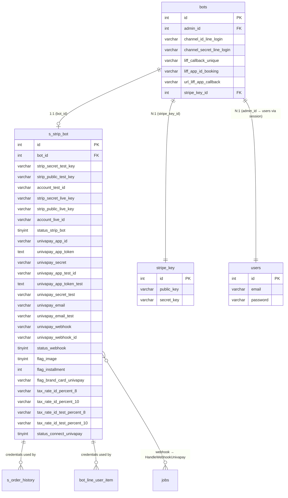

# FA-034: Liên kết hệ thống thanh toán「決済システム連携設定」— DB Mapping

> Mapping giữa giao diện, API, logic với cơ sở dữ liệu.
> **Ngày tạo**: 2026-03-26
> **Nguồn**: DB schema (`db/schema/tables/`), sample data (`db/data/tables/`), cross-reference với ui-spec, api-spec, logic-spec.

---

## 1. Bảng dữ liệu liên quan

### Bảng chính (Primary Tables)

| Bảng | Mô tả | Số dòng mẫu | Liên kết |
|------|-------|-------------|---------|
| `s_strip_bot` | Cấu hình liên kết thanh toán (Stripe + UnivaPay) cho mỗi bot | 54 | Model: `App\StripBot` |

### Bảng phụ (Secondary Tables)

| Bảng | Mô tả | Kiểu | Liên kết chính |
|------|-------|------|---------------|
| `bots` | Thông tin bot (LINE Official Account) — chứa LINE Login credentials dùng trong flow cập nhật LIFF | FK (bot_id) | `s_strip_bot.bot_id` → `bots.id` |
| `users` | Thông tin user admin — dùng để lấy email cho Stripe OAuth và xác nhận mật khẩu khi unlink | Session auth | Truy cập qua `Auth::user()` |
| `stripe_key` | Bảng cấu hình Stripe platform keys (chỉ 3 cột) | Config | `bots.stripe_key_id` → `stripe_key.id` |
| `jobs` | Laravel queue — lưu `HandleWebhookUnivapay` job khi webhook được gọi | Queue | Dispatch từ EP-10 |
| `failed_jobs` | Jobs thất bại — lưu khi `HandleWebhookUnivapay` gặp lỗi | Log | Liên quan jobs |
| `s_order_history` | Lịch sử đơn hàng — chứa thông tin thanh toán Stripe/UnivaPay cho từng đơn | Downstream | Đọc credentials từ `s_strip_bot` |
| `bot_line_user_item` | Trạng thái đăng ký sản phẩm của user — chứa customer ID Stripe/UnivaPay | Downstream | Đọc credentials từ `s_strip_bot` |

---

## 2. Chi tiết từng bảng

### Bảng: `s_strip_bot`

- **Model Laravel**: `App\StripBot`
- **Timestamps**: Không (`public $timestamps = false`)
- **Guarded**: `[]` (cho phép mass assignment toàn bộ)

#### Columns

| # | Cột | Kiểu | Nullable | Default | Nhóm | Mô tả |
|---|-----|------|----------|---------|------|-------|
| 1 | `id` | int(10) unsigned | Không | AUTO_INCREMENT | Chung | Khoá chính |
| 2 | `bot_id` | int(11) | Có | NULL | Chung | FK → `bots.id` — bot sở hữu cấu hình thanh toán |
| 3 | `strip_secret_test_key` | varchar(255) | Có | NULL | Stripe | Stripe Secret Key (test) — nhận từ OAuth callback |
| 4 | `strip_public_test_key` | varchar(255) | Có | NULL | Stripe | Stripe Publishable Key (test) — nhận từ OAuth callback |
| 5 | `account_test_id` | varchar(255) | Có | NULL | Stripe | Stripe Connected Account ID (test) — format: `acct_xxx` |
| 6 | `strip_secret_live_key` | varchar(255) | Có | NULL | Stripe | Stripe Secret Key (production) |
| 7 | `strip_public_live_key` | varchar(255) | Có | NULL | Stripe | Stripe Publishable Key (production) |
| 8 | `account_live_id` | varchar(255) | Có | NULL | Stripe | Stripe Connected Account ID (production) — phải == `account_test_id` |
| 9 | `status_strip_bot` | tinyint(4) | Có | NULL | Stripe | State machine kết nối Stripe (0→1→2→3) |
| 10 | `univapay_app_id` | varchar(255) | Có | NULL | UnivaPay | Store ID production — format UUID: `11ebc45b-7eb2-b188-...` |
| 11 | `univapay_app_token` | text | Không | — | UnivaPay | App Token production (JWT string) |
| 12 | `univapay_webhook` | varchar(255) | Có | NULL | UnivaPay | Webhook URL đã cấu hình (thường = callback URL cố định) |
| 13 | `univapay_secret` | varchar(255) | Có | NULL | UnivaPay | App Secret production |
| 14 | `univapay_app_test_id` | varchar(255) | Có | NULL | UnivaPay | Store ID test — format UUID |
| 15 | `univapay_app_token_test` | text | Có | NULL | UnivaPay | App Token test (JWT string) |
| 16 | `univapay_secret_test` | varchar(255) | Có | NULL | UnivaPay | App Secret test |
| 17 | `univapay_email` | varchar(255) | Có | NULL | UnivaPay | Email tài khoản UnivaPay (production) — lấy từ API |
| 18 | `univapay_email_test` | varchar(255) | Có | NULL | UnivaPay | Email tài khoản UnivaPay (test) — lấy từ API |
| 19 | `flag_image` | tinyint(4) | Không | 0 | Cài đặt | Flag hiển thị hình ảnh sản phẩm (0=tắt, 1=bật) |
| 20 | `flag_installment` | int(11) | Không | 0 | Cài đặt | Flag cho phép trả góp (0=tắt, 1=bật) |
| 21 | `flag_brand_card_univapay` | varchar(255) | Có | '0,1' | Cài đặt | Danh sách card brands chấp nhận — CSV: "0,1,2,3,4" |
| 22 | `tax_rate_id_percent_8` | varchar(255) | Có | NULL | Stripe | Stripe Tax Rate ID 8% (production) — format: `txr_xxx` |
| 23 | `tax_rate_id_percent_10` | varchar(255) | Có | NULL | Stripe | Stripe Tax Rate ID 10% (production) — format: `txr_xxx` |
| 24 | `tax_rate_id_test_percent_8` | varchar(255) | Có | NULL | Stripe | Stripe Tax Rate ID 8% (test) — format: `txr_xxx` |
| 25 | `tax_rate_id_test_percent_10` | varchar(255) | Có | NULL | Stripe | Stripe Tax Rate ID 10% (test) — format: `txr_xxx` |
| 26 | `univapay_webhook_id` | varchar(255) | Có | NULL | UnivaPay | Webhook ID trên UnivaPay — format UUID |
| 27 | `status_webhook` | tinyint(4) | Có | NULL | UnivaPay | Trạng thái webhook (0=lỗi, 1=OK) |
| 28 | `stripe_status_webhook_test` | tinyint(4) | Có | NULL | Stripe | Trạng thái Stripe webhook (test) — không thấy sử dụng trong FA-034 |
| 29 | `stripe_status_webhook_live` | tinyint(4) | Có | NULL | Stripe | Trạng thái Stripe webhook (production) — không thấy sử dụng trong FA-034 |
| 30 | `status_connect_univapay` | tinyint(4) | Có | 1 | UnivaPay | Trạng thái kết nối UnivaPay (default 1) |

#### Indexes

| Tên Index | Cột | Kiểu | Mô tả |
|----------|-----|------|-------|
| PRIMARY | `id` | Primary | Khoá chính |

> **Ghi chú**: Không có index trên `bot_id` trong schema dump. Có thể thiếu index hoặc đã bị strip khi clean schema. **Mức độ tin cậy**: **Trung bình**

#### Foreign Keys

| FK | Cột | Tham chiếu | On Delete | Mô tả |
|----|-----|-----------|----------|-------|
| (logic, không khai báo) | `bot_id` | `bots.id` | — | Quan hệ 1:1 giữa bot và cấu hình thanh toán. Không có FK constraint trong schema — kiểm soát bởi application code |

#### Sample Data (3 bản ghi đại diện)

**Record 1**: Chỉ có Stripe test (status = 1, chưa connect production)

| Cột | Giá trị |
|-----|---------|
| `id` | 4 |
| `bot_id` | 328 |
| `strip_secret_test_key` | `sk_test_51JUSFz...` |
| `strip_public_test_key` | `pk_test_51JUSFz...` |
| `account_test_id` | `acct_1JUSFzHITuGCMcJY` |
| `strip_secret_live_key` | NULL |
| `strip_public_live_key` | NULL |
| `account_live_id` | NULL |
| `status_strip_bot` | NULL |
| `univapay_*` | Tất cả NULL/rỗng |
| `flag_image` | 0 |
| `flag_installment` | 0 |
| `flag_brand_card_univapay` | `0,1` |
| `status_connect_univapay` | 1 |

**Record 2**: Stripe hoàn thành (status = 3), chưa có UnivaPay

| Cột | Giá trị |
|-----|---------|
| `id` | 5 |
| `bot_id` | 415 |
| `account_test_id` | `acct_1JQ2u7JVAgnLOJ64` |
| `account_live_id` | `acct_1JQ2u7JVAgnLOJ64` (giống test) |
| `status_strip_bot` | 3 |
| `tax_rate_id_percent_8` | `txr_1QwylGJVAgnLOJ64mfRjTXTE` |
| `tax_rate_id_percent_10` | `txr_1QwylGJVAgnLOJ64dbzFC842` |
| `tax_rate_id_test_percent_8` | `txr_1QwylFJVAgnLOJ647QwOGfD6` |
| `tax_rate_id_test_percent_10` | `txr_1QwylGJVAgnLOJ64DjbYc4OQ` |
| `univapay_*` | Tất cả NULL/rỗng |

**Record 3**: Cả Stripe (status = 3) và UnivaPay đều đã liên kết

| Cột | Giá trị |
|-----|---------|
| `id` | 40 |
| `bot_id` | 559 |
| `status_strip_bot` | 3 |
| `univapay_app_id` | `11ebc45b-7eb2-b188-93bd-030f020ac456` |
| `univapay_app_token` | `eyJ0eXAiOiJKV1QiLCJhbGci...` (JWT ~500 chars) |
| `univapay_webhook` | `https://lme.watermeru.com/mobile/univapay-callback-payment` |
| `univapay_secret` | `USAKXOlZQFUj9tpL7WfV` |
| `univapay_app_test_id` | `11ebc45b-7eb2-b188-93bd-030f020ac456` |
| `univapay_app_token_test` | `eyJ0eXAiOiJKV1QiLCJhbGci...` (JWT) |
| `univapay_secret_test` | `USAKXOlZQFUj9tpL7WfV` |
| `univapay_email` | `ips-supportest@univapay.com` |
| `univapay_email_test` | `ips-supportest@univapay.com` |
| `univapay_webhook_id` | `11f02403-b3cf-3e70-a9aa-5b426bd1968f` |
| `status_webhook` | 0 |
| `flag_image` | 1 |
| `flag_installment` | 1 |
| `flag_brand_card_univapay` | `0,1` |
| Tax rate IDs | Tất cả có giá trị `txr_...` |
| `status_connect_univapay` | 1 |

**Record 4**: Chỉ có UnivaPay, không có Stripe

| Cột | Giá trị |
|-----|---------|
| `id` | 18 |
| `bot_id` | 4511 |
| Stripe columns | Tất cả NULL |
| `univapay_app_token_test` | `kcARXA0X5PQCIGOojIdz` |
| `univapay_email` | `ips-supportest@univapay.com` |
| `univapay_email_test` | `ips-supportest@univapay.com` |
| `flag_image` | 1 |
| `flag_installment` | 1 |
| `flag_brand_card_univapay` | `2,3,1,0` |

---

### Bảng: `bots` (các cột liên quan FA-034)

- **Model Laravel**: `App\Bots`
- **Số cột tổng**: 113

#### Columns liên quan

| # | Cột | Kiểu | Nullable | Default | Mô tả |
|---|-----|------|----------|---------|-------|
| 1 | `id` | int(12) | Không | AUTO_INCREMENT | Khoá chính |
| 2 | `channel_id_line_login` | varchar(255) | Có | NULL | Channel ID LINE Login — dùng trong flow cập nhật LIFF URL |
| 3 | `channel_secret_line_login` | varchar(255) | Có | NULL | Channel Secret LINE Login — dùng để lấy access token |
| 4 | `liff_callback_unique` | varchar(50) | Có | NULL | LIFF callback unique ID — tạo URL callback cho booking |
| 5 | `liff_app_id_booking` | varchar(64) | Có | NULL | LIFF App ID cho booking flow |
| 6 | `url_liff_app_callback` | varchar(255) | Có | NULL | URL LIFF callback hiện tại — cập nhật bởi EP-04 |
| 7 | `stripe_key_id` | int(11) | Không | 1 | FK → `stripe_key.id` — key set Stripe platform |

---

### Bảng: `stripe_key`

- **Số cột**: 3

#### Columns

| # | Cột | Kiểu | Nullable | Default | Mô tả |
|---|-----|------|----------|---------|-------|
| 1 | `id` | int(10) unsigned | Không | AUTO_INCREMENT | Khoá chính |
| 2 | `public_key` | varchar(255) | Có | NULL | Stripe platform public key |
| 3 | `secret_key` | varchar(255) | Có | NULL | Stripe platform secret key |

> **Ghi chú**: Bảng này lưu Stripe **platform** keys (dùng cho billing subscription của LME, KHÔNG phải Stripe Connect keys của admin). Liên quan gián tiếp — `bots.stripe_key_id` trỏ đến đây. **Mức độ tin cậy**: **Trung bình**

---

### Bảng: `jobs` (Laravel Queue)

#### Columns

| # | Cột | Kiểu | Nullable | Default | Mô tả |
|---|-----|------|----------|---------|-------|
| 1 | `id` | bigint(20) unsigned | Không | AUTO_INCREMENT | Khoá chính |
| 2 | `queue` | varchar(255) | Không | — | Tên queue |
| 3 | `payload` | longtext | Không | — | Serialized job data (chứa `HandleWebhookUnivapay`) |
| 4 | `attempts` | tinyint(3) unsigned | Không | — | Số lần thử |
| 5 | `reserved_at` | int(10) unsigned | Có | NULL | Thời gian worker nhận job |
| 6 | `available_at` | int(10) unsigned | Không | — | Thời gian job sẵn sàng |
| 7 | `created_at` | int(10) unsigned | Không | — | Thời gian tạo job |

---

### Bảng: `failed_jobs`

#### Columns

| # | Cột | Kiểu | Nullable | Default | Mô tả |
|---|-----|------|----------|---------|-------|
| 1 | `id` | bigint(20) unsigned | Không | AUTO_INCREMENT | Khoá chính |
| 2 | `connection` | text | Không | — | Tên connection |
| 3 | `queue` | text | Không | — | Tên queue |
| 4 | `payload` | longtext | Không | — | Serialized job data |
| 5 | `exception` | longtext | Không | — | Stack trace lỗi |
| 6 | `failed_at` | timestamp | Không | CURRENT_TIMESTAMP | Thời gian thất bại |

---

## 3. Mapping UI ↔ Database

### SCR-PSI-01 — Trang chính liên kết thanh toán

| # | UI Element | Label JP | DB Table | Column | Mapping Type | Confidence | Ghi chú |
|---|-----------|----------|----------|--------|-------------|-----------|---------|
| 1 | Danh sách hệ thống (UnivaPay, Stripe) | — | — | — | Hardcoded | **Cao** | Cố định trong Blade template, không lưu DB |
| 2 | Phí UnivaPay | 「決済手数料 2.8% 〜」 | — | — | Hardcoded | **Cao** | Cố định trong template |
| 3 | Phí Stripe | 「決済手数料 3.6%」 | — | — | Hardcoded | **Cao** | Cố định trong template |
| 4 | Trạng thái Stripe đã liên kết | (logic hiển thị) | `s_strip_bot` | `status_strip_bot` | Computed | **Cao** | Hiển thị khi `status_strip_bot == 3` → `stripeLinked = true` |
| 5 | Trạng thái UnivaPay đã liên kết | (logic hiển thị) | `s_strip_bot` | `univapay_app_id` + `univapay_app_test_id` | Computed | **Cao** | Hiển thị khi cả 2 đều có giá trị → `univapayLinked = true` |
| 6 | Email Stripe | (hiển thị sau liên kết) | (Stripe API) | — | External API | **Cao** | Gọi `Stripe accounts->retrieve()` → lấy email, không lưu DB |
| 7 | Email UnivaPay | (hiển thị sau liên kết) | `s_strip_bot` | `univapay_email` | Direct | **Cao** | Email production lấy từ UnivaPay API khi save |
| 8 | Flag hình ảnh sản phẩm | (toggle sau liên kết) | `s_strip_bot` | `flag_image` | Direct | **Cao** | 0=tắt, 1=bật. EP-06 |
| 9 | Flag trả góp | (toggle sau liên kết) | `s_strip_bot` | `flag_installment` | Direct | **Cao** | 0=tắt, 1=bật. EP-08 |
| 10 | Card brands checkbox | (checkboxes sau liên kết UnivaPay) | `s_strip_bot` | `flag_brand_card_univapay` | Direct (CSV) | **Cao** | Chuỗi CSV: "0,1,2,3,4". EP-07 |

### SCR-PSI-02 — Form liên kết UnivaPay

| # | UI Element | Label JP | DB Table | Column | Mapping Type | Confidence | Ghi chú |
|---|-----------|----------|----------|--------|-------------|-----------|---------|
| 1 | App Token (test) | 「アプリトークン」(テスト環境用) | `s_strip_bot` | `univapay_app_token_test` | Direct | **Cao** | Request param `univapay_app_token_test` → column `univapay_app_token_test` |
| 2 | App Secret (test) | 「アプリシークレット」(テスト環境用) | `s_strip_bot` | `univapay_secret_test` | Direct | **Cao** | Request param `univapay_secret_test` → column `univapay_secret_test` |
| 3 | App Token (production) | 「アプリトークン」(本番環境用) | `s_strip_bot` | `univapay_app_token` | Direct | **Cao** | Request param `univapay_app_token` → column `univapay_app_token` |
| 4 | App Secret (production) | 「アプリシークレット」(本番環境用) | `s_strip_bot` | `univapay_secret` | Direct | **Cao** | Request param `univapay_secret` → column `univapay_secret` |
| 5 | Webhook URL | 「webhook」 | — | — | Hardcoded | **Cao** | Giá trị cố định từ env `DOMAIN_WEBHOOK_UNIVAPAY_BILL`, readonly trên UI. Một phần lưu tại `s_strip_bot.univapay_webhook` nhưng không phải input chính |
| 6 | ID (Webhook ID) | 「ID」 | `s_strip_bot` | `univapay_webhook_id` | Direct | **Cao** | Request param `univapay_webhook_id`. Format UUID |
| 7 | (ẩn) Store ID production | — | `s_strip_bot` | `univapay_app_id` | Computed | **Cao** | Không nhập trực tiếp — lấy từ UnivaPay API response `stores[0].id` |
| 8 | (ẩn) Store ID test | — | `s_strip_bot` | `univapay_app_test_id` | Computed | **Cao** | Không nhập trực tiếp — lấy từ UnivaPay API response |
| 9 | (ẩn) Email production | — | `s_strip_bot` | `univapay_email` | Computed | **Cao** | Lấy từ UnivaPay API `GET /me` |
| 10 | (ẩn) Email test | — | `s_strip_bot` | `univapay_email_test` | Computed | **Cao** | Lấy từ UnivaPay API `GET /me` |
| 11 | (ẩn) Trạng thái webhook | — | `s_strip_bot` | `status_webhook` | Computed | **Cao** | Set 1 khi webhook config OK, 0 khi lỗi |

### SCR-PSI-03 — Wizard liên kết Stripe

| # | UI Element | Label JP | DB Table | Column | Mapping Type | Confidence | Ghi chú |
|---|-----------|----------|----------|--------|-------------|-----------|---------|
| 1 | Bước 1: Đăng ký/Login Stripe | 「Stripeのアカウントを...」 | — | — | External link | **Cao** | Link đến `https://dashboard.stripe.com/login`. Không lưu DB |
| 2 | Bước 2: Connect test account | 「テスト決済に利用する...」 | `s_strip_bot` | `strip_secret_test_key`, `strip_public_test_key`, `account_test_id` | OAuth callback | **Cao** | EP-02 redirect → Stripe OAuth → callback EP-01 → lưu 3 columns + set `status_strip_bot = 1` |
| 3 | Bước 3: Connect production account | 「本番決済に利用する...」 | `s_strip_bot` | `strip_secret_live_key`, `strip_public_live_key`, `account_live_id` | OAuth callback | **Cao** | EP-03 redirect → Stripe OAuth → callback EP-01 → lưu 3 columns + set `status_strip_bot = 2` |
| 4 | (tự động) Tax rates | — | `s_strip_bot` | `tax_rate_id_percent_8`, `tax_rate_id_percent_10`, `tax_rate_id_test_percent_8`, `tax_rate_id_test_percent_10` | Computed | **Cao** | Tự động tạo khi `status_strip_bot` chuyển 2→3. Gọi Stripe API `taxRates->create()` |
| 5 | (tự động) Status hoàn thành | — | `s_strip_bot` | `status_strip_bot` | Computed | **Cao** | Tự động set = 3 khi cả test + production connect cùng account |

### Ngắt liên kết (Unlink — từ SCR-PSI-01 sau khi đã liên kết)

| # | Hành động | DB Table | Columns bị xoá | Mapping Type | Confidence | Ghi chú |
|---|----------|----------|----------------|-------------|-----------|---------|
| 1 | Unlink Stripe (`type = "stripe"`) | `s_strip_bot` | `strip_secret_test_key`, `strip_public_test_key`, `account_test_id`, `strip_secret_live_key`, `strip_public_live_key`, `account_live_id`, `status_strip_bot` | Direct (set NULL) | **Cao** | Tax rate IDs (`tax_rate_id_*`) **KHÔNG bị xoá** |
| 2 | Unlink UnivaPay (`type != "stripe"`) | `s_strip_bot` | `univapay_app_id`, `univapay_app_test_id`, `univapay_app_token`, `univapay_app_token_test`, `univapay_webhook`, `univapay_secret`, `univapay_webhook_id` | Direct (set NULL) | **Cao** | `univapay_secret_test`, `univapay_email`, `univapay_email_test` **KHÔNG bị xoá** (có thể là bug) |

---

## 4. Enum / Status Values

### `s_strip_bot.status_strip_bot` — State machine kết nối Stripe

| Giá trị DB | Ý nghĩa | Điều kiện chuyển | Mức độ tin cậy |
|-----------|---------|-----------------|---------------|
| `NULL` hoặc `0` | Chưa liên kết hoặc đã bị reset | Trạng thái khởi tạo, hoặc sau khi test/production account khác nhau | **Cao** |
| `1` | Đã liên kết test | Sau khi Stripe OAuth callback thành công với `state=1` | **Cao** |
| `2` | Đã liên kết cả test + production | Sau khi Stripe OAuth callback thành công với `state=2` | **Cao** |
| `3` | Hoàn thành — đã tạo tax rates | Tự động khi `account_test_id == account_live_id` và đã tạo 4 tax rates | **Cao** |

### `s_strip_bot.status_webhook` — Trạng thái webhook UnivaPay

| Giá trị DB | Ý nghĩa | Mức độ tin cậy |
|-----------|---------|---------------|
| `NULL` | Chưa cấu hình | **Cao** |
| `0` | Webhook lỗi hoặc chưa xác thực | **Cao** |
| `1` | Webhook OK — URL đúng, active, trigger đúng | **Cao** |

### `s_strip_bot.flag_image` — Hiển thị hình ảnh sản phẩm

| Giá trị DB | Ý nghĩa | Mức độ tin cậy |
|-----------|---------|---------------|
| `0` | Tắt (mặc định) | **Cao** |
| `1` | Bật | **Cao** |

### `s_strip_bot.flag_installment` — Cho phép trả góp

| Giá trị DB | Ý nghĩa | Mức độ tin cậy |
|-----------|---------|---------------|
| `0` | Tắt (mặc định) | **Cao** |
| `1` | Bật | **Cao** |

### `s_strip_bot.flag_brand_card_univapay` — Card brands được chấp nhận

| Giá trị trong CSV | Card Brand | Mức độ tin cậy |
|-------------------|-----------|---------------|
| `0` | Visa | **Cao** |
| `1` | Mastercard | **Cao** |
| `2` | American Express | **Cao** |
| `3` | JCB | **Cao** |
| `4` | Diners Club | **Cao** |

> **Format lưu trữ**: Chuỗi CSV, vd: `"0,1"` (Visa + Mastercard). Mặc định khi tạo mới: `"0,1"`.

### `s_strip_bot.status_connect_univapay`

| Giá trị DB | Ý nghĩa | Mức độ tin cậy |
|-----------|---------|---------------|
| `1` | Mặc định — luôn là 1 trong sample data | **Trung bình** — không thấy logic set giá trị khác trong FA-034 |

---

## 5. Mapping Request Params ↔ DB Columns (chi tiết EP-04)

Endpoint EP-04 (`POST /ajax/save-info-univapay`) có mapping phức tạp nhất:

| Request Param | DB Column | Ghi nhận trực tiếp? | Ghi chú |
|--------------|-----------|--------------------|---------|
| `univapay_app_token` | `s_strip_bot.univapay_app_token` | Có | JWT production |
| `univapay_secret` | `s_strip_bot.univapay_secret` | Có | Secret production |
| `univapay_app_token_test` | `s_strip_bot.univapay_app_token_test` | Có | JWT test |
| `univapay_secret_test` | `s_strip_bot.univapay_secret_test` | Có | Secret test |
| `univapay_webhook` | `s_strip_bot.univapay_webhook` | Có | Webhook URL |
| `univapay_webhook_id` | `s_strip_bot.univapay_webhook_id` | Có | Webhook ID (UUID) |
| `univapay_app_id` | `s_strip_bot.univapay_app_id` | **Ghi đè** | Giá trị từ request bị ghi đè bởi API response `stores[0].id` |
| `univapay_app_test_id` | `s_strip_bot.univapay_app_test_id` | **Ghi đè** | Giá trị từ request bị ghi đè bởi API response test |
| — | `s_strip_bot.univapay_email` | Chỉ từ API | Lấy từ `UnivapayPayment::getAccountInfo()` |
| — | `s_strip_bot.univapay_email_test` | Chỉ từ API | Lấy từ `UnivapayPayment::getAccountInfo()` test |
| — | `s_strip_bot.status_webhook` | Computed | Set 1 hoặc 0 dựa trên kết quả validate webhook |
| — | `s_strip_bot.flag_brand_card_univapay` | Auto (lần đầu) | Set `"0,1"` khi `StripBot::create()` lần đầu |

---

## 6. Unmapped Items

### Columns DB không sử dụng trực tiếp trong FA-034

| Bảng | Column | Lý do | Ghi chú |
|------|--------|-------|---------|
| `s_strip_bot` | `stripe_status_webhook_test` | Không thấy logic read/write trong FA-034 | Có thể dùng cho tính năng khác hoặc tính năng tương lai |
| `s_strip_bot` | `stripe_status_webhook_live` | Không thấy logic read/write trong FA-034 | Có thể dùng cho tính năng khác hoặc tính năng tương lai |
| `s_strip_bot` | `status_connect_univapay` | Luôn = 1 trong sample data, không thấy logic thay đổi trong FA-034 | Có thể dùng ở SalesManagementV2Controller hoặc tính năng khác |

### UI Elements không lưu DB

| UI Element | Label JP | Lý do |
|-----------|----------|-------|
| Phí UnivaPay | 「決済手数料 2.8% 〜」 | Hardcoded trong Blade template |
| Phí Stripe | 「決済手数料 3.6%」 | Hardcoded trong Blade template |
| Webhook URL (readonly) | 「webhook」 | Giá trị cố định từ env variable, chỉ hiển thị cho user copy |
| Link Stripe Dashboard | `https://dashboard.stripe.com/login` | External URL, không liên quan DB |
| Email Stripe account | (sau liên kết) | Lấy realtime từ Stripe API, không lưu DB |

---

## 7. Side Effects lên bảng khác

### EP-04 (saveInfoUnivapay) — Cập nhật LIFF trên bảng `bots`

| Bảng | Column | Hành vi | Điều kiện |
|------|--------|---------|-----------|
| `bots` | `url_liff_app_callback` | Cập nhật URL callback LIFF | Khi bot có `channel_id_line_login` + `channel_secret_line_login` |

> **Mức độ tin cậy**: **Cao** — xác nhận từ logic code `LinkPaymentController:264-358`

### EP-10 (webhook) — Dispatch job vào `jobs`

| Bảng | Hành vi | Điều kiện |
|------|---------|-----------|
| `jobs` | INSERT payload `HandleWebhookUnivapay` | Khi `event == "charge_finished"` và module trong danh sách |
| `failed_jobs` | INSERT nếu job thất bại | Khi job throw exception |

---

## 8. ER Diagram (liên quan tính năng)



### Quan hệ văn bản

```
bots ──1:1──→ s_strip_bot     (bot_id, không có FK constraint)
bots ──N:1──→ stripe_key      (stripe_key_id, platform keys)
users ←── session auth ──→ bots (admin_id chain)

s_strip_bot ──read by──→ s_order_history     (payment processing)
s_strip_bot ──read by──→ bot_line_user_item   (customer management)
EP-10 webhook ──dispatch──→ jobs              (HandleWebhookUnivapay)
```

---

## 9. Tổng kết mức độ tin cậy

| Khu vực | Confidence | Giải thích |
|---------|-----------|-----------|
| `s_strip_bot` — columns Stripe | **Cao** | Model khai báo rõ table, code logic rõ ràng, sample data khớp |
| `s_strip_bot` — columns UnivaPay | **Cao** | Model khai báo rõ table, code logic rõ ràng, sample data khớp |
| `s_strip_bot` — columns Cài đặt | **Cao** | Code EP-06/07/08 update trực tiếp, sample data xác nhận |
| `s_strip_bot` — columns không dùng | **Trung bình** | `stripe_status_webhook_test/live`, `status_connect_univapay` — có trong schema nhưng không thấy logic FA-034 |
| `bots` — cột liên quan | **Cao** | Code logic tham chiếu rõ ràng tại `LinkPaymentController:264-358` |
| `stripe_key` — liên quan gián tiếp | **Trung bình** | Dùng cho platform billing, không trực tiếp cho Stripe Connect |
| `jobs` / `failed_jobs` — queue | **Cao** | Code `HandleWebhookUnivapay` implements `ShouldQueue` rõ ràng |
