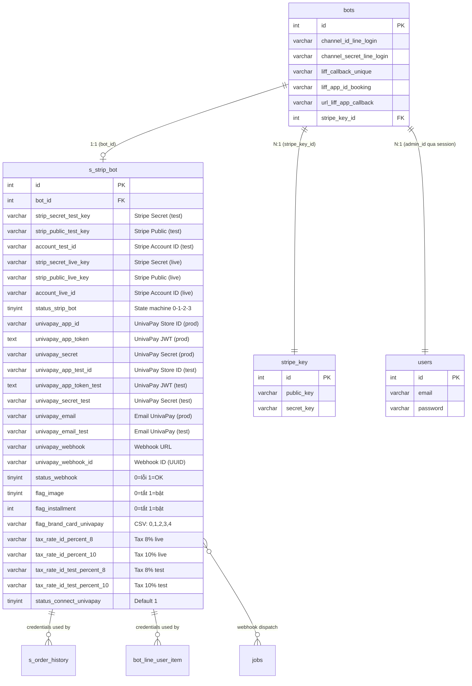

# FA-034: Liên kết hệ thống thanh toán「決済システム連携設定」— Feature Spec

> **Mã tính năng**: FA-034
> **Portal**: Admin
> **URL chính**: `/basic/list-items`
> **Ngày tổng hợp**: 2026-03-26
> **Nguồn**: ui-spec.md, api-spec.md, logic-spec.md, db-mapping.md, validation-report.md

---

## 1. Tổng quan

### Mục đích

Tính năng cho phép Admin cấu hình liên kết tài khoản với hệ thống thanh toán bên ngoài (UnivaPay hoặc Stripe) để xử lý giao dịch mua bán sản phẩm, đặt lịch có phí, và subscription trong hệ thống LME. Sau khi liên kết, Admin có thể quản lý cài đặt thanh toán (card brands, hiển thị hình ảnh, trả góp) và ngắt liên kết khi cần.

### Actors

| Actor | Vai trò | Quyền truy cập |
|-------|---------|----------------|
| Admin (LINE OA) | Chủ tài khoản | Toàn quyền — cấu hình liên kết, ngắt liên kết, thay đổi cài đặt |
| Staff | Nhân viên | Có thể truy cập nếu đã đăng nhập — **không có permission check riêng** (Cao) |

> **Ghi chú bảo mật**: Không có middleware `admin_access` hay permission check trên routes. Tất cả user đã đăng nhập đều truy cập được. Chỉ `getBotId()` từ session giới hạn thao tác trên bot của mình. (Cao)

### Phạm vi

- **2 nhà cung cấp thanh toán**: UnivaPay (nhập token/secret thủ công) và Stripe (OAuth Connect flow)
- **2 môi trường** cho mỗi nhà cung cấp: test và production
- **Cài đặt bổ sung** (sau khi liên kết): flag hình ảnh, flag trả góp, card brands
- **Ngắt liên kết**: yêu cầu xác nhận mật khẩu
- **Webhook**: nhận callback thanh toán từ UnivaPay, dispatch job xử lý async

### Hệ thống thanh toán hỗ trợ

| Hệ thống | Phương thức liên kết | Phí giao dịch | Đặc điểm |
|-----------|---------------------|---------------|----------|
| UnivaPay | Nhập App Token + Secret (JWT) cho test và production | Từ 2.8% | Được đánh dấu「オススメ」(đề xuất), hỗ trợ trả góp, phí 0 yen/tháng |
| Stripe | OAuth Connect flow — chọn tài khoản trên Stripe Dashboard | 3.6% | Tự động qua OAuth callback, tạo tax rates khi hoàn thành |

---

## 2. Các màn hình và Luồng xử lý end-to-end

### 2.1. SCR-PSI-01 — Trang chính liên kết thanh toán

**URL**: `/basic/list-items`
**Screenshot**: `screenshots/main.png`

#### Trạng thái chưa liên kết

Hiển thị 2 cards (UnivaPay và Stripe) với thông tin phí, link đăng ký/tạo tài khoản, và nút「アカウント連携する」.

- **Card UnivaPay**: logo, badge「オススメ」, phí 2.8%, link đăng ký LME plan (`https://lme.jp/manual/univapay/`), nút liên kết → SCR-PSI-02
- **Card Stripe**: logo, phí 3.6%, link tạo tài khoản (`https://stripe.com/`), nút liên kết → SCR-PSI-03

#### Trạng thái đã liên kết (phát hiện từ code, thiếu trong UI Spec — xem VD-01)

Khi đã liên kết thành công, giao diện thay đổi:

- **Hiển thị email** tài khoản đã liên kết (Stripe: gọi API realtime; UnivaPay: từ DB `univapay_email`)
- **Nút「連携解除」** — ngắt liên kết (EP-05), yêu cầu nhập mật khẩu
- **Toggle hiển thị hình ảnh sản phẩm** — EP-06, field `flag_image`
- **Toggle cho phép trả góp** — EP-08, field `flag_installment`
- **Checkboxes card brands** (UnivaPay) — EP-07, field `flag_brand_card_univapay` (Visa, Mastercard, AmEx, JCB, Diners)

#### Luồng xử lý — Render trang

```
User truy cập /basic/list-items
  → EP-01: SalesManagementController@linkPayment
    → Kiểm tra query params (code, state) — nếu có thì xử lý Stripe callback (xem 2.3)
    → Lấy bot_id từ session (getBotId())
    → Query s_strip_bot WHERE bot_id = ?
    → Tính toán: stripeLinked (status_strip_bot == 3), univapayLinked (có cả app_id + app_test_id)
    → Nếu stripeLinked → gọi Stripe API lấy email account
    → Lấy webhook URL từ env('DOMAIN_WEBHOOK_UNIVAPAY_BILL') hoặc url('/mobile/univapay-callback-payment')
    → Render view basic.link_payment.index với data
  → UI hiển thị cards theo trạng thái liên kết
```

---

### 2.2. SCR-PSI-02 — Form liên kết UnivaPay

**Screenshot**: `screenshots/univapay-modal.png`

Giao diện chia 3 bước với heading đánh số:

| Bước | Heading JP | Nội dung |
|------|-----------|----------|
| 1 | 「1.UnivaPay管理画面から接続情報を入力する」 | 2 nhóm fields:「テスト環境用」(test) và「本番環境用」(production), mỗi nhóm có App Token + App Secret |
| 2 | 「2.UnivaPay管理画面に以下のwebhookを入力する」 | Webhook URL readonly + nút copy. User paste vào UnivaPay admin |
| 3 | 「3.UnivaPay管理画面で作成したIDを以下に入力する」 | 1 field「ID」= Webhook ID (UUID) tạo trên UnivaPay admin |

**Nút hành động**: 「保存」(lưu) và「戻る」(quay về SCR-PSI-01)

#### Luồng xử lý — Lưu UnivaPay

```
User điền form → click「保存」
  → Client-side validation (Validate class): kiểm tra required cho token/secret/webhook
  → AJAX POST EP-04: /ajax/save-info-univapay
    → LinkPaymentController@saveInfoUnivapay
      (1) Xác thực Production credentials:
          → Gọi UnivaPay API GET /me + GET /stores với secret+token production
          → Decode JWT token → kiểm tra domain trong payload.domains khớp env('URL_OUTSIDE_STEP')
          → Nếu domain không khớp → trả lỗi: 「本番環境用のドメインは「{host}」のみ指定可能です」
          → Lấy email + store ID (univapay_app_id)
      (2) Cập nhật LIFF callback URL (nếu bot có LINE Login channel):
          → Lấy LINE Login access token
          → Cập nhật LIFF app URL trên LINE platform
      (3) Xác thực Test credentials:
          → Tương tự production, lấy univapay_app_test_id + email test
      (4) Lưu vào DB:
          → Chưa có record → StripBot::create() (kèm flag_brand_card_univapay = "0,1")
          → Đã có → StripBot::update()
      (5) Xác thực Webhook (nếu có univapay_webhook_id):
          → Gọi UnivaPay API GET /stores/{id}/webhooks/{wh_id}
          → Kiểm tra URL đúng, active=true, triggers chứa charge_finished
          → Nếu sai → PATCH cập nhật webhook
          → Set status_webhook = 1 (OK) hoặc 0 (lỗi)
      → Trả JSON {status: true, email, appId, message: "保存しました。"}
  → JS: window.location.reload() → refresh trang hiển thị trạng thái đã liên kết
```

#### Lỗi có thể xảy ra

| Tình huống | Response | Thông báo JP |
|-----------|----------|-------------|
| Domain JWT production không khớp | `{status: false}` | 「本番環境用のドメインは「{host}」のみ指定可能です。正しいドメインを入力してください。」 |
| Domain JWT test không khớp | `{status: false}` | 「テスト環境用のドメインは「{host}」のみ指定可能です。正しいドメインを入力してください。」 |
| UnivaPay API lỗi | `{status: false}` | Thông báo lỗi đã dịch sang tiếng Nhật (~30 error codes) |
| Webhook ID sai | `{status: true, message: ...}` | 「Webhook IDが間違っています。再度確認してください。」 |
| Thiếu app ID trong response | `{status: false}` | "no app id" |

---

### 2.3. SCR-PSI-03 — Wizard liên kết Stripe

**Screenshot**: `screenshots/stripe-modal.png`

Giao diện wizard 3 bước dạng card lớn với hình minh họa:

| Bước | Heading JP | Hành động | Endpoint |
|------|-----------|----------|----------|
| 1 | 「1.Stripe管理画面にログイン」 | Click link → mở `https://dashboard.stripe.com/login` (tab mới) | — (external) |
| 2 | 「2.テスト決済用Stripeアカウントを選択」 | Click → redirect Stripe OAuth | EP-02: `/sales/stripe/test/connect` |
| 3 | 「3.本番決済用Stripeアカウントを選択」 | Click → redirect Stripe OAuth | EP-03: `/sales/stripe/production/connect` |

**Cảnh báo**: 「アカウントが複数ある場合は必ず2.テスト決済用で選択したアカウントと同じものを選択してください。」(Phải chọn cùng tài khoản cho test và production)

**Nút hành động**: Chỉ có「戻る」(quay về SCR-PSI-01). Không có nút「保存」— liên kết tự động qua OAuth callback.

#### Luồng xử lý — Stripe OAuth Connect

```
User click「テスト決済に利用する アカウントを選択」
  → EP-02: Closure route /sales/stripe/test/connect
    → Lấy email user từ DB
    → Redirect 302 → https://connect.stripe.com/oauth/v2/authorize
      Params: response_type=code, client_id=env('ITEM_CLIENT_ID_TEST'), state=1, scope=read_write,
              stripe_user[email]=..., stripe_user[country]=JP, redirect_uri={APP_URL}/basic/list-items
  → User authorize trên Stripe Dashboard
  → Stripe redirect về /basic/list-items?code=xxx&state=1
  → EP-01: SalesManagementController@linkPayment (callback handler)
    → state=1 (test):
      → Gọi Stripe\OAuth::token() đổi code → access token
      → Lưu: strip_secret_test_key, strip_public_test_key, account_test_id, status_strip_bot=1
      → Redirect → /basic/list-items?connect=1

User click「本番決済に利用する アカウントを選択」
  → EP-03: tương tự EP-02, state=2, client_id=env('ITEM_CLIENT_ID_LIVE')
  → Stripe callback → EP-01:
    → state=2 (production):
      → Lưu: strip_secret_live_key, strip_public_live_key, account_live_id, status_strip_bot=2
      → Kiểm tra account_test_id == account_live_id:
        → KHÁC → Xóa toàn bộ Stripe keys, set status_strip_bot=0
                 Alert: 「テストと本番は同じアカウントを利用してください。」
        → GIỐNG → set status_strip_bot=2

  → Khi status_strip_bot == 2 (tự động finalize):
    → Tạo 4 Stripe Tax Rates: 消費税 8% + 10% inclusive (test + live)
    → Lưu tax rate IDs vào s_strip_bot
    → Set status_strip_bot = 3 (hoàn thành)
```

> **Ghi chú**: Sau bước 3, JavaScript tự động gọi EP-09 (`GET /basic/list-item/check-step3-stripe`) để xác nhận trạng thái và set `status_strip_bot = 3`. Đây là cơ chế backup/alternative cho auto-finalize trong controller. (VD-02)

#### Luồng xử lý — Ngắt liên kết

```
User click「連携解除」trên card đã liên kết (SCR-PSI-01 trạng thái đã liên kết)
  → Hiển thị dialog nhập mật khẩu
  → AJAX POST EP-05: /ajax/unlink-payment-v2
    Body: {type: "stripe"|"univapay", password: "..."}
    → LinkPaymentController@unlinkPaymentMethod
      → Hash::check() xác nhận mật khẩu
      → Nếu sai → {status: false, error: "パスワードが間違っています。"}
      → Nếu type == "stripe":
        → Xóa (set NULL): strip_secret_test_key, strip_public_test_key, account_test_id,
          strip_secret_live_key, strip_public_live_key, account_live_id, status_strip_bot
        → Tax rate IDs KHÔNG bị xóa
      → Nếu type == "univapay":
        → Xóa: univapay_app_id, univapay_app_test_id, univapay_app_token, univapay_app_token_test,
          univapay_webhook, univapay_secret, univapay_webhook_id
        → univapay_secret_test, univapay_email, univapay_email_test KHÔNG bị xóa (có thể là bug)
      → Trả {status: true}
```

#### Luồng xử lý — Cập nhật cài đặt (sau liên kết)

```
Toggle flag hình ảnh → AJAX POST EP-06: /ajax/update-flag-image-sale
  Body: {flag_image: 0|1} → Update s_strip_bot.flag_image → {status: true}

Thay đổi card brands → AJAX POST EP-07: /ajax/change-brand-card-univapay
  Body: {flag_brand_card_univapay: [0,1,3]} → Update dạng CSV "0,1,3" → {status: true}

Toggle trả góp → AJAX POST EP-08: /ajax/update-flag-installment
  Body: {flagInstallment: 0|1} → Update s_strip_bot.flag_installment → {status: true}
```

---

## 3. Data Model

### Entity chính: `s_strip_bot`

Bảng duy nhất lưu toàn bộ cấu hình thanh toán (cả Stripe và UnivaPay) cho mỗi bot. Quan hệ 1:1 với `bots` qua `bot_id` (không có FK constraint trong schema).

- **Model**: `App\StripBot`
- **Timestamps**: Không
- **Guarded**: `[]` (mass assignment toàn bộ)
- **30 columns**: chia thành 4 nhóm (Chung, Stripe, UnivaPay, Cài đặt)

### ER Diagram



### State Machine: `status_strip_bot` (Stripe)

```
NULL/0 (Chưa liên kết)
  → 1 (Test connect thành công — OAuth callback state=1)
    → 2 (Production connect thành công — OAuth callback state=2)
      → 3 (Hoàn thành — accounts giống nhau, tax rates đã tạo)

Ngoại lệ:
  2 + accounts khác nhau → 0 (reset, xóa toàn bộ keys)
  Unlink → NULL (xóa keys nhưng giữ tax rate IDs)
```

---

## 4. Field Traceability Matrix

| # | UI Element | Màn hình | DB Table.Column | Hướng | Validation | Business Rule |
|---|-----------|---------|----------------|-------|-----------|---------------|
| 1 | App Token test「アプリトークン」 | SCR-PSI-02 (テスト環境用) | `s_strip_bot.univapay_app_token_test` | Write | Required (client), JWT domain check (server) | BR-03 |
| 2 | App Secret test「アプリシークレット」 | SCR-PSI-02 (テスト環境用) | `s_strip_bot.univapay_secret_test` | Write | Required (client) | — |
| 3 | App Token production「アプリトークン」 | SCR-PSI-02 (本番環境用) | `s_strip_bot.univapay_app_token` | Write | Required (client), JWT domain check (server) | BR-03 |
| 4 | App Secret production「アプリシークレット」 | SCR-PSI-02 (本番環境用) | `s_strip_bot.univapay_secret` | Write | Required (client) | — |
| 5 | Webhook URL「webhook」 | SCR-PSI-02 (readonly) | — | Display | — | Giá trị cố định từ env, không lưu chính |
| 6 | Webhook ID「ID」 | SCR-PSI-02 | `s_strip_bot.univapay_webhook_id` | Write | Validate qua UnivaPay API | BR-04 |
| 7 | (ẩn) Store ID production | SCR-PSI-02 | `s_strip_bot.univapay_app_id` | Computed | — | Lấy từ UnivaPay API `GET /stores` |
| 8 | (ẩn) Store ID test | SCR-PSI-02 | `s_strip_bot.univapay_app_test_id` | Computed | — | Lấy từ UnivaPay API |
| 9 | (ẩn) Email production | SCR-PSI-02 | `s_strip_bot.univapay_email` | Computed | — | Lấy từ UnivaPay API `GET /me` |
| 10 | (ẩn) Email test | SCR-PSI-02 | `s_strip_bot.univapay_email_test` | Computed | — | Lấy từ UnivaPay API |
| 11 | (ẩn) Status webhook | SCR-PSI-02 | `s_strip_bot.status_webhook` | Computed | — | BR-04: 1=OK, 0=lỗi |
| 12 | Stripe test connect | SCR-PSI-03 bước 2 | `s_strip_bot.strip_secret_test_key`, `.strip_public_test_key`, `.account_test_id` | OAuth callback | — | BR-08, set status=1 |
| 13 | Stripe prod connect | SCR-PSI-03 bước 3 | `s_strip_bot.strip_secret_live_key`, `.strip_public_live_key`, `.account_live_id` | OAuth callback | — | BR-01, BR-08, set status=2 |
| 14 | (tự động) Tax rates | — | `s_strip_bot.tax_rate_id_percent_8/10`, `.tax_rate_id_test_percent_8/10` | Computed | — | BR-02: tạo khi status 2→3 |
| 15 | Trạng thái Stripe đã liên kết | SCR-PSI-01 | `s_strip_bot.status_strip_bot` | Read | — | Hiển thị khi == 3 |
| 16 | Trạng thái UnivaPay đã liên kết | SCR-PSI-01 | `s_strip_bot.univapay_app_id` + `.univapay_app_test_id` | Read | — | Hiển thị khi cả 2 có giá trị |
| 17 | Email Stripe | SCR-PSI-01 (đã liên kết) | — (Stripe API realtime) | Read | — | Gọi `accounts->retrieve()` |
| 18 | Email UnivaPay | SCR-PSI-01 (đã liên kết) | `s_strip_bot.univapay_email` | Read | — | — |
| 19 | Toggle hình ảnh | SCR-PSI-01 (đã liên kết) | `s_strip_bot.flag_image` | Write | 0 hoặc 1 | — |
| 20 | Toggle trả góp | SCR-PSI-01 (đã liên kết) | `s_strip_bot.flag_installment` | Write | 0 hoặc 1 | — |
| 21 | Checkboxes card brands | SCR-PSI-01 (đã liên kết) | `s_strip_bot.flag_brand_card_univapay` | Write | Array of int → CSV | BR-07: mặc định "0,1" |
| 22 | Phí UnivaPay「決済手数料 2.8% 〜」 | SCR-PSI-01 | — | Display | — | Hardcoded template |
| 23 | Phí Stripe「決済手数料 3.6%」 | SCR-PSI-01 | — | Display | — | Hardcoded template |

---

## 5. Business Rules

### BR-01: Stripe Connect — cùng account cho test và production

**Nguồn**: `SalesManagementController.php:162-179` | **Tin cậy**: **Cao**

Sau khi liên kết cả test và production, hệ thống kiểm tra `account_test_id == account_live_id`. Nếu **khác nhau**, xóa toàn bộ Stripe credentials và hiển thị lỗi: 「テストと本番は同じアカウントを利用してください。」. User phải liên kết lại từ đầu.

### BR-02: Stripe — tự động tạo Tax Rates khi hoàn thành

**Nguồn**: `SalesManagementController.php:187-231` | **Tin cậy**: **Cao**

Khi `status_strip_bot` chuyển 2 → 3, tự động tạo 4 Stripe Tax Rates qua Stripe API:
- 消費税 8% inclusive (test + live)
- 消費税 10% inclusive (test + live)

Tax rates dùng cho tính năng sản phẩm đơn lẻ (FA-026) và subscription.

### BR-03: UnivaPay — kiểm tra domain trong JWT token

**Nguồn**: `LinkPaymentController.php:215-236, 366-384` | **Tin cậy**: **Cao**

App token JWT của UnivaPay chứa `payload.domains`. Hệ thống decode JWT và kiểm tra domain `env('URL_OUTSIDE_STEP')` phải nằm trong danh sách. Kiểm tra riêng cho token production và test. Nếu không khớp → từ chối lưu, trả lỗi chỉ rõ domain đúng.

### BR-04: UnivaPay — tự động cập nhật webhook

**Nguồn**: `LinkPaymentController.php:402-437` | **Tin cậy**: **Cao**

Khi lưu với `univapay_webhook_id`:
1. Gọi API kiểm tra webhook hiện tại trên UnivaPay
2. Nếu URL/active/triggers không đúng → PATCH cập nhật: `url` = webhook URL, `triggers` = `["charge_finished"]`, `active` = `true`
3. Set `status_webhook = 1` (OK) hoặc `0` (lỗi)

### BR-05: UnivaPay — cập nhật LIFF callback URL

**Nguồn**: `LinkPaymentController.php:264-358` | **Tin cậy**: **Cao**

Khi lưu UnivaPay info, nếu bot có LINE Login channel (`channel_id_line_login` + `channel_secret_line_login`), hệ thống:
- Lấy LINE Login access token
- Kiểm tra JWT domain
- Cập nhật LIFF app callback URL trên LINE platform

**Side effect**: ảnh hưởng đến booking flow LIFF bên ngoài.

### BR-06: Unlink — yêu cầu xác nhận mật khẩu

**Nguồn**: `LinkPaymentController.php:448-456` | **Tin cậy**: **Cao**

Ngắt liên kết yêu cầu nhập lại mật khẩu đăng nhập (`Hash::check()`). Bảo vệ tránh ngắt liên kết nhầm.

### BR-07: Card Brand — mặc định Visa + Mastercard

**Nguồn**: `LinkPaymentController.php:393` | **Tin cậy**: **Cao**

Khi tạo mới record `StripBot` (lần đầu lưu UnivaPay), `flag_brand_card_univapay` = `"0,1"`. Giá trị card brand: 0=Visa, 1=Mastercard, 2=American Express, 3=JCB, 4=Diners Club.

### BR-08: Stripe OAuth — redirect flow

**Nguồn**: `routes/web.php:3719-3733` | **Tin cậy**: **Cao**

Flow OAuth: Admin click → redirect đến Stripe Connect → user authorize → Stripe redirect về `/basic/list-items?code=xxx&state=1|2`. Pre-fill email + country=JP.

### BR-09: Webhook UnivaPay — chỉ xử lý charge_finished

**Nguồn**: `WebhookUnivapayControler.php:32` | **Tin cậy**: **Cao**

Webhook endpoint nhận nhiều loại event từ UnivaPay nhưng chỉ xử lý `charge_finished`. Dispatch job `HandleWebhookUnivapay` async. **Cảnh báo bảo mật**: endpoint **không có authentication/signature verification**.

---

## 6. API Endpoints

### Tổng quan

| Mã | Method | URI | Mô tả | Middleware |
|----|--------|-----|-------|-----------|
| EP-01 | GET | `/basic/list-items` | Trang chính + Stripe OAuth callback | web |
| EP-02 | GET | `/sales/stripe/test/connect` | Stripe OAuth (test) — redirect | web |
| EP-03 | GET | `/sales/stripe/production/connect` | Stripe OAuth (production) — redirect | web |
| EP-04 | POST | `/ajax/save-info-univapay` | Lưu thông tin UnivaPay | web |
| EP-05 | POST | `/ajax/unlink-payment-v2` | Ngắt liên kết (Stripe hoặc UnivaPay) | web |
| EP-06 | POST | `/ajax/update-flag-image-sale` | Cập nhật flag hình ảnh | web |
| EP-07 | POST | `/ajax/change-brand-card-univapay` | Cập nhật card brands | web |
| EP-08 | POST | `/ajax/update-flag-installment` | Cập nhật flag trả góp | web |
| EP-09 | GET | `/basic/list-item/check-step3-stripe` | Xác nhận Stripe bước 3 | web |
| EP-10 | POST | `/mobile/univapay-callback-payment` | Webhook UnivaPay (external) | web |

> Tất cả endpoints dùng middleware `web` (session-based auth). Không có `admin_access` hay permission check. (Cao)

### Chi tiết endpoints quan trọng

#### EP-04: POST `/ajax/save-info-univapay`

**Controller**: `LinkPaymentController@saveInfoUnivapay`

| Param | Kiểu | Bắt buộc | Mô tả |
|-------|------|----------|-------|
| `univapay_app_token` | string | Có (client) | App Token production (JWT) |
| `univapay_secret` | string | Có (client) | App Secret production |
| `univapay_app_token_test` | string | Có (client) | App Token test (JWT) |
| `univapay_secret_test` | string | Có (client) | App Secret test |
| `univapay_webhook` | string | Có (client) | Webhook URL (readonly, pre-filled) |
| `univapay_webhook_id` | string | Không | Webhook ID (UUID) |

**Response thành công**: `{status: true, email: "...", appId: "...", message: "保存しました。"}`

**Validation**: Chỉ client-side (JS Validate class, kiểm tra required). Server-side: JWT domain check + UnivaPay API validation. **Không có FormRequest**.

#### EP-05: POST `/ajax/unlink-payment-v2`

**Controller**: `LinkPaymentController@unlinkPaymentMethod`

| Param | Kiểu | Bắt buộc | Mô tả |
|-------|------|----------|-------|
| `type` | string | Có | `"stripe"` hoặc `"univapay"` |
| `password` | string | Có | Mật khẩu hiện tại |

**Response thành công**: `{status: true}`
**Lỗi**: `{status: false, error: "パスワードが間違っています。"}`

#### EP-10: POST `/mobile/univapay-callback-payment` (Webhook)

**Controller**: `WebhookUnivapayControler@webhook`

Nhận callback từ UnivaPay khi có sự kiện thanh toán. Chỉ xử lý `event == "charge_finished"`. Dispatch `HandleWebhookUnivapay` job vào Laravel queue. Routing theo module:

| Module | Service | Method |
|--------|---------|--------|
| `lesson` | `CalendarCourseBookingService` | `handleOrderCallback()` |
| `salon` | `CalendarSalonLineBookingService` | `handleOrderCallback()` |
| `event-booking` | `EventBookingService` | `handleOrderCallback()` |
| `sales` | `SalesService` | `handleOrderCallback()` |
| `sales_change_card` | `SalesService` | `callbackChangeCard()` |
| `sales_job` | `SalesService` | `callbackJob()` |

### External API Calls

| Dịch vụ | Endpoint | Gọi từ | Mục đích |
|---------|----------|--------|---------|
| Stripe OAuth | `https://connect.stripe.com/oauth/v2/authorize` | EP-02, EP-03 | Redirect user để authorize |
| Stripe Token | `\Stripe\OAuth::token()` | EP-01 | Đổi code → access token |
| Stripe Account | `accounts->retrieve()` | EP-01 | Lấy email account |
| Stripe Tax Rate | `taxRates->create()` | EP-01 | Tạo tax 8% và 10% |
| UnivaPay Account | `GET /me` + `GET /stores` | EP-04 | Xác thực + lấy store ID |
| UnivaPay Webhook | `GET/PATCH /stores/{id}/webhooks/{wh_id}` | EP-04 | Kiểm tra/cập nhật webhook |
| LINE Login Token | `POST /v2/oauth/accessToken` | EP-04 | Lấy access token |
| LINE LIFF App | `PUT /liff/v1/apps/{liff_id}` | EP-04 | Cập nhật LIFF callback URL |

---

## 7. Background Jobs

**Không có background job polling** cho tính năng này (không có Spring Boot job liên quan).

### Webhook xử lý qua Laravel Queue

Webhook UnivaPay (EP-10) được xử lý bằng **Laravel queue job** `HandleWebhookUnivapay` (implements `ShouldQueue`), không phải Spring Boot background job. Job được dispatch khi nhận callback `charge_finished` từ UnivaPay, xử lý async trong Laravel queue worker.

**File**: `app/Jobs/HandleWebhookUnivapay.php`

Job này phục vụ nhiều tính năng (sales, booking lesson/salon/event) — không chỉ riêng FA-034.

---

## 8. Phụ thuộc chéo (Cross-references)

### Tính năng liên quan

| Tính năng | Mã | Quan hệ |
|-----------|----|----|
| Sản phẩm đơn lẻ / Subscription | FA-026 | Đọc `s_strip_bot` để lấy credentials khi xử lý thanh toán. Tax rates (BR-02) dùng cho Stripe checkout |
| Đặt lịch bài học | FA-019 | `HandleWebhookUnivapay` job xử lý module `lesson` |
| Đặt lịch salon | FA-020 | `HandleWebhookUnivapay` job xử lý module `salon` |
| Đặt lịch sự kiện | FA-021 | `HandleWebhookUnivapay` job xử lý module `event-booking` |
| Hợp đồng và thanh toán | FA-031 | Có thể liên quan đến thông tin thanh toán plan LME |

### Shared Components

Tính năng này **không sử dụng shared component** nào đã đăng ký. Giao diện đơn giản, chuyên biệt cho cấu hình thanh toán.

### External Dependencies

| Hệ thống ngoài | Mục đích |
|----------------|---------|
| UnivaPay Admin | Lấy app token/secret, tạo Webhook ID, cấu hình webhook |
| Stripe Dashboard | Đăng nhập, authorize OAuth Connect |
| LINE Platform | Cập nhật LIFF callback URL khi lưu UnivaPay |

### Code Legacy

`SalesManagementV2Controller` có method `iniSettingUnivapay()` (route `/ajax/sales/ini-setting-univapay`) và `unlinkPaymentMethod()` — phiên bản mới hơn/đơn giản hơn dùng cho tab settings trong Sales Management V2. Logic đơn giản hơn `LinkPaymentController` (không có domain check, LIFF update, webhook validation). (Cao)

---

## 9. Gaps và Unknowns

### Từ Validation Report

| # | Mã | Mức độ | Vấn đề | Trạng thái |
|---|----|----|--------|-----------|
| 1 | VD-01 | **Trung bình** | UI Spec thiếu mô tả trạng thái "đã liên kết" (post-connection UI): nút「連携解除」, toggle flag_image, toggle flag_installment, checkboxes card brands. 4 endpoints (EP-05~EP-08) không có UI tương ứng trong UI Spec | **Đã bù đắp trong feature-spec** — mô tả tại mục 2.1 (trạng thái đã liên kết) và mục 2.3 (luồng ngắt liên kết, cập nhật cài đặt). Khuyến nghị chụp thêm screenshot trạng thái đã liên kết |
| 2 | VD-02 | Nhẹ | UI Spec thiếu mô tả AJAX EP-09 (checkStep3Stripe) — gọi tự động từ JS | **Đã bù đắp** — ghi chú tại mục 2.3 |
| 3 | VD-03 | Nhẹ | Logic Spec — `LinkPaymentController@index()` là phiên bản cũ, có thể gây nhầm lẫn | Ghi nhận — feature-spec chỉ tham chiếu `SalesManagementController@linkPayment` (route hiện tại) |
| 4 | VD-04 | Nhẹ | Thiếu index trên `s_strip_bot.bot_id` — mọi query đều WHERE bot_id | Ghi nhận — có thể là thiếu sót schema hoặc đã strip khi clean |
| 5 | VD-05 | Nhẹ | API Spec EP-04 thiếu mô tả side effect LINE LIFF | **Đã bù đắp** — ghi rõ tại mục 2.2 luồng xử lý và BR-05 |
| 6 | VD-06 | **Trung bình** | Field「ID」trong UI Spec ghi "chưa rõ loại ID" — đã xác nhận là **Webhook ID** (`univapay_webhook_id`) từ code + DB | **Đã giải quyết** — ghi rõ trong feature-spec |

### Điểm chưa rõ còn lại

| # | Vấn đề | Mức độ | Ghi chú |
|---|--------|--------|---------|
| 1 | Bước 3 Stripe (production) link là `#` — điều kiện kích hoạt? | **Trung bình** | Có thể phụ thuộc vào hoàn thành bước 2 (status_strip_bot >= 1). Cần kiểm tra Blade template |
| 2 | UnivaPay unlink không xóa `univapay_secret_test`, `univapay_email`, `univapay_email_test` | **Trung bình** | Có thể là bug — khi liên kết lại, dữ liệu cũ vẫn còn |
| 3 | Stripe unlink không xóa tax rate IDs | **Thấp** | Có thể intentional — tax rates đã tạo trên Stripe platform vẫn tồn tại |
| 4 | Webhook UnivaPay (EP-10) không có authentication/signature verification | **Trung bình** | Rủi ro bảo mật — bất kỳ ai biết URL đều gọi được |
| 5 | Nút copy webhook URL hoạt động thế nào (clipboard API? flash message?) | **Thấp** | Cần kiểm tra JS handler |
| 6 | `status_connect_univapay` luôn = 1, không thấy logic thay đổi trong FA-034 | **Thấp** | Có thể dùng ở SalesManagementV2Controller hoặc tính năng khác |

---

## 10. Chất lượng Spec

### Metrics

| Chỉ số | Giá trị |
|--------|---------|
| Tổng số UI fields/elements | 23 |
| Fields mapped đến DB | 18/23 (78%) — 5 elements hardcoded/external API |
| Tổng số endpoints | 10 |
| Endpoints có controller xác nhận | 10/10 (100%) |
| Tổng số business rules | 9 |
| DB columns s_strip_bot | 30 (tất cả documented) |
| DB coverage | ~95% |

### Confidence Distribution

| Mức độ tin cậy | Số lượng items | Tỷ lệ |
|---------------|---------------|--------|
| **Cao** | ~90% | Controllers, models, routes, DB columns — đọc trực tiếp từ source code |
| **Trung bình** | ~8% | `stripe_key` (liên quan gián tiếp), `status_connect_univapay` (không thấy logic FA-034), index thiếu trên bot_id |
| **Thấp** | ~2% | UI trạng thái đã liên kết (chưa chụp screenshot), nút copy behavior |

### Điểm chất lượng từng spec thành phần

| Spec | Điểm | Đánh giá |
|------|-------|----------|
| UI Spec | 7/10 | Tốt cho trạng thái chưa liên kết, thiếu trạng thái đã liên kết |
| API Spec | 9.5/10 | Xuất sắc — đầy đủ, chi tiết, có mẫu request/response |
| Logic Spec | 9/10 | Rất tốt — business rules rõ ràng, state machine mô tả tốt |
| DB Mapping | 9.5/10 | Xuất sắc — coverage cao, sample data minh họa, ER diagram |
| **Tổng thể** | **8.5/10** | Bộ specs chất lượng tốt. Gap chính: UI post-connection đã được bù đắp trong feature-spec |

### Open Questions (cần điều tra thêm)

1. Chụp screenshot trạng thái "đã liên kết" cho cả UnivaPay và Stripe để hoàn thiện UI Spec
2. Xác nhận điều kiện kích hoạt link bước 3 Stripe (production) từ Blade template
3. Xác nhận việc unlink UnivaPay không xóa hết fields là intentional hay bug
4. Đánh giá rủi ro bảo mật webhook endpoint không có authentication
