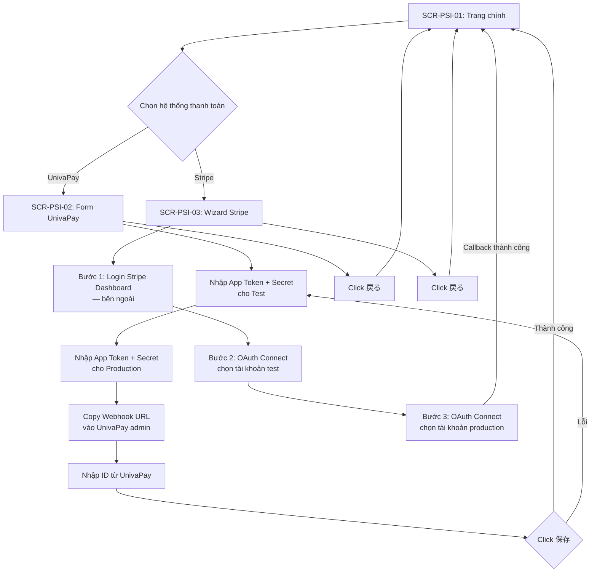

# UI Spec — FA-034: Liên kết hệ thống thanh toán「決済システム連携設定」

> **Mã tính năng**: FA-034
> **Portal**: Admin
> **URL chính**: `/basic/list-items`
> **Ngày tạo**: 2026-03-26
> **Nguồn dữ liệu**: Playwright CLI snapshots + screenshots

---

## 1. Tổng quan

Tính năng cho phép Admin cấu hình liên kết với các hệ thống thanh toán bên ngoài để xử lý giao dịch mua bán sản phẩm (đơn lẻ, subscription...) trong hệ thống LME. Hiện hỗ trợ 2 nhà cung cấp thanh toán:

1. **UnivaPay** (UnivaPaycast) — liên kết qua API token (app token + app secret) cho cả môi trường test và production, kèm webhook URL và ID.
2. **Stripe** — liên kết qua OAuth Connect flow (chọn tài khoản Stripe cho test và production).

Trang chính hiển thị danh sách 2 hệ thống thanh toán với nút「アカウント連携する」để mở form/wizard cấu hình tương ứng.

---

## 2. Actors

| Actor | Vai trò | Hành động chính |
|-------|---------|----------------|
| Admin (LINE OA) | Chủ tài khoản | Cấu hình liên kết thanh toán UnivaPay / Stripe |
| Staff | Nhân viên (nếu được phân quyền) | Có thể truy cập nếu Admin cho phép — cần xác nhận quyền |

---

## 3. Danh sách màn hình

| Mã | Tên | Mô tả | URL |
|----|-----|-------|-----|
| SCR-PSI-01 | Trang chính liên kết thanh toán | Hiển thị danh sách hệ thống thanh toán hỗ trợ | `/basic/list-items` |
| SCR-PSI-02 | Form liên kết UnivaPay | Form nhập token/secret cho test & production, webhook, ID | Modal/trang con từ SCR-PSI-01 |
| SCR-PSI-03 | Wizard liên kết Stripe | Hướng dẫn 3 bước: login Stripe, chọn tài khoản test, chọn tài khoản production | Modal/trang con từ SCR-PSI-01 |

---

## 4. Chi tiết từng màn hình

### 4.1. SCR-PSI-01 — Trang chính liên kết thanh toán

**Screenshot**: `screenshots/main.png`

#### Layout

| Vùng | Mô tả |
|------|-------|
| Header | Header chung Admin portal (logo L Message, tên bot, plan, số lượng tin nhắn) |
| Sidebar | Sidebar chung Admin portal — menu「決済システム連携設定」thuộc nhóm「システム管理関連」 |
| Main Content — Tiêu đề | Heading「決済システム連携設定」(h3) |
| Main Content — Mô tả | 2 đoạn text hướng dẫn: (1) giải thích mục đích cài đặt liên kết; (2) yêu cầu tạo tài khoản trước nếu chưa có |
| Main Content — Card UnivaPay | Card hiển thị thông tin UnivaPay: logo, nhãn「オススメ」(đề xuất), thông tin phí, nút liên kết, link đăng ký |
| Main Content — Card Stripe | Card hiển thị thông tin Stripe: logo, thông tin phí, nút liên kết, link tạo tài khoản |

#### Nội dung text tĩnh

| Vị trí | Text JP | Dịch nghĩa |
|--------|---------|-------------|
| Tiêu đề trang | 「決済システム連携設定」 | Cài đặt liên kết hệ thống thanh toán |
| Mô tả dòng 1 | 「ご利用いただいている決済システムとの連携設定を行います。」 | Thực hiện cài đặt liên kết với hệ thống thanh toán đang sử dụng |
| Mô tả dòng 2 | 「連携を希望されるシステムのアカウントをお持ちでない場合は、先にアカウントの作成を行なってください。」 | Nếu chưa có tài khoản, hãy tạo trước |

#### Card UnivaPay — Chi tiết

| Thành phần | Nội dung | Loại | Ghi chú |
|-----------|---------|------|---------|
| Logo | Logo UnivaPay (hình ảnh) | img | Hiển thị phía trên bên trái card |
| Nhãn đề xuất | 「オススメ」 | Badge/label | Nổi bật, có thể là màu đỏ/cam — đánh dấu đây là lựa chọn được khuyến nghị |
| Text khuyến mãi | 「初期費用・月額費用が無料になるのは[ここから申込み]された方限定です！」 | Text + link | Link「ここから申込み」→ `https://lme.jp/manual/univapay/` |
| Nút liên kết | 「アカウント連携する」 | Button (primary, green) | Click → mở SCR-PSI-02 (form UnivaPay) |
| Link đăng ký LME plan | 「L Message限定プラン お申し込みはこちら」 | Link | → `https://lme.jp/manual/univapay/` |
| Thông tin phí 1 | 「初期・月額費用 0円」 | Text | Phí khởi tạo và hàng tháng: 0 yen |
| Thông tin phí 2 | 「決済手数料 2.8% 〜」 | Text | Phí giao dịch: từ 2.8% |
| Thông tin phí 3 | 「分割決済・一括入金対応」 | Text | Hỗ trợ thanh toán trả góp và nhận tiền một lần |

#### Card Stripe — Chi tiết

| Thành phần | Nội dung | Loại | Ghi chú |
|-----------|---------|------|---------|
| Logo | Logo Stripe (text "stripe") | Text/img | Hiển thị phía trên bên trái card |
| Nút liên kết | 「アカウント連携する」 | Button (primary, green) | Click → mở SCR-PSI-03 (wizard Stripe) |
| Link tạo tài khoản | 「アカウント作成」 | Link | → `https://stripe.com/` |
| Thông tin phí | 「決済手数料 3.6%」 | Text | Phí giao dịch: 3.6% |

#### Action Buttons

| Label JP | Loại | Vị trí | Hành vi |
|---------|------|--------|---------|
| 「アカウント連携する」(UnivaPay) | Button (primary) | Card UnivaPay | Mở SCR-PSI-02 — form nhập thông tin UnivaPay |
| 「アカウント連携する」(Stripe) | Button (primary) | Card Stripe | Mở SCR-PSI-03 — wizard liên kết Stripe |

#### Observations
- UnivaPay được đánh dấu「オススメ」(đề xuất) — hệ thống ưu tiên UnivaPay hơn Stripe.
- UnivaPay có phí thấp hơn (2.8%) và hỗ trợ trả góp, trong khi Stripe phí 3.6%.
- Cả 2 card đều có nút「アカウント連携する」cùng label nhưng hành vi khác nhau (mở form khác nhau).
- Link「ここから申込み」và「L Message限定プラン お申し込みはこちら」đều trỏ đến trang hướng dẫn bên ngoài (lme.jp).
- URL trang là `/basic/list-items` — tên URL không rõ ràng liên quan đến thanh toán, có thể là tên cũ hoặc dùng chung.

---

### 4.2. SCR-PSI-02 — Form liên kết UnivaPay

**Screenshot**: `screenshots/univapay-modal.png`

#### Layout

| Vùng | Mô tả |
|------|-------|
| Header | Giống SCR-PSI-01 (header chung Admin portal) |
| Sidebar | Giống SCR-PSI-01 |
| Main Content — Breadcrumb | 「連携設定」+ logo UnivaPay |
| Main Content — Bước 1 | Form nhập app token/secret cho test và production |
| Main Content — Bước 2 | Webhook URL (read-only) cần nhập vào UnivaPay admin |
| Main Content — Bước 3 | Nhập ID tạo trên UnivaPay |
| Main Content — Footer | Nút「保存」và「戻る」 |

#### Heading & Cấu trúc bước

| Bước | Heading JP | Mô tả |
|------|-----------|-------|
| 1 | 「1.UnivaPay管理画面から接続情報を入力する」 | Nhập thông tin kết nối từ UnivaPay admin |
| 2 | 「2.UnivaPay管理画面に以下のwebhookを入力する」 | Copy webhook URL vào UnivaPay admin |
| 3 | 「3.UnivaPay管理画面で作成したIDを以下に入力する」 | Nhập ID đã tạo trên UnivaPay |

#### Form Fields

| # | Label JP | Nhóm | Input Type | Required | Placeholder | Default | Validation | Ghi chú |
|---|---------|------|-----------|----------|-------------|---------|-----------|---------|
| 1 | 「アプリトークン」 | 「テスト環境用」(Bước 1) | textbox | Chưa rõ | (trống) | (trống) | Chưa rõ | App Token cho môi trường test |
| 2 | 「アプリシークレット」 | 「テスト環境用」(Bước 1) | textbox | Chưa rõ | (trống) | (trống) | Chưa rõ | App Secret cho môi trường test |
| 3 | 「アプリトークン」 | 「本番環境用」(Bước 1) | textbox | Chưa rõ | (trống) | (trống) | Chưa rõ | App Token cho môi trường production |
| 4 | 「アプリシークレット」 | 「本番環境用」(Bước 1) | textbox | Chưa rõ | (trống) | (trống) | Chưa rõ | App Secret cho môi trường production |
| 5 | 「webhook」 | Bước 2 | textbox (disabled/readonly) | — | — | `https://form.watermeru.com/mobile/univapay-callback-payment` | — | URL cố định, user không chỉnh sửa. Có nút copy bên cạnh (icon) |
| 6 | 「ID」 | Bước 3 | textbox | Chưa rõ | (trống) | (trống) | Chưa rõ | ID tạo trên UnivaPay admin |

#### Action Buttons

| Label JP | Loại | Vị trí | Hành vi |
|---------|------|--------|---------|
| 「保存」 | Button (primary) | Cuối form | Lưu thông tin liên kết UnivaPay |
| 「戻る」 | Button (secondary/text) | Bên cạnh「保存」 | Quay về SCR-PSI-01 |

#### Observations
- Form chia thành 3 bước rõ ràng với heading đánh số.
- Bước 1 có 2 section:「テスト環境用」(test) và「本番環境用」(production) — mỗi section có cùng 2 field (token + secret).
- Bước 2 chỉ hiển thị webhook URL read-only với nút copy — user cần tự paste vào UnivaPay admin.
- Webhook URL: `https://form.watermeru.com/mobile/univapay-callback-payment` — endpoint nhận callback thanh toán từ UnivaPay.
- Bước 3 chỉ có 1 field「ID」— không rõ đây là Store ID, Merchant ID hay loại ID khác. Cần kiểm tra source code.
- Không thấy validation message hay required marker (*) trên UI — cần xác nhận từ code.
- Breadcrumb hiển thị「連携設定」— cho thấy đây là trang con của SCR-PSI-01.

---

### 4.3. SCR-PSI-03 — Wizard liên kết Stripe

**Screenshot**: `screenshots/stripe-modal.png`

#### Layout

| Vùng | Mô tả |
|------|-------|
| Header | Giống SCR-PSI-01 (header chung Admin portal) |
| Sidebar | Giống SCR-PSI-01 |
| Main Content — Breadcrumb | 「連携設定」+ logo Stripe |
| Main Content — Bước 1 | Hướng dẫn login Stripe + link |
| Main Content — Bước 2 | Chọn tài khoản Stripe cho test |
| Main Content — Bước 3 | Chọn tài khoản Stripe cho production |
| Main Content — Footer | Nút「戻る」 |

#### Heading & Cấu trúc bước

| Bước | Heading JP | Mô tả |
|------|-----------|-------|
| 1 | 「1.Stripe管理画面にログイン」 | Đăng nhập vào Stripe Dashboard |
| 2 | 「2.テスト決済用Stripeアカウントを選択」 | Chọn tài khoản Stripe cho thanh toán test |
| 3 | 「3.本番決済用Stripeアカウントを選択」 | Chọn tài khoản Stripe cho thanh toán production |

#### Nội dung từng bước

**Bước 1 — Login Stripe**

| Thành phần | Nội dung | Loại | Ghi chú |
|-----------|---------|------|---------|
| Mô tả | 「Stripeアカウントをまだお持ちでない方は[こちら]」 | Text + link | Link「こちら」→ `https://stripe.com/` |
| Link action | 「Stripe管理画面 ログイン」 | Link/Button (card dạng lớn) | → `https://dashboard.stripe.com/login` — mở trang login Stripe |
| Hình minh họa | Screenshot Stripe Dashboard | img | Hình minh họa giao diện Stripe |

**Bước 2 — Chọn tài khoản test**

| Thành phần | Nội dung | Loại | Ghi chú |
|-----------|---------|------|---------|
| Link action | 「テスト決済に利用する アカウントを選択」 | Link/Button (card dạng lớn) | → `/sales/stripe/test/connect` — khởi tạo Stripe Connect OAuth cho test |
| Hình minh họa | Screenshot giao diện chọn | img | Hình minh họa |

**Bước 3 — Chọn tài khoản production**

| Thành phần | Nội dung | Loại | Ghi chú |
|-----------|---------|------|---------|
| Cảnh báo | 「アカウントが複数ある場合は必ず2.テスト決済用で選択したアカウントと同じものを選択してください。」 | Text | Phải chọn cùng tài khoản với bước 2 |
| Link action | 「本番決済に利用する アカウントを選択」 | Link/Button (card dạng lớn) | → `#` (hiện tại disabled hoặc chưa kích hoạt — URL là "#") |
| Hình minh họa | Screenshot giao diện chọn | img | Hình minh họa |

#### Action Buttons

| Label JP | Loại | Vị trí | Hành vi |
|---------|------|--------|---------|
| 「戻る」 | Button (secondary) | Cuối trang | Quay về SCR-PSI-01 |

#### Observations
- Stripe dùng OAuth Connect flow (không nhập token thủ công như UnivaPay).
- Bước 2 trỏ đến `/sales/stripe/test/connect` — đây là internal route khởi tạo OAuth flow với Stripe.
- Bước 3 link production hiện là `#` — có thể do: (a) cần hoàn thành bước 2 trước, hoặc (b) tài khoản hiện tại chưa liên kết test.
- Có cảnh báo quan trọng: phải chọn cùng tài khoản Stripe cho cả test và production.
- Không có nút「保存」— liên kết Stripe được thực hiện tự động qua OAuth callback.
- Mỗi bước hiển thị dưới dạng card lớn có hình minh họa, tạo trải nghiệm wizard trực quan.

---

## 5. User Flows

### 5.1. Happy Path — Liên kết UnivaPay

1. Admin truy cập `/basic/list-items` → hiển thị SCR-PSI-01.
2. Admin click「アカウント連携する」trên card UnivaPay → chuyển sang SCR-PSI-02.
3. Admin nhập「アプリトークン」và「アプリシークレット」cho「テスト環境用」.
4. Admin nhập「アプリトークン」và「アプリシークレット」cho「本番環境用」.
5. Admin copy webhook URL và paste vào UnivaPay admin panel (thao tác bên ngoài LME).
6. Admin tạo ID trên UnivaPay admin, nhập vào field「ID」.
7. Admin click「保存」→ hệ thống lưu thông tin liên kết.
8. (Dự kiến) Hiển thị thông báo thành công hoặc quay về SCR-PSI-01 với trạng thái đã liên kết.

### 5.2. Happy Path — Liên kết Stripe

1. Admin truy cập `/basic/list-items` → hiển thị SCR-PSI-01.
2. Admin click「アカウント連携する」trên card Stripe → chuyển sang SCR-PSI-03.
3. Admin click「Stripe管理画面 ログイン」→ mở tab mới tại `https://dashboard.stripe.com/login` → đăng nhập Stripe (thao tác bên ngoài).
4. Admin quay lại LME, click「テスト決済に利用する アカウントを選択」→ redirect đến Stripe OAuth → chọn tài khoản → callback về LME.
5. Admin click「本番決済に利用する アカウントを選択」→ tương tự bước 4 cho production.
6. (Dự kiến) Hệ thống tự động lưu Stripe credentials qua OAuth callback.

### 5.3. Error / Edge Cases

| Tình huống | Hành vi dự kiến |
|-----------|----------------|
| Nhập sai token/secret UnivaPay | Dự kiến hiển thị lỗi khi save hoặc khi test kết nối — cần xác nhận từ code |
| Chưa hoàn thành bước 2 Stripe, click bước 3 | Link bước 3 là `#` → không chuyển trang. Có thể hiển thị thông báo cần hoàn thành bước 2 trước |
| Chọn khác tài khoản Stripe giữa test và production | Có cảnh báo text nhưng chưa rõ có validation server-side không |
| Session Stripe hết hạn | OAuth flow sẽ yêu cầu đăng nhập lại |
| Đã liên kết rồi, truy cập lại | Chưa rõ — có thể hiển thị trạng thái đã liên kết, hoặc cho phép cập nhật |

---

## 6. Flow Diagram

---

## 7. Điểm chưa rõ / Cần điều tra thêm

| # | Vấn đề | Mức độ | Gợi ý điều tra |
|---|--------|--------|----------------|
| 1 | Trạng thái hiển thị khi đã liên kết thành công (đã kết nối UnivaPay/Stripe) — UI có thay đổi không? Có nút ngắt kết nối không? | **Trung bình** | Kiểm tra source code controller + view; hoặc liên kết thử rồi chụp lại |
| 2 | Field「ID」ở bước 3 UnivaPay là loại ID gì? (Store ID? Merchant ID? Application ID?) | **Trung bình** | Đọc code controller xử lý save + tên cột DB |
| 3 | Validation rules cho các fields UnivaPay (required? format? length?) | **Trung bình** | Đọc controller validation + form request |
| 4 | Bước 3 Stripe (production) link là `#` — điều kiện nào để kích hoạt? | **Trung bình** | Đọc Vue/Blade template điều kiện render link |
| 5 | Có webhook/callback URL nào cho Stripe Connect OAuth không? | **Trung bình** | Grep routes cho `stripe`, `connect`, `callback` |
| 6 | Staff có quyền truy cập tính năng này không? Có permission check không? | **Thấp** | Kiểm tra middleware trên route `/basic/list-items` |
| 7 | Liên kết thanh toán ảnh hưởng đến tính năng nào khác? (FA-026 Sản phẩm đơn lẻ?) | **Thấp** | Kiểm tra cross-reference trong code |
| 8 | Nút copy webhook URL hoạt động như thế nào? (clipboard API? flash message?) | **Thấp** | Kiểm tra JS handler |

---

## 8. Phụ thuộc chéo (Cross-references)

### Tính năng liên quan

| Tính năng | Mã | Quan hệ |
|-----------|----|----|
| Sản phẩm đơn lẻ | FA-026 | Sử dụng hệ thống thanh toán đã liên kết để xử lý giao dịch |
| Hợp đồng và thanh toán | FA-031 | Có thể liên quan đến thông tin thanh toán plan LME |
| Đặt lịch bài học / salon / sự kiện | FA-019, FA-020, FA-021 | Có thể dùng thanh toán nếu đặt lịch có phí |

### Shared Components
Tính năng này **không sử dụng shared component** nào đã đăng ký. Giao diện đơn giản, không có tag selector, filter, action settings hay message editor.

### External Dependencies

| Hệ thống ngoài | Mục đích | URL |
|----------------|---------|-----|
| UnivaPay Admin | Lấy app token/secret, tạo ID, cấu hình webhook | (trang quản trị UnivaPay) |
| Stripe Dashboard | Đăng nhập và chọn tài khoản Stripe | `https://dashboard.stripe.com/login` |
| Stripe OAuth Connect | Liên kết tài khoản Stripe qua OAuth | `/sales/stripe/test/connect`, `/sales/stripe/*/connect` |
| LME Manual | Hướng dẫn đăng ký UnivaPay LME plan | `https://lme.jp/manual/univapay/` |
