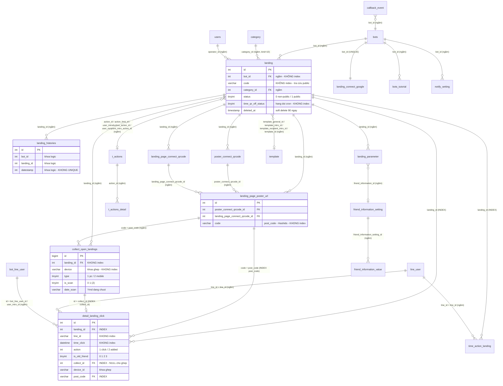

# FA-017 — QR Code Action 「QRコードアクション」 — Database Mapping

> **Nguồn phân tích**
> - `features/admin/qr-landing/web/logic-spec.md` (models, business rules, validation)
> - `features/admin/qr-landing/web/api-spec.md` (69 endpoints — 62 admin + 7 public)
> - `features/admin/qr-landing/job/job-spec.md` (state machines, bảng hàng đợi)
> - `db/index.md`, `db/schema/tables/*.sql`, `db/data/*.sql` (dump thực tế)
> - Blade views `src/web/sns-line/resources/views/basic/qr_code/v2/**` — dùng để lấy label tiếng Nhật
>
> ⚠ **Lịch sử**: bản đầu tiên của tài liệu này được viết khi `_internal/db-hint.md` **chưa tồn tại** (agent `ui-parser` chạy song song), nên mục 5 dùng 9 mã màn hình **tạm đặt** `SCR-QRL-01..09` — trong đó **8/9 mã va chạm** với mã chuẩn của `ui/ui-spec.md`.
>
> ✅ **Đã khắc phục ngày 2026-08-24** (theo `_internal/db-hint.md` — nay đã có, 839 dòng — và `_internal/validation-report.md`):
> - Toàn bộ mục 5 đã được **đánh số lại** theo 39 mã chuẩn `SCR-QRL-01…39` của `ui/ui-spec.md` (vấn đề **V-02**).
> - Bổ sung mapping cho **11 màn** trước đây bị bỏ sót, trong đó có `SCR-QRL-29`, `30`, `38`, `39` (vấn đề **V-04**).
> - Xem chi tiết mọi thay đổi tại mục **12. Lịch sử sửa đổi** ở cuối file.
>
> ⚠ **Cảnh báo về độ tin cậy của dump**: dump `lme_db` hiện có (308 bảng) **KHÔNG phủ hết** hệ thống thật — thiếu ít nhất **2 bảng** và **2 cột**. Xem mục **7.4**. Khi một đối tượng có mặt trong code (model Laravel / entity Java / call site) nhưng vắng mặt trong dump, kết luận mặc định của tài liệu này là **「dump thiếu」**, không phải 「đối tượng không tồn tại」.
> - Label tiếng Nhật được trích **trực tiếp từ file blade** (nguồn tin cậy Cao về nội dung, nhưng chưa xác nhận thứ tự/nhóm hiển thị thực tế trên UI vì Bước 1 UI-scan đã bị bỏ qua).

---

## 1. Tổng quan

### 1.1. Phạm vi

Tính năng FA-017 xoay quanh một bảng gốc duy nhất — **`landing`** (77 cột) — cùng 4 nhóm bảng vệ tinh:

| Nhóm | Bảng | Vai trò |
|---|---|---|
| Cấu hình QR | `landing` | Toàn bộ cấu hình 1 mã QR / link kết bạn |
| Sự kiện thô | `collect_open_landings`, `detail_landing_click` | Lượt mở trang, lượt click/kết bạn của từng LINE User |
| Tổng hợp | `landing_histories` | Số liệu theo ngày do cron `statistic:landing_action` sinh |
| Liên kết ngoài | `landing_parameter`, `landing_connect_google`, `poster_connect_qrcode`, `landing_page_connect_qrcode`, `landing_page_poster_url` | Tham số `cid1..cid5`, Google Sheet, ma trận 広告 × LP |

### 1.2. Thống kê

| Chỉ số | Giá trị |
|---|---|
| Bảng **Primary** | **9** |
| Bảng **Secondary** | **11** |
| Bảng nhắc trong spec nhưng **THIẾU trong dump** (tồn tại trong hệ thống thật) | **2** (`line_user_add_friend_history`, `schedule_change_bot` — xem mục 7.4) |
| Cột nhắc trong spec nhưng **THIẾU trong dump** | **2** (`detail_landing_click.action_multi_capture_id`, `.message_id` — xem mục 7.4) |
| Bảng bị gọi **sai tên** trong spec khác (đã đính chính) | **4** (`actions` → `t_actions`; `action_detail` → `t_actions_detail`; `friend_info_value` → `friend_information_value`; `messages_v2` → `messages_v2s`) |
| Tổng số cột đã document | ~190 |
| Màn hình ui-spec đã có mapping | **39/39 (100%)** — xem mục 5.40 |
| Cột `landing` xác định **không dùng ở UI v2** | 14 |

### 1.3. Phát hiện quan trọng ngay từ đầu

| # | Phát hiện | Ảnh hưởng |
|---|---|---|
| 1 | Model `App\Actions` → bảng thật là **`t_actions`** (không phải `actions`); `App\ActionDetail` → **`t_actions_detail`** | Danh sách bảng trong yêu cầu ban đầu ghi sai tên; đã đính chính |
| 2 | `line_user_add_friend_history` **thiếu trong dump** 308 bảng — nhưng **chắc chắn tồn tại trong hệ thống thật**: model `App\Models\LineUserAddFriendHistory`, call site `QRCodeController.php:2987` (`::addHistory`), entity Java `LineUserAddFriendHistory.java` | ⚠ **Lỗi ở phía dump**, không phải lỗi job-spec. Mapping bước 8 của `doHandleFollowEvent` và EP-69 vẫn được ghi nhận (mục 5.38.2) nhưng **không kiểm chứng được kiểu cột**. Cần export bổ sung — mục 7.4 |
| 3 | `schedule_change_bot` **thiếu trong dump** — nhưng có entity `ScheduleChangeBot.java` + `ScheduleChangeBotRepository.java` trong `src/job` | ⚠ **Lỗi ở phía dump**. Nguyên nhân khả dĩ nhất: hệ thống dùng **nhiều database** (Spring Boot khai báo `linedb`/`backenddb`/`historydb`; Laravel `App\CallbackEvent` dùng connection riêng **`mysql_callback`**) ⇒ dump `lme_db` không phủ hết. Mục 7.4 |
| 4 | `friend_info_value` (tên trong job-spec) thực tế là **`friend_information_value`** | Đính chính |
| 5 | `landing.time_qr_off_status` trong dump: **565/566 dòng = NULL**, 1 dòng = `0` | State machine 0/1/2/3 chỉ tồn tại trong code, chưa có bằng chứng dữ liệu cho `1/2/3` |
| 6 | `callback_event.status` trong dump có giá trị **3000, 102, 103, 200** — không nằm trong hằng số `CallbackEvent.java:9-24` | Đã truy được **`103`** = LINE Profile API trả 「Not found」 (`HandleCallback.php:967`). **`3000` / `102` / `200` không truy được trong cả 2 codebase** ⇒ nguồn ghi nằm **ngoài repo** (service nhận webhook LINE). Ngoài ra giá trị **`10` xung đột ngữ nghĩa** giữa Laravel và Spring Boot — xem mục 6.6 |
| 7 | `landing_connect_google.status = 4` chiếm **8/20 = 40%** dữ liệu, không có trong hằng số model | 2 hệ quả nghiệp vụ chưa spec nào ghi: cron A-2 **bỏ qua 40% bot**; BR-21 **không chặn** huỷ liên kết — xem mục 6.12 |
| 8 | Dump schema `detail_landing_click.sql` (22 cột) **thiếu 2 cột có thật trên production**: `action_multi_capture_id`, `message_id` | Entity Java `DetailLandingClick.java:48-52` khai báo `@Column` cho cả hai + `DetailLandingClickRepository` có 2 native UPDATE ⇒ **dump lỗi thời**, không phải job-spec sai. Xem mục 4.2 và 7.4 |

---

## 2. Primary Tables

| # | Table | Model Laravel / Entity Java | Vai trò | Số cột | Ghi bởi | Đọc bởi |
|---|---|---|---|---|---|---|
| P-1 | `landing` | `App\Landing` / `LandingQR.java` | Cấu hình gốc 1 mã QR Code Action | 77 | Laravel (EP-06,09,10,11,12,23,25,26,27,50,58,59,64), cron A-2/A-3, Spring Boot (`total_user_friend`, `count_action`), `ChangeBotJob` | Laravel toàn bộ endpoint, cron A-1/A-2/A-3/A-4, Spring Boot `doHandleFollowEvent` |
| P-2 | `detail_landing_click` | `App\DetailLandingClick` / `DetailLandingClick.java` | 1 dòng = 1 lượt LINE User mở LIFF / kết bạn qua QR | 22 | **Laravel `LiffController:1234`** (tạo, `action = 1`), **Spring Boot** `HandlePostbackTask` (cập nhật `action=2`, `is_old_friend`, `is_action_web`, `bot_line_user_id`, `action_multi_capture_id`, `message_id`), **Spring Boot** `MappingDeviceTask` (`collect_id`) | EP-16 tab1/tab2, EP-37, EP-38, EP-39, EP-41; cron A-1; `HandleExportCsvTask` |
| P-3 | `collect_open_landings` | `App\CollectOpenLanding` / `CollectOpenLanding.java` | 1 dòng = 1 lượt **mở trang QR** (trước khi kết bạn) | 12 | **Chỉ Laravel** — `QRCodeController@countScan` (EP-64) và `LiffController:1207` | EP-16 tab1/tab3, EP-37, EP-39; cron A-1; Spring Boot `MappingDeviceTask` (chỉ đọc) |
| P-4 | `landing_histories` | `App\LandingHistory` | Bảng tổng hợp số liệu **theo ngày** (1 dòng = 1 landing × 1 ngày) | 21 | cron A-1 `statistic:landing_action` (`updateOrCreate`); `FriendInformationController:1290` và `FriendlistController:2820` (trừ bớt khi xoá dữ liệu bạn bè) | EP-16 tab1; cron A-2 (đẩy Google Sheet) |
| P-5 | `landing_parameter` | `App\LandingParameter` / `LandingParameter.java` | Ánh xạ 5 slot `cid1..cid5` → `friend_information_setting` | 9 | Laravel EP-27 (`updateOrCreate` đủ 5 dòng); `LandingCopyService::copyLandingParameter` | Laravel EP-28; **Spring Boot** `BotLineUserModel.setFriendInfoByLanding` |
| P-6 | `landing_connect_google` | `App\LandingConnectGoogle` | Token & trạng thái liên kết Google Sheets **theo bot** (UNIQUE `bot_id`) | 11 | Laravel EP-51 (tạo), EP-52 (lưu token), EP-53 (huỷ); cron A-2 (refresh token); `CreateGoogleSheetCommand` | Laravel EP-51; cron A-2; `saveLandingV2` (EP-50) |
| P-7 | `poster_connect_qrcode` | `App\PosterConnectQrCode` | Danh sách 「広告名」 (bước 1 LP Poster) | 6 | Laravel EP-30 (`updateOrCreate` / xoá cứng); `LandingCopyService::copyPosterConnectQr` | EP-29, EP-33, EP-35 |
| P-8 | `landing_page_connect_qrcode` | `App\LandingPageConnectQrCode` | Danh sách 「LP」 + URL (bước 2 LP Poster) | 7 | Laravel EP-32; `LandingCopyService::copyLandingPageConnectQr` | EP-31, EP-33, EP-35 |
| P-9 | `landing_page_poster_url` | `App\LandingPagePosterUrl` | **Tích Descartes** 広告 × LP — mỗi cặp 1 `post_code` duy nhất | 8 | `PosterSettingService::saveLandingPagePosterUrl` (gọi từ EP-32 và khi copy QR) | EP-33, EP-35; EP-16 tab2/tab3 (join theo `code`) |

---

## 3. Secondary Tables

| # | Table | Model / Entity | Liên quan thế nào | Số cột | Ghi bởi | Đọc bởi |
|---|---|---|---|---|---|---|
| S-1 | `time_action_landing` | `TimeActionLanding.java` | Chống chạy lại action quá dày (`interval_action`) — 1 dòng / (landing, line_id) | 7 | **Chỉ Spring Boot** `doHandleFollowEvent` bước 5 | Chỉ Spring Boot; `ChangeBotJob` xoá theo `bot_id` |
| S-2 | `callback_event` | `CallbackEvent.java` | **Bảng hàng đợi** webhook LINE — nguồn kích hoạt toàn bộ luồng kết bạn | 10 | Service nhận webhook (ngoài FA-017); Spring Boot cập nhật `status` | Spring Boot `HandlePostbackTask` |
| S-3 | `category` | `App\Category` | Thư mục QR — lọc `kind = 10` | 9 | EP-18, EP-19, EP-20, EP-21; EP-08 (bỏ cờ `is_deleted` khi restore QR) | EP-01, EP-02, EP-17 |
| S-4 | `template` | `App\Template` | Nội dung tin nhắn của QR (`template_general_id`, `template_intro_id`…), lưu dạng **template ẩn** `category_id = -111222` | 33 | EP-09, EP-10 (tạo/sửa/xoá); `saveLandingV2` (tạo mặc định + clone khi copy) | EP-13, EP-14, EP-22, EP-48; Spring Boot bước 9b |
| S-5 | `t_actions` ⚠ | `App\Actions` (`protected $table = 't_actions'`) | Action gắn vào QR — `action_id`, `user_introduction_action_id`, `action_limit_id` | 6 | `cloneAction()` khi copy QR | EP-13, EP-14, EP-22, EP-44; Spring Boot `doAction` |
| S-6 | `t_actions_detail` ⚠ | `App\ActionDetail` (`protected $table = 't_actions_detail'`) | Các bước chi tiết của 1 action | — | `cloneAction()` | EP-22 (`getActionDetailByActionId`) |
| S-7 | `bots_tutorial` | `App\BotsTutorial` | `status_qr_code = 1` khi bot tạo QR đầu tiên (BR-18) | 11 | EP-50, EP-58 | Layout tutorial (ngoài FA-017) |
| S-8 | `notify_setting` | `App\NotifySetting` | `when_adding_friends` (CSV id QR), `is_all_qrcode_new`, `is_notify_qr_code` | 65 | `syncNotifyNewItemForBot()` khi tạo QR (BR-19) | Spring Boot bước 12 (thông báo mobile) |
| S-9 | `line_user` | `App\LineUser` | Thông tin LINE User hiển thị ở tab 「友だち別」 | 18 | Ngoài FA-017 | EP-16 tab2, EP-38 (join `line_id`) |
| S-10 | `bot_line_user` | `App\BotLineUser` | `u_code` định danh người giới thiệu (BR-39); `bot_line_user_id` trên click | 26 | Ngoài FA-017 (`checkFriend` có tạo) | EP-65 (`pageIntro`), Spring Boot bước 2 |
| S-11 | `bots` | `App\Bots` | `liff_app_id`, `plan_type`, `domain_url_shorten`, `url_add_friend`, `free_send_count` | 113 | EP-15 (`free_send_count`) | Hầu hết endpoint |

**Bảng phụ trợ khác có chạm tới nhưng không thuộc phạm vi mapping đầy đủ**: `bot_contracts`, `bot_slots`, `users` (`hide_action_intro_modal` — xem mục **5.20**), `conversation` (`is_blocked`, `blocked_at` — mục 5.27), `messages_v2s` *(⚠ tên đúng, không phải `messages_v2`)*, `add_friend_setting`, `friend_information_setting`, `friend_information_value` (mục 5.15), `bot_friend_statistic`, `aff_result`, `csv_management`, `line_user_add_friend_history` *(thiếu trong dump — mục 7.4)*.

> ⚠ **Ghi chú (V-13)**: 6 bảng trong danh sách trên thực chất **có tác động trực tiếp tới UI hoặc business rule** của FA-017 và nên được nâng lên **Secondary table** ở lần chạy `/spec-db` tiếp theo: `conversation` (cột 「ブロックされた日時」 + BR-30), `add_friend_setting` (quyết định hành vi job bước 9a/9b), `users` (BR-40), `friend_information_value` (đích ghi `cid1..cid5`), `messages_v2s` + `bot_friend_statistic` + `aff_result` (EP-69 — mục 5.38.2). Lượt sửa 2026-08-24 đã **map đầy đủ cột của chúng trong mục 5**, nhưng **chưa** viết mục Entity Details riêng.

---

## 4. Entity Details

### 4.1. `landing` (P-1) — 77 cột

Bảng gốc. Model `App\Landing`, `$guarded = []` (mọi cột mass-assignable), `SoftDeletes` qua `deleted_at`.

#### 4.1.1. Nhóm định danh & tổ chức

| Cột | Kiểu | Null | Default | Key | Mô tả |
|---|---|---|---|---|---|
| `id` | int(10) UNSIGNED | Không | AUTO_INCREMENT | **PK** | Khoá chính |
| `bot_id` | int(11) | Không | — | FK ngầm → `bots.id` | Bot (LINE OA) sở hữu QR — nền tảng multi-tenant |
| `name` | varchar(255) | Có | NULL | — | 「管理名」 — tên quản lý QR. Server chỉ validate ở EP-59 (`required\|max:255`); client giới hạn 50 ký tự |
| `code` | varchar(100) | Có | NULL | — | Mã ngẫu nhiên 6 ký tự (`str_random(6)`), **duy nhất trong phạm vi 1 bot** (BR-01). Dùng làm tham số `?uLand=` |
| `link_qr_code` | varchar(255) | Có | NULL | — | Link kết bạn đầy đủ. ⚠ Giá trị trong DB là **bản lịch sử** sinh lúc tạo QR (`saveLandingV2:281`) và có thể lỗi thời sau khi đổi bot/domain; **EP-46 (`:623-628`) và EP-24 (`:3601-3605`) ghi đè cả `link_qr_code` lẫn `new_link_qr_code`** bằng `{env(URL_OUTSIDE_STEP)}landing-qr/{bots.liff_app_id}?uLand={code}` trước khi render ⇒ **giá trị cột không bao giờ hiển thị trực tiếp** |
| `path_landing` | varchar(255) | Có | NULL | — | Đường dẫn tương đối file PNG mã QR (BaconQrCode 300×300). Accessor `path_landing_with_domain` gắn `URL_SERVER_MEDIA` |
| `category_id` | int(11) | Có | NULL | FK ngầm → `category.id` (`kind = 10`) | Thư mục chứa QR. `0` hoặc `NULL` = 「未分類」 |
| `position` | int(11) | Không | 1 | — | Thứ tự sắp xếp thủ công (EP-42) |
| `operator_id` | int(11) | Có | NULL | FK ngầm → `users.id` | Người thao tác gần nhất (ghi khi xoá mềm — EP-03) |
| `created_at` | timestamp | Có | NULL | — | Thời điểm tạo |
| `updated_at` | timestamp | Có | CURRENT_TIMESTAMP ON UPDATE | — | ⚠ EP-42 cố tình giữ nguyên giá trị này (BR-41) |
| `deleted_at` | timestamp | Có | NULL | — | Soft delete. Cron A-4 xoá cứng sau 90 ngày |

#### 4.1.2. Nhóm Action 「読み込み時アクション」

| Cột | Kiểu | Null | Default | Mô tả |
|---|---|---|---|---|
| `action_type` | tinyint(4) | Không | 1 | 「アクションの稼働回数」 — `1` = 「1度のみアクション稼働」, `2` = 「何度でもアクション稼働」. Comment schema: `1: action 1 lần, 2: action nhiều lần` |
| `action_id` | int(11) | Có | NULL | FK ngầm → `t_actions.id` — action chính chạy khi quét |
| `action_with_friend` | tinyint(4) | Không | 1 | 「稼働対象」 — `1` = 「新規友だち追加時のみ」, `2` = 「全ての友だち」 |
| `interval_action` | tinyint(4) | Không | 0 | 「連続アクション制限」 — `0` 「設定しない」 / `1` 「アクション稼働当日中は稼働しない（翌0:00にリセット）」 / `2` 「アクション稼働後 N 時間経過で再度稼働可能」. ⚠ Comment schema `0: no set, 1: set` **lỗi thời** — code Java dùng 3 giá trị |
| `time_interval_action` | float | Có | NULL | Số giờ chờ, chỉ lưu khi `interval_action = 2` (BR-45) |
| `action_limit_id` | int(11) | Có | NULL | FK ngầm → `t_actions.id` — action chạy khi QR OFF nhưng `use_action_limit = 1` |
| `use_action_limit` | int(11) | Không | 0 | 「個別にアクションを設定する」 (0/1) |
| `action_with_qrcode_normal` | tinyint(4) | Không | 1 | ⚠ **Chỉ dùng ở UI v1** (`create.blade.php`) + `RecoverLandingCommand`. Comment schema `0: no execute, 2: execute` **mâu thuẫn với dữ liệu thật** (chỉ có `0` và `1`) |

#### 4.1.3. Nhóm tin nhắn 「メッセージ」

| Cột | Kiểu | Null | Default | Mô tả |
|---|---|---|---|---|
| `template_general_id` | int(11) | Có | NULL | FK ngầm → `template.id` — tin nhắn chung khi quét. Template ẩn `category_id = -111222` |
| `template_intro_id` | int(11) | Có | NULL | FK ngầm → `template.id` — tin nhắn gửi cho **người giới thiệu** |
| `template_recipient_intro_id` | int(11) | Có | NULL | FK ngầm → `template.id` — tin cho người **được** giới thiệu. ⚠ Chỉ xuất hiện 1 file trong toàn source. **329/566 dòng có giá trị**, nhưng đây là dữ liệu **do hệ thống sinh** (`saveLandingV2:278-282` tạo template mặc định rồi gán FK), **không phải người dùng nhập** ⇒ 329 bản ghi `template` tương ứng là **rác cố định** (đính chính J) |
| `general_message` | text | Có | NULL | Cột text thô (song song với `template_general_id`) — ⚠ EP-09 **không** ghi cột này, chỉ ghi qua `template` |
| `use_msg_new_friend` | tinyint(4) | Có | 0 | 「新規友だち用あいさつメッセージを併用」 (0/1) |
| `use_msg_old_friend` | tinyint(4) | Có | 0 | 「既存友だち用あいさつメッセージを併用」 (0/1) |
| `use_msg_unblock` | tinyint(4) | Có | 0 | 「ブロックを解除した友だち用あいさつメッセージを併用」 (0/1) |
| `text_send` | text | Có | NULL | Text thô legacy — **Spring Boot bước 9b vẫn đọc** khi không có `action_id`. Không có UI v2 |
| `template_id` | int(11) | Có | NULL | FK ngầm → `template.id` legacy — Spring Boot bước 9b vẫn đọc |
| `scenario_id` | int(11) | Có | NULL | FK ngầm → `scenario.id` legacy — Spring Boot bước 9b vẫn đọc |
| `tag_id` | int(11) | Có | NULL | FK ngầm → `tags.id` legacy — Spring Boot bước 9b vẫn đọc |

#### 4.1.4. Nhóm giới thiệu 「紹介時アクション」

| Cột | Kiểu | Null | Default | Mô tả |
|---|---|---|---|---|
| `user_introduction_action_id` | int(11) | Có | NULL | FK ngầm → `t_actions.id` — action chạy cho **người giới thiệu** |
| `user_recipient_intro_action_id` | int(11) | Có | NULL | FK ngầm → `t_actions.id` — action cho người **được** giới thiệu. ⚠ Dữ liệu thật **566/566 = NULL (100%)** — khối UI STEP 3 「紹介先」 bị comment ở cả view + JS + controller ⇒ **chưa từng hoạt động** (đính chính J) |
| `intro_page_title` | varchar(255) | Có | NULL | 「ページタイトル」 — mặc định 「友だち紹介キャンペーン」 |
| `intro_page_content` | text | Có | NULL | 「案内文」 — HTML từ TinyMCE, mặc định là đoạn demo 「【これはデモテキストです】…」 |
| `intro_message` | varchar(500) | Có | NULL | 「紹介先の友だちへ送信するメッセージ」 — ⚠ EP-10 **không validate 500 ký tự** ở server |
| `use_user_intro_action_message` | tinyint(4) | Không | 1 | Bật/tắt tin nhắn cho người giới thiệu (0/1) |
| `use_user_recipient_intro_message` | int(11) | Có | 1 | Bật/tắt tin cho người được giới thiệu. ⚠ Dữ liệu thật **566/566 = `1`** — **đúng bằng DEFAULT**, tức chưa từng có người dùng nào chạm vào (đính chính J) |
| `user_intro_action_message` | text | **Không** | (không default) | Cột text thô song song. ⚠ NOT NULL nhưng không default — insert từ `saveLandingV2` gán `''` |

#### 4.1.5. Nhóm trạng thái & lịch 「稼働ON・OFF」「有効期間」

| Cột | Kiểu | Null | Default | Mô tả |
|---|---|---|---|---|
| `status` | tinyint(4) | Không | 1 | 「稼働状況」 — `0` = 非公開 (OFF), `1` = 公開 (ON). Comment schema `0: private, 1: public` |
| `type_display_off` | tinyint(4) | **Không** | (không default) | 「稼働OFF時にQRコードが読み込まれた場合の設定」 — `0` 「友だち追加ページを表示」 / `1` 「テキストを表示」 / `2` 「指定ページに遷移」 |
| `data_display_off` | text | Có | NULL | Nội dung text hoặc URL tuỳ `type_display_off`. ⚠ **XSS** — echo thô ở EP-63 |
| `is_use_url_over_time` | tinyint(4) | Không | 0 | Dẫn xuất từ `type_display_off` (`1`⇒0, `2`⇒1). Dữ liệu thật **100% = 0** |
| `text_over_time` | varchar(100) | Có | NULL | Text hiển thị ngoài hạn — mặc định 「有効期間外です。」 |
| `url_over_time` | varchar(500) | Có | NULL | URL redirect ngoài hạn |
| `use_limit_time` | tinyint(4) | Không | 0 | 「スケジュール設定 / 有効期間の設定」 — 0 「利用しない」 / 1 「利用する」 |
| `limit_start_time` | timestamp | Có | NULL | 「開始日時」 |
| `limit_end_time` | timestamp | Có | NULL | 「終了日時」 |
| `use_limit_end_time` | tinyint(4) | Có | 1 | `0` 「終了日時を設定しない（有効状態を継続する）」 / `1` 「終了日時を設定する」. Comment: `0:not use, 1: use` |
| `use_qr_page_over_time` | tinyint(4) | Không | 1 | 「有効期間外に読み込んだ場合の友だち追加ページ」 — 1 「利用する」 / 0 「表示しない」. Dữ liệu thật **100% = 1** |
| `time_qr_off_status` | tinyint(4) | Có | NULL | **Cột hàng đợi** cho cron `landing:qr-off:schedule` — xem mục 6.1 |

#### 4.1.6. Nhóm thiết kế QR 「ブラウザページ設定 / オプション設定」

| Cột | Kiểu | Null | Default | Mô tả |
|---|---|---|---|---|
| `setting_logo` | tinyint(4) | Không | 1 | 「ロゴ画像」 — **`1` = logo LINE mặc định** (radio hiển thị ảnh `/images/group_3402.png`, không có nhãn chữ) / **`2` = 「表示しない」** / **`3` = 「独自ロゴを利用」**. Validate `required\|in:1,2,3`. ⚠ **Đã sửa 2026-08-24 (V-05)** — bản trước ghi **ngược 1 ↔ 2**. Nguồn chuẩn: `setting_option.blade.php:48-67` |
| `path_logo` | varchar(255) | Có | NULL | File logo (chỉ khi `setting_logo = 3`; ngược lại reset `null`) |
| `type_design_qr` | tinyint(4) | Không | 1 | 「ブラウザページデザイン」 — 1 ベーシック（テキストなし）/ 2 スマホ（テキストなし）/ 3 ベーシック（テキストあり）/ 4 スマホ（テキストあり）. Validate `in:1,2,3,4` |
| `color_qr` | varchar(255) | Có | NULL | 「コードカラー」 — hex `#RRGGBB`, regex server `/^#(?:[0-9a-fA-F]{3}){1,2}$/` |
| `text_design_qr` | text | Có | NULL | 「テキスト入力欄」 — HTML kèm trang QR |

#### 4.1.7. Nhóm liên kết ngoài 「外部連携」

| Cột | Kiểu | Null | Default | Mô tả |
|---|---|---|---|---|
| `is_on_param` | tinyint(4) | Không | 0 | 「パラメーターインポート」 — 0 「利用しない」 / 1 「利用する」 |
| `is_on_html` | tinyint(4) | Không | 0 | 「タグ挿入」 — 0/1 |
| `is_on_callback` | tinyint(4) | Có | 0 | 「パラメーターエクスポート」(callback) — 0/1 |
| `head_content` | longtext | Có | NULL | 「タグ」 chèn vào `<head>` |
| `body_content` | longtext | Có | NULL | Tag chèn vào `<body>` |
| `url_connect_qrcode_outside` | varchar(500) | Có | NULL | URL callback ra hệ thống ngoài. Spring Boot bước 13 gọi GET với placeholder `{line_id}`, `{friend_name}`, `{friend_type}`, `{mail}`, `{forward_param}` |
| `url_callback` | varchar(255) | Có | NULL | ⚠ **Cột chết** — comment schema `Landing setting callback url` nhưng **0 nơi trong source đọc/ghi** |
| `postback_type` | tinyint(4) | Không | 0 | Legacy v1. Comment: `0: null, 1: phone, 2: open url, 3: line account introduce, 4: email`. `saveLandingV2` luôn ghi `0` |
| `type_open_url` | tinyint(4) | Có | NULL | Legacy v1. Comment: `0: url, 1: formanswer, 2: product link, 3: booking, 4: site script, 5: conversion`. ⚠ Dữ liệu thật có giá trị **`6`** — ngoài comment |
| `postback_content` | varchar(255) | Có | NULL | Legacy v1 — nội dung postback |
| `bill_type` | tinyint(4) | Có | NULL | ⚠ Comment `1: order, 2: change card, 3: cancel`. Chỉ xuất hiện trong **whitelist copy** của `saveLandingV2`, không có UI. 561/566 dòng = NULL |

#### 4.1.8. Nhóm affiliate & Google

| Cột | Kiểu | Null | Default | Mô tả |
|---|---|---|---|---|
| `connect_aff` | int(11) | Không | 0 | Chỉ **một** QR trong bot được `= 1` (BR-06). Dữ liệu: 6/566 dòng = 1 |
| `google_sheet_id` | varchar(255) | Có | NULL | Spreadsheet ID riêng của QR. Ghi khi tạo QR (nếu bot đã liên kết Google) hoặc bởi cron A-2 |

#### 4.1.9. Nhóm bộ đếm denormalized

| Cột | Kiểu | Null | Default | Mô tả | Ai ghi |
|---|---|---|---|---|---|
| `total_user_click` | int(11) | Không | 0 | 「読み込み人数」 — tăng ở EP-64 khi `is_scan = 1` | Laravel `countScan`; `ChangeBotJob` reset 0 |
| `total_user_friend` | int(11) | Không | 0 | 「友だち追加・ブロック解除人数」 | **Spring Boot** `LandingQRRepository:24-27`; `ChangeBotJob` reset 0 |
| `count_action` | int(11) | Có | 0 | 「アクション稼働人数」 | **Spring Boot** `incCountAction` (bước 9b); `ChangeBotJob` reset 0 |
| `count_action_web` | int(11) | Không | 0 | Bộ đếm action từ web | `ChangeBotJob` reset 0 (⚠ không tìm thấy nơi tăng trong `QRCodeController`) |
| `count_scan_mobile` | int(11) | Có | 0 | ⚠ **Cột chết trên `landing`** — cùng tên tồn tại ở `landing_histories`, nơi có ghi thật | — |
| `count_scan_pc` | int(11) | Có | 0 | ⚠ Cột chết (như trên) | — |
| `count_scan_distinct` | int(11) | Có | 0 | ⚠ Cột chết (như trên) | — |
| `count_unblock` | int(11) | Có | 0 | ⚠ **Cột chết tuyệt đối** — grep `count_unblock` toàn `src/web` và `src/job` = **0 kết quả** | — |

#### Indexes & Foreign Keys — `landing`

```sql
ALTER TABLE `landing` ADD PRIMARY KEY (`id`);
ALTER TABLE `landing` MODIFY `id` int(10) UNSIGNED NOT NULL AUTO_INCREMENT;
```

⚠ **Chỉ có PRIMARY KEY** — **không có index nào trên `bot_id`, `code`, `category_id`, `deleted_at`, `time_qr_off_status`**, dù:
- `ajaxGetListQrs` (EP-02) luôn lọc `bot_id`
- `qrLanding` (EP-63, public, lượng truy cập cao nhất) tra theo `code`
- Cron `landing:qr-off:schedule` chạy **mỗi phút** với `WHERE use_limit_time = 1 AND time_qr_off_status IN (1,3)`

⇒ **Rủi ro hiệu năng Cao** (Mức độ tin cậy: Cao — đọc trực tiếp dump).

**Foreign Keys**: **không có constraint FK nào** được khai báo. Toàn bộ quan hệ là **FK ngầm** (application-level):

| Cột | Trỏ tới | Bằng chứng |
|---|---|---|
| `bot_id` | `bots.id` | Mọi query `where('bot_id', getBotId())` |
| `category_id` | `category.id` (kind = 10) | `Category::getListCategoryLanding` LEFT JOIN |
| `action_id`, `action_limit_id`, `user_introduction_action_id`, `user_recipient_intro_action_id` | `t_actions.id` | `Landing::action()` belongsTo `App\Actions` |
| `template_general_id`, `template_intro_id`, `template_recipient_intro_id`, `template_id` | `template.id` | `Landing::template()` hasOne |
| `scenario_id` | `scenario.id` | `Landing::scenario()` hasOne |
| `tag_id` | `tags.id` | `Landing::tags()` hasOne |
| `operator_id` | `users.id` | `Landing::operator()` belongsTo |

#### Sample Data — `landing`

| id | bot_id | name | code | category_id | status | action_type | action_id | action_with_friend | use_limit_time | limit_start_time | time_qr_off_status | type_display_off | total_user_click | path_landing |
|---|---|---|---|---|---|---|---|---|---|---|---|---|---|---|
| 26 | 343 | `3` | `LK0g1g` | 170 | 1 | 1 | 23184 | 1 | 0 | NULL | NULL | 0 | 0 | `/qr_landing/qr_landing_26.png` |
| 228 | 541 | `QR code` | `cKDl87` | NULL | 0 | 2 | 26356 | 2 | 1 | `2026-03-04 10:34:00` | 0 | 0 | 0 | `/msg_template/images/115/541/landing/16…` |
| 1013 | 46304 | `test copy (1)(2)(3)` | `7ZbEAd` | 3847 | 1 | 2 | 55911 | 2 | 1 | `2025-07-02 10:00:00` | NULL | 1 | 1 | `/msg_template/images/115/46304/landing/…` |

> Dòng 1013 minh hoạ QR đã copy 3 lần (hậu tố `(1)(2)(3)`) và đã có Google Sheet (`google_sheet_id = 1K2Lqfs_XShQ…`).
> Dòng 26 có `path_landing` theo **định dạng cũ** `/qr_landing/qr_landing_{id}.png` — accessor `path_landing_with_domain` xử lý riêng chuỗi `qr_landing` (thêm `/ext-media` trên production).

---

### 4.2. `detail_landing_click` (P-2) — 22 cột trong dump / **≥ 24 cột thực tế**

| Cột | Kiểu | Null | Default | Key | Mô tả |
|---|---|---|---|---|---|
| `id` | int(10) UNSIGNED | Không | AUTO_INCREMENT | **PK** | |
| `landing_id` | int(11) | Có | NULL | **INDEX** `detail_landing_click_landing_id_index` | FK ngầm → `landing.id` |
| `bot_id` | int(11) | Có | NULL | — | FK ngầm → `bots.id` |
| `line_id` | varchar(255) | Có | NULL | — | LINE User ID (chuỗi `U…`). FK ngầm → `line_user.line_id` |
| `email` | varchar(255) | Có | NULL | — | Email lấy từ LIFF (chỉ 9/1062 dòng có giá trị). Spring Boot `updateEmailFromLanding` copy sang `line_user.email` |
| `time_click` | datetime | Có | NULL | — | Thời điểm mở LIFF / kết bạn. **Khoá tính toán chính** của mọi thống kê |
| `action` | int(11) | **Không** | (không default) | — | `1` = chỉ đọc/click, `2` = đã kết bạn. Comment: `1 là click, 2 là added` |
| `is_old_friend` | tinyint(4) | Không | 1 | — | Phân loại bạn — xem mục 6.3. Comment schema `0:no, 1:yes` **thiếu giá trị 2 và 3** |
| `is_action_web` | tinyint(4) | Không | 0 | — | `0` chưa chạy, `1`/`2` = đã chạy action. Comment `0: no, 1: yes` **thiếu giá trị 2** |
| `qr_scan_from_device` | tinyint(4) | Có | 0 | — | `0` = mobile, `1` = PC. Comment gốc migration `2025_07_03_213036_*.php:17`: `'0:moblie, 1: pc'` (sic — sai chính tả trong source) |
| `collect_id` | int(11) | Có | NULL | **INDEX** `collect_id` | FK ngầm → `collect_open_landings.id`. **Cột hàng đợi** của `MappingDeviceTask` — xem mục 6.4 |
| `device_id` | varchar(64) | Có | NULL | — | Giá trị cookie `device_scan_landing` (random 6 ký tự + timestamp, TTL 365 ngày). Khoá ghép với `collect_open_landings.device` |
| `post_code` | varchar(64) | Có | NULL | **INDEX** `detail_landing_click_post_code_index` | FK ngầm → `landing_page_poster_url.code` — nguồn quảng cáo |
| `param_qrcode_connect_outside` | varchar(500) | Có | NULL | — | Query string gốc từ URL (chứa `cid1..cid5`). 513/1062 dòng có giá trị |
| `bot_line_user_id` | int(11) | Có | NULL | — | FK ngầm → `bot_line_user.id`. Spring Boot gán ở bước 2 |
| `user_intro_id` | int(11) | Có | NULL | — | FK ngầm → `bot_line_user.id` của **người giới thiệu** (từ `u_code_intro`). 16/1062 dòng |
| `popup_id` | int(11) | Có | NULL | — | FK ngầm → popup (tính năng khác dùng chung bảng này). 68/1062 dòng |
| `time_action` | datetime | Có | NULL | — | Thời điểm action chạy |
| `is_landing_off` | tinyint(4) | Có | 0 | — | `1` = bản ghi tạo khi QR đang OFF (`landing.status = 0`). UI hiển thị 「稼働OFF時の友だち追加」 |
| `created_at` / `updated_at` | timestamp | Có | NULL | — | |
| `deleted_at` | timestamp | Có | NULL | — | Soft delete (theo QR cha). Cron A-4 `forceDelete` |
| **`action_multi_capture_id`** | bigint (suy từ `Long`) | Có | — | — | ⚠ **CÓ THẬT trên production nhưng THIẾU TRONG DUMP.** Bằng chứng: entity Java `DetailLandingClick.java:48-52` khai báo `@Column(name = "action_multi_capture_id")`; `DetailLandingClickRepository.java:54` có native `UPDATE detail_landing_click SET action_multi_capture_id = ? WHERE id = ?`. Ghi bởi Spring Boot `HandlePostbackTask:2791` |
| **`message_id`** | bigint (suy từ `Long`) | Có | — | — | ⚠ **CÓ THẬT trên production nhưng THIẾU TRONG DUMP.** Bằng chứng: `DetailLandingClick.java:48-49` `@Column(name = "message_id")`; `DetailLandingClickRepository.java:49` native `UPDATE detail_landing_click SET message_id = ? WHERE id = ?`. Ghi bởi Spring Boot `SentMessageHelper:290` |

> **⚠ Đính chính 2026-08-24 (V-06) — bên lỗi thời là DUMP, không phải job-spec.**
> Bản trước kết luận 2 cột `action_multi_capture_id` và `message_id` 「không tồn tại」. **Sai.** Cả hai **có thật trên production**:
> - Entity Java khai báo `@Column` cho cả hai (`DetailLandingClick.java:48-52`).
> - Repository có **2 native UPDATE** trực tiếp lên bảng (`DetailLandingClickRepository.java:49, 54`).
> - Nếu 2 cột không tồn tại, Hibernate sẽ **fail khi khởi tạo EntityManager** và mỗi lượt kết bạn sẽ ném `SQLSyntaxErrorException`. Hệ thống đang chạy ⇒ cột tồn tại.
>
> ⇒ **`db/schema/tables/detail_landing_click.sql` (22 cột) LỖI THỜI — cần export lại schema.** Không được bỏ 2 cột này khi dựng lại DB, nếu không Spring Boot sẽ crash. Mức độ tin cậy: **Cao**.
>
> **Cảnh báo chung về độ tin cậy của dump**: đây là bằng chứng trực tiếp cho thấy dump hiện có **không phản ánh đầy đủ schema production**. Mọi kết luận dạng 「cột/bảng không tồn tại」 trong tài liệu này **chỉ có nghĩa 「không có trong dump」**. Danh sách đầy đủ các đối tượng thiếu: mục **7.4**.

#### Indexes

```sql
ALTER TABLE `detail_landing_click`
  ADD PRIMARY KEY (`id`),
  ADD KEY `detail_landing_click_landing_id_index` (`landing_id`),
  ADD KEY `detail_landing_click_post_code_index` (`post_code`),
  ADD KEY `collect_id` (`collect_id`);
```

⚠ **Thiếu index trên `line_id`, `bot_id`, `time_click`** — trong khi:
- `DetailLandingClick::firstAddFriends()` GROUP BY `line_id`
- Spring Boot bước 1 query `findFirstByLineIdAndBotIdAndDeletedAtIsNullAndCreatedAtGreaterThanOrderByIdDesc` — **chạy cho mọi follow event**
- Cron A-1 `whereDate('time_click', …)`

Mức độ tin cậy: **Cao**.

#### Sample Data

| id | landing_id | bot_id | line_id | time_click | action | is_old_friend | is_action_web | qr_scan_from_device | collect_id |
|---|---|---|---|---|---|---|---|---|---|
| 32 | 13 | 325 | `U73ad42b…f73` | 2021-02-27 17:20:51 | 1 | 1 | 0 | 0 | 0 |
| 33 | 13 | 325 | `U73ad42b…f73` | 2021-02-27 17:25:53 | 2 | 1 | 0 | 0 | 0 |
| 34 | 14 | 325 | `U73ad42b…f73` | 2021-02-27 17:35:03 | 2 | 1 | 0 | 0 | 0 |

> Cặp (32, 33) minh hoạ đúng vòng đời: Laravel `LiffController` tạo dòng `action = 1`, sau đó Spring Boot **cập nhật cùng dòng** hoặc dòng mới thành `action = 2`.
> `collect_id = 0` = sentinel "đã xử lý, không ghép được" của `MappingDeviceTask`.

---

### 4.3. `collect_open_landings` (P-3) — 12 cột

| Cột | Kiểu | Null | Default | Mô tả |
|---|---|---|---|---|
| `id` | bigint(20) UNSIGNED | Không | AUTO_INCREMENT | **PK** (kiểu `bigint` — bảng dự kiến lớn) |
| `bot_id` | int(11) | Không | — | FK ngầm → `bots.id`. ⚠ Lấy từ `landing->bot_id`, **không** từ request (EP-64) |
| `landing_id` | int(11) | Không | — | FK ngầm → `landing.id` |
| `ip` | varchar(100) | Không | — | IP người mở trang (`request()->ip()`) |
| `device` | varchar(255) | Không | — | Giá trị cookie `device_scan_landing` — khoá ghép với `detail_landing_click.device_id` |
| `type` | tinyint(4) | Không | — | `1` = PC, `2` = MOBILE. ⚠ Dữ liệu thật còn có `4` (do `RecoverCollectLandingPageCommand`) |
| `is_scan` | tinyint(4) | Không | 0 | `0` = chưa scan, `1` = đã scan. ⚠ Dữ liệu thật còn có `2`; EP-16 tab3 lọc `is_scan IN (1,2)` |
| `date_scan` | varchar(10) | Có | NULL | Ngày dạng chuỗi `Ymd` (vd `20250925`). ⚠ Kiểu **varchar**, cron so sánh chuỗi `>= '20250925'` |
| `count_click` | int(11) | Có | 0 | ⚠ **Cột chết** — mọi nơi trong code dùng alias `COUNT(*) as count_click`, không ai ghi cột này. Dữ liệu thật có vài dòng ≠ 0 (legacy) |
| `post_code` | varchar(64) | Có | NULL | FK ngầm → `landing_page_poster_url.code` |
| `created_at` / `updated_at` | timestamp | Có | NULL | |

#### Indexes

```sql
ALTER TABLE `collect_open_landings` ADD PRIMARY KEY (`id`);
```

⚠ **Chỉ PK.** `MappingDeviceTask` query `WHERE device = ? AND landing_id = ? ORDER BY id DESC LIMIT 10` chạy liên tục trong vòng lặp `while(true)` ⇒ **full scan mỗi lần**. Rủi ro hiệu năng **Nghiêm trọng** khi bảng lớn. Mức độ tin cậy: **Cao**.

#### Sample Data

| id | bot_id | landing_id | ip | device | type | is_scan | date_scan | count_click | post_code |
|---|---|---|---|---|---|---|---|---|---|
| 1 | 46306 | 1023 | `118.70.179.74` | `hN1XTQ1753436380819` | 1 | 0 | NULL | 0 | NULL |
| 2 | 46304 | 1067 | `118.70.179.74` | `hN1XTQ1753436380819` | 1 | 0 | NULL | 0 | NULL |
| 3 | 46306 | 1074 | `118.70.179.74` | `hN1XTQ1753436380819` | 1 | 0 | NULL | 7 | NULL |

> `date_scan = NULL` ở các dòng cũ ⇒ cron A-1 (điều kiện `date_scan >= '20250925'`) **bỏ qua hoàn toàn** các bản ghi này (khớp với vấn đề #12 trong job-spec).

---

### 4.4. `landing_histories` (P-4) — 21 cột

Bảng tổng hợp. Khoá logic **(`bot_id`, `landing_id`, `datestamp`)** dùng cho `updateOrCreate`.

| Cột | Kiểu | Null | Default | Mô tả | Nguồn tính |
|---|---|---|---|---|---|
| `id` | int(10) UNSIGNED | Không | AUTO_INCREMENT | **PK** | |
| `bot_id` | int(11) | Không | — | FK ngầm → `bots.id` | |
| `landing_id` | int(11) | Không | — | FK ngầm → `landing.id` | |
| `date` | date | Không | — | Ngày dạng `DATE` | `DATE(time_click)` |
| `datestamp` | int(11) | Không | — | Ngày dạng số `Ymd` — **khoá tra cứu thật** | |
| `count_scan` | int(11) | Không | — | Tổng số lượt click | `COUNT(*)` trên `detail_landing_click` |
| `count_scan_distinct` | int(11) | Có | 0 | Số người khác nhau đã click | `COUNT(DISTINCT line_id)` |
| `count_scan_friend_new` | int(11) | Có | 0 | Lượt của bạn mới | `COUNT(CASE WHEN is_old_friend = 0)` |
| `count_action` | int(11) | Không | — | 「アクション稼働」 | `COUNT(CASE WHEN is_action_web IN (1,2))` |
| `count_action_distinct` | int(11) | Có | 0 | Người khác nhau đã chạy action | `COUNT(DISTINCT CASE WHEN is_action_web IN (1,2) THEN line_id END)` |
| `count_add_friend` | int(11) | Không | — | 「友だち追加・ブロック解除」 | `COUNT(CASE WHEN action = 2)` |
| `count_add_friend_new` | int(11) | Có | 0 | Kết bạn mới | `COUNT(CASE WHEN action = 2 AND is_old_friend = 0)` |
| `count_add_friend_distinct` | int(11) | Có | 0 | Người khác nhau kết bạn | `COUNT(DISTINCT CASE WHEN action = 2 THEN line_id END)` |
| `count_scan_pc` | int(11) | Có | 0 | Lượt từ PC | `COUNT(CASE WHEN qr_scan_from_device = 1)` |
| `count_scan_pc_distinct` | int(11) | Có | 0 | | `COUNT(DISTINCT CASE WHEN qr_scan_from_device = 1 THEN line_id END)` |
| `count_scan_mobile` | int(11) | Có | 0 | Lượt từ mobile | `COUNT(CASE WHEN qr_scan_from_device = 0)` |
| `count_scan_mobile_distinct` | int(11) | Có | 0 | | `COUNT(DISTINCT CASE WHEN qr_scan_from_device = 0 THEN line_id END)` |
| `count_click` | int(11) | Có | 0 | 「読み込み」 (URL読み込み) | `COUNT(*)` trên **`collect_open_landings`** |
| `count_click_distinct` | int(11) | Có | 0 | | `COUNT(DISTINCT device)` trên `collect_open_landings` |
| `created_at` / `updated_at` | timestamp | Có | NULL | | |

#### Indexes

```sql
ALTER TABLE `landing_histories` ADD PRIMARY KEY (`id`);
```

⚠ **Chỉ PK** — nhưng cron A-1 chạy `updateOrCreate` theo (`bot_id`, `landing_id`, `datestamp`) cho **mọi landing của toàn hệ thống mỗi ngày**. **Không có UNIQUE constraint** trên bộ 3 khoá logic ⇒ nguy cơ **bản ghi trùng** nếu cron chạy đồng thời. Mức độ tin cậy: **Cao**.

#### Sample Data

| id | bot_id | landing_id | date | datestamp | count_scan | count_action | count_add_friend | count_scan_distinct | count_scan_pc | count_click |
|---|---|---|---|---|---|---|---|---|---|---|
| 1 | 433 | 57 | 2021-10-09 | 20211009 | 1 | 0 | 1 | 1 | 1 | 0 |
| 2 | 440 | 58 | 2021-10-14 | 20211014 | 1 | 0 | 1 | 1 | 1 | 0 |
| 3 | 300 | 99 | 2021-12-21 | 20211221 | 1 | 0 | 0 | 1 | 1 | 0 |

> `count_click = 0` ở toàn bộ dòng cũ — hệ quả trực tiếp của điều kiện hardcode `date_scan >= '20250925'`.

---

### 4.5. `landing_parameter` (P-5) — 9 cột

| Cột | Kiểu | Null | Default | Mô tả |
|---|---|---|---|---|
| `id` | int(10) UNSIGNED | Không | AUTO_INCREMENT | **PK** |
| `bot_id` | int(11) | Không | — | FK ngầm → `bots.id` |
| `landing_id` | int(11) | Không | — | FK ngầm → `landing.id` |
| `param_code` | varchar(10) | Không | — | `cid1` … `cid5`. Comment schema: `cid1\|cid2\|cid3\|cid4\|cid5` |
| `friend_information_id` | int(11) | Có | NULL | FK ngầm → `friend_information_setting.id`. Giá trị **âm** = trường mặc định hệ thống (`< -6` vẫn hợp lệ theo `BotLineUserModel`) |
| `group_id` | int(11) | Có | NULL | ⚠ Không thấy nơi đọc/ghi trong `QRCodeController` / `LandingCopyService` — nghi cột dự phòng |
| `deleted_at` / `created_at` / `updated_at` | timestamp | Có | NULL | |

**Indexes**: chỉ `PRIMARY KEY (id)`.
**Ràng buộc nghiệp vụ**: mỗi landing **luôn có đúng 5 dòng** (BR-36) — kiểm chứng bằng dữ liệu: 350 dòng chia đều 70 dòng/`cid` × 5.

#### Sample Data

| id | bot_id | landing_id | friend_information_id | param_code | group_id |
|---|---|---|---|---|---|
| 1 | 46304 | 836 | 3011 | `cid1` | NULL |
| 2 | 46304 | 836 | 3011 | `cid2` | NULL |
| 3 | 46304 | 836 | NULL | `cid3` | NULL |

> ⚠ Dòng 1 và 2 cùng trỏ `friend_information_id = 3011` — **không có UNIQUE** ngăn 2 slot ghi đè cùng 1 trường thông tin bạn bè.

---

### 4.6. `landing_connect_google` (P-6) — 11 cột

| Cột | Kiểu | Null | Default | Mô tả |
|---|---|---|---|---|
| `id` | int(10) UNSIGNED | Không | AUTO_INCREMENT | **PK** |
| `bot_id` | int(11) | Không | — | **UNIQUE** `landing_connect_google_bot_id_unique` — mỗi bot chỉ 1 liên kết |
| `google_access_token` | text | **Không** | — | JSON OAuth token đầy đủ (`access_token`, `expires_in`, `refresh_token`…). ⚠ **Lưu thô, không mã hoá** |
| `google_account_name` | varchar(255) | Có | NULL | Tên tài khoản Google hiển thị |
| `google_sheet_account_email` | varchar(255) | Có | NULL | Email tài khoản Google |
| `google_account_avatar` | varchar(255) | Có | NULL | URL avatar |
| `connect_time` | timestamp | Có | NULL | Thời điểm liên kết |
| `status` | tinyint(4) | Không | 0 | `0` WAITING / `1` PROCESSING / `2` DONE / `3` ERROR — xem mục 6.6 |
| `retry_error` | int(11) | Có | 0 | ⚠ **Cột chết ở bảng này** — chỉ `form_answer` dùng cơ chế `retry_error < 3` |
| `created_at` / `updated_at` | timestamp | Có | NULL | |

#### Indexes

```sql
ALTER TABLE `landing_connect_google`
  ADD PRIMARY KEY (`id`),
  ADD UNIQUE KEY `landing_connect_google_bot_id_unique` (`bot_id`);
```

Đây là **bảng primary duy nhất có UNIQUE constraint**.

#### Sample Data (rút gọn — token bị che)

| id | bot_id | google_access_token | google_account_name | status | retry_error |
|---|---|---|---|---|---|
| 1 | 46302 | `{"access_token":"ya29.a0Aa7MYio…","expires…}` (che) | (có) | 2 | 0 |
| 2 | 46283 | `''` (rỗng) | NULL | 2 | 0 |

> ⚠ Dòng 2: `status = 2 (DONE)` nhưng `google_access_token` **rỗng** — đúng với luồng EP-51 (`LandingConnectGoogle::create(['bot_id', 'status' => DONE])` khi bot lần đầu vào màn liên kết). Cron A-2 lọc thêm điều kiện `google_access_token` khác NULL/rỗng nên bỏ qua dòng này.

---

### 4.7. `poster_connect_qrcode` (P-7) — 6 cột

| Cột | Kiểu | Null | Default | Mô tả |
|---|---|---|---|---|
| `id` | int(10) UNSIGNED | Không | AUTO_INCREMENT | **PK** |
| `bot_id` | int(11) | Không | — | FK ngầm → `bots.id` |
| `landing_id` | int(11) | Không | — | FK ngầm → `landing.id` |
| `poster_name` | varchar(255) | Không | — | 「広告名」 — không validate server, client kiểm bắt buộc + không trùng |
| `created_at` / `updated_at` | timestamp | Có | NULL | |

**Indexes**: chỉ PK. **Xoá cứng** (không soft delete) khi bỏ khỏi danh sách (BR-34).

#### Sample Data

| id | bot_id | landing_id | poster_name |
|---|---|---|---|
| 1 | 559 | 961 | `bnbn` |
| 2 | 46304 | 952 | `shdjhHJHJ237543722## $#$%31 @#%@%:"` |
| 3 | 46304 | 952 | `Diu túp` |

> Dòng 2 cho thấy **không có sanitize** ký tự đặc biệt ở `poster_name` (Mức độ tin cậy: Cao — quan sát dữ liệu thật).

---

### 4.8. `landing_page_connect_qrcode` (P-8) — 7 cột

| Cột | Kiểu | Null | Default | Mô tả |
|---|---|---|---|---|
| `id` | int(10) UNSIGNED | Không | AUTO_INCREMENT | **PK** |
| `bot_id` | int(11) | Không | — | FK ngầm → `bots.id` |
| `landing_id` | int(11) | Không | — | FK ngầm → `landing.id` |
| `landing_name` | varchar(255) | Không | — | 「LP 管理名」 — client kiểm không trùng |
| `landing_url` | varchar(500) | Không | — | URL trang LP. ⚠ `parseLandingPosterUrl()` không kiểm `scheme`/`host` ⇒ URL thiếu scheme gây `Undefined index` |
| `created_at` / `updated_at` | timestamp | Có | NULL | |

**Indexes**: chỉ PK. Xoá cứng khi bỏ khỏi danh sách.

#### Sample Data

| id | bot_id | landing_id | landing_name | landing_url |
|---|---|---|---|---|
| 1 | 559 | 961 | `fashion` | `https://fashion.vn/vi/` |
| 4 | 46304 | 952 | `tabletabletabletabletable` | `https://translate.google.com/?sl=vi&tl=ja&text=…` |
| 5 | 46304 | 952 | `stepstepstepstepstepstep` | `https://booking.watermeru.com/basic/form-answer` |

---

### 4.9. `landing_page_poster_url` (P-9) — 8 cột

Bảng nối tích Descartes.

| Cột | Kiểu | Null | Default | Mô tả |
|---|---|---|---|---|
| `id` | int(10) UNSIGNED | Không | AUTO_INCREMENT | **PK** |
| `bot_id` | int(11) | Không | — | FK ngầm → `bots.id` |
| `landing_id` | int(11) | Không | — | FK ngầm → `landing.id` |
| `poster_connect_qrcode_id` | int(11) | Không | — | FK ngầm → `poster_connect_qrcode.id` |
| `landing_page_connect_qrcode_id` | int(11) | Không | — | FK ngầm → `landing_page_connect_qrcode.id` |
| `code` | varchar(255) | Không | — | **`post_code`** — `Hashids::encode("{botId}{landingId}{posterId}{lpId}")`. ⚠ Nối chuỗi không phân tách ⇒ **có thể va chạm** (BR-32, R-10) |
| `created_at` / `updated_at` | timestamp | Có | NULL | |

**Indexes**: chỉ PK. ⚠ **Không có index trên `code`** — dù `code` là khoá join của EP-16 tab2/tab3 và tra cứu từ `post_code` public.

#### Sample Data

| id | bot_id | landing_id | poster_connect_qrcode_id | landing_page_connect_qrcode_id | code |
|---|---|---|---|---|---|
| 1 | 559 | 961 | 1 | 1 | `aeqVma6Q1rGR` |
| 2 | 559 | 961 | 1 | 2 | `J7bvAvp86qjG` |
| 3 | 46304 | 952 | 2 | 3 | `ZLr99R6OZare` |

---

### 4.10. `time_action_landing` (S-1) — 7 cột

| Cột | Kiểu | Null | Default | Key | Mô tả |
|---|---|---|---|---|---|
| `id` | int(10) UNSIGNED | Không | AUTO_INCREMENT | **PK** | |
| `landing_id` | int(11) | Có | NULL | **INDEX** `time_action_landing_landing_id_index` | FK ngầm → `landing.id` |
| `bot_id` | int(11) | Có | NULL | — | FK ngầm → `bots.id` |
| `line_id` | varchar(255) | Có | NULL | — | LINE User ID |
| `time_action` | datetime | Có | NULL | — | Thời điểm action chạy lần gần nhất — dùng để chặn chạy lại (`interval_action`) |
| `created_at` | timestamp | Không | CURRENT_TIMESTAMP | — | |
| `updated_at` | timestamp | Không | CURRENT_TIMESTAMP ON UPDATE | — | |

⚠ `TimeActionLandingRepository.findFirstByLineIdAndLandingId()` truy vấn theo (`line_id`, `landing_id`) nhưng **chỉ có index trên `landing_id`**.

#### Sample Data

| id | landing_id | bot_id | line_id | time_action |
|---|---|---|---|---|
| 5 | 216 | 544 | `U66fb2f12f17a6419e1d6535533698864` | 2022-07-01 12:02:22 |
| 11 | 221 | 300 | `U14a53f27b43667ff2714f3c04549249b` | 2022-07-11 21:12:40 |
| 12 | 222 | 300 | `U14a53f27b43667ff2714f3c04549249b` | 2022-07-11 21:13:21 |

> 552 dòng — cùng 1 `line_id` có nhiều dòng cho các `landing_id` khác nhau (đúng thiết kế: 1 dòng / cặp).

---

### 4.11. `callback_event` (S-2) — 10 cột

Bảng hàng đợi webhook LINE — điểm khởi đầu của toàn bộ luồng kết bạn.

| Cột | Kiểu | Null | Default | Key | Mô tả |
|---|---|---|---|---|---|
| `id` | int(10) UNSIGNED | Không | AUTO_INCREMENT | **PK** | |
| `user_id` | int(11) | Không | — | — | FK ngầm → `users.id` (chủ bot) |
| `bot_id` | int(11) | Không | — | — | FK ngầm → `bots.id` |
| `line_id` | varchar(255) | Có | NULL | — | LINE User gửi event |
| `type` | varchar(255) | Có | `'follow'` | — | Loại event: `message`, `postback`, `follow`, `unfollow`, `videoPlayComplete`, `join`, `memberJoined`, `leave`, `unsend`, `memberLeft` |
| `request` | text | Có | NULL | — | Payload webhook nguyên bản (JSON) |
| `status` | int(11) | Có | 0 | **INDEX** `status` | State machine — xem mục 6.5. Comment schema chỉ ghi `0: chua xu li; 1: dang xu li; 2: da xu li; 3: xu li loi` |
| `error_message` | text | Có | NULL | — | Thông báo lỗi khi `status = 3` |
| `created_at` / `updated_at` | timestamp | Có | NULL/CURRENT | — | |

**Liên quan FA-017**: chỉ `type = 'follow'` (3.644/41.056 dòng ≈ **8,9%**) đi vào `doHandleFollowEvent`.
**Kích thước data**: 21,2 MB — bảng nặng nhất trong phạm vi FA-017.

---

### 4.12. `category` (S-3, `kind = 10`) — 9 cột

| Cột | Kiểu | Null | Default | Key | Mô tả |
|---|---|---|---|---|---|
| `id` | int(11) | Không | AUTO_INCREMENT | **PK** | |
| `bot_id` | int(11) | Không | — | **INDEX** `bot_id` | FK ngầm → `bots.id` |
| `kind` | int(11) | Không | — | — | **`10` = thư mục QR Code Action** (`config('sns-line.category_kind.landing')`) |
| `name` | varchar(100) | Không | — | — | 「フォルダ名」 |
| `position` | int(11) | Có | NULL | — | Sắp xếp `DESC` — client **đảo ngược mảng** trước khi gửi (BR-42) |
| `is_deleted` | int(11) | Có | 0 | **INDEX** `is_deleted` | Soft delete kiểu cờ (không phải `deleted_at`) |
| `category_id_old` | int(11) | Không | -1 | — | ⚠ Không dùng trong FA-017 |
| `created_at` / `updated_at` | timestamp | | | | |

**Dữ liệu thật**: `kind = 10` có **9.175 dòng** — nhóm lớn thứ 2 sau `kind = 0` (12.995).

---

## 5. UI ↔ DB Field Mapping

> ✅ **Đã đánh số lại toàn bộ mã màn hình (2026-08-24, vấn đề V-02).** Mã `SCR-QRL-xx` trong mục này giờ **khớp 100%** với `ui/ui-spec.md` (39 màn `SCR-QRL-01…39`) theo bảng ánh xạ tại `_internal/validation-report.md` mục 5.1. Trước đây mục này dùng 9 mã tạm đặt `SCR-QRL-01..09` và **8/9 mã va chạm** với mã chuẩn.
> **Quy ước đánh số mục**: `5.N` ⇔ `SCR-QRL-N` (một-đối-một, không còn mục con `5.x.y`).
> Mapping Type: **Direct** (1-1) / **Computed** (tính toán) / **Enum** (mã hoá giá trị) / **FK** (khoá ngoại) / **Aggregated** (tổng hợp nhiều dòng).

### 5.0. Bảng ánh xạ mã cũ → mã mới (đã áp dụng)

| Mã cũ (tạm đặt) | Mục cũ | Mã mới chuẩn (ui-spec) | Mục mới |
|---|---|---|---|
| `SCR-QRL-01` | 5.1 | **SCR-QRL-01** | 5.1 |
| `SCR-QRL-02` | 5.2 | **SCR-QRL-08** | 5.8 |
| — | 5.2.1 | **SCR-QRL-09** | 5.9 |
| — | 5.2.2 | **SCR-QRL-10** | 5.10 |
| — | 5.2.3 | **SCR-QRL-13** | 5.13 |
| — | 5.2.4 | **SCR-QRL-11** | 5.11 |
| — | 5.2.5 | **SCR-QRL-12** | 5.12 |
| `SCR-QRL-03` | 5.3 | **SCR-QRL-14 / 15 / 16 / 17** | 5.14 – 5.17 |
| `SCR-QRL-04` | 5.4 | **SCR-QRL-22 / 23 / 24 / 25** | 5.22 – 5.25 |
| `SCR-QRL-05` | 5.5 | **SCR-QRL-26 / 27 / 28** | 5.26 – 5.28 |
| `SCR-QRL-06` | 5.6 | **SCR-QRL-31** | 5.31 |
| `SCR-QRL-07` | 5.7 | **SCR-QRL-32** (+ **33**) | 5.32, 5.33 |
| `SCR-QRL-08` | 5.8 | **SCR-QRL-36** | 5.36 |
| `SCR-QRL-09` | 5.9 | **SCR-QRL-37** | 5.37 |

**Bổ sung mới (vấn đề V-04 / V-12)**: `SCR-QRL-02`, `04`, `05`, `06`, `07`, `18`, `20`, **`29`**, **`30`**, **`38`**, **`39`** — trước đây hoàn toàn không có mapping.

### 5.1. `SCR-QRL-01` — 「QRコードアクション（一覧）」 (`v2/index.blade.php`, EP-01/EP-02)

| UI Element | Label JP | DB Table | Column | Mapping Type | Confidence | Ghi chú |
|---|---|---|---|---|---|---|
| Toggle bật/tắt | 「稼働状況」 | `landing` | `status` | Enum | Cao | 0 非公開 / 1 公開; EP-06 |
| Tên QR | 「管理名」 | `landing` | `name` | Direct | Cao | Client ≤ 50 ký tự |
| Đối tượng action | 「稼働対象」 | `landing` | `action_with_friend` | Enum | Cao | 1 「新規友だちのみ」 / 2 「全ての友だち」 |
| Action đã gắn | 「設定済みアクション」 | `t_actions` ⨝ `t_actions_detail` | qua `landing.action_id` | FK | Cao | Eager load `with('action.details')`; rỗng ⇒ 「アクション未設定」 |
| Số người đọc | 「URL読み込み人数」 | `landing` | `total_user_click` | Direct | Cao | Bộ đếm denormalized (EP-64 tăng) |
| Số kết bạn/gỡ block | 「友だち追加・ブロック解除人数」 | `landing` | `total_user_friend` | Direct | Cao | Spring Boot `LandingQRRepository:24-27` + Laravel `LiffController.php:1327` |
| Số action chạy | 「アクション稼働人数」 | `landing` | `count_action` | Direct | Cao | Spring Boot tăng |
| Hạn hiệu lực | 「有効期間」 | `landing` | `use_limit_time` + `limit_start_time` + `limit_end_time` | Computed | Cao | Hiển thị khoảng thời gian |
| Ngày tạo | 「作成日」 | `landing` | `created_at` | Direct | Cao | Format `Y.m.d` |
| Ngày sửa cuối | 「最終編集日」 | `landing` | `updated_at` | Direct | Cao | ⚠ EP-42 cố tình không đổi |
| Hiển thị mã QR | 「QRコード表示」/「QRコードを表示」 | `landing` | `path_landing`, `link_qr_code`, `code` | Computed | Cao | Mở **SCR-QRL-03**; `new_link_qr_code` dựng runtime từ `code` + `bots.liff_app_id` |
| Cây thư mục | 「フォルダ名」/「未分類」 | `category` | `name`, `position`, `is_deleted` (kind=10) | FK | Cao | `landing.category_id`; `0`/NULL ⇒ 「未分類」 |
| Số QR trong thư mục | 「このフォルダ内の @」 | `category` ⨝ `landing` | `COUNT(landing.id)` | Aggregated | Cao | `Category::getListCategoryLanding` |
| Ô tìm kiếm | 「管理名を入力」 | `landing` | `name LIKE %kw%` | Computed | Cao | Bỏ qua lọc thư mục (BR-44) |
| Lọc đối tượng | 「表示する稼働対象」 | `landing` | `action_with_friend IN (…)` | Enum | Cao | `0` ⇒ `IN (1,2)` (BR-43) |
| Liên kết ASP | 「ASP連携」 | `landing` | `connect_aff` | Enum | Cao | Mở **SCR-QRL-07**; EP-12; chỉ 1 QR/bot = 1 |
| Nút Spreadsheet | 「スプレッドシート表示」 | `landing` | `google_sheet_id` | Direct | Cao | Rỗng ⇒ ẩn |
| Sao chép | 「コピー」 | `landing` (58 cột whitelist) | — | Computed | Cao | EP-50 `mode=copy`; sinh `code` mới |
| Xoá | 「削除」 | `landing` | `deleted_at`, `operator_id` | Direct | Cao | Soft delete + soft delete `detail_landing_click` |
| Thùng rác | 「削除したQRコードアクション」 | `landing` | `deleted_at IS NOT NULL` | Computed | Cao | → **SCR-QRL-31** |

### 5.2. `SCR-QRL-02` — Modal 「QRコードアクション 新規作成」 (`modal/create_qr.blade.php`, EP-50)

*(Bổ sung 2026-08-24 — V-04. Trước đây chỉ được mô tả gián tiếp qua dòng 「コピー」 của 5.1.)*

| UI Element | Label JP | DB Table | Column | Mapping Type | Confidence | Ghi chú |
|---|---|---|---|---|---|---|
| Tên QR | 「管理名」 (`name_form`) | `landing` | `name` | Direct | Cao | Client ≤ 50 ký tự; **server không validate** ở EP-50 |
| Thư mục | 「フォルダ」 (`category_id`) | `landing` | `category_id` | FK | Cao | `0` ⇒ 「未分類」; danh sách từ EP-17 (`category.kind = 10`) |
| Đối tượng action | 「稼働対象（作成後の変更はできません）」 | `landing` | `action_with_friend` | Enum | Cao | 1 「新規友だちのみ」 / 2 「全ての友だち」 |
| *(ngầm)* Mã QR | — | `landing` | `code` | Computed | Cao | `str_random(6)`, duy nhất trong bot (BR-01) |
| *(ngầm)* Ảnh QR | — | `landing` | `path_landing` | Computed | Cao | BaconQrCode 300×300 (BR-03) |
| *(ngầm)* Link kết bạn | — | `landing` | `link_qr_code` | Computed | Cao | `route('QRLanding', $liffId) . '?uLand=' . $code` (`saveLandingV2:281`) — **giá trị lịch sử**, luôn bị EP-46/EP-24 tính lại khi hiển thị |
| *(ngầm)* Template mặc định | — | `template` | `content`, `category_id = -111222` | FK | Cao | Sinh `template_general_id`, `template_intro_id`, `template_recipient_intro_id` |
| *(ngầm)* 5 slot tham số | — | `landing_parameter` | `param_code` `cid1..cid5` | Direct | Cao | BR-36 — luôn tạo đủ 5 dòng |
| *(ngầm)* Cờ tutorial | — | `bots_tutorial` | `status_qr_code = 1` | Enum | Cao | BR-18 |
| *(ngầm)* Thông báo | — | `notify_setting` | `when_adding_friends`, `is_all_qrcode_new`, `is_notify_qr_code` | Computed | Cao | `syncNotifyNewItemForBot()` (BR-19) |
| *(ngầm)* Google Sheet | — | `landing` | `google_sheet_id` | Direct | Cao | Chỉ khi bot đã có `landing_connect_google` (BR-20) |
| *(ngầm)* Cột NOT NULL không default | — | `landing` | `user_intro_action_message = ''`, `type_display_off`, `postback_type = 0` | Direct | Cao | Bắt buộc gán khi INSERT |
| ⚠ *(không gán)* | — | `landing` | `time_qr_off_status` | — | Cao | INSERT **không** gán ⇒ luôn `NULL` (xem mục 6.1 và R-14) |
| Chặn hạn mức gói | 「現在のプランは利用できない機能です。…」 | `bot_contracts` ⨝ `bot_slots` | (chỉ đọc) | Computed | Cao | BR-04/BR-05 — gói free tối đa 3 QR |

### 5.3. `SCR-QRL-03` — Modal 「アクションURL（QRコード）」

**Chỉ đọc — không có thao tác ghi DB.** Nguồn dữ liệu là `itemSelected` của EP-02.

| UI Element | Label JP | DB Table | Column | Mapping Type | Confidence | Ghi chú |
|---|---|---|---|---|---|---|
| Ô URL | — | *(không lưu)* | `new_link_qr_code` (computed) | Computed | Cao | `{env(URL_OUTSIDE_STEP)}landing-qr/{bots.liff_app_id}?uLand={landing.code}` (`QRCodeController.php:948-955`) |
| Ảnh QR | — | `landing` | `path_landing` | Direct | Cao | Accessor `path_landing_with_domain` |
| Khối giải thích | 「認証ページの表示について（LIFF URLへのアクセス）」 | — | — | — | Cao | Nội dung tĩnh |

### 5.4. `SCR-QRL-04` — Modal 「一括フォルダ変更」 (`modal/move_folder.blade.php`, EP-04)

*(Bổ sung 2026-08-24 — V-04.)*

| UI Element | Label JP | DB Table | Column | Mapping Type | Confidence | Ghi chú |
|---|---|---|---|---|---|---|
| Chọn thư mục đích | 「移行先選択」 (`folder_move_id`) | `landing` | `category_id` | FK | Cao | UPDATE hàng loạt theo `ids` đã tick; `0` ⇒ 「未分類」 |
| Danh sách options | — | `category` | `id`, `name` (`kind = 10`) | FK | Cao | Nạp sẵn từ EP-17 |

> ⚠ EP-04 **không lọc `bot_id`** khi UPDATE (logic-spec mục 7.2, R-02) ⇒ có thể đổi thư mục QR của bot khác nếu biết `id`.

### 5.5. `SCR-QRL-05` — Modal 「フォルダ並べ替え」 (`modal/sort_folder.blade.php`, EP-21)

*(Bổ sung 2026-08-24 — V-04.)*

| UI Element | Label JP | DB Table | Column | Mapping Type | Confidence | Ghi chú |
|---|---|---|---|---|---|---|
| Danh sách kéo thả | 「フォルダ並べ替え」 | `category` | `name` (`kind = 10`) | FK | Cao | Nguồn `arrGroupSort` |
| Lưu thứ tự | 「変更を保存」 | `category` | `position` | Direct | Cao | Client **đảo ngược** mảng trước khi gửi (BR-42) |

### 5.6. `SCR-QRL-06` — Modal 「並べ替え」 (QR trong thư mục) (`modal/sort_qr.blade.php`, EP-42)

*(Bổ sung 2026-08-24 — V-04.)*

| UI Element | Label JP | DB Table | Column | Mapping Type | Confidence | Ghi chú |
|---|---|---|---|---|---|---|
| Danh sách kéo thả | 「並べ替え」 | `landing` | `name` | Direct | Cao | Nguồn `arrItemsSort` |
| Lưu thứ tự | 「変更を保存」 | `landing` | `position` | Direct | Cao | ⚠ EP-42 **cố tình giữ nguyên `updated_at`** (BR-41) ⇒ cột 「最終編集日」 không đổi |

> ⚠ Route EP-05 `POST /ajax/v2/landing/sort-qrs` cũng tồn tại nhưng method controller **rỗng** — UI không dùng.

### 5.7. `SCR-QRL-07` — Modal 「ASP連携」 (`modal/link_asp.blade.php`, EP-12)

*(Bổ sung 2026-08-24 — V-04; nhãn cũ ở 5.1 ghi thiếu, chỉ 「連携」.)*

| UI Element | Label JP | DB Table | Column | Mapping Type | Confidence | Ghi chú |
|---|---|---|---|---|---|---|
| Dropdown chọn QR | 「連携するQRコードアクション」 | `landing` | `id`, `name` | FK | Cao | Options = toàn bộ QR của bot (EP-02 `unlimit`) |
| Lưu | 「保存」 | `landing` | `connect_aff` | Enum | Cao | BR-06 — reset **tất cả** QR của bot về `0` rồi set `1` cho QR được chọn. Dữ liệu thật 6/566 dòng = 1 |
| Chặn gói cước | 「この設定のご利用にはプロプラン以上のご契約が必要です。」 | `bots` | `plan_type` | Enum | Cao | Chỉ chặn ở client |

### 5.8. `SCR-QRL-08` — Màn sửa QR — khung 3 tab (`v2/edit.blade.php` + `header_landing.blade.php`, EP-46)

*(Mã cũ: `SCR-QRL-02` mục 5.2.)*

| UI Element | Label JP | DB Table | Column | Mapping Type | Confidence | Ghi chú |
|---|---|---|---|---|---|---|
| Tên QR (header) | 「管理名」 | `landing` | `name` | Direct | Cao | EP-06 |
| Thư mục (header) | 「フォルダ」/「未分類」 | `landing` | `category_id` | FK | Cao | EP-06 |
| Đối tượng (header) | 「稼働対象」「全ての友だち」「新規友だち追加時のみ」 | `landing` | `action_with_friend` | Enum | Cao | 2 / 1 |
| Toggle 稼働 (header) | 「稼働状況」 | `landing` | `status` + `time_qr_off_status` | Enum | Cao | EP-06 cũng đặt `time_qr_off_status` |

### 5.9. `SCR-QRL-09` — Tab 基本設定 › 「読み込み時アクション」 (`setting_detail.blade.php`, EP-09)

*(Mã cũ: mục `5.2.1`.)*

| UI Element | Label JP | DB Table | Column | Mapping Type | Confidence | Ghi chú |
|---|---|---|---|---|---|---|
| Số lần chạy | 「アクションの稼働回数」「何度でもアクション稼働」「1度のみアクション稼働」 | `landing` | `action_type` | Enum | Cao | 2 / 1 |
| Soạn tin nhắn | 「送信するメッセージを登録」 | `template` | `content` (qua `landing.template_general_id`) | FK | Cao | Template ẩn `category_id = -111222`, `type='text'` |
| Action bổ sung | 「上記メッセージ送信以外のアクション登録」 | `landing` | `action_id` | FK | Cao | → `t_actions` |
| Kèm greeting bạn mới | 「新規友だち用あいさつメッセージを併用」 | `landing` | `use_msg_new_friend` | Enum | Cao | 0 「併用しない」 / 1 「併用する」 |
| Kèm greeting bạn cũ | 「既存友だち用あいさつメッセージを併用」 | `landing` | `use_msg_old_friend` | Enum | Cao | 0/1 |
| Kèm greeting unblock | 「ブロックを解除した友だち用あいさつメッセージを併用」 | `landing` | `use_msg_unblock` | Enum | Cao | 0/1 |
| Giới hạn chạy liên tiếp | 「連続アクション制限」「設定しない」 | `landing` | `interval_action` | Enum | Cao | 0 |
| — 1 lần/ngày | 「アクション稼働当日中は稼働しない（翌0:00にリセット）」 | `landing` | `interval_action` | Enum | Cao | 1 |
| — theo giờ | 「アクション稼働後 N 時間経過で再度稼働可能」 | `landing` | `interval_action` = 2 + `time_interval_action` | Enum + Direct | Cao | Chỉ lưu `time_interval_action` khi `= 2` (BR-45) |

### 5.10. `SCR-QRL-10` — Tab 基本設定 › 「稼働ON・OFFの設定」 (`setting_qr_off.blade.php`, EP-25)

*(Mã cũ: mục `5.2.2`.)*

| UI Element | Label JP | DB Table | Column | Mapping Type | Confidence | Ghi chú |
|---|---|---|---|---|---|---|
| Hiển thị khi OFF | 「友だち追加ページを表示」 | `landing` | `type_display_off` = 0 | Enum | Cao | Rơi xuống render bình thường |
| — hiện text | 「テキストを表示」 | `landing` | `type_display_off` = 1 → `text_over_time` = `data_display_off`, `is_use_url_over_time` = 0 | Enum + Computed | Cao | XSS ở EP-63 |
| — chuyển trang | 「指定ページに遷移」「指定ページURLの入力」 | `landing` | `type_display_off` = 2 → `url_over_time` = `data_display_off`, `is_use_url_over_time` = 1 | Enum + Computed | Cao | |
| Action khi OFF | 「あいさつメッセージを稼働させる」/「個別にアクションを設定する」 | `landing` | `use_action_limit` (0/1) + `action_limit_id` | Enum + FK | Cao | ⚠ EP-25 nhận `action_limit_id` nhưng **không lưu** |
| Lịch tự động | 「スケジュール設定」「利用しない」/「利用する」 | `landing` | `use_limit_time` | Enum | Cao | 0/1 |
| Bắt đầu | 「開始日時」「日付を選択」「時間を選択」 | `landing` | `limit_start_time` | Direct | Cao | |
| Không đặt kết thúc | 「終了日時を設定しない（…の状態を継続する）」 | `landing` | `use_limit_end_time` = 0 | Enum | Cao | |
| Đặt kết thúc | 「終了日時を設定する」「終了日時」 | `landing` | `use_limit_end_time` = 1 + `limit_end_time` | Enum + Direct | Cao | |
| *(ngầm)* | — | `landing` | `time_qr_off_status` = 1 | Computed | Cao | Đưa vào hàng đợi cron khi trường thời gian đổi |

### 5.11. `SCR-QRL-11` — Tab 基本設定 › 「紹介時アクション」 (`setting_introduce.blade.php`, EP-10)

*(Mã cũ: mục `5.2.4`.)*

| UI Element | Label JP | DB Table | Column | Mapping Type | Confidence | Ghi chú |
|---|---|---|---|---|---|---|
| Tiêu đề trang | 「ページタイトル」 | `landing` | `intro_page_title` | Direct | Cao | Mặc định 「友だち紹介キャンペーン」 |
| Nội dung trang | 「案内文」 | `landing` | `intro_page_content` | Direct | Cao | HTML TinyMCE |
| Tin gửi người được giới thiệu | 「紹介先の友だちへ送信するメッセージ」 | `landing` | `intro_message` | Direct | Cao | varchar(500), không validate server |
| Tin gửi người giới thiệu | 「紹介元が受け取るメッセージ」 | `template` | `content` (qua `landing.template_intro_id`) | FK | Cao | Template ẩn |
| Bật tin cho người giới thiệu | 「利用しない」/(bật) | `landing` | `use_user_intro_action_message` | Enum | Cao | 0/1 |
| Action cho người giới thiệu | 「上記メッセージ送信以外のアクション登録」 | `landing` | `user_introduction_action_id` | FK | Cao | → `t_actions` |
| **STEP 3 「紹介先」 — KHỐI ĐÃ TẮT** | 「紹介先」 | `landing` | `user_recipient_intro_action_id`, `template_recipient_intro_id`, `use_user_recipient_intro_message` | FK | **Cao** | ⚠ Khối UI bị comment **đồng bộ cả 3 tầng**: view `setting_introduce.blade.php:227-320` (94 dòng), JS (`setting_basic.js:201,245`; `setting_introduce.js:73,140`; `select_action.js:1517`), controller (`QRCodeController.php:1016, 1451, 1482, 3471`) ⇒ tính năng **đã tắt hoàn toàn, có chủ đích**. Xem đính chính dữ liệu bên dưới |

> **⚠ Đính chính 2026-08-24 (mục J của validation-report / V-21)** — khẳng định cũ 「3 cột 紹介先 vẫn có dữ liệu thật」 **chỉ đúng 1/3 cột**:
>
> | Cột | Dữ liệu thật (566 dòng `landing`) | Kết luận |
> |---|---|---|
> | `template_recipient_intro_id` | **329/566 có giá trị** (237 NULL) | Có giá trị, nhưng **do hệ thống sinh** — `saveLandingV2:278-282` tạo template mặc định 「友だちご紹介ありがとうございます✨…」 rồi gán FK. **Không phải người dùng nhập** |
> | `user_recipient_intro_action_id` | **566/566 = NULL (100%)** | **Hoàn toàn rỗng** — chưa từng có bản ghi nào |
> | `use_user_recipient_intro_message` | **566/566 = `1`** | Đúng bằng giá trị DEFAULT ⇒ **không phải dữ liệu người dùng nhập** |
>
> ⇒ Hệ quả: **329 bản ghi `template` ẩn** gắn qua `template_recipient_intro_id` là **rác cố định** (không nơi nào đọc) — bổ sung vào nhóm mồ côi mục 9.2. Mức độ tin cậy: **Cao**.

### 5.12. `SCR-QRL-12` — Tab 基本設定 › 「オプション設定」/「ブラウザページ設定」 (`setting_option.blade.php`, EP-23)

*(Mã cũ: mục `5.2.5`.)*

| UI Element | Label JP | DB Table | Column | Mapping Type | Confidence | Ghi chú |
|---|---|---|---|---|---|---|
| Logo | 「ロゴ画像」 | `landing` | `setting_logo` | Enum | Cao | **`1` = logo LINE mặc định** (radio hiển thị ảnh `/images/group_3402.png`, không có nhãn chữ) · **`2` = 「表示しない」** · **`3` = 「独自ロゴを利用」**. Nguồn: `setting_option.blade.php:48-67`. ⚠ Bản trước ghi **ngược 1 ↔ 2** — đã sửa (V-05) |
| File logo | 「アップロード」「変更」「削除」 | `landing` | `path_logo` | Direct | Cao | Chỉ hiện khi `setting_logo == 3`; reset NULL khi `setting_logo != 3` |
| Màu QR | 「QRコードカラー」「カラー」 | `landing` | `color_qr` | Direct | Cao | Hex `#RRGGBB` |
| Kiểu trang | 「ブラウザページデザイン」「ベーシック（テキストなし）」「スマホ（テキストなし）」「ベーシック（テキストあり）」「スマホ（テキストあり）」 | `landing` | `type_design_qr` | Enum | Cao | 1 / 2 / 3 / 4 |
| Text kèm QR | 「テキスト入力欄」 | `landing` | `text_design_qr` | Direct | Cao | HTML |

### 5.13. `SCR-QRL-13` — Tab 基本設定 › 「有効期間の設定」 (`setting_limit.blade.php`, EP-11) ⚠ MỤC MENU BỊ ẨN

*(Mã cũ: mục `5.2.3`.)* Nút vào menu bị comment tại `setting_basic.blade.php:23-30` ⇒ **không có đường vào từ UI**, nhưng EP-11 vẫn sống và vẫn ghi được các cột dưới.

| UI Element | Label JP | DB Table | Column | Mapping Type | Confidence | Ghi chú |
|---|---|---|---|---|---|---|
| Bật hạn hiệu lực | 「有効期間の設定」「利用しない」/「利用する」 | `landing` | `use_limit_time` | Enum | Cao | |
| Bắt đầu / Kết thúc | 「開始日時」/「終了日時」 | `landing` | `limit_start_time` / `limit_end_time` | Direct | Cao | Server không kiểm end > start |
| Không đặt kết thúc | 「終了日時を設定しない（有効状態を継続する）」 | `landing` | `use_limit_end_time` | Enum | Cao | |
| Trang khi ngoài hạn | 「有効期間外に読み込んだ場合の友だち追加ページ」「利用する」/「表示しない」 | `landing` | `use_qr_page_over_time` | Enum | Cao | **Không có ở màn thay thế SCR-QRL-10** ⇒ hiện không màn nào sửa được. Dữ liệu thật 566/566 = 1 |
| Action ngoài hạn | 「有効期間外に友だち追加した場合のアクション」「アクションは何も稼働させない」/「個別にアクションを設定する」 | `landing` | `use_action_limit` + `action_limit_id` | Enum + FK | Cao | ⚠ Tab này **không** set `time_qr_off_status` ⇒ cron bỏ qua (BR-10 / R-14). Việc ẩn menu **vô hiệu hoá R-14 trên thực tế** |

### 5.14. `SCR-QRL-14` — Tab 外部連携 › 「HTMLタグ挿入」 (`external_link/insert_html.blade.php`, EP-26)

*(Tách từ mã cũ `SCR-QRL-03` mục 5.3.)*

| UI Element | Label JP | DB Table | Column | Mapping Type | Confidence | Ghi chú |
|---|---|---|---|---|---|---|
| Bật chèn tag | 「タグ挿入」「利用しない」/「利用する」 | `landing` | `is_on_html` | Enum | Cao | 0/1 |
| Nội dung tag | 「タグ」 | `landing` | `head_content`, `body_content` | Direct | Cao | ⚠ Reset null trước khi gán (BR-37) |

### 5.15. `SCR-QRL-15` — Tab 外部連携 › 「パラメーターインポート」 (`external_link/setting_input_parameter.blade.php`, EP-27/EP-28)

*(Tách từ mã cũ `SCR-QRL-03` mục 5.3.)*

| UI Element | Label JP | DB Table | Column | Mapping Type | Confidence | Ghi chú |
|---|---|---|---|---|---|---|
| Bật nhập tham số | 「パラメーターインポート」「利用しない」/「利用する」 | `landing` | `is_on_param` | Enum | Cao | ⚠ EP-27 không lọc `bot_id` |
| Ánh xạ 5 slot | 「友だち情報の割り当て」「最大5つまでの友だち情報を選択することができます。」「パラメーター名」「保存先の友だち情報」 | `landing_parameter` | `param_code` (`cid1..cid5`) + `friend_information_id` | FK | Cao | `updateOrCreate` luôn đủ 5 dòng (BR-36) |
| Nhóm thông tin bạn bè (picker) | 「未分類」「基本情報」「国内住所」 | `landing_parameter` | `group_id` | FK | Trung bình | Tương ứng `setting_params[i].group_open` (db-hint 11.1); dữ liệu thật 5/350 dòng ≠ NULL ⇒ **có** nguồn ghi |
| Đích ghi khi LINE User quét | — | `friend_information_value` | (ghi bởi Spring Boot `BotLineUserModel.setFriendInfoByLanding`) | FK | Cao | Giá trị `friend_information_id` **âm** = trường mặc định hệ thống |

### 5.16. `SCR-QRL-16` — Tab 外部連携 › 「パラメーターエクスポート」 (`external_link/setting_out_parameter.blade.php`, EP-26)

*(Tách từ mã cũ `SCR-QRL-03` mục 5.3.)*

| UI Element | Label JP | DB Table | Column | Mapping Type | Confidence | Ghi chú |
|---|---|---|---|---|---|---|
| Bật xuất tham số | 「パラメーターエクスポート」「利用しない」/「利用する」 | `landing` | `is_on_callback` | Enum | Cao | 0/1 |
| URL callback | (input URL) | `landing` | `url_connect_qrcode_outside` | Direct | Cao | Validate `nullable\|url`; Spring Boot bước 13 gọi GET với placeholder `{line_id}`, `{friend_name}`, `{friend_type}`, `{mail}`, `{forward_param}` |

### 5.17. `SCR-QRL-17` — Tab 外部連携 › 「LP連携」 (`external_link/lp_poster_tab.blade.php`, EP-33)

*(Tách từ mã cũ `SCR-QRL-03` mục 5.3.)* **Chỉ đọc** — mọi thao tác ghi nằm ở wizard LP Poster (SCR-QRL-22…25).

| UI Element | Label JP | DB Table | Column | Mapping Type | Confidence | Ghi chú |
|---|---|---|---|---|---|---|
| Cột 「流入経路（広告）名」 | 「連携LP一覧」 | `poster_connect_qrcode` | `poster_name` | FK | Cao | Gộp hàng theo poster |
| Cột 「LP名」 | — | `landing_page_connect_qrcode` | `landing_name` | FK | Cao | |
| Cột 「設置用URL」 | — | `landing_page_poster_url` | `code` | Computed | Cao | URL = `landing_url` + `?uland={landing.code}&postcode={code}` (BR-33) |
| Chặn gói free | 「この機能は主に複数の広告を出稿している方向けの機能です。」 | `bots` | `plan_type` = 2 | Enum | Cao | HTTP 403 / data rỗng |

### 5.18. `SCR-QRL-18` — Tab 「QRコード表示」 (`qr_display_tab.blade.php`, EP-46)

*(Bổ sung 2026-08-24.)* **Chỉ đọc.**

| UI Element | Label JP | DB Table | Column | Mapping Type | Confidence | Ghi chú |
|---|---|---|---|---|---|---|
| Ô URL | — | `landing` | `link_qr_code` | Computed | Cao | ⚠ Cột DB là **giá trị lịch sử**; EP-46 (`QRCodeController.php:623-628`) **ghi đè** cả `link_qr_code` **và** `new_link_qr_code` bằng `{env(URL_OUTSIDE_STEP)}landing-qr/{bots.liff_app_id}?uLand={code}` trước khi render ⇒ tab này và modal SCR-QRL-03 hiển thị **cùng một chuỗi**. EP-24 cũng ghi đè cả hai (`:3601-3605`, công thức khác) |
| Ảnh QR | — | `landing` | `path_landing` | Direct | Cao | |
| Section 2 | 「認証ページの表示について（LIFF URLへのアクセス）」 | — | — | — | Cao | Tĩnh |

### 5.19. `SCR-QRL-19` — Modal 「友だち情報の挿入」

**Không ghi DB.** Chèn placeholder vào nội dung soạn thảo; nội dung cuối cùng chỉ được lưu vào `template.content` khi bấm 「保存」 ở màn cha. Danh sách trường đọc từ `friend_information_setting`.

### 5.20. `SCR-QRL-20` — Modal 「紹介時アクションとは？」 (EP-36)

*(Bổ sung 2026-08-24 — V-04 / V-12; nguồn `db-hint.md` mục 17.)*

| UI Element | Label JP | DB Table | Column | Mapping Type | Confidence | Ghi chú |
|---|---|---|---|---|---|---|
| Checkbox | 「今後、表示しない」 (`#hide_action_intro_modal`) | `users` | `hide_action_intro_modal` | Direct | Cao | `UPDATE users SET hide_action_intro_modal = NOW()` — **theo từng user, KHÔNG theo bot** (BR-40). Kiểu `timestamp NULL` |

### 5.21. `SCR-QRL-21` — Panel 「稼働プレビュー」

**Không ghi DB.** Chỉ render lại nội dung `template.content` + cấu hình action đang có trong bộ nhớ trình duyệt (chưa lưu vẫn preview được).

### 5.22. `SCR-QRL-22` — LP Poster wizard › Step 1 「広告の管理名を登録」 (EP-29/EP-30)

*(Tách từ mã cũ `SCR-QRL-04` mục 5.4.)*

| UI Element | Label JP | DB Table | Column | Mapping Type | Confidence | Ghi chú |
|---|---|---|---|---|---|---|
| Tên quảng cáo | 「広告の管理名を登録」 | `poster_connect_qrcode` | `poster_name` | Direct | Cao | EP-30 `updateOrCreate`; **xoá cứng** khi bỏ khỏi danh sách (BR-34). Không sanitize ký tự đặc biệt |
| Danh sách hiện có | — | `poster_connect_qrcode` | `id`, `poster_name` | FK | Cao | EP-29 |

### 5.23. `SCR-QRL-23` — LP Poster wizard › Step 2 「LPの登録」 (EP-31/EP-32)

*(Tách từ mã cũ `SCR-QRL-04` mục 5.4.)*

| UI Element | Label JP | DB Table | Column | Mapping Type | Confidence | Ghi chú |
|---|---|---|---|---|---|---|
| Tên LP | 「LP 管理名」 | `landing_page_connect_qrcode` | `landing_name` | Direct | Cao | EP-32; client kiểm không trùng |
| URL LP | (input URL) | `landing_page_connect_qrcode` | `landing_url` | Direct | Cao | ⚠ `parseLandingPosterUrl()` không kiểm `scheme`/`host` ⇒ URL thiếu scheme gây `Undefined index` |
| *(ngầm)* Sinh ma trận | — | `landing_page_poster_url` | `poster_connect_qrcode_id`, `landing_page_connect_qrcode_id`, `code` | Computed | Cao | `PosterSettingService::saveLandingPagePosterUrl` — tích Descartes 広告 × LP |

### 5.24. `SCR-QRL-24` — LP Poster wizard › Step 3 「コードの埋め込み」 (EP-34)

*(Tách từ mã cũ `SCR-QRL-04` mục 5.4.)* **Chỉ đọc.**

| UI Element | Label JP | DB Table | Column | Mapping Type | Confidence | Ghi chú |
|---|---|---|---|---|---|---|
| Mã nhúng | 「コードの埋め込み」 | `landing` + `bots` | `landing.code`, `bots.liff_app_id` | Computed | Cao | EP-34 `getHashId`; `scriptData`/`htmlData` sinh runtime, phụ thuộc `env('URL_OUTSIDE_STEP')` |

### 5.25. `SCR-QRL-25` — LP Poster wizard › Step 4 「URL発行」 (EP-33/EP-35)

*(Tách từ mã cũ `SCR-QRL-04` mục 5.4.)*

| UI Element | Label JP | DB Table | Column | Mapping Type | Confidence | Ghi chú |
|---|---|---|---|---|---|---|
| Ma trận URL phát hành | 「発行」 | `landing_page_poster_url` | `code` (= `post_code`) | Computed | Cao | `Hashids::encode("{botId}{landingId}{posterId}{lpId}")`. ⚠ Nối chuỗi không phân tách ⇒ **có thể va chạm** (BR-32, R-10). Kiểm chứng dump: **292/292 `code` duy nhất — chưa có va chạm thực tế** |
| Chặn gói free | 「この機能は主に複数の広告を出稿している方向けの機能です。」 | `bots` | `plan_type` = 2 | Enum | Cao | HTTP 403 / data rỗng |

### 5.26. `SCR-QRL-26` — データ詳細 › Tab 1 「数値情報」 (`show_friend_click.blade.php`, EP-16)

*(Tách từ mã cũ `SCR-QRL-05` mục 5.5 Tab 1.)*

| UI Element | Label JP | DB Table | Column | Mapping Type | Confidence | Ghi chú |
|---|---|---|---|---|---|---|
| Cột ngày | 「日時」 | `landing_histories` | `date` / `datestamp` | Direct | Cao | Format `Y.m.d(曜)` |
| Số đọc URL | 「URL読み込み」 | `landing_histories` | `count_click` (hoặc `count_click_distinct`) | Aggregated | Cao | `type_count = 1` ⇒ `_distinct` |
| Kết bạn/gỡ block | 「友だち追加・ブロック解除」 | `landing_histories` | `count_add_friend` / `count_add_friend_distinct` | Aggregated | Cao | |
| Action chạy | 「アクション稼働」 | `landing_histories` | `count_action` / `count_action_distinct` | Aggregated | Cao | |
| Ngày **hôm nay** | — | `detail_landing_click` + `collect_open_landings` | tính realtime | Computed | Cao | `handleAttributeCurrentDay()`; cron loại `date != today` |
| Đơn vị đếm | 「表示単位」「人数 (1人につき1回のみカウント)」/「回数 (1人につき何回でもカウント)」 | — | `type_count` | Enum | Cao | 1 / 2 (tham số request, không phải cột DB) |
| Khoảng ngày | 「表示期間」「全期間」 | `landing_histories` | `date BETWEEN …` | Computed | Cao | |
| Nút 「詳細表示」 | 「詳細表示」 | — | — | — | Cao | Mở **SCR-QRL-30** (EP-39) |

### 5.27. `SCR-QRL-27` — データ詳細 › Tab 2 「友だち一覧」 (EP-16)

*(Tách từ mã cũ `SCR-QRL-05` mục 5.5 Tab 2.)*

| UI Element | Label JP | DB Table | Column | Mapping Type | Confidence | Ghi chú |
|---|---|---|---|---|---|---|
| Thời điểm kết bạn | 「友だち追加日時」 | `detail_landing_click` | `time_click` | Direct | Cao | |
| Tên hệ thống | 「システム表示名」 | `line_user` | `name` / `view_name` | FK | Cao | Join `line_id` |
| Loại bạn | 「友だちの種類」「新規友だち」「既存友だち」「ブロックを解除した友だち」「エルメ上の友だち」 | `detail_landing_click` | `action` + `is_old_friend` | Computed + Enum | Cao | Xem mục 6.3 (đã phân xử — nhãn theo `show_friend_click.blade.php:348-362`) |
| Không kết bạn | 「友だち追加なし (URL読込みのみ)」 | `detail_landing_click` | `action = 1 AND is_old_friend = 0` | Enum | Cao | |
| Tên quảng cáo | 「広告名」 | `landing_page_poster_url` ⨝ `poster_connect_qrcode` | `poster_name` | FK | Cao | Join `post_code = code` |
| Đã block | 「ブロック」「ブロックされた日時」 | `conversation` | `is_blocked`, `blocked_at` | Computed | Cao | Chỉ tính người kết bạn **lần đầu** qua QR này (BR-30) |
| Thêm khi QR OFF | 「稼働OFF時の友だち追加」「この友だちはQRコードアクションが稼働OFFの時に追加されました。」 | `detail_landing_click` | `is_landing_off` = 1 | Enum | Cao | |
| Tìm kiếm | 「友だち名・システム表示名」 | `line_user` | `name` / `view_name LIKE` | Computed | Cao | |
| Xuất CSV | 「CSVダウンロード」 | `detail_landing_click` ⨝ `line_user` | (chỉ đọc) | Computed | Cao | `LandingListFriendExport` — Shift_JIS (BR-31) |

### 5.28. `SCR-QRL-28` — データ詳細 › Tab 3 「LP連携」 (EP-16/EP-35)

*(Tách từ mã cũ `SCR-QRL-05` mục 5.5 Tab 3.)*

| UI Element | Label JP | DB Table | Column | Mapping Type | Confidence | Ghi chú |
|---|---|---|---|---|---|---|
| Ngày quét | 「日時」 | `collect_open_landings` | `date_scan` | Direct | Cao | GROUP BY `date_scan, post_code` |
| Tên quảng cáo · LP | 「広告名・LP名」 | `poster_connect_qrcode`.`poster_name` + `landing_page_connect_qrcode`.`landing_name` | — | FK | Cao | Qua `landing_page_poster_url` |
| Số quét | 「URL読み込み」 | `collect_open_landings` | `COUNT(*)` / `COUNT(DISTINCT device)` | Aggregated | Cao | Yêu cầu `is_scan IN (1,2)` |
| Số kết bạn | 「友だち追加」 | `detail_landing_click` | `COUNT(action = 2)` | Aggregated | Cao | LEFT JOIN qua `collect_id` |
| Số action | 「アクション稼働」 | `detail_landing_click` | `COUNT(is_action_web IN (1,2))` | Aggregated | Cao | |
| Bộ lọc LP/広告 | 「表示する稼働対象」「全て選択」 | `landing_page_poster_url` | `id IN (…)` | FK | Cao | EP-35 nạp danh sách |

### 5.29. `SCR-QRL-29` — データ詳細 › Tab 4 「分岐詳細」 (sơ đồ luồng) — EP-37 / EP-38

*(**Bổ sung 2026-08-24 — V-04.** Trước đây hoàn toàn thiếu; nguồn: `db-hint.md` mục 14.6 + `QRCodeController.php:2332-2488`.)*

Toàn bộ 10 chỉ số của sơ đồ đều **tính runtime** (không có cột lưu sẵn), từ **2 bảng**: `collect_open_landings` (3 chỉ số nhánh thiết bị) và `detail_landing_click` (6 chỉ số nhánh người dùng + `total`).

#### 5.29.1. Nhánh thiết bị — nguồn `collect_open_landings` (`:2345-2349`, `:2359-2363`)

| Nhãn UI (JP) | Biến JSON (EP-37) | Điều kiện SQL | Mapping Type | Confidence |
|---|---|---|---|---|
| 「PC (スマホ以外)」 → 「URLクリック」 | `total_click_pc` | `type = 1 AND is_scan = 0` | Aggregated | Cao |
| 「PC (スマホ以外)」 → 「QRコード読み込み」 | `total_scan_pc` | `type = 1 AND is_scan = 1` | Aggregated | Cao |
| 「スマホ」 → 「URLタップ」 (tooltip 「QRコード読み込みを含みます」) | `total_scan_mobile` | `type = 2` | Aggregated | Cao |
| 「QRコード読み込みなし（終了）」 | *(không có biến)* | — | — | Cao — nhánh chết, chỉ vẽ trên sơ đồ |

> ⚠ Lọc theo khoảng ngày dùng **`date_scan`** (varchar `Ymd`) so sánh chuỗi (`:2377-2378`) ⇒ bản ghi `date_scan = NULL` **không bao giờ** lọt vào khi có bộ lọc ngày.
> ⚠ Điều kiện chỉ nhận `type = 1` và `type = 2` ⇒ bản ghi `type = 4` (1 dòng, do `RecoverCollectLandingPageCommand`) **bị bỏ qua**, và `is_scan = 2` (1 dòng) cũng không rơi vào nhóm nào.
> `type_count = 1` ⇒ mọi `COUNT(*)` đổi thành `COUNT(DISTINCT device)`.

#### 5.29.2. Bốn nhóm người dùng — nguồn `detail_landing_click` (`:2336-2342`, `:2351-2357`)

| Nhóm UI (JP) | Chỉ số | Biến JSON (EP-37) | Điều kiện SQL | `type` của EP-38 | Confidence |
|---|---|---|---|---|---|
| 「友だち追加前のユーザー」 | 「友だち追加」 | `total_new_friend` | `action = 2 AND is_old_friend = 0` | `4` NEW_FRIEND | Cao |
| 「友だち追加前のユーザー」 | 「アクション稼働」 | `total_action_new_friend` | `action = 2 AND is_old_friend = 0 AND is_action_web IN (1,2)` | `4` | Cao |
| 「LINE公式アカウントを ブロックしている友だち」 | 「ブロック解除」 | `total_un_block` | `action = 2 AND is_old_friend = 1` | `2` UN_BLOCK | Cao |
| 「LINE公式アカウントを ブロックしている友だち」 | 「アクション稼働」 | `total_action_un_block` | `action = 2 AND is_old_friend = 1 AND is_action_web IN (1,2)` | `2` | Cao |
| 「友だち登録済みで エルメには表示されていない」 | 「アクション稼働」 | `total_action_user_not_show` | `is_old_friend = 3 AND action = 2 AND is_action_web IN (1,2)` | `1` NOT_SHOW | Cao |
| 「エルメ上にすでに 表示されている友だち」 | 「アクション稼働」 | `total_action_friend_exist` | `is_old_friend = 1 AND action = 1 AND is_action_web IN (1,2)` | `3` FRIEND | Cao |
| *(tổng)* | — | `total` | `COUNT(*)` toàn bộ bản ghi trong khoảng ngày | — | Cao |
| 「友だち追加しない（終了）」/「ブロック解除しない（終了）」 | — | *(không có biến)* | — | — | Cao — nhánh chết |

> Lọc khoảng ngày dùng **`time_click`** (`whereBetween`, `startOfDay`…`endOfDay`) — khác cột lọc của nhánh thiết bị.
> ⚠ **Khác biệt quan trọng so với tab 2**: nhóm `FRIEND(3)` dùng `action = 1` (không phải `action = 2`) — xem `:2429-2431` và mục 6.3.
> ⚠ Tab 4 **không** loại `is_old_friend = 2` một cách tường minh (khác tab 2), nhưng 4 điều kiện trên không tổ hợp nào khớp `is_old_friend = 2` nên kết quả tương đương.

#### 5.29.3. Bộ lọc & điều hướng

| UI Element | Label JP | Cột / tham số | Ghi chú |
|---|---|---|---|
| Đơn vị đếm | 「表示単位」「人数(1人につき1回のみカウント)」/「回数(1人につき何回でもカウント)」 | `type_count` (1/2) | Tham số request; `1` ⇒ `COUNT(DISTINCT line_id)` / `COUNT(DISTINCT device)` |
| Khoảng ngày | 「表示期間」 | `start_date` + `end_date` | **Phải có cả hai** mới áp lọc |
| Click vào 1 chỉ số | — | `showCollectFriend(n)` → EP-38 `type = n` | Mở **SCR-QRL-30** ở chế độ tab4 |

### 5.30. `SCR-QRL-30` — Panel chi tiết theo ngày / theo nhóm — EP-39 (từ tab 1) / EP-38 (từ tab 4)

*(**Bổ sung 2026-08-24 — V-04.** Nguồn: `QRCodeController.php:2400-2488` (EP-38) và `:2533-2671` (EP-39).)*

#### 5.30.1. Vào từ tab 1 「詳細表示」 — EP-39 `detail-click-day`

Panel **làm phẳng** (`flatten`) `collect_open_landings` LEFT JOIN `detail_landing_click` theo **`collect_id`**.

| UI Element | Label JP | DB Table | Column | Mapping Type | Confidence | Ghi chú |
|---|---|---|---|---|---|---|
| Tiêu đề — ngày | — | `collect_open_landings` | `date_scan` (= tham số `day`, `Ymd`) | Direct | Cao | Query cố định `is_scan = 1` (`:2545`) |
| Box 1 | 「URL読み込み」 | `collect_open_landings` | `COUNT(*)` / `COUNT(DISTINCT device)` | Aggregated | Cao | `total_friend_click_day` |
| Box 2 | 「友だち追加」 | `detail_landing_click` | `COUNT(action = 2)` | Aggregated | Cao | `total_friend_day` |
| Box 3 | 「アクション稼働」 | `detail_landing_click` | `COUNT(is_action_web IN (1,2))` | Aggregated | Cao | `total_action_day` |
| Cột 「日時」 | 「日時」 | `detail_landing_click` | `time_click` | Direct | Cao | Sortable |
| Cột 「LINE名」 | 「LINE名」 | `line_user` | `name`, `avatar_url` | FK | Cao | Icon 🚫 khi `conversation.is_blocked = 1` |
| Cột 「システム表示名」 | 「システム表示名」 | `line_user` | `view_name` | FK | Cao | |
| Tooltip cờ OFF | 「稼働OFF時の友だち追加」 | `detail_landing_click` | `is_landing_off` | Enum | Cao | |
| Hàng gộp 「友だち追加なし (URL読込みのみ)」 | — | `detail_landing_click` | `flag_is_click = 0` **hoặc** (`is_old_friend = 0 AND action = 1`) | Computed | Cao | Bản ghi `collect_open_landings` không ghép được `detail_landing_click` |
| *(ngầm)* Khoá ghép | — | `detail_landing_click` ⨝ `collect_open_landings` | `detail_landing_click.collect_id = collect_open_landings.id` | FK | Cao | Ghép do `MappingDeviceTask` thực hiện; tỉ lệ thành công chỉ **28,4%** (mục 6.5) |
| *(ngầm)* Suy 「初回追加」 | — | `detail_landing_click` | `MIN(time_click)` theo `line_id` + `DetailLandingClick::firstAddFriends()` | Computed | Cao | Xác định người kết bạn **lần đầu toàn hệ thống** đúng qua QR này |
| *(ngầm)* Gom theo thiết bị | — | `collect_open_landings` | `GROUP BY device` | Aggregated | Cao | Chỉ khi `type_count = 1` (`:2554`) |

> ⚠ **Rủi ro SQL injection nhẹ**: EP-39 truyền `order` + `dir` **thẳng vào `orderBy`** không whitelist (`:2566-2568`) — khác EP-38 (chỉ cho `time_click`).
> ⚠ Điều kiện cứng `is_scan = 1` ⇒ bản ghi `is_scan = 2` không hiện ở panel này (nhưng **có** ở tab 3, vốn lọc `IN (1,2)`).

#### 5.30.2. Vào từ tab 4 (click 1 chỉ số) — EP-38 `collect-friend`

| UI Element | Label JP | DB Table | Column | Mapping Type | Confidence | Ghi chú |
|---|---|---|---|---|---|---|
| Tiêu đề | 「アクション稼働」 + `count_action` 人 | `detail_landing_click` | `COUNT(is_action_web IN (1,2))` trên tập đã lọc | Aggregated | Cao | `:2442-2444` |
| Lọc theo nhóm | — | `detail_landing_click` | `action` + `is_old_friend` theo bảng 5.29.2 | Enum | Cao | `type` ∈ {1,2,3,4} |
| Cột 「友だち追加日時」 | 「友だち追加日時」 | `detail_landing_click` | `time_click` | Direct | Cao | Whitelist sort **chỉ** `time_click` |
| Cột LINE | 「LINE名」/「システム表示名」 | `line_user` (+ `conversation`) | `name`, `view_name`, `avatar_url`, `is_blocked`, `blocked_at` | FK | Cao | Eager load `lineUser.conversation` |
| Gộp theo người | 「人数」 (`type_count = 1`) | `detail_landing_click` | `GROUP BY line_id`, `MAX(id)`, `MAX(time_click)` | Aggregated | Cao | `:2437-2440` |

### 5.31. `SCR-QRL-31` — Thùng rác 「削除済みQRコードアクション」 (`qrs_removed.blade.php`, EP-07/EP-08)

*(Mã cũ: `SCR-QRL-06` mục 5.6.)*

| UI Element | Label JP | DB Table | Column | Mapping Type | Confidence | Ghi chú |
|---|---|---|---|---|---|---|
| Ngày xoá | 「削除した日時」 | `landing` | `deleted_at` | Direct | Cao | |
| Tên QR | 「管理名」 | `landing` | `name` | Direct | Cao | |
| Người thao tác | 「操作者」 | `users` | `username` (qua `landing.operator_id`) | FK | Cao | Eager load `operator:id,username` |
| Nút khôi phục | 「復元する」 | `landing` + `detail_landing_click` + `category` | `deleted_at = NULL`, `category.is_deleted = 0` | Computed | Cao | BR-12 |
| Ghi chú 90 ngày | 「削除した日時から90日後に自動で削除されます。」 | — | cron `landing:force-delete` | Computed | Cao | BR-11 |

### 5.32. `SCR-QRL-32` — 「Googleスプレッドシート連携」 (`link_google.blade.php`, EP-51/EP-52)

*(Mã cũ: `SCR-QRL-07` mục 5.7.)*

| UI Element | Label JP | DB Table | Column | Mapping Type | Confidence | Ghi chú |
|---|---|---|---|---|---|---|
| Tên tài khoản Google | — | `landing_connect_google` | `google_account_name`, `google_sheet_account_email` | Direct | Cao | |
| Avatar | — | `landing_connect_google` | `google_account_avatar` | Direct | Cao | |
| Thời điểm liên kết | — | `landing_connect_google` | `connect_time` | Direct | Cao | |
| Trạng thái | — | `landing_connect_google` | `status` | Enum | Cao | Xem mục 6.12 — ⚠ giá trị `4` (40% dữ liệu) khiến cron A-2 bỏ qua bot |
| Token OAuth | — | `landing_connect_google` | `google_access_token` | Direct | Cao | ⚠ JSON thô, **không mã hoá** |
| Link Spreadsheet | 「スプレッドシート表示」 | `landing` | `google_sheet_id` | Computed | Cao | |

### 5.33. `SCR-QRL-33` — Modal 「Googleアカウント接続解除」 (EP-53)

*(Mã cũ: gộp trong `SCR-QRL-07` mục 5.7.)*

| UI Element | Label JP | DB Table | Column | Mapping Type | Confidence | Ghi chú |
|---|---|---|---|---|---|---|
| Xác nhận huỷ | 「接続解除」 | `landing_connect_google` | (xoá bản ghi) | Direct | Cao | BR-21 chặn khi `status ∈ {0, 1, 3}`. ⚠ **`status = 4` KHÔNG bị chặn** ⇒ 40% bot vẫn huỷ được — xem mục 6.12 |
| Hệ quả | — | `landing` | `google_sheet_id = NULL` | Direct | Cao | Xoá cho **toàn bộ** QR của bot, kể cả bản đã soft-delete |

### 5.34. `SCR-QRL-34` — Trang preview tin nhắn khi quét QR (standalone)

**Không ghi DB.** Chỉ đọc `template.content` qua `landing.template_general_id` và cấu hình action; tham số truyền qua query string.

### 5.35. `SCR-QRL-35` — Preview trang / tin nhắn giới thiệu

**Không ghi DB.** Chỉ đọc `landing.intro_page_title`, `intro_page_content`, `intro_message` và `template.content` qua `template_intro_id`.

### 5.36. `SCR-QRL-36` — Trang QR công khai 「アクションURL」 (`qr_code/qr_landing.blade.php`, EP-63/EP-64) — **LINE User**

*(Mã cũ: `SCR-QRL-08` mục 5.8.)*

| UI Element | Label JP | DB Table | Column | Mapping Type | Confidence | Ghi chú |
|---|---|---|---|---|---|---|
| Tra cứu QR | — | `landing` | `code` (= `?uLand=`) | Direct | Cao | ⚠ `{liffId}` trên path **không** dùng để tra (BR-23) |
| Ảnh QR hiển thị | 「スマホでQRコードを読み込んでください」 | `landing` | `path_landing`, `color_qr`, `path_logo`, `setting_logo`, `type_design_qr`, `text_design_qr` | Computed | Cao | |
| Thông báo khi OFF | 「現在、友だち追加は受け付けていません。」 | `landing` | `data_display_off` (`type_display_off = 1`) | Direct | Cao | ⚠ XSS — echo thô |
| Ghi lượt mở | — | `collect_open_landings` | `bot_id`, `landing_id`, `ip`, `type`, `is_scan`, `date_scan`, `device`, `post_code` | Direct | Cao | EP-64 (`QRCodeController.php:2313`) |
| Cookie thiết bị | — | `collect_open_landings` | `device` | Direct | Cao | Cookie `device_scan_landing` TTL 365 ngày |
| Nguồn quảng cáo | — | `collect_open_landings` | `post_code` (`?postcode=`) | FK | Cao | → `landing_page_poster_url.code` |
| Tăng bộ đếm | — | `landing` | `total_user_click += 1` | Computed | Cao | Chỉ khi `is_scan = 1` (BR-25) |
| *(sau khi mở LIFF)* | — | `detail_landing_click` | INSERT `action = 1`, `qr_scan_from_device`, `device_id`, `line_id`, `time_click`, `post_code`, `is_landing_off` | Direct | Cao | Do **Laravel `LiffController.php:1222-1237`**, không phải Spring Boot |

### 5.37. `SCR-QRL-37` — Trang giới thiệu bạn bè 「友だち紹介キャンペーン」 (`qr_code/page_intro.blade.php`, EP-65) — **LINE User**

*(Mã cũ: `SCR-QRL-09` mục 5.9.)*

| UI Element | Label JP | DB Table | Column | Mapping Type | Confidence | Ghi chú |
|---|---|---|---|---|---|---|
| Tiêu đề | 「ページタイトル」 | `landing` | `intro_page_title` | Direct | Cao | |
| Nội dung | 「案内文」 | `landing` | `intro_page_content` | Direct | Cao | |
| Tin nhắn chia sẻ | — | `landing` | `intro_message` | Direct | Cao | `rawurlencode` + `%0A` + URL |
| Định danh người giới thiệu | — | `bot_line_user` | `u_code` | FK | Cao | Path `/{u_code}`; link gắn `&u_code_intro=` |
| Link chia sẻ | — | `bots`.`domain_url_shorten` → `env(URL_OUTSIDE_STEP)` → `landing.link_qr_code` | — | Computed | Cao | Thứ tự ưu tiên chỉ áp dụng ở `pageIntro()` (EP-65) — **không** áp dụng ở EP-02/EP-46 (đính chính BR-02) |
| *(quy công giới thiệu)* | — | `detail_landing_click` | `user_intro_id` | FK | Cao | Ghi khi 紹介先 kết bạn; 16/1062 dòng |

### 5.38. `SCR-QRL-38` — Trang trung gian 「LINEアプリを開く」 (`open_mobile.blade.php`, EP-67 render / **EP-69** ghi) — **LINE User**

*(**Bổ sung 2026-08-24 — V-04 / V-12.** Đây là màn có **side effect nặng nhất toàn tính năng**. Nguồn: `QRCodeController@checkFriend` `:2810-3389`; db-hint mục 18.3.)*

#### 5.38.1. Tham số vào (không cột DB)

| Tham số | Kiểu | Cột DB liên quan | Ghi chú |
|---|---|---|---|
| `type` | string enum | — | `product-detail` / `product-change` / `product-cancel` / `booking_event` / `form_answer` / `calendar` / `calendar-salon` / `booking_calendar` — chỉ quyết định URL đích |
| `id` | mixed | Khoá của tính năng đích | `product_id` / `booking_event_id` / `unique_key` / `calendar_id` / … |
| `line_id` | varchar(255) | `line_user.line_id` | **Nhận thẳng từ body, không xác thực** |
| `bot_id` | int | `bots.id` | idem |
| `aff_id`, `lp_id`, `aff_setting_id` | int | Tham số affiliate | Dùng khi ghi `aff_result` |
| `tab`, `booking_id` | mixed | — | Chỉ cho `calendar` / `calendar-salon` |

#### 5.38.2. Bảng bị GHI bởi EP-69 — đầy đủ 7 bảng (+ 2 nhánh phụ)

| # | Bảng | Thao tác | Cột chính được ghi | Điều kiện | Nguồn `file:line` | Confidence |
|---|---|---|---|---|---|---|
| 1 | `line_user` | **INSERT** (`insertGetId`) | `line_id`, `name`, `status_message`, `avatar_url` | Chưa có `line_user` theo `line_id`; profile lấy từ LINE Profile API | `QRCodeController.php:2849-2854` | Cao |
| 2 | `bot_line_user` | **INSERT** (`create`) | `line_user_id`, `bot_id`, `followed_at`, `u_code` (10 ký tự **duy nhất**, kiểm trùng trước), `is_blocked = 0` | Chưa có quan hệ (bot, line_user) | `:2872-2878` | Cao |
| 2b | `bot_line_user` | **UPDATE** | (gỡ block / cập nhật `followed_at`) | Bản ghi đã tồn tại | `:2891` | Cao |
| 3 | `conversation` | **INSERT** (`create`) | `bot_id`, `line_id`, `tb_line_user_id`, `conversation_kind = 0`, `is_old_friend = 1`, `last_time_message` | Chưa có hội thoại | `:2898-2905` | Cao |
| 3b | `conversation` | **UPDATE** | Gỡ trạng thái block | Hội thoại đã tồn tại | `:2949` | Cao |
| 4 | **`messages_v2s`** | **INSERT** (`messageV2Repository->create`) | `msg_kind = KIND_MESSAGE_ADD_OLD_FRIEND`, `type = TYPE_MESSAGE_TEXT`, `bot_id`, `conversation_id`, `status = STATUS_SUCCESS` | Nhánh 「bạn cũ quay lại」 | `:2916-2923`, `:2952-2958` | Cao |
| 5 | `bot_friend_statistic` | **INSERT** hoặc **UPDATE** | Bộ đếm bạn bè theo bot/ngày | Cả 2 nhánh | `:2929-2942` (insert `:2936`), `:2961-2974` (insert `:2968`) | Cao |
| 6 | **`line_user_add_friend_history`** | **INSERT** (`::addHistory`) | `bot_id`, `line_user_id`, `landing_qr_id` (= `null` ở nhánh này), `landing_qr_name`, `type`, `action_multi_capture_id`, `message_id` | `!$isDuplicateFriend && $isOldFriend` | `:2987-2992` | Cao — ⚠ **bảng thiếu trong dump**, xem mục 7.4 |
| 7 | `aff_result` | **INSERT** (`create`) | Kết quả affiliate theo `aff_id` / `lp_id` / `aff_setting_id` | Có tham số affiliate và điều kiện `aff_fee_setting` thoả | `:3138` | Cao |
| — | `t_actions` / `t_actions_detail` | **Đọc + chạy** | qua `sendAction($settingAddFriend->action_old_id, …)` | `add_friend_setting.action_old_id` khác rỗng | `:2993` (`sendAction` `:3184` tương đối) | Cao |
| — | `template` | **Đọc** | `content` qua `add_friend_setting.template_add_old_id` | Nhánh 「bạn cũ」 | `:2995-2997` | Cao |
| — | *(push notify)* | Ghi ngoài phạm vi | `MobileNotifyService@insertNotifyOldFriend` | Nhánh 「bạn cũ quay lại」 | `:2925-2926` | Trung bình |

#### 5.38.3. Bảng chỉ ĐỌC

| Bảng | Cột đọc | Mục đích |
|---|---|---|
| `bots` | `liff_app_id`, `liff_app_id_booking`, `liff_app_id_old`, `url_add_friend`, `channel_id_line_login`, `channel_id`, `login_channel_id`, `url_liff_app_callback`, `liff_callback_unique` | Khởi tạo LIFF, dựng URL đích/fallback |
| `add_friend_setting` | `action_old_id`, `template_add_old_id`, `message_add_old`, `use_msg_new_friend`… | Quyết định hành vi khi bạn cũ quay lại |
| `aff_result`, `aff_fee_setting`, `affiliaters` | (tổng hợp) | Tính hoa hồng trước khi ghi `aff_result` |

> ⚠ **Nghiêm trọng (R-04)**: EP-69 **public, miễn CSRF, không rate-limit**, nhận `line_id` + `bot_id` trực tiếp từ body ⇒ người ngoài có thể ép hệ thống **tạo `line_user` / `bot_line_user` / `conversation`, gửi tin nhắn và ghi `aff_result`**. Đây là điểm ghi DB nguy hiểm nhất của FA-017.
> ⚠ Màn này **không riêng của FA-017** — dùng chung cho đặt lịch / form / bán hàng. Ứng viên **shared component**.

### 5.39. `SCR-QRL-39` — Trang trung gian 「LINEアプリで続行」 (`open_external_browser.blade.php`, EP-68 render / **EP-69** ghi) — **LINE User**

*(**Bổ sung 2026-08-24 — V-04 / V-12.**)*

**Tác động DB hoàn toàn giống SCR-QRL-38** (cùng gọi EP-69 `POST /ajax/open-mobile/check-friend`) — xem bảng 5.38.2. Khác biệt chỉ ở tầng client:

| Khía cạnh | SCR-QRL-38 | SCR-QRL-39 | Cột DB liên quan |
|---|---|---|---|
| Khởi tạo LIFF | 3 tầng fallback `liff_app_id_booking` → `liff_app_id` → `liff_app_id_old` | 1 lần: `liff_app_id_booking ?: liff_app_id` | `bots.liff_app_id*` |
| Khi **chưa** đăng nhập | Đặt `href` = `https://line.me/R/app/{liffId}?…` | `window.location.replace()` thẳng tới LINE OAuth `authorize` | `bots.channel_id_line_login` → `channel_id` → `login_channel_id`; `bots.url_liff_app_callback` / `liff_callback_unique` |
| `type` hỗ trợ | 8 giá trị | **Không** hỗ trợ `calendar` / `calendar-salon` | — |
| Lỗi bot rỗng | — | `alert('この予約ページはすでに削除されています。')` rồi `close()` | `bots` (đọc) |

### 5.40. Tổng kết coverage mapping

**Theo màn hình ui-spec** (39 màn `SCR-QRL-01…39`):

| Nhóm | Số màn | Mã |
|---|---|---|
| ✅ Có mapping DB đầy đủ (có thao tác ghi) | **32** | 01, 02, 04, 05, 06, 07, 08, 09, 10, 11, 12, 13, 14, 15, 16, 17, 20, 22, 23, 25, 26, 27, 28, 29, 30, 31, 32, 33, 36, 37, **38**, **39** *(38 và 39 dùng chung EP-69 — bảng ghi ở mục 5.38.2)* |
| ✅ Có mục, **chỉ đọc** (ghi rõ lý do không có thao tác ghi) | **7** | 03, 18, 19, 21, 24, 34, 35 |
| ❌ Thiếu mapping | **0** | — |
| **Độ phủ màn hình** | **39/39 = 100%** | *(trước khi sửa: 13/39 ≈ 33%)* |

**Theo UI element**:

| Nhóm | Số UI element đã map | Có DB column | Confidence Cao | Trung bình | Thấp |
|---|---|---|---|---|---|
| SCR-QRL-01 (danh sách) | 20 | 20 | 20 | 0 | 0 |
| SCR-QRL-02 (modal tạo mới) | 13 | 13 | 13 | 0 | 0 |
| SCR-QRL-03 · 18 · 19 · 21 · 34 · 35 (chỉ đọc) | 11 | 8 | 11 | 0 | 0 |
| SCR-QRL-04 · 05 · 06 · 07 (modal thao tác) | 8 | 8 | 8 | 0 | 0 |
| SCR-QRL-08…13 (edit, 5 tab + header) | 39 | 38 | 39 | 0 | 0 |
| SCR-QRL-14…17 (外部連携) | 12 | 12 | 11 | 1 | 0 |
| SCR-QRL-20 (modal hướng dẫn) | 1 | 1 | 1 | 0 | 0 |
| SCR-QRL-22…25 (LP Poster) | 9 | 9 | 9 | 0 | 0 |
| SCR-QRL-26…28 (データ詳細 tab 1-3) | 23 | 23 | 23 | 0 | 0 |
| **SCR-QRL-29 (分岐詳細)** | **14** | **14** | **14** | 0 | 0 |
| **SCR-QRL-30 (panel chi tiết)** | **17** | **17** | **17** | 0 | 0 |
| SCR-QRL-31 · 32 · 33 (thùng rác + Google) | 16 | 16 | 16 | 0 | 0 |
| SCR-QRL-36 · 37 (public) | 13 | 13 | 13 | 0 | 0 |
| **SCR-QRL-38 · 39 (open-mobile/external, EP-69)** | **20** | **20** | **19** | **1** | 0 |
| **Tổng** | **216** | **212** | **214 (99,1%)** | **2 (0,9%)** | **0** |

**Theo cột DB**: giữ nguyên **100%** — `landing` 77/77, `detail_landing_click` 22/22 (dump) + 2 cột chỉ có trong entity Java (mục 7.4), `collect_open_landings` 12/12, `landing_histories` 21/21.

---

## 6. Enum / Status Values

### 6.1. `landing.time_qr_off_status` — hàng đợi cron `landing:qr-off:schedule`

| Giá trị DB | Hằng số | Ý nghĩa | Hiển thị UI (JP) | Ai đặt | Xác minh dữ liệu |
|---|---|---|---|---|---|
| `0` | `UPDATED` | Đã xử lý xong, không còn việc | *(không hiển thị)* | Cron (kết thúc), EP-06 | ✅ 1/566 dòng |
| `1` | `READY_UPDATE` | Chờ cron nhặt — có lịch mới | *(không hiển thị)* | EP-25, EP-06 | ❌ 0 dòng |
| `2` | `PENDING` | Cron đã nhặt, đang xử lý (khoá lô) | *(không hiển thị)* | Cron | ❌ 0 dòng |
| `3` | `PROCESSING_END_TIME` | QR đã bật, chờ `limit_end_time` để tắt | *(không hiển thị)* | Cron, EP-06 | ❌ 0 dòng |
| `NULL` | *(không có hằng số)* | **Chưa từng qua luồng lịch** — giá trị mặc định của cột | *(không hiển thị)* | INSERT không gán | ✅ **565/566 dòng** |

> ⚠ **Mâu thuẫn với spec**: cả logic-spec (BR-09) lẫn job-spec (mục 2.3) đều mô tả cột này như state machine 4 trạng thái, nhưng **99,8% dữ liệu thật là NULL** — cột không có DEFAULT và `saveLandingV2` không gán. Cron poll `time_qr_off_status = 1`, nên QR có `NULL` **không bao giờ** được xử lý cho tới khi Admin lưu lịch qua EP-25/EP-06. Đây là hành vi đúng thiết kế nhưng **spec chưa ghi trạng thái NULL**. Mức độ tin cậy: **Cao**.

### 6.2. `detail_landing_click.action`

| Giá trị DB | Ý nghĩa | Hiển thị UI (JP) | Ai ghi | Xác minh |
|---|---|---|---|---|
| `1` | Chỉ mở trang / đọc URL, chưa kết bạn | 「友だち追加なし (URL読込みのみ)」 | Laravel `LiffController:1234` | ✅ 548/1062 |
| `2` | Đã kết bạn (follow event xử lý xong) | 「友だち追加」 | **Spring Boot** `HandlePostbackTask:2447` | ✅ 514/1062 |

Comment schema: `1 là click, 2 là added` — **khớp**.

### 6.3. `detail_landing_click.is_old_friend`

| Giá trị DB | Ý nghĩa | Hiển thị UI (JP) | Điều kiện kết hợp | Xác minh |
|---|---|---|---|---|
| `0` | Chưa từng có quan hệ với bot | 「新規友だち」 (`action=2`) / 「友だち追加なし (URL読込みのみ)」 (`action=1`) | `action = 2 AND is_old_friend = 0` | ✅ 272/1062 |
| `1` | Đã có `bot_line_user`/`conversation`, **không** block | **「エルメ上の友だち」** (`action=1`) / **「ブロックを解除した友だち」** (`action=2`) *(⚠ đã sửa — bản trước ghi nhầm 「既存友だち」 cho `action=1`)* | Phân biệt bằng `action` | ✅ 653/1062 |
| `2` | **Bị loại khỏi mọi thống kê** | *(không hiển thị)* | `where('is_old_friend', '!=', 2)` ở mọi query tab2 | ✅ 10/1062 |
| `3` | Là bạn trên LINE nhưng **chưa hiện trên エルメ** | **「既存友だち」** *(⚠ đã sửa — bản trước ghi nhầm 「表示されない」/「エルメ上の友だち」)* | `action = 2 AND is_old_friend = 3` (127/127 dòng đều đi cùng `action = 2`) | ✅ 127/1062 |

> ⚠ Comment schema chỉ ghi `0:no, 1:yes` — **thiếu hoàn toàn giá trị 2 và 3** dù cả 2 đều tồn tại trong dữ liệu và được code xử lý rõ ràng.

Bảng phân loại 4 nhóm dùng ở tab 2 — ~~theo BR-29 (logic-spec)~~ **⚠ BR-29 ĐÃ ĐƯỢC PHÂN XỬ LÀ SAI**:

| Nhóm hiển thị theo BR-29 (❌ **SAI** — không dùng) | Điều kiện BR-29 |
|---|---|
| ~~「既存友だち」~~ | ~~`action = 1 AND is_old_friend = 1`~~ |
| ~~「エルメ上の友だち」/「表示されない」~~ | ~~`action = 2 AND is_old_friend = 3`~~ |

> **✅ Nhãn CHUẨN (đã phân xử bằng 5 nguồn độc lập — `validation-report.md` mục 6.A):**
>
> | Nhãn UI tab 2 (JP) | Điều kiện đúng | Dữ liệu thật |
> |---|---|---|
> | 「新規友だち」 | `is_old_friend = 0 AND action = 2` | 120 |
> | 「ブロックを解除した友だち」 | `is_old_friend = 1 AND action = 2` | 267 |
> | 「エルメ上の友だち」 | `is_old_friend = 1 AND action = 1` | 386 |
> | **「既存友だち」** | **`is_old_friend = 3 AND action = 2`** | 127 |
> | 「友だち追加なし (URL読込みのみ)」 | `is_old_friend = 0 AND action = 1` | 152 |
> | *(loại khỏi thống kê)* | `is_old_friend = 2` | 10 |
>
> **Nguồn chuẩn**: `show_friend_click.blade.php:348-362` · `LandingListFriendExport.php:36-39` · `QRCodeController.php:2404-2432` (EP-38) · `LiffController.php:1639-1649` (nơi ghi giá trị).
> **Vì sao BR-29 nhầm**: chỉ số **tổng** `total_old_friend` (`QRCodeController.php:2058`) gộp **CẢ HAI** tổ hợp `(action=1, is_old_friend=1)` và `(action=2, is_old_friend=3)`; web-analyzer tách đôi biểu thức rồi tự gán nhãn cho từng vế.
> ✅ **`web/logic-spec.md` BR-29 ĐÃ được sửa** (2026-08-24, cùng đợt) — hai tài liệu nay **thống nhất**. Bảng BR-29 cũ ở trên chỉ giữ lại để truy vết lịch sử, **không dùng**. Xem thêm ánh xạ sang 4 nhóm của tab 「分岐詳細」 tại mục **5.29.2**.
> ⚠ Ngữ nghĩa gốc của cột (theo `LiffController.php:1639-1649`): `0` = chưa từng có quan hệ · `1` = đã có `bot_line_user`/`conversation` và **không** block · `2` = **đang block** (trạng thái trung gian, bị ghi đè thành `1`/`3` khi unblock — `:1667`) · `3` = là bạn trên LINE nhưng **chưa hiện trên エルメ**.
> ⚠ Ghi nhận thêm: `is_old_friend` giá trị **`2` và `3` CHỈ do Laravel `LiffController` ghi**; Spring Boot `HandlePostbackTask.java:2448` chỉ ghi `0` hoặc `1`.

### 6.4. `detail_landing_click.qr_scan_from_device`

| Giá trị DB | Ý nghĩa | Nguồn xác minh | Xác minh dữ liệu |
|---|---|---|---|
| `0` | **mobile** | Comment gốc trong migration `2025_07_03_213036_add_url_scan_device_to_detail_landing_click_table.php:17` — `'0:moblie, 1: pc'` (sic) | ✅ 990/1062 (93,2%) |
| `1` | **pc** | idem | ✅ 72/1062 (6,8%) |

Comment trong `CREATE TABLE` cũng giữ nguyên `'0:moblie, 1: pc'`. Ghi bởi **Laravel `LiffController:1234`** (`'qr_scan_from_device' => $device ? 1 : 0`), **không phải Spring Boot** (đã grep toàn `src/job` — 0 kết quả).

### 6.5. `detail_landing_click.collect_id` — hàng đợi `MappingDeviceTask`

| Giá trị DB | Ý nghĩa | Xác minh dữ liệu |
|---|---|---|
| `NULL` | **Chờ ghép** — điều kiện poll của `MappingDeviceTask` | ❌ 0/1062 (backlog rỗng trong dump) |
| `> 0` | Đã ghép với `collect_open_landings.id` | ✅ 302/1062 (28,4%) |
| `0` | **Sentinel** — đã xử lý nhưng không tìm được lượt mở trang tương ứng | ✅ 760/1062 (71,6%) |

> Tỉ lệ ghép thành công chỉ **28,4%** — phần lớn bản ghi không tìm được `collect_open_landings` khớp `device` + `landing_id` trong 10 candidate gần nhất. Nguyên nhân khả dĩ: (a) trước khi tính năng `device_id` ra đời, (b) user chặn cookie, (c) `ORDER BY id DESC LIMIT 10` bỏ sót. Mức độ tin cậy: **Cao** (số liệu thật).

### 6.6. `callback_event.status`

| Giá trị DB | Hằng số (job-spec) | Ý nghĩa | Xác minh dữ liệu (41.056 dòng) |
|---|---|---|---|
| `0` | `STATUS_NEW` | Mới, chờ nhặt | ❌ 0 |
| `1` | `STATUS_PROCESSING` | Đang xử lý | ✅ 68 |
| `2` | `STATUS_DONE` | Xong | ✅ **34.349 (83,7%)** |
| `3` | `STATUS_ERROR` | Lỗi + `error_message` | ✅ 277 |
| `4` | `STATUS_UNKNOWN_EVENT` | Event không nhận diện | ✅ 53 |
| `5` | `STATUS_NOT_FRIEND` | Không phải bạn bè | ❌ 0 |
| `6` | `STATUS_NOT_FOUND_BOT` | Không tìm thấy bot | ✅ 65 |
| `7` | `STATUS_BLOCKED_BY_BOT` | Bot chặn | ✅ 35 |
| `8` | `STATUS_EXPIRED_BOT` | Bot hết hạn > 7 ngày | ✅ 217 |
| `9` | `STATUS_UNKNOWN_TYPE` | Callback không có event xử lý được | ✅ 71 |
| `10` | `STATUS_IGNORE_GROUP_MESSAGE` | Bỏ qua tin nhắn group | ✅ 2 |
| `11` | `STATUS_IGNORE_DUPLICATE_WEBHOOK` | Webhook redelivery trùng | ❌ 0 |
| `30`/`31`/`33` | `STATUS_MEDIA_NEW`/`_PROCESSING`/`_ERROR` | Nhánh tải media | ❌ 0 |
| `50` | `STATUS_IMAGE_MAP_NEW` | Nhánh image map | ❌ 0 |
| **`3000`** | ⚠ **KHÔNG có trong job-spec** | ❌ **Không xác định được — nguồn nằm NGOÀI repo** (xem ghi chú dưới) | ✅ **5.855 (14,3%)** |
| **`102`** | ⚠ **KHÔNG có trong job-spec** | ❌ **Không xác định được — nguồn nằm NGOÀI repo** | ✅ 58 |
| **`103`** | ⚠ **KHÔNG có trong job-spec** | ✅ **Đã truy được**: LINE Profile API trả 「Not found」 (user không tồn tại / đã xoá tài khoản LINE) — ghi bởi **Laravel** `HandleCallback.php:967` (`getUserFormLineServer`), lưu vào cột tại `:148` và `:162` | ✅ 5 |
| **`200`** | ⚠ **KHÔNG có trong job-spec** | ❌ **Không xác định được — nguồn nằm NGOÀI repo** | ✅ 1 |

> **⚠ Bổ sung 2026-08-24 (mục E của validation-report) — `callback_event` có ÍT NHẤT 3 NGUỒN GHI.**
> Bảng nằm trên connection **`mysql_callback`** riêng (`src/web/sns-line/app/CallbackEvent.php:9`), **không** thuộc `lme_db` mặc định. Các nguồn ghi:
> 1. **Spring Boot** `HandlePostbackTask` — hằng số `CallbackEvent.java:9-24` (`0–11`, `30`, `31`, `33`, `50`) chỉ phản ánh nguồn này;
> 2. **Laravel** — 3 console command `HandleCallback.php`, `HandleCallbackMessage.php`, `HandleCallbackPostback.php`;
> 3. **Service nhận webhook LINE** — **KHÔNG nằm trong repo** (cả `src/web` lẫn `src/job` đều không có endpoint nhận webhook).
>
> **⚠ Xung đột ngữ nghĩa giá trị `10`** — cùng một con số mang **hai nghĩa khác nhau** tuỳ nguồn ghi:
>
> | Nguồn | Ý nghĩa của `10` | Bằng chứng |
> |---|---|---|
> | Spring Boot | `STATUS_IGNORE_GROUP_MESSAGE` (bỏ qua tin nhắn group) | `CallbackEvent.java:9-24` |
> | Laravel | 「Authentication failed」 từ LINE Profile API (kèm ghi `bots.bot_error_message`) | `HandleCallback.php:961-965` |
>
> Chỉ có **2/41.056 dòng** mang `status = 10` nên **không thể phân biệt bằng dữ liệu**. Mức độ tin cậy: **Cao**.
>
> **`3000` (14,3%), `102`, `200` — kết luận dứt khoát: KHÔNG XÁC ĐỊNH ĐƯỢC, nguồn ngoài repo.** Đã grep cả 2 codebase (`--include=*.java` trên `src/job/.../sns/line/` và `--include=*.php` trên `src/web/sns-line/app/`) — mọi kết quả đều là `sleep(3000)`, timeout `30000`, giới hạn tin nhắn `300000`… **không liên quan**. Vì `3000` chiếm 14,3% dữ liệu, nhiều khả năng do **một job dọn dẹp/lưu trữ đặt hàng loạt** ở service ngoài repo. Mức độ tin cậy về sự tồn tại: **Cao**; về ý nghĩa: **Không xác định**.

Phân bố `callback_event.type` (bối cảnh): `message` 24.666 · `postback` 9.086 · **`follow` 3.644** · `unfollow` 2.965 · `videoPlayComplete` 496 · `join` 55 · `memberJoined` 52 · `leave` 46 · `unsend` 27 · `memberLeft` 14. Chỉ **`follow`** đi vào FA-017.

### 6.7. `landing.interval_action` + `time_interval_action`

| Giá trị DB | Ý nghĩa | Hiển thị UI (JP) | `time_interval_action` | Xác minh |
|---|---|---|---|---|
| `0` | Không giới hạn | 「設定しない」 | NULL | ✅ 556/566 |
| `1` | 1 lần/ngày (reset 0:00) | 「アクション稼働当日中は稼働しない（翌0:00にリセット）」 | NULL | ✅ 6/566 |
| `2` | Theo số giờ | 「アクション稼働後 {N} 時間経過で再度稼働可能」 | Số giờ (float) | ✅ 4/566 |

> ⚠ Comment schema `'0: no set,1: set'` **lỗi thời** — không nhắc giá trị `2`, dù cả Laravel (BR-45) lẫn Spring Boot (bước 5) đều xử lý.

### 6.8. `landing.status` + `type_display_off`

| Cột | Giá trị | Ý nghĩa | Hiển thị UI (JP) | Xác minh |
|---|---|---|---|---|
| `status` | `0` | 非公開 (QR OFF) | 「稼働状況」 OFF | ✅ 18/566 |
| `status` | `1` | 公開 (QR ON) | 「稼働状況」 ON | ✅ 548/566 |
| `type_display_off` | `0` | Vẫn render trang kết bạn (chạy action) | 「友だち追加ページを表示」 | ✅ 550/566 |
| `type_display_off` | `1` | Hiển thị text | 「テキストを表示」 | ✅ 10/566 |
| `type_display_off` | `2` | Redirect URL | 「指定ページに遷移」 | ✅ 6/566 |

### 6.9. `landing.action_type` / `action_with_friend` / `action_with_qrcode_normal`

| Cột | Giá trị | Ý nghĩa | Hiển thị UI (JP) | Xác minh |
|---|---|---|---|---|
| `action_type` | `1` | Chạy 1 lần | 「1度のみアクション稼働」 | ✅ 169/566 |
| `action_type` | `2` | Chạy nhiều lần | 「何度でもアクション稼働」 | ✅ 397/566 |
| `action_with_friend` | `1` | Chỉ bạn mới | 「新規友だち追加時のみ」/「新規友だちのみ」 | ✅ 256/566 |
| `action_with_friend` | `2` | Tất cả bạn bè | 「全ての友だち」 | ✅ 310/566 |
| `action_with_qrcode_normal` | `0` | Không chạy | *(UI v1 legacy)* | ✅ 192/566 |
| `action_with_qrcode_normal` | `1` | Chạy | *(UI v1 legacy)* | ✅ 374/566 |

> ⚠ **Mâu thuẫn**: comment schema `action_with_qrcode_normal` ghi `'0: no execute, 2: execute'` nhưng **không có dòng nào = 2**; DEFAULT là `1` và code (`RecoverLandingCommand:54-57`) so sánh `== 1`. Comment **sai**. Mức độ tin cậy: **Cao**.

### 6.10. `landing.setting_logo` / `type_design_qr`

| Cột | Giá trị | Hiển thị UI (JP) | Xác minh |
|---|---|---|---|
| `setting_logo` | `1` | **Logo LINE mặc định** — radio hiển thị ảnh `/images/group_3402.png`, **không có nhãn chữ** | ✅ 547/566 |
| `setting_logo` | `2` | **「表示しない」** | ✅ 1/566 |
| `setting_logo` | `3` | 「独自ロゴを利用」 | ✅ 18/566 |
| `type_design_qr` | `1` | 「ベーシック（テキストなし）」 | ✅ 549/566 |
| `type_design_qr` | `2` | 「スマホ（テキストなし）」 | ✅ 7/566 |
| `type_design_qr` | `3` | 「ベーシック（テキストあり）」 | ✅ 10/566 |
| `type_design_qr` | `4` | 「スマホ（テキストあり）」 | ❌ 0/566 |

> **⚠ Đã sửa 2026-08-24 (V-05) — bản trước ĐẢO NGƯỢC giá trị `1` ↔ `2` của `setting_logo`.**
> Nguồn chuẩn `src/web/sns-line/resources/views/basic/qr_code/v2/components/setting_option.blade.php:48-67`:
>
> ```blade
> <input id="setting_logo_1" ... :value="1" />  <label ...></label>
> <input id="setting_logo_2" ... :value="2" />  <label ...>表示しない</label>
> <input id="setting_logo_3" ... :value="3" />  <label ...>独自ロゴを利用</label>
> ```
>
> ⇒ `1` = **logo LINE mặc định** (radio là hình ảnh, không có chữ — đây là lý do bản trước nhầm là 「không có label」), `2` = 「表示しない」, `3` = 「独自ロゴを利用」.
> Hệ quả nếu không sửa: dev implement sẽ **hiển thị sai logo cho 547/566 QR** (96,6% dữ liệu). `ui-spec.md` và `db-hint.md` đã ghi đúng từ đầu. Mức độ tin cậy: **Cao**.

### 6.11. `collect_open_landings.type` / `is_scan`

| Cột | Giá trị | Ý nghĩa | Xác minh |
|---|---|---|---|
| `type` | `1` | PC (`CollectOpenLanding::TYPE['PC']`) | ✅ 431/796 |
| `type` | `2` | MOBILE (`TYPE['MOBILE']`) | ✅ 364/796 |
| `type` | `3` | ⚠ Ngoài hằng số — do `RecoverCollectLandingPageCommand:64` (mobile) | ❌ 0/796 |
| `type` | `4` | ⚠ Ngoài hằng số — do `RecoverCollectLandingPageCommand:64` (PC) | ✅ **1/796** |
| `is_scan` | `0` | Chưa scan | ✅ 301/796 |
| `is_scan` | `1` | Đã scan | ✅ 494/796 |
| `is_scan` | `2` | ⚠ Ngoài comment schema (`0: chưa scan, 1: scan`) | ✅ **1/796** |

> Xác nhận vấn đề #13 của job-spec: bản ghi `type = 4` **không** được cron A-1 đếm (điều kiện `(is_scan=1 AND type=1) OR type=2`).
> Giá trị `is_scan = 2` chưa có nguồn code giải thích, nhưng EP-16 tab3 lọc `is_scan IN (1,2)` ⇒ code **có** biết tới nó. Mức độ tin cậy: **Trung bình**.

### 6.12. `landing_connect_google.status`

| Giá trị DB | Hằng số `LandingConnectGoogle::STATUS` | Ý nghĩa | Xác minh (20 dòng) |
|---|---|---|---|
| `0` | `WAITING` | Chờ tạo sheet | ❌ 0 |
| `1` | `PROCESSING` | Đang tạo | ✅ 1 |
| `2` | `DONE` | Xong — cron A-2 chỉ lấy dòng này | ✅ 11 |
| `3` | `ERROR` | Lỗi | ❌ 0 |
| **`4`** | ⚠ **KHÔNG có hằng số** | Chưa xác định | ✅ **8 (40%)** |

> ⚠ **Mâu thuẫn**: giá trị `4` chiếm **8/20 = 40%** dữ liệu nhưng `App\LandingConnectGoogle::STATUS` chỉ khai báo `['WAITING'=>0, 'PROCESSING'=>1, 'DONE'=>2, 'ERROR'=>3]`. Schema `landing_connect_google.sql` là `tinyint(4) NOT NULL DEFAULT '0'`, **không có COMMENT**. Không tìm thấy nơi nào set `= 4` trong `src/web/sns-line/app`. Nghi do migration/patch thủ công hoặc command ngoài phạm vi đã đọc (`CreateGoogleSheetCommand`, module `form_answer` dùng chung cơ chế). Mức độ tin cậy về sự tồn tại: **Cao** (đã đếm lại: `2` = 11, `4` = 8, `1` = 1) / về ý nghĩa: **Không xác định**.

> **⚠ Bổ sung 2026-08-24 (mục G của validation-report) — 2 HỆ QUẢ NGHIỆP VỤ của `status = 4`, chưa spec nào ghi:**
>
> | # | Hệ quả | Chi tiết | Mức độ tin cậy |
> |---|---|---|---|
> | **G-1** | **Cron A-2 bỏ qua 40% bot** | `landing:insert_google_sheet` (`JobInsertStatisticDataActionLandingToGoogleSheet`) lọc **`status = STATUS['DONE'] (2)`** ⇒ **8/20 bot (40%) KHÔNG BAO GIỜ được đẩy dữ liệu lên Google Sheet** | **Cao** |
> | **G-2** | **BR-21 không chặn huỷ liên kết** | BR-21 chỉ chặn EP-53 khi `status ∈ {0, 1, 3}`; giá trị **`4` không nằm trong danh sách** ⇒ Admin **vẫn huỷ liên kết được** ở trạng thái này (xem mục 5.33) | **Cao** |
>
> ⇒ **Kết hợp nguy hiểm**: sheet **ngừng được cập nhật** nhưng UI **không báo lỗi** — chỉ `status = 3 (ERROR)` mới hiện thông báo chặn. Admin không có bất kỳ tín hiệu nào cho biết dữ liệu đã ngừng đồng bộ. Đề nghị thêm rủi ro **R-17 (Trung bình)** vào `logic-spec.md` mục 9.

### 6.13. `landing_parameter.param_code`

| Giá trị DB | Ý nghĩa | Hiển thị UI (JP) | Xác minh (350 dòng) |
|---|---|---|---|
| `cid1` … `cid5` | 5 slot tham số nhập từ URL | 「パラメーター名」 cid1〜cid5 | ✅ **70 dòng mỗi giá trị — chia đều tuyệt đối** |

Xác nhận BR-36: mọi landing có `landing_parameter` đều có **đúng 5 dòng** (70 landing × 5 = 350).

### 6.14. `category.kind = 10`

| Giá trị `kind` | Tính năng | Số dòng |
|---|---|---|
| **`10`** | **Thư mục QR Code Action (FA-017)** | ✅ **9.175** |
| `0` | (tính năng khác — nhiều nhất) | 12.995 |
| `2`, `12`, `21`, `16`, `11`, `1`, `17`, `18`, `3`, `19`, `15`, `13`, `20`, `14`, `4` | Các tính năng khác | 16.444 |

Xác nhận `config('sns-line.category_kind.landing') = 10`. Mức độ tin cậy: **Cao**.

### 6.15. `detail_landing_click.is_action_web` / `is_landing_off`

| Cột | Giá trị | Ý nghĩa | Ai ghi | Xác minh |
|---|---|---|---|---|
| `is_action_web` | `0` | Chưa chạy action | mặc định | ✅ 867/1062 |
| `is_action_web` | `1` | Đã chạy (nguồn cũ / Laravel) | không rõ | ✅ 129/1062 |
| `is_action_web` | `2` | Đã chạy (Spring Boot bước 9b) | `updateIsActionWebById` | ✅ 66/1062 |
| `is_landing_off` | `0` | QR đang ON khi user quét | `LiffController` | ✅ 1059/1062 |
| `is_landing_off` | `1` | QR đang OFF khi user quét | `LiffController` (`$landing->status ? 0 : 1`) | ✅ 3/1062 |

> Comment schema `is_action_web`: `'0: no, 1: yes'` — **thiếu giá trị 2**, dù cả EP-16 lẫn cron A-1 đều dùng `IN (1,2)`.

---

## 7. Unmapped Items

### 7.1. UI / API field KHÔNG có DB column tương ứng

| Field | Xuất hiện tại | Vì sao không có cột | Mức độ tin cậy |
|---|---|---|---|
| `type_count` (1/2) | EP-16, EP-37, EP-38, EP-39; UI 「表示単位」「人数」「回数」 | Tham số truy vấn — chuyển đổi giữa `COUNT(*)` và `COUNT(DISTINCT …)`, không lưu | Cao |
| `is_detail_day` | EP-16 tab2 | Cờ điều khiển query | Cao |
| `get_all` | EP-16 tab2 | Cờ bỏ lọc khoảng ngày | Cao |
| `landing_url_ids` | EP-16 tab3, EP-35 | CSV id `landing_page_poster_url` — chỉ lọc | Cao |
| `unlimit` | EP-02 | Cờ bỏ phân trang | Cao |
| `orders[][column]`, `dir` | EP-02, EP-07, EP-38, EP-39 | Tham số sắp xếp | Cao |
| `mode = copy`, `id` | EP-50 | Cờ chế độ sao chép | Cao |
| `new_link_qr_code` | Response EP-02, EP-24, EP-46 | **Computed** runtime = `{env(URL_OUTSIDE_STEP)}landing-qr/{bots.liff_app_id}?uLand={landing.code}`. ⚠ **Không** dùng `bots.domain_url_shorten` (comment code `:625`, `:947`: 「không cần check domain_url_shorten」) — chỉ `Category::getCategoryLandingDefault()` và `pageIntro()` (EP-65) mới ưu tiên domain rút gọn. EP-46/EP-24 còn **ghi đè cả `landing.link_qr_code`** bằng chính giá trị này | Cao |
| `path_landing_with_domain` | Response EP-02 | Accessor — ghép `env('URL_SERVER_MEDIA')` | Cao |
| `qrCodeNumber` | Response EP-02 | `COUNT(landing)` runtime | Cao |
| `contractType` | Response EP-02 | Join `bot_contracts` ⨝ `bot_slots` | Cao |
| `landingConnectAsp` | Response EP-02 | Query riêng `connect_aff = 1`, fallback `{id:0, name:'設定しない'}` | Cao |
| `hashBotId` / `lpPosterUrlDomain` | Response EP-24, EP-34 | `bots.liff_app_id` + biến môi trường | Cao |
| `is_blocked` (từng dòng tab2) | Response EP-16, EP-38 | Tính từ `conversation.is_blocked` + `firstAddFriends()` | Cao |
| `firstAdd` | Response EP-16 | Kết quả `DetailLandingClick::firstAddFriends()` | Cao |
| `total_block` | Response EP-16 tab2 | Aggregated qua `conversation` — không lưu | Cao |
| Cookie `folder_landing` | SCR-QRL-01 | Lưu ở **cookie trình duyệt**, TTL 14.400 phút, path `/basic/landing` (BR-46) | Cao |
| Cookie `device_scan_landing` | **SCR-QRL-36** | Cookie client, TTL 365 ngày — chỉ giá trị được gửi lên lưu vào `device`/`device_id` | Cao |
| 「アクション追加・編集」 modal | Mọi tab có action | Shared component — dữ liệu ở `t_actions`/`t_actions_detail`, ngoài phạm vi mapping FA-017 | Cao |
| 「友だち情報」「例文を挿入する」 | setting_detail / setting_introduce | Chèn placeholder vào nội dung `template.content` | Trung bình |

### 7.2. DB column KHÔNG xuất hiện trên UI

#### Nhóm A — cột đã xác nhận **chết hoàn toàn** (0 nơi đọc/ghi trong `src/web` và `src/job`)

| Bảng | Cột | Comment schema | Bằng chứng |
|---|---|---|---|
| `landing` | `count_unblock` | — | `grep -r count_unblock src/` ⇒ **0 kết quả** |
| `landing` | `url_callback` | `Landing setting callback url` | Chỉ trùng tên với biến JS `var url_callback` ở `open_external_browser.blade.php` (không liên quan) |
| `landing` | `count_scan_mobile` | — | Chỉ tồn tại trên `landing_histories`; grep `src/web` chỉ ra `JobStatisticLanding` ghi vào `landing_histories` |
| `landing` | `count_scan_pc` | — | idem |
| `landing` | `count_scan_distinct` | — | idem |
| `collect_open_landings` | `count_click` | — | Mọi nơi dùng alias `COUNT(*) as count_click`; không có UPDATE/INSERT gán cột |
| `landing_connect_google` | `retry_error` | — | Cơ chế `retry_error < 3` chỉ ở `form_answer` (`CreateGoogleSheetFormAnswerCommand`) |
| ~~`landing_parameter`~~ | ~~`group_id`~~ | — | ⚠ **Đã gỡ khỏi nhóm A (2026-08-24)** — không tìm thấy nơi ghi trong `QRCodeController` / `LandingCopyService`, **nhưng dữ liệu thật có 5/350 dòng ≠ NULL** (`0` ×4, `3335` ×1) ⇒ **có nguồn ghi khác** (khả năng qua mass-assignment `$guarded = []`). Tương ứng `setting_params[i].group_open` của picker friend info (`db-hint.md` mục 11.1) — xem mục 5.15 |
| `category` | `category_id_old` | — | Không liên quan FA-017 |

#### Nhóm B — cột **legacy v1**, không có UI v2 nhưng code vẫn đọc

| Bảng | Cột | Comment schema | Ai còn dùng | Ghi chú |
|---|---|---|---|---|
| `landing` | `postback_type` | `0: null, 1: phone, 2: open url, 3: line account introduce, 4: email` | `saveLandingV2` luôn ghi `0`; `saveEditLanding` (v1) ghi từ request; `add_qr_code.js` (v1) | Dữ liệu: 547 dòng = 0, còn lại 1/2/3/4 |
| `landing` | `type_open_url` | `0: url, 1: formanswer, 2: product link, 3: booking, 4: site script, 5: conversion` | v1 | ⚠ **Dữ liệu có giá trị `6`** (2 dòng) — **ngoài comment** |
| `landing` | `postback_content` | — | v1 | |
| `landing` | `bill_type` | `1: order, 2: change card, 3: cancel` | **Chỉ trong whitelist copy** của `saveLandingV2:234` | 561/566 = NULL; không có UI nào ghi |
| `landing` | `action_with_qrcode_normal` | `0: no execute, 2: execute` ⚠ sai | `create.blade.php` (v1), `RecoverLandingCommand`, `BotController:5969` | Comment mâu thuẫn dữ liệu (chỉ có 0/1) |
| `landing` | `text_send` | — | **Spring Boot bước 9b** vẫn đọc | Không có UI v2 |
| `landing` | `template_id` | — | **Spring Boot bước 9b** vẫn đọc | Không có UI v2 |
| `landing` | `scenario_id` | — | **Spring Boot bước 9b** vẫn đọc; `Landing::scenario()` | Không có UI v2 |
| `landing` | `tag_id` | — | **Spring Boot bước 9b** vẫn đọc; `Landing::tags()` | Không có UI v2 |
| `landing` | `general_message` | — | Nằm trong whitelist copy | EP-09 **không** ghi (dùng `template_general_id` thay thế) |
| `landing` | `user_intro_action_message` | — | NOT NULL nhưng chỉ được gán `''` | Song song với `template_intro_id` |
| `landing` | `count_action_web` | — | `ChangeBotJob` reset về 0 | Không tìm thấy nơi tăng |
| `landing` | `template_recipient_intro_id` | — | Xuất hiện đúng **1 file** trong toàn source | ⚠ **Đính chính 2026-08-24 (J)**: khối UI STEP 3 「紹介先」 bị comment ở **cả view + JS + controller** ⇒ tính năng **đã tắt có chủ đích**. Dữ liệu 329/566 dòng có giá trị **do `saveLandingV2:278-282` tự sinh template mặc định**, không phải người dùng nhập ⇒ 329 bản ghi `template` là **rác cố định** (mục 9.2 #8). 2 cột anh em: `user_recipient_intro_action_id` **100% NULL**, `use_user_recipient_intro_message` **100% = DEFAULT 1** |

#### Nhóm C — cột kỹ thuật không hiển thị (đúng thiết kế)

`landing.time_qr_off_status`, `landing.is_use_url_over_time`, `landing.text_over_time`, `landing.url_over_time`, `detail_landing_click.collect_id`, `detail_landing_click.device_id`, `detail_landing_click.bot_line_user_id`, `detail_landing_click.time_action`, `detail_landing_click.popup_id`, `time_action_landing.*`, `callback_event.request`, `landing_connect_google.google_access_token`.

### 7.3. Bảng / cột bị gọi SAI TÊN trong spec khác (đã đính chính — bảng CÓ trong dump)

| Tên sai | Nhắc ở đâu | **Tên thật** | Bằng chứng |
|---|---|---|---|
| `actions` | Yêu cầu ban đầu; model `App\Actions` | **`t_actions`** | `src/web/sns-line/app/Actions.php:10` → `protected $table = 't_actions'`; `db/index.md:289` (6 cột, 8.8 MB) |
| `action_detail` | Yêu cầu ban đầu; `logic-spec.md:787` (BR-16) | **`t_actions_detail`** | `src/web/sns-line/app/ActionDetail.php:10`; `db/index.md:290` (10 cột, 14.7 MB) |
| `friend_info_value` | `job-spec.md:367, 566, 608`; `db-hint.md:33, 394, 416, 697` | **`friend_information_value`** | `FriendInfoValue.java:10` → `@Table(name = "friend_information_value")`; `db/index.md:169` |
| `messages_v2` | `api-spec.md:299, 835`; `logic-spec.md:36, 338, 490`; `db-hint.md:734` | **`messages_v2s`** | `src/web/sns-line/app/MessagesV2.php:12` → `protected $table = 'messages_v2s'`; `db/index.md:209` |

> **Lưu ý phân biệt**: các chỗ spec viết `Actions::insertGetId()`, `ActionDetail`, `App\Actions`, `MessagesV2` là **tên class Eloquent** — **đúng, không cần sửa**. Chỉ chỗ dùng như **tên bảng** (backtick, chữ thường) mới sai.

| Cột bị hiểu nhầm | Nhắc ở đâu | Thực tế |
|---|---|---|
| `landing.count_scan_pc` / `count_scan_mobile` / `count_scan_distinct` | job-spec coi là cột thống kê | ⚠ **Có tồn tại nhưng CHẾT** trên `landing` — dữ liệu thật nằm ở `landing_histories` cùng tên. Đã ghi ở 7.2 nhóm A |

---

### 7.4. ⚠ Bảng / cột TỒN TẠI TRONG HỆ THỐNG nhưng THIẾU TRONG DUMP

> **Đây là mục quan trọng nhất về độ tin cậy của tài liệu.** Bổ sung 2026-08-24 (vấn đề **V-06** và **mục C** của validation-report).
>
> **Kết luận phân xử: bên lỗi thời là DUMP, KHÔNG phải job-spec.** Dump hiện có chỉ là **1 database (`lme_db`, 308 bảng)**, trong khi hệ thống thật dùng **nhiều database**:
> - Spring Boot khai báo **3 datasource**: `linedb` / `backenddb` / `historydb`;
> - Laravel `App\CallbackEvent` dùng connection riêng **`mysql_callback`** (`src/web/sns-line/app/CallbackEvent.php:9`) — đây là **bằng chứng đã được xác nhận** rằng hệ thống có nhiều DB;
> - ⇒ dump `lme_db` **không phủ hết** hệ thống.
>
> **Nguyên tắc đọc tài liệu này**: mọi kết luận dạng 「không tồn tại」 chỉ có nghĩa **「không có trong dump `lme_db`」**. Khi một đối tượng có model Laravel / entity Java / call site thật, mặc định phải hiểu là **dump thiếu**.

#### 7.4.1. Bảng thiếu

| Bảng | Bằng chứng tồn tại trong hệ thống | Vì sao chắc chắn có thật | Ảnh hưởng lên mapping | Mức độ tin cậy |
|---|---|---|---|---|
| **`line_user_add_friend_history`** | • Model Laravel `src/web/sns-line/app/Models/LineUserAddFriendHistory.php`<br>• Call site thật: `QRCodeController.php:2987` — `LineUserAddFriendHistory::addHistory([...])` bên trong `checkFriend()` (**EP-69**)<br>• Entity Java `src/job/.../entities/LineUserAddFriendHistory.java` (8 cột: `bot_id`, `line_user_id`, `landing_qr_id`, `landing_qr_name`, `type`, `action_multi_capture_id`, `message_id`, `created_at`)<br>• job-spec bước 8 (`HistoryHelper.recordAddFriend`) | Nếu bảng không tồn tại, **EP-69 sẽ HTTP 500 mỗi lần chạy** — mà EP-69 là endpoint public đang phục vụ | Đã ghi nhận trong mapping (mục 5.38.2 hàng 6) nhưng **không kiểm chứng được kiểu cột / index** | **Cao** |
| **`schedule_change_bot`** | • Entity Java `src/job/.../entities/ScheduleChangeBot.java`<br>• Repository `src/job/.../repository/ScheduleChangeBotRepository.java`<br>• job-spec mục 3.1 / 3.4 (`ChangeBotTask`, `ScheduleChangeBot.STATUS_WAITING`) | Có cả entity **và** repository ⇒ Hibernate sẽ fail khi validate schema nếu bảng vắng mặt | **Không mapping được** state machine của `ChangeBotTask` | **Cao** |

**Đã tra loại trừ**: `grep -i "schedule_change_bot\|line_user_add_friend_history" db/index.md` ⇒ **0 kết quả**; `ls db/schema/tables/ | grep -i "change_bot"` ⇒ **0 file**; `ls db/schema/tables/ | grep -i "add_friend"` ⇒ chỉ có `add_friend_history.sql`, `add_friend_setting.sql`, `bot_content_bana_add_friend.sql`, `bot_landing_page_add_friend.sql`. Riêng `add_friend_history` (6 cột: `id`, `affiliater_id`, `bot_id`, `ip_reference`, `status`, `created_at`) có **cấu trúc hoàn toàn khác** — không phải bảng đang nói.

**Ba khả năng (theo thứ tự khả dĩ)**: (a) bảng nằm ở **database khác** (`backenddb` / `historydb` / `mysql_callback`) — khả dĩ nhất; (b) dump được lấy **trước khi** 2 bảng ra đời; (c) bảng bị loại khi export (thường do quá nặng).

#### 7.4.2. Cột thiếu

| Bảng.Cột | Kiểu suy từ code | Bằng chứng tồn tại | Ai ghi | Mức độ tin cậy |
|---|---|---|---|---|
| **`detail_landing_click.action_multi_capture_id`** | `Long` ⇒ `bigint` | `DetailLandingClick.java:50-52` `@Column(name = "action_multi_capture_id")`; `DetailLandingClickRepository.java:54` native `UPDATE detail_landing_click SET action_multi_capture_id = ? WHERE id = ?` | Spring Boot `HandlePostbackTask:2791` | **Cao** |
| **`detail_landing_click.message_id`** | `Long` ⇒ `bigint` | `DetailLandingClick.java:48-49` `@Column(name = "message_id")`; `DetailLandingClickRepository.java:49` native `UPDATE detail_landing_click SET message_id = ? WHERE id = ?` | Spring Boot `SentMessageHelper:290` | **Cao** |

**Lập luận quyết định**: nếu 2 cột này không tồn tại trên production, Hibernate sẽ **fail ngay khi khởi tạo EntityManager** (schema validate) và 2 native UPDATE sẽ ném `SQLSyntaxErrorException` mỗi lần có lượt kết bạn. Hệ thống đang chạy bình thường ⇒ **cột tồn tại, dump thiếu**.

**Đối chiếu ngược để tăng độ tin cậy**: cùng entity Java **không** khai báo `qr_scan_from_device`, `time_click`, `post_code`, `is_landing_off` — đúng như job-spec mục 8.1 kết luận (Spring Boot không ghi các cột đó). Nghĩa là entity Java là bản mô tả **một phần** bảng, và 2 cột thêm là thật, không phải nhầm bảng.

#### 7.4.3. Khuyến nghị export bổ sung (cho team DBA)

| # | Việc | Lệnh gợi ý | Ưu tiên |
|---|---|---|---|
| 1 | **Export lại schema `detail_landing_click`** — bản hiện có thiếu ≥ 2 cột | `mysqldump --no-data lme_db detail_landing_click` | **Cao** — không có bước này, dev dựng lại DB sẽ làm Spring Boot crash |
| 2 | **Xác định database chứa `line_user_add_friend_history` và `schedule_change_bot`**, rồi export bổ sung | Kiểm `SHOW DATABASES;` + tra `information_schema.TABLES WHERE TABLE_NAME IN (...)` | **Cao** |
| 3 | **Export database `mysql_callback`** (chứa `callback_event`, 41.056 dòng) — hiện đang nằm trong dump nhưng cần xác nhận có đầy đủ không | — | Trung bình |
| 4 | **Rà soát toàn bộ entity Java `src/job/.../entities/`** đối chiếu với `db/schema/tables/` để phát hiện thêm cột/bảng lệch | Script so `@Column(name=...)` với `CREATE TABLE` | Trung bình |
| 5 | Sau khi export xong, chạy lại `/spec-db qr-landing` để cập nhật kiểu cột và index cho các đối tượng mới có | — | Thấp |

---

## 8. Entity Relationships

Tất cả quan hệ đều là **FK ngầm** (application-level) — schema dump **không có bất kỳ `FOREIGN KEY` constraint nào** cho các bảng trong phạm vi FA-017.



### 8.1. Chuỗi khoá ghép đặc biệt (không phải id-to-id)

| Từ | Sang | Khoá ghép | Ai thực hiện |
|---|---|---|---|
| `detail_landing_click.device_id` | `collect_open_landings.device` | Chuỗi cookie (random 6 ký tự + timestamp) | **Spring Boot `MappingDeviceTask`** — kết quả ghi vào `collect_id` |
| `detail_landing_click.post_code` | `landing_page_poster_url.code` | Hashids | Query join trực tiếp (EP-16 tab2) |
| `collect_open_landings.post_code` | `landing_page_poster_url.code` | Hashids | Query join (EP-16 tab3) |
| `detail_landing_click.line_id` | `line_user.line_id` | Chuỗi LINE ID (`U…`), **không** qua `line_user.id` | `DetailLandingClick::lineUser()` hasOne |
| `landing.code` | Query param `?uLand=` | Chuỗi 6 ký tự | EP-63 public |
| `landing_connect_google.bot_id` | `landing.bot_id` | `bot_id` (hasMany qua bot, không qua landing id) | `LandingConnectGoogle::landings()` |

---

## 9. Ghi chú về dữ liệu mồ côi (Orphan Data)

### 9.1. Vấn đề

Cron **`landing:force-delete`** (`ForceDeleteQrLandingCommand`, chạy 05:05 hằng ngày) xoá cứng landing đã soft-delete > 90 ngày:

```php
$ids = Landing::onlyTrashed()->where('deleted_at', '<', now()->subDays(90))->pluck('id');
Landing::whereIn('id', $ids)->forceDelete();
DetailLandingClick::whereIn('landing_id', $ids)->forceDelete();
```

**Chỉ 2 bảng được dọn.** Vì không có FK constraint nào (`ON DELETE CASCADE`), mọi bảng con khác **giữ nguyên bản ghi trỏ tới `landing.id` đã biến mất**.

### 9.2. Bảng bị mồ côi — danh sách chính xác

| # | Bảng bị mồ côi | Cột FK ngầm bị treo | Có được `Landing::removeItemLanding()` dọn? | Có được `ChangeBotJob` dọn? | Mức độ tích luỹ |
|---|---|---|---|---|---|
| 1 | `collect_open_landings` | `landing_id` (+ `bot_id`) | ✅ Có (`->delete()`) | ✅ Có (`DELETE … WHERE bot_id`) | **Cao** — mỗi lượt mở trang 1 dòng |
| 2 | `landing_histories` | `landing_id` (+ `bot_id`) | ✅ Có (`->delete()`) | ✅ Có | **Trung bình** — 1 dòng / landing / ngày |
| 3 | `time_action_landing` | `landing_id` (+ `bot_id`, `line_id`) | ❌ **Không** | ✅ Có | **Trung bình** — 1 dòng / (landing, line_id) |
| 4 | `landing_parameter` | `landing_id` (+ `bot_id`) | ❌ **Không** | ❌ Không | Thấp — tối đa 5 dòng / landing |
| 5 | `poster_connect_qrcode` | `landing_id` (+ `bot_id`) | ❌ **Không** | ❌ Không | Thấp |
| 6 | `landing_page_connect_qrcode` | `landing_id` (+ `bot_id`) | ❌ **Không** | ❌ Không | Thấp |
| 7 | `landing_page_poster_url` | `landing_id`, `poster_connect_qrcode_id`, `landing_page_connect_qrcode_id` | ❌ **Không** | ❌ Không | Thấp — nhưng là **tích Descartes** ⇒ có thể nhiều dòng |
| 8 | `template` | Ngược chiều: `landing.template_general_id` / `template_intro_id` / `template_recipient_intro_id` / `template_id` **biến mất** ⇒ bản ghi `template` ẩn (`category_id = -111222`) không còn ai tham chiếu | ❌ **Không** | ❌ Không | **Cao** — mỗi QR tạo tối thiểu 1 template ẩn |
| 8b | `template` (qua `template_recipient_intro_id`) | **Rác CỐ ĐỊNH — không cần xoá QR mới thành mồ côi.** Khối UI STEP 3 「紹介先」 đã bị comment toàn bộ ⇒ **329 bản ghi `template` ẩn** đang gắn với `template_recipient_intro_id` **không nơi nào đọc**, ngay cả khi QR còn sống (bổ sung 2026-08-24 — mục J) | ❌ **Không** | ❌ Không | **Cao** — 329/566 QR |
| 9 | `t_actions` + `t_actions_detail` | Ngược chiều: `landing.action_id` / `action_limit_id` / `user_introduction_action_id` / `user_recipient_intro_action_id` biến mất | ❌ **Không** | ❌ Không | **Cao** — copy QR nhân bản 3 action + toàn bộ detail |
| 10 | `notify_setting.when_adding_friends` | Chuỗi CSV chứa `landing.id` đã bị xoá | ❌ **Không** | ❌ Không | Thấp — nhưng chuỗi phình dần |
| 11 | `category` (kind = 10) | Thư mục trống sau khi mọi QR bên trong bị xoá cứng | ❌ Không | ❌ Không | Thấp |

**Tổng: 11 bảng bị mồ côi** (job-spec ước tính "5+ bảng" — **thực tế nhiều hơn**, đặc biệt thiếu 2 nhóm nặng nhất là `template` và `t_actions`/`t_actions_detail`), **cộng thêm 329 bản ghi `template` là rác cố định** do tính năng 「紹介先」 bị tắt (hàng 8b).

### 9.3. Mâu thuẫn giữa 2 cơ chế dọn dữ liệu

| Cơ chế | Bảng dọn | Ai gọi |
|---|---|---|
| `ForceDeleteQrLandingCommand` (cron A-4) | `landing`, `detail_landing_click` | Cron 05:05 hằng ngày |
| `Landing::removeItemLanding($landingId, $botId)` (model static) | `detail_landing_click` (forceDelete), `collect_open_landings` (delete), `landing_histories` (delete) | ⚠ **Không được cron gọi** — chỉ dùng ở luồng khác |
| `ChangeBotJob` | `time_action_landing`, `detail_landing_click`, `collect_open_landings`, `landing_histories` (theo `bot_id`) | Task đổi bot |

⇒ Cơ chế dọn **đầy đủ nhất** (`ChangeBotJob`, 4 bảng) lại **không** chạy khi force-delete. Không cơ chế nào dọn nhóm LP Poster, `landing_parameter`, `template`, `t_actions`.

### 9.4. Truy vấn kiểm chứng đề xuất (chạy trên production — chỉ SELECT)

```sql
-- Đếm bản ghi mồ côi cho từng bảng con
SELECT 'collect_open_landings' t, COUNT(*) n FROM collect_open_landings c
  LEFT JOIN landing l ON l.id = c.landing_id WHERE l.id IS NULL
UNION ALL SELECT 'landing_histories', COUNT(*) FROM landing_histories h
  LEFT JOIN landing l ON l.id = h.landing_id WHERE l.id IS NULL
UNION ALL SELECT 'time_action_landing', COUNT(*) FROM time_action_landing t
  LEFT JOIN landing l ON l.id = t.landing_id WHERE l.id IS NULL
UNION ALL SELECT 'landing_parameter', COUNT(*) FROM landing_parameter p
  LEFT JOIN landing l ON l.id = p.landing_id WHERE l.id IS NULL
UNION ALL SELECT 'poster_connect_qrcode', COUNT(*) FROM poster_connect_qrcode p
  LEFT JOIN landing l ON l.id = p.landing_id WHERE l.id IS NULL
UNION ALL SELECT 'landing_page_connect_qrcode', COUNT(*) FROM landing_page_connect_qrcode p
  LEFT JOIN landing l ON l.id = p.landing_id WHERE l.id IS NULL
UNION ALL SELECT 'landing_page_poster_url', COUNT(*) FROM landing_page_poster_url p
  LEFT JOIN landing l ON l.id = p.landing_id WHERE l.id IS NULL;

-- Template ẩn không còn ai tham chiếu
SELECT COUNT(*) FROM template t WHERE t.category_id = -111222
  AND NOT EXISTS (SELECT 1 FROM landing l WHERE l.template_general_id = t.id
      OR l.template_intro_id = t.id OR l.template_recipient_intro_id = t.id OR l.template_id = t.id);
```

Mức độ tin cậy toàn mục 9: **Cao** (đối chiếu trực tiếp source `ForceDeleteQrLandingCommand.php:41-60`, `Landing::removeItemLanding()`, `ChangeBotJob.java`, và schema dump không có FK constraint).

---

## 10. Tóm tắt vấn đề & mâu thuẫn phát hiện

| # | Vấn đề | Loại | Mức độ tin cậy |
|---|---|---|---|
| 1 | `landing` **không có index nào ngoài PK** — `bot_id`, `code`, `category_id`, `deleted_at`, `time_qr_off_status` đều không index dù đều là điều kiện lọc nóng | Hiệu năng | Cao |
| 2 | `collect_open_landings` chỉ có PK — `MappingDeviceTask` full-scan trong vòng lặp `while(true)` | Hiệu năng | Cao |
| 3 | `detail_landing_click` thiếu index `line_id`, `bot_id`, `time_click` — Spring Boot query mỗi follow event | Hiệu năng | Cao |
| 4 | `landing_histories` không có UNIQUE trên (`bot_id`, `landing_id`, `datestamp`) dù dùng `updateOrCreate` | Toàn vẹn dữ liệu | Cao |
| 5 | `landing_page_poster_url.code` không index dù là khoá join của thống kê | Hiệu năng | Cao |
| 6 | `callback_event.status` có 4 giá trị (`3000`, `102`, `103`, `200` — 14,4% dữ liệu) **không có trong hằng số Spring Boot**. **`103` đã truy được** = LINE Profile 「Not found」 (`HandleCallback.php:967`); **`3000`/`102`/`200` không truy được trong cả 2 codebase** ⇒ nguồn ghi **ngoài repo** (service nhận webhook). Ngoài ra **`10` xung đột ngữ nghĩa** giữa Laravel (「Authentication failed」) và Spring Boot (`STATUS_IGNORE_GROUP_MESSAGE`) | Spec thiếu + xung đột ngữ nghĩa | Cao |
| 7 | `landing_connect_google.status = 4` (**8/20 = 40%** dữ liệu) **không có trong hằng số model**. **2 hệ quả nghiệp vụ**: cron A-2 (`landing:insert_google_sheet`) lọc `status = 2` ⇒ **bỏ qua 40% bot**; BR-21 **không chặn** huỷ liên kết ở trạng thái này ⇒ sheet ngừng cập nhật mà UI không báo lỗi | Spec/code thiếu + **bug im lặng** | Cao |
| 8 | `landing.time_qr_off_status` **99,8% = NULL** — trạng thái NULL không được spec mô tả | Spec thiếu | Cao |
| 9 | Comment schema `action_with_qrcode_normal` = `'0: no execute, 2: execute'` **mâu thuẫn dữ liệu** (chỉ có 0/1) | Comment sai | Cao |
| 10 | Comment schema `interval_action` = `'0: no set, 1: set'` **thiếu giá trị 2** | Comment lỗi thời | Cao |
| 11 | Comment schema `is_old_friend` = `'0:no, 1:yes'` **thiếu giá trị 2, 3** | Comment lỗi thời | Cao |
| 12 | Comment schema `is_action_web` = `'0: no, 1: yes'` **thiếu giá trị 2** | Comment lỗi thời | Cao |
| 13 | `type_open_url` có giá trị `6` **ngoài comment** (0–5) | Comment lỗi thời | Cao |
| 14 | `collect_open_landings.is_scan = 2` **ngoài comment** (0/1) — code EP-16 tab3 có dùng | Comment lỗi thời | Trung bình |
| 15 | `detail_landing_click.action_multi_capture_id` và `message_id` **CÓ THẬT trên production** (entity Java `@Column` + 2 native UPDATE) nhưng **THIẾU trong dump schema** (22 cột). ⚠ **Đã đảo kết luận 2026-08-24 (V-06)** — bên lỗi thời là **dump**, không phải job-spec | **Dump lỗi thời** | Cao |
| 16 | `schedule_change_bot`, `line_user_add_friend_history` **thiếu trong dump 308 bảng** nhưng **tồn tại trong hệ thống thật** (model Laravel + entity Java + call site). ⚠ **Đã đảo kết luận 2026-08-24 (mục C)** — nguyên nhân: hệ thống dùng **nhiều database**, dump `lme_db` không phủ hết | **Dump không đầy đủ** | Cao |
| 16b | ⚠ **Cảnh báo hệ thống**: dump hiện có **KHÔNG phản ánh đầy đủ schema production** (thiếu ≥ 2 bảng + 2 cột đã chứng minh). Mọi kết luận 「không tồn tại」 trong tài liệu này chỉ có nghĩa 「không có trong dump」 — xem mục **7.4** | Độ tin cậy tài liệu | Cao |
| 17 | Model `App\Actions` → `t_actions`, `App\ActionDetail` → `t_actions_detail` (không phải `actions`/`action_detail`) | Đính chính | Cao |
| 18 | 11 bảng bị dữ liệu mồ côi sau `landing:force-delete` (job-spec ước tính "5+") | Toàn vẹn dữ liệu | Cao |
| 19 | 9 cột chết hoàn toàn (`count_unblock`, `url_callback`, `retry_error`, `group_id`, `collect_open_landings.count_click`, 3 cột `count_scan_*` trên `landing`, `category_id_old`) | Nợ kỹ thuật | Cao |
| 20 | Tỉ lệ ghép `collect_id` chỉ **28,4%** (760/1062 dòng = sentinel `0`) | Chất lượng dữ liệu | Cao |
| 21 | `landing_parameter` không có UNIQUE (`landing_id`, `param_code`) — dữ liệu thật có 2 slot cùng trỏ 1 `friend_information_id` | Toàn vẹn dữ liệu | Cao |
| 22 | `landing_connect_google.google_access_token` lưu **JSON thô, không mã hoá** | Bảo mật | Cao |
| 23 | **EP-69 (`checkFriend`) ghi 7 bảng** (`line_user`, `bot_line_user`, `conversation`, `messages_v2s`, `bot_friend_statistic`, `line_user_add_friend_history`, `aff_result`) trong khi **public, miễn CSRF, không rate-limit** và nhận `line_id`/`bot_id` thẳng từ body — điểm ghi DB nguy hiểm nhất của FA-017 (mục 5.38.2, R-04) | Bảo mật | Cao |
| 24 | Tính năng 「紹介先」 (STEP 3) đã **tắt hoàn toàn** (view + JS + controller) ⇒ `user_recipient_intro_action_id` **100% NULL**, `use_user_recipient_intro_message` **100% = DEFAULT**, và **329 bản ghi `template` là rác cố định** | Nợ kỹ thuật | Cao |
| 25 | EP-39 (`detailClickDay`) truyền `order` + `dir` **thẳng vào `orderBy` không whitelist** (`QRCodeController.php:2566-2568`) — khác EP-38 (chỉ cho `time_click`) | Bảo mật (SQL injection nhẹ) | Cao |

---

## 11. Việc cần làm tiếp

| # | Việc | Cho ai |
|---|---|---|
| ~~1~~ | ~~Đối chiếu mục 5 với `_internal/db-hint.md`, gán lại mã `SCR-QRL-xx` chuẩn~~ | ✅ **ĐÃ XONG 2026-08-24** (V-02 + V-04) — mục 5 dùng đủ 39 mã chuẩn, độ phủ màn hình 39/39 |
| ~~2~~ | ~~Xác nhận tên thật của cột `action_multi_capture_id` / `message_id`~~ | ✅ **ĐÃ XONG 2026-08-24** (V-06) — 2 cột có thật, **dump lỗi thời**. Việc còn lại là **export lại schema** (mục 7.4.3 #1) → **DBA** |
| ~~3~~ | ~~Grep `src/job` cho literal `3000`/`102`/`103`/`200`~~ | ✅ **ĐÃ XONG 2026-08-24** (mục E) — `103` = LINE Profile 「Not found」 (`HandleCallback.php:967`); `3000`/`102`/`200` **không có trong cả 2 codebase**, nguồn **ngoài repo** |
| ~~5~~ | ~~Xác nhận `schedule_change_bot` / `line_user_add_friend_history` thuộc database nào~~ | ⚠ **ĐÃ PHÂN XỬ MỘT PHẦN 2026-08-24** (mục C) — cả 2 **tồn tại trong hệ thống**, dump thiếu. Việc xác định đúng database → **DBA** (mục 7.4.3 #2) |
| 4 | Tra `landing_connect_google.status = 4` — nguồn nào set (đã xác nhận **không** nằm trong `src/web/sns-line/app`). 2 hệ quả nghiệp vụ đã ghi ở mục 6.12 | web-analyzer / DBA |
| 7 | **Export lại schema + export bổ sung database** theo mục **7.4.3** — điều kiện bắt buộc để tài liệu này chính xác 100% | DBA |
| 8 | **Đề xuất cập nhật COMMENT của 7 cột trong DB thật**: `landing.action_with_qrcode_normal`, `landing.interval_action`, `landing.type_open_url`, `detail_landing_click.is_old_friend`, `detail_landing_click.is_action_web`, `collect_open_landings.is_scan`, `callback_event.status` — comment hiện tại sai/thiếu giá trị, là **nguyên nhân trực tiếp** gây hiểu nhầm khi reverse-engineer (đặc biệt `is_old_friend` gây ra mâu thuẫn nhãn 「友だちの種類」) | DBA |
| 9 | Xác nhận `template.category_id = -111222` chỉ được FA-017 dùng (mục 8 checklist của db-hint — **chưa làm**) | db-mapper |
| 10 | ✅ Kiểm trùng `landing_page_poster_url.code` (mục 10 checklist db-hint) — **292/292 duy nhất, chưa có va chạm**; R-10 vẫn là rủi ro lý thuyết | — (đã xong) |
| 6 | Bổ sung `landing.use_qr_page_over_time` vào logic-spec — cột này **có UI v2** (`setting_limit.blade.php:92-96`) nhưng logic-spec xếp vào nhóm "trạng thái/lịch" mà không mô tả label | spec-compiler |

---

## 12. Lịch sử sửa đổi

### 2026-08-24 — Sửa theo `_internal/validation-report.md` (agent `spec-fixer`)

**Bối cảnh**: bản đầu tiên của tài liệu này được viết **song song** với `ui-parser`, khi `_internal/db-hint.md` chưa tồn tại. `spec-validator` đã phân xử toàn bộ mâu thuẫn; các thay đổi dưới đây áp dụng đúng phán quyết đó. **Chỉ file này được sửa** — không đụng tới các spec khác.

| # | Mã vấn đề | Mức độ | Nội dung thay đổi | Mục bị ảnh hưởng |
|---|---|---|---|---|
| 1 | **V-02** | Nghiêm trọng | **Đánh số lại toàn bộ mã màn hình.** Bỏ 9 mã tạm `SCR-QRL-01..09` (8/9 va chạm với ui-spec), thay bằng **39 mã chuẩn `SCR-QRL-01…39`** của `ui/ui-spec.md`. Đổi quy ước đánh số mục thành `5.N` ⇔ `SCR-QRL-N` (bỏ mục con `5.x.y`). Thêm **bảng ánh xạ mã cũ → mã mới** tại mục 5.0. Rà lại toàn file: đã sửa mọi cross-reference tới mã cũ (「→ SCR-QRL-06」 ở mục 5.1 → `SCR-QRL-31`; 「→ SCR-QRL-04」 → `SCR-QRL-22…25`; ghi chú cookie `device_scan_landing` ở 7.1 → `SCR-QRL-36`) | Header, **toàn bộ mục 5**, 7.1 |
| 2 | **V-04** | Nghiêm trọng | **Bổ sung mapping cho 11 màn bị bỏ sót**, trọng tâm 4 màn có tác động DB lớn:<br>• **`SCR-QRL-29`** (tab 「分岐詳細」) — mục **5.29**, ánh xạ đầy đủ **10 chỉ số** của sơ đồ về SQL thật của EP-37 (`QRCodeController.php:2332-2398`) + ma trận 4 nhóm ↔ `type` của EP-38 (`:2400-2436`);<br>• **`SCR-QRL-30`** (panel chi tiết ngày/nhóm) — mục **5.30**, tách 2 chế độ EP-39 (`:2533-2671`) và EP-38;<br>• **`SCR-QRL-38`** (`/open-mobile`) — mục **5.38**, **map đầy đủ 7 bảng** mà EP-69 `checkFriend` ghi, kèm `file:line` cho từng thao tác INSERT/UPDATE;<br>• **`SCR-QRL-39`** (`/open-external-browser`) — mục **5.39**, dùng chung EP-69, bảng so sánh khác biệt tầng client.<br>Ngoài ra bổ sung `SCR-QRL-02`, `04`, `05`, `06`, `07`, `18`, `20` và ghi rõ lý do 「chỉ đọc / không ghi DB」 cho `03`, `19`, `21`, `24`, `34`, `35`. **Độ phủ màn hình: 13/39 (33%) → 39/39 (100%)** | Mục 5.2, 5.4–5.7, 5.18–5.21, **5.29**, **5.30**, 5.34, 5.35, **5.38**, **5.39**, 5.40 |
| 3 | **V-05** | Nghiêm trọng | **Đảo lại giá trị `landing.setting_logo`.** Bản trước ghi ngược: `1` = 「表示しない」, `2` = logo mặc định. **Đúng** (theo `setting_option.blade.php:48-67`): **`1` = logo LINE mặc định** (radio là ảnh `/images/group_3402.png`, không có nhãn chữ — nguyên nhân gây nhầm), **`2` = 「表示しない」**, **`3` = 「独自ロゴを利用」**. Sửa ở **cả 3 chỗ**: bảng cột (4.1.6), bảng enum (6.10) và bảng mapping UI (5.12); kèm trích blade làm bằng chứng. Nếu không sửa, dev sẽ hiển thị **sai logo cho 547/566 QR (96,6%)** | 4.1.6, 5.12, 6.10 |
| 4 | **V-06** | Nghiêm trọng | **Đảo kết luận về `detail_landing_click.action_multi_capture_id` và `.message_id`.** Bản trước kết luận 「cột không tồn tại」 và nghi job-spec sai. **Sai** — 2 cột **có thật trên production**: `DetailLandingClick.java:48-52` khai báo `@Column` cho cả hai, `DetailLandingClickRepository.java:49, 54` có 2 native UPDATE. **Bên lỗi thời là dump schema** (22 cột). Đã: (a) **gỡ 2 cột khỏi mục Unmapped**; (b) **thêm vào Entity Details 4.2** với ghi chú rõ nguồn; (c) đổi tiêu đề 「22 cột」 → 「22 cột trong dump / ≥ 24 cột thực tế」; (d) thêm **cảnh báo về độ tin cậy của dump** ở header và mục 10 | Header, **4.2**, 7.4.2, 10 |
| 5 | **Mục C** | Trung bình | **Chuyển kết luận về `schedule_change_bot` và `line_user_add_friend_history` từ 「bảng không tồn tại / job-spec sai」 sang 「dump schema không đầy đủ」.** Bằng chứng: model Laravel `App\Models\LineUserAddFriendHistory` + call site `QRCodeController.php:2987`; entity Java `LineUserAddFriendHistory.java` và `ScheduleChangeBot.java` + `ScheduleChangeBotRepository.java`. Nguyên nhân: hệ thống dùng **nhiều database** (Spring Boot có `linedb`/`backenddb`/`historydb`; Laravel `CallbackEvent` dùng connection `mysql_callback` riêng — đã xác nhận tại `app/CallbackEvent.php:9`) nên dump `lme_db` 308 bảng không phủ hết. **Thêm mục 7.4 hoàn toàn mới**: liệt kê mọi bảng/cột spec tham chiếu nhưng dump thiếu, kèm bằng chứng, lập luận và **5 khuyến nghị export bổ sung cho DBA** | 1.2, 1.3, **7.3 (viết lại)**, **7.4 (mới)**, 10, 11 |
| 6 | **Mục G** | Trung bình | **Bổ sung 2 hệ quả nghiệp vụ của `landing_connect_google.status = 4`** (đã đếm lại độc lập: `2` = 11, `4` = **8**, `1` = 1 ⇒ **8/20 = 40%**):<br>• **G-1** — cron A-2 `landing:insert_google_sheet` lọc `status = 2` ⇒ **bỏ qua 40% bot**, không bao giờ đẩy dữ liệu lên Google Sheet;<br>• **G-2** — BR-21 chỉ chặn `status ∈ {0,1,3}` ⇒ **không chặn** thao tác huỷ liên kết ở trạng thái `4`.<br>Kết luận: sheet ngừng cập nhật nhưng **UI không báo lỗi**. Đề nghị thêm rủi ro **R-17 (Trung bình)** vào logic-spec | **6.12**, 5.32, 5.33, 1.3, 10 |
| 7 | **Mục E** | Trung bình | **Bổ sung nguồn của `callback_event.status`**:<br>• **`103` = LINE Profile API trả 「Not found」** — ghi bởi Laravel `HandleCallback.php:967` (`getUserFormLineServer`), lưu vào cột tại `:148`/`:162`;<br>• **`3000` (14,3%), `102`, `200`** — ghi rõ **「không xác định được, nguồn ngoài repo」**: đã grep cả `src/web` và `src/job`, mọi kết quả đều không liên quan; webhook receiver **không nằm trong repo**;<br>• Ghi nhận **xung đột ngữ nghĩa giá trị `10`**: Spring Boot dùng cho `STATUS_IGNORE_GROUP_MESSAGE`, Laravel dùng cho 「Authentication failed」 (`HandleCallback.php:961-965`) — chỉ 2/41.056 dòng nên không phân biệt được bằng dữ liệu;<br>• Ghi rõ bảng có **ít nhất 3 nguồn ghi** và nằm trên connection `mysql_callback` riêng | **6.6**, 1.3, 10 |
| 8 | **Mục J / V-21** | Nhẹ | **Đính chính dữ liệu 3 cột STEP 3 「紹介先」** — khẳng định cũ 「có dữ liệu thật」 chỉ đúng **1/3 cột**:<br>• `template_recipient_intro_id`: **329/566 có giá trị** — nhưng **do hệ thống sinh** (`saveLandingV2:278-282` tạo template mặc định rồi gán FK), **không phải người dùng nhập**;<br>• `user_recipient_intro_action_id`: **566/566 = NULL (100%)**;<br>• `use_user_recipient_intro_message`: **566/566 = `1`, đúng bằng DEFAULT**.<br>Đồng thời nâng Confidence hàng 「紹介先」 từ **Trung bình → Cao** với kết luận 「khối UI bị comment ở cả view + JS + controller ⇒ tính năng đã tắt hoàn toàn, có chủ đích」, và bổ sung **329 bản ghi `template` là rác cố định** vào mục dữ liệu mồ côi | 4.1.4, **5.11**, 7.2 nhóm B, **9.2 (hàng 8b)** |

### Thay đổi kèm theo (giữ tính nhất quán nội bộ, không nằm trong danh sách chỉ đạo)

| # | Nội dung | Lý do |
|---|---|---|
| a | Nhãn tiếng Nhật ở **tiêu đề mục và bảng mapping của mục 5** được chép lại đúng từ `ui-spec.md`: 「QRコードアクション（一覧）」, 「QRコード表示」, 「QRコードカラー」, 「URL読み込み人数」, 「URL読み込み」, 「ASP連携」, 「LP連携」 (trước bị mất chữ 「QR」/「URL」/「LP」) | Vấn đề **V-08**; mục 5 vốn đã bị viết lại toàn bộ nên sửa luôn thay vì để lại nhãn sai. Các mục ngoài mục 5 giữ nguyên |
| b | `landing_parameter.group_id` được **gỡ khỏi nhóm A 「cột chết hoàn toàn」** (7.2) — dữ liệu thật có **5/350 dòng ≠ NULL** (`0` ×4, `3335` ×1) ⇒ có nguồn ghi (khả năng qua mass-assignment `$guarded = []`); tương ứng `setting_params[i].group_open` của picker (db-hint 11.1) | Vấn đề **V-15**; bắt buộc sửa để không mâu thuẫn với mục 5.15 mới thêm |
| c2 | **Làm rõ nhãn 4 nhóm 「友だちの種類」 ở mục 6.3** theo phán quyết mục 6.A của validation-report (5 nguồn độc lập): 「既存友だち」 = `is_old_friend=3 AND action=2` (không phải `1,1`); 「エルメ上の友だち」 = `is_old_friend=1 AND action=1`. Bảng cũ theo BR-29 được **gạch bỏ và giữ lại** để đối chiếu, kèm ghi chú trạng thái (BR-29 trong logic-spec **đã được sửa** trong cùng đợt 2026-08-24) | Vấn đề **V-01** không nằm trong phạm vi lượt sửa này (thuộc `logic-spec.md`), nhưng mục 5.27 và 5.29.2 mới thêm đã trỏ tới nhãn chuẩn ⇒ **bắt buộc** làm rõ 6.3 để file không tự mâu thuẫn. Đã tự kiểm chứng lại `QRCodeController.php:2404-2436` và `setting_option`/`show_friend_click` blade trước khi sửa |
| c | Bổ sung ghi chú **mục K** cho `landing.link_qr_code`: cột DB là **giá trị lịch sử**, EP-46 (`:623-628`) và EP-24 (`:3601-3605`) **ghi đè cả `link_qr_code` lẫn `new_link_qr_code`** trước khi render ⇒ SCR-QRL-18 và SCR-QRL-03 hiển thị **cùng một chuỗi** | Cần thiết để mục 5.18 (mới thêm) không tự mâu thuẫn |
| c3 | Mục 3 (Secondary Tables) — đổi `messages_v2` → **`messages_v2s`** trong danh sách bảng phụ trợ, bổ sung `add_friend_setting`, `bot_friend_statistic`, `line_user_add_friend_history`, và thêm ghi chú **V-13** liệt kê 6 bảng nên nâng lên Secondary ở lần chạy sau | Giữ nhất quán với mục 5.38.2 mới thêm (dùng `messages_v2s`) và với mục 7.3 |
| d | Bổ sung 3 vấn đề mới vào mục 10: **#23** (EP-69 ghi 7 bảng mà public/miễn CSRF), **#24** (tính năng 「紹介先」 tắt hoàn toàn), **#25** (EP-39 truyền `order`/`dir` thẳng vào `orderBy` không whitelist) | Phát hiện trong quá trình bổ sung mục 5.29 / 5.30 / 5.38 |
| e | Mục 11 「Việc cần làm tiếp」: gạch bỏ 4 việc đã hoàn thành, thêm 4 việc mới cho DBA/db-mapper (export lại schema, cập nhật COMMENT 7 cột, checklist db-hint mục 8) | Đồng bộ với kết quả sửa lần này |

### Nội dung KHÔNG sửa (và lý do)

| Nội dung | Lý do giữ nguyên |
|---|---|
| Toàn bộ **số liệu dữ liệu thật** ở mục 4, 6, 9 | `spec-validator` đã đếm lại độc lập **13/13 chỉ số đều khớp 100%**; tôi cũng kiểm chứng lại `landing_connect_google` (20 dòng: `2`=11, `4`=8, `1`=1) — khớp. Đây là phần đáng tin cậy nhất của tài liệu |
| Mục **6.1** (`time_qr_off_status`, gồm trạng thái `NULL`) | Validation-report mục F kết luận **db-mapper đã ghi đúng** — 「✅ Đã ghi đúng — giữ nguyên」 |
| **`web/logic-spec.md` BR-29** — nguồn gốc của lỗi nhãn 「友だちの種類」 | Vấn đề **V-01** thuộc `logic-spec.md`, **ngoài phạm vi lượt sửa này**. Trong `db-mapping.md` tôi **đã làm rõ nhãn chuẩn ở mục 6.3** (kèm bảng BR-29 cũ gạch bỏ để đối chiếu) và ghi điều kiện SQL thật ở mục 5.27 / 5.29.2. **BR-29 trong logic-spec đã được sửa** trong cùng đợt 2026-08-24 bởi agent phụ trách file đó ⇒ **2 tài liệu nay thống nhất** |
| Mục **7.2 nhóm A/B/C** (ngoài 2 dòng đã nêu ở trên), mục **8**, mục **9.1/9.3/9.4** | Validation-report đánh giá 「chất lượng cao, số liệu đã verify 100% — giữ nguyên」 |
| Nhãn tiếng Nhật ở các mục **ngoài mục 5** | Vấn đề V-08 chỉ được nêu cho mục 5; sửa rộng hơn vượt phạm vi chỉ đạo |
| `job/job-spec.md`, `web/logic-spec.md`, `ui/ui-spec.md`, `_internal/db-hint.md` | **Ngoài phạm vi** — nhiệm vụ giới hạn ở `db/db-mapping.md`. Các vấn đề V-01, V-03, V-07, V-09, V-11, V-16, V-17, V-19…V-26 đã được **các agent khác xử lý song song** trong cùng đợt 2026-08-24 (`logic-spec.md`, `job-spec.md`, `ui-spec.md`, `db-hint.md`) |

### Cảnh báo còn tồn đọng

1. ⚠ **Bước 1 (UI scan bằng Playwright) chưa từng chạy** — 0 screenshot. Mọi khẳng định về **bố cục** trong mục 5 (đặc biệt sơ đồ 「分岐詳細」 SCR-QRL-29 dùng `position:absolute` toạ độ px cứng) chỉ suy từ blade/CSS. Xem danh sách **M-01…M-11** trong validation-report mục 2.1.
2. ⚠ **Dump không phản ánh đầy đủ schema production** — xem mục **7.4**. Không dùng tài liệu này để dựng lại DB khi chưa export bổ sung.
3. ✅ **Bảng 6.3 và BR-29 (logic-spec) nay đã thống nhất** — logic-spec được sửa trong cùng đợt 2026-08-24.
