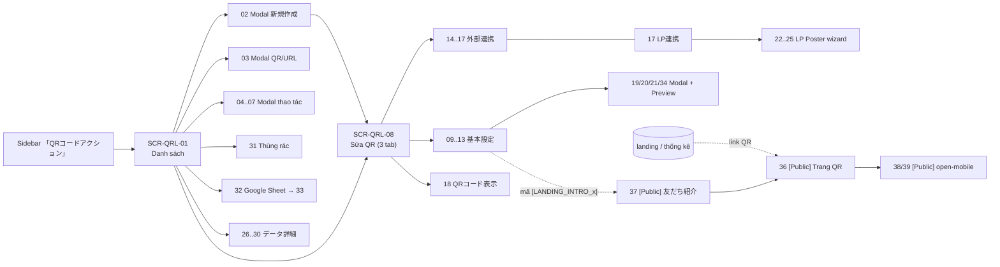
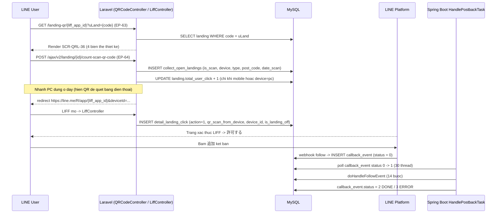
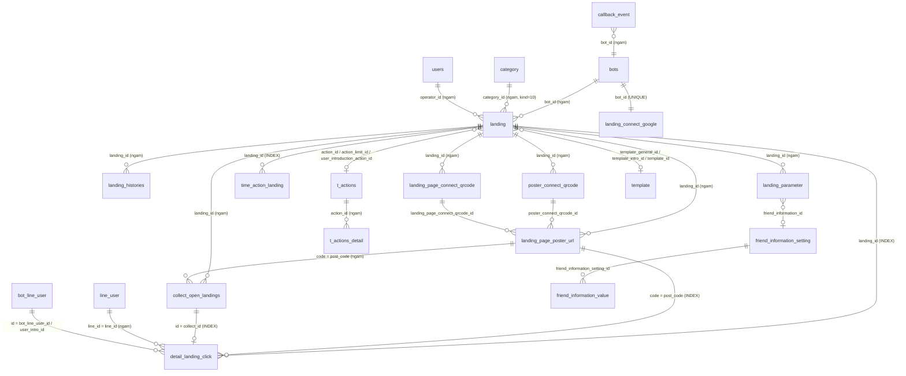
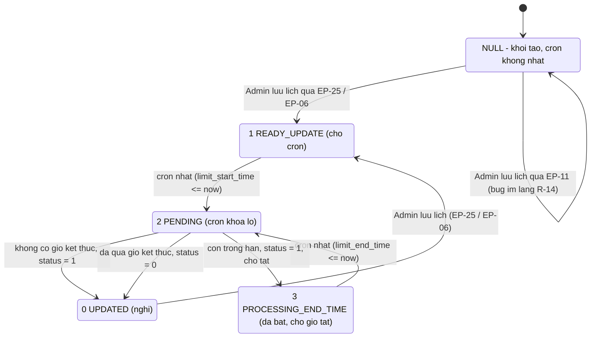

# FA-017 — QR Code Action 「QRコードアクション」 — Feature Spec

> **Portal**: Admin (LINE OA) · **Mã tính năng**: `FA-017` · **URL chính**: `/basic/landing`
> **Thư mục spec**: `features/admin/qr-landing/`
> **Ngày tổng hợp**: 2026-08-24 · **Nhánh**: `main` (commit `9f3ec48`)
> **Tài liệu chi tiết**: [ui-spec.md](ui/ui-spec.md) · [api-spec.md](web/api-spec.md) · [logic-spec.md](web/logic-spec.md) · [job-spec.md](job/job-spec.md) · [db-mapping.md](db/db-mapping.md) · [validation-report.md](_internal/validation-report.md)

---

## ⚠ Đọc trước — 2 giới hạn của bộ spec này

| # | Giới hạn | Hệ quả |
|---|---|---|
| 1 | **Bước 1 (UI scan bằng Playwright) BỊ BỎ QUA** — session Admin hết hạn. Toàn bộ `ui-spec.md` dựng **code-first** từ blade + JavaScript + CSS. Thư mục `ui/screenshots/` **rỗng (0 file)** | Dùng được để hiểu **logic và dữ liệu**; **KHÔNG** dùng để làm mockup/redesign hay viết test case UI cho tới khi chạy lại Bước 1. Xem mục **10.1** |
| 2 | **Dump `lme_db` (308 bảng) không phủ hết hệ thống thật** — thiếu ≥ 2 bảng và ≥ 2 cột đã được chứng minh | Mọi kết luận dạng 「không tồn tại」 chỉ có nghĩa 「không có trong dump」. Xem mục **10.2** |

**Đã chạy một vòng sửa lỗi ngày 2026-08-24** sau validation: **6/6 vấn đề Nghiêm trọng đã xử lý**, cùng phần lớn vấn đề Trung bình/Nhẹ. Tài liệu này dùng **nội dung đã sửa**. Chi tiết còn tồn đọng ở mục **12.3**.

---

## 1. Tổng quan

### 1.1. Mục đích

「QRコードアクション（流入経路分析）」 — **Phân tích nguồn truy cập bằng QR Code / URL kết bạn riêng biệt**.

Mô tả chính thức trên UI (`basic/qr_code/v2/index.blade.php:37`):

> 「個別の友だち追加URLを発行し、流入経路の分析やそのURLから登録した友だちに対して個別のアクション稼働ができる機能です。」
> *(Phát hành URL kết bạn riêng cho từng nguồn, phân tích nguồn truy cập và chạy hành động riêng cho bạn bè đăng ký qua URL đó.)*

Admin tạo nhiều "QR Code Action" — mỗi bản ghi là 1 dòng bảng `landing`. Mỗi QR gồm:

| Thành phần | Mục đích |
|---|---|
| Mã `code` 6 ký tự + ảnh QR PNG 300×300 | Dán lên tờ rơi, website, quảng cáo — mỗi kênh 1 QR |
| Link `{URL_OUTSIDE_STEP}landing-qr/{bots.liff_app_id}?uLand={code}` | Đích đến khi quét/click (BR-02) |
| Action gắn kèm (`action_id`) | Chạy tự động khi LINE User kết bạn/quét — gửi tin nhắn, gắn tag, đẩy vào kịch bản (shared **SC-004**) |
| Thống kê `collect_open_landings` / `detail_landing_click` / `landing_histories` | Lượt đọc URL, lượt kết bạn, lượt chạy action, phân loại 4 nhóm bạn bè |
| 「紹介時アクション」 | Chương trình giới thiệu bạn bè (referral) — người giới thiệu nhận thưởng |
| 「LP連携」 (LP Poster) | 1 QR duy nhất phục vụ nhiều quảng cáo × nhiều landing page, phân biệt bằng `post_code` |
| 「外部連携」 | Chèn HTML tag đo lường, import tham số `cid1..cid5` vào friend info, export callback ra hệ thống ngoài |
| 「スプレッドシート連携」 | Đồng bộ dữ liệu kết bạn sang Google Spreadsheet |

Tính năng có **2 thế hệ giao diện cùng tồn tại**: **v2** (`basic/qr_code/v2/*`, Vue 2 + Tailwind trên nền Bootstrap 3) đang chạy, và **v1 legacy** — không còn entry point từ menu nhưng **route vẫn sống** (12 endpoint, xem mục 7).

### 1.2. Actors

| Actor | Quyền truy cập | Ghi chú |
|---|---|---|
| **Admin (LINE OA)** | Toàn bộ `/basic/landing*` | Middleware `basic_access`, `https_protocol`, `is_expire`, `check_remember_token` |
| **Staff** | Chỉ khi route `landingIndex` nằm trong whitelist `bot_role_access` ⨝ `access_feature`. Tên quyền trong seeder: 「流入アクション」 (`AccessFeatureSeeder.php:15-46`) | ⚠ Nhóm route POST `/basic/create-landing*`, `/basic/landing/edit/*`, `/basic/landing/delete` **thiếu `basic_access`** ⇒ Staff bị chặn ở màn hình nhưng endpoint lưu vẫn nhận (R-06) |
| **LINE User** | 4 trang public: `/landing-qr/{liffId}`, `/landing/page-intro/{code}/{u_code}`, `/open-mobile/{type}/{id}`, `/open-external-browser/{type}/{id}` | Không đăng nhập; định danh qua LIFF `userId` hoặc `bot_line_user.u_code` |

**Plan gating (gói cước)** — ảnh hưởng trực tiếp tới UI:

| Điều kiện | Ảnh hưởng |
|---|---|
| `bots.plan_type == 2` (free) | Tab 「オプション設定」 và 「LP連携」 bị phủ overlay + banner 「この機能のご利用は有料プランへのアップグレードが必要です。」; truy cập thẳng `/basic/landing/v2/edit/{id}/poster` ⇒ 302 về danh sách |
| Gói free "mới" (`checkPlanFreeBotLimitFeature = 1`) | Tối đa **3 QR** — server trả lỗi 「現在のプランは利用できない機能です。…」 (BR-04) |
| Dưới プロプラン | Modal 「ASP連携」 nút 保存 `disabled` |

### 1.3. Tóm tắt số liệu

| Hạng mục | Số lượng |
|---|---|
| Màn hình | **39** (`SCR-QRL-01`…`SCR-QRL-39`) — 35 Admin + 4 public LINE User |
| Endpoint | **69** (`EP-01`…`EP-69`) — 62 Admin/Staff + 7 Public; trong đó **12 v1 legacy**, 1 route hỏng, 1 route rỗng |
| Bảng DB | **9 Primary + 11 Secondary** (~190 cột đã document) |
| Background job | **5 Laravel Artisan cron + 4 Spring Boot polling task** |
| Business rule | **46** (`BR-01`…`BR-46`) |
| Rủi ro hệ thống | **18** (`R-01`…`R-18`) + 7 phát hiện bổ sung từ db-mapper |
| Controller chính | `App\Http\Controllers\Basic\QRCodeController` (3.966 dòng) |
| Coverage mapping | **39/39 màn hình (100%)** · 216 UI element, 212 có DB column |

---

## 2. Các màn hình

### 2.1. Sơ đồ điều hướng



### 2.2. Cụm A — Danh sách & thư mục

| SCR | Tên JP | URL / Trigger | Endpoint chính |
|---|---|---|---|
| `SCR-QRL-01` | 「QRコードアクション（一覧）」 | `GET /basic/landing` | EP-01, EP-02, EP-03, EP-04, EP-06, EP-17…EP-21, EP-42, EP-62 |
| `SCR-QRL-02` | 「QRコードアクション 新規作成」 (modal) | Nút 「新規作成」 | **EP-50** |
| `SCR-QRL-03` | 「アクションURL（QRコード）」 (modal) | Nút 「QRコードを表示」 | — (dữ liệu từ EP-02) |
| `SCR-QRL-04` | 「一括フォルダ変更」 (modal) | Nút footer (cần tick QR) | EP-04 |
| `SCR-QRL-05` | 「フォルダ並べ替え」 (modal) | Sidebar trái | EP-21 |
| `SCR-QRL-06` | 「並べ替え」 (QR trong thư mục, modal) | Popup ⋯ | EP-42 |
| `SCR-QRL-07` | 「ASP連携」 (modal) | Popup ⋯ | EP-12 |

Bảng danh sách có **13 `<th>`** (gồm cột checkbox): 稼働状況 / 管理名 / 稼働対象 / 設定済みアクション / URL読み込み人数 / 友だち追加・ブロック解除人数 / アクション稼働人数 / 有効期間 / 作成日 / 最終編集日 / QRコード表示 / データ詳細.

### 2.3. Cụm B — Sửa QR 「基本設定」

| SCR | Tên JP | URL / Trigger | Endpoint chính |
|---|---|---|---|
| `SCR-QRL-08` | Màn sửa QR — khung 3 tab | `GET /basic/landing/v2/edit/{id}` | **EP-46**, EP-06, EP-22 |
| `SCR-QRL-09` | 「読み込み時アクション」 | Tab 基本設定 mục 1 | **EP-09**, EP-13, EP-44 |
| `SCR-QRL-10` | 「稼働ON・OFFの設定」 | Tab 基本設定 mục 2 | **EP-25**, EP-24 |
| `SCR-QRL-11` | 「紹介時アクション」 (referral) | Tab 基本設定 mục 3 | **EP-10**, EP-14, EP-45 |
| `SCR-QRL-12` | 「オプション設定」 (thiết kế QR) | Tab 基本設定 mục 4 | **EP-23**, EP-24 |
| `SCR-QRL-13` | 「有効期間の設定」 ⚠ **MỤC MENU BỊ COMMENT** | *(không còn đường đi trên UI v2)* | EP-11 *(route vẫn sống)* |
| `SCR-QRL-19` | 「友だち情報の挿入」 (modal) | Nút 「友だち情報」 tại 09 / 11 | — |
| `SCR-QRL-20` | 「紹介時アクションとは？」 (modal) | Link tại 11 | EP-36 |
| `SCR-QRL-21` | 「稼働プレビュー」 (panel trượt phải) | Nút tại 09 | EP-13 |
| `SCR-QRL-34` | Preview tin nhắn khi quét QR (standalone) | `GET /basic/landing/v2/preview-message-scan-qr/{id}` | EP-48, EP-13 |
| `SCR-QRL-35` | Preview trang/tin nhắn giới thiệu | `GET /landing/preview-page-intro/{type}/{id}` | EP-66, EP-45 |

> ⚠ `SCR-QRL-13` bị comment tại `setting_basic.blade.php:23-30`. Việc ẩn **vô hiệu hoá R-14 trên UI v2** nhưng làm **mất 2 field**: `use_qr_page_over_time` và `action_limit_id` (hiện **không màn nào lưu được** — EP-25 nhận nhưng không lưu).

### 2.4. Cụm C — 「外部連携」

| SCR | Tên JP | Trigger | Endpoint chính |
|---|---|---|---|
| `SCR-QRL-14` | 「HTMLタグ挿入」 | Tab 外部連携 mục 1 | **EP-26** |
| `SCR-QRL-15` | 「パラメーターインポート」 (`cid1..cid5`) | Tab 外部連携 mục 2 | **EP-27**, EP-28 |
| `SCR-QRL-16` | 「パラメーターエクスポート」 | Tab 外部連携 mục 3 | EP-26 |
| `SCR-QRL-17` | 「LP連携」 | Tab 外部連携 mục 4 | EP-33, EP-47 |

> ⚠ BR-37: EP-26 **reset `head_content`, `body_content`, `url_connect_qrcode_outside` về null** rồi mới gán lại từ request ⇒ lưu ở tab 14 có thể xoá dữ liệu tab 16 (cần xác minh — `U-11`).

### 2.5. Cụm D — 「QRコード表示」

| SCR | Tên JP | Trigger | Endpoint |
|---|---|---|---|
| `SCR-QRL-18` | Tab 「QRコード表示」 | Tab cấp 1 thứ 3 của màn edit | EP-46 (render) |

Hiển thị ảnh QR (`landing.path_landing`) + chuỗi URL. **Tab này và modal `SCR-QRL-03` hiển thị CÙNG MỘT chuỗi** — EP-46 (`QRCodeController.php:626-628`) ghi đè `link_qr_code = new_link_qr_code` trước khi render; cột DB `link_qr_code` chỉ là giá trị lịch sử.

### 2.6. Cụm E — LP Poster (wizard 4 bước)

| SCR | Tên JP | URL / Trigger | Endpoint chính |
|---|---|---|---|
| `SCR-QRL-22` | Step 1 「広告の管理名を登録」 | `GET /basic/landing/v2/edit/{id}/poster` (**EP-47**) | EP-29, **EP-30** |
| `SCR-QRL-23` | Step 2 「LPの登録」 | Wizard | EP-31, **EP-32** |
| `SCR-QRL-24` | Step 3 「コードの埋め込み」 | Wizard | EP-34 |
| `SCR-QRL-25` | Step 4 「URL発行」 | Wizard | EP-33, EP-35 |

Step 2 sinh **tích Descartes** 広告 × LP vào `landing_page_poster_url`, mỗi cặp một `post_code` = `Hashids(botId+landingId+posterId+lpId)` (BR-32). URL đo lường = URL của LP + `?uland={code}&postcode={post_code}` (BR-33).

### 2.7. Cụm F — 「データ詳細」

| SCR | Tên JP | URL / Trigger | Endpoint chính |
|---|---|---|---|
| `SCR-QRL-26` | Tab 1 「数値情報」 | `GET /basic/landing/show/{id}` (**EP-49**) | **EP-16** (`tab1`) |
| `SCR-QRL-27` | Tab 2 「友だち一覧」 | Tab | EP-16 (`tab2`), EP-35 |
| `SCR-QRL-28` | Tab 3 「LP連携」 | Tab | EP-16 (`tab3`), EP-35 |
| `SCR-QRL-29` | Tab 4 「分岐詳細」 (sơ đồ luồng) | Tab | **EP-37**, **EP-38** |
| `SCR-QRL-30` | Panel chi tiết theo ngày / theo nhóm | Nút 「詳細表示」 (tab 1) hoặc số liệu tab 4 | **EP-39** / EP-38 |

### 2.8. Cụm G — Thùng rác

| SCR | Tên JP | URL | Endpoint |
|---|---|---|---|
| `SCR-QRL-31` | 「削除済みQRコードアクション」 | `GET /basic/landing-qr/removed` | **EP-54**, EP-07, EP-08 |

Xoá mềm giữ **90 ngày**, sau đó cron `landing:force-delete` xoá cứng (BR-11). Khôi phục tự bật lại thư mục cha nếu thư mục đang bị xoá mềm (BR-12).

### 2.9. Cụm H — Google Spreadsheet

| SCR | Tên JP | URL / Trigger | Endpoint |
|---|---|---|---|
| `SCR-QRL-32` | 「Googleスプレッドシート連携」 (2 trạng thái) | `GET /basic/landing-qr/link-google` | **EP-51**, EP-52 |
| `SCR-QRL-33` | 「Googleアカウント接続解除」 (modal) | Nút huỷ tại 32 | EP-53 |

### 2.10. Cụm I — Public (LINE User)

| SCR | Tên JP | URL | Endpoint |
|---|---|---|---|
| `SCR-QRL-36` | 「アクションURL」 — trang QR công khai | `GET /landing-qr/{liffId}?uLand={code}[&device=pc][&postcode=x]` | **EP-63**, **EP-64** |
| `SCR-QRL-37` | 「友だち紹介キャンペーン」 | `GET /landing/page-intro/{code}/{u_code}` | **EP-65** |
| `SCR-QRL-38` | 「LINEアプリを開く」 (open-mobile) | `GET /open-mobile/{type}/{id}` | EP-67 (render), **EP-69** (ghi) |
| `SCR-QRL-39` | 「LINEアプリで続行」 (open-external-browser) | `GET /open-external-browser/{type}/{id}` | EP-68 (render), **EP-69** |

> `SCR-QRL-38/39` có `type` phục vụ **8 tính năng khác** (`booking_calendar`, `product-detail`, `product-change`, `product-cancel`, `booking_event`, `form_answer`, `calendar`, `calendar-salon`) — controller nằm trong `QRCodeController` nhưng **không phải chức năng riêng của FA-017** (ứng viên shared component, mục 9).

---

## 3. Luồng xử lý end-to-end

### LUỒNG 1 — Admin tạo QR mới (và sao chép)

| Bước | Chi tiết |
|---|---|
| **UI** | `SCR-QRL-01` → 「新規作成」 → `SCR-QRL-02`: nhập 「管理名」 (≤ 50, client-side), chọn 「フォルダ」, chọn 「稼働対象」 (**không sửa được sau khi tạo**) |
| **API** | `POST /basic/create-landing-v2` (**EP-50**) — cần header `X-CSRF-TOKEN` |
| **Logic** | 1) `PlanLimitGuard` kiểm hạn mức trước insert (BR-04) → 2) sinh `code` `str_random(6)` duy nhất trong bot (BR-01) → 3) `array_merge($settings, $newQrs)` rồi INSERT ⚠ (**R-01 mass assignment**) → 4) sinh ảnh QR BaconQrCode PNG 300×300 (BR-03) → 5) tạo 3 template ẩn `category_id = -111222` (BR-15) → 6) `syncNotifyNewItemForBot()` (BR-19) → 7) `bots_tutorial.status_qr_code = 1` (BR-18) → 8) tạo Google Sheet nếu bot đã liên kết (BR-20) → 9) `PlanLimitGuard` kiểm lại sau insert, xoá bản `id` lớn hơn nếu vượt (BR-05) |
| **DB ghi** | `landing` (INSERT), `template` ×3, `landing_parameter` ×5 (`cid1..cid5`), `bots_tutorial`, `notify_setting.when_adding_friends` |
| **DB không gán** | ⚠ `landing.time_qr_off_status` **không được gán** ⇒ luôn `NULL` (xem R-14) |
| **Job** | Không |
| **Response** | `{id}` → client redirect |
| **UI update** | Chuyển sang `SCR-QRL-08` `/basic/landing/v2/edit/{id}` |

**Nhánh sao chép** (`mode: 'copy'`): nhân bản 3 action (`t_actions` + `t_actions_detail` + `filters_v2`), 2 template, `landing_parameter`, `poster_connect_qrcode`, `landing_page_connect_qrcode`, sinh lại `landing_page_poster_url` (BR-16). **Luôn sinh `code` mới**; **không** copy `google_sheet_id`, `path_landing`, `position`, số liệu (BR-17). ⚠ Chế độ copy **không kiểm `bot_id`** (R-02).

**Error cases**:

| Tình huống | Kết quả |
|---|---|
| Bỏ trống 管理名 | `#error_name` = 「管理名を入力してください」 (client, không gọi API) |
| Gói free đã có 3 QR | HTTP 500 + `alert()` 「現在のプランは利用できない機能です。アップグレードが必要になります。」 |
| 2 request đồng thời | Bản `id` lớn hơn bị xoá + lỗi `PlanLimitGuard::PLAN_MESSAGE` |
| Session hết hạn | `check_remember_token` trả **HTTP 200** kèm `{status:false, message:"ログイン情報が変更されましたので、再度ログインしてください。"}` — ⚠ AJAX không phân biệt được là lỗi |

---

### LUỒNG 2 — LINE User quét QR → kết bạn → action chạy ⭐ (luồng cốt lõi)



**Chi tiết `doHandleFollowEvent` (`HandlePostbackTask.java:2258-3102`)** — trái tim của FA-017:

| Bước | Hành động | Bảng / cột |
|---|---|---|
| 1 | Tìm `detail_landing_click` mới nhất của (`line_id`, `bot_id`) trong **24 giờ** ⚠ (biến đặt nhầm tên `valid3min`). Chỉ đi tiếp khi `action == 1` | đọc `detail_landing_click` |
| 2 | Nạp `landing`; `total_user_friend + 1`; đổi `action = 2`, `is_old_friend = isNewFriend ? 0 : 1`, `bot_line_user_id` | ghi `landing`, `detail_landing_click` |
| 3 | Nhánh affiliate: có `aff_result` mới trong 24h ⇒ dùng QR có `connect_aff = 1` | đọc `aff_result`, `landing` |
| 4 | Ưu tiên QR hơn `add_friend_setting` chung của bot; chặn chạy lại nếu `action_type = 1` (1 lần) | ghi `messages_v2s.qrcode_add_friend` |
| 5 | Kiểm khoảng cách chạy lại theo `interval_action` (1 = 1 lần/ngày · 2 = theo giờ) | đọc/ghi `time_action_landing` |
| 6 | Ghi `cid1..cid5` vào friend info khi `is_on_param = 1` | đọc `landing_parameter` → ghi `friend_information_value` |
| 7 | Quyết định action nào chạy theo `status` / `type_display_off` / `use_action_limit` | — |
| 8 | Ghi lịch sử kết bạn (`TYPE_NEW`/`_OLD`/`_UNBLOCK`) | ghi `line_user_add_friend_history` ⚠ *(thiếu trong dump)* |
| 9 | Gom template + tag + kịch bản; nếu `isCountAction` ⇒ `is_action_web = 2`, `landing.count_action + 1` | ghi `detail_landing_click`, `landing` |
| 10 | `doAction(...)` với `START_TYPE_QR_FRIEND` + trigger `TYPE_LANDING_LOAD_URL`; write-back capture id | ghi `detail_landing_click.action_multi_capture_id`, `.message_id` ⚠ *(2 cột thiếu trong dump)* |
| 11 | Action cho **người giới thiệu** (`user_introduction_action_id` / `template_intro_id`) | — |
| 12 | Thông báo mobile 「{tên QR}が稼働しました（新規友だち）」 qua FCM | đọc `notify_setting` |
| 13 | Gọi **callback HTTP GET** ra hệ thống ngoài (`url_connect_qrcode_outside`), thay placeholder `{line_id}`/`{friend_name}`/`{friend_type}`/`{mail}`/`{forward_param}` | — ⚠ kết quả bị bỏ qua, không retry |
| 14 | `callback_event.status = 2` (DONE) hoặc `3` (ERROR + `error_message`) | ghi `callback_event` |

**Sau đó (bất đồng bộ)**:
- `MappingDeviceTask` ghép `detail_landing_click.device_id` ↔ `collect_open_landings.device` → ghi `collect_id`.
- Cron `statistic:landing_action` (02:05) tổng hợp → `landing_histories`.
- Admin xem kết quả tại `SCR-QRL-26`…`30`.

**⚠ Điểm rất dễ hiểu nhầm — ai ghi gì**:

| Thao tác | Nơi thực hiện |
|---|---|
| INSERT `collect_open_landings` | **Chỉ Laravel** (EP-64 + `LiffController:1207`) — Spring Boot `CollectOpenLandingRepository` chỉ có **1 native SELECT** |
| **TẠO** `detail_landing_click` (`action = 1`) | **Chỉ Laravel** `LiffController.php:1221-1237` |
| **CẬP NHẬT** `action = 2`, `is_old_friend`, `bot_line_user_id` | **CẢ HAI** — Spring Boot `:2447-2449` **và** Laravel `LiffController.php:1325, 1411, 1649, 1667` |
| `is_old_friend = 2` và `= 3` | **CHỈ Laravel** — Spring Boot chỉ ghi `0`/`1` |
| `qr_scan_from_device` | **Chỉ Laravel** `LiffController.php:1234` (grep `src/job` = 0 kết quả) |
| `is_action_web = 2`, `collect_id`, `action_multi_capture_id`, `message_id` | **Chỉ Spring Boot** |

**Nhánh đặc biệt**:

| Điều kiện | Kết quả |
|---|---|
| `status = 0` + `type_display_off = 2` | `redirect()->away(data_display_off)` |
| `status = 0` + `type_display_off = 1` | Trả HTML thô (mặc định 「現在、友だち追加は受け付けていません。」) ⚠ **XSS — R-03** |
| `status = 0` + `type_display_off = 0` | Vẫn render trang QR, action theo `use_action_limit` / `action_limit_id` |
| Bot trả phí hết hạn > 7 ngày hoặc `bot_contracts.status = 3` | Redirect trang `410` (BR-24) |
| `uLand` sai | Redirect trang `404` |
| Không có bản ghi `action = 1` trong 24h (user kết bạn không qua LIFF) | **Toàn bộ nhánh QR bị bỏ qua**, rơi về `add_friend_setting` chung của bot |

---

### LUỒNG 3 — Admin xem thống kê 「データ詳細」

| Bước | Chi tiết |
|---|---|
| **UI** | `SCR-QRL-01` → 「データ詳細」 → `GET /basic/landing/show/{id}` (**EP-49**) render `SCR-QRL-26` với 4 tab |
| **API** | Tab 1/2/3 → `POST /ajax/v2/landing/get-init-detail-landing` (**EP-16**, tham số `tab=tab1\|tab2\|tab3`, `type_count`, `is_detail_day`, `get_all`, `landing_url_ids`). Tab 4 → **EP-37** (`collect-statistic`) + **EP-38** (`collect-friend`). Panel ngày → **EP-39** (`detail-click-day`) |
| **Logic** | BR-27: ngày **quá khứ** lấy từ bảng tổng hợp `landing_histories`; **hôm nay tính realtime** từ `detail_landing_click` + `collect_open_landings` (`handleAttributeCurrentDay`). BR-28: `type_count = 1` = đếm **unique** (`COUNT(DISTINCT line_id`/`device)`), `= 2` = đếm tất cả lượt. BR-30: `total_block` chỉ tính người mà **lần kết bạn đầu tiên** là qua chính QR này |
| **DB đọc** | `landing_histories`, `detail_landing_click`, `collect_open_landings`, `line_user`, `conversation`, `landing_page_poster_url` |
| **Job liên quan** | Số liệu ngày trước phụ thuộc cron A-1; tab 3 phụ thuộc `MappingDeviceTask` đã ghép `collect_id` |
| **Response** | JSON các chỉ số + rows. ⚠ Tên alias SQL ≠ key JSON: `total_new_friend` → `total_new_friend_tab2`; `total_unblock_friend` → `total_unblock` |
| **UI update** | Bảng + box-count + badge 「友だちの種類」; nút CSV → BR-31 (Shift_JIS, tên `detail_landing_click_{YYYYMMDDhhmmss}.csv`) |

---

### LUỒNG 4 — Admin bật/tắt QR theo lịch

| Bước | Chi tiết |
|---|---|
| **UI** | `SCR-QRL-08` → `SCR-QRL-10` 「稼働ON・OFFの設定」: chọn `type_display_off` (0/1/2), 「スケジュール設定」 → 「利用する」, nhập 開始日時, chọn 終了日時を設定する/しない |
| **API** | `POST /ajax/v2/landing/edit/{id}/qr-off` (**EP-25**) |
| **Logic** | Ghi `use_limit_time`, `limit_start_time`, `use_limit_end_time`, `limit_end_time`, `type_display_off`, `text_over_time`/`url_over_time`; **đặt `time_qr_off_status = 1`** (READY_UPDATE) |
| **DB** | `landing` (UPDATE) |
| **Job** | Cron `landing:qr-off:schedule` (**mỗi phút**) poll `time_qr_off_status IN (1, 3)`, khoá lô sang `2`, rồi đổi `status` theo giờ (xem state machine mục 8.4) |
| **UI update** | Cột 「稼働状況」 ở `SCR-QRL-01` tự đổi khi tải lại trang |

⚠ **Bẫy nghiêm trọng**: lưu lịch qua `SCR-QRL-13` / **EP-11** (`setting-limit`) **KHÔNG** đặt `time_qr_off_status` ⇒ cột giữ `NULL` ⇒ **cron không bao giờ nhặt, không báo lỗi**, trong khi cột 「有効期間」 trên danh sách **vẫn hiển thị** như thể lịch đang chạy (**R-14 — bug im lặng**). Giảm nhẹ: mục menu `SCR-QRL-13` đã bị comment nên đường đi trên UI v2 hiện tại đã bị vô hiệu hoá.

---

### LUỒNG 5 — Admin liên kết Google Spreadsheet

| Bước | Chi tiết |
|---|---|
| **UI** | `SCR-QRL-01` → ⋯ → 「スプレッドシート連携」 → `SCR-QRL-32` (**EP-51**) |
| **OAuth** | Bấm nút Google → màn hình đồng ý của Google → callback `GET /basic/landing-qr/redirect-google-sheet` (**EP-52**) |
| **Logic** | Lưu `google_access_token` (JSON thô, ⚠ không mã hoá) vào `landing_connect_google`, `status = WAITING (0)`; ⚠ EP-52 nhận `state` (= `bot_id`) từ query mà **không đối chiếu bot đang đăng nhập** (R-13) |
| **DB** | `landing_connect_google` (UNIQUE `bot_id`), sau đó `landing.google_sheet_id` |
| **Job** | Cron `landing:insert_google_sheet` (02:10) — lọc `status = DONE (2)`, tạo spreadsheet nếu `google_sheet_id` rỗng, rồi đẩy `landing_histories`. Sheet rỗng ⇒ ghi header 「日時 / URL読み込み / 友だち追加・ブロック解除 / アクション稼働」 + toàn bộ lịch sử; sheet có dữ liệu ⇒ append 1 dòng của **hôm qua** |
| **UI update** | Icon Google Sheet xuất hiện trên hàng QR và tab 1; thông báo 「データの反映は翌日の正午までに行われます。」 |
| **Huỷ** | 「Googleアカウントの接続を解除する」 → `SCR-QRL-33` → **EP-53**; xoá `google_sheet_id` của **toàn bộ** landing thuộc bot kể cả bản xoá mềm (BR-22) |

⚠ **R-17**: `landing_connect_google.status = 4` (8/20 dòng = 40% dữ liệu thật) **không có trong hằng số model** ⇒ cron bỏ qua 40% bot; BR-21 lại **không chặn** huỷ liên kết ở trạng thái này ⇒ sheet ngừng cập nhật **im lặng**.

---

### LUỒNG 6 — Admin xoá & khôi phục QR

`SCR-QRL-01` → tick → 「一括削除」 → `confirm('削除しますが、宜しいですか？')` → **EP-03** xoá mềm `landing` + `detail_landing_click`, ghi `operator_id` → `SCR-QRL-31` (**EP-07**) → 「復元する」 (**EP-08**, tự khôi phục thư mục cha — BR-12) → sau **90 ngày** cron `landing:force-delete` xoá cứng (BR-11).
⚠ Khôi phục khi gói free đã đủ 3 QR ⇒ HTTP 500 và **QR vừa khôi phục bị xoá lại**.
⚠ Force-delete chỉ dọn 2 bảng ⇒ **11 bảng bị dữ liệu mồ côi** (mục 11.4).

---

### LUỒNG 7 — LINE User giới thiệu bạn (referral)

1. Admin cấu hình `SCR-QRL-11`, phát mã `[LANDING_INTRO_{code}]` cho bạn bè hiện có.
2. 紹介元 bấm mã → `GET /landing/page-intro/{code}/{u_code}` (**EP-65**, `SCR-QRL-37`).
3. Bấm 「友だちに共有」 / 「紹介リンクをコピー」 → link kèm `&u_code_intro={u_code}`.
4. 紹介先 mở link → chạy **LUỒNG 2**; `detail_landing_click.user_intro_id` lưu id người giới thiệu.
5. Khi 紹介先 kết bạn ⇒ bước 11 của `doHandleFollowEvent` chạy `user_introduction_action_id` gửi thưởng cho 紹介元.

⚠ Modal `SCR-QRL-20` cảnh báo: 「※どの紹介元が、誰を紹介したのかを確認することはできません。」
⚠ Khối **STEP 3 「紹介先」** đã bị comment **đồng bộ cả 3 tầng** (view + JS + controller) ⇒ tính năng tắt có chủ đích; badge STEP nhảy 1 → 3.

---

## 4. Data Model

### 4.1. Primary tables (9)

| # | Bảng | Model / Entity | Vai trò | Số cột |
|---|---|---|---|---|
| P-1 | `landing` | `App\Landing` / `LandingQR.java` | Cấu hình gốc 1 QR Code Action | **77** |
| P-2 | `detail_landing_click` | `App\DetailLandingClick` / `DetailLandingClick.java` | 1 dòng = 1 lượt mở LIFF / kết bạn qua QR | 22 trong dump / **≥ 24 thực tế** |
| P-3 | `collect_open_landings` | `App\CollectOpenLanding` | 1 dòng = 1 lượt **mở trang QR** (trước khi kết bạn) | 12 |
| P-4 | `landing_histories` | `App\LandingHistory` | Tổng hợp theo ngày (1 landing × 1 ngày) | 21 |
| P-5 | `landing_parameter` | `App\LandingParameter` | Ánh xạ 5 slot `cid1..cid5` → `friend_information_setting` | 9 |
| P-6 | `landing_connect_google` | `App\LandingConnectGoogle` | Token & trạng thái Google Sheets **theo bot** (UNIQUE `bot_id`) | 11 |
| P-7 | `poster_connect_qrcode` | `App\PosterConnectQrCode` | Danh sách 「広告名」 (LP Poster bước 1) | 6 |
| P-8 | `landing_page_connect_qrcode` | `App\LandingPageConnectQrCode` | Danh sách 「LP」 + URL (bước 2) | 7 |
| P-9 | `landing_page_poster_url` | `App\LandingPagePosterUrl` | **Tích Descartes** 広告 × LP, mỗi cặp 1 `post_code` | 8 |

### 4.2. Secondary tables (11)

`time_action_landing` (S-1, chống chạy lại action) · `callback_event` (S-2, **hàng đợi webhook**, connection riêng `mysql_callback`) · `category` (S-3, `kind = 10`) · `template` (S-4, template ẩn `category_id = -111222`) · `t_actions` (S-5) · `t_actions_detail` (S-6) · `bots_tutorial` (S-7) · `notify_setting` (S-8) · `line_user` (S-9) · `bot_line_user` (S-10, `u_code`) · `bots` (S-11, `liff_app_id`, `plan_type`).

> ⚠ **Tên bảng dễ nhầm** (đã đính chính): `App\Actions` → bảng **`t_actions`** (không phải `actions`); `App\ActionDetail` → **`t_actions_detail`**; `FriendInfoValue` → **`friend_information_value`**; `MessagesV2` → **`messages_v2s`**. Tên **class** Eloquent/JPA giữ nguyên.
>
> 6 bảng nữa **có tác động thực tới FA-017** nhưng chưa có mục Entity Details riêng (V-13 còn tồn đọng): `conversation`, `add_friend_setting`, `users` (`hide_action_intro_modal`), `friend_information_value`, `messages_v2s`, `bot_friend_statistic`/`aff_result`.

### 4.3. ER diagram

> **Schema KHÔNG có bất kỳ `FOREIGN KEY` constraint nào** cho toàn bộ bảng trong phạm vi FA-017 — mọi quan hệ đều là **FK ngầm ở tầng ứng dụng**. Hệ quả trực tiếp: không có `ON DELETE CASCADE` ⇒ dữ liệu mồ côi (mục 11.4).



### 4.4. Chuỗi khoá ghép đặc biệt (không phải id-to-id)

| Từ | Sang | Khoá ghép | Ai thực hiện |
|---|---|---|---|
| `detail_landing_click.device_id` | `collect_open_landings.device` | Chuỗi cookie `device_scan_landing` (6 ký tự random + timestamp, TTL 365 ngày) | **Spring Boot `MappingDeviceTask`** → ghi `collect_id` |
| `detail_landing_click.post_code` | `landing_page_poster_url.code` | Hashids | Query join EP-16 tab 2 |
| `collect_open_landings.post_code` | `landing_page_poster_url.code` | Hashids | Query join EP-16 tab 3 |
| `detail_landing_click.line_id` | `line_user.line_id` | Chuỗi LINE ID `U…` (**không** qua `line_user.id`) | `DetailLandingClick::lineUser()` |
| `landing.code` | Query param `?uLand=` | Chuỗi 6 ký tự | EP-63 public |

### 4.5. Index — điểm nghẽn đã xác định

| Bảng | Tình trạng index |
|---|---|
| `landing` | ⚠ **Chỉ có PK** — `bot_id`, `code`, `category_id`, `deleted_at`, `time_qr_off_status` đều **không index** dù là điều kiện lọc nóng |
| `collect_open_landings` | ⚠ Chỉ PK — `MappingDeviceTask` full-scan trong vòng `while(true)` |
| `detail_landing_click` | Có INDEX `landing_id`, `collect_id`, `post_code`; ⚠ thiếu `line_id`, `bot_id`, `time_click` (Spring Boot query mỗi follow event) |
| `landing_histories` | ⚠ Không có UNIQUE (`bot_id`, `landing_id`, `datestamp`) dù dùng `updateOrCreate` |
| `landing_page_poster_url` | ⚠ `code` không index dù là khoá join thống kê |
| `landing_parameter` | ⚠ Không có UNIQUE (`landing_id`, `param_code`) |

---

## 5. Field Traceability Matrix

> Chọn lọc các field **quan trọng và dễ hiểu nhầm**. Bản đầy đủ **216 UI element / 39 màn**: xem [db-mapping.md — mục 5](db/db-mapping.md).

| # | UI Element (JP) | Màn hình | DB Table.Column | Hướng | Validation | Business Rule / Ghi chú |
|---|---|---|---|---|---|---|
| 1 | 「管理名」 | SCR-QRL-01/02/08 | `landing.name` | Đọc + Ghi | Client ≤ 50 ký tự; **server KHÔNG validate** ở EP-50 | Bảng danh sách cắt sau 13 ký tự + tooltip |
| 2 | 「稼働対象」 | SCR-QRL-02/08 | `landing.action_with_friend` | Ghi 1 lần | `1` = 「新規友だちのみ」 · `2` = 「全ての友だち」 | **Không sửa được sau khi tạo**; bộ lọc `= 0` ⇒ `IN (1,2)` (BR-43) |
| 3 | 「稼働状況」 (toggle) | SCR-QRL-01/08 | `landing.status` + `time_qr_off_status` | Đọc + Ghi | `0` = 非公開 · `1` = 公開 | EP-06 **cũng** tính lại `time_qr_off_status` theo lịch hiện có (BR-08) |
| 4 | *(ngầm)* Mã QR | SCR-QRL-02 | `landing.code` | Ghi (server sinh) | `str_random(6)`, **duy nhất trong 1 bot** (không phải toàn hệ thống) | BR-01. ⚠ **Không index** dù là khoá tra cứu của EP-63 |
| 5 | URL kết bạn hiển thị | SCR-QRL-03/18 | *(computed)* `new_link_qr_code` | Chỉ đọc | — | `{URL_OUTSIDE_STEP}landing-qr/{bots.liff_app_id}?uLand={code}`. **KHÔNG** dùng `domain_url_shorten` (BR-02). EP-46 **ghi đè** `landing.link_qr_code` bằng chính giá trị này ⇒ 2 màn hiển thị cùng chuỗi |
| 6 | 「送信するメッセージを登録」 | SCR-QRL-09 | `template.content` qua `landing.template_general_id` | Đọc + Ghi | Rỗng ⇒ xoá template, set FK `null` | Template **ẩn** `category_id = -111222`, `type='text'`, `position=0` (BR-15) |
| 7 | 「上記メッセージ送信以外のアクション登録」 | SCR-QRL-09/10/11/13 | `landing.action_id` / `action_limit_id` / `user_introduction_action_id` → `t_actions` | Đọc + Ghi | — | Shared **SC-004**; copy QR nhân bản cả 3 (BR-16) |
| 8 | 「連続アクション制限」 | SCR-QRL-09 | `landing.interval_action` + `time_interval_action` | Đọc + Ghi | `0` không giới hạn · `1` 1 lần/ngày · `2` theo giờ | Chỉ lưu `time_interval_action` khi `= 2` (BR-45). ⚠ COMMENT schema thiếu giá trị `2` |
| 9 | 「テキストを表示」/「指定ページに遷移」 | SCR-QRL-10 | `landing.type_display_off` → `text_over_time` / `url_over_time` + `is_use_url_over_time` | Đọc + Ghi | URL rỗng ⇒ 「指定ページを入力してください。」 (client) | ⚠ `text_over_time` trả **HTML thô không escape** ở EP-63 (**R-03 XSS**) |
| 10 | 「スケジュール設定」開始/終了日時 | SCR-QRL-10 | `landing.use_limit_time`, `limit_start_time`, `use_limit_end_time`, `limit_end_time` | Đọc + Ghi | — | EP-25 **đặt `time_qr_off_status = 1`**; EP-11 thì **không** ⇒ R-14 |
| 11 | *(ngầm)* Hàng đợi cron | SCR-QRL-10 | `landing.time_qr_off_status` | Ghi | `NULL`/`0`/`1`/`2`/`3` | **`NULL` là trạng thái khởi tạo hợp lệ** — INSERT không gán, schema không có DEFAULT. Dữ liệu thật: NULL 565/566 |
| 12 | 「個別にアクションを設定する」 | SCR-QRL-10 | `landing.use_action_limit` + `action_limit_id` | Đọc + Ghi | — | ⚠ EP-25 **nhận `action_limit_id` nhưng KHÔNG lưu**; màn duy nhất lưu được (`SCR-QRL-13`) đã bị ẩn |
| 13 | 「ロゴ設定」 4 thẻ | SCR-QRL-12 | `landing.setting_logo` | Đọc + Ghi | `1` = **logo LINE mặc định** · `2` = 「表示しない」 · `3` = 「独自ロゴを利用」 | ⚠ Từng bị spec ghi **ĐẢO NGƯỢC** (V-05, đã sửa). Ảnh hưởng 547/566 QR (96,6%) |
| 14 | 「連携するQRコードアクション」 | SCR-QRL-07 | `landing.connect_aff` | Đọc + Ghi | — | BR-06: chỉ **1 QR/bot** = `1`; đặt mới ⇒ reset tất cả về `0` |
| 15 | 「パラメーターインポート」 5 slot | SCR-QRL-15 | `landing_parameter.param_code` (`cid1`…`cid5`) + `friend_information_id` | Đọc + Ghi | Đúng 5 slot | BR-36: `updateOrCreate` **đủ 5 dòng** kể cả null. Spring Boot bước 6 đọc để ghi `friend_information_value` |
| 16 | 「HTMLタグ挿入」/「パラメーターエクスポート」 | SCR-QRL-14/16 | `landing.head_content`, `body_content`, `url_connect_qrcode_outside` | Đọc + Ghi | — | ⚠ BR-37: EP-26 **reset cả 3 về null** rồi mới gán ⇒ gửi thiếu trường = **xoá dữ liệu** |
| 17 | 「広告設置用URL」 | SCR-QRL-25 | `landing_page_poster_url.code` (`post_code`) | Chỉ đọc | — | Hashids(`botId+landingId+posterId+lpId`). ⚠ R-10 nối chuỗi không phân tách ⇒ lý thuyết có thể va chạm (đã kiểm: 292/292 duy nhất) |
| 18 | Badge 「友だちの種類」 | SCR-QRL-27 | `detail_landing_click.action` **+** `.is_old_friend` | Chỉ đọc | Xác định bằng **CẶP** giá trị | **BR-29** — xem mục 6.4. Điểm từng bị spec ghi sai |
| 19 | 「URL読み込み人数」 | SCR-QRL-01/26 | `landing.total_user_click` | Chỉ đọc | — | Bộ đếm denormalized, EP-64 tăng (BR-25) |
| 20 | 「友だち追加・ブロック解除人数」 | SCR-QRL-01/26 | `landing.total_user_friend` | Chỉ đọc | — | **2 nguồn ghi**: Spring Boot `:2436` **+** Laravel `LiffController:1327` |
| 21 | 「アクション稼働人数」 | SCR-QRL-01 | `landing.count_action` + `count_action_web` | Chỉ đọc | — | UI cộng 2 cột; ⚠ `count_action_web` **không tìm thấy nơi tăng** (chỉ bị `ChangeBotJob` reset) |
| 22 | 「表示単位」 (人数/回数) | SCR-QRL-26/27/29 | *(không lưu)* param `type_count` | — | `1` unique · `2` all | BR-28. Unique tính theo `line_id` (dữ liệu bạn bè) hoặc `device` (dữ liệu quét) |
| 23 | 「有効期間」 (cột danh sách) | SCR-QRL-01 | `use_limit_time` + `limit_start_time` + `limit_end_time` | Chỉ đọc | — | ⚠ **Vẫn hiển thị bình thường ngay cả khi lịch đã chết** (R-14) |
| 24 | Cây thư mục | SCR-QRL-01 | `category.name/position/is_deleted` (`kind = 10`) ← `landing.category_id` | Đọc + Ghi | `maxlength=15`, **server không validate** | BR-14; `0`/NULL ⇒ 「未分類」. Thư mục đang mở nhớ bằng **cookie `folder_landing`** (BR-46) |
| 25 | Tìm kiếm 「管理名を入力」 | SCR-QRL-01 | `landing.name LIKE %kw%` | Chỉ đọc | — | ⚠ BR-44: khi có `keyword`, bộ lọc thư mục **bị bỏ qua** |
| 26 | Kéo thả 「並べ替え」 (QR) | SCR-QRL-06 | `landing.position` | Ghi | — | ⚠ BR-41: **cố tình giữ nguyên `updated_at`** ⇒ cột 「最終編集日」 không đổi |
| 27 | Kéo thả 「フォルダ並べ替え」 | SCR-QRL-05 | `category.position` | Ghi | — | ⚠ BR-42: client **đảo ngược mảng** trước khi gửi (query sắp xếp `position DESC`) |
| 28 | *(ngầm)* Ghép lượt quét ↔ kết bạn | SCR-QRL-28 | `detail_landing_click.collect_id` | Job ghi | `NULL` chờ · `>0` đã ghép · **`0` sentinel không ghép được** | Tỉ lệ ghép thật chỉ **28,4%** (760/1062 = sentinel `0`) |

---

## 6. Business Rules

### 6.1. Nhóm tạo / sao chép / xoá

| ID | Quy tắc | Tin cậy |
|---|---|---|
| BR-01 | `code` random 6 ký tự (`str_random`), **duy nhất trong 1 bot** (không phải toàn hệ thống), sinh đệ quy tới khi không trùng | Cao |
| BR-02 | Link QR chuẩn = `{env(URL_OUTSIDE_STEP)}landing-qr/{bots.liff_app_id}?uLand={landing.code}`. **KHÔNG dùng `domain_url_shorten`** (comment code: 「đã confirm anh Tư」). `domain_url_shorten` chỉ dùng ở `Category::getCategoryLandingDefault()` và EP-65 | Cao |
| BR-03 | Ảnh QR sinh ngay khi tạo (BaconQrCode PNG 300×300), mã hoá `https://line.me/R/app/{liff_app_id}?uLand={code}`, lưu `{FOLDER_MEDIA}images/{user_id}/{bot_id}/landing/{ts}{rand}_{id}.png` | Cao |
| BR-04 | Bot gói free "mới" chỉ được tạo/khôi phục tối đa **3 QR** — kiểm 2 lần (trước insert + `PlanLimitGuard` sau insert) | Cao |
| BR-05 | 2 request tạo đồng thời cùng lọt cửa: giữ bản `id` **nhỏ hơn**, xoá bản lớn hơn | Cao |
| BR-11 | QR xoá mềm nằm thùng rác; cron `landing:force-delete` (05:05) xoá cứng sau **90 ngày** | Cao |
| BR-12 | Khôi phục QR **tự khôi phục thư mục cha** nếu thư mục đang xoá mềm | Cao |
| BR-13 | Xoá thư mục ⇒ **xoá mềm toàn bộ QR bên trong** + `detail_landing_click` của chúng | Cao |
| BR-16 | Copy QR nhân bản: 3 action (kèm `t_actions_detail` + `filters_v2`), 2 template, `landing_parameter`, `poster_connect_qrcode`, `landing_page_connect_qrcode`, sinh lại `landing_page_poster_url` | Cao |
| BR-17 | Copy **luôn sinh `code` mới**; **không** copy `google_sheet_id`, `path_landing`, `position`, số liệu | Cao |
| BR-18 | Bot lần đầu tạo QR ⇒ `bots_tutorial.status_qr_code = 1` (liên kết FA-043) | Cao |
| BR-19 | Tạo QR ⇒ id được thêm vào `notify_setting.when_adding_friends` cho mọi user của bot có `is_all_qrcode_new` | Cao |
| BR-20 | Bot đã liên kết Google ⇒ mỗi QR mới được tạo 1 spreadsheet riêng ngay lúc tạo; lỗi tạo sheet **không** làm hỏng việc tạo QR | Cao |

### 6.2. Nhóm trạng thái & lịch

| ID | Quy tắc | Tin cậy |
|---|---|---|
| BR-06 | Chỉ **một** QR trong bot có `connect_aff = 1`; đặt mới ⇒ reset tất cả về `0` | Cao |
| BR-07 | `status`: `0` = 非公開 · `1` = 公開. Khi OFF: `type_display_off` `0` ⇒ vẫn render trang (chạy action) · `1` ⇒ hiện text · `2` ⇒ redirect URL | Cao |
| BR-08 | Bật/tắt tay từ danh sách sẽ **tính lại `time_qr_off_status`** theo lịch hiện có | Cao |
| BR-09 | Lịch bật/tắt do cron `landing:qr-off:schedule` (mỗi phút) thực thi qua `time_qr_off_status` — **5 trạng thái gồm `NULL`** (xem mục 8.4). Cột **không có DEFAULT**; `saveLandingV2` không gán ⇒ mọi QR mới đều `NULL`. `NULL` là **trạng thái hợp lệ**, cron không nhặt, không gây lỗi runtime | Cao |
| BR-10 | EP-25 (`qr-off`) đặt `time_qr_off_status = 1`; **EP-11 (`setting-limit`) thì KHÔNG** ⇒ cron không nhận | Trung bình |
| BR-23 | Trang QR tra cứu bằng **`uLand`**, **không** dùng `{liffId}` trên path | Cao |
| BR-24 | Bot trả phí hết hạn > 7 ngày hoặc `bot_contracts.status = 3` ⇒ redirect trang `410` | Cao |
| BR-35 | LP Poster và tuỳ chọn thiết kế QR **không khả dụng** cho `plan_type = 2` | Cao |

### 6.3. Nhóm thống kê

| ID | Quy tắc | Tin cậy |
|---|---|---|
| BR-25 | Lượt mở trang ghi vào `collect_open_landings`. `is_scan = 1` khi mở từ mobile (`type = 2`) hoặc `?device=pc`; **chỉ khi đó** mới tăng `landing.total_user_click` | Cao |
| BR-26 | `device_id` sinh ở client (6 ký tự random + timestamp), lưu cookie `device_scan_landing` TTL **365 ngày** | Cao |
| BR-27 | Tab 1 lấy từ `landing_histories` cho các ngày quá khứ; **hôm nay tính realtime** từ `detail_landing_click` + `collect_open_landings` | Cao |
| BR-28 | `type_count = 1` đếm **unique** (theo `line_id` / `device`); `= 2` đếm tất cả lượt | Cao |
| **BR-29** | **Phân loại 「友だちの種類」 xác định bằng CẶP `(action, is_old_friend)`** — xem mục 6.4 | **Cao** |
| BR-30 | `total_block` chỉ tính người mà **lần kết bạn đầu tiên** là qua chính QR này (so `MIN(time_click)` với các landing khác) | Cao |
| BR-31 | CSV xuất ra encoding **Shift_JIS**, tên server `export.csv`, client đổi thành `detail_landing_click_{YYYYMMDDhhmmss}.csv` (tab1/2) hoặc `landing_page_url_…` (tab3) | Cao |

### 6.4. BR-29 — Phân loại 「友だちの種類」 ⚠ ĐIỂM QUAN TRỌNG NHẤT

> Nhãn hiển thị **KHÔNG** xác định bằng riêng `is_old_friend`, mà bằng **CẶP** `(action, is_old_friend)`.
> Phiên bản spec trước gán **sai 2/4 nhãn**; đã sửa ngày 2026-08-24 (V-01) và xác nhận bằng **4 nguồn code độc lập** + **1.062 dòng dữ liệu thật**.

**Ngữ nghĩa gốc của `detail_landing_click.is_old_friend`** (nơi ghi quyết định — `LiffController.php:1639-1649`):

| Giá trị | Ý nghĩa | Ai ghi |
|---|---|---|
| `0` | Chưa từng có quan hệ với bot (giá trị lúc INSERT) | Laravel + Spring Boot |
| `1` | Đã có `bot_line_user`/`conversation`, **không** bị block | Laravel + Spring Boot |
| `2` | **Trạng thái trung gian** — đang block; bị ghi đè thành `1`/`3` ngay khi xử lý unblock | **CHỈ Laravel** |
| `3` | Là bạn trên LINE nhưng **chưa hiện trên エルメ** (hệ thống phải tạo mới `bot_line_user`) | **CHỈ Laravel** |

**Bảng tổ hợp → nhãn hiển thị → dữ liệu thật** (1.062 dòng):

| `(action, is_old_friend)` | Nhãn tab 2 「友だちの種類」 | Màu | Số dòng thật |
|---|---|---|---|
| `(2, 0)` | 「新規友だち」 | `#08BF5A` | **120** |
| `(2, 1)` | 「ブロックを解除した友だち」 | `#222222` | **267** |
| `(1, 1)` | **「エルメ上の友だち」** *(KHÔNG phải 「既存友だち」)* | `#FEA600` | **386** |
| `(2, 3)` | **「既存友だち」** *(KHÔNG phải 「表示されない」)* | `#5799DB` | **127** |
| `(1, 0)` | 「友だち追加なし (URL読込みのみ)」 — blade không render badge nào; mặc định bị loại khỏi tab 2 | — | **152** |
| `(1, 2)` | *(không hiển thị)* — bị loại khỏi **mọi** thống kê bởi `is_old_friend != 2` | — | **10** |

**Vì sao dễ nhầm** — chỉ số tổng `total_old_friend` (`QRCodeController.php:2058`) **gộp 2 tổ hợp**:

```sql
COUNT(CASE WHEN (action = 1 AND is_old_friend = 1)
             OR (action = 2 AND is_old_friend = 3) THEN 1 END) as total_old_friend
```

⇒ Con số 「既存友だち」 ở đầu tab 2 = `386 + 127 = 513`, **không phải** chỉ nhóm 「既存友だち」 của cột badge.

**Ánh xạ sang 4 nhóm tab 4 「分岐詳細」** (EP-38, `QRCodeController.php:2404-2436`):

| Hằng số | Điều kiện SQL | Tương đương nhãn tab 2 |
|---|---|---|
| `NOT_SHOW = 1` | `is_old_friend = 3 AND action = 2` | 「既存友だち」 |
| `UN_BLOCK = 2` | `is_old_friend = 1 AND action = 2` | 「ブロックを解除した友だち」 |
| `FRIEND = 3` | `action = 1 AND is_old_friend = 1` | 「エルメ上の友だち」 |
| `NEW_FRIEND = 4` | `action = 2 AND is_old_friend = 0` | 「新規友だち」 |

> ⚠ Tên hằng số `NOT_SHOW` trong code **không** phải nhãn hiển thị của tab 2 — đây chính là nguồn gốc nhầm lẫn cũ.
> **Nguồn**: `show_friend_click.blade.php:348-363` · `LandingListFriendExport.php:36-39` · `QRCodeController.php:2404-2436` · `LiffController.php:1639-1649`. **Mức độ tin cậy: Cao.**

### 6.5. Nhóm ngoại vi & liên kết

| ID | Quy tắc | Tin cậy |
|---|---|---|
| BR-14 | Thư mục QR dùng `category.kind = 10`; `position` mới = `max(position) + 1` trong bot | Cao |
| BR-15 | Tin nhắn văn bản của QR lưu thành `template` **ẩn** `category_id = -111222`, `type='text'`, `position=0`; nội dung rỗng ⇒ xoá template và set FK `null` | Cao |
| BR-21 | Không thể huỷ liên kết Google khi `status ∈ {WAITING(0), PROCESSING(1), ERROR(3)}`. ⚠ Giá trị **`4`** (8/20 dòng thật) **không** bị chặn — R-17 | Cao |
| BR-22 | Huỷ liên kết Google ⇒ xoá `google_sheet_id` của **toàn bộ** landing thuộc bot, kể cả bản xoá mềm (`withTrashed`) | Cao |
| BR-32 | LP Poster sinh **tích Descartes** 広告 × LP; mỗi cặp một `post_code` duy nhất (Hashids) | Cao |
| BR-33 | URL đo lường LP = URL của LP + `?uland={code}&postcode={post_code}` (ghi đè nếu đã có) | Cao |
| BR-34 | Xoá một 「広告」 hoặc 「LP」 ⇒ **xoá cứng** bản ghi đó + mọi `landing_page_poster_url` liên quan | Cao |
| BR-36 | Đúng **5 slot** `cid1`…`cid5`; mỗi lần lưu `updateOrCreate` đủ 5 bản ghi (kể cả null) | Cao |
| BR-37 | EP-26 **reset `head_content`, `body_content`, `url_connect_qrcode_outside` về null** rồi mới gán lại ⇒ gửi thiếu = xoá dữ liệu | Cao |
| BR-38 | Gửi thử QR chỉ gửi cho tài khoản test đã cấu hình; mỗi lần thành công tăng `bots.free_send_count` | Cao |
| BR-39 | Trang giới thiệu định danh người giới thiệu bằng `bot_line_user.u_code`; link chia sẻ gắn `&u_code_intro={u_code}` | Cao |
| BR-40 | Modal hướng dẫn ẩn vĩnh viễn theo **từng user** qua `users.hide_action_intro_modal` (timestamp) | Cao |
| BR-41 | Sắp xếp QR cập nhật `position` nhưng **giữ nguyên `updated_at`** | Cao |
| BR-42 | Sắp xếp thư mục: client **đảo ngược** mảng trước khi gửi (query dùng `position DESC`) | Cao |
| BR-43 | Bộ lọc `action_with_friend = 0` được diễn giải là "tất cả" (`IN (1,2)`) | Cao |
| BR-44 | Khi lọc theo `keyword`, bộ lọc thư mục **bị bỏ qua** — tìm trên toàn bộ bot | Cao |
| BR-45 | `interval_action = 2` ⇒ mới lưu `time_interval_action`, ngược lại `null` | Cao |
| BR-46 | Thư mục đang mở nhớ trong cookie `folder_landing` (JSON theo `bot_id`), TTL 14.400 phút, path `/basic/landing` | Cao |

---

## 7. API Endpoints

### 7.1. Nhóm Admin / Staff (62 endpoint)

Middleware chuẩn: trang `/basic/*` → `basic_access`, `https_protocol`, `is_expire`, `check_remember_token`. AJAX `/ajax/*` → `check_login`, `check_remember_token` (**miễn CSRF**).

| ID | Method | URL | Mô tả | Auth |
|----|--------|-----|-------|------|
| EP-01 | GET | `/basic/landing` | Màn hình danh sách QR | Session + CSRF |
| EP-02 | GET | `/ajax/v2/landing` | Danh sách QR (phân trang, lọc, sắp xếp) | Session |
| EP-03 | DELETE | `/ajax/v2/landing` | Xoá mềm nhiều QR | Session |
| EP-04 | POST | `/ajax/v2/landing/move-category` | Di chuyển nhiều QR sang thư mục khác ⚠ | Session |
| EP-05 | POST | `/ajax/v2/landing/sort-qrs` | ⚠ **Method RỖNG** — trả HTTP 200 body rỗng | Session |
| EP-06 | PUT | `/ajax/v2/landing/update-basic/{qr}` | Cập nhật tên / thư mục / bật-tắt / action id | Session |
| EP-07 | GET | `/ajax/v2/landing/qr-removed` | Danh sách QR trong thùng rác | Session |
| EP-08 | POST | `/ajax/v2/landing/restore/{id}` | Khôi phục QR đã xoá | Session |
| EP-09 | POST | `/ajax/v2/landing/{qr}/setting-detail` | Lưu 「読み込み時アクション」 ⚠ | Session |
| EP-10 | POST | `/ajax/v2/landing/{qr}/setting-introduce` | Lưu 「紹介時アクション」 ⚠ | Session |
| EP-11 | POST | `/ajax/v2/landing/{qr}/setting-limit` | Lưu 「有効期間の設定」 ⚠ (màn đã ẩn; **không đặt `time_qr_off_status`** → R-14) | Session |
| EP-12 | POST | `/ajax/v2/landing/update-connect-asp/{qr}` | Đặt QR liên kết ASP ⚠ | Session |
| EP-13 | POST | `/ajax/v2/landing/get-preview-action/{id}` | Dữ liệu preview tin nhắn khi quét QR ⚠ | Session |
| EP-14 | POST | `/ajax/v2/landing/get-preview-intro-action/{id}` | Preview action giới thiệu ⚠ | Session |
| EP-15 | POST | `/ajax/v2/landing/quick-send-qr` | Gửi thử link QR cho tài khoản test | Session |
| EP-16 | POST | `/ajax/v2/landing/get-init-detail-landing` | **Thống kê chi tiết tab1/tab2/tab3 + xuất CSV** ⚠ | Session |
| EP-17 | GET | `/ajax/v2/landing/category` | Danh sách thư mục QR | Session |
| EP-18 | POST | `/ajax/v2/landing/category/create` | Tạo (hoặc đổi tên) thư mục ⚠ một phần | Session |
| EP-19 | PUT | `/ajax/v2/landing/category/update/{category}` | Đổi tên thư mục | Session |
| EP-20 | DELETE | `/ajax/v2/landing/category/{id}` | Xoá thư mục (kèm QR bên trong) | Session |
| EP-21 | POST | `/ajax/v2/landing/category/sort-category` | Sắp xếp thứ tự thư mục ⚠ | Session |
| EP-22 | POST | `/ajax/v2/landing/getSettingAction` | Chi tiết 3 action của QR | Session |
| EP-23 | POST | `/ajax/v2/landing/edit/{id}/setting-option` | Lưu thiết kế QR (logo, màu) — multipart | Session |
| EP-24 | GET | `/ajax/v2/landing/data` | Dữ liệu 1 landing theo `id` hoặc `uLand` | Session |
| EP-25 | POST | `/ajax/v2/landing/edit/{id}/qr-off` | **Lưu cài đặt OFF + lịch bật/tắt** | Session |
| EP-26 | POST | `/ajax/v2/landing/edit/{id}/external-setting` | Lưu HTML tag / callback / URL ngoài | Session |
| EP-27 | POST | `/ajax/v2/landing/edit/{id}/parameters` | Lưu mapping `cid1..cid5` ⚠ | Session |
| EP-28 | GET | `/ajax/v2/landing/edit/{id}/parameters` | Lấy mapping `cid1..cid5` | Session |
| EP-29 / EP-30 | GET / POST | `/ajax/v2/landing/{id}/poster-connect-qr-code` | LP Poster bước 1 — 「広告名」 | Session |
| EP-31 / EP-32 | GET / POST | `/ajax/v2/landing/{id}/landing-url-qr-code` | LP Poster bước 2 — LP + URL | Session |
| EP-33 | GET | `/ajax/v2/landing/{id}/landing-page-connect-qr-code` | LP Poster bước 4 — ma trận URL đo lường | Session |
| EP-34 | GET | `/ajax/v2/landing/{id}/hash-id` | `liff_app_id` + domain + `uLand` (bước 3) ⚠ | Session |
| EP-35 | GET | `/ajax/v2/landing/{id}/landing-url-filter` | Danh sách LP-poster-url làm bộ lọc | Session |
| EP-36 | POST | `/ajax/v2/landing/setting_intro/steps_modal` | Ẩn vĩnh viễn modal hướng dẫn (per-user) | Session |
| EP-37 | GET | `/ajax/v2/landing/{id}/collect-statistic` | Số liệu tổng hợp tab 4 | Session |
| EP-38 | GET | `/ajax/v2/landing/{id}/collect-friend` | Danh sách bạn bè theo 4 nhóm | Session |
| EP-39 | GET | `/ajax/v2/landing/{id}/detail-click-day` | Chi tiết lượt quét theo 1 ngày ⚠ | Session |
| **EP-40** | POST | `/ajax/get-list-group-landing` | **(v1)** Danh sách thư mục + QR, kiêm CRUD thư mục | Session |
| **EP-41** | POST | `/ajax/get-init-detail-landing` | **(v1)** Thống kê chi tiết bản cũ | Session |
| EP-42 | POST | `/ajax/get-sort-landing` | Lưu thứ tự sắp xếp QR ⚠ | Session |
| **EP-43** | POST | `/ajax/init-data-sort-landing` | ⚠ **ROUTE HỎNG** — `QRCodeController@initDataSort` **không tồn tại** | Session |
| EP-44 | POST | `/ajax/landing/init-data-action` | Chi tiết action để render modal | Session |
| EP-45 | POST | `/ajax/landing/save-preview-intro` | Lưu nhanh tiêu đề/nội dung trang giới thiệu ⚠ | Session |
| EP-46 | GET | `/basic/landing/v2/edit/{id}` | Màn hình sửa QR (v2) | Session |
| EP-47 | GET | `/basic/landing/v2/edit/{id}/poster` | Màn hình LP Poster (4 bước) | Session |
| EP-48 | GET | `/basic/landing/v2/preview-message-scan-qr/{id}` | Preview tin nhắn khi quét QR ⚠ | Session |
| EP-49 | GET | `/basic/landing/show/{id}` | Màn hình thống kê chi tiết | Session |
| EP-50 | POST | `/basic/create-landing-v2` | **Tạo QR mới / sao chép QR** | Session **+ CSRF** |
| EP-51 | GET | `/basic/landing-qr/link-google` | Màn hình liên kết Google Spreadsheet | Session |
| EP-52 | GET | `/basic/landing-qr/redirect-google-sheet` | Callback OAuth Google ⚠ | Session |
| EP-53 | GET | `/basic/landing-qr/cancel-google-sheet/{id}` | Huỷ liên kết Google ⚠ | Session |
| EP-54 | GET | `/basic/landing-qr/removed` | Màn hình thùng rác | Session |
| **EP-55** | GET | `/basic/create-landing` | **(v1 legacy)** Màn tạo QR bản cũ | Session |
| **EP-56** | GET | `/basic/landing/edit/{id}` | **(v1 legacy)** Màn sửa QR bản cũ | Session |
| **EP-57** | GET | `/basic/landing/copy/{id}` | **(v1 legacy)** Màn sao chép bản cũ | Session |
| **EP-58** | POST | `/basic/create-landing` | **(v1 legacy)** Lưu QR mới | Session + CSRF |
| **EP-59** | POST | `/basic/landing/edit/{id}` | **(v1 legacy)** Lưu chỉnh sửa ⚠ | Session + CSRF |
| **EP-60** | POST | `/basic/landing/delete` | **(v1 legacy)** Xoá nhiều QR ⚠ | Session + CSRF |
| EP-61 | GET | `/basic/landings/grouped-by-folder` | Picker thư mục + QR **dùng bởi tính năng khác** (`LandingController@ajaxGroupedByFolder`) | Session |
| EP-62 | GET | `/basic/landing/set-cookie` | Ghi nhớ thư mục đang mở vào cookie | Session |

**Chú thích**: ⚠ = **không kiểm quyền sở hữu `bot_id`** (hoặc chỉ kiểm một phần) — tổng **17 endpoint**, xem R-02.
**Đậm (v1)** = 12 endpoint thế hệ v1 legacy: EP-40, EP-41, EP-43, EP-55…EP-60 và các màn `basic.qr_code.create` / `index` / `show_friend_click`. Route còn sống nhưng **không có entry point từ UI v2** — `QRCodeController@index` (`:149`) chỉ render `basic.qr_code.v2.index`.

### 7.2. Nhóm Public / LINE User (7 endpoint)

Chỉ có middleware `NotifyChatworkRequestTimeSlow` (**không phải middleware xác thực**). `/ajax/*` được **miễn CSRF**.

| ID | Method | URL | Mô tả | Rủi ro |
|----|--------|-----|-------|--------|
| EP-63 | GET | `/landing-qr/{liffId}` | Trang LIFF hiển thị QR / redirect vào LINE — **đích của link QR** | ⚠ **XSS** `data_display_off` trả HTML thô (R-03) |
| EP-64 | POST | `/ajax/v2/landing/{id}/count-scan-qr-code` | Ghi nhận 1 lượt mở/quét QR | ⚠ **Không rate-limit** — bơm số liệu tuỳ ý (R-05) |
| EP-65 | GET | `/landing/page-intro/{id}/{u_code}` | Trang giới thiệu bạn bè | Định danh chỉ bằng `u_code` |
| EP-66 | GET | `/landing/preview-page-intro/{type}/{id}` | Preview trang giới thiệu (iframe màn admin) | ⚠ Public, **không lọc `bot_id`** (R-02) |
| EP-67 | GET | `/open-mobile/{type}/{id}` | Trang trung gian mở LIFF trên mobile | Dùng chung 8 tính năng |
| EP-68 | GET | `/open-external-browser/{type}/{id}` | Trang trung gian mở trình duyệt ngoài | Dùng chung 8 tính năng |
| EP-69 | POST | `/ajax/open-mobile/check-friend` | Kiểm tra / khởi tạo quan hệ bạn bè, trả URL đích | ⚠⚠ **Nguy hiểm nhất** — ghi **7 bảng**, public, miễn CSRF, không rate-limit (R-04) |

### 7.3. Chuẩn response — không thống nhất

4 dạng cùng tồn tại: `{message:"success"}`, `{success:true}`, `{status:true}`, HTTP 204. Mã lỗi cũng lệch chuẩn: **HTTP 500** cho lỗi nghiệp vụ, **410** cho URL sai, **404** cho lỗi gói cước. `check_remember_token` trả **HTTP 200** kèm `{status:false}` khi session hết hạn.

---

## 8. Background Jobs

### 8.1. Mô hình giao tiếp — **Database Polling**, KHÔNG Kafka / `@Scheduled`

Hệ thống **không** dùng message broker. Web (Laravel) và job (Spring Boot) giao tiếp hoàn toàn qua **bảng MySQL đóng vai trò hàng đợi**:

1. Laravel (hoặc webhook receiver) **INSERT** bản ghi với cột trạng thái = *chờ xử lý*.
2. Spring Boot chạy `while(true)`, **poll** bảng, `Thread.sleep(500)` khi rỗng.
3. Nhặt được ⇒ đổi sang *đang xử lý* ⇒ xử lý ⇒ đổi *xong* / *lỗi*.
4. Mỗi task manager bật/tắt bằng **feature flag** `ConfigFile.ENABLE_XXX` đọc từ `config.properties`; entry point `AppMain.run()`.

Nhóm Laravel dùng **Artisan Console Command + cron** (`app/Console/Kernel.php`); lệnh `landing:qr-off:schedule` cũng vận hành theo mô hình cột-hàng-đợi.

### 8.2. Nhóm A — Laravel Artisan cron (5)

| # | Signature | Lịch | Vai trò | Ghi chú quan trọng |
|---|---|---|---|---|
| A-1 | `statistic:landing_action` | `dailyAt('02:05')` | Tổng hợp 12 chỉ số ngày từ `detail_landing_click` + `count_click`/`count_click_distinct` từ `collect_open_landings` → `landing_histories` (`updateOrCreate`) | ⚠ Duyệt **toàn bộ** bảng `landing` không lọc bot, `chunk(1000)`, **không try/catch** — 1 landing lỗi làm hỏng cả lần chạy (R-15). Hardcode `date_scan >= '20250925'` (R-16) |
| A-2 | `landing:insert_google_sheet` | `dailyAt('02:10')` | Tạo spreadsheet + đẩy `landing_histories` lên Google Sheets API v4 | ⚠ Lọc `landing_connect_google.status = DONE(2)` ⇒ **bỏ qua 40% bot** có `status = 4` (R-17). Vòng `foreach` nhánh append **gán đè** `$arrayContent` |
| A-3 | `landing:qr-off:schedule` | `everyMinute()` | **State machine** bật/tắt QR theo lịch | Bản ghi lỗi **kẹt vĩnh viễn** ở trạng thái `2` PENDING (không có cơ chế reset) |
| A-4 | `landing:force-delete` | `dailyAt('05:05')` | Xoá cứng landing xoá mềm > 90 ngày | ⚠ **Chỉ dọn `landing` + `detail_landing_click`** ⇒ 11 bảng mồ côi (mục 11.4) |
| A-5 | `recover:collect_landing_page` | **Không có trong Kernel — chạy tay** | Sinh lại `collect_open_landings` từ `detail_landing_click` | ⚠ Ghi `type = 3/4` **ngoài** hằng số `TYPE = {PC:1, MOBILE:2}` ⇒ bản ghi khôi phục **không được A-1 đếm** |

### 8.3. Nhóm B — Spring Boot polling task (4)

| Queue table | Cột trạng thái | Task Manager | Feature flag | Vai trò với FA-017 |
|---|---|---|---|---|
| `callback_event` | `status` | **`HandlePostbackTask`** | `ENABLE_POSTBACK` | ⭐ **Task cốt lõi** — `doHandleFollowEvent` (14 bước, mục 3 LUỒNG 2). 1 thread nạp + **30 thread xử lý** (pool 35) |
| `detail_landing_click` (`collect_id IS NULL`) | `collect_id` | **`MappingDeviceTask`** | `ENABLE_LANDING_MAPPING_DEVICE` | Ghép `device_id` ↔ `collect_open_landings.device` → ghi `collect_id`. Query `ORDER BY id DESC LIMIT 100` |
| `schedule_change_bot` ⚠ *(thiếu trong dump)* | `status` | `ChangeBotTask` → `ChangeBotJob` | `ENABLE_CHANGE_BOT_TASK` | **Task phụ** — đổi bot: sinh lại ảnh QR + `link_qr_code`, **reset toàn bộ bộ đếm về 0**, `DELETE` `time_action_landing` / `detail_landing_click` / `collect_open_landings` / `landing_histories` theo `bot_id` |
| `csv_management` | `status` | `HandleExportCsvTask` | `ENABLE_HANDLE_EXPORT_CSV` | **Task phụ** — điền cột `ar_code_name` (tên QR) khi xuất CSV danh sách bạn bè |

> ⚠ `config.properties` mẫu trong repo có `ENABLE_POSTBACK=0` và **không có dòng** `ENABLE_LANDING_MAPPING_DEVICE`. Đây chỉ là mẫu dev — cần kiểm tra file trên production. **Mức độ tin cậy: Trung bình.**

### 8.4. State machine chính

#### (a) `landing.time_qr_off_status` — hàng đợi cron A-3

| Giá trị | Hằng số | Ý nghĩa | Ai đặt | Dữ liệu thật (566 dòng) |
|---|---|---|---|---|
| **`NULL`** | *(không có hằng số)* | **Trạng thái khởi tạo** — chưa từng vào luồng lịch. Schema **không có DEFAULT**, `saveLandingV2` không gán. Cron **không nhặt** (SQL `NULL = 1` cho `NULL`, không phải `TRUE`) ⇒ không gây lỗi runtime | INSERT (EP-50 / EP-58) | ✅ **565** |
| `0` | `UPDATED` | Đã xử lý xong | Cron (kết thúc), EP-06 | ✅ 1 |
| `1` | `READY_UPDATE` | Chờ cron nhặt | EP-25, EP-06 | ❌ 0 |
| `2` | `PENDING` | Cron đã nhặt, khoá lô | Cron | ❌ 0 |
| `3` | `PROCESSING_END_TIME` | QR đã bật, chờ tới `limit_end_time` | Cron, EP-06 | ❌ 0 |



**Điều kiện poll** (`HandleQrOffSchedule.php:52-66`):

```sql
WHERE (use_limit_time = 1 AND time_qr_off_status = 1 AND limit_start_time <= NOW())
   OR (use_limit_time = 1 AND time_qr_off_status = 3 AND use_limit_end_time = 1 AND limit_end_time <= NOW())
```

#### (b) `callback_event.status` — hàng đợi webhook LINE

> ⚠ Bảng nằm trên connection riêng **`mysql_callback`** và có **ít nhất 3 nguồn ghi**: (1) Spring Boot `HandlePostbackTask`; (2) Laravel `HandleCallback.php` / `HandleCallbackMessage.php` / `HandleCallbackPostback.php`; (3) **service nhận webhook LINE — KHÔNG nằm trong repo**.

| Giá trị | Hằng số / nguồn | Ý nghĩa | Dữ liệu thật (41.056 dòng) |
|---|---|---|---|
| `0` | `STATUS_NEW` | Mới, chờ nhặt | 0 |
| `1` | `STATUS_PROCESSING` | Đang xử lý | 68 |
| `2` | `STATUS_DONE` | Xong | **34.349 (83,7%)** |
| `3` | `STATUS_ERROR` | Lỗi + `error_message` | 277 |
| `4` | `STATUS_UNKNOWN_EVENT` | Event không nhận diện | 53 |
| `5` | `STATUS_NOT_FRIEND` | Không phải bạn bè | 0 |
| `6` | `STATUS_NOT_FOUND_BOT` | Không tìm thấy bot | 65 |
| `7` | `STATUS_BLOCKED_BY_BOT` | Bot chặn | 35 |
| `8` | `STATUS_EXPIRED_BOT` | Bot hết hạn > 7 ngày | 217 |
| `9` | `STATUS_UNKNOWN_TYPE` | Callback không có event xử lý được | 71 |
| **`10`** | ⚠ **XUNG ĐỘT NGỮ NGHĨA** — Spring Boot: `STATUS_IGNORE_GROUP_MESSAGE`; Laravel `HandleCallback.php:965`: 「Authentication failed」 (token bot sai/hết hạn) | Tuỳ nguồn ghi | 2 |
| `11` / `30`/`31`/`33` / `50` | duplicate webhook / media / image map | — | 0 |
| **`103`** | ✅ Truy được — Laravel `HandleCallback.php:967`: LINE Profile API trả 「Not found」 | User không tồn tại / đã xoá tài khoản LINE | 5 |
| **`3000`** | ❌ **Không truy được** — nguồn **ngoài repo** | Nghi job dọn dẹp/lưu trữ đặt hàng loạt | **5.855 (14,3%)** |
| **`102`** | ❌ Không truy được | — | 58 |
| **`200`** | ❌ Không truy được | — | 1 |

Phân bố `callback_event.type`: `message` 24.666 · `postback` 9.086 · **`follow` 3.644** (chỉ loại này đi vào FA-017) · `unfollow` 2.965 · các loại khác.

#### (c) `detail_landing_click.collect_id` — hàng đợi `MappingDeviceTask`

| Giá trị | Ý nghĩa | Dữ liệu thật (1.062 dòng) |
|---|---|---|
| `NULL` | **Chờ ghép** — điều kiện poll | 0 *(backlog rỗng trong dump)* |
| `> 0` | Đã ghép với `collect_open_landings.id` | **302 (28,4%)** |
| `0` | **Sentinel** — đã xử lý, **không tìm được** lượt mở trang tương ứng (tránh poll lại vô hạn) | **760 (71,6%)** |

> Tỉ lệ ghép thành công chỉ **28,4%**. Nguyên nhân khả dĩ: (a) dữ liệu trước khi có `device_id`, (b) user chặn cookie, (c) `ORDER BY id DESC LIMIT 10` bỏ sót candidate.

### 8.5. External API calls

| # | API | Gọi từ | Xử lý lỗi |
|---|---|---|---|
| 1 | **LINE Messaging API — Get Profile** | `HandlePostbackTask.updateLineProfile()` | `ExecutionException` ⇒ `callback_event.status = 3` |
| 2 | **LINE Messaging API — Reply/Push** | `doAction()` → `SentMessageHelper` | Ghi `messages_v2s` / `message_error` |
| 3 | **Callback HTTP ra hệ thống khách** | `HandlePostbackTask.executeUrl()` | ⚠ `GET`, `connectTimeout = 5000ms`, không follow redirect, `User-Agent: PostmanRuntime/7.26.8`. **Kết quả bị bỏ qua tại call site — không retry, không ghi DB, không cảnh báo** |
| 4 | **Google Sheets API v4** | Laravel `LandingGoogleSheetService` | Token hết hạn ⇒ refresh + lưu lại; `INVALID_ARGUMENT` ⇒ `createNewTab()` rồi thử lại **đúng 1 lần** |
| 5 | **Firebase Cloud Messaging** (gián tiếp) | `ActionLaterService.addLowPriorityTask()` | Hàng đợi ưu tiên thấp **trong bộ nhớ**, không phải bảng DB |
| 6 | **Chatwork** (report lỗi nội bộ) | `NotifyUtils.sendReportChatwork()` | Room `291087346` / `316148419` |

---

## 9. Phụ thuộc chéo (Cross-references)

### 9.1. Shared components ĐÃ XÁC NHẬN sử dụng

| Mã | Tên | Trạng thái registry | Bằng chứng trong FA-017 |
|---|---|---|---|
| **SC-004** | Action Settings 「アクション設定」 | **ĐÃ SCAN** — `features/shared/action-settings/shared-spec.md` | `@include('layout.modal_setting.modal_select_action')` tại `v2/index.blade.php:465`, `v2/edit.blade.php:219`; lưới 5 ô + `openModalSettingAction()` lặp ở **4 nơi** (`setting_detail`, `setting_qr_off`, `setting_introduce`, `setting_limit`); biến ngữ cảnh `#type_action_qrcode` = `preview_qr_code` |
| **SC-003** | Friend Filter/Segment 「絞り込み」 | **ĐÃ SCAN** — `features/shared/friend-filter/shared-spec.md` | `@include('layout.modal_filter_v2')` tại `v2/index.blade.php:466`, `v2/edit.blade.php:220`; JS `/js/friendlist/modal_filter_v2.js`; bảng `filters_v2` được clone khi copy QR |
| **SC-001** | Template Message 「テンプレート」 | CHƯA SCAN | Gián tiếp qua ô 「テンプレート」 (`quicklyAddItem('template', …)`) và preview `basic.template_v2.common.modal.item-preview` |
| **SC-002** | Tag Selector 「タグ」 | CHƯA SCAN | Gián tiếp qua ô 「タグ」 (`quicklyAddItem('tag', …)`); Spring Boot bước 9b đọc `landing.tag_id` |
| **SC-005** | Rich Text / Message Editor 「メッセージ編集」 | CHƯA SCAN | TinyMCE nạp tại `v2/edit.blade.php:237-238` dùng ở `#content_user_A` (案内文), `#textarea_data_display_qr_off`, `#text_design_qr`; CodeMirror ở `#external-editor` |

### 9.2. Ứng viên shared component do FA-017 phát hiện / xác nhận thêm

> Ghi trong [`features/shared/pending-refs.md`](../../shared/pending-refs.md). Chạy `/shared-component [name]` để tạo spec.

| Ứng viên | Vai trò của FA-017 | Trạng thái |
|---|---|---|
| **Public Redirect Page** (open-mobile / open-external-browser) | **FA-017 chứa code** (`SCR-QRL-38/39`, EP-67/68/69) nhưng **KHÔNG phải chức năng của FA-017** — `type` phục vụ 8 tính năng (`booking_calendar`, `product-*`, `booking_event`, `form_answer`, `calendar`, `calendar-salon`) | ⚠ **Ưu tiên cao** — đủ nhiều tính năng dùng chung |
| **Landing Picker** (`GET /basic/landings/grouped-by-folder`, EP-61) | **FA-017 CUNG CẤP** cho tính năng khác; `LandingService` có comment "reusable across QR filter, scenario picker, etc." | Chờ tìm tính năng tiêu thụ |
| **Google Spreadsheet Link** | FA-017 `SCR-QRL-32/33` + FA-011 Form Answer (`FormAnswerController@redirectUriGoogleSheet`) | Đủ 2 tính năng |
| **Plan Limit Guard / Upgrade Banner** | FA-017 `SCR-QRL-12/17`; `PlanLimitGuard` dùng chung **19 tính năng** | ⚠ Ưu tiên cao |
| **Folder Management Panel** | FA-017 xác nhận lần thứ 6 (`category.kind = 10`, cookie `folder_landing` thay vì localStorage) | ⚠ **Đủ điều kiện tạo SC-008** |
| **Drag-drop Sortable List** | FA-017 có **2 modal cùng khuôn** (`sort_folder` / `sort_qr`) gần trùng lặp hoàn toàn — nợ kỹ thuật nội bộ | ⚠ Đã xác nhận 7 tính năng |
| **Message / Action Preview Panel** | FA-017 `SCR-QRL-21/34/11`; partial dùng chung `basic.template_v2.common.modal.item-preview`; `handlePreviewMessageFromAction()` lặp ở nhiều controller | Đủ nhiều tính năng |
| **LIFF Bootstrap + check-friend** | FA-017 xác nhận **lần 2** (lần 1 tại FA-019) — mẫu 3 tầng fallback `liff_app_id_booking` → `liff_app_id` → `liff_app_id_old` | Phụ thuộc chéo THẬT (dùng chung endpoint) |
| **Color Picker** | FA-017 `SCR-QRL-12` — biến thể `<input type="color">` **ẩn** chồng lên ô màu + ô text hex, validate regex `/^#[0-9A-Fa-f]{6}$/i` | 4 biến thể đã ghi nhận |
| **Segmented Toggle 2 nút** (「利用しない」/「利用する」) | **MỚI — FA-017 dùng 6 lần**; ⚠ thứ tự 2 nút **không nhất quán** (`setting_limit.blade.php:91-96` đảo ngược) | Mới phát hiện |
| **Left Menu Panel 「設定項目」** | **MỚI — FA-017 dùng 2 lần** trong cùng màn edit; markup gần trùng lặp hoàn toàn | Mới phát hiện |
| **Copy-to-clipboard Field** | FA-017 dùng **7 nơi với 3 markup khác nhau** — **không có component chung**, mỗi nơi tự viết | Nợ kỹ thuật |
| **Step Indicator / Wizard** | FA-017 `SCR-QRL-22…25` biến thể **vertical sidebar 4 bước**; `SCR-QRL-11` biến thể badge tròn 「STEP 1」/「STEP 3」 | Đã có ở FA-039, FA-042 |

### 9.3. Tính năng FA khác liên quan

| Tính năng | Quan hệ với FA-017 |
|---|---|
| **FA-007 — Tin nhắn chào mừng 「あいさつメッセージ」** | **Quan hệ mật thiết nhất.** Cùng chạy trên `HandlePostbackTask.doHandleFollowEvent`, cùng bảng hàng đợi `callback_event`. **QR ghi đè `add_friend_setting`** của bot (bước 4), trừ khi `landing.use_msg_new_friend` / `use_msg_old_friend` / `use_msg_unblock` = 1 thì vẫn lấy lại action/template greeting tương ứng. Trong `doAction`, `actionAddFriend` xếp **trước** `actionId` của QR trong `actionIdList` |
| **FA-043 — Tutorial 「チュートリアル」** | BR-18 — tạo QR đầu tiên đặt `bots_tutorial.status_qr_code = 1` (bước 4 của onboarding wizard) |
| **FA-011 — Form Answer** | Dùng **cùng cơ chế Google Spreadsheet** (`FormAnswerController@redirectUriGoogleSheet`); `landing_connect_google.retry_error` chỉ được form_answer dùng |
| **FA-019 / FA-020 / FA-021 / FA-026** | Dùng chung `open-mobile` / `open-external-browser` (EP-67/68/69) do `QRCodeController` phục vụ; dùng chung mẫu LIFF bootstrap |
| **FA-013 / FA-015 (Friend list / Friend info)** | Đọc `detail_landing_click.qr_scan_from_device`; `FriendInformationController:1290` và `FriendlistController:2820` **trừ bớt** `landing_histories` khi xoá dữ liệu bạn bè |
| **Tính năng đổi bot** (`schedule_change_bot`) | `ChangeBotJob` **sinh lại toàn bộ ảnh QR + `link_qr_code`** và **xoá sạch mọi thống kê landing** của bot |
| **Popup (FA khác)** | Dùng chung bảng `detail_landing_click` qua cột `popup_id` |
| **Affiliate** | `landing.connect_aff` + bảng `aff_result` (bước 3 của `doHandleFollowEvent`) |

---

## 10. Gaps và Unknowns

### 10.1. Thiếu do quy trình — không có UI scan / screenshot

**Bước 1 của pipeline `/spec` đã bị bỏ qua** (session Playwright hết hạn). `ui/screenshots/` **rỗng hoàn toàn (0 file)**. Toàn bộ `ui-spec.md` dựng code-first từ blade + JS + CSS.

| Nhóm thông tin | Rủi ro | Lý do |
|---|---|---|
| Nhãn 「」, `name=`/`v-model`, endpoint, enum | **Thấp** | Đọc trực tiếp blade; validator spot-check 6 chỗ — **đều chính xác tuyệt đối** |
| Bố cục, thứ tự cột, hiệu ứng trạng thái | **Cao** | Chỉ suy từ class Tailwind/Bootstrap |
| Hành vi runtime (`v-if`, toast, thứ tự modal) | **Cao** | Suy từ JS, chưa chạy thật |
| Gating theo gói cước / quyền Staff | **Cao** | Chỉ suy từ `@if` blade |

**Danh sách khẳng định BẮT BUỘC xác minh bằng UI thật (M-01…M-11)**:

| # | Khẳng định cần chụp | Vì sao bắt buộc |
|---|---|---|
| M-01 | 4 badge 「友だちの種類」 với dữ liệu thật (`SCR-QRL-27`) | Đã phân xử bằng code + data nhưng **chưa từng nhìn màn thật** |
| M-02 | Panel trái tab 「基本設定」 thực tế có **4** mục (không có 「有効期間の設定」) | Quyết định `SCR-QRL-13` là màn chết hay không |
| M-03 | Khối 「紹介先」 (STEP 3) thực sự **không hiển thị**; badge nhảy STEP 1 → 3 | Ảnh hưởng mô tả LUỒNG 7 |
| M-04 | Tab 「QRコード表示」 và modal `SCR-QRL-03` hiển thị **cùng một chuỗi URL** | Đã phân xử bằng code — cần ảnh xác nhận |
| M-05 | Bố cục sơ đồ 「分岐詳細」 (`SCR-QRL-29`) — `position:absolute` toạ độ px cứng | **Không thể** dựng lại từ CSS |
| M-06 | Nội dung `scriptData` / `htmlData` ở LP Poster Step 3 | Sinh runtime từ `env('URL_OUTSIDE_STEP')` + `liff_app_id` |
| M-07 | Overlay chặn gói free ở tab 「オプション設定」 (`bg-[#22222233]`) | Chỉ suy từ class Tailwind |
| M-08 | Hiệu ứng class `disabled` trên hàng QR có `status = 0` | CSS ngoài phạm vi đã đọc |
| M-09 | Nội dung text các toast `toastSuccess()` | Chuỗi rải rác trong JS |
| M-10 | Staff không có quyền: menu bị **ẩn** hay chỉ **disable** (`invalid_rule_child`) | Ảnh hưởng mô tả phân quyền |
| M-11 | Thứ tự / độ rộng 12 cột bảng danh sách khi cuộn ngang (`wrap-scroll-table`) | Tổng width > vùng hiển thị |

**Điểm chưa rõ khác từ ui-spec** (U-03…U-15): mục menu `SCR-QRL-13` bỏ hẳn hay ẩn tạm · nội dung chính xác LP Poster Step 3 · BR-37 có thực sự xoá `url_connect_qrcode_outside` không (U-11) · màn v1 legacy còn truy cập được qua URL trực tiếp không (U-12) · `v2/components/qr_landing_pc.blade.php` không có `@include` nào — nghi code chết (U-13) · modal SC-004 hiển thị khác nhau thế nào khi `type_action = "qrcode"` (U-15).

### 10.2. Dump database không đầy đủ

> **Nguyên tắc đọc**: mọi kết luận 「không tồn tại」 trong bộ spec chỉ có nghĩa **「không có trong dump `lme_db`」**. Bằng chứng hệ thống dùng **nhiều database**: Spring Boot khai báo 3 datasource `linedb` / `backenddb` / `historydb`; Laravel `App\CallbackEvent:9` dùng connection riêng **`mysql_callback`**.

#### Bảng thiếu

| Bảng | Bằng chứng tồn tại | Lập luận quyết định |
|---|---|---|
| **`line_user_add_friend_history`** | Model Laravel `App\Models\LineUserAddFriendHistory` + call site `QRCodeController.php:3013` (trong `checkFriend()` của **EP-69**); entity Java `LineUserAddFriendHistory.java` (8 cột); `HistoryHelper.recordAddFriend` bước 8 | Nếu bảng không tồn tại, **EP-69 trả HTTP 500 mỗi lần chạy** — EP-69 đang phục vụ ⇒ bảng có thật |
| **`schedule_change_bot`** | Entity `ScheduleChangeBot.java` + `ScheduleChangeBotRepository.java`; `ChangeBotTask.java:57-115` poll `findTop50ByStatusOrderByIdAsc(STATUS_WAITING)` | Có cả entity **và** repository ⇒ Hibernate fail khi validate schema nếu bảng vắng |

> `add_friend_history.sql` trong dump là **bảng khác** (6 cột: `id`, `affiliater_id`, `bot_id`, `ip_reference`, `status`, `created_at`).

#### Cột thiếu

| Bảng.Cột | Kiểu suy từ code | Bằng chứng | Ai ghi |
|---|---|---|---|
| **`detail_landing_click.action_multi_capture_id`** | `Long` ⇒ `bigint` | `DetailLandingClick.java:50-52` `@Column`; `DetailLandingClickRepository.java:54` native UPDATE | Spring Boot `HandlePostbackTask:2791` |
| **`detail_landing_click.message_id`** | `Long` ⇒ `bigint` | `DetailLandingClick.java:48-49` `@Column`; `DetailLandingClickRepository.java:49` native UPDATE | Spring Boot `SentMessageHelper:290` |

> Nếu 2 cột không tồn tại trên production, Hibernate **fail ngay khi khởi tạo EntityManager** và 2 native UPDATE ném `SQLSyntaxErrorException` **mỗi lần có người kết bạn**. Hệ thống đang chạy ⇒ dump schema (22 cột) **lỗi thời**; bảng thực tế **≥ 24 cột**.

#### Khuyến nghị export bổ sung (cho DBA)

| # | Việc | Ưu tiên |
|---|---|---|
| 1 | `mysqldump --no-data lme_db detail_landing_click` — export lại schema (thiếu ≥ 2 cột) | **Cao** — không làm thì dev dựng lại DB sẽ khiến Spring Boot crash |
| 2 | `SHOW DATABASES;` + tra `information_schema.TABLES` để xác định DB chứa `line_user_add_friend_history` và `schedule_change_bot`, rồi export bổ sung | **Cao** |
| 3 | Xác nhận dump database `mysql_callback` (`callback_event`, 41.056 dòng) có đầy đủ không | Trung bình |
| 4 | Script so `@Column(name=…)` của toàn bộ entity Java với `CREATE TABLE` để phát hiện thêm lệch | Trung bình |
| 5 | Sau khi export xong ⇒ chạy lại `/spec-db qr-landing` | Thấp |

### 10.3. Chưa truy được nguồn

| # | Hạng mục | Tình trạng | Vì sao không truy được |
|---|---|---|---|
| 1 | **`callback_event.status = 3000`** (5.855 dòng = **14,3%**) | ❌ Không xác định | **Webhook receiver nằm ngoài repo** — không có endpoint nhận webhook LINE trong cả `src/web` lẫn `src/job`. Grep `3000` chỉ ra `sleep(3000)` / timeout `30000ms` — không liên quan |
| 2 | **`callback_event.status = 102`** (58 dòng), **`= 200`** (1 dòng) | ❌ Không xác định | Như trên |
| 3 | **`callback_event.status = 10`** — 2 ý nghĩa khác nhau | ⚠ Xung đột không phân biệt được | Chỉ **2/41.056** dòng ⇒ không thể phân biệt bằng dữ liệu; phải đối chiếu `error_message` từng dòng trên production |
| 4 | **`landing_connect_google.status = 4`** (8/20 = **40%**) | ⚠ Tồn tại (Cao) — **ý nghĩa: không xác định** | Không tìm được nơi ghi trong `src/web/sns-line/app`; nghi patch SQL thủ công hoặc command ngoài phạm vi đã đọc. ⚠ Mẫu chỉ 20 dòng ⇒ tỉ lệ 40% là **dấu hiệu cần điều tra**, không phải thống kê đại diện |
| 5 | **`landing_parameter.group_id`** — 5/350 dòng ≠ NULL (`0` ×4, `3335` ×1) | ⚠ Có nguồn ghi nhưng chưa xác định | Không tìm thấy nơi ghi trong `QRCodeController` / `LandingCopyService`; khả năng qua mass-assignment `$guarded = []` |
| 6 | **`landing.count_action_web`** | Không tìm thấy nơi tăng | Chỉ thấy `ChangeBotJob` reset về 0; UI vẫn cộng cột này vào 「アクション稼働人数」 |
| 7 | **`config.properties` production** | Chưa kiểm | File trong repo là mẫu dev (`ENABLE_POSTBACK=0`, không có `ENABLE_LANDING_MAPPING_DEVICE`) |
| 8 | **Cơ chế retry cho `callback_event.status = 3` (ERROR)** | Chưa tìm thấy | Mới grep trong `task/`, chưa quét hết `threads/` — follow event lỗi có thể bị mất vĩnh viễn |
| 9 | **`template.category_id = -111222` có chỉ thuộc FA-017 không** | Chưa xác minh (V-14 mục 8) | Cần query `template` để chắc chắn tính năng khác không dùng chung magic number |

---

## 11. Rủi ro & Nợ kỹ thuật CỦA HỆ THỐNG

> ⚠ **Mục này mô tả bug/rủi ro của chính hệ thống LME đang chạy — KHÔNG phải lỗi của tài liệu spec.** Tổng hợp `R-01`…`R-18` từ [logic-spec.md](web/logic-spec.md) mục 9 + phát hiện bổ sung của `db-mapper` và `spec-validator`.

### 11.1. Bảo mật

| ID | Mức độ | Mô tả | Vị trí | Tác động |
|---|---|---|---|---|
| **R-01** | **Nghiêm trọng** | **Mass assignment không giới hạn** ở EP-50 `saveLandingV2`: `array_merge($settings, $newQrs)` rồi INSERT thẳng | `QRCodeController.php:318-320` | Client gửi được **mọi cột** của `landing`, **kể cả `bot_id`** ⇒ tạo QR gán cho bot khác |
| **R-02** | **Nghiêm trọng** | **17 endpoint không kiểm quyền sở hữu `bot_id`** | Ma trận đầy đủ tại [logic-spec.md mục 7.2](web/logic-spec.md). Gồm EP-04, EP-09, EP-10, EP-11, EP-13, EP-14, EP-16, EP-21, EP-27, EP-34, EP-42, EP-45, EP-48, EP-50 (copy), EP-53, EP-59, EP-60 (+ EP-12, EP-18 kiểm một phần) | Đọc/sửa/xoá dữ liệu của **bot khác** chỉ cần biết `id` |
| **R-03** | **Nghiêm trọng** | **XSS** — `data_display_off` trả về HTML thô **không escape** ở EP-63 | `QRCodeController.php:1687` | Trang public bị chèn script; Admin của bot có thể tấn công LINE User |
| **R-04** | **Nghiêm trọng** | **EP-69 `checkFriend` public, miễn CSRF, không rate-limit**, nhận `line_id`/`bot_id` thẳng từ body — **ghi 7 bảng** (`line_user`, `bot_line_user`, `conversation`, `messages_v2s`, `bot_friend_statistic`, `line_user_add_friend_history`, `aff_result`) | `QRCodeController.php:2810`; `routes/web.php:833` | **Điểm ghi DB nguy hiểm nhất của FA-017** — có thể ép hệ thống tạo bạn bè, gửi tin nhắn, chạy action |
| **R-05** | **Cao** | **EP-64 public không rate-limit** | `QRCodeController.php:2300`; `routes/web.php:4068` | Bơm số liệu `collect_open_landings` và `landing.total_user_click` tuỳ ý |
| **R-06** | **Cao** | Nhóm route POST `/basic/create-landing*`, `/basic/landing/edit/*`, `/basic/landing/delete` **thiếu middleware `basic_access`** | `routes/web.php:837` | **Staff bị chặn ở màn hình nhưng KHÔNG bị chặn ở endpoint lưu** — vượt phân quyền |
| **R-13** | **Cao** | EP-52 nhận `state` (= `bot_id`) từ query string mà **không đối chiếu bot đang đăng nhập** | `QRCodeController.php:1258-1262` | Gán token Google OAuth cho bot khác |
| **R-09 / #25** | **Trung bình** | `orderBy` **không whitelist** ở EP-07 và **EP-39** (`order` + `dir` truyền thẳng) — khác EP-38 (chỉ cho `time_click`) | `:1322-1324`, `:2566-2568` | SQL injection nhẹ qua tham số sắp xếp |
| **#22** | **Trung bình** | `landing_connect_google.google_access_token` lưu **JSON thô, không mã hoá** | `db/schema/tables/landing_connect_google.sql` | Lộ token Google nếu DB bị đọc |

### 11.2. Bug im lặng (không có tín hiệu lỗi trên UI)

| ID | Mức độ | Mô tả | Vị trí | Tác động |
|---|---|---|---|---|
| **R-14** + **`time_qr_off_status = NULL`** | **Trung bình** | **Lịch bật/tắt lưu qua EP-11 KHÔNG BAO GIỜ CHẠY.** EP-11 (`setting-limit`) ghi `use_limit_time`/`limit_*_time` nhưng **không đặt `time_qr_off_status = 1`** (EP-25 thì có). Cột **không có DEFAULT** ⇒ QR chưa từng lưu qua EP-25/EP-06 giữ `NULL`; điều kiện poll của cron là `= 1` hoặc `= 3`, mà SQL `NULL = 1` cho `NULL` (không phải `TRUE`) ⇒ **bản ghi không bao giờ được nhặt, cron không báo lỗi**. Trong khi đó cột 「有効期間」 ở `SCR-QRL-01` **vẫn hiển thị khoảng thời gian** như thể lịch đang chạy | `QRCodeController.php:1490-1507` vs `:3644-3652`; `HandleQrOffSchedule.php:52-66`; `db/schema/tables/landing.sql:78` | Admin tin là lịch đang chạy nhưng QR không tự bật/tắt. **Giảm nhẹ**: mục menu `SCR-QRL-13` đã bị comment ⇒ đường đi tới EP-11 trên UI v2 đã bị vô hiệu hoá. Dữ liệu thật: `use_limit_time = 1` chỉ **2/566**, `time_qr_off_status = NULL` **565/566** |
| **R-17** | **Trung bình** | **`landing_connect_google.status = 4` khiến cron A-2 bỏ qua 40% bot.** Hằng số model chỉ có `WAITING(0)/PROCESSING(1)/DONE(2)/ERROR(3)`, nhưng dữ liệu thật có **8/20 dòng (40%) = `4`**. (a) Cron chỉ lấy `status = DONE(2)` ⇒ 40% bot **không bao giờ được đẩy dữ liệu**; (b) BR-21 chỉ chặn huỷ liên kết khi `status ∈ {0,1,3}` ⇒ `4` **vẫn cho huỷ** | `LandingConnectGoogle.php:13-18`; `JobInsertStatisticDataActionLandingToGoogleSheet.php:49-57`; `QRCodeController.php:1290-1296` | **Sheet ngừng cập nhật mà UI không hiện thông báo nào** |
| **Backlog B-2** | Trung bình | `MappingDeviceTask` dùng `ORDER BY id DESC LIMIT 100` — backlog thường xuyên > 100 khiến bản ghi cũ **không bao giờ** được ghép | `DetailLandingClickRepository.java:36-37` | Tab 3 「LP連携」 thiếu dữ liệu cũ. Tỉ lệ ghép thật chỉ **28,4%** |
| **A-3 kẹt PENDING** | Trung bình | Bản ghi ném exception trong cron A-3 **kẹt vĩnh viễn** ở `time_qr_off_status = 2` — không có cơ chế reset | `HandleQrOffSchedule.php:68-104` | QR đó không bao giờ được bật/tắt tự động nữa |
| **Callback không retry** | Trung bình | Kết quả `executeUrl()` (callback ra hệ thống khách) **bị bỏ qua tại call site** — không retry, không lưu trạng thái, không cảnh báo | `HandlePostbackTask.java:3077, 3137-3157` | Khách **không biết** callback thất bại |
| **Cửa sổ ghép 24h** | Trung bình | Biến đặt nhầm tên `valid3min` thực chất là `minusDays(1)` — user mở LIFF hôm nay, kết bạn ngày mai sẽ **không** được gán QR | `HandlePostbackTask.java:2419` | Mất số liệu / action không chạy |

### 11.3. Code chết & nợ kỹ thuật

| ID | Mức độ | Mô tả | Vị trí | Tác động |
|---|---|---|---|---|
| **R-08** | **Thấp** *(hạ từ Trung bình)* | Route **EP-43** `/ajax/init-data-sort-landing` trỏ tới method `QRCodeController@initDataSort` **KHÔNG TỒN TẠI** (`grep -c "function initDataSort"` = **0**) ⇒ `BadMethodCallException` → HTTP 500 nếu bị gọi. **Nhưng đường gọi đã chết hoàn toàn**: nơi gọi duy nhất là JS v1 `qr_code.js:135-138`, chỉ nạp bởi view legacy `basic/qr_code/index.blade.php:817` — mà controller **chỉ render `basic.qr_code.v2.index`** | `routes/web.php:2881`; `QRCodeController.php:149` | **Nợ kỹ thuật, không phải bug đang xảy ra** |
| **EP-05 rỗng** | Thấp | `POST /ajax/v2/landing/sort-qrs` → `ajaxSortQrs` là method **rỗng**, trả `null` ⇒ HTTP 200 body rỗng | `QRCodeController` | UI không dùng |
| **#24** | Thấp | Tính năng 「紹介先」 (STEP 3) **tắt hoàn toàn** — comment đồng bộ **cả 3 tầng** (view `setting_introduce.blade.php:227-320`, JS, controller). `user_recipient_intro_action_id` **100% NULL**, `use_user_recipient_intro_message` **100% = DEFAULT** | Nhiều file | **329 bản ghi `template` là rác cố định** — do `saveLandingV2:278-282` tự sinh, không ai đọc |
| **`SCR-QRL-13` ẩn** | Thấp | Mục menu 「有効期間の設定」 bị comment ⇒ **mất 2 field**: `use_qr_page_over_time` (`= 1` ở 566/566) và **`action_limit_id`** (hiện **không màn nào lưu được** — EP-25 nhận nhưng không lưu) | `setting_basic.blade.php:23-30` | Tính năng 「稼働OFF時に個別アクション」 không cấu hình được từ UI |
| **`LandingManager` dead** | Thấp | `LandingManager.initManager()` **không được gọi ở đâu** ⇒ `instance.repository` = `null`; gọi `getLandingQR()` sẽ NPE | `helper/LandingManager.java` | Rủi ro khi refactor |
| **`SyncEsModel` no-op** | Thấp | `SyncEsModel.save(DetailLandingClick, …)` — **thân hàm bị comment toàn bộ** ⇒ Elasticsearch **không** có dữ liệu landing | `models/SyncEsModel.java:186-201` | Tìm kiếm bạn bè theo QR trên ES có thể sai |
| **R-18** | Thấp | **Lỗi so sánh trong export CSV**: `LandingListFriendExport.php:39` viết `$data->action = 2` (**một dấu `=`**) — đây là phép **gán**, biểu thức luôn `true` | `app/Exports/LandingListFriendExport.php:39` | Hiện **vô hại** (`is_old_friend = 3` chỉ tồn tại cùng `action = 2` — 127/127) nhưng là **bom hẹn giờ** |
| **R-07** | Trung bình | `Undefined variable $landingIds` trong `ajaxDeleteCategory` khi `group_id <= 0` | `:1127-1147` | Lỗi PHP khi xoá thư mục 「未分類」 |
| **R-10** | Trung bình | `hashCodeLandingPagePosterUrl` **nối chuỗi id không phân tách** ⇒ có thể va chạm `post_code` | `PosterSettingService.php:81-91` | Đã kiểm: **292/292 duy nhất** — rủi ro lý thuyết |
| **R-11** | Trung bình | EP-28 `getExternalParameters` **push trùng bản ghi** khi `friend_information_id < 0` | `:3805-3813` | Danh sách tham số hiển thị trùng |
| **R-12** | Thấp | `new HttpException('Landing not found')` — khởi tạo với tham số string ⇒ status code sai chuẩn | `:2306`, `:2537` | Client nhận mã lỗi không đúng |
| **9 cột chết hoàn toàn** | Thấp | `landing.count_unblock`, `landing.url_callback`, `landing.count_scan_mobile/_pc/_distinct` (dữ liệu thật ở `landing_histories`), `collect_open_landings.count_click`, `landing_connect_google.retry_error`, `category.category_id_old` — **0 nơi đọc/ghi** trong `src/web` và `src/job` | Schema | Nợ kỹ thuật |
| **`landing.code` không index** | **Cao (hiệu năng)** | `landing` **chỉ có PK**. `code` là **khoá tra cứu của EP-63** — endpoint public nóng nhất, chạy mỗi lần có người quét QR — nhưng **không index**. Tương tự `bot_id`, `category_id`, `deleted_at`, `time_qr_off_status` | `db/schema/tables/landing.sql` | Full scan mỗi lượt quét; xấu dần theo số QR toàn hệ thống |
| **R-15** | Trung bình | Cron A-1 duyệt **toàn bộ** `landing` mỗi ngày không lọc bot, `chunk(1000)`, **không try/catch** | `JobStatisticLanding.php:47-53` | 1 landing lỗi ⇒ **mất số liệu hàng loạt** cho các landing sau |
| **R-16** | Thấp | Cron A-1 hardcode `date_scan >= '20250925'` | `JobStatisticLanding.php:87` | `count_click` trước ngày này vĩnh viễn = 0 |
| **A-5 sai enum** | Thấp | `RecoverCollectLandingPageCommand` sinh `type = 3/4` **ngoài** hằng số `TYPE = {PC:1, MOBILE:2}` | `:64` | Bản ghi khôi phục **không được cron A-1 đếm** |

### 11.4. Toàn vẹn dữ liệu — 11 bảng mồ côi sau `landing:force-delete`

Cron A-4 chỉ dọn **2 bảng** (`landing`, `detail_landing_click`). Vì **không có FK constraint nào**, mọi bảng con khác giữ nguyên bản ghi trỏ tới `landing.id` đã biến mất.

| # | Bảng mồ côi | `Landing::removeItemLanding()` dọn? | `ChangeBotJob` dọn? | Mức tích luỹ |
|---|---|---|---|---|
| 1 | `collect_open_landings` | ✅ | ✅ | **Cao** — 1 dòng / lượt mở trang |
| 2 | `landing_histories` | ✅ | ✅ | Trung bình — 1 dòng / landing / ngày |
| 3 | `time_action_landing` | ❌ | ✅ | Trung bình — 1 dòng / (landing, line_id) |
| 4 | `landing_parameter` | ❌ | ❌ | Thấp — ≤ 5 dòng / landing |
| 5 | `poster_connect_qrcode` | ❌ | ❌ | Thấp |
| 6 | `landing_page_connect_qrcode` | ❌ | ❌ | Thấp |
| 7 | `landing_page_poster_url` | ❌ | ❌ | Thấp — nhưng là **tích Descartes** |
| 8 | `template` (ẩn `category_id = -111222`) | ❌ | ❌ | **Cao** — mỗi QR ≥ 1 template |
| 8b | `template` qua `template_recipient_intro_id` | ❌ | ❌ | **Cao** — **329 bản ghi rác CỐ ĐỊNH**, mồ côi ngay cả khi QR còn sống |
| 9 | `t_actions` + `t_actions_detail` | ❌ | ❌ | **Cao** — copy QR nhân bản 3 action + toàn bộ detail |
| 10 | `notify_setting.when_adding_friends` | ❌ | ❌ | Thấp — chuỗi CSV phình dần |
| 11 | `category` (`kind = 10`) | ❌ | ❌ | Thấp — thư mục trống |

> ⚠ **Mâu thuẫn giữa 3 cơ chế dọn**: cơ chế đầy đủ nhất (`ChangeBotJob`, 4 bảng) **không** chạy khi force-delete; `Landing::removeItemLanding()` (3 bảng) **không được cron gọi**. **Không cơ chế nào** dọn nhóm LP Poster, `landing_parameter`, `template`, `t_actions`.
> SQL kiểm chứng đề xuất (chỉ SELECT, chạy trên production): xem [db-mapping.md mục 9.4](db/db-mapping.md).

### 11.5. 7 COMMENT schema lỗi thời (nguyên nhân gốc gây hiểu nhầm)

> Không phải lỗi spec — là `COMMENT` trong `CREATE TABLE` của **database thật** đã lạc hậu so với code và dữ liệu.

| # | Cột | COMMENT hiện có | Giá trị thật | Kết luận |
|---|---|---|---|---|
| L-1 | `landing.action_with_qrcode_normal` | `'0: no execute, 2: execute'` | `1`=374, `0`=192, **`2`= 0 dòng** | ❌ Miền giá trị thật là `0`/`1` |
| L-2 | `landing.interval_action` | `'0: no set,1: set'` | `0`=556, `1`=6, **`2`=4** | ❌ Thiếu giá trị `2` |
| **L-3** | **`detail_landing_click.is_old_friend`** | `'0:no, 1:yes'` | `0`=272, `1`=653, **`2`=10**, **`3`=127** | ❌ Thiếu `2` và `3` — **NGUYÊN NHÂN GỐC của lỗi BR-29 (V-01)** |
| L-4 | `detail_landing_click.is_action_web` | `'0: no, 1: yes'` | `0`=867, `1`=129, **`2`=66** | ❌ Thiếu `2` (mọi query dùng `IN (1,2)`) |
| L-5 | `landing.type_open_url` | `'0..5'` | có **`6`** (2 dòng) | ❌ Thiếu `6` |
| L-6 | `collect_open_landings.is_scan` | `'0: chưa scan, 1: scan'` | `0`=301, `1`=494, **`2`=1** | ❌ Thiếu `2` (EP-16 tab3 lọc `IN (1,2)`) |
| L-7 | `callback_event.status` | Chỉ `0/1/2/3` | 15+ giá trị thật | ❌ Thiếu nghiêm trọng |

**Khuyến nghị cho DBA**: cập nhật `COMMENT` của 7 cột trên. Mọi giá trị 「thiếu」 đều được xác nhận bằng **dữ liệu dump thật (đếm độc lập)** **và** bằng code xử lý — không phải phỏng đoán.

---

## 12. Chất lượng Spec

### 12.1. Coverage

| Chỉ số | Giá trị |
|---|---|
| **Màn hình có mapping DB** | **39/39 = 100%** — 32 màn có thao tác ghi, 7 màn chỉ đọc (ghi rõ lý do). *(Trước vòng sửa: 13/39 ≈ 33%)* |
| **UI element đã map** | **216** — trong đó **212 có DB column** (98,1%); 4 element còn lại là computed/cookie/tham số truy vấn, đã ghi rõ ở [db-mapping.md mục 7.1](db/db-mapping.md) |
| **Cột DB** | `landing` 77/77 · `detail_landing_click` 22/22 dump + 2 cột chỉ có trong entity Java · `collect_open_landings` 12/12 · `landing_histories` 21/21 |
| **Endpoint có middleware + auth** | **69/69** |
| **Endpoint có mục chi tiết riêng** | 66/69 — thiếu EP-05, EP-61, EP-62 (V-18 còn tồn đọng) |

### 12.2. Phân bố mức độ tin cậy

| Nguồn | Cao | Trung bình | Thấp |
|---|---|---|---|
| **UI element → DB mapping** (216) | **214 (99,1%)** | 2 (0,9%) | 0 |
| **Business rules** (46 BR) | 45 | 1 (BR-10) | 0 |
| **Nhãn 「」, `name=`/`v-model`, endpoint, enum** | ✅ Cao — đọc trực tiếp blade | — | — |
| **Bố cục / thứ tự cột / hiệu ứng trạng thái** | — | — | ⚠ **Thấp–Trung bình** — chỉ suy từ class Tailwind, **không có screenshot** |
| **Hành vi runtime (`v-if`, toast, thứ tự modal)** | — | ⚠ Trung bình | — |
| **Gating gói cước / quyền Staff** | — | ⚠ Trung bình | ⚠ Thấp cho phần hiển thị |
| **Số liệu dữ liệu thật** (13/13 chỉ số) | ✅ **Cao** — validator đếm lại độc lập, **khớp 100%** | — | — |

### 12.3. Trạng thái validation — 26 vấn đề

| Mức độ | Tổng | ✅ Đã sửa | ⏳ Còn tồn đọng |
|---|---|---|---|
| **Nghiêm trọng** | 6 | **6 (100%)** | 0 |
| **Trung bình** | 11 | 7 | **4** |
| **Nhẹ** | 9 | 5 | **4** |
| **Tổng** | **26** | **18 (69%)** | **8 (31%)** |

**✅ 6/6 vấn đề Nghiêm trọng đã xử lý dứt điểm**:

| ID | Nội dung | Kết quả |
|---|---|---|
| V-01 | BR-29 gán sai nhãn 2/4 nhóm bạn bè | Viết lại hoàn toàn theo 4 nguồn code độc lập + 1.062 dòng dữ liệu thật; logic-spec, ui-spec, db-mapping nay **thống nhất** |
| V-02 | db-mapping dùng 9 mã `SCR-QRL-01..09` tạm đặt, **8/9 va chạm** với ui-spec | Đánh số lại toàn bộ mục 5 theo **39 mã chuẩn**; thêm bảng ánh xạ mã cũ → mới |
| V-03 | logic-spec gán sai chủ thể ghi `detail_landing_click` / `collect_open_landings` | Thay bằng bảng 「Laravel TẠO / Laravel CẬP NHẬT / Spring Boot CẬP NHẬT / Đọc bởi」 |
| V-04 | db-mapping bỏ hẳn mapping 4 màn có tác động DB lớn | Bổ sung 11 màn (`SCR-QRL-29`, `30`, `38`, `39` + 7 màn khác) ⇒ coverage 33% → **100%** |
| V-05 | `landing.setting_logo` bị **đảo giá trị** | Sửa `1` = logo LINE · `2` = 「表示しない」 · `3` = 独自ロゴ (ảnh hưởng 96,6% QR) |
| V-06 | Kết luận sai rằng 2 cột `action_multi_capture_id` / `message_id` không tồn tại | Đảo kết luận: **cột có thật, dump lỗi thời** |

**⏳ 8 vấn đề còn tồn đọng**:

| ID | Mức độ | Nội dung | Vì sao chưa sửa |
|---|---|---|---|
| **V-12** | Trung bình | db-mapping đã bổ sung mapping cho `users` (BR-40) và EP-69 ở mục 5, **nhưng chưa thêm `users` vào danh sách Secondary Tables** | Cần chạy lại `/spec-db` |
| **V-13** | Trung bình | 6 bảng có tác động thật (`conversation`, `add_friend_setting`, `users`, `friend_information_value`, `messages_v2s`, `bot_friend_statistic`/`aff_result`) **đã được map cột trong mục 5** nhưng **chưa nâng lên Secondary Table với mục Entity Details riêng** | Cần chạy lại `/spec-db` |
| **V-14** (mục 8) | Trung bình | Chưa xác nhận `template.category_id = -111222` **chỉ** thuộc FA-017. *(Mục 10 — kiểm trùng `landing_page_poster_url.code` — đã xong: 292/292 duy nhất)* | Cần db-mapper query bổ sung |
| **V-16** + **dư âm V-01** | Trung bình | `db-hint.md:15` vẫn ghi `landing` có **79 cột** (thực tế **77**); mục 14.4 và bảng enum mục 19 vẫn còn ghi 「**XUNG ĐỘT** giữa UI và BR-29」 dù xung đột **đã được phân xử dứt điểm** | db-hint chỉ được sửa 3 mục (B, V-03, J) — là file nội bộ, không nằm trong danh sách sửa chính |
| **V-18** | Nhẹ | `api-spec.md` **thiếu mục chi tiết** cho **EP-05, EP-61, EP-62** (chỉ có trong bảng tổng hợp) | `api-spec.md` **chưa được sửa lần nào** (không có mục 「Lịch sử sửa đổi」) |
| **V-20** | Nhẹ | Giá trị **`collect_open_landings.is_scan = 2`** (1 dòng thật; EP-16 tab3 lọc `IN (1,2)`) vẫn **thiếu** trong `ui-spec.md` và `db-hint.md` mục 「Enum `collect_open_landings`」 | Ngoài phạm vi các lượt sửa đã chạy |
| **V-22** | Nhẹ | `api-spec.md`, `logic-spec.md`, `job-spec.md` **chưa backfill mã `SCR-QRL-xx`** — api-spec mục 4 vẫn dùng tên view blade làm cầu nối và tự ghi 「Chờ đối chiếu ui-spec」 | Phụ thuộc V-02 (đã xong); nên làm cùng lần chạy `/spec-db` tiếp theo |
| **V-26** | Nhẹ | `ui-spec.md` chưa ghi mức độ tin cậy **ở từng bảng field** — chỉ có bảng confidence tổng ở đầu file | Với tài liệu 100% code-first, nên ghi chi tiết hơn |

### 12.4. Open questions còn lại

Đã liệt kê chi tiết ở **mục 10.3** (9 hạng mục chưa truy được nguồn) và **mục 10.1** (M-01…M-11 + U-03…U-15). Các câu hỏi có tác động nghiệp vụ lớn nhất:

1. **`callback_event.status = 3000` là gì?** — 14,3% dữ liệu của bảng hàng đợi cốt lõi, nguồn ghi nằm ngoài repo.
2. **Ai ghi `landing_connect_google.status = 4`?** — 40% bot có thể đang mất dữ liệu Google Sheet mà không biết.
3. **`schedule_change_bot` và `line_user_add_friend_history` nằm ở database nào?**
4. **Có bao nhiêu bản ghi kẹt `time_qr_off_status = 2` và bao nhiêu lịch chết trên production?**
5. **Production có bật `ENABLE_POSTBACK` và `ENABLE_LANDING_MAPPING_DEVICE` không?** — nếu quên bật, toàn bộ tính năng ngừng hoạt động.
6. **Có cơ chế retry cho `callback_event.status = 3` không?** — follow event lỗi có thể mất vĩnh viễn.

### 12.5. Khuyến nghị bước tiếp theo (theo thứ tự ưu tiên)

| # | Việc | Lệnh / Hành động | Vì sao |
|---|---|---|---|
| **1** | **Chạy lại Bước 1 — UI scan** | `/setup-admin-auth` → chạy Bước 1 của `/spec qr-landing` (thu thập raw), rồi chạy lại `ui-parser` | Bắt buộc chụp **M-01…M-11**. Không có bước này thì **không được dùng bộ spec để làm mockup/redesign hay viết test case UI** |
| **2** | **Export bổ sung dump DB** *(cho DBA)* | `mysqldump --no-data lme_db detail_landing_click`; `SHOW DATABASES;` + `information_schema.TABLES` để tìm 2 bảng thiếu; xác nhận `mysql_callback` | Không làm thì dev dựng lại DB sẽ khiến **Spring Boot crash** (mục 10.2) |
| **3** | **Chạy lại `/spec-db qr-landing`** sau khi có dump mới | `/spec-db qr-landing` | Xử lý V-12/V-13 (nâng 6 bảng lên Secondary), V-14 mục 8, cập nhật kiểu cột cho các đối tượng mới có |
| **4** | **Sửa tay 5 vấn đề Nhẹ/Trung bình còn lại** | `api-spec.md` (V-18, V-22) · `db-hint.md` (V-16, dư âm V-01, V-20) · `ui-spec.md` (V-20, V-26) | Nhanh, không cần chạy lại skill |
| **5** | **Chạy `/shared-component`** cho các ứng viên đã đủ điều kiện | `/shared-component public-redirect-page` · `/shared-component folder-management-panel` · `/shared-component plan-limit-guard` · `/shared-component drag-drop-sortable-list` | Đều đã được ≥ 5 tính năng xác nhận (mục 9.2). Đặc biệt **Public Redirect Page** — code nằm trong `QRCodeController` nhưng phục vụ 8 tính năng khác |
| **6** | **Chạy `/validate qr-landing`** lại sau các bước trên | `/validate qr-landing` | Xác nhận 8 vấn đề tồn đọng đã đóng |
| **7** | *(Ngoài phạm vi spec)* **Chuyển cho team dev/DBA** | (a) Cập nhật COMMENT 7 cột (mục 11.5); (b) Chạy các truy vấn kiểm chứng trên production (mục 10.3, 11.4); (c) Xử lý R-01…R-06 và R-13 — nhóm bảo mật Nghiêm trọng/Cao | Đây là **bug của hệ thống**, spec chỉ ghi nhận |

---

_Kết thúc feature spec **FA-017 — QR Code Action 「QRコードアクション」**. Tổng hợp ngày 2026-08-24 bởi agent `spec-compiler` từ 6 tài liệu nguồn (ui-spec, api-spec, logic-spec, job-spec, db-mapping, validation-report) — **sử dụng nội dung đã qua vòng sửa lỗi cùng ngày**. Nhánh `main`, commit `9f3ec48`._
