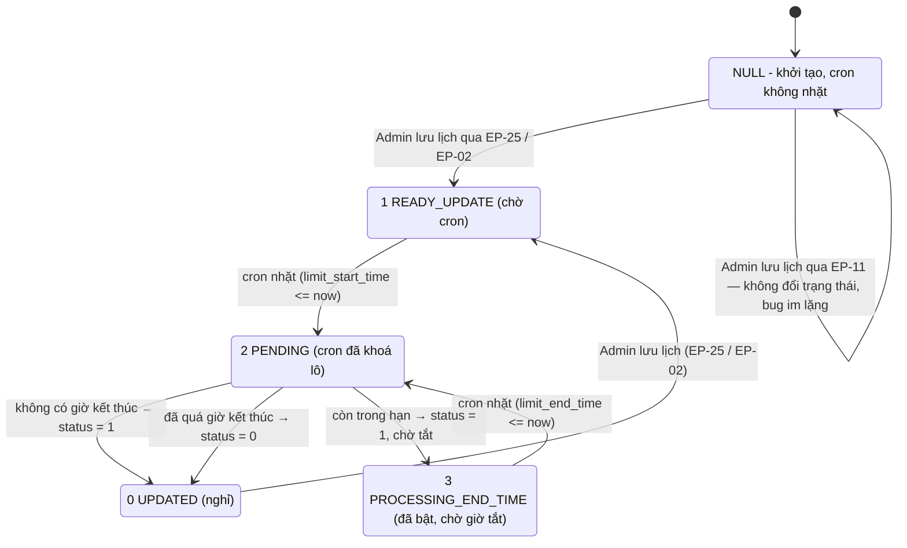

# FA-017 — QR Code Action 「QRコードアクション」 — Job Spec (Background Jobs)

> **Nguồn phân tích**
> - Laravel: `src/web/sns-line/app/Console/` (Artisan cron), `app/Http/Controllers/LiffController.php`
> - Spring Boot: `src/job/linect-service/src/main/java/sns/line/`
> - Đầu vào: `features/admin/qr-landing/web/logic-spec.md`, `web/api-spec.md`
> - **Chưa có** `ui/ui-spec.md` tại thời điểm phân tích.

---

## 1. Tổng quan

### 1.1. Tại sao tính năng cần background job

Tính năng QR Code Action có 4 nhóm việc **không thể** làm đồng bộ trong request HTTP của Admin:

| Nhóm việc | Lý do cần job |
|---|---|
| Chạy action khi LINE User kết bạn qua QR | LINE gửi **webhook follow event** tới hệ thống, không phải Admin thao tác. Việc gửi tin nhắn / gắn tag / chạy kịch bản mất nhiều thời gian ⇒ phải xử lý nền |
| Ghép lượt mở trang (`collect_open_landings`) với lượt kết bạn (`detail_landing_click`) | Hai bản ghi được tạo ở **2 thời điểm khác nhau** (mở trang LIFF trước, kết bạn sau), khoá ghép là `device_id` cookie ⇒ cần job quét ghép sau |
| Tổng hợp số liệu hằng ngày | Bảng `detail_landing_click` / `collect_open_landings` rất lớn; tính realtime cho mọi màn thống kê sẽ quá chậm ⇒ tổng hợp trước vào `landing_histories` |
| Bật/tắt QR theo lịch, xoá cứng QR quá hạn | Cần chạy định kỳ theo đồng hồ, không phụ thuộc thao tác người dùng |

### 1.2. Kiểu giao tiếp — Database Polling Model

Hệ thống **không** dùng message broker. Giao tiếp giữa web (Laravel) và job (Spring Boot) hoàn toàn qua **các bảng MySQL đóng vai trò hàng đợi**:

- Laravel (hoặc webhook receiver) **INSERT** bản ghi với cột trạng thái = *chờ xử lý*.
- Spring Boot chạy vòng lặp `while(true)`, **poll** bảng đó, `Thread.sleep(500)` khi rỗng.
- Khi nhặt được bản ghi ⇒ đổi trạng thái sang *đang xử lý* ⇒ xử lý ⇒ đổi sang *xong* / *lỗi*.
- Mỗi task manager được bật/tắt bằng **feature flag** `ConfigFile.ENABLE_XXX` đọc từ `config.properties`.
- Entry point: `AppMain.run()`.

Riêng nhóm Laravel dùng **Artisan Console Command + cron** (`app/Console/Kernel.php`), trong đó lệnh `landing:qr-off:schedule` cũng vận hành theo mô hình cột-hàng-đợi (`landing.time_qr_off_status`).

### 1.3. Phạm vi — 2 nhóm job

| Nhóm | Số lượng | Vai trò với FA-017 |
|---|---|---|
| **A. Laravel Artisan Cron** | 4 command theo lịch + 1 command thủ công | Thống kê, đồng bộ Google Sheets, lịch bật/tắt QR, dọn dữ liệu |
| **B. Spring Boot polling task** | 2 task chính + 2 task phụ | Thực thi action khi kết bạn qua QR; ghép device ↔ lượt mở trang |

**Bản đồ tổng quát**

| Việc | Nơi thực thi |
|---|---|
| Ghi lượt mở trang QR (`collect_open_landings`) | Laravel — `QRCodeController@countScan` (EP-64) và `LiffController` |
| Ghi lượt click chi tiết (`detail_landing_click`, `action = 1`) | **Laravel — `LiffController`** (khi LIFF app mở) |
| Đánh dấu đã kết bạn (`action = 2`), chạy action, gửi tin, gắn tag, chạy kịch bản | **Spring Boot — `HandlePostbackTask.doHandleFollowEvent`** |
| Ghép `collect_id` cho `detail_landing_click` | **Spring Boot — `MappingDeviceTask`** |
| Tổng hợp `landing_histories` | Laravel cron `statistic:landing_action` |
| Đẩy Google Sheets | Laravel cron `landing:insert_google_sheet` |
| Bật/tắt QR theo lịch | Laravel cron `landing:qr-off:schedule` |
| Xoá cứng sau 90 ngày | Laravel cron `landing:force-delete` |

---

## 2. Nhóm A — Laravel Artisan Cron

Đăng ký lịch tại `sns-line/app/Console/Kernel.php`.

| # | Signature | Lịch | Dòng đăng ký |
|---|---|---|---|
| A-1 | `statistic:landing_action` | `dailyAt('02:05')` | `app/Console/Kernel.php:196` |
| A-2 | `landing:insert_google_sheet` | `dailyAt('02:10')` | `app/Console/Kernel.php:177` |
| A-3 | `landing:qr-off:schedule` | `everyMinute()` | `app/Console/Kernel.php:199` |
| A-4 | `landing:force-delete` | `dailyAt('05:05')` | `app/Console/Kernel.php:189` |
| A-5 | `recover:collect_landing_page` | **không có trong Kernel — chạy tay** | `app/Console/Commands/RecoverCollectLandingPageCommand.php:17` |

Mức độ tin cậy toàn mục 2: **Cao** (đọc trực tiếp source).

---

### 2.1. A-1 — `statistic:landing_action` (tổng hợp số liệu ngày)

- **Class**: `App\Console\Commands\JobStatisticLanding` — `app/Console/Commands/JobStatisticLanding.php`
- **Lịch**: 02:05 hằng ngày
- **Cờ nội bộ**: `$limit = 1000` (chunk size), `$isAllStatistic = false` (chỉ tính **hôm qua**; đặt `true` sẽ tính lại toàn bộ lịch sử)

**Bảng đọc**: `landing`, `detail_landing_click`, `collect_open_landings`
**Bảng ghi**: `landing_histories` (`updateOrCreate`)

**Logic từng bước**

| # | Bước | Dòng |
|---|---|---|
| 1 | `Landing::chunk(1000, ...)` — duyệt **toàn bộ** bảng `landing` của toàn hệ thống, **không lọc `bot_id`, không lọc `deleted_at`** | `:48-53` |
| 2 | Với mỗi landing, query `detail_landing_click` lọc `landing_id`, `whereDate('time_click', hôm qua)`, `GROUP BY DATE(time_click)` | `:59-84` |
| 3 | Query `collect_open_landings` lọc `landing_id`, `date_scan >= '20250925'` (**hardcode**), `date_scan = hôm qua`, điều kiện `(is_scan = 1 AND type = PC(1)) OR type = MOBILE(2)`, `GROUP BY date_scan` | `:86-97` |
| 4 | `saveHistories()` — `updateOrCreate` vào `landing_histories` **2 lần** cho cùng khoá (`bot_id`, `landing_id`, `datestamp`): lần 1 ghi 12 chỉ số từ `detail_landing_click`, lần 2 ghi `count_click` / `count_click_distinct` từ `collect_open_landings` | `:100-137` |
| 5 | Ghi log file `job_crontab` ở đầu/cuối mỗi landing qua `customeCreateFileLog()` | `:57, 98` |

**12 chỉ số tính từ `detail_landing_click`** (`:63-78`)

| Chỉ số | Biểu thức SQL |
|---|---|
| `count_scan` | `count(*)` |
| `count_scan_friend_new` | `COUNT(CASE WHEN is_old_friend = 0 THEN 1 END)` |
| `count_action` | `COUNT(CASE WHEN is_action_web = 1 or is_action_web = 2 THEN 1 END)` |
| `count_add_friend` | `COUNT(CASE WHEN action = 2 THEN 1 END)` |
| `count_add_friend_new` | `COUNT(CASE WHEN action = 2 AND is_old_friend = 0 THEN 1 END)` |
| `count_scan_pc` | `COUNT(CASE WHEN qr_scan_from_device = 1 THEN 1 END)` |
| `count_scan_mobile` | `COUNT(CASE WHEN qr_scan_from_device = 0 THEN 1 END)` |
| `count_scan_distinct` | `COUNT(DISTINCT line_id)` |
| `count_action_distinct` | `COUNT(DISTINCT CASE WHEN is_action_web IN (1,2) THEN line_id END)` |
| `count_add_friend_distinct` | `COUNT(DISTINCT CASE WHEN action = 2 THEN line_id END)` |
| `count_scan_pc_distinct` | `COUNT(DISTINCT CASE WHEN qr_scan_from_device = 1 THEN line_id END)` |
| `count_scan_mobile_distinct` | `COUNT(DISTINCT CASE WHEN qr_scan_from_device = 0 THEN line_id END)` |

> **Lưu ý quan trọng**: cột `is_action_web` được **Spring Boot** ghi giá trị `2`; cột `action` được Spring Boot đổi từ `1` → `2`. Nghĩa là **kết quả cron A-1 phụ thuộc trực tiếp vào việc `HandlePostbackTask` có chạy hay không** (xem mục 3.2).

---

### 2.2. A-2 — `landing:insert_google_sheet` (đồng bộ Google Sheets)

- **Class**: `App\Console\Commands\JobInsertStatisticDataActionLandingToGoogleSheet` — `app/Console/Commands/JobInsertStatisticDataActionLandingToGoogleSheet.php`
- **Service**: `App\Services\Landing\LandingGoogleSheetService` — `app/Services/Landing/LandingGoogleSheetService.php`
- **Helper API**: `App\Helpers\GoogleSheetService` — `app/Helpers/GoogleSheetService.php`
- **Lịch**: 02:10 hằng ngày (chạy **sau** A-1 5 phút để có dữ liệu mới)

**Bảng đọc**: `landing` ⨝ `landing_connect_google`, `landing_histories`
**Bảng ghi**: `landing.google_sheet_id`, `landing_connect_google.google_access_token` (khi refresh token)

**Logic từng bước**

| # | Bước | Dòng |
|---|---|---|
| 1 | Query `landing` JOIN `landing_connect_google` ON `bot_id`, lọc `status = LandingConnectGoogle::STATUS['DONE'] (2)` và `google_access_token` khác NULL/rỗng, `DISTINCT` ⚠ **bộ lọc này loại 40% dữ liệu thật** — xem cảnh báo ngay dưới | `:49-57` |
| 2 | Nếu `landing.google_sheet_id` rỗng ⇒ `createSheetForLanding()` — tạo spreadsheet mới; thất bại ⇒ `continue` (bỏ qua landing này) | `:60-69` |
| 3 | `LandingGoogleSheetService::insertDataToGoogleSheet($landing)` | `:71` |

> ⚠ **Bộ lọc `status = 2` bỏ qua 40% bot đã liên kết** — *(bổ sung theo validation-report mục 6.G / V-10, ngày 2026-08-24)*
>
> Model `App\LandingConnectGoogle` chỉ khai báo `STATUS = ['WAITING' => 0, 'PROCESSING' => 1, 'DONE' => 2, 'ERROR' => 3]`, nhưng dữ liệu thật (`db/data/landing_connect_google.sql`, 20 dòng, đếm lại độc lập) là: **`2` = 11 · `4` = 8 · `1` = 1** — không có dòng nào `0` hoặc `3`.
>
> Giá trị **`4` chiếm 8/20 = 40%** và **không tồn tại trong hằng số model**; schema (`db/schema/tables/landing_connect_google.sql`) khai `status tinyint(4) NOT NULL DEFAULT '0'` **không kèm COMMENT**. Không tìm được nơi ghi giá trị `4` trong `src/web/sns-line/app` (nghi patch SQL thủ công hoặc command ngoài phạm vi đã đọc).
>
> **Hệ quả nghiệp vụ**: 8/20 bot (40%) **không bao giờ được cron A-2 đẩy dữ liệu lên Google Sheet**, trong khi BR-21 (`web/logic-spec.md`) chỉ chặn nút 「接続解除」 khi `status ∈ {0, 1, 3}` ⇒ với `4` thì UI **không báo lỗi gì cả**. Sheet ngừng cập nhật một cách im lặng.
>
> Mức độ tin cậy: **Cao** về sự tồn tại của giá trị `4` và về bộ lọc; **Không xác định** về ý nghĩa của `4`.

**`createSheetForLanding()`** (`:84-134`)
1. Lấy `google_access_token` (đã select kèm ở bước 1).
2. `GoogleSheetService::getClientAuthFromAccessToken($token, env('DOMAIN_WEB_ADMIN') . 'basic/landing-qr/redirect-google-sheet')`.
3. Token hết hạn + có refresh token ⇒ `fetchAccessTokenWithRefreshToken()` rồi `UPDATE landing_connect_google SET google_access_token = <json mới>`.
4. `createSheet($client, $landing->name ?: 'シート1')`.
5. Không lấy được `spreadsheetId` ⇒ `logError` kèm raw response, trả `null` (**không** ghi null vào DB).
6. Thành công ⇒ `UPDATE landing SET google_sheet_id = <id>`.

**`LandingGoogleSheetService::insertDataToGoogleSheet()`** (`:13-77`)
1. Đọc `landing_connect_google` theo `bot_id`.
2. Refresh token nếu hết hạn (lặp lại logic bước 3 ở trên).
3. Khởi tạo `\Google_Service_Sheets($client)` ⇒ `executeInsert()`.
4. **Xử lý lỗi đặc biệt**: nếu exception có `error.status == 'INVALID_ARGUMENT'` (thường do sheet/tab bị xoá) ⇒ `GoogleSheetService::createNewTab()` rồi thử `executeInsert()` lại đúng 1 lần.

**`executeInsert()`** (`:79-142`)

| Trường hợp | Hành vi |
|---|---|
| Sheet **rỗng** (`getContentInPosition` trả `values == null`) | Lấy **toàn bộ** `landing_histories` của landing ⇒ ghi hàng tiêu đề `['日時', 'URL読み込み', '友だち追加・ブロック解除', 'アクション稼働']` + toàn bộ dòng dữ liệu ⇒ `batchUpdatepdateRowData()` từ ô `A1` |
| Sheet **đã có dữ liệu** | Lấy `landing_histories` của **hôm qua** (`datestamp = now()->subDay()->format('Ymd')`) ⇒ `appendRowData()` thêm 1 dòng |

Định dạng cột 日時: `Y.m.d(<thứ tiếng Nhật>)` qua `getDayOfWeek()`. Các số dùng `number_format()`.

> ⚠ Vòng `foreach` trong nhánh "sheet đã có dữ liệu" (`:129-139`) **gán đè** `$arrayContent` mỗi vòng ⇒ nếu có nhiều hơn 1 bản ghi cùng `datestamp`, chỉ dòng cuối được ghi. Mức độ tin cậy: **Cao**.

---

### 2.3. A-3 — `landing:qr-off:schedule` (lịch bật/tắt QR) — **state machine**

- **Class**: `App\Console\Commands\HandleQrOffSchedule` — `app/Console/Commands/HandleQrOffSchedule.php`
- **Lịch**: `everyMinute()`
- **Bảng đọc/ghi**: `landing` (cột `status`, `time_qr_off_status`)

**State machine `landing.time_qr_off_status`** (hằng số `HandleQrOffSchedule.php:16-19`)

| Giá trị | Hằng số | Ý nghĩa | Ai đặt |
|---|---|---|---|
| `NULL` | *(không có hằng số)* | **Trạng thái khởi tạo** — QR chưa từng vào luồng lịch. Cột **không có DEFAULT** ở schema (`db/schema/tables/landing.sql:78` — `time_qr_off_status tinyint(4) DEFAULT NULL`) và `saveLandingV2` (`QRCodeController.php:294-317`) **không gán** cột này khi INSERT ⇒ mọi QR mới tạo đều `NULL`. Cron **không bao giờ nhặt** (trong SQL `NULL = 1` cho `NULL`, không phải `TRUE`) ⇒ không gây lỗi runtime, đúng thiết kế | Mặc định khi INSERT (EP-50 / EP-58) |
| `0` | `UPDATED` | Đã xử lý xong, không còn việc | Cron (kết thúc), `ajaxUpdateBasicQrs` |
| `1` | `READY_UPDATE` | **Chờ cron nhặt** — có lịch mới cần áp dụng | Web: `saveSettingQrOff` (EP-25), `ajaxUpdateBasicQrs` (EP-02) |
| `2` | `PENDING` | Cron **đã nhặt**, đang xử lý (khoá lô) | Cron |
| `3` | `PROCESSING_END_TIME` | QR **đã bật**, đang chờ tới `limit_end_time` để tắt | Cron, `ajaxUpdateBasicQrs` |

**Điều kiện poll** (`:52-66`)

```
WHERE (use_limit_time = 1 AND time_qr_off_status = 1 AND limit_start_time <= NOW())
   OR (use_limit_time = 1 AND time_qr_off_status = 3 AND use_limit_end_time = 1 AND limit_end_time <= NOW())
```

Chỉ `SELECT id, limit_start_time, limit_end_time, use_limit_end_time, time_qr_off_status`.

**Bước khoá lô** (`:68`): `UPDATE landing SET time_qr_off_status = 2 WHERE id IN (<danh sách vừa lấy>)` — đánh dấu `PENDING` hàng loạt để lần chạy phút kế tiếp không nhặt trùng.

> ⚠ Đối tượng `$landing` trong vòng lặp vẫn giữ giá trị `time_qr_off_status` **cũ** (đã select trước khi mass update) ⇒ các nhánh `if` bên dưới so sánh đúng với trạng thái ban đầu. Mức độ tin cậy: **Cao**.

**Chuyển trạng thái từng bản ghi** (`:70-104`)

| Trạng thái vào | Điều kiện | `status` mới | `time_qr_off_status` mới |
|---|---|---|---|
| `1` READY_UPDATE | `use_limit_end_time` falsy (không đặt giờ kết thúc) | `1` (公開) | `0` UPDATED |
| `1` READY_UPDATE | `use_limit_end_time` = 1 **và** `limit_end_time <= now` | `0` (非公開) | `0` UPDATED |
| `1` READY_UPDATE | `use_limit_end_time` = 1 **và** `limit_end_time > now` | `1` (公開) | `3` PROCESSING_END_TIME |
| `3` PROCESSING_END_TIME | `limit_end_time <= now` | `0` (非公開) | `0` UPDATED |

**Sơ đồ trạng thái**



**Xử lý lỗi**: mỗi bản ghi bọc `try/catch` riêng, exception ⇒ `customeCreateFileLog('ERROR', ..., 'job_crontab')`; **bản ghi lỗi bị kẹt vĩnh viễn ở trạng thái `2` PENDING** (không có cơ chế reset) — xem mục 9.

> ⚠ **Hệ quả của trạng thái `NULL` — bug im lặng (liên hệ R-14 trong `web/logic-spec.md`)** — *(bổ sung theo validation-report mục 6.F / V-09, ngày 2026-08-24)*
>
> Dữ liệu thật (`db/data/landing.sql`, 566 dòng, đếm lại độc lập): `time_qr_off_status` = **NULL ở 565/566 dòng**, `= 0` ở **1 dòng**, **không có dòng nào** mang giá trị `1` / `2` / `3`. Đối chiếu `use_limit_time` = `0` ở **564/566** dòng, `= 1` ở **2** dòng ⇒ chỉ 2 QR trong toàn dump từng bật lịch tự động, nên NULL ở 565 dòng là **hợp lý, không phải bug dữ liệu**.
>
> Nhưng nó khuếch đại một **bug thật của hệ thống**: EP-11 `settingLimit` (màn `SCR-QRL-13` 「有効期間の設定」) ghi `use_limit_time`, `limit_start_time`, `limit_end_time` nhưng **không** đặt `time_qr_off_status = 1`. Với một QR chưa từng lưu qua EP-25 / EP-06, cột vẫn giữ `NULL` ⇒ điều kiện poll ở trên **không bao giờ khớp** ⇒ **lịch nằm im vĩnh viễn**, trong khi cột 「有効期間」 ở màn danh sách (`SCR-QRL-01`) **vẫn hiển thị khoảng thời gian** như thể lịch đang chạy — Admin không có bất kỳ tín hiệu lỗi nào.
>
> Nếu cột có `DEFAULT 0` thì ít nhất bản ghi sẽ ở một trạng thái đã biết; với `NULL` thì không phân biệt được 「chưa từng đặt lịch」 và 「đặt lịch nhưng hỏng」. Xem thêm mục 9 #16. Mức độ tin cậy: **Cao** (schema + dữ liệu thật + đọc trực tiếp `HandleQrOffSchedule.php:52-66`).

---

### 2.4. A-4 — `landing:force-delete` (xoá cứng sau 90 ngày)

- **Class**: `App\Console\Commands\ForceDeleteQrLandingCommand` — `app/Console/Commands/ForceDeleteQrLandingCommand.php`
- **Lịch**: 05:05 hằng ngày

**Logic** (`:41-60`)
1. `$date = now()->subDays(90)`.
2. `Landing::onlyTrashed()->where('deleted_at', '<', $date)->pluck('id')` — **không lọc `bot_id`** (chạy toàn hệ thống).
3. Nếu có id: `Landing::whereIn('id', $ids)->forceDelete()` **rồi** `DetailLandingClick::whereIn('landing_id', $ids)->forceDelete()`.
4. Ghi `Log::info` danh sách id trước/sau.

> ⚠ Không xoá `collect_open_landings`, `landing_histories`, `time_action_landing`, `landing_parameter`, `landing_page_poster_url`, `poster_connect_qrcode`, `landing_page_connect_qrcode` ⇒ **dữ liệu mồ côi** còn lại sau khi xoá cứng. (So sánh với `Landing::removeItemLanding()` ở Laravel model, method này dọn nhiều bảng hơn nhưng **không** được cron gọi.) Mức độ tin cậy: **Cao**.

---

### 2.5. A-5 — `recover:collect_landing_page` (khôi phục thủ công, không có lịch)

- **Class**: `App\Console\Commands\RecoverCollectLandingPageCommand` — `app/Console/Commands/RecoverCollectLandingPageCommand.php`
- **Không** được đăng ký trong `Kernel.php` ⇒ chỉ chạy tay bằng `php artisan recover:collect_landing_page`.
- Sinh lại bản ghi `collect_open_landings` từ `detail_landing_click`, ánh xạ `type` theo `qr_scan_from_device`: `0` (mobile) ⇒ `type = 3`, khác ⇒ `type = 4` (`:64`).
- ⚠ Giá trị `type = 3 / 4` **nằm ngoài** hằng số `CollectOpenLanding::TYPE = ['PC' => 1, 'MOBILE' => 2]` ⇒ các bản ghi khôi phục **không** được cron A-1 đếm (điều kiện `is_scan=1 AND type=1` hoặc `type=2`). Mức độ tin cậy: **Cao**.

---

## 3. Nhóm B — Spring Boot Polling Tasks

Entry point: `linect-service/src/main/java/sns/line/AppMain.java` — method `run()` khởi tạo từng task theo feature flag.

### 3.1. Bảng tổng hợp Queue Table → Task Manager

| Queue table | Cột trạng thái | Task Manager | Feature flag | Dòng khởi tạo |
|---|---|---|---|---|
| `callback_event` | `status` | `HandlePostbackTask.startHandleCallbackEvent()` | `ENABLE_POSTBACK` | `AppMain.java:277-279` |
| `detail_landing_click` (dùng `collect_id IS NULL` làm điều kiện hàng đợi) | `collect_id` | `MappingDeviceTask.scanJobNappingDevice()` | `ENABLE_LANDING_MAPPING_DEVICE` | `AppMain.java:317-319` |
| `schedule_change_bot` | `status` | `ChangeBotTask` → `ChangeBotJob` | `ENABLE_CHANGE_BOT_TASK` | `AppMain.java:328-330` |
| `csv_management` | `status` | `HandleExportCsvTask` / `HandleImportCsvTask` | `ENABLE_HANDLE_EXPORT_CSV` / `ENABLE_HANDLE_IMPORT_CSV` | `AppMain.java:237-242` |

Khai báo flag: `ConfigFile.java:95` (`ENABLE_POSTBACK`), `ConfigFile.java:138` (`ENABLE_LANDING_MAPPING_DEVICE`); nạp từ `config.properties` tại `ConfigFile.java:254` và `:294`; log xác nhận tại `:316-318` và `:418-420`.
Trong file `config.properties` mẫu của repo, `ENABLE_POSTBACK=0` (`linect-service/config.properties:22`) — đây chỉ là mẫu dev, môi trường production bật cờ này. Mức độ tin cậy: **Trung bình**.

> ⚠ **2 bảng job-spec nhắc tới KHÔNG có trong dump `lme_db` hiện tại — nhưng CHẮC CHẮN tồn tại trong hệ thống thật** — *(bổ sung theo validation-report mục 6.C / V-06, ngày 2026-08-24; job-spec được phân xử là ĐÚNG, lỗi nằm ở dump)*
>
> | Bảng | Bằng chứng tồn tại trong code | Trạng thái trong dump |
> |---|---|---|
> | `schedule_change_bot` | Entity `sns/line/models/…/entities/ScheduleChangeBot.java` (hằng số `STATUS_WAITING`) + repository, được `ChangeBotTask.java:57-115` poll qua `findTop50ByStatusOrderByIdAsc(STATUS_WAITING)` | ❌ Không có trong `db/index.md`, không có `db/schema/tables/schedule_change_bot.sql` |
> | `line_user_add_friend_history` | Entity `sns/line/models/linedb/entities/LineUserAddFriendHistory.java:14-22` (8 cột) ghi qua `helper/HistoryHelper.java:403-419`; **và** model Laravel `App\Models\LineUserAddFriendHistory` được gọi tại `QRCodeController.php:3013` (`LineUserAddFriendHistory::addHistory([...])`, vùng `checkFriend()` của EP-69) | ❌ Không có trong `db/index.md`, không có file schema. `add_friend_history.sql` trong dump là **bảng khác** (6 cột: `id`, `affiliater_id`, `bot_id`, `ip_reference`, `status`, `created_at`) |
>
> Nếu `line_user_add_friend_history` không tồn tại trên production, EP-69 sẽ trả HTTP 500 **mỗi lần chạy** — hệ thống đang chạy bình thường ⇒ bảng có thật.
>
> **Giải thích khả dĩ nhất — hệ thống dùng NHIỀU DATABASE**: Spring Boot khai báo 3 datasource `linedb` / `backenddb` / `historydb`, và Laravel `App\CallbackEvent:9` dùng connection riêng **`mysql_callback`** cho bảng `callback_event`. Dump hiện tại chỉ là `lme_db`. Hai khả năng còn lại: dump lấy trước khi 2 bảng ra đời, hoặc bảng bị loại khi export (thường do quá nặng).
>
> ⇒ **Cần export bổ sung schema/data của 2 bảng này**; trong lúc chờ, mọi mô tả về `schedule_change_bot` và `line_user_add_friend_history` trong file này dựa trên **entity Java / model Laravel**, không phải trên dump.

---

### 3.2. B-1 — `HandlePostbackTask` (task cốt lõi của FA-017)

**File**: `linect-service/src/main/java/sns/line/task/HandlePostbackTask.java` (kế thừa `StoppableTask`)

#### 3.2.1. Queue table `callback_event`

- **Entity**: `linect-service/src/main/java/sns/line/models/backenddb/entities/CallbackEvent.java`
- **Repository**: `.../models/backenddb/repository/CallbackEventRepository.java`
- **Nguồn INSERT**: service nhận webhook LINE (ngoài phạm vi FA-017) ghi nguyên payload callback vào `callback_event` với `status = 0`.

> ⚠ **`callback_event` KHÔNG chỉ do Spring Boot ghi** — *(bổ sung theo validation-report mục 6.E / V-11, ngày 2026-08-24)*
>
> Bảng nằm trên **connection riêng `mysql_callback`** (`src/web/sns-line/app/CallbackEvent.php:9`) và có **ít nhất 3 nguồn ghi**:
> 1. Spring Boot `HandlePostbackTask` (mô tả trong file này);
> 2. Laravel — `app/Console/Commands/HandleCallback.php`, `HandleCallbackMessage.php`, `HandleCallbackPostback.php`;
> 3. Service nhận webhook LINE — **không nằm trong repo** (cả `src/web` lẫn `src/job` đều không có endpoint nhận webhook).
>
> ⇒ Danh sách hằng số `CallbackEvent.java:9-24` **chỉ phản ánh nguồn (1)**. Bảng dưới đây được bổ sung thêm 4 giá trị chỉ thấy trong dữ liệu thật.

**State machine `callback_event.status`** (`CallbackEvent.java:9-24`)

| Giá trị | Hằng số | Ý nghĩa |
|---|---|---|
| `0` | `STATUS_NEW` | Mới, chờ nhặt |
| `1` | `STATUS_PROCESSING` | Đang xử lý |
| `2` | `STATUS_DONE` | Xong |
| `3` | `STATUS_ERROR` | Lỗi (kèm `error_message`) |
| `4` | `STATUS_UNKNOWN_EVENT` | Event không nhận diện được |
| `5` | `STATUS_NOT_FRIEND` | Không phải bạn bè |
| `6` | `STATUS_NOT_FOUND_BOT` | Không tìm thấy bot |
| `7` | `STATUS_BLOCKED_BY_BOT` | Bot chặn |
| `8` | `STATUS_EXPIRED_BOT` | Bot hết hạn hợp đồng > 7 ngày |
| `9` | `STATUS_UNKNOWN_TYPE` | Callback không có event nào xử lý được |
| `10` | `STATUS_IGNORE_GROUP_MESSAGE` | Bỏ qua tin nhắn group — ⚠ **xung đột ngữ nghĩa với Laravel**, xem bảng bổ sung |
| `11` | `STATUS_IGNORE_DUPLICATE_WEBHOOK` | Webhook redelivery trùng `webhook_event_id` |
| `30/31/33` | `STATUS_MEDIA_NEW` / `_PROCESSING` / `_ERROR` | Nhánh tải media |
| `50` | `STATUS_IMAGE_MAP_NEW` | Nhánh image map |

**Bảng bổ sung — 4 giá trị có trong dữ liệu thật nhưng KHÔNG có trong `CallbackEvent.java`**

Nguồn số liệu: `db/data/callback_event.sql` — **41.056 dòng**, đếm lại độc lập.

| Giá trị | Truy được nguồn? | Nguồn / Ý nghĩa | Số dòng thật |
|---|---|---|---|
| `103` | ✅ **Có** | Laravel `app/Console/Commands/HandleCallback.php:967` (method `getUserFormLineServer`): LINE Profile API trả message chứa 「**Not found**」 ⇒ user không tồn tại / đã xoá tài khoản LINE. Giá trị được ghi vào `callback_event.status` tại `:148` và `:162`. Mức độ tin cậy: **Cao** | 5 |
| `3000` | ❌ **Không** | **Không truy được trong cả 2 codebase** — grep `3000` trong `src/job/…/sns/line/` chỉ ra `sleep(3000)` / timeout `30000ms`; grep trong `src/web/sns-line/app/` chỉ ra `30000` / `300000` (giới hạn tin nhắn, timeout). Nghi là trạng thái do một job dọn dẹp / lưu trữ đặt hàng loạt | **5.855 (14,3%)** |
| `102` | ❌ **Không** | Không truy được trong cả 2 codebase | 58 |
| `200` | ❌ **Không** | Không truy được trong cả 2 codebase | 1 |

> **Lý do không truy được `3000` / `102` / `200`**: **webhook receiver nằm ngoài repo** — bảng `callback_event` được service nhận webhook LINE ghi trực tiếp qua connection `mysql_callback`, và service đó không có mặt trong `src/web` lẫn `src/job`. Đây là **giới hạn của phạm vi source code hiện có**, không phải suy đoán bị bỏ dở.

**⚠ Xung đột ngữ nghĩa giá trị `10` giữa 2 codebase**

| Codebase | Hằng số / nhánh | Ý nghĩa |
|---|---|---|
| Spring Boot | `CallbackEvent.STATUS_IGNORE_GROUP_MESSAGE` (`CallbackEvent.java:9-24`) | Bỏ qua tin nhắn gửi trong group |
| Laravel | `HandleCallback.php:965` — nhánh `stripos($profile['message'], 'Authentication failed') !== false` | LINE Profile API trả 「**Authentication failed**」 ⇒ channel access token của bot sai/hết hạn (đồng thời ghi `bots.bot_error_message`) |

⇒ **Cùng một giá trị `10` mang 2 ý nghĩa hoàn toàn khác nhau** tuỳ nơi ghi. Dữ liệu thật chỉ có **2/41.056** dòng `status = 10` nên **không thể phân biệt bằng dữ liệu**; muốn xác định phải đối chiếu `error_message` của từng dòng. Mức độ tin cậy: **Cao** (đọc trực tiếp cả 2 nguồn).

> **Phân bố đầy đủ của `callback_event.status` trong dump** (41.056 dòng): `2` = 34.349 · `3000` = 5.855 · `3` = 277 · `8` = 217 · `9` = 71 · `1` = 68 · `6` = 65 · `102` = 58 · `4` = 53 · `7` = 35 · `103` = 5 · `10` = 2 · `200` = 1. Không có dòng nào mang `0`, `5`, `11`, `30`, `31`, `33`, `50` tại thời điểm dump.

#### 3.2.2. Polling logic

**Luồng nạp (1 thread)** — `startJobGetEvent()` — `HandlePostbackTask.java:138-183`
1. Bỏ qua nếu `ConfigFile.MODE != Constants.Mode.NORMAL` (`:139-142`).
2. `while(true)`: `callbackEventRepository.findAllByStatus(STATUS_NEW)`.
3. Có dữ liệu ⇒ set `status = 1` cho cả lô ⇒ `saveAll()` ⇒ đẩy vào `callbackEventQueue` (LinkedList in-memory, đồng bộ bằng `lockQueue`).
4. Rỗng ⇒ `Thread.sleep(500)`. Exception ⇒ log + `Thread.sleep(1000)`.

**Luồng xử lý (30 thread)** — `startHandleCallbackEvent()` — `:282-398`
- `MAX_THREAD = 30`, thread pool `Executors.newFixedThreadPool(35)` (`:94-95`).
- Mỗi thread `while(true)` lấy 1 `CallbackEvent` khỏi queue in-memory; rỗng ⇒ `Thread.sleep(500)`.
- Bộ lọc trước khi xử lý:
  - Trùng `webhook_event_id` (có row cũ hơn cùng bot) ⇒ `STATUS_IGNORE_DUPLICATE_WEBHOOK` (`:301-309`).
  - `BotManager.getBot()` null ⇒ `STATUS_NOT_FOUND_BOT` (`:310-315`).
  - `bot.isExpiredOver7Day()` ⇒ `STATUS_EXPIRED_BOT` (`:316-321`).
  - Parse JSON lỗi ⇒ `STATUS_ERROR`; không có event ⇒ `STATUS_UNKNOWN_TYPE`.
- Sắp xếp các event trong callback theo `timestamp` (stable sort) (`:340-342`).
- Tách nhánh media: event message có media ⇒ để lại cho job media (`STATUS_MEDIA_NEW`), các event khác (follow/unfollow/join…) xử lý ngay để **không treo luồng kết bạn** (`:344-352`).
- `handleCallbackEventByType()` (`:409-...`) gom các event **liền kề cùng type** rồi dispatch; `TYPE_FOLLOW` ⇒ **`doHandleFollowEvent(event, eventsOfType)`** (`:421`).
- `saveCallbackRetry(callbackEvent)` trong `finally` — luôn cập nhật status, tránh row kẹt `PROCESSING`.

#### 3.2.3. `doHandleFollowEvent()` — nơi thực thi QR Code Action

**File**: `linect-service/src/main/java/sns/line/task/HandlePostbackTask.java:2258-3102`

Đây là **toàn bộ nghiệp vụ "kết bạn qua QR → chạy action"** của FA-017.

##### Bước 1 — Tìm bản ghi click gần nhất (`:2419-2421`)

```java
LocalDateTime valid3min = LocalDateTime.now().minusDays(1);   // tên biến là "3min" nhưng thực tế là 1 NGÀY
DetailLandingClick detailLandingClick = ...findFirstByLineIdAndBotIdAndDeletedAtIsNullAndCreatedAtGreaterThanOrderByIdDesc(
        lineUser.getLineId(), bot.getId(), valid3min);
```

- Lấy bản ghi `detail_landing_click` **mới nhất** của cặp (`line_id`, `bot_id`) tạo trong **24 giờ** gần đây.
- Bản ghi này do **Laravel `LiffController`** tạo trước đó với `action = 1` (xem mục 8, câu trả lời D).
- Chỉ đi tiếp khi `detailLandingClick.isNotActioned()` tức `action == 1` (`DetailLandingClick.java:110-112`).

##### Bước 2 — Nạp cấu hình QR và cập nhật `detail_landing_click` (`:2424-2455`)

| Hành động | Chi tiết |
|---|---|
| Nạp QR | `LandingQRRepository.findByIdAndDeletedAtIsNull(detailLandingClick.getLandingId())` |
| Tăng đếm bạn bè | `UPDATE landing SET total_user_friend = total_user_friend + 1 WHERE id = ?` (`LandingQRRepository.java:24-27`) |
| Ghi nhận người giới thiệu (chỉ khi `isNewFriend`) | `introUserId = detailLandingClick.user_intro_id`; `actionIntroUser = landing.user_introduction_action_id`; nếu `landing.use_user_intro_action_message == 1` ⇒ `templateIntro = landing.template_intro_id` |
| **Đổi trạng thái bản ghi click** | `action = 2` (đã kết bạn); `is_old_friend = isNewFriend ? 0 : 1`; `bot_line_user_id = <id>` ⇒ `save()`. ⚠ **Spring Boot chỉ ghi `is_old_friend` = `0` hoặc `1`** — giá trị `2` và `3` do Laravel `LiffController.php:1646-1649` ghi (xem cảnh báo dưới) |
| Đồng bộ ES | `SyncEsModel.save(detailLandingClick, botId, lineUserId)` — **thân hàm đã bị comment toàn bộ**, thực tế no-op (`models/SyncEsModel.java:186-201`). Mức độ tin cậy: **Cao** |

> ⚠ **Spring Boot KHÔNG phải nguồn duy nhất đặt `action = 2`** — *(bổ sung theo validation-report mục 6.H, ngày 2026-08-24)*
>
> Laravel `LiffController` **cũng** chuyển `action` từ `1` sang `2` ở 2 chỗ, khi luồng LIFF tự phát hiện user đã kết bạn:
>
> ```php
> LiffController.php:1325   DetailLandingClick::where('id',$idDetailClick)->update(['action' => 2, 'bot_line_user_id' => $botLineUserId]);
> LiffController.php:1411   DetailLandingClick::where('id',$idDetailClick)->update(['action' => 2, 'bot_line_user_id' => $botLineUserId]);
> LiffController.php:1327   Landing::where('id', $landing->id)->update(['total_user_friend' => ($landing->total_user_friend + 1)]);
> LiffController.php:1649   DetailLandingClick::…->update(['is_old_friend' => $isOldFriendNotExist ? 3 : $is_old_friend]);
> ```
>
> ⇒ Bốn đối tượng `detail_landing_click.action` (1→2), `.is_old_friend`, `.bot_line_user_id` và `landing.total_user_friend` đều có **HAI nguồn ghi**: Laravel `LiffController` **và** Spring Boot `HandlePostbackTask`.
>
> **Phân chia giá trị `is_old_friend` theo nguồn ghi** (quan trọng khi debug):
>
> | Giá trị | Nguồn ghi | Ngữ nghĩa |
> |---|---|---|
> | `0` | Cả Laravel (`LiffController.php:1639` khởi tạo) **và** Spring Boot (`:2448`) | Chưa từng có quan hệ với bot |
> | `1` | Cả Laravel (`:1641`) **và** Spring Boot (`:2448`) | Đã có `bot_line_user`/`conversation`, không block |
> | `2` | **CHỈ Laravel** (`LiffController.php:1643`) | Đang block — trạng thái trung gian, bị ghi đè thành `1`/`3` khi unblock (`:1667`) |
> | `3` | **CHỈ Laravel** (`LiffController.php:1649`, khi `$isOldFriendNotExist = true` đặt tại `:1329` / `:1415`) | Là bạn trên LINE nhưng chưa hiện trên エルメ |
>
> Điều này giải thích vì sao khi debug bằng cách chỉ đọc code Spring Boot, ta không bao giờ thấy giá trị `2` và `3`. Mức độ tin cậy: **Cao** (đọc trực tiếp cả 2 nguồn).

##### Bước 3 — Nhánh affiliate (`:2456-2461`)

Nếu có `aff_result` mới trong 24h ⇒ lấy QR có `connect_aff = 1` của bot làm `landingQR` (`findFirstByBotIdAndConnectAffAndDeletedAtIsNull`).

##### Bước 4 — Ưu tiên QR hơn `add_friend_setting` (`:2464-2481`)

- Có `landingQR` ⇒ ghi tên QR vào `messages_v2s.qrcode_add_friend` (`updateQrCodeAddFriend`) và **bỏ qua** `add_friend_setting` chung của bot (`addFriendSetting = null`).
- **Chặn chạy nhiều lần**: `landing.action_type == ACTION_TYPE_1_TIMES (1)` và đã có > 1 bản ghi `action = 2` cho cặp (landing, line_id) ⇒ huỷ cả `landingQR` lẫn `addFriendSetting` (`:2475-2480`).

##### Bước 5 — Kiểm tra khoảng cách thời gian chạy lại — bảng `time_action_landing` (`:2482-2506`)

- **Entity**: `.../models/linedb/entities/TimeActionLanding.java` (bảng `time_action_landing`, cột `landing_id`, `bot_id`, `line_id`, `time_action`)
- **Repository**: `TimeActionLandingRepository.findFirstByLineIdAndLandingId()`

| `landing.interval_action` | Điều kiện huỷ action |
|---|---|
| `1` (1 lần/ngày) | `time_action` cùng `dayOfYear` với hôm nay ⇒ `landingQR = null` |
| `2` (theo số giờ) | `time_action` sau `now - landing.time_interval_action` giờ ⇒ `landingQR = null` |
| khác / null | không chặn |

Nếu action được phép chạy ⇒ cập nhật `time_action = now`; chưa có bản ghi ⇒ tạo mới. Luôn `save()`.

##### Bước 6 — Ghi thông tin bạn bè từ tham số `cid1..cid5` (`:2507-2523`)

Điều kiện: `landing.is_on_param == 1` và `detail_landing_click.param_qrcode_connect_outside` không rỗng và `action_with_friend` khớp loại bạn.
- `splitQuery()` tách query string ⇒ với mỗi khoá `cid1`…`cid5` gọi `checkLandingParam()` (`:3129-3135`).
- `checkLandingParam` ⇒ `BotLineUserModel.setFriendInfoByLanding()` (`models/BotLineUserModel.java:130+`):
  - Tra `landing_parameter` theo (`landing_id`, `bot_id`, `param_code`) ⇒ lấy `friend_information_id`.
  - Điều kiện hợp lệ: `friendInfoSettingId > 0 || friendInfoSettingId < -6`.
  - Đọc/ghi `friend_information_value` (`findFirstByLineIdAndFriendInfoSettingId` ⇒ `save`).
  - Nếu giá trị thay đổi (hoặc tạo mới) ⇒ `isAction = true` ⇒ kích hoạt trigger `StartActionInfo(TYPE_LANDING_LOAD_URL, landingId)`.

##### Bước 7 — Quyết định action nào chạy (`:2525-2555`)

`acceptActionWithFriend = (action_with_friend == 1 && isNewFriend) || (action_with_friend == 2)`

| `landing.status` | `type_display_off` | `use_action_limit` | Kết quả |
|---|---|---|---|
| `1` (公開) | — | — | `needActionLanding = true` — chạy action bình thường |
| `0` (非公開) | `0` (chạy action) | `1` | Chạy **action giới hạn** `landing.action_limit_id` (nếu `acceptActionWithFriend`) |
| `0` | `0` | `0` | Không chạy action của QR, **vẫn** chạy action của add friend setting |
| `0` | `1` / `2` (hiện text / redirect) | — | Không tới được nhánh job (trang QR đã chặn trước, không quét được) |

##### Bước 8 — Ghi lịch sử kết bạn (`:2557-2562`)

`HistoryHelper.recordAddFriend(botId, lineUserId, landingQrId, landingQrName, type, null, null)` — `helper/HistoryHelper.java:403-419` ⇒ INSERT `line_user_add_friend_history`.

**Loại lịch sử** (`models/linedb/entities/LineUserAddFriendHistory.java:14-22`)

| Giá trị | Hằng số | Xác định tại |
|---|---|---|
| `0` | `TYPE_OLD` | `HandlePostbackTask.java:2385` |
| `1` | `TYPE_NEW` | `:2381` |
| `2` | `TYPE_UNBLOCK` | `:2383` |
| `3..7` | `TYPE_ACTION_UNBLOCK` / `_HIDE` / `TYPE_FRIEND_BLOCK_BOT` / `_UNHIDE` / `_BLOCK` | (các luồng khác) |

Cột lưu: `bot_id`, `line_user_id`, `landing_qr_id`, `landing_qr_name`, `type`, `action_multi_capture_id`, `message_id`, `created_at`.

##### Bước 9 — Gom danh sách template + tag + kịch bản (`:2563-2745`)

Chỉ chạy khi `actionLimitId == null` (tức QR không ở chế độ "action giới hạn").

**9a. Từ `add_friend_setting`** (khi **không** có QR) — chọn theo `isNewFriend` / `isUnblock` / bạn cũ ⇒ lấy `action_id_new_friend` / `action_id_unblock` / `action_id_old_friend`, hoặc kịch bản `new_friend_scenario` / `olf_friend_scenario_id` kèm `start_day` / `start_time`, và template `template_add_new` / `template_unblock` / `template_add_old` (`sentTemplateSources = 2`).

**9b. Từ QR** (khi có `landingQR` và `acceptActionWithFriend`) — `:2632-2740`:
- Nếu `landing.use_msg_new_friend` / `use_msg_old_friend` / `use_msg_unblock` = 1 ⇒ **vẫn** lấy action + template tương ứng từ `add_friend_setting` của bot (source `2`).
- Nếu `needActionLanding`:

  | Điều kiện | Hành động |
  |---|---|
  | `landing.action_id > 0` | `actionId = landing.action_id`, `isCountAction = true` |
  | Không có `action_id`, có `landing.text_send` | Xoá list template hiện có, tạo template text tạm bằng `TemplateCacheManager.addTextMessage()` (source `1`) |
  | Không có `action_id`, có `landing.template_id > 0` | Thêm template đó (source `1`) |
  | Không có `action_id`, có `landing.scenario_id > 0` | `scenarioIdStart = landing.scenario_id`, trigger `TYPE_LANDING_LOAD_URL` |
  | Không có `action_id`, có `landing.tag_id > 0` | `listTag = [tag_id]` |
  | `landing.template_general_id > 0` | Thêm template chung (source `1`), `isCountAction = true` |

- **Nếu `isCountAction`** (`:2731-2739`):
  - `UPDATE detail_landing_click SET is_action_web = 2 WHERE id = ?` (`updateIsActionWebById`)
  - `UPDATE landing SET count_action = count_action + 1 WHERE id = ?` (`incCountAction`)

##### Bước 10 — Thực thi action (`:2760-2800`)

- Xây `FollowHistoryMessageRef(detailLandingClickId, firstLandingTemplateId, addFriendHistoryId, firstAddFriendTemplateId)` để write-back `message_id` sau khi tin nhắn được lưu.
- **Thứ tự ưu tiên trong `actionIdList`**: `actionAddFriend` (add friend setting) **trước**, rồi `actionId` (QR), rồi `actionLimitId` — comment code ghi rõ lý do liên quan tới cách kịch bản lấy action cuối trong list (`:2768`).
- Tất cả gán `Scenario.START_TYPE_QR_FRIEND` trong `actionScenarioTypeMap`.
- Gọi `doAction(botId, lineUser, conversation, replyToken, scenarioIdStart, scenarioStartDay, scenarioStartTime, scenarioType, setRichMenuId, sentTemplateIds, listTag, null, actionIdList, actionScenarioTypeMap, null, null, startActionInfo, followHistoryMessageRef)` với `startActionInfo = StartActionInfo(TriggerStartActionConstants.TYPE_LANDING_LOAD_URL, landingQR.getId())`.
- Kết quả `Map<actionId, captureId>`:
  - Capture của `actionId` (hoặc fallback `actionLimitId`) ⇒ `UPDATE detail_landing_click SET action_multi_capture_id = ?`.
  - Capture của `actionAddFriend` ⇒ `HistoryHelper.updateAddFriendActionCapture()` ghi vào `line_user_add_friend_history`.

> ✅ **Xác nhận 2 cột `detail_landing_click.action_multi_capture_id` và `.message_id` CÓ THẬT** — *(bổ sung theo validation-report mục 6.D / V-06, ngày 2026-08-24; job-spec được phân xử là ĐÚNG, dump schema mới là bên lỗi thời)*
>
> `db/db-mapping.md` từng kết luận 2 cột này 「không tồn tại」 vì dump `db/schema/tables/detail_landing_click.sql` chỉ có **22 cột** (`id, landing_id, bot_id, line_id, email, time_click, action, created_at, updated_at, bot_line_user_id, param_qrcode_connect_outside, is_old_friend, time_action, popup_id, is_action_web, user_intro_id, deleted_at, post_code, qr_scan_from_device, is_landing_off, device_id, collect_id`). Bằng chứng ngược lại:
>
> - `src/job/linect-service/src/main/java/sns/line/models/linedb/entities/DetailLandingClick.java:48-52` khai báo trực tiếp:
>   ```java
>   @Column(name = "message_id")
>   private Long messageId;
>
>   @Column(name = "action_multi_capture_id")
>   private Long actionMultiCaptureId;
>   ```
> - `src/job/linect-service/src/main/java/sns/line/models/linedb/repository/DetailLandingClickRepository.java` có **2 native UPDATE**: `UPDATE detail_landing_click SET message_id = ? WHERE id = ?` (`updateMessageId`) và `UPDATE detail_landing_click SET action_multi_capture_id = ? WHERE id = ?` (`updateActionMultiCaptureId`).
>
> Nếu 2 cột không tồn tại trên production, Hibernate sẽ fail ngay khi khởi tạo EntityManager và 2 native UPDATE sẽ ném `SQLSyntaxErrorException` **mỗi lần có người kết bạn**. Hệ thống đang chạy ⇒ **cột tồn tại thật, dump thiếu**.
>
> ⇒ Bảng `detail_landing_click` thực tế có **≥ 24 cột** (22 trong dump + 2 cột trên). **Cần export lại schema.** Mức độ tin cậy: **Cao**.

##### Bước 11 — Action cho người giới thiệu (`:2913-2934`)

Khi `hasActionIntro` (có `user_intro_id` **và** (`user_introduction_action_id` hoặc `template_intro_id`)):
- Nạp `LineUser` + `Conversation` của **người giới thiệu**.
- Chạy action `landing.user_introduction_action_id` và/hoặc gửi template `landing.template_intro_id` cho người giới thiệu.
- Trigger: `StartActionInfo(TriggerStartActionConstants.TYPE_LANDING_INTRO, landingQRIntroId)`.
- Không tìm thấy user/conversation ⇒ `LOGGER.error`, bỏ qua.

##### Bước 12 — Thông báo mobile (`:2937-2984`)

- Đọc `notify_setting` của bot (`findAllByBotId`).
- **Nếu là QR** (`isLandingQR`): `MobileNotify.TYPE_ADD_FRIEND_QR_CODE`, `notify.landingId = landing.id`; chỉ gửi khi có setting `is_notify_qr_code = 1`. Nội dung: 「に{tên QR}が稼働しました（新規友だち）」 hoặc 「…（既存友だち）」.
- **Nếu không phải QR**: `TYPE_ADD_FRIEND`, nội dung 「が追加されました（新規友だち）」/「が追加されました（既存友だち）」/「がブロック解除（復活）しました」.
- Đẩy qua `ActionLaterService.addLowPriorityTask(PriorityTask.checkAddNotifyTask(...))` — **hàng đợi ưu tiên thấp trong bộ nhớ**, không phải bảng DB.

##### Bước 13 — Gọi callback ra hệ thống ngoài (`:2986-3081`)

Điều kiện: có `detailLandingClick`, `landing.url_connect_qrcode_outside` không rỗng, `landing.is_on_callback != 0`, và `acceptActionWithFriend`.

**Thay thế placeholder trong URL**

| Placeholder | Giá trị |
|---|---|
| `{line_id}` | `lineUser.lineId` |
| `{friend_name}` | `URLEncoder.encode(lineUser.name, UTF-8)` |
| `{friend_type}` | `new` / `block` / `old` |
| `{mail}` | `lineUser.email` |
| `{forward_param}` | `detail_landing_click.param_qrcode_connect_outside`; nếu rỗng ⇒ gỡ sạch placeholder cùng dấu `?` / `&` thừa |

**Nếu URL không chứa placeholder nào** (`hasParamInfo == false`) ⇒ tự **thêm** các query param còn thiếu: `line_id`, `friend_type`, `friend_name`, `mail`, và từng cặp của `param_qrcode_connect_outside` (mỗi value được `URLEncoder.encode` riêng để tránh ký tự non-ASCII làm callback trả 400).

⇒ `executeUrl(url)` (`:3137-3157`): `HttpURLConnection` `GET`, **không follow redirect**, `connectTimeout = 5000ms`, header `User-Agent: PostmanRuntime/7.26.8`, `Accept: */*`. Trả `true` khi mã HTTP **khác** 200 (tức `true` = lỗi); exception ⇒ log + trả `true`. **Không có retry.**

##### Bước 14 — Kết thúc (`:3083-3101`)

- `ExecutionException` / `InterruptedException` (lỗi gọi LINE Profile API) ⇒ `event.status = STATUS_ERROR` + `error_message`.
- Bình thường ⇒ `event.status = STATUS_DONE`.
- Exception ngoài cùng ⇒ `STATUS_ERROR`.

##### Helper phụ liên quan

- `updateEmailFromLanding(LineUser)` — `:3260-3265`: lấy `detail_landing_click` mới nhất theo `line_id` (không lọc bot) và gán `lineUser.email` nếu bản ghi có `email`.
- `SentMessageHelper.updateFollowHistoryMessageId()` — `helper/SentMessageHelper.java:282-310`: sau khi `messages_v2s` được lưu, ghi ngược `message_id` vào `detail_landing_click` và `line_user_add_friend_history`.
- `LandingManager` — `helper/LandingManager.java`: cache in-memory `LandingQR` theo id, TTL `VALID_TIME_LOAD_RICH = 30_000ms`, tối đa `MAX_IN_MEMORY_CACHE_SIZE = 50` mục, dùng `LinkedList` làm LRU. ⚠ `LandingManager.initManager()` **không được gọi ở bất kỳ đâu** trong codebase ⇒ class hiện **không được sử dụng** (`instance.repository` sẽ là `null`). Mức độ tin cậy: **Cao** (grep toàn bộ `src/job`).

---

### 3.3. B-2 — `MappingDeviceTask` (ghép `collect_id`)

**File**: `linect-service/src/main/java/sns/line/task/MappingDeviceTask.java` (75 dòng, kế thừa `StoppableTask`)
**Feature flag**: `ConfigFile.ENABLE_LANDING_MAPPING_DEVICE` — khởi tạo `AppMain.java:317-319`

#### Vì sao cần

- Trang QR công khai sinh cookie `device_scan_landing` (random 6 ký tự + timestamp, TTL 365 ngày) → gửi lên khi ghi `collect_open_landings.device` (EP-64).
- Khi user thật sự mở LIFF và kết bạn, Laravel `LiffController` tạo `detail_landing_click` với cùng `device_id` nhưng **`collect_id = NULL`**.
- `MappingDeviceTask` là cầu nối: tìm bản ghi `collect_open_landings` tương ứng theo (`device`, `landing_id`) và gán vào `detail_landing_click.collect_id` — đây là khoá mà tab 3 「LP・広告別」 của màn thống kê dùng để LEFT JOIN.

#### Polling logic — `scanJobNappingDevice()` (`:15-36`)

- Submit **1 Runnable** vào `AppMain.getInstance().getExecutorService()` (cached thread pool, `AppMain.java:197`).
- `while(true)`: dừng khi `AppMain.getInstance().isPrepareStop()`.
- Gọi `processMapping()`; **không có dữ liệu ⇒ `Thread.sleep(500)`**, có dữ liệu ⇒ quét tiếp ngay.
- Exception ⇒ `LOGGER.error` + `NotifyUtils.sendReportChatwork(MappingDeviceTask.class, "[To:6395420]Exception!!!" + msg, e)` — **không sleep sau lỗi** ⇒ nguy cơ vòng lặp lỗi tốc độ cao.

#### Điều kiện poll (`DetailLandingClickRepository.java:36-37`)

```sql
SELECT id, landing_id AS landingId, device_id AS deviceId
FROM detail_landing_click
WHERE collect_id IS NULL
ORDER BY id DESC
LIMIT 100
```

Projection interface: `.../models/linedb/repository/view/DetailLandingClickResp.java`.

#### `processMapping()` (`:38-74`)

Với mỗi bản ghi trong lô 100:

| # | Bước | Query |
|---|---|---|
| 1 | Tìm tối đa 10 `collect_open_landings` khớp `device` + `landing_id`, mới nhất trước | `CollectOpenLandingRepository.java:10-12`: `SELECT id FROM collect_open_landings WHERE device = ? AND landing_id = ? ORDER BY id DESC LIMIT 10` |
| 2 | Với từng `collectId`, kiểm tra đã có `detail_landing_click` nào dùng chưa | `SELECT id FROM detail_landing_click WHERE collect_id = :collectId LIMIT 1` |
| 3 | Chưa ai dùng ⇒ `UPDATE detail_landing_click SET collect_id = <collectId> WHERE id = <currentClickId>` rồi `break` (mỗi collect chỉ ghép 1 lần) | `updateCollectId()` |
| 4 | Duyệt hết 10 mà không tìm được ⇒ `UPDATE detail_landing_click SET collect_id = 0` — **giá trị `0` là "đã xử lý, không ghép được"**, để bản ghi không bị poll lại vô hạn | `updateCollectId(0L, currentClickId)` |

#### State machine `detail_landing_click.collect_id`

| Giá trị | Ý nghĩa |
|---|---|
| `NULL` | Chờ ghép (điều kiện poll) |
| `> 0` | Đã ghép với `collect_open_landings.id` |
| `0` | Đã xử lý, **không tìm được** lượt mở trang tương ứng (sentinel) |

> ⚠ `ORDER BY id DESC LIMIT 100` khiến bản ghi cũ nhất bị đẩy xuống cuối; nếu backlog thường xuyên > 100, các bản ghi cũ có thể **không bao giờ** được xử lý. Mức độ tin cậy: **Cao** (đọc trực tiếp query).

---

### 3.4. B-3 — `ChangeBotTask` / `ChangeBotJob` (task phụ — đổi bot)

**File**: `linect-service/src/main/java/sns/line/task/ChangeBotTask.java`, `.../threads/changebot/ChangeBotJob.java`
**Queue table**: `schedule_change_bot`, cột `status`, hằng số `ScheduleChangeBot.STATUS_WAITING`
**Feature flag**: `ENABLE_CHANGE_BOT_TASK` (`AppMain.java:328-330`)

**Polling** (`ChangeBotTask.java:57-115`): nhiều worker `while(true)` ⇒ `findTop50ByStatusOrderByIdAsc(STATUS_WAITING)` ⇒ claim `bot_id` (set in-memory `activeBotIds` chống 2 thread cùng bot) ⇒ `new ChangeBotJob(...).process()`. Sleep: `ChangeBotConstants.PER_RECORD_DELAY_MS` sau khi xử lý xong 1 record, `SCAN_INTERVAL_MS` khi rỗng, `ERROR_BACKOFF_MS` khi lỗi. Lỗi ⇒ `NotifyUtils.sendReportChatwork`.

**Phần liên quan FA-017**

| Việc | Vị trí | Chi tiết |
|---|---|---|
| Sinh lại toàn bộ mã QR của bot | `ChangeBotJob.java:215, 443-470` | `landingRepo.findAllByBotId(botId)` ⇒ với mỗi landing dựng lại `link_qr_code = {hostShorten}/landing/{liffAppId}?uLand={code}`, render lại file PNG vào `{folderMedia}/images/{adminId}/{botId}/landing/{ts}_{landingId}.png` ⇒ `resetLandingForChangeBot()` |
| Reset bộ đếm | `ChangeBotDataCleanupRepository.java:27-29` | `UPDATE landing SET link_qr_code = :linkQr, total_user_click = 0, total_user_friend = 0, count_action_web = 0, count_action = 0, path_landing = :path WHERE id = :id` |
| Xoá dữ liệu thống kê | `ChangeBotJob.java:269, 339-341` | `DELETE FROM time_action_landing WHERE bot_id = ?` (`:169`), `DELETE FROM detail_landing_click WHERE bot_id = ?` (`:337`), `DELETE FROM collect_open_landings WHERE bot_id = ?` (`:342`), `DELETE FROM landing_histories WHERE bot_id = ?` (`:347`) |
| Cập nhật script trang LP | `ChangeBotJob.java:219, 738-754` | `UPDATE bot_landing_page_add_friend SET conversion_code = :code WHERE bot_setting_aff_id = :sid` (`:49`) |

---

### 3.5. B-4 — `HandleExportCsvTask` (task phụ — xuất CSV)

**File**: `linect-service/src/main/java/sns/line/threads/csv/HandleExportCsvTask.java:216-219`
**Queue table**: `csv_management` — flag `ENABLE_HANDLE_EXPORT_CSV`

Khi xuất CSV danh sách bạn bè, task tra `detail_landing_click` (`action = 2`) của từng bạn qua `CrossModelService.detailLandingClickFindFirstByBotIdAndLineIdAndAction()` (`models/linedb/services/CrossModelService.java:164`) rồi lấy tên QR qua `findLandingQRById()` (`:188`) để điền cột **`ar_code_name`**. `HandleImportCsvTask.java:552` cũng có header `landing_name`.

---

### 3.6. Services & Helpers liên quan (tóm tắt)

| Thành phần | File | Input | Output | Bảng đọc/ghi |
|---|---|---|---|---|
| `LandingQRRepository` | `models/linedb/repository/LandingQRRepository.java` | `landingId` / `botId` | `LandingQR` | Đọc `landing`; ghi `landing.count_action`, `landing.total_user_friend` (native UPDATE) |
| `DetailLandingClickRepository` | `models/linedb/repository/DetailLandingClickRepository.java` | `lineId`, `botId`, `collectId` | entity / projection | Đọc + ghi `detail_landing_click` (`collect_id`, `is_action_web`, `message_id`, `action_multi_capture_id`, `action`, `is_old_friend`, `bot_line_user_id`) |
| `CollectOpenLandingRepository` | `models/linedb/repository/CollectOpenLandingRepository.java` | `device`, `landingId` | `List<Long>` | **Chỉ đọc** `collect_open_landings` |
| `TimeActionLandingRepository` | `models/linedb/repository/TimeActionLandingRepository.java` | `lineId`, `landingId` | `TimeActionLanding` | Đọc + ghi `time_action_landing` |
| `LandingParameterRepository` | `models/linedb/repository/LandingParameterRepository.java` | `landingId`, `botId`, `paramCode` | `LandingParameter` | **Chỉ đọc** `landing_parameter` |
| `BotLineUserModel.setFriendInfoByLanding` | `models/BotLineUserModel.java:130+` | `lineUser`, `landingId`, `botId`, `paramCode`, `value` | void | Đọc `landing_parameter`; đọc/ghi `friend_information_value`; kích hoạt trigger action |
| `HistoryHelper.recordAddFriend` / `updateAddFriendActionCapture` | `helper/HistoryHelper.java:403-433` | ids | `LineUserAddFriendHistory` | Ghi `line_user_add_friend_history` |
| `SentMessageHelper.updateFollowHistoryMessageId` | `helper/SentMessageHelper.java:282-310` | `RequestSentTemplateToUser` | void | Ghi `detail_landing_click.message_id`, `line_user_add_friend_history.message_id` |
| `CrossModelService` | `models/linedb/services/CrossModelService.java:164, 188` | `botId`, `lineId`, `action` / `landingId` | entity | Đọc `detail_landing_click`, `landing` (qua read-replica khi bật `ENABLE_READONLY_DB`) |
| `LandingManager` | `helper/LandingManager.java` | `landingId` | `LandingQR` (cache) | Đọc `landing` — **hiện không được gọi** |
| `SyncEsModel.save(DetailLandingClick, …)` | `models/SyncEsModel.java:186-201` | detail click | void | **No-op** (thân hàm bị comment) |
| `DetailLandingClickReadRepository`, `LandingQRReadRepository` | `models/linedb/readrepository/` | — | — | **Không có call site** trong `src/job` (grep `getDetailLandingClickReadRepository` / `getLandingQRReadRepository` trả về rỗng). Mức độ tin cậy: **Cao** |

---

## 4. External API Calls

| # | API | Gọi từ | Chi tiết | Xử lý lỗi |
|---|---|---|---|---|
| 1 | **LINE Messaging API — Get Profile** | `HandlePostbackTask.updateLineProfile()` — `:3267+` qua `LineModel.getProfile(channelAccessToken, lineId)` | Lấy `displayName`, `pictureUrl`, `statusMessage` khi kết bạn | `ExecutionException` / `InterruptedException` ⇒ `callback_event.status = 3` + `error_message` (`:3083-3092`) |
| 2 | **LINE Messaging API — Reply / Push Message** | `doAction()` → `SentMessageHelper` | Gửi tin nhắn của action / template QR (dùng `replyToken` của follow event) | Ngoài phạm vi file này; kết quả ghi vào `messages_v2s` / `message_error` |
| 3 | **Callback HTTP ra hệ thống ngoài của khách** | `HandlePostbackTask.executeUrl()` — `:3137-3157` | `GET` tới `landing.url_connect_qrcode_outside` đã thay placeholder; `setFollowRedirects(false)`; `connectTimeout = 5000ms`; `User-Agent: PostmanRuntime/7.26.8`; `Accept: */*` | Trả `true` khi mã HTTP khác 200 hoặc có exception (`LOGGER.error`). **Giá trị trả về bị bỏ qua tại call site (`:3077`) — không retry, không ghi DB, không cảnh báo** |
| 4 | **Google Sheets API v4** | Laravel `LandingGoogleSheetService` + `App\Helpers\GoogleSheetService` | `spreadsheets.create` (tạo sheet), `spreadsheets_values.get` (`{range}!A1:A1` kiểm tra sheet rỗng), `spreadsheets_values.batchUpdate` (ghi toàn bộ từ `A1`), `spreadsheets_values.append` (thêm 1 dòng), `spreadsheets.batchUpdate` (tạo tab mới) | OAuth token hết hạn ⇒ refresh + lưu lại `landing_connect_google.google_access_token`; `INVALID_ARGUMENT` ⇒ `createNewTab()` rồi thử lại 1 lần; lỗi khác ⇒ `Log::error` |
| 5 | **Firebase Cloud Messaging** (gián tiếp) | `ActionLaterService.addLowPriorityTask(PriorityTask.checkAddNotifyTask(...))` — `:2946, 2984` | Đẩy thông báo mobile 「{tên QR}が稼働しました」 tới app quản lý | Ngoài phạm vi FA-017 — thuộc `HandlePushMessageNotifyService` |
| 6 | **Chatwork (report lỗi nội bộ)** | `NotifyUtils.sendReportChatwork()` — `utils/NotifyUtils.java:63-100` | Room mặc định `291087346` (ưu tiên thường), `316148419` (ưu tiên thấp); bị tắt khi `ENABLE_NOTIFY_CHATWORK = false` hoặc host là `https://lme.watermeru.com` | — |

---

## 5. Data Flow

```mermaid
flowchart TD
    subgraph ADMIN["Admin (web Laravel)"]
        A1["Tạo/sửa QR<br/>EP-58 saveLandingV2"]
        A2["Lưu lịch QR OFF<br/>EP-25 saveSettingQrOff"]
        A3["Bật/tắt nhanh<br/>EP-02 ajaxUpdateBasicQrs"]
        A4["Xem thống kê<br/>EP-16 ajaxInitDataDetailV2"]
    end

    subgraph DB[("MySQL")]
        T1[("landing")]
        T2[("collect_open_landings")]
        T3[("detail_landing_click")]
        T4[("landing_histories")]
        T5[("time_action_landing")]
        T6[("callback_event")]
        T7[("line_user_add_friend_history")]
        T8[("friend_information_value")]
    end

    subgraph USER["LINE User"]
        U1["Quét QR / mở link<br/>?uLand=code"]
        U2["Mở LIFF app"]
        U3["Bấm 追加 kết bạn"]
    end

    subgraph LARAVEL_JOB["Nhóm A - Laravel Artisan cron"]
        C1["statistic:landing_action<br/>02:05"]
        C2["landing:insert_google_sheet<br/>02:10"]
        C3["landing:qr-off:schedule<br/>mỗi phút"]
        C4["landing:force-delete<br/>05:05"]
    end

    subgraph SPRING["Nhóm B - Spring Boot polling"]
        S1["HandlePostbackTask<br/>ENABLE_POSTBACK<br/>poll callback_event status=0"]
        S2["doHandleFollowEvent"]
        S3["MappingDeviceTask<br/>ENABLE_LANDING_MAPPING_DEVICE<br/>poll collect_id IS NULL"]
    end

    LINE_WH["LINE Platform<br/>webhook follow"]
    GS["Google Sheets API"]
    CB["Callback URL của khách"]

    A1 --> T1
    A2 -->|"time_qr_off_status = 1"| T1
    A3 -->|"time_qr_off_status = 0/1/3"| T1

    U1 -->|"EP-64 countScan"| T2
    U1 --> U2
    U2 -->|"LiffController ghi action=1<br/>+ qr_scan_from_device + device_id"| T3
    U2 --> U3
    U3 --> LINE_WH
    LINE_WH -->|"INSERT status=0"| T6

    T6 --> S1
    S1 -->|"status 0 to 1, 30 thread"| S2
    S2 -->|"action=2, is_old_friend,<br/>is_action_web=2, capture, message_id"| T3
    S2 -->|"total_user_friend +1<br/>count_action +1"| T1
    S2 -->|"chống chạy lại theo interval"| T5
    S2 -->|"INSERT lịch sử kết bạn"| T7
    S2 -->|"cid1..cid5 to friend info"| T8
    S2 -->|"GET có placeholder"| CB
    S2 -->|"status 2 DONE / 3 ERROR"| T6

    T3 -.->|"collect_id IS NULL"| S3
    T2 -.->|"tìm theo device + landing_id"| S3
    S3 -->|"UPDATE collect_id"| T3

    T3 --> C1
    T2 --> C1
    C1 -->|"updateOrCreate"| T4
    T4 --> C2
    C2 --> GS
    C2 -->|"google_sheet_id"| T1

    T1 --> C3
    C3 -->|"status 0/1 + time_qr_off_status"| T1
    T1 --> C4
    C4 -->|"forceDelete sau 90 ngày"| T1
    C4 --> T3

    T4 --> A4
    T3 --> A4
    T2 --> A4
```

---

## 6. Error Handling

### 6.1. Spring Boot

| Vị trí | Cơ chế | Hành vi |
|---|---|---|
| `HandlePostbackTask` luồng nạp (`:164-172`) | `try/catch Exception` | `LOGGER.error` + `Thread.sleep(1000)` rồi lặp tiếp |
| `HandlePostbackTask` luồng xử lý (`:355-390`) | `try/catch/finally` | Lỗi parse ⇒ `STATUS_ERROR` + `error_message`; lỗi handle ⇒ `STATUS_ERROR`; **`saveCallbackRetry()` đặt trong `finally`** để row không kẹt `PROCESSING` |
| `doHandleFollowEvent` (`:3083-3101`) | 3 tầng catch | `ExecutionException` / `InterruptedException` (lỗi LINE Profile API) ⇒ `STATUS_ERROR`; catch ngoài cùng ⇒ `STATUS_ERROR`; thành công ⇒ `STATUS_DONE` |
| `executeUrl` (`:3152-3155`) | `try/catch Exception` | `LOGGER.error` + trả `true`; **call site bỏ qua giá trị trả về** ⇒ callback thất bại **không** được ghi nhận ở đâu |
| `HistoryHelper.recordAddFriend` (`:415-418`) | `try/catch` | `logger.error` + trả `null` — luồng chính vẫn tiếp tục |
| `SentMessageHelper.updateFollowHistoryMessageId` (`:307-309`) | `try/catch` | `logE` — không chặn gửi tin |
| `MappingDeviceTask` (`:29-32`) | `try/catch Exception` | `LOGGER.error` + `NotifyUtils.sendReportChatwork(..., "[To:6395420]Exception!!!" + msg, e)`. **Không sleep sau lỗi** |
| `ChangeBotTask` (`:70-75, 100-106`) | `try/catch` | `logger.error` + `sendReportChatwork` + `sleep(ERROR_BACKOFF_MS)` |
| Graceful shutdown | `StoppableTask` | Mọi vòng lặp kiểm tra `AppMain.getInstance().isPrepareStop()` / `isNeedStop()` / `checkStopBeforeReboot()` trước mỗi vòng |

**Chatwork notification**: `NotifyUtils.sendReportChatwork(Class, message, Throwable)` — `utils/NotifyUtils.java:63-100`. Bị vô hiệu khi `ConfigFile.ENABLE_NOTIFY_CHATWORK = false` hoặc `ConfigFile.HOST_SNSLINE == "https://lme.watermeru.com"`. Gửi qua `backendService.reportChatwork(new ReportChatworkBody(roomId, message))`.

**Không có** cơ chế retry tự động cho `callback_event` ở trạng thái `3` (ERROR) trong phạm vi đã đọc — cần thao tác thủ công. Mức độ tin cậy: **Trung bình**.

### 6.2. Laravel cron

| Command | Cơ chế | Ghi log |
|---|---|---|
| `statistic:landing_action` | **Không có try/catch** — exception làm dừng cả cron run | `customeCreateFileLog('DEBUG', …, 'job_crontab')` đầu/cuối mỗi landing |
| `landing:insert_google_sheet` | `try/catch \Throwable` khi tạo sheet; `try/catch \Exception` khi ghi dữ liệu, có nhánh phục hồi `INVALID_ARGUMENT` | `logInfo` / `logError` / `Log::debug` |
| `landing:qr-off:schedule` | `try/catch` **mỗi bản ghi** | `customeCreateFileLog('ERROR', …, 'job_crontab')` |
| `landing:force-delete` | `try/catch \Exception` bao quanh cả 2 lệnh `forceDelete` | `Log::info` / `Log::error` |

---

## 7. Liên kết với Web App

### 7.1. Hành động trên web → job → kết quả UI

| Hành động trên web | Bảng/cột trung gian | Job xử lý | Kết quả quan sát trên UI |
|---|---|---|---|
| Admin tạo QR (EP-58 `saveLandingV2`) | INSERT `landing` | — (đồng bộ) | QR xuất hiện trong danh sách; ảnh PNG hiển thị |
| Admin lưu lịch bật/tắt (EP-25 `saveSettingQrOff`) | `landing.time_qr_off_status = 1` | `landing:qr-off:schedule` (mỗi phút) | Cột 「公開状態」 tự đổi 公開/非公開 đúng giờ |
| Admin bật/tắt nhanh (EP-02 `ajaxUpdateBasicQrs`, payload chỉ có `status`) | `landing.time_qr_off_status = 0/1/3` | `landing:qr-off:schedule` | Như trên |
| Admin lưu lịch qua tab 「有効期限」 (EP-11 `settingLimit`) | **KHÔNG** đặt `time_qr_off_status` | Cron **không nhặt** | ⚠ Lịch không có hiệu lực (khớp với BR-10 trong logic-spec) |
| Admin liên kết Google (EP-50) | `landing_connect_google.status = 2` + token | `landing:insert_google_sheet` (02:10) | Spreadsheet có thêm dòng của ngày hôm qua |
| Admin xoá mềm QR | `landing.deleted_at` | `landing:force-delete` (05:05, sau 90 ngày) | QR biến mất khỏi thùng rác vĩnh viễn |
| **LINE User quét QR / mở link** | INSERT `collect_open_landings` (EP-64) | — (đồng bộ) | Chỉ số `count_click` tab 1 và 「LP・広告別」 tab 3 |
| **LINE User mở LIFF** | INSERT `detail_landing_click` (`action = 1`, `qr_scan_from_device`, `device_id`) bởi `LiffController` | — (đồng bộ) | Dòng mới trong tab 2 「友だち別」 |
| — | `detail_landing_click.collect_id IS NULL` | `MappingDeviceTask` | Tab 3 「LP・広告別」 mới ghép được lượt mở ↔ lượt kết bạn |
| **LINE User bấm 追加 kết bạn** | INSERT `callback_event` (`status = 0`) bởi webhook receiver | `HandlePostbackTask.doHandleFollowEvent` | Tin nhắn/tag/kịch bản được thực thi; `action = 2`, `is_action_web = 2`; `landing.total_user_friend`, `landing.count_action` tăng; thông báo mobile 「{tên QR}が稼働しました」 |
| — | `detail_landing_click`, `collect_open_landings` | `statistic:landing_action` (02:05) | Tab 1 「日別」 hiển thị số liệu các ngày trước (hôm nay tính realtime bởi `handleAttributeCurrentDay`) |
| Admin đổi bot (tính năng khác) | `schedule_change_bot.status = WAITING` | `ChangeBotTask` → `ChangeBotJob` | Ảnh QR + `link_qr_code` được sinh lại; toàn bộ thống kê landing của bot bị xoá và reset về 0 |
| Admin xuất CSV danh sách bạn bè | `csv_management.status` | `HandleExportCsvTask` | Cột `ar_code_name` = tên QR mà bạn đó kết bạn qua |

### 7.2. Cột do job ghi ↔ nơi Laravel đọc

| Cột | Ghi bởi | Đọc bởi |
|---|---|---|
| `detail_landing_click.action` (1→2) | **HAI nguồn**: Spring Boot `doHandleFollowEvent:2447` **+** Laravel `LiffController.php:1325, 1411` | `ajaxInitDataDetailV2` tab 1 & 2, cron A-1 |
| `detail_landing_click.is_old_friend` | **HAI nguồn**: Spring Boot `:2448` (**chỉ ghi `0` / `1`**) **+** Laravel `LiffController.php:1639-1649` (ghi cả `0` / `1` / **`2`** / **`3`** — giá trị `2` và `3` **chỉ do Laravel ghi**), ghi đè khi unblock tại `:1667` | tab 2 (`total_new_friend`, `total_old_friend`, `total_unblock_friend`), cron A-1 |
| `detail_landing_click.is_action_web` (=2) | Spring Boot `:2736` | tab 2 (`total_action`), cron A-1 (`count_action`) |
| `detail_landing_click.bot_line_user_id` | **HAI nguồn**: Spring Boot `:2449` **+** Laravel `LiffController.php:1325, 1411` | — |
| `detail_landing_click.collect_id` | **Spring Boot `MappingDeviceTask`** | tab 3 (LEFT JOIN `collect_open_landings`) |
| `detail_landing_click.action_multi_capture_id` | Spring Boot `:2791` | Màn xem chi tiết action đã chạy |
| `detail_landing_click.message_id` | Spring Boot `SentMessageHelper:290` | Liên kết sang tin nhắn đã gửi |
| `detail_landing_click.qr_scan_from_device` | **Laravel `LiffController.php:1234`** | cron A-1, `FriendlistController`, `FriendInformationController` |
| `landing.total_user_friend` | **HAI nguồn**: Spring Boot `:2436` (`LandingQRRepository:24-27`) **+** Laravel `LiffController.php:1327` | Danh sách QR |
| `landing.count_action` | Spring Boot `:2738` | Danh sách QR |
| `landing.total_user_click` | Laravel `countScan` (EP-64) và `LiffController` | Danh sách QR |
| `landing.status`, `landing.time_qr_off_status` | Laravel cron A-3 | EP-02, EP-24 |
| `landing.google_sheet_id` | Laravel cron A-2 + EP-50 | EP-49 |
| `landing_histories.*` | Laravel cron A-1 | tab 1, cron A-2 |
| `time_action_landing.time_action` | Spring Boot `:2504` | — (chỉ job dùng) |
| `line_user_add_friend_history.*` | Spring Boot `HistoryHelper:409` | Màn lịch sử kết bạn (FA khác) |

---

## 8. Trả lời các câu hỏi mở

### 8.1. Câu hỏi (D) — Ai ghi `detail_landing_click.qr_scan_from_device`?

**Kết luận: LARAVEL ghi, KHÔNG PHẢI Spring Boot.**

- Grep `qr_scan_from_device` / `qrScanFromDevice` / `scanFromDevice` trên **toàn bộ** `src/job/` (mọi `.java`, `.xml`, `.properties`, `.sql`) ⇒ **0 kết quả**.
- Entity JPA `linect-service/src/main/java/sns/line/models/linedb/entities/DetailLandingClick.java` **không khai báo** field nào map tới cột này (chỉ có 15 cột: `id`, `line_id`, `bot_id`, `email`, `landing_id`, `bot_line_user_id`, `action`, `is_action_web`, `param_qrcode_connect_outside`, `created_at`, `deleted_at`, `is_old_friend`, `user_intro_id`, `collect_id`, `device_id`, `message_id`, `action_multi_capture_id`). ⇒ Spring Boot **không thể** ghi cột này qua JPA, và cũng không có native query nào chạm tới nó.
- **Nơi ghi thật sự**: `src/web/sns-line/app/Http/Controllers/LiffController.php:1234`

  ```php
  $detailUserClick = DetailLandingClick::query()->create([
      'landing_id' => $landing->id,
      'line_id' => $userId,
      'bot_id' => $bot->id,
      'action' => 1,
      'time_click' => Carbon::now()->format('Y-m-d H:i:s'),
      ...
      'qr_scan_from_device' => $device ? 1 : 0,
      'is_landing_off' => $landing->status ? 0 : 1,
      'device_id' => $deviceId
  ]);
  ```

- Lý do web-analyzer không tìm ra: phân tích chỉ tập trung vào `QRCodeController`, trong khi bản ghi `detail_landing_click` gốc được tạo bởi **`LiffController`** (endpoint LIFF `liffAccessRequest`) — một controller dùng chung cho nhiều tính năng LIFF, không nằm trong danh sách 69 endpoint của FA-017.
- Ngữ nghĩa xác nhận qua migration `database/migrations/2025_07_03_213036_add_url_scan_device_to_detail_landing_click_table.php:17`: comment gốc `'0:moblie, 1: pc'`.
- Nơi khác đọc cột này: `JobStatisticLanding.php:72-78`, `FriendlistController.php:2772-2778, 3927-3933, 4329-4335`, `FriendInformationController.php:1245-1251`, `RecoverCollectLandingPageCommand.php:64`.

**Mức độ tin cậy: Cao.**

### 8.2. Nhận định (C) — "Luồng quét QR → kết bạn → chạy action → ghi `detail_landing_click` nằm ở Spring Boot"

**Kết luận: ĐÚNG MỘT PHẦN — cần tách làm 2 giai đoạn.**

| Giai đoạn | Nơi thực thi | Bằng chứng |
|---|---|---|
| Ghi nhận lượt mở trang QR (`collect_open_landings`) | **Laravel** — `QRCodeController@countScan` (EP-64) và `LiffController.php:1207-1216` | Cả 2 đều `CollectOpenLanding::create(...)`; phía Spring Boot `CollectOpenLandingRepository` **chỉ có 1 query đọc** (`findIdByDeviceAndLandingId`), không có lệnh ghi nào |
| **Tạo** bản ghi `detail_landing_click` (`action = 1`) | **Laravel** — `LiffController.php:1221-1237` | `DetailLandingClick::query()->create([...])` |
| **Cập nhật** `detail_landing_click` thành đã-kết-bạn (`action = 2`, `is_old_friend`, `bot_line_user_id`, `is_action_web = 2`, `action_multi_capture_id`, `message_id`) | **Spring Boot** — `HandlePostbackTask.java:2447-2453, 2736, 2791` + `SentMessageHelper.java:290`;<br>⚠ **và cả Laravel** — `LiffController.php:1325, 1411` (`action = 2`, `bot_line_user_id`), `:1649` (`is_old_friend`, **giá trị `2` / `3` chỉ do Laravel ghi**), `:1667` (ghi đè khi unblock) | Đọc trực tiếp source |
| **Chạy action** gắn với QR (gửi tin, gắn tag, kịch bản, action giới hạn, action giới thiệu) | **Spring Boot** — `doHandleFollowEvent` bước 7-11 | Đọc trực tiếp source |
| Ghép `collect_id` | **Spring Boot** — `MappingDeviceTask` | Đọc trực tiếp source |
| Tổng hợp thống kê | **Laravel** cron | Đọc trực tiếp source |

**Sửa lại nhận định (C)**: Spring Boot **không tạo** bản ghi `detail_landing_click` — nó chỉ **cập nhật** bản ghi mà Laravel `LiffController` đã tạo trước đó (trong cửa sổ 24 giờ). Nếu vì lý do nào đó bản ghi `action = 1` không tồn tại (user kết bạn không qua LIFF, ví dụ tìm ID trực tiếp), toàn bộ nhánh QR bị bỏ qua và hệ thống rơi về `add_friend_setting` chung của bot.

Bảng 6.4 của logic-spec ghi `collect_open_landings` "Ghi bởi: Laravel EP-64 + Spring Boot" — **cần sửa thành chỉ Laravel**. Mức độ tin cậy: **Cao**.

> ✅ **Đính chính này đã được spec-validator xác nhận ĐÚNG HOÀN TOÀN** (validation-report mục 6.H / V-03, ngày 2026-08-24): toàn bộ nội dung `CollectOpenLandingRepository.java` chỉ có **duy nhất 1 query, là native SELECT** (`findIdByDeviceAndLandingId`); grep toàn `src/job` cho thấy **0 nơi** gọi `save()` / `saveAll()` / native INSERT-UPDATE lên bảng này (call site duy nhất: `MappingDeviceTask.java:49`, chỉ đọc). Tương tự, `DetailLandingClickRepository` (Spring Boot) chỉ có **4 lệnh ghi và tất cả đều là UPDATE** (`updateIsActionWebById`, `updateCollectId`, `updateMessageId`, `updateActionMultiCaptureId`) — **không có INSERT nào**.
>
> **Nhưng validator tìm thêm 2 chi tiết mà bản đính chính gốc còn thiếu**:
> 1. `LiffController.php:1325` và `:1411` **cũng** đặt `action = 2` — Spring Boot không phải nguồn duy nhất (xem chi tiết ở mục 3.2.3 bước 2).
> 2. `is_old_friend = 2` và `= 3` **chỉ do Laravel ghi**; Spring Boot chỉ ghi `0` và `1` (`HandlePostbackTask.java:2448`).
>
> ⇒ Phát biểu chuẩn: **Laravel `LiffController` TẠO bản ghi và cũng CẬP NHẬT được nó; Spring Boot CHỈ CẬP NHẬT.** Đây không phải quan hệ 「Laravel tạo — Spring Boot cập nhật」 một chiều như dễ hiểu nhầm.

### 8.3. Nhận định (E) — `HandlePostbackTask` / `doHandleFollowEvent` có tham gia không?

**Kết luận: CÓ — đây chính là trái tim của FA-017.**

- `doHandleFollowEvent` (`HandlePostbackTask.java:2258-3102`) được gọi từ `handleCallbackEventByType()` khi event type = `CallbackEvent.TYPE_FOLLOW` (`:421`).
- **Không** đọc cột nào tên `landing_page_id`. Cách nó tìm ra QR là **gián tiếp**: từ `line_id` + `bot_id` ⇒ bản ghi `detail_landing_click` mới nhất trong 24h ⇒ `detail_landing_click.landing_id` ⇒ `landing`. Đây là cơ chế "ghép theo thời gian" (`:2419-2426`), không phải tham số truyền thẳng trong follow event.
- Có gán action landing: `landing.action_id` (bình thường), `landing.action_limit_id` (khi QR OFF nhưng `use_action_limit = 1`), `landing.user_introduction_action_id` (cho người giới thiệu) — tất cả gán `Scenario.START_TYPE_QR_FRIEND` và trigger `TriggerStartActionConstants.TYPE_LANDING_LOAD_URL` / `TYPE_LANDING_INTRO`.
- Khi có QR, task **vô hiệu hoá** `add_friend_setting` chung của bot (`:2470-2474`), trừ khi `landing.use_msg_new_friend` / `use_msg_old_friend` / `use_msg_unblock` = 1 thì vẫn lấy lại action/template tương ứng từ `add_friend_setting`.

**Mức độ tin cậy: Cao.**

---

## 9. Điểm chưa rõ / cần điều tra thêm

| # | Vấn đề | Ảnh hưởng | Mức độ tin cậy nhận định | Cách xác minh |
|---|---|---|---|---|
| 1 | `landing.time_qr_off_status = 2` (PENDING) bị kẹt vĩnh viễn nếu xử lý bản ghi đó ném exception — không có cơ chế reset về `1` | QR không bao giờ được bật/tắt tự động nữa | Cao (đọc `HandleQrOffSchedule.php:68-104`) | Query `SELECT COUNT(*) FROM landing WHERE time_qr_off_status = 2` trên production |
| 2 | `MappingDeviceTask` dùng `ORDER BY id DESC LIMIT 100` — backlog lớn có thể khiến bản ghi cũ không bao giờ được ghép | Tab 3 「LP・広告別」 thiếu dữ liệu cũ | Cao | Query `SELECT COUNT(*) FROM detail_landing_click WHERE collect_id IS NULL` |
| 3 | `MappingDeviceTask` không `sleep` sau exception ⇒ vòng lặp lỗi tốc độ cao, spam Chatwork | Tải DB + nhiễu cảnh báo | Cao (`MappingDeviceTask.java:29-32`) | Xem log production |
| 4 | Kết quả `executeUrl()` (callback ra hệ thống khách) bị bỏ qua — không retry, không lưu trạng thái | Khách không biết callback thất bại | Cao (`:3077`) | — |
| 5 | Cửa sổ ghép 24 giờ (`minusDays(1)`, biến đặt nhầm tên `valid3min`) — user mở LIFF hôm nay, kết bạn ngày mai sẽ **không** được gán QR | Mất số liệu / action không chạy | Cao (`:2419`) | — |
| 6 | Không tìm thấy cơ chế retry cho `callback_event.status = 3` (ERROR) trong `src/job` | Follow event lỗi bị mất vĩnh viễn | **Trung bình** — mới grep trong `task/`, chưa quét hết `threads/` | Grep `STATUS_ERROR` + `findAllByStatus(3)` toàn repo |
| 7 | `LandingManager.initManager()` không được gọi ở đâu ⇒ class dead code (nếu ai đó gọi `getLandingQR()` sẽ NPE) | Rủi ro khi refactor | Cao (grep `LandingManager.` trả về rỗng) | — |
| 8 | `SyncEsModel.save(DetailLandingClick, …)` là no-op (thân hàm bị comment) ⇒ Elasticsearch **không** có dữ liệu landing | Tìm kiếm bạn bè theo QR trên ES có thể sai | Cao (`SyncEsModel.java:186-201`) | Kiểm tra index ES thực tế |
| 9 | `landing:force-delete` không dọn `collect_open_landings`, `landing_histories`, `time_action_landing`, `landing_parameter`, nhóm bảng poster | Dữ liệu mồ côi tích luỹ | Cao | Query đếm bản ghi có `landing_id` không tồn tại trong `landing` |
| 10 | `config.properties` trong repo có `ENABLE_POSTBACK=0`; **không** thấy dòng `ENABLE_LANDING_MAPPING_DEVICE` ⇒ mặc định `false` | Nếu production quên bật, toàn bộ tính năng ngừng hoạt động | **Trung bình** — file trong repo là mẫu dev | Kiểm tra `config.properties` trên server production |
| 11 | Cron A-1 `statistic:landing_action` không có try/catch — 1 landing lỗi làm hỏng cả lần chạy (các landing sau không được tổng hợp) | Mất số liệu hàng loạt | Cao (`JobStatisticLanding.php:47-53`) | Xem log `job_crontab` |
| 12 | Cron A-1 hardcode `date_scan >= '20250925'` cho `collect_open_landings` | Số liệu `count_click` trước ngày này vĩnh viễn = 0 | Cao (`:87`) | — |
| 13 | `RecoverCollectLandingPageCommand` sinh `type = 3/4` nằm ngoài `CollectOpenLanding::TYPE` (1/2) ⇒ bản ghi khôi phục không được cron A-1 đếm | Số liệu khôi phục không xuất hiện | Cao (`:64` vs `JobStatisticLanding.php:88-93`) | — |
| 14 | Thứ tự `doAction` ưu tiên `actionAddFriend` trước `actionId` của QR — comment code giải thích liên quan tới cách kịch bản lấy action cuối, nhưng chưa rõ hệ quả nghiệp vụ đầy đủ | Thứ tự tin nhắn gửi cho user | **Trung bình** | Đọc `doAction()` (ngoài phạm vi file này) |
| 15 | Nhánh `landing.status = 0` + `type_display_off = 1/2` được code ghi chú "Case này bên job ko có vì ko scan được" (`:2547`) — dựa trên giả định trang QR chặn trước | Nếu user có sẵn `detail_landing_click` cũ rồi kết bạn sau khi QR bị tắt, hành vi có thể lệch giả định | **Trung bình** | Thử nghiệm trên môi trường staging |
| 16 | **`landing.time_qr_off_status = NULL` (565/566 dòng) + EP-11 không đặt trạng thái ⇒ lịch bật/tắt lưu từ `SCR-QRL-13` không bao giờ chạy**, UI vẫn hiển thị 「有効期間」 bình thường (bug im lặng, liên hệ R-14) | Admin tin là lịch đang chạy nhưng QR không tự bật/tắt | Cao (`landing.sql:78` + `HandleQrOffSchedule.php:52-66` + dữ liệu thật) | Query `SELECT COUNT(*) FROM landing WHERE use_limit_time = 1 AND time_qr_off_status IS NULL` trên production |
| 17 | **`landing_connect_google.status = 4` (8/20 = 40%) không có trong hằng số model** ⇒ cron A-2 bỏ qua 40% bot đã liên kết Google Sheet, BR-21 vẫn cho phép huỷ liên kết ⇒ sheet ngừng cập nhật không báo lỗi | 40% khách liên kết Google Sheet không nhận được dữ liệu | Cao về sự tồn tại; **Không xác định** về ý nghĩa của `4` | Tìm nơi ghi ngoài `src/web/sns-line/app` (`CreateGoogleSheetCommand`, module `form_answer`); query phân bố `status` trên production |
| 18 | **`callback_event.status = 3000` chiếm 14,3% (5.855/41.056) không truy được nguồn**; `102` (58) và `200` (1) cũng vậy — webhook receiver nằm ngoài repo | Không mô tả được đầy đủ vòng đời của queue table cốt lõi | Cao về số liệu; **Không xác định** về ý nghĩa | Xin source của service nhận webhook LINE; hoặc đọc `error_message` của các dòng `3000` trên production |
| 19 | **Giá trị `callback_event.status = 10` mang 2 ý nghĩa khác nhau** giữa Spring Boot (`STATUS_IGNORE_GROUP_MESSAGE`) và Laravel (`HandleCallback.php:965` = 「Authentication failed」) | Không thể phân loại lỗi bằng `status` — cần đọc thêm `error_message` | Cao (đọc trực tiếp cả 2 nguồn) | Đối chiếu `error_message` của 2 dòng `status = 10` trên production |
| 20 | **`schedule_change_bot` và `line_user_add_friend_history` không có trong dump `lme_db`** dù có entity Java + model Laravel + call site thật ⇒ nhiều khả năng nằm ở database khác (`backenddb` / `historydb`, tương tự connection `mysql_callback`) | Không kiểm chứng được cấu trúc 2 bảng bằng dump | Cao (đã grep cả `db/index.md` và `db/schema/tables/`) | Export bổ sung 2 bảng; xác nhận danh sách database thật của hệ thống |
| 21 | **Dump `detail_landing_click.sql` (22 cột) lỗi thời** — thiếu `action_multi_capture_id` và `message_id` mà `DetailLandingClick.java:48-52` khai báo và repository ghi bằng native UPDATE | Dev dựng lại schema từ dump sẽ làm Spring Boot crash | Cao | Export lại schema từ production |

---

## 10. Lịch sử sửa đổi

### 2026-08-24 — Sửa theo `_internal/validation-report.md` (agent `spec-fixer`)

Nguồn chỉ đạo: mục 「Phân xử mâu thuẫn A–L」 của validation-report (spec-validator, cùng ngày).

| Mã vấn đề | Mức độ | Mục bị sửa | Thay đổi |
|---|---|---|---|
| **E** / V-11 | Trung bình | 3.2.1 | Bổ sung cảnh báo 「`callback_event` có ít nhất 3 nguồn ghi」 (Spring Boot + 3 Laravel command + webhook receiver ngoài repo). Thêm bảng 4 giá trị `status` chỉ có trong dữ liệu thật: `103` (truy được — `HandleCallback.php:967`, LINE Profile 「Not found」), `3000` / `102` / `200` (**không** truy được, lý do: webhook receiver nằm ngoài repo). Thêm bảng xung đột ngữ nghĩa giá trị `10` giữa Spring Boot và Laravel. Thêm phân bố đầy đủ 41.056 dòng |
| **C** / V-06 | Trung bình | 3.1 | Bổ sung ghi chú xác nhận `schedule_change_bot` và `line_user_add_friend_history` **tồn tại trong code** (entity Java + model Laravel + call site, kèm `file:line`) nhưng **thiếu trong dump `lme_db`** — lỗi ở dump, không phải ở job-spec. Nêu bằng chứng hệ thống dùng nhiều database (`mysql_callback`, 3 datasource Spring Boot) |
| **D** / V-06 | Trung bình | 3.2.3 bước 10 | Bổ sung ghi chú xác nhận `detail_landing_click.action_multi_capture_id` và `.message_id` **có thật** (`DetailLandingClick.java:48-52` + 2 native UPDATE trong `DetailLandingClickRepository`); dump 22 cột lỗi thời, bảng thực tế ≥ 24 cột |
| **H** / V-03 | Trung bình | 3.2.3 bước 2 · 7.2 · 8.2 | Đính chính gốc của job-spec được xác nhận **ĐÚNG HOÀN TOÀN**. Bổ sung 2 sắc thái validator tìm thêm: (1) `LiffController.php:1325, 1411` **cũng** đặt `action = 2`; (2) `is_old_friend = 2` và `= 3` **chỉ do Laravel ghi**, Spring Boot chỉ ghi `0` / `1`. Cập nhật 4 hàng của bảng 7.2 sang 「HAI nguồn」 |
| **F** / V-09 | Trung bình | 2.3 | Thêm `NULL` làm trạng thái thứ 5 (khởi tạo) vào bảng state machine + sơ đồ mermaid `time_qr_off_status`. Bổ sung mô tả bug im lặng: lịch lưu qua EP-11 không bao giờ được cron nhặt trong khi UI vẫn hiển thị 「有効期間」 (liên hệ R-14). Số liệu: NULL 565/566, `use_limit_time = 1` chỉ 2/566 |
| **G** / V-10 | Nhẹ | 2.2 bước 1 | Bổ sung cảnh báo `landing_connect_google.status = 4` chiếm 8/20 = 40% nhưng không có trong hằng số model ⇒ cron A-2 (lọc `status = 2`) **bỏ qua 40% bot**; BR-21 vẫn cho huỷ liên kết ⇒ sheet ngừng cập nhật im lặng |
| **V-07** | Trung bình | 3.2.3 bước 6 · 3.6 · 4 · 5 (mermaid) | Sửa 3 tên bảng sai: `friend_info_value` → **`friend_information_value`** (`FriendInfoValue.java:10` → `@Table(name = "friend_information_value")`); `messages_v2` → **`messages_v2s`** (`src/web/sns-line/app/MessagesV2.php:12` → `protected $table = 'messages_v2s'`). Tên **class** (`MessagesV2`, `FriendInfoValue`) giữ nguyên |
| — | — | 9 | Thêm 6 mục theo dõi mới #16…#21 tương ứng các phát hiện trên |

**Số liệu dữ liệu thật trong lần sửa này đã được đếm lại độc lập** bằng parser INSERT trên `db/data/landing.sql` (566 dòng), `db/data/detail_landing_click.sql` (1.062 dòng), `db/data/callback_event.sql` (41.056 dòng), `db/data/landing_connect_google.sql` (20 dòng) — **mọi con số đều khớp với validation-report**.

**Không sửa** (đã đúng, validator xác nhận): toàn bộ mục 2.1, 2.4, 2.5, 3.3, 3.4, 3.5, 6, 7.1, 8.1, 8.3.
