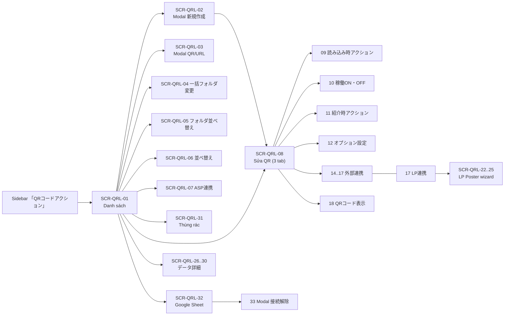
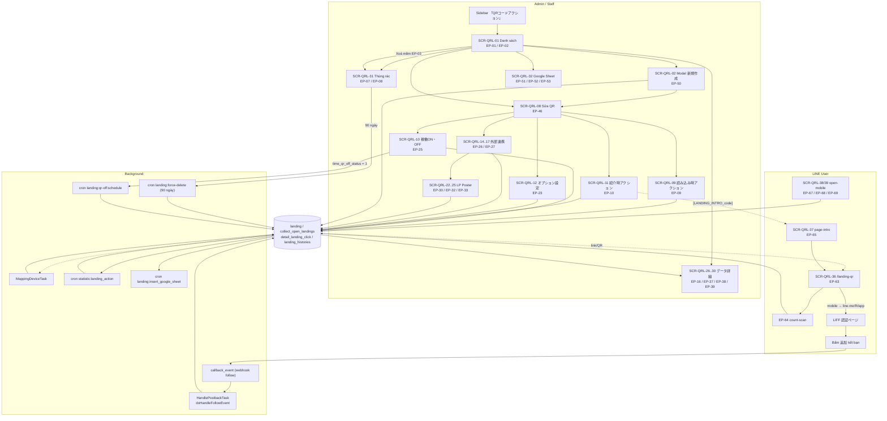

# FA-017 — QR Code Action 「QRコードアクション」 — UI Spec

> **Portal**: Admin (LINE OA) · **Thư mục**: `features/admin/qr-landing/`
> **Mã tính năng**: FA-017 · **Prefix màn hình**: `SCR-QRL-xx`
> **Nguồn tham chiếu**: `web/api-spec.md` (69 endpoints), `web/logic-spec.md`, `job/job-spec.md`

---

## ⚠ CẢNH BÁO VỀ NGUỒN DỮ LIỆU

**Spec này được dựng hoàn toàn từ source code (blade views + JavaScript + CSS) trong `src/web/sns-line/`, KHÔNG có screenshot hay accessibility snapshot đối chiếu** — session Playwright đã hết hạn tại thời điểm phân tích.

Hệ quả:

| Điều | Trạng thái |
|---|---|
| Nhãn tiếng Nhật, tên field `name=`/`v-model`, cấu trúc DOM | Đọc trực tiếp từ blade → **Mức độ tin cậy: Cao** |
| Bố cục thực tế (vị trí, kích thước, thứ tự hiển thị) | Suy từ class Tailwind / Bootstrap + CSS → **Trung bình** |
| Hành vi động (điều kiện `v-if`/`v-show` khi chạy thật, thông báo toast, thứ tự modal) | Suy từ JS mixin → **Trung bình** |
| Trạng thái hiển thị theo gói cước, theo quyền Staff | Chỉ suy từ `@if`/biến blade → **Trung bình / Thấp** |
| Screenshot | **KHÔNG có** — thư mục `ui/screenshots/` rỗng, không tạo nội dung giả |

Mọi mục trong tài liệu đều ghi rõ **Mức độ tin cậy** và **nguồn `file:line`**. Xem mục cuối 「Điểm chưa rõ / cần điều tra」 để biết những gì bắt buộc phải xác minh bằng màn hình thật.

Đường dẫn blade trong tài liệu được rút gọn từ gốc `src/web/sns-line/resources/views/`.

---

## 1. Tổng quan tính năng

「QRコードアクション（流入経路分析）」 — **Phân tích nguồn truy cập bằng QR Code / URL kết bạn riêng biệt**.

Mô tả chính thức trên UI (`basic/qr_code/v2/index.blade.php:37`):

> 「個別の友だち追加URLを発行し、流入経路の分析やそのURLから登録した友だちに対して個別のアクション稼働ができる機能です。」
> *(Phát hành URL kết bạn riêng cho từng nguồn, phân tích nguồn truy cập và chạy hành động riêng cho bạn bè đăng ký qua URL đó.)*

Admin tạo nhiều "QR Code Action" (bản ghi bảng `landing`). Mỗi QR có:

| Thành phần | Mục đích |
|---|---|
| Mã `code` 6 ký tự + ảnh QR PNG | Dán lên tờ rơi, website, quảng cáo — mỗi kênh 1 QR |
| Link `…/landing-qr/{liff_app_id}?uLand={code}` | Đích đến khi quét/click (BR-02) |
| Action gắn kèm (`action_id`) | Chạy tự động khi LINE User kết bạn/quét — gửi tin nhắn, gắn tag, đẩy vào step… (shared component **SC-004**) |
| Thống kê `collect_open_landings` / `detail_landing_click` | Đếm lượt đọc URL, lượt kết bạn, lượt chạy action, phân loại 4 nhóm bạn bè |
| 「紹介時アクション」 | Chương trình giới thiệu bạn bè (referral) — người giới thiệu nhận thưởng |
| 「LP連携」 (LP Poster) | 1 QR duy nhất phục vụ nhiều quảng cáo × nhiều landing page, phân biệt bằng `postcode` |
| 「外部連携」 | Chèn HTML tag đo lường, import tham số `cid1..cid5` vào friend info, export callback ra hệ thống ngoài |
| 「スプレッドシート連携」 | Đồng bộ dữ liệu kết bạn sang Google Spreadsheet |

Tính năng gồm **2 thế hệ giao diện** cùng tồn tại trong source:
- **v2** (`basic/qr_code/v2/*`) — giao diện đang chạy, Vue 2 + Tailwind (nạp runtime qua `/js/tailwindcss.js`) trên nền Bootstrap 3.
- **v1 legacy** (`basic/qr_code/create.blade.php`, `index.blade.php`, `show_friend_click.blade.php`) — **không còn entry point từ menu**, route vẫn sống (EP-55…EP-60). Không mô tả trong spec này ngoài phần ghi chú.

---

## 2. Actors

| Actor | Quyền truy cập | Ghi chú |
|---|---|---|
| **Admin (LINE OA)** | Toàn bộ màn hình `/basic/landing*` | Middleware `basic_access`, `is_expire`, `https_protocol`, `check_remember_token` (api-spec mục 3) |
| **Staff** | Chỉ khi route `landingIndex` nằm trong whitelist `bot_role_access` + `access_feature` | Sidebar: `<li class="… @if(in_array('landingIndex',$routeListAccess)) has_permission @else invalid_rule_child @endif">` — `layout/basic/sidebar.blade.php:408-411`. Tên quyền trong seeder: 「流入アクション」 (`database/seeds/AccessFeatureSeeder.php:15-46`). **Mức độ tin cậy: Cao** cho phần chặn giao diện.<br>⚠ Nhóm route POST `/basic/create-landing*`, `/basic/landing/edit/*`, `/basic/landing/delete` **thiếu middleware `basic_access`** ⇒ Staff bị chặn ở màn hình nhưng endpoint lưu vẫn nhận (api-spec R-06). |
| **LINE User** | 4 trang public: `/landing-qr/{liffId}`, `/landing/page-intro/{code}/{u_code}`, `/open-mobile/{type}/{id}`, `/open-external-browser/{type}/{id}` | Không đăng nhập hệ thống; định danh qua LIFF `userId` hoặc `u_code` |

### Phân quyền theo gói cước (plan gating) — ảnh hưởng trực tiếp tới UI

| Điều kiện | Ảnh hưởng UI | Nguồn |
|---|---|---|
| `bot.plan_type == 2` (free) | Tab 「オプション設定」 phủ overlay xám `bg-[#22222233]` + banner 「この機能のご利用は有料プランへの**アップグレード**が必要です。」, nút 保存 `disabled` | `components/setting_option.blade.php:32-36, 200-210`; `components/upgrade_plan.blade.php` |
| `bot.plan_type == 2` | Tab 「LP連携」 hiện banner nâng cấp, nút 新規登録 đổi sang trạng thái `cursor-not-allowed` | `components/external_link/lp_poster_tab.blade.php:3-12, 40-46, 65-72` |
| `plan_type == 2` | Truy cập thẳng `/basic/landing/v2/edit/{id}/poster` ⇒ 302 về `/basic/landing` (EP-47) | api-spec EP-47 |
| Gói free "mới" (`checkPlanFreeBotLimitFeature = 1`) | Tối đa **3 QR** — nút 新規作成 vẫn bấm được nhưng server trả lỗi 「現在のプランは利用できない機能です。アップグレードが必要になります。」 | logic-spec BR-04 |
| Gói dưới プロプラン | Modal 「ASP連携」 hiện dòng 「この設定のご利用には**プロプラン**以上のご契約が必要です。」, nút 保存 có class `disabled` khi `!isUseAsp()` | `v2/modal/link_asp.blade.php:7, 28` |

---

## 3. Sơ đồ điều hướng màn hình



---

# 4. Các màn hình Admin

## SCR-QRL-01 — Danh sách QR Code Action 「QRコードアクション（一覧）」

- **Nguồn**: `basic/qr_code/v2/index.blade.php:1-510` (title `:2` 「QRコードアクション（一覧）」); JS `public/js/qr_code/v2/index.js`
- **URL**: `GET /basic/landing` — **EP-01** (route name `landingIndex`)
- **Endpoint dữ liệu**: EP-02 (danh sách), EP-17 (thư mục), EP-62 (cookie thư mục)
- **Vue root**: `#item_vuelist_qr_v2`

### Layout (Mức độ tin cậy: Trung bình — suy từ class/CSS)

```
┌───────────────────────────────────────────────────────────────────────┐
│ HEADER: 「QRコードアクション（流入経路分析）」 + đoạn mô tả              │
├──────────────┬────────────────────────────────────────────────────────┤
│ SIDEBAR-LEFT │ TOOLBAR: [新規作成]  …  [全件表示 ▼] [🔍] [⋯]           │
│ (thư mục)    ├────────────────────────────────────────────────────────┤
│ [フォルダ追加]│ BẢNG DANH SÁCH QR (12 cột, cuộn ngang `wrap-scroll-table`)│
│ [並べ替え]    │                                                        │
│ 未分類 (n)    │                                                        │
│ フォルダ A(n) │                                                        │
├──────────────┴────────────────────────────────────────────────────────┤
│ FOOTER: [フォルダを非表示] [一括フォルダ変更][一括削除] 削除したQR… + phân trang│
└───────────────────────────────────────────────────────────────────────┘
```

- Chiều cao vùng chính cố định `calc(100vh - 225px)` (`:39`).
- Sidebar trái thu/mở bằng `show_menu_left` (0/1) — nút 「フォルダを非表示」 / mũi tên (`:410-448`).
- Thư mục đang mở được nhớ trong cookie `folder_landing` (BR-46), giá trị nạp từ `<input id="folder_cookie">` (`:470`).

### Action Buttons

| Label JP | Loại | Vị trí | Hành vi | Nguồn |
|---|---|---|---|---|
| 「並べ替え」 | Text + icon (menu ⋯) | Popup 「その他の操作」 | `openModalSortQr()` → SCR-QRL-06 | `:41-46` |
| 「スプレッドシート連携」 | Text + icon Google | Popup ⋯ | `linkGoogle()` → `window.location = /basic/landing-qr/link-google` (EP-51) | `:47-52`, `index.js:742` |
| 「ASP連携」 | Text + icon DB | Popup ⋯ | `showModalLinkASP()` → SCR-QRL-07 | `:53-59` |
| 「フォルダ追加」 | Button outline | Sidebar trái, trên cùng | `showModalCreateFolder()` → mở popup inline nhập tên | `:71-75` |
| 「並べ替え」 (thư mục) | Button outline | Sidebar trái, phải | `openModalSortFolder()` → SCR-QRL-05 | `:90-95` |
| 「名称変更」 | Dropdown item (⋮ trên thư mục) | Sidebar trái | `showModalEditFolder(id, name)` → popup inline (EP-18/EP-19) | `:120-125` |
| 「フォルダ削除」 | Dropdown item (⋮) | Sidebar trái | `deleteFolder(id, index)` → `confirm('削除しますが、宜しいですか？')` → EP-20 | `:126-131`, `index.js:252` |
| 「新規作成」 | Button primary | Toolbar trên bảng | `openModalCreateQr()` → SCR-QRL-02 | `:143-145` |
| 「全件表示」 ▼ | Dropdown lọc | Toolbar phải | Chọn `action_with_friend` = 0/2/1 → reload EP-02 | `:149-160` |
| 🔍 (検索) | Icon toggle + input | Toolbar phải | `is_show_search` bật input; Enter → `searchKeyword()` (EP-02 `keyword`) | `:161-187` |
| ⋯ (その他の操作) | Icon | Toolbar phải cùng | `showTooltip($event,'.gr-action')` → hiện cụm 3 nút trên | `:188-190` |
| Toggle ON/OFF | Switch trong hàng | Cột 「稼働状況」 | `changeStatus(item)` → **EP-06** `PUT /ajax/v2/landing/update-basic/{id}` body `{status}` | `:297-307`, `index.js:726` |
| 「アクション確認」 | Link underline | Cột 「設定済みアクション」 | `openModalFilter(item.action_id)` → modal shared `layout.modal_filter_v2` | `:328` |
| 「QRコードを表示」 | Button | Cột 「QRコード表示」 | `showModalUrlLanding(item)` → SCR-QRL-03 | `:350` |
| 「データ詳細」 | Button | Cột 「データ詳細」 | Điều hướng `/basic/landing/show/{id}` (EP-49) | `:358` |
| Icon Google Sheet | Icon (chỉ khi `item.google_sheet_id`) | Cột 「データ詳細」 | `redirectGoogleSheet(id)` → mở `https://docs.google.com/spreadsheets/d/{id}` tab mới | `:359-363`, `index.js:745` |
| Icon tải CSV | Icon | Cột 「データ詳細」 | `downloadCsv(item)` → EP-16 (`tab1`, `type=download-csv`, `type_count=2`), lưu file `detail_landing_click_{YYYYMMDDhhmmss}.csv` | `:364-369`, `index.js:748-787` |
| 「コピー」 | Dropdown item (⋯ trong hàng) | Cột 「データ詳細」 | `copyLanding(item)` → EP-50 `{id, mode:'copy'}` | `:374-379`, `index.js:788` |
| 「削除」 | Dropdown item (⋯) | Cột 「データ詳細」 | `deleteQrs([item.id])` → `confirm('削除しますが、宜しいですか？')` → EP-03 | `:380-386`, `index.js:354` |
| 「一括フォルダ変更」 | Button outline (disable khi `selected.length == 0`) | Footer phải | `showModalMoveTemplate()` → SCR-QRL-04 | `:442-445` |
| 「一括削除」 | Button outline (disable khi rỗng) | Footer phải | `deleteQrs(selected)` → EP-03 | `:446-449` |
| 「削除したQRコードアクション」 | Link | Footer phải | `/basic/landing-qr/removed` (EP-54) → SCR-QRL-31 | `:450` |
| Click vào hàng | — | Toàn hàng `<tr>` | `window.location = /basic/landing/v2/edit/{id}` (EP-46). Các phần tử con dùng `@click.stop` | `:288` |

### Form Fields

| Label JP | Field | Input type | Bắt buộc | Placeholder | Default | Validation |
|---|---|---|---|---|---|---|
| 「フォルダ名」 | `folder_name` (`#cat_txt`) | text, `maxlength="15"` | Có (thực tế) | — | rỗng | Bộ đếm `n/15`; server EP-18 không validate | `:78-81` |
| — (ô tìm kiếm) | `query.keyword` | text | Không | 「管理名を入力」 | rỗng | Enter để tìm; nút ✕ `clearSearch` | `:165-178` |
| Checkbox chọn hàng | `check_item[]` → `selected[]` | checkbox | — | — | — | `selectAll` ở header | `:186-188`, `:291-295` |

### Data Table — `#table_list_qrs` (12 cột)

| # | Tiêu đề JP | Kiểu dữ liệu | Sortable | Filterable | Nguồn field |
|---|---|---|---|---|---|
| 1 | (checkbox chọn tất cả) | boolean | ✕ | ✕ | — |
| 2 | 「稼働状況」 | Switch ON/OFF | ✔ `sort('status')` | ✕ | `item.status` (0/1) |
| 3 | 「管理名」 | Text (cắt sau 13 ký tự, tooltip full) | ✔ `sort('name')` | ✔ (keyword) | `item.name` |
| 4 | 「稼働対象」 | Badge 「全ての友だち」/「新規友だちのみ」 | ✔ `sort('action_with_friend')` | ✔ (dropdown) | `item.action_with_friend` (2/1) |
| 5 | 「設定済みアクション」 | Link 「アクション確認」 hoặc text xám 「アクション未設定」 | ✕ | ✕ | `isAction(item)` / `item.action_id` |
| 6 | 「URL読み込み人数」 | Số + 「人」 | ✕ | ✕ | `item.total_user_click` |
| 7 | 「友だち追加・ブロック解除人数」 | Số + 「人」 | ✕ | ✕ | `item.total_user_friend` |
| 8 | 「アクション稼働人数」 | Số + 「人」 | ✕ | ✕ | `item.count_action_web + item.count_action` |
| 9 | 「有効期間」 | `datetimeFormat(start)` – `datetimeFormat(end)` | ✕ | ✕ | `limit_start_time` / `limit_end_time` |
| 10 | 「作成日」 | `YYYY.MM.DD` | ✔ `sort('created_at')` | ✕ | `created_at` |
| 11 | 「最終編集日」 | `YYYY.MM.DD` | ✔ `sort('updated_at')` | ✕ | `updated_at` |
| 12 | 「QRコード表示」 | Button | ✕ | ✕ | — |
| 13 | 「データ詳細」 | Cụm nút | ✕ | ✕ | — |

> Bảng khai báo 13 `<th>` (bao gồm cột checkbox). Hàng có `status == 0` được gán class `disabled` (`:288`) — nhiều khả năng làm mờ, **cần screenshot xác nhận**.

### Trạng thái rỗng

「まだデータがありません」 + link 「新規作成」 + 「するとここにデータが表示されます」 (`:396-406`), ảnh `/images/group_4483.svg`.

### Tooltip / Ghi chú lơ lửng

| Nội dung JP | Kích hoạt | Nguồn |
|---|---|---|
| 「その他の操作」 | hover icon ⋯ toolbar | `:60` |
| 「検索」 | hover icon 🔍 | `:61` |
| 「表示変更」 | hover dropdown lọc | `:62` |
| 「コピー・削除」 | hover ⋯ trong hàng | `:63` |
| 「CSVダウンロード」 | hover icon CSV | `:64` |
| 「新規友だちの場合は / 友だち追加ページが / 表示された場合のみ / カウントされます」 | note cột 6 (`.note-total-click`) | `:196-201` |
| 「カウント対象は / 新規友だちのみ」 | note cột 7 (`.note-total-friend`) | `:202-205` |
| 「スプレッドシート表示」 | hover icon Google Sheet | `:361` |

### Observations

- Toàn bộ CRUD trên màn này là AJAX, không reload trang (trừ điều hướng edit/detail).
- Modal shared được include cuối trang: `layout.modal_setting.modal_select_action`, `layout.modal_filter_v2`, `basic.template_v2.common.modal.modal-preview-send-test` (`:465-467`) → **xác nhận dùng SC-004 và SC-003**.
- `<input type="text" value="preview_qr_code" id="type_action_qrcode" hidden>` (`:471`) — biến định danh ngữ cảnh cho modal action dùng chung.
- Nếu `$errors->any()` thì bắn `alert()` JS thô (`:497-499`) — không có UI thông báo lỗi chuẩn.

---

## SCR-QRL-02 — Modal 「QRコードアクション 新規作成」

- **Nguồn**: `basic/qr_code/v2/modal/create_qr.blade.php:1-93` (id `#modalCreateQrs`)
- **Trigger**: nút 「新規作成」 trên SCR-QRL-01 hoặc link trong trạng thái rỗng
- **Endpoint khi submit**: **EP-50** `POST /basic/create-landing-v2` (cần `X-CSRF-TOKEN`)
- **Kích thước**: `w-[700px] h-[500px]`

### Form Fields

| Label JP | Field (`v-model`) | Input type | Bắt buộc | Placeholder | Default | Validation |
|---|---|---|---|---|---|---|
| 「管理名」 | `newQrs.name` (`name="name_form"`) | text, `maxlength="50"` | **Có** | 「管理名」 | rỗng | Client (`index.js:421-429`): rỗng ⇒ 「管理名を入力してください」; > 50 ⇒ 「管理名は50文字以内で入力してください。」. Bộ đếm `n/50`. **Server không validate** |
| 「フォルダ」 | `newQrs.category_id` (`#category_select`) | select | Không | — | `0` = 「未分類」 | Danh sách từ EP-17 |
| 「稼働対象（作成後の変更はできません）」 | `newQrs.action_with_friend` | radio ×2 (`name="message-success"`) | Có | — | (giá trị khởi tạo trong `index.js`) | 1 = 「新規友だちのみ」, 2 = 「全ての友だち」 |

### Tooltip giải thích (hover 「説明をみる」)

| Radio | Nội dung tooltip |
|---|---|
| 「新規友だちのみ」 | 「友だちでないユーザーが初めて友だち追加する場合のみ 1度だけアクションが稼働します。」 (`:50-54`) |
| 「全ての友だち」 | 「新規・既存・ブロック解除・エルメ上の友だち、全てのユーザーを対象にアクションが稼働します。」 (`:70-74`) |

### Action Buttons

| Label JP | Hành vi |
|---|---|
| 「QRコードアクションの新規作成に進む」 | `addQr()` → EP-50 → redirect `/basic/landing/v2/edit/{id}` (`index.js:436-449`) |
| ✕ | `closeModalCreateQr()` |

### Observations

- 「稼働対象」 **không thể sửa sau khi tạo** — cảnh báo ghi ngay trên nhãn; màn edit chỉ hiển thị badge read-only (SCR-QRL-08).
- Vùng lỗi hiển thị tại `<span id="error_name">` (`:24`) — set bằng jQuery `.text()`, không dùng vee-validate.
- Client chỉ gửi `newQrs` (name / category_id / action_with_friend). ⚠ Server `array_merge` thẳng vào insert ⇒ mass assignment không giới hạn (api-spec R-01).

---

## SCR-QRL-03 — Modal 「アクションURL（QRコード）」 (xem QR & link)

- **Nguồn**: `basic/qr_code/v2/modal/url.blade.php:1-89` (id `#modal-url`), rộng `900px`, cao `97vh`
- **Trigger**: nút 「QRコードを表示」 trong bảng SCR-QRL-01
- **Endpoint**: không gọi API — dùng dữ liệu `itemSelected` đã có từ EP-02

### Nội dung

| Khối | Nội dung JP | Ghi chú |
|---|---|---|
| Tiêu đề | `@{{ itemSelected.name }}` | Tên QR |
| Section 1 | 「アクションURL（QRコード）」 + icon ⓘ | Tooltip: 「以下のURL（QRコード）をチラシやHPなどに設置することで 流入経路ごとのメッセージ・アクションを稼働させることができます。」 |
| Ô URL | `itemSelected.new_link_qr_code` (read-only, cắt ellipsis) | BR-02 |
| Nút copy | icon `fa-copy` → `copyText(...)` | |
| Ảnh QR | `itemSelected.path_landing` (nối `env('URL_SERVER_MEDIA')` nếu không phải URL tuyệt đối) | 80×80 |
| Nút tải ảnh | icon download → `downloadImage(path_landing)` | |
| Section 2 | 「認証ページの表示について（LIFF URLへのアクセス）」 | Giải thích trang xác thực LIFF |
| Text | 「認証ページは、LIFF(リフ) URLにアクセスした際に 友だち1人につき1度のみ表示されます。」 + dòng đỏ 「これはLINE公式アカウントの仕様で、非表示にすることはできません。」 | `:59-64` |
| Box xám | 「LIFF URLを利用している機能」: ・QRコードアクション ・フォーム作成 ・サロン面談/レッスン/イベント 予約 ・商品販売 ・ASPリンク（プロプラン限定） | `:67-76` |
| Link ngoài | 「LIFF(リフ)」 → developers.line.biz; 「こちら」 → YouTube hướng dẫn | `:60`, `:79` |
| Đóng | 「閉じる」 (text underline) | `:85` |

---

## SCR-QRL-04 — Modal 「一括フォルダ変更」

- **Nguồn**: `basic/qr_code/v2/modal/move_folder.blade.php:1-33` (id `#modalMoveFolder`, rộng 600px)
- **Trigger**: nút 「一括フォルダ変更」 (chỉ bật khi có QR được tick)
- **Endpoint**: **EP-04** `POST /ajax/v2/landing/move-category`

| Label JP | Field | Input | Default | Ghi chú |
|---|---|---|---|---|
| 「移行先選択」 | `folder_move_id` | select | `0` = 「未分類」 | Options từ `categories` |

| Button | Hành vi |
|---|---|
| 「登録」 | `moveItems()` → EP-04 `{ids: selected, folder_move_id}`; luôn ẩn modal ở `always()` (`index.js:398-414`) |
| ✕ | `data-dismiss="modal"` |

> ⚠ Server EP-04 **không lọc `bot_id`** (api-spec R-02).

---

## SCR-QRL-05 — Modal 「フォルダ並べ替え」

- **Nguồn**: `basic/qr_code/v2/modal/sort_folder.blade.php:1-53` (id `#modalSortFolder`, `data-backdrop="static"`)
- **Endpoint**: **EP-21** `POST /ajax/v2/landing/category/sort-category`

| Thành phần | Mô tả |
|---|---|
| Tiêu đề | 「【  フォルダ並べ替え  】」 |
| Danh sách | `v-for` trên `arrGroupSort` — mỗi dòng icon `fa-bars` (kéo thả) + tên thư mục |
| Dropdown ⋯ mỗi dòng | 「一番上に移動」 (disable khi `index == 0`), 「一番下に移動」 (disable khi cuối) |
| Nút | 「変更を保存」 → `sortedFolder` (client **đảo ngược** mảng trước khi gửi — BR-42) |
| Hidden inputs | `#array_sort_fol`, `#current_position_fol` |

---

## SCR-QRL-06 — Modal 「並べ替え」 (QR trong thư mục)

- **Nguồn**: `basic/qr_code/v2/modal/sort_qr.blade.php:1-54` (id `#modalSortQrs`)
- **Endpoint**: **EP-42** `POST /ajax/get-sort-landing` (`sortedQrs`, `index.js:822`)
- Cấu trúc giống SCR-QRL-05, lặp trên `arrItemsSort`, hidden `#array_sort_qr`, `#current_position_qr`, hàm `onUpdateDefaultQr(undefined, index, 'top'|'bottom')`.
- ⚠ Có route riêng EP-05 `POST /ajax/v2/landing/sort-qrs` nhưng method controller rỗng — **không được UI dùng**.

---

## SCR-QRL-07 — Modal 「ASP連携」

- **Nguồn**: `basic/qr_code/v2/modal/link_asp.blade.php:1-32` (id `#modal-link-asp`)
- **Endpoint**: **EP-12** `POST /ajax/v2/landing/update-connect-asp/{qr}` (`index.js:711-725`)

| Thành phần | Nội dung JP | Ghi chú |
|---|---|---|
| Tiêu đề | 「ASP連携」 | |
| Dòng phụ | 「この設定のご利用には**プロプラン**以上のご契約が必要です。」 | Link `/admin/bot-add?bot_id={id}&type_upgrade=month` |
| Nhãn | 「連携するQRコードアクション」 | |
| Dropdown | `asp.name`, options = `arrItemsSort` (toàn bộ QR của bot, nạp qua EP-02 `unlimit`) | `selectedASP(item)` |
| Nút | 「閉じる」 / 「保存」 (class `disabled` khi `!isUseAsp() || asp.id == 0`) | `saveQrASP()` |

> BR-06: chỉ **một** QR trong bot được `connect_aff = 1`; lưu QR mới sẽ reset tất cả về 0.

---

## SCR-QRL-08 — Màn chỉnh sửa QR — khung 3 tab

- **Nguồn**: `basic/qr_code/v2/edit.blade.php:1-257` (title `:2` 「QRコードアクション（編集）」), Vue root `#edit_landing_v2`
- **URL**: `GET /basic/landing/v2/edit/{id}` — **EP-46**
- **Header**: `components/header_landing.blade.php:1-40`

### Header (breadcrumb + 2 field lưu tức thì)

| Thành phần | Nội dung / Field | Endpoint |
|---|---|---|
| Breadcrumb | 「TOP > QRコードアクション 編集」 (TOP → `landingIndex`) | — |
| Badge 「稼働対象」 | `action_with_friend == 2` ⇒ 「全ての友だち」 (cam `#FEA600`); `== 1` ⇒ 「新規友だち追加時のみ」 (xanh `#08BF5A`) — **read-only** | — |
| 「管理名」 | `landing.name`, text `maxlength="50"`, bộ đếm `n/ 50`, `v-on:blur="saveBasic()"` | **EP-06** |
| 「フォルダ」 | `landing.category_id`, select (`0` = 「未分類」 + `list_folder`), `v-on:change="saveBasic()"` | **EP-06** |

### Tabs cấp 1

| Tab | Label JP | `tab` | Component |
|---|---|---|---|
| 1 | 「基本設定」 | 1 | `components/setting_basic` |
| 2 | 「外部連携」 | 2 | `components/setting_external_link` |
| 3 | 「QRコード表示」 | 3 | `components/qr_display_tab` |

### Sub-navigation trong tab 「基本設定」 (`components/setting_basic.blade.php:1-68`)

Panel trái 「設定項目」 (360×400) — 4 mục (mục thứ 5 đã bị comment):

| `basicSetting.rightTab` | Label JP | Component | Màn hình |
|---|---|---|---|
| 1 | 「読み込み時アクション」 | `setting_detail` | SCR-QRL-09 |
| 2 | 「稼働ON・OFFの設定」 | `setting_qr_off` | SCR-QRL-10 |
| 3 | 「紹介時アクション」 | `setting_introduce` | SCR-QRL-11 |
| 4 | 「オプション設定」 | `setting_option` | SCR-QRL-12 |
| 5 | ~~「有効期間の設定」~~ | `setting_limit` | SCR-QRL-13 — **mục menu bị comment `{{-- --}}` tại `:23-30`**, panel vẫn render nếu `rightTab == 5` |

### Thư viện JS nạp (`edit.blade.php:231-256`)

CodeMirror 5.65.14 (soạn HTML), vee-validate + `vee-validate_ja`, Vue 2, **TinyMCE + ngôn ngữ ja**, jQuery UI datepicker ja, daterangepicker, moment, Toastify, 8 file mixin `qr_code/v2/mixins/*` + `edit.js`, `modal_filter_v2.js`, `setting_intro_steps.js`.

### Observations

- Toàn bộ dữ liệu ban đầu nhúng vào biến JS `var landing = {…}` (`:226`) — không cần gọi API khi load tab 1.
- `var hideActionIntroModal` (`:229`) quyết định có tự mở SCR-QRL-20 hay không.
- Modal shared include: `layout.modal_setting.modal_select_action` + `layout.modal_filter_v2` (`:219-220`) → **SC-004 + SC-003**.

---

## SCR-QRL-09 — Tab 基本設定 › 「読み込み時アクション」

- **Nguồn**: `basic/qr_code/v2/components/setting_detail.blade.php:1-296`
- **Endpoint lưu**: **EP-09** `POST /ajax/v2/landing/{qr}/setting-detail` (`mixins/setting_detail.js:60`)
- **Endpoint preview**: **EP-13** (`get-preview-action`), **EP-22** (`getSettingAction`), **EP-44** (`init-data-action`)

### Cấu trúc theo `action_with_friend`

| Điều kiện | Nội dung hiển thị |
|---|---|
| `== 1` (chỉ bạn mới) | Dòng đỏ 「新規友だちに対するアクションは初めての友だち追加時のみ、1度だけ稼働します。」 + link video 「こちら」 (`https://youtu.be/gHh6nULNByw`). **Ẩn** khối 「アクションの稼働回数」 và 「連続アクション制限」 |
| `== 2` (tất cả bạn bè) | Dòng mô tả 「アクションQRコード（URL）を読み込んだ時に稼働させるアクションを設定します。」 + đầy đủ các khối |

### Form Fields

| Label JP | Field (`v-model`) | Input | Bắt buộc | Default | Validation |
|---|---|---|---|---|---|
| 「アクションの稼働回数」 | `landing.action_type` | radio ×2 (`name="action-type"`) | — | — | 2 = 「何度でもアクション稼働」, 1 = 「1度のみアクション稼働」. Chuyển 2→1 ⇒ hiện confirm (`setting_detail.js:45`). Chỉ hiện khi `action_with_friend == 2` |
| 「送信するメッセージを登録」 (textarea) | `landing.general_message` | textarea `h-[400px]` | Không | rỗng | Bộ đếm `n/5,000` (client hiển thị; **server không cắt**). Rỗng ⇒ xoá bản ghi `template` (BR-15) |
| 「新規友だち用あいさつメッセージを併用」 | `landing.use_msg_new_friend` | checkbox `true-value="1" false-value="0"` | — | — | Chỉ hiện khi `action_with_friend == 2` |
| 「既存友だち用あいさつメッセージを併用」 | `landing.use_msg_old_friend` | checkbox 1/0 | — | — | idem |
| 「ブロックを解除した友だち用あいさつメッセージを併用」 | `landing.use_msg_unblock` | checkbox 1/0 | — | — | idem |
| 「併用する」/「併用しない」 | `landing.use_msg_new_friend` | radio ×2 (`name="use-setting-action"`, value 1/0) | — | — | **Chỉ khi `action_with_friend == 1`** — thay thế 3 checkbox trên |
| 「設定しない」 | `landing.interval_action` | radio value `0` | — | — | Khối 「連続アクション制限」, ẩn khi `action_with_friend == 1` |
| 「アクション稼働当日中は稼働しない（翌0:00にリセット）」 | `landing.interval_action` | radio value `1` | — | — | |
| 「アクション稼働後 ___ 時間経過で再度稼働可能」 | `landing.interval_action` = `2` + `landing.time_interval_action` | radio + number | — | — | Ô số chỉ enable khi `interval_action == 2`; `@change` lọc ký tự qua `replaceNumberInput` (BR-45) |

### Nút chèn biến vào nội dung

| Label JP | Hành vi | Nguồn |
|---|---|---|
| 「＋ LINE名」 | `appendTextInformation('{name}')` chèn tại vị trí con trỏ đã lưu (`saveCursorPosition`) | `:40-45` |
| 「友だち情報」 | `showFriendInformation` → SCR-QRL-19 | `:46-51` |

### Khối 「上記メッセージ送信以外のアクション登録」 (SC-004)

「よく使われる項目」 — lưới 5 ô 95×95:

| Ô | Label JP | `quicklyAddItem(type, label, actionId)` |
|---|---|---|
| 1 | 「テンプレート」 | `'template'` |
| 2 | 「タグ」 | `'tag'` |
| 3 | 「友だち情報」 | `'friend_info'` |
| 4 | 「ステップ配信」 | `'scenario'` |
| 5 | 「その他」 | `openModalSettingAction(landing.action_id)` |

+ nút 「アクション追加・編集」 (`openModalSettingAction`), khu preview `@include('…preview-action-herme')`, và text rỗng 「エルメアクションは登録されていません」 khi `!landing.action_id`.

### Ghi chú tĩnh

- 「あいさつメッセージの併用」: 「QRコードを読み込んでエルメ上に友だちが反映された時に 上記で設定したメッセージ・アクションとあいさつメッセージを併用する場合の設定です。」
- 「※QRコードアクションでステップ配信を設定している場合 あいさつメッセージで設定しているステップ配信は実行されません。」

### Action Buttons (footer)

| Label JP | Hành vi |
|---|---|
| 「保存」 | `saveSettingDetail()` → EP-09 |
| 「稼働プレビュー」 | `preview()` → mở panel SCR-QRL-21 |
| 「一覧に戻る」 | `redirectPageIndex()` |

---

## SCR-QRL-10 — Tab 基本設定 › 「稼働ON・OFFの設定」

- **Nguồn**: `basic/qr_code/v2/components/setting_qr_off.blade.php:1-219` (`#qr-off-tab`), JS `mixins/setting_qr_off.js`
- **Endpoint lưu**: **EP-25** `POST /ajax/v2/landing/edit/{id}/qr-off`; nạp dữ liệu qua **EP-24** (`setting_qr_off.js:53`)

### Các section

| Section (nền xám `--gray3`) | Nội dung |
|---|---|
| 「稼働ON・OFFの設定」 | Text 「一時的にQRコードアクションの利用を停止する場合、一覧ページから稼働の設定ができます。」 (bật/tắt thủ công nằm ở SCR-QRL-01) |
| 「稼働OFF時にQRコードが読み込まれた場合の設定」 | 3 radio `type_display_off` |
| 「スケジュール設定」 | Bật/tắt lịch tự động |

### Form Fields

| Label JP | Field | Input | Giá trị | Validation | Nguồn |
|---|---|---|---|---|---|
| 「友だち追加ページを表示」 | `QrOff.type_display_off` | radio | `0` | — | `:47` |
| 「テキストを表示」 | `QrOff.type_display_off` | radio | `1` | — | `:51` |
| 「指定ページに遷移」 | `QrOff.type_display_off` | radio | `2` | — | `:55` |
| (nội dung text OFF) | `QrOff.text_display_off` (`#textarea_data_display_qr_off`) | **TinyMCE** textarea | — | Rỗng ⇒ 「指定ページを入力してください。」 (`setting_qr_off.js:171`) | `:62-65` |
| 「指定ページURLの入力」 | `QrOff.url_display_off` | text | — | `validateUrlQrOff` khi `@input`; rỗng/sai ⇒ 「指定ページを入力してください。」 · viền đỏ `#f44336` | `:69-77` |
| 「あいさつメッセージを稼働させる」 | `QrOff.use_action_limit` | radio `name="use_action_limit"` | `0` | Chỉ hiện khi `type_display_off == 0` | `:85` |
| 「個別にアクションを設定する」 | `QrOff.use_action_limit` | radio | `1` | idem | `:90` |
| 「利用しない」/「利用する」 (スケジュール) | `QrOff.use_limit_time` | 2 nút segmented | `0` / `1` | — | `:145-150` |
| 「開始日時」 (ngày) | `QrOff.start_date` (`#start_date`) | text + datepicker, `maxlength="10"` | — | Lỗi hiện tại `QrOff.start_date_error` | `:157` |
| 「開始日時」 (giờ) | `QrOff.start_time` (`#start_time`) | text + timepicker, `maxlength="5"`, placeholder 「時間を選択」 | — | — | `:163` |
| 「終了日時を設定しない(ONの状態を継続する)」 | `QrOff.use_limit_end_time` | radio `0` (`#disable_end_data`) | — | — | `:174` |
| 「終了日時を設定する」 | `QrOff.use_limit_end_time` | radio `1` (`#enable_end_data`) | — | — | `:183` |
| 「終了日時」 (ngày/giờ) | `QrOff.end_date` / `QrOff.end_time` | text + picker | — | `QrOff.end_date_error` | `:193`, `:200` |

- Placeholder ngày: 「日付を選択」; giờ: 「時間を選択」.
- Mô tả lịch: 「開始・終了日時が到来すると、稼働状況が自動でON・OFFされます。」

### Ánh xạ field UI → payload (Mức độ tin cậy: Cao — `setting_qr_off.js:115-165`)

| Field UI | Payload gửi |
|---|---|
| `text_display_off` (khi `type_display_off == 1`) | `data_display_off` |
| `url_display_off` (khi `type_display_off == 2`) | `data_display_off` |
| `start_date` + `start_time` | `limit_start_time` (`YYYY-MM-DD HH:mm:ss`) |
| `end_date` + `end_time` | `limit_end_time` |

### Khối action khi OFF

Hiện khi `use_action_limit == 1 && type_display_off == 0` — lưới 5 ô giống SCR-QRL-09 nhưng thao tác trên **`landing.action_limit_id`**, kèm nút 「アクション追加・編集」 và preview.

### Action Buttons

| Label JP | Hành vi |
|---|---|
| 「保存」 | `submitQrOffForm()` → EP-25 (đặt `time_qr_off_status = 1` khi lịch thay đổi → cron A-3) |
| 「一覧に戻る」 | `redirectPageIndex()` |

---

## SCR-QRL-11 — Tab 基本設定 › 「紹介時アクション」 (referral)

- **Nguồn**: `basic/qr_code/v2/components/setting_introduce.blade.php:1-436`
- **Endpoint lưu**: **EP-10** `POST /ajax/v2/landing/{qr}/setting-introduce` (`mixins/setting_introduce.js:85`); lưu nhanh từ preview: **EP-45**; preview action: **EP-14**

### Khối 1 — mã nhúng

| Nội dung JP | Ghi chú |
|---|---|
| Header 「紹介時アクション」 + link 「紹介時アクションとは？」 | Mở SCR-QRL-20 |
| 「※以下のコードを紹介元の友だちに送信してください」 | |
| Mã: `[LANDING_INTRO_@{{ landing.code }}]` + icon copy (`copyParam`) | `:43-44` |

### Khối 2 — 「案内ページの設定」 (badge **STEP 1**)

Sub-tab `introduce.intro_user`:

| Giá trị | Label JP | Ý nghĩa |
|---|---|---|
| 1 | 「紹介元」 | Người giới thiệu |
| 2 | 「紹介先」 | Người được giới thiệu |

| Label JP | Field | Input | Bắt buộc | Placeholder | Validation |
|---|---|---|---|---|---|
| 「ページタイトル」 | `landing.intro_page_title` (`name="title-page"`) | text `maxlength="30"` | Không | 「友だち紹介キャンペーン」 | vee-validate `max:30`, `data-vv-as="ページタイトル"`, bộ đếm `n/30` |
| 「案内文」 | `landing.intro_page_content` (`#content_user_A`) | **TinyMCE** | Không | 「このLINE公式アカウントを友だちに紹介して、登録されたら〇〇をプレゼント！」 | — |
| 「紹介先の友だちへ送信するメッセージ」 | `landing.intro_message` (`name="intro-message"`) | textarea | Không | 「株式会社ミショナが運営するL Messageの公式LINE公式アカウントです！」 | vee-validate `max:200`, bộ đếm `n/200`. ⚠ Cột DB `varchar(500)`, api-spec ghi giới hạn 500 — **client giới hạn 200** |

Khối preview ảnh (`intro-male.png` / `intro-female.png`) — click gọi `previewPageIntro()` (type `page`) hoặc `previewMessageIntro()` (type `message`) → SCR-QRL-35.

### Khối 3 — 「紹介時アクション設定」 (badge **STEP 3**)

> ⚠ **Không tồn tại STEP 2 trong markup** — chỉ có badge STEP 1 (`:54`) và STEP 3 (`:128`). Khối STEP 3 dành cho 「紹介先」 đã bị comment toàn bộ (`:227-320`). **Mức độ tin cậy: Cao** (đọc trực tiếp), nhưng lý do thì chưa rõ.

> ✅ **Xác nhận việc tắt là CÓ CHỦ ĐÍCH, đồng bộ cả 3 tầng** *(validation-report mục 6.J-2, ngày 2026-08-24)*
>
> Khối bị comment tại `setting_introduce.blade.php:227-320` (đúng 94 dòng, mở tại `:227` với `v-if="introduce.intro_user == 2"`, đóng tại `:320`) — **và comment lan sang cả JS lẫn controller**:
>
> | Tầng | `file:line` |
> |---|---|
> | View | `resources/views/basic/qr_code/v2/components/setting_introduce.blade.php:227-320` |
> | JS | `public/js/qr_code/v2/mixins/setting_basic.js:201, 245` · `public/js/qr_code/v2/mixins/setting_introduce.js:73, 140` · `public/js/select_action.js:1517` |
> | Controller | `app/Http/Controllers/Basic/QRCodeController.php:1016, 1451, 1482, 3471` (whitelist + xử lý template) |
>
> ⇒ Đây là việc tắt **có chủ đích**, không phải sót. Tương tự, việc ẩn menu `SCR-QRL-13` tại `setting_basic.blade.php:23-30` cũng được xác nhận nguyên văn.
>
> **⚠ ĐÍNH CHÍNH — chỉ 1/3 cột DB của khối này thực sự có dữ liệu người dùng** (đếm lại `db/data/landing.sql`, 566 dòng, bằng parser INSERT):
>
> | Cột | Dữ liệu thật | Kết luận |
> |---|---|---|
> | `landing.template_recipient_intro_id` | **329/566 có giá trị** (237 NULL) | ⚠ Có dữ liệu, **nhưng do hệ thống sinh** — `saveLandingV2` (`QRCodeController.php:278-282`) tự tạo template mặc định 「友だちご紹介ありがとうございます✨…」 rồi gán FK. **Không phải người dùng nhập** |
> | `landing.user_recipient_intro_action_id` | **566/566 = NULL** | ❌ Hoàn toàn rỗng |
> | `landing.use_user_recipient_intro_message` | **566/566 = `1`** | ❌ Chỉ là giá trị DEFAULT của schema |
>
> ⇒ **Tính năng 「紹介先アクション」 chưa từng hoạt động.** Mức độ nghiêm trọng của phát hiện này **THẤP** (không mất dữ liệu người dùng nào); hệ quả duy nhất là 329 bản ghi `template` ẩn tương ứng trở thành **dữ liệu rác cố định** — không ai đọc, thuộc nhóm mồ côi mà `db/db-mapping.md` mục 9.2 đã nêu.
>
> Việc còn lại: **M-03** — chụp màn 紹介時アクション thật để xác nhận badge nhảy STEP 1 → STEP 3 và khối 「紹介先」 thực sự không hiển thị.

Mô tả: 「紹介先が友だち追加した時に、紹介元が受け取るメッセージ・アクションを設定しましょう。」

| Label JP | Field | Input | Validation |
|---|---|---|---|
| 「送信するメッセージを登録」 | `landing.user_intro_action_message` | textarea `h-[400px]` | Bộ đếm `n/5,000`; disable khi 「利用しない」 |
| 「利用しない」 | `landing.use_user_intro_action_message` | checkbox `true-value="0" false-value="1"` (**đảo**) | Tick ⇒ giá trị `0` ⇒ khoá textarea + 2 nút chèn |
| 「＋ LINE名」 | — | button | `appendTextInformation('{name}')` |
| 「友だち情報」 | — | button | `showFriendInformation` → SCR-QRL-19 |
| 「例文を挿入する」 | — | link | `setDefaultMessage()` |

Lưới 5 ô action (SC-004) thao tác trên **`landing.user_introduction_action_id`**.

Khối preview 「紹介先が友だち追加した時に 紹介元が受け取るメッセージ」 → `previewIntroAction()` mở panel phải (`:390-436`) render danh sách `messages` trên ảnh `phone-preview-intro-action.png`.

---

## SCR-QRL-12 — Tab 基本設定 › 「オプション設定」 (thiết kế QR / trang browser)

- **Nguồn**: `basic/qr_code/v2/components/setting_option.blade.php:1-212` (`#lp_setting_option`), JS `mixins/setting_option.js`
- **Endpoint**: **EP-23** `POST /ajax/v2/landing/edit/{id}/setting-option` (multipart); nạp qua **EP-24**
- **Gói cước**: `bot.plan_type == 2` ⇒ include `upgrade_plan` + overlay chặn + nút 保存 `disabled`

### Section 「ブラウザページ設定」

Mô tả: 「QRコードアクションブラウザで読み込んだときに表示されるページの設定をします。」

#### 「ロゴ画像」

| Label JP | Field | Input | Giá trị |
|---|---|---|---|
| (ảnh logo LINE) | `option.setting_logo` | radio `#setting_logo_1` | `1` |
| 「表示しない」 | `option.setting_logo` | radio `#setting_logo_2` | `2` |
| 「独自ロゴを利用」 | `option.setting_logo` | radio `#setting_logo_3` | `3` |
| 「アップロード」/「変更」 | `path_logo` (`<input type="file" name="logo">`, `accept="image/*"`) | file (ẩn, kích bằng nút) | Chỉ hiện khi `setting_logo == 3` |
| 「削除」 | — | button đỏ | `removeImage` |

Validation client (`setting_option.js:100-128`): chỉ `.png/.jpg/.jpeg`, ≤ 10 MB — 「10MB以下のイベントバナーをアップしてください。」, kiểm kích thước qua `validateImageDimensions`.
Server (EP-23): `image|mimes:jpeg,png,jpg,gif,svg|max:10240`.

#### 「QRコードカラー」

| Label JP | Field | Input | Validation |
|---|---|---|---|
| — | `option.color_qr` (`#color_qr` + ô text `name="color_qr"`) | `<input type="color">` ẩn + ô text hex | vee-validate `required|format_color`, `data-vv-as="カラー"`; client regex `/^#[0-9A-Fa-f]{6}$/i` (`setting_option.js:187-190`); server regex `^#(?:[0-9a-fA-F]{3}){1,2}$` |

Preview QR live render vào `<div id="qr-land">` bằng thư viện `js/qr_code/qrcode.min.js`.

### Section 「ブラウザページデザイン」 — 4 thẻ chọn 1

| `option.type_design_qr` | Label JP | Ảnh mẫu |
|---|---|---|
| 1 | 「ベーシック（テキストなし）」 | `/images/setting_option_pc.svg` |
| 2 | 「スマホ（テキストなし）」 | `/images/setting_option_2.svg` |
| 3 | 「ベーシック（テキストあり）」 | `/images/setting_option_3.svg` |
| 4 | 「スマホ（テキストあり）」 | `/images/setting_option_4.svg` |

Thẻ đang chọn: viền xanh `#5799DB` 2px + icon ✔ tròn góc trên phải.
Hidden input `name="type_design_qr"` (`:116`).

### Section 「テキスト入力欄」

- Chỉ hiện khi `bot.plan_type == 1` **và** `type_design_qr ∈ {3, 4}` (`:187`).
- `textarea#text_design_qr` `name="text_design_qr"` — **TinyMCE**, `v-model="option.text_design_qr"`.

### Action Buttons

「保存」 → `submitSettingOption()` (EP-23, multipart); 「一覧に戻る」 → `redirectPageIndex()`.

---

## SCR-QRL-13 — Tab 基本設定 › 「有効期間の設定」 ⚠ MỤC MENU BỊ ẨN

- **Nguồn**: `basic/qr_code/v2/components/setting_limit.blade.php:1-159`
- **Endpoint**: **EP-11** `POST /ajax/v2/landing/{qr}/setting-limit` (`mixins/setting_limit.js:67`)
- **Trạng thái**: mục menu trái tương ứng (`rightTab == 5`) **đã bị comment** trong `setting_basic.blade.php:23-30` ⇒ **người dùng không có cách bấm vào**. Panel vẫn tồn tại và render nếu `basicSetting.rightTab` bị set = 5 bằng cách khác. **Mức độ tin cậy: Cao** (đọc trực tiếp markup); vì sao ẩn thì chưa rõ — nhiều khả năng đã được gộp vào SCR-QRL-10 「スケジュール設定」.

### Form Fields

| Label JP | Field | Input | Validation |
|---|---|---|---|
| 「利用しない」/「利用する」 | `landing.use_limit_time` | 2 nút segmented (0/1) | — |
| 「開始日時」 | `#limit_start_date` + `#limit_start_time` | text + picker | Lỗi: 「開始日時を入力してください。」 (`limit.error_time_start`) |
| 「終了日時を設定しない(有効状態を継続する)」 | `landing.use_limit_end_time` | radio `0` | — |
| 「終了日時を設定する」 | `landing.use_limit_end_time` | radio `1` | — |
| 「終了日時」 | `#limit_end_date` + `#limit_end_time` (disable khi chưa có `limit_end_time`) | text + picker | Lỗi: 「終了日時を入力してください。」 hoặc 「開始日時が終了日時より短い」 (`setting_limit.js:83-91`) |
| 「利用する」/「利用しない」 (trang ngoài hạn) | `landing.use_qr_page_over_time` | 2 nút segmented (1/0) | Section 「有効期間外に読み込んだ場合の友だち追加ページ」 |
| 「アクションは何も稼働させない」 | `landing.use_action_limit` | radio `0` | Section 「有効期間外に友だち追加した場合のアクション」 |
| 「個別にアクションを設定する」 | `landing.use_action_limit` | radio `1` | Mở lưới 5 ô SC-004 trên `landing.action_limit_id` |

### Ghi chú tĩnh

- 「有効期間外に友だち追加された場合、流入経路は「通常友だち追加」として記録されます。」
- 「「表示しない」を選択した場合、稼働OFF時の表示設定が適用されます。」

> ⚠ **BR-10 / R-14**: EP-11 **không** đặt `time_qr_off_status = 1` ⇒ cron `landing:qr-off:schedule` sẽ không nhặt lịch lưu từ màn này. Đây có thể chính là lý do mục menu bị ẩn — **cần xác nhận**.

> ✅ **Xác nhận + đánh giá tác động của việc ẩn menu** *(validation-report mục 6.J-1, ngày 2026-08-24)*
>
> Việc mục menu bị comment tại `setting_basic.blade.php:23-30` **đã được kiểm chứng nguyên văn 8 dòng** — mô tả ở trên là chính xác. Bổ sung 2 hệ quả:
>
> **1. Ẩn màn này VÔ HIỆU HOÁ R-14 trên UI v2 hiện tại.** Người dùng **không còn đường đi tới bug lịch**: chỉ EP-25 (`SCR-QRL-10` 「稼働ON・OFFの設定」) và EP-06 mới đặt được `time_qr_off_status = 1`, và cả hai đều đặt đúng. Rất có khả năng menu bị ẩn **chính vì** R-14. Lưu ý: EP-11 **vẫn sống**, không có middleware bổ sung và **không kiểm `bot_id`** (`web/logic-spec.md` mục 7.2) ⇒ gọi trực tiếp vẫn ghi được `use_limit_time`, `limit_*`, `use_qr_page_over_time`, `use_action_limit`, `action_limit_id` và vẫn tái tạo được bug.
>
> **2. Nhưng việc ẩn LÀM MẤT 2 field khỏi giao diện** — cả hai **không có** ở màn thay thế `SCR-QRL-10`:
>
> | Field bị mất | Nhãn JP | Hệ quả |
> |---|---|---|
> | `landing.use_qr_page_over_time` | 「有効期間外に読み込んだ場合の友だち追加ページ」 | Không còn màn nào chỉnh được. Dữ liệu thật: `= 1` ở **566/566** dòng (mặc định, chưa ai từng đổi) |
> | `landing.action_limit_id` | 「個別にアクションを設定する」 (有効期間外に友だち追加した場合のアクション) | `SCR-QRL-10` **có gửi** field này lên EP-25 nhưng **server không lưu** ⇒ **hiện KHÔNG có màn hình nào lưu được `action_limit_id`**, ngoài EP-06 |
>
> ⇒ Giả thuyết 「đã gộp vào `SCR-QRL-10`」 ở trên **đúng một phần**: 「スケジュール設定」 đã chuyển sang `SCR-QRL-10` (và EP-25 mới là nơi đặt `time_qr_off_status = 1`, khắc phục R-14), nhưng 2 field trên bị rơi lại. Mức độ tin cậy: **Cao** (đọc trực tiếp markup + dữ liệu thật); còn lại **M-02** — chụp panel trái màn edit thật để xác nhận chỉ còn 4 mục.

---

## SCR-QRL-14 — Tab 外部連携 › 「HTMLタグ挿入」

- **Nguồn**: `components/setting_external_link.blade.php:1-48` (khung 4 mục) + `components/external_link/insert_html.blade.php:1-55`
- **Endpoint**: **EP-26** `POST /ajax/v2/landing/edit/{id}/external-setting` (`mixins/setting_external_link.js:120`)

### Sub-navigation tab 「外部連携」 (`externalLink.tab`)

| Giá trị | Label JP | Màn |
|---|---|---|
| 1 | 「HTMLタグ挿入」 | SCR-QRL-14 |
| 2 | 「パラメーターインポート」 | SCR-QRL-15 |
| 3 | 「パラメーターエクスポート」 | SCR-QRL-16 |
| 4 | 「LP連携」 | SCR-QRL-17 |

### Nội dung

| Thành phần | Chi tiết |
|---|---|
| Mô tả | 「友だち追加後のLINE画面上にHTMLタグを挿入することで（目視では確認できません。） 外部サービスの計測タグを発火させることができます。」 |
| Segmented | 「利用しない」 (`setIsOnHtml(0)`) / 「利用する」 (`setIsOnHtml(1)`) → `externalLink.is_on_html` |
| Tab con | 「&lt;head&gt; タグ」 (`insert_html_tab = 1`) / 「&lt;body&gt; タグ」 (`= 2`) |
| Editor | `<textarea id="external-editor">` — **CodeMirror** (theme monokai), map vào `head_content` / `body_content` |
| Nút | 「保存」 → `submitExternalSettingForm()`; 「一覧に戻る」 |

> ⚠ **BR-37**: EP-26 reset `head_content`, `body_content`, `url_connect_qrcode_outside` về `null` rồi mới gán lại ⇒ lưu từ tab này có thể **xoá URL callback** đã cấu hình ở SCR-QRL-16 nếu payload không kèm. **Cần kiểm chứng bằng thao tác thật.**

---

## SCR-QRL-15 — Tab 外部連携 › 「パラメーターインポート」

- **Nguồn**: `components/external_link/setting_input_parameter.blade.php:1-150` (`#setting-input-parameter`)
- **Endpoint**: **EP-27** (lưu) / **EP-28** (đọc) `…/edit/{id}/parameters` (`mixins/setting_external_link.js:171`)

| Thành phần | Chi tiết |
|---|---|
| Mô tả | 「パラメーターを利用して、QRコード（URL）読み込み時に外部システムの顧客情報をエルメの友だち情報にインポートすることができます。」 |
| Segmented | 「利用しない」/「利用する」 → `externalLink.is_on_param` (`setIsOnParam(0|1)`) |
| Section | 「友だち情報の割り当て」 + 「最大5つまでの友だち情報を選択することができます。」 |

### Bảng ánh xạ (2 cột, 5 hàng cố định)

| Cột trái 「パラメーター名」 | Cột phải 「保存先の友だち情報」 |
|---|---|
| `cid1` | Dropdown 2 tầng, placeholder 「選択してください」 |
| `cid2` | idem |
| `cid3` | idem |
| `cid4` | idem |
| `cid5` | idem |

Dropdown 2 tầng (`setting_params[i]`):
- **Cột trái** (thư mục): 「未分類」 (`group_open = 0`), 「基本情報」 (`-1`), 「国内住所」 (`-2`), + `groups_friends` động.
- **Cột phải** (mục): danh sách `friend_items` (`friendItem.title`), radio chọn 1. Rỗng ⇒ 「分類を選択して下さい」.
- Nút thùng rác mỗi hàng (chỉ khi `item.friend_id`) → popup 「選択を解除してよろしいですか？」 với 「キャンセル」 / 「解除する」.

「保存」 → `submitLandingParameter()` (EP-27, gửi `is_on_param` + `cid1..cid5`).

---

## SCR-QRL-16 — Tab 外部連携 › 「パラメーターエクスポート」

- **Nguồn**: `components/external_link/setting_out_parameter.blade.php:1-156` (`#ex_setting_out_params`)
- **Endpoint**: **EP-26** (`submitExternalSettingForm`)

| Thành phần | Chi tiết |
|---|---|
| Mô tả | 「パラメーターを利用して、QRコード（URL）読み込み時に下記の情報を外部システムにインポートすることができます。」 |
| Segmented | 「利用しない」/「利用する」 → `externalLink.is_on_callback` (`setIsOnCallback(0|1)`) |
| **Step1** 「コールバックURLの設定」 | 「外部システムが発行するコールバックURLを設定して下さい。」<br>Input `externalLink.url_connect_qrcode_outside`, `name="url_connect_qrcode_outside"`, placeholder 「https://example.com」, vee-validate `url`; server `nullable|url`, sai ⇒ HTTP 410 「有効なURLではありません。」 |
| **Step2** 「パラメーター一覧」 | Bảng 2 cột read-only, mỗi tham số có nút copy |

### Bảng tham số export (read-only)

| 「パラメーター名」 | 「エクスポート情報」 | Tooltip ⓘ |
|---|---|---|
| `line_id` | 「LINE ID」 | — |
| `friend_type` | 「友だち追加情報」 | 「新規友だち：new / 既存友だち：old / ブロック解除友だち：block と表示されます。」 |
| `friend_name` | 「LINE登録名」 | — |
| `mail` | 「メールアドレス」 | 「ユーザー側が事前にメールアドレスを登録している場合のみ、情報がエクスポートされます。」 |

---

## SCR-QRL-17 — Tab 外部連携 › 「LP連携」

- **Nguồn**: `components/external_link/lp_poster_tab.blade.php:1-139` (`#lp-poster-tab`)
- **Endpoint**: **EP-33** (`landing-page-connect-qr-code`) để nạp `lp_poster.data`; điều hướng tới **EP-47**

| Thành phần | Chi tiết |
|---|---|
| Banner gói free | `bot.plan_type == 2` ⇒ 「この機能のご利用は有料プランへの**アップグレード**が必要です。」 |
| Mô tả | 「**この機能は主に複数の広告を出稿している方向けの機能です。** 広告のクリック先としてLPを登録している場合に、広告（流入経路）ごとにQRコード(URL)を分ける必要がなくなり、1つのQRコードで流入経路を記録することができます。」 |
| Header bảng (rỗng) | 「LP連携一覧」 |
| Header bảng (có dữ liệu) | 「連携LP一覧」 + 「計測結果は データ詳細 > **LP連携** よりご確認いただけます。」 (link `/basic/landing/show/{id}?tab=tab3`) |
| Nút | 「新規登録」 (khi rỗng) / 「編集」 (khi có dữ liệu) → `/basic/landing/v2/edit/{id}/poster` (EP-47). Gói free: `cursor-not-allowed`, href `javascript:void(0)` |
| Trạng thái rỗng | 「まだ登録がありません」 + 「新規登録するとここにデータが表示されます」; gói free thêm 「この機能を利用するには、有料プランへの**アップグレード**が必要です。」 |
| Nút footer | 「保存」 → `submitLpPosterTab()`; 「一覧に戻る」 |

### Data Table

| Tiêu đề JP | Kiểu | Ghi chú |
|---|---|---|
| 「流入経路（広告）名」 | Text (chip nền `#E0E0E0`, đậm) | `data.poster_name` — gộp hàng theo poster |
| 「LP名」 | Text (chip nền `#F8F8F8`) | `landing_connect.landing_name` |
| 「設置用URL」 | Text + nút copy | `landing_connect.landing_url` (BR-33) |

---

## SCR-QRL-18 — Tab 「QRコード表示」

- **Nguồn**: `basic/qr_code/v2/components/qr_display_tab.blade.php:1-78`, JS `mixins/qr_display_tab.js`
- Nội dung **giống hệt SCR-QRL-03** nhưng ở dạng tab full-width `1150px` và dùng biến `landing` thay vì `itemSelected`.

| Thành phần | Field | Hành vi |
|---|---|---|
| Ô URL | `landing.link_qr_code` | read-only, ellipsis |
| Nút copy | — | `copyLinkQrCode(landing.link_qr_code)` |
| Ảnh QR | `landing.path_landing` | 80×80 |
| Nút tải | — | `downloadImage(landing.path_landing)` |
| Section 2 | 「認証ページの表示について（LIFF URLへのアクセス）」 | Nội dung tĩnh giống SCR-QRL-03 |
| Nút | 「一覧に戻る」 | `redirectPageIndex()` |

> ✅ **KHÔNG có xung đột — tab này và modal SCR-QRL-03 hiển thị CÙNG một chuỗi URL** *(validation-report mục 6.K, ngày 2026-08-24; nghi vấn cũ đã được gỡ)*
>
> Tab 「QRコード表示」 dùng biến `landing.link_qr_code`, modal SCR-QRL-03 dùng `itemSelected.new_link_qr_code` — **tên biến khác nhau nhưng giá trị giống hệt**, vì controller **ghi đè** `link_qr_code` bằng đúng giá trị của `new_link_qr_code` trước khi render:
>
> ```php
> // EP-46 editLandingV2 — QRCodeController.php:625-628
> // không cần check domain_url_shorten: đã confirm anh Tư
> $newUrl = env('URL_OUTSIDE_STEP') . 'landing-qr/' . $liffAppId . '?uLand=' . $landingRecord->code;
> $landingRecord->new_link_qr_code = $newUrl;
> $landingRecord->link_qr_code     = $newUrl;   // ← GHI ĐÈ
> ```
>
> Chuỗi hiển thị ở cả hai nơi: **`{env(URL_OUTSIDE_STEP)}landing-qr/{bots.liff_app_id}?uLand={landing.code}`**.
>
> - EP-02 `ajaxGetListQrs` (`QRCodeController.php:948-955`) tính `new_link_qr_code` bằng **cùng công thức** ⇒ nguồn của `itemSelected` ở modal khớp với nguồn của `landing` ở tab.
> - EP-24 `getLandingData` (`:3601-3605`) cũng ghi đè **cả hai** thuộc tính (bằng cách ghép lại segment 3–4 của `link_qr_code` cũ).
> - **Cột DB `landing.link_qr_code` là giá trị lịch sử** sinh lúc tạo QR (`route('QRLanding', $liffId) . '?uLand=' . $code`, `:281`) và có thể lỗi thời sau khi đổi bot/domain — nhưng **không bao giờ được hiển thị trực tiếp** trên 2 màn này.
> - ⚠ Ghi chú kèm: `BR-02` cũ nói link QR ưu tiên `domain_url_shorten` — **không đúng với EP-02 / EP-46** (comment code `:625`, `:947` nói rõ không check). `domain_url_shorten` chỉ dùng ở `Category::getCategoryLandingDefault()` và `pageIntro()` (EP-65). BR-02 đã được sửa trong logic-spec.
>
> Mức độ tin cậy: **Cao** (đọc trực tiếp controller). Việc còn lại chỉ là **M-04** — chụp ảnh 2 màn để xác nhận trực quan.

---

## SCR-QRL-19 — Modal 「友だち情報の挿入」

- **Nguồn**: `basic/qr_code/v2/modal/friend_information.blade.php:1-70` (`#friend-information-modal`, `v-if="basicSetting.showFriendInformationModal"`, rộng 600px)
- **Trigger**: nút 「友だち情報」 tại SCR-QRL-09 và SCR-QRL-11
- **Endpoint**: dùng `dataFriendInfo` đã nạp sẵn (nguồn nạp trong `mixins/setting_basic.js`)

| Thành phần | Nội dung JP |
|---|---|
| Tiêu đề | 「友だち情報の挿入」 |
| Phụ đề | 「挿入したい情報を選択してください」 |
| Cột trái | Header 「フォルダ」 — danh sách `dataFriendInfo`, mục đang chọn nền xanh `#08BF5A` |
| Cột phải | Header 「登録情報」 — radio `friendInfo.title`, chọn qua `selectCodeFriend(friendInfo.code_friend_info)` |
| Nút chính | 「＋ メッセージに挿入」 → `appendTextInformation(currentFriendInfoSetting)` |
| Nút phụ | 「戻る」 (đóng modal) |

---

## SCR-QRL-20 — Modal 「紹介時アクションとは？」 (hướng dẫn)

- **Nguồn**: `basic/qr_code/v2/modal/steps.blade.php:1-35` (`#modalSteps`, `800px × 97vh`)
- **Trigger**: link 「紹介時アクションとは？」 ở SCR-QRL-11; hoặc tự mở lần đầu theo `hideActionIntroModal`
- **Endpoint**: **EP-36** `POST /ajax/v2/landing/setting_intro/steps_modal` (`setting_intro_steps.js:23`)

| Thành phần | Nội dung JP |
|---|---|
| Tiêu đề | 「紹介時アクションとは？」 |
| Mô tả | 「エルメ上の友だち（紹介元）が新規友だち（紹介先）にLINE公式アカウントを紹介して 友だち追加された場合に、紹介元に自動でクーポンなどの紹介報酬を送信する機能です。」 |
| Cảnh báo đỏ | 「※どの紹介元が、誰を紹介したのかを確認することはできません。」 |
| Gợi ý | 「紹介元と紹介先を紐付けたい場合は、**ASP管理機能**(プロプラン限定)をご利用ください。」 → `goAffSetting(4)` |
| Ảnh minh hoạ | `/images/intro-modal.png` |
| Checkbox | 「今後、表示しない」 (`#hide_action_intro_modal`) → EP-36 (ghi `users.hide_action_intro_modal`, BR-40) |
| Nút | 「閉じる」 |

---

## SCR-QRL-21 — Panel 「稼働プレビュー」 (trượt từ phải)

- **Nguồn**: `components/setting_detail.blade.php:199-296` (`#modal-preview-message`, `w-[473px]`, trượt từ `right-[-573px]` → `right-0`) + `components/preview_detail/tab1.blade.php`, `tab2.blade.php`
- **Trigger**: nút 「稼働プレビュー」 tại SCR-QRL-09
- **Endpoint**: **EP-13** (`get-preview-action`, tham số `mode`, `preview_tab`)

### Tiêu đề động

| Điều kiện | Text |
|---|---|
| `action_with_friend == 1` | 「初めての友だち追加時に稼働する / メッセージ・アクションのプレビュー」 |
| `action_with_friend == 2` | 「QRコードを読み込んだ時に稼働する / メッセージ・アクションのプレビュー」 |

### Tabs

| `preview_tab` | Label JP | Nội dung |
|---|---|---|
| 1 | 「メッセージ」 | Băng xanh 「あいさつメッセージ」 (danh sách `messages` type `text`) + băng cam 「QRコードアクション」 (`landing.general_message`) |
| 2 | 「アクション」 | Băng xanh 「あいさつメッセージ」 → `preview-action-message`; băng cam 「QRコードアクション」 → `preview-action-herme` |

### Bộ chọn đối tượng (`mode`) — chỉ khi `action_with_friend == 2`

「設定により友だちの種類別に稼働内容が変わります。」 — lưới 2×2:

| `mode` | Label JP |
|---|---|
| 1 | 「新規友だち」 |
| 2 | 「既存友だち」 |
| 3 | 「ブロックを解除した友だち」 |
| 4 | 「エルメ上の友だち」 |

### Khi `action_with_friend == 1`

Box xám cảnh báo: 「⚠ 以下の友だちにはアクションは稼働しません」 — ・既存友だち ・ブロックを解除した友だち ・エルメ上の友だち.

Nút đóng: 「閉じる」.

---

## SCR-QRL-22 — LP Poster wizard › **Step 1** 「広告の管理名を登録」

- **Nguồn**: `basic/qr_code/v2/lp_poster.blade.php:1-173` (khung, title 「QRコードアクション（編集）」) + `components/pl_poster/step1.blade.php:1-61`
- **URL**: `GET /basic/landing/v2/edit/{id}/poster` — **EP-47** (302 về danh sách nếu `plan_type == 2`)
- **Endpoint**: **EP-29** (GET) / **EP-30** (POST) `…/{id}/poster-connect-qr-code`
- **Vue root**: `#lp-poster-page`

### Layout khung wizard

- Header: `components/header_landing` (breadcrumb + 管理名 + フォルダ, dùng lại của SCR-QRL-08).
- Banner: 「LP連携」 + 「**この機能は主に複数の広告を出稿している方向けの機能です。**広告のクリック先としてLPを登録している場合に、広告（流入経路）ごとにQRコードアクションを分ける必要がなくなり、1つのQRコードアクションで流入経路を記録することができます。」
- Sidebar trái 230×600, 4 bước có số tròn, chỉ click ngược về bước đã qua (`currentStep > n`):

| Bước | Label JP |
|---|---|
| 1 | 「広告の管理名を登録」 |
| 2 | 「LPの登録」 |
| 3 | 「コード埋め込み」 |
| 4 | 「URL発行」 |

### Step 1 — nội dung

| Thành phần | Chi tiết |
|---|---|
| Header | 「Step1　広告の管理名を登録」 |
| Mô tả | 「ここでは広告（流入経路）の管理名を登録します。」 |
| Header cột | 「広告（流入経路）名」 |
| Input lặp | `posterItem.name`, placeholder 「例）Google広告」, `@blur="validateDuplicatePosterName(index)"` — lỗi 「この広告名を入力してください。」 / trùng tên (`mixins/lp_poster/step1.js:78+`) |
| Icon 🗑 | `rmPosterName(index)` — chỉ hiện khi `posterNameList.length > 1` |
| Nút 「追加」 | `addPosterName()` |
| Nút 「保存してすすむ」 | `submitPosterName()` → EP-30 → sang Step 2 |
| Link 「LP一覧に戻る」 | `/basic/landing/v2/edit/{id}#landing-poster` |

> ⚠ **BR-34**: poster không xuất hiện trong payload sẽ bị **xoá cứng** cùng mọi `landing_page_poster_url` liên quan.

---

## SCR-QRL-23 — LP Poster wizard › **Step 2** 「LPの登録」

- **Nguồn**: `components/pl_poster/step2.blade.php:1-90`
- **Endpoint**: **EP-31** (GET) / **EP-32** (POST) `…/{id}/landing-url-qr-code`

| Thành phần | Chi tiết |
|---|---|
| Header | 「Step2　LPの登録」 |
| Mô tả | 「ここではLPの管理名と、LPのURLを登録します。 ABテストなどで2つ以上のLPを利用する場合は、すべてのLPを登録してください。」 |
| Cột 1 | 「LP管理名」 — `lpUrlItem.landing_name`, placeholder 「例）LPパターンA」, `@blur="onChangeLandingName(index)"` — lỗi trùng: 「この管理名はすでに登録されています。」 (`step2.js:30-40`) |
| Cột 2 | 「LPのURL」 — `lpUrlItem.landing_url`, placeholder 「https://example.jp」, `@blur="validateLandingUrlItem(index)"` |
| Icon 🗑 | `rmLpUrl(index)` (khi > 1 dòng) |
| Nút | 「追加」 `addLpUrl()`; 「保存してすすむ」 `submitLpConnectQr()` → EP-32; 「一つ前に戻る」 `setStep(1)`; 「LP一覧に戻る」 |

> BR-32: lưu xong sinh **tích Descartes** poster × LP thành `landing_page_poster_url`, mỗi cặp 1 `post_code` (Hashids).

---

## SCR-QRL-24 — LP Poster wizard › **Step 3** 「コードの埋め込み」

- **Nguồn**: `components/pl_poster/step3.blade.php:1-66`
- **Endpoint**: **EP-34** `GET …/{id}/hash-id` (lấy `liff_app_id`, `lpPosterUrlDomain`, `uLand` để dựng đoạn mã)

| Thành phần | Nội dung JP |
|---|---|
| Header | 「Step3　コードの埋め込み」 |
| Khối ① | 「① Step2で登録したLP全てに以下のJavaScriptを設置してください。」 — nhãn 「JavaScript」, ô read-only `scriptData` + nút copy |
| Khối ② | 「② Step2で登録したLP全てに以下の友だち追加ボタン(HTML)を設置してください。」 — nhãn 「友だち追加ボタン(HTML)」, ô read-only `htmlData` + nút copy |
| Nút | 「保存してすすむ」 `submitLinkQrCode()`; 「一つ前に戻る」 `setStep(2)`; 「LP一覧に戻る」 |

> Nội dung `scriptData` / `htmlData` được sinh trong `mixins/lp_poster/step3.js` — **cần screenshot / chạy thật để chép chính xác đoạn mã**.

---

## SCR-QRL-25 — LP Poster wizard › **Step 4** 「URL発行」

- **Nguồn**: `components/pl_poster/step4.blade.php:1-73`
- **Endpoint**: **EP-33** `GET …/{id}/landing-page-connect-qr-code`

| Thành phần | Chi tiết |
|---|---|
| Header | 「Step4　URL発行」 |
| Mô tả | 「広告設置用URLを広告のクリック遷移先に設定してください。」 |
| Nút | 「LP一覧に戻る」 (nổi bật xanh); 「一つ前に戻る」 `setStep(3)` |

### Data Table (ma trận poster × LP)

| Tiêu đề JP | Kiểu | Ghi chú |
|---|---|---|
| 「広告（流入経路）名」 | Text đậm, nền `#E0E0E0` | `data.poster_name`, gộp theo poster |
| 「LP管理名」 | Text, nền `#F8F8F8` | `landing_connect.landing_name` |
| 「広告設置用URL」 | Text + nút copy | `landing_connect.landing_url` = URL LP + `?uland={code}&postcode={post_code}` (BR-33) |

---

## SCR-QRL-26 — データ詳細 › Tab 1 「数値情報」

- **Nguồn**: `basic/qr_code/v2/show_friend_click.blade.php:1-705` (title `:2` 「QRコードアクション（詳細データ）」), Vue root `#app_qrcode_detail`, JS `public/js/qr_code/v2/detail.js`
- **URL**: `GET /basic/landing/show/{id}` — **EP-49**
- **Endpoint dữ liệu**: **EP-16** (`get-init-detail-landing`, `tab=tab1`), **EP-35** (bộ lọc LP), **EP-39** (chi tiết theo ngày)

### Khung chung 4 tab (`#tabs-detail-click-qrcode`)

| `tab` | Label JP | Màn |
|---|---|---|
| `tab1` | 「数値情報」 | SCR-QRL-26 |
| `tab2` | 「友だち一覧」 | SCR-QRL-27 |
| `tab3` | 「LP連携」 | SCR-QRL-28 |
| `tab4` | 「分岐詳細」 | SCR-QRL-29 |

Header: tên QR (`{{ $name }}`) + breadcrumb 「TOP > データ詳細」.
Footer: nút 「戻る」 → `landingIndex`; phân trang (ẩn ở `tab4`).

### Bộ lọc tab 1

| Label JP | Field | Input | Default |
|---|---|---|---|
| 「表示期間」 | `#filter-range` (`.dateranger.tab1`) | daterangepicker (readonly) | `$startDate` = đầu tháng → `$endDate` = hôm nay |
| 「全期間」 | — | button | `getAll()` bỏ giới hạn ngày |
| 「表示単位」 | `type_count` | dropdown | `1` |
| ├ | | | 「人数 (1人につき1回のみカウント)」 = `1` |
| └ | | | 「回数 (1人につき何回でもカウント)」 = `2` |

### Chỉ số tổng (box-count)

| Label JP | Biến |
|---|---|
| 「URL読み込み」 | `total_friend_click` |
| 「友だち追加」 | `total_friend` |
| 「アクション稼働」 | `total_action` |

### Nút

| Label JP / Icon | Hành vi |
|---|---|
| Icon Google Sheet (tooltip 「スプレッドシート表示」) | `redirectGoogleSheet($googleSheetId)` — chỉ khi `landing.google_sheet_id` |
| Icon CSV (tooltip 「CSVダウンロード」) | `downloadCsv()` → EP-16 `type=download-csv` (Shift_JIS, BR-31) |

### Data Table

| Tiêu đề JP | Kiểu | Sortable | Field |
|---|---|---|---|
| 「日時」 | Ngày | ✔ `sort('date')` | `detail.date` |
| 「URL読み込み」 | Số + 「人」 | ✕ | `count_click_distinct` (type_count=1) / `count_click` (=2) |
| 「友だち追加・ブロック解除」 | Số + 「人」 | ✕ | `count_add_friend_distinct` / `count_add_friend` |
| 「アクション稼働」 | Số + 「人」 | ✕ | `count_action_distinct` / `count_action` |
| (nút) | 「詳細表示」 | ✕ | `showDetailDay(detail)` → SCR-QRL-30 |

Trạng thái rỗng: 「まだデータがありません」.

---

## SCR-QRL-27 — データ詳細 › Tab 2 「友だち一覧」

- **Nguồn**: `show_friend_click.blade.php:168-390`
- **Endpoint**: **EP-16** (`tab=tab2`), **EP-35** (danh sách bộ lọc LP)

### Bộ lọc

| Label JP | Field | Input |
|---|---|---|
| 「表示期間」 / 「全期間」 | `.dateranger.tab2` | daterangepicker + button |
| 「表示単位」 | `type_count` | dropdown (như tab 1) |
| 「全件表示」 ▼ | `selected[]` | Multi-checkbox: 「表示する稼働対象」, 「全て選択」 (`selectAll`), rồi từng `poster_name/landing_name` (từ EP-35). Nút 「表示する」 → `searchLandingUrl()` |
| 🔍 | `keyword` | Input, placeholder 「友だち名・システム表示名」, Enter → `changePage()` |

### Chỉ số tổng

| Label JP | Biến |
|---|---|
| 「新規友だち」 | `total_new_friend_tab2` |
| 「既存友だち」 | `total_old_friend` |
| 「ブロック解除」 | `total_unblock` |
| 「ブロック」 | `total_block` |

### Data Table

| Tiêu đề JP | Kiểu | Sortable | Field |
|---|---|---|---|
| 「友だち追加日時」 | `YYYY.MM.DD(ddd) HH:mm` | ✔ `sort('time_click')` | `time_click` |
| 「LINE名」 | Avatar + link `/basic/friendlist/my_page/{id}` | ✕ | `line_user.name` |
| 「システム表示名」 | Text | ✕ | `line_user.view_name` |
| 「友だちの種類」 | Badge màu (4 loại) | ✔ `sort('is_old_friend,action')` | `is_old_friend` + `action` |
| 「広告名」 | Text | ✕ | `poster.connect_qr_code.poster_name` |
| 「LP名」 | Text | ✕ | `poster.landing_page.landing_name` |
| 「ブロックされた日時」 | Icon 🚫 đỏ + `YYYY.MM.DD(ddd) HH:mm` | ✕ | `line_user.conversation.blocked_at` khi `is_blocked` |

### Badge 「友だちの種類」 (Mức độ tin cậy: Cao — `:348-363`)

| Điều kiện | Label JP | Màu |
|---|---|---|
| `is_old_friend == 0` | 「新規友だち」 | `#08BF5A` xanh lá |
| `is_old_friend == 1 && action == 2` | 「ブロックを解除した友だち」 | `#222222` đen |
| `is_old_friend == 1 && action == 1` | 「エルメ上の友だち」 | `#FEA600` cam |
| `is_old_friend == 3 && action == 2` | 「既存友だち」 | `#5799DB` xanh dương |
| `is_old_friend == 0 && action == 1` | Hàng đặc biệt: chỉ hiện thời gian + text gộp 6 cột 「友だち追加なし (URL読込みのみ)」 | — |

> ✅ **ĐÃ PHÂN XỬ — bảng trên là ĐÚNG, `BR-29` trong `web/logic-spec.md` SAI ở 2/4 nhãn** *(validation-report mục 6.A / V-01, ngày 2026-08-24; BR-29 đã được sửa lại theo ui-spec)*. Mức độ tin cậy nâng từ **Trung bình** lên **Cao**.

**Bốn nguồn độc lập cùng xác nhận bảng badge ở trên**

| # | Nguồn | `file:line` | Nội dung |
|---|---|---|---|
| 1 | Blade UI tab 2 | `resources/views/basic/qr_code/v2/show_friend_click.blade.php:348-362` | 4 nhánh `v-else-if` đúng như bảng trên |
| 2 | Export CSV (độc lập với blade) | `app/Exports/LandingListFriendExport.php:36-39` | **Cùng bộ 4 nhãn**, cùng điều kiện |
| 3 | EP-38 `collectFriend` (tab 4 「分岐詳細」) | `app/Http/Controllers/Basic/QRCodeController.php:2404-2432` | `NOT_SHOW(1)` = `(2,3)` · `UN_BLOCK(2)` = `(2,1)` · `FRIEND(3)` = `(1,1)` · `NEW_FRIEND(4)` = `(2,0)` — tổ hợp `(1,1)` được gọi là 「エルメ上にすでに表示されている友だち」, **không** phải 「既存友だち」 |
| 4 | Nơi GHI giá trị (quyết định ngữ nghĩa gốc) | `app/Http/Controllers/LiffController.php:1639-1649`, cờ `$isOldFriendNotExist` đặt tại `:1329` và `:1415` | `0` = chưa từng có quan hệ · `1` = đã có `bot_line_user`/`conversation`, không block · `2` = đang block (trung gian, bị ghi đè thành `1`/`3` khi unblock tại `:1667`) · `3` = là bạn trên LINE nhưng **chưa hiện trên エルメ** |

**Dữ liệu thật xác nhận** (`db/data/detail_landing_click.sql`, 1.062 dòng, đếm lại độc lập bằng parser INSERT)

| `(action, is_old_friend)` | Số dòng | Nhãn hiển thị |
|---|---|---|
| `(1, 1)` | **386** | 「エルメ上の友だち」 |
| `(2, 1)` | **267** | 「ブロックを解除した友だち」 |
| `(1, 0)` | **152** | 「友だち追加なし (URL読込みのみ)」 |
| `(2, 3)` | **127** | 「既存友だち」 |
| `(2, 0)` | **120** | 「新規友だち」 |
| `(1, 2)` | **10** | *(không hiển thị — bị loại khỏi mọi thống kê tại `QRCodeController.php:2098` `is_old_friend != 2`)* |

Không có tổ hợp nào rơi ra ngoài 6 dòng trên. Đặc biệt **`is_old_friend = 3` chỉ tồn tại cùng `action = 2`** (127/127) và **`is_old_friend = 2` chỉ tồn tại cùng `action = 1`** (10/10) — khớp chính xác với logic ghi ở `LiffController` và với 4 nhánh của blade.

**Vì sao BR-29 nhầm**: BR-29 được suy ra từ biểu thức `total_old_friend` (`QRCodeController.php:2058`) — `COUNT(CASE WHEN (action = 1 AND is_old_friend = 1) OR (action = 2 AND is_old_friend = 3) THEN 1 END)`. Chỉ số **tổng** 「既存友だち」 ở đầu tab 2 **gộp CẢ HAI** tổ hợp; web-analyzer đã tách đôi biểu thức rồi tự đặt nhãn cho từng vế ⇒ suy diễn sai. **Lưu ý khi đọc số liệu**: con số 「既存友だち」 ở phần chỉ số tổng **không** bằng số hàng mang badge 「既存友だち」 trong bảng.

> ⚠ Bug nhỏ liên quan (chưa gây hậu quả): `LandingListFriendExport.php:39` viết `$data->action = 2` (một dấu `=`) ⇒ **gán** thay vì so sánh, điều kiện luôn `true`. Vô hại trên thực tế vì `is_old_friend = 3` chỉ tồn tại cùng `action = 2` (127/127 dòng).

---

## SCR-QRL-28 — データ詳細 › Tab 3 「LP連携」

- **Nguồn**: `show_friend_click.blade.php:391-555`
- **Endpoint**: **EP-16** (`tab=tab3`), **EP-35**

Bộ lọc giống tab 2 (期間 / 表示単位 / 全件表示 / 🔍 với placeholder 「広告名・LP名」).
Chỉ số tổng: 「URL読み込み」, 「友だち追加」, 「アクション稼働」.

### Data Table

| Tiêu đề JP | Kiểu | Sortable | Field |
|---|---|---|---|
| 「日時」 | `YYYY.MM.DD(ddd)` | ✔ `sort('collect_open_landings.date_scan')` | `item.date_scan` |
| 「広告名」 | Text | ✕ | `item.poster_name` |
| 「LP名」 | Text | ✕ | `item.landing_name` |
| 「URL読み込み」 | Số + 「人」 | ✕ | `count_scan_distinct` / `count_scan` |
| 「友だち追加・ブロック解除」 | Số + 「人」 | ✕ | `count_friend_distinct` / `count_friend` |
| 「アクション稼働」 | Số + 「人」 | ✕ | `count_action_distinct` / `count_action` |

---

## SCR-QRL-29 — データ詳細 › Tab 4 「分岐詳細」 (sơ đồ luồng thống kê)

- **Nguồn**: `show_friend_click.blade.php:556-558` → `components/collect_data.blade.php:1-226`
- **Endpoint**: **EP-37** (`collect-statistic`), **EP-38** (`collect-friend`)

### Bộ lọc

| Label JP | Field |
|---|---|
| 「表示単位」 | `type_count` — 「人数(1人につき1回のみカウント)」 / 「回数(1人につき何回でもカウント)」 |
| 「表示期間」 | `.dateranger.tab4` |
| 「変更する」 | Button → `loadCollectStatistic()` |

### Sơ đồ (định vị tuyệt đối bằng CSS — bố cục chỉ suy được, **Trung bình**)

Nhánh thiết bị:

| Nhãn JP | Biến |
|---|---|
| 「PC (スマホ以外)」 → 「URLクリック」 | `collect_data.total_click_pc` |
| … → 「QRコード読み込みなし（終了）」 | (nhánh chết) |
| … → 「QRコード読み込み」 | `collect_data.total_scan_pc` |
| 「スマホ」 → 「URLタップ」 (tooltip 「QRコード読み込みを含みます」) | `collect_data.total_scan_mobile` |

4 nhóm người dùng (mỗi nhóm có trạng thái 「未認証」/「認証済」 + 「許可する」/「許可しない（終了）」):

| Nhóm JP | Chỉ số hiển thị | Biến | Link |
|---|---|---|---|
| 「友だち追加前のユーザー」 | 「友だち追加」 | `total_new_friend` | `showCollectFriend(4)` |
| | 「アクション稼働」 | `total_action_new_friend` | `showCollectFriend(4)` |
| | 「友だち追加しない（終了）」 | — | — |
| 「友だち登録済みで エルメには表示されていない」 | 「アクション稼働」 | `total_action_user_not_show` | `showCollectFriend(1)` |
| 「LINE公式アカウントを ブロックしている友だち」 | 「ブロック解除」 | `total_un_block` | `showCollectFriend(2)` |
| | 「アクション稼働」 | `total_action_un_block` | `showCollectFriend(2)` |
| | 「ブロック解除しない（終了）」 | — | — |
| 「エルメ上にすでに 表示されている友だち」 | 「アクション稼働」 | `total_action_friend_exist` | `showCollectFriend(3)` |

Tooltip ảnh 「認証ページの認証ステータス」: 「下記の認証ページで「許可する」を タップ済みの場合「認証済」となります。」 + ảnh `/images/IMG_29DF5562C6C9-1.svg`.

> Ánh xạ `type` của EP-38: `1` = NOT_SHOW, `2` = UN_BLOCK, `3` = FRIEND, `4` = NEW_FRIEND — khớp với các `showCollectFriend(n)` ở trên.

---

## SCR-QRL-30 — Panel chi tiết theo ngày / theo nhóm (trượt từ phải)

- **Nguồn**: `show_friend_click.blade.php:567-687` (`#modal-detail`, `600px`, trượt `right-[-650px]` → `right-0`)
- **Trigger**: nút 「詳細表示」 (tab 1) hoặc số liệu link ở tab 4
- **Endpoint**: **EP-39** (`detail-click-day`) khi từ tab 1; **EP-38** (`collect-friend`) khi từ tab 4

| Vùng | Nội dung |
|---|---|
| Tiêu đề (tab ≠ tab4) | Ngày `formatDate(detailClickDays.day)` + 3 box: 「URL読み込み」 `total_friend_click_day`, 「友だち追加」 `total_friend_day`, 「アクション稼働」 `total_action_day` |
| Tiêu đề (tab4) | 「アクション稼働」 + `count_action` 人 |
| Tooltip | 「稼働OFF時の友だち追加」 / 「この友だちはQRコードアクションが 稼働OFFの時に追加されました。」 (class `.tooltip-status-qr`) — gắn với cờ `is_landing_off` |

### Data Table

| Tiêu đề JP | Sortable | Field |
|---|---|---|
| 「日時」 (tab1) / 「友だち追加日時」 (khác) | ✔ `sortDetailClickDay('time_click')` | `detail.time_click` |
| 「LINE名」 | ✕ | `detail.line_user.name` + avatar + icon 🚫 khi `is_blocked` |
| 「システム表示名」 | ✕ | `detail.line_user.view_name` |

Hàng đặc biệt: `(tab == 'tab1' && flag_is_click == 0) || (is_old_friend == 0 && action == 1)` ⇒ gộp cột hiển thị 「友だち追加なし (URL読込みのみ)」.

---

## SCR-QRL-31 — Thùng rác 「削除済みQRコードアクション」

- **Nguồn**: `basic/qr_code/v2/qrs_removed.blade.php:1-76` (title `:2` 「QRコードアクション（削除済み）」), Vue root `#qr_removed`, JS `public/js/qr_code/v2/qrs_removed.js`
- **URL**: `GET /basic/landing-qr/removed` — **EP-54**
- **Endpoint**: **EP-07** (danh sách), **EP-08** (khôi phục)

| Thành phần | Nội dung JP |
|---|---|
| Breadcrumb | 「TOP > 削除済みQRコードアクション」 |
| Mô tả | 「このページでは削除したQRコードアクションの復元ができます。」<br>「手動では削除することができず、削除した日時から90日後に自動で削除されます。」 (BR-11) |
| Trạng thái rỗng | 「まだデータがありません」 |
| Nút footer | 「戻る」 → `landingIndex` + phân trang |

### Data Table

| Tiêu đề JP | Kiểu | Sortable | Field |
|---|---|---|---|
| 「削除した日時」 | `YYYY.MM.DD(ddd) HH:mm` | ✔ `sort('ASC'|'DESC')` (2 mũi tên) | `item.deleted_at` |
| 「管理名」 | Text (ellipsis 140px) | ✕ | `item.name` |
| 「操作者」 | Text | ✕ | `item.operator.username` |
| (nút) | 「復元する」 (viền xanh) | ✕ | `restore(item.id)` → EP-08 |

> Lỗi khi khôi phục vượt hạn mức gói free hiển thị message server: 「現在のプランは利用できない機能です。アップグレードが必要になります。」

---

## SCR-QRL-32 — 「Googleスプレッドシート連携」

- **Nguồn**: `basic/qr_code/v2/link_google.blade.php:1-88` (title `:2`), root `#link_google`
- **URL**: `GET /basic/landing-qr/link-google` — **EP-51**

| Thành phần | Nội dung JP |
|---|---|
| Tiêu đề | 「Googleスプレッドシート連携」 |
| Breadcrumb | 「**QRコードアクション一覧** > Googleスプレッドシート連携」 |
| Mô tả | 「Googleスプレッドシートに友だち追加情報を表示します。」 |

### Trạng thái A — chưa liên kết (`$google_sheet_auth_url` có giá trị)

| Thành phần | Nội dung |
|---|---|
| Tiêu đề đỏ | 「Googleアカウント連携が完了していません」 |
| Dòng | 「Googleアカウントを連携する」 |
| Nút | Ảnh 「Sign in with Google」 (`/images/web_light_rd_SI.png`) → `$google_sheet_auth_url` → EP-52 |

### Trạng thái B — đã liên kết

| Thành phần | Nội dung |
|---|---|
| 「接続されたGoogleアカウント」 | Avatar + `google_account_name` |
| 「スプレッドシート利用の注意点」 | ・シート名「シート1」は絶対に変更しないでください。<br>・シートを追加する場合でも、「シート1」は必ず左端にしてください。<br>・シートの最終行を非表示にするとデータ更新が行われなくなります。<br>・質問項目が追加・削除されるとシート上の列も変更されます。<br>・データの反映は翌日の正午までに行われます。 |
| 「スプレッドシートのリカバリー方法」 | 「シートに情報が正しく反映されなくなった場合は、以下のリカバリーを行ってください。」<br>① スプレッドシート左下にある「＋」マークをクリックして新しくシートを作成する。<br>② 現在情報が追加されているシートを右クリックして、シートを削除する。<br>③ 新規に回答を追加する<br>④ 上記操作を行うと、過去の回答も反映されます。 |
| Nút | 「戻る」 → `/basic/landing`; 「Googleアカウントの接続を解除する」 (đỏ) → `showModalUnLink()` → SCR-QRL-33 |

> Thông báo từ session (`session('message')`) được bắn bằng `alert()` sau 200 ms (`:81-85`) — **Mức độ tin cậy: Cao**.

---

## SCR-QRL-33 — Modal 「Googleアカウント接続解除」

- **Nguồn**: `basic/qr_code/v2/modal/unlink_google.blade.php:1-32` (`#un-link`, `data-backdrop="static"`)
- **Endpoint**: **EP-53** `GET /basic/landing-qr/cancel-google-sheet/{id}` (là thẻ `<a href>`, không phải AJAX)

| Thành phần | Nội dung JP |
|---|---|
| Tiêu đề | 「Googleアカウント接続解除」 |
| Nhãn | 「接続を解除するGoogleアカウント」 + avatar + tên tài khoản |
| Cảnh báo | 「接続を解除した場合、スプレッドシートへの連携が停止し、同じシートへの再連携はできなくなりますがよろしいですか？」 |
| Nút | 「接続を解除する」 (viền đỏ) |

> BR-21: nếu `landing_connect_google.status ∈ {0 WAITING, 1 PROCESSING, 3 ERROR}` ⇒ redirect back kèm message 「スプレッドシートを作成しているため、接続を解除できません。３〜5分少し待ってから操作してください。」

---

## SCR-QRL-34 — Trang preview tin nhắn khi quét QR (standalone)

- **Nguồn**: `basic/qr_code/v2/preview_message_scan_qr.blade.php:1-84` — **trang HTML độc lập**, không extends layout
- **URL**: `GET /basic/landing/v2/preview-message-scan-qr/{id}` — **EP-48**
- **Endpoint dữ liệu**: **EP-13**

| Thành phần | Nội dung JP |
|---|---|
| Tiêu đề | 「QRコードを読み込んだ時に送信される メッセージをプレビューします」 |
| Khung tin nhắn | Lặp `messages` (`type == 'group'` ⇒ render `template_childs`) |
| Bộ lọc (`action_with_friend == 2`) | radio `mode`: 「新規友だち」(1) / 「既存友だち」(2) / 「ブロックを解除した友だち」(3) → 「がQRコードを読み込んでエルメに反映された時に」; radio 「エルメ上の友だち」(4) → 「がQRコードを読み込んだ時に」 |
| Ghi chú (`action_with_friend == 1`) | 「新規友だちがQRコードを読み込んで エルメに反映された時に」 + dòng đỏ 「・既存友だち ・ブロックを解除した友だち ・エルメ上の友だち はQRコードを読み込んでも アクションは稼働しません。」 |
| Nút | 「閉じる」 |

> ⚠ EP-48 **không lọc `bot_id`** (api-spec) — trang này xem được landing của bot khác nếu biết id.

---

## SCR-QRL-35 — Preview trang / tin nhắn giới thiệu

- **Nguồn**: `basic/qr_code/v2/preview_page_intro.blade.php:1-306` — trang HTML độc lập
- **URL**: `GET /landing/preview-page-intro/{type}/{id}` — **EP-66** (**public, không lọc `bot_id`** — api-spec R-02)
- **Trigger**: nút preview ở SCR-QRL-11

| `type` | Khối hiển thị | Nội dung JP |
|---|---|---|
| `page` | `#preview-page-intro` | 「友だち（A）に表示されるページプレビュー」 + ảnh `/images/preview_page_intro.png` + `#preview-title` / `#preview-content` |
| `message` | `#preview-message-intro` | 「友だち（B）に表示されるページプレビュー」 + ảnh `/images/preview_message_intro.png` + `#message-content` + `#preview-link` |

- Dữ liệu preview lấy từ **`localStorage`** (`preview_page_intro_preview`, `preview_message_intro_preview`) do màn edit ghi trước khi mở tab; xoá khi `unload` (`:262-305`). **Mức độ tin cậy: Cao**.
- Có bản v1 gần như giống hệt tại `basic/qr_code/preview_page_intro.blade.php` dùng key `preview_page_intro_{landingId}` (`:277`) — **legacy**.
- Endpoint lưu nhanh từ preview: **EP-45** `POST /ajax/landing/save-preview-intro`.

---

# 5. Các màn hình công khai (LINE User)

## SCR-QRL-36 — Trang QR công khai 「アクションURL」

- **Nguồn**: `basic/qr_code/qr_landing.blade.php:1-121` + `v2/components/qr_landing_scan/option1..4.blade.php`
- **URL**: `GET /landing-qr/{liffId}?uLand={code}[&device=pc][&postcode=xxx]` — **EP-63** (public)
- **Endpoint gọi khi load**: **EP-64** `POST /ajax/v2/landing/{id}/count-scan-qr-code`

### Hành vi khi tải trang (Mức độ tin cậy: Cao — `:66-116`)

1. Đọc/khởi tạo cookie `device_scan_landing` (6 ký tự random + timestamp), TTL 365 ngày (BR-26).
2. Phát hiện mobile bằng regex UA `Android|webOS|iPhone|iPad|iPod|BlackBerry|IEMobile|Opera Mini`.
3. `POST` EP-64 với `{type: mobile && device != 'pc' ? 2 : 1, bot_id, device, device_id, post_code}`.
4. Nếu là mobile ⇒ **redirect** `https://line.me/R/app/{liffId}&deviceId={deviceId}` (mở ứng dụng LINE).
5. Nếu là PC ⇒ ở lại, hiển thị QR để quét bằng điện thoại.

### Nhánh hiển thị

| Điều kiện (`qr_landing.blade.php:49-58`) | Nội dung |
|---|---|
| `status == 1` **hoặc** (`status == 0` và `type_data_display == 0`) | Render 1 trong 4 option theo `type_design_qr` |
| Ngược lại | `<div v-html="landing.data_display_off">` — **HTML thô, không escape ⇒ XSS (R-03)** |

### 4 biến thể thiết kế

| Option | `type_design_qr` | Đặc điểm | Nguồn |
|---|---|---|---|
| 1 | 1 | 「ベーシック（テキストなし）」 — nền trắng, `h-[833px]` | `qr_landing_scan/option1.blade.php` |
| 2 | 2 | 「スマホ（テキストなし）」 — nền ảnh `/images/group_5109.svg`, `416×833` | `option2.blade.php` |
| 3 | 3 | 「ベーシック（テキストあり）」 — thêm khung `text_design_qr` (`v-html`) rộng 598px | `option3.blade.php` |
| 4 | 4 | 「スマホ（テキストあり）」 — nền ảnh + cột text bên phải, cuộn `max-h-[753px]` | `option4.blade.php` |

Nội dung chung mọi option:

| Vùng | Nội dung JP | Điều kiện |
|---|---|---|
| Logo | `setting_logo == 1` ⇒ logo LINE (`/images/group_3402.png`); `== 3` ⇒ `path_logo` tuỳ chỉnh; `== 2` ⇒ không hiện | — |
| Hướng dẫn | 「スマホでQRコードを 読み込んでください」 | Luôn |
| QR | `<div id="qr-land">` render bằng `qrcode.min.js`, viền `/images/border-qr.png` | Luôn |
| Chân trang | 「QRコードをスキャンするには LINEアプリのコードリーダーを ご利用ください。」 | Khi không có `text_design_qr` (option 3) |
| Khung text | `text_design_qr` (HTML) | Option 3/4 khi có nội dung |

- Màu thanh cuộn của trang lấy theo `landing.color_qr` (mặc định `#000000`) — `:25-32`.
- `<meta name="description">` cố định (`:4`).
- Bản render PHP (không Vue) tương đương tại `v2/components/qr_landing_pc.blade.php` — dùng `$listLanding`, **không thấy nơi `@include`** ⇒ nhiều khả năng là code chết.

---

## SCR-QRL-37 — Trang giới thiệu bạn bè 「友だち紹介キャンペーン」

- **Nguồn**: `basic/qr_code/page_intro.blade.php:1-218`
- **URL**: `GET /landing/page-intro/{code}/{u_code}` — **EP-65** (public)
- `<title>`: `$botName` hoặc `env('TITLE')`

### Nhánh hợp lệ (`!empty($data) && !empty($messageEncoding) && !empty($lineUser)`)

| Thành phần | Nội dung |
|---|---|
| `#title` | `intro_page_title`, mặc định 「友だち紹介キャンペーン」 |
| `#content` | `intro_page_content` (HTML `{!! !!}`), mặc định 「【これはデモテキストです】… お友だちを紹介していただくと紹介者と新規登録者の両方にクーポンや限定ポイントなど魅力的な特典をプレゼント！… キャンペーン期間限定の企画ですので、この機会にぜひお得な特典をGETしてください。」 |
| Nút chính | 「友だちに共有」 (nền xanh `#08BF5A` + icon share) → `https://line.me/R/share?text={messageEncoding}` |
| Nút phụ | 「紹介リンクをコピー」 → `copyLinkAddBot()` copy `{url_link_landing}&u_code_intro={u_code}`, alert 「をコピーしました」 |

### Nhánh lỗi

Text đỏ 「指定されたページは存在しません。」 (`:196`).

> BR-39: `u_code` = `bot_line_user.u_code` định danh người giới thiệu.
> ⚠ EP-65 không có nhánh lỗi phía controller — `u_code` sai vẫn render với `data = null`, rơi vào nhánh lỗi ở view.

---

## SCR-QRL-38 — Trang trung gian 「LINEアプリを開く」 (open-mobile)

- **Nguồn**: `basic/qr_code/open_mobile.blade.php:1-517`
- **URL**: `GET /open-mobile/{type}/{id}` — **EP-67** (public)
- **Endpoint**: **EP-69** `POST /ajax/open-mobile/check-friend`

| Thành phần | Nội dung JP |
|---|---|
| Logo | Logo LINE (SVG base64) |
| Tiêu đề | 「LINEアプリを開いて 続行してください。」 |
| Ảnh | `/images/icon-mobile-line.png` |
| Nút chính | 「LINEアプリを開く」 (`#open_url`) |
| Nút phụ | 「LINEアプリをダウンロード」 → `https://line.me/en/` |

### Logic LIFF 3 tầng fallback (Mức độ tin cậy: Cao — `:157`, `:274`, `:392`)

1. `liff.init({liffId: bot.liff_app_id_booking})`
2. Fallback `bot.liff_app_id`
3. Fallback `bot.liff_app_id_old`

Sau khi có `liff.getContext().userId`:
- Chưa đăng nhập ⇒ đặt `href` = `https://line.me/R/app/{liffId}?…` theo `type`.
- Đã đăng nhập ⇒ gọi EP-69 rồi `window.location.href = response.url`.

### Ánh xạ `type` → query param (`:163-227`)

| `type` | Param URL |
|---|---|
| `product-detail` / `product-change` / `product-cancel` | `?product_id={id}&type={type}` |
| `booking_event` | `?booking_event_id={id}` |
| `form_answer` | `?unique_key={id}` |
| `calendar` | `?calendar_id={id}` |
| `calendar-salon` | `?calendar_salon_id={id}` |
| `booking_calendar` | `?booking_calendar_id={id}` |

Query bổ sung đọc từ URL: `booking_id`, `tab` (`:154-155`).

> ⚠ Màn này **không phải riêng của FA-017** — dùng chung cho đặt lịch, form, bán hàng. Ứng viên shared component.

---

## SCR-QRL-39 — Trang trung gian 「LINEアプリで続行」 (open-external-browser)

- **Nguồn**: `basic/qr_code/open_external_browser.blade.php:1-258`
- **URL**: `GET /open-external-browser/{type}/{id}` — **EP-68** (public)
- **Endpoint**: **EP-69**

| Thành phần | Nội dung JP |
|---|---|
| Logo | `/images/icon-line.png` |
| Tiêu đề | 「LINEアプリで続行」 |
| Nút chính | 「LINEアプリで開く」 + icon mũi tên (`#open_url`) |
| Nút phụ | 「LINEアプリをダウンロード」 |
| Lỗi (bot rỗng) | `alert('この予約ページはすでに削除されています。')` rồi `close()` (`:123-125`) |

### Khác biệt so với SCR-QRL-38

- Chỉ 1 lần `liff.init` với `liff_app_id_booking ?: liff_app_id` (`:139-140`).
- Nếu **chưa đăng nhập** ⇒ **`window.location.replace()`** thẳng tới LINE OAuth:
  `https://access.line.me/oauth2/v2.1/authorize?response_type=code&client_id={client_id}&redirect_uri={url_callback}&scope=profile%20openid%20email&max_age=7200&bot_prompt=aggressive&state={id}`
- `url_callback` = `bot.url_liff_app_callback?unique_key={id}` hoặc `{DOMAIN_WEB_ADMIN}liff-callback/{bot.liff_callback_unique}?unique_key={id}`.
- `client_id` ưu tiên `channel_id_line_login` → `channel_id` → `login_channel_id`.
- `type` **không** hỗ trợ `calendar` / `calendar-salon` (api-spec EP-67/68).

---

# 6. User Flows

## UF-01 — Admin tạo QR mới (happy path)

1. Sidebar → 「QRコードアクション」 → **SCR-QRL-01** (EP-01 + EP-02 + EP-17).
2. Bấm 「新規作成」 → **SCR-QRL-02**.
3. Nhập 「管理名」, chọn 「フォルダ」, chọn 「稼働対象」 (**không sửa được về sau**).
4. Bấm 「QRコードアクションの新規作成に進む」 → EP-50.
   - Server sinh `code` 6 ký tự duy nhất trong bot (BR-01), sinh ảnh QR PNG 300×300 (BR-03), gắn vào `notify_setting` (BR-19), đánh dấu `bots_tutorial.status_qr_code = 1` (BR-18), tạo Google Sheet nếu bot đã liên kết (BR-20).
5. Redirect **SCR-QRL-08** `/basic/landing/v2/edit/{id}` (EP-46).
6. Tab 「基本設定」 › 「読み込み時アクション」 → soạn tin nhắn, gắn action (SC-004) → 「保存」 (EP-09).
7. Tab 「QRコード表示」 → copy URL / tải ảnh QR → dán lên tờ rơi, website.

### Error cases UF-01

| Tình huống | Thông báo / kết quả |
|---|---|
| Bỏ trống 管理名 | `#error_name` = 「管理名を入力してください」 (client, không gọi API) |
| Tên > 50 ký tự | 「管理名は50文字以内で入力してください。」 (`maxlength` đã chặn nhập) |
| Gói free đã có 3 QR | HTTP 500 + `alert()` 「現在のプランは利用できない機能です。アップグレードが必要になります。」 (BR-04) |
| 2 request tạo đồng thời vượt hạn mức | Bản `id` lớn hơn bị xoá + báo lỗi `PlanLimitGuard::PLAN_MESSAGE` (BR-05) |
| Bot không tồn tại | HTTP 500 `Bot does not exist` |
| Session hết hạn | Middleware `check_remember_token` trả **HTTP 200** kèm `{status:false, message:"ログイン情報が変更されましたので、再度ログインしてください。"}` — ⚠ AJAX không phân biệt được là lỗi |

## UF-02 — Admin sao chép QR

SCR-QRL-01 → ⋯ trên hàng → 「コピー」 → EP-50 `{id, mode:'copy'}` → redirect edit bản sao.
Nhân bản 3 action + 2 template + `landing_parameter` + LP poster (BR-16); **sinh `code` mới**, không copy `google_sheet_id`, `path_landing`, `position`, số liệu (BR-17).

## UF-03 — Admin xoá & khôi phục QR

1. SCR-QRL-01 → tick QR → 「一括削除」 (hoặc ⋯ → 「削除」) → `confirm('削除しますが、宜しいですか？')`.
2. EP-03 xoá mềm `landing` + `detail_landing_click`, ghi `operator_id`.
3. Vào 「削除したQRコードアクション」 → **SCR-QRL-31** (EP-07).
4. 「復元する」 → EP-08. Nếu thư mục cha bị xoá ⇒ tự khôi phục (BR-12).
5. Nếu quá 90 ngày ⇒ cron `landing:force-delete` xoá cứng (BR-11) — QR biến mất khỏi thùng rác.

**Error**: gói free đã đủ 3 QR ⇒ HTTP 500, QR vừa khôi phục **bị xoá lại**.

## UF-04 — Admin đặt lịch bật/tắt tự động

1. SCR-QRL-08 → 「稼働ON・OFFの設定」 (**SCR-QRL-10**).
2. Chọn hiển thị khi OFF (`type_display_off` 0/1/2) → nhập text/URL nếu cần.
3. 「スケジュール設定」 → 「利用する」 → nhập 開始日時, chọn 終了日時を設定する/しない.
4. 「保存」 → EP-25 ⇒ `time_qr_off_status = 1`.
5. Cron `landing:qr-off:schedule` (mỗi phút) nhặt bản ghi (job-spec A-3):
   - Khoá lô `time_qr_off_status = 2`.
   - Tới `limit_start_time` ⇒ `status = 1` (公開); nếu có giờ kết thúc ⇒ chuyển `3`.
   - Tới `limit_end_time` ⇒ `status = 0` (非公開), `time_qr_off_status = 0`.
6. Cột 「稼働状況」 ở SCR-QRL-01 tự đổi khi tải lại trang.

**Error / bẫy**:
- URL rỗng hoặc sai ⇒ 「指定ページを入力してください。」 (client).
- Lưu lịch từ **SCR-QRL-13** (EP-11) ⇒ **không** đặt `time_qr_off_status` ⇒ cron bỏ qua (R-14).
- Bản ghi lỗi trong cron kẹt vĩnh viễn ở `time_qr_off_status = 2` (job-spec mục 9).

## UF-05 — LINE User quét QR → kết bạn → action chạy

```
LINE User quét QR / bấm link
   → GET /landing-qr/{liff_app_id}?uLand={code}[&postcode=xxx]   (EP-63, SCR-QRL-36)
   → JS: sinh/đọc cookie device_scan_landing, POST EP-64
        ⇒ INSERT collect_open_landings (is_scan, device, post_code, date_scan)
        ⇒ tăng landing.total_user_click (khi mobile hoặc device=pc)
   ├─ PC   : hiển thị QR để quét bằng điện thoại (kết thúc nhánh PC)
   └─ Mobile: redirect https://line.me/R/app/{liff_app_id}&deviceId=...
        → LIFF mở, LiffController ghi detail_landing_click (action=1, qr_scan_from_device, device_id)
        → LINE hiện trang xác thực (1 lần / friend) → 「許可する」
        → User bấm 「追加」 kết bạn
        → LINE Platform gửi webhook follow → INSERT callback_event (status = 0)
        → Spring Boot HandlePostbackTask poll (status 0→1, 30 thread)
              → doHandleFollowEvent:
                 · ghi detail_landing_click (action=2, is_old_friend, is_action_web=2)
                 · landing.total_user_friend +1, count_action +1
                 · time_action_landing (chống chạy lại theo interval_action)
                 · line_user_add_friend_history
                 · cid1..cid5 → friend_info_value (khi is_on_param = 1)
                 · GET callback URL ngoài (khi is_on_callback = 1)
                 · gửi message / chạy action theo action_id
              → callback_event.status = 2 DONE (hoặc 3 ERROR)
   → MappingDeviceTask ghép collect_id giữa detail_landing_click ↔ collect_open_landings
   → cron statistic:landing_action (02:05) tổng hợp landing_histories
   → Admin xem SCR-QRL-26..30
```

Nguồn: `job/job-spec.md` mục 3.2, 5; api-spec EP-63/64.

### Nhánh đặc biệt

| Điều kiện | Kết quả |
|---|---|
| `status = 0` + `type_display_off = 2` | `redirect()->away(data_display_off)` — user tới trang khác |
| `status = 0` + `type_display_off = 1` | Trả HTML thô text (mặc định 「現在、友だち追加は受け付けていません。」) |
| `status = 0` + `type_display_off = 0` | Vẫn render trang QR bình thường, action theo `use_action_limit` / `action_limit_id` |
| Ngoài `limit_start_time`…`limit_end_time` + `use_qr_page_over_time = 0` | Áp dụng cài đặt OFF; nguồn ghi nhận là 「通常友だち追加」 |
| Bot trả phí hết hạn > 7 ngày hoặc `bot_contracts.status = 3` | Redirect trang `410` (BR-24) |
| `uLand` sai | Redirect trang `404` |

## UF-06 — LINE User giới thiệu bạn (referral)

1. Admin cấu hình SCR-QRL-11, gửi mã `[LANDING_INTRO_{code}]` cho bạn bè hiện có.
2. Bạn bè (紹介元) bấm mã → `GET /landing/page-intro/{code}/{u_code}` (**SCR-QRL-37**, EP-65).
3. Bấm 「友だちに共有」 (LINE share) hoặc 「紹介リンクをコピー」 → link kèm `&u_code_intro={u_code}`.
4. 紹介先 mở link → luồng UF-05.
5. Khi 紹介先 kết bạn thành công ⇒ hệ thống chạy `user_introduction_action_id` gửi thưởng cho 紹介元.

⚠ Modal SCR-QRL-20 cảnh báo: 「※どの紹介元が、誰を紹介したのかを確認することはできません。」

## UF-07 — Admin thiết lập LP連携 (LP Poster)

1. SCR-QRL-08 → tab 「外部連携」 → 「LP連携」 (**SCR-QRL-17**) → 「新規登録」.
2. **SCR-QRL-22** Step1: nhập danh sách 「広告（流入経路）名」 → 「保存してすすむ」 (EP-30).
3. **SCR-QRL-23** Step2: nhập cặp 「LP管理名」 + 「LPのURL」 → 「保存してすすむ」 (EP-32) ⇒ sinh tích Descartes `landing_page_poster_url` (BR-32).
4. **SCR-QRL-24** Step3: copy JavaScript + HTML nút kết bạn, dán vào **tất cả** LP.
5. **SCR-QRL-25** Step4: copy 「広告設置用URL」 cho từng cặp quảng cáo × LP, đặt làm đích click quảng cáo.
6. Kết quả đo lường xem tại **SCR-QRL-28** (`/basic/landing/show/{id}?tab=tab3`).

**Error**: gói free ⇒ 403 「再度ログインを行ってください。」 (EP-30/32) hoặc bị redirect khỏi EP-47.

## UF-08 — Admin liên kết Google Spreadsheet

1. SCR-QRL-01 → ⋯ → 「スプレッドシート連携」 → **SCR-QRL-32** (EP-51).
2. Bấm nút Google → OAuth Google → callback EP-52 → lưu token, `status = WAITING (0)`.
3. Cron `landing:insert_google_sheet` (02:10) tạo sheet + đẩy dữ liệu; UI báo 「データの反映は翌日の正午までに行われます。」
4. Icon Google Sheet xuất hiện trên hàng QR (SCR-QRL-01) và tab 1 chi tiết (SCR-QRL-26).
5. Huỷ: 「Googleアカウントの接続を解除する」 → **SCR-QRL-33** → EP-53.

**Error cases**: từ chối quyền ⇒ 302 về `landingIndex`; thiếu scope `spreadsheets` ⇒ 「Google スプレッドシートのアクセス権限をチェックしてください」; đang xử lý ⇒ 「スプレッドシートを作成しているため、接続を解除できません。３〜5分少し待ってから操作してください。」

---

# 7. Flow Diagram



---

# 8. Điểm chưa rõ / cần điều tra (bắt buộc xác minh bằng màn hình thật)

| # | Vấn đề | Vì sao source không trả lời được | Cách xác minh |
|---|---|---|---|
| ~~U-01~~ | ✅ **ĐÃ GIẢI QUYẾT (2026-08-24)** — bảng phân loại 「友だちの種類」 của ui-spec **ĐÚNG**; `BR-29` trong logic-spec **SAI** và đã được sửa theo ui-spec. Xác nhận bằng 4 nguồn độc lập (`show_friend_click.blade.php:348-362`, `LandingListFriendExport.php:36-39`, `QRCodeController.php:2404-2432`, `LiffController.php:1639-1649`) + dữ liệu thật 1.062 dòng | — | Đã xong, chỉ còn **M-01**: chụp `SCR-QRL-27` với dữ liệu thật để nhìn thấy 4 badge trên màn (chưa từng có screenshot) |
| ~~U-02~~ | ✅ **ĐÃ GIẢI QUYẾT (2026-08-24)** — 2 chỗ hiển thị **cùng một chuỗi**. `QRCodeController.php:627-628` (EP-46) ghi đè `link_qr_code = new_link_qr_code` trước khi render; giá trị là `{URL_OUTSIDE_STEP}landing-qr/{liff_app_id}?uLand={code}`. Cột DB `link_qr_code` chỉ là giá trị lịch sử, không hiển thị | — | Đã xong, chỉ còn **M-04**: chụp ảnh 2 màn để xác nhận trực quan |
| U-03 | **Mục menu 「有効期間の設定」 (SCR-QRL-13) bị comment** — không rõ đã bỏ hẳn hay chỉ ẩn tạm | Comment không kèm lý do | Kiểm tra màn edit thật xem panel trái có mấy mục |
| U-04 | Badge STEP ở SCR-QRL-11 nhảy từ **STEP 1 → STEP 3**, không có STEP 2 | Khối STEP 3 dành cho 「紹介先」 đã bị comment toàn bộ | Screenshot màn 紹介時アクション |
| U-05 | Nội dung chính xác `scriptData` / `htmlData` ở LP Poster Step 3 | Sinh động trong `mixins/lp_poster/step3.js`, phụ thuộc `env('URL_OUTSIDE_STEP')` và `liff_app_id` | Copy trực tiếp từ màn thật |
| U-06 | Bố cục sơ đồ 「分岐詳細」 (SCR-QRL-29) — các khối định vị `position:absolute` với toạ độ px cứng | Không dựng lại được hình dạng từ CSS | Screenshot bắt buộc |
| U-07 | Hàng QR có `status == 0` được gán class `disabled` — chưa rõ hiệu ứng thị giác | Class định nghĩa trong `css/qr_code/qr_code_v2_new.css` | Screenshot |
| U-08 | Thông báo thành công dùng Toastify (`toastSuccess()`) — nội dung text chưa xác định | Chuỗi nằm trong file JS chưa đọc hết | Thao tác lưu và chụp toast |
| U-09 | Có đúng là Staff bị ẩn hoàn toàn mục menu, hay chỉ bị disable (`invalid_rule_child`) | Chỉ có class name, hành vi do CSS quyết định | Đăng nhập bằng tài khoản Staff không có quyền |
| U-10 | Hiển thị thực tế khi `bot.plan_type == 2` ở tab 「オプション設定」 (overlay `bg-[#22222233]` phủ toàn panel) | Chỉ suy từ class Tailwind | Screenshot với bot gói free |
| U-11 | BR-37: lưu ở SCR-QRL-14 có thực sự xoá `url_connect_qrcode_outside` của SCR-QRL-16 hay không | Phụ thuộc payload JS thực gửi | Thao tác 2 tab liên tiếp rồi kiểm DB |
| U-12 | Màn v1 legacy (`basic/qr_code/create.blade.php`, `index.blade.php`) có còn truy cập được qua URL trực tiếp không | Route còn sống nhưng không có link | Gọi thẳng `/basic/create-landing`, `/basic/landing/edit/{id}` |
| U-13 | `v2/components/qr_landing_pc.blade.php` không có `@include` nào — nghi code chết | Grep toàn bộ `resources/views` không thấy | Xác nhận với dev / kiểm tra runtime |
| U-14 | Thứ tự và cách hiển thị 12 cột bảng danh sách khi cuộn ngang (`wrap-scroll-table`) | Tổng width các cột > vùng hiển thị | Screenshot toàn bảng |
| U-15 | Modal shared `layout.modal_setting.modal_select_action` (SC-004) hiển thị khác nhau thế nào khi `type_action = "qrcode"` | Nằm ngoài phạm vi blade của FA-017 | Xem `features/shared/action-settings/shared-spec.md` + screenshot trong ngữ cảnh QR |

---

## 9. Phụ lục — Bảng đối chiếu màn hình ↔ endpoint

| SCR | Tên màn | View blade | Endpoint chính |
|---|---|---|---|
| SCR-QRL-01 | Danh sách | `v2/index.blade.php` | EP-01, EP-02, EP-03, EP-04, EP-06, EP-12, EP-16, EP-17..EP-21, EP-42, EP-50, EP-62 |
| SCR-QRL-02 | Modal 新規作成 | `v2/modal/create_qr` | EP-50 |
| SCR-QRL-03 | Modal QR/URL | `v2/modal/url` | — |
| SCR-QRL-04 | Modal 一括フォルダ変更 | `v2/modal/move_folder` | EP-04 |
| SCR-QRL-05 | Modal フォルダ並べ替え | `v2/modal/sort_folder` | EP-21 |
| SCR-QRL-06 | Modal 並べ替え | `v2/modal/sort_qr` | EP-42 |
| SCR-QRL-07 | Modal ASP連携 | `v2/modal/link_asp` | EP-12 |
| SCR-QRL-08 | Sửa QR (khung 3 tab) | `v2/edit` + `components/header_landing` + `setting_basic` | EP-46, EP-06, EP-22 |
| SCR-QRL-09 | 読み込み時アクション | `components/setting_detail` | EP-09, EP-13, EP-44 |
| SCR-QRL-10 | 稼働ON・OFFの設定 | `components/setting_qr_off` | EP-25, EP-24 |
| SCR-QRL-11 | 紹介時アクション | `components/setting_introduce` | EP-10, EP-14, EP-45 |
| SCR-QRL-12 | オプション設定 | `components/setting_option` | EP-23, EP-24 |
| SCR-QRL-13 | 有効期間の設定 (ẩn) | `components/setting_limit` | EP-11 |
| SCR-QRL-14 | HTMLタグ挿入 | `components/external_link/insert_html` | EP-26 |
| SCR-QRL-15 | パラメーターインポート | `components/external_link/setting_input_parameter` | EP-27, EP-28 |
| SCR-QRL-16 | パラメーターエクスポート | `components/external_link/setting_out_parameter` | EP-26 |
| SCR-QRL-17 | LP連携 | `components/external_link/lp_poster_tab` | EP-33, EP-47 |
| SCR-QRL-18 | QRコード表示 | `components/qr_display_tab` | — |
| SCR-QRL-19 | Modal 友だち情報の挿入 | `v2/modal/friend_information` | — |
| SCR-QRL-20 | Modal 紹介時アクションとは？ | `v2/modal/steps` | EP-36 |
| SCR-QRL-21 | Panel 稼働プレビュー | `components/setting_detail` + `preview_detail/tab1,tab2` | EP-13 |
| SCR-QRL-22 | LP Poster Step1 | `components/pl_poster/step1` | EP-29, EP-30 |
| SCR-QRL-23 | LP Poster Step2 | `components/pl_poster/step2` | EP-31, EP-32 |
| SCR-QRL-24 | LP Poster Step3 | `components/pl_poster/step3` | EP-34 |
| SCR-QRL-25 | LP Poster Step4 | `components/pl_poster/step4` | EP-33 |
| SCR-QRL-26 | データ詳細 tab1 数値情報 | `v2/show_friend_click` | EP-49, EP-16 |
| SCR-QRL-27 | データ詳細 tab2 友だち一覧 | `v2/show_friend_click` | EP-16, EP-35 |
| SCR-QRL-28 | データ詳細 tab3 LP連携 | `v2/show_friend_click` | EP-16, EP-35 |
| SCR-QRL-29 | データ詳細 tab4 分岐詳細 | `components/collect_data` | EP-37, EP-38 |
| SCR-QRL-30 | Panel chi tiết ngày | `v2/show_friend_click` | EP-39, EP-38 |
| SCR-QRL-31 | Thùng rác | `v2/qrs_removed` | EP-54, EP-07, EP-08 |
| SCR-QRL-32 | Google Spreadsheet 連携 | `v2/link_google` | EP-51, EP-52 |
| SCR-QRL-33 | Modal 接続解除 | `v2/modal/unlink_google` | EP-53 |
| SCR-QRL-34 | Preview message scan QR | `v2/preview_message_scan_qr` | EP-48, EP-13 |
| SCR-QRL-35 | Preview page/message intro | `v2/preview_page_intro` | EP-66, EP-45 |
| SCR-QRL-36 | **[Public]** Trang QR | `qr_code/qr_landing` + `qr_landing_scan/option1..4` | EP-63, EP-64 |
| SCR-QRL-37 | **[Public]** 友だち紹介 | `qr_code/page_intro` | EP-65 |
| SCR-QRL-38 | **[Public]** open-mobile | `qr_code/open_mobile` | EP-67, EP-69 |
| SCR-QRL-39 | **[Public]** open-external-browser | `qr_code/open_external_browser` | EP-68, EP-69 |

**Endpoint không có màn hình v2 tương ứng**: EP-05 (method rỗng), EP-40, EP-41, EP-43 (route hỏng), EP-55…EP-60 (v1 legacy), EP-61 (`/basic/landings/grouped-by-folder` — picker dùng bởi **tính năng khác**).

---

## 10. Shared components xác nhận sử dụng

| Mã | Tên | Bằng chứng trong blade |
|---|---|---|
| **SC-004** Action Settings | 「アクション設定」 | `@include('layout.modal_setting.modal_select_action')` tại `v2/index.blade.php:465` và `v2/edit.blade.php:219`; lưới 5 ô + `openModalSettingAction()` lặp ở 4 nơi (`setting_detail:85-104`, `setting_qr_off:101-120`, `setting_introduce:178-197`, `setting_limit:115-134`); biến `#type_action_qrcode` |
| **SC-003** Friend Filter/Segment | 「絞り込み」 | `@include('layout.modal_filter_v2')` tại `v2/index.blade.php:466`, `v2/edit.blade.php:220`; JS `/js/friendlist/modal_filter_v2.js` |
| **SC-001** Template Message | 「テンプレート」 | Gián tiếp qua ô 「テンプレート」 (`quicklyAddItem('template', …)`) và preview `basic.template_v2.common.modal.item-preview` |
| **SC-002** Tag Selector | 「タグ」 | Gián tiếp qua ô 「タグ」 (`quicklyAddItem('tag', …)`) |
| **SC-005** Rich Text / Message Editor | 「メッセージ編集」 | TinyMCE nạp tại `v2/edit.blade.php:237-238`, dùng ở `#content_user_A` (案内文), `#textarea_data_display_qr_off`, `#text_design_qr`; CodeMirror ở `#external-editor` |

---

_Kết thúc UI spec FA-017. Tài liệu dựng code-first ngày 2026-08-24 từ nhánh `main` (commit `9f3ec48`). **Chưa đối chiếu screenshot thực tế** — xem mục 8._

---

## Lịch sử sửa đổi

### 2026-08-24 — Sửa theo `_internal/validation-report.md` (agent `spec-fixer`)

Nguồn chỉ đạo: mục 「Phân xử mâu thuẫn A–L」 của validation-report (spec-validator, cùng ngày). **Toàn bộ mã `SCR-QRL-01…39` giữ nguyên** — ui-spec là nguồn chuẩn cho mã màn hình của FA-017.

| Mã vấn đề | Mức độ | Mục bị sửa | Thay đổi |
|---|---|---|---|
| **A** / V-01 | Nghiêm trọng | `SCR-QRL-27` — Badge 「友だちの種類」 · mục 8 `U-01` | **ui-spec được phân xử là ĐÚNG, `BR-29` trong `web/logic-spec.md` SAI ở 2/4 nhãn** và đã được sửa theo ui-spec. Nâng mức tin cậy lên **Cao**; bổ sung bảng 4 nguồn bằng chứng độc lập (`show_friend_click.blade.php:348-362`, `LandingListFriendExport.php:36-39`, `QRCodeController.php:2404-2432`, `LiffController.php:1639-1649`) + bảng dữ liệu thật 1.062 dòng + giải thích vì sao BR-29 nhầm (`total_old_friend` tại `:2058` gộp cả 2 tổ hợp) + ghi chú bug `=` thay `==` tại `LandingListFriendExport.php:39`. Đóng `U-01` |
| **K** | Nhẹ | `SCR-QRL-18` — Tab 「QRコード表示」 · mục 8 `U-02` | Gỡ nghi vấn 「`link_qr_code` khác `new_link_qr_code`」. Thực tế `QRCodeController.php:627-628` (EP-46) **ghi đè** `link_qr_code = new_link_qr_code` ⇒ tab và modal `SCR-QRL-03` hiển thị **cùng một chuỗi** `{URL_OUTSIDE_STEP}landing-qr/{liff_app_id}?uLand={code}`; cột DB chỉ là giá trị lịch sử. Kèm ghi chú BR-02 không dùng `domain_url_shorten` (`:625`, `:947`). Đóng `U-02` |
| **J-1** | Nhẹ | `SCR-QRL-13` — 「有効期間の設定」 | Xác nhận menu bị comment nguyên văn tại `setting_basic.blade.php:23-30`. Bổ sung: việc ẩn **vô hiệu hoá R-14 trên UI v2** (không còn đường đi tới bug lịch) nhưng **làm mất 2 field** — `use_qr_page_over_time` (`= 1` ở 566/566 dòng) và `action_limit_id` (hiện **không màn nào lưu được**, EP-25 nhận nhưng không lưu). Lưu ý EP-11 vẫn sống và không kiểm `bot_id` |
| **J-2** / V-21 | Nhẹ | `SCR-QRL-11` — Khối 3 STEP 3 「紹介時アクション設定」 | Xác nhận khối `setting_introduce.blade.php:227-320` (94 dòng) bị tắt **đồng bộ cả 3 tầng** (view + JS + controller, kèm `file:line`). **Đính chính** khẳng định 「3 cột vẫn có dữ liệu thật」: chỉ **1/3** cột có dữ liệu — `template_recipient_intro_id` 329/566 nhưng **do hệ thống sinh** (`QRCodeController.php:278-282`), `user_recipient_intro_action_id` **100% NULL**, `use_user_recipient_intro_message` **100% = default `1`** ⇒ hạ mức nghiêm trọng xuống **Thấp** |

**Số liệu dữ liệu thật trong lần sửa này đã được đếm lại độc lập** bằng parser INSERT trên `db/data/landing.sql` (566 dòng) và `db/data/detail_landing_click.sql` (1.062 dòng) — **mọi con số đều khớp với validation-report**.

**Không sửa** (ngoài phạm vi agent này, do agent khác xử lý): `web/logic-spec.md`, `web/api-spec.md`, `db/db-mapping.md`, `_internal/db-hint.md`.

**Vẫn còn hiệu lực** — mọi khẳng định về **bố cục, thứ tự cột, hiệu ứng trạng thái và hành vi runtime** trong tài liệu này chưa được xác minh bằng screenshot (Bước 1 UI scan bị bỏ qua do session hết hạn). Danh sách bắt buộc chụp lại: **M-01…M-11** trong validation-report mục 2.1.
