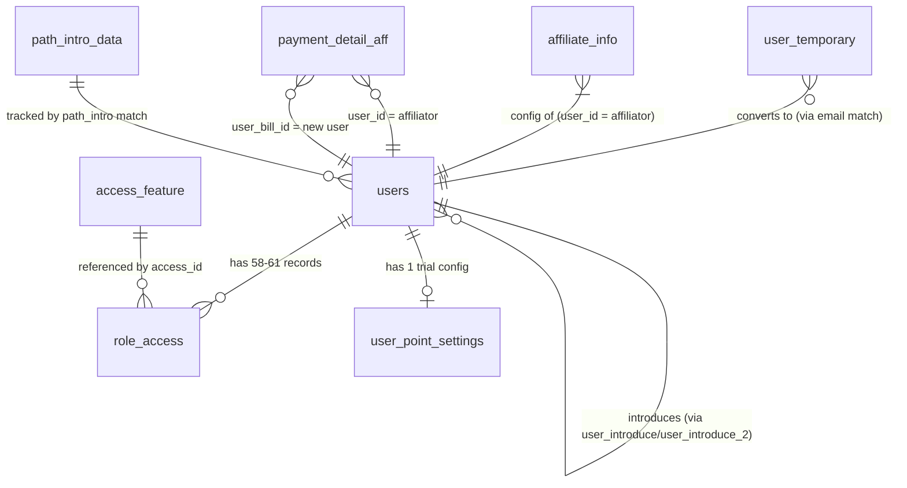

# [FA-039] Đăng ký tài khoản LME — DB Mapping

## 1. Tổng quan

Feature FA-039 tương tác với **8 bảng** trong database MySQL. Quy ước đặt tên **không theo Laravel plural convention** — nhiều bảng dùng số ít (`user_temporary`, `role_access`, `access_feature`), đã được xác nhận qua `$table` override trong các Eloquent Model (`UserTemporary.php:9`, `RoleAccess.php:10`, `AccessFeature.php:10`).

### Phân loại bảng

| Loại | Bảng | Vai trò trong feature |
|------|------|----------------------|
| **Primary (INSERT trực tiếp khi đăng ký)** | `users` | Bảng chính — INSERT 1 record user mới (Admin LINE OA) |
| | `user_temporary` | INSERT tạm ở Step 1, UPDATE nếu gửi lại; KHÔNG bị cleanup sau khi tạo `users` thành công |
| | `role_access` | INSERT 58-61 record (34 role_id=1 + ~24 role_id=2 + 3 role_id=3) cho user mới |
| | `payment_detail_aff` | INSERT 1 record nếu user đăng ký qua link affiliate (`hashUserId` decode thành công) |
| | `user_point_settings` | INSERT 1 record trial 30 ngày cho user mới |
| **Secondary (READ / LOOKUP / UPDATE counter)** | `access_feature` | READ — lookup 34 route names để resolve `access_id` trước khi INSERT `role_access` |
| | `affiliate_info` | READ (lấy config notify) + UPDATE (`count_user_intro++`) — chỉ khi có affiliate |
| | `path_intro_data` | READ (loop toàn bộ) + UPDATE (`count_user++`) — tracking referral URL, có soft delete |

### Đặc điểm quan trọng
- **Không có DB transaction** — toàn bộ INSERT chạy tuần tự, có thể để dữ liệu dở nếu lỗi giữa chừng (BR-17 trong logic-spec).
- `DB::table('users')->insertGetId()` được dùng thay `User::create()` → **bỏ qua** model events/mutators/observers (BR-18).
- **Không có bảng `invite_codes`** riêng — invite code được check bằng `exists:users,invite_code` (cột `users.invite_code` có giá trị là invite code của chính admin hiện có) — chỉ kích hoạt khi `APP_ENV != 'production'`.
- **Mức độ tin cậy tổng thể**: **Cao** — schema xác nhận 100% từ `db/schema/tables/*.sql`; logic INSERT xác nhận 100% từ `AuthController.php`.
- **Sample data**: Thư mục `db/data/tables/` **chưa được export** — không có INSERT data mẫu để tham chiếu. Phần "Sample Data" trong mỗi entity ghi "(chưa có data export)".

---

## 2. Entity Details

### 2.1. `users` — Bảng user chính (Admin LINE OA)

**Nguồn**: `db/schema/tables/users.sql`, Model `App\User` (file `app/User.php`).
**Số cột**: 73.
**Size**: 135KB (index.md).

#### Columns

| Cột | Kiểu | Nullable | Default | Key | Mô tả (Tiếng Việt) |
|-----|------|----------|---------|-----|--------------------|
| `id` | int(11) | không | — | PK | Khoá chính (auto increment) — dùng làm `user_id` ở các bảng con |
| `admin_id` | int(12) | không | — | — | ID admin cấp trên (parent admin); với user đăng ký mới = `admin->admin_id` nếu có referral hoặc = `1` (default) |
| `email` | varchar(255) | không | — | UNIQUE (từ rule `unique:users,email`) | Email đăng ký — nhập ở SCR-REG-02 |
| `last_name` | varchar(255) | có | NULL | — | Họ (chưa dùng trong feature register) |
| `username` | varchar(255) | không | — | — | Tên người phụ trách — nhập ở SCR-REG-03 (server rule max:50) |
| `company_name` | varchar(255) | có | NULL | — | Tên công ty/屋号 — nhập ở SCR-REG-03 |
| `phone_number` | varchar(255) | có | NULL | — | Số điện thoại (10-11 digits) — nhập ở SCR-REG-03 |
| `password` | varchar(255) | không | — | — | Password đã hash bằng `bcrypt()` |
| `avatar_path` | varchar(255) | có | NULL | — | Avatar (không dùng khi đăng ký) |
| `role` | tinyint(1) | không | 1 | — | `-1`: admin system, `0`: user (admin LINE OA — V2 luôn set), `2`: staff |
| `level` | int(11) | có | NULL | — | Không set khi đăng ký |
| `url_logo_aff`, `url_header_aff` | varchar(255) | có | NULL | — | Cấu hình aff (không set khi đăng ký) |
| `bot_service_name` | text | có | NULL | — | Tên bot service (chưa dùng) |
| `reset_token` | varchar(255) | có | NULL | — | Token reset password (feature khác) |
| `reset_token_expired` | timestamp | có | NULL | — | Hết hạn reset token |
| `remember_token` | varchar(255) | có | NULL | — | Laravel remember me |
| `channel_id` | varchar(255) | không | — | — | LINE Channel ID (không set khi đăng ký — để rỗng hoặc backend fill default) |
| `channel_secret` | varchar(500) | không | — | — | LINE Channel Secret (không set khi đăng ký) |
| `is_deleted` | tinyint(1) | không | 0 | — | Soft delete flag |
| `max_bot` | int(11) | không | 0 | — | Số bot tối đa được phép — khi đăng ký = `env('MAX_BOT', 1)` |
| `old_max_bot` | int(11) | không | 0 | — | Lịch sử max_bot (không set khi đăng ký) |
| `last_login_time`, `action_count` | int | có | NULL/0 | — | Tracking login (không set khi đăng ký) |
| `trial_day`, `basic_fee` | int(11) | không | 0 | — | Legacy trial (không dùng — V2 dùng `user_point_settings`) |
| `rate_aff` | double | không | 0 | — | Tỷ lệ aff (không set khi đăng ký) |
| `user_introduce` | int(11) | có | NULL | FK→users.id (logical) | ID của affiliator NẾU `admin->allow_accept_aff == 1`; ngược lại = NULL |
| `user_introduce_2` | int(11) | có | NULL | FK→users.id (logical) | ID của affiliator NẾU `admin->allow_accept_aff != 1`; ngược lại = NULL |
| `invite_code` | varchar(255) | không | — | (dùng cho `exists:users,invite_code` check) | Invite code của user (không set khi đăng ký — để rỗng; giá trị invite_code là của admin khác) |
| `user_token` | varchar(255) | có | NULL | — | API token (không set khi đăng ký) |
| `is_active` | tinyint(4) | không | 1 | — | `1`: active, `0`: inactive. V2 luôn set **1** (active ngay); legacy set 0 rồi chờ mail activate |
| `token_active_register` | varchar(64) | có | NULL | — | Token activate (64 char). V2: set `null`; legacy: `generateRandomString(32)` |
| `expire_datetime_active_user` | datetime | có | NULL | — | Hết hạn token activate. V2: set `null`; legacy: `now` |
| `created_at` | datetime | không | — | — | `Carbon::now()` khi INSERT |
| `updated_at` | datetime | không | — | — | `Carbon::now()` khi INSERT |
| `server_id`, `sub_server_user_id` | int(11) | có | NULL | — | Multi-server support (không set khi đăng ký) |
| `allow_accept_aff` | tinyint(4) | không | 0 | — | `0`: không, `1`: có. Default 0 — không set khi đăng ký user mới (chỉ admin cấp cao set) |
| `two_factor_verify_code` | varchar(255) | không | — | — | 2FA code (default rỗng) |
| `time_generate_two_factor_auth_code` | datetime | không | — | — | 2FA timestamp (default — có thể default `0000-00-00 00:00:00`) |
| `commission_rate` | double | không | 40 | — | Tỷ lệ hoa hồng (default 40, không set khi đăng ký) |
| `is_inactive` | tinyint(4) | không | 1 | — | `0`: active, `1`: inactive (default 1 — hơi ngược so với `is_active`) |
| `rate_standard`, `rate_pro` | double | có | 20 | — | Rate tiers (default) |
| `rate_new` | int(11) | không | 0 | — | Rate mới |
| `datetime_apply_term_aff` | datetime | có | NULL | — | Ngày áp dụng term aff |
| `path_intro` | varchar(255) | có | NULL | — | URL referrer — `urldecode($request->pathIntro)` nếu có, ngược lại NULL |
| `account_deletion_auth_code`, `time_generate_account_deletion_auth_code` | — | có | NULL | — | Xoá tài khoản (không dùng) |
| `change_email_auth_code`, `time_generate_change_email_auth_code` | — | có | NULL | — | Đổi email (không dùng) |
| `enable_tooltip_calendar` | tinyint(4) | không | 1 | — | Setting tooltip (default) |
| `access_token_gmail` | varchar(500) | có | NULL | — | Gmail OAuth |
| `is_two_factor_verified` | tinyint(1) | không | 0 | — | 2FA verified flag |
| `enable_tooltip_calendar_salon` | tinyint(4) | không | 1 | — | Tooltip salon |
| `message_intro` | longtext | có | NULL | — | Intro message |
| `remember_token_reset_pass` | varchar(64) | có | NULL | — | Reset password token |
| `is_off_popup_ads` | tinyint(1) | có | 0 | — | Tắt popup quảng cáo |
| `key_login`, `expired_key_login` | — | có | NULL | — | Key login tạm |
| `is_not_show_popup_staff` | tinyint(4) | không | 0 | — | Popup staff |
| `date_show_popup_staff` | date | có | NULL | — | Ngày hiện popup |
| `is_mobile` | tinyint(4) | có | NULL | — | `1`: mobile, `0`: pc — copy từ `userTemp.is_mobile` |
| `show_popup_setting_form_answer` | tinyint(4) | không | 1 | — | Popup setting form |
| `hide_action_intro_modal` | timestamp | có | NULL | — | Thời điểm ẩn modal intro |
| `invoice_name`, `use_setting_invoice_name` | — | có | NULL/0 | — | Invoice name |
| `is_no_show_popup_term` | tinyint(4) | không | 0 | — | Popup term |
| `number_bank_transfer` | int(11) | có | 0 | — | Số lần chuyển khoản |
| `marker` | varchar(40) | có | NULL | — | Marker |
| `manager_code` | varchar(255) | không | — | — | Code quản lý (default rỗng) |
| `ip` | varchar(64) | có | NULL | — | `$request->getClientIp()` — IP khi đăng ký |

#### Indexes, Foreign Keys
- PK: `id` (auto increment — schema không ghi `AUTO_INCREMENT` vì đã lược bỏ `ENGINE` khi tách file).
- UNIQUE logic: `email` (qua rule `unique:users,email` — chưa chắc có UNIQUE INDEX vật lý, cần đọc thêm index metadata).
- FK logic: `user_introduce`, `user_introduce_2` → `users.id` (self-reference, không có constraint cứng).

#### Sample Data
(chưa có data export — thư mục `db/data/tables/` chưa được tạo)

---

### 2.2. `user_temporary` — Bảng lưu tạm email + token xác thực

**Nguồn**: `db/schema/tables/user_temporary.sql`, Model `App\UserTemporary` (`protected $table = "user_temporary"`).
**Số cột**: 7. **Size**: 36KB.

#### Columns

| Cột | Kiểu | Nullable | Default | Key | Mô tả |
|-----|------|----------|---------|-----|-------|
| `id` | int(10) UNSIGNED | không | — | PK | Khoá chính auto increment |
| `email` | varchar(255) | không | — | — | Email đăng ký — dùng để match với `users.email` sau này |
| `code` | varchar(255) | không | — | — | Token verify email (`Str::random(60)`). Plain string 60 ký tự — **không hash** |
| `created_at` | timestamp | có | NULL | — | Thời điểm gửi mail verify — dùng check TTL 24h |
| `updated_at` | timestamp | có | NULL | — | Thời điểm update cuối — dùng check `diffInMinutes > 1` để resend |
| `is_mobile` | tinyint(4) | có | NULL | — | `1`: mobile, `0`: pc — từ User-Agent server-side |
| `path_intro` | varchar(500) | có | NULL | — | URL referrer tracking |

#### Indexes, Foreign Keys
- PK: `id`.
- Không có UNIQUE INDEX trên `email` hay `code` (chỉ có logic-level uniqueness qua query `where('email', ...)->first()`).

#### Ghi chú đặc biệt
- Chỉ `email`, `code`, `is_mobile` nằm trong `$fillable` của Model (`UserTemporary.php:8`); `path_intro` **không trong `$fillable`** nhưng vẫn được gán qua property access (`$userTemp->path_intro = ...`).
- Record **không bị DELETE** sau khi INSERT `users` thành công (xem BR trong logic-spec — có thể còn sót).
- `hashUserId` KHÔNG được lưu trong bảng này — chỉ được truyền qua payload ở Step cuối (EP-08).

#### Sample Data
(chưa có data export)

---

### 2.3. `role_access` — Bảng phân quyền user

**Nguồn**: `db/schema/tables/role_access.sql`, Model `App\RoleAccess` (`protected $table = 'role_access'`).
**Số cột**: 6. **Size**: 2.6MB (bảng lớn vì mỗi user có 58-61 record).

#### Columns

| Cột | Kiểu | Nullable | Default | Key | Mô tả |
|-----|------|----------|---------|-----|-------|
| `id` | int(10) UNSIGNED | không | — | PK | Khoá chính auto increment |
| `user_id` | int(11) | không | — | FK→users.id (logical) | ID user được cấp quyền |
| `role_id` | int(11) | không | — | FK→roles.id (logical) | Role: `1`=super admin của account, `2`=staff default, `3`=chat-only staff |
| `access_id` | int(11) | không | — | FK→access_feature.id (logical) | Feature được cấp quyền |
| `created_at` | datetime | không | — | — | Timestamp tạo |
| `updated_at` | datetime | không | — | — | Timestamp update |

#### Indexes, Foreign Keys
- PK: `id`. Không có UNIQUE composite (user_id, role_id, access_id) — về lý thuyết có thể trùng nếu INSERT lặp.

#### Relationships (Eloquent)
- `role()` → belongsTo `App\Role` qua `role_id`.
- `accessFeature()` → belongsTo `App\AccessFeature` qua `access_id`.
- `user()` → belongsTo `App\User` qua `user_id`.

#### Sample Data
(chưa có data export)

---

### 2.4. `access_feature` — Bảng danh mục feature (quyền)

**Nguồn**: `db/schema/tables/access_feature.sql`, Model `App\AccessFeature` (`protected $table = 'access_feature'`).
**Số cột**: 8. **Size**: 85KB (lookup table nhỏ).

#### Columns

| Cột | Kiểu | Nullable | Default | Key | Mô tả |
|-----|------|----------|---------|-----|-------|
| `id` | int(10) UNSIGNED | không | — | PK | Khoá chính |
| `name` | varchar(255) | không | — | — | Tên feature hiển thị (có thể là tiếng Nhật) |
| `url` | varchar(255) | không | — | — | URL path của feature |
| `parent` | int(11) | không | — | — | FK→access_feature.id (tree structure) — ID của feature cha |
| `route` | varchar(255) | không | — | — | Tên route Laravel (vd `chatBasic`, `index.talk`) — **dùng để lookup** khi INSERT role_access |
| `visible` | int(11) | không | 1 | — | `1`: hiển thị & cấp được quyền, `0`: ẩn. Feature chỉ được cấp quyền nếu `visible=1` |
| `order` | int(11) | không | 0 | — | Thứ tự hiển thị menu |
| `menu_id` | int(11) | có | NULL | — | Group menu (nhóm menu điều hướng) |

#### Indexes, Foreign Keys
- PK: `id`.
- `route` nên có INDEX (query `WHERE route = ? AND visible = 1` chạy 34 lần mỗi lần register).

#### 34 Route được INSERT role_access khi đăng ký (từ logic-spec BR-09)

```
chatBasic, index.talk, broadcast.index, scenario.index, index.msg_template,
basicReply, settingAddFriend, form_answer.index, list_event.booking_event,
events.index, booking.manager, tagHome, friendlistHome, friendInformationList,
employeesManagement, errorList, landingIndex, index.conversion, urlHome,
sitescriptHome, richMenu, mediaList, registerInfoAff, managePaymentStatus,
listItemsOld, orderHistory, cycleOrderHistory, affSetting, affResult,
affMemberList, pointSettings, adminSetting, botAdd, backup, notifySetting
```

#### Sample Data
(chưa có data export — nhưng dữ liệu bảng này là reference data, gần như bất biến)

---

### 2.5. `payment_detail_aff` — Tracking affiliate khi đăng ký

**Nguồn**: `db/schema/tables/payment_detail_aff.sql`, Model `App\PaymentDetailAff`.
**Số cột**: 30. **Size**: 3.6MB.

#### Columns (chỉ mô tả cột liên quan đến register — xem file SQL gốc để xem đủ 30 cột)

| Cột | Kiểu | Nullable | Default | Key | Mô tả (trong context register) |
|-----|------|----------|---------|-----|--------------------------------|
| `id` | int(10) UNSIGNED | không | — | PK | Khoá chính |
| `admin_id` | int(11) | có | NULL | — | Admin cấp trên (= `admin->admin_id` hoặc `1` nếu NULL) |
| `user_id` | int(11) | có | NULL | FK→users.id | **User affiliator** (người giới thiệu — `$userIdInvite` decode từ hashUserId) |
| `user_bill_id` | int(11) | có | NULL | FK→users.id | **User mới đăng ký** (= `$userId` vừa INSERT ở bước 5) |
| `type_bill` | tinyint(4) | không | 1 | — | Khi đăng ký = **`-1`** (magic value đánh dấu record đăng ký mới). Các giá trị khác: `1`=stripe_card, `2`=univapay_card, `3`=univapay_transfer |
| `bot_name` | varchar(255) | có | NULL | — | **Khi đăng ký = email của user mới** (`$newData['email']`) — bị dùng lệch chức năng (magic usage) |
| `remain_day` | int(11) | có | NULL | — | Khi đăng ký = `0` |
| `status` | int(11) | không | 0 | — | `0`: chưa thanh toán, `1`: đã thanh toán. Default 0 (register không set explicit) |
| `amount` | int(11) | không | 0 | — | Số tiền (default 0) |
| `rate`, `sub_amount` | double | có/không | NULL/0 | — | Rate và sub amount (default) |
| `bot_id`, `bot_contract_id` | int(11) | có | NULL | — | Không set khi đăng ký |
| `created_at`, `updated_at` | timestamp | có | NULL | — | Laravel timestamp — tự gán |
| Các cột khác (`univapay_*`, `status_transfer`, `payment_date`, `id_parent`, `parent_month`, `number_bill`, `flag_display`, `amount_refund`, `reason_refund`, `refund_date`, `status_refund`, `remain_day_upgrade`, `number_slot_bill`) | — | — | default schema | — | Không set khi đăng ký — dùng default value của schema |

#### Indexes, Foreign Keys
- PK: `id`.
- `user_id`, `user_bill_id`, `admin_id`: FK logic (không có constraint cứng).

#### Ghi chú
- Tương tác trong register: chỉ INSERT (không UPDATE/DELETE).
- Điều kiện INSERT: `!empty($userIdInvite)` — có affiliate hợp lệ.

#### Sample Data
(chưa có data export)

---

### 2.6. `user_point_settings` — Trial 30 ngày

**Nguồn**: `db/schema/tables/user_point_settings.sql`, Model `App\UserPointSettings`.
**Số cột**: 11. **Size**: 86KB.

#### Columns

| Cột | Kiểu | Nullable | Default | Key | Mô tả |
|-----|------|----------|---------|-----|-------|
| `id` | int(11) | không | — | PK | Khoá chính auto increment |
| `user_id` | int(11) | có | NULL | FK→users.id | ID user mới đăng ký |
| `paypal_token` | varchar(900) | có | NULL | — | PayPal token (không set khi đăng ký) |
| `bill_id` | varchar(900) | có | NULL | — | Billing ID (không set) |
| `expire_date` | datetime | có | NULL | — | Hết hạn trial — khi đăng ký = **end of today + 30 days** (`Carbon::createFromTimestamp(strtotime('+30 days', strtotime(date('Y-m-d 23:59:59'))))`) |
| `is_trial` | tinyint(1) | có | NULL | — | Khi đăng ký = `true` (1) |
| `is_error` | tinyint(1) | có | NULL | — | Không set khi đăng ký |
| `m_bot` | int(11) | không | 0 | — | Khi đăng ký = `1` |
| `require_paypal` | tinyint(1) | không | 0 | — | Khi đăng ký = `1` |
| `created_at` | datetime | có | NULL | — | Laravel timestamp |
| `updated_at` | timestamp | không | CURRENT_TIMESTAMP ON UPDATE | — | Auto update |

#### Indexes, Foreign Keys
- PK: `id`.
- `user_id`: FK logic.

#### Ghi chú
- 1 user — 1 record (logic 1-1, nhưng không có UNIQUE trên `user_id`).

#### Sample Data
(chưa có data export)

---

### 2.7. `affiliate_info` — Cấu hình affiliate của user giới thiệu

**Nguồn**: `db/schema/tables/affiliate_info.sql`, Model `App\AffiliateInfo`.
**Số cột**: 33. **Size**: 13KB.

#### Columns (chỉ mô tả cột liên quan đến register — xem file SQL gốc để xem đủ)

| Cột | Kiểu | Nullable | Default | Key | Mô tả |
|-----|------|----------|---------|-----|-------|
| `id` | int(10) UNSIGNED | không | — | PK | Khoá chính |
| `user_id` | int(11) | có | NULL | FK→users.id | **User affiliator** (người giới thiệu) |
| `count_user_intro` | int(11) | không | 0 | — | **Tăng `+1`** mỗi lần có user mới đăng ký qua link aff của user này |
| `is_receive_notification` | tinyint(4) | không | 1 | — | `1`: nhận notify, `0`: không nhận |
| `when_registered` | tinyint(1) | không | 1 | — | `1`: gửi notify khi có user mới đăng ký aff |
| `emails_receive_notify` | json | có | NULL | — | JSON array chứa danh sách email sẽ nhận notify (vd `["a@x.com","b@y.com"]`) |
| Các cột khác (`name`, `email`, `email_receive_money`, `phone_number`, `address`, `admin_id`, `status`, `bank_*`, `account_*`, `admin_*`, `invoice_number`, `commission_rate`, `update_invoice_date`, `type_aff`, `when_reward`, `show_amount`, `flag_display`) | — | — | default schema | — | Không liên quan trực tiếp đến register — chỉ READ để quyết định có gửi notify không |

#### Tương tác trong register
1. **READ**: `AffiliateInfo::where('user_id', $userIdInvite)->first()` — lấy config của affiliator.
2. **UPDATE**: `count_user_intro++` nếu record tồn tại.
3. **READ**: `emails_receive_notify` (json_decode) để gửi mail — chỉ khi `is_receive_notification && when_registered`.

#### Sample Data
(chưa có data export)

---

### 2.8. `path_intro_data` — Tracking URL referrer

**Nguồn**: `db/schema/tables/path_intro_data.sql`, Model `App\PathIntroData`.
**Số cột**: 11. **Size**: 9KB.

#### Columns

| Cột | Kiểu | Nullable | Default | Key | Mô tả |
|-----|------|----------|---------|-----|-------|
| `id` | bigint(20) UNSIGNED | không | — | PK | Khoá chính |
| `name` | varchar(255) | không | — | — | Tên hiển thị URL |
| `folder_id` | bigint(20) | có | 0 | — | Folder gom nhóm |
| `url_type` | tinyint(4) | có | 1 | — | `1`: url khớp ký tự (PARTIAL — `Str::contains`), `2`: url chính xác (CORRECT — equality) |
| `url` | varchar(255) | có | NULL | — | URL template để match với `pathIntro` |
| `count_user` | int(11) | có | 0 | — | **Tăng `+1`** mỗi lần có user mới đăng ký với `pathIntro` match |
| `position` | int(11) | có | NULL | — | Thứ tự hiển thị |
| `user_id_deleted` | bigint(20) | có | NULL | — | ID admin đã xoá (soft delete metadata) |
| `created_at` | timestamp | có | NULL | — | Timestamp tạo |
| `updated_at` | timestamp | có | NULL | — | Timestamp update |
| `deleted_at` | timestamp | có | NULL | — | **Soft delete** (Laravel SoftDeletes trait) |

#### Constants (từ Model `PathIntroData.php`)
- `URL_TYPE_PARTIAL = 1`
- `URL_TYPE_CORRECT = 2`

#### Tương tác trong register
- `countPathIntro($pathIntro)` loop toàn bộ `PathIntroData::query()->get()` (bao gồm cả soft-deleted? → tuỳ trait — nếu dùng `SoftDeletes` thì default scope sẽ filter `deleted_at IS NULL`).
- Với mỗi record: check match → `$item->increment('count_user')`.

#### Sample Data
(chưa có data export)

---

## 3. UI ↔ DB Field Mapping

### 3.1. SCR-REG-02 — Bước 1 (Nhập email)

Form submit qua **EP-05 POST `/send_mail_register`** — ghi vào `user_temporary`.

| UI Element | Label JP | DB Table | Column | Mapping Type | Confidence | Ghi chú |
|------------|----------|----------|--------|--------------|-----------|---------|
| Textbox email | 「メールアドレス」 | `user_temporary` | `email` | Direct | **Cao** | Validate `unique:users,email` → chỉ INSERT `user_temporary` nếu email chưa tồn tại trên `users` |
| Textbox invite code | 「招待コードを入力してください。」 | `users` | `invite_code` | Lookup (exists check, không INSERT) | **Cao** | Rule `exists:users,invite_code` — chỉ kiểm tra có tồn tại (admin hiện có đã có invite_code = giá trị nhập). **KHÔNG có bảng `invite_codes`** riêng. Chỉ kích hoạt khi `APP_ENV != 'production'` và `type != 'resend'` |
| Checkbox T&C | 「『利用規約』および『プライバシーポリシー』に同意する」 | — | — | Transient | **Cao** | Chỉ check client-side — **không lưu DB** |
| Token mail (backend generate) | (ẩn — Str::random(60)) | `user_temporary` | `code` | Computed (server-side) | **Cao** | `Str::random(60)` → plain 60-char token (không hash) |
| `is_mobile` (hidden hoặc server-inject) | — | `user_temporary` | `is_mobile` | Direct | **Cao** | Flag từ User-Agent server-side → copy vào `user_temporary.is_mobile` |
| `pathIntro` (hidden) | — | `user_temporary` | `path_intro` | Direct | **Cao** | URL referrer tracking |
| `hashUserId` (hidden) | — | — | — | Transient | **Cao** | **KHÔNG lưu** trong `user_temporary` — chỉ được truyền qua payload ở EP-08 (Step cuối) |
| `type` (hidden, value='resend' hoặc không có) | — | — | — | Transient | **Cao** | Chỉ để bỏ qua invite-code check khi resend, không lưu DB |
| Auto: `created_at` | — | `user_temporary` | `created_at` | Computed | **Cao** | `Carbon::now()` khi create hoặc update (reset khi resend) |
| Auto: `updated_at` | — | `user_temporary` | `updated_at` | Computed | **Cao** | Laravel auto timestamp |

### 3.2. SCR-REG-03 — Bước 2a (Thông tin user)

**KHÔNG ghi DB** ở màn này — chỉ validate qua **EP-06 POST `/type_information`** và lưu Vue localStorage. Dữ liệu sẽ được INSERT vào `users` ở SCR-REG-05 (EP-08).

| UI Element | Label JP | DB Table | Column | Mapping Type | Confidence | Ghi chú |
|------------|----------|----------|--------|--------------|-----------|---------|
| Readonly email | 「メールアドレス」 | `user_temporary` → `users` | `users.email` (sẽ INSERT ở EP-08) | Transient đến EP-08 | **Cao** | READ từ `userTemp.email` (backend truyền qua view); ở EP-08 INSERT vào `users.email` |
| Textbox username | 「名前・担当者名」 | `users` | `username` | Transient đến EP-08 | **Cao** | Server validate max:50 ở EP-08; lưu Vue localStorage ở giai đoạn này |
| Textbox company_name | 「会社名・屋号」 | `users` | `company_name` | Transient đến EP-08 | **Cao** | Lưu Vue localStorage; INSERT ở EP-08 |
| Textbox phone_number | 「電話番号（ハイフンなし）」 | `users` | `phone_number` | Transient đến EP-08 | **Cao** | Validate regex `/^\d{10,11}$/`; INSERT ở EP-08 |

### 3.3. SCR-REG-04 — Bước 2b (Nhập password)

**KHÔNG ghi DB** ở màn này — chỉ validate qua **EP-07 POST `/confirm_information`**.

| UI Element | Label JP | DB Table | Column | Mapping Type | Confidence | Ghi chú |
|------------|----------|----------|--------|--------------|-----------|---------|
| Textbox password | 「パスワード」 | `users` | `password` | Transient đến EP-08 (sẽ hash bcrypt) | **Cao** | Server validate `between:6,12` ở EP-07, `between:6,13` ở EP-08 (lệch); INSERT ở EP-08 với `bcrypt($password)` |
| Textbox repeat_password | 「パスワード確認用」 | — | — | Transient | **Cao** | **Không lưu DB** — chỉ client-side compare |

### 3.4. SCR-REG-05 — Bước 2c (Xác nhận + submit final)

Submit qua **EP-08 POST `/register_v2`** — ghi **tất cả** các bảng Primary:

#### INSERT `users`

| UI Element (gom từ Step 1-2b) | DB Table | Column | Mapping Type | Confidence | Ghi chú |
|-------------------------------|----------|--------|--------------|-----------|---------|
| Email (từ `userTemp.email`) | `users` | `email` | Direct | **Cao** | Validate lại `unique:users,email` — tránh race |
| Username (Step 2a) | `users` | `username` | Direct | **Cao** | Validate `max:50` |
| Company name (Step 2a) | `users` | `company_name` | Direct | **Cao** | Không validate server-side ở EP-08 |
| Phone number (Step 2a) | `users` | `phone_number` | Direct | **Cao** | Không validate server-side ở EP-08 (client đã check) |
| Password (Step 2b) | `users` | `password` | Computed (bcrypt) | **Cao** | `bcrypt($password)` |
| `hashUserId` (affiliate) + `admin->allow_accept_aff == 1` | `users` | `user_introduce` | Conditional FK | **Cao** | Decode hashUserId → `$userIdInvite`. Chỉ set nếu `admin.allow_accept_aff == 1` |
| `hashUserId` (affiliate) + `admin->allow_accept_aff != 1` | `users` | `user_introduce_2` | Conditional FK | **Cao** | Set khi `admin.allow_accept_aff != 1` |
| `pathIntro` | `users` | `path_intro` | Computed (urldecode) | **Cao** | `urldecode($request->pathIntro)` nếu `!= 1` (literal `1`), ngược lại NULL. Có thể bị thay `https://lme.jp` → `https://lme.jp/sp.html` khi `is_mobile=1` |
| `userTemp.is_mobile` | `users` | `is_mobile` | Direct | **Cao** | Copy từ `userTemp.is_mobile` (không phải request.isMobile) |
| — (server computed) | `users` | `role` | Enum fixed | **Cao** | Luôn = `0` (ROLE_USER — admin LINE OA) |
| — (server computed) | `users` | `admin_id` | Computed | **Cao** | = `$admin->admin_id` nếu có affiliate, ngược lại = `1` |
| — (env) | `users` | `max_bot` | Computed | **Cao** | = `env('MAX_BOT', 1)` |
| — (server) | `users` | `is_active` | Enum fixed | **Cao** | Luôn = `1` (V2 — active ngay) |
| — (server) | `users` | `token_active_register` | Transient | **Cao** | Ban đầu set `generateRandomString(32)` rồi override = `null` cuối cùng |
| — (server) | `users` | `expire_datetime_active_user` | Transient | **Cao** | Ban đầu set `Carbon::now()` rồi override = `null` cuối cùng |
| — (server) | `users` | `ip` | Computed | **Cao** | `$request->getClientIp()` |
| — (server) | `users` | `created_at` | Computed | **Cao** | `Carbon::now()` |
| — (server) | `users` | `updated_at` | Computed | **Cao** | `Carbon::now()` |

#### INSERT `payment_detail_aff` (nếu `$userIdInvite`)

| UI-derived value | DB Table | Column | Mapping Type | Confidence | Ghi chú |
|------------------|----------|--------|--------------|-----------|---------|
| (từ `admin->admin_id` hoặc 1) | `payment_detail_aff` | `admin_id` | Computed | **Cao** | — |
| `$userIdInvite` (decode hashUserId) | `payment_detail_aff` | `user_id` | Direct (affiliator FK) | **Cao** | User giới thiệu |
| — (fixed magic) | `payment_detail_aff` | `type_bill` | Enum fixed | **Cao** | = **`-1`** (magic đánh dấu record đăng ký mới) |
| — (fixed) | `payment_detail_aff` | `remain_day` | Fixed | **Cao** | = `0` |
| Email user mới (`$newData['email']`) | `payment_detail_aff` | `bot_name` | Direct (magic usage) | **Cao** | Lưu email user mới vào field `bot_name` — dùng lệch chức năng |
| `$userId` (vừa INSERT) | `payment_detail_aff` | `user_bill_id` | Direct (FK user mới) | **Cao** | — |

#### INSERT `role_access` (34 route × 3 role — tổng tối đa 61 record)

| UI-derived value | DB Table | Column | Mapping Type | Confidence | Ghi chú |
|------------------|----------|--------|--------------|-----------|---------|
| `$userId` | `role_access` | `user_id` | Direct | **Cao** | User mới |
| Từ `access_feature.id` (lookup qua `route` của `$roleUserNew`) | `role_access` | `access_id` | FK Lookup | **Cao** | `AccessFeature::where('route', $route)->where('visible', 1)->first()->id` |
| Fixed | `role_access` | `role_id` | Enum fixed | **Cao** | `1` (luôn), `2` (loại trừ 10 routes), `3` (chỉ 3 routes: chatBasic, index.talk, adminSetting) |
| Auto | `role_access` | `created_at`, `updated_at` | Computed | **Cao** | Laravel timestamps |

#### INSERT `user_point_settings`

| UI-derived value | DB Table | Column | Mapping Type | Confidence | Ghi chú |
|------------------|----------|--------|--------------|-----------|---------|
| `$userId` | `user_point_settings` | `user_id` | Direct | **Cao** | — |
| Fixed | `user_point_settings` | `is_trial` | Enum fixed | **Cao** | = `true` (1) |
| Fixed | `user_point_settings` | `m_bot` | Fixed | **Cao** | = `1` |
| Fixed | `user_point_settings` | `require_paypal` | Enum fixed | **Cao** | = `1` |
| Computed | `user_point_settings` | `expire_date` | Computed | **Cao** | `strtotime('+30 days', strtotime(Y-m-d 23:59:59))` — cuối ngày hiện tại + 30 ngày |

#### UPDATE `affiliate_info` (nếu affiliate và record tồn tại)

| UI-derived value | DB Table | Column | Mapping Type | Confidence | Ghi chú |
|------------------|----------|--------|--------------|-----------|---------|
| `$userIdInvite` | `affiliate_info` | `user_id` | Lookup (WHERE clause) | **Cao** | Tìm record theo affiliator |
| — | `affiliate_info` | `count_user_intro` | Incremented | **Cao** | `count_user_intro + 1` |
| (READ only) | `affiliate_info` | `is_receive_notification`, `when_registered`, `emails_receive_notify` | Read | **Cao** | Để quyết định có gửi mail notify không |

#### UPDATE `path_intro_data` (tăng counter)

| UI-derived value | DB Table | Column | Mapping Type | Confidence | Ghi chú |
|------------------|----------|--------|--------------|-----------|---------|
| `$pathIntro` (match rule) | `path_intro_data` | `url` | Lookup | **Cao** | Match theo `url_type`: 1=partial (`Str::contains`), 2=exact |
| — | `path_intro_data` | `count_user` | Incremented | **Cao** | `count_user + 1` |

### 3.5. SCR-REG-06 — Bước 3 (Hoàn thành)

**Không ghi/đọc DB** — chỉ GET view `auth.register_user_success_v2` (EP-11).

---

## 4. Enum / Status Values

### 4.1. `users.role` (tinyint(1))

| Giá trị | Ý nghĩa | Constant |
|---------|---------|----------|
| `-1` | Admin system | `User::ROLE_ADMIN` |
| `0` | User (Admin LINE OA) — **V2 register luôn set** | `User::ROLE_USER` |
| `1` | (Default schema) — giá trị mặc định khi tạo row mới mà không set explicit | — |
| `2` | Staff | `User::ROLE_STAFF` |

### 4.2. `users.is_active` (tinyint(4))

| Giá trị | Ý nghĩa |
|---------|---------|
| `0` | Inactive — user chưa verify hoặc bị khoá. Config key `sns-line.is_active.no` |
| `1` | Active — user bình thường (V2 register luôn set). Default schema |

### 4.3. `users.is_inactive` (tinyint(4))

Lưu ý đây là **cột khác** với `is_active` — mang nghĩa ngược:

| Giá trị | Ý nghĩa |
|---------|---------|
| `0` | active (no) |
| `1` | inactive (yes) — **default schema** |

### 4.4. `users.allow_accept_aff` (tinyint(4))

| Giá trị | Ý nghĩa |
|---------|---------|
| `0` | Không chấp nhận aff (default) |
| `1` | Chấp nhận aff → dùng `user_introduce` thay `user_introduce_2` |

### 4.5. `users.is_mobile` (tinyint(4))

| Giá trị | Ý nghĩa |
|---------|---------|
| `0` | PC |
| `1` | Mobile |
| `NULL` | Không xác định |

### 4.6. `access_feature.visible` (int(11))

| Giá trị | Ý nghĩa |
|---------|---------|
| `0` | Ẩn — **không** được cấp quyền khi register |
| `1` | Hiển thị — được cấp quyền (default) |

### 4.7. `role_access.role_id` (int(11))

Dựa trên logic `validateRegisterV2`:

| Giá trị | Ý nghĩa (suy luận từ code) |
|---------|-----------------------------|
| `1` | Super admin của account — **luôn** được cấp cho tất cả 34 routes |
| `2` | Staff default — được cấp cho **24 routes** (loại trừ 10 routes: `employeesManagement`, `botAdd`, `pointSettings`, `backup`, `notifySetting`, `affSetting`, `affResult`, `affMemberList`, `registerInfoAff`, `managePaymentStatus`) |
| `3` | Chat-only staff — được cấp cho **3 routes**: `chatBasic`, `index.talk`, `adminSetting` |

### 4.8. `user_point_settings.is_trial` (tinyint(1))

| Giá trị | Ý nghĩa |
|---------|---------|
| `0` / NULL | Không trial |
| `1` (true) | Đang trial — **register luôn set 1** |

### 4.9. `user_point_settings.require_paypal` (tinyint(1))

| Giá trị | Ý nghĩa |
|---------|---------|
| `0` | Không yêu cầu PayPal (default) |
| `1` | Yêu cầu PayPal — **register luôn set 1** |

### 4.10. `path_intro_data.url_type` (tinyint(4))

| Giá trị | Constant (Model) | Ý nghĩa |
|---------|------------------|---------|
| `1` | `URL_TYPE_PARTIAL` | URL khớp ký tự — dùng `Str::contains($pathIntro, $item->url)` |
| `2` | `URL_TYPE_CORRECT` | URL chính xác — dùng equality `$pathIntro == $item->url` |

### 4.11. `payment_detail_aff.type_bill` (tinyint(4))

| Giá trị | Ý nghĩa |
|---------|---------|
| `-1` | **Magic value** — đánh dấu record đăng ký mới (tạo ở register flow) |
| `1` | stripe_card (default schema) |
| `2` | univapay_card |
| `3` | univapay_transfer |

### 4.12. `payment_detail_aff.status` (int(11))

| Giá trị | Ý nghĩa |
|---------|---------|
| `0` | Chưa thanh toán (default) |
| `1` | Đã thanh toán |

### 4.13. `affiliate_info.is_receive_notification`, `when_registered`, `when_reward` (tinyint)

Đều là boolean `0`/`1`. Default = `1`.

### 4.14. `affiliate_info.type_aff` (tinyint(4))

| Giá trị | Ý nghĩa |
|---------|---------|
| `0` | Old (default) |
| `1` | New |

---

## 5. Unmapped Items

### 5.1. UI fields KHÔNG tìm thấy DB

Không có UI field nào bị "mồ côi" — tất cả input/hidden đều có mapping rõ ràng. Các field chỉ tồn tại ở client-side (không lưu DB, đã ghi nhận):

| UI Field | Lý do không lưu DB |
|----------|---------------------|
| Checkbox 「利用規約」 agree | Chỉ gate client-side — backend không ghi lịch sử đồng ý T&C |
| `repeat_password` (SCR-REG-04) | Chỉ để compare với `password` client-side |
| `type` field (SCR-REG-02, value `'resend'`) | Chỉ để bỏ qua invite-code check, không lưu lịch sử resend |
| reCAPTCHA (SCR-REG-01 login) | Không thuộc feature register |
| Channel ID/Secret (SCR-CHK-01) | Flow phụ — **không thuộc feature FA-039**, dùng lookup `bots.line_channel_id` / `bots.line_channel_secret` (không phân tích ở đây) |

### 5.2. DB columns KHÔNG xuất hiện trên UI (backend-only)

Các cột của bảng Primary mà register flow set nhưng user không thấy/không điều khiển:

**Bảng `users` (backend-only columns được set/override khi register V2):**

| Column | Giá trị khi register | Ghi chú |
|--------|----------------------|---------|
| `role` | `0` | Fixed |
| `admin_id` | `admin->admin_id` hoặc `1` | Từ affiliate resolver |
| `max_bot` | `env('MAX_BOT', 1)` | Từ env config |
| `is_active` | `1` | Fixed V2 |
| `token_active_register` | `null` (override) | Ban đầu set random 32 rồi override |
| `expire_datetime_active_user` | `null` (override) | Tương tự |
| `ip` | `$request->getClientIp()` | Server-side |
| `created_at`, `updated_at` | `Carbon::now()` | Timestamps |
| `user_introduce` / `user_introduce_2` | `$userIdInvite` hoặc NULL | Tuỳ `allow_accept_aff` của admin cấp trên |

**Bảng `users` (columns KHÔNG được set khi register — giữ default schema):**

| Column | Default | Ghi chú |
|--------|---------|---------|
| `channel_id` | '' (empty string) | LINE Channel ID — set sau khi user add bot đầu tiên |
| `channel_secret` | '' | LINE Channel Secret — tương tự |
| `invite_code` | '' | User mới chưa có invite code riêng |
| `last_name`, `avatar_path`, `level`, `url_logo_aff`, `url_header_aff`, `bot_service_name` | NULL | Không set |
| `reset_token`, `reset_token_expired`, `remember_token` | NULL | Dùng cho feature reset password/login |
| `is_deleted` | 0 | Soft delete flag |
| `old_max_bot`, `last_login_time`, `action_count`, `trial_day`, `basic_fee`, `rate_aff` | 0/NULL | Không set |
| `user_token` | NULL | API token |
| `server_id`, `sub_server_user_id` | NULL | Multi-server |
| `allow_accept_aff` | 0 | Default — user mới không được set aff |
| `two_factor_verify_code`, `time_generate_two_factor_auth_code` | '' / epoch | 2FA |
| `commission_rate` | 40 | Default schema |
| `is_inactive` | 1 | **Default ngược với `is_active=1`** — cần lưu ý khi query |
| `rate_standard`, `rate_pro` | 20 | Default |
| `rate_new` | 0 | Default |
| `datetime_apply_term_aff` | NULL | — |
| `account_deletion_auth_code`, `time_generate_account_deletion_auth_code` | NULL | Feature xoá tài khoản |
| `change_email_auth_code`, `time_generate_change_email_auth_code` | NULL | Feature đổi email |
| `enable_tooltip_calendar`, `enable_tooltip_calendar_salon`, `show_popup_setting_form_answer` | 1 | UI settings |
| `access_token_gmail` | NULL | Gmail OAuth |
| `is_two_factor_verified` | 0 | 2FA |
| `message_intro` | NULL | — |
| `remember_token_reset_pass` | NULL | Reset pass |
| `is_off_popup_ads`, `is_not_show_popup_staff`, `is_no_show_popup_term` | 0 | Popup flags |
| `key_login`, `expired_key_login` | NULL | Key login tạm |
| `date_show_popup_staff` | NULL | — |
| `hide_action_intro_modal` | NULL | — |
| `invoice_name`, `use_setting_invoice_name` | NULL/0 | Invoice |
| `number_bank_transfer` | 0 | — |
| `marker` | NULL | — |
| `manager_code` | '' | Default empty |

**Bảng `user_temporary` (backend-only):**

| Column | Khi register |
|--------|--------------|
| `id` | Auto increment |
| `code` | `Str::random(60)` — token verify |
| `created_at`, `updated_at` | Laravel timestamps |

**Bảng `payment_detail_aff` (backend-only + giữ default):**

Tất cả 30 cột trừ 6 cột được set (`admin_id`, `user_id`, `type_bill`, `remain_day`, `bot_name`, `user_bill_id`) đều giữ default schema. Các cột như `status`, `amount`, `rate`, `sub_amount`, `bot_id`, `bot_contract_id`, `univapay_*`, `number_slot_bill`, `status_transfer`, `univa_charge_id`, `payment_date`, `id_parent`, `parent_month`, `number_bill`, `flag_display`, `amount_refund`, `reason_refund`, `refund_date`, `status_refund`, `remain_day_upgrade` — **không dùng trong register flow**.

**Bảng `user_point_settings` (backend-only):**

| Column | Khi register |
|--------|--------------|
| `paypal_token`, `bill_id` | NULL (set sau khi user đăng ký PayPal) |
| `is_error` | NULL |
| `created_at` | NULL (Laravel không auto set vì `$timestamps=true` vẫn set `updated_at` qua ON UPDATE) — **có thể thiếu `created_at`** khi create-via-Eloquent; cần xác nhận |

**Bảng `role_access`**: 100% cột đều được set khi INSERT (không có backend-only column nào bị bỏ qua).

**Bảng `access_feature`**: READ-ONLY trong register flow.

**Bảng `affiliate_info`**: Chỉ 1 cột bị UPDATE (`count_user_intro`), còn lại READ-ONLY.

**Bảng `path_intro_data`**: Chỉ 1 cột bị UPDATE (`count_user`), còn lại READ-ONLY.

---

## 6. Entity Relationships



**Ghi chú relationship**:
- `users.user_introduce` / `user_introduce_2` — self-reference đến `users.id` của affiliator (logical FK, không constraint cứng).
- `user_temporary ↔ users` không có FK vật lý — chỉ liên kết logic qua `email` match và `code` (token verify).
- `role_access` có 2 FK logic: `user_id` → `users.id`, `access_id` → `access_feature.id`. Không có FK đến bảng `roles` riêng (mặc dù `role_id` mang nghĩa 1/2/3).
- `payment_detail_aff` có 2 FK đến `users`: `user_id` (affiliator) và `user_bill_id` (user được giới thiệu).

---

## 7. Ghi chú quan trọng

### 7.1. Table naming KHÔNG theo Laravel plural convention

Dev cần chú ý khi viết migration hoặc query Eloquent — **PHẢI override `$table`** hoặc dùng đúng tên:

| Model | Default plural (nếu không override) | Actual table (từ schema) |
|-------|--------------------------------------|---------------------------|
| `App\UserTemporary` | `user_temporaries` | **`user_temporary`** |
| `App\RoleAccess` | `role_accesses` | **`role_access`** |
| `App\AccessFeature` | `access_features` | **`access_feature`** |

3 bảng trên Model đều override qua `protected $table = '...'`. Nếu migration viết sai tên → DB sẽ tạo table khác, Model query vào table đang dùng.

### 7.2. Không có DB transaction

`validateRegisterV2` (EP-08) thực hiện ~5 INSERT (users, payment_detail_aff, role_access x 58-61 lần, user_point_settings) và ~2 UPDATE (affiliate_info, path_intro_data) **KHÔNG wrap trong `DB::transaction()`**. Nếu exception ở giữa:

- User đã được INSERT vào `users` → email sẽ bị block ở lần retry (`unique:users,email` fail).
- `role_access` có thể được INSERT một phần (vd 20/34 routes) → user login được nhưng thiếu quyền.
- `user_temporary.code` **không bị xoá** → có thể dùng lại (race condition).

**Đề xuất**: Wrap trong `DB::transaction(function () {...})` và cleanup `user_temporary` sau khi success.

### 7.3. Schema coverage

- **100% bảng có schema** (`db/schema/tables/*.sql`) — không có bảng nào bị miss.
- **Không có bảng `invite_codes`** riêng — invite code validate qua `exists:users,invite_code` (cột `users.invite_code`).
- **Không có bảng `roles`** trong register flow — `role_id` 1/2/3 được dùng như magic value (có thể có bảng `roles` riêng cho feature khác; xem `RoleAccess.role()` belongsTo `App\Role`).

### 7.4. Data mẫu chưa có

Thư mục `db/data/tables/` **chưa được tách** từ `db/data/all-data.sql`. Để có sample data cho validate, cần chạy script tách theo hướng dẫn ở `CLAUDE.md` mục "Database — Cách đọc".

### 7.5. Lệch giữa client-side và server-side validation

| Field | Client-side (blade JS) | Server-side |
|-------|------------------------|-------------|
| `password` | 6-12 chars + 4 nhóm ký tự | `between:6,12` ở EP-07, `between:6,13` ở EP-08 (lệch 1 char) |
| `username` | Chưa xác nhận maxlength | EP-06: `max:255` (error msg "50文字" mismatch), EP-08: `max:50` |
| `phone_number` | Chặn space, chỉ cho số | EP-06: `regex:/^\d{10,11}$/`, EP-08: không validate |
| `company_name` | Chặn space đầu | EP-06: `required|string|max:255`, EP-08: không validate |

### 7.6. Magic values cần document trong DB

| Cột | Giá trị | Context |
|-----|---------|---------|
| `payment_detail_aff.type_bill` | `-1` | Record được tạo ở register flow (phân biệt với billing thực) |
| `payment_detail_aff.bot_name` | email của user mới | Dùng lệch chức năng — lưu email thay tên bot |

---

## 8. Mức độ tin cậy tổng thể

| Phần | Mức | Lý do |
|------|-----|-------|
| Schema 8 bảng | **Cao** | Đọc trực tiếp từ `db/schema/tables/*.sql` |
| UI ↔ DB mapping | **Cao** | Xác nhận bằng code `DB::table('users')->insertGetId($newData)` trong AuthController + Model `$table` override |
| Enum/Status values | **Cao** (từ schema comment) / **Trung bình** (role_id 1/2/3 — không có bảng `roles` trong phân tích, chỉ suy luận từ điều kiện code) |
| Sample data | — | **Không có data export** |

---

## 9. Báo cáo coverage

- **Số tables đã document**: 8/8 (100%).
- **Số columns đã mô tả**: ~170+ (bao gồm toàn bộ `users`: 73 cột, các bảng khác tất cả cột).
- **Coverage UI field mapping**: 100% — mọi input/hidden field ở SCR-REG-02/03/04/05 đều có mapping tương ứng hoặc được đánh dấu Transient.
- **Unmapped UI fields**: 0 (tất cả đã được giải thích).
- **Backend-only columns trên `users`**: ~50+ cột giữ default schema (không set khi register) — đã liệt kê đầy đủ.
- **Magic values**: 2 (`payment_detail_aff.type_bill=-1`, `payment_detail_aff.bot_name=email`).
- **Confidence distribution**:
  - **Cao**: ~95% (schema + logic code xác nhận trực tiếp)
  - **Trung bình**: ~5% (một số ý nghĩa role_id 1/2/3, default value suy luận)
  - **Thấp**: 0%
