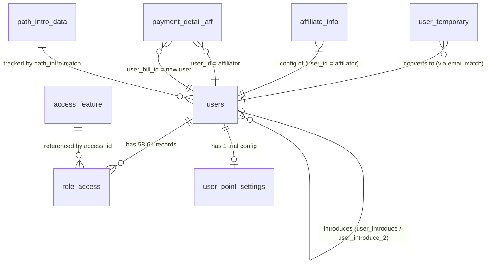

# [FA-039] Đăng ký tài khoản LME — Feature Spec

> File này là **spec tổng hợp cuối cùng** dành cho PM / tester / dev khi tái triển khai tính năng. Các chi tiết kỹ thuật sâu được tham chiếu đến các file con: `ui/ui-spec.md`, `web/api-spec.md`, `web/logic-spec.md`, `db/db-mapping.md`, `_internal/validation-report.md`.

---

## 1. Tổng quan

| Thuộc tính | Giá trị |
|-----------|---------|
| **Mã tính năng** | `FA-039` |
| **Tên tính năng** | Đăng ký tài khoản LME |
| **Tên JP** | 「アカウント登録」 (Public 新規アカウント登録) |
| **Portal** | Admin (truy cập trước khi đăng nhập — public) |
| **Entry URL** | `/register_user` (trực tiếp) hoặc button 「新規登録」 từ `/` (login page) |
| **Alias URL** | `/register_user_v2`, `/register_user/{user_id}` (affiliate link), `/register_user_v2/{user_id}` |
| **Actor chính** | User mới (public, chưa có tài khoản) — **không cần session đăng nhập** |
| **Phạm vi** | Wizard 3-step tạo mới 1 tài khoản Admin LINE OA (role `users.role = 0`), sinh kèm 58-61 record phân quyền (`role_access`), trial 30 ngày (`user_point_settings`), record affiliate tracking (`payment_detail_aff`) nếu có referral |
| **Không thuộc scope** | `/check-user` (recover flow qua Channel ID/Secret) — chỉ link từ trang login, **không thuộc FA-039** nhưng có mô tả phụ trong `ui-spec.md` |
| **Background job** | **KHÔNG CÓ** — tất cả mail chạy đồng bộ trong request (`MailApiService` SMTP / HTTP API), không dùng queue, không dùng Spring Boot job |
| **Mức độ tin cậy tổng thể** | **Cao** (~92%) — xác nhận từ Playwright snapshot + Laravel source + DB schema |

### Mô tả nghiệp vụ

Đây là **entry point duy nhất** để một doanh nghiệp tạo mới tài khoản LME. Luồng gồm 3 bước chính:

1. **Step 1 — Nhập email & đồng ý T&C**: User nhập email + (nếu non-production) invite code, tick đồng ý 利用規約/プライバシーポリシー. Hệ thống gửi mail xác thực chứa token 60-char (TTL 24h).
2. **Step 2 — Điền thông tin & đặt mật khẩu**: User click link trong mail → quay lại site với token → điền 名前・担当者名, 会社名・屋号, 電話番号 → đặt password (6-12 chars với 4 nhóm ký tự) → xác nhận.
3. **Step 3 — Hoàn thành**: Backend INSERT `users` (is_active=1 ngay), phân quyền 34 routes × 3 role (1/2/3), khởi tạo trial 30 ngày, gửi 3 mail thông báo. User được redirect về trang login.

Luồng được **V2 hoá** từ luồng cũ (`/register` — tạo inactive user rồi yêu cầu click link activate). Luồng legacy (EP-09, EP-10) vẫn tồn tại trong source nhưng **không được dùng bởi blade V2** hiện tại.

---

## 2. Các màn hình + Luồng xử lý end-to-end

### 2.1. Bảng tổng quan màn hình

| Mã | Tên | URL | Mô tả |
|----|-----|-----|-------|
| SCR-REG-01 | Login page — entry 「新規登録」 | `/` | Trang login public; chứa button 「新規登録」 → `/register_user` |
| SCR-REG-02 | Bước 1 — Nhập email & T&C | `/register_user` (hoặc `/register_user_v2`) | Form email + invite code (non-prod) + checkbox agree; sau submit chuyển state sang 「認証メールが送信されました」 |
| SCR-REG-03 | Bước 2a — Thông tin user | `/register_user?code={token}` (mount qua EP-12) | Form 4 field: email (readonly), username, company_name, phone_number |
| SCR-REG-04 | Bước 2b — Nhập mật khẩu | Cùng URL, state JS `typePassword=true` | Form 2 field password + toggle eye |
| SCR-REG-05 | Bước 2c — Xác nhận | Cùng URL, state JS `confirm=true` | Hiển thị readonly toàn bộ thông tin + button 「アカウント登録」 |
| SCR-REG-06 | Bước 3 — Hoàn thành | `/register/success` | Icon flag + message + button 「ログイン」 |
| SCR-CHK-01 | (Phụ) Recover qua Channel ID/Secret | `/check-user` | **Ngoài scope FA-039** — liệt kê tham chiếu |

### 2.2. Flow end-to-end mỗi màn hình

#### SCR-REG-01 — Login page với entry 「新規登録」
- **User action**: Truy cập `https://form.watermeru.com/` → Click button 「新規登録」.
- **UI**: Trang login 2 cột (login form bên trái, banner 「はじめての方はこちら」 bên phải).
- **API**: Không gọi API (chỉ navigate).
- **Navigate tới**: `/register_user` → mount SCR-REG-02.

#### SCR-REG-02 — Bước 1 (Nhập email)
- **User action**: Nhập email + (non-prod) invite code + tick checkbox 利用規約 → Click 「認証メールを送信」.
- **UI**: Form email + invite code (có điều kiện hiện theo env) + checkbox agree. Button disabled khi email rỗng / invalid / chưa tick agree.
- **API endpoint**: `POST /send_mail_register` (**EP-05**) — payload `{email, code, type, is_mobile, pathIntro, hashUserId}`.
- **Business logic** (`AuthController@sendMail` — `AuthController.php:668-741`):
  1. Validate `email` (required|email|unique:users,email), `code` (required|exists:users,invite_code nếu non-prod & !resend).
  2. Sinh `$token = Str::random(60)`.
  3. `UserTemporary::where('email', ...)->first()` → nếu đã có → UPDATE (`code`, `is_mobile`, `created_at`, `path_intro`); nếu chưa có → CREATE (BR-04 anti-spam: tính `diffInMinutes` giữa `updated_at` cũ và now, chỉ chuyển kênh `reSendMailRedirectRegist` khi `> 1 phút`).
  4. Gửi mail xác thực: `MailApiService::sendMailApi` (template `emails.redirect_regist`) hoặc fallback `ActiveAccount::reSendMailRedirectRegist` (Gmail SMTP `RESEND_MAIL_*`).
- **DB tables**: INSERT/UPDATE `user_temporary`.
- **Response**: `200 {message, sendMail: true}` hoặc `422 {errors:{email|code: [...]}`.
- **UI update**: `sendMail=true` → ẩn form-step-1, hiện block `.line-send-mail` với icon `fa-paper-plane` + message 「認証メールが送信されました」.

#### (Bridge — user click link trong mail) — EP-12 GET `/redirect-regist/{token}`
- **Logic** (`AuthController@redirectRegist` — `AuthController.php:1273-1293`):
  1. `UserTemporary::where('code', $token)->first()` → null → view `auth.active_user_error`.
  2. User đã active → view `auth.active_user_error`.
  3. Token hết 24h → view `auth.active_user_success` với `active=false`.
  4. Token hợp lệ → view `auth.register_user_v2` kèm `$userTemp`, `$uCode`, `$pathIntro` → chuyển sang SCR-REG-03 với state `currentStep=2`.

#### SCR-REG-03 — Bước 2a (Thông tin user)
- **User action**: Điền `username` (必須), `company_name`, `phone_number` (必須, 10-11 digits) → Click 「次に進む」.
- **API endpoint**: `POST /type_information` (**EP-06**) — validate-only (không ghi DB).
- **Business logic** (`AuthController@typeInformation`):
  - Rule: `username=required|string|max:255` (error msg "50文字" lệch), `company_name=required|string|max:255`, `phone_number=required|regex:/^\d{10,11}$/`.
  - **Không ghi DB** — echo lại input.
- **DB tables**: — (no-op).
- **Response**: `200 {email, username, company_name, phone_number}` → FE lưu vào `localStorage.formData`, set `typePassword=true` → chuyển SCR-REG-04.

#### SCR-REG-04 — Bước 2b (Nhập mật khẩu)
- **User action**: Nhập `password` (client validate: 6-12 chars + 4 nhóm: A-Z/a-z/0-9/ký tự đặc biệt) + `repeat_password` → Click 「登録内容の確認」.
- **API endpoint**: `POST /confirm_information` (**EP-07**) — validate-only.
- **Business logic** (`AuthController@confirmInformation`):
  - Rule **server-side chỉ check độ dài**: `password=required|between:6,12`. **KHÔNG check pattern 4-nhóm** (chỉ client check).
  - Response **echo plaintext password** (rủi ro bảo mật nhẹ, xem §9).
- **DB tables**: — (no-op).
- **Response**: `200 {password, repeat_password}` → FE lưu vào localStorage, set `confirm=true` → chuyển SCR-REG-05.

#### SCR-REG-05 — Bước 2c (Xác nhận + submit final) — **MAIN WRITE**
- **User action**: Review readonly data (email/username/company/phone/password masked) → Click 「アカウント登録」.
- **API endpoint**: `POST /register_v2` (**EP-08**) — payload `{token, email, username, company_name, phone_number, password, hashUserId, pathIntro, isMobile}`.
- **Business logic** (`AuthController@validateRegisterV2` — `AuthController.php:791-1020`): **14 bước tuần tự, KHÔNG trong transaction**:
  1. Decode `hashUserId` → `$userIdInvite` (`Hashids::decode`).
  2. Validate token: `UserTemporary::where('code', $token)->first()`; nếu null / user đã active / `created_at+24h<now` → `410 {errors:"token expired"}`.
  3. Resolve affiliate admin: `userRepository->findById($userIdInvite)` → `$admin`.
  4. Validate input: `username=required|max:50`, `password=required|between:6,13` (**lệch với EP-07**), `email=required|email|unique:users,email`.
  5. Build `$newData` cho `users`: `role=0`, password=`bcrypt()`, `admin_id`, `max_bot=env(MAX_BOT,1)`, `is_active=1`, `token_active_register=null`, `expire_datetime_active_user=null`, `ip=getClientIp()`, `user_introduce` hoặc `user_introduce_2` (BR-08), `path_intro=urldecode(...)` (có replace `https://lme.jp → https://lme.jp/sp.html` nếu `is_mobile=1`).
  6. **INSERT** `users`: `DB::table('users')->insertGetId($newData)` (bỏ qua Eloquent events — BR-18).
  7. Nếu có affiliate → **INSERT** `payment_detail_aff` với `type_bill=-1` (magic value), `bot_name=email` (magic usage), `user_id=affiliator`, `user_bill_id=new user`.
  8. **INSERT** 58-61 record `role_access` qua vòng lặp 34 route (`chatBasic`, `index.talk`, `broadcast.index`, ..., `notifySetting`): với mỗi route → lookup `AccessFeature::where('route', ?)->where('visible', 1)` → INSERT role_id=1 luôn, role_id=2 nếu không thuộc 10 routes loại trừ, role_id=3 nếu là `chatBasic`/`index.talk`/`adminSetting`.
  9. Nếu có affiliate: **UPDATE** `affiliate_info.count_user_intro++`; nếu `is_receive_notification && when_registered && emails_receive_notify` → loop gửi mail `emails.registered_user_aff`.
  10. **INSERT** `user_point_settings`: `is_trial=true`, `m_bot=1`, `require_paypal=1`, `expire_date=end-of-today + 30 days`.
  11. Gửi 3 mail đồng bộ: `sendMailActiveAccountSuccess` (welcome cho user), `sendMailConfirmUserRegisterToUser` (thông báo admin `MAIL_ADDRESS_CONFIRM_ADMIN`), `sendMailConfirmUserRegisterToUserMASP` (MASP).
  12. `countPathIntro($pathIntro)`: loop `PathIntroData`, match PARTIAL/CORRECT → UPDATE `count_user++`.
  13. Nếu `Auth::check()` → `Auth::logout()`.
  14. Response `200 {message, confirm:false, currentStep:3}`.
- **DB tables**: INSERT `users` × 1, INSERT `role_access` × 58-61, INSERT `payment_detail_aff` × (0-1), INSERT `user_point_settings` × 1, UPDATE `affiliate_info` × (0-1), UPDATE `path_intro_data` × (0-N).
- **Response**: `200 {message:"認証メールが送信されました", confirm:false, currentStep:3}` hoặc `410 {errors:"token expired"}` hoặc `422 {errors}`.
- **UI update**: Clear `localStorage.formData`, xoá cookie `u_code`, `currentStep=3` → redirect `/register/success` (SCR-REG-06).

#### SCR-REG-06 — Bước 3 (Hoàn thành)
- **User action**: Xem message hoàn thành → Click 「ログイン」.
- **API endpoint**: `GET /register/success` (**EP-11**) — render view `auth.register_user_success_v2`.
- **Navigate tới**: `route('login')` → `/` (về login).

---

## 3. Data Model

### 3.1. 8 entities chính

| # | Entity (table) | Vai trò | Thao tác trong flow |
|---|----------------|---------|---------------------|
| 1 | `users` | **Primary** — User admin LINE OA | INSERT 1 record ở EP-08 |
| 2 | `user_temporary` | **Primary** — Bảng lưu tạm email + token verify (60-char plaintext) | INSERT hoặc UPDATE ở EP-05. **KHÔNG bị DELETE** sau register (BR-21, rủi ro §9) |
| 3 | `role_access` | **Primary** — Phân quyền user mới | INSERT 58-61 record ở EP-08 (loop 34 route × 1-3 role) |
| 4 | `access_feature` | **Secondary** — Lookup table 34 route → access_id | READ only ở EP-08 |
| 5 | `payment_detail_aff` | **Primary** — Ghi nhận record affiliate khi register | INSERT 0-1 record ở EP-08 (điều kiện có `hashUserId`) |
| 6 | `user_point_settings` | **Primary** — Cấu hình trial 30 ngày | INSERT 1 record ở EP-08 |
| 7 | `affiliate_info` | **Secondary** — Config notify của affiliator | READ + UPDATE `count_user_intro++` (nếu có affiliate) ở EP-08 |
| 8 | `path_intro_data` | **Secondary** — Tracking URL referrer | READ toàn bảng + UPDATE `count_user++` (0-N record) ở EP-08 |

### 3.2. ER Diagram

### 3.3. Giải thích quan hệ

- **`user_temporary → users`**: không có FK vật lý, chỉ liên kết logic qua `email` match + `code` token verify. Sau khi INSERT `users`, `user_temporary` record **không bị DELETE** (gap Nghiêm trọng).
- **`users ← role_access → access_feature`**: quan hệ many-to-many qua `role_access` (composite: `user_id`, `role_id`, `access_id`). `role_id` là magic value 1/2/3 (không có bảng `roles` tham chiếu chéo trong register flow).
- **`users ← user_point_settings`**: 1-1 logic (1 user — 1 trial config), nhưng **không có UNIQUE constraint** trên `user_point_settings.user_id`.
- **`users ← payment_detail_aff`**: 1 record có 2 FK đến `users` — `user_id` (affiliator) và `user_bill_id` (user mới). Tạo khi `hashUserId` decode thành công.
- **`users ← affiliate_info`**: 1 affiliate config cho mỗi affiliator. READ để lấy `emails_receive_notify` + UPDATE `count_user_intro`.
- **`users ↔ users` self-reference**: `user_introduce` (nếu `admin.allow_accept_aff=1`) hoặc `user_introduce_2` (ngược lại) — chọn dựa trên BR-08.

### 3.4. Lưu ý naming convention

3 bảng **KHÔNG theo Laravel plural convention** — cần override `$table` trong Model:
- `App\UserTemporary` → `user_temporary` (không phải `user_temporaries`)
- `App\RoleAccess` → `role_access` (không phải `role_accesses`)
- `App\AccessFeature` → `access_feature` (không phải `access_features`)

---

## 4. Field Traceability Matrix

Bảng tổng hợp tất cả field chính xuất hiện trên UI và mapping tới DB.

| # | UI Element | Màn hình | DB Table.Column | Hướng (C/R/U/D) | Validation | Business Rule |
|---|------------|----------|-----------------|-----------------|-----------|---------------|
| 1 | Textbox 「メールアドレス」 | SCR-REG-02 | `user_temporary.email` | C/U | `required|email|unique:users,email` (server) | BR-01 email unique |
| 2 | Textbox 「メールアドレス」 (readonly) | SCR-REG-03/05 | `user_temporary.email` → `users.email` | R → C | Lấy từ `userTemp.email`; validate lại unique ở EP-08 | BR-01 |
| 3 | Textbox 「招待コードを入力してください。」 | SCR-REG-02 | `users.invite_code` (lookup-only) | R | `exists:users,invite_code` nếu non-production & type!=resend | BR-02 invite code env-gated |
| 4 | Checkbox 「利用規約」+「プライバシーポリシー」agree | SCR-REG-02 | — (transient) | — | Bắt buộc tick (client) | Không lưu DB |
| 5 | Textbox 「名前・担当者名」 (username) | SCR-REG-03 | `users.username` | C (ở EP-08) | EP-06: `required|string|max:255` (msg "50文字" lệch); EP-08: `required|max:50` | BR inconsistency validation |
| 6 | Textbox 「会社名・屋号」 (company_name) | SCR-REG-03 | `users.company_name` | C (ở EP-08) | EP-06: `required|string|max:255`; EP-08: không validate | — |
| 7 | Textbox 「電話番号（ハイフンなし）」 | SCR-REG-03 | `users.phone_number` | C (ở EP-08) | EP-06: `required|regex:/^\d{10,11}$/`; EP-08: không validate | — |
| 8 | Textbox 「パスワード」 | SCR-REG-04 | `users.password` | C (bcrypt ở EP-08) | EP-07: `required|between:6,12`; EP-08: `required|between:6,13` (**lệch 1 char**). Client check 4 nhóm, server KHÔNG check pattern | BR-05 password |
| 9 | Textbox 「パスワード確認用」 (repeat_password) | SCR-REG-04 | — (transient) | — | Client-side compare với `password` | Không lưu DB |
| 10 | Hidden `hashUserId` (affiliate code) | All | **Không lưu** `user_temporary`; ở EP-08 decode → `users.user_introduce` hoặc `user_introduce_2`; + INSERT `payment_detail_aff` | R/C | `Hashids::decode()` | BR-08 affiliate tracking |
| 11 | Hidden `pathIntro` | SCR-REG-02 → EP-08 | `user_temporary.path_intro` → `users.path_intro` (urldecode) | C | — | BR-10 path intro tracking, BR-11 mobile URL replace |
| 12 | Hidden `is_mobile` | SCR-REG-02 → EP-08 | `user_temporary.is_mobile` → `users.is_mobile` (lấy từ userTemp, không phải request) | C | — | BR-11 |
| 13 | Backend `Str::random(60)` | (EP-05) | `user_temporary.code` | C | — | BR-03 token TTL 24h |
| 14 | Backend `generateRandomString(32)` | (EP-08) | `users.token_active_register` | C/U (override=null) | — | V2 flow luôn null (khác legacy) |
| 15 | Backend `bcrypt(password)` | (EP-08) | `users.password` | C | — | — |
| 16 | Backend `Carbon::now()` | (EP-08) | `users.created_at`, `users.updated_at` | C | — | — |
| 17 | Backend `$request->getClientIp()` | (EP-08) | `users.ip` | C | — | — |
| 18 | Backend `env('MAX_BOT',1)` | (EP-08) | `users.max_bot` | C | — | BR-07 |
| 19 | Backend `admin->admin_id` hoặc `1` | (EP-08) | `users.admin_id` | C | — | — |
| 20 | Backend fixed | (EP-08) | `users.role=0`, `users.is_active=1` | C | — | BR-09, BR-14 |
| 21 | Backend fixed | (EP-08) | `user_point_settings.is_trial=1`, `m_bot=1`, `require_paypal=1`, `expire_date=+30d end-of-day` | C | — | BR-06 |
| 22 | Backend magic | (EP-08, nếu aff) | `payment_detail_aff.type_bill=-1`, `bot_name=email` | C | — | BR-13 magic values |
| 23 | Backend loop 34 routes | (EP-08) | `role_access` (user_id, role_id ∈ {1,2,3}, access_id) | C × 58-61 | `access_feature.visible=1` | BR-09 |

---

## 5. Business Rules

Tổng hợp 20 BR từ `logic-spec.md` cộng 3 BR mới phát sinh từ validation report.

| ID | Business Rule | Mô tả | Nguồn | Mức độ |
|----|---------------|-------|-------|--------|
| BR-01 | Email phải unique trong `users` | Rule `unique:users,email` ở EP-05, EP-08. Chưa xác nhận có UNIQUE INDEX vật lý (race condition risk) | `AuthController.php:673,834` | — |
| BR-02 | Invite code chỉ bắt ở DEV/STG | `env('APP_ENV')!='production'` AND `type!='resend'` → bắt `code` exists | `AuthController.php:675-677` | — |
| BR-03 | Token verify email TTL 24h | `user_temporary.created_at + 24h` phải > now | `AuthController.php:807-813,1283` | — |
| BR-04 | Anti-spam resend mail > 1 phút | `diffInMinutes($updated_at, now) > 1` mới chuyển kênh Gmail SMTP | `AuthController.php:697-726` | — |
| BR-05 | Password 6-12 chars (client), lệch giữa EP-07/EP-08 | Client 6-12 + 4 nhóm; Server EP-07 `between:6,12`, EP-08 `between:6,13`; server KHÔNG check pattern | `AuthController.php:772,833` | — |
| BR-06 | Trial 30 ngày mặc định | `expire_date = Carbon::createFromTimestamp(strtotime('+30 days', strtotime(Y-m-d 23:59:59)))` | `AuthController.php:991-997` | — |
| BR-07 | Max bot = `env('MAX_BOT',1)` | User mới giới hạn số bot theo env | `AuthController.php:873,1114` | — |
| BR-08 | Affiliate: `user_introduce` vs `user_introduce_2` | Nếu `admin.allow_accept_aff==1` → `user_introduce`, ngược lại → `user_introduce_2` | `AuthController.php:861-865` | — |
| BR-09 | Role mặc định 0; 3 cấp `role_access` | `users.role=0`; lặp 34 route → INSERT role_id=1 (tất cả), role_id=2 (loại trừ 10 routes), role_id=3 (3 routes: chatBasic/index.talk/adminSetting) | `AuthController.php:870,902-965` | — |
| BR-10 | Path intro tracking qua `path_intro_data` | `url_type=1` PARTIAL (`Str::contains`), `url_type=2` CORRECT (equality) → `count_user++` | `AuthController.php:1022-1047` | — |
| BR-11 | Mobile → thay URL `lme.jp → lme.jp/sp.html` | Khi `userTemp.is_mobile==1` AND `pathIntro!=1` → `str_replace` | `AuthController.php:867-869` | — |
| BR-12 | Affiliate notify theo config | Nếu `affiliate_info.is_receive_notification && when_registered && !empty(emails_receive_notify)` → loop gửi mail `emails.registered_user_aff` | `AuthController.php:966-990` | — |
| BR-13 | `payment_detail_aff` magic value: `type_bill=-1`, `bot_name=email` | Đánh dấu record đăng ký mới; dùng lệch chức năng `bot_name` để lưu email | `AuthController.php:890-900` | — |
| BR-14 | V2 tạo user active ngay | `is_active=1`, `token_active_register=null`, `expire_datetime_active_user=null` | `AuthController.php:880-882` | — |
| BR-15 | Legacy: tạo user inactive + link activate 24h | `is_active=0`, `token_active_register=random(32)`, `expire_datetime_active_user=now` | `AuthController.php:1120-1122,1302-1306` | — |
| BR-16 | Logout nếu đang login khi register V2 | Chặn re-register khi đã có session | `AuthController.php:1004-1006` | — |
| BR-17 | **KHÔNG có DB transaction** | Logic INSERT/UPDATE tuần tự không wrap `DB::transaction()` — có thể để dữ liệu mồ côi | `AuthController.php:791-1020` | **Nghiêm trọng** |
| BR-18 | Dùng `DB::table('users')->insertGetId` thay Eloquent | **Bỏ qua** model events/observers/mutators trên `User` | `AuthController.php:885,1126` | Trung bình |
| BR-19 | Notify admin + MASP khi user đăng ký | 2 mail đồng bộ đến `MAIL_ADDRESS_CONFIRM_ADMIN` + `..._MASP` qua Gmail SMTP riêng | `ActiveAccount.php:173-244` | — |
| BR-20 | Welcome mail cho user khi V2 register | Template `emails.active_account_success`, subject `L Message本登録完了のお知らせ` | `ActiveAccount.php:124-135` | — |
| **BR-21** | **`user_temporary` KHÔNG được xoá sau register** | Record + token plaintext 60-char tồn tại vô thời hạn trong DB. Không có scheduled cleanup. Gap data hygiene + security | `db-mapping.md §2.2, §7.2` | **Nghiêm trọng** |
| **BR-22** | **`ActivityLog::log` bị comment out** | Register flow (V2 + legacy) **không ghi audit log** tại line 887, 1128, 1418. Không trace được khi re-implement | `logic-spec.md §Đầu ra ngoài DB` | Trung bình |
| **BR-23** | **Catch-all exception → trả 422** | `catch (\Exception $ex)` → `response()->json(['errors'=>$ex->getMessage()],422)` — ăn mọi lỗi DB/mail, cộng hưởng với BR-17 gây dữ liệu dở | `AuthController.php:~1018` | Trung bình |

---

## 6. API Endpoints

Tổng cộng **12 endpoints** (Controller: `App\Http\Controllers\AuthController`). Xem chi tiết request/response ở `web/api-spec.md`.

| Mã | Method | URL | Liên kết SCR | Mô tả ngắn |
|----|--------|-----|--------------|------------|
| EP-01 | GET | `/register_user` | SCR-REG-02 | Render wizard Step 1 (với `uCode`, `pathIntro`, `referer`) |
| EP-02 | GET | `/register_user/{user_id}` | SCR-REG-02 | Affiliate link — truyền `hashUserId` vào view |
| EP-03 | GET | `/register_user_v2` | SCR-REG-02 | Alias của EP-01 (V2) |
| EP-04 | GET | `/register_user_v2/{user_id}` | SCR-REG-02 | Alias của EP-02 (V2) |
| EP-05 | POST | `/send_mail_register` | SCR-REG-02 submit | **Gửi mail xác thực** — INSERT/UPDATE `user_temporary`, sinh token 60-char |
| EP-06 | POST | `/type_information` | SCR-REG-03 submit | Validate thông tin user (**không ghi DB**) |
| EP-07 | POST | `/confirm_information` | SCR-REG-04 submit | Validate password (**không ghi DB**) — echo plaintext password (rủi ro) |
| EP-08 | POST | `/register_v2` | SCR-REG-05 submit | **MAIN WRITE** — INSERT `users` + `role_access` + `payment_detail_aff` + `user_point_settings`, UPDATE `affiliate_info` + `path_intro_data`, gửi 3 mail |
| EP-09 | POST | `/register` | (Legacy) | Luồng cũ — tạo user inactive + mail activate. **Không dùng ở V2 blade** |
| EP-10 | POST | `/register_user/{user_id}` | (Legacy) | Như EP-09 nhưng affiliate qua path param |
| EP-11 | GET | `/register/success` | SCR-REG-06 | Render trang hoàn thành |
| EP-12 | GET | `/redirect-regist/{token}` | Bridge từ mail | Validate token → render Step 2 với `$userTemp` |

**Middleware áp dụng**: Chỉ `NotifyChatworkRequestTimeSlow` (logging) + Laravel `web` group mặc định (session, CSRF). **KHÔNG có auth middleware** — đây là đúng (public flow).

**HTTP Status codes**: `200` (thành công), `302` (redirect — legacy EP-09/EP-10), `410 Gone` (token expired/đã active — EP-08), `422 Unprocessable Entity` (validation fail — EP-05/06/07/08).

---

## 7. Background Jobs

**KHÔNG CÓ background job** cho tính năng này.

- Tất cả mail được gửi **đồng bộ** trong request qua:
  - `MailApiService::sendMailApi()` — 2 kênh: SMTP trực tiếp (timeout 2s, qua `Swift_Mailer` + `SmtpTimeoutPlugin`) hoặc HTTP API `POST` đến `mail2026.watermeru.com/email/add-send` (timeout 30s).
  - Fallback: `MailApiService::reSendMailCommon` (Gmail SMTP qua `RESEND_MAIL_*` env).
  - Gmail SMTP riêng cho notify admin/MASP (`ADMIN_MAIL_*` env).
- Class `ActiveAccount extends Mailable` có khai báo trait `Queueable, SerializesModels` nhưng **không gọi `->queue()`/`->later()`** — chạy sync.
- **Không có** Spring Boot job nào scan DB hoặc trigger mail cho feature này (xác nhận từ `logic-spec.md §Events/Listeners/Queued Jobs`).
- **Hệ quả**: Nếu SMTP/HTTP fail, exception ném vào `validateRegisterV2` → catch-all trả 422 (BR-23), trong khi dữ liệu DB có thể đã được INSERT một phần (BR-17). **Không có retry queue**.

---

## 8. Phụ thuộc chéo (Cross-references)

### 8.1. Shared Components

| Component nghi ngờ | Trạng thái | Ghi chú |
|--------------------|-----------|---------|
| **Step Indicator / Progress Wizard (3-step)** | Lần đầu phát hiện — đã ghi `features/shared/pending-refs.md` | Các step title 「メール送信」→「アカウント登録」→「完了」 với connector. Sử dụng ở SCR-REG-02..06. Cần gặp 1 tính năng wizard khác (vd onboarding bot, setup đầu) để xác nhận → chuyển sang `SC-XXX` trong `features/shared/registry.md` |

### 8.2. Tính năng liên quan

| Mã | Tên | Quan hệ |
|----|-----|---------|
| FA-032 (dự kiến) | 新規アカウント追加 (thêm LOA cho admin đã login) | **Khác flow** — đây là thêm LOA cho admin đã đăng nhập, không phải tạo admin mới. FA-039 là upstream (user phải có admin account trước khi mới có thể thêm LOA) |
| FA-035 (dự kiến) | Quản lý nhân viên (Employees Management) | Staff được tạo bởi Admin — cũng sinh record `users` nhưng với `role=2` (STAFF) và `admin_id = parent admin`. Khác hẳn flow FA-039 (tạo `role=0`) |
| `/check-user` (flow phụ) | Recover tài khoản qua Channel ID/Secret | Không phải FA-039 — chỉ được link từ SCR-REG-01. Logic lookup bảng `bots`/`bot_services` (ngoài scope) |
| `/reset_password` | Reset password | Feature riêng — dùng cùng bảng `users` (cột `reset_token`, `reset_token_expired`, `remember_token_reset_pass`) |

### 8.3. Upstream dependencies (hệ thống ngoài)

- **Mail service**: `MailApiService` — 2 kênh: SMTP trực tiếp hoặc HTTP API `mail2026.watermeru.com`. Fallback Gmail SMTP.
- **Hashids package**: `Vinkla\Hashids\Facades\Hashids` — decode `hashUserId` thành user ID affiliate.
- **LINE OA Manager** (chỉ cho `/check-user` recover flow): user lấy Channel ID/Secret.
- **Env variables**: `APP_ENV` (BR-02), `MAX_BOT` (BR-07), `TYPE_SEND_MAIL`, `EMAIL_API_URL`, `TYPE_RESEND_TIMEOUT`, `RESEND_MAIL_*`, `ADMIN_MAIL_*`, `MAIL_ADDRESS_CONFIRM_ADMIN`, `MAIL_ADDRESS_CONFIRM_ADMIN_MASP`.

### 8.4. Bảng DB được tương tác

| Bảng | Vai trò | Thao tác |
|------|---------|----------|
| `users` | Primary | INSERT × 1 |
| `user_temporary` | Primary | INSERT/UPDATE ở EP-05 (không DELETE) |
| `role_access` | Primary | INSERT × 58-61 |
| `access_feature` | Secondary (lookup) | READ × 34 |
| `payment_detail_aff` | Primary (conditional) | INSERT × 0-1 |
| `user_point_settings` | Primary | INSERT × 1 |
| `affiliate_info` | Secondary | READ + UPDATE (conditional) |
| `path_intro_data` | Secondary | READ toàn bảng + UPDATE × 0-N |

---

## 9. Rủi ro đã biết / Gaps

Section này tổng hợp **toàn bộ rủi ro, tech debt và gap** phát hiện trong validation report. **Các mục Nghiêm trọng phải được xử lý khi re-implement**.

### 9.1. Nghiêm trọng (2 mục — user đã confirm, cần flag rõ khi tái triển khai)

#### GAP-01 [Nghiêm trọng] — KHÔNG có DB transaction bao quanh `validateRegisterV2`

- **Mô tả**: Flow EP-08 thực hiện ~5 INSERT (`users`, `payment_detail_aff`, `role_access` × 58-61, `user_point_settings`) + ~2 UPDATE (`affiliate_info`, `path_intro_data`) + 3 mail call ngoài **KHÔNG wrap trong `DB::transaction()`**.
- **Hệ quả khi lỗi**:
  - User đã INSERT `users` → email bị block ở retry (unique constraint).
  - `role_access` có thể chỉ INSERT một phần (vd 20/34 routes) → user login được nhưng thiếu quyền menu.
  - Exception catch-all (BR-23) nuốt lỗi → user nhận 422 với message exception không rõ, không hiểu đang ở state dở.
- **Nguồn**: BR-17, BR-23, `AuthController.php:791-1020`.
- **Khuyến nghị re-implement**:
  - Wrap toàn bộ bước 6-12 của `validateRegisterV2` trong `DB::transaction(function () use (...) { ... })`.
  - Đưa mail call ra ngoài transaction (`DB::afterCommit` hoặc Queue job) để tránh rollback DB khi mail fail.
  - Thêm `try/catch` rollback tường minh.

#### GAP-02 [Nghiêm trọng] — `user_temporary` KHÔNG bị DELETE sau register thành công

- **Mô tả**: Sau khi `validateRegisterV2` tạo `users` xong, record `user_temporary` **vẫn còn trong DB** với `code` (token 60-char plaintext) + `email` đã register. Không có scheduled cleanup.
- **Hệ quả**:
  - Dữ liệu rác tích lũy (mỗi resend/register đều UPDATE hoặc INSERT mới).
  - Token plaintext lưu vô thời hạn → nếu DB leak, attacker có thể thấy tất cả token đã dùng (mặc dù token đã hết hạn 24h, nhưng vẫn lộ metadata user nào đã register).
  - Race condition giữa 2 request dùng cùng token.
  - Không có `UNIQUE INDEX` trên `user_temporary.email` hoặc `code` → 2 request đồng thời có thể INSERT 2 record khác nhau.
- **Nguồn**: `db-mapping.md §2.2, §7.2`.
- **Khuyến nghị re-implement**:
  - DELETE `user_temporary` WHERE `code=$token` sau INSERT `users` thành công (trong cùng transaction).
  - Hoặc scheduled cleanup job: `DELETE FROM user_temporary WHERE created_at < NOW() - INTERVAL 24 HOUR` chạy hàng giờ.
  - Thêm UNIQUE INDEX vật lý trên `email` hoặc `code`.

### 9.2. Trung bình (6 mục)

| ID | Mô tả | Nguồn | Khuyến nghị |
|----|-------|-------|-------------|
| GAP-03 | **Lệch validation password giữa EP-07 và EP-08** | EP-07: `between:6,12`; EP-08: `between:6,13` — lệch 1 char. Có thể submit password 13 chars ở cuối dù client chặn 12 | `logic-spec.md §Inconsistency`, `api-spec.md EP-07/EP-08` | Đồng bộ về `between:6,20` hoặc chuẩn hoá dùng `Password::min/mixedCase/numbers/symbols` |
| GAP-04 | **Rule `max:255` nhưng error message "50文字"** cho username/company_name/phone_number ở EP-06 | Rule `required|string|max:255` nhưng message `50文字の名前を入力してください` → mismatch | `logic-spec.md §Inconsistency`, `api-spec.md EP-06` | Đồng bộ: hoặc sửa rule `max:50`, hoặc sửa message "255文字" |
| GAP-05 | **Client check 4 nhóm ký tự password, server KHÔNG check** | Client-side validate password pattern (A-Z, a-z, 0-9, special) nhưng server chỉ check `between:6,13` → **có thể bypass** qua curl/Postman | `logic-spec.md BR-05`, `api-spec.md EP-08` | Thêm server-side `regex:/^(?=.*[A-Z])(?=.*[a-z])(?=.*\d)(?=.*[!@#...])/.../'` hoặc Laravel `Password::mixedCase()->numbers()->symbols()` |
| GAP-06 | **`DB::table('users')->insertGetId` bỏ qua model events/observers** | Nếu `App\User` có observer (hậu kiểm UserObserver) hoặc mutator (lowercase email, trim whitespace) → bị miss. Chưa xác nhận `User` model có observer nào | `logic-spec.md BR-18`, `db-mapping.md §1` | Kiểm tra: grep `UserObserver`, `boot()`, `set*Attribute` trong `app/User.php`. Nếu có → dùng `User::create()` hoặc fire event manual |
| GAP-07 | **`ActivityLog::log` bị comment out** | Register flow (V2 + legacy) không ghi audit log (line 887, 1128, 1418) → không trace được ai register khi nào (ngoài `users.ip`, `users.created_at`) | `logic-spec.md §Đầu ra ngoài DB`, BR-22 | Re-enable `ActivityLog::log()` — lưu vào bảng `activity_logs` (đã có sẵn schema) |
| GAP-08 | **`users.is_active=1` nhưng `is_inactive=1` default** — mâu thuẫn ngữ nghĩa | V2 register set explicit `is_active=1` nhưng `is_inactive` giữ default schema `=1` → cả 2 cột cùng `=1` có nghĩa ngược nhau | `db-mapping.md §4.3, §5.2` | Override `is_inactive=0` trong `validateRegisterV2`. Kiểm tra code downstream có query theo `is_inactive` hay không |
| GAP-09 | **Password plaintext echo trong response EP-07** | Response `confirmInformation` trả `{"password":"Abc123!@","repeat_password":"Abc123!@"}` — có thể bị log ở reverse proxy/APM (New Relic, Datadog) | `api-spec.md EP-07` | Chỉ trả `{status:'ok'}`, không echo password |
| GAP-10 | **UNIQUE INDEX vật lý trên `users.email` chưa xác nhận** | Rule `unique:users,email` là Laravel-level (check-then-insert). Không có UNIQUE INDEX vật lý → 2 request đồng thời có thể cùng pass check → duplicate | `db-mapping.md §2.1` | Đọc lại `db/schema/tables/users.sql` phần `UNIQUE KEY`. Nếu không có → ADD `UNIQUE KEY users_email_unique (email)` |

### 9.3. Nhẹ (5+ mục)

| ID | Mô tả | Khuyến nghị |
|----|-------|-------------|
| NIT-01 | `user_point_settings.expire_date` tính theo timezone server, không phải timezone user | Dùng `Carbon::parse(...)->setTimezone($userTz)` khi hiển thị |
| NIT-02 | Invite code dồn vào 1 cột `users.invite_code`, không có bảng `invite_codes` riêng — khó track ai gen mã nào, khi nào | Tạo bảng `invite_codes(code, created_by, used_by, created_at, expired_at)` khi re-implement |
| NIT-03 | `MailApiService` fallback 2 kênh nhưng không có retry queue nếu cả 2 fail | Đưa gửi mail vào Laravel Queue (`ShouldQueue`) với retry 3 lần |
| NIT-04 | Sample data trong `db/data/tables/` chưa được tách từ raw dump | Chạy script Python ở `CLAUDE.md §5` để tách |
| NIT-05 | 13+ cột của `users` khi register giữ default schema (`commission_rate=40`, `is_inactive=1`, 2FA fields, v.v.) — cần confirm default phù hợp spec nghiệp vụ | Review từng default value khi re-implement, đặc biệt `is_inactive` (GAP-08) |
| NIT-06 | EP-07 error message typo double chấm `パスワードは6桁〜12桁の文字を入力してください。。` | Sửa khi re-implement |
| NIT-07 | EP-10 error message typo `メールをを入力してください。` (2 chữ を) | Sửa khi re-implement |
| NIT-08 | `payment_detail_aff.bot_name = email` — dùng lệch chức năng (cột `bot_name` nhưng lưu email) | Tạo cột `register_email` riêng hoặc gom metadata vào JSON column |
| NIT-09 | `user_temporary.path_intro` không nằm trong `$fillable` nhưng vẫn được gán qua property access | Thêm vào `$fillable` hoặc dùng `$guarded=[]` |
| NIT-10 | `role_access` không có UNIQUE composite `(user_id, role_id, access_id)` → theo lý thuyết INSERT lặp có thể trùng | Thêm UNIQUE INDEX composite khi re-implement |

### 9.4. Câu hỏi chưa trả lời

| Câu hỏi | Ưu tiên | Cách điều tra |
|---------|---------|---------------|
| Mail template `emails.redirect_regist` có nội dung gì? Link format ra sao? | Cao | Đọc `resources/views/emails/redirect_regist.blade.php` |
| Có scheduled cleanup cho `user_temporary` ở chỗ khác (vd Spring Boot job) không? | Cao | Grep `src/job/` theo keyword `user_temporary`, `UserTemporary`, `userTemp`, `token` |
| `App\User` có observer/mutator nào không? | Cao | Grep `UserObserver`, `set*Attribute`, `boot()` trong `app/User.php` + `app/Observers/` |
| UNIQUE INDEX vật lý trên `users.email` có thực sự tồn tại? | Cao | `SHOW INDEX FROM users;` hoặc đọc `db/schema/tables/users.sql` phần `KEY`/`UNIQUE KEY` |
| `access_feature.route` có INDEX không? (34 query mỗi register) | Trung bình | `SHOW INDEX FROM access_feature;` |
| reCAPTCHA có áp dụng cho trang register không? | Thấp | Quan sát Playwright trên trang `/register_user` thực tế |
| `/check-user` flow: bảng nào lưu Channel ID/Secret? | Trung bình | Scope flow phụ — ngoài FA-039 |
| Có webhook/Slack notify khi user register thành công cho System Admin không? | Thấp | Grep `src/job/` — hiện không thấy |
| `is_mobile` được server xác định từ đâu? Middleware nào? | Thấp | Grep `is_mobile`, `getUserAgent`, middleware chứa device detection |
| Endpoint `/redirect-regist/{token}` có thể thay thế hoàn toàn cho link mail? Có còn dùng link khác không? | Trung bình | Đọc `emails.redirect_regist.blade.php` xem link format |

---

## 10. Chất lượng Spec

### 10.1. Coverage

| Thành phần | Coverage | Ghi chú |
|-----------|---------|---------|
| UI Spec | **6/6 màn hình** + 1 recovery phụ (SCR-CHK-01) | Đủ cả wizard 3-step + sub-screens Step 2a/2b/2c |
| API Spec | **12/12 endpoints** | EP-01 đến EP-12, đủ cả legacy và V2 |
| Logic Spec | **11 controller methods** (V2 + legacy + helper) + **8 models** + **20+3 BR** | BR-21, BR-22, BR-23 là 3 BR mới thêm từ validation report |
| DB Mapping | **8/8 tables, ~170+ columns** | 100% UI fields được mapped hoặc đánh dấu Transient |
| Screenshots | 4 file (`login-page`, `02-step1-fullpage`, `03-check-user-page`, `04-register-success`) | SCR-REG-03/04/05 không có screenshot thật (cần token mail) — hợp lệ |
| Validation report | 2 Nghiêm trọng + 6 Trung bình + 5 Nhẹ + 2 Thông tin = 15 mục | Đã tổng hợp vào §9 |

### 10.2. Confidence Distribution

| Mức độ | % | Phần nào |
|--------|---|----------|
| **Cao** | ~92% | SCR-REG-01, 02, 06 (Playwright snapshot thật); toàn bộ API/Logic spec (đọc trực tiếp Laravel source với file:line); 8/8 DB tables (schema thật) |
| **Trung bình** | ~8% | SCR-REG-03, 04, 05 (chỉ từ blade template, không chạy được Playwright vì cần token mail thật); một số enum value `role_id` 1/2/3 suy luận từ điều kiện code; `created_at` của `user_point_settings` (suy luận) |
| **Thấp** | 0% | — |

### 10.3. Validation Status

- **Kết luận validation**: **CẦN SỬA** (do phát hiện 2 issues Nghiêm trọng về code quality — **không phải lỗi spec**).
- **User đã confirm**: Tiếp tục với `spec-compiler`, flag 2 Nghiêm trọng trong mục "Rủi ro đã biết" (§9.1).
- **Đã flag**: GAP-01 (DB transaction), GAP-02 (user_temporary cleanup) — xem §9.1.

### 10.4. Files tham chiếu

| File | Nội dung |
|------|---------|
| `ui/ui-spec.md` | UI chi tiết: 6 màn hình + recovery, layout, form fields, action buttons, user flows, mermaid diagrams |
| `ui/screenshots/` | 4 screenshot: `login-page.png`, `02-step1-fullpage.png`, `03-check-user-page.png`, `04-register-success.png` |
| `web/api-spec.md` | 12 endpoints: request/response schema, validation rules, error codes, middleware |
| `web/logic-spec.md` | 11 controller methods, 8 models, 20 business rules, mailer services, validation inconsistencies |
| `db/db-mapping.md` | 8 tables, ~170+ columns, ER diagram, enum values (14), magic values, UI↔DB mapping matrix |
| `_internal/db-hint.md` | Gợi ý DB từ UI parser (input cho db-mapper) |
| `_internal/validation-report.md` | Báo cáo chi tiết 15 issues: 2 Nghiêm trọng + 6 Trung bình + 5 Nhẹ + 2 Thông tin |

---

## 11. Kết luận

Tính năng **FA-039 (Đăng ký tài khoản LME)** là entry point public duy nhất để tạo tài khoản Admin LME. Flow được triển khai dạng wizard 3-step thông qua `AuthController@validateRegisterV2` (V2) với:

- **12 endpoints** public.
- **Không background job** — mail gửi đồng bộ.
- **8 bảng DB** được tương tác, trong đó 5 là Primary (có INSERT trực tiếp).
- **23 business rules** (20 gốc + 3 mới từ validation).

**Khi re-implement** cần **ưu tiên xử lý 2 GAP Nghiêm trọng**:
1. **GAP-01** — Bọc toàn bộ flow trong DB transaction.
2. **GAP-02** — DELETE/cleanup `user_temporary` sau khi register thành công.

Cùng với 8 GAP Trung bình (đặc biệt GAP-05 về password pattern server-side và GAP-10 về UNIQUE INDEX) để đảm bảo data integrity, security, và observability.

Spec đã sẵn sàng cho PM/dev/tester đọc để triển khai lại hoặc validate hệ thống hiện tại.
