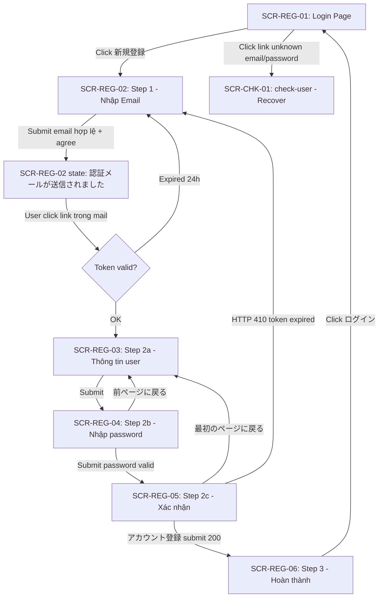
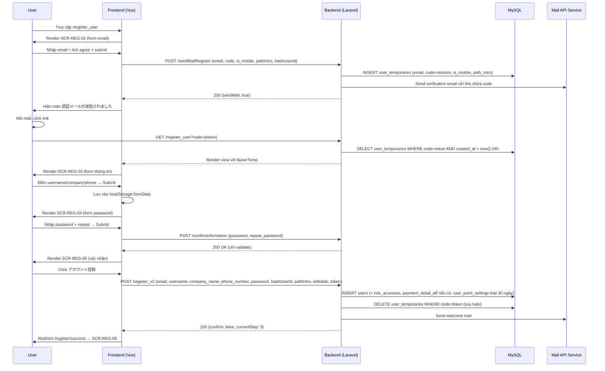

# [FA-039] Đăng ký tài khoản LME — UI Spec

## Tổng quan

- **Mã tính năng**: FA-039
- **Tên**: Đăng ký tài khoản LME
- **Tên JP**: 「アカウント登録」 (Account Registration)
- **Mô tả**: Màn hình đăng ký **public** (không cần đăng nhập), dành cho người dùng mới tạo tài khoản Admin của LME. Luồng wizard 3 bước: (1) nhập email + đồng ý T&C → nhận mail xác thực → (2) click link trong mail (có token) → điền thông tin cá nhân → đặt mật khẩu → xác nhận → (3) hoàn thành, chuyển sang trang login. Đây là entry point tạo ra `Admin` user mới trong hệ thống LME.
- **Portal**: Admin (truy cập trước khi đăng nhập)
- **URL pattern**:
  - `/register_user` (hoặc `/register`) — trang đăng ký chính (wizard 3 bước)
  - `/register/success` — trang hoàn thành (chuyển đến sau khi submit final)
  - `/` (login) — có nút 「新規登録」 dẫn đến `/register_user`
  - `/check-user` — flow phụ để recover tài khoản (xác minh bằng LINE Channel ID/Secret)

## Đối tượng sử dụng (Actors)

| Actor | Vai trò | Quyền truy cập |
|-------|---------|----------------|
| User mới (public) | Người truy cập lần đầu, chưa có tài khoản LME | Không cần đăng nhập — chỉ cần email hợp lệ (và tick đồng ý T&C). Sau khi hoàn thành sẽ trở thành Admin của 1 tài khoản LME mới |

---

## Các màn hình

Feature gồm 6 màn hình theo luồng wizard (3 step chính, bước 2 có 3 sub-screen nội bộ):

| Mã | Tên | Mô tả ngắn | Entry |
|----|-----|------------|-------|
| SCR-REG-01 | Màn login với entry point 「新規登録」 | Trang login public chứa button 「新規登録」 dẫn đến luồng đăng ký | `/` |
| SCR-REG-02 | Bước 1 — Nhập email & đồng ý T&C | Form nhập email + invite code (tuỳ env) + checkbox đồng ý T&C; sau khi submit hiển thị 「認証メールが送信されました」 | `/register_user` (hoặc `/register`), `currentStep === 1` |
| SCR-REG-03 | Bước 2a — Thông tin user | Form 4 field: email (readonly), 名前・担当者名, 会社名・屋号, 電話番号 | `/register_user?code={token}`, `currentStep === 2 && !typePassword && !confirm` |
| SCR-REG-04 | Bước 2b — Nhập mật khẩu | Form 2 field mật khẩu + toggle eye | `currentStep === 2 && typePassword` |
| SCR-REG-05 | Bước 2c — Xác nhận thông tin | Hiển thị toàn bộ thông tin readonly + button 「アカウント登録」 | `currentStep === 2 && confirm` |
| SCR-REG-06 | Bước 3 — Hoàn thành | Icon flag + message thành công + button 「ログイン」 | `/register/success`, `currentStep === 3` |

Ngoài ra: **SCR-CHK-01** (trang `/check-user`) là flow phụ để recover tài khoản (user quên email/password dùng LINE Channel ID/Secret) — mô tả ngắn ở mục User Flows.

---

### SCR-REG-01: Màn login với entry point 「新規登録」

- **URL**: `/` (form.watermeru.com)
- **Tiêu đề trang**: 「ログイン」
- **Screenshot**: `screenshots/login-page.png`
- **Mức độ tin cậy**: **Cao** (xác nhận từ snapshot playwright `01-login-page-snapshot.yml`)

#### Layout tổng thể
Trang login chia 2 phần:
- **Cột trái**: Form login (logo + fields: メールアドレス, パスワード + reCAPTCHA + button 「ログイン」 + các link forgot password / check user)
- **Cột phải (banner)**: Text 「はじめての方はこちら」 + **button 「新規登録」** + các feature highlight (ステップ配信, 自動応答, 予約管理, 商品決済)

Dưới banner là link 「全ての機能が無料からご利用いただけます」 dẫn đến landing page `https://lme.jp/`.

#### Action Buttons — liên quan đến Register

| Element | Text JP | Loại | Disabled | Hành vi |
|---------|---------|------|----------|---------|
| Button 「新規登録」 | 「新規登録」 | Button | Không | Click → điều hướng đến `/register_user` (bắt đầu luồng đăng ký) |
| Link 「こちら」 (forgot password) | 「こちら」 | Link | — | `/reset_password` |
| Link 「こちら」 (unknown email & password) | 「こちら」 | Link | — | `/check-user` (SCR-CHK-01 — recover flow) |

#### Form Fields (login form — không thuộc luồng register, chỉ tham chiếu)

| Label JP | Loại input | Required | Ghi chú |
|---------|-----------|----------|---------|
| 「メールアドレス」 | textbox | có | Email đăng nhập |
| 「パスワード」 | textbox (password) | có | Mật khẩu |
| reCAPTCHA 「私はロボットではありません」 | iframe checkbox | có | Chống bot |

#### Observations
- Button 「ログイン」 bị `disabled` mặc định — chỉ enable khi điền đủ email, password và tick reCAPTCHA.
- Footer chứa 4 link: 利用規約, プライバシーポリシー, 特定商取引法に基づく表記, カスタマーハラスメント対策.

---

### SCR-REG-02: Bước 1 — Nhập email & đồng ý T&C

- **URL**: `/register_user` (route name `register`)
- **Tiêu đề trang**: 「アカウント登録」 (wizard header) + 「エルメアカウントを作成しましょう」 (form title)
- **Screenshot**: `screenshots/02-step1-fullpage.png`
- **Mức độ tin cậy**: **Cao** (xác nhận từ snapshot playwright + blade lines 697-799)

#### Layout tổng thể
- **Header logo**: Logo LME (image `logo_mobile_l.jpg`) ở cột trái
- **Step indicator** (wizard 1-2-3): 3 step với connector —
  - Step 1 「メール送信」 — active khi `currentStep >= 1`; hiện số `1` khi chưa gửi mail, hiện icon `fa-check` khi `sendMail === true`
  - Step 2 「アカウント登録」 — active khi `currentStep >= 2`; hiện số `2` khi `currentStep <= 2`, hiện icon check khi `currentStep > 2`
  - Step 3 「完了」 — active khi `currentStep === 3`; luôn hiện số `3`
- **Main form** (form-step-1): hiện khi `currentStep === 1 && userTemp === null && !sendMail`
- **Form sau khi gửi mail thành công** (line-send-mail): hiện khi `currentStep === 1 && sendMail === true` (cùng màn SCR-REG-02 — chỉ đổi state hiển thị)
- **Footer text** (bottom center): 4 link 利用規約 ｜ プライバシーポリシー ｜ 特定商取引法に基づく表記 ｜ カスタマーハラスメント対策

#### Form Fields

| Label JP | Loại input | Required | Placeholder/Description | Validation | Điều kiện hiện | Ghi chú |
|---------|-----------|----------|------------------------|------------|----------------|---------|
| 「メールアドレス」 | textbox (email) | có | 「登録するメールアドレスを入力してください。」 + 「独自ドメインを利用したアドレスでメールが届かない場合フリーメールアドレスでご登録ください。」 | Regex email client-side; server: format + unique (chưa đăng ký) | Luôn hiện | Hiện icon `far fa-envelope` |
| 「招待コードを入力してください。」 (invite code) | textbox | không | 「招待コードを入力してください。」 | Chỉ validate khi non-production | Chỉ hiện khi `env('APP_ENV') != 'production'` **VÀ** `!hasEmailError` | Field tuỳ môi trường — blade line 742-753. Icon `fal fa-barcode` |
| Checkbox 「利用規約」 + 「プライバシーポリシー」 | checkbox | **bắt buộc** (phải tick) | Text: 「『利用規約』および『プライバシーポリシー』に同意する」 | Bắt buộc — error「利用規約に同意してください。」 | Ẩn khi có `errors.email` (blade line 755) | Link 利用規約 → `https://lme.jp/terms/`, プライバシーポリシー → `https://lme.jp/privacy-policy/` (target blank) |

#### Action Buttons

| Element | Text JP | Loại | Disabled | Hành vi |
|---------|---------|------|----------|---------|
| Button 「認証メールを送信」 | 「認証メールを送信」 | Submit button | `!isButtonEnabled` — disabled khi email rỗng HOẶC email invalid HOẶC chưa tick `agree` | POST `sendMailRegister` với `{ email, code, is_mobile, pathIntro, hashUserId }`. Khi thành công: `sendMail = true` → chuyển sang state 「認証メールが送信されました」 |
| Link 「ログイン」 | 「すでにご登録済みの方はログイン」 | Link | — | Click → `route('login')` tức `/` |

#### Post-submit state: Màn 「認証メールが送信されました」 (vẫn thuộc SCR-REG-02)

Sau khi submit email thành công (`sendMail === true`), form-step-1 ẩn, hiện block `.line-send-mail` (blade lines 779-799):

| Element | Text JP | Ghi chú |
|---------|---------|---------|
| Icon | `fa-paper-plane` | Icon máy bay giấy |
| Message chính | 「認証メールが送信されました」 | Tiêu đề |
| Message phụ | 「メール内のリンクより、アカウント登録へお進みください」 | Hướng dẫn |
| Message info | 「独自ドメインを利用したアドレスでメールが届かない場合はフリーメールアドレスを利用して再度メール送信を行なってください。」 | Gợi ý khi không nhận được mail |
| Button 「ログイン画面はこちら」 | Button | Click → `route('login')` → `/` |

#### Client-side validation (từ blade + JS)

- Email format: regex `/^(([^<>()[\]\\.,;:\s@"]+(\.[^<>()[\]\\.,;:\s@"]+)*)|.(".+"))@((\[[0-9]{1,3}\.[0-9]{1,3}\.[0-9]{1,3}\.[0-9]{1,3}\])|(([a-zA-Z\-0-9]+\.)+[a-zA-Z]{2,}))$/` — error message 「メールの形で入力してください。」
- Email rỗng → 「メールアドレスを入力してください。」
- Agree chưa tick → 「利用規約に同意してください。」

#### Observations
- `isMobile` flag được truyền từ server (qua `$isMobile`) và được gửi kèm trong payload sendMailRegister.
- Có 2 biến tracking: `hashUserId` (từ `$hashUserId` — có thể là referral code) và `pathIntro` (từ `$pathIntro` — có thể là UTM/referrer tracking). Được lưu vào `localStorage` trước khi POST.
- Cookie `u_code` được set khi có `$hashUserId` (giữ 1 ngày) — xoá sau khi đăng ký thành công (xem SCR-REG-05).
- Invite code (`code`) chỉ bắt buộc ở môi trường non-production → là cơ chế giới hạn đăng ký trong dev/staging.

---

### SCR-REG-03: Bước 2a — Thông tin user

- **URL**: `/register_user?code={token}` (hoặc tương tự — user click link trong mail xác thực để đến màn này)
- **Tiêu đề trang**: 「アカウント登録」
- **Điều kiện hiện**: `currentStep === 2 && !typePassword && !confirm` (và `userTemp !== null` — tức token hợp lệ, backend đã tạo `userTemp` record)
- **Mức độ tin cậy**: **Trung bình** (từ blade lines 800-840 — không chạy được playwright thật vì cần token email)

#### Layout tổng thể
- Header logo + step indicator (Step 1 đã check, Step 2 active, Step 3 chưa)
- Form 4 field (email readonly + 3 field input)
- Footer text (như SCR-REG-02)

#### Form Fields

| Label JP | Loại input | Required | Readonly | Validation (client-side) | Max length | Ghi chú |
|---------|-----------|----------|----------|-------------------------|-----------|---------|
| 「メールアドレス」 | Hiển thị text (paragraph) | — | có | — | — | Lấy từ `userTemp.email` — không cho user sửa |
| 「名前・担当者名」 (username) | textbox | **có** (必須 badge) | — | Không rỗng — error 「名前・担当者名を入力してください。」 | max:50 (suy luận từ blade comment/server rule — chưa xác nhận) | Prevent space key bằng `preventSpaces` |
| 「会社名・屋号」 (company_name) | textbox | không | — | — | — | Prevent space key ở vị trí đầu (khi empty) bằng `handleKeydown` |
| 「電話番号（ハイフンなし）」 (phone_number) | textbox | **có** (必須 badge) | — | Không rỗng + độ dài 10 hoặc 11 chữ số — error 「電話番号を入力してください。」 / 「電話番号は10もしくは11桁で入力してください」 | 10-11 digits | `handlePhoneNumberInput` — chỉ cho phép số, chặn space |

#### Action Buttons

| Element | Text JP | Loại | Hành vi |
|---------|---------|------|---------|
| Button 「次に進む」 | 「次に進む」 | Submit button | Validate client-side → nếu OK: lưu `{email, username, company_name, phone_number, status: 'typePassword'}` vào localStorage.formData → set `typePassword = true` (chuyển sang SCR-REG-04). Không gọi API (chỉ lưu local). |

#### Observations
- Khi load trang nếu `moment(userTemp.created_at).add(1, 'days') < moment()` → token hết hạn 24h → `window.location.reload()` (blade line 1154-1157 — trong `typeInformation()`).
- Trang này chỉ mount khi backend đã validate token → tạo được `userTemp` → trả về view với `$userTemp` dữ liệu.
- **Chưa xác nhận max length** của username/company_name — chỉ có thể suy luận từ server-side validation (cần kiểm tra lại ở web-analyzer).

---

### SCR-REG-04: Bước 2b — Nhập mật khẩu

- **URL**: Cùng `/register_user` nhưng state JS `typePassword === true`
- **Tiêu đề trang**: 「アカウント登録」
- **Điều kiện hiện**: `currentStep === 2 && typePassword`
- **Mức độ tin cậy**: **Trung bình** (từ blade lines 841-882 — không chạy được playwright)

#### Layout tổng thể
- Header logo + step indicator (giống SCR-REG-03)
- Label 「パスワード」 + description
- Form 2 field (password + repeat_password) với toggle eye icon
- Button 「登録内容の確認」
- Link back 「前ページに戻る」

#### Description (help text hiển thị dưới label 「パスワード」)

Text hiển thị dạng list (flex column):
- 「・英大小文字・数字・記号それぞれを最低1文字ずつ含む6~12文字」
- 「・使用可能な記号　! @ # & ( ) – [ { } ] : ; ', ? / * ~ $ ^ + = < > . _ -」

#### Form Fields

| Label JP | Loại input | Required | Toggle visibility | Validation (client-side) |
|---------|-----------|----------|-------------------|-------------------------|
| 「パスワード」 (password) | input (`type` = password/text theo toggle) | **có** (必須 badge) | Có — icon eye `sns-eyes`, class `fad fa-eye` / `fad fa-eye-slash`, chỉ hiện khi `isTyping === true` (user đã nhập) | 6-12 chars **VÀ** phải có: ≥1 chữ hoa `[A-Z]`, ≥1 chữ thường `[a-z]`, ≥1 số `[0-9]`, ≥1 ký tự đặc biệt `[!@#&()–[\]{}:;'",.?/*~$^+=<>._-]`. Error: 「英大文字・英小文字・数字・記号それぞれを最低1文字ずつ含む6~12文字のパスワードを入力してください」. Nếu rỗng → 「パスワードを入力してください。」. Prevent space bằng `preventSpaces`. |
| 「パスワード確認用」 (repeat_password) | input (`type` = password/text theo toggle riêng) | **có** (必須 badge) | Có — icon eye riêng, chỉ hiện khi `isTypingRepeat === true` | Rỗng → 「パスワードの確認を入力してください。」. Khác password → 「パスワードの確認が違います。」. Prevent space bằng `preventSpaces`. |

Toggle eye cho 2 field dùng 2 biến riêng: `showPasswordConfirm` (cho password), `showResetPassword` (cho repeat_password).

#### Action Buttons

| Element | Text JP | Loại | Hành vi |
|---------|---------|------|---------|
| Button 「登録内容の確認」 | 「登録内容の確認」 | Submit button | POST `confirmInformation` với `{password, repeat_password}` → nếu success: lưu password vào localStorage.formData (status='confirm'), `typePassword = false`, `confirm = true` → chuyển sang SCR-REG-05 |
| Link 「前ページに戻る」 | 「前ページに戻る」 | Link JS | Click → `resetConfirm()`: `typePassword = false`, xoá password + repeat_password, cập nhật localStorage.formData.status = 'sendMail' → quay lại SCR-REG-03 |

#### Observations
- API `confirmInformation` được gọi để validate mật khẩu server-side trước khi sang màn confirm (có thể để kiểm tra password strength / blacklist / rate limit).
- Toggle eye chỉ xuất hiện khi user bắt đầu gõ (tránh hiện icon lúc field trống).

---

### SCR-REG-05: Bước 2c — Xác nhận thông tin

- **URL**: Cùng `/register_user`, state JS `confirm === true`
- **Tiêu đề trang**: 「アカウント登録」
- **Điều kiện hiện**: `currentStep === 2 && confirm`
- **Mức độ tin cậy**: **Trung bình** (từ blade lines 883-922)

#### Layout tổng thể
- Header logo + step indicator
- Hiển thị readonly toàn bộ thông tin đã nhập
- Button 「アカウント登録」 (submit final)
- Link back 「最初のページに戻る」

#### Thông tin hiển thị (readonly)

| Label JP | Giá trị | Ghi chú |
|---------|--------|---------|
| 「メールアドレス」 | `userTemp.email` | Từ Step 1 |
| 「名前・担当者名」 | `username` | Từ SCR-REG-03 |
| 「会社名・屋号」 | `company_name` | Từ SCR-REG-03 |
| 「電話番号」 | `phone_number` | Từ SCR-REG-03 |
| 「パスワード」 | Masked (`*` lặp lại = độ dài password) | Toggle eye (`showPassword`) để hiện plaintext. Icon `fad fa-eye` / `fad fa-eye-slash` |

#### Action Buttons

| Element | Text JP | Loại | Hành vi |
|---------|---------|------|---------|
| Button 「アカウント登録」 | 「アカウント登録」 | Submit button | POST `registerUserV2` với `{email, username, company_name, phone_number, password, hashUserId, pathIntro, isMobile, token: userTemp.code}` → success: clear localStorage (formData, hashUserId, pathIntro, cookie u_code), set `currentStep = 3`, redirect `/register/success` (SCR-REG-06). Error 422: alert(errors messages). Error 410 (token hết hạn): reload page. |
| Link 「最初のページに戻る」 | 「最初のページに戻る」 | Link JS | Click → `resetConfirmPassword()`: `confirm = false`, `typePassword = false`, xoá password + repeat_password, localStorage.formData.status = 'sendMail' → quay về SCR-REG-03 |

#### Observations
- Icon `btn-spinner` với class `loading` khi đang submit — chặn user click lặp lại.
- Cookie `u_code` được xoá sau khi submit thành công (blade line 1315) — tránh nhầm lẫn hashUserId cũ.
- Nếu response HTTP 410 (Gone) → token hết hạn → reload → trang sẽ reset về state mới.

---

### SCR-REG-06: Bước 3 — Hoàn thành

- **URL**: `/register/success`
- **Tiêu đề trang**: 「アカウント登録完了」
- **Điều kiện hiện**: `currentStep === 3`
- **Screenshot**: `screenshots/04-register-success.png`
- **Mức độ tin cậy**: **Cao** (xác nhận từ snapshot playwright `04-register-success-snapshot.yml` + blade lines 923-939)

#### Layout tổng thể
- Header logo (image)
- Icon `fa-flag` (cờ hoàn thành)
- Tiêu đề 「アカウント登録完了」
- 2 paragraph message
- Button 「ログイン」

#### Nội dung text

| Element | Text JP |
|---------|---------|
| Tiêu đề | 「アカウント登録完了」 |
| Message 1 | 「アカウント登録が完了しました。」 |
| Message 2 | 「ログインページよりログインしてください。」 |

#### Action Buttons

| Element | Text JP | Loại | Hành vi |
|---------|---------|------|---------|
| Button 「ログイン」 | 「ログイン」 | Button | Click → `redirectToLogin()` → `route('login')` → `/` |

#### Observations
- Step indicator vẫn hiện với cả 3 step active: step 1 check, step 2 check, step 3 hiện số `3`.
- Block có `style="display: none;"` mặc định trong blade nhưng được `v-if="currentStep === 3"` override. Trang `/register/success` có thể là 1 view riêng chỉ hiện block này (không phải state của wizard cũ).

---

### SCR-CHK-01 (phụ, liên quan): 「エルメ登録アカウントの確認」 — Recover tài khoản

- **URL**: `/check-user`
- **Tiêu đề trang**: 「エルメ登録アカウントの確認」
- **Screenshot**: `screenshots/03-check-user-page.png`
- **Mức độ tin cậy**: **Cao** (xác nhận từ snapshot `03-check-user-snapshot.yml`)
- **Quan hệ với FA-039**: Đây là flow **recover** — user đã đăng ký trước đó nhưng quên email/password, dùng LINE Channel ID + Channel Secret để xác minh. **Không thuộc luồng đăng ký mới** nhưng được link từ SCR-REG-01.

#### Layout tổng thể
Chia 2 cột:
- **Cột trái** 「操作手順」: 3 bước hướng dẫn user cách lấy Channel ID/Secret từ LINE Official Account Manager (1. Login LINE OA Manager, 2. Đến 設定 > Messaging API, 3. Nhập Channel ID/Secret)
- **Cột phải** 「エルメ登録アカウントの確認」: Form nhập Channel ID/Secret

#### Form Fields

| Label JP | Loại input | Required | Validation |
|---------|-----------|----------|------------|
| Channel ID | textbox | **có** (badge 「必須」) | Lookup trong DB |
| Channel secret | textbox | **có** (badge 「必須」) | Lookup trong DB — match với Channel ID |

#### Action Buttons

| Element | Text JP | Loại | Disabled | Hành vi |
|---------|---------|------|----------|---------|
| Button 「確認する」 | 「確認する」 | Submit | Disabled khi 2 field trống | Gửi request verify Channel ID/Secret → nếu khớp: hiện email đăng ký (cho user biết email để login hoặc reset password) |
| Link 「ログイン画面に戻る」 | 「ログイン画面に戻る」 | Link | — | `/` (về login) |

---

## Shared Components (nghi ngờ)

| Component nghi ngờ | Tên JP | Phát hiện tại | Mô tả |
|--------------------|--------|---------------|-------|
| Step Indicator / Progress Wizard | (không có JP label riêng — chỉ các step title 「メール送信」「アカウント登録」「完了」) | FA-039 SCR-REG-02 đến SCR-REG-06 | Component wizard 3-step với connector giữa các step, state active/done (số → icon check). Có thể lặp lại ở các tính năng wizard khác (setup bot lần đầu, setup chatbot, v.v.). Đã ghi vào `features/shared/pending-refs.md` — chờ phát hiện ở tính năng khác để xác nhận. |

---

## User Flows

### Happy Path (đăng ký mới thành công)

```
1. Truy cập https://form.watermeru.com/ (trang login)
2. Click button 「新規登録」 → chuyển đến /register_user (SCR-REG-02)
3. Nhập email + (nếu non-production) invite code + tick checkbox 利用規約＋プライバシーポリシー
4. Click 「認証メールを送信」 → POST sendMailRegister
   → Backend: tạo record user_temporaries với email + token code, gửi mail xác thực
   → Hiện màn 「認証メールが送信されました」
5. User mở mail → click link xác thực (chứa token)
   → Redirect về /register_user?code={token}
   → Backend validate token: tìm user_temporaries WHERE code=token AND created_at >= now()-24h
   → Nếu OK: mount trang với $userTemp (currentStep=2) → SCR-REG-03
6. Điền 名前・担当者名 (required), 会社名・屋号 (optional), 電話番号 (required, 10-11 digits)
7. Click 「次に進む」 → localStorage lưu data → chuyển sang SCR-REG-04
8. Nhập パスワード (6-12 chars, có đủ 4 loại: hoa/thường/số/ký tự đặc biệt) + パスワード確認用
9. Click 「登録内容の確認」 → POST confirmInformation → nếu OK: chuyển sang SCR-REG-05
10. Xác nhận thông tin (readonly) → Click 「アカウント登録」 → POST registerUserV2
    → Backend: INSERT vào users + tạo role access + (nếu có hashUserId) tạo payment_detail_aff + user_point_settings (trial 30 ngày) + gọi mail API (welcome mail)
    → Clear localStorage + cookie u_code
    → Redirect /register/success (SCR-REG-06)
11. Màn hoàn thành → Click 「ログイン」 → về / (login)
12. User login với email + password mới → truy cập Admin portal
```

### Error Flows

| Tình huống | Hành vi | Khôi phục |
|-----------|---------|-----------|
| Email đã tồn tại (422 unique) | SCR-REG-02: hiện error dưới field email. `hasEmailError = true` → ẩn field invite code, ẩn checkbox agree. | User đổi sang email khác hoặc click link login |
| Email format invalid (client-side) | Hiện error 「メールの形で入力してください。」 — button 「認証メールを送信」 disabled | User nhập lại email đúng format |
| Chưa tick agree | Button disabled, không submit được | Tick checkbox |
| Invite code sai (non-production) | SCR-REG-02: hiện error dưới field invite code. `hasEmailError = false` (giữ nguyên checkbox agree) | User nhập đúng invite code |
| Token hết hạn (> 24h) | SCR-REG-03: khi mount hoặc click 「次に進む」, kiểm tra `userTemp.created_at + 1 day < now` → `window.location.reload()` | User request mail mới từ SCR-REG-02 |
| Token đã active rồi | Backend trả view login kèm thông báo (suy luận — chưa xác nhận) | User login |
| Password không đủ mạnh | SCR-REG-04: hiện error 「英大文字・英小文字・数字・記号それぞれを最低1文字ずつ含む6~12文字のパスワードを入力してください」 | User nhập lại password |
| Password & confirm không khớp | SCR-REG-04: hiện error 「パスワードの確認が違います。」 | User nhập lại repeat_password |
| 電話番号 không phải 10-11 chữ số | SCR-REG-03: hiện error 「電話番号は10もしくは11桁で入力してください」 | User nhập lại |
| Submit final HTTP 422 | SCR-REG-05: `alert()` hiện toàn bộ error messages | User quay lại sửa |
| Submit final HTTP 410 (Gone — token hết hạn) | Reload page | User request mail mới |
| Quên email/password hoàn toàn | SCR-REG-01 → click link 「こちら」 (unknown email & password) → /check-user (SCR-CHK-01) → nhập Channel ID/Secret → hệ thống trả email đăng ký | |

### Recovery flow (qua Channel ID/Secret)
```
Login page → link 「メールアドレス・パスワードどちらも不明な場合はこちら」
  → /check-user (SCR-CHK-01)
  → user đọc hướng dẫn cột trái → lấy Channel ID + Channel secret từ LINE OA Manager
  → nhập vào form → click 「確認する」
  → Backend verify: tìm bot/channel khớp → trả về email đã đăng ký
  → user dùng email đó + /reset_password để đổi mật khẩu
```

---

## Flow Diagram





---

## Điểm chưa rõ / Cần điều tra

| Câu hỏi | Ưu tiên | Cách điều tra |
|---------|---------|---------------|
| Mail xác thực được trigger thế nào? Queue job hay sync? | Cao | web-analyzer: tìm `MailApiService` và service send email trong controller. job-analyzer: kiểm tra Spring Boot có job gửi mail không. |
| Logic invite code: chỉ check ở non-production? Có bảng nào lưu invite codes? | Cao | web-analyzer: tìm validation rule `code` field trong RegisterController@sendMail. db-mapper: tìm bảng `invite_codes` hoặc tương tự. |
| `pathIntro` dùng để tracking nguồn referrer thế nào? | Trung bình | web-analyzer: tìm cách backend ghi pathIntro vào DB (có thể vào `users.path_intro` hoặc bảng tracking riêng). |
| `hashUserId` có phải là affiliate code không? Liên quan `payment_detail_aff`? | Trung bình | web-analyzer: tìm logic decode `hashUserId` trong controller. db-mapper: kiểm tra bảng `payment_detail_aff` FK. |
| Max length của username và company_name? | Trung bình | web-analyzer: đọc FormRequest rule trong controller register. |
| `userTemp.code` lưu token thế nào? Có hash không? TTL 24h dùng cột nào? | Cao | db-mapper: đọc bảng `user_temporaries` schema (cột code, created_at, is_mobile, path_intro). |
| Token hết hạn xử lý: DELETE hay soft delete? | Thấp | db-mapper + web-analyzer: xem cleanup logic. |
| Trial 30 ngày: khởi tạo user_point_settings thế nào? | Trung bình | web-analyzer: đọc RegisterController@registerV2 — tìm logic tạo trial. |
| reCAPTCHA có áp dụng cho trang register không (chỉ thấy trên login)? | Thấp | Thêm step quan sát trang register trên real browser. |
| `/check-user` flow cụ thể: bảng nào lưu Channel ID/Secret để lookup? | Trung bình | db-mapper: tìm bảng `bots` hoặc `bot_services` có cột channel_id/channel_secret. |
| Có webhook/event nào trigger khi user đăng ký thành công (vd thông báo Slack cho System Admin)? | Thấp | job-analyzer: kiểm tra Spring Boot event handlers. |
| `is_mobile` được xác định ở đâu (server-side từ User-Agent)? Ảnh hưởng đến flow register thế nào? | Thấp | web-analyzer: tìm middleware phát hiện mobile. |
