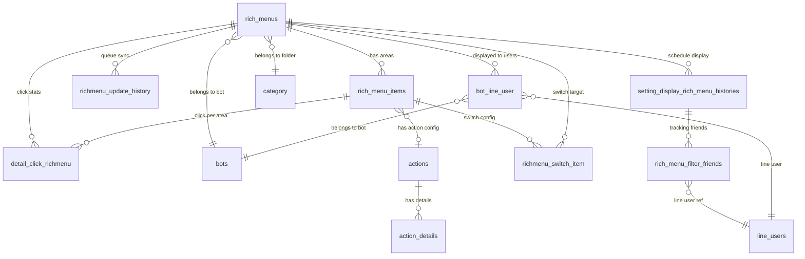

# FA-004 Rich Menu「リッチメニュー」 — DB Mapping

> Mapping giữa giao diện, API, logic với cơ sở dữ liệu.
> Nguồn: DB schema (`db/schema/`), sample data (`db/data/`), cross-reference với ui-spec, api-spec, logic-spec và job-spec.

---

## Bảng dữ liệu liên quan

### Bảng chính (Primary Tables)
| Bảng | Mô tả | Data size | Model Laravel |
|------|-------|-----------|---------------|
| `rich_menus` | Bảng chính lưu Rich Menu | 207KB | `App\RichMenus` |
| `rich_menu_items` | Vùng tap (area) của Rich Menu | 656KB | `App\RichMenuItems` |
| `category` | Folder phân loại (kind=rich_menus dùng chung) | 509KB | `App\Category` |

### Bảng phụ (Secondary / Queue / Log Tables)
| Bảng | Mô tả | Kiểu | Liên kết chính |
|------|-------|------|---------------|
| `richmenu_update_history` | Queue table — đồng bộ link/unlink Rich Menu qua LINE API | Queue | `rich_menus` |
| `setting_display_rich_menu_histories` | Queue table — đặt lịch hiển thị/dừng Rich Menu | Queue | `rich_menus` |
| `rich_menu_filter_friends` | Tracking bạn bè đã được link/unlink theo lịch hiển thị | Log | `setting_display_rich_menu_histories` |
| `richmenu_switch_item` | Config chuyển đổi Rich Menu khi tap area | Config | `rich_menus`, `rich_menu_items` |
| `detail_click_richmenu` | Log mỗi lần user tap vào area | Log | `rich_menus`, `rich_menu_items` |
| `bot_line_user` | Mapping user ↔ bot, có cột `rich_menu_id` | Reference | `rich_menus` |
| `actions` | Bảng action chung (SC-004 Friend Action) | Shared | `rich_menu_items` |
| `action_details` | Chi tiết action: type, data JSON | Shared | `actions` |
| `filter_v2` | Filter cho Rich Menu switch và action | Shared | `richmenu_switch_item` |
| `bots` | Thông tin bot (plan, token, liff) | Reference | `rich_menus` |
| `backup_history` | Kiểm tra backup đang chạy → chặn thao tác | Reference | — |

---

## Chi tiết từng bảng

### Bảng: `rich_menus`
- **Model Laravel**: `App\RichMenus`
- **SoftDeletes**: Có (`deleted_at`)
- **Timestamps**: Có (`created_at`, `updated_at`)

#### Columns
| # | Cột | Kiểu | Nullable | Default | Mô tả |
|---|-----|------|----------|---------|-------|
| 1 | `id` | int(11) | Không | AUTO_INCREMENT | Khoá chính |
| 2 | `group_id` | int(11) | Không | 0 | FK → `category.id`. 0 = folder「未分類」 |
| 3 | `bot_id` | int(11) | Có | NULL | FK → `bots.id` — bot sở hữu Rich Menu |
| 4 | `tag_id` | int(11) | Có | NULL | FK → `tags.id` (legacy, ít sử dụng) |
| 5 | `rich_menu_id` | varchar(100) | Có | NULL | LINE Rich Menu ID (dạng `richmenu-xxx`). NULL = chưa đăng ký trên LINE |
| 6 | `name` | varchar(255) | Có | NULL | Tên quản lý nội bộ (max 50 ký tự theo validation) |
| 7 | `position` | int(11) | Không | 0 | Thứ tự hiển thị trong folder |
| 8 | `time_display` | tinyint(4) | Không | 0 | Flag đặt lịch hiển thị: 0=không, 1=có |
| 9 | `open_date` | datetime | Có | NULL | Thời gian bắt đầu hiển thị (khi time_display=1) |
| 10 | `end_time_display` | tinyint(4) | Có | 0 | Flag có thời gian kết thúc: 0=không, 1=có |
| 11 | `close_date` | datetime | Có | NULL | Thời gian kết thúc hiển thị |
| 12 | `chat_bar_name` | varchar(100) | Có | NULL | (legacy, không rõ vai trò) |
| 13 | `title_menu` | varchar(100) | Có | NULL | Text hiển thị trên menu bar LINE (max 14 ký tự) |
| 14 | `default_menu` | tinyint(1) | Có | NULL | (legacy flag) |
| 15 | `model` | varchar(100) | Có | NULL | Kiểu Rich Menu: `"image"`, `"icon"`, `"default"` |
| 16 | `size` | varchar(100) | Có | NULL | Chuỗi mô tả kích thước: `"2500 x 1686"`, `"2500 x 843"` |
| 17 | `width` | int(11) | Có | NULL | Chiều rộng ảnh (px) |
| 18 | `height` | int(11) | Có | NULL | Chiều cao ảnh (px) |
| 19 | `layout` | varchar(100) | Có | NULL | Layout name: `"image_1"`, `"image_4"`, ... |
| 20 | `layout_type` | int(11) | Có | NULL | Số template layout |
| 21 | `url_image` | varchar(255) | Có | NULL | Đường dẫn ảnh Rich Menu trên server |
| 22 | `status` | tinyint(1) | Có | NULL | Trạng thái hiển thị ban đầu khi mở chat: 0=ẩn, 1=hiện |
| 23 | `status_line` | int(11) | Không | 0 | Là Rich Menu mặc định: 0=không, 1=mặc định |
| 24 | `status_rich` | int(11) | Không | 1 | Trạng thái active: 0=inactive, 1=active |
| 25 | `status_link` | int(11) | Có | 0 | Trạng thái link: 0=chưa link, 1=đang link, 2=đã unlink |
| 26 | `created_at` | datetime | Có | NULL | Ngày tạo |
| 27 | `updated_at` | timestamp | Không | CURRENT_TIMESTAMP | Ngày cập nhật |
| 28 | `is_updated` | tinyint(4) | Không | 0 | Mã thao tác gần nhất: 2=ẩn, 3=đặt mặc định, 4=gỡ mặc định |
| 29 | `queue_richmenu_id` | varchar(64) | Có | NULL | Rich Menu ID đang trong queue xử lý |
| 30 | `count_user_rich` | int(11) | Có | 0 | Cache số user đang hiển thị Rich Menu này |
| 31 | `status_updated` | int(11) | Có | 0 | State machine cho time-based display job: 0=không update, 1-3=đang xử lý |
| 32 | `deleted_at` | timestamp | Có | NULL | Thời gian soft delete |
| 33 | `template_type` | tinyint(4) | Có | 8 | Loại template layout (1-9) |
| 34 | `user_id_del` | int(11) | Có | NULL | User đã xoá Rich Menu |
| 35 | `step_active` | tinyint(4) | Có | 1 | Bước workflow hiện tại: 1=ảnh, 2=area, 3=action, 4=hoàn thành |
| 36 | `display_end_date_old_data` | tinyint(4) | Có | 0 | Flag data cũ (migration) |
| 37 | `layout_updated` | timestamp | Có | NULL | Thời gian cập nhật layout |

#### Sample Data
| id | group_id | bot_id | name | rich_menu_id | status | status_line | status_link | step_active | template_type | width | height |
|----|----------|--------|------|-------------|--------|-------------|-------------|-------------|---------------|-------|--------|
| 73 | 0 | 14 | Tiêu đề Menu 01 (12h55- 13h05) | richmenu-b008... | 0 | 0 | 0 | 1 | 8 | 2500 | 843 |
| 102 | 0 | 13 | メニュー001 | richmenu-5fe0... | 1 | 0 | 2 | 1 | 8 | 2500 | 843 |
| 103 | 0 | 13 | メニュー002 | richmenu-0612... | 1 | 0 | 2 | 1 | 8 | 2500 | 1686 |

---

### Bảng: `rich_menu_items`
- **Model Laravel**: `App\RichMenuItems`
- **SoftDeletes**: Có (`deleted_at`)

#### Columns
| # | Cột | Kiểu | Nullable | Default | Mô tả |
|---|-----|------|----------|---------|-------|
| 1 | `id` | int(11) | Không | AUTO_INCREMENT | Khoá chính |
| 2 | `rich_id` | int(11) | Có | NULL | FK → `rich_menus.id` |
| 3 | `bot_id` | int(11) | Có | NULL | FK → `bots.id` |
| 4 | `tag_id` | int(11) | Có | NULL | FK → `tags.id` (khi action = gắn tag) |
| 5 | `template_id` | int(11) | Có | NULL | FK → template (khi action = mở template) |
| 6 | `form_answer_id` | int(11) | Có | NULL | FK → `form_answers.id` (khi action = mở form) |
| 7 | `add_rich_id` | int(11) | Không | 0 | (legacy) |
| 8 | `action_type` | varchar(100) | Có | NULL | Loại action: `TEXT`, `URL`, `EMAIL`, `TEL`, `RICH` |
| 9 | `keyword_id` | int(11) | Có | NULL | FK → `auto_reply.id` (khi action = keyword) |
| 10 | `text_keyword` | varchar(250) | Không | '' | Từ khoá tìm kiếm |
| 11 | `url` | varchar(255) | Có | NULL | URL mở khi tap |
| 12 | `voice_over_label` | varchar(255) | Có | NULL | Label cho accessibility |
| 13 | `text` | varchar(255) | Có | NULL | Text gửi khi tap (action_type=TEXT) |
| 14 | `icon_index` | int(11) | Không | — | Index icon trong layout |
| 15 | `icon_label` | varchar(250) | Không | '' | Label icon |
| 16 | `sort` | int(11) | Có | NULL | Thứ tự area |
| 17 | `x` | int(11) | Có | NULL | Toạ độ X (đã nhân 3) |
| 18 | `y` | int(11) | Có | NULL | Toạ độ Y (đã nhân 3) |
| 19 | `width` | int(11) | Có | NULL | Chiều rộng area (đã nhân 3) |
| 20 | `height` | int(11) | Có | NULL | Chiều cao area (đã nhân 3) |
| 21 | `created_at` | datetime | Có | NULL | Ngày tạo |
| 22 | `updated_at` | timestamp | Có | CURRENT_TIMESTAMP | Ngày cập nhật |
| 23 | `action_id` | int(11) | Có | NULL | FK → `actions.id` (Friend Action / Elme Action) |
| 24 | `type_open_url` | tinyint(4) | Có | NULL | Kiểu mở URL |
| 25 | `content_open_url` | varchar(255) | Có | NULL | Nội dung URL thay thế |
| 26 | `type_bill_product` | tinyint(4) | Có | NULL | Loại trang sản phẩm (khi action = mở trang bán hàng) |
| 27 | `deleted_at` | timestamp | Có | NULL | Soft delete |
| 28 | `type_bill_item` | tinyint(4) | Có | 0 | 0=bill 1 lần, 1=bill nhiều lần |
| 29 | `show_rich_menu_action` | tinyint(4) | Có | 1 | Hiển thị action trên Rich Menu |
| 30 | `folder_id` | bigint(20) | Có | NULL | Action friend select folder |
| 31 | `cancel_page` | bigint(20) | Có | 0 | Option history/cancel page for booking |

#### Sample Data
| id | rich_id | bot_id | action_type | text | url | sort | x | y | width | height |
|----|---------|--------|-------------|------|-----|------|---|---|-------|--------|
| 137 | 73 | 14 | TEXT | Text 11 | — | 1 | NULL | NULL | NULL | NULL |
| 138 | 73 | 14 | URL | — | https://dev.tokumaga.jp/... | 2 | NULL | NULL | NULL | NULL |

---

### Bảng: `category`
- **Model Laravel**: `App\Category`
- **Dùng chung** cho nhiều tính năng, phân biệt bằng cột `kind`

#### Columns
| # | Cột | Kiểu | Nullable | Default | Mô tả |
|---|-----|------|----------|---------|-------|
| 1 | `id` | int(11) | Không | AUTO_INCREMENT | Khoá chính |
| 2 | `bot_id` | int(11) | Không | — | FK → `bots.id` |
| 3 | `kind` | int(11) | Không | — | Loại category. Rich Menu dùng kind tương ứng với `rich_menus` |
| 4 | `name` | varchar(100) | Không | — | Tên folder (max 15 ký tự theo validation) |
| 5 | `position` | int(11) | Có | NULL | Thứ tự hiển thị |
| 6 | `is_deleted` | int(11) | Có | 0 | Soft delete: 0=active, 1=deleted |
| 7 | `created_at` | timestamp | Không | CURRENT_TIMESTAMP | Ngày tạo |
| 8 | `updated_at` | timestamp | Có | NULL | Ngày cập nhật |
| 9 | `category_id_old` | int(11) | Không | -1 | ID cũ (migration) |

---

### Bảng: `richmenu_update_history`
- **Vai trò**: Queue table cho Spring Boot job `UpdateRichMenuTask`
- **Entity JPA**: `sns.line.models.linedb.entities.RichmenuUpdateHistory`

#### Columns
| # | Cột | Kiểu | Nullable | Default | Mô tả |
|---|-----|------|----------|---------|-------|
| 1 | `id` | int(10) unsigned | Không | AUTO_INCREMENT | Khoá chính |
| 2 | `bot_id` | int(11) | Không | — | FK → `bots.id` |
| 3 | `richmenu_id` | int(11) | Không | — | FK → `rich_menus.id` |
| 4 | `rich_menu_id_current` | varchar(64) | Có | NULL | LINE Rich Menu ID hiện tại (`richmenu-xxx`) |
| 5 | `rich_menu_id_old` | varchar(64) | Có | NULL | LINE Rich Menu ID cũ (cần xoá trên LINE) |
| 6 | `is_updated` | tinyint(4) | Có | NULL | Loại thao tác (xem Enum Values) |
| 7 | `status` | tinyint(4) | Không | 0 | Trạng thái xử lý (xem Enum Values) |
| 8 | `count` | int(11) | Không | 0 | Số users đã xử lý |
| 9 | `filter_display_ids` | varchar(255) | Có | NULL | IDs filter hiển thị |
| 10 | `message` | varchar(255) | Có | NULL | Thông báo lỗi (nếu có) |
| 11 | `created_at` | timestamp | Không | CURRENT_TIMESTAMP | Ngày tạo |
| 12 | `updated_at` | timestamp | Không | CURRENT_TIMESTAMP | Ngày cập nhật |

#### Sample Data
| id | bot_id | richmenu_id | rich_menu_id_current | is_updated | status | count |
|----|--------|-------------|----------------------|-----------|--------|-------|
| 1 | 0 | 9426 | richmenu-03af... | 3 | 2 | 2 |
| 2 | 0 | 9427 | richmenu-17ef... | 3 | 2 | 2 |

---

### Bảng: `setting_display_rich_menu_histories`
- **Vai trò**: Queue table cho Spring Boot job `SettingDisplayRichMenuHistoriesTask`
- **Model Laravel**: `App\SettingDisplayRichMenuHistory`
- **Entity JPA**: `sns.line.models.linedb.entities.SettingDisplayRichMenuHistories`

#### Columns
| # | Cột | Kiểu | Nullable | Default | Mô tả |
|---|-----|------|----------|---------|-------|
| 1 | `id` | int(10) unsigned | Không | AUTO_INCREMENT | Khoá chính |
| 2 | `bot_id` | int(11) | Không | — | FK → `bots.id` |
| 3 | `rich_id` | int(11) | Không | — | FK → `rich_menus.id` |
| 4 | `date_setting` | timestamp | Có | NULL | Thời điểm cần thực thi |
| 5 | `action` | tinyint(4) | Không | — | Hành động: 1=hiển thị, 2=dừng |
| 6 | `type` | tinyint(4) | Không | — | Loại: 1=ngay lập tức, 2=đặt lịch |
| 7 | `status` | tinyint(4) | Không | — | Trạng thái xử lý (xem Enum Values) |
| 8 | `filter_id` | varchar(5000) | Có | NULL | ID filter để lọc users |
| 9 | `count_friend` | int(11) | Có | 0 | Số bạn bè đã xử lý |
| 10 | `created_at` | timestamp | Có | NULL | Ngày tạo |
| 11 | `updated_at` | timestamp | Có | NULL | Ngày cập nhật |

#### Sample Data
| id | bot_id | rich_id | date_setting | action | type | status | filter_id | count_friend |
|----|--------|---------|-------------|--------|------|--------|-----------|-------------|
| 1 | 46362 | 11073 | 2025-11-14 08:43:00 | 2 | 2 | 3 | NULL | 0 |
| 2 | 46362 | 11075 | 2025-11-20 06:48:00 | 1 | 2 | 3 | 175177 | 1 |

---

### Bảng: `rich_menu_filter_friends`
- **Model Laravel**: `App\RichMenuFilterFriend`

#### Columns
| # | Cột | Kiểu | Nullable | Default | Mô tả |
|---|-----|------|----------|---------|-------|
| 1 | `id` | bigint(20) unsigned | Không | AUTO_INCREMENT | Khoá chính |
| 2 | `bot_id` | int(11) | Không | — | FK → `bots.id` |
| 3 | `rich_display_history_id` | int(11) | Không | — | FK → `setting_display_rich_menu_histories.id` |
| 4 | `line_id` | int(11) | Không | — | FK → `line_users.id` |
| 5 | `created_at` | timestamp | Có | NULL | Ngày tạo |
| 6 | `updated_at` | timestamp | Có | CURRENT_TIMESTAMP | Ngày cập nhật |

---

### Bảng: `richmenu_switch_item`
- **Model Laravel**: `App\RichMenuSwitchItem`

#### Columns
| # | Cột | Kiểu | Nullable | Default | Mô tả |
|---|-----|------|----------|---------|-------|
| 1 | `id` | int(10) unsigned | Không | AUTO_INCREMENT | Khoá chính |
| 2 | `bot_id` | bigint(20) unsigned | Không | — | FK → `bots.id` |
| 3 | `richmenu_parent_id` | int(11) | Không | — | FK → `rich_menus.id` — Rich Menu nguồn |
| 4 | `richmenu_switch_id` | int(11) | Không | — | FK → `rich_menus.id` — Rich Menu đích |
| 5 | `richmenu_item_id` | int(11) | Không | — | FK → `rich_menu_items.id` — area kích hoạt switch |
| 6 | `filter_ids` | text | Có | NULL | Danh sách filter IDs |
| 7 | `created_at` | timestamp | Có | NULL | Ngày tạo |
| 8 | `updated_at` | timestamp | Có | NULL | Ngày cập nhật |

---

### Bảng: `detail_click_richmenu`
- **Model Laravel**: `App\DetailClickRichMenu`

#### Columns
| # | Cột | Kiểu | Nullable | Default | Mô tả |
|---|-----|------|----------|---------|-------|
| 1 | `id` | int(10) unsigned | Không | AUTO_INCREMENT | Khoá chính |
| 2 | `rich_id` | int(11) | Có | NULL | FK → `rich_menus.id` |
| 3 | `rich_item_id` | int(11) | Có | NULL | FK → `rich_menu_items.id` |
| 4 | `area` | int(11) | Có | NULL | Số thứ tự area (1-based) |
| 5 | `bot_id` | int(11) | Có | NULL | FK → `bots.id` |
| 6 | `line_id` | varchar(255) | Có | NULL | LINE user ID hoặc FK |
| 7 | `time_click` | datetime | Có | NULL | Thời gian click |
| 8 | `count` | int(11) | Không | 1 | Số lần click |
| 9 | `created_at` | timestamp | Có | CURRENT_TIMESTAMP | Ngày tạo |
| 10 | `updated_at` | timestamp | Có | CURRENT_TIMESTAMP | Ngày cập nhật |

---

### Bảng: `bot_line_user` (cột liên quan Rich Menu)
- **Model Laravel**: `App\BotLineUser`
- **Lưu ý**: Bảng lớn (137.2MB), chỉ liệt kê cột liên quan

#### Cột liên quan Rich Menu
| Cột | Kiểu | Mô tả |
|-----|------|-------|
| `id` | int(11) | Khoá chính |
| `line_user_id` | int(11) | FK → `line_users.id` |
| `bot_id` | int(11) | FK → `bots.id` |
| `rich_menu_id` | int(11) | FK → `rich_menus.id` — Rich Menu đang hiển thị cho user |
| `is_blocked` | int(11) | 0=không block, khác 0=bị block. Dùng để đếm「表示中」人数 |
| `time_unlink_rich_menu` | bigint(20) | Timestamp lần unlink gần nhất |

---

## Mapping UI ↔ Database

### Màn hình SCR-RCM-01: Danh sách Rich Menu
| UI Field (JP) | Bảng.Cột | Kiểu DB | Transform | Confidence |
|--------------|----------|---------|----------|-----------|
| 「管理名」 | `rich_menus.name` | varchar(255) | Hiển thị trực tiếp | **Cao** |
| Thumbnail image | `rich_menus.url_image` | varchar(255) | Path ảnh trên server | **Cao** |
| 「設定済みアクション」 | `rich_menus.step_active` | tinyint(4) | step_active=4 → 「アクション設定済」, <4 → 「アクション未設定」 | **Cao** |
| 「作成日」 | `rich_menus.created_at` | datetime | Format: `YYYY.MM.DD` | **Cao** |
| 「最終編集日」 | `rich_menus.updated_at` | timestamp | Format: `YYYY.MM.DD` | **Cao** |
| 「表示中」人数 | COUNT(`bot_line_user`) | — | Computed: đếm `bot_line_user` WHERE `rich_menu_id=this.id AND is_blocked=0` | **Cao** |
| Folder list | `category` | — | WHERE `kind=rich_menus AND bot_id=current AND is_deleted=0`. Folder「未分類」= id 0 (virtual) | **Cao** |
| Folder name | `category.name` | varchar(100) | Hiển thị trực tiếp | **Cao** |
| Sort order | `rich_menus.position` | int(11) | Sắp xếp DESC | **Cao** |
| Folder item count | COUNT(`rich_menus`) | — | Computed: đếm `rich_menus` WHERE `group_id=folder.id` | **Cao** |

### Màn hình SCR-RCM-02: Modal tạo mới
| UI Field (JP) | Bảng.Cột | Kiểu DB | Transform | Confidence |
|--------------|----------|---------|----------|-----------|
| 「管理名」 | `rich_menus.name` | varchar(255) | Direct, max 50 chars (validation) | **Cao** |
| 「フォルダ」 | `rich_menus.group_id` | int(11) | FK → `category.id`. 0 = 「未分類」 | **Cao** |
| 「フォルダ内の一番上に追加する」 | `rich_menus.position` | int(11) | Computed: checked → max(position)+1, unchecked → min(position)-1 | **Cao** |

### Màn hình SCR-RCM-03: Edit Step 1 — 画像設定
| UI Field (JP) | Bảng.Cột | Kiểu DB | Transform | Confidence |
|--------------|----------|---------|----------|-----------|
| 「管理名」 | `rich_menus.name` | varchar(255) | Direct | **Cao** |
| 「フォルダ」 | `rich_menus.group_id` | int(11) | FK → `category.id` | **Cao** |
| Image upload | `rich_menus.url_image` | varchar(255) | Path: `/msg_template/media/images/{admin_id}/{bot_id}/rich-menu/richmenu_{bot_id}_{id}_{hash}.jpg` | **Cao** |
| Image size | `rich_menus.width` + `rich_menus.height` | int(11) | 2500x1686 (large) hoặc 2500x843 (half) | **Cao** |
| Size string | `rich_menus.size` | varchar(100) | `"2500 x 1686"` hoặc `"2500 x 843"` | **Cao** |

### Màn hình SCR-RCM-04: Edit Step 2 — タップエリア
| UI Field (JP) | Bảng.Cột | Kiểu DB | Transform | Confidence |
|--------------|----------|---------|----------|-----------|
| Template layout | `rich_menus.template_type` | tinyint(4) | 1-9 tương ứng với layout predefined + manual | **Cao** |
| Area coordinates | `rich_menu_items.x`, `y`, `width`, `height` | int(11) | Toạ độ từ frontend nhân 3 trước khi lưu | **Cao** |
| Area sort | `rich_menu_items.sort` | int(11) | Thứ tự area (1-based) | **Cao** |

### Màn hình SCR-RCM-05: Edit Step 3 — タップ時アクション
| UI Field (JP) | Bảng.Cột | Kiểu DB | Transform | Confidence |
|--------------|----------|---------|----------|-----------|
| Tab loại action | `rich_menu_items.action_type` | varchar(100) | `TEXT`=エルメ/友だち, `URL`=URL, `RICH`=リッチメニュー切替, `EMAIL`=メール, `TEL`=電話 | **Cao** |
| Elme Action → action config | `rich_menu_items.action_id` → `actions` → `action_details` | int(11) FK chain | FK → `actions.id` → `action_details` chứa chi tiết action | **Cao** |
| 「指定ページをひらく」URL | `rich_menu_items.url` | varchar(255) | URL trực tiếp hoặc LIFF URL | **Cao** |
| 「回答フォームをひらく」 | `rich_menu_items.form_answer_id` | int(11) | FK → `form_answers.id` | **Cao** |
| 「商品販売ページをひらく」 | `rich_menu_items.type_bill_product` + `type_bill_item` | tinyint(4) | Loại sản phẩm + loại billing | **Trung bình** |
| 「リッチメニュー切り替え」 | `richmenu_switch_item` | — | `richmenu_parent_id` = current, `richmenu_switch_id` = target | **Cao** |
| 「友だちアクション」 | `rich_menu_items.action_id` → `actions` → `action_details` | FK chain | Dùng chung SC-004 Friend Action system | **Cao** |
| Text message | `rich_menu_items.text` | varchar(255) | Text gửi khi action_type=TEXT | **Cao** |
| Tag gắn | `rich_menu_items.tag_id` | int(11) | FK → `tags.id` | **Cao** |
| Keyword | `rich_menu_items.keyword_id` | int(11) | FK → `auto_reply.id` | **Trung bình** |

### Màn hình SCR-RCM-06: Edit Step 4 — 詳細設定
| UI Field (JP) | Bảng.Cột | Kiểu DB | Transform | Confidence |
|--------------|----------|---------|----------|-----------|
| 「メニューバーのテキスト」 | `rich_menus.title_menu` | varchar(100) | Direct, max 14 chars | **Cao** |
| 「トーク画面の初期表示」 | `rich_menus.status` | tinyint(1) | 0=「表示しない」, 1=「表示する」 | **Cao** |

### Màn hình SCR-RCM-07: Hiển thị / Dừng Rich Menu
| UI Field (JP) | Bảng.Cột | Kiểu DB | Transform | Confidence |
|--------------|----------|---------|----------|-----------|
| 「表示する」/「停止する」 | `rich_menus.status_link` + `setting_display_rich_menu_histories.action` | int / tinyint | status_link: 1=hiển thị, 2=dừng. history.action: 1=SHOW, 2=STOP | **Cao** |
| 「すぐに表示する」/「日時を設定する」 | `setting_display_rich_menu_histories.type` | tinyint(4) | 1=ngay lập tức (date_setting=NOW), 2=đặt lịch (date_setting=指定日時) | **Cao** |
| Ngày/giờ đặt lịch | `setting_display_rich_menu_histories.date_setting` | timestamp | Thời điểm thực thi | **Cao** |
| 「全員」/「個別に選択する」 | `setting_display_rich_menu_histories.filter_id` | varchar(5000) | NULL=tất cả, có giá trị=filter ID để lọc users | **Cao** |
| 「表示中」badge + 人数 | COUNT(`bot_line_user`) | — | Computed: đếm WHERE `rich_menu_id=this.id AND is_blocked=0` | **Cao** |
| Đặt làm mặc định | `rich_menus.status_line` | int(11) | 1=mặc định. Reset tất cả khác về 0 | **Cao** |

### Màn hình SCR-RCM-08: Lịch sử hiển thị/dừng
| UI Field (JP) | Bảng.Cột | Kiểu DB | Transform | Confidence |
|--------------|----------|---------|----------|-----------|
| Rich Menu name | `setting_display_rich_menu_histories.rich_id` → `rich_menus.name` | FK | Eager load | **Cao** |
| Action type | `setting_display_rich_menu_histories.action` | tinyint(4) | 1=「表示」, 2=「停止」 | **Cao** |
| Status | `setting_display_rich_menu_histories.status` | tinyint(4) | 1=「待機中」, 2=「処理中」, 3=「完了」 | **Cao** |
| Scheduled time | `setting_display_rich_menu_histories.date_setting` | timestamp | Format datetime | **Cao** |
| Count friends | `setting_display_rich_menu_histories.count_friend` | int(11) | Số friends đã xử lý | **Cao** |

---

## Enum Values

### `rich_menus.status` — Hiển thị mặc định khi mở chat
| Giá trị DB | Ý nghĩa | Hiển thị JP |
|-----------|---------|------------|
| 0 | Ẩn mặc định | 「表示しない」 |
| 1 | Hiện mặc định | 「表示する」 |

### `rich_menus.status_line` — Là Rich Menu mặc định
| Giá trị DB | Ý nghĩa | Hiển thị JP |
|-----------|---------|------------|
| 0 | Không phải mặc định | — |
| 1 | Là mặc định cho tất cả bạn bè | 「デフォルト」 |

### `rich_menus.status_link` — Trạng thái link
| Giá trị DB | Ý nghĩa | Hiển thị JP |
|-----------|---------|------------|
| 0 | Chưa link | — |
| 1 | Đang link (hiển thị) | 「表示中」 |
| 2 | Đã unlink (dừng) | — |

### `rich_menus.step_active` — Bước workflow
| Giá trị DB | Ý nghĩa | Hiển thị JP |
|-----------|---------|------------|
| 1 | Bước upload ảnh | 「アクション未設定」 |
| 2 | Bước chọn area | 「アクション未設定」 |
| 3 | Bước cài action | 「アクション未設定」 |
| 4 | Hoàn thành | 「アクション設定済」 |

### `rich_menus.status_updated` — State machine time-based display (job)
| Giá trị DB | Ý nghĩa |
|-----------|---------|
| 0 | Không cần update |
| 1 | Cần update trước mở (before open_date) |
| 2 | Cần update trong thời gian (between open_date-close_date) |
| 3 | Cần update sau đóng (after close_date) |

### `rich_menus.is_updated` — Mã thao tác gần nhất
| Giá trị DB | Ý nghĩa |
|-----------|---------|
| 0 | Không có thao tác |
| 2 | Ẩn/dừng Rich Menu |
| 3 | Đặt làm mặc định |
| 4 | Gỡ mặc định |

### `rich_menus.template_type` — Loại template layout
| Giá trị DB | Ý nghĩa |
|-----------|---------|
| 1-7 | Template predefined cho ảnh 2500x1686 |
| 8 | Template mặc định |
| 9 | Template cho ảnh 2500x843 |

### `rich_menu_items.action_type` — Loại action
| Giá trị DB | Ý nghĩa | Tab UI JP |
|-----------|---------|----------|
| `TEXT` | Gửi text message hoặc mở LIFF (nếu có action_id) | 「エルメアクション」/「友だちアクション」 |
| `URL` | Mở URL trực tiếp | 「LINE URLスキーム」 |
| `RICH` | Chuyển đổi Rich Menu (richmenuswitch) | 「リッチメニュー切り替え」 |
| `EMAIL` | Mở email (hoặc LIFF nếu có action_id) | 「エルメアクション」 |
| `TEL` | Gọi điện | 「エルメアクション」 |

### `richmenu_update_history.is_updated` — Loại thao tác
| Giá trị DB | Hằng số | Ý nghĩa |
|-----------|---------|---------|
| 1 | UPDATED_LINK_BY_RICH_MENU | Link Rich Menu cho users đang gán nó |
| 2 | UPDATED_UNLINK_BY_RICH_MENU | Unlink, chuyển về default |
| 3 | UPDATED_LINK_ALL | Link cho tất cả friends |
| 4 | UPDATED_UNLINK_ALL | Unlink tất cả friends |
| 5 | UPDATED_DELETE_RICHMENU | Xoá Rich Menu |

### `richmenu_update_history.status` — Trạng thái xử lý
| Giá trị DB | Hằng số | Ý nghĩa |
|-----------|---------|---------|
| -1 | DRAFT | Nháp |
| 0 | STATUS_NEW | Chờ xử lý |
| 1 | STATUS_PROCESS | Đang xử lý |
| 2 | STATUS_DONE | Hoàn thành |
| 3 | STATUS_ERROR | Lỗi |
| 4 | STATUS_IGNORE | Bỏ qua |

### `setting_display_rich_menu_histories.action` — Hành động
| Giá trị DB | Hằng số | Ý nghĩa | Hiển thị JP |
|-----------|---------|---------|------------|
| 1 | ACTION_SHOW | Hiển thị Rich Menu | 「表示」 |
| 2 | ACTION_STOP | Dừng hiển thị | 「停止」 |

### `setting_display_rich_menu_histories.type` — Loại đặt lịch
| Giá trị DB | Hằng số | Ý nghĩa | Hiển thị JP |
|-----------|---------|---------|------------|
| 1 | TYPE_NOW | Ngay lập tức | 「すぐに表示する」 |
| 2 | TYPE_TIMER | Đặt lịch | 「日時を設定する」 |

### `setting_display_rich_menu_histories.status` — Trạng thái
| Giá trị DB | Hằng số | Ý nghĩa | Hiển thị JP |
|-----------|---------|---------|------------|
| 1 | STATUS_WAITING | Chờ xử lý | 「待機中」 |
| 2 | STATUS_PROCESSING | Đang xử lý | 「処理中」 |
| 3 | STATUS_DONE | Hoàn thành | 「完了」 |
| 4 | STATUS_DRAFT | Nháp | — |
| 5 | STATUS_ERROR | Lỗi | — |
| 8 | STATUS_EXPIRED_BOT | Bot hết hạn | — |

---

## Unmapped Items

| Nguồn | Item | Lý do chưa map | Gợi ý |
|-------|------|---------------|-------|
| DB | `rich_menus.tag_id` | Legacy — không thấy sử dụng rõ ràng trên UI | Có thể là tag gắn với Rich Menu (phiên bản cũ) |
| DB | `rich_menus.chat_bar_name` | Không rõ vai trò, khác với `title_menu` | Có thể là field legacy |
| DB | `rich_menus.default_menu` | Legacy flag — `status_line` đã thay thế | Phiên bản cũ dùng để đánh dấu mặc định |
| DB | `rich_menus.model` | Giá trị: `"image"`, `"icon"`, `"default"` | Kiểu hiển thị Rich Menu (legacy layout model) |
| DB | `rich_menus.layout` | Giá trị: `"image_1"`, `"image_4"`, ... | Layout name — có thể redundant với `template_type` |
| DB | `rich_menus.layout_type` | Số layout | Có thể redundant với `template_type` |
| DB | `rich_menus.count_user_rich` | Cache counter | Không hiển thị trực tiếp — UI đếm từ `bot_line_user` |
| DB | `rich_menus.queue_richmenu_id` | LINE Rich Menu ID trong queue | Dùng nội bộ cho quá trình đồng bộ |
| DB | `rich_menus.display_end_date_old_data` | Flag migration | Data cũ |
| DB | `rich_menus.layout_updated` | Timestamp | Dùng nội bộ |
| DB | `rich_menu_items.add_rich_id` | Legacy field | Không rõ vai trò |
| DB | `rich_menu_items.icon_index` | Index icon | Dùng cho layout mode `"icon"` (legacy) |
| DB | `rich_menu_items.icon_label` | Label icon | Dùng cho layout mode `"icon"` (legacy) |
| DB | `rich_menu_items.text_keyword` | Từ khoá | Có thể liên quan đến keyword matching |
| DB | `rich_menu_items.voice_over_label` | Accessibility label | Không thấy trên UI |
| DB | `rich_menu_items.show_rich_menu_action` | Flag | Có thể là toggle hiển thị action |
| DB | `rich_menu_items.cancel_page` | Option | Liên quan booking action |
| DB | `image_richmenu` (30 cột) | Bảng riêng cho image Rich Menu | Có thể là phiên bản cũ hoặc image template — 3.9MB data |

---

## ER Diagram (liên quan tính năng)



### Quan hệ chính
```
bots ──1:N──→ rich_menus ──1:N──→ rich_menu_items ──N:1──→ actions ──1:N──→ action_details
  │               │                     │
  │               │                     └──1:N──→ richmenu_switch_item ──N:1──→ rich_menus (target)
  │               │
  │               ├──N:1──→ category (folder, kind=rich_menus)
  │               ├──1:N──→ richmenu_update_history (queue → Spring Boot job)
  │               ├──1:N──→ setting_display_rich_menu_histories (schedule → job)
  │               │              └──1:N──→ rich_menu_filter_friends
  │               └──1:N──→ detail_click_richmenu (click stats)
  │
  └──1:N──→ bot_line_user (rich_menu_id → Rich Menu đang hiển thị)
```
