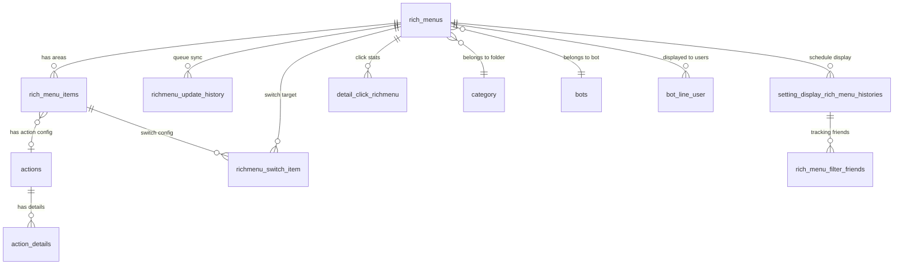
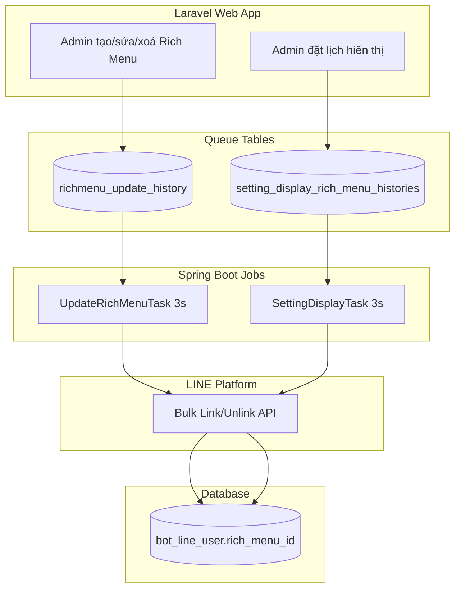

# FA-004 Rich Menu「リッチメニュー」 — Feature Spec

> **Phiên bản**: 1.0
> **Ngày tổng hợp**: 2026-03-26
> **Nguồn**: ui-spec, api-spec, logic-spec, job-spec, db-mapping, validation-report

---

## 1. Tổng quan

### Mục đích
Rich Menu là thanh menu cố định hiển thị ở cuối màn hình chat LINE, cho phép người dùng tap vào các vùng (area) để thực hiện hành động. Admin tạo, chỉnh sửa, hiển thị/dừng Rich Menu cho LINE Official Account thông qua portal quản trị.

### Actors
| Actor | Vai trò | Quyền |
|-------|---------|-------|
| Admin | Tạo, chỉnh sửa, hiển thị/dừng Rich Menu | Toàn quyền |
| Staff | Truy cập tương tự Admin | Tuỳ role — có thể bị giới hạn |
| LINE User | Xem và tương tác Rich Menu trên LINE chat | Chỉ xem, tap |
| Background Job (Spring Boot) | Link/unlink Rich Menu cho LINE users hàng loạt | Tự động |

### Phạm vi
- CRUD Rich Menu (tạo, sửa, sao chép, xoá, khôi phục)
- Quản lý folder phân loại
- Upload và cấu hình ảnh Rich Menu
- Cấu hình vùng tap (area) và action cho từng area
- Hiển thị / dừng Rich Menu cho bạn bè (ngay lập tức hoặc đặt lịch)
- Thống kê số lần tap theo area/ngày
- Đồng bộ Rich Menu với LINE Platform qua background jobs

### URL patterns
- `/basic/rich-menu` — danh sách
- `/basic/rich-menu/edit/{id}` — chỉnh sửa (4 steps)
- `/basic/rich-menu/setting-display/{id}` — hiển thị/dừng

---

## 2. Các màn hình + Luồng xử lý end-to-end

### SCR-RCM-01: Danh sách Rich Menu「リッチメニュー」

**URL**: `/basic/rich-menu`

**Layout**: Header (tiêu đề + nút「新規作成」) | Panel folder bên trái | Bảng dữ liệu trung tâm | Side panel preview bên phải | Batch actions + pagination cuối trang

#### Luồng: Xem danh sách
1. **User** mở trang `/basic/rich-menu`
2. **UI** render view `basic.rich_menu.v2.index` (EP-01 → `UserController@richMenu`)
3. **API** gọi song song:
   - `GET /ajax/folder/rich-menu` (EP-05) → lấy danh sách folder từ bảng `category` (kind=rich_menus)
   - `GET /ajax/rich-menu/list/{folderId}` (EP-04) → lấy Rich Menu theo folder, sort `position DESC`
4. **DB**: Query `rich_menus` WHERE `bot_id` + `group_id`, eager load `rich_menu_items`. Count `bot_line_user` WHERE `rich_menu_id` AND `is_blocked=0` cho cột「表示中」
5. **Response** trả về danh sách Rich Menu với: name, url_image, step_active, created_at, updated_at, count_line_user
6. **UI** render bảng với các cột: tên + thumbnail, trạng thái action, ngày tạo, ngày sửa, nút thao tác, số người đang xem

#### Bảng dữ liệu
| Cột UI | DB Source | Transform |
|--------|----------|-----------|
| 「管理名」+ thumbnail | `rich_menus.name` + `url_image` | Click → navigate edit |
| 「設定済みアクション」 | `rich_menus.step_active` | =4 → 「アクション設定済」, <4 → 「アクション未設定」 |
| 「作成日」 | `rich_menus.created_at` | Format YYYY.MM.DD |
| 「最終編集日」 | `rich_menus.updated_at` | Format YYYY.MM.DD |
| 「表示中」人数 | COUNT(`bot_line_user`) | WHERE `rich_menu_id=id AND is_blocked=0` |

#### Toolbar actions
| Action | API | Logic |
|--------|-----|-------|
| 「新規作成」 | → mở modal SCR-RCM-02 | — |
| Tìm kiếm「管理名を入力して検索」 | EP-04 `filter[keyword]` | LIKE name, bỏ qua folderId |
| 「削除したアイテム」 | EP-25, EP-26 | Query `rich_menus` onlyTrashed |
| 「並べ替え」 | EP-12 | Drag & drop → cập nhật position |
| 「操作予約・履歴」 | EP-23, EP-21 | Xem lịch sử hiển thị/dừng |

#### Batch actions
| Action | API | Side effects |
|--------|-----|-------------|
| 「一括フォルダ変更」 | EP-13 `move-folder` | Cập nhật `group_id`, giữ `updated_at` |
| 「一括削除」 | EP-15 `delete` | Soft delete `rich_menus` + `rich_menu_items`. Ghi `richmenu_update_history` (is_updated=5). Xoá `action_details`, `richmenu_switch_item`, `detail_click_richmenu`, `setting_display_rich_menu_histories` |

---

### SCR-RCM-02: Modal tạo mới「リッチメニュー 新規作成」

**URL**: `/basic/rich-menu` (modal overlay)

#### Luồng: Tạo Rich Menu mới
1. **User** click「新規作成」
2. **UI** hiển thị modal với form: 「管理名」(max 50, bắt buộc), 「フォルダ」(dropdown), checkbox「フォルダ内の一番上に追加する」
3. **User** nhập thông tin, click「リッチメニューの登録に進む」
4. **API**: `POST /ajax/rich-menu/quick-create` (EP-08) → `RichMenuController@quickAddRichMenu`
5. **Logic**:
   - Kiểm tra plan: free plan max 2 Rich Menu (BR-01)
   - Kiểm tra trùng tên trong cùng bot (BR-02)
   - Kiểm tra backup đang chạy (BR-03)
   - Tạo record `rich_menus`: `title_menu` mặc định `'◀︎ お問合せ／メニュー ▲'`, `step_active=1`
   - Position: checkbox checked → max(position)+1, unchecked → min(position)-1
6. **DB**: INSERT `rich_menus` (name, group_id, bot_id, position, step_active=1)
7. **Response**: trả về id → redirect đến `/basic/rich-menu/edit/{id}` (SCR-RCM-03)

---

### SCR-RCM-03: Edit Step 1 — Cài đặt hình ảnh「画像設定」

**URL**: `/basic/rich-menu/edit/{id}` (stepActive=1)

**Layout**: Breadcrumb | Header (tên + folder editable) | Step indicator (4 bước) | Preview mockup điện thoại bên trái | Thông tin ảnh bên phải | Footer navigation

#### Luồng: Upload ảnh Rich Menu
1. **User** click「画像を変更する」
2. **UI** mở file picker, user chọn ảnh
3. **API**: `POST /ajax/rich-menu/upload-image` (EP-09) → `RichMenuController@saveRichMenuImageUpload`
4. **Logic**:
   - Validate kích thước: chỉ 2500x1686 hoặc 2500x843
   - Validate dung lượng: max 10MB
   - Resize ảnh xuống <1MB nếu cần (nén quality giảm 5% mỗi lần, min 50%) (BR-07)
   - Lưu file vào `/msg_template/media/images/{admin_id}/{bot_id}/rich-menu/richmenu_{bot_id}_{id}_{hash}.jpg`
   - Cập nhật `step_active=2`
   - Nếu height=843 → `template_type=9`, nếu height=1686 → `template_type=1`
5. **DB**: UPDATE `rich_menus` (url_image, width, height, size, step_active, template_type)
6. **UI**: Preview cập nhật ảnh mới trên mockup điện thoại

---

### SCR-RCM-04: Edit Step 2 — Vùng tap「タップエリア」

**URL**: `/basic/rich-menu/edit/{id}` (stepActive=2)

#### Luồng: Chọn layout vùng tap
1. **User** chọn 1 trong 7 template layout predefined hoặc「手動編集」
2. **API**: EP-09 với `update_template_type=true` → cập nhật `template_type`, xoá `rich_menu_items` cũ, set `step_active=3`
3. **DB**: UPDATE `rich_menus.template_type`. DELETE `rich_menu_items` WHERE `rich_id=id`
4. **UI**: Preview overlay grid các vùng tap trên ảnh

**Lưu ý**: Template phụ thuộc kích thước ảnh (2500x1686 có nhiều template hơn 2500x843)

---

### SCR-RCM-05: Edit Step 3 — Action khi tap「タップ時アクション」

**URL**: `/basic/rich-menu/edit/{id}` (stepActive=3)

**Layout**: Preview ảnh có đánh số area bên trái | Panel cấu hình action bên phải

#### 4 tabs action cho mỗi area

| Tab | Text JP | DB mapping | Mô tả |
|-----|---------|-----------|-------|
| 1 | 「エルメアクション」 | `action_type`: TEXT/URL/EMAIL/TEL + các FK | 10 loại action: mở URL, form, đặt lịch, bán hàng, gọi điện, gửi text, gửi email... |
| 2 | 「友だちアクション」 | `action_id` → `actions` → `action_details` | **SC-004 Action Settings** — tag, step, template, remind... |
| 3 | 「リッチメニュー切り替え」 | `action_type=RICH` + `richmenu_switch_item` | Chuyển sang Rich Menu khác qua LINE alias |
| 4 | 「LINE URLスキーム」 | `action_type=URL` + `url` | Deep link LINE URL scheme |

#### Luồng: Cấu hình action cho area
1. **User** click area trên preview → panel bên phải hiển thị tabs
2. **User** chọn tab, cấu hình action
3. Mỗi area có thể kết hợp Elme Action + Friend Action cùng lúc
4. Dữ liệu được lưu khi user nhấn「保存してTOPに戻る」hoặc「次へ」

**Business rule**: Nếu không dùng Elme Action → không đếm số lần tap cho area đó

---

### SCR-RCM-06: Edit Step 4 — Cài đặt chi tiết「詳細設定」

**URL**: `/basic/rich-menu/edit/{id}` (stepActive=4)

#### Form fields
| Field JP | DB Column | Validation |
|----------|----------|-----------|
| 「メニューバーのテキスト」 | `rich_menus.title_menu` | Max 14 ký tự |
| 「トーク画面の初期表示」→「表示する」/「表示しない」 | `rich_menus.status` | 1=hiện, 0=ẩn khi mở chat |

#### Luồng: Lưu Rich Menu hoàn chỉnh
1. **User** click「保存してTOPに戻る」
2. **API**: `POST /basic/rich-menu/save` (EP-10, mới) hoặc `POST /basic/rich-menu/update` (EP-11, sửa)
3. **Logic** (EP-10/EP-11):
   - Tạo/cập nhật `rich_menus` (name, title_menu, status, size, group_id)
   - Lưu ảnh (resize nếu >1MB) (BR-07)
   - Tạo `rich_menu_items` cho mỗi area: toạ độ x/y/width/height **nhân 3** (BR-06)
   - Tạo `actions` + `action_details` cho mỗi item có Friend Action
   - **Gọi LINE API**: `POST /v2/bot/richmenu` → nhận `richMenuId`
   - **Upload ảnh lên LINE**: `POST /v2/bot/richmenu/{richMenuId}/content`
   - **Quản lý alias**: tạo/cập nhật alias `{PREFIX}-{id}` cho Rich Menu switch (BR-08)
   - Set `step_active=4`
4. **DB**: INSERT/UPDATE `rich_menus`, `rich_menu_items`, `actions`, `action_details`
5. **Response**: redirect về danh sách

**Lưu ý quan trọng**: Lưu Rich Menu **không tự động hiển thị** cho bạn bè. Cần thao tác hiển thị riêng (SCR-RCM-07).

---

### SCR-RCM-07: Hiển thị / Dừng Rich Menu「リッチメニュー表示・停止の設定」

**URL**: `/basic/rich-menu/setting-display/{id}`

#### Form fields
| # | Field JP | Options | DB Mapping |
|---|----------|---------|-----------|
| 1 | 「表示する」/「停止する」 | Toggle | `status_link`, `setting_display_rich_menu_histories.action` |
| 2 | 「表示予約」 | 「すぐに表示する」/ 「日時を設定する」 | `history.type` (1=NOW, 2=TIMER) → `date_setting` |
| 3 | 「友だちを選択」 | 「全員」/「個別に選択する」 | `type_filter` (0=all, 1=filter) → `filter_ids` |

#### Luồng: Hiển thị Rich Menu cho bạn bè
1. **User** chọn「表示する」, chọn đặt lịch, chọn đối tượng
2. **User** click「リッチメニュー表示の確認にすすむ」→ xác nhận
3. **API**: `POST /ajax/rich-menu/save-setting-display` (EP-19)
4. **Logic**:
   - Cập nhật `rich_menus.status_link=1`
   - Tạo `setting_display_rich_menu_histories`: action=SHOW(1), status=WAITING(1)
   - Type=1 (NOW): `date_setting = now()`
   - Type=2 (TIMER): `date_setting = ngày/giờ chỉ định`
5. **DB**: UPDATE `rich_menus`. INSERT `setting_display_rich_menu_histories`
6. **Background Job** (`SettingDisplayRichMenuHistoriesTask`):
   - Poll bảng `setting_display_rich_menu_histories` WHERE `date_setting <= NOW() AND status=1`
   - Lọc users theo FilterV2 (nếu có filter_id)
   - Batch 500 users → gọi LINE API `POST /v2/bot/richmenu/bulk/link`
   - Ghi `rich_menu_filter_friends` tracking
   - Cập nhật `bot_line_user.rich_menu_id`
   - Set status=DONE(3)

#### Luồng: Dừng Rich Menu
1. **User** chọn「停止する」
2. **API**: `POST /ajax/rich-menu/save-setting-stop` (EP-20)
3. **Logic**:
   - Kiểm tra không phải Rich Menu mặc định (BR-04)
   - Cập nhật `status_link=2, is_updated=2`
   - Tạo history: action=STOP(2), status=WAITING(1)
4. **Background Job**: Unlink Rich Menu khỏi users đang gán

#### Luồng: Đặt làm mặc định
- **API**: EP-32 `POST /basic/rich-menu/set-rich-menu-all-user`
- Reset tất cả `status_line=0` → set target `status_line=1, is_updated=3`
- Ghi `richmenu_update_history` (is_updated=3) → Job `UpdateRichMenuTask` link cho **tất cả** friends

---

### SCR-RCM-08: Lịch sử thao tác「操作予約・履歴」

**URL**: `/basic/rich-menu/setting-display-history`

- Hiển thị lịch sử hiển thị/dừng từ bảng `setting_display_rich_menu_histories`
- Filter theo: ngày, action (show/stop), status (waiting/processing/done)
- Hỗ trợ xoá 1 bản ghi (EP-22)

**Lưu ý**: Screenshot hiện tại không chính xác (hiển thị trang thông báo chung thay vì lịch sử Rich Menu) — mức tin cậy **Thấp** cho layout UI.

---

## 3. Data Model

### Entities chính

### Bảng chính
| Bảng | Mô tả | Records (ước lượng) |
|------|-------|---------------------|
| `rich_menus` | Bảng chính — 37 cột | 207KB |
| `rich_menu_items` | Vùng tap (area) — 31 cột | 656KB |
| `category` | Folder (kind=rich_menus) — 9 cột | 509KB (shared) |

### Bảng phụ / Queue / Log
| Bảng | Vai trò |
|------|---------|
| `richmenu_update_history` | Queue → Spring Boot job link/unlink hàng loạt |
| `setting_display_rich_menu_histories` | Queue → job đặt lịch hiển thị/dừng |
| `rich_menu_filter_friends` | Tracking users đã link/unlink theo lịch |
| `richmenu_switch_item` | Config chuyển đổi Rich Menu khi tap |
| `detail_click_richmenu` | Log tap theo area/ngày |
| `bot_line_user` | Mapping user ↔ Rich Menu đang hiển thị |
| `actions` + `action_details` | Shared — config Friend Action (SC-004) |

---

## 4. Field Traceability Matrix

| # | UI Element | Màn hình | DB Table.Column | Hướng | Validation | Business Rule |
|---|-----------|---------|----------------|-------|-----------|--------------|
| 1 | 「管理名」 | SCR-RCM-01,02,03 | `rich_menus.name` | R/W | max 50 chars, required, unique per bot | BR-02 |
| 2 | 「フォルダ」 | SCR-RCM-01,02,03 | `rich_menus.group_id` → `category.id` | R/W | integer, 0=未分類 | — |
| 3 | Folder name | SCR-RCM-01 | `category.name` | R/W | max 15 chars | — |
| 4 | 「フォルダ内の一番上に追加する」 | SCR-RCM-02 | `rich_menus.position` | W | — | Computed: top=max+1, bottom=min-1 |
| 5 | Image upload | SCR-RCM-03 | `rich_menus.url_image`, `width`, `height` | W | 2500x1686 or 2500x843, max 10MB | BR-07: resize <1MB |
| 6 | Template layout | SCR-RCM-04 | `rich_menus.template_type` | W | 1-9 | Đổi template → xoá items, step=3 |
| 7 | Area coordinates | SCR-RCM-04 | `rich_menu_items.x/y/width/height` | W | — | BR-06: nhân 3 khi lưu |
| 8 | Action type | SCR-RCM-05 | `rich_menu_items.action_type` | W | TEXT/URL/RICH/EMAIL/TEL | BR-09 |
| 9 | Friend Action | SCR-RCM-05 tab 2 | `rich_menu_items.action_id` → `actions` → `action_details` | W | — | SC-004 |
| 10 | Rich Menu switch | SCR-RCM-05 tab 3 | `richmenu_switch_item` | W | — | BR-08: qua LINE alias |
| 11 | 「メニューバーのテキスト」 | SCR-RCM-06 | `rich_menus.title_menu` | W | max 14 chars | — |
| 12 | 「トーク画面の初期表示」 | SCR-RCM-06 | `rich_menus.status` | W | 0/1 | — |
| 13 | 「設定済みアクション」badge | SCR-RCM-01 | `rich_menus.step_active` | R | — | BR-05: =4 → 設定済 |
| 14 | 「表示中」人数 | SCR-RCM-01,07 | COUNT(`bot_line_user`) | R | — | WHERE is_blocked=0 |
| 15 | 「作成日」 | SCR-RCM-01 | `rich_menus.created_at` | R | — | Format YYYY.MM.DD |
| 16 | 「最終編集日」 | SCR-RCM-01 | `rich_menus.updated_at` | R | — | Format YYYY.MM.DD |
| 17 | Hiển thị/Dừng | SCR-RCM-07 | `rich_menus.status_link` + history | W | — | BR-04, BR-11 |
| 18 | Đặt lịch | SCR-RCM-07 | `setting_display_rich_menu_histories.date_setting` | W | — | BR-11: type 1=NOW, 2=TIMER |
| 19 | Chọn đối tượng | SCR-RCM-07 | `history.filter_id` | W | — | NULL=all, value=filter |
| 20 | Mặc định | SCR-RCM-07 | `rich_menus.status_line` | W | — | BR-04: mặc định không thể dừng |
| 21 | 「回答フォームをひらく」 | SCR-RCM-05 | `rich_menu_items.form_answer_id` | W | — | FK → form_answers |
| 22 | Text message | SCR-RCM-05 | `rich_menu_items.text` | W | max 255 | action_type=TEXT |
| 23 | URL | SCR-RCM-05 | `rich_menu_items.url` | W | max 255 | — |
| 24 | History action | SCR-RCM-08 | `history.action` | R | 1=SHOW, 2=STOP | — |
| 25 | History status | SCR-RCM-08 | `history.status` | R | 1=WAITING → 3=DONE | — |

---

## 5. Business Rules

| ID | Tên | Mô tả | Source | Mức tin cậy |
|----|-----|-------|--------|-------------|
| BR-01 | Giới hạn plan | Free plan max 2 Rich Menu. Áp dụng khi tạo, copy, restore | `RichMenuService::isLimitedBotPlan()` | **Cao** |
| BR-02 | Trùng tên quản lý | Tên phải duy nhất trong cùng bot. Kiểm tra khi tạo, copy, restore, update | `RichMenuService::validateDuplicateRichMenuName()` | **Cao** |
| BR-03 | Chặn khi backup | Khi backup đang chạy (status CREATING/PENDING) → chặn tạo/sửa/xoá/sort | `RichMenuService::isRunningBackup()` | **Cao** |
| BR-04 | Mặc định không thể dừng | Rich Menu có `status_line=1` không cho phép ẩn hoặc dừng | `hideRichMenuUser`, `saveSettingStopRichmenu` | **Cao** |
| BR-05 | Step workflow | `step_active`: 1→ảnh, 2→area, 3→action, 4→hoàn thành. Upload ảnh mới → reset=2. Đổi template → reset=3, xoá items. Chỉ step_active=4 + rich_menu_id NOT NULL mới coi là hoàn chỉnh | `scopeIgnoreRichNoneSetting` | **Cao** |
| BR-06 | Toạ độ area nhân 3 | Frontend hiển thị ảnh thu nhỏ 1/3 → toạ độ nhân 3 khi lưu DB | `saveNewRichMenu:899-902` | **Cao** |
| BR-07 | Ảnh resize <1MB | LINE API yêu cầu <1MB. Upload >1MB → nén quality giảm 5%/lần đến <1MB hoặc quality<50% | `RichMenuService::resizeImage()` | **Cao** |
| BR-08 | Rich Menu alias | Mỗi Rich Menu có alias `{PREFIX}-{id}` trên LINE. Dùng cho Rich Menu switch (chuyển đổi menu khi tap) | `createRichmenuLine()` | **Cao** |
| BR-09 | Action types | RICH→richmenuswitch, TEXT→message/uri (LIFF nếu có action_id), EMAIL→uri, TEL→uri, URL→uri. Mỗi area có thể kết hợp Elme Action + Friend Action | `saveNewRichMenu:910-934` | **Cao** |
| BR-10 | Soft delete & restore | Xoá: soft delete rich_menus + items. Restore: kiểm tra trùng tên + plan → restore → gọi LINE API tạo lại | `deleteRichMenu()`, `restoreRichmenuRemove()` | **Cao** |
| BR-11 | Đặt lịch hiển thị/dừng | Type=1 (NOW): xử lý ngay. Type=2 (TIMER): xử lý khi đến date_setting. Có thể lọc đối tượng (all hoặc filter) | `handleSettingDisplayHistory()` | **Cao** |

---

## 6. API Endpoints

### Danh sách endpoints (40 endpoints)

| EP | Method | URL | Mô tả | Controller |
|----|--------|-----|-------|-----------|
| EP-01 | GET | `/basic/rich-menu` | Trang danh sách (HTML) | `UserController@richMenu` |
| EP-02 | GET | `/basic/rich-menu/edit/{id}` | Trang edit (HTML) | `UserController@editRichMenuForm` |
| EP-03 | GET | `/basic/rich-menu/create` | Trang tạo mới (HTML) | `UserController@editRichMenuForm` |
| EP-04 | GET | `/ajax/rich-menu/list/{folderId}` | Lấy danh sách theo folder | `RichMenuController@getListRichMenu` |
| EP-05 | GET | `/ajax/folder/rich-menu` | Lấy danh sách folder | `RichMenuController@getListFolderData` |
| EP-06 | POST | `/ajax/folder/rich-menu/add` | Tạo/sửa folder | `RichMenuController@addRichMenuFolder` |
| EP-07 | POST | `/ajax/folder/rich-menu/sort` | Sắp xếp folder | `RichMenuController@sortListFolderData` |
| EP-08 | POST | `/ajax/rich-menu/quick-create` | Tạo nhanh (modal) | `RichMenuController@quickAddRichMenu` |
| EP-09 | POST | `/ajax/rich-menu/upload-image` | Upload ảnh + template | `RichMenuController@saveRichMenuImageUpload` |
| EP-10 | POST | `/basic/rich-menu/save` | Lưu mới (full data) | `UserController@saveNewRichMenu` |
| EP-11 | POST | `/basic/rich-menu/update` | Cập nhật (full data) | `UserController@updateRichMenu` |
| EP-12 | POST | `/ajax/rich-menu/list/sort` | Sắp xếp Rich Menu | `RichMenuController@sortListRichMenu` |
| EP-13 | POST | `/ajax/rich-menu/move-folder` | Di chuyển folder | `RichMenuController@moveRichMenu` |
| EP-14 | POST | `/ajax/rich-menu/copy` | Sao chép Rich Menu | `RichMenuController@copyRichMenu` |
| EP-15 | POST | `/ajax/rich-menu/delete` | Xoá (soft delete) | `RichMenuController@deleteRichMenu` |
| EP-16 | POST | `/ajax/rich-menu/delete-category/{id}` | Xoá folder | `RichMenuController@deleteCategory` |
| EP-17 | GET | `/basic/rich-menu/setting-display/{id}` | Trang hiển thị/dừng (HTML) | `UserController@settingDisplayRichMenu` |
| EP-18 | POST | `/ajax/get-rich-menu/setting` | Lấy setting cho display/stop | `RichMenuController@ajaxGetRichMenuSetting` |
| EP-19 | POST | `/ajax/rich-menu/save-setting-display` | Lưu cài đặt hiển thị | `RichMenuController@saveSettingDisplayRichmenu` |
| EP-20 | POST | `/ajax/rich-menu/save-setting-stop` | Lưu cài đặt dừng | `RichMenuController@saveSettingStopRichmenu` |
| EP-21 | GET | `/ajax/rich-menu/setting-display-history` | Lấy lịch sử hiển thị/dừng | `RichMenuController@settingDisplayHistories` |
| EP-22 | DELETE | `/ajax/rich-menu/setting-display-history/{item}` | Xoá 1 bản ghi lịch sử | `RichMenuController@deleteSettingDisplayHistoryRichMenu` |
| EP-23 | GET | `/basic/rich-menu/setting-display-history` | Trang lịch sử (HTML) | `UserController@settingDisplayHistoryRichMenu` |
| EP-24 | GET | `/ajax/rich-menu/data-statistic/{richMenu}` | Thống kê tap | `RichMenuController@dataStatistic` |
| EP-25 | GET | `/basic/rich-menu/removed` | Trang đã xoá (HTML) | `RichMenuController@removed` |
| EP-26 | GET | `/ajax/rich-menu-remove` | Lấy danh sách đã xoá | `RichMenuController@initRichMenuRemoved` |
| EP-27 | POST | `/ajax/rich-menu-restore` | Khôi phục đã xoá | `RichMenuController@restoreRichmenuRemove` |
| EP-28 | POST | `/ajax/init-data-setting-action-richmenu` | Lấy action details | `UserController@ajaxInitSettingAction` |
| EP-29 | POST | `/ajax/richmenu/delete-switch-rich-menu` | Xoá switch config | `RichMenuController@deleteSwitchRichMenu` |
| EP-30 | POST | `/basic/rich-menu/display-rich-menu-user` | Hiển thị cho user (legacy) | `UserController@displayRichMenuUser` |
| EP-31 | POST | `/basic/rich-menu/hide-rich-menu-user` | Ẩn cho user (legacy) | `UserController@hideRichMenuUser` |
| EP-32 | POST | `/basic/rich-menu/set-rich-menu-all-user` | Đặt/gỡ mặc định | `UserController@setRichMenuAllUser` |
| EP-33 | POST | `/basic/rich-menu/delete-rich-all-user` | Gỡ mặc định | `UserController@deleteRichMenuAllUser` |
| EP-34 | GET | `/basic/rich-menu/filter-friend/{id}` | Xem bạn bè theo filter | `RichMenuController@filterFriend` |
| EP-35 | PUT | `/basic/v2/rich-menu/{richMenu}` | Cập nhật cơ bản (**dead code**) | `UserController@saveBasicRichMenu` |
| EP-36 | GET | `/basic/rich-menu/detail-click/{id}` | Thống kê click chi tiết (HTML) | `UserController@detailClickRichMenu` |
| EP-37 | POST | `/ajax/richmenu/copy-action-rich-item` | Copy action từ item khác | `UserController@copyActionRichItem` |
| EP-38 | POST | `/basic/rich-menu/getActionDetail` | Lấy chi tiết action | `UserController@getActionDetail` |
| EP-39 | POST | `/basic/rich-menu/delete-rich-menus` | Xoá nhiều (legacy) | `UserController@deleteRichMenus` |
| EP-40 | POST | `/basic/rich-menu/delete-group-rich-menu` | Xoá group (legacy) | `UserController@deleteGroupRichMenus` |

### LINE API calls (từ Laravel)
| API | URL | Sử dụng khi |
|-----|-----|------------|
| Tạo Rich Menu | `POST /v2/bot/richmenu` | Save, Update, Copy, Restore |
| Upload ảnh | `POST /v2/bot/richmenu/{id}/content` | Save, Update, Copy, Restore |
| Lấy alias | `GET /v2/bot/richmenu/alias/{aliasId}` | Save, Update |
| Cập nhật alias | `POST /v2/bot/richmenu/alias/{aliasId}` | Save, Update (alias tồn tại) |
| Tạo alias | `POST /v2/bot/richmenu/alias` | Save, Update (alias chưa tồn tại) |

---

## 7. Background Jobs

### Tổng quan
3 job groups xử lý đồng bộ Rich Menu với LINE Platform. Giao tiếp qua **Database Polling Model** — Laravel INSERT records, Spring Boot poll và xử lý.

### 7.1 UpdateRichMenuTask
- **Queue table**: `richmenu_update_history` (poll `status=0` mỗi 3s)
- **Workers**: 3 threads song song, concurrency control per bot (`mapBotIdRunning`)
- **Feature flag**: `ENABLE_UPDATE_RICHMENU`

| is_updated | Hành động | LINE API |
|-----------|----------|----------|
| 1 (LINK_BY_RICH_MENU) | Re-link cho users đang gán Rich Menu này | Bulk Link |
| 2 (UNLINK_BY_RICH_MENU) | Unlink, chuyển về default | Bulk Unlink + Bulk Link default |
| 3 (LINK_ALL) | Link cho **tất cả** friends | Bulk Link |
| 4 (UNLINK_ALL) | Unlink tất cả | Bulk Unlink |
| 5 (DELETE_RICHMENU) | Unlink + chuyển default + xoá trên LINE | Bulk Unlink + Delete Rich Menu |

**Batch size**: 500 users/batch. Sau xử lý: update `status=DONE(2)`, ghi `count`.

### 7.2 SettingDisplayRichMenuHistoriesTask
- **Queue table**: `setting_display_rich_menu_histories` (poll `date_setting <= NOW() AND status=1` mỗi 3s)
- **Workers**: 3 threads song song
- **Feature flag**: `ENABLE_SETTING_DISPLAY_RICHMENU`

| action | Hành động |
|--------|----------|
| 1 (SHOW) | Lọc users theo FilterV2 → Bulk Link → ghi `rich_menu_filter_friends` |
| 2 (STOP) | Tìm users đang gán → Bulk Unlink → ghi tracking |

**Khác biệt**: Hỗ trợ filter users, ghi tracking `rich_menu_filter_friends`, kiểm tra bot expired (>7 ngày → STATUS_EXPIRED_BOT=8).

### 7.3 HandleCheckTimeDisplayRichMenuTask
- **Poll trực tiếp**: bảng `rich_menus` (cột `status_updated`, `time_display`, `open_date`, `close_date`)
- **Tần suất**: 5s, batch 10 records, single thread
- **Xử lý 3 giai đoạn**: Trước mở (unlink chuẩn bị) → Trong thời gian (link) → Sau đóng (unlink + reset)
- **Lưu ý**: Link/unlink **từng user một** (không bulk). Không tìm thấy đăng ký trong `AppMain.run()` — **có thể đã bị vô hiệu hoá** (xem Gap J-1)

### LINE API calls (từ Spring Boot)
| API | Endpoint | Dùng bởi |
|-----|----------|----------|
| Bulk Link | `POST /v2/bot/richmenu/bulk/link` | UpdateRichMenuThread, SettingDisplayThread |
| Bulk Unlink | `POST /v2/bot/richmenu/bulk/unlink` | UpdateRichMenuThread, SettingDisplayThread |
| Delete Rich Menu | `DELETE /v2/bot/richmenu/{richMenuId}` | UpdateRichMenuThread |
| Link (single) | `POST /v2/bot/user/{userId}/richmenu/{richMenuId}` | HandleCheckTimeTask |
| Unlink (single) | `DELETE /v2/bot/user/{userId}/richmenu` | HandleCheckTimeTask |

### Data Flow

---

## 8. Phụ thuộc chéo (Cross-references)

### Shared Components sử dụng
| SC | Tên | Sử dụng tại | Mức tin cậy |
|----|-----|------------|-------------|
| SC-004 | Action Settings「アクション設定」 | SCR-RCM-05 Tab「友だちアクション」— cùng bộ action types (ステップ, テンプレート, テキスト, リマインド, タグ, リッチメニュー, ブックマーク, 友だち情報, 対応ステータス, ブロック) | **Cao** |
| SC-003 | Friend Filter/Segment「絞り込み」 | SCR-RCM-07 option「個別に選択する」— lọc bạn bè khi hiển thị Rich Menu | **Trung bình** (suy luận) |

### Tính năng liên quan (qua Elme Actions)
| FA | Tên | Quan hệ |
|----|-----|---------|
| FA-011 | Form Answer | Action「回答フォームをひらく」→ `form_answer_id` |
| FA-019 | Lesson Booking | Action「レッスン予約をひらく」 |
| FA-020 | Salon Booking | Action「サロン予約をひらく」 |
| FA-021 | Event Booking | Action「イベント予約をひらく」 |
| FA-025 | Conversion | Action「コンバージョン登録ページをひらく」 |
| FA-026 | Product Sales | Action「商品販売ページをひらく」→ `type_bill_product`, `type_bill_item` |

### Self-reference
- Tab「リッチメニュー切り替え」: Rich Menu A tap area → chuyển sang Rich Menu B (qua `richmenu_switch_item` + LINE alias)

---

## 9. Gaps và Unknowns

### Từ Validation Report

| # | ID | Mức độ | Mô tả | Trạng thái |
|---|-----|--------|-------|-----------|
| 1 | D-1 | **Trung bình** | Tên bảng không nhất quán: `detail_click_richmenu` (DB mapping) vs `detail_click_rich_menu` (logic spec). Cần kiểm tra schema thực tế | Mở |
| 2 | A-1 | **Trung bình** | EP-35 `saveBasicRichMenu` method rỗng — dead code nhưng route vẫn active | Ghi nhận |
| 3 | J-1 | **Trung bình** | `HandleCheckTimeDisplayRichMenuTask` không đăng ký trong `AppMain.run()` — có thể đã bị vô hiệu hoá | Cần xác nhận vận hành |

### Từ UI Spec — Điểm chưa có snapshot

| # | Nội dung | Mức độ |
|---|---------|--------|
| 4 | Tab「リッチメニュー切り替え」— chi tiết UI chọn Rich Menu đích | Trung bình |
| 5 | Tab「LINE URLスキーム」— chi tiết URL scheme hỗ trợ | Trung bình |
| 6 | 「個別に選択する」(SCR-RCM-07) — dialog chọn bạn bè, có dùng SC-003 không? | Trung bình |
| 7 | 「手動編集」vùng tap — tối đa bao nhiêu area? Resize/move tự do? | Trung bình |
| 8 | 「表示日時を設定する」— date/time picker format | Thấp |
| 9 | 「並べ替え」— drag & drop hay giao diện khác? | Thấp |
| 10 | 「削除したアイテム」— có khôi phục được không? (đã xác nhận: **Có**, EP-27) | Đã giải quyết |
| 11 | 「データ表示」(cột 表示中) — mở chi tiết gì? | Thấp |
| 12 | SCR-RCM-08 screenshot là trang thông báo chung, không phải lịch sử Rich Menu | Nhẹ |

### Từ Logic — Chưa đọc chi tiết

| # | Nội dung | Mức độ |
|---|---------|--------|
| 13 | `buildAreaRichmenu()` (~400 dòng) — chưa đọc 100% chi tiết | Nhẹ |
| 14 | Bảng `image_richmenu` (3.9MB, 30 cột) — chưa phân tích vai trò | Nhẹ |

### Error Handling (Jobs)
- LINE API call fail → log error, gửi Chatwork, **không retry**. Có thể dẫn đến Rich Menu không gán đúng cho một số users
- Bot expired >7 ngày → SettingDisplay bỏ qua (STATUS_EXPIRED_BOT=8)

---

## 10. Chất lượng Spec

### Metrics

| Tiêu chí | Kết quả |
|----------|---------|
| Số màn hình | 8 (SCR-RCM-01 → 08) |
| Số endpoints | 40 (EP-01 → EP-40) |
| Số business rules | 11 (BR-01 → BR-11) |
| Số background jobs | 3 task managers, 6 worker threads |
| DB tables covered | 11 bảng primary + secondary |
| DB columns mapped | 37 (rich_menus) + 31 (rich_menu_items) + bảng phụ |
| Enum values documented | 13 enum sets |
| Unmapped DB items | 15 items (đều legacy/internal) |

### Cross-check Results (từ Validation Report)

| Kiểm tra | Kết quả |
|----------|---------|
| Form UI → API endpoint | **12/12 đạt** ✅ |
| Endpoint → Controller | **12/12 đạt** ✅ |
| Model → Table | **9/10 đạt** ⚠️ (1 cần xác nhận tên bảng D-1) |
| DB Hint → DB Mapping | **8/8 đạt** ✅ |
| Enum Values UI ↔ DB | **7/7 đạt** ✅ |

### Confidence Distribution

| Mức tin cậy | Tỷ lệ |
|-------------|--------|
| **Cao** | ~85% — phần lớn từ source code trực tiếp |
| **Trung bình** | ~12% — suy luận từ UI + code, chưa 100% |
| **Thấp** | ~3% — chỉ quan sát UI, chưa tìm trong code/DB |

### Open Questions
1. Tên bảng thực tế: `detail_click_richmenu` hay `detail_click_rich_menu`?
2. `HandleCheckTimeDisplayRichMenuTask` có đang active trên production không?
3. EP-35 `saveBasicRichMenu` có kế hoạch implement hay dead code vĩnh viễn?

### Kết luận
**Spec ĐẠT chất lượng tốt.** Không có vấn đề nghiêm trọng. 3 vấn đề trung bình đều là cosmetic (tên bảng, dead code, task có thể bị vô hiệu hoá). Cross-reference giữa các specs rất chặt chẽ. Job spec đặc biệt chi tiết với state machines, processing chains, và data flow diagram đầy đủ.
